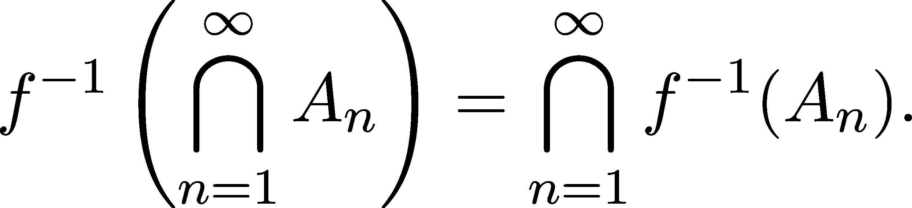
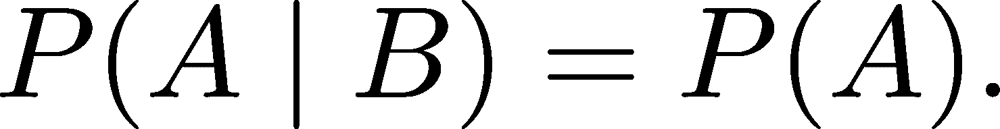
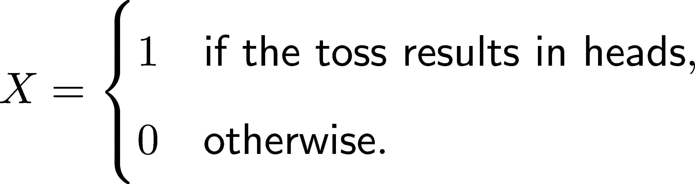
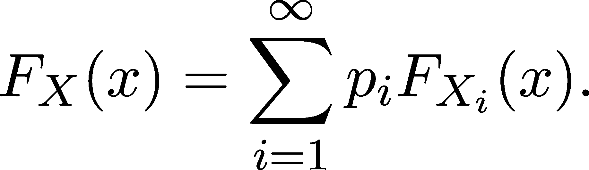

随机变量与分布

拥有一个概率空间来建模我们的实验和观察是可以的，但在几乎所有的情况下，我们关心的是结果的定量度量。举个例子，假设我们进行 n 次公正的硬币抛掷，但我们只关心正面朝上的次数。我们该如何建模这个概率空间呢？

一步步来；首先，我们通过列举所有可能的结果在一个集合中构造一个事件空间，就像我们在第 18.2.1 节已经做的那样：


由于硬币是公正的，每个结果 ω 的概率 P(ω) = 。到目前为止，这个概率空间 (Ω, Σ, P) 非常简单。利用概率度量的可加性（见定义 77），我们可以计算任何事件的概率。即，对于任何 A ∈ Σ，我们有


其中 j ⋅j 表示给定集合中的元素个数。

然而，正如前面所提到的，我们只关心正面朝上的次数。我们是否应该仅仅把这个信息纳入概率空间的某个地方？当然，我们可以这样做，但那样会把基本结果（即，正面或反面的序列）与测量结果耦合在一起，这会显著地复杂化我们的模型。

我们可以做一些更简单的事情：引入一个函数 X : Ω → ℕ，将结果映射到测量值，而不是直接使用这个概率空间来处理所需的测量。

这些函数被称为随机变量，它们是概率论和统计学的核心。通过收集数据，我们在观察随机变量；通过拟合预测模型，我们使用这些观察值来近似它们。现在我们明白了为什么需要它们，接下来我们将把这个概念数学化。

## 第二十四章：19.1 随机变量

不过，慢一点；事情并不像看起来那么简单。随机变量在一般形式下很难理解，因此我们将放慢速度，专注于特殊情况，一步一步地进行。这是学习最有效的方法，我们也将遵循这条路径。

让我们首先处理所谓的离散随机变量（例如上面的例子），其次是实际的随机变量，最后是一般情况。

### 19.1.1 离散随机变量

根据我们描述抛硬币中正面朝上的次数的激励性例子，我们可以创建一个正式的定义。

定义 80. （离散随机变量）

设 (Ω, Σ, P) 为概率空间，{x[k]}[k=1]^∞ 为一任意的实数序列。如果函数 X : Ω → {x[1], x[2], …}，则称其为离散随机变量，如果这些集合


对于任何整数 k ∈ ℤ（即，S[k] ∈ Σ），这些都是事件。

你可能会问，为什么我们要求集合 {ω ∈ Ω : X(ω) = x[k]} 必须是事件。这看起来只是一个技术性条件，但它起着至关重要的作用。归根结底，我们定义随机变量是为了测量我们观察到的事件的概率。这个条件确保了我们能够做到这一点。

为了简化我们的符号表示，我们写作：


每当我们谈论这些概率时，我们都会这样表示。让我们看一个具体的例子！

在上述抛硬币的例子中，我们的随机变量由以下定义：


即使我们可以通过公式来定义 X，


这不是必须的。通常情况下，这种做法甚至是不可能的。关于我们的随机变量，我们并不关心知道整个映射，只关心像是 n 次抛掷中正面朝上的次数 k 的概率等问题。

如果我们记录下“时间戳”，即每次结果为正面的时间，我们可以将每个 ω 编码为 {1,2,…,n} 的子集。例如，如果第 1 次、第 3 次和第 37 次抛掷是正面朝上，其余的是反面朝上，这就是 {1,3,37}。要计算 k 次正面的概率，我们需要计算 n 个元素集合的 k 大小子集的数量。这由二项式系数  给出。所以，


当我们讨论二项分布时，我们会详细了解这一点，无论它是什么。现在，我们已经准备好将随机变量进行一般化！

### 19.1.2 实值随机变量

如果我们的测量不是离散的，会怎么样呢？比如说，假设我们面前有一班学生。我们对他们的身高分布感兴趣。于是，我们随机挑选一名学生，使用我们新买的、能够精确测量身高的工具来测量他的身高。

在这种情况下，离散随机变量不足以应对，但我们可以定义类似的东西。

定义 81.（实值随机变量）

设 (Ω,Σ,P) 为一个概率空间。函数 X : Ω → ℝ 称为随机变量，如果集合


是对所有 a,b ∈ℝ 的事件。（即，X^(−1)((a,b)) ∈ Σ 对于所有 a,b ∈ℝ 成立。）

让我们展开这个定义。首先，X 是从事件空间 Ω 到实数集 ℝ 的映射，如图 19.1 所示。


图 19.1：实值随机变量是从事件空间到实数集的映射。

类似于离散情况，我们对事件如 X^(−1)((a,b)) 的概率感兴趣。同样，为了简化，我们写作：


你可以把 X^(−1)((a,b)) 想象成映射到 (a,b) 的 Ω 的子集。（一般来说，形式为 X^(−1)(A) 的集合称为逆像。）


图 19.2：区间的逆像

让我们马上看一个例子。假设我们正在向墙上的圆形靶子投掷飞镖。（为了简便起见，假设我们非常厉害，总是能够命中靶子。）正如我们在讨论高维度中的σ-代数时所见（第 18.2.6 节），我们可以通过选择


和


而


由于飞镖靶被划分为同心圆，因此评分由距离中心的距离决定。因此，我们也可以通过以下方式定义我们的随机变量：


X 编码了我们在评分方面感兴趣的所有内容。一般来说，我们有


如果我们有多个测量值怎么办？例如，在著名的鸢尾花数据集的情况下（[`en.wikipedia.org/wiki/Iris_flower_data_set`](https://en.wikipedia.org/wiki/Iris_flower_data_set)）（这是我们到目前为止已经看到过几次的数据集），我们有四个测量值。当然，我们可以定义四个随机变量，但那样我们就不能利用到目前为止所构建的所有复杂工具：线性代数和多变量微积分。

为此，我们将先看看一般情况下的随机变量。

### 19.1.3 一般情况下的随机变量

让我们直接切入正题。

定义 82\.（随机变量）

设(Ω[1],Σ[1],P[1])是一个概率空间，设(Ω[2],Σ[2])是另一个事件空间Ω[2]，具有σ-代数Σ[2]。函数 X : Ω[1] → Ω[2]是一个随机变量，如果对于每个 E ∈ Σ[2]，集合


是Σ[1]的成员。（也就是说，X^(−1)(E) ∈ Σ[1]。）

在数学文献中，随机变量通常用大写拉丁字母如 X, Y 表示，或者用希腊字母（大多数是从ξ开始的）表示。

随机变量本质上是将概率测度从抽象的概率空间推送到更易处理的空间。在事件空间(Ω[2],Σ[2])上，我们可以通过


使得在保持基础概率模型不变的情况下，将一个概率空间转换到另一个概率空间成为可能。

这个一般情况涵盖了我们在机器学习中感兴趣的所有数学对象。继续使用鸢尾花数据集（[`en.wikipedia.org/wiki/Iris_flower_data_set`](https://en.wikipedia.org/wiki/Iris_flower_data_set)），随机变量


描述了数据集的生成分布，而对于分类任务，我们关注的是近似随机变量


现在我们将深入探讨为什么随机变量是这样定义的。这部分会有点技术性，如果你觉得难以理解，可以跳过它。这不会影响你对随机变量的理解和应用。

### 19.1.4 随机变量的定义背后

因此，随机变量是函数，将概率空间映射到度量空间。唯一的问题是，为什么 X^(−1)(E)这些集合如此特殊？让我们回顾一下我们的动机示例：挑选一个随机学生并测量他们的身高。我们关心的是类似学生身高在 155 厘米到 185 厘米之间的概率这样的问提。（如果你更习惯使用英制单位，那么 155 厘米大约是 5.09 英尺，185 厘米大约是 6.07 英尺。）将这个问题转化为公式，我们关注的是

![ ( ( )) P(155 ≤ X ≤ 185) = P X − 1[155,185] . ](img/file1757.png)

（在上面的公式中，我使用了两种不同的符号表示相同的内容。）

那么，为什么 X^(−1)([155,185])是一个事件呢？为了找出原因，我们先来看一下逆像的一般情况。

定义 83\. （关于函数的集合逆像）

设 f : E →H 是两个集合 E 和 H 之间的一个函数，A ⊆ H 是任意集合。则 A 关于函数 f 的逆像定义为


我们喜欢集合的逆像，因为它们在集合操作下行为良好。

这一点通过下面的定理进行了形式化。

定理 121\.

设 f : E → H 是两个集合 E 和 H 之间的一个函数。对于任意的 A[1], A[2], ⋅⋅⋅ ⊆ H，以下条件成立：

(a)


(b)


(c)



证明。（a）我们可以通过直接写出定义来轻松看到这一点。即，我们有


这就是我们需要证明的内容。（如果你不太熟悉集合论的内容，可以随时回顾附录 C 中的入门集合理论。）

(b) 这可以像(a)一样进行。

(c) 德·摩根定律（定理 153）意味着


成立。将其与(a)和(b)结合起来，(c)得以推导。

为什么这很重要？回想一下，Borel 集合，即我们在实数上使用的标准σ-代数（如在第 18.2.3 节所见），是通过以下方式定义的：

ℬ := σ({(−∞, x] : x ∈ ℝ}) (19.1)

这些包含了我们关心的与测量相关的所有事件。结合我们之前的结果，我们可以揭示随机变量中不明显的部分。

定理 122\.

设 (Ω, Σ, P) 为一个概率空间，X : Ω → ℝ 为一个随机变量，且 A ∈ ℬ，其中 ℬ 为由 (23.1.4) 定义的 Borel 代数。那么，X^(−1)(A) ∈ Σ。

也就是说，我们可以测量 X^(−1)(A) 对任何 Borel 集合 A 的概率。没有这个，我们的随机变量就不那么有用了。为了使我们的符号更直观，我们写作


用简单的语言来说，P(X ∈A) 是我们测量 X 落入集合 A 的概率。

现在我们理解了这一切的含义，让我们看一下简单的证明！

证明。这是基于 ℬ 是由形如 (−∞,x] 的集合生成的 σ-代数，并且逆像在集合运算下行为良好的事实（如定理 121 所示）。

### 19.1.5 随机变量的独立性

在构建外部世界的概率模型时，独立性的假设大大简化了后续的数学分析。回想一下在概率空间 (Ω, Σ, P) 上，事件 A, B ∈ Σ 是独立的，当且仅当


或者等价地，



用简单的语言来说，观察一个事件不会改变我们对另一个事件的概率信念。

由于随机变量 X 由形如 X^(−1)(E) 的事件描述，我们可以将独立性概念推广到随机变量。

定义 84. （随机变量的独立性）

设 X, Y : Ω[1] → Ω[2] 为两个随机变量，定义在概率空间 (Ω[1], Σ[1], P) 和 σ-代数 (Ω[2], Σ[2]) 之间。

我们说 X 和 Y 是独立的，如果对于每个 A, B ∈ Σ[2]，


成立。

再次考虑两个掷硬币的情况。X[1] 描述第一次掷硬币，X[2] 描述第二次掷硬币。由于掷硬币是独立的，第一次掷硬币的结果不会为第二次掷硬币提供任何额外的信息。这就是上述定义所形式化的内容。

另一方面，要展示两个相关的随机变量，考虑以下情况。我们掷一个六面骰子，将结果记为 X。接着，我们用 X 个六面骰子进行掷骰，记下它们值的总和为 Y。X 和 Y 是相互依赖的。例如，考虑 P(X = 1, Y > 7) = 0，但 P(X = 1) 和 P(Y > 7) 都不为零。

独立性是我们经常做的假设。当处理由 X[1], X[2], … 表示的随机变量序列时，我们几乎总是假设它们是独立同分布的；即 i.i.d. 随机变量。

现在我们理解了如何处理随机变量，是时候展示如何以紧凑的形式表示它们了。

## 19.2 离散分布

让我们回顾一下到目前为止所学的内容。在概率论中，我们的目标是首先建模受不确定性影响的现实场景，然后使用数学工具如微积分来分析这些场景。

对于后者，概率空间不易处理。概率测度是定义在σ-代数上的一个函数，因此我们无法在这里使用微积分。

随机变量使我们离解决方案更近了一步，但它们也可能难以处理。尽管实值随机变量 X : Ω →ℝ将抽象的概率空间映射到实数集，但仍然存在一些复杂性。Ω可以是任何东西，而且如果你回想一下，我们可能甚至没有 X 的可解公式。

例如，如果 X 表示一只灯泡的寿命，我们没有公式。因此，我们同样无法使用微积分。然而，有一种方法可以将随机变量所包含的信息表示为序列、向量-标量函数或标量-标量函数。

引入概率分布和密度函数。

考虑一个简单的实验，比如公平地投掷一枚硬币 n 次并统计正面朝上的次数，用 X 表示。正如我们在定义 80 中看到的那样，X 是一个离散随机变量，其


然而，序列{P(X = k)}[k=0]^n 完全描述了随机变量 X！

想一想吧。因为我们的事件空间是Ω = {0,1,…,n}，所以任何事件的形式都是 A = {a[1],a[2],…,a[l]}⊂ Ω，其中 l ≤n + 1\. 因此，


其中我们使用了概率的加法性（-）。序列{P(X = k)}[k=0]^n 包含了我们所需的所有信息。

因此，我们可以不再考虑 X : Ω →ℕ，而仅仅使用{P(X = k)}[k=0]^n。这对我们有什么好处呢？

因为序列非常强大。与神秘的随机变量不同，我们有许多工具可以处理它们。最重要的是，我们可以将它们表示为编程语言中的数字数组。对于纯随机变量，我们无法做到这一点。

定义 85\。 (概率质量函数)

设 X 为一个实值离散随机变量。由以下函数 p[X] : ℝ → [0,1]定义：


该函数称为离散随机变量 X 的概率质量函数（简称 PMF）。

一般来说，如果实数序列的元素为非负数并且其和为 1，则该序列定义了一个离散分布。

定义 86\。 (离散概率分布)

设{p[k]}[k=1]^∞为一列实数序列。我们说{p[k]}是一个离散概率分布，当且仅当

(a) 对于所有 k，p[k] ≥ 0，

(b) 并且 ∑ [k=1]^∞p[k] = 1。

备注 12\。

请注意，如果随机变量取有限个值（例如我们之前的投硬币实验），则在分布中只有有限个值是非零的。

如前所述，每个离散随机变量 X 定义了分布 {P(X = x[k])}[k=1]^∞，其中 {x[1], x[2], …} 是 X 可以取的可能值。反向也是成立的：给定一个离散分布 p = {p[k]}[k=1]^∞，我们可以构造一个随机变量 X，其概率质量函数（PMF）为 p。

因此，X 的概率质量函数也被称为其分布。我知道，这有点令人困惑，因为“分布”这个词在数学中用得很广泛。你会习惯的。

这些离散概率分布非常适合进行定量分析，而不是随机变量的基本形式。作为额外的好处，想一下分布是如何推广随机变量的。不管我们讨论的是抛硬币还是医学检测，成功的概率率都是由上述离散概率分布给出的。

在继续讨论离散分布的基本属性之前，让我们先看一些例子！

### 19.2.1 伯努利分布

让我们从最基本的概率分布开始：伯努利分布，描述一个简单的抛硬币实验。我们抛掷一个硬币，正面朝上的概率是 p，反面朝上的概率是 1 − p。实验通过随机变量 X 编码，若抛掷结果为正面，则 X 取值为 1，否则取值为 0：



因此，


当随机变量 X 按照此分布进行时，我们写作


其中 p ∈ [0,1] 是分布的参数。

注释 13.（伯努利分布的另一种形式）

有一种巧妙的伯努利分布的替代表述方式，可以避免使用 if-else 定义。由于 k 只能是零或一，P(X = k) 可以写作


请记住这种形式，它将在后续非常有用。

是时候谈论实践中的分布了。Python 有多个统计包，但我们将使用强大的 scipy（虽然它不完全是一个统计包，但它有一个优秀的统计模块）：

```py
from scipy.stats import bernoulli
```

我们可以使用 bernoulli 对象的 rvs 方法生成随机值（就像 scipy 中的任何其他分布一样）：

```py
[bernoulli.rvs(p=0.5) for _ in range(10)]    # ten Bernoulli(0.5)-distributed random numbers
```

```py
[1, 1, 1, 1, 0, 1, 0, 1, 1, 0]
```

在 scipy 中，概率质量函数通过 pmf 方法实现。

我们甚至可以使用 Matplotlib 可视化这个分布：

```py
import matplotlib.pyplot as plt 

params = [0.25, 0.5, 0.75] 

with plt.style.context("/span>seaborn-v0_8": 
    fig, axs = plt.subplots(1, len(params), figsize=(4*len(params), 4), sharey=True) 
    fig.suptitle("/span>The Bernoulli distribution 
    for ax, p in zip(axs, params): 
        x = range(2) 
        y = [bernoulli.pmf(k=k, p=p) for k in x] 
        ax.bar(x, y) 
        ax.set_title(f/span>p = {p}" 
        ax.set_ylabel("/span>P(X = k) 
        ax.set_xlabel("/span>k 
    plt.show()
```


图 19.3：伯努利分布

如果你对细节感兴趣，随时可以查看 SciPy 文档（[`docs.scipy.org/doc/scipy/reference/generated/scipy.stats.bernoulli.html`](https://docs.scipy.org/doc/scipy/reference/generated/scipy.stats.bernoulli.html)）了解更多方法！

### 19.2.2 二项分布

让我们将之前的投掷硬币的例子再推进一步。假设我们投掷同一枚硬币 n 次，X 表示 n 次投掷中正面的次数。那么，恰好得到 k 次正面的概率是多少？

假设，n = 5 且 k = 3。例如，配置 11010（其中 0 表示反面，1 表示正面）有概率 p³(1 −p)²，因为在五次独立的（定义 84）投掷中，有三次正面和两次反面。

有多少种这样的配置呢？选择三个正面的排列位置就等于从五个元素的集合中选择一个三元素的子集。因此，总共有  种可能性。一般来说，从 n 个元素的集合中选择一个 k 元素的子集，总共有  种可能性。

结合这些，我们得到


这就是著名的二项分布，它是概率论与统计学中最常遇到的分布之一。我们用符号表示为


其中 n ∈ℕ 且 p ∈ [0,1] 是它的两个参数。让我们来可视化这个分布！

```py
from scipy.stats.distributions import binom 

params = [(20, 0.25), (20, 0.5), (20, 0.75)] 

with plt.style.context("/span>seaborn-v0_8": 
    fig, axs = plt.subplots(1, len(params), figsize=(4*len(params), 4), sharey=True) 
    fig.suptitle("/span>The binomial distribution 
    for ax, (n, p) in zip(axs, params): 
        x = range(n+1) 
        y = [binom.pmf(n=n, p=p, k=k) for k in x] 
        ax.bar(x, y) 
        ax.set_title(f/span>n = {n}, p = {p}" 
        ax.set_ylabel("/span>P(X = k) 
        ax.set_xlabel("/span>k 

    plt.show()
```


图 19.4：二项分布

### 19.2.3 几何分布

再来点硬币投掷。我们继续投掷同一枚硬币，直到出现正面。令 X 表示需要的投掷次数。通过一些基本的概率思维，我们可以推导出


（因为如果第 k 次投掷的结果是正面，那么之前我们投掷了 k − 1 次反面。）这就是所谓的几何分布，通常表示为


其中 p ∈ [0,1] 是唯一的参数。类似地，我们可以绘制直方图来可视化分布家族：

```py
from scipy.stats import geom 

params = [0.2, 0.5, 0.8] 

with plt.style.context("/span>seaborn-v0_8": 
    fig, axs = plt.subplots(1, len(params), figsize=(5*len(params), 5), sharey=True) 
    fig.suptitle("/span>The geometric distribution 
    for ax, p in zip(axs, params): 
        x = range(1, 20) 
        y = [geom.pmf(p=p, k=k) for k in x] 
        ax.bar(x, y) 
        ax.set_title(f/span>p = {p}" 
        ax.set_ylabel("/span>P(X = k) 
        ax.set_xlabel("/span>k 

    plt.show()
```


图 19.5：几何分布

注意，P(X = k) 的概率没有一个是零，但随着 k 的增大，它们会变得非常小。（当 p 趋近于 1 时，衰减速度更快。）

∑ [k=1]^∞(1 −p)^(k−1)p = 1 可能并不立即显现出来。为了证明这一点，我们将使用一个魔术技巧。（你知道的，改编自著名的阿瑟·C·克拉克的名言：“任何足够先进的数学都与魔术无法区分。”）

事实上，对于任意 x ∈ (−1,1)，有一个惊人的恒等式

.png)(19.2)

恒等式成立。

这就是著名的几何级数。利用 (23.2.3)，我们得到


使用几何级数是数学家常用的技巧之一。例如，在讨论某些分布的期望值时，我们会用到它。

### 19.2.4 均匀分布

让我们丢掉硬币，换成掷一个六面骰子。我们以前见过这种情况：每种结果的概率相同，也就是说，


其中 X 表示掷骰子的结果。这是均匀分布的一个特殊实例。

一般而言，令 A = {a[1], a[2], …, a[n]} 为有限集合。离散随机变量 X : Ω → A 在 A 上均匀分布，即


如果


请注意，A 必须是有限集合：无限集合上不存在离散均匀分布。当我们在 {1, 2, …, n} 上有均匀分布时，我们通常将其缩写为 Uniform(n)。

这里是掷一个六面骰子的概率质量函数。知道这并不算特别激动人心，没错：

```py
from scipy.stats import randint 

with plt.style.context("/span>seaborn-v0_8": 
    fig = plt.figure(figsize=(10, 5)) 
    plt.title("/span>The uniform distribution 

    x = range(-1, 9) 
    y = [randint.pmf(k=k, low=1, high=7) for k in x] 
    plt.bar(x, y) 
    plt.ylim(0, 1) 
    plt.ylabel("/span>P(X = k) 
    plt.xlabel("/span>k 

    plt.show()
```


图 19.6： (离散) 均匀分布

### 19.2.5 单点分布

我们将最简单的一个留到最后：单点分布。为此，令 a ∈ ℝ 为任意实数。我们说随机变量 X 根据 δ(a) 分布，如果


即，X 以概率 1 取 a。它们对应的累积分布函数为


这是一个具有单个跳跃的简单阶跃函数。

相信我，明确地命名这样一个简单的分布是非常有用的。想到的主要原因有两个。首先，单点分布通常作为随机变量序列的极限分布出现。

其次，任何离散分布都可以用单点分布表示。现在理解这一点并非绝对必要，但在更高阶的学习中，它将是非常重要的。

注 14．（离散分布作为单点分布的线性组合）

令 (Ω, Σ, P) 为概率空间，且令 X : Ω → {x[1], x[2], …} 为离散随机变量，其概率质量函数为 p[i] = P(X = x[i])。

通过引入单点分布 X[i] ∼ δ(x[i])，我们得到



这个分解可以非常有用。

### 19.2.6 全概率法则，再次回顾

借助离散随机变量，我们可以用全概率公式（定理 117）的新形式来描述它。

定理 123．（全概率法则，离散随机变量版本）

令 (Ω, Σ, P) 为概率空间，且令 A ∈ Σ 为任意事件。如果 X : Ω → {x[1], x[2], …} 是离散随机变量，则

P(A) = ∑[k=1]^∞ P(A | X = x[k]) P(X = x[k])。（19.3）

证明。对于任何离散随机变量 X : Ω → {x[1], x[2], …}，事件 {X = x[k]} 划分了事件空间：它们是互不相交的，且它们的并集为 Ω。因此，可以应用全概率法则，得到


这正是我们需要证明的。

换句话说，我们可以在离散随机变量的背景下研究事件。这在实践中非常有用。（很快，我们会看到它不仅适用于离散情况。）

让我们立即运用 (19.3)。

### 19.2.7 离散随机变量的和

由于离散概率分布由序列表示，我们可以使用数学分析中的各种工具来处理它们。（这就是将随机变量转化为分布的原因。）因此，我们可以通过从简单的随机变量构造更复杂的随机变量来轻松描述它们。

例如，考虑掷两个骰子，我们对和的分布感兴趣。所以，我们可以将其表示为随机变量 X[1] 和 X[2] 的和，分别表示第一次和第二次投掷的结果。我们知道


对于 i = 1,2。利用(19.3) 和两个结果独立这一事实，我们得到


如果这看起来熟悉，那并非巧合。

你在这里看到的是著名的卷积操作的应用。

定义 87.（离散卷积）

设 a = {a[k]}[k=−∞]^∞ 和 b = {b[k]}[k=−∞]^∞ 为两个任意序列。它们的卷积定义为


即，序列 a ∗b 的第 k 个元素通过求和 ∑ [l=−∞]^∞a[k−l]b[l] 来定义。虽然这可能难以想象，但从概率解释的角度来看，定义变得清晰。随机变量 X[1] + X[2] 可以取值 k，如果 X[1] = k −l 且 X[2] = l，对于所有可能的 l ∈ℤ。

注 15. 注 19.2.4（交换下标）

由于对称性，


因此，a ∗b 的另一种定义是


这个技巧通常非常有用，因为当 a[k] 和 b[k] 明确给出时，有时 ∑ [l=−∞]^∞a[l]b[k−l] 比 ∑ [l=−∞]^∞a[k−l]b[l] 更容易计算，反之亦然。

卷积由 NumPy 支持，因此借助它，我们可以可视化 X[1] + X[2] 的分布：

```py
import numpy as np 

dist_1 = [0, 1/6, 1/6, 1/6, 1/6, 1/6, 1/6] 
dist_2 = [0, 1/6, 1/6, 1/6, 1/6, 1/6, 1/6] 
sum_dist = np.convolve(dist_1, dist_1) 

with plt.style.context("/span>seaborn-v0_8": 
    plt.figure(figsize=(10, 5)) 
    plt.bar(range(0, len(sum_dist)), sum_dist) 
    plt.title("/span>Distribution of X1 + X2" 
    plt.ylabel("/span>P(X1 + X1 = k) 
    plt.xlabel("/span>k 
    plt.show()
```


图 19.7：两个随机变量和的分布

让我们谈谈一般情况。模式很清晰，因此我们可以公式化一个定理。

定理 124.（离散随机变量的和）

如果 X,Y : Ω → ℤ 都是整数值随机变量，则 X + Y 的分布由各自分布的卷积给出：


即，


证明。证明是对全概率定律的直接应用 (19.3)：

P(X + Y = k) = ∑ [l=−∞]^∞ P(X + Y = k | Y = l)P(Y = l) = ∑ [l=−∞]^∞ P(X = k − l)P(Y = l) = (p[X] ∗ p[Y])(k),

这就是我们需要证明的。

另一个随机变量求和的例子是二项分布本身。我们可以将核心实验建模为伯努利分布，而不是考虑 n 次独立试验中的成功次数。也就是说，如果 X[i]是一个伯努利(p)分布的随机变量，描述第 i 次尝试的成功情况，那么我们有


其中，求和∑ [i[1]+⋅⋅⋅+i[n]=k]遍历所有元组(i[1],…,i[n]) ∈{0,1}^n，使得 i[1] + ⋅⋅⋅ + i[n] = k。（因为有这样元组的个数，我们得到∑ [i[1]+⋅⋅⋅+i[n]=k] p^k(1 −p)^(n−k) =  p^k(1 −p)^(n−k)在最后一步。）

## 19.3 实值分布

到目前为止，我们讨论了离散随机变量，即具有可数多个值的随机变量。然而，并非所有的实验/观察/测量都是这样。例如，一个人的身高是一个可以取连续值的随机变量。

为了给出一个易于处理的例子，我们从[0,1]中选取一个数字 X，每个数字具有“相等的机会”。在这个上下文中，相等的机会意味着


我们能用一个单一的实函数来描述 X 吗？就像离散情况一样，我们可以尝试


但这行不通。为什么？

因为对于每个 x ∈ X，我们有 P(X = x) = 0。也就是说，选取特定数字 x 的概率为零。相反，我们可以尝试 FX = P(X ≤ x)，即


我们可以绘制这个图形来进行可视化：

```py
from scipy.stats import uniform 
X = np.linspace(-0.5, 1.5, 100) 
y = uniform.cdf(X) 

with plt.style.context(’seaborn-v0_8’): 
    plt.figure(figsize=(10, 5)) 
    plt.title("/span>The uniform distribution 
    plt.plot(X, y) 
    plt.show()
```


图 19.8：均匀分布

在接下来的章节中，我们将对所有实值随机变量正确地定义并详细研究这个对象。

### 19.3.1 累积分布函数

在我们的动机示例中看到的就是一个累积分布函数（简称 CDF）的实例。让我们直接跳入正式的定义。

定义 88： (累积分布函数)

设 X 为一个实值随机变量。由下式定义的函数

FX := P(X ≤ x) (19.4)

称为 X 的累积分布函数（CDF）。

再次让我们解开这个。回顾在实值随机变量的定义（定义 81）中，我们使用了逆映像 X^(−1)((a,b))。

这里发生的事情类似。P(X ≤ x)是 P(X^(−1)((−∞,x]))的简写，我们懒得写出。类似于 X^(−1)((a,b)))，你可以通过使用映射 X 将区间(−∞,x]拉回到Ω，从而可视化 X^(−1)((−∞,x]))。

形式为 X^(−1)((−∞,x])的集合称为 X 的水平集。


图 19.9：随机变量的水平集

根据《牛津英语词典》，累积一词的意思是“通过连续增加而在数量、程度或力量上逐渐增大。”对于离散随机变量，使用 P(X = k)就足够了，但由于实际的随机变量更加细致，我们必须使用累积概率 P(X ≤x)来有意义地描述它们。

为什么我们喜欢使用分布函数？因为它们将关于随机变量的所有相关信息浓缩成一个实际函数。

例如，我们可以像这样表示概率


举个例子，让我们回顾一下介绍部分，我们在其中选择了一个介于零和一之间的随机数。在这里，具有 CDF 的随机变量 X

.png)(19.5)

被称为在[0,1]上均匀分布，或者简写为 X ∼ Uniform(0,1)。我们稍后会看到许多例子，但请记住这一点，因为均匀分布将是本节的教科书示例。

### 19.3.2 分布函数的性质

累积分布函数具有三种性质来表征它们：它们总是非递减的，右连续的（无论那意味着什么），并且它们的极限在−∞和∞处分别为 0 和 1。你可能从定义中猜到了一些这些内容，但这里是总结这些内容的正式定理。

定理 125.（CDF 的性质）

设 X 为一个具有 CDF F[X]的实值随机变量。然后，F[X]是

(a) 非递减（也就是说，x ≤y 意味着 FX ≤FX），

(b) 右连续（即 lim[x→x[0]+]FX = FX，或者换句话说，取右极限与 F[X]是可以互换的），

(c) 以及极限


成立。

证明。证明相对简单。(a) 由下述事实得出：如果 x/span>y，那么我们有

![ ( ) ( ) X −1 (− ∞, x] ⊆ X −1 (− ∞, y]. ](img/file1837.png)

换句话说，事件 X ≤ x 是 X ≤ y 的子集。因此，由于概率度量的单调性，我们有 P(X ≤ x) ≤ P(X ≤ y)。

(b) 在这里，我们需要证明 lim[x→x[0]+]P(X ≤ x) = P(X ≤ x[0])。为此，请注意，对于任意 x[n] → x[0]且 x[n]/span>x[0]，事件序列{ω ∈ Ω : X(ω) ≤x[n]}是递减的，且

![∩∞ X− 1((− ∞, xn]) = X− 1((− ∞, x0]). n=1 ](img/file1838.png)

由于概率度量的上连续性（参见定理 115），F[X]的右连续性随之得到。

(c) 同样，这由以下事实得出：

![ ( ) ∩ ∞n=1X −1 (− ∞, n ] = ∅ ](img/file1839.png)

和

![∪∞n=1X −1((− ∞, n]) = Ω. ](img/file1840.png)

由于 P(∅) = 0 且 P(Ω) = 1，该陈述根据概率度量的上连续性和下连续性成立。（参见定理 114 和定理 115。）

备注 16.（CDF 的另一种定义）

在文献中，你有时会看到，X 的 CDF 定义为


即，X > x，而不是 X ≤ x。这不会改变大体框架，但一些细节会有所不同。例如，这个变化使得 F[X]变为左连续而非右连续。如果你深入挖掘，这些微小的细节很重要，但在机器学习中，我们不用过多关注它们也能正常工作。

定理 125 是反向成立的：如果给我一个右连续的非递减函数 F(x)，并且满足 lim[x→−∞]F(x) = 0 和 lim[x→∞]F(x) = 1，我可以构造一个随机变量，使其分布函数与 F(x)匹配。

### 19.3.3 离散随机变量的累积分布函数

离散和实值情况并不是完全分离的：事实上，离散随机变量也有累积分布函数。（但反过来不行；即，实值随机变量不能用序列来描述。）

假设 X 是一个离散随机变量，取值为 x[1],x[2],…，那么它的 CDF 是


这实际上是一个分段连续函数。例如，图 19.10 展示了二项分布的 CDF。


图 19.10：二项分布(10,0.5)的 CDF

它的优势或概率在于能够将现实世界的现象转化为抛硬币、掷骰子、投掷飞镖、灯泡寿命等随机事件。这一切都得益于分布。分布就像是将一大束随机变量串联在一起的丝带。

让我们来了解一些最重要的分布！

### 19.3.4 均匀分布

我们已经看到均匀分布的一个特殊情况：从区间[0,1]中选择一个随机数，使得所有的结果是“同等可能”的。一般的均匀分布捕捉到相同的概念，只是它适用于任意区间[a,b]，其中 a < b。也就是说，随机变量 X 在区间[a,b]上均匀分布，或者用符号表示为 X ∼ Uniform(a,b)，如果

![ | | P (α <X ≤ β ) = -1--||[a,b]∩(α,β ]|| b− a ](img/file1844.png)

对于所有α < β，其中|[c,d]|表示区间[c,d]的长度，

换句话说，我们的随机数落入给定区间的概率与该区间的长度成正比。这就是“同等可能”条件的意义所在：由于可能的结果是不可数的，每个单独结果的概率为零，但等长的区间有相同的机会。

根据定义，X 的分布函数为


### 19.3.5 指数分布

让我们关注一个不同的问题：灯泡。根据某些神秘（且可能完全不准确）的传说，灯泡具备所谓的无记忆性特性。也就是说，它们的期望寿命在任何时候都是一样的。

将这一内容转化为数学形式，设 X 为一个随机变量，表示给定灯泡的寿命。无记忆性特性表明，如果灯泡已经持续了 s 秒，那么其持续再 t 秒的概率与它刚开始时的寿命概率相同。即，


展开左侧，我们得到


由于 {X/span>t + s}∩{X/span>s} = {X/span>t + s}。因此，无记忆性特性意味着

P(X > t + s) = P(X > t) P(X > s)。 (19.6)

如果我们把概率看作是一个函数 f(t) = P(X/span>t)，那么(19.6)可以视为一个泛函方程。而且它是一个著名的方程。不深入讨论痛苦的细节，唯一的连续解就是指数函数 f(t) = e^(at)，其中 a ∈ ℝ 是一个参数。

由于我们这里讨论的是灯泡的寿命，因此它永远持续的概率为零。也就是说，


这个公式成立。因此，公式为：


在我们的案例中，只有负参数是有效的。这就表征了指数分布。一般来说，若 λ > 0，则 X ∼ exp(λ)。


让我们绘制图形来进行可视化！

```py
from scipy.stats import expon 
X = np.linspace(-0.5, 10, 100) 
params = [0.1, 1, 10] 
ys = [expon.cdf(X, scale=1/l) for l in params] 

with plt.style.context(’seaborn-v0_8’): 
    plt.figure(figsize=(10, 5)) 

    for l, y in zip(params, ys): 
        plt.plot(X, y, label=f/span>lambda = {l}" 

    plt.title("/span>The exponential distribution 
    plt.legend() 
    plt.show()
```


图 19.11：指数分布

指数分布在实际应用中极为有用且经常遇到。例如，它用于模拟服务器的请求、排队的顾客、公交车到站等情形。

我们将在后面的章节中讨论更多的特殊分布，并且会增加一些其他的分布。

### 19.3.6 正态分布

你可能在某个时刻见过钟形曲线，因为它被用来描述各种统计现象。薪资、价格、身高、智力：它们似乎都遵循相同的对称钟形分布。

这由著名的正态分布描述：我们说 X 服从正态分布，或 X ∼𝒩(μ,σ²)，如果


其中 μ，σ ∈ ℝ。参数μ被称为 X 的均值，而σ²是它的方差，σ是其标准差。（当我们讨论期望值和方差时，会看到这些量的更多内容，详见第二十章。）

让我们先看看图形的内部分布，你知道的，就是著名的钟形曲线：

```py
from scipy.stats import norm
X = np.linspace(-10, 10, 1000)
sigmas = [0.5, 1, 2, 3]
ys = [norm.pdf(X, scale=sigma) for sigma in sigmas]

with plt.style.context('seaborn-v0_8'):
    plt.figure(figsize=(10, 5))

    for sigma, y in zip(sigmas, ys):
        plt.plot(X, y, label=f"sigma = {sigma}")

    plt.title("The bell curves")
    plt.savefig("bell_curve.png", dpi=300)
    plt.legend()
    plt.show()
```


图 19.12：钟形曲线

出乎意料的是，它的累积分布函数（CDF）没有闭式表达式。


不，不是因为数学家们不够聪明无法搞明白；它证明是不存在的。在古代，统计学家们曾从巨大的统计表中查找它的值。

现在，让我们绘制 F[X]：

```py
X = np.linspace(-10, 10, 1000) 
sigmas = [0.5, 1, 2, 3] 
ys = [norm.cdf(X, scale=sigma) for sigma in sigmas] 

with plt.style.context(’seaborn-v0_8’): 
    plt.figure(figsize=(10, 5)) 

    for sigma, y in zip(sigmas, ys): 
        plt.plot(X, y, label=f/span>sigma = {sigma}" 

    plt.title("/span>The normal distribution 
    plt.legend() 

    plt.show()
```


图 19.13：正态分布

正态分布是统计学中最重要的分布，我们将会看到它无处不在，不仅在实践中，而且在理论上也是如此。

总结一下，分布是概率论的命脉，分布可以通过累积分布函数来表示。

然而，累积分布函数（CDF）有一个显著的缺点：用它们很难表达更复杂事件的概率。稍后，我们将看到几个累积分布函数失效的具体例子。

不深入细节，一个例子指向多维分布。（我希望它们的存在和重要性不会让你感到惊讶。）在那里，分布函数可以用来表示矩形事件的概率，但不能表示例如球形事件的概率。

更准确地说，如果 X, Y ∼ Uniform(0,1)，那么概率是：


不能直接用二维累积分布函数 F[X,Y] (x,y)（无论那是什么）来表达。幸运的是，这并不是我们唯一的工具。回想一下正态分布的累积分布函数中 e^(−) 这一部分？这就是密度函数的一个特殊实例，我们将在下一节学习这个内容。

## 19.4 密度函数

分布函数并不是我们描述实值随机变量的唯一工具。如果你从一本/一堂由非数学家写的书籍/讲座/课程学习概率论，你可能见过类似这样的函数：


在某些时候被称为“概率”。让我告诉你，这绝对不是一个概率。我曾见过这个错误很多次，以至于我决定写一系列简短的 X/Twitter 线程，来正确地解释概率概念，这本书正是由此而生。所以，我非常重视这个问题。

这里是累积分布函数的问题：它们表示关于局部对象的全局信息。让我们解析一下这个概念。如果 X 是一个实值随机变量，那么 CDF


描述了 X 小于给定 x 的概率。但如果我们关心的是 x 附近发生的情况呢？例如，在均匀分布的情况下（19.5），我们有：


（我们在求极限时使用了定理 115）。

因此，正如我们之前看到的，选择一个特定点的概率为零。与离散情况相反，P(X = x)不能告诉我们 X 在 x 附近的分布情况。

最糟糕的是，这在各种分布中都是相同的。例如，你可以手动检查指数分布。

这不是很奇怪吗？均匀分布和指数分布对于个别结果的概率都是零，但它们的分布却截然不同。我们换个角度来看这个问题。根据定义，


是成立的。这个式子对你来说是不是很熟悉？右边是 F[X] 的增量，左边是概率。我们在哪里见过增量？

在微积分的基本定理（定理 92）中，就是这么回事。也就是说，如果 F[X] 可导且其导数为 F[X]^′(x) = fX，那么

∫[a]^b fX dx = FX − FX。 (19.7)

函数 fX 似乎正是我们在寻找的：它表示 X 在 x 附近的局部行为。但它不是描述概率，而是描述其变化率。这被称为概率密度函数。

通过反转这个论证，我们可以使用 (19.7) 来定义密度函数。这里是数学上精确的版本。

定义 89. （密度函数）

设 (Ω,Σ,P) 是一个概率空间，X : Ω →ℝ 是一个实值随机变量。如果函数 f[X] : ℝ →ℝ 可积，则称 f[X] 是 X 的概率密度函数（PDF），并且

∫[a]^b fX dx = FX − FX (19.8)

对所有 a,b ∈ℝ 都成立。

再次提到，(19.8) 是牛顿-莱布尼茨公式（定理 92）的变体。

以下定理准确地阐明了这一联系。

定理 126. （作为导数的密度函数）

设 X 是一个实值随机变量。如果累积分布函数 FX 在所有地方可导，那么


是 X 的密度函数。

证明：这只是微积分基本定理（定理 92）的简单应用。如果导数确实存在，那么


这意味着 fX = FX 确实是一个密度函数。

注释 17. （密度函数并非唯一）

注意，密度函数并非唯一。如果 X 是一个具有密度 f[X] 的随机变量，那么，例如，在一个点上修改 f[X] 仍然可以作为 X 的密度函数。

更准确地说，定义


你可以手动检查，f[X]^∗ 仍然是 X 的密度，但 f[X] ≠ f[X]^∗。

在我们继续之前，再补充一点。回想一下，离散型随机变量是通过概率质量函数来表征的（定义 85）。质量函数和密度函数是同一个问题的两面。

概率质量函数类似于密度函数，但我们没有针对后者的随机变量的术语。我们现在来解决这个问题。

定义 90\.（连续随机变量）

设（Ω，Σ，P）为概率空间，X : Ω → ℝ为实值随机变量。我们说 X 是连续的，如果它具有概率密度函数。

离散和连续随机变量是概率论的基础：最有趣的随机变量属于这两类中的任何一种。（在本章后面，我们会看到还有更多类型，但这两类是最重要的。）

现在我们准备动手，看看一些实际中的密度函数。

### 19.4.1 实际中的密度函数

经过所有这些介绍后，让我们看看几个具体的例子。到目前为止，我们已经看到两个实值非离散分布：均匀分布和指数分布。

示例 1\. 我们从 X ∼ 均匀分布(0,1)开始。我们能直接应用定理 126 吗？没有一点问题的话不行。或者更精确地说，是两个问题。

为什么？因为分布函数


在 x = 0 和 x = 1 处不可微分。然而，它在其他地方是可微的，并且其导数


确实是一个密度函数。（你可以亲自验证这一点。）这个密度是由 FX 的导数在区间(−∞,0)、(0,1)和(1,∞)上拼接而成的。


图 19.14：均匀分布在[0,1]上的密度函数

示例 2\. 在指数分布的随机变量 Y ∼ exp(λ)的情况下，函数


是一个合适的密度函数，我们通过对 F[Y] (x)进行可微分的操作获得。再次强调，密度 fX 是由在区间(−∞,0)和(0,∞)上的导数组合而成。


图 19.15：exp(1)分布的密度函数

示例 3\. 现在，我将把一切颠倒过来。设 Z ∼ 伯努利(1∕2)，这是一个离散随机变量，具有概率质量函数


和累积分布函数


像均匀分布和指数分布一样，这个 CDF 也是可微的，除了少数几个点（即 0 和 1）。

因此，像以前一样，我们可以猜测，通过将其导数拼接在一起，可以得到一个密度函数。然而，存在一个更大的问题：F[Z]的导数为零，至少在它存在的地方是如此。事实证明，Z 根本没有密度函数！

有什么问题？我来告诉你：FZ 在 x = 0 和 x = 1 处的跳跃不连续性。尽管均匀分布和指数分布的累积分布函数在有限个点上不可导，但它们没有跳跃不连续性。

我们不打算深入细节，但要点是：如果累积分布函数中存在跳跃不连续性，则密度函数不存在。

注 18。（尽管没有跳跃不连续性，仍然不存在密度函数）

不幸的是，“累积分布函数中的跳跃不连续性 ⇒ 不存在概率密度函数”这一反向命题并不成立，我重复一遍，**不成立**。

我们可以找到累积分布函数是连续的随机变量，但其密度不存在。一个著名的例子是康托尔函数（[`en.wikipedia.org/wiki/Cantor_function`](https://en.wikipedia.org/wiki/Cantor_function)），也被称为“魔鬼楼梯”。（只有当你足够勇敢或在实分析方面经过良好训练时，才可以点击此链接，这二者是一样的。）

### 19.4.2 实值随机变量的分类

到目前为止，我们一直在关注两种特殊类型的实值随机变量：离散型随机变量（定义 80）和连续型随机变量（定义 90）。

我们已经看到了描述它们的各种对象。每个实值随机变量都有一个累积分布函数（定义 88），但离散型随机变量通过概率质量函数（定义 85）来表征，而连续型随机变量则通过密度函数（定义 89）来表征。

这两个就是全部了吗？

不。还有混合型情况。例如，考虑以下例子。我们从[0,1]区间选择一个随机数，但我们对选择过程做了一点小改动。首先，我们抛一个公平的硬币，如果是正面朝上，我们选择 0；否则，我们在 0 到 1 之间均匀地选择一个数。

为了描述这个奇怪的过程，让我们引入两个随机变量：令 X 为最终结果，Y 为抛硬币的结果。然后，使用全概率法则的条件版本（参见定理 117），我们得到


如


和 P(X ≤x∣Y = tails) = FUniform(0,1)，最终我们得到了


最终，F[X]是两个累积分布函数的凸组合。（凸组合是系数为正且总和为 1 的线性组合。）


图 19.16：混合分布 X 的累积分布函数（CDF）

因此，随机变量 X 既不是离散型的，也不是连续型的。那么，它是什么呢？

是时候为混乱添加秩序了！在这一节中，我们将为我们的实值随机变量提供完整的分类。这是一个美丽的、虽然高级的话题，所以第一次阅读时可以跳过它。

让我们从一个看似遥远的话题开始：ℝ 的子集，它们小到几乎消失。由于 ℝ 是一维对象，我们通常在这里讨论的是长度，但让我们忘记那个术语，转而讨论测度。我们将用 λ(A) 来表示一个集合 A ⊆ ℝ 的测度，不管它是什么。

我们不会深入细节，并将继续直观地使用测度的概念。例如，区间 [a, b] 的测度是 λ([a, b]) = b - a。

我们的测度 λ 具有一些基本属性，例如，

1.  λ(∅) = 0，

1.  如果 A ⊆ B，则 λ(A) ≤ λ(B)。

1.  并且 λ(∪[k=1]^∞A[k]) = ∑ [k=1]^∞λ(A[k])，如果 A[i] ∩ A[j] = ∅。

这几乎表现得像一个概率度量，唯一显著的例外是：λ(ℝ) = ∞。这并不是偶然的。

一个有限集合 {a[1], …, a[n]} 的测度是多少？直观上，它是零，借此示例，我们将引出零测度集合的概念。

定理 127\. （零测度集合）

设 A ⊆ ℝ 是任意集合。假设对于任何任意小的 𝜀/span>0，存在一个区间的并 E = ∪[k=1]^∞(a[i], b[i])，使得

(a) λ(E)/span>𝜀, (b) 且 A ⊆ E，

那么，λ(A) = 0。

证明。由于 A ⊆ E，因此 λ(A) ≤ λ(E) 𝜀。这意味着 λ(A) 小于任何正实数，因此它必须为零。

让我们看一些例子。

示例 1\. 单元素集合的测度为零。由于任何 {a} 都可以被区间 (a−𝜀, a+𝜀) 覆盖，其中 𝜀/span>0。由于 λ((a−𝜀, a+𝜀)) = 2𝜀，定理 127 的条件适用，因此 λ({a}) = 0。

示例 2\. 有限集合的测度为零。为了证明这一点，设 A = {a[1], …, a[n]} 是我们的有限集合。区间系统


这样做是可行的，因为对于足够小的 𝜀，区间是互不重叠的。

因此


示例 3\. 可数集合的测度为零。对于任意的 A = {a[1], a[2], …}，区间系统


完全可以工作，因为


例如，由于整数集合和有理数集合都是可数的，λ(ℤ) = λ(ℚ) = 0。

总的来说，零测度的集合名副其实：它们很小。（不过，它们不一定是可数的。）为什么这些重要？我们将在下一节看到。

备注 19\. （密度函数不是唯一的，取两个）

你还记得备注 17 吗？我们曾看到，在 X 的单个点改变密度函数也是 X 的密度函数。

结果发现，实际上你可以在整个零测度集合上修改 f[X]。假设，


对 X 来说，它仍然是一个密度函数。不幸的是，我们没有足够的工具来证明这一点，因为这需要超越经典的 Riemann 积分，这超出了我们的讨论范围。

离散随机变量与连续随机变量之间的主要区别在于它们所处的集合。从根本上说，它们都是实值随机变量，但离散变量的范围是一个零测度的集合。

让我们引入奇异随机变量的概念，以使这个概念更加精确。

定义 91\. （奇异随机变量）

设（Ω, Σ, P）为概率空间，X : Ω →ℝ 为实值随机变量。我们称 X 为奇异的，如果它的范围 X(Ω) = {X(ω) : ω ∈ Ω}⊆ℝ 是一个零测度的集合，即，


成立。

所有离散随机变量都是奇异的，但反之则不然。例如，Cantor 函数（[`en.wikipedia.org/wiki/Cantor_function`](https://en.wikipedia.org/wiki/Cantor_function)）就是一个很好的例子。

为什么奇异随机变量如此特别？因为每个分布都可以写成奇异随机变量和连续随机变量的和！这就是著名的 Lebesgue 分解定理。

定理 128\. （Lebesgue 分解定理）

设（Ω, Σ, P）为概率空间，X : Ω →ℝ 为实值随机变量。那么，存在一个奇异随机变量 X[s] 和一个连续随机变量 X[c]，使得


其中 α + β = 1，F[X]、F[X[s]]、F[X[c]]分别是对应的累积分布函数。

我们在这里不会证明这个结果，但其要点是：有奇异随机变量、连续随机变量及其和。

## 19.5 总结

随着随机变量的引入，我们学会了将抽象的概率空间表示为随机变量，将一个足够表达的事件集合映射到实数上。现在我们可以处理数字，而不再是 σ-代数和概率度量。正如我之前告诉你的，“概率的力量在于它能够将现实世界的现象转化为掷硬币、掷骰子、投掷飞镖、灯泡寿命等很多事件。”

最常见的随机变量有两种形式：离散型或连续型，这意味着它要么可以用概率质量函数描述


或者使用密度函数 f[X]，满足


将实验转化为分布是概率论和统计学的核心秘密。例如，呼叫中心通话之间的时间、公交到达、地震和保险索赔等都可以用指数分布建模，这是我们可以操作的数学对象。

我知道学习是一个终身的过程，但我们必须在某个时候结束这本书。还有一个概念我想告诉你：期望值，它让我们能够衡量分布的统计特性。下章见！

## 19.6 问题

问题 1\. 设 X 和 Y 为两个独立的随机变量，a, b ∈ℝ 为两个任意常数。证明 X −a 和 Y −b 也是彼此独立的。

问题 2\. 设 X 为连续随机变量。证明对于任何 x ∈ℝ，P(X = x) = 0。

问题 3\. 设 X ∼ 伯努利(p) 和 Y ∼ 二项分布(n,p)。计算 X + Y 的概率分布。

问题 4\. 设 X ∼ 伯努利(p) 为一次抛硬币的结果。我们根据抛硬币的结果从 [0,2] 中选择一个随机数 Y：如果 X = 0，我们从 [0,1] 中均匀分布地选取一个数；如果 X = 1，我们从 [1,2] 中选取一个数，同样采用均匀分布。求 Y 的累积分布函数。Y 是否有密度函数？如果有，求出该函数。

## 加入我们的 Discord 社区

与其他用户、机器学习专家以及作者一起阅读本书。提出问题、为其他读者提供解决方案、通过“问我任何问题”环节与作者交流，等等。扫描二维码或访问链接加入社区。[`packt.link/math`](https://packt.link/math)


