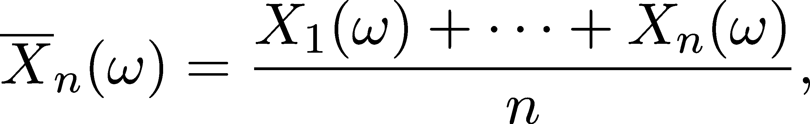
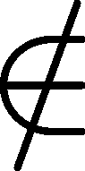
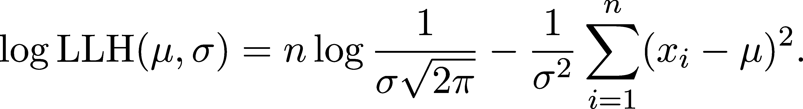

期望值

在上一章，我们学习了概率分布，即表示概率模型的对象，作为序列或函数。毕竟，整个微积分领域可以帮助我们处理函数，因此它们为我们提供了广泛的数学工具。

然而，我们可能并不需要所有可用的信息。有时，简单的描述性统计，如均值、方差或中位数就足够了。即便在机器学习中，损失函数也以这些量为基础。例如，著名的均方误差


是预测误差的方差。深层次上，这些熟悉的量都根植于概率论中，我们将在本章中专门学习它们。

## 第二十五章：20.1 离散随机变量

让我们玩一个简单的游戏。我投掷一枚硬币，如果是正面，你赢得$1。如果是反面，你输掉$2。

到目前为止，我们一直在处理像是获胜的概率等问题。比如，投掷硬币时，无论你赢还是输，我们有


尽管赢和输的机会相等，你是否应该玩这个游戏呢？让我们一探究竟。

在 n 轮之后，你的收益可以通过正面次数乘以$1，减去反面次数乘以$2 来计算。如果我们将总收益除以 n，就得到每轮的平均奖金。也就是说，


其中，#正面和#反面分别表示正面和反面的次数。

还记得来自第 18.2.7 节的频率学派对概率的解释吗？根据我们的直觉，我们应该有


这意味着，如果你玩得足够长，你每轮的平均奖金是


因此，既然你每轮平均亏损半美元，那么你肯定不应该玩这个游戏。

让我们通过随机变量来正式化这个论点。假设，如果 X 表示你每轮的奖金，我们有


所以平均奖金可以表示为


通过一点模式匹配，我们发现对于一般的离散随机变量 X，公式看起来像


从中，期望值的定义应运而生。

定义 92.（离散随机变量的期望值）

设(Ω, Σ, P)为一个概率空间，X : Ω →{x[1], x[2], …}为离散随机变量。X 的期望值定义为

![𝔼 [X ] := ∑ x P (X = x ). k k k ](img/file1901.png)

（注意，如果 X 取有限多个值，则和中只包含有限个项。）

在英语中，期望值描述的是随机变量在长期运行中的平均值。期望值也叫做均值，通常用μ表示。我们常常不使用随机变量，而是通过代入分布来使用期望值符号，比如𝔼[Bernoulli(p)]。虽然从数学上看这不够精确，但 1）在某些情况下，它更简单，2）而且期望值反正只依赖于分布。

是时候看一些例子了。

示例 1. 伯努利分布的期望值。（请参见 19.2.1 节中的伯努利分布定义。）设 X ∼ Bernoulli(p)。它的期望值很容易计算，计算如下：

![𝔼[X] = 0⋅P (X = 0 )+ 1⋅P (X = 1) = = 0⋅(1 − p)+ 1 ⋅p = p. ](img/file1902.png)

我们之前见过这个：简单游戏的入门例子实际上是变换后的伯努利分布 3 ⋅ 伯努利(1∕2) − 2。

示例 2. 二项分布的期望值。（请参见 19.2.2 节中的二项分布定义。）设 X ∼ Binomial(n,p)。那么

![ ∑n 𝔼[X] = kP (X = k ) k=0 ∑n (n ) = k pk(1 − p)n−k k=0 k ∑n = k----n!--- pk(1 − p)n−k. k=0 k!(n − k)! ](img/file1903.png)

计划如下：吸收那个 k 与分数，并调整和，使其项形成二项分布(Binomial(n − 1,p))的概率质量函数。由于 n −k = (n − 1) − (k − 1)，我们得到

![ ∑n 𝔼[X ] = k ---n!----pk(1− p)n−k k=0 k!(n − k)! ∑n = np ---------(n-−-1)!--------pk−1(1 − p)(n−1)−(k−1) k=1(k − 1)!((n − 1)− (k − 1))! n−1 = np ∑ ---(n-−-1)!--pk(1− p)(n−1−k) k!(n − 1− k)! k=0 n∑−1 = np P (Binomial(n− 1,p) = k) k=0 = np. ](img/file1905.png)

这个计算看起来可能不算最简单，但一旦你熟悉了这个技巧，它将变得像第二天性一样。

示例 3. 几何分布的期望值。（请参见 19.2.3 节中的几何分布定义。）设 X ∼ Geo(p)。我们需要计算

![ ∑∞ 𝔼[X ] = k (1 − p)k−1p. k=1 ](img/file1906.png)

你还记得几何级数吗？(19.2) 这几乎就是它，除了那个 k 项，它让我们的计算变得复杂。为了解决这个问题，我们将使用另一个魔法技巧。回忆一下，


现在，我们将对几何级数进行微分，从而得到


我们在这里使用了导数的线性性质和几何级数的良好解析性质。数学家们看到交换导数和无穷和时会尖叫，但别担心，这里的一切都是正确的。（数学家们真的害怕交换极限。你得知道，他们有理由这么做！）

另一方面，


因此


综合以上所有内容，我们最终得出

![ ∑∞ 𝔼[X ] = k (1 − p)k−1p k=1 ∞∑ = p k(1− p)k−1 k=1 1 1 = p-2 = -. p p ](img/file1911.png)

示例 4\. 常数随机变量的期望值。令 c ∈ℝ为任意常数，X 为一个在所有情况下都取值为 c 的随机变量。由于 X 是离散随机变量，它的期望值就是

![𝔼[X ] = c⋅P (X = c) = c. ](img/file1912.png)

我知道，这个例子看起来很傻，但它实际上可以非常有用。当情况清晰时，我们通过将常数 c 表示为随机变量本身来滥用符号。

### 20.1.1 扑克中的期望值

在继续之前再举一个例子。曾经，我是一个中等水平的无限注德州扑克玩家，而我第一次听说期望值是在学习概率论之前的几年。

根据德州扑克的规则，每个玩家自己持有两张牌，同时发五张公共牌。这些公共牌对每个玩家都可用，持有最强牌的玩家获胜。

图 20.1 展示了最后一张牌（河牌）揭示之前桌面的样子。


图 20.1：河牌之前的扑克桌

底池里有钱可以赢，但要看到河牌，你必须跟注对手的下注。问题是，你应该这么做吗？期望值来帮忙。

让我们构建一个概率模型。某些河牌（river card）能让我们赢得底池，而其他所有河牌则让我们失去。若 X 代表我们的获胜金额，则


因此，期望值是

![𝔼[X] = pot⋅P (X = pot )− bet⋅P (X = − bet) #winning cards #losing cards = pot⋅ ----------------− bet⋅----------------. #remaining cards #remaining cards ](img/file1915.png)

期望值什么时候为正？通过一些代数运算，我们得到𝔼[X]/span>0 当且仅当


这被称为正底池赔率。如果满足这一条件，下注是正确的选择。尽管在单手牌中你可能会输，但从长远来看，你的收益将是正的。

当然，底池赔率在实践中非常难以确定。例如，你不知道别人持有什么牌，除非你对对手有很好的阅读能力，否则无法计算出哪些牌会为你赢得底池。扑克远不止是数学。优秀的玩家会特别选择下注方式，来让对手的底池赔率产生误导。

现在我们理解了期望值的基本概念，让我们继续探讨一般情况！

## 20.2 连续随机变量

到目前为止，我们只为离散随机变量定义了期望值。由于𝔼[X]描述的是 X 在长时间内的平均值，因此它对于连续随机变量也应该是存在的。

期望值的解释很简单：结果乘以概率，对所有可能的值求和。然而，连续随机变量有一个问题：我们没有这样的质量分布，因为单个结果的概率为零：P(X = x) = 0。此外，我们无法对无穷多个值求和。

我们能做什么呢？

一厢情愿的想法。这是数学中最强大的技巧之一，我不是在开玩笑。

计划是这样的。我们假设连续随机变量的期望值是定义良好的，让我们的想象力自由发挥。告别数学精确性，让我们的直觉展开。与其谈论某一结果的概率，我们可以讨论 X 落在一个小区间内。首先，我们将实数集划分为非常小的部分。更精确地说，设 x[0]/span>x[1]/span>…/span>x[n] 是实数线的精细划分。如果划分足够精细，我们应该得到：

𝔼[X] ≈ ∑[k=1]^n x[k] P(x[k−1] ≤ X ≤ x[k]) (20.1)

在 (20.1) 中的概率可以用 CDF 表示：


这些增量让我们想起了差分商。虽然在求和中我们没有完全得到这些，但通过“巧妙的乘以 1”，我们可以实现这一点：


如果 x[i] 彼此接近（而且我们可以选择它们任意接近），那么差分商接近于 F[X] 的导数，即密度函数 f[X]。因此，


这是一个黎曼和，定义见于 (14.7)！因此，最后的和接近于黎曼积分：


尽管我们在推理中并没有完全精确，但以上所有内容都可以在数学上得到正确处理。（不过我们这里不做，因为它与我们无关。）因此，我们最终得到了连续随机变量期望值的公式。

定义 93. （连续随机变量的期望值）

设 (Ω,Σ,P) 是一个概率空间，X : Ω → ℝ 是一个连续随机变量。X 的期望值由以下公式定义：

![ ∫ ∞ 𝔼 [X ] := xfX(x)dx. −∞ ](img/file1921.png)

和往常一样，让我们先看一些例子。

示例 1. 均匀分布的期望值。（参见 19.3.4 节中对均匀分布的定义。）设 X ∼ Uniform(a,b)。则

![ ∫ ∞ 1 𝔼[X ] = x-----dx − ∞ b∫− a --1-- b = b − a xdx [ a ]x=b = ---1---x2 2(b − a) x=a a + b = --2--, ](img/file1922.png)

这表示区间 [a,b] 的中点，其中 Uniform(a,b) 分布存在。

示例 2\. 指数分布的期望值。（参见第 19.3.5 节中关于指数分布的定义。）设 X ∼ exp(λ)。然后，我们需要计算积分

![ ∫ ∞ − λx 𝔼[X ] = xλe dx. 0 ](img/file1923.png)

我们可以通过分部积分法来解决这个问题（定理 95）：设 f(x) = x 且 g^′(x) = λe^(−λx)，我们得到

![ ∫ ∞ 𝔼 [X ] = xλe−λxdx 0 [ ]x=∞ ∫ ∞ = − xe−λx x=0 + e− λxdx ◟-----◝=◜0-----◞ 0 [ ]x=∞ = − 1-e−λx λ x=0 1- = λ. ](img/file1924.png)

## 20.3 期望值的性质

和往常一样，期望值具有几个有用的性质。最重要的是，期望值对随机变量是线性的。

定理 129\. （期望值的线性）

设 (Ω,Σ,P) 为一个概率空间，且让 X, Y : Ω → ℝ 为两个随机变量。进一步设 a, b ∈ ℝ 为两个标量。那么

![𝔼[aX + bY ] = a𝔼 [X ]+ b𝔼 [Y ] ](img/file1925.png)

公式成立。

我们在这里不会证明这个定理，但要知道线性是一个重要的工具。你还记得我们用来引入离散随机变量期望值的游戏吗？我掷硬币，如果正面朝上，你赢得 $1；反面朝上，你输掉 $2。如果你思考一下，这就是


分布，因此，

![𝔼[X] = 𝔼[3⋅Bernoulli(1 ∕2)− 2] = 3⋅𝔼 [Bernoulli(1 ∕2)]− 2 = 3⋅ 1− 2 2 1- = − 2\. ](img/file1927.png)

当然，线性远不止这个简单的例子。正如你已经习惯了的那样，线性是数学中的一个关键性质。我们喜欢线性。

备注 20\.

请注意，定理 129 并未说明 X 和 Y 必须都是离散的或都是连续的。尽管我们只在这种情况下定义了期望值，但存在一个适用于所有随机变量的通用定义。

问题在于，它需要熟悉测度理论，而这超出了我们的范围。只需知道，这个定理按原样成立。

如果和的期望值是各自期望值的和，那么乘积是否也适用？一般来说不适用，但幸运的是，这在独立随机变量的情况下成立。（参见定理 84，其中给出了独立随机变量的定义。）

定理 130\. （独立随机变量乘积的期望值）

设 (Ω,Σ,P) 为一个概率空间，且让 X, Y : Ω → ℝ 为两个独立的随机变量。

然后

![𝔼 [XY ] = 𝔼 [X ]𝔼[Y] ](img/file1928.png)

公式成立。

这个性质非常有用，正如我们将在下一节中看到的，我们将讨论方差和协方差。

另一个帮助我们计算随机变量函数期望值的性质，比如 X² 或 sinX：

定理 131\. （无意识统计学家的法则）

设 (Ω,Σ,P) 为一个概率空间，设 X : Ω → ℝ 为一个随机变量，且设 g : ℝ → ℝ 为一个任意函数。

(a) 如果 X 是离散的，且可能的取值为 x[1], x[2], …，那么

![ ∑ 𝔼[g(X)] = g(xn)P (X = xn). n ](img/file1929.png)

(b) 如果 X 是具有概率密度函数 fX 的连续型随机变量，则

![ ∫ ∞ 𝔼[g(X )] = g(x)f (x)dx. −∞ X ](img/file1930.png)

因此，计算连续随机变量的𝔼[X²]可以通过简单地取

![ ∫ ∞ 𝔼[X²] = x²fX (x)dx, −∞ ](img/file1931.png)

这将在整个过程中被频繁使用。

## 20.4 方差

简单来说，期望值衡量的是随机变量的平均值。然而，即使 Uniform(−1,1)和 Uniform(−100,100)的期望值都是零，后者的分布却比前者要广泛得多。因此，𝔼[X]并不是描述随机变量 X 的好方法。

为了再加一层，我们衡量的是期望值的平均偏差。这是通过方差和标准差来实现的。

定义 94\. (方差与标准差)

设(Ω, Σ, P)为一个概率空间，设 X : Ω → ℝ为一个随机变量，且μ = 𝔼[X]为其期望值。X 的方差定义为

![ [ 2] 方差 [X ] := 𝔼 (X − μ ) , ](img/file1932.png)

其标准差定义为

![Std[X] := ∘方差--[X-]. ](img/file1933.png)

请注意，在文献中，期望值通常用μ表示，而标准差用σ表示。二者一起构成了描述随机变量的两个最重要的指标。

图 20.2 展示了在正态分布情况下，均值和标准差的可视化解释。均值表示平均值，而标准差可以解释为平均偏离均值的程度。（我们稍后会详细讨论正态分布，所以如果现在还不熟悉，也不用担心。）


图 20.2：标准正态分布的均值(μ)和标准差 !(σ) ](img/file1935.png)

计算方差的常用方法不是取(X − μ)²的期望值，而是取 X²的期望值并从中减去μ²。以下命题展示了这一点。

命题 5\.

设(Ω, Σ, P)为一个概率空间，且 X : Ω → ℝ为一个随机变量。

然后

![方差[X] = 𝔼[X² ]− 𝔼[X ]²\. ](img/file1936.png)

证明。设μ = 𝔼[X]。由于期望值的线性性质，我们有

![方差[X ] = 𝔼[(X − μ)²] = 𝔼[X² − 2μX + μ²] = 𝔼[X ]² − 2μ𝔼 [X ]+ μ² 2 2 2 = 𝔼[X ] − 2μ + μ = 𝔼[X² ]− μ² = 𝔼[X² ]− 𝔼[X ]², ](img/file1937.png)

这就是我们需要证明的。

方差也具有线性性质吗？不，但关于标量乘法和加法，有一些重要的恒等式。

定理 132\. (方差与线性运算)

设(Ω, Σ, P)为一个概率空间，且 X : Ω → ℝ为一个随机变量。

(a) 设 a ∈ ℝ为任意常数。那么

![ 2 方差[aX ] = a 方差[X ]. ](img/file1938.png)

(b) 设 Y : Ω → ℝ为一个与 X 独立的随机变量。那么

![方差[X + Y ] = 方差[X ]+ 方差[Y]. ](img/file1939.png)

证明。(a) 设μ[X] = 𝔼[X]。则我们有

![ [ ] [ ] Var[aX ] = 𝔼 (aX − a μX)2 = 𝔼 a2(X − μX )2 [ ] = a2𝔼 (X − μX )2 = a2Var[X ], ](img/file1940.png)

这就是我们需要展示的结果。（b）令μ[Y] = 𝔼[Y]。然后，由于期望值的线性性质，我们有：

![ [ 2] Var[X + Y ] = 𝔼 (X + Y − (μX + μY )) [ 2] = 𝔼 ((X − μX ) + (Y − μY)) = 𝔼 [(X − μX)2]+ 2𝔼[(X − μX )(Y − μY)] + 𝔼[(Y − μY )2]. ](img/file1941.png)

现在，由于 X 和 Y 是独立的，𝔼[XY ] = 𝔼[X]𝔼[Y]。因此，由于期望值的线性性质，

![ [ ] [ ] 𝔼 (X − μX )(Y − μY) = 𝔼 XY − X μY − μX Y + μX μY = 𝔼[XY ] − 𝔼[X μ ]− 𝔼 [μ Y ]+ μ μ [ ] [ ] [Y ] X [ ] X Y = 𝔼 X 𝔼 Y − 𝔼 X μY − μX 𝔼 Y + μX μY = μXμY − μXμY − μXμY + μXμY = 0\. ](img/file1942.png)

因此，继续进行第一次计算，

![Var[X + Y ] = 𝔼 [(X − μ )2]+ 2𝔼[(X − μ )(Y − μ )] + 𝔼[(Y − μ )2] X X Y Y = 𝔼 [(X − μX)2]+ 𝔼[(Y − μY )2], ](img/file1943.png)

这就是我们需要展示的结果。

### 20.4.1 协方差和相关性

期望值和方差度量了一个随机变量的独立性。然而，在实际问题中，我们需要发现不同测量之间的关系。假设，X 表示给定房地产的价格，而 Y 表示其面积。这两者肯定是相关的，但并不是互相决定的。例如，位置可能是价格差异的因素。

测量相似性的最简单统计方法是协方差和相关性。

定义 95.（协方差与相关性）

设(Ω,Σ,P)为概率空间，设 X,Y : Ω → ℝ为两个随机变量，且μ[X] = 𝔼[X]，μ[Y] = 𝔼[Y]为它们的期望值，σ[X] = Std[X]，σ[Y] = Std[Y]为它们的标准差。

(a) X 和 Y 的协方差由下式定义：

![ [ ] Cov [X,Y ] := 𝔼 (X − μX )(Y − μY ). ](img/file1944.png)

(b) X 和 Y 的相关性由下式定义：

![ Cov[X, Y] Corr [X, Y ] := ---------. σXσY ](img/file1945.png)

类似于方差，协方差的定义可以简化，从而提供一种更简便的计算其确切值的方法。

命题 6\.

设(Ω,Σ,P)为概率空间，设 X,Y : Ω → ℝ为两个随机变量，且μ[X] = 𝔼[X]，μ[Y] = 𝔼[Y]为它们的期望值。

然后

![Cov[X, Y] = 𝔼[XY ]− μX μY . ](img/file1946.png)

证明：这只是一个简单的计算。根据定义，我们有：

![ [ ] Cov[X, Y] = 𝔼 (X − μX )(Y − μY) [ ] = 𝔼 XY − X μY − μX Y + μX μY = 𝔼[XY ] − 𝔼[X μ ]− 𝔼[μ Y ]+ μ μ [ ] [ ]Y X[ ] X Y = 𝔼 XY − 𝔼 X μY − μX 𝔼 Y + μX μY [ ] = 𝔼 XY − μX μY − μX μY + μX μY = 𝔼[XY ]− μX μY , ](img/file1947.png)

这就是我们需要展示的结果。

协方差和相关性的一个最重要的性质是，对于独立的随机变量，它们的值为零。

定理 133\.

设(Ω,Σ,P)为概率空间，且 X,Y : Ω → ℝ为两个独立的随机变量。

然后，Cov[X,Y ] = 0\. （因此，Corr[X,Y ] = 0 也是如此。）

证明直接来自定义和定理 130，所以这部分留给你做练习。

请注意，这一点非常重要：独立性意味着零协方差，但零协方差并不意味着独立性。这里有一个例子。

设 X 是一个离散随机变量，其概率质量函数为：


并且设 Y = X²。

X 的期望值是

![𝔼 [X ] = (− 1)⋅P (X = − 1)+ 0 ⋅P (X = 0)+ 1 ⋅P (X = 1) = − 1-+ 0 + 1- 3 3 = 0, ](img/file1949.png)

而无意识统计学家的法则（定理 131）表明：

![ 2 𝔼[Y ] = 𝔼[X ] = 1 ⋅P(X = − 1) + 0⋅P (X = 0) + 1⋅P (X = 1 ) 1- 1- = 3 + 0+ 3 2 = -, 3 ](img/file1950.png)

和

![𝔼[XY ] = 𝔼[X3] = 0\. ](img/file1951.png)

因此，

![Cov [X,Y ] = 𝔼 [XY ]− 𝔼[X ]𝔼 [Y ] 3 2 = 𝔼 [X ]− 𝔼 [X ]𝔼[X ] 2- = 0 − 0⋅ 3 = 0\. ](img/file1952.png)

然而，X 和 Y 不是独立的，因为 Y = X² 是 X 的一个函数。（我毫不羞愧地借用了这个例子，来自一个精彩的 Stack Overflow 讨论，你应该阅读更多关于这个问题的内容：[`stats.stackexchange.com/questions/179511/why-zero-correlation-does-not-necessarily-imply-independence`](https://stats.stackexchange.com/questions/179511/why-zero-correlation-does-not-necessarily-imply-independence)）

你是否还记得我们如何将概率的概念解释为事件发生的相对频率？现在，我们已经掌握了期望值，我们终于可以精确地描述这个概念了。让我们来看看著名的大数法则！

## 20.5 大数法则

我们将继续前进，探索一个相当显著且著名的结果：大数法则。你可能已经听过一些错误的关于大数法则的论点。例如，赌徒们常常相信他们的不幸很快就会结束，因为大数法则。这是最常被误用的数学术语之一，我们在这里将澄清这一点。

我们将分两步进行。首先，我们将看到一个直观的解释，然后添加技术性但重要的数学细节。我会尽量温和一些。

### 20.5.1 投掷硬币……

首先，我们再投几次硬币。如果我们重复投掷硬币，长期来看，正面朝上的相对频率是多少？

我们应该已经有了一个相当不错的猜测：正面朝上的平均次数也应该趋向于 P(正面) = p。为什么？因为我们在第 18.2.7 节研究概率的频率解释时看到过这个现象。

我们的模拟显示，正面朝上的相对频率确实趋向于真实的概率。这一次，我们将进一步进行模拟。

首先，为了构造问题，我们引入独立随机变量 X[1], X[2], …，它们的分布是伯努利(p)，其中 X[i] = 0 表示投掷结果为反面，而 X[i] = 1 表示投掷结果为正面。我们关注的是


X[n] 被称为样本平均值。我们已经看到，随着 n 的增大，样本平均值越来越接近 p。让我们在继续之前再看一次模拟结果。（为了方便示例，参数 p 选择为 1∕2。）

```py
import numpy as np 
from scipy.stats import bernoulli 

n_tosses = 1000 
idx = range(n_tosses) 

coin_tosses = [bernoulli.rvs(p=0.5) for _ in idx] 
coin_toss_averages = [np.mean(coin_tosses[:k+1]) for k in idx]
```

这是图表。

```py
import matplotlib.pyplot as plt 

with plt.style.context("/span>seaborn-v0_8": 
    plt.figure(figsize=(10, 5)) 
    plt.title("/span>Relative frequency of the coin tosses 
    plt.xlabel("/span>Relative frequency 
    plt.ylabel("/span>Number of tosses 

    # plotting the averages 
    plt.plot(range(n_tosses), coin_toss_averages, linewidth=3) # the averages 

    # plotting the true expected value 
    plt.plot([-100, n_tosses+100], [0.5, 0.5], c="/span>k 
    plt.xlim(-10, n_tosses+10) 
    plt.ylim(0, 1) 
    plt.show()
```


图 20.3：掷硬币的相对频率

到目前为止没有什么新内容。然而，如果你眼尖的话，可能会问：这只是偶然吗？毕竟，我们研究的是平均值。


这几乎是一个二项分布的随机变量！更准确地说，如果 X[i] ∼ 伯努利分布(p)，则


（我们在讨论离散随机变量的和时已经看到过这个内容，在第 19.2.7 节中。）

到目前为止，无法保证这个分布会集中在单一的值附近。因此，让我们做更多的模拟。这次，我们将掷硬币一千次，看看样本平均值的分布情况。确实很有 meta 的感觉，我知道。

```py
more_coin_tosses = bernoulli.rvs(p=0.5, size=(n_tosses, n_tosses)) 
more_coin_toss_averages = np.array([[np.mean(more_coin_tosses[i][:j+1]) for j in idx] 
                                     for i in idx])
```

我们可以在直方图上可视化这些分布。

```py
with plt.style.context("/span>seaborn-v0_8": 
    fig, axs = plt.subplots(1, 3, figsize=(12, 4), sharey=False) 
    fig.suptitle("/span>The distribution of sample averages 
    for ax, i in zip(axs, [5, 100, 999]): 
        x = [k/i for k in range(i+1)] 
        y = more_coin_toss_averages[:, i] 
        ax.hist(y, bins=x) 
        ax.set_title(f/span>n = {i}" 

    plt.show()
```


图 20.4：掷硬币的样本平均值分布

换句话说，X[n]远离 p 的概率会变得越来越小。对于任何小的𝜖，我们可以将“X[n]远离 p 超过𝜖”的概率表示为 P(|X[n] −p| > 𝜖)。

因此，从数学角度来看，我们的猜测是


再次，这只是偶然吗？我们是否仅仅幸运地研究了一个符合这个规律的实验？对于除伯努利随机变量外的其他随机变量是否也成立？样本平均值最终会收敛到什么地方？（如果它们确实会收敛的话。）

我们会找到答案的。

### 20.5.2 …掷骰子…

让我们来玩掷骰子。为了简化问题，我们关注的是长期掷骰子的平均值。为了建立一个合适的概率模型，我们来引入随机变量！

单次掷骰子是均匀分布在{1,2,…,6}上的，并且每次掷骰子相互独立。因此，设 X[1], X[2], … 为独立随机变量，每个随机变量都按照均匀分布 Uniform({1,2,…,6})分布。

样本平均值 X[n] 会怎么变化？是时候进行模拟了。我们将随机生成 1000 次掷骰子的结果，然后探索 X[n] 的变化情况。

```py
from scipy.stats import randint 

n_rolls = 1000 
idx = range(n_rolls) 

dice_rolls = [randint.rvs(low=1, high=7) for _ in idx] 
dice_roll_averages = [np.mean(dice_rolls[:k+1]) for k in idx]
```

再次为了获得一些直观的理解，我们将在图表上可视化这些平均值。

```py
with plt.style.context("/span>seaborn-v0_8": 
    plt.figure(figsize=(10, 5)) 
    plt.title("/span>Sample averages of rolling a six-sided dice 

    # plotting the averages 
    plt.plot(idx, dice_roll_averages, linewidth=3) # the averages 

    # plotting the true expected value 
    plt.plot([-100, n_rolls+100], [3.5, 3.5], c="/span>k 

    plt.xlim(-10, n_rolls+10) 
    plt.ylim(0, 6) 
    plt.show()
```


图 20.5：掷六面骰子的样本平均值

首先需要注意的是，这些数值异常接近 3.5。这不是一个概率，而是期望值：

![𝔼[X1 ] = 𝔼[X2] = ⋅⋅⋅ = 3.5\. ](img/file1960.png)

对于伯努利(p)分布的随机变量，期望值与概率 p 相同。然而，这一次，X[n] 并不像掷硬币时那样有一个明确的分布，样本平均值也不再是二项分布。因此，我们来多掷一些骰子，估计 X[n] 的分布情况。

```py
more_dice_rolls = randint.rvs(low=1, high=7, size=(n_rolls, n_rolls)) 
more_dice_roll_averages = np.array([[np.mean(more_dice_rolls[i][:j+1]) for j in idx] 
                                     for i in idx])
```

```py
with plt.style.context("/span>seaborn-v0_8": 
    fig, axs = plt.subplots(1, 3, figsize=(12, 4), sharey=False) 
    fig.suptitle("/span>The distribution of sample averages 
    for ax, i in zip(axs, [5, 100, 999]): 
        x = [6*k/i for k in range(i+1)] 
        y = more_dice_roll_averages[:, i] 
        ax.hist(y, bins=x) 
        ax.set_title(f/span>n = {i}" 

    plt.show()
```


图 20.6：掷骰子时的样本平均分布

看起来，一次又一次地，X[n] 的分布集中在 𝔼[X[1]] 附近。我们的直觉告诉我们，这不是偶然；这一现象对于广泛的随机变量都成立。

让我剧透一下：这确实是这样，我们现在就来看。

### 20.5.3 …以及其余部分

这次，设 X[1],X[2],… 是一列独立同分布（i.i.d.）的随机变量。不是掷硬币，不是掷骰子，而是任何分布。我们看到样本平均值 X[n] 似乎收敛于 X[i]-s 的联合期望值：

![′′- ′′ Xn → 𝔼[X1] ](img/file1962.png)

注意引号：X[n] 不是一个数字，而是一个随机变量。因此，我们还不能谈论收敛。

从数学上精确来说，我们之前看到的是，当 n 足够大时，样本平均值 X[n] 很不可能远离联合期望值 μ = 𝔼[X[1]]；也就是说，

lim[n→∞] P(|X[n] − μ| > 𝜖) = 0 (20.2)

对所有 𝜖/span>0\ 都成立。

极限（20.2）现在似乎很难证明，即使是在简单的掷硬币的情况下。在那里，X[n] ∼ 二项分布(n,p)，因此


其中符号 ⌊x⌋ 表示小于 x 的最大整数。这看起来一点也不友好。（我把验证留作练习。）

因此，我们的计划如下。

1.  找一种估计 P(jX[n]−μj/span>𝜖) 的方法，使其与 X[i]-s 的分布无关。

1.  使用上界估计来证明 lim[n→∞]P(jX[n] −μj/span>𝜖) = 0。

我们开始吧。

### 20.5.4 大数法则的弱法则

首先是上界估计。有两个一般不等式可以帮助我们处理 P(jX[n] −μj ≥𝜖)。

定理 134. （马尔可夫不等式）

设 (Ω,Σ,P) 是一个概率空间，且 X : Ω → [0,∞) 是一个非负随机变量。那么

![ 𝔼[X ] P (X ≥ t) ≤ ----- t ](img/file1965.png)

对于任意 t ∈ (0,∞)，此不等式都成立。

证明：我们需要分离离散情况和连续情况。证明几乎完全相同，所以我只会做离散情况，连续情况留给你作为练习来验证你的理解。

设 X : Ω → {x[1],x[2],…} 是一个离散型随机变量（其中 x[k] ≥ 0 对所有 k 成立），且 t ∈ (0,∞) 是一个任意的正实数。

那么

𝔼[X]

= ∑ [k=1]^∞x [k]P(X = x[k])

= ∑ [k:x[k]/span>tx[k]P(X = x[k]) + ∑ [k:x[k]≥t]x[k]P(X = x[k]),]

其中和 ∑ [k:x[k]/span>t 仅仅计算了 x[k]/span>t 的 k-s，类似地，∑ [k] : x[k] ≥t 仅计算了 x[k] ≥t 的 k-s。

由于假设 x[k]-s 为非负数，因此我们可以通过忽略其中一个来从下方估计 𝔼[X]。因此，

![ ∑ ∑ 𝔼[X ] = xkP (X = xk )+ xkP (X = xk) k:x < k:x ≥t ∑k k ≥ xkP (X = xk ) k:xk≥t ∑ ≥ t P (X = xk ) k:xk≥t = tP(X ≥ t), ](img/file1966.png)

从中可以得到马尔可夫不等式

![P (X ≥ t) ≤ 𝔼[X-] t ](img/file1967.png)

如下。

大数法则仅一步之遥，接近于马尔可夫不等式。最后这一步非常有用，值得成为一个独立的定理。让我们来看看著名的切比雪夫不等式。

定理 135\.（切比雪夫不等式）

设 (Ω, Σ, P) 为一个概率空间，X : Ω →ℝ 是一个具有有限方差 σ² = Var[X] 和期望值 𝔼[X] = μ 的随机变量。

然后


对所有 t ∈ (0,∞) 成立。

证明。由于 |X − μ| 是一个非负随机变量，我们可以应用定理 134 得到

![P (|X − μ| ≥ t) = P(|X − μ|2 ≥ t2) 2 ≤ 𝔼[|X--−-μ|-]. t2 ](img/file1969.png)

然而，由于 𝔼[|X − μ|²] = Var[X] = σ²，我们有

![ 2 2 P(|X − μ | ≥ t) ≤ 𝔼-[|X-−2μ-|] = σ2 t t ](img/file1970.png)

这就是我们需要证明的。

通过这些内容，我们准备好精确地表述和证明大数法则。经过所有这些准备，（弱）大数法则只是一步之遥。以下是它的完整形式。

定理 136\.（弱大数法则）

设 X[1], X[2], … 为一列独立同分布的随机变量，其期望值 μ = 𝔼[X[1]] 和方差 σ² = Var[X[1]]，且


设它们的样本平均值为。然后


对任何 𝜀/span>0\ 成立。

证明。由于 X[i] 是独立的，样本平均值的方差为

![ -- [ X1 + ⋅⋅⋅+ Xn ] Var[Xn ] = Var ------------- n = -1-Var[X1 + ⋅⋅⋅+ Xn] n2 = -1-(Var[X ]+ ⋅⋅⋅+ Var[X ]) n2 1 n n σ2 σ2 = -n2- = n-. ](img/file1973.png)

现在，通过使用定理 135 中的切比雪夫不等式，我们可以得到

![ -- -- Var[Xn-] -σ2- P (|Xn − μ | ≥ 𝜀) ≤ 𝜀2 = n 𝜀2\. ](img/file1974.png)

因此，


因此


这就是我们需要证明的。

定理 136 不是关于样本平均值的全部内容。还有更强的结果，表明样本平均值确实以概率 1 收敛到均值。

### 20.5.5 强大数法则

为什么定理 136 被称为“弱”大数法则？想想这个声明

lim[n→∞] P(|X[n] − μ| ≥ 𝜀) = 0 (20.3)

稍等片刻。对于给定的 ω ∈ Ω，这并没有告诉我们具体样本平均值的收敛情况。



它只是告诉我们，在概率意义上，X[n] 集中在联合期望值 μ 周围。从某种意义上讲，(20.3) 是


因此，这就是所谓的弱大数法则。

我们是否有比定理 136 更强的结果？是的，有。

定理 137\.（强大数法则）

设 X[1],X[2],…是独立同分布的随机变量序列，具有有限的期望值μ = 𝔼[X[1]]和方差σ² = Var[X[1]]，并且设


设它们是样本均值。那么


我们不会证明这一点，只需要知道样本均值会以概率 1 收敛到均值。

注 21.（随机变量的收敛性）

我们在大数法则的弱法则和强法则中看到的现象并非仅限于样本均值。在其他情况下也可以观察到类似的现象，因此，这些类型的收敛性有其各自的精确定义。

如果 X[1],X[2],…是一个随机变量序列，我们称

(a) 如果 X[n]在概率上收敛到 X，则


对所有𝜀/span>0\. 概率收敛表示为 X[n]X。

(b) 如果 X[n]几乎确定地收敛到 X，则


成立。几乎确定的收敛表示为 X[n]X。

因此，大数法则的弱法则和强法则指出，在某些情况下，样本均值在概率上和几乎确定地都收敛到期望值。

## 20.6 信息论

如果你已经在实践中训练过机器学习模型，可能已经熟悉均方误差。


其中，f : ℝ^n →ℝ表示我们的模型，x ∈ℝ^n 是一个一维观测向量，y ∈ℝ^n 是真实值。学完期望值后，这个求和式应该是熟悉的：如果我们假设一个概率视角，并让 X 和 Y 是描述数据的随机变量，那么均方误差可以表示为期望值。

![ [ ] MSE (x, y) = 𝔼 (f(X )− Y )2\. ](img/file1986.png)

然而，均方误差并不适用于分类问题。例如，如果任务是分类一张图像的物体，输出将是每个样本的离散概率分布。在这种情况下，我们可以使用所谓的交叉熵，其定义为

![ n H [p,q] = − ∑ p logq i i i=1 ](img/file1987.png)

其中，p ∈ℝ^n 表示单个数据样本的类别标签的独热编码向量，q ∈ℝ^n 是类别标签预测，形成一个概率分布。（独热编码是将一个有限的类别标签集合，如{a,b,c}，表示为零一向量的过程，例如


我们这样做是因为处理向量和矩阵比处理字符串更容易。)

并不令人惊讶，H[p,q]也是一个期望值，但它远不止如此：它量化了分布 q 与真实分布 q 之间的信息内容。

但在数学意义上，什么是信息？让我们深入探讨。

### 20.6.1 猜数字

让我们从一个简单的游戏开始。我已经想好了一个介于 0 到 7 之间的整数，你的任务是通过是非问题找出这个数字。


图 20.7：我在想哪个数字？

一种可能的策略是逐一猜测数字。换句话说，你的问题顺序是：

+   它是 0 吗？

+   它是 1 吗？

+   

+   它是 7 吗？

尽管这个策略有效，但并不是最有效的。为什么？考虑一下平均问题数。设随机变量 X 表示我选择的数字。由于 X 是均匀分布的——也就是说，P(X = k) = 1/8，对于所有 k = 0,…,7——那么恰好问 k 个问题的概率为


同样。因此，所需的问题数也在 {1,…,8} 上均匀分布，因此

![ ∑8 𝔼[#questions] = kP (#questions = k ) k=1 8 = 1-∑ k 8 k=1 = 1-8⋅9-= 9-, 8 2 2 ](img/file1992.png)

我们已经使用了 ∑ [k=1]^n = 。

我们能做得比这个更好吗？可以。在之前的顺序策略中，每个问题命中目标的机会较小，大部分情况下只会排除一个潜在的候选项。很容易看出，最好的方法是每个问题都能将搜索空间减半。

比如，我想到的数字是 2。通过问“这个数字大于 3 吗？”，答案可以排除四个候选项。


图 20.8：问题后搜索空间是比 3 大的数字吗？

每个后续的问题都会将剩余的可能性减半。以 X = 2 为例，三个问题如下：

+   X ≥ 4 吗？（否）

+   X ≥ 2 吗？（是）

+   X ≥ 3 吗？（否）

这就是所谓的二分查找，如图 20.9 所示。


图 20.9：通过二分查找得出答案

如果我们将三个连续问题的答案（X ≥ 4, X ≥ 2, X ≥ 3）写成一个二进制序列，我们得到 010。如果这看起来很熟悉，那并非偶然：010 是二进制的 2。事实上，所有答案都可以用其二进制形式进行编码：


因此，我们可以重新表述我们的三个问题：

1.  1 是 X 的第一个二进制位吗？

1.  1 是 X 的第二个二进制位吗？

1.  1 是 X 的第三个二进制位吗？

如上例所示，猜数字等同于找出待猜数字的二进制表示。每一位代表一位信息。（在这种情况下，表示就是实际的二进制形式。）二进制编码有一个额外的好处：我们不再需要顺序地提问，可以同时问多个问题。从现在起，我们将不再讨论问题，而是讨论二进制表示（编码）及其位。

请注意，每个 X 的结果所需的位数是相同的。因此，这种策略始终需要三个位，因此它们的平均数量也是三：

![ 7 7 𝔼 [#bits] = ∑ 3⋅P (X = k ) = ∑ 3⋅ 1-= 3\. 8 k=0 k=0 ](img/file1997.png)

我们能做得比平均三次提问更好吗？不能。我邀请你提出你的论据，但我们稍后会看到这一点。

上述的三号数字来自哪里？一般来说，如果我们有 2^k 个可能的选择，那么 log [2]2^k = k 个问题就足够找到答案。（因为每个问题都会将可能答案的范围减半。）换句话说，我们有

![ ∑7 𝔼[#bits] = P (X = k )log2 23 k=0 7 = ∑ P (X = k )log P(X = k)−1\. 2 k=0 ](img/file1998.png)

因此，log [2]P(X = k)^(−1) 的值是我们编码中表示 k 所需要的比特数。换句话说，

![𝔼[#bits] = 𝔼[log2P (X = k)−1]. ](img/file1999.png)

让我们提前一点：这就是著名的随机变量 X 的熵，而 log [2]P(X = k)^(−1) 是所谓的事件 X = k 的信息量。

然而，到此为止，这些概念还很不清楚。log [2]P(X = k)^(−1) 与信息有什么关系？为什么我们不能用比 log [2]P(X = k)^(−1) 更好的方式来表示 k 的比特数？我们很快就会看到答案。

### 20.6.2 猜数字 2：电气波古鲁

让我们再玩一次猜数字的游戏，但这次有点不同。我现在从 {0,1,2} 中选了一个数字，你得猜是哪一个。难点是，我选择 0 的概率是其他数字的两倍。

在概率论中，如果 X 表示我选的数字，那么 P(X = 0) = 1∕2，而 P(X = 1) = P(X = 2) = 1∕4。

最佳策略是什么？有两个关键事实需要记住：

+   好的问题会将搜索空间减少一半，

+   提问相当于找到这些结果的二进制编码。

然而，由于我们在寻找平均最优的编码，不能简单地理解为每个数字将搜索空间减少一半。这种理解应当是概率性的。所以，如果 0 的确是更有可能的，那么通过


平均比特数是

![𝔼[#bits] = P (X = 0) ⋅1+ P (X = 1) ⋅2+ P (X = 2) ⋅2 = P (X = 0) log22 + P (X = 1)log24 + P (X = 2)log24 2 ∑ −1 = P(X = k)log2P (X = k) k=0 = 3-. 2 ](img/file2001.png)

再一次，我们走到了熟悉的对数公式。我们离理解这个神秘量 log [2]P(X = k)^(−1) 更近一步了。它越小，我们需要的问题就越多；同样地，我们在编码中表示 k 所需的比特数也越多，以避免信息丢失。

那么，这些神秘的量到底是什么呢？

### 20.6.3 信息与熵

现在是时候对这个问题进行一般化了。假设我们的随机变量 X 从集合 {1,2,…,N} 中取一个数，每个数的概率是 p[k] = P(X = k)。在反复观察 X 后，我们的观察的平均信息量是多少？

根据我们所学到的，我们正在寻找的量是

![ ∑N 𝔼 [I (X )] = − p logp , k=1 k k ](img/file2002.png)

其中 I : ℕ → ℝ表示信息 I(k) = −log p[k]。之前，我们已经看到两个特殊情况，其中 I(k)是猜测 k 所需的平均问题数。（等价地，信息是使用最优编码时 k 的平均比特数。）

那么一般来说，信息是什么？

让我们把 I 视为概率的未知函数：I(x) = f(P(X = x))。那么 f 可能是什么？有两个关键性质将引导我们找到答案。首先，事件越可能发生，信息含量就越少。（回想一下之前的例子，最可能的结果需要最少的比特数进行二进制表示。）

其次，作为概率的函数，信息是可加的：f(pq) = f(p) + f(q)。为什么？假设我独立地选择了两个数字，现在你需要猜测这两个数字。你可以顺序进行，首先应用最优策略猜测第一个，然后猜测第二个。

用数学语言来说，f(p)是

+   连续的，

+   严格递增，即对于任何 p > q，有 f(p) > f(q)，

+   且可加性，即对于任何 p, q，有 f(pq) = f(p) + f(q)。

我会省略数学细节，但通过一点微积分魔法，我们可以自信地得出唯一的选项是 f(p) = −log [a]p，其中 a > 1。表面上看，信息似乎依赖于基数，但实际上


基数的选择仅会影响信息和熵的乘法尺度因子。因此，使用自然对数是最简单的选择。

所以，这里终于给出了正式定义。

定义 96.（信息）

设 X 为具有概率质量函数{P(X = x[k])}[k]的离散随机变量。

事件 X = x[k]的信息定义为


（注意，当没有指定对数的基数时，我们使用自然对数 e。）为了强调信息依赖于 X，我们有时会明确表示其关系为 IX。

凭借信息的概念，我们准备好定义熵，即每次观察的平均信息量。这个量以 Claude Shannon 的名字命名，他在其史诗论文《通信的数学理论》中奠定了信息理论的基础。

定义 97.（香农熵）

设 X 为具有概率质量函数{P(X = x[k])}[k]的离散随机变量。

X 的熵定义为

![H[X ] := 𝔼[I(X )] ∑∞ = − P(X = xk)logP (X = xk). k=1 ](img/file2007.png)

尽管 H[X]被称为香农熵，但我们将简单地称之为熵，除非需要明确区分。

我们可以注意到的第一件事是 H[X] ≥ 0。这一点在下面的命题中有所体现。

命题 7.（熵的非负性）

设 X 为任意离散随机变量。那么 H[X] ≥ 0。

证明。根据定义，

![ ∑ H [X ] = P(X = xk)logP (X = xk)−1\. k ](img/file2008.png)

首先，假设对于所有的 k，P(X = x[k])≠0。那么，由于 0 ≤ P(X = x[k]) ≤ 1，信息是非负的：log P(X = x[k])^(−1) ≥ 0。因此，定义和中的所有项都是非负的，H[X]也是非负的。

如果 P(X = x[k]) = 0 对于某些 k，那么，由于 lim[x→0+]xlog x = 0，表达式 0 ⋅ log 0 被视为 0。因此，H[X]仍然是非负的。

实际上计算熵是困难的，因为我们需要评估包含对数的求和。然而，仍然有几个特殊情况为熵的概念提供了有价值的启示。让我们来看一下！

示例 1\. 离散均匀分布。（见第 19.2.4 节对离散均匀分布的定义。）设 X ∼ Uniform({1,…,n})。则

![ ∑n H [X ] = − -1log 1- k=1n n ∑n = 1logn k=1 n = log n. ](img/file2009.png)

到目前为止，我们已经对熵有了直观的理解，即每次观测的平均信息量。猜猜看：在所有集中于{1,2,…,n}的分布中，均匀分布的熵如何与其他分布相比？是高于还是低于平均水平？是最小的还是最大的？

我们将在本章末尾揭示答案，但在继续下一个示例之前，花一分钟思考这个问题。

示例 2\. 单点分布。（见第 19.2.5 节对单点分布的定义）设 X ∼δ(a)。则

![H [X ] = − 1 ⋅log 1 = 0\. ](img/file2010.png)

换句话说，由于事件 X = a 是确定的，观察 X 时没有获得任何信息。现在回想一下之前的例子。由于 X ∼δ(k)集中于{1,2,…,n}，对于所有 k = 1,2,…,n，再思考一下之前的问题。

让我们在下一个示例中看到部分答案。

示例 3\. 伯努利分布。（见第 19.2.1 节对伯努利分布的定义）。设 X ∼ Bernoulli(p)。则，很容易看出

![H [X ] = − plogp − (1− p)log(1− p). ](img/file2011.png)

哪个 p 值最大化熵？为了找到 H[X]的极大值，我们可以求导。（回想一下，导数和二阶导数如何用于优化，正如定理 87 所述。）

因此，设 f(p) = H[X] = −plog p − (1 −p)log(1 −p)。则，


通过解 f^′(p) = 0，我们得到 p = 1∕2，这是 f(p)的唯一潜在极值点。由于 f^(′′)(1∕2) = −4/span>0，我们可以看到 p = 1∕2 确实是一个局部最大值。让我们绘制 f(p)图像，以获得直观的确认。

```py
def bernoulli_entropy(p): 
    return -p*np.log(p) - (1 - p)*np.log(1 - p) 

X = np.linspace(0.001, 0.999, 100) 
y = bernoulli_entropy(X) 
with plt.style.context(’seaborn-v0_8’): 
    plt.figure(figsize=(8, 8)) 
    plt.xlabel("/span>p 
    plt.ylabel("/span>H[X]" 
    plt.title("/span>The entropy of Bernoulli(p) 
    plt.plot(X, y) 
    plt.show()
```


图 20.10：伯努利分布的熵

对于 p = 1∕2，即当伯努利分布的熵达到最大值时，我们得到一个在二元集合{0,1}上的均匀分布。另一方面，当 p = 0 或 p = 1 时，熵最小，伯努利分布则为单点分布。

由于 {0,1} 上的每个随机变量都是伯努利分布的，我们似乎已经有了部分答案：均匀分布最大化熵，而单点分布最小化熵。

如下定理所示，这在一般情况下也是成立的。

定理 138．（均匀分布与最大熵）

设 E = {x[1],…,x[n]} 是一个有限集，且设 X : Ω →E 为一个取值于 E 的随机变量。那么，

![H [X] ≤ H [Uniform (E)], ](img/file2014.png)

并且 H[X] = H[Uniform(E)] 当且仅当 X 在 E 上是均匀分布的。

我们在这里不会展示这个，但有许多证明可以参考。例如，Bishop 的经典著作《模式识别与机器学习》使用拉格朗日乘数法来显式地找到多变量函数 f(p[1],…,p[n]) = −∑ [k=1]^np[k] log p[k] 的最大值；有兴趣的话可以查看其中的详细内容。

如果我们不将离散型随机变量限制在有限集上，怎么办？在这种情况下，Shannon 熵没有上限。在本章的问题集中，你将看到几何分布的熵是

![H [Geo (p)] = − plogp-+-(1−-p)-log(1-−-p). p ](img/file2015.png)

很容易看出 lim[p→0]H[Geo(p)] = ∞。我们来绘制一下图像！

```py
def geom_entropy(p): 
    return -(p*np.log(p) + (1 - p)*np.log(1 - p))/p 

X = np.linspace(1e-16, 1-1e-16, 1000) 
y = geom_entropy(X) 

with plt.style.context(’seaborn-v0_8’): 
    plt.figure(figsize=(8, 8)) 
    plt.xlabel("/span>p 
    plt.ylabel("/span>H[X]" 
    plt.title("/span>The entropy of Geo(p) 
    plt.plot(X, y) 
    plt.show()
```


图 20.11：几何分布的熵

因此，Shannon 熵可以取任何非负值。

### 20.6.4 微分熵

到目前为止，我们只为离散型随机变量定义了熵。

这是否也适用于连续型随机变量？是的。公式 𝔼 − log f[X] 可以直接应用于连续型随机变量，得到所谓的微分熵。这里是其正式定义。

定义 98．（微分熵）

设 X 为一个连续型随机变量。X 的微分熵通过以下公式定义：

![ ∫ ∞ H [X ] := − f (x )log f (x)dx, −∞ X X ](img/file2017.png)

其中 f[X] 表示 X 的概率密度函数。

现在来了一个惊喜。我们能从 Shannon 熵推导出这个公式吗？我们将像在定义连续型随机变量的期望值时那样处理这个问题：用离散型随机变量来逼近连续型随机变量，然后看看 Shannon 熵收敛到哪里。

因此，设 X : Ω →ℝ 为连续型随机变量，设 [a,b] ⊆ℝ 为一个（较大的）区间，使得 P(X[a,b]) 极小。我们将 [a,b] 分割为 n 等份，方法如下：


并通过以下方式定义逼近的随机变量 X^((n))：

![ ( (n) |{ xk if x ∈ (xk −1,xk] for some k = 1,2,...,n, X (ω ) := | ( 0 otherwise. ](img/file2020.png)

这样，X^((n)) 的熵由以下公式给出：

![ (n) ∑n (n) (n) H [X ] = − P (X = xk)logP (X = xk). k=1 ](img/file2021.png)

然而，由于我们定义了 X^((n)),


其中 f[X]是 X 的密度函数。现在，定积分的均值定理（定理 93）表明，存在ξ[k] ∈ [x[k−1],x[k]]，使得


因此，总结来说，


（回想一下，x[0]/span>x[1]/span>…/span>x[n]的划分是等距的，x[k] −x[k−1] = 1∕n。）

现在，使用 P(X^((n)) = x[k]) = ，我们可以得到

![ ∑n H[X (n)] = − P (X (n) = xk )log P(X (n) = xk) k=1 n = − ∑ fX-(ξk)-log fX-(ξk)- n n k=n1 n = − ∑ fX-(ξk)-log f (ξ )+ log n∑ fX(ξk). n X k n k=1 k=1 ](img/file2026.png)

这两个项都是黎曼和，近似函数内部的积分。如果 n 很大，并且区间[a,b]足够大，那么

![ n ∫ − ∑ fX-(ξk)logf (ξ ) ≈ − ∞ f (x)logf (x)dx = h[X ], n X k −∞ X X k=1 ](img/file2027.png)

并且


这意味着

![H [X (n)] ≈ h [X ]+ logn. ](img/file2029.png)

这很令人惊讶，因为人们通常会期望 H[X^((n))]会收敛到 h(X)。但事实并非如此。

![ lim (H [X (n)]− log n) = h[X ] n→ ∞ ](img/file2030.png)

保持。

现在是示例时间。

示例 1. 均匀分布。（见 19.3.4 节中的均匀分布定义。）设 X∼Uniform(a,b)。那么，

![ ∫ b -1--- --1-- h[X ] = − b− a log b− a dx a = log(b− a), ](img/file2031.png)

这与离散均匀分布的情况相似。然而，有一个显著的区别：当 b−a/span>1 时，h(X)是负的。这与香农熵形成鲜明对比，后者始终是非负的。

示例 2. 正态分布。（见 19.3.6 节中的正态分布定义。）设 X∼𝒩(μ,σ²)。那么，

![ ∫ ∞ 1 (x−μ)2 ( 1 (x−μ)2) h[X ] = − -√---e− 2σ2 log -√----e− 2σ2 dx − ∞ σ 2π∫ σ 2π ∫ ( √ ---) ∞ --1---− (x−2σμ2)2- ∞ (x−-μ-)2---1---− (x−2μσ)22 = log σ 2π −∞ σ√ 2πe dx+ − ∞ 2σ2 σ√ 2πe dx ◟--------◝◜--------◞ ◟------------◝◜------------◞ =1 = 21σ2Var[X ]= 12 1 ( 2 ) = 2- 1+ log(σ 2π ) . ](img/file2032.png)

根据σ的值，这里 h[X]的值也可能是负的。

之前我们已经看到，对于给定有限集合上的离散分布，均匀分布最大化熵，正如定理 138 所述。

连续分布的定理 138 的类似物是什么？大胆猜一下。如果我们设 X 为任何连续分布，那么，正如我们已经看到的，

![h[Uniform (a,b)] = log(b− a), ](img/file2033.png)

其值可以是任意实数。与离散情形类似，我们必须做一些限制；这次，我们将固定方差。结果如下。

定理 139.（最大化微分熵）

设 X 是一个方差为σ²的连续随机变量。那么

![h[X ] ≤ h [𝒩 (0,σ2)], ](img/file2034.png)

并且 h[X] = h[𝒩(0,σ²)] 当且仅当 X ∼𝒩(μ,σ²)。

我们不打算证明这个。你可以参考比 ISHOP 的《模式识别与机器学习》获取更多细节。

## 20.7 最大似然估计

我是简单想法的传播者。随时可以打断我，但无论我在哪个领域，我总是能找到一小套极其简单的想法，使整个工作得以运转。（虽然你不可能打断我，因为这是一本书。笑话是对你的！）

让我给你举个我脑海中的具体例子。你认为是什么推动了深度学习的崛起，包括具有数十亿参数的神经网络？有三个像 ABC 一样简单的想法：

+   你可以通过反向梯度优化损失函数（无论参数的数量是多少），

+   你可以通过巧妙应用链式法则和矩阵乘法来高效地计算梯度，

+   并且我们可以在 GPU 上以极快的速度进行矩阵运算。

当然，在这些想法的基础上建立了一个庞大的工作体系，但这三点构成了今天机器学习的基础。最终，这些使你能够与大型语言模型对话。让你的车在城市中自动巡航，同时你阅读报纸。预测巨大的氨基酸链的准确形状，这些氨基酸链构成了每一个生物体。（包括你。）

梯度下降、反向传播和高效的线性代数属于隐喻中机器学习硬币的实用面。如果我们构建一个参数化模型，可以投入一些极其强大的工具来进行处理。

但是我们的模型从哪里来？

正如我所说，存在一小套关键的想法，它们起到了至关重要的作用。我们即将遇到其中之一：最大似然估计。

### 20.7.1 概率建模入门

作为一个自封为简单思想的传播者，我将从一个简单的例子开始，来说明一个简单的想法。

拿起一枚硬币，投掷几次并记录每次的结果。问题再次简单：正面的概率是多少？我们不能立即假设 p = 1∕2，也就是说，硬币是公平的。例如，硬币的一面可能被涂上铅，从而产生偏差。为了弄清楚这一点，我们来做一些统计。（卷起袖子，丢下手套。）

从数学角度来看，我们可以用伯努利分布来建模硬币投掷（第 19.2.1 节）：


其中

+   X 是表示单次投掷结果的随机变量，

+   X = 1 表示正面，X = 0 表示反面，

+   并且 p ∈ [0,1] 是正面的概率。

这只是模型。我们的目标是估计参数 p，这正是我们统计学可以处理的。

将硬币投掷 n 次得到零一序列 x[1], x[2], …, x[n]，其中每个 x[i] 都是伯努利分布的随机变量 X[i] ∼ 伯努利(p) 的一个实现，且彼此独立。

正如我们在讨论大数法则时所看到的（定理 137），一个自然的想法是通过计算样本均值来估计 p，而这恰好是 X 的期望值。为了超越经验估计，我们可以利用这个机会，因为我们现在有一个概率模型。

关键问题是：哪个参数 p 最有可能生成我们的样本？

在概率的语言中，这个问题通过最大化似然函数来回答


其中 P(X[i] = x[i]∣p)表示在固定参数 p 下观察到 x[i]的概率。LLH(p;x[1],…,x[n])越大，参数 p 越有可能。换句话说，我们对 p 的估计将是：

![ˆp = argmaxp ∈[0,1]LLH (p;x1,...,xn). ](img/file2037.png)

让我们来求解它。

在我们的具体情况下，P(X[i] = x[i]∣p) 可以写成：


代数不喜欢 if-else 类型的函数，因此，通过一个巧妙的数学技巧，我们将 P(X[i] = x[i]∣p)写成：


使得似然函数为：


（我们通常会写 LLH(p)来简化符号复杂性。）

这仍然不容易优化，因为它是由指数函数的乘积组成的。所以，这里有另一个数学技巧：取对数，将乘积转换为和。

由于对数是递增的，它不会改变最优解，所以我们可以继续：

![ ∏n log LLH (p) = log pxi(1− p )1−xi i=1 ∑n [ ] = log pxi(1 − p)1−xi i=1 ∑n [ ] = logpxi + log(1− p)1−xi i=1 ∑n ∑n = logp xi + log(1 − p) (1− xi). i=1 i=1 ](img/file2041.png)

相信我，这样好多了。根据二阶导数检验（定理 87），我们可以通过：

1.  解  log LLH(p) = 0 来找到临界点 p̂，

1.  然后证明 p̂是最大值，因为  log LLH(p)/span>0。

让我们开始吧。

由于  log p =  和  log(1 −p) = −，我们有：


解  log LLH(p;x[1],…,x[n]) = 0 得到一个解


（拿起一支笔和纸，自己计算一下答案。）关于二阶导数，我们有：


它是均匀负的。因此，p̂ =  ∑ [i=1]^nx[i] 确实是一个（局部）最大值。耶！

在这种情况下，最大似然估计与样本均值相同。相信我，这是一个罕见的例外。把它看作是对样本均值的验证：我们通过不同的思路获得了相同的估计值，所以它一定是正确的。

### 20.7.2 建模高度

让我们继续进行另一个例子。抛硬币的例子展示了离散情况。现在是进入连续领域的时候了！

这一次，我们正在测量一个高中班级的身高，并希望建立一个概率模型。一个自然的想法是假设身高来自于正态分布 X ∼𝒩(μ,σ²)。 （查看第 19.3.6 节了解正态分布。）

我们的工作是估计期望值 μ 和方差 σ²。来吧，最大似然！

为了使问题在数学上精确，我们有测量值 x[1],…,x[n]，它们来自独立同分布的随机变量 X[i] ∼𝒩(μ,σ²)。然而，出现了一个问题：因为我们的随机变量是连续的，


（因为所有项的乘积为零。）那么我们该如何定义似然函数呢？别担心：虽然我们没有质量函数，但我们有密度！因此，由以下定义似然函数：


其中 f[X[i]](x) 是 X[i] 的概率密度函数。

让我们来最大化它。思路是类似的：取对数，找到临界点，然后使用二阶导数检验。开始吧：



从现在起，照常进行。导数如下：


通过一点数字运算（你应该尝试自己完成），我们得到 ∂μ log LLH(μ,σ) = 0 这意味着


和  log LLH(μ,σ) 这意味着


我们在这里不做二阶导数检验，但相信我：这是一个最大值，结果给出我们估计值


再次提到，样本均值和方差。可以这样理解：默认使用样本均值和方差是最简单的方法，但即便是像最大似然估计这样聪明的方法，也会把它们作为参数估计值。

在详细解答上述两个例子后，我们已经准备好抽象掉细节，引入一般问题。

### 20.7.3 一般方法

我们已经看过最大似然估计的工作原理。现在，是时候构建抽象的数学框架了。

定义 99.（似然函数）

设 P[𝜃]是由参数𝜃 ∈ℝ^k 参数化的概率分布，且 x[1],…,x[n] ∈ ℝ^d 是该概率分布的独立实现。（即样本来自独立同分布的随机变量 X[1],…,X[n]，其分布由 P[𝜃]给出。）

给定样本 x[1],…,x[n]，𝜃的似然函数定义为：

(a)


如果 P[𝜃]是离散的，并且

(b)


如果 P[𝜃]是连续的，其中 f[𝜃]是 P[𝜃]的概率密度函数。

我们已经看到了两个似然函数的示例：对于伯努利分布 Bernoulli(p)，给定：


对于正态分布𝒩(μ,σ)，给定：


从直观上讲，似然函数 LLH(𝜃;x[1],…,x[n])表示当参数𝜃为真时，我们观察到的 x[1],…,x[n]的概率。最大似然估计是通过最大化此概率得到的参数；即在这个参数下，观察结果最可能发生。

定义 100. （最大似然估计）

设 P[𝜃]是由参数𝜃 ∈ℝ^k 参数化的概率分布，且 x[1],…,x[n] ∈ ℝ^d 是该概率分布的独立实现。

𝜃的最大似然估计由以下公式给出：


在这两个示例中，我们使用了对数运算将乘积转化为和。用一次是技巧；用（至少）两次就是方法。这是正式定义。

定义 101. （对数似然函数）

设 P[𝜃]是由参数𝜃 ∈ℝ^k 参数化的概率分布，且 x[1],…,x[n] ∈ ℝ^d 是该概率分布的独立实现。

给定样本 x[1],…,x[n]，𝜃的对数似然函数定义为：


其中 LLH(𝜃;x[1],…,x[n])是似然函数。

在经典统计学中，最大似然估计是通过以下方法进行的：

1.  从数学家的帽子里抽出一个参数化的概率模型，

1.  通过调整（对数）似然函数直到获得一个解析上可处理的形式，

1.  通过求解∇LLH = 0（或∇log LLH = 0）来获得参数估计。

统计学在特定情况下可以非常强大，但我们得面对现实：上述方法有不少缺点。首先，构建一个可处理的概率模型是一个具有挑战性的任务，且容易受到专家固有偏见的影响。（我将建模过程间接地比作从帽子里抽出一只兔子，绝非偶然。）此外，模型越复杂，似然函数也越复杂。这反过来增加了我们优化问题的复杂度。

那我们为什么要花这么多页来学习这种古老的技巧呢？

因为这个思想在机器学习中至关重要，我们将通过一步步突破它的障碍，最终达到（或接近）最先进的水平。建模难吗？我们来构造一个拥有数十亿参数的函数来完成这个任务。优化计算密集吗？不用担心，我们有集群的 GPU 可以使用。

### 20.7.4 德国坦克问题

再举一个例子，来自二战时期。假设你是一个盟军情报官员，负责估算德军装甲师的规模。（也就是，猜测坦克的数量。）

那时候没有卫星图像可供参考，因此除了一个小小的信息来源——敌方摧毁坦克的序列号，我们几乎没有其他可以依赖的资料。我们能从这些信息中做些什么呢？

在没有详细了解制造过程的情况下，我们可以假设这些坦克在出厂时按顺序编号。我们也不知道这些坦克是如何在战场之间分配的。

这两块知识（或者更精确地说，缺乏知识）转化为一个简单的概率模型：遇到敌方坦克就像从均匀分布 Uniform(N)中抽取样本，其中 N 是坦克的总数。因此，如果 x[1],…,x[n]是摧毁坦克的序列号，我们可以使用最大似然法来估计 N。

让我们开始吧。离散均匀分布 Uniform(N)的似然函数由以下公式给出：


其中，概率 P(X[i] = x[i])有一个相当独特的形式：


记住，x[1],…,x[n] ≤N（因为没有观察到的序列号会大于坦克的总数），我们有


想一想：N 越大，LLH(N)就越小。因此，最大似然估计是最小的可能选择。


换句话说，我们对坦克数量的猜测就是我们遇到的最大序列号。

你怎么看这个估计？我不骗你，我自己并不特别喜欢。德国坦克问题凸显了建模假设在统计学中的重要性。最终的估计是我们选择 Uniform(N)的结果。机器学习中的常见智慧是“垃圾进，垃圾出”。建模也是如此。

## 20.8 小结

在这一章中，我们了解了期望值的概念。从数学上讲，期望值的定义是

![ ∑ 𝔼[X ] = xkP (X = xk) k ](img/file2077.png)

对于离散随机变量和

![ ∫ ∞ 𝔼[X ] = xfX(x)dx −∞ ](img/file2078.png)

对于连续型随机变量。这些公式虽然可能涉及无限和与积分，但其基本含义很简单：𝔼[X] 代表 X 的平均结果，按其底层概率分布加权。

根据大数法则，期望值也描述了一个长期的平均值：如果独立同分布的随机变量 X[1], X[2], … 描述了一个重复实验的结果——比如说，在扑克中下注——那么样本平均值将收敛到联合期望值，即，

![ 1 ∑n lim -- Xi = 𝔼[X1 ] n→ ∞ n i=1 ](img/file2079.png)

以概率 1 成立。从某种意义上说，大数法则让你能够瞥见未来，看看如果你做出相同的选择会发生什么。在扑克游戏中，如果你只做期望值为正的下注，长期下来你将会赢。

在机器学习中，LLN 同样起着至关重要的作用。查看均方误差


再次强调。如果样本数量（n）达到百万级，计算这个总和的梯度就变得不可行。然而，均方误差是预测误差的样本平均值；因此，采样较少的样本就足够了。这就是随机梯度的核心原理，它使得大规模机器学习变得可行。

本章结束了我们的旅程。然而，还有很多东西可以学习；我可能会一直写这本书，直到时间的尽头。不幸的是，我们必须在某个地方停下。现在，与其总结书中的所有内容，不如谈谈最重要的信息：学习永无止境。

这是一个螺旋式上升的过程，你不断从更高的视角遇见熟悉的景象。如果你继续前行，你会明白我在说什么。

如果你过着充满智力挑战的生活，你也会发现知识就像是保持一打漏水的杯子满满的水。如果你的注意力从其中一个杯子移开，它会比你想象的更快地空掉。换句话说，如果你不使用它，你会失去它。这是完全正常的。好消息是，如果你已经打下了坚实的基础，重新填充杯子是很快就能做到的。有时，只是快速浏览一下你很久以前读过的一本书的页面就能解决问题。

这就是我知道这不是告别的原因。如果你觉得这本书有用，并继续深入机器学习的世界，我们将以概率 1 再次相遇。你只需要继续前行。

## 20.9 问题

问题 1\. 设 X,Y : Ω →ℝ 为两个随机变量。

(a) 证明如果 X ≥ 0，那么 𝔼[X] ≥ 0。

(b) 证明如果 X ≥ Y，那么 𝔼[X] ≥ 𝔼[Y]。

问题 2\. 设 X : Ω →ℝ 为一个随机变量。证明如果 Var[X] = 0，那么 X 仅取一个值。（即，X(Ω) = {X(ω) : ω ∈ Ω} 只有一个元素。）

问题 3\. 设 X ∼ Geo(p) 为一个几何分布（见 19.2.3 节）的离散型随机变量。证明：

![H [X] = − plogp-+-(1−-p)log(1−-p)-. p ](img/file2081.png)

提示：对于任意 q ∈ (0,1)，∑ [k=1]^∞ kq^(k−1) = (1 − q)^(−2)。

问题 4：设 X ∼ exp(λ) 为一个指数分布的连续随机变量。证明

![h [X ] = 1 − logλ. ](img/file2082.png)

问题 5：求指数分布的 λ 参数的最大似然估计。

## 加入我们的 Discord 社区

与其他用户、机器学习专家以及作者本人一起阅读本书。提出问题，为其他读者提供解决方案，通过“问我任何问题”环节与作者聊天，等等。扫描二维码或访问链接加入社区。[`packt.link/math`](https://packt.link/math)


