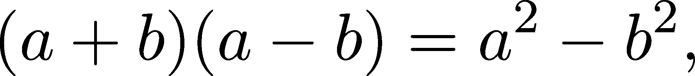

# 附录 A

这只是逻辑

> 逻辑规则对数学的重要性，就如同结构规则对建筑学的重要性。—— 伯特兰·罗素

“数学是一种语言，”我的一位教授常常这么说。“学习数学从建立基本词汇开始。”

他忘记补充的一点是，数学是思维的语言。我经常被问到这个问题：做软件工程师/数据科学家/随机技术专业人员需要学数学吗？我的回答很简单。如果你在职业生涯中需要经常解决问题，那么数学对你是极其有益的。你不一定要有效地思考，但你会受益更多。

数学的学习曲线是陡峭的。你自己也经历过，这种困难可能让你无法熟悉其基础。我有个好消息：如果我们将学习数学视为学习一门外语，我们可以先从建立基本词汇开始，而不是直接深入到诗歌和小说中。正如我的教授所建议的那样。

## A.1 数学逻辑 101

逻辑和清晰的思维是数学的基础。但那是什么呢？你会如何解释“逻辑”是什么？

我们的思维过程通过数学逻辑这一领域被形式化。在逻辑中，我们处理命题，也就是那些要么为真要么为假的陈述。“外面在下雨。” “人行道是湿的。”这两个都是有效的命题。

为了能够有效地推理命题，我们通常用罗马大写字母表示它们，比如


每个命题都有一个对应的真值，要么为真，要么为假。它们通常用 1 和 0 来表示。尽管这看起来没什么大不了的，但找出真值可能是非常困难的。想想这个命题


这是著名的 P = NP 猜想，数学中最长期未解决的问题之一。这个命题容易理解，但解决这个问题（也就是找到对应命题的真值）一直令最聪明的大脑也束手无策。

从本质上讲，我们整个科学知识体系都包含在我们已经确定真值的命题中。那么，如何在实践中做到这一点呢？

## A.2 逻辑连接词

就命题本身而言，它们不足以提供有效的推理框架。数学（以及现代科学的整个体系）是由逻辑连接词构成的小型构件形成的复杂命题的集合。每个连接词接受一个或多个命题，并转变它们的真值。

“如果外面在下雨，那么人行道就会湿。”这是两个命题通过蕴含连接词结合在一起的例子。蕴含连接词共有四种基本类型：否定、析取、联结和蕴含。我们将逐一详细讨论每一种。

否定将命题的真值翻转为相反的值。它用数学符号¬表示：如果 A 是一个命题，那么¬A 就是它的否定。连接词通过真值表来定义，真值表列举了给定输入时结果表达式的所有可能真值。用文字书写，这看起来可能很复杂，所以这里提供¬的真值表来说明这一概念。


在自然语言中表达命题时，否定通常用“not”来表示。例如，“屏幕是黑色”命题的否定是“屏幕不是黑色”。（而不是“屏幕是白色”。）

逻辑与（conjunction）等同于语法中的“和”连接词，用符号∧表示。命题 A ∧B 只有在 A 和 B 都为真时才为真。例如，当我们说“桌子已摆好，食物也准备好了”时，意味着两个部分都为真。以下是真值表：


析取在英语中被称为“or”，用符号∨表示。命题 A ∨B 在其中一个为真时为真：


析取是包容性的，不像我们在自然语言中常用的排他性“或”。当你说“我正在坐火车或开车旅行”时，不能两者都为真。析取连接词不是排他性的。

最后，蕴含连接词（→）形式化了从前提 A 推导出结论 B 的过程：“如果 A，那么 B。”

蕴含仅在前提为真而结论为假的情况下为假；否则为真。


一个例子是笛卡尔的名言：“我思故我在。”将其翻译为形式逻辑语言，就是


形式为“如果 A，那么 B”的句子称为条件句。这不仅仅是哲学问题。科学是由这样的命题组成的：“如果 X 是一个封闭系统，那么 X 的熵不能减小。”（这是热力学第二定律所述的内容。）

我们的大部分科学知识由 A →B 命题组成，科学研究等同于追求蕴含的真值。在实际问题中，我们依赖于定理（即蕴含），这些定理将我们的前提转化为结论。

## A.3 命题演算

如果你觉得连接词类似于算术运算，你是对的。连接词生成命题。因此，连接词可以再次应用，形成复杂的表达式，如 ¬(A ∨B) ∧C。构建这样的表达式和推理论证称为命题演算。

就像算术运算一样，由命题和连接词组成的表达式也有恒等式。想想著名的代数恒等式



这是最常用的符号表达式之一。这样的恒等式意味着我们可以用一种形式写出另一种形式。

在数学逻辑中，我们称这些为逻辑等价性。

定义 102. （逻辑等价性）

如果命题 P 和 Q 总是有相同的真值，则它们在逻辑上等价。

如果 P 和 Q 在逻辑上等价，我们写作

P ≡ Q.

为了给你一个例子，来看一下我们的第一个定理，它建立了合取连接词的逻辑等价性。

定理 140. （合取的性质）

设 A、B 和 C 为任意命题。那么，

(a) (A ∧B) ∧C ≡A ∧ (B ∧C) （结合律）

(b) A ∧B ≡B ∧A （交换律）

(c) A ∨ (B ∧C) ≡ (A ∨B) ∧ (A ∨C) （分配律）

(d) A ∧A ≡A （幂等律）

证明。通过绘制真值表来展示这些性质。我们将为 (a) 做这一步，而其余部分留给你作为练习。（我强烈建议你做这件事，因为自己完成任务是一个很好的学习机会。）

对于结合性性质，庞大的真值表


提供了一个证明。

有几条备注需要说明。首先，我们应该从左到右阅读真值表的列。严格来说，我们可以省略 A∧B 和 B∧C 的列。然而，包含这些列能帮助思维更清晰。

其次，由于结合律，我们可以自由地写 A ∧B ∧C，因为运算顺序无关紧要。

最后，注意我们的第一个定理是一个前提和一个结论，通过蕴含连接词连接起来。如果我们用


那么我们定理的第一部分就是命题 P →Q，我们已经通过列出真值表证明了它是正确的。这展示了我们在此构建的命题演算的巨大力量。

定理 140 有一个关于析取的类似命题。为了完整起见，下面陈述了该命题，但证明留给你作为练习。

定理 141. （析取的性质）

设 A、B 和 C 为任意命题。那么，

(a) (A ∨B) ∨C ≡A ∨ (B ∨C) （结合律）

(b) A ∨B ≡B ∨A （交换律）

(c) A ∧ (B ∨C) ≡ (A ∧B) ∨ (A ∧C) （分配律）

(d) A ∨A ≡A （幂等性）

就像算术运算一样，逻辑连接词也有优先级顺序：¬,∧,∨,→。这意味着，例如，(¬A) ∧B) ∨C 可以写成 ¬A ∧ (B ∨C)。

在我们的命题演算中，最重要的规则之一就是德摩根定律，它描述了合取和析取在否定下的行为。

定理 142\. （德摩根定律）

设 A 和 B 为两个任意命题。那么，

(a) ¬(A ∧B) ≡¬A ∨¬B

(b) ¬(A ∨B) ≡¬A ∧¬B

保持成立。

证明。像往常一样，我们可以通过列出两个真值表来证明德摩根定律


并且


来验证我们的论断。

我们到目前为止建立的命题演算是思维的数学形式化。然而，还有一个东西缺失：推理，或者正如维基百科所说的，“推理是从前提的真实性中得出结论的心理过程。”这一点通过著名的假言推理规则得到了体现。

定理 143\. （假言推理）

设 A 和 B 为两个命题。如果 A 和 A →B 都成立，那么 B 也成立。

证明。让我们再看一下 → 的真值表：


通过查看其行，我们可以看到，当 A 为真且 A →B 成立时，B 也为真，正如假言推理原则所示。

由于模态假言推理听起来非常抽象，这里有一个具体的例子。从常识上讲，我们知道“如果下雨，那么人行道是湿的”这个命题是成立的。如果我们从屋顶窗户观察到确实在下雨，我们就可以毫不犹豫地得出人行道是湿的结论，即使我们没有亲眼看到它。

在符号表示中，我们可以写成

A → B, A ⊢ B,

其中，推导符号 ⊢ 实质上可以理解为“证明”。因此，假言推理表明 A →B 和 A 证明了 B。

假言推理就是我们如何使用定理。它始终在背后支持着我们。

注 22\. （反转蕴含）

这是指出最常见的逻辑谬误之一——反转蕴含关系的绝佳机会。当讨论某个话题时，参与者经常会使用错误的论点

A → B, B ⊢ A。

当然，这是不成立的。例如，考虑我们最喜欢的例子：


显然，A → B 成立，但 B → A 不成立。湿滑的人行道有其他原因。例如，有人不小心把一桶水洒在上面。

## A.4 变量和谓词

所以，数学是关于命题、蕴涵以及它们的真值的。我们已经看到，可以使用我们的命题演算来构造命题并推理一些相当复杂的表达式。然而，到目前为止，我们建立的语言并不适用于带有变量的命题。

例如，想想这句话


因为真值依赖于 x，这并不是一个结构良好的命题。

带有变量的句子叫做谓词，我们通过强调它们对变量的依赖来表示它们；例如，

P (x) : x ≥ 0，

或者


每个谓词都有一个域，从中可以获取其变量。你可以将谓词 P(x) 视为一个函数，它将其域映射到集合 {0, 1}，表示它的真值。（严格来说，当我们定义我们形式语言的基础时，并没有可用的函数作为工具。然而，我们不是哲学家或集合论专家，所以我们不需要关心这些细节。）

谓词定义了真集，即谓词为真的域的子集。从形式上讲，它们表示为

{*x* ∈ *D* : *P*(*x*)}, (A.1)

其中 P(x) 是一个具有定义域 D 的谓词。

翻译成英文为（A.1）：“对于 D 中的所有元素 x，P(x) 为真。”

虽然我们之前没有讨论过集合，但如果你有计算机科学背景，真集可能显得很熟悉。例如，如果你曾使用过 Python 编程语言，你可能见过像这样的表达式

```py
s = {x for x in range(1, 100) if x % 5 == 0}
```

一直如此。这些叫做概念化，它们受到所谓的集合构造符号的启发，如（A.1）。

## A.5 存在量化和全称量化

谓词是正式化数学思维的一大进步，但我们还没有完全到达目标。举一个机器学习的例子，我们来谈谈如何找到损失函数的最小值（也就是训练模型）。

如果对于其定义域 D 中的所有其他 y，f(x) ≤ f(y) 成立，则称点 x 为函数 f(x) 的全局最小值。例如，点 x = 0 是函数 f(x) = x² 的一个最小值。

我们如何在我们的形式化语言中表达这个呢？首先，我们可以说


其中我们固定 f(x) = x² 和 x = 0。这个句子有两个部分：对于所有 y ∈ D，以及 f(x) ≤ f(y) 为真。第二部分是一个谓词：


其中 y ∈ ℝ。

第二部分似乎是新的，因为我们在我们的形式语言中从未见过“对于所有”的词语。它们表达了一种关于何时谓词 P(y) 为真的量化方式。

在数学逻辑中，我们需要的两个量词是：全称量词“对所有”，用符号 ∀ 表示，以及存在量词“存在”，用符号 ∃ 表示。

例如，考虑句子“我的所有朋友都是数学家。”通过定义集合 F 为我的朋友集合，并将这个定义域上的谓词表示为


我们可以将我们的句子形式化为


记住，谓词 M(x) 的定义域是 F。我们本可以省略这一点，但这样写更易于理解。

类似地，“我至少有一个朋友是数学家”可以翻译为


当量词后面有更复杂的命题时，我们用括号标记它的范围：


注意到，由于 (∀x ∈F,M(x)) 和 (∃x ∈F,M(x)) 只有一个真值，它们是命题，而不是谓词！因此，量词将谓词转化为命题。像其他命题一样，逻辑联接词可以应用于它们。

在所有运算中，否定是最有趣的。为了看清楚为什么，假设我们考虑之前的例子：“我的所有朋友都是数学家。”起初，你可能会说它的否定是“我的朋友都不是数学家”，但这并不正确。想一想：我可以有数学家的朋友，只要不是所有朋友都是数学家。所以，


换句话说（或者应该说是符号），我们有


也就是说，粗略地说，∀ 的否定是 ∃，而 ∃ 的否定是 ∀。

## A.6 问题

问题 1\. 使用真值表证明

(a) A ∨¬A 为真，

(b) 和 A ∧¬A 为假。

换句话说，A ∨¬A 是一个重言式，而 A ∧¬A 是一个矛盾式。（我们称总为真的表达式为重言式，总为假的表达式为矛盾式。）

问题 2\. 定义异或运算 XOR，用 ⊕ 表示，真值表如下


证明

(a) A ⊕B ≡ (¬A ∧B) ∨ (A ∧¬B)

(b) 和 A ⊕B ≡ (¬A ∨¬B) ∧ (A ∨B)

保持成立。

## 加入我们的 Discord 社区

与其他用户、机器学习专家以及作者本人一起阅读本书。提出问题，为其他读者提供解决方案，通过“问我任何问题”环节与作者聊天，等等。扫描二维码或访问链接加入社区。[`packt.link/math`](https://packt.link/math)


