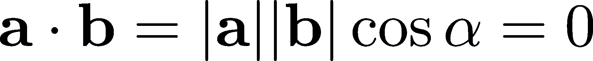
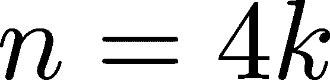

# 附录 B

数学的结构

我们已经走过了很长的路程：我们研究了命题、逻辑联结词、谓词、量词和所有形式逻辑。这是为了能够谈论数学。然而，最终，我们希望做的是数学。

作为唯一的精确科学，数学建立在定义、定理和证明的基础上。我们精确地定义对象，对它们提出猜想，然后用数学上正确的论证证明这些猜想。你可以把数学看作是由命题、蕴涵和 modus ponens 组成的庞大建筑。如果一个定理失败，那么所有依赖于它的其他定理也都会失败。

在其他科学领域，操作方式是假设、实验和验证。然而，在数学中，实验并不足够。例如，考虑著名的费马数，即形如 F[n] := 2^(2^n) + 1 的数。费马曾猜测它们都是素数，因为 F[0]、F[1]、F[2]、F[3] 和 F[4] 都是素数。

在某些科学领域，五次肯定的“实验”可能足以接受假设为真。然而在数学中却不行。1732 年，欧拉证明了 F[5] = 4,294,967,297 不是素数，因为 4,294,967,297 = 641 × 6,700,417。（想象一下在 18 世纪计算这个数字，计算机时代还远未到来。）

到目前为止，我们在讨论数学逻辑时已经看到了若干定义、定理，甚至证明。现在是时候放大镜下审视它们，看看它们究竟是什么！

## B.1 什么是定义？

模糊性是自然语言的缺点。例如，如何定义“热”这一概念？经过几次尝试，你会很快发现没有两个人对其有相同的定义。

在数学中，没有模糊性存在的余地。每个对象和每个属性必须被精确定义。最好通过一个好的例子来理解，而不是进行哲学思考。

定义 103.（约数）

设 b ∈ ℤ 是一个整数。我们说 a ∈ ℤ 是 b 的约数，当且仅当存在一个整数 k ∈ ℤ，使得 b = ka。

“a 是 b 的约数”这一属性用 a∣b 表示。

例如，2∣10 和 5∣10，但 7 ∤ 10。（交叉符号表示所述属性的否定。）

用我们正式语言来表达，“a 是 b 的约数”的定义可以写作：

*a* ∣ *b* ：∃ *k* ∈ ℤ，*b* = *k**a*。（B.1）

不要让 a∣b 的符号迷惑了你；这实际上是一个伪装的谓词。我们本可以用其他方式表示 a∣b，例如：

尽管每一个数学定义都可以形式化，但我们更倾向于使用自然语言，因为它更容易理解。（至少对人类来说是这样，对计算机来说则不然。）

就像积木一样，定义是层层叠加的。

（如果你有敏锐的细节观察力，你会注意到，即使是定义 103 也建立在其他概念之上，比如数字、乘法和等式。我们没有精确定义这些概念，只是假设它们是存在的。由于我们的目标不是从零开始重建数学，因此我们会对此略过不提。）

再次强调，最好在这里看一个例子。让我们来看一下偶数和奇数！

定义 104. （偶数和奇数）

设 n ∈ℤ 是一个整数。我们说 n 是偶数，当且仅当 2∣n。

反过来，我们说 n 是奇数，当且仅当 2 ∤ n。（符号 a ∤ b 表示“a 不是 b 的约数”的否定。）

再一次，用我们正式的语言。对于整数 n ∈ℤ，谓词

并且

表示与定义 104 相同。

这些例子并不太吸引人，所以让我们看看更有趣的内容！

定义 105. （质数）

设 p ∈ℕ 是一个正整数。我们说 p 是质数，如果

（a）p/span>1，

（b）如果 a∣p，则 a = 1 或 a = p。

换句话说，质数除了它们自己之外没有其他整数约数。前几个质数是 2、3、5、7、11、13、17 等等。非质数整数称为合成数。

图 B.1：谓词逻辑中质数定义的分解

质数的定义可以写成：

P (p) : (p >1)∧ (∀a ∈ ℤ,(a | p → ((a = 1) ∨ (a = p))))。

这看起来可能很复杂，但我们可以将其分解成几个部分，如图 B.1 所示。

质数在我们日常生活中起着至关重要的作用！例如，许多主流的加密方法使用大质数来加密和解密信息。没有它们，你就无法安全地发起金融交易。

它们的有用性通过它们的各种性质得到保证，这些性质以定理的形式被建立起来。我们很快就会看到其中的一些，但首先，让我们谈谈定理到底是什么。

## B.2 什么是定理？

所以，定义本质上是一个谓词，它的真值集由我们关心的对象组成。数学的核心就是发现涉及这些对象的真命题，通常以 A → B 的形式。考虑以下定理。

定理 144. （凸函数的全局最小值存在性）

设 ![f : [0,1] → ℝ ](img/file2117.png) 是一个函数。如果  是连续的，则存在一个 ，使得  在  处达到最小值，且该点属于区间 ![[0,1] ](img/file2122.png)。

（即，对于所有 ![x ∈ [0,1] ](img/file2123.png)，我们有 。）

如果你对连续性和最小值的概念不熟悉，不用担心；这不是重点。关键是，定理 144 可以写成：

其中，F 表示所有函数的集合 [0,1] →ℝ，谓词 C(f) 和 M(f) 定义如下：

![ C (f ) : f 在 [0,1] 上是连续的， ∗ ∗ M (f ) : ∃x ,∀x ∈ [0,1],f (x ) ≤ f(x). ](img/file2126.png)

注意定理的结构：“设 x ∈A。如果 B(x)，则 C(x)。” 在第一句中，我们确定了谓词 A(x) 和 B(x) 的定义域，并且在条件句“如果 B(x)，则 C(x)”前放置了一个全称量词。

## B.3 什么是证明？

现在我们理解了什么是定理，是时候看看证明了。我们刚刚看到，定理是正确的命题。证明是建立命题真理的推理过程。让我们来看一个例子，而不是像哲学家那样讨论！

定理 144 的证明我们还无法完成，因此让我们看看一个更简单的例子：偶数之和。

定理 145\. （偶数之和）

设 n,m ∈ℤ 为两个整数。如果 n 和 m 都是偶数，那么 n + m 也是偶数。

证明。由于 n 是偶数，2∣n。根据定义 103，这意味着存在一个整数 k ∈ℤ，使得 n = 2k。

类似地，由于 m 也是偶数，存在一个整数 l ∈ ℤ，使得 m = 2l。将两者相加，我们得到

给定 n + m 确实是偶数。

如果仔细阅读上面的证明，你可能会注意到它是一系列的蕴含和模态推理。正是这两者构成了我们推理技能的支柱。所证明的结论已经铁定。

理解什么是证明是数学中最大的技能差距之一。如果你没有马上理解，别担心；这是一个深奥的概念。你最终会习惯证明的。

## B.4 等价命题

数学的基本构建块是形式为 A →B 的命题；至少，这是我在本章中强调的内容。

我没有说得很准确。命题 A →B 翻译为“如果 A，那么 B”，但有时，我们知道得更多。通常，A 和 B 具有相同的真值。在自然语言中，我们通过说“当且仅当 B 时 A”来表达这一点。（尽管这种情况比简单的条件句要少得多。）

在逻辑中，我们用双条件连接词 ↔︎ 来表示这种关系，其定义为

“当且仅当”类型的定理称为等价命题，它们在数学中起着至关重要的作用。在证明等价命题时，我们必须同时证明 A →B 和 B →A。

为了看到一个例子，让我们回到初等几何学。正如你可能在高中学到的那样，我们可以用由两个实数构成的元组来描述平面上的几何对象。通过这种方式，几何性质可以转化为分析性质，并且我们通常可以通过简单的计算证明困难的定理。

例如，让我们讨论正交性，这是数学中最重要的概念之一。这里是平面上两个向量的正交性定义。

定义 106\. （正交性）

设 a 和 b 是平面上的两个非零向量。如果它们夹角为 π∕2，则称 a 和 b 互相正交。

正交性用 ⊥ 符号表示；也就是说，a ⊥ b 意味着 a 和 b 是正交的。

为了简便起见，我们总是假设夹角在 0 和 π 之间。（π 弧度等于 180 度，但我们总是使用弧度。）

然而，测量两个任意向量之间的夹角并不像听起来那么简单。我们需要一个可操作的公式，这就是点积的用武之地。

定义 107\. （平面向量的点积）

设 a = (a[1], a[2]) 和 b = (b[1], b[2]) 是平面上的两个向量。它们的点积 a ⋅ b 定义为

其中，α 是两个向量之间的夹角，|⋅| 表示向量的大小。

点积提供了一个关于正交性的等价定义，以“当且仅当”定理的形式表达。

定理 146\。

设 a = (a[1], a[2]) 和 b = (b[1], b[2]) 是平面上的两个非零向量。那么，当且仅当 a ⋅ b = 0 时，a 和 b 是正交的。

让我们来看一下这个等价关系的证明！

证明。我们需要证明两个命题：

(a) a ⊥ b ⇒ a ⋅ b = 0，

(b) a ⋅ b = 0 ⇒ a ⊥ b。

我们从 (a) 开始。如果 a ⊥ b，那么它们之间的夹角 α 等于 π∕2。于是，

这正是我们需要展示的内容。

为了证明 (b)，我们必须注意到，由于 a 和 b 都是非零向量，它们的大小 |a|、|b| 也都是非零的。因此，

只有当 cosα = 0 时，这个式子才成立。反过来，这意味着 α = π∕2；也就是说，a ⊥ b。（回想一下，我们假设夹角 α 在 0 和 π 之间。）

所以，我们已经知道了关于定理和证明的一切。那么，如何在实际中找到证明呢？让我们来看看基本的技巧。

## B.5 证明技巧

这没有捷径可走：证明定理是困难的。有些最聪明的人花了几十年，有些猜想在一个世纪后仍未解决。（也就是说，它们既未被证明也未被反驳。）

一些基本而强大的工具可以帮助人们克服困难。接下来，我们将看看三种最重要的工具：数学归纳法、反证法和对立命题原则。

### B.5.1 数学归纳法证明

你如何爬一段楼梯？很简单。你先爬第一步，然后爬下一步，依此类推。

你可能会感到惊讶，但这正是我们在数学中经常使用的东西。

让我们通过一个例子来阐明这一点。

定理 147\. （自然数之和）

设 n ∈ℕ 为任意整数。那么，

1 + 2 + ⋯ + *n* = *n*(*n* + 1) 2 (B.2)

成立。

证明。对于 ，情况很明确：(B.2) 的左侧计算结果为 1，而右侧是

因此，我们的命题对于 n = 1 成立，这叫做基本情况。

这里就是关键步骤，即归纳步骤。我们假设 (B.2) 对给定的 n 成立；也就是说，我们有

这就是所谓的归纳假设。使用这个假设，我们将证明 (B.2) 对 n+1 也成立。换句话说，我们的目标是证明：

根据我们的归纳假设，我们有：

![ [ ] 1 + 2+ ⋅⋅⋅+ n + (n + 1) = 1+ 2 + ⋅⋅⋅+ n + (n + 1) n(n + 1) = --------+ (n + 1). 2 ](img/file2141.png)

继续计算，我们得到：

这就是我们需要证明的。

总结一下发生了什么，我们用谓词来表示方程 (B.2)：

归纳证明分为两个主要步骤。首先，我们证明基本情况 S(1) 是成立的。然后，我们证明对于任意 n，蕴含式 S(n) → S(n + 1) 成立。从归纳步骤出发，这意味着 S(n) 对所有 n 都成立：这一系列的蕴含

结合 S(1) 和强大的模态推理（定理 143）得出 S(n) 为真。我们首先完成了第一步 S(1)，然后证明我们可以从任意位置进行下一步。

归纳法并不容易理解，因此这里提供另一个例子。（它比之前的稍微复杂一些。）跟随证明过程，看看你是否能识别出归纳法的痕迹。

定理 148.（数论的基本定理）

设 n ∈ ℤ 是一个整数，并假设 n > 1。那么，n 可以唯一地表示为素数的乘积；即，存在素数 p[1], p[2], ..., p[l] 和指数 k[1], k[2], ..., k[l]，使得：

*n* = *p*[1]^(*k*[1]) *p*[2]^(*k*[2]) ⋯ *p*[*l*]^(*k*[*l*])。（B.3）

此外，这个表示是唯一的。

例如，24 = 2³3，且 24 不能写成其他素数的乘积。

自然语言的表达掩盖了它的本质，但事实上，定理 148 可以转化为以下句子：

![ [ k1 k2 kl ] ∀n ∈ ℤ (n >1) → (∃p1,...,pl,k1,...,kl ∈ ℤ,(∀i,pi 是素数 )∧(n = p1 p2 ...pl )) . ](img/file2145.png)

为了简单起见，我们只证明素因数分解的存在性，而不证明唯一性。

证明。（存在性）对于 n = 2，定理显然成立，因为 2 本身就是一个素数。

现在，设 n > 2，并假设 (B.3) 对所有小于或等于 n 的整数 m 都成立。（这是我们的归纳假设。）

我们的目标是证明 (B.3) 对 n + 1 也成立。

有两种可能性：要么 n + 1 是一个素数，要么是一个合成数。如果它是素数，那么我们已经完成了，因为 n + 1 本身就是 (B.3) 的形式。否则，如果 n + 1 是一个合成数，我们可以找到一个不是 1 或 n + 1 的约数：

对于某些 a,b ∈ ℤ。由于 a,b ≤ n，我们可以应用归纳假设！展开来说，这意味着我们可以把它们写成

其中 p[i],q[i] 是质数，α[i],β[i] 是指数。因此，

这只是(B.3)，不过符号多了一些。

数学中的归纳法就像是一把电动工具。它非常强大，只要适用，几乎总能完成任务。

### B.5.2 反证法证明

有时候，通过假设结论为假，然后推导出矛盾，证明定理会更容易。

再次，最好看一个快速的例子。让我们重新回顾一下我们亲爱的老朋友——质数。

定理 149\。

有无限多个质数。

证明。假设质数是有限个：p[1],p[2],…,p[n]。

整数 p[1]p[2]…p[n] + 1 是质数吗？如果 p[1],p[2],…,p[n] 是所有质数，那么只需检查是否

这确实成立，因为根据定义，p[1]p[2]…p[n] + 1 = p[i]k + 1，其中 k 只是除 p[i] 之外的质数的乘积。

由于没有 p[i] 是 p[1]p[2]…p[n] + 1 的约数，它必须是一个质数。我们发现了一个新的质数，它不在我们的列表中！这意味着我们的假设（即质数是有限个）导致了矛盾。

因此，质数必须是无限多个。

如果你眼光敏锐，你可能已经注意到，上面的例子并不是 A →B 的形式；它只是一个简单的命题：

在这些情况下，证明 ¬A 为假会得到所需的结论。然而，这种技巧对于 A →B 风格的命题同样适用。（顺便说一句，定理 148 的存在部分也可以通过反证法证明；我将这个留给你作为练习。）

### B.5.3 逆命题

我们将要学习的最后一个技巧是逆命题，这是一个巧妙的方法，它给经典的 A →B 风格的思维方式带来了变化。

我们应该更好地了解蕴含连接词，看看它是什么。事实证明，A →B 可以通过否定和析取来表示。

定理 150\。

设 A 和 B 为两个命题。那么，

证明。真值表

提供了一个证明。

为什么这与我们有关呢？很简单。看一下以下的推论。

推论 4\。 （逆命题原理）

设 A 和 B 为两个命题。那么，

证明。定理 150 说明

这就是我们需要证明的内容。

这里有一个简单的整数命题，给你一个数学例子。

定理 151\。

让表示一个整数。如果，则。

证明。我们应该通过对立命题来证明这一点。因此，假设 4∣n。这意味着

对于某个整数 k ∈ℤ。然而，这意味着

这表明 2∣n。由于对立命题的原理，（4∣n）→（2∣n）与（2∤ n）→（4∤ n）在逻辑上是等价的，这就是我们需要证明的内容。

对立命题不仅在数学中有用，它还是一种非常有价值的思维工具。我们来考虑一个反复出现的命题：“如果外面下雨，那么人行道是湿的。”我们知道这是对的，但这也意味着“如果人行道不湿，那么外面就没有下雨”（因为如果下雨的话，人行道应该是湿的）。

你每天都会不自觉地进行这类推理。现在你有了一个名字，可以开始有意识地应用这个模式了。

## 加入我们的 Discord 社区

与其他用户、机器学习专家和作者本人一起阅读这本书。提出问题，为其他读者提供解决方案，通过“问我任何问题”环节与作者交流，还有更多内容。扫描二维码或访问链接加入社区。[`packt.link/math`](https://packt.link/math)

