# 附录 C

集合论基础

> 换句话说，一般的集合理论其实非常基础，但如果你想成为一名数学家，你需要了解它，这里有它；读一读，吸收它，然后忘掉它。——保罗·哈尔莫斯

虽然保罗·哈尔莫斯很久以前说过上述话，但它依然非常准确。只有一个部分已经过时：集合论不仅对数学家必要，对于计算机科学家、数据科学家和软件工程师同样重要。

你可能以前听说过或学习过集合论。可能很难理解它为何对机器学习如此重要，但相信我，集合论是数学的基础。深层次来看，一切都是集合，或者是集合之间的函数。（正如我们在第九章看到的，甚至函数也可以定义为集合。）

可以将集合论与机器学习的关系比作语法与诗歌的关系。要写出优美的诗歌，一个人需要熟悉语言的规则。例如，数据点在向量空间中表示为向量，通常是通过集合的笛卡尔积构造的。（如果你不熟悉笛卡尔积，不用担心，我们很快会讲到的。）或者，要真正理解概率论，你需要熟悉事件空间，它是一些在特定操作下封闭的集合系统。

那么，集合到底是什么呢？

## C.1 什么是集合？

从表面上看，集合只是一个事物的集合。我们通过列举其元素来定义集合，例如

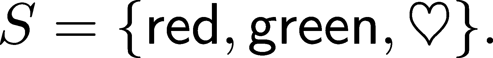

如果两个集合具有相同的元素，则这两个集合相等。给定任何元素，我们总是能判断它是否是某个集合的成员。当 A 的每个元素也是 B 的元素时，我们说 A 是 B 的子集，或者用符号表示为，

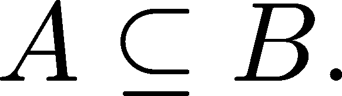

如果 A ⊆B 且 A≠B，我们说 A 是 B 的真子集，并写作 A ⊂B。如果我们有一个集合，我们可以通过指定所有元素满足的某个属性来定义子集，例如，

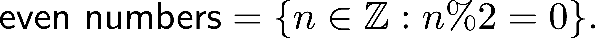

（%表示取模运算符。）这种方法被称为集合构造符号，如果你熟悉 Python 编程语言，你可以看到它启发了列表推导式。在那里，人们会写出类似这样的代码：

```py
even_numbers = {n for n in range(10) if n%2 == 0} 

print(even_numbers)
```

```py
{0, 2, 4, 6, 8}
```

我们甚至可以将集合描述为其他集合的集合，比如，A 的所有子集的集合。这称为幂集，是一个如此重要的概念，值得为其单独定义。

定义 108. （幂集）

设 A 为任意集合。由以下定义的集合

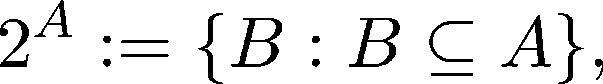

包含 A 的所有子集的集合称为 A 的幂集。

∅和 A 都是幂集 2^A 的元素。

不幸的是，定义集合为元素的集合并不可行。没有更多的条件，它可能导致悖论，正如著名的罗素悖论所示。（我们将在本章后面讨论这个问题。）为了避免深入集合论的困境，我们接受集合有某种正式的定义，这个定义埋藏在数学的千页大书中。与其担心这些，不如专注于我们可以用集合做些什么。

## C.2 集合运算

仅用这两种方法（列出成员或使用集合构造符号）描述更复杂的集合是非常困难的。为了简化工作，我们定义了集合上的运算。

### C.2.1 并集、交集、差集

最基本的运算是并集、交集和差集。你可能对这些比较熟悉，因为它们在高中时就经常遇到。即使你已经熟悉了它们，接下来还是看看正式的定义吧。

定义 109.（集合运算）

设 A 和 B 为两个集合。我们定义

(a) 它们的并集由 A ∪B := {x : x ∈A 或 x ∈B} 定义，

(b) 它们的交集由 A ∩B := {x : x ∈A 且 x ∈B} 定义，

(c) 它们的差集由 A ∖B := {x : x ∈A 且 xB} 定义。

我们可以通过文氏图轻松地可视化这些运算，如下所示。

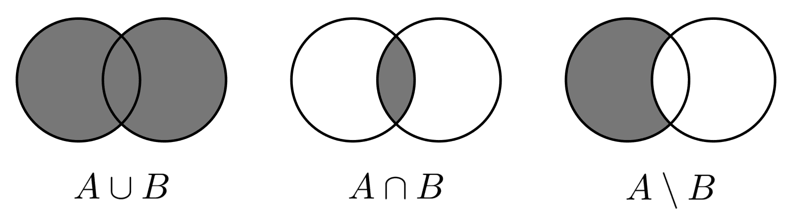

图 C.1：通过文氏图可视化的集合运算

我们也可以用简单的英语表达集合运算。例如，A∪B 表示“A 或 B”。类似地，A ∩B 表示“A 且 B”，而 A ∖B 表示“A 但不是 B”。在谈到概率时，这些表达将有助于将事件转化为集合论的语言。

这些集合运算也有许多愉快的性质。

例如，它们在括号方面表现良好。

定理 152\。

设 A、B 和 C 为三个集合。并集操作是

(a) 结合性，即 A ∪ (B ∪C) = (A ∪B) ∪C，

(b) 交换性，即 A ∪B = B ∪A。

此外，交集运算也是结合性和交换性的。最后，

(c) 并集对交集具有分配性，即 A∪(B∩C) = (A ∪B) ∩ (A ∪C)，

(d) 交集对并集具有分配性，即 A ∩ (B ∪C) = (A ∩B) ∪ (A ∩C)。

并集和交集可以为任意多个操作数定义。也就是说，如果 A[1]、A[2]、…、A[n]是集合，

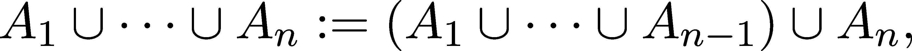

交集的情况类似。请注意，这是一种递归定义！由于结合性，括号的顺序无关紧要。

结合性和交换性可能看起来既抽象又微不足道。然而，并非所有运算都是如此，因此强调这些概念是值得的。如果你感兴趣，非交换性运算就在我们眼前，一个简单的例子是字符串连接。

```py
a = /span>string/span> 
b = /span>concatenation/span> 
a + b == b + a
```

```py
False
```

### C.2.2 德·摩根定律

其中一个基本规则描述了集合差、并集和交集在集合运算中的共同行为，这些被称为德·摩根定律。

定理 153．（德摩根定律）

设 A、B 和 C 为三个集合。那么

(a) A ∖ (B ∪C) = (A ∖B) ∩ (A ∖C)，

(b) A ∖ (B ∩C) = (A ∖B) ∪ (A ∖C)。

证明。为了简单起见，我们将通过维恩图来证明这一点。虽然画图并不是一种“正式”的数学证明，但这不是问题。我们在这里是为了理解事物，而不是陷入哲学讨论。

这里是该图示。

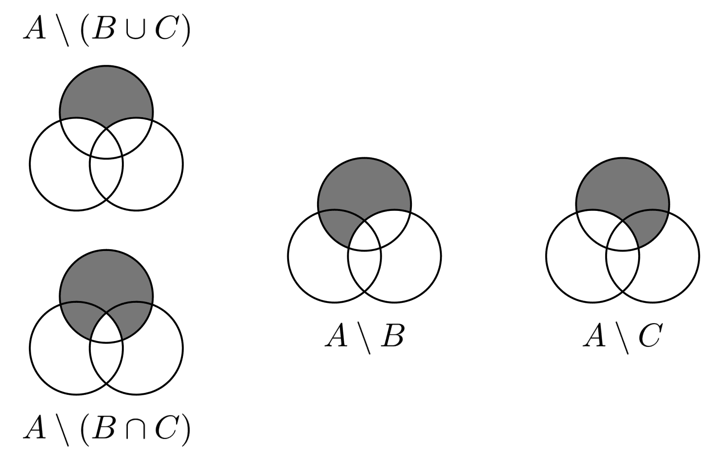

图 C.2：德摩根定律，用维恩图表示

基于此，你可以轻松看到(a)和(b)。

注意，德摩根定律可以推广到任何数量的集合。因此，对于任何Γ索引集，

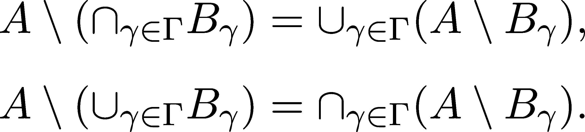

## C.3 笛卡尔积

构造新集合的最基本方法之一就是笛卡尔积。

定义 110．（笛卡尔积）

设 A 和 B 为两个集合。它们的笛卡尔积 A ×B 定义为

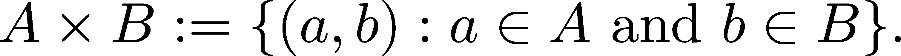

积的元素称为元组。注意，这个操作既不是结合的也不是交换的！

为了证明这一点，考虑到，例如，

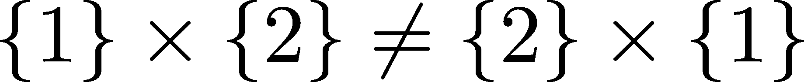

以及

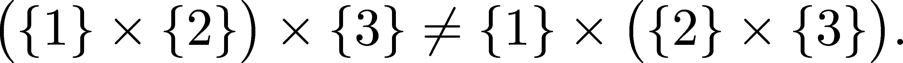

任意数量集合的笛卡尔积通过递归定义进行定义，就像我们处理并集和交集时一样。因此，如果 A[1]、A[2]、…、A[n]是集合，那么

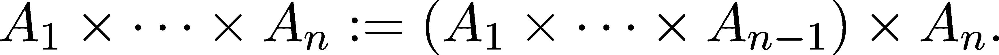

在这里，元素是由多个元组组成的元组，为了避免写太多括号，我们可以将其简化为(a[1],…,a[n])。当操作数相同的时候，我们通常写 A^n 来代替 A ×⋅⋅⋅×A。

最常见的例子之一是笛卡尔平面，你可能之前见过。

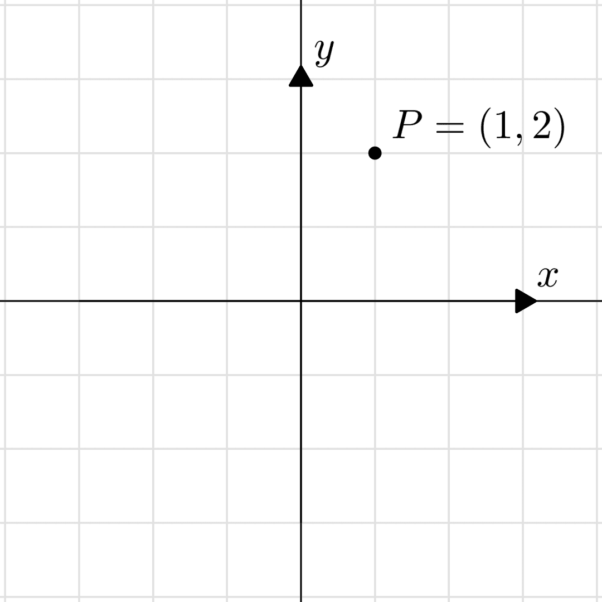

图 C.3：笛卡尔平面

为了给出一个与机器学习相关的例子，看看数据通常是如何呈现的。我们将重点关注著名的鸢尾花数据集（[`scikit-learn.org/stable/auto_examples/datasets/plot_iris_dataset.html`](https://scikit-learn.org/stable/auto_examples/datasets/plot_iris_dataset.html)），它是! ℝ4 的一个子集。在这个数据集中，四个轴分别表示花萼长度、花萼宽度、花瓣长度和花瓣宽度。

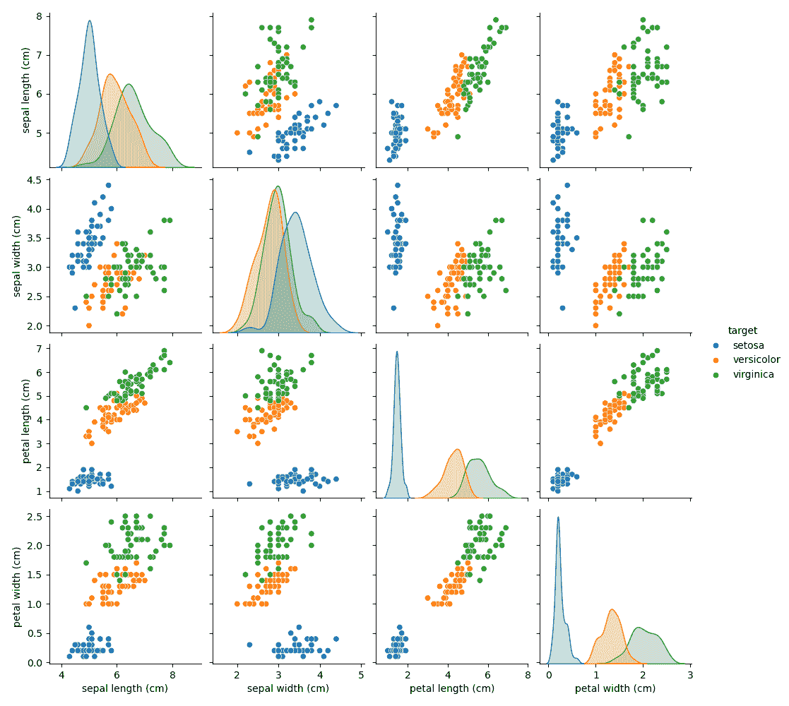

图 C.4：鸢尾花数据集中的花萼宽度与花萼长度的散点图。来源：scikit-learn 文档

正如示例所示，笛卡尔积很有用，因为它将相关信息结合成一个数学结构。这是数学中的一个重复模式：通过更简单的构建块构建复杂的事物，并通过将结果转化为另一个构建块来抽象化细节。（就像创建复杂软件一样。）

到目前为止，我们已经看到了集合的愉快一面。然而，在数学家们首次尝试形式化集合论时，它们却带来了相当大的头疼。现在我们准备好看看原因了。

## C.4 集合的基数

在集合论中，“一个集合有多少个元素？”是一个自然的问题。你可能没想到的是，这样一个看似简单的问题会把我们带入一个如此深邃的洞穴！

很快，你就会明白为什么了。“集合的大小”通过基数的概念来形式化，记作 jAj；也就是说，把集合 A 放在绝对值符号中。直观上，jAj 看起来很清晰，但让我向你保证，它并不是那么简单。

这就是数学中真正让人大吃一惊的地方。当然，对于像 {4,6,42} 这样的有限集合，我们可以自信地声称 j{4,6,42}j = 3，但 jℤj、jℚj、jℝj，甚至 jℝ²j 呢？

看这个：jℤj = jℚj，但 jℤj ≠ jℝj，且 jℝj = jℝ²j。换句话说：

+   整数的数量与有理数的数量是“相同的”。

+   但实数比整数“更多”。

+   以及实数线上的“点的数量”与平面上的一样多。

看吧，我告诉过你，基数是疯狂的开始。（“相同数量”和“更多”的引号是因为我们还没有定义这些术语，至少在数学意义上没有定义。）

与数学中的多个概念一样，我们不会直接定义基数。相反，我们将定义如何比较集合的基数，然后固定一些特殊集合作为比较的基准。

定义 111. （基数比较）

设 A 和 B 是两个任意的集合。

(a) 如果存在从 A 到 B 的双射函数，我们就说 jAj = jBj。

(b) 如果存在从 A 到 B 的单射函数，我们就说 jAj ≤ jBj。

(c) 如果存在从 A 到 B 的单射但不是满射的函数，我们就说 jAj/span> jBj。

让我们通过几个例子来解析这个问题。

示例 1. 设 A = {1,2,3} 和 B = {−3.2,12.452,−5.82}。那么 jAj = jBj，因为 f : A → B，

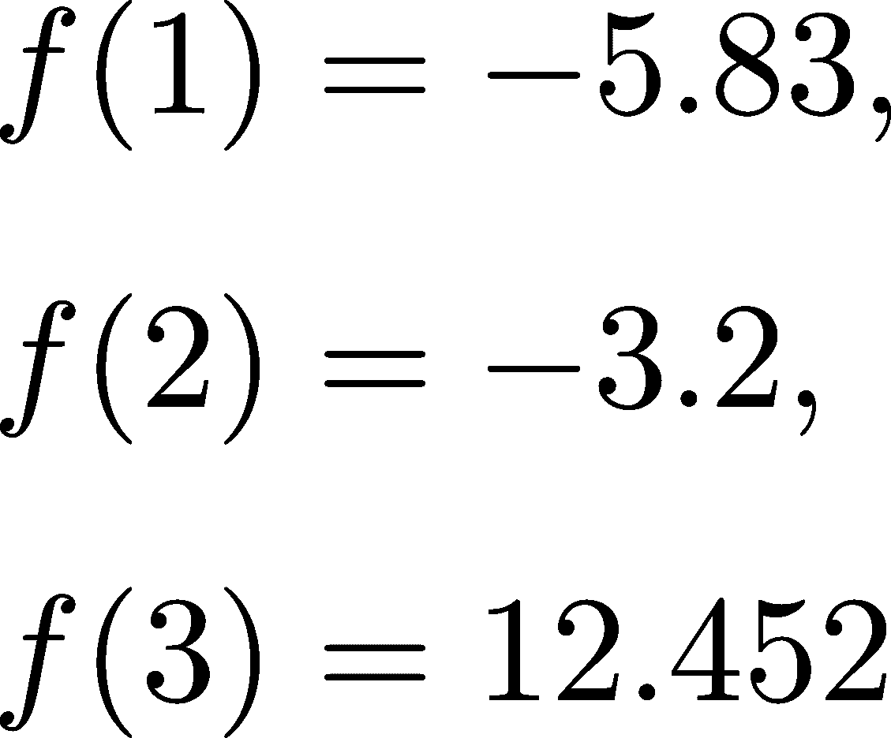

是一个双射。

示例 2. 设 A = {0,1} 和 B = {2,3,4}。那么 jAj/span> jBj，因为 f : A → B，

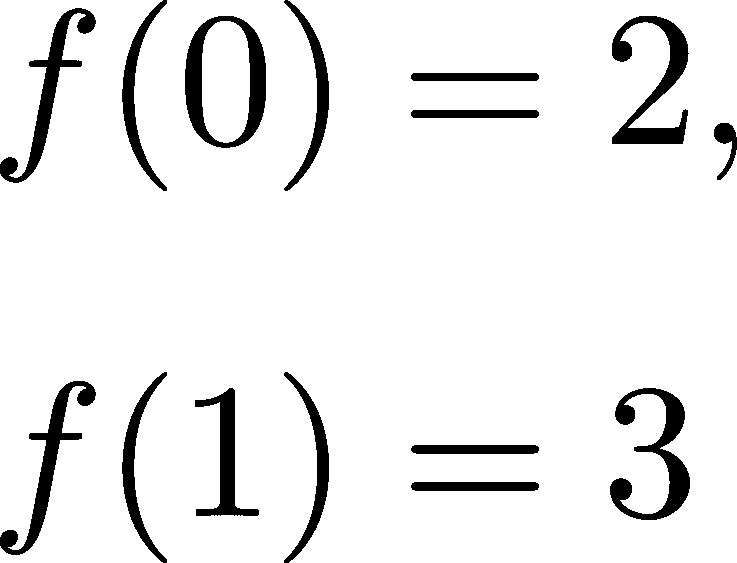

是单射，但不是满射。

那些更有趣的集合呢，比如 ℕ、ℤ、ℚ、ℝ？这就是事情变得奇怪的地方。

以下结果如此重要，以至于我们将其作为定理陈述。

定理 154. （自然数集合是无限的）

设 n ∈ ℕ 为任意自然数，并定义集合 A = {1,2,…,n}。那么 jAj/span> ℕ。

证明。证明很简单，因为很容易看出，函数 f : A → ℕ，由 f(a) = a 定义，是单射但不是满射。

换句话说，ℕ 不是一个有限集合！自然数集合是我们第一个无限集合的例子，定义了可数集合的概念。

定义 112. （可数集合）

设  是一个任意集合。如果 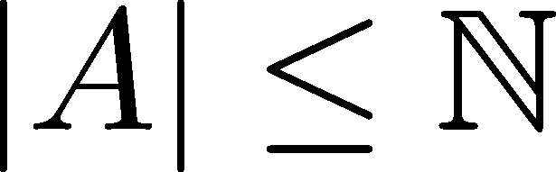，那么 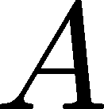 称为可数集合。

我们可以通过列举元素来证明一个集合是可数的，因为每个列举都定义了一个单射映射。例如，ℤ是可数的，因为函数 f : ℕ → ℤ定义了

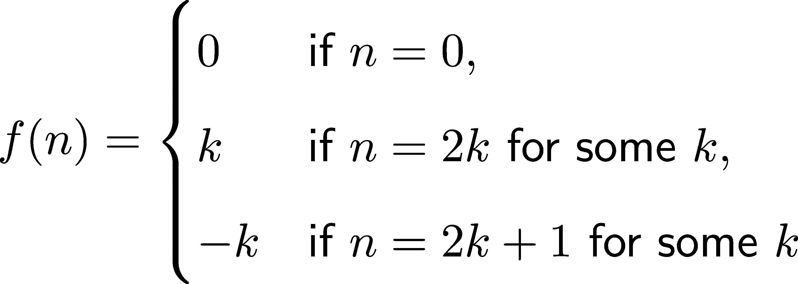

是一个双射。换句话说，序列

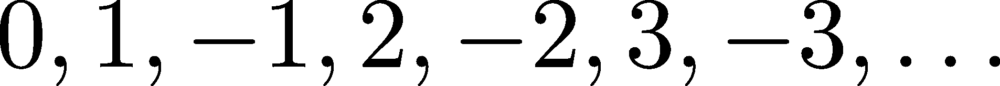

是ℤ的列举。更多示例，请参见第十章。

关于可数性，有两个重要的结果：可数集合的并集和笛卡尔积仍然是可数的。

定理 155. （可数集合的并集和笛卡尔积）

令 A[1], A[2], …是可数集。

(a) A[1] × A[2]是可数的。

(b) ∪[n=1]^∞A[n]是可数的。

在无限基数中，有两个我们常遇到的：可数无限和连续统。可数无限是自然数集合的基数，记作

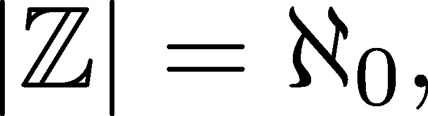

其中，ℵ是希伯来字母“阿列夫”。另一方面，连续统是实数集合的基数，记作

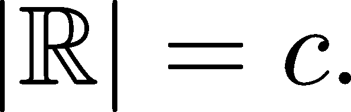

## C.5 拉塞尔悖论（可选）

让我们回到我之前提到的一个观点：天真地将集合定义为事物的集合是行不通的。接下来，我们将看到为什么。准备好迎接一些令人费解的数学吧。

这是一个谜语。一位理发师是“为所有不剃自己胡子的人刮胡子，并且仅为他们刮胡子。”那么，这位理发师自己剃胡子吗？没有正确的答案：无论是“是”还是“否”，定义都暗示着不然。这就是著名的理发师悖论。它不仅仅是一个有趣的小故事；它是一个动摇数学基础的悖论。

如我们所见，集合可以由集合组成。例如，{ℕ, ℤ, ℝ}是最常用的数集的集合。我们也可以定义所有集合的集合，我们用Ω来表示它。

有了这个，我们可以使用集合构造符号来描述以下集合的集合：

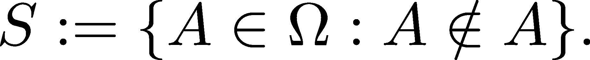

用简单的话来说，S 是一个包含所有不属于自身的集合的集合。尽管这很奇怪，但看起来有效。我们使用了属性“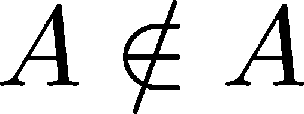”来过滤所有集合的集合。问题出在哪里？

首先，我们无法决定 S 是否是 S 的元素。如果 S ∈ S，那么根据定义，S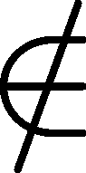S。另一方面，如果 SS，那么根据定义，S ∈ S。这确实非常奇怪。

我们可以通过分解集合构造符号来诊断问题。一般来说，它可以写作

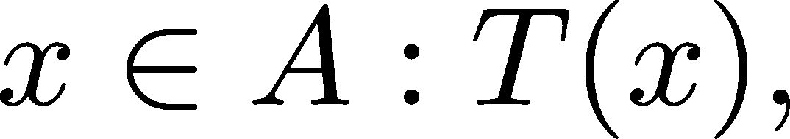

其中 A 是某个集合，T(x)是一个属性，即关于 x 的真或假的陈述。

在定义{A ∈ Ω : AA}中，我们的抽象属性通过以下方式定义

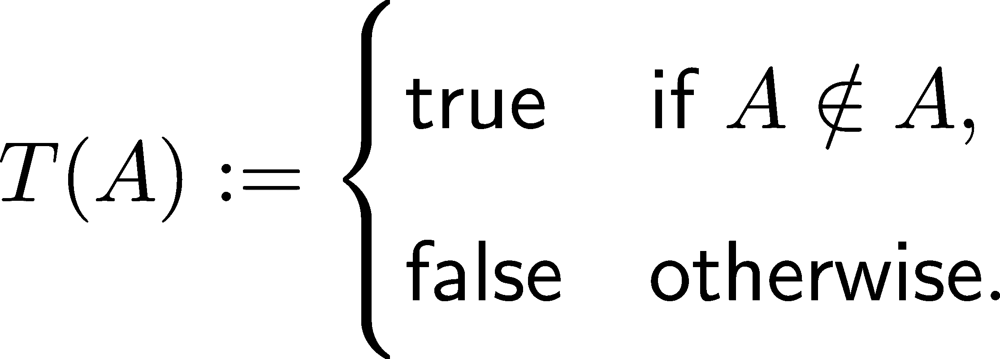

这是完全有效的，所以问题必须出现在另一个部分：集合Ω。事实证明，所有集合的集合并不是一个集合。因此，将集合定义为事物的集合是不够的。由于集合是数学的基础，这一发现给 19 世纪末到 20 世纪初的数学发展带来了巨大的阻碍，解决这个问题花费了许多年和无数聪明的头脑。

幸运的是，作为机器学习从业者，我们不需要关心像集合论公理这样的低级细节。对我们来说，知道某个地方存在坚实的基础就足够了。（希望如此。）

## 加入我们的 Discord 社区

与其他用户、机器学习专家以及作者本身一起阅读本书。提出问题，为其他读者提供解决方案，通过“问我任何问题”环节与作者互动，还有更多。扫描二维码或访问链接加入社区。[`packt.link/math`](https://packt.link/math)


