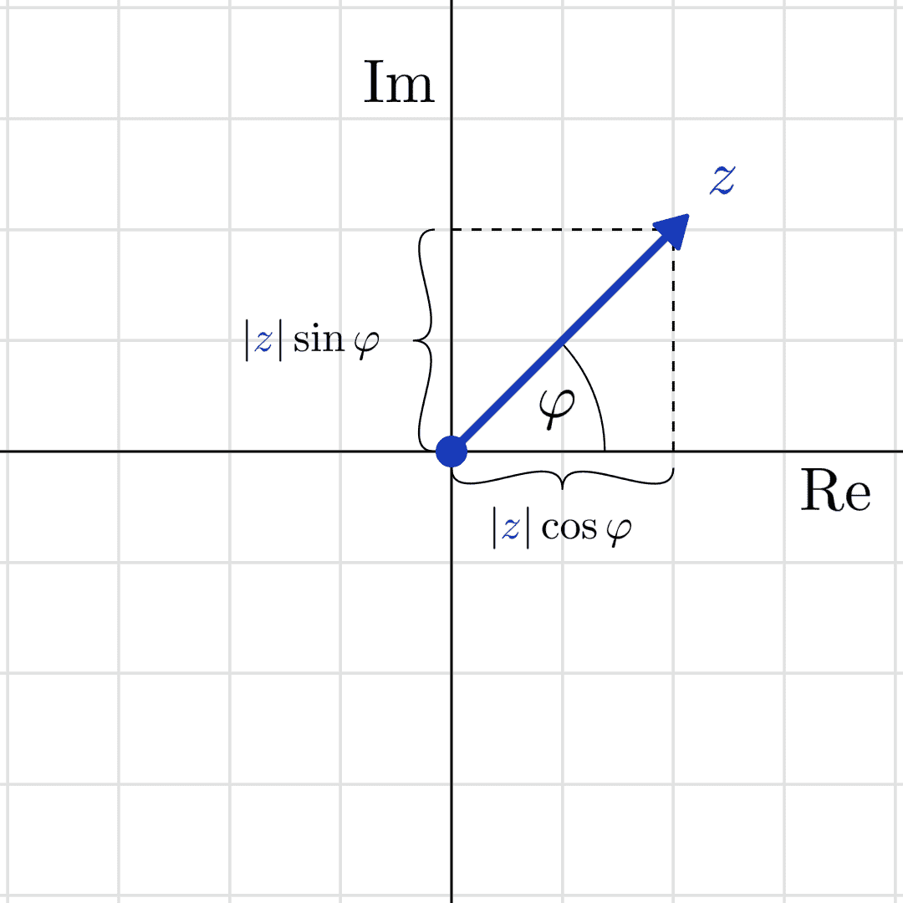

# 附录 D

复数

学习是一个向上的螺旋。根据我们在学习旅程中的位置，我们会不断回顾过去的知识，并从不同的角度去审视它。

复数是需要不断复习的一个主题，理解它们使我们重新评估某些我们习以为常的知识。例如，你可能曾被教导过 −1 没有平方根。然而，在熟悉了复数之后，你会发现其实有两个平方根；它们都是复数。

这里的主要例子是二次方程：


为了证明它在实数范围内没有解（或者说没有根），我们可以检查判别式 b² − 4ac = −4 小于 0，但我们也可以简单地绘制 x² + 1 的图像。

```py
import numpy as np 
import matplotlib.pyplot as plt 

X = np.linspace(-3, 3, 1000) 
Y = X**2+1
```

```py
with plt.style.context("/span>seaborn-v0_8": 
    plt.figure() 
    plt.axhline(0, color=’black’, linewidth=1) 
    plt.axvline(0, color=’black’, linewidth=1) 
    plt.plot(X, Y) 
    plt.xlim([-3, 3]) 
    plt.ylim([-5, 10]) 
    plt.xlabel("/span>x 
    plt.ylabel("/span>y 
    plt.title("/span>The graph of x² + 1" 
    plt.show()
```


图 D.1: x² + 1 的图像

这看似不是什么大问题，但具有实数系数的多项式方程如果没有实数解，那将是一个巨大的问题。许多重要的量都是通过多项式的根来描述的，比如矩阵的特征值。

那么，我们该如何解决这个问题呢？

在大多数情况下，我们可以将二次多项式分解为两个线性项的积。例如，


这揭示了方程 x² − 1 = 0 的解（在这个例子中，解为 x = 1 和 x = −1）。

为了因式分解多项式 x² − 1，我们使用了恒等式：


那么我们能怎么做呢？对于 x² + 1，我们可以稍微发挥一点创造力。我们可以将我们的多项式写作：


其中原则上我们可以使用前面的恒等式。然而，有一个问题：没有实数满足 a² = −1。

经过几个世纪，数学家们最终得出了这个解决方案，这其实很简单：我们假设有这样的一个数。在数学中，最具创造性的规则滥用往往能够带来最大的回报。所以，假设我们的虚数 i 满足：


这样，我们得到：


换句话说，著名的二次方程 x² + 1 = 0 的解是 x = i 和 x = −i。这个 i 被称为虚数，它的发现开启了复数的世界。

那么，这些奇异的对象到底是什么？

## D.1 复数的定义

让我们直接进入定义。

定义 113. （复数）

形如以下的数集：


满足 i² = −1 的数，被称为复数。我们称 a 为实部，b 为虚部，记作：


如果 a + bi 和 c + di 是两个复数，那么我们定义加法和乘法为：

(a)


(b)


复数集用 ℂ 表示。因此，我们写作：


根据定义，加法很简单。然而，乘法看起来有些复杂。为了理解为什么这样定义，像处理两个多项式一样逐项相乘。

复数的一个重要特性是它们的模，换句话说，就是它们与 0 的距离。

定义 114.（复数的模）

设 z = a + bi 为复数。它的模定义为


此外，每个复数都有一个共轭复数，正如我们稍后将看到的，它对应于关于实轴的镜像。

定义 115.（复数的共轭）

设 z = a + bi 为复数。它的共轭复数 z 定义为


注意到 zz = |z|²。

除了代数表示法 z = a + bi，复数还有丰富的几何解释，正如我们接下来要看到的那样。

## D.2 几何表示法

我们可以用不同于定义中的方式来表示复数。如果你仔细想一想，每个复数 z = a + bi 可以看作有序对(a,b)。这些可以在笛卡尔平面上作为向量来可视化。


图 D.2：复数作为笛卡尔平面上的向量

复数 z = a + bi 的模|z| = 表示从原点到向量(a,b)的长度，而共轭复数 z = a−bi 则对应于将该点关于实轴进行反射。

这种几何视角为我们提供了一种新的代数方式来表示复数。

为了理解原因，回顾一下单位圆和平面上三角函数的关系。



图 D.3：复数的几何表示

这意味着每个模为 1 的复数都可以写成 cos(φ) + isin(φ)的形式。从几何表示中，我们可以看到每个复数都由其模|z|和角度φ唯一确定。所以，我们可以将所有复数写成所谓的极坐标形式


合起来，我们得到

![ [( ) z1z2 = r1r2 cos(φ1 )cos(φ2 )− sin (φ1 )sin(φ2) ( )] + i cos(φ1)sin (φ2 )+ cos(φ2)sin (φ1 ) . ](img/file2212.png)

你能识别出实部和虚部吗？这正是著名的三角函数加法公式。有了这些公式，我们得到了


这揭示了代数定义中不明确的许多内容。最重要的是，

1.  乘积的模是各自模的乘积，

1.  并且积的辐角是各个辐角的和。（模是模数的复数形式。）

换句话说，复平面中的乘法等同于一个缩放和旋转。突然间，像 i² = −1 这样的恒等式变得更加有意义：由于 i 的辐角是 π∕2（或 90 度），将其逆时针旋转 π∕2 就得到 −1。

那么，为什么我们喜欢实数呢？因为所有的多项式方程在实数范围内都有解。让我们看看！

## D.3 代数基本定理

还记得我们的动机例子吗？我们引入了虚数 i 使得方程 x² + 1 = 0 有解。事实证明，复数为任何多项式方程提供了解。

让我们介绍一组具有复系数的多项式：

![ { } ∑ n k ℂ [x ] := ckx : ck ∈ ℂ, n ∈ ℕ0 . k=0 ](img/file2214.png)

类似地，ℝ[x]、ℚ[x]、ℤ[x] 和 ℕ[x] 也可以被定义。多项式的次数（或简称 deg p）是 x 的最高幂。（例如，−3x⁸ + πx 的次数为 8。）

对于给定的多项式 p(x)，方程 p(x) = 0 的解称为根。从代数角度看，我们希望对于特定数集上的一组多项式，每个多项式在该数集上都有根。正如我们所看到的，这在 ℝ[x] 中不成立，因为 x² + 1 = 0 没有实数解。

然而，这对于 ℂ[x] 来说有所不同，正如代数基本定理所述。

定理 156．（代数基本定理）

每个非恒定多项式 p(x) ∈ ℂ[x]（即次数 deg p ≥ 1 的多项式）至少在 ℂ 中有一个根。

虽然看起来很容易证明，但我向你保证，这并不简单。原始的代数证明非常长且复杂，尽管有更简短的版本，但它需要高级的数学分析工具。

我们可以进一步理解代数基本定理。如果 p(x) 是一个次数至少为 1 的多项式，且 x[1] 是它的根，那么


是一个次数为 deg q = deg p − 1 的多项式。如果 q 不是恒定的，代数基本定理再次保证 q 也在 ℂ 中有一个根。最终，定理的反复应用导致 p(x) 可以写成


其中 x[1], x[2], …, x[n] 是 p 的根。它们中的某些可以相同，一个给定的 x[i] 在其根中出现的次数称为其代数重数。

定义 116．（根的代数重数）

令 p(x) ∈ ℂ[x]，并假设


整数 p[i] 称为根 x[i] 的代数重数。

代数基本定理之所以被称为基本定理，是有原因的。例如，这就是为什么矩阵有特征值的原因，正如我们在第六章中学到的。

## D.4 为什么复数很重要？

初看之下，复数在机器学习中似乎不那么重要。让我向你保证，事实并非如此：它们是绝对必不可少的。在本节中，我们将简要展望一下复数所能实现的功能。

例如，复数最重要的应用之一就是矩阵的特征值-特征向量对。对于给定的矩阵 A，有一些特殊的数字λ，称为特征值，以及相应的向量 v，称为特征向量，使得 Av = λv 成立。在线性变换的语言中，这意味着在λ的特征向量所张成的线性子空间中，变换 A 仅仅是一个拉伸操作。

这些工具非常强大，因为在某些条件下，特征值允许我们简化矩阵。

某些实数方阵可以写成以下形式


是由 A 的特征值组成的对角矩阵。猜猜是什么保证了特征值的存在：代数基本定理。

通过从实数到复数的转换，我们获得了更大的自由度和更强大的工具集。其中一个工具就是著名的傅里叶变换。为了给你一个实际的例子，让我们谈谈音频。音频数据以函数 f : ℝ →ℝ的形式出现，将时间映射到信号强度。然而，在信号处理领域，将信号理解为频率是非常重要的。每个声音都是不同频率的正弦波的叠加，量化每个频率的贡献可以揭示信号的许多信息。

```py
import matplotlib.pyplot as plt 
import numpy as np 

def sin(freq, x): 
    return np.sin(freq*x) 

X = np.linspace(0, 2*np.pi, 1000) 
freqs = [1, 2, 3, 4, 5, 6, 7, 8, 9] 
y = {freq: sin(freq, X) for freq in freqs} 

with plt.style.context("/span>seaborn-v0_8-white: 
    plt.figure(figsize=(10, 10), dpi=100) 
    for i, freq in enumerate(freqs): 
        plt.subplot(3, 3, i+1) 
        plt.plot(X, y[freq]) 
        plt.title(f/span>frequency = {freq}" 
    plt.show()
```


图 D.4：傅里叶变换

问题是，傅里叶变换是一个复数积分。也就是说，f 的变换是由下式定义的


没有复数，我们无法使用这个工具。

尽管我们不会详细讨论傅里叶变换，但它们在概率论中是不可或缺的工具。应用于概率分布时，它们的收敛性特性可以轻松地研究。例如，一些版本的中心极限定理（[`en.wikipedia.org/wiki/Central_limit_theorem`](https://en.wikipedia.org/wiki/Central_limit_theorem)）就是通过这种方式证明的。

## 加入我们在 Discord 上的社区

与其他用户、机器学习专家以及作者本人一起阅读本书。提问、为其他读者提供解决方案、通过问我任何问题环节与作者互动，更多内容等你来发现。扫描二维码或访问链接加入社区。[`packt.link/math`](https://packt.link/math)


