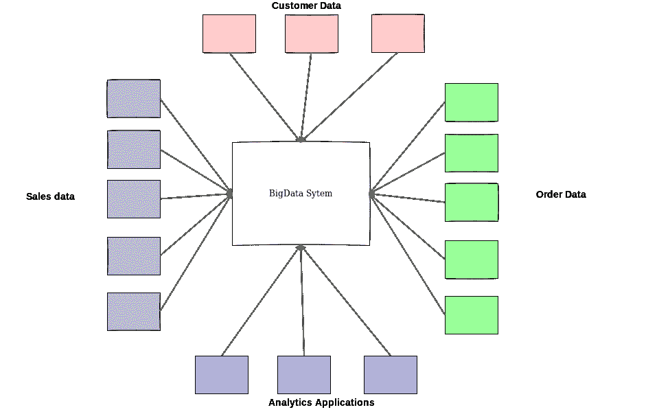
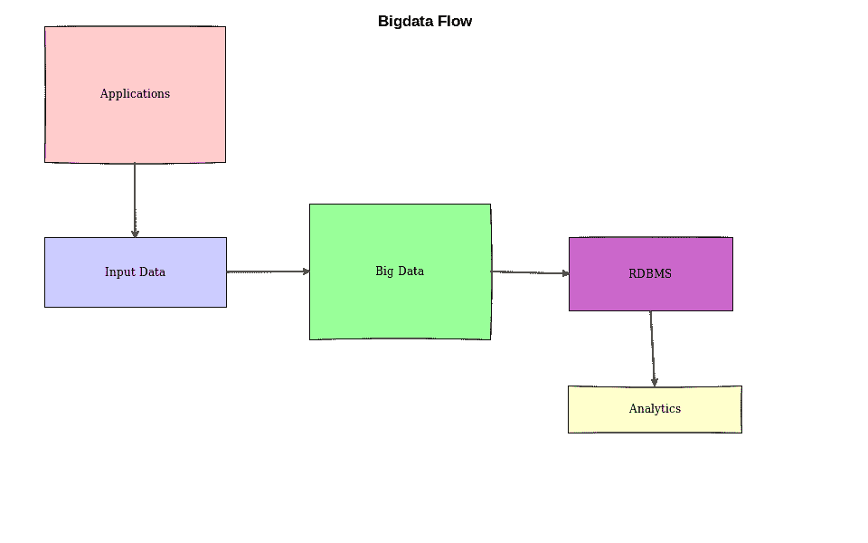
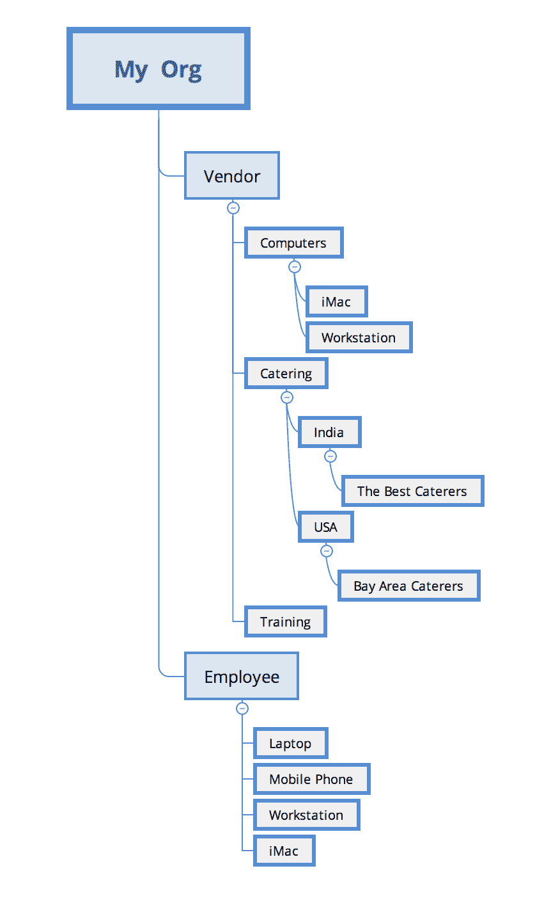
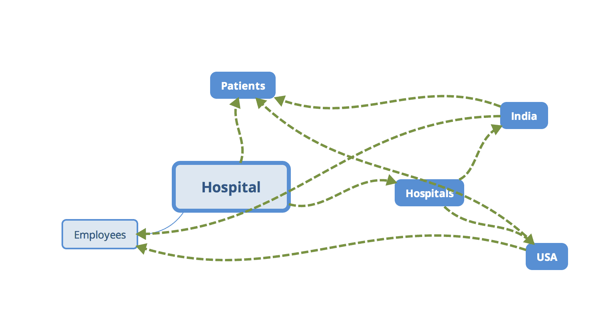
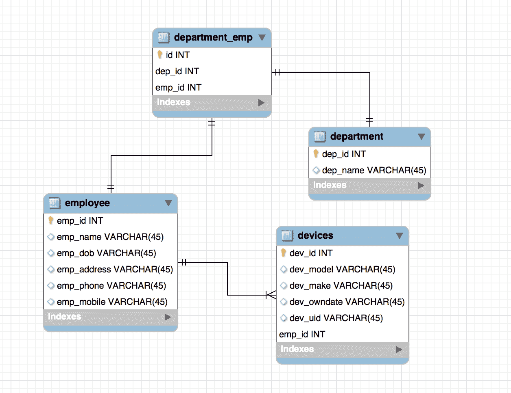
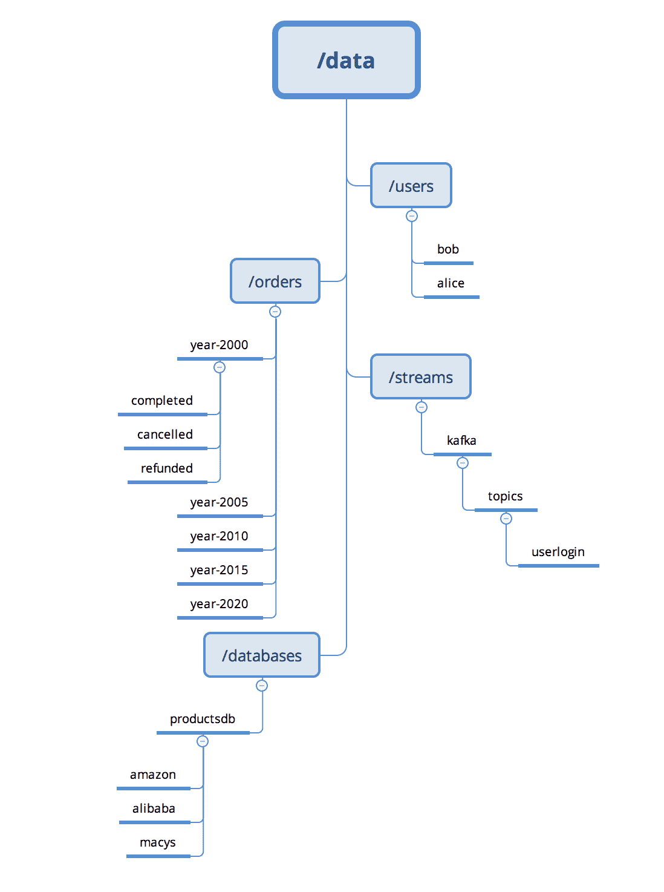

# 第一章：企业数据架构原则：

传统上，企业采用数据仓库来存储、处理和访问大量数据。这些仓库通常是大型关系型数据库管理系统（RDBMS），能够存储各种大规模数据集。随着数据复杂性、体积和访问模式的增加，许多企业开始采用大数据作为模型来重新设计他们的数据组织，并围绕它制定必要的政策。

此图展示了典型企业在企业中的数据仓库外观：

由于企业有许多不同的部门、组织和地理区域，每个部门往往拥有自己的仓库，这对整个企业提出了各种挑战。例如：

+   数据的多个来源和目的地：

+   数据重复和冗余：

+   数据访问监管问题：

+   企业中非标准的数据定义。

+   软件和硬件的可扩展性和可靠性问题：

+   数据移动和审计：

+   仓库之间的集成：

由于技术进步，如：

+   每 TB 的成本：

+   每纳米的计算能力：

+   吉比特网络带宽：

+   云：

随着全球化，市场已经全球化，消费者也是全球化的。这极大地增加了覆盖范围。这些进步也给企业带来了许多挑战，例如：

+   人力资本管理：

+   仓库管理：

+   物流管理：

+   数据隐私和安全：

+   销售和账单管理：

+   理解需求和供应：

为了跟上市场的需求，企业开始收集越来越多的关于自己的指标；因此，在当前情况下，数据所涉及的维度有所增加。

在本章中，我们将学习：

+   数据架构原则：

+   元数据的重要性：

+   数据治理：

+   数据安全：

+   数据即服务：

+   使用 Hadoop 的数据架构演变：

# 数据架构原则：

当前状态的数据可以从以下四个维度（四个 V）来定义。

# 体积：

数据量是设计大数据系统所需的重要度量标准。这是决定企业必须投资多少以满足当前和未来存储需求的一个重要因素。

企业中的不同类型的数据需要不同的存储、归档和处理能力。今天，企业中非常常见的 PB 级存储系统，在几十年前几乎是不可想象的。

# 速度：

这是数据的另一个维度，决定了数据的流动性。组织内部存在各种数据，属于以下类别：

+   流数据：

    +   实时/近实时数据：

+   静态数据：

    +   不可变数据：

    +   可变数据：

这个维度对企业使用的网络架构有影响，用于消费和处理数据。

# 多样性

这个维度讨论数据的形态和形状。我们可以进一步将其分类为以下类别：

+   流数据：

    +   线上数据格式（例如，JSON、MPEG 和 Avro）

+   静态数据：

    +   不可变数据（例如，媒体文件和客户发票）

    +   可变数据（例如，客户详情、产品库存和员工数据）

+   应用数据：

    +   配置文件、机密信息、密码等

对于一个组织来说，拥抱非常少的科技以减少数据的多样性非常重要。拥有许多不同类型的数据对企业在管理和消费方面构成了非常大的挑战。

# 真实性

这个维度讨论数据的准确性。如果没有对每个系统在保证数据安全、可用和可靠方面所提供保证的稳固理解，那么理解由此数据生成的分析以及进一步生成洞察就变得非常困难。

应该实施必要的审计，以确保通过系统的数据通过所有质量检查，并最终通过大数据系统。

让我们看看典型的大数据系统是如何看的：

正如你所见，许多不同类型的应用程序正在与大数据系统交互，以存储、处理和生成分析。

# 元数据的重要性

在我们试图理解元数据的重要性之前，让我们先尝试理解什么是元数据。元数据简单地说就是**关于数据的**数据。这听起来有些令人困惑，因为我们以一种递归的方式定义了定义。

在典型的大数据系统中，我们有这三个垂直层面的水平：

+   将数据写入大数据系统的应用程序

+   在大数据系统中组织数据

+   消费大数据系统数据的应用程序

当我们谈论数百万（甚至数十亿）存储在大数据系统中的数据文件/段时，这引发了一些挑战。我们应该能够正确识别这些数据文件在整个企业中的所有权和使用情况。

让我们以一个拥有电视频道的电视广播公司为例；它制作电视节目并通过有线电缆网络、卫星网络、互联网等向所有目标受众广播。如果我们仔细观察，内容的来源只有一个。但它通过所有可能的媒介，最终到达用户的观看位置，在电视、移动电话、平板电脑等设备上观看。

由于观众正在各种设备上访问这些电视内容，运行在这些设备上的应用程序可以生成多个消息来指示各种用户行为和偏好，并将它们发送回应用程序服务器。这些数据量相当大，并存储在大数据系统中。

根据大数据系统内部数据的组织方式，外部应用程序或对等应用程序几乎不可能了解系统内部存储的不同类型的数据。为了使这个过程更容易，我们需要描述和定义大数据系统内部数据组织的方式。这将帮助我们更好地理解大数据系统中的数据组织和访问。

让我们进一步扩展这个例子，并假设还有一个应用程序从大数据系统中读取数据，以了解在特定电视节目中广告的最佳时间。这个应用程序应该更好地理解大数据系统中可用的所有其他数据。因此，如果没有一个明确定义的元数据系统，很难做到以下事情：

+   理解存储、访问和处理的数据多样性

+   在不同类型的数据集之间构建接口

+   从安全角度正确标记数据，将其归类为高度敏感数据或非敏感数据

+   在大数据生态系统中连接给定系统集之间的联系

+   审计和排查可能因数据不一致而产生的问题

# 数据治理

拥有大量数据并不足以做出对业务成功产生积极影响的高质量决策。确保只收集、保存和维护高质量数据非常重要。数据收集过程也会随着需要收集的新类型数据而演变。在这个过程中，我们可能会破坏一些读取上一代数据的接口。如果没有一个明确的过程和人员，处理数据对所有规模的组织都成为一个巨大的挑战。

要在数据管理方面表现出色，我们应该考虑以下品质：

+   良好的政策和流程

+   责任制

+   正式的决策结构

+   管理规则的实施

这些品质的实施被称为**数据治理**。在较高层次上，我们将数据治理定义为得到良好管理的数据。这个定义也有助于我们明确数据管理和数据治理不是同一回事。数据管理涉及使用数据来做出良好的商业决策，并最终运营组织。数据治理涉及我们在整个组织中使用纪律行为来管理数据的程度。

这是一个重要的区别。那么底线是什么？大多数组织管理数据，但远没有多少组织能够很好地管理这些管理技术。

# 数据治理的基本原理

让我们尝试理解数据治理的基本原理：

+   责任制

+   标准化

+   透明度

透明度确保组织内部和外部的所有员工在与与组织相关的数据互动时了解他们的角色。这将确保以下事项：

+   建立信任

+   避免意外

责任制确保有权访问数据的团队和员工描述他们可以使用和不能使用数据的方式。

标准化处理数据的正确标记、描述和分类方式。例如，如何为组织内部的员工生成电子邮件地址。一种方式是使用 firstname-lastname@company.com，或者这些组合中的任何其他组合。这将确保所有有权访问这些电子邮件地址的人都能理解哪个是首字母，哪个是尾字母，而无需任何人亲自解释。

标准化提高了数据质量，并为多个数据维度带来了秩序。

# 数据安全

安全性不是一个新概念。它自早期的 UNIX 分时操作系统设计以来就被采用。在最近，由于大量数据泄露导致组织损失了大量收入，个人和组织在这个安全领域的意识有所提高。

安全性作为一个一般概念，可以应用于许多不同的事物。当涉及到数据安全时，我们需要理解以下基本问题：

+   *存在哪些类型的数据？*

+   *谁拥有数据？*

+   *谁有权访问数据？*

+   *数据何时退出系统？*

+   *数据是否物理安全？*

让我们看看一个简单的大数据系统，并试图更详细地理解这些问题。系统的规模使得安全性对每个人来说都是一个噩梦。因此，我们应该制定适当的政策，确保每个人都处于同一页面上：

在这个例子中，我们有以下组件：

+   在全球多个地理区域内运行的不同类型的应用程序。

+   应用程序产生了大量和多样化的输入数据。

+   所有数据都被摄入到大数据系统中。

+   ETL/ELT 应用程序从大数据系统中消耗数据，并将可消费的结果放入 RDBMS（这是可选的）。

+   商业智能应用程序从这个存储中读取数据，并进一步对数据进行深入分析。这些是领导团队决策的驱动力。

你可以想象通过这个系统流动的数据的规模和数量。我们还可以看到，参与整个生态系统的服务器、应用程序和员工数量非常大。如果我们没有制定适当的政策，保护这样一个复杂的系统将不是一项容易的任务。

此外，如果攻击者使用社会工程学手段获取对系统的访问权限，我们应确保数据访问仅限于最低可能的级别。当实施较差的安全措施时，攻击者可以几乎访问所有商业机密，这可能对业务造成严重损失。

仅举一个例子，一家初创公司正在构建下一代计算设备，计划将其所有数据托管在云端，并且没有建立适当的安全策略。当攻击者破坏云上服务器的安全时，他们可以轻易地了解这家初创公司在构建什么，并可以窃取情报。一旦情报被窃取，我们可以想象黑客如何利用这些信息为自己谋取私利。

在理解了安全的重要性之后，让我们定义需要保护的内容。

# 应用程序安全

应用程序是产品型组织的最前线，因为消费者使用这些应用程序与产品和服务进行交互。我们必须确保在编写这些应用程序接口时遵循适当的安全标准。

由于这些应用程序向后端系统生成数据，我们应该确保在防火墙方面只允许适当的访问机制。

此外，这些应用程序与许多其他后端系统进行交互，我们必须确保显示与用户相关的正确数据。这归结为实施适当的认证和授权，不仅针对用户，也针对应用程序在访问组织资源的不同类型时。

如果没有适当的审计措施，分析应用程序的数据访问模式将非常困难。所有日志都应该收集在远离应用服务器的中央位置，并可以进一步被集成到大数据系统中。

# 输入数据

一旦应用程序生成多个指标，它们可以临时存储在本地，由周期性进程进一步消费，或者进一步推送到像 Kafka 这样的流式系统。

在这种情况下，我们应该仔细思考和设计数据存储的位置以及哪些用户可以访问这些数据。如果我们进一步将数据写入像 Kafka 或 MQ 这样的系统，我们必须确保有进一步的认证、授权和访问控制措施。

在这里，我们可以利用操作系统提供的诸如进程用户 ID、进程组 ID、文件系统用户 ID、组 ID 等安全措施，以及高级系统（如 SELinux）来进一步限制对输入数据的访问。

# 大数据安全

根据选择的数据仓库解决方案，我们必须确保授权的应用程序和用户可以写入和读取数据仓库。必须建立适当的安全策略和审计措施，以确保大规模数据不会轻易被所有人访问。

为了实施所有这些访问策略，我们可以使用操作系统提供的机制，如文件访问控制和访问控制。由于我们讨论的是地理上分布的大数据系统，我们必须思考和设计集中的认证系统，以便员工在与这些大数据系统交互时获得无缝体验。

# RDBMS 安全

许多 RDBMS 非常安全，可以为用户提供以下访问级别：

+   数据库

+   表格

+   使用模式

它们还内置了审计机制，可以告知哪些用户在何时访问了哪些类型的数据。这些数据对于保持系统安全至关重要，并且应该实施适当的监控，以监视这些系统的健康和安全。

# BI 安全

这些可以是针对公司特定需求内部构建的应用程序，或者可以提供业务团队所需见解的外部应用程序。这些应用程序也应通过实施单点登录、基于角色的访问控制和基于网络的访问控制来得到适当的保护。

由于这些应用程序提供的见解对于组织的成功至关重要，因此应采取适当的安全措施来保护它们。

到目前为止，我们已经看到了企业系统的不同部分，并了解了可以遵循哪些事项来提高整体企业数据设计的安全性。让我们谈谈一些可以在数据设计中普遍应用的事项。

# 物理安全

这涉及到物理设备访问、数据中心访问、服务器访问和网络访问。如果未经授权的人员获得了企业设备的访问权限，他们可以访问其中所有存在的数据。

如前几节所述，当操作系统运行时，我们可以通过利用操作系统的安全功能来保护资源。当入侵者获得对设备的物理访问权限（或甚至退役的服务器）时，他们可以将这些设备连接到他们控制的另一个操作系统，并访问我们服务器上所有存在的数据。

当我们退役服务器时，必须小心谨慎，因为即使在这些设备上（即使格式化后）写入的数据也有可能被恢复。因此，我们应该遵循行业标准的数据擦除技术，以正确清理企业拥有的所有数据。

为了防止这些，我们应该考虑加密数据。

# 数据加密

加密数据将确保即使授权人员访问了设备，他们也无法恢复数据。这是由于数据和企业员工的流动性增加而如今遵循的标准做法。许多大型企业加密了笔记本电脑和手机上的硬盘。

# 安全密钥管理

如果你曾与需要身份验证的应用程序合作过，你将使用用户名和密码的组合来访问服务。通常这些秘密存储在源代码本身中。这对非编译程序构成了挑战，因为攻击者可以轻易地访问用户名和密码，从而获得访问我们资源的权限。

许多企业开始采用集中式密钥管理，通过它应用程序可以查询这些服务以获取访问受认证保护的资源的权限。所有这些访问模式都由 KMS（密钥管理系统）进行适当的审计。

员工也应该使用自己的凭证访问这些系统以获取资源。这确保了密钥是受保护的，并且只能由授权应用程序访问。

# 数据即服务

**数据即服务**（**DaaS**）是一个由于云的采用增加而在最近变得流行起来的概念。当涉及到数据时，可能会有些困惑，数据如何添加到服务模型中？

DaaS（数据即服务）为服务的用户提供极大的灵活性，无需担心服务运行在的基础设施的规模、性能和维护。基础设施会自动为我们处理这些，但鉴于我们处理的是云模型，我们享有云的所有好处，如*按需付费*、容量规划等。这将减轻数据管理的负担。

如果我们仔细理解，我们只是在单独提取数据管理部分。但数据治理也应该在这里得到很好的定义，否则我们将失去服务模型的所有好处。

到目前为止，我们一直在谈论*云中的服务*概念。*这意味着我们无法在企业或更小的组织中使用它吗？* 答案是*不*。因为这是一个通用概念，它告诉我们以下事情。

当我们谈论服务模型时，我们应该记住以下几点，否则将会出现混乱：

+   认证

+   授权

+   审计

这将保证只有定义良好的用户、IP 地址和服务可以访问作为服务公开的数据。

让我们以一个拥有以下数据的组织为例：

+   员工

+   服务器和数据中心

+   应用程序

+   内部文档网站

如您所见，所有这些都是独立的数据集。但是，作为一个整体，当我们希望组织成功时，有很多重叠，我们应该尝试接受 DaaS 模型，这样所有这些对数据进行权威管理的应用程序仍然会管理数据。但对于其他应用程序，它们通过 REST API 以简单服务的形式公开；因此，这增加了组织内的协作并促进了创新。

让我们进一步举例说明这是如何可能的：

+   管理所有员工数据的团队可以提供一个简单的**数据服务**。所有其他应用程序都可以使用这个数据集，无需担心存储这些员工数据的底层基础设施：

    +   这将使数据服务的消费者得到解放，使得消费者：

        +   不必担心底层基础设施

        +   不必担心用于与这些数据服务器通信的协议

        +   只需专注于 REST 模型来设计应用程序

    +   典型的例子包括：

        +   将员工数据存储在类似`LDAP`或`Microsoft Active`目录的数据库中

+   管理整个组织基础设施的团队可以设计自己的系统，以避免整个组织的硬件库存，并且可以提供一个简单的数据服务。组织的其他部分可以使用这个服务来构建他们感兴趣的应用程序：

    +   这将使企业更具敏捷性

    +   确保关于整个组织硬件的数据有一个单一的真实来源

    +   它提高了数据信任度，并增加了构建在此数据之上的应用程序的信心

+   组织中的每个团队可能都会使用不同的技术来构建和部署他们的应用程序到服务器上。随后，他们还需要构建一个数据存储库，以跟踪服务器上部署的软件的活跃版本。拥有这样的数据源可以帮助组织以以下方式：

    +   使用这些数据构建的服务可以持续监控并看到软件部署发生得更频繁的地方

    +   服务还可以确定哪些应用程序容易受到攻击并且正在生产中积极部署，以便可以采取进一步行动来修复漏洞，无论是通过升级操作系统还是软件

    +   理解整体软件部署生命周期中的挑战

    +   为整个组织提供一个单一平台，以标准化的方式做事，这促进了所有权感

+   文档对于一个组织来说非常重要。与其运行自己的基础设施，使用 DaaS 模型，组织和团队可以专注于与他们公司相关的文档，并且只为这些文档付费。在这里，像 Google Docs 和 Microsoft Office Online 这样的服务非常受欢迎，因为它们让我们可以按需付费，最重要的是，不必担心构建这些所需的技术。

    +   拥有这种数据服务模型将帮助我们做到以下事情：

        +   只为使用的服务付费

        +   根据需要增加或减少存储规模

        +   如果服务在云端并且连接到互联网，可以从任何地方访问数据

        +   当通过企业政策决定通过 VPN 连接时，可以访问企业资源

在前面的例子中，我们看到了在企业中使用的大量应用程序，以及数据作为模型如何以各种方式帮助企业实现协作、创新和信任。

但是，*当涉及到大数据时，DaaS 能做什么呢？*

就像所有其他数据片段一样，大数据也可以适应 DaaS 模型，并提供我们之前看到的相同灵活性：

+   不必担心底层硬件和技术

+   根据需要扩展基础设施

+   只为属于企业的数据付费

+   运营和维护挑战被移除

+   数据可以地理上可用以实现高可用性

+   集成备份和恢复以满足灾难恢复需求

带着这些优点，企业可以更加灵活，并构建可以利用这些数据作为服务的应用程序。

# 使用 Hadoop 的演进数据架构

Hadoop 是一种帮助实现可扩展和分布式计算的软件。在 Hadoop 出现之前，许多技术被行业用来满足他们的数据需求。让我们对这些存储机制进行分类：

+   层次化数据库

+   网络数据库

+   关系型数据库

让我们了解这些数据架构是什么。

# 层次化数据库架构

这种存储企业数据的方式是在 20 世纪 60 年代初由 IBM 发明的，并用于他们的应用程序。层次化数据库的基本概念是数据以**根树**的形式组织。根节点是树的开始，然后所有的子节点只与一个父节点链接。这是一种非常独特的存储和检索方式。

如果你有一些计算机科学的背景，树是存储数据的一种独特方式，这样它就有一些相互关系（如父子和关系）。

这张图片展示了典型 HDBMS 中数据的组织方式：

如我们所见，根节点是组织本身，与组织相关的所有数据都遵循树结构，这描绘了多种关系。这些关系可以这样理解：

+   **员工**拥有**笔记本电脑**、**移动电话**、**工作站**和**iMac**

+   **员工**属于**组织**

+   许多供应商提供不同的需求：

    +   计算机供应商提供**iMac**和**工作站**

+   餐饮服务在印度和美国都有；两家供应商，*The Best Caterers* 和 *Bay Area Caterers*，为这些地区提供服务

尽管我们在这一庞大的数据存储中表达了多种类型的关系，但我们可以看出数据被重复，并且针对不同类型需求查询数据成为了一个挑战。

让我们以一个简单的问题为例：*哪个供应商为 Employee-391 拥有的 iMac 提供了服务？*

为了做到这一点，我们需要遍历树并从两个不同的子树中获取信息。

# 网络数据库架构

网络数据库管理系统也源于计算机科学：图论，其中有许多不同类型的节点和关系将它们连接在一起。在这个结构中没有特定的根节点。它是在 20 世纪 70 年代初发明的：

如我们所见，在这个结构中，有一些核心数据集，还有一些其他数据集与核心数据集相关联。

这就是我们如何理解它的方法：

+   主要医院被定义

+   它有许多子医院

+   子医院位于印度和美国

+   印度医院使用患者数据

+   美国医院使用患者数据

+   患者存储与主医院相连

+   员工属于医院，并与其他组织相连

在这个结构中，根据我们的设计，数据被表示为元素的网络。

# 关系型数据库架构

该系统在 20 世纪 80 年代初再次在 IBM 开发，被认为是迄今为止最著名的数据库系统之一。采用这种风格的软件的一些显著例子是 Oracle 和 MySQL。

在这个模型中，数据以记录的形式存储，每个记录又包含几个属性。所有记录集合都存储在表中。数据属性在表之间存在关系。相关表的集合存储在数据库中。

让我们看看 RDBMS 表的典型示例：

我们正在定义以下类型的表和关系

# 员工

+   该表包含所有员工记录

+   每条记录由以下定义：

    +   员工唯一标识符

    +   员工姓名

    +   员工出生日期

    +   员工地址

    +   员工电话

    +   员工手机

# 设备

+   该表包含所有由员工拥有的设备

+   每个所有权记录都由以下定义：

    +   设备所有权标识符

    +   设备型号

    +   设备制造商

    +   设备所有权日期

    +   设备唯一编号

    +   员工 ID

# 部门名称

包含组织中所有部门的表：

+   唯一部门 ID

+   唯一部门名称

# 部门和员工映射表

这是一个特殊的表，只包含部门和员工之间的唯一标识符关系：

+   唯一部门 ID

+   唯一员工 ID

# Hadoop 数据架构

到目前为止，我们已经探讨了企业使用过的几种数据架构类型。在本节中，我们将了解如何在 Hadoop 中构建数据架构。

简单介绍一下，Hadoop 有多个组件：

+   数据

+   数据管理

+   在数据上运行作业的平台

# 数据层

这是所有数据以文件形式存储的层。这些文件由 Hadoop 系统内部分割成多个部分，并在服务器之间复制以提高可用性。

由于我们正在谈论以文件形式存储的数据，因此了解这些文件的组织方式对于更好的治理非常重要。

下一个图表显示了数据如何在 Hadoop 存储层之一中组织。数据的内容可以是任何形式，因为 Hadoop 不强制它们具有特定的结构。因此，我们可以安全地将蓝光™电影、**CSV**（**逗号分隔值**）文件、AVRO 编码文件等存储在这个数据层中。

你可能想知道为什么我们不在这里使用“**HDFS**”（**Hadoop 分布式文件系统**）这个词。这是因为 Hadoop 被设计为可以在任何分布式文件系统之上运行。

# 数据管理层

这一层负责跟踪给定文件或路径（以服务器、偏移量等术语）的数据存储位置。由于这只是一个账务层，因此确保这一层的内含物以高可靠性和持久性得到保护非常重要。这一层数据的任何损坏都可能导致整个数据文件永远丢失。

在 Hadoop 术语中，这也被称为**NameNode**。

# 作业执行层

一旦我们解决了数据问题，接下来就是读取和写入数据的程序。当我们谈论单个服务器或笔记本电脑上的数据时，我们很清楚数据的位置，因此我们可以编写程序将数据读取和写入相应的位置。

类似地，Hadoop 存储层使得应用程序在计算过程中将文件路径提供给存储以读取和写入数据变得非常容易。这对编程社区来说是一个很大的胜利，因为他们不需要担心数据在分布式 Hadoop 集群中物理存储的底层语义。

由于 Hadoop 推广了“计算靠近数据”模型，这提供了非常高的性能和吞吐量，因此运行的程序可以由 Hadoop 引擎在集群中数据所在的位置进行调度和执行。整个数据传输和软件执行移动都由 Hadoop 负责处理。

因此，Hadoop 的最终用户将系统视为一个具有巨大计算能力和存储能力的简单系统。这种抽象满足了所有人的需求，并已成为今天大数据计算的标准。

# 摘要

在本章中，我们看到了许多组织如何采用数据仓库来存储、处理和访问他们拥有的大量数据。我们学习了数据架构原则、它们的治理和安全。在下一章中，我们将探讨数据预处理的一些概念。
