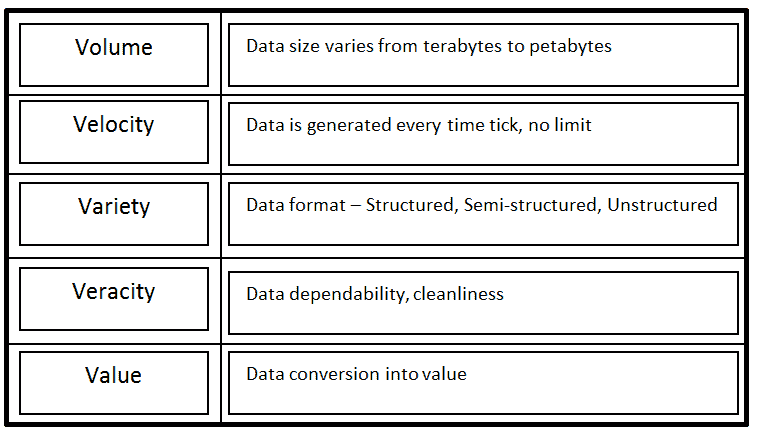
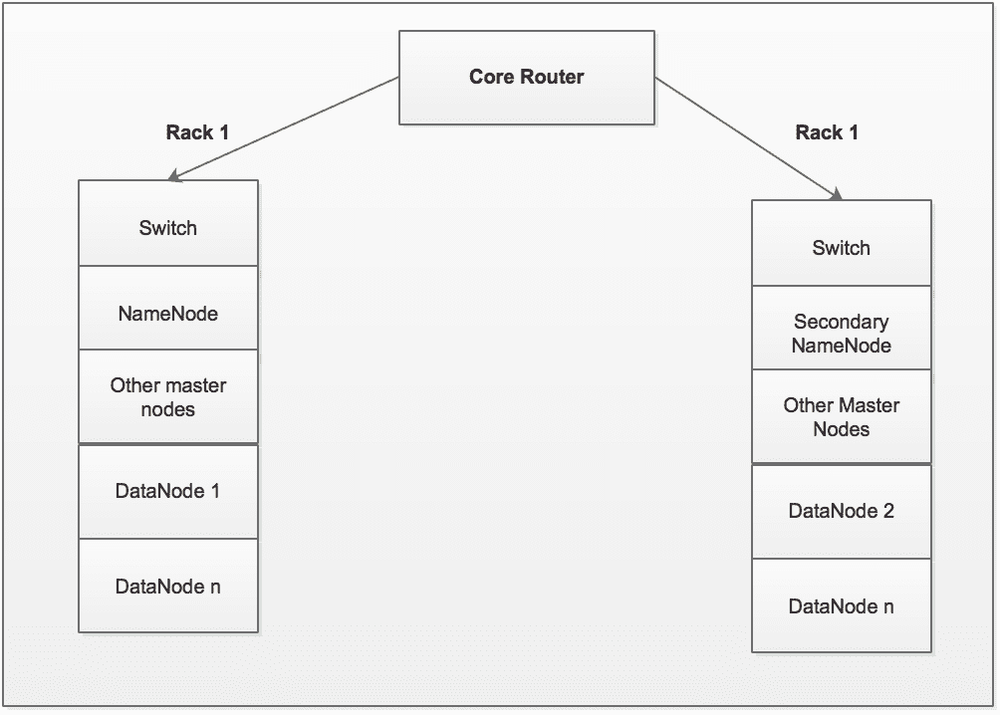
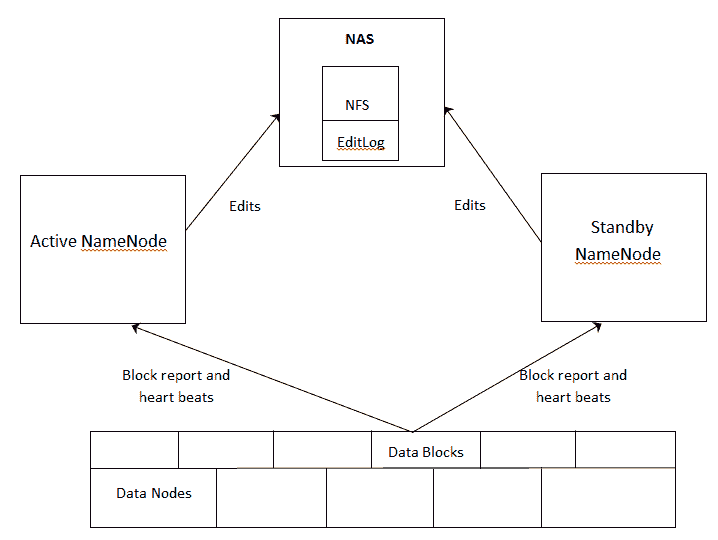
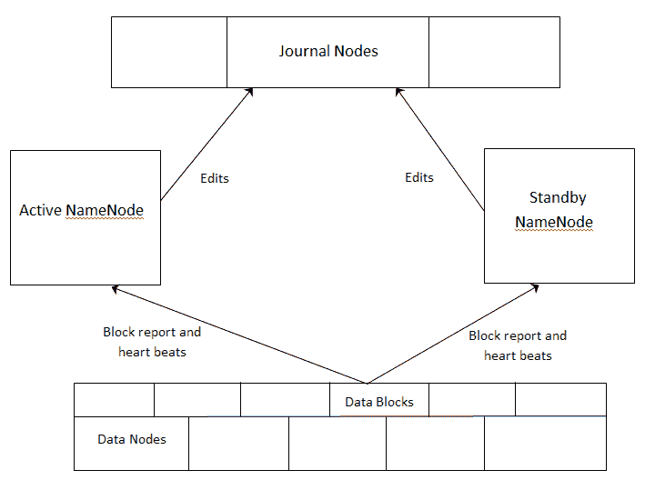
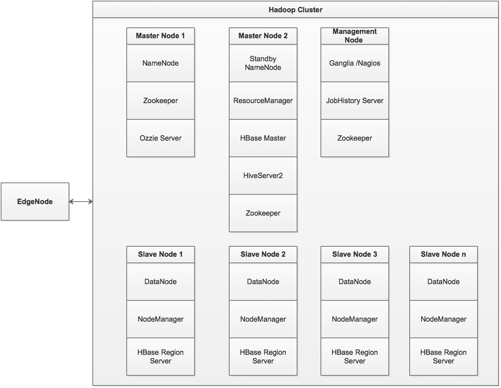

# 第三章：Hadoop 设计考虑因素

大数据并不一定意味着大量数据。如果数据集很小，分析它非常容易。我们可以将其加载到 Excel 电子表格中，并进行所需的计算。但是，随着数据量的增加，我们必须找到其他替代方案来处理它。我们可能需要将其加载到 RDMBS 表中，并运行 SQL 查询以在给定的结构上找到趋势和模式。此外，如果数据集格式变为类似电子邮件的格式，那么将其加载到 RDBMS 中将是一个巨大的挑战。更复杂的是，如果数据速度变为类似实时，使用传统的基于 RDBMS 的工具分析给定的数据集几乎是不可能的。在现代社会，*大数据*这个术语可以用五个最著名的 *V* 来表达。以下是对每个 *V* 的简要说明。



在本章中，我们将涵盖以下主题：

+   数据结构原则

+   安装 Hadoop 集群

+   探索 Hadoop 架构

+   介绍 YARN

+   Hadoop 集群组成

+   Hadoop 文件格式

# 理解数据结构原则

让我们回顾一些重要的数据架构原则：

+   **数据是企业的一项资产**：数据具有可衡量的价值。它为企业提供了实际的价值。在现代社会，数据被视为真正的黄金。

+   **数据是全企业共享的**：数据只被捕获一次，然后被多次使用和分析。多个用户可以访问相同的数据，用于不同的用例和需求。

+   **数据治理**：数据得到治理以确保数据质量。

+   **数据管理**：需要管理数据以实现企业目标。

+   **数据访问**：所有用户都应有权访问数据。

+   **数据安全**：数据应该得到适当的保护和保护。

+   **数据定义**：数据中的每个属性都需要在企业范围内保持一致的定义。

既然我们已经了解了大数据及其原理的基础，让我们开始一些实际操作。

# 安装 Hadoop 集群

需要执行以下步骤来安装 Hadoop 集群。在撰写本书时，Hadoop 版本 2.7.3 是一个稳定的版本。我们将安装它。

1.  使用以下命令检查 Java 版本：

```py
Java -version
Java(TM) SE Runtime Environment (build 1.8.0_144-b01)
Java HotSpot(TM) 64-Bit Server VM (build 25.144-b01, mixed mode)
You need to have Java 1.6 onwards 
```

1.  在所有服务器上创建 Hadoop 用户账户，包括所有 NameNodes 和 DataNodes，可以使用以下命令：

```py
useradd hadoop
passwd hadoop1 
```

假设我们拥有四台服务器，我们必须使用这四台服务器创建一个 Hadoop 集群。这四台服务器的 IP 地址如下：`192.168.11.1`、`192.168.11.2`、`192.168.11.3` 和 `192.168.11.4`。在这四台服务器中，我们将首先使用一台服务器作为主服务器（NameNode），其余所有服务器将用作从服务器（DataNodes）。

1.  在两个服务器上，NameNode 和 DataNodes，使用以下命令更改 `/etc/hosts` 文件：

```py
vi /etc/hosts--   
```

1.  然后将以下内容添加到所有服务器上的所有文件中：

```py
NameNode 192.168.11.1
DataNode1 192.168.11.2
DataNode2 192.168.11.3
DataNode3 192.168.11.4 
```

1.  现在，在 NameNodes 和 DataNodes 上设置 SSH：

```py
su - hadoop
ssh-keygen -t rsa
ssh-copy-id -i ~/.ssh/id_rsa.pub hadoop@namenode
ssh-copy-id -i ~/.ssh/id_rsa.pub hadoop@datanode1
ssh-copy-id -i ~/.ssh/id_rsa.pub hadoop@datanode2
ssh-copy-id -i ~/.ssh/id_rsa.pub hadoop@datanode3
chmod 0600 ~/.ssh/authorized_keys
exit
```

1.  在 NameNode 和所有 DataNodes 上下载并安装 Hadoop：

```py
mkdir /opt/hadoop
cd /opt/hadoop
wget http://www-eu.apache.org/dist/hadoop/common/hadoop-2.7.3/hadoop-2.7.3.tar.gz
tar -xvf hadoop-2.7.3.tar.gz 
mv Hadoop-2.7.3 hadoop
chown -R hadoop /opt/hadoop
cd /opt/hadoop/Hadoop
```

# 在 NameNode 上配置 Hadoop

登录到 NameNode：

```py
cd /opt/Hadoop/conf

vi core-site.xml  
```

找到并更改以下属性为这些值：

| **Filename** | **属性名称** | **属性值** |
| --- | --- | --- |
| `core-site.xml` |  `fs.default.name` |  `hdfs://namenode:9000/` |
|  | `dfs.permissions` |  `False` |
| `hdfs-site.xml` | `dfs.data.dir` | `/opt/hadoop/hadoop/dfs/namenode/data` |
|  | `dfs.name.dir` | `/opt/hadoop/hadoop/dfs/namenode` |
|  | `dfs.replication` | `1` |
| `mapred-site.xml` | `mapred.job.tracker` | `namenode:9001 ` |

```py
    vi masters
    namenode

    vi slaves
    datanode1
    datanode2
    datanode3

```

# 格式化 NameNode

以下代码用于格式化 NameNode：

```py
 cd /opt/Hadoop/Hadoop/bin

    hadoop -namenode  -format 
```

# 启动所有服务

我们使用以下代码行启动所有服务：

```py
    ./start-all.sh

```

关于如何设置 Hadoop 单节点和多节点集群的详细信息，请使用以下链接： [`hadoop.apache.org/docs/r2.7.0/hadoop-project-dist/hadoop-common/ClusterSetup.html`](https://hadoop.apache.org/docs/r2.7.0/hadoop-project-dist/hadoop-common/ClusterSetup.html).

# 探索 HDFS 架构

HDFS 架构基于主从模式。NameNode 是主节点，所有 DataNode 都是从节点。以下是一些关于这两个节点的重要注意事项。

# 定义 NameNode

NameNode 是 Hadoop 集群中所有 DataNode 的主节点。它仅以树形结构存储文件的元数据。重要的是 NameNode 永远不会存储除元数据以外的任何其他数据。NameNode 以块的形式跟踪写入 DataNode 的所有数据。默认块大小为 256 MB（可配置）。没有 NameNode，DataNode 文件系统上的数据无法读取。元数据存储在 NameNode 上，使用两个文件——文件系统命名空间镜像文件 FSImage 和编辑日志。FSImage 是 NameNode 编辑日志开始时的文件系统快照——自 NameNode 启动以来文件系统的所有更改，当 NameNode 启动时，它读取 FSImage 文件和编辑日志文件。所有事务（编辑）都合并到 FSImage 文件中。FSImage 文件写入磁盘，并创建一个新的空编辑日志文件以记录所有编辑。由于 NameNode 不经常重启，编辑日志文件变得非常大且难以管理。当 NameNode 重启时，由于所有编辑都需要应用到 FSImage 文件，因此重启需要非常长的时间。在 NameNode 崩溃的情况下，编辑日志文件中的所有元数据将不会写入 FSImage 文件，并将丢失。

# 次要 NameNode

次要 NameNode 的名称令人困惑。它并不充当 NameNode。其主要功能是定期从 NameNode 获取文件系统更改并将其合并到 NameNode 的 FSImage 中。将编辑日志文件更改写入 FSImage 的操作称为**提交**。定期的提交有助于减少 NameNode 的启动时间。次要 NameNode 也被称为提交节点。

# NameNode 安全模式

这是 HDFS 集群的只读模式。客户端不允许对文件系统或块进行任何修改。在启动时，NameNode 自动以安全模式启动，应用对 FSImage 的编辑，自动禁用安全模式，并以正常模式重新启动。

# DataNode

DataNodes 是 Hadoop 集群的功臣。它们的主要功能是以块的形式存储和检索数据。它们总是以心跳的形式向 NameNode 报告其状态。这就是 NameNode 如何跟踪任何 DataNodes，无论它们是活着还是死了。DataNodes 保持三个已知块的副本和复制因子。DataNodes 与其他 DataNodes 通信，以复制数据块来维护数据复制。

# 数据复制

HDFS 架构支持在集群的机器上放置非常大的文件。每个文件都存储为一系列块。为了确保容错性，每个块被复制三次到三台不同的机器上。这被称为复制因子，可以在集群级别或单个文件级别进行更改。是 NameNode 做出所有与块复制相关的决策。NameNode 从每个 DataNode 获取心跳和块报告。心跳确保 DataNode 是活着的。块报告包含一个 DataNode 上所有块的列表。

# 机架感知

HDFS 块放置将使用机架感知来提高容错性，将一个块副本放置在不同的机架上，如下图所示：



让我们详细理解这个图：

+   第一个副本被放置在发起请求的 DataNode 所在的同一机架上，例如，机架 1 和 DataNode 1

+   第二个副本被放置在另一个机架上的任意 DataNode 上，例如，机架 2，DataNode 2

+   第三个副本被放置在相同机架上的任意 DataNode 上，例如，机架 2，DataNode 3

可以使用 Unix shell、Java 或 Python 开发一个自定义的机架拓扑脚本，该脚本包含一个选择适当 DataNodes 的算法。它可以通过更改`Core-site.xml`文件中的`topology.script.file.name`参数在集群中激活。

# HDFS WebUI

下表显示了 HDFS WebUI 中的服务：

| **服务** | **协议** | **端口** | **URL** |
| --- | --- | --- | --- |
| NameNode WebUI | HTTP | `50070` | `http://namenode:50070/` |
| DataNode WebUI | HTTP | `50075` | `http://datanode:50075/` |
| Secondary NameNode | HTTP | `50090` | `http://Snamenode:50090/` |

# 介绍 YARN

**YARN（Yet Another Resource Negotiator**）将资源管理、调度和处理组件分离。它有助于实现集群资源的 100%利用率。YARN 根据 Hadoop 调度策略管理集群的 CPU 和内存。YARN 支持任何类型的应用程序，而不仅限于 MapReduce。它支持用任何类型的语言编写的应用程序，前提是可以在 Hadoop 集群上安装二进制文件。

# YARN 架构

在接下来的几节中，我们将详细理解 YARN 架构。

# 资源管理器

资源管理器负责跟踪集群中的资源并调度应用程序。资源管理器有两个主要组件：调度器和应用程序管理器。

# 节点管理器

节点管理器负责在节点上启动和管理容器。容器执行应用程序主指定的任务。它作为资源管理器的从属。每个节点管理器跟踪其 SlaveNode 上可用的数据处理资源，并向资源管理器发送定期报告。Hadoop 集群中的处理资源以称为**容器**的字节大小块消耗。

# YARN 配置

您可以执行以下步骤来配置 YARN：

1.  启动 Hadoop NameNode、辅助 NameNode 和 DataNode

1.  修改 `yarn-env.sh`。

根据您的 Hadoop 安装查找相应的 XML 文件。

1.  在 `YARN_CONF_DIR` 的定义下添加以下内容：

```py
export HADOOP_CONF_DIR="${HADOOP_CONF_DIR:-$YARN_HOME/etc/hadoop}"
export HADOOP_COMMON_HOME="${HADOOP_COMMON_HOME:-$YARN_HOME}"
export HADOOP_HDFS_HOME="${HADOOP_HDFS_HOME:-$YARN_HOME}"  
```

1.  修改 `yarn-site.xml`：

```py
<?xml version="1.0"?>
<configuration>
  <property>
    <name>yarn.nodemanager.aux-services</name>
    <value>mapreduce.shuffle</value>
  </property>
  <property>
    <name>yarn.nodemanager.aux-services.mapreduce.shuffle.class</name>
    <value>org.apache.hadoop.mapred.ShuffleHandler</value>
  </property>
</configuration> 
```

1.  修改 `mapred-site.xml`：

```py
<?xml version="1.0"?>
<?xml-stylesheet href="configuration.xsl"?>
<configuration>
  <property>
    <name>mapreduce.framework.name </name>
    <value>yarn</value>
  </property>
</configuration>  
```

1.  启动 YARN 服务：

```py
yarn resourcemanager
yarn nodemanager 
```

# 配置 HDFS 高可用性

让我们看看 Hadoop 随时间带来的变化。

# 在 Hadoop 1.x 期间

Hadoop 1.x 从单个 NameNode 架构开始。所有 DataNode 都会将它们的块报告发送到该单个 NameNode。架构中有一个辅助 NameNode，但它的唯一责任是合并所有对 FSImage 的编辑。在这种架构中，NameNode 成为了**单点故障**（SPOF）。由于它拥有 Hadoop 集群中所有 DataNode 的元数据，在 NameNode 崩溃的情况下，Hadoop 集群将无法使用，直到 NameNode 重新启动并修复。如果 NameNode 无法恢复，那么所有 DataNode 中的所有数据都将完全丢失。在计划维护时关闭 NameNode，HDFS 将无法用于正常使用。因此，有必要通过频繁备份 NameNode 文件系统来保护现有的 NameNode，以最大限度地减少数据丢失。

# 从 Hadoop 2.x 及以后版本开始

为了克服 HDFS **高可用性**（HA）问题并使 NameNode 成为 SPOF，架构已经改变。新的架构提供了在同一集群中运行两个冗余 NameNode 的能力，采用活动/被动配置和热备用。这允许在机器崩溃的情况下快速切换到新的 NameNode，或者为了计划维护而进行的优雅的由管理员启动的故障转移。以下提供了两种 HDFS HA 架构选项：

+   使用共享存储

+   使用法定多数日志管理器

# 使用 NFS 的 HDFS HA 集群

以下图展示了使用 NFS 作为共享存储的 HDFS HA 集群，该存储是 NameNodes 架构所需的：



# 重要架构要点

在使用共享存储架构的 HDFS 高可用性（HA）中，以下是一些需要记住的重要要点：

+   在集群中，有两台独立的机器：活动状态 NameNode 和备用状态 NameNode。

+   在任何给定时间点，只有一个 NameNode 处于活动状态，另一个处于备用状态。

+   活动 NameNode 管理集群中所有客户端 DataNode 的请求，而备用节点保持为从属状态。

+   所有 DataNode 都配置为向活动 NameNode 和备用 NameNode 发送其块报告和心跳。

+   备用 NameNode 保持其状态与活动 NameNode 同步。

+   活动节点和备用节点都可以访问共享存储设备上的文件系统（例如，从 NAS 的 NFS 挂载）

+   当客户端进行任何文件系统更改时，活动 NameNode 会将相应的更改（编辑）应用到位于网络共享目录上的编辑日志文件中。

+   备用 NameNode 对其自己的命名空间进行所有相应的更改。这样，它就与活动 NameNode 保持同步。

+   在活动 NameNode 不可用的情况下，备用 NameNode 确保它从共享网络目录吸收所有更改（编辑），并将其提升为活动 NameNode。

+   Hadoop 管理员应将隔离方法应用于共享存储，以避免同时使两个 NameNode 处于活动状态的场景。在故障转移的情况下，隔离方法切断对先前活动 NameNode 的访问，以确保对共享存储的更改顺利转移到备用 NameNode。之后，备用 NameNode 成为活动 NameNode。

# 配置具有共享存储的 HA NameNode

将以下属性添加到`hdfs-site.xml`中：

| **属性** | **值** |
| --- | --- |
| `dfs.nameservices` | `cluster_name` |
| `dfs.ha.namenodes.cluster_name` | `NN1`, `NN2` |
| `dfs.namenode.rpc-address.cluster_name.NN1` | `machine1:8020` |
| `dfs.namenode.rpc-address.cluster_name.NN2` | `machine2:8020` |
| `dfs.namenode.http-address.cluster_name.NN1` | `machine1:50070` |
| `dfs.namenode.http-address.cluster_name.NN2` | `machine2:50070` |
| `dfs.namenode.shared.edits.dir` | `file:///mnt/filer1/dfs/ha-name-dir-shared` |
| `dfs.client.failover.proxy.provider.cluster_name` | `org.apache.hadoop.hdfs.server.namenode.ha.ConfiguredFailoverProxyProvider` |
| `dfs.ha.fencing.methods` | `sshfence` |
| `dfs.ha.fencing.ssh.private-key-files` | `/home/myuser/.ssh/id_rsa` |
| `dfs.ha.fencing.methods` | `sshfence([[username][:port]])` |
| `dfs.ha.fencing.ssh.connect-timeout` | `30000` |

将以下属性添加到`core-site.xml`中：

| **属性** | **值** |
| --- | --- |
| `fs.defaultFS` | `hdfs://cluster_name` |

# 使用 Quorum Journal Manager 的 HDFS HA 集群

以下图展示了**Quorum Journal Manager**（**QJM**）架构，用于在活动 NameNode 和备用 NameNode 之间共享编辑日志：



# 重要架构点

以下是关于使用 QJM 架构的 HDFS HA 的一些重要要点：

+   在集群中，有两个独立的机器——活动状态的 NameNode 和待机状态的 NameNode。

+   在任何时刻，恰好有一个 NameNode 处于活动状态，另一个处于待机状态。

+   活动 NameNode 管理集群中所有客户端 DataNode 的请求，而待机节点保持为从属状态。

+   所有 DataNode 都配置为向活动 NameNode 和待机 NameNode 发送它们的块报告和心跳。

+   活动和待机 NameNode 通过与一组称为**JournalNodes**（**JNs**）的独立守护进程通信，保持彼此的同步。

+   当客户端进行任何文件系统更改时，活动状态的 NameNode 会持久地将修改记录日志记录到大多数 JNs 中。

+   待机节点通过与 JNs 通信，立即将其更改应用到自己的命名空间中。

+   在活动 NameNode 不可用的情况下，待机 NameNode 确保从 JNs 吸收所有更改（编辑），并提升自己为活动 NameNode。

+   为了避免同时使两个 NameNode 处于活动状态的场景，JNs 将只允许一个 NameNode 在某一时刻成为写者。这允许新的活动 NameNode 安全地进行故障转移。

# 配置使用 QJM 的 HA NameNode

将以下属性添加到`hdfs-site.xml`中：

| **属性** | **值** |
| --- | --- |
| `dfs.nameservices` | `cluster_name` |
| `dfs.ha.namenodes.cluster_name` | `NN1`, `NN2` |
| `dfs.namenode.rpc-address.cluster_name.NN1` | `machine1:8020` |
| `dfs.namenode.rpc-address.cluster_name.NN2` | `machine2:8020` |
| `dfs.namenode.http-address.cluster_name.NN1` | `machine1:50070` |
| `dfs.namenode.http-address.cluster_name.NN2` | `machine2:50070` |
| `dfs.namenode.shared.edits.dir` | `qjournal://node1:8485;node2:8485;node3:8485/cluster_name` |
| `dfs.client.failover.proxy.provider.cluster_name` | `org.apache.hadoop.hdfs.server.namenode.ha.ConfiguredFailoverProxyProvider` |
| `dfs.ha.fencing.methods` | `sshfence` |
| `dfs.ha.fencing.ssh.private-key-files` | `/home/myuser/.ssh/id_rsa` |
| `dfs.ha.fencing.methods` | `sshfence([[用户名][:端口]])` |
| `dfs.ha.fencing.ssh.connect-timeout` | `30000` |

将以下属性添加到`core-site.xml`中：

| **属性** | **值** |
| --- | --- |
| `fs.defaultFS` | `hdfs://cluster_name` |
| `dfs.journalnode.edits.dir` | `/path/to/journal/node/local/datat` |

# 自动故障转移

非常重要的是要知道上述两种架构仅支持手动故障转移。为了实现自动故障转移，我们必须引入两个额外的组件：一个 ZooKeeper 集群和一个**ZKFailoverController**（**ZKFC**）进程，以及更多的配置更改。

# 重要架构点

+   每个 NameNode，无论是活动状态还是待机状态，都会运行 ZKFC 进程。

+   NameNode 的状态由 ZKFC 监控和管理。

+   ZKFC 定期 ping 本地 NameNode，以确保 NameNode 是活跃的。如果它没有收到 ping 回复，它将标记该 NameNode 为不健康。

+   健康的 NameNode 持有一个特殊的锁。如果 NameNode 变得不健康，该锁将自动删除。

+   如果本地 NameNode 健康且 ZKFC 看到锁当前未被任何其他 NameNode 持有，它将尝试获取该锁。如果它成功获取锁，那么它赢得了选举。现在，这个 NameNode 负责运行故障转移，使其本地 NameNode 激活。

# 配置自动故障转移

将以下属性添加到 `hdfs-site.xml` 以配置自动故障转移：

| **属性** | **值** |
| --- | --- |
| `dfs.ha.automatic-failover.enabled` | `true` |
| `ha.zookeeper.quorum` | `zk1:2181`, `zk2:2181`, `zk3:2181` |

# Hadoop 集群组成

如我们所知，一个 Hadoop 集群由主服务器和从服务器组成：主节点——管理基础设施，从节点——分布式数据存储和处理。边缘节点不是 Hadoop 集群的一部分。这台机器用于与 Hadoop 集群交互。用户没有权限直接登录到任何主节点和数据节点，但他们可以登录到边缘节点以在 Hadoop 集群上运行任何作业。没有应用程序数据存储在边缘节点上。数据始终存储在 Hadoop 集群的数据节点上。根据在 Hadoop 集群上运行作业的用户数量，可能会有多个边缘节点。如果硬件足够，始终最好将每个主节点和数据节点托管在不同的机器上。但在典型的 Hadoop 集群中，有三个主节点。

请注意，我们假设在集群中使用 HBase 作为 NoSQL 数据存储。

# 典型的 Hadoop 集群

Hadoop 集群的组成将如下所示：



以下是一些需要考虑的硬件规格：

+   NameNode 和备用 NameNode。

+   内存需求取决于要创建的文件和块副本的数量。通常，建议 NameNodes 至少有 64 GB - 96 GB 的内存。

+   NameNodes 需要可靠的存储来托管 FSImage 和编辑日志。建议这些主节点至少拥有 4 TB - 6 TB 的 SAS 存储。为 NameNodes 配置 RAID 5 - 6 存储是一个好主意。如果集群是高可用集群，那么请这样规划您的 Hadoop 集群，即 JNs 应该配置在主节点上。

就处理器而言，建议至少有 2 个运行在 2 GHz 的四核 CPU，以处理主节点的消息流量。

+   数据节点/从节点每个节点至少应有 64 GB RAM。通常，每个 Hadoop 守护进程（如数据节点、节点管理器 ZooKeeper 等）需要 2 GB - 3 GB 内存；操作系统和其他服务需要 5 GB；每个 MapReduce 作业需要 5 GB - 8 GB。

+   DataNodes 可能配备至少 8 TB - 10 TB 的磁盘存储，使用 7200 RPM SATA 驱动器。硬盘配置应该是**Just a Bunch Of Disks**（**JBOD**）。

+   建议所有 DataNodes 至少配备 8 个处理器——2.5 GHz 核心和 24 核心 CPU。

+   建议每个机架内部具有 1 GbE 到 10 GbE 的网络连接。对于所有从节点，建议 1 GB 网络带宽，对于主节点，建议 10 GB 带宽。

+   如果您计划在未来扩展您的 Hadoop 集群，您也可以添加额外的机器。

请阅读以下来自 Hortonworks 和 Cloudera 的文章以获取更多信息：

+   [`docs.hortonworks.com/HDPDocuments/HDP1/HDP-1.3.3/bk_cluster-planning-guide/content/conclusion.html`](http://docs.hortonworks.com/HDPDocuments/HDP1/HDP-1.3.3/bk_cluster-planning-guide/content/conclusion.html)

+   [`blog.cloudera.com/blog/2013/08/how-to-select-the-right-hardware-for-your-new-hadoop-cluster/`](http://blog.cloudera.com/blog/2013/08/how-to-select-the-right-hardware-for-your-new-hadoop-cluster/)

# Hadoop 部署最佳实践

以下是一些在 Hadoop 部署中应遵循的最佳实践：

+   **从小开始**：与其他软件项目一样，Hadoop 的实施也涉及风险和成本。最好设置一个由四个节点组成的小型 Hadoop 集群。这个小集群可以作为一个**概念验证**（**POC**）。在使用任何 Hadoop 组件之前，它可以添加到现有的 Hadoop POC 集群中作为**技术验证**（**POT**）。这允许基础设施和开发团队了解大数据项目需求。在 POC 和 POT 成功完成后，可以添加额外的节点到现有集群。

+   **Hadoop 集群监控**：为了了解集群的健康状况，需要对 NameNode 和所有 DataNode 进行适当的监控。这有助于在节点出现问题时采取纠正措施。如果某个服务崩溃，及时的行动可以帮助避免未来出现大问题。设置 Gangalia 和 Nagios 是配置警报和监控的流行选择。在 Hortonworks 集群的情况下，Ambari 监控，以及 Cloudera 集群，Cloudera (CDH) 管理器监控可以是一个简单的设置。

+   **自动化部署**：使用 Puppet 或 Chef 等工具对于 Hadoop 部署至关重要。使用自动化工具而不是手动部署来部署 Hadoop 集群变得超级简单和高效。重视使用可用的工具/组件进行数据分析和处理。在解决问题时，优先考虑使用 Hive 或 Pig 脚本而不是编写重量级的自定义 MapReduce 代码。目标应该是开发更少，分析更多。

+   **高可用性（HA）的实施**：在决定 HA 基础设施和架构时，应仔细考虑任何需求增加和数据增长。在任何故障或崩溃发生时，系统应能够自我恢复或故障转移到另一个数据中心/站点。

+   **安全**：需要通过创建用户和组，并将用户映射到组中来保护数据。设置适当的权限并强制执行强密码应该锁定每个用户组。

+   **数据保护**：在将敏感数据移动到 Hadoop 集群之前，识别敏感数据至关重要。了解隐私政策和政府法规对于更好地识别和缓解合规风险暴露至关重要。

# Hadoop 文件格式

在 Hadoop 中，有许多文件格式可供选择。用户可以根据用例选择任何格式。每种格式在存储和性能方面都有特殊功能。让我们详细讨论每种文件格式。

# 文本/CSV 文件

文本和 CSV 文件在 Hadoop 数据处理算法中非常常见。文件中的每一行都被视为一个新的记录。通常，每一行以 *n* 字符结束。这些文件不支持列标题。因此，在处理时，总是需要额外的代码行来删除列标题。CSV 文件通常使用 GZIP 编解码器进行压缩，因为它们不支持块级压缩；这会增加更多的处理成本。不用说，它们也不支持模式演变。

# JSON

JSON 格式在所有现代编程语言中变得越来越受欢迎。这些文件是名称/值对的集合。JSON 格式通常用于数据交换应用程序，并被视为对象、记录、结构或数组。这些文件是文本文件，并支持模式演变。从 JSON 文件中添加或删除属性非常容易。与文本/CSV 文件一样，JSON 文件不支持块级压缩。

# 序列文件

序列文件是一个由二进制键/值对组成的平面文件。它们在 MapReduce ([`wiki.apache.org/hadoop/MapReduce`](https://wiki.apache.org/hadoop/MapReduce)) 作为输入/输出格式中被广泛使用。它们主要用于 MapReduce 作业序列中的中间数据存储。序列文件作为小文件的容器工作得很好。如果 HDFS 中有太多小文件，它们可以被打包成一个序列文件，以提高文件处理效率。序列文件有三种格式：未压缩、记录压缩和块压缩键/值记录。序列文件支持块级压缩，但不支持模式演变。

# Avro

Avro 是 Hadoop 社区中广泛使用的文件类型。它之所以受欢迎，是因为它有助于模式演变。它包含以二进制格式序列化的数据。Avro 文件是可分割的，并支持块压缩。它包含数据和元数据。它使用一个单独的 JSON 文件来定义模式格式。当 Avro 数据存储在文件中时，其模式也会与其一起存储，以便文件可以在以后由任何程序处理。如果读取数据的程序期望不同的模式，这可以很容易地解决，因为两种模式都存在。

# Parquet

Parquet 以扁平的列式格式存储嵌套数据结构。与任何行级文件格式相比，Parquet 在存储和性能方面更高效。Parquet 以列导向的方式存储二进制数据。在 Parquet 格式中，新列被添加到结构的末尾。Cloudera 主要支持这种格式用于 Impala 实现，但最近正迅速变得流行。这种格式适合 SQL 查询，因为它从具有许多列的宽表中读取特定列，从而只读取选择性列以减少 I/O 成本。

# ORC

ORC 文件是优化的记录列式文件格式，是 RC 文件的扩展版本。这些文件非常适合压缩，并且最适合 Hive SQL 性能，当 Hive 读取、写入和处理数据以减少访问时间和存储空间时。这些文件不支持真正的模式演变。它们主要得到 Hortonworks 的支持，并且不适合 Impala SQL 处理。

# 哪种文件格式更好？

答案是：这取决于您的用例。通常，选择文件格式的标准基于查询读取和查询写入性能。此外，这也取决于您正在使用的 Hadoop 发行版。使用 Hortonworks 发行版时，ORC 文件格式是 Hive 和 Tez 的最佳选择，而对于 Cloudera Impala 实现，建议使用 parquet 文件格式。对于涉及模式演变的用例，Avro 文件格式最为合适。如果您想使用 Sqoop 从 RDBMS 导入数据，text/CSV 文件格式是更好的选择。对于存储映射中间输出，序列文件是最终的选择。

# 摘要

在本章中，主要目标是了解各种 Hadoop 设计替代方案。当我们谈到 Hadoop 集群及其在典型生产环境中的最佳部署实践时，我们学到了很多。我们从对 Hadoop 的基本理解开始，然后继续到 Hadoop 配置、安装和 HDFS 架构。我们还学习了实现 HDFS 高可用性的各种技术。我们还研究了 YARN 架构。最后，我们探讨了各种文件格式以及如何根据您的用例选择一个。

在下一章中，我们将了解如何将数据导入到一个新创建的 Hadoop 集群中。
