# 第六章：设计实时流数据处理管道

本书的前三章都涉及批数据。在了解了 Hadoop 的安装、数据摄取工具和技术以及数据存储后，让我们转向数据流。我们不仅将探讨如何处理实时数据流，还将探讨围绕它们设计管道的方法。

在本章中，我们将涵盖以下主题：

+   实时流概念

+   实时流组件

+   Apache Flink 与 Spark

+   Apache Spark 与 Storm

# 实时流概念

在以下几节中，我们将了解与实时流应用程序相关的一些关键概念。

# 数据流

数据流是从一端到另一端、从发送者到接收者、从生产者到消费者的连续数据流动。数据的速度和量可能不同；它可能每秒 1GB 的数据，也可能每秒或每分钟 1KB 的数据。

# 批处理与实时数据处理

在批处理中，数据以批次的形式收集，每个批次都会被发送进行处理。批次的间隔可以是任何时间，从一天到一分钟不等。在当今的数据分析和商业智能领域，数据不会超过一天进行批处理。否则，业务团队将无法对日常业务情况有任何洞察。例如，企业数据仓库团队可能会收集过去 24 小时内所有订单，并将所有收集到的订单发送到分析引擎进行报告。

批次也可以是一分钟。在 Spark 框架中（我们将在第七章学习 Spark，*大规模数据处理框架*），数据以微批次的形式进行处理。

在实时处理中，数据（事件）在源端产生事件后立即从生产者（发送者）传输到消费者（接收者）。例如，在电子商务网站上，当客户在该网站上下单时，订单会立即在分析引擎中处理。优势是，该公司的业务团队可以实时（在几毫秒或亚毫秒内）全面了解其业务。这将帮助他们调整促销活动以增加收入，这一切都在实时进行。

下面的图像解释了流处理架构：

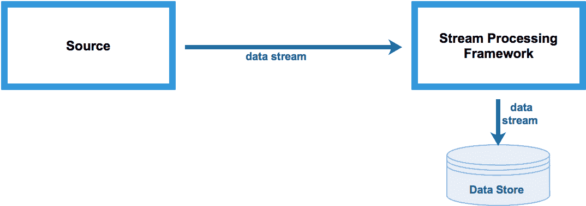

# 复杂事件处理

**复杂事件处理**（**CEP**）是结合来自多个来源的数据以发现复杂关系或模式的事件处理。CEP 的目标是尽快识别有意义的事件（如机会或威胁）并对它们做出响应。从根本上说，CEP 是关于将业务规则应用于流事件数据。例如，CEP 用于诸如股票交易、欺诈检测、医疗索赔处理等用例。

下面的图像解释了流处理架构：

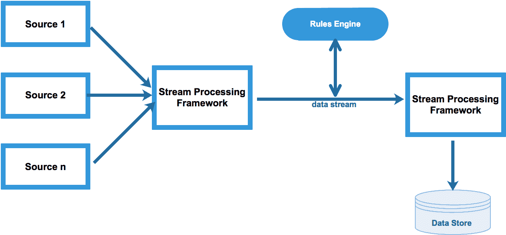

# 持续可用性

任何实时应用都应始终可用，没有任何中断。事件收集、处理和存储组件应配置为具有高可用性的假设。任何组件的故障都可能导致业务运行的重大中断。例如，在信用卡欺诈检测应用中，所有欺诈交易都需要被拒绝。如果应用在途中停止并且无法拒绝欺诈交易，那么这将会导致巨大的损失。

# 低延迟

在任何实时应用中，事件应在几毫秒内从源头流向目标。源头收集事件，处理框架将事件移动到其目标数据存储，在那里可以进一步分析以发现趋势和模式。所有这些都应该实时发生，否则可能会影响业务决策。例如，在信用卡欺诈检测应用中，预期所有传入的交易都应该被分析以查找可能的欺诈交易，如果有。如果流处理所需的时间超过预期，那么这些交易可能通过系统，给业务造成重大损失。

# 可扩展的处理框架

硬件故障可能会干扰流处理应用。为了避免这种常见的场景，我们始终需要一个提供内置 API 以支持连续计算、容错事件状态管理、故障时的检查点功能、在途聚合、窗口等功能的处理框架。幸运的是，所有最近的 Apache 项目，如 Storm、Spark、Flink 和 Kafka，都支持所有这些功能以及更多。开发者可以使用 Java、Python 和 Scala 使用这些 API。

# 水平可扩展性

流处理平台应支持水平可扩展性。这意味着在数据负载更高时，向集群添加更多物理服务器以保持吞吐量 SLA。这样，通过添加更多节点而不是向现有服务器添加更多 CPU 和内存来提高处理性能；这被称为**垂直可扩展性**。

# 存储

流的优选格式是键值对。这种格式由 JSON 和 Avro 格式很好地表示。首选的持久化键值类型数据是 NoSQL 数据存储，如 HBase 和 Cassandra。目前市场上总共有 100 个 NoSQL 开源数据库。选择正确的数据库，一个支持实时事件存储的数据库，是非常具有挑战性的，因为所有这些数据库都为数据持久性提供了一些独特的功能。一些例子包括模式无关性、高度可分布式、支持商品硬件、数据复制等。

下面的图像解释了所有流处理组件：

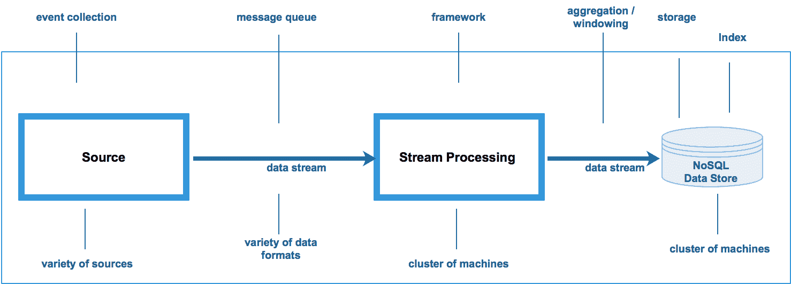

在本章中，我们将详细讨论消息队列和流处理框架。在下一章中，我们将重点关注数据索引技术。

# 实时流组件

在以下章节中，我们将介绍一些重要的实时流组件。

# 消息队列

消息队列允许您发布和订阅事件/记录的流。在我们的实时流架构中，我们可以使用各种替代方案作为消息队列。例如，有 RabbitMQ、ActiveMQ 和 Kafka。在这些中，Kafka 由于其各种独特的特性而获得了巨大的流行。因此，我们将详细讨论 Kafka 的架构。关于 RabbitMQ 和 ActiveMQ 的讨论超出了本书的范围。

# 那么 Kafka 是什么呢？

Kafka 是一个快速、可扩展、持久和容错的发布-订阅消息系统。Apache Kafka 是一个开源的流处理项目。它提供了一个统一、高吞吐量且低延迟的平台，用于处理实时数据流。它提供了一个分布式存储层，支持大规模可扩展的 pub/sub 消息队列。Kafka Connect 通过连接到外部系统支持数据导入和导出。Kafka Streams 提供了 Java API 进行流处理。Kafka 与 Apache Spark、Apache Cassandra、Apache HBase、Apache Spark 等结合使用，以进行实时流处理。

Apache Kafka 最初由 LinkedIn 开发，并在 2011 年初开源。2014 年 11 月，LinkedIn 上几位从事 Kafka 工作的工程师创建了一家名为 Confluent 的新公司，专注于 Kafka。请使用此 URL [`www.confluent.io/`](https://www.confluent.io/) 了解更多关于 Confluent 平台的信息。

# Kafka 特性

Kafka 有以下特性：

+   **Kafka 是可扩展的**：Kafka 集群由多个物理服务器组成，这有助于分散数据负载。在需要额外吞吐量的情况下，可以轻松扩展，因为可以添加更多服务器以保持 SLA。

+   **Kafka 是持久的**：在流处理过程中，Kafka 将消息持久化到持久存储中。这种存储可以是服务器本地磁盘或 Hadoop 集群。在消息处理失败的情况下，可以从磁盘访问消息并重新播放以再次处理消息。默认情况下，消息存储七天；这可以进一步配置。

+   **Kafka 是可靠的**：Kafka 通过一个名为**数据复制**的功能提供消息可靠性。每条消息至少复制三次（这是可配置的），以便在数据丢失的情况下，可以使用消息的副本进行处理。

+   **Kafka 支持高性能吞吐量**：由于其独特的架构、分区、消息存储和水平可扩展性，Kafka 有助于每秒处理数以 TB 计的数据。

# Kafka 架构

以下图像显示了 Kafka 的架构：

**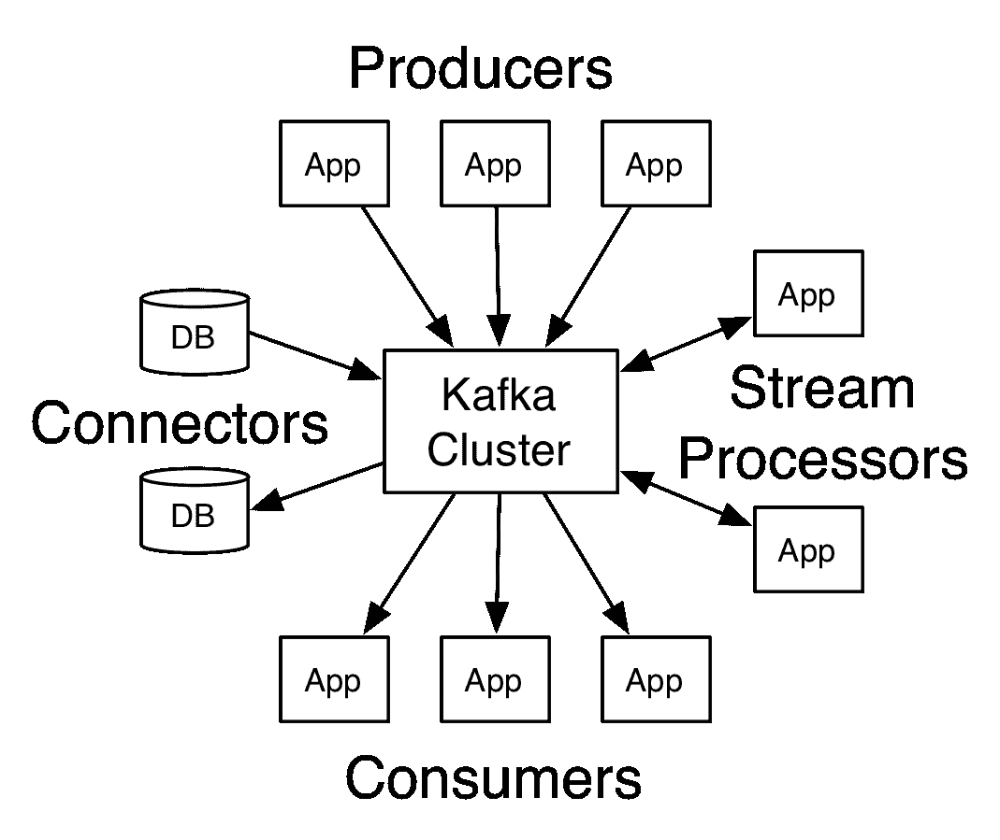**

# Kafka 架构组件

让我们详细看看每个组件：

+   **生产者**：生产者将消息发布到特定的 Kafka 主题。生产者可以为每条消息记录附加一个键。默认情况下，生产者以轮询方式将消息发布到主题分区。有时，可以根据消息键的哈希值配置生产者将消息写入特定的主题分区。

+   **主题**：所有消息都存储在一个主题中。主题是一个类别或数据源名称，记录被发布到其中。主题可以比作关系数据库中的一个表。多个消费者可以订阅单个主题以消费消息记录。

+   **分区**：主题被划分为多个分区。Kafka 通过将主题划分为分区并将每个分区放置在 Kafka 集群中单独的代理（服务器）上，提供了主题并行性。每个分区在磁盘上有一个独立的分区日志，其中存储消息。每个分区包含一个有序的、不可变的消息序列。每个消息被分配一个唯一的序列号，称为 **偏移量**。消费者可以从分区的任何位置读取消息——从开始处或从任何偏移量。

+   **消费者**：消费者订阅一个主题并消费消息。为了提高可伸缩性，同一应用中的消费者可以被分组到一个消费者组中，其中每个消费者可以读取来自唯一分区的消息。

+   **代理**：Kafka 被划分为多个称为 **代理** 的服务器。所有代理的总和被称为 **Kafka 集群**。Kafka 代理处理来自生产者的消息写入和来自消费者的消息读取。Kafka 代理存储所有来自生产者的消息。默认周期为七天。这个周期（保留周期）可以根据需求进行配置。保留周期直接影响到 Kafka 代理的本地存储。如果配置了较长的保留周期，则需要更多的存储空间。在保留周期结束后，消息将被自动丢弃。

+   **Kafka Connect**：根据 Kafka 文档，Kafka Connect 允许构建和运行可重用的生产者或消费者，它们将 Kafka 主题连接到现有的应用或数据系统中。例如，连接到关系数据库的连接器可能会捕获表中每个更改。

+   **Kafka Streams**：流 API 允许一个应用作为流处理器，从一个或多个主题中消费输入流，并将输出流发送到一个或多个输出主题，有效地将输入流转换为输出流。

# Kafka Connect 深入了解

Kafka Connect 是 Confluent 平台的一部分。它与 Kafka 集成。使用 Kafka Connect，从多个来源到多个目标构建数据管道变得非常容易。**源连接器**从另一个系统（例如，从关系型数据库到 Kafka）导入数据，而**目标连接器**导出数据（例如，Kafka 主题的内容到 HDFS 文件）。

# Kafka Connect 架构

以下图像展示了 Kafka Connect 的架构：

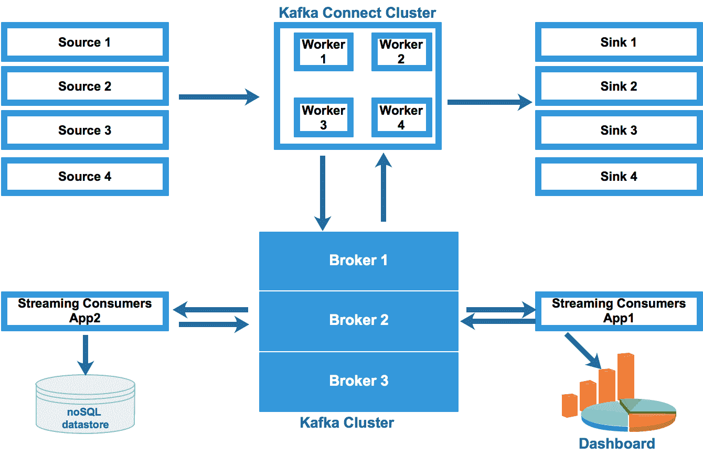

数据流可以解释如下：

+   各种来源连接到**Kafka Connect 集群**。**Kafka Connect 集群**从这些来源拉取数据。

+   **Kafka Connect 集群**由一组执行连接器和任务的容器化工作进程组成，这些任务自动协调彼此以分配工作并提供可扩展性和容错性。

+   **Kafka Connect 集群**将数据推送到**Kafka 集群**。

+   **Kafka 集群**将数据持久化到代理本地磁盘或 Hadoop。

+   流处理应用如 Storm、Spark Streaming 和 Flink 从**Kafka 集群**中拉取数据用于流转换、聚合、连接等操作。这些应用可以将数据回传到 Kafka 或持久化到外部数据存储，如 HBase、Cassandra、MongoDB、HDFS 等。

+   **Kafka Connect 集群**从**Kafka 集群**中拉取数据并将其推送到 Sinks。

+   用户可以扩展现有的 Kafka 连接器或开发全新的连接器。

# Kafka Connect 工作进程的独立模式与分布式模式

用户可以通过两种方式运行 Kafka Connect：独立模式或分布式模式。

在独立模式下，单个进程运行所有连接器。它不具有容错性。由于它只使用单个进程，因此不具有可扩展性。通常，它对用户在开发和测试目的上很有用。

在分布式模式下，多个工作进程运行 Kafka Connect。在这种模式下，Kafka Connect 可扩展且容错，因此在生产部署中使用。

让我们更深入地了解 Kafka 和 Kafka Connect（独立模式）。在这个例子中，我们将执行以下操作：

1.  安装 Kafka

1.  创建一个主题

1.  发送几条消息以验证生产者和消费者

1.  Kafka Connect-File-source 和 file-sink

1.  Kafka Connect-JDBC -Source

以下图像展示了使用**Kafka Connect**的用例：

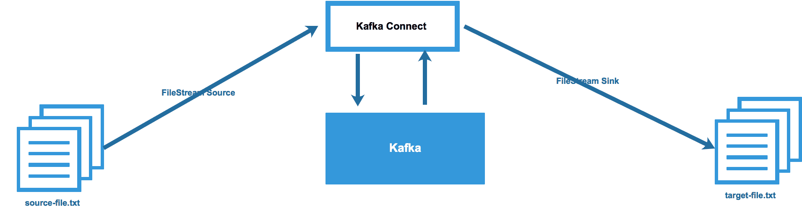

让我们通过运行一些示例来了解 Kafka 和 Kafka Connect 是如何工作的。有关更多详细信息，请使用以下链接访问 Kafka Confluent 的文档：[`docs.confluent.io/current/`](https://docs.confluent.io/current/)。

# 安装 Kafka

让我们执行以下步骤来安装 Kafka：

1.  从[`www.confluent.io/download/`](https://www.confluent.io/download/)下载 Confluent

1.  点击 Confluent 开源版

1.  从`tar.gz`下载文件`confluent-oss-4.0.0-2.11.tar.gz`并执行以下操作：

```py
tar xvf confluent-oss-4.0.0-2.11.tar.gz
cd /opt/confluent-4.0.0/etc/kafka
vi server.properties
```

1.  取消注释`listeners=PLAINTEXT://:9092`

1.  启动 Confluent：

```py
$ ./bin/confluent start schema-registry
```

1.  启动`zookeeper`：

```py
zookeeper is [UP]
```

1.  启动`kafka`：

```py
kafka is [UP]
```

1.  启动 `schema-registry`：

```py
schema-registry is [UP]
A4774045:confluent-4.0.0 m046277$
```

# 创建主题

执行以下步骤以创建主题：

1.  列出现有主题

1.  打开另一个终端并输入以下命令：

```py
/opt/confluent-4.0.0
bin/kafka-topics --list --zookeeper localhost:2181
_schemas
```

1.  创建一个主题：

```py
bin/kafka-topics --create --zookeeper localhost:2181 --replication-factor 1 --partitions 3 --topic my-first-topic

Created topic "my-first-topic"
```

1.  仔细检查新创建的主题：

```py
bin/kafka-topics --list --zookeeper localhost:2181
_schemas
my-first-topic
```

# 生成消息以验证生产者和消费者

执行以下步骤以生成消息以验证生产者和消费者：

1.  向 Kafka `my-first-topic` 发送消息

```py
bin/kafka-console-producer --broker-list localhost:9092 --topic my-first-topic
test1
test2
test3
```

1.  启动消费者以消费消息

1.  打开另一个终端并输入以下命令：

```py
$ bin/kafka-console-consumer --bootstrap-server localhost:9092 --topic my-first-topic --from-beginning
test3
test2
test1
```

1.  前往生产者终端并输入另一条消息：

```py
test4
```

1.  验证消费者终端以检查是否可以看到消息 `test4`

# 使用文件源和目标连接器的 Kafka Connect

让我们看看如何使用文件源和目标创建主题，以下是一些帮助：

```py
cd /opt/confluent-4.0.0/etc/kafka
vi connect-file-test-source.properties
name=local-file-source
connector.class=FileStreamSource
tasks.max=1
file=/opt/kafka_2.10-0.10.2.1/source-file.txt
topic=my-first-topic
vi connect-file-test-sink.properties
name=local-file-sink
connector.class=FileStreamSink
tasks.max=1
file=/opt/kafka_2.10-0.10.2.1/target-file.txt
topics=my-first-topic
```

执行以下步骤：

1.  启动源连接器和目标连接器：

```py
cd /opt/confluent-4.0.0
$ ./bin/connect-standalone config/connect-standalone.properties config/connect-file-test-source.properties config/connect-file-test-sink.properties

echo 'test-kafka-connect-1' >> source-file.txt
echo 'test-kafka-connect-2' >> source-file.txt
echo 'test-kafka-connect-3' >> source-file.txt
echo 'test-kafka-connect-4' >> source-file.txt
```

1.  仔细检查 Kafka 主题是否已收到消息：

```py
$ ./bin/kafka-console-consumer.sh --zookeeper localhost:2181 --from-beginning --topic my-first-topic

test3
test1
test4

{"schema":{"type":"string","optional":false},"payload":"test-kafka-connect-1"}
{"schema":{"type":"string","optional":false},"payload":"test-kafka-connect-2"}
{"schema":{"type":"string","optional":false},"payload":"test-kafka-connect-3"}
{"schema":{"type":"string","optional":false},"payload":"test-kafka-connect-4"}

test2
```

1.  验证 `target-file.txt`：

```py
$ cat target-file.txt

{"schema":{"type":"string","optional":false},"payload":"test-kafka-connect-1"}
{"schema":{"type":"string","optional":false},"payload":"test-kafka-connect-2"}
{"schema":{"type":"string","optional":false},"payload":"test-kafka-connect-3"}
{"schema":{"type":"string","optional":false},"payload":"test-kafka-connect-4"}
```

# 使用 JDBC 和文件目标连接器的 Kafka Connect

以下图像显示了如何将数据库表中的所有记录推送到文本文件：

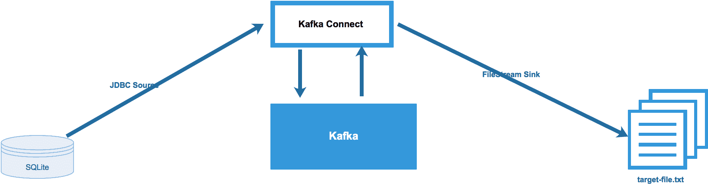

让我们使用 Kafka Connect 实现前面的示例：

1.  安装 SQLite：

```py
$ sqlite3 firstdb.db

SQLite version 3.16.0 2016-11-04 19:09:39
Enter ".help" for usage hints.

sqlite>
sqlite> CREATE TABLE customer(cust_id INTEGER PRIMARY KEY AUTOINCREMENT NOT NULL, cust_name VARCHAR(255));
sqlite> INSERT INTO customer(cust_id,cust_name) VALUES(1,'Jon');
sqlite> INSERT INTO customer(cust_id,cust_name) VALUES(2,'Harry');
sqlite> INSERT INTO customer(cust_id,cust_name) VALUES(3,'James');
sqlite> select * from customer;

1|Jon
2|Harry
3|James
```

1.  配置 JDBC 源连接器：

```py
cd /opt/confluent-4.0.0
vi ./etc/kafka-connect-jdbc/source-quickstart-sqlite.properties
name=test-sqlite-jdbc-autoincrement
connector.class=io.confluent.connect.jdbc.JdbcSourceConnector
tasks.max=1
connection.url=jdbc:sqlite:firstdb.db
mode=incrementing
incrementing.column.name=cust_id
topic.prefix=test-sqlite-jdbc-
```

1.  配置文件目标连接器：

```py
cd /opt/confluent-4.0.0
vi etc/kafka/connect-file-sink.properties
name=local-file-sink
connector.class=FileStreamSink
tasks.max=1
file=/opt/confluent-4.0.0/test.sink.txt
topics=test-sqlite-jdbc-customer
```

1.  启动 Kafka Connect（`.jdbs` 源和文件目标连接器）：

```py
./bin/connect-standalone ./etc/schema-registry/connect-avro-standalone.properties ./etc/kafka-connect-jdbc/source-quickstart-sqlite.properties ./etc/kafka/connect-file-sink.properties
```

1.  验证消费者：

```py
$ ./bin/kafka-avro-console-consumer --new-consumer --bootstrap-server localhost:9092 --topic test-sqlite-jdbc-customer --from-beginning
```

`--new-consumer` 选项已弃用，将在未来的主要版本中删除。如果提供了 `--bootstrap-server` 选项，则默认使用新消费者：

```py
{"cust_id":1,"cust_name":{"string":"Jon"}}
{"cust_id":2,"cust_name":{"string":"Harry"}}
{"cust_id":3,"cust_name":{"string":"James"}}
```

1.  验证目标文件：

```py
tail -f /opt/confluent-4.0.0/test.sink.txt

Struct{cust_id=1,cust_name=Jon}
Struct{cust_id=2,cust_name=Harry}
Struct{cust_id=3,cust_name=James}
```

1.  在客户表中插入更多记录：

```py
sqlite> INSERT INTO customer(cust_id,cust_name) VALUES(4,'Susan');
sqlite> INSERT INTO customer(cust_id,cust_name) VALUES(5,'Lisa');
```

1.  验证目标文件：

```py
tail -f /opt/confluent-4.0.0/test.sink.txt
```

你将在目标文件中看到所有客户记录（`cust_id`）。使用前面的示例，你可以自定义并实验任何其他目标连接器。

以下表格展示了 Confluent 平台上可用的 Kafka 连接器（由 Confluent 开发并完全支持）：

| **连接器名称** | **源/目标** |
| --- | --- |
| JDBC | 源和目标 |
| HDFS | 目标 |
| Elasticsearch | 目标 |
| Amazon S3 | 目标 |

关于 Confluent 其他认证连接器的更多信息，请使用此 URL：[`www.confluent.io/product/connectors/`](https://www.confluent.io/product/connectors/)。

你必须已经观察到 Kafka Connect 是一个基于配置的流处理框架。这意味着我们只需要配置源和目标连接器文件。我们不需要使用 Java 或 Scala 等低级语言编写任何代码。但现在，让我们转向另一个流行的实时流处理框架，称为 **Apache Storm**。让我们了解一些 Apache Storm 的酷特性。

# Apache Storm

Apache Storm 是一个免费且开源的分布式实时流处理框架。在撰写本书时，Apache Storm 的稳定发布版本为 1.0.5。Storm 框架主要使用 Clojure 编程语言编写。最初，它是由 Nathan Marz 和 Backtype 团队创建和开发的。该项目后来被 Twitter 收购。

在他关于 Storm 框架的一次演讲中，Nathan Marz 谈到了使用任何框架（如 Storm）的流处理应用程序。这些应用程序涉及队列和工作线程。一些数据源线程将消息写入队列，而其他线程则从队列中取出这些消息并写入目标数据存储。这里的主要缺点是源线程和目标线程不匹配各自的数据负载，这导致数据堆积。这也导致了数据丢失和额外的线程维护。

为了避免上述挑战，Nathan Marz 提出了一种优秀的架构，该架构将源线程和工作线程抽象为 Spouts 和 Bolts。这些 Spouts 和 Bolts 被提交到拓扑框架，该框架负责整个流处理。

# Apache Storm 的功能

Apache Storm 是分布式的。在流的工作负载增加的情况下，可以向 Storm 集群添加多个节点以添加更多的工作者和更多的处理能力来处理。

它是一个真正的实时流处理系统，支持**低延迟**。事件可以从源到目标在毫秒、秒或分钟内到达，具体取决于用例。

Storm 框架支持**多种编程语言**，但 Java 是首选。Storm 是**容错的**。即使集群中的任何节点失败，它也会继续运行。Storm 是**可靠的**。它支持至少一次或恰好一次的处理。

使用 Storm 框架**没有复杂性**。对于更详细的信息，请参阅 Storm 文档：[`storm.apache.org/releases/1.0.4/index.html`](http://storm.apache.org/releases/1.0.4/index.html)。

# Storm 拓扑

以下图像显示了典型的**Storm 拓扑**：

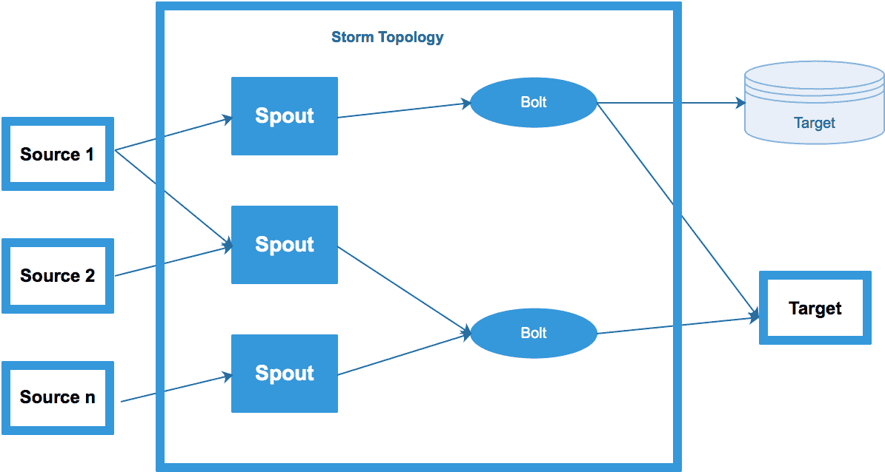

# Storm 拓扑组件

以下章节解释了 Storm 拓扑的所有组件：

+   **拓扑**：拓扑是由流分组连接的 spouts 和 bolts 组成的**DAG（有向无环图**）。拓扑会持续运行，直到被终止。

+   **流**：流是一个无界的元组序列。元组可以是任何数据类型。它支持所有 Java 数据类型。

+   **流分组**：流分组决定了哪个 bolt 从 spout 接收元组。基本上，这些都是关于流如何在不同的 bolt 之间流动的策略。以下是 Storm 中内置的流分组。

+   **随机分组**：这是一个默认的分组策略。元组被随机分布，每个 bolt 都会得到相同数量的流进行处理。

+   **字段分组**: 在这种策略中，流字段的相同值将被发送到同一个 Bolt。例如，如果所有元组都是按`customer_id`分组的，那么相同`customer_id`的所有元组将被发送到同一个 Bolt 任务，而另一个`customer_id`的所有元组将被发送到另一个 Bolt 任务。

+   **全部分组**: 在全部分组中，每个元组被发送到每个 Bolt 任务。当需要在同一组数据上执行两个不同的函数时，可以使用它。在这种情况下，流可以被复制，每个函数可以在数据的每个副本上计算。

+   **直接分组**: 这是一个特殊的分组类型。在这里，开发者可以在元组本身发射的组件中定义分组逻辑。元组的生产者决定哪个消费者的任务将接收这个元组。

+   **自定义分组**: 开发者可以通过实现`CustomGrouping`方法来决定实现自己的分组策略。

+   **Spout**: Spout 连接到数据源并将流数据摄入到 Storm 拓扑中。

+   **Bolt**: 一个喷口向 Bolt 发送一个元组。Bolt 负责事件转换、将事件与其他事件连接、过滤、聚合和窗口化。它将元组发送到另一个 Bolt 或持久化到目标。在拓扑中所有处理都在 Bolt 中完成。Bolt 可以执行从过滤到函数、聚合、连接、与数据库通信等任何操作。

+   **Storm 集群**: 下图显示了**Storm 集群**的所有组件：

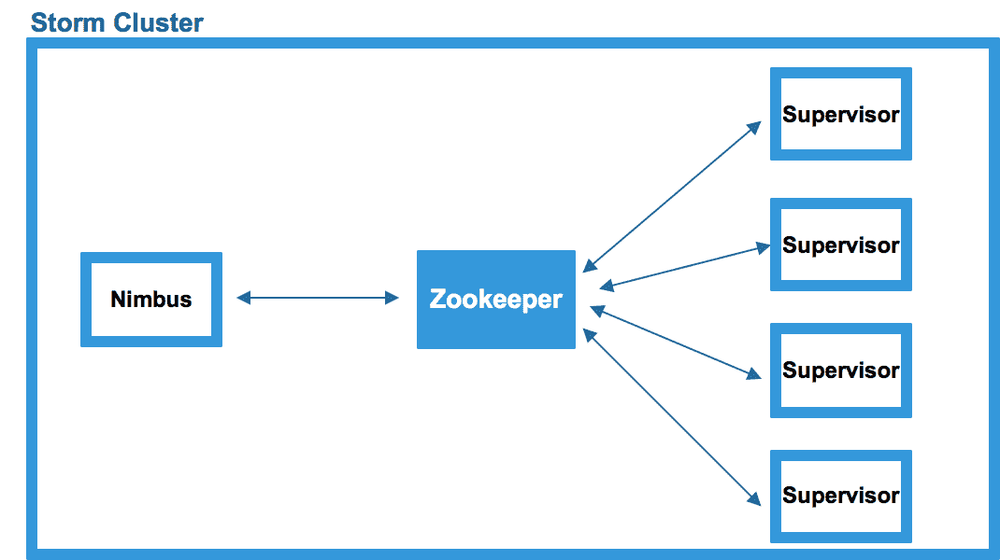

+   **Storm 集群节点**: Storm 集群的三个主要节点是 Nimbus、Supervisor 和 ZooKeeper。以下部分将详细解释所有组件。

+   **Nimbus 节点**: 在 Storm 中，这是 Storm 集群的主节点。它将代码分发到集群并启动工作任务。基本上，它将任务分配给集群中的每个节点。它还监控每个提交作业的状态。在作业失败的情况下，Nimbus 将作业重新分配到集群中的不同管理节点。如果 Nimbus 不可用，工作进程仍然会继续运行。然而，没有 Nimbus，当需要时，工作进程不会被重新分配到其他机器。在节点不可用的情况下，分配给该节点的任务将超时，Nimbus 将把这些任务重新分配到其他机器。在 Nimbus 和 Supervisor 都不可用的情况下，它们需要像什么都没发生一样重新启动，并且不会影响任何工作进程。

+   **管理节点**: 在 Storm 中，这是一个从节点。它通过 ZooKeeper 与 Nimbus 通信。它在其自身的管理节点中启动和停止工作进程。例如，如果管理节点发现某个特定的工作进程已死亡，则它将立即重启该工作进程。如果管理节点在尝试几次后无法重启工作进程，则它将向 Nimbus 报告此情况，Nimbus 将在不同的管理节点上重启该工作进程。

+   **Zookeeper 节点**：它在 Storm 集群中的主节点（Nimbus）和从节点（supervisors）之间充当协调器。在生产环境中，通常设置一个包含三个 Zookeeper 实例（节点）的 Zookeeper 集群。

# 在单节点集群上安装 Storm

以下是在单机上安装 Storm 集群的步骤：

1.  安装 `jdk`。确保您已安装 1.8：

```py
$ java -version
```

您应该看到以下输出：

```py
openjdk version "1.8.0_141"
OpenJDK Runtime Environment (build 1.8.0_141-b16)
OpenJDK 64-Bit Server VM (build 25.141-b16, mixed mod
```

1.  创建一个文件夹以下载 Storm 的 `.tar` 文件：

```py
$ mkdir /opt/storm
$ cd storm
```

1.  创建一个文件夹以持久化 Zookeeper 和 Storm 数据：

```py
$ mkdir /usr/local/zookeeper/data
$ mkdir /usr/local/storm/data
```

1.  下载 Zookeeper 和 Storm：

```py
$ wget http://apache.osuosl.org/zookeeper/stable/zookeeper-3.4.10.tar.gz
$ gunzip zookeeper-3.4.10.tar.gz
$ tar -xvf zookeeper-3.4.10.tar
$ wget http://mirrors.ibiblio.org/apache/storm/apache-storm-1.0.5/apache-storm-1.0.5.tar.gz
$ gunzip apache-storm-1.0.5.tar.gz
$ tar -xvf apache-storm-1.0.5.tar
```

1.  配置 Zookeeper 并将以下内容设置到 Zookeeper (`zoo.cfg`)：

```py
$ cd zookeeper-3.4.10
$ vi con/zoo.cfg
tickTime = 2000
dataDir = /usr/local/zookeeper/data
clientPort = 2181
```

1.  按照以下方式配置 Storm：

```py
$ cd /opt/ apache-storm-1.0.5
$ vi conf/storm.yaml
```

1.  添加以下内容：

```py
storm.zookeeper.servers:
 - "127.0.0.1"
 nimbus.host: "127.0.0.1"
 storm.local.dir: "/usr/local/storm/data"
 supervisor.slots.ports:
 - 6700
 - 6701
 - 6702
 - 6703
```

（对于额外的工作者，添加更多端口，例如 6704 等）

1.  启动 Zookeeper：

```py
$ cd /opt/zookeeper-3.4.10
$ bin/zkServer.sh start &amp;amp;
```

1.  启动 Nimbus：

```py
$ cd /opt/ apache-storm-1.0.5
$ bin/storm nimbus &amp;amp;
```

1.  启动 Supervisor：

```py
$ bin/storm supervisor &amp;amp;
```

1.  在 Storm UI 中验证安装：

```py
http://127.0.0.1:8080
```

# 开发 Storm 的实时流式管道

在本节中，我们将创建以下三个管道：

+   Kafka - Storm - MySQL 的流式管道

+   Kafka - Storm - HDFS - Hive 的流式管道

在本节中，我们将了解数据流如何从 Kafka 流向 Storm 到 MySQL 表。

整个管道将按以下方式工作：

1.  我们将使用 Kafka 控制台生产者 API 在 Kafka 中摄取客户记录（`customer_firstname` 和 `customer_lastname`）。

1.  之后，Storm 将从 Kafka 拉取消息。

1.  将建立到 MySQL 的连接。

1.  Storm 将使用 MySQL-Bolt 将记录摄取到 MySQL 表中。MySQL 将自动生成 `customer_id`。

1.  将使用 SQL 访问 MySQL 表数据（`customer_id`、`customer_firstname` 和 `customer_lastname`）。

我们将开发以下 Java 类：

+   `MysqlConnection.java`：此类将与本地 MySQL 数据库建立连接。

+   `MysqlPrepare.java`：此类将准备要插入数据库的 SQL 语句。

+   `MysqlBolt`：这是一个 storm bolt 框架，用于从 Kafka 发射元组到 MySQL。

+   `MySQLKafkaTopology`：这是一个 Storm Topology 框架，用于构建将 spouts（Kafka）绑定到 Bolts（MySQL）的工作流程。在这里，我们使用本地 Storm 集群。

# 从 Kafka 到 Storm 到 MySQL 的管道流式传输

以下图像显示了管道的组件。在这个管道中，我们将学习消息如何实时从 Kafka 流向 Storm 到 MySQL：

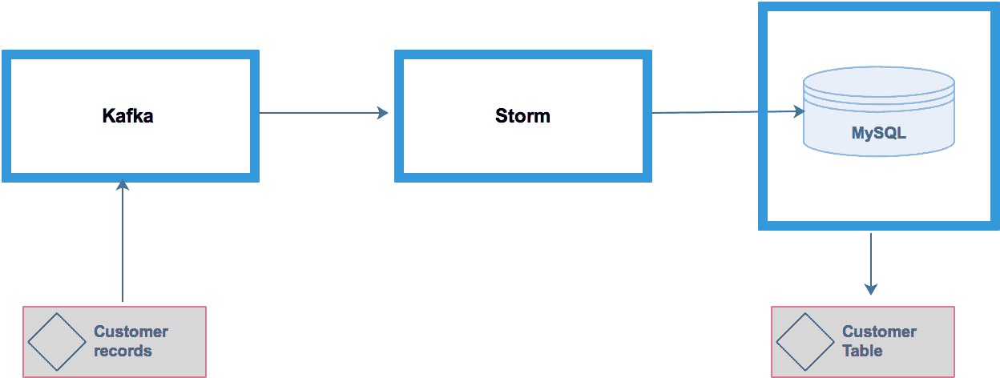

以下是为 `MysqlConnection.java` 编写的完整 Java 代码：

```py
package com.StormMysql;
import java.sql.Connection;
import java.sql.DriverManager;
public class MysqlConnection {
private String server_name;
 private String database_name;
 private String user_name;
 private String password;
 private Connection connection;

public MysqlConnection(String server_name, String database_name, String user_name, String password)
 {
 this.server_name=server_name;
 this.database_name=database_name;
 this.user_name=user_name;
 this.password=password;
 }

public Connection getConnection()
 {
 return connection;
 }

public boolean open()
 {
 boolean successful=true;
 try{
 Class.*forName*("com.mysql.jdbc.Driver");
 connection = DriverManager.*getConnection*("jdbc:mysql://"+server_name+"/"+database_name+"?"+"user="+user_name+"&amp;amp;password="+password);
 }catch(Exception ex)
 {
 successful=false;
 ex.printStackTrace();
 }
 return successful;
 }

public boolean close()
 {
 if(connection==null)
 {
 return false;
 }

boolean successful=true;
 try{
 connection.close();
 }catch(Exception ex)
 {
 successful=false;
 ex.printStackTrace();
 }

return successful;
 }
 }
```

以下是为 `MySqlPrepare.java` 编写的完整代码：

```py
package com.StormMysql;
import org.apache.storm.tuple.Tuple;
import java.sql.PreparedStatement;
public class MySqlPrepare {
 private MysqlConnection conn;

public MySqlPrepare(String server_name, String database_name, String user_name, String password)
 {
 conn = new MysqlConnection(server_name, database_name, user_name, password);
 conn.open();
 }

public void persist(Tuple tuple)
 {
 PreparedStatement statement=null;
 try{
 statement = conn.getConnection().prepareStatement("insert into customer (cust_id,cust_firstname, cust_lastname) values (default, ?,?)");
 statement.setString(1, tuple.getString(0));

statement.executeUpdate();
 }catch(Exception ex)
 {
 ex.printStackTrace();
 }finally {
 if(statement != null)
 {
 try{
 statement.close();
 }catch(Exception ex)
 {
 ex.printStackTrace();
 }
 }
 }
 }

public void close()
 {
 conn.close();
 }
 }
```

以下是为 `MySqlBolt.java` 编写的完整代码：

```py
package com.StormMysql;

import java.util.Map;

import org.apache.storm.topology.BasicOutputCollector;
 import org.apache.storm.topology.OutputFieldsDeclarer;
 import org.apache.storm.topology.base.BaseBasicBolt;
 import org.apache.storm.tuple.Fields;
 import org.apache.storm.tuple.Tuple;
 import org.apache.storm.tuple.Values;
 import org.apache.storm.task.TopologyContext;
 import java.util.Map;

public class MySqlBolt extends BaseBasicBolt {

private static final long *serialVersionUID* = 1L;
 private MySqlPrepare mySqlPrepare;

@Override
 public void prepare(Map stormConf, TopologyContext context)
 {
 mySqlPrepare=new MySqlPrepare("localhost", "sales","root","");
 }

public void execute(Tuple input, BasicOutputCollector collector) {
 *//* *TODO Auto-generated method stub* mySqlPrepare.persist(input);
 *//System.out.println(input);* }
@Override
 public void cleanup() {
 mySqlPrepare.close();
 }
}
```

以下是为 `KafkaMySQLTopology.java` 编写的完整代码：

```py
package com.StormMysql;
import org.apache.storm.Config;
 import org.apache.storm.spout.SchemeAsMultiScheme;
 import org.apache.storm.topology.TopologyBuilder;
 import org.apache.storm.kafka.*;
 import org.apache.storm.LocalCluster;
 import org.apache.storm.generated.AlreadyAliveException;
 import org.apache.storm.generated.InvalidTopologyException;
public class KafkaMySQLTopology
 {
 public static void main( String[] args ) throws AlreadyAliveException, InvalidTopologyException
 {
 ZkHosts zkHosts=new ZkHosts("localhost:2181");
String topic="mysql-topic";
 String consumer_group_id="id7";
SpoutConfig kafkaConfig=new SpoutConfig(zkHosts, topic, "", consumer_group_id);
kafkaConfig.scheme=new SchemeAsMultiScheme(new StringScheme());
KafkaSpout kafkaSpout=new KafkaSpout(kafkaConfig);
TopologyBuilder builder=new TopologyBuilder();
 builder.setSpout("KafkaSpout", kafkaSpout);
 builder.setBolt("MySqlBolt", new MySqlBolt()).globalGrouping("KafkaSpout");
LocalCluster cluster=new LocalCluster();
Config config=new Config();
cluster.submitTopology("KafkaMySQLTopology", config, builder.createTopology());
try{
 Thread.*sleep*(10000);
 }catch(InterruptedException ex)
 {
 ex.printStackTrace();
 }
// cluster.killTopology("KafkaMySQLTopology");
 // cluster.shutdown();
}
 }
```

使用 `pom.xml` 文件在 IDE 中构建您的项目。

# 使用 Kafka 到 Storm 到 HDFS 的管道流式传输

在本节中，我们将了解数据流如何从 Kafka 流向 Storm 到 HDFS，并使用 Hive 外部表访问它们。

以下图像显示了管道的组件。在这个管道中，我们将学习消息如何实时从 Kafka 流向 Storm 再流向 HDFS：

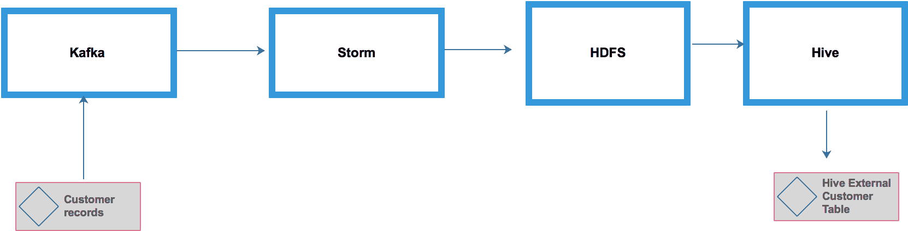

整个管道将按以下方式工作：

1.  我们将使用 Kafka 控制台生产者 API 在 Kafka 中导入客户记录（`customer_id`、`customer_firstname` 和 `customer_lastname`）

1.  之后，Storm 将从 Kafka 拉取消息

1.  将与 HDFS 建立连接

1.  Storm 将使用 HDFS-Bolt 将记录导入 HDFS

1.  将创建 Hive 外部表以存储（`customer_id`、`customer_firstname` 和 `customer_lastname`）

1.  将使用 SQL 访问 Hive 表数据（`customer_id`、`customer_firstname` 和 `customer_lastname`）

我们将开发以下 Java 类：

`KafkaTopology.java`: 这是一个 Storm Topology 框架，用于构建工作流程以将 spouts（Kafka）绑定到 Bolts（HDFS）。在这里，我们使用的是本地 Storm 集群。

在之前的示例管道中，可以开发多个独立的数据流解析和转换类来处理 Kafka 生产者和消费者。

以下是 `KafkaToplogy.java` 的完整 Java 代码：

```py
package com.stormhdfs;
import org.apache.storm.Config;
 import org.apache.storm.LocalCluster;
 import org.apache.storm.generated.AlreadyAliveException;
 import org.apache.storm.generated.InvalidTopologyException;
 import org.apache.storm.hdfs.bolt.HdfsBolt;
 import org.apache.storm.hdfs.bolt.format.DefaultFileNameFormat;
 import org.apache.storm.hdfs.bolt.format.DelimitedRecordFormat;
 import org.apache.storm.hdfs.bolt.format.RecordFormat;
 import org.apache.storm.hdfs.bolt.rotation.FileRotationPolicy;
 import org.apache.storm.hdfs.bolt.rotation.FileSizeRotationPolicy;
 import org.apache.storm.hdfs.bolt.sync.CountSyncPolicy;
 import org.apache.storm.hdfs.bolt.sync.SyncPolicy;
 import org.apache.storm.kafka.KafkaSpout;
 import org.apache.storm.kafka.SpoutConfig;
 import org.apache.storm.kafka.StringScheme;
 import org.apache.storm.kafka.ZkHosts;
 import org.apache.storm.spout.SchemeAsMultiScheme;
 import org.apache.storm.topology.TopologyBuilder;
public class KafkaTopology {
 public static void main(String[] args) throws AlreadyAliveException, InvalidTopologyException {
// zookeeper hosts for the Kafka clusterZkHosts zkHosts = new ZkHosts("localhost:2181");
// Create the KafkaSpout configuartion
 // Second argument is the topic name
 // Third argument is the zookeeper root for Kafka
 // Fourth argument is consumer group id
SpoutConfig kafkaConfig = new SpoutConfig(zkHosts,
 "data-pipleline-topic", "", "id7");
// Specify that the kafka messages are String
kafkaConfig.scheme = new SchemeAsMultiScheme(new StringScheme());
// We want to consume all the first messages in the topic everytime
 // we run the topology to help in debugging. In production, this
 // property should be false
kafkaConfig.startOffsetTime = kafka.api.OffsetRequest.*EarliestTime*();
RecordFormat format = new DelimitedRecordFormat().withFieldDelimiter("|");
 SyncPolicy syncPolicy = new CountSyncPolicy(1000);
FileRotationPolicy rotationPolicy = new FileSizeRotationPolicy(1.0f,FileSizeRotationPolicy.Units.*MB*);
DefaultFileNameFormat fileNameFormat = new DefaultFileNameFormat();

fileNameFormat.withPath("/user/storm-data");

fileNameFormat.withPrefix("records-");

fileNameFormat.withExtension(".txt");

HdfsBolt bolt =
 new HdfsBolt().withFsUrl("hdfs://127.0.0.1:8020")
 .withFileNameFormat(fileNameFormat)
 .withRecordFormat(format)
 .withRotationPolicy(rotationPolicy)
 .withSyncPolicy(syncPolicy);

// Now we create the topology
TopologyBuilder builder = new TopologyBuilder();

// set the kafka spout class
builder.setSpout("KafkaSpout", new KafkaSpout(kafkaConfig), 1);

// configure the bolts
 // builder.setBolt("SentenceBolt", new SentenceBolt(), 1).globalGrouping("KafkaSpout");
 // builder.setBolt("PrinterBolt", new PrinterBolt(), 1).globalGrouping("SentenceBolt");
builder.setBolt("HDFS-Bolt", bolt ).globalGrouping("KafkaSpout");

// create an instance of LocalCluster class for executing topology in local mode.
LocalCluster cluster = new LocalCluster();
 Config conf = new Config();

// Submit topology for execution
cluster.submitTopology("KafkaTopology", conf, builder.createTopology());

try {
 // Wait for some time before exiting
System.out.println("Waiting to consume from kafka");
 Thread.sleep(10000);
 } catch (Exception exception) {
 System.out.println("Thread interrupted exception : " + exception);
 }

// kill the KafkaTopology
 //cluster.killTopology("KafkaTopology");

// shut down the storm test cluster
 // cluster.shutdown();
}
 }
```

相应的 Hive 表如下：

```py
CREATE EXTERNAL TABLE IF NOT EXISTS customer (
customer_id INT,
customer_firstname String,
customer_lastname String))
COMMENT 'customer table'
ROW FORMAT DELIMITED
FIELDS TERMINATED BY '|'
STORED AS TEXTFILE
location '/user/storm-data';
$ hive > select * from customer;
```

# 其他流行的实时数据流框架

除了 Apache Storm 之外，还有相当多的其他开源实时数据流框架。在本节中，我将简要讨论仅限于开源非商业框架。但，在本节末尾，我将提供一些商业供应商产品的链接，这些产品提供了一些非常有趣的功能。

# Kafka Streams API

Kafka Streams 是用于构建流式应用程序的库。Kafka Streams 是用于构建应用程序和微服务的客户端库，其中输入和输出数据存储在 Kafka 集群中。Kafka Streams API 转换并丰富了数据。

以下 Kafka Streams API 的重要特性：

+   它是开源 Apache Kafka 项目的一部分。

+   它支持每条记录的低延迟流处理（毫秒级）。在 Kafka Streams API 中没有微批处理的概念。流中的每条记录都会单独处理。

+   它支持无状态处理（过滤和映射）、有状态处理（连接和聚合），以及窗口操作（例如，计算最后 1 分钟、最后 5 分钟、最后 30 分钟或最后一天的数据等）。

+   要运行 Kafka Streams API，无需构建一个拥有多台机器的单独集群。开发者可以在他们的 Java 应用程序或微服务中使用 Kafka Streams API 来处理实时数据。

+   Kafka Streams API 具有高度的扩展性和容错性。

+   Kafka Streams API 完全与部署无关。它可以在裸机、虚拟机、Kubernetes 容器和云上部署。没有任何限制。流 API 从不部署在 Kafka 代理上。它就像任何其他 Java 应用程序一样，是一个独立的应用程序，部署在 Kafka 代理之外。

+   它使用 Kafka 安全模型。

+   自 0.11.0 版本以来，它支持恰好一次语义。

让我们再次回顾一下早期的图像，以找出 Kafka Streams API 在整体 Kafka 架构中的确切位置。

这里有一些有用的网址，可以帮助您详细了解 Kafka Streams：

+   [`kafka.apache.org/documentation/`](https://kafka.apache.org/documentation/)

+   [`www.confluent.io/blog/`](https://www.confluent.io/blog/)

+   [`www.confluent.io/blog/introducing-kafka-streams-stream-processing-made-simple/`](https://www.confluent.io/blog/introducing-kafka-streams-stream-processing-made-simple/)

+   [`docs.confluent.io/current/streams/index.html`](https://docs.confluent.io/current/streams/index.html)

# Spark Streaming

请注意，我们将在第七章大型数据处理框架中讨论 Spark，该章完全致力于 Spark。然而，在本节中，我将讨论 Spark Streaming 的一些重要特性。为了更好地理解，建议读者首先学习第七章[大型数据处理框架]，然后再回来阅读本节以了解更多关于 Spark Streaming 的内容。

使用 Hadoop MapReduce 进行批处理，使用 Apache Storm 进行实时流处理是一种通用做法。

使用这两种不同的编程模型会导致代码量增加、需要修复的错误数量以及开发工作量的增加；它还引入了学习曲线并导致其他问题。Spark Streaming 有助于解决这些问题，并提供一个可扩展的、高效的、健壮的、且与批处理集成的系统。

Spark Streaming 的优势在于其能够与批处理相结合。可以使用常规 Spark 编程创建 RDD 并将其与 Spark 流连接。此外，代码库相似，如果需要，可以轻松迁移——并且从 Spark 来看，学习曲线几乎为零。

Spark Streaming 是核心 Spark API 的扩展。它扩展 Spark 以进行实时流处理。Spark Streaming 具有以下特点：

+   它是可扩展的——可以在数百个节点上进行扩展

+   它提供高吞吐量并实现第二级延迟

+   它具有容错性，并且能够有效地从失败中恢复

+   它与批处理和交互式数据处理集成

Spark Streaming 将数据流应用程序处理为一系列非常小、确定性的批处理作业。

Spark Streaming 提供了 Scala、Java 和 Python 的 API。Spark Streaming 根据时间将实时数据流划分为多个批次。时间可以从一秒到几分钟/小时不等。通常，批次被划分为几秒。Spark 将每个批次视为 RDD，并根据 RDD 操作（map、filter、join flatmap、distinct、reduceByKey 等）进行处理。最后，RDD 的处理结果以批次的格式返回。

以下图像展示了 Spark Streaming 的数据流：

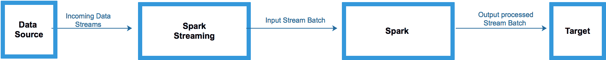

这里有一些有用的 URL，用于详细了解 Spark Streaming：

+   [`databricks.com/blog`](https://databricks.com/blog)

+   [`databricks.com/blog/category/engineering/streaming`](https://databricks.com/blog/category/engineering/streaming)

+   [`spark.apache.org/streaming/`](https://spark.apache.org/streaming/)

# Apache Flink

Apache Flink 的文档这样描述 Flink：Flink 是一个开源的分布式流处理框架。

Flink 提供准确的结果，并支持无序或迟到数据集。它是状态化的和容错的，可以在保持恰好一次应用程序状态的同时无缝恢复失败。它在大型规模上运行，在数千个节点上运行，具有非常好的吞吐量和延迟特性。

以下列出的是 Apache Flink 的特性：

+   Flink 为状态化计算保证了恰好一次语义

+   Flink 支持具有事件时间语义的流处理和窗口

+   Flink 支持基于时间、计数或会话的灵活窗口，除了数据驱动的窗口

+   Flink 具有高吞吐量和低延迟的能力

+   Flink 的 savepoints 提供了一个状态版本化机制，使得更新应用程序或重新处理历史数据成为可能，而不会丢失状态和最小化停机时间

+   Flink 设计用于在具有数千个节点的超大规模集群上运行，除了独立集群模式外，Flink 还提供了对 YARN 和 Mesos 的支持

Flink 的核心是一个分布式流数据流引擎。它支持一次处理一个流，而不是一次处理整个流的批次。

Flink 支持以下库：

+   CEP

+   机器学习

+   图形处理

+   Apache Storm 兼容性

Flink 支持以下 API：

+   **DataStream API**：此 API 帮助所有流，转换，即过滤、聚合、计数和窗口

+   **DataSet API**：此 API 帮助所有批数据转换，即连接、分组、映射和过滤

+   **表 API**：支持在关系数据流上使用 SQL

+   **流式 SQL**：支持在批处理和流式表上使用 SQL

以下图像描述了 Flink 编程模型：

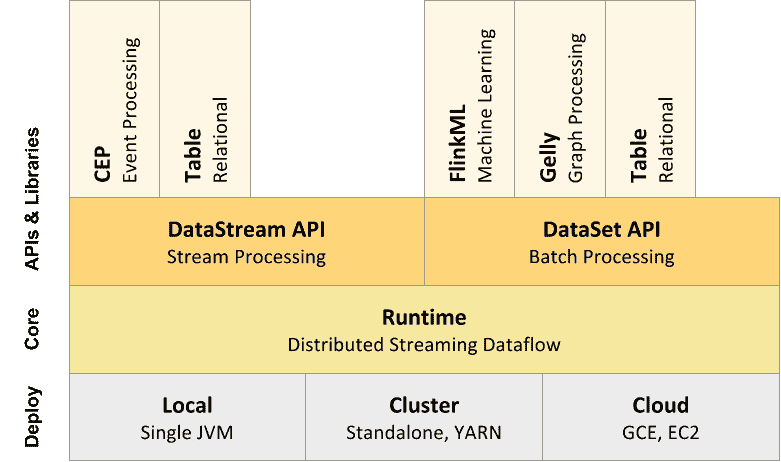

以下图像描述了 Flink 架构：


以下列出的是 Flink 编程模型的组件：

+   **源**：收集数据并发送到 Flink 引擎的数据源

+   **转换**：在这个组件中，整个转换过程发生

+   **汇入点**：处理后的流被发送到的目标

这里有一些有用的网址，可以详细了解 Spark Streaming：

+   [`ci.apache.org/projects/flink/flink-docs-release-1.4/`](https://ci.apache.org/projects/flink/flink-docs-release-1.4/)

+   [`www.youtube.com/watch?v=ACS6OM1-xgE&feature=youtu.be`](https://www.youtube.com/watch?v=ACS6OM1-xgE&feature=youtu.be)

在接下来的几节中，我们将探讨各种流框架的比较。

# Apache Flink 与 Spark 的比较

Spark Streaming 的主要重点是流批处理操作，称为 **微批处理**。这种编程模型适用于许多用例，但并非所有用例都需要亚秒级延迟的实时流处理。例如，像信用卡欺诈预防这样的用例需要毫秒级延迟。因此，微批处理编程模型不适用于这种情况。（但，Spark 的最新版本 2.4 支持毫秒级数据延迟。）

Apache Flink 支持毫秒级延迟，适用于诸如欺诈检测等用例。

# Apache Spark 与 Storm 的比较

Spark 使用微批处理来处理事件，而 Storm 则逐个处理事件。这意味着 Spark 的延迟为秒级，而 Storm 提供毫秒级延迟。Spark Streaming 提供了一个高级抽象，称为 **离散流** 或 **DStream**，它表示 RDD 的连续序列。（但，Spark 的最新版本 2.4 支持毫秒级数据延迟。）最新的 Spark 版本支持 DataFrame。

几乎可以使用相同的代码（API）进行 Spark Streaming 和 Spark 批处理作业。这有助于重用这两种编程模型的大部分代码库。此外，Spark 支持机器学习和图 API。因此，同样，相同的代码库也可以用于这些用例。

# 概述

在本章中，我们首先详细了解了实时流处理概念，包括数据流、批处理与实时处理、CEP、低延迟、连续可用性、水平可扩展性、存储等。后来，我们学习了 Apache Kafka，它是现代实时流数据管道的重要组成部分。Kafka 的主要特性是可扩展性、持久性、可靠性和高吞吐量。

我们还学习了 Kafka Connect；其架构、数据流、源和连接器。我们研究了案例研究，使用 Kafka Connect 的文件源、文件汇入点、JDBC 源和文件汇入点连接器来设计数据管道。

在后面的章节中，我们学习了各种开源实时流处理框架，例如 Apache Storm 框架。我们也看到了一些实际的应用示例。Apache Storm 是一个分布式框架，支持低延迟和多种编程语言。Storm 具有容错性和可靠性，支持至少一次或恰好一次的处理。

Spark Streaming 有助于解决这些问题，并提供了一个可扩展、高效、弹性且与批量处理集成的系统。Spark Streaming 的优势在于其与批量处理的结合能力。Spark Streaming 可扩展，提供高吞吐量。它支持微批处理以实现二级延迟，具有容错性，并与批量及交互式数据处理集成。

Apache Flink 保证恰好一次的语义，支持事件时间语义，高吞吐量和低延迟。它被设计用于在大型集群上运行。
