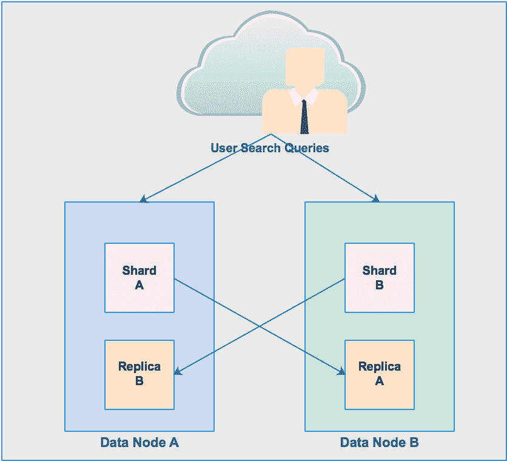
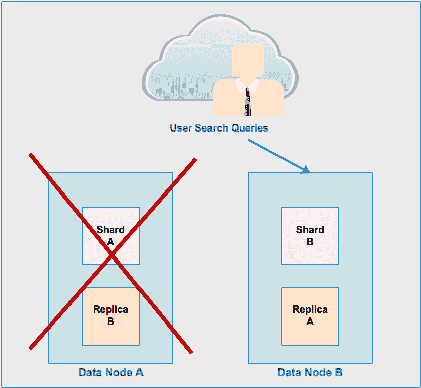
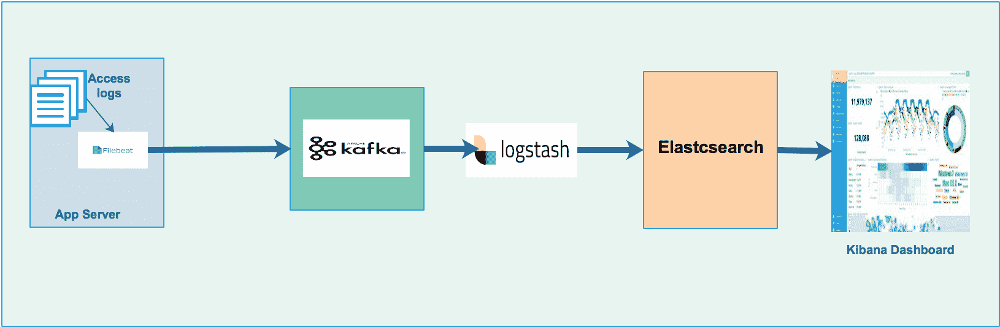

# 第八章：构建企业搜索平台

在学习了数据摄取和数据持久化方法之后，让我们来学习如何搜索数据。在本章中，我们将学习以下重要内容：

+   数据搜索技术

+   构建实时搜索引擎

+   搜索实时全文数据

+   数据索引技术

+   构建实时数据搜索管道

# 数据搜索的概念

在我们的日常生活中，我们总是在不断寻找某些东西。早上，我们寻找牙刷、报纸、搜索股价、公交时刻表、公文包等等。这个清单可以一直列下去。当我们在一天结束时上床睡觉时，这种搜索活动就停止了。我们使用很多工具和技术来搜索这些事物，以最大限度地减少实际搜索时间。我们使用谷歌搜索大多数事情，比如新闻、股价、公交时刻表以及我们需要的任何东西。为了搜索一本书的特定页面，我们使用书的索引。所以，重点是搜索是我们生活中非常重要的活动。从这个过程中可以提炼出两个重要的概念，那就是搜索工具和搜索时间。想想看，如果你想知道一家公司的特定股价，而加载这个页面需要几分钟，你肯定会非常烦恼。这是因为在这种情况下，搜索时间对你来说是不可接受的。那么问题来了，*如何减少搜索时间？* 我们将在本章中学习这一点。

# 企业搜索引擎的需求

就像我们都需要一个工具来搜索自己的东西一样，每个公司也需要一个搜索引擎来构建，以便内部和外部实体可以找到他们想要的东西。

例如，员工需要搜索他的/她的年假余额、特定月份的工资条等等。人力资源部门可能需要搜索在财务组工作的员工等等。在一家电子商务公司中，产品目录是最可搜索的对象。这是一个非常敏感的对象，因为它直接影响到公司的收入。如果客户想要买一双鞋，他/她首先可以做的就是搜索公司的产品目录。如果搜索时间超过几秒钟，客户可能会对产品失去兴趣。也可能发生这样的情况，同一个客户会去另一个网站买鞋，从而导致收入损失。

看起来，即使拥有世界上所有的技术和数据，如果没有两个关键组件，我们也做不了太多：

+   数据搜索

+   数据索引

例如，像谷歌、亚马逊和苹果这样的公司已经改变了世界对搜索的期望。我们都期望他们能够随时随地进行搜索，使用任何工具，如网站、移动设备和像谷歌 Echo、Alexa 和 HomePad 这样的语音激活工具。我们期望这些工具能够回答我们所有的问题，从“今天天气怎么样？”到给我列出附近的所有加油站。

随着这些期望的增长，索引更多数据的需要也在增长。

# 构建企业搜索引擎的工具

以下是一些流行的工具/产品/技术：

+   Apache Lucene

+   Elasticsearch

+   Apache Solr

+   自定义（内部）搜索引擎

在本章中，我将详细讨论 Elasticsearch。我将在概念层面上讨论 Apache Solr。

# Elasticsearch

Elasticsearch 是一个开源的搜索引擎。它基于 Apache Lucene。它是分布式的，并支持多租户能力。它使用无模式的 JSON 文档，并具有基于 HTTP 的内置网络接口。它还支持分析 RESTful 查询工作负载。它是一个基于 Java 的数据库服务器。其主要协议是 HTTP/JSON。

# 为什么选择 Elasticsearch？

到目前为止，Elasticsearch 是最流行的数据索引工具。这是因为以下特性：

+   它是**快速**的。数据以实时速度索引。

+   它是**可扩展**的。它水平扩展。

+   它是**灵活**的。它支持任何数据格式，结构化、半结构化或非结构化。

+   它是**分布式**的。如果一个节点失败，集群仍然可用于业务。

+   它支持任何语言的数据搜索查询：Java、Python、Ruby、C#等等。

+   它有一个**Hadoop 连接器**，这促进了 Elasticsearch 和 Hadoop 之间顺畅的通信。

+   它支持在大型数据集上进行强大的数据**聚合**，以找到趋势和模式。

+   **Elastic stack**（Beats、Logstash、Elasticsearch 和 Kibana）和 X-Pack 为数据摄取、数据索引、数据可视化、数据安全和监控提供开箱即用的支持。

# Elasticsearch 组件

在我们深入探讨之前，让我们了解 Elasticsearch 的一些重要组件。

# 索引

Elasticsearch 索引是一组 JSON 文档。Elasticsearch 是一个可能包含多个索引的数据存储。每个索引可以分成一个或多个类型。类型是相似文档的集合。一个类型可以包含多个文档。从数据库的类比来说，索引是一个数据库，而它的每个类型都是一个表。每个 JSON 文档是表中的一行。

在 Elasticsearch 6.0.0 或更高版本中创建的索引可能只能包含一个映射类型。

映射类型将在 Elasticsearch 7.0.0 中完全移除。

# 文档

在 Elasticsearch 中的文档意味着一个 JSON 文档。它是存储在索引中的基本数据单元。一个索引由多个文档组成。在关系型数据库管理系统（RDBMS）的世界里，文档不过是表中的一行。例如，一个客户文档可能看起来像以下这样：

```py
{
"name": "Sam Taylor",
"birthdate": "1995-08-11",
"address":
{
"street": "155 rabbit Street",
"city": "San Francisco",
"state": "ca",
"postalCode": "94107"
},
"contactPhone":
[
{
"type": "home",
"number": "510-415-8929"
},
{
"type": "cell",
"number": "408-171-8187"
}
]
}
```

# 映射

映射是索引的架构定义。就像数据库一样，我们必须定义一个表的数据库结构。我们必须创建一个表，它的列和列数据类型。在 Elasticsearch 中，我们必须在其创建期间定义索引的结构。我们可能需要定义哪些字段可以被索引、可搜索和可存储。

好消息是，Elasticsearch 支持 **动态映射**。这意味着在索引创建时映射不是必需的。可以创建没有映射的索引。当文档被发送到 Elasticsearch 进行索引时，Elasticsearch 会自动定义每个字段的 数据结构，并将每个字段设置为可搜索字段。

# 集群

Elasticsearch 是由节点（服务器）组成的集合。每个节点可能存储索引中的部分数据，并为所有节点提供联邦索引和搜索功能。每个集群默认都有一个独特的名称，即 `elasticsearch`。集群被划分为多种类型的节点，即主节点和数据节点。但可以使用仅安装了主节点和数据节点的单个节点来创建 Elasticsearch 集群：

+   **主节点**：它控制整个集群。集群中可以有多个主节点（建议三个）。其主要功能是索引创建或删除以及将分片（分区）分配给数据节点。

+   **数据节点**：它存储实际的索引数据在分片中。它们支持所有数据相关操作，如聚合、索引搜索等。

# 类型

文档被划分为各种逻辑类型，例如订单文档、产品文档、客户文档等。而不是创建三个单独的订单、产品、客户索引，单个索引可以逻辑上划分为订单、产品、客户类型。在 RDBMS 类比中，类型就是数据库中的一个表。因此，类型是索引的逻辑分区。

类型在 Elasticsearch 6.0 版本中已弃用。

# 如何在 Elasticsearch 中索引文档？

让我们通过索引这三个示例文档来学习 Elasticsearch 实际是如何工作的。在学习这个过程中，我们将涉及到 Elasticsearch 的几个重要功能/概念。

这些是要索引的三个示例 JSON 文档：

```py
{
"name": "Angela Martin",
"birthdate": "1997-11-02",
"street": "63542 Times Square",
"city": "New York",
"state": "NY",
"zip": "10036",
"homePhone": "212-415-8929",
"cellPhone": "212-171-8187"
} ,
{
"name": "Sam Taylor",
"birthdate": "1995-08-11",
"street": "155 rabbit Street",
"city": "San Francisco",
"state": "ca",
"zip": "94107",
"homePhone": "510-415-8929",
"cellPhone": "408-171-8187"
} ,
{
"name": "Dan Lee",
"birthdate": "1970-01-25",
"street": "76336 1st Street",
"city": "Los Angeles",
"state": "ca",
"zip": "90010",
"homePhone": "323-892-5363",
"cellPhone": "213-978-1320"
}
```

# Elasticsearch 安装

首先要做的。让我们安装 Elasticsearch。

请按照以下步骤在您的服务器上安装 Elasticsearch。假设您正在使用 CentOS 7 在服务器上安装 Elasticsearch。

需要的最小硬件配置是什么？

+   **RAM**：4 GB

+   **CPU**：2 核

需要安装哪个 JDK？我们需要 JDK 8。如果您服务器上没有安装 JDK 8，请按照以下步骤安装 JDK 8：

1.  切换到主目录：

```py
 $ cd ~
```

1.  下载 JDK RPM：

```py
$ wget --no-cookies --no-check-certificate --header "Cookie: gpw_e24=http%3A%2F%2Fwww.oracle.com%2F; oraclelicense=accept-securebackup-cookie" http://download.oracle.com/otn-pub/java/jdk/8u73-b02/jdk-8u73-linux-x64.rpm
```

1.  使用 YUM 安装 RPM（假设您有 `sudo` 权限）：

```py
$ sudo yum -y localinstall jdk-8u73-linux-x64.rpm
```

由于我们已经成功在服务器上安装了 JDK 8，让我们开始安装 Elasticsearch。

# Elasticsearch 安装

对于详细的安装步骤，请参阅以下 URL：

[**https://www.elastic.co/guide/en/elasticsearch/reference/current/rpm.html**](https://www.elastic.co/guide/en/elasticsearch/reference/current/rpm.html)

1.  Elasticsearch v6.2.3 的 RPM 可以从网站上下载，并按照以下步骤安装：

```py
$ wget https://artifacts.elastic.co/downloads/elasticsearch/elasticsearch-6.1.2.rpm
$ sudo rpm --install elasticsearch-6.1.2.rpm
```

1.  要配置 Elasticsearch 在系统启动时自动启动，请运行以下命令。

```py
sudo /bin/systemctl daemon-reload
sudo /bin/systemctl enable elasticsearch.service
```

1.  Elasticsearch 可以如下启动和停止：

```py
sudo systemctl start elasticsearch.service
sudo systemctl stop elasticsearch.service
```

主要配置文件位于名为`elasticsearch.yml`的`config`文件夹中。

在`elasticsearch.yml`中进行以下初始配置更改。找到并替换以下参数：

```py
cluster.name: my-elaticsearch
path.data: /opt/data
path.logs: /opt/logs
network.host: 0.0.0.0
http.port: 9200
```

现在启动 Elasticsearch：

```py
sudo systemctl start elasticsearch.service
```

使用以下 URL 检查 Elasticsearch 是否正在运行：

```py
http://localhost:9200
```

我们将得到以下响应：

```py
// 20180320161034
// http://localhost:9200/
{
 "name": "o7NVnfX",
"cluster_name": "my-elasticsearch",
"cluster_uuid": "jmB-_FEuTb6N_OFokwxF1A",
"version": {
"number": "6.1.2",
"build_hash": "5b1fea5",
"build_date": "2017-01-10T02:35:59.208Z",
"build_snapshot": false,
"lucene_version": "7.1.0",
"minimum_wire_compatibility_version": "5.6.0",
"minimum_index_compatibility_version": "5.0.0"
},
"tagline": "You Know, for Search"
}
```

现在，我们的 Elasticsearch 运行良好。让我们创建一个索引来存储我们的文档。

# 创建索引

我们将使用以下`curl`命令创建我们的第一个名为`my_index`的索引：

```py
curl -XPUT 'localhost:9200/my_index?pretty' -H 'Content-Type: application/json' -d'
{
"settings" : {
"index" : {
"number_of_shards" : 2,
"number_of_replicas" : 1
}
}
}
'
```

我们将得到以下响应：

```py
{
"acknowledged" : true,
"shards_acknowledged" : true,
"index" : "my_index"
}
```

在索引创建 URL 中，我们使用了设置、分片和副本。让我们了解分片和副本的含义。

# 主分片

我们已创建包含三个分片的索引。这意味着 Elasticsearch 会将索引划分为三个分区。每个分区称为**分片**。每个分片都是一个完整的、独立的 Lucene 索引。基本思想是 Elasticsearch 会将每个分片存储在不同的数据节点上，以增加可伸缩性。在创建索引时，我们必须指定我们想要的分片数量。然后，Elasticsearch 将自动处理。在文档搜索过程中，Elasticsearch 将聚合来自所有可用分片的所有文档，以合并结果以满足用户的搜索请求。这对用户来说是完全透明的。因此，概念是索引可以被划分为多个分片，并且每个分片可以托管在每个数据节点上。分片的放置将由 Elasticsearch 本身负责。如果我们没有在创建索引的 URL 中指定分片数量，Elasticsearch 将默认为每个索引创建五个分片。

# 副本分片

我们已创建包含一个副本的分片索引。这意味着 Elasticsearch 将为每个分片创建一个副本（副本），并将每个副本放置在除原始分片外的单独数据节点上。因此，现在有两个分片：主分片（原始分片）和副本分片（主分片的副本）。在高量搜索活动期间，Elasticsearch 可以从放置在不同数据节点上的主分片或副本分片提供查询结果。这就是 Elasticsearch 如何通过每个搜索查询可能访问不同的数据节点来增加查询吞吐量的方式。

总结来说，主分片和副本分片都提供了横向可伸缩性和吞吐量。它通过在所有副本上并行执行搜索来扩展您的搜索量/吞吐量。

Elasticsearch 是一个分布式数据存储。这意味着数据可以被分成多个数据节点。例如，假设我们只有一个数据节点，并且我们一直在同一个数据节点上摄取和索引文档，那么在达到该节点的硬件容量后，我们可能无法再摄取文档。因此，为了容纳更多文档，我们必须向现有的 Elasticsearch 集群添加另一个数据节点。如果我们添加另一个数据节点，Elasticsearch 将重新平衡分片到新创建的数据节点。因此，现在用户搜索查询可以同时适应两个数据节点。如果我们创建了一个副本分片，那么每个分片将创建两个副本并放置在这两个数据节点上。现在，如果一个数据节点出现故障，用户搜索查询仍然可以使用一个数据节点执行。

这张图片展示了用户搜索查询是如何从数据节点执行的：



以下图片显示，即使数据节点 **A** 崩溃，用户查询仍然可以从数据节点 **B** 执行：



让我们验证新创建的索引：

```py
curl -XGET 'localhost:9200/_cat/indices?v&amp;amp;amp;pretty'
```

我们将获得以下响应：

```py
health status index uuid pri rep docs.count docs.deleted store.size pri.store.size
yellow open my_index 2MXqDHedSUqoV8Zyo0l-Lw 5 1 1 0 6.9kb 6.9kb
```

让我们了解响应：

+   **Health:** 这表示集群的整体健康状态为黄色。有三个状态：绿色、黄色和红色。状态 `Green` 表示集群完全功能正常，一切看起来都很好。状态 "Yellow" 表示集群完全可用，但一些副本尚未分配。在我们的例子中，因为我们只使用一个节点和 5 个分片以及每个分片 1 个副本，Elasticsearch 不会将所有分片的副本都分配到单个数据节点上。集群状态 "Red" 表示集群部分可用，某些数据集不可用。原因可能是数据节点已关闭或其他原因。

+   **Status**: `Open`。这意味着集群对业务开放。

+   **Index** : 索引名称。在我们的例子中，索引名称是 `my_index`。

+   **Uuid** : 这是唯一的索引 ID。

+   **Pri** : 主分片的数量。

+   **Rep** : 副本分片的数量。

+   **docs.count** : 索引中的文档总数。

+   **docs.deleted** : 从索引中至今已删除的文档总数。

+   **store.size** : 主分片和副本分片占用的存储大小。

+   **pri.store.size** : 仅由主分片占用的存储大小。

# 将文档导入索引

以下 `curl` 命令可以用来将单个文档摄取到 `my_index` 索引中：

```py
curl -X PUT 'localhost:9200/my_index/customer/1' -H 'Content-Type: application/json' -d '
{
"name": "Angela Martin",
"birthdate": "1997-11-02",
"street": "63542 Times Square",
"city": "New York",
"state": "NY",
"zip": "10036",
"homePhone": "212-415-8929",
"cellPhone": "212-171-8187"
}'
```

在之前的命令中，我们使用了一个名为 `customer` 的类型，它是索引的逻辑分区。在关系型数据库管理系统（RDBMS）的类比中，类型就像 Elasticsearch 中的表。

此外，我们在类型 customer 后面使用了数字 `1`。它是客户的 ID。如果我们省略它，那么 Elasticsearch 将为文档生成一个任意的 ID。

我们有多个文档需要插入到 `my_index` 索引中。在命令行中逐个插入文档非常繁琐且耗时。因此，我们可以将所有文档包含在一个文件中，然后批量插入到 `my_index`。

创建一个 `sample.json` 文件并包含所有三个文档：

```py
{"index":{"_id":"1"}}

{"name": "Sam Taylor","birthdate": "1995-08-11","address":{"street": "155 rabbit Street","city": "San Francisco","state": "CA","zip": "94107"},"contactPhone":[{"type": "home","number": "510-415-8929"},{"type": "cell","number": "408-171-8187"}]}

{"index":{"_id":"2"}}
{"name": "Dan Lee","birthdate": "1970-01-25","address":{"street": "76336 1st Street","city": "Los Angeles","state": "CA","zip": "90010"},"contactPhone":[{"type": "home","number": "323-892-5363"},{"type": "cell","number": "213-978-1320"}]}

{"index":{"_id":"3"}}

{"name": "Angela Martin","birthdate": "1997-11-02","address":{"street": "63542 Times Square","city": "New York","state": "NY","zip": "10036"},"contactPhone":[{"type": "home","number": "212-415-8929"},{"type": "cell","number": "212-171-8187"}]}
```

# 批量插入

使用以下命令一次性将文件 `sample.json` 中的所有文档导入：

```py
curl -H 'Content-Type: application/json' -XPUT 'localhost:9200/my_index/customer/_bulk?pretty&amp;amp;amp;refresh' --data-binary "@sample.json"
```

让我们使用我们喜欢的浏览器验证所有记录。它将显示所有三个记录：

```py
http://localhost:9200/my_index/_search
```

# 文档搜索

由于我们在 `my_index` 索引中已有文档，我们可以搜索这些文档：

查找一个 `city = "Los Angeles"` 的文档，查询如下：

```py
curl -XGET 'http://localhost:9200/my_index2/_search?pretty' -H 'Content-Type: application/json' -d' {
"query": {
"match": {
"city": "Los Angeles" }
}
}'
```

响应：

```py
{
"took" : 3,
"timed_out" : false,
"_shards" : {
"total" : 3,"successful" : 3,
"skipped" : 0,
"failed" : 0
},
"hits" : {
"total" : 1,
"max_score" : 1.3862944,
"hits" : [
{
"_index" : "my_index",
"_type" : "customer",
"_id" : "3",
"_score" : 1.3862944,
"_source" : {
"name" : "Dan Lee",
"birthdate" : "1970-01-25",
"street" : "76336 1st Street",
"city" : "Los Angeles", "state" : "ca",
"postalCode" : "90010",
"homePhone" : "323-892-5363",
"cellPhone" : "213-978-1320"
}
}
]
}
}
```

如果我们分析响应，我们可以看到源部分返回了我们正在寻找的文档。该文档位于索引 `my_index` 中，`"_type" : "customer"`，`"_id" : "3"`。Elasticsearch 成功搜索了所有 `三个分片`。

在 `hits` 部分，有一个名为 `_score` 的字段。Elasticsearch 计算文档中每个字段的关联频率并将其存储在索引中。这被称为文档的权重。这个权重是基于四个重要因素计算的：词频、逆频率、文档频率和字段长度频率。这又引出了另一个问题，*Elasticsearch 是如何索引文档的？*

例如，我们有以下四个文档需要索引到 Elasticsearch 中：

+   我喜欢 Elasticsearch

+   Elasticsearch 是一个文档存储

+   HBase 是键值数据存储

+   我喜欢 HBase

| **Term** | **Frequency** | **Document No.** |
| --- | --- | --- |
| a | 2 | 2 |
| index | 1 | 2 |
| Elasticsearch | 2 | 1,2 |
| HBase | 2 | 1 |
| I | 2 | 1,4 |
| is | 2 | 2,3 |
| Key | 1 | 3 |
| love | 2 | 1,4 |
| store | 2 | 2,3 |
| value | 1 | 3 |

当我们在 Elasticsearch 中导入三个文档时，会创建一个倒排索引，如下所示。

现在，如果我们想查询术语 Elasticsearch，那么只需要搜索两个文档：1 和 2。如果我们运行另一个查询来查找 *love Elasticsearch*，那么在发送仅来自第一个文档的结果之前，需要搜索三个文档（文档 1、2 和 4）。

此外，还有一个重要的概念我们需要理解。

# 元字段

当我们将文档导入索引时，Elasticsearch 会为每个索引文档添加一些元字段。以下是我们示例 `my_index` 的元字段列表：

+   `_index`：索引的名称。`my_index`。

+   `_type`：映射类型。"customer"（在 6.0 版本中已弃用）。

+   `_uid`：`_type + _id`（在 6.0 版本中已弃用）。

+   `_id`：`document_id`（1）。

+   `_all`：将索引中所有字段的值连接成一个可搜索的字符串（在 6.0 版本中已弃用）。

+   `_ttl`：在自动删除之前，文档的生命周期。

+   `_timestamp`：为文档提供时间戳。

+   `_source`：这是一个实际的文档，默认情况下会自动索引。

# 映射

在关系型数据库的类比中，映射意味着定义表模式。我们总是定义一个表结构，即列数据类型。在 Elasticsearch 中，我们还需要为每个字段定义数据类型。但接下来又出现了一个问题。为什么我们在将三个文档导入`my_index`索引之前没有定义它？答案是简单的。Elasticsearch 并不关心。据说*Elasticsearch 是一个无模式的数据库模型*。

如果我们没有定义映射，Elasticsearch 会动态地为我们创建一个映射，将所有字段定义为文本类型。Elasticsearch 足够智能，能够识别日期字段并将`date`数据类型分配给它们。

让我们查找索引`my_index`的现有动态映射：

```py
curl -XGET 'localhost:9200/my_index2/_mapping/?pretty'
```

响应：

```py
{
"my_index" : {
"mappings" : {
customer" : {
"properties" : {
"birthdate" : {
"type" : "date"
},
"cellPhone" : {
"type" : "text",
"fields" : {
"keyword" : {
"type" : "keyword",
"ignore_above" : 256
}
}
},
"city" : {
"type" : "text",
"fields" : {
"keyword" : {
"type" : "keyword",
"ignore_above" : 256
}
}
},
"homePhone" : {
"type" : "text",
"fields" : {
"keyword" : {
"type" : "keyword",
"ignore_above" : 256
}
}
},
"name" : {
"type" : "text",
"fields" : {
"keyword" : {
type" : "keyword",
"ignore_above" : 256
}
}
},
"postalCode" : {
"type" : "text",
"fields" : {
"keyword" : {
"type" : "keyword",
"ignore_above" : 256
}
}
},
"state" : {
"type" : "text",
"fields" : {
"keyword" : {
"type" : "keyword",
"ignore_above" : 256
}
}
},
"street" : {
"type" : "text",
"fields" : {
"keyword" : {
"type" : "keyword",
"ignore_above" : 256
}
}
}
}
}
}
}
}
```

Elasticsearch 支持以下两种映射类型：

+   静态映射

+   动态映射

# 静态映射

在静态映射中，我们始终知道我们的数据，并为每个字段定义适当的数据类型。静态映射必须在索引创建时定义。

# 动态映射

我们已经在我们的示例中使用了动态映射。基本上，我们没有为任何字段定义任何数据类型。但当我们使用`_Bulk`加载文档时，Elasticsearch 透明地定义了每个字段的`text`和`date`数据类型。Elasticsearch 智能地识别出我们的`Birthdate`字段是一个日期字段，并将其分配了`date`数据类型。

# Elasticsearch 支持的数据类型

以下表格总结了 Elasticsearch 中可用的数据类型：

| **常见** | **复杂** | **地理** | **专用** |
| --- | --- | --- | --- |
| 字符串 | 数组 | 地理点 | `ip` |
| 关键词 | 对象（单个 JSON） | 地理形状 | `completion` |
| 日期 | 嵌套（JSON 数组） |  | `token_count` |
| 长整型 |  |  | `join` |
| 短整型 |  |  | `percolator` |
| 字节 |  |  | `murmur3` |
| 双精度浮点数 |  |  |  |
| 浮点数 |  |  |  |
| 布尔型 |  |  |  |
| 二进制 |  |  |  |
| 整数范围 |  |  |  |
| 浮点范围 |  |  |  |
| 长整型范围 |  |  |  |
| 双精度浮点数范围 |  |  |  |
| 日期范围 |  |  |  |

大多数数据类型无需解释。但以下是对一些特定数据类型的解释：

+   **Geo-Point**：您可以在此处定义纬度和经度点

+   **Geo-Shape**：用于定义形状

+   **Completion**：此数据类型用于定义单词自动补全。

+   **Join**：定义父子关系

+   **Percolator**：这是用于查询-dsl。

+   **Murmur3**：在索引时，用于计算哈希值并将其存储到索引中。

# 映射示例

让我们重新创建另一个索引，`second_index`，它与我们的`first_index`类似，具有静态映射，我们将分别定义每个字段的类型：

```py
curl -XPUT localhost:9200/second_index -d '{
"mappings": {
"customer": {
"_source": {
"enabled": false
},
"properties": {
"name": {"type": "string", "store": true},
"birthdate": {"type": "string"},
"street": {"type": "string"},
"city": {"type": "date"},
"state": {"type": "string", "index": "no", "store": true}
"zip": {"type": "string", "index": "no", "store": true}}
}
}
}
```

让我们了解前面的映射。我们禁用了客户类型的`_source`字段。这意味着，我们摆脱了 Elasticsearch 默认存储和索引文档的行为。现在，由于我们已禁用它，我们将单独处理每个字段，以决定该字段是否应该被索引、存储或两者兼有。

因此，在前面的示例中，我们只想存储三个字段，`name`、`state`和`zip`。我们也不希望索引`state`和`zip`字段。这意味着`state`和`zip`字段是不可搜索的。

# 分析器

我们已经学习了倒排索引。我们知道 Elasticsearch 将文档存储到倒排索引中。这种转换称为分析。这是成功响应索引搜索查询所必需的。

此外，很多时候，在将文档发送到 Elasticsearch 索引之前，我们需要进行某种类型的转换。我们可能需要将文档转换为小写，如果有的话，移除文档中的 HTML 标签，删除两个单词之间的空白，根据分隔符对字段进行分词等。

Elasticsearch 提供了以下内置分析器：

+   **标准分析器**：这是一个默认分析器。它使用标准分词器来分割文本。它规范化标记，将标记转换为小写，并删除不需要的标记。

+   **简单分析器**：这个分析器由小写分词器组成。

+   **空白分析器**：它使用空白分词器在空格处分割文本。

+   **语言分析器**：Elasticsearch 提供了许多特定于语言的分词器，例如英语等。

+   **指纹分析器**：指纹分析器是一个专业分析器。它创建一个指纹，可以用于重复检测。

+   **模式分析器**：模式分析器使用正则表达式将文本分割成术语。

+   **停用分析器**：它使用字母分词器来分割文本。它从标记流中删除停用词。例如，所有停用词如 a、an、the、is 等。

+   **关键词分析器**：这个分析器将整个流作为一个单独的标记进行分词。它可以用于邮政编码。

+   **字符过滤器**：在标记之前准备字符串。例如：移除 HTML 标签。

+   **分词器**：必须有一个分词器。它用于将字符串分解成单个术语或标记。

+   **标记过滤器**：更改、添加或删除标记。词干提取器是一个标记过滤器，用于获取单词的基本形式，例如：learned, learning => learn

标准分析器的示例：

```py
curl -XPOST 'localhost:9200/_analyze?pretty' -H 'Content-Type: application/json' -d'
{
"analyzer": "standard",
"text": " 1\. Today it's a Sunny-day, very Bright."
}'
```

响应：

```py
[today, it's , a, sunny, day, very, bright ]
```

简单分析器的示例：

```py
curl -XPOST 'localhost:9200/_analyze?pretty' -H 'Content-Type: application/json' -d'
{
"analyzer": "simple",
"text": " 1\. Today it's a Sunny-day, very Bright."
}'
```

响应：

```py
[today, it's , a, sunny, day, very, bright ]
```

# Elasticsearch 堆栈组件

Elasticsearch 堆栈由以下组成

+   Beats

+   Logstash

+   Elasticsearch

+   Kibana

让我们简要地研究它们。

# Beats

请参考以下 URL 了解更多关于节拍的信息：[`www.elastic.co/products/beats`](https://www.elastic.co/products/beats)。

Beats 是轻量级的数据传输工具。Beats 作为代理安装在服务器上。它们的主要功能是收集数据并将其发送到 Logstash 或 Elasticsearch。我们还可以配置 Beats 将数据发送到 Kafka 主题。

有多个节拍。每个节拍都旨在收集特定的数据集和指标。以下是一些节拍类型：

+   **Filebeat**：用于收集日志文件。它们将收集、解析和可视化常见日志格式简化为单个命令。Filebeat 内置了内部模块（auditd、Apache、nginx、系统、MySQL）。

+   **Metricbeat**：用于收集指标。它们从任何系统和服务中收集指标，例如内存、CPU 和磁盘。Metricbeat 是一种轻量级的方式，用于发送系统和服务的统计信息。

+   **Packetbeat**：用于收集网络数据。Packetbeat 是一个轻量级的网络数据包分析器，它将数据发送到 Logstash 或 Elasticsearch。

+   **Winlogbeat**：用于收集 Windows 事件数据。Winlogbeat 将 Windows 事件日志实时流式传输到 Elasticsearch 和 Logstash。

+   **Auditbeat**：用于收集审计数据。Auditbeat 收集审计框架数据。

+   **心跳（Heartbeat）**：用于收集在线时间监控数据。心跳将此信息和响应时间发送到 Elasticsearch。

安装 Filebeat：

```py
$wget https://artifacts.elastic.co/downloads/beats/filebeat/filebeat-6.1.2-x86_64.rpm
$ sudo rpm --install filebeat-6.1.2-x86_64.rpm
sudo /bin/systemctl daemon-reload
sudo /bin/systemctl enable filebeat.service
```

# Logstash

Logstash 是一个轻量级、开源的数据处理管道。它允许从各种来源收集数据，实时转换，并将其发送到任何期望的目的地。

它通常用作 Elasticsearch 的数据管道，Elasticsearch 是一个流行的分析和搜索引擎。Logstash 由于其紧密集成、强大的日志处理能力以及超过 200 个预构建的开源插件，这些插件可以帮助您以您想要的方式索引数据，因此成为加载数据到 Elasticsearch 的热门选择。

以下为 `Logstash.conf` 的结构：

```py
input {
...
}
filter {
...
}
output {
..
}
```

安装 Logstash：

```py
$ wget https://artifacts.elastic.co/downloads/logstash/logstash-6.1.2.rpm
$ sudo rpm --install logstash-6.1.2.rpm
$ sudo /bin/systemctl daemon-reload
$ sudo systemctl start logstash.service
```

# Kibana

Kibana 是一款开源的数据可视化和探索工具，用于日志和时间序列分析、应用监控和运营智能用例。Kibana 与流行的分析和搜索引擎 Elasticsearch 紧密集成，这使得 Kibana 成为可视化存储在 Elasticsearch 中的数据的默认选择。Kibana 还因其强大的易用功能而受到欢迎，例如直方图、折线图、饼图、热图和内置的地理空间支持**。**

安装 Kibana：

```py
$wget https://artifacts.elastic.co/downloads/kibana/kibana-6.1.2-x86_64.rpm
$ sudo rpm --install kibana-6.1.2-x86_64.rpm
sudo /bin/systemctl daemon-reload
sudo /bin/systemctl enable kibana.service
```

# 用例

假设我们有一个部署在应用服务器上的应用程序。该应用程序正在记录访问日志。那么我们如何使用仪表板分析这个访问日志呢？我们希望创建以下信息的实时可视化：

+   各种响应代码的数量

+   响应总数

+   IP 列表

提议的技术栈：

+   **Filebeat**：读取访问日志并写入 Kafka 主题

+   **Kafka**：消息队列和缓冲消息

+   **Logstash**：从 Kafka 拉取消息并写入 Elasticsearch 索引

+   **Elasticsearch**：用于索引消息

+   **Kibana**：仪表板可视化

为了解决这个问题，我们在应用服务器上安装了 filebeat。Filebeat 将实时读取访问日志的每一行并将其写入 Kafka 主题。消息将在 Kafka 中缓冲。Logstash 将从 Kafka 主题中拉取消息并写入 Elasticsearch。

Kibana 将通过读取 Elasticsearch 索引中的消息来创建实时流式仪表板。以下是我们用例的架构：

****

以下是一步步的代码示例，`Acccss.log`：

```py
127.0.0.1 - - [21/Mar/2017:13:52:29 -0400] "GET /web-portal/performance/js/common-functions.js HTTP/1.1" 200 3558
127.0.0.1 - - [21/Mar/2017:13:52:30 -0400] "GET /web-portal/performance/js/sitespeed-functions.js HTTP/1.1" 200 13068
127.0.0.1 - - [21/Mar/2017:13:52:34 -0400] "GET /web-portal/img/app2-icon-dark.png HTTP/1.1" 200 4939
127.0.0.1 - - [21/Mar/2017:13:52:43 -0400] "GET /web-search-service/service/performanceTest/release/list HTTP/1.1" 200 186
127.0.0.1 - - [21/Mar/2017:13:52:44 -0400] "GET /web-portal/performance/fonts/opan-sans/OpenSans-Light-webfont.woff HTTP/1.1" 200 22248
127.0.0.1 - - [21/Mar/2017:13:52:44 -0400] "GET /web-portal/performance/img/icon/tile-actions.png HTTP/1.1" 200 100
127.0.0.1 - - [21/Mar/2017:13:52:44 -0400] "GET /web-portal/performance/fonts/fontawesome/fontawesome-webfont.woff?v=4.0.3 HTTP/1.1" 200 44432
```

以下为完整的 `Filebeat.ymal`：

在 Kafka 输出部分，我们提到了 Kafka 代理的详细信息。`output.kafka`：

```py
# initial brokers for reading cluster metadata
hosts: ["localhost:6667"]
```

以下为完整的 `Filebeat.ymal`：

```py
###################### Filebeat Configuration Example #########################
# This file is an example configuration file highlighting only the most common
# options. The filebeat.reference.yml file from the same directory contains all the
# supported options with more comments. You can use it as a reference.
#
# You can find the full configuration reference here:
# https://www.elastic.co/guide/en/beats/filebeat/index.html
# For more available modules and options, please see the filebeat.reference.yml sample
# configuration file.
#======================== Filebeat prospectors========================
filebeat.prospectors:
# Each - is a prospector. Most options can be set at the prospector level, so
# you can use different prospectors for various configurations.
# Below are the prospector specific configurations.
- type: log
# Change to true to enable this prospector configuration.
enabled: true
# Paths that should be crawled and fetched. Glob based paths.
paths:
- /var/log/myapp/*.log
#- c:programdataelasticsearchlogs*
#json.keys_under_root: true
#json.add_error_key: true
# Exclude lines. A list of regular expressions to match. It drops the lines that are
# matching any regular expression from the list.
#exclude_lines: ['^DBG']
# Include lines. A list of regular expressions to match. It exports the lines that are
# matching any regular expression from the list.
#include_lines: ['^ERR', '^WARN']
# Exclude files. A list of regular expressions to match. Filebeat drops the files that
# are matching any regular expression from the list. By default, no files are dropped.
#exclude_files: ['.gz$']
# Optional additional fields. These fields can be freely picked
# to add additional information to the crawled log files for filtering
#fields:
# level: debug
# review: 1
fields:
app: myapp
env: dev
dc: gce
### Multiline options
# Mutiline can be used for log messages spanning multiple lines. This is common
# for Java Stack Traces or C-Line Continuation
# The regexp Pattern that has to be matched. The example pattern matches all lines starting with [#multiline.pattern: ^[
# Defines if the pattern set under pattern should be negated or not. Default is false.
#multiline.negate: false
# Match can be set to "after" or "before". It is used to define if lines should be append to a pattern
# that was (not) matched before or after or as long as a pattern is not matched based on negate.
# Note: After is the equivalent to previous and before is the equivalent to to next in Logstash
#multiline.match: after
#============================= Filebeat modules ===============================
filebeat.config.modules:
# Glob pattern for configuration loading
path: ${path.config}/modules.d/*.yml
# Set to true to enable config reloading
reload.enabled: false
# Period on which files under path should be checked for changes
#reload.period: 10s
#==================== Elasticsearch template setting ==========================
setup.template.settings:
index.number_of_shards: 3
#index.codec: best_compression
#_source.enabled: false
#================================ General =====================================
# The name of the shipper that publishes the network data. It can be used to group
# all the transactions sent by a single shipper in the web interface.
#name:
# The tags of the shipper are included in their own field with each
# transaction published.
#tags: ["service-X", "web-tier"]
# Optional fields that you can specify to add additional information to the
# output.
#fields:
# env: staging
#============================== Dashboards =====================================
# These settings control loading the sample dashboards to the Kibana index. Loading
# the dashboards is disabled by default and can be enabled either by setting the
# options here, or by using the `-setup` CLI flag or the `setup` command.
#setup.dashboards.enabled: false
# The URL from where to download the dashboards archive. By default this URL
# has a value which is computed based on the Beat name and version. For released
# versions, this URL points to the dashboard archive on the artifacts.elastic.co
# website.
#setup.dashboards.url:
#============================== Kibana =====================================
# Starting with Beats version 6.0.0, the dashboards are loaded via the Kibana API.
# This requires a Kibana endpoint configuration.
setup.kibana:
# Kibana Host
# Scheme and port can be left out and will be set to the default (http and 5601)
# In case you specify and additional path, the scheme is required: http://localhost:5601/path
# IPv6 addresses should always be defined as: https://[2001:db8::1]:5601
#host: "localhost:5601"
#============================= Elastic Cloud ==================================
# These settings simplify using filebeat with the Elastic Cloud (https://cloud.elastic.co/).
# The cloud.id setting overwrites the `output.elasticsearch.hosts` and
# `setup.kibana.host` options.
# You can find the `cloud.id` in the Elastic Cloud web UI.
#cloud.id:
# The cloud.auth setting overwrites the `output.elasticsearch.username` and
# `output.elasticsearch.password` settings. The format is `<user>:<pass>`.
#cloud.auth:
#================================ Outputs =====================================
# Configure what output to use when sending the data collected by the beat.
#-----------------------------------Kafka Output-------------------------------
output.kafka: # initial brokers for reading cluster metadata hosts: ["localhost:6667"] # message topic selection + partitioning
topic: logs-topic
partition.round_robin:
reachable_only: false
required_acks: 1
compression: gzip
max_message_bytes: 1000000
#-------------------------- Elasticsearch output ------------------------------
#output.elasticsearch:
# Array of hosts to connect to.
#hosts: ["localhost:9200"]
# Optional protocol and basic auth credentials.
#protocol: "https"
#username: "elastic"
#password: "changeme"
#----------------------------- Logstash output --------------------------------#output.logstash:
# The Logstash hosts
#hosts: ["localhost:5044"]
# Optional SSL. By default is off.
# List of root certificates for HTTPS server verifications
#ssl.certificate_authorities: ["/etc/pki/root/ca.pem"]
# Certificate for SSL client authentication
#ssl.certificate: "/etc/pki/client/cert.pem"
# Client Certificate Key
#ssl.key: "/etc/pki/client/cert.key"
#================================ Logging =====================================
# Sets log level. The default log level is info.
# Available log levels are: error, warning, info, debug
logging.level: debug
# At debug level, you can selectively enable logging only for some components.
# To enable all selectors use ["*"]. Examples of other selectors are "beat",
# "publish", "service".
#logging.selectors: ["*"]
#============================== Xpack Monitoring ===============================
# filebeat can export internal metrics to a central Elasticsearch monitoring
# cluster. This requires xpack monitoring to be enabled in Elasticsearch. The
# reporting is disabled by default.
# Set to true to enable the monitoring reporter.
#xpack.monitoring.enabled: false
# Uncomment to send the metrics to Elasticsearch. Most settings from the
# Elasticsearch output are accepted here as well. Any setting that is not set is
# automatically inherited from the Elasticsearch output configuration, so if you
# have the Elasticsearch output configured, you can simply uncomment the
# the following line.
#xpack.monitoring.elasticsearch:
```

在开始将消息摄入 Kafka 之前，我们必须在 Kafka 中创建一个 `logs-topic` 主题。假设我们已经在服务器上安装了 Kafka。请参阅 第二章，*Hadoop 生命周期管理* 了解有关 Kafka 的更多信息。

创建 logs-topic：

```py
bin/kafka-topics.sh --create --zookeeper localhost:2181 --replication-factor 1 --partitions 1 --topic logs-topic
```

以下为 `Logstash.conf`（从 Kafka 读取消息并将其推送到 Elasticsearch）：

```py
input
{
kafka
{
bootstrap_servers => "127.0.0.1:6667"
group_id => "logstash_logs"
topics => ["logs-topic"]
consumer_threads => 1
type => "kafka_logs"
}
}
filter {
if [type] == "kafka_logs"
{
json {
source => "message"
}
grok {
match => { "message" => "%{IP:ip} - - [%{GREEDYDATA:log_timestamp}] %{GREEDYDATA:middle} %{NUMBER:status} %{NUMBER:bytes}" }
}
mutate {
add_field => {
"App" => "%{[fields][app]}"
}
}
}
}
output {
if [App] == "myapp"
{
elasticsearch
{
action => "index"
codec => "plain"
hosts => ["http://127.0.0.1:9200"]
index => "log_index-%{+YYYY-MM-dd}"
}
}
}
```

在 Kafka 部分，我们提到了以下内容：

```py
Kafka bootstrap_servers => "127.0.0.1:6667"
Kafka topics => ["logs-topic"]
```

在过滤器部分**，**我们将每条消息转换为 JSON 格式。之后，我们将每条消息解析并分成多个字段，例如 `ip`、`timestamp` 和 `status`。此外，我们还在每条消息中添加了应用程序名称 `myapp` 字段。

在输出部分，我们将每条消息写入 Elasticsearch。索引名称为 `log_index-YYYY-MM-dd`。

# 摘要

在本章中，你了解了 Elasticsearch 集群的基本概念和组件。

之后，我们讨论了 Elasticsearch 如何使用倒排索引索引文档。我们还讨论了映射和分析技术。我们学习了如何在将事件摄入 Elasticsearch 之前对其进行去规范化。我们讨论了 Elasticsearch 如何使用横向扩展和吞吐量。在学习了 Elasticstack 组件，如 Beats、Logstash 和 Kibana 之后，我们处理了一个实际用例，展示了如何使用 Filebeat 将访问日志事件摄入 Kafka。我们编写了代码从 Kafka 拉取消息并使用 Logstash 将其摄入 Elasticsearch。最后，我们学习了使用 Kibana 进行数据可视化。

在下一章中，我们将看到如何构建分析来设计数据可视化解决方案，以推动业务决策。
