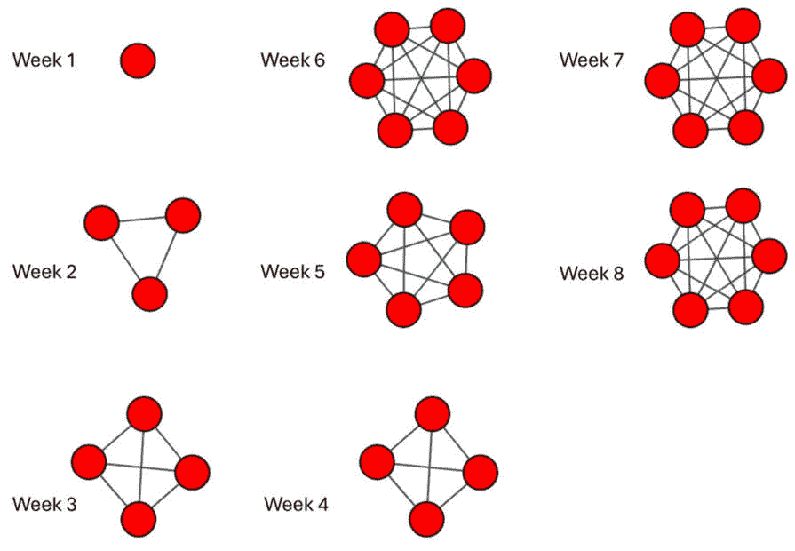
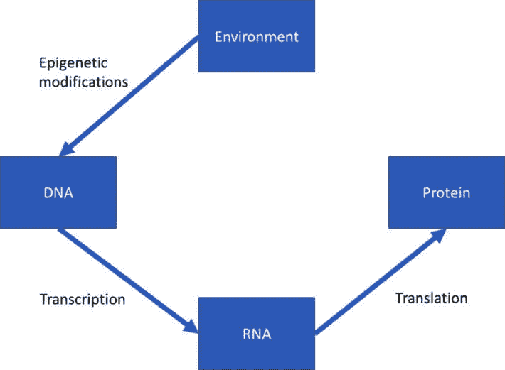
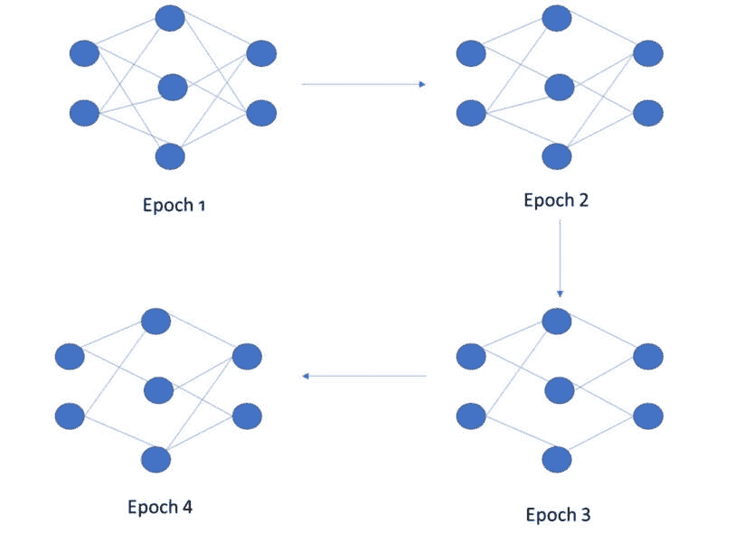
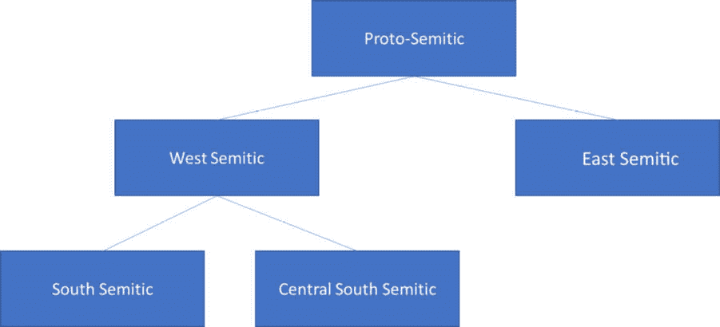
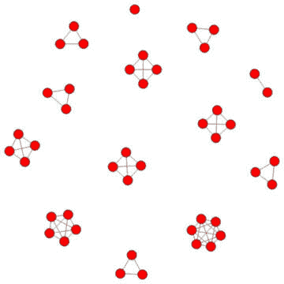
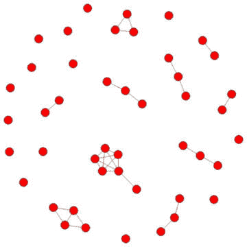
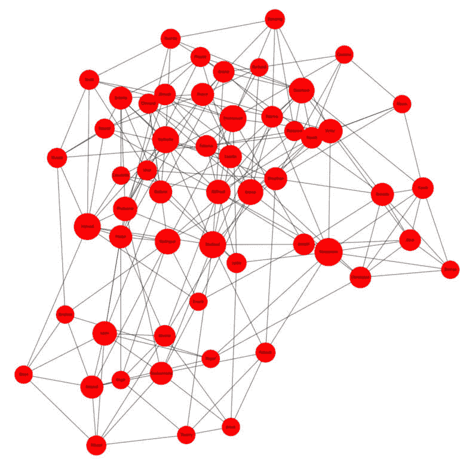

# 第三章：使用 NetworkX 和 igraph 将数据整理成网络

在本章中，我们将介绍在分析项目中常见的多种数据类型，包括 `NetworkX` 和 `igraph` 包。

在本章和接下来的章节中，我们将考虑许多现实世界的问题，以建立关于可以重新格式化和作为网络科学问题进行分析的数据的直觉。通常，基于网络的算法在计算成本上低于为时间序列分析或空间数据设计的算法。到本章结束时，你将能够识别许多适合网络分析的问题类型，并且你将准备好深入到后续章节中的问题。

具体来说，本章将涵盖以下主题：

+   不同数据源的介绍

+   使用 igraph 将数据整理成网络

+   使用 NetworkX 的社交网络示例

# 技术要求

要运行本章中的实际示例，你需要熟悉 Python 编程，并且必须安装 `igraph` 和 `NetworkX` Python 包。

本章的代码可在以下链接找到：[`github.com/PacktPublishing/Modern-Graph-Theory-Algorithms-with-Python`](https://github.com/PacktPublishing/Modern-Graph-Theory-Algorithms-with-Python)

# 不同数据源的介绍

在实践中，我们很少从头创建网络或遇到自然以网络形式出现的数据源。我们通常必须从不同的数据源创建网络，包括调查或传感器数据、地理数据、时间序列数据、人口数据，甚至机器学习模型的输出数据。在本节中，我们将在深入研究 igraph 和 NetworkX 的数据整理两个实际示例之前，概述一些常见的数据源。让我们深入了解我们的第一个数据源，社交互动数据。

## 社交互动数据

网络科学的大部分起源于社交网络，它捕捉了个人之间的关系或互动。营销活动通常会招募那些在感兴趣的人口群体中与其他人有很多联系的个人，以及那些他们的联系人也同样在人口群体中有许多联系的人。例如，一个玩具制造商可能会在圣诞节季节推出一款新玩具，可能是一款*蒸汽朋克坚果夹子芭蕾鼠王玩偶*（如图 2**.1** 所示），他们希望通过市场研究来确定哪个年龄和性别群体最有可能看到《胡桃夹子》芭蕾舞剧：


图 2.1 – 在圣诞节期间首次亮相的新鼠王玩偶的营销广告

玩具制造商可能会寻找社交媒体影响者（在 YouTube 上有许多订阅者或在 TikTok 上有许多追随者的人），他们的观众网络主要包括 5 至 11 岁的女孩，她们正在欧洲观看影响者的内容。有时，这些数据可以通过抓取影响者的内容轻松获得。在其他时候，需要收集这些数据的一部分并首先进行分析，通过内容策划和相关内容指标的抓取，来缩小目标受众群体中的影响者。

社交网络构建的另一个常见数据来源是**调查数据**，其中个人对社交群体中的朋友关系或互动模式进行排名。例如，学生可能会指出他们一起学习、社交或上课的其他学生。在许多场合互动的学生之间有更强的社交互动，而在某些场合很少互动或只在特定场合互动的学生之间有较弱的社交互动。加权社交网络不仅可以可视化存在的互动，还可以可视化它们的强度。在社会科学环境中，较强的联系在信息传播或产品或行为的采用中通常扮演着重要角色。例如，当一个青少年开始吸烟或饮酒时，与该个体有强烈联系的人开始这些行为的风险更高。在高度连接的青少年群体中，当一个人采取风险行为时，该行为在群体中传播的风险很高。

弱社交关系可能和强社交关系一样重要（甚至更重要！），在社会学领域，这些关系构成了个人社会资本的基础。社会资本衡量的是个人在需要时可以从与之联系或与个人联系的人那里获取的资源。在求职的背景下，求职者最强和最持久的联系可能不是找到新工作所需要的。然而，朋友的朋友和熟人可能形成一个更大的社交网络，这些联系可能为求职者提供新的就业机会。朋友的朋友和偶然熟人的更大网络通常提供了更多通过口头传播或社交媒体上的职位广告找到下一份工作的机会。

我们将在本章的*使用 igraph 将数据整理成网络*部分回到基于调查的社交网络数据，在那里我们将根据社会背景中的推荐互动构建一个学生网络。

## 空间数据

网络数据的另一个常见来源是从地理信息系统收集的数据或按地理组织的数据。**空间数据分析**是数据科学的一个分支，它分析基于地理的数据；然而，当数据覆盖较大的地理区域或涉及复杂的统计计算时，用网络科学的术语来表述数据和问题可能更容易。网络算法通常比空间数据算法更快，并且很容易在图数据库（如 Neo4j）中存储大型网络。

考虑 COVID-19 通过旅行网络在全球范围内的传播。这场大流行起源于中国，但很快通过感染但病情并不严重的个体在飞机、火车和其他交通工具（如北京到巴黎的航班，如图 *图 2**.2* 所示）上的旅行迅速传播到亚洲的其他部分以及世界的其他地方。航空旅行还允许在疫情期间将新的变异株从一个大陆传播到另一个大陆。幸运的是，COVID-19 的死亡率较低，大多数感染者并未出现严重疾病。然而，一种与 COVID-19 类似但死亡率高且从感染到症状出现有较长的潜伏期的极高度传染性疾病（如更易传染的埃博拉病毒）通过相同的旅行网络传播，在被发现之前将造成非常严重的全球卫生危机。正如我们在后面的章节中将会看到的，具有空间和社会成分的流行病威胁可以通过网络科学进行建模和模拟。


图 2.2 – COVID-19 初期从北京到巴黎的航班

与健康相关的网络并不是数据科学中唯一有用的空间数据来源。空间数据的一个常见来源是零售数据，其中商店存在于不同的位置，可能携带不同的产品，以不同的速度销售产品，并调整价格以符合地区规范。顾客的人口统计特征也可能在不同地点有显著差异，并产生非常不同的购买模式。例如，考虑大学附近的商店与郊区商店的顾客购买行为。大学附近的商店可能有更多夜间购买，销售大量零食，并且相对于郊区的商店，很少需要库存尿布。分析顾客的购买行为、商品定价或产品库存频率，可以为客户提供宝贵的战略洞察，这些客户和他们的母公司对优化库存、价格和促销时间感兴趣。我们将在本章后面将有关当地市场小米价格的数据整理成网络。

## 时间数据

网络很少是静态的。随着时间的推移，随着联系的形成和断裂，社交网络会发生变化。销售模式会随着新产品的添加而改变，对特定商品的需求会随着季节的变化而变化，或者经济的变化会促使消费者行为的变化。随着政治和商业气候的变化，股市交易量和行业/地区相关性也会随时间变化。

所有这些变化都涉及数据中的时间成分。有几种方法可以模拟网络中的时间趋势，我们将从两个用例开始，并在本书的*第三部分*中构建更多用途。

首先，让我们回到我们之前提到的例子，一个求职者利用他的社交网络来寻找新工作。当这个人开始找工作时，他们可能会在 LinkedIn 上添加建议的专业联系人，参加当地的社交活动，或者与一些正在招聘的招聘人员建立联系；所有这些行为都会增加他们的社交网络中的联系（并增加找到新工作的可能性）。*图 2.3*展示了女性在社交活动中相遇，建立新的专业联系，以便在求职过程中利用：



图 2.3 – 8 周内不断变化的社会网络

我们可以将时间上的变化表示为一系列网络，每个网络代表我们在特定时间捕捉到的求职者的社交网络。我们可能每天、每周甚至每月收集我们感兴趣分析期间的数据。假设我们每周收集两个月的数据。这将给我们大约八个社交网络，我们可以分析和总结这些网络，以跟踪网络大小和连接密度随时间的变化。也许我们还有与求职者获得的面试相关的数据，我们可以将这些数据与他们的社交网络变化一起检查，以了解社交网络的增长是如何帮助求职者获得新工作的。

为了研究社会联系和特定活动如何增加获得面试和工作的可能性，我们可以招募几百名求职者，每周收集关于面试/工作机会以及他们当前社交网络的信息，持续八周，并建立一个回归模型，根据前一周的社交网络指标来预测面试或工作机会。在更复杂的分析中，我们可以使用包含时间序列成分的回归模型来考虑时间效应，以及社交网络指标和求职者的初始数据（如人口统计数据、职业信息、教育背景等）。我们将在本书的*第十三章*中考虑这种类型的模型。第十三章。

空间数据也可以包括时间成分，例如在两国之间增加新的航班，或者商店的管理结构随时间变化，从而在零售连锁店内的商店之间创建不同的连接。我们已经看到我们如何将空间数据整理成网络。对于**时空数据**，我们可以在我们采样数据的某个时刻构建网络（如我们的工作网络示例），或者我们可以将我们的数据分成时间段，为每个时间段创建网络，然后在我们的分析中考虑完整的网络系列。在零售店例子中，我们可能会有实时购买行为，将其解析成每周趋势网络，其中商店根据销售相似性连接，基于整个库存的商店对的销售。我们可能对分析 12 月份的购买趋势变化感兴趣，当人们庆祝新年、圣诞节、光明节、库萨和年底的商业交易时。我们将在*使用* *igraph* *将数据整理成网络*的例子中考虑这一点。

## 生物网络

网络科学在现代基因组学研究中的作用突出。环境因素，如压力或饮食习惯，可以通过使一组基因的转录更有可能或不太可能来修改细胞或组织中表达的基因，导致通过将遗传密码翻译成**核糖核酸**（**RNA**）然后到蛋白质产生更高或更低的蛋白质水平（*图 2**.4*）：



图 2.4 – 一个展示基因表达、转录和翻译成蛋白质的过程的图表

让我们考虑一个具体的例子。眼镜蛇是有毒的蛇，它们的 DNA 编码与毒液生产相关的基因。这些基因的转录发生在产生并储存毒液的毒腺中，直到蛇攻击目标。这些基因的编码被转录成 RNA，然后翻译成蛋白质。

一起转录的基因集被称为**共表达**；**共表达网络**有助于理解遗传因素与疾病或身体特征之间的关系。在我们的蛇毒例子中，编码毒液的基因会在毒腺中共同表达，因为所有的毒液都是在蛇身体的那一部分产生的。环境因素可以通过修改 DNA 结构来间接影响基因的表达模式，以上调或下调转录。例如，当我们的蛇为了自卫而咬人时，它可能会通过咬伤将毒腺中的毒液完全排空。这将导致与毒液基因相关的 DNA 被上调，从而允许产生更多的毒液来补充蛇的供应，以便它可以进食和自卫。

**表观遗传学**领域研究这些基因-环境相互作用，尤其是在癌症或心理健康障碍等复杂疾病的发展中。通常，通过使用某种微阵列芯片测量感兴趣基因上的蛋白质结合来衡量组织内或组织间的基因表达。许多人类疾病涉及的环境和基因的相互作用比蛇毒腺中毒素水平调节更为复杂；其中一些疾病涉及身体许多部位。

例如，有些人基于他们的遗传风险因素聚集，面临更高的酒精使用障碍风险；当有酒精使用障碍风险的人开始饮酒时，酒精会穿过血脑屏障，并在基因表达上产生表观遗传变化，包括将个人置于疾病风险中的基因表达变化。微阵列通过实验测量基因表达水平。对有酒精使用障碍和无酒精使用障碍的人的基因共表达进行微阵列研究，可以深入了解遗传风险和由于酒精消费而发生的表观遗传差异。网络提供了一种方便的方法来总结表达相似性关系，并且可以挖掘与执行相似任务（如产生与血清素或多巴胺结合的突触结合位点）的相关基因模块的子网络。

在遗传研究中，一个相关的现象是通过表观遗传途径调节基因表达。正如我们讨论的，外部环境因素可以影响基因表达；通常，由基因转录和翻译产生的蛋白质调节其自身的转录，根据现有蛋白质的水平提高或降低表达。例如，与额叶皮层中的血清素受体相关的基因调节中断被认为是大抑郁症的基础，而细胞生长基因下调的中断被认为导致了许多常见的癌症途径，导致无控制的生长和有丝分裂（肿瘤）。

定向网络提供了一种总结基因调节途径的理想方式。不同的生物学和环境机制上调或下调感兴趣的基因。基因可能在研究机制（蛋白质表达、环境中的外部暴露等）中聚集成相似的调节模式。这为特定感兴趣的病理学或环境因素（如压力）的影响提供了见解。

基因组学研究有时会利用网络科学将基因本体（总结单个基因或基因模块的层次关系的网络）映射到疾病本体（总结疾病类别的网络）。我们将在*第十一章*中深入探讨本体研究，但在此我们先回顾一些基础知识。本体之间的映射使得研究人员可以根据已知基因与类似疾病之间的联系，基于已知基因与疾病之间的联系来提出关于未知遗传与疾病之间联系的假设。回到物质滥用障碍，许多遗传风险因素是已知的，并且在各种成瘾中共享；新出现的行为成瘾，如游戏成瘾，很可能与其他成瘾障碍共享至少一些这些遗传因素。基因与疾病之间的本体映射为研究这些新障碍提供了一个起点。

**基因组学**是许多类型的数据之一，在这些数据中，网络解决方案并不是解决数据问题的明显工具集。让我们看看一些其他例子，在这些例子中，网络科学提供了其他分析工具无法提供的见解。

## 其他类型的数据

存在许多其他数据来源，并且大多数都可以被整理成网络形式。让我们回到我们对**深度学习**的讨论。在深度学习的训练过程中，神经网络每一层的节点根据每次训练迭代的拟合度量与其他层的节点建立和断开连接。让我们考虑一个包含四个训练周期的非常小的前馈神经网络，该网络具有两个节点的输入层、三个节点的隐藏层和两个节点的输出层，最初是一个全连接网络，经过两个周期的剪枝，然后在隐藏层和输出层之间恢复一个剪枝的连接，如图 *图 2*.5 所示：



图 2.5 – 简单深度学习模型在训练周期中的演变

在 *图 2*.5 中，我们可以看到每个训练周期在深度学习模型中都有不同的网络结构。通常，我们会为每个周期计算拟合统计量，也许我们感兴趣的是深度学习网络结构的属性如何影响训练和测试集在各个周期中的训练精度。虽然这个模型相当简单，但在实践中，深度学习模型可能有多个层，顶点（在深度学习术语中称为节点）之间的有向边，以及许多个训练周期。这为训练过程中与模型精度相关的一系列网络和网络度量提供了丰富的数据，这可能有助于调整模型或更改初始参数（例如，在微调预训练的转换器模型时调整剪枝参数）。

在**计算机视觉**和**大型语言建模**中，微调预训练模型是一种常见的方法。可能需要添加新的训练数据以覆盖特定领域的用例，并且需要调整模型参数以将新的训练数据纳入完整模型。例如，托管在 HuggingFace 上的大型语言模型可能非常适合嵌入用于聚类分析的多数科学论文，但当等离子体物理论文包含在科学论文样本中时，可能需要微调才能良好工作。理解原始大型语言模型的网络结构和其训练演化可以帮助研究人员在微调过程中设置最佳参数。

另一个可以将数据整理成网络形式以进行研究的数据示例是**语言学数据**。今天存在的许多语言都是从更古老的语言演变而来的。例如，今天存在的闪米特语言，包括希伯来语和阿拉伯语，起源于原始闪米特语，随着原始闪米特语使用者在中东地区迁移和定居，分化成了不同的地区分支。一种语言，东闪米特语（阿卡德语）没有进一步分化成其他语言；另一种语言，西闪米特语，分化成了南闪米特语和南中闪米特语（随着时间的推移进一步分化成新的语言）。*图 2.6*展示了原始闪米特语向新的语言群体演化的初始过程：



图 2.6 – 从原始闪米特语到早期语言演化的示意图

网络科学可以帮助我们通过分析语言家族层次结构，比较从原始语言到现代语言的演变。比较语言演化的结构可以阐明古代迁移和贸易模式，这些模式可能难以从古代记录或考古遗址中辨别出来。此外，这种比较使我们能够根据语言家族的过去行为、在其他语言家族中观察到的类似演化模式、语言使用模式的社会语言学数据以及当前克里奥尔语或方言的使用范围，预测未来的语言分化。我们将在*第十一章*中回到语言学的应用，我们将考虑非洲使用的语言及其随时间的演变。

现在，让我们将注意力转向从原始数据文件中创建网络，这是 igraph 和 NetworkX 的功能。这将使我们能够创建网络，以便在接下来的章节中介绍的工具中进行分析。首先，我们将考虑一个涉及时空数据的示例：布基纳法索省级市场的季度小米价格。

# 使用 igraph 将数据整理成网络

理解商品定价的趋势在许多应用中至关重要。例如，一家加油站连锁店可能希望了解其各个地点之间的定价差异。通常，当地法律要求彼此相距一定距离的加油站定价在彼此的一定范围内，从而在连锁店和连锁店内部形成定价的本地分布。了解这一点可以帮助在各个地区的限制条件下优化价格，或者将数据回溯到区域销售数据，以查看价格分布如何影响销售。

消费者还可以从不同地理区域的商品定价分析中受益。以发展中国家的地方食品市场为例。价格通常不会在一个国家或地区内固定。它们由商品的供应、需求和销售商的成本决定。谷物可能需要从其他国家进口，其价格会随着经济和气候条件的变化而波动。水果的价格可能会随着季节和当地生长条件的变化而变化。当当地地区的染料变得稀缺时，服装的价格可能会上涨。例如，考虑一家连锁超市，如*图 2.7*所示，它有供应商合同和母公司的财务支持。它可能会经历商品可用性或价格的波动，但很可能会以价格波动不大的相同商品出售：


图 2.7 – 一家连锁超市的插图，是该更大连锁店的一部分

与此相比，一个由不同供应商组成的本地市场，这些供应商可能或可能不在某一天的市场上，他们的商品可用性和价格可能在市场销售的那天波动。较大的市场，如*图 2.8*所示，有更多经验丰富的供应商和高峰时段，可能比整天沿街排列的更非正式的市场显示出更少的波动。


图 2.8 – 布基纳法索一家大型、正式市场的插图，其中供应商和他们的商品每天都有一些共同之处

当考虑地理因素时，我们通常不仅想要考虑感兴趣的变量，还要考虑这些位置相对于彼此的接近程度。邻近地区的价格、销售和商品可用性可能反映了数据集中未观察到的本地条件，例如当地天气、当地政治环境和竞争性本地商家的数量。我们将在第三章、第四章和第五章中进一步讨论这个话题，但到目前为止，了解我们可以根据它们相对距离为不同位置分配权重就足够了。

在处理空间数据时，还需要考虑的一个因素是选择的度量标准。存在许多空间统计度量，那些熟悉空间数据分析的读者可能希望使用比本文中考虑的更复杂的度量。**局部莫兰统计量**是空间数据分析中的一个常用指标，它以成对的方式汇总空间区域之间的权重和一个定义在数据上的函数；在这里，我们使用我们定义的权重矩阵和相关函数构建统计量，这些函数应该对读者来说作为数据点相似性的总结统计量是熟悉的。

让我们深入研究我们的示例数据集，该数据集来自世界粮食计划价格数据库中的人道数据交换的布基纳法索 – 食品价格数据集（[`data.humdata.org/dataset/wfp-food-prices-for-burkina-faso`](https://data.humdata.org/dataset/wfp-food-prices-for-burkina-faso); 访问日期：2022 年 7 月 15 日）。在这个数据集中，我们预先选择了 45 个布基纳法索省份市场的黍米价格，并按季度汇总数据，从 2015 年第二季度开始，到 2022 年第二季度结束。这个时期涵盖了 COVID-19 大流行和乌克兰战争的开始，这两者都影响了供应链。鉴于邻近省份的市场可能受到相同的地方因素和供应链的影响，我们创建了一个由 1 和 0 组成的空间权重矩阵，分别代表相邻省份和非相邻省份。

要运行所有代码，可能需要安装其他包，这些包是`igraph`或`NetworkX`的依赖项，例如用于可视化的`pycairo`。如果你在使用云平台，每台机器可能功能不同，或者已经安装了其他包；如果你遇到任何困难，请咨询 igraph 或 NetworkX 帮助指南中关于在您的操作系统上运行这些包的建议。

让我们首先通过`Script 2.1`导入构建我们网络所需的包：

```py
#import packages
import igraph as ig
from igraph import Graph
import numpy as np
import pandas as pd
import os
```

当导入数据时，你需要在下载数据集后指定自己的文件路径。我们通过向`Script 2.1`中添加来从本地机器导入定价数据和权重矩阵：

```py
#import Burkina Faso market millet prices from the csv file
File="C:/users/njfar/OneDrive/Desktop/BF_Millet.csv"
pwd=os.getcwd()
os.chdir(os.path.dirname(File))
mydata = pd.read_csv(os.path.basename(File),encoding='latin1')
#import weight matrix of Burkina Faso markets
File="C:/users/njfar/OneDrive/Desktop/weights_bk.csv"
pwd=os.getcwd()
os.chdir(os.path.dirname(File))
weights = pd.read_csv(os.path.basename(File),encoding='latin1')
```

现在我们已经导入了数据，我们可以通过计算市场间的相关系数（忽略时间指示列）并将结果乘以权重矩阵来构建我们的局部莫兰统计量：

```py
#define the metric between markets and construct the local Moran #statistic
#here, correlation coefficient
data=mydata.iloc[:,1:46]
weights_total=weights.iloc[:,1:46]
cor=np.corrcoef(data.transpose())
cor[cor>0]=1
cor_weighted=np.multiply(cor,weights_total)
```

现在我们已经构建了局部莫兰统计量作为`cor_weighted`，我们可以使用 igraph 将我们的数据转换成一个网络。我们的图没有关系方向性，因此我们可以将模式设置为`undirected`。然而，因为我们的相关性包括单个市场内的自相关，我们需要从我们的网络中移除循环。我们将通过定义可能的自循环并将其从边列表中删除来实现这一点：

```py
# create market graph and get rid of loops created from the correlation
bf_market_w=Graph.Adjacency(cor_weighted,mode="undirected")
edge_list=bf_market_w.get_edgelist()
self_loop=[]
for i in range(0,46):
    self=(i,i)
    self_loop.append(self)
to_remove=[]
for i in edge_list:
    for j in self_loop:
        if i==j:
            to_remove.append(i)
bf_market_w.delete_edges(to_remove)
```

现在，我们可以通过绘制我们的结果来可视化我们的网络，以查看哪些市场被隔离：

```py
#create plot
ig.plot(bf_market_w)
```

这应该会显示一个图表，展示一个孤立的市场和几个区域连接的市场：



图 2.9 – 布基纳法索市场通过局部莫兰统计连接的图表

*图 2.9* 显示许多市场形成了区域集群，其中相邻省份的价格相关。有一个市场是孤立的。大多数市场连接成三或四个市场的群体。一个地区包含六个区域连接且与定价趋势相连的市场。很可能，这个网络可视化的是区域连接性，而不是价格相关性和区域的混合。我们可以通过在计算局部莫兰统计之前应用阈值来可视化高度相关的区域。

让我们将相关阈值设置为 `0.9`（价格高度相关）通过修改 `脚本 2.1` 以包括局部莫兰统计计算中的阈值：

```py
#define the metric between markets and construct 
#the local Moran statistic here, correlation coefficient
data=mydata.iloc[:,1:46]
weights_total=weights.iloc[:,1:46]
cor=np.corrcoef(data.transpose())
cor[cor>=0.9]=1
cor[cor<0.9]=0
cor_weighted=np.multiply(cor,weights_total)
# create market graph and get rid of loops created from the #correlation
bf_market_w=Graph.Adjacency(cor_weighted,mode="undirected")
edge_list=bf_market_w.get_edgelist()
self_loop=[]
for i in range(0,46):
    self=(i,i)
    self_loop.append(self)
to_remove=[]
for i in edge_list:
    for j in self_loop:
        if i==j:
            to_remove.append(i)
bf_market_w.delete_edges(to_remove)
#create plot
ig.plot(bf_market_w)
```

这应该会产生更多孤立的市场，这些市场在我们的时间范围内相关性不高：



图 2.10 – 布基纳法索市场通过局部莫兰统计在选定的阈值 0.9 下的连接图表

*图 2.10* 显示了一个更稀疏的网络，其中许多市场是孤立的。一些原本区域连接的市场仍然显示出市场间的连接；然而，许多市场不再相互连接。有趣的是，我们的六个区域市场群在阈值化后仍然保持着大部分连接。实际上，该区域只有一个市场在连接性方面与我们的非阈值版本有所不同。

虽然这个示例考虑了整个时间跨度的相关性，但可以将时空数据切割成重叠的时间切片，创建时间感知的指标，如局部莫兰统计（带或不带阈值），并通过绘制一系列由这些时间切片及其网络定义指标创建的网络来可视化这些指标随时间的变化。我们将在 *第七章* 中进一步探讨这个概念，届时我们将布基纳法索的小米数据集切割成时间切片，以分析随时间和空间变化的图指标。

现在我们知道了如何将数据整理成 igraph 网络，让我们通过另一个示例来看看 NetworkX 是如何做到这一点的。

# 使用 NetworkX 的社交网络示例

在这里，我们将考虑从 2022 年在喀麦隆的一个班级收集的**非洲数学科学研究所**（**AIMS**）学生的社交网络。这个项目中的学生住在同一栋楼里，在课堂上互动，一起吃饭，一起学习。然而，来自同一国家、来自同一本科大学和说同一种语言的学生往往比来自不同背景的学生互动更频繁。如图 *图 2.11* 所示的这种互动要么是作为背景的有机功能，要么是通过共享项目和住宿安排的人工方式发生的：


图 2.11 – 描绘课堂环境的插图，其中学生在项目内共享课程

为了理解我们学生群体中的这些互动，我们进行了一项关于在各种环境中与其他学生互动的调查问卷。数据收集于 2022 年 11 月至 12 月之间。以下是一些示例问题：

+   你午餐或晚餐时喜欢和谁坐在一起？

+   当你在某个科目或课程中遇到困难时，你喜欢向谁提问？

从这些问题中，我们可以检查学生对他们网络的看法，以了解他们同意的程度。在查看数据后，我们发现大多数互动都是相互的。如果 *学生 A* 批准了与 *学生 B* 的亲近程度调查项，那么 *学生 B* 很可能也会批准这些项。因此，这些数据形成了一个相互互动的无向网络。

我们将使用的数据集包括几个字段。在第一列中，我们有被调查学生的姓名。在接下来的四列中，我们有包括原籍国、年龄、研究领域和本科背景的人口统计因素（我们将在后面的章节中返回），在剩余的五列中，我们有五个学生最强烈推荐的朋友。

让我们首先导入我们将需要的包，以便使用 `Script 2.2` 将此数据集整理成网络：

```py
#import needed packages
import pandas as pd
import networkx as nx
import matplotlib.pyplot as plt
import numpy as np
import math
```

现在，让我们导入数据集：

```py
#reading the dataset
fichier = pd.read_csv("C:/users/njfar/OneDrive/Desktop/AIMS_data.csv")
data = pd.DataFrame(fichier)
```

要将此数据转换为使用 NetworkX 的社交网络，我们需要通过循环填充我们的网络，包括顶点和边。我们首先添加包含学生姓名和人口统计特征的顶点元数据。然后，我们将根据特定学生在调查中支持的五个最接近的关系添加边来连接顶点，具体操作如下 `Script 2.2`：

```py
#intializing the social network
aimsNetwork = nx.Graph()
#populating the network with nodes and edges
for i in range(len(data["Name"])) :
    aimsNetwork.add_node(data["Name"][i],
        Age = data["Age"][i], country=data["Country"][i],
        Field=data["Field"][i],
        background=data["Background"][i])
    for j in range(len(data["Name"])) :
        aimsNetwork.add_edge(data["Name"][j],data["Friend 1"][j])
        aimsNetwork.add_edge(data["Name"][j],data["Friend 2"][j])
        aimsNetwork.add_edge(data["Name"][j],data["Friend 3"][j])
        aimsNetwork.add_edge(data["Name"][j],data["Friend 4"][j])
        aimsNetwork.add_edge(data["Name"][j],data["Friend 5"][j])
```

这为我们提供了 AIMS 学生及其在项目中的最亲近朋友的基本网络。让我们绘制这些数据来可视化 AIMS 学生的社交网络。因为我们想在图中显示学生的名字，所以我们首先计算每个顶点的度数，这是一个我们将在后面的章节中重新讨论的中心性度量。在这里，我们只需展示不同学生对网络的重要性，并允许顶点足够大，以便可视化学生的名字。我们可以通过向 `Script 2.2` 添加以下内容来实现这一点：

```py
#plot AIMS student social network
Degree=aimsNetwork.degree()
var = [500*k[1] for k in list(Degree)]
plt.figure(figsize=(20,20))
nx.draw_spring(aimsNetwork, font_size=10, node_size = var,
    with_labels=True, node_color="red")
plt.show()
```

此脚本应显示与 *图 2.12* 类似的图像，该图像绘制了 AIMS 学生之间的社交联系：



图 2.12 – AIMS 喀麦隆 2022 年学生社交互动网络图

*图 2.12* 展示了我们根据调查数据创建的 AIMS 学生网络。请注意，一些学生只有五个最亲近的朋友作为连接，而其他人则有更多亲近的朋友。这在社交网络中很典型，即使是基于调查数据创建的。有些人比其他人有更多的连接。有些人连接到网络的各个部分，将分离的社区联系起来。一些高度连接的个人连接到其他高度连接的个人，在更大的网络中形成密集的区域。这些特性在网络分析中起着重要作用，我们将在后面的章节中深入探讨它们的含义和计算。

# 摘要

在本章中，我们更深入地探讨了网络的应用案例，将空间市场数据集整理成基于区域连通性和高粱价格相关性的网络，并在 NetworkX 中构建了一个基于调查的社交网络。现在，我们已经拥有了从真实数据源构建网络所需的基本工具，在下一章中，我们可以将注意力转向网络科学的实际应用，在那里我们不仅构建网络，还分析它以获得解决当今科学中重要问题的见解。

# 参考文献

Berger, S. L., Kouzarides, T., Shiekhattar, R., & Shilatifard, A. (2009). 表观遗传学的操作定义. *基因与发育，* 23(7)，781-783.

Caballero, J. (2015). 银行危机和金融一体化：网络科学视角的见解. 国际金融市场、机构和货币杂志，34，127-146.

Christakis, N. A., & Fowler, J. H. (2013). 社会传染理论：动态社交网络和人类行为的考察. 统计医学，32(4)，556-577.

Dubos, R. (2017). 社会资本：理论与研究. 路透社.

Ducruet, C., & Beauguitte, L. (2014). 空间科学和网络科学：复杂关系的回顾和结果. 网络与空间经济学，14(3-4)，297-316.

Kiss, I. Z., Miller, J. C., & Simon, P. L. (2017). 网络流行病的数学. 沙夫豪森：斯普林格，598，31.

Krishnan, H. R., Sakharkar, A. J., Teppen, T. L., Berkel, T. D., & Pandey, S. C. (2014). 酒精成瘾的表观遗传景观. 国际神经生物学评论, 115, 75-116.

Moyano, L. G. (2017). 学习网络表示. 欧洲物理期刊特别专题, 226(3), 499-518.

Sharma, S., Kelly, T. K., & Jones, P. A. (2010). 癌症中的表观遗传学. 癌变, 31(1), 27-36.

Sorrells, T. R., & Johnson, A. D. (2015). 理解转录网络. 细胞, 161(4), 714-723.
