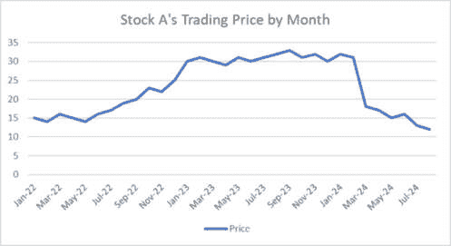
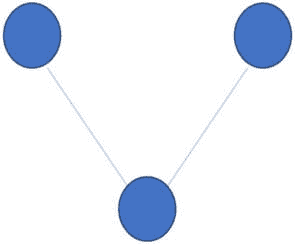
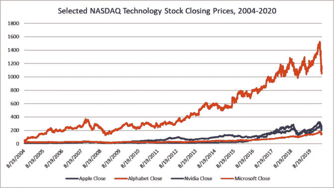
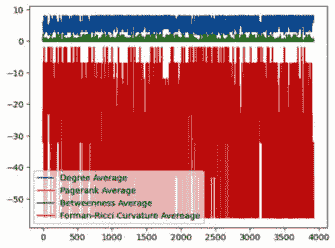
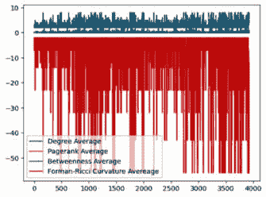
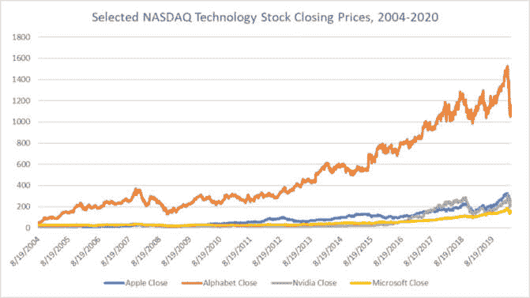
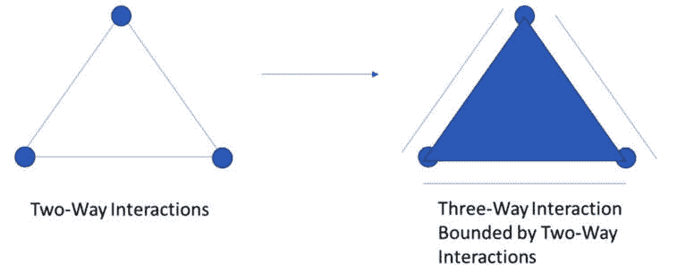
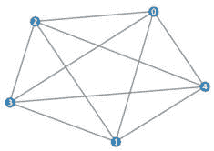

# 第七章：股票市场数据

在本章中，我们将介绍**时间数据**并深入探讨股票市场趋势分析。为了理解时间序列数据中的趋势，我们将回到网络上的**中心性度量**并介绍一些更高级的算法。最后，我们将使用我们的中心性度量分析随时间变化的股票定价数据，并确定不同股票在时间和空间上的行为变化，以预测价格波动和崩溃。

到本章结束时，您将能够将具有时间成分的数据集整理成一系列网络，并使用中心性指标分析随时间的变化。许多中心性指标在大规模网络中表现良好，尤其是在并行运行时。

具体来说，我们将涵盖以下主题：

+   时间数据简介

+   中心性指标简介

+   在时间切片中应用中心性指标

+   将网络指标扩展到时间序列分析

让我们从回到时间数据集和非基于网络的模型分析的限制开始。

# 技术要求

您需要 Jupyter Notebook 来运行本章中的实践示例。

本章的代码在此处可用：[`github.com/PacktPublishing/Modern-Graph-Theory-Algorithms-with-Python`](https://github.com/PacktPublishing/Modern-Graph-Theory-Algorithms-with-Python)

# 时间数据简介

在*第二章*中，我们简要介绍了时间数据或以时间序列或一组时间序列形式的数据。**时间序列数据**跟踪许多不同行业的重要指标：每日商店销售量、每周软件产品营销线索量、每日新兴疾病的发病率、人口中每年（如吸烟或蔬菜消费）的行为率，或每小时跟踪市场趋势的股票价格。许多相关因素可以影响随时间的变化趋势，并且如果事先知道这些因素，一些模型会直接考虑这些因素。

然而，考虑一个位于城市中宝石店销售趋势的新宝石店的情况，该城市中宝石店是一种新现象，可能在哈法和特拉维夫之间某个乡村地区（*图 6**.1*）。因此，关于可能影响销售的因素知之甚少。在挖掘可能影响销售的因素时，理解时间序列数据中存在的趋势至关重要。然而，时间序列数据集对许多监督学习方法，如**随机森林模型**或**线性回归**，提出了重大挑战。在某个时间点，销售不是独立的；它们依赖于影响前几日销售的因素，限制了监督学习和许多类型的**无监督学习**的使用。预测因子的缺乏也提出了挑战。


Figure 6.1 – 以色列特拉维夫和海法之间半路的一家宝石店的插图

幸运的是，对于我们的宝石店来说，许多算法被设计来处理时间序列数据，例如**自回归积分移动平均模型**（**ARIMA 模型**）、**奇异谱分析**（**SSA**）和**霍尔特-温特斯模型**。然而，时间序列行为的变化（峰值、崩盘和方差变化）对这些模型构成了挑战。捕捉和预测这些变化对于你想要创建预测模型或挖掘影响时间序列值因素至关重要。在我们的宝石店示例中，旅游的季节性、该地区的冲突以及假日旅行促销活动可能会影响我们店铺所在路线的流量。

一个拥有丰富且非常复杂的时间序列数据的行业是金融。许多社会和经济因素影响股票价格，而梳理股票价格波动中的关系和随机性是金融行业的基础。让我们来看看股市定价数据以及分析股市定价数据的常见任务。

## 股市应用

近年来，金融部门已从以专家驱动的股市洞察模式转变为更基于机器学习的方法。机器学习模型筛选出新兴趋势，并捕捉到可能逃过人类仔细研究数据的人的微妙趋势。这种策略还允许分析师处理比人类能够处理的数据集大得多的数据集，包括许多不同的部门、国际证券交易所，甚至个别前沿市场。通过收集更多洞察力，投资者和投资管理公司可以在不那么多专业知识的情况下投资于更广泛的市场。

股市分析涵盖了广泛的应用领域。投资者可以在某些市场部门（如科技或农业）内进行投资，或者跨市场进行投资。他们可以关注短期收益（包括在几分钟或几小时内获得的收益）和长期收益（可能跨越数十年）。他们还可以关注外国市场，其中股票价格可能受到与影响本地市场价格的因素非常不同的因素。所有这些场景都指导着分析工作以及收集用于分析的数据的时间尺度。

通常，分析股市数据涉及评估随时间变化的各种趋势。股票的价格可能在一段时间内保持恒定，经历逐渐的价格增长和减少，突然崩盘，或者指数式增长。每种情况都为投资者在短期和长期内的购买/销售策略提供了不同的建议。*图 6.2* 展示了一个假设的股票，它表现出许多这些模式：



图 6.2 – 股票数据趋势示例，包括停滞期、增长、缩水和崩盘

我们可以在*图 6.2*中看到，股票 A 在 2022 年开始时价格稳定，然后在 2022 年 7 月左右进入增长阶段。这个增长阶段一直持续到 2023 年初，然后它再次进入一个稳定的定价阶段。在 2024 年 3 月发生事件后，股票 A 的价格崩溃，然后进入一个价格下降的时期，直到我们追踪的时间段结束。

通常，这些趋势不会孤立发生。共享供应链的公司股票可能会表现出类似的趋势。同一行业的股票可能会表现出相似或相反的趋势，这取决于公司之间的关系或行业新闻。在共享贸易或防御区域，由于国家及其市场之间的社会政治联系（如大多数经济体中的 COVID 崩溃），股票也可能会表现出类似的趋势。

**临界点**，趋势发生剧烈变化的地方，在金融分析中吸引了大量关注。这些代表了在加速增长之前投资的机会，或者在崩溃之前从市场或特定投资中撤出的警告。然而，检测这些趋势挑战了许多在市场分析中常用的工具。

幸运的是，一些新的工具，包括一些基于网络科学的工具，比传统方法更容易识别临界点。许多工具依赖于市场、行业或股票之间的大规模耦合。随着越来越多的股票（或市场）表现出类似的行为，系统就变得容易受到可能导致其崩溃的外部影响（如供应链问题、新立法或大流行病）的影响。仅仅计算个别股票或市场行业之间的相关性可以提供一些洞察力，但将相关性（在时间切片内）转换为网络，使我们能够利用许多深入探究其相关性及其随时间变化的网络科学工具。具体来说，中心性指标允许我们量化并分类网络中存在的关系。让我们探索一些这些中心性指标。

# 中心性指标简介

我们在*第三章*中遇到了一些中心性指标，其中我们学习了桥梁和枢纽。许多基于顶点的中心性指标计算与枢纽相关的属性——顶点与其最近邻及其最近邻的连接。许多基于边的中心性指标计算桥梁属性，其中顶点附近的边充当不同枢纽之间的连接器。

**度**是最简单的基于顶点的中心性度量，我们在*第五章*中遇到了它。**度中心性**简单地是直接连接到感兴趣顶点的顶点数量。许多基于拉普拉斯的度量或算法依赖于算法计算中的度矩阵。表面上，这个度量似乎捕捉了重要的枢纽属性；具有高度度中心性的顶点将在网络中拥有很大的影响力（因此，可能是一个很好的干预目标）。它也很好地扩展到非常大的网络。然而，度中心性的一个局限性是它没有意识到顶点在超出任何直接连接到邻居的位置；具有低度中心性的顶点可能连接到许多具有高度中心性的顶点，这使得它在网络行为和结构上的影响力比其度中心性所暗示的更大。

**特征向量中心性**及其变体（包括**PageRank**和**Katz 中心性**）通过考虑超出直接邻居的连通性，提供了一个更全面的基于顶点的中心性度量。因此，**特征向量中心性**会给我们的假设低度中心性顶点赋予高分数，因为这个顶点靠近非常连通的顶点。技术上，为了找到网络中每个顶点的特征向量中心性，我们可以在邻接矩阵上执行特征分解。由于邻接矩阵不包含负值，我们可以假设第一个特征值是最大的，其特征向量为我们顶点提供特征向量中心性分数。

PageRank 中心性通过用执行随机游走以确定邻接属性而构建的调整邻接矩阵替换邻接矩阵，从而扩展了特征向量中心性并增加了其灵活性。此外，随机游走者属性，其中随机游走可以以低概率穿越图中的未连接区域，创建了一个调整后的邻接矩阵，该矩阵是连通的。然后，在执行调整邻接矩阵上的特征分解之前，对调整后的邻接矩阵进行缩放，该分解用于计算特征向量中心性分数。因此，PageRank 中心性分数提供了灵活性。此外，使用调整邻接矩阵进行此计算通常更容易、更快，使得算法能够很好地扩展到包含数亿个顶点的网络。

**基于边的中心性度量**捕捉了对于传播过程和不同枢纽之间连通性重要的网络基础设施。**中介中心性**是最常见的基于边的中心性指标之一，它捕捉了包含给定顶点的最短路径的相对数量，这些最短路径存在于网络中的所有最短路径中。考虑一个有 10 条最短路径的网络，其中 8 条包含一个特定的顶点。如果没有这个顶点，许多最短路径将不存在，这在社交网络中的传播过程或交通网络中的路线效率方面会给网络带来很大不便。然而，中介中心性扩展性不佳，不应在没有某种操作并行化的情况下用于大型网络。

最近的一个基于边的中心性网络已被证明是寻找股市转折点的有效工具。**Forman-Ricci 曲率**是一个基于几何的工具，它考虑了与感兴趣边相邻的边。在无权网络中，Forman-Ricci 曲率通过从 2 中减去连接到感兴趣边的两个顶点的度中心性来计算。常数 2 代表通过感兴趣边连接的两个顶点之间的连接。连接到边的两个顶点的度中心性计算了与我们的感兴趣边相邻的边的数量（减去通过该边连接的顶点，从而获得我们的常数 2）。在*图 6-3*中，我们看到三个顶点：两个与中间顶点相关联的单条边的顶点（两个顶点的度中心性均为 1）和一个连接到两个外顶点的中间顶点（度中心性为 2）。因此，两条边都具有-1 的 Forman-Ricci 曲率，因为两个顶点度中心性的总和为 3（2 - 3 = -1）。



图 6.3 – 一个展示 Forman-Ricci 曲率的示例网络，其中中间顶点从第一个和第三个外顶点中拉取

要从这种边度量中获得顶点中心性度量，我们可以对每个顶点的边度量进行求和来评分顶点。在我们的例子*图 6.3*中，外顶点具有-1 的 Forman-Ricci 顶点中心性，因为它们只连接到一条边。然而，中间顶点连接到两条边，Forman-Ricci 曲率也为-1，因此它的 Forman-Ricci 顶点中心性为-2。因为这个中心性指标依赖于低成本的计算，所以它很好地扩展到大型网络，并且当中介中心性不可行时可以用作基于边的中心性评分的替代方案。

现在，让我们探索一些股市数据，看看网络科学如何帮助我们识别关键趋势。

# 在时间切片上应用中心性度量

纳斯达克股票市场是位于纽约市的一家美国证券交易所，包括苹果、Alphabet、英伟达和微软等上市公司。Kaggle 在公共许可下提供了纳斯达克股票价格的全历史记录([`www.kaggle.com/datasets/jacksoncrow/stock-market-dataset?resource=download`](https://www.kaggle.com/datasets/jacksoncrow/stock-market-dataset?resource=download))，这可以为我们提供这些四家科技公司在其所有上市公司至 2020 年 4 月 1 日之间的股票数据。我们已经为您整理了数据，以包括这些四支股票在 2004 年 8 月 19 日至 2020 年 4 月 1 日期间的数据。让我们看一下这些数据，看看可能存在哪些趋势（*图 6.4*）：



图 6.4 – 2004 年 8 月 19 日至 2020 年 4 月 1 日的纳斯达克精选股票收盘价

在*图 6.4*中，我们可以看到 Alphabet 的价格一直较高，但所有股票都表现出典型的趋势，即在这段长期交易期间的价格稳定、下跌、上涨以及上升或下降趋势。值得注意的是 2020 年的趋势，股票经历了 COVID-19 的暴跌。波动期包括 2008-2009 年和 2016-2020 年。

时间序列分析的一个重要方面是将时间序列数据**窗口化**成重叠的部分。虽然可以通过网格搜索来优化窗口化，但窗口化往往更多的是一种艺术而不是科学。窗口的选择会影响可以捕捉到的趋势的时间长度。在我们的股票市场数据中，窗口长度限制了我们可以搜索趋势的时期，从而限制了在最后一个窗口之后的预测市场行为的时间段。窗口过大可能会错过影响短期市场行为的重要趋势。窗口过小可能会限制预测到最近的未来。

我们将选择 5 个交易日的窗口，或者大约一周的股票数据。这使我们能够捕捉到与日内交易相关的趋势，股票基于波动性频繁交易。我们的网络指标应该对基于波动的快速盈利交易表现良好，因为它们捕捉到两只股票之间的相关性增加。

另一个对窗口化时间序列数据很重要的方面是重叠的选择。在我们的例子中，我们将选择最大重叠（4 天重叠）以最大化我们对每日趋势的敏感性。在其他应用中，可能需要更少的重叠来研究更长的时间趋势。请注意，我们的例子使用的是我们机器上的一个路径。您的文件路径将与我们不同。

让我们导入我们的包，并使用`Script 6.1`将数据加载到 Python 中，以开始我们的工作：

```py
#import packages
import igraph as ig
from igraph import Graph
import numpy as np
import pandas as pd
import os
import matplotlib as plt
#import stock data
File="C:/users/njfar/OneDrive/Desktop/AAPL_GOOGL_Stock_2004_2020.csv"
pwd=os.getcwd()
os.chdir(os.path.dirname(File))
mydata=pd.read_csv(os.path.basename(File),encoding='latin1')
```

现在我们已经导入了数据，我们可以添加一个循环，将我们的时间序列窗口设置为重叠 4 天的 5 天周期。这种窗口策略提供了找到趋势每日变化最佳机会。然后，我们将创建该时间切片内四只股票之间的相关性，将这些相关性阈值化以限制我们的分析到高相关性，从这些阈值创建一个无权网络，并在时间切片上分析 PageRank 集中度、度集中度、介数集中度和 Forman-Ricci 曲率集中度。我们还将保存每个无权网络以供将来检索，以及每个时间切片的网络度量及其平均值。让我们将这些部分添加到`Script 6.1`中：

```py
#script to create time slices, derive networks,
#and compute centrality metrics
stock_networks=[]
bet_t=[]
deg_t=[]
eig_t=[]
vcurv_t=[]
bet_ave=[]
deg_ave=[]
eig_ave=[]
vcurv_ave=[]
for Date in range(5,3932):
    #wrangle data into graph
    data=mydata.iloc[(Date-5):(Date),1:5]
    cor=np.corrcoef(data.transpose())
    cor[cor>=0.5]=1
    cor[cor<0.5]=0
    stock_data=Graph.Adjacency(cor)
    stock_networks.append(stock_data)
    #derive some centrality metrics
    d=Graph.degree(stock_data)
    deg_t.append(d)
    deg_ave.append(np.mean(d))
    b=Graph.betweenness(stock_data)
    bet_t.append(b)
    bet_ave.append(np.mean(b))
    e=Graph.pagerank(stock_data)
    eig_t.append(e)
    eig_ave.append(np.mean(e))
    #create Forman–Ricci curvature calculations
    ecurvw=[]
    for edge in stock_data.es:
        s=edge.source
        t=edge.target
        ecurvw.append(2-d[s]-d[t])
    vcurvw=[]
    for vertex in stock_data.vs:
        inc=Graph.incident(stock_data,vertex)
        inc_curv=[]
        for i in inc:
            inc_curv.append(ecurvw[i])
        vcurvw.append(sum(inc_curv))
    vcurv_t.append(vcurvw)
    vcurv_ave.append(np.mean(vcurvw))
```

这个脚本应该在你的机器上快速运行。如果你在分析中包含大量股票，你可能希望并行运行脚本以节省时间，或者排除介数集中度，因为随着顶点数量的增加，介数集中度扩展得不好。

现在我们已经计算了我们的指标，让我们检查我们的时间序列窗口集中度指标之间的相关性，以了解不同的指标是如何相互关联的。鉴于 Forman-Ricci 曲率依赖于度集中度指标，我们预计会看到一个强的相关性。我们可以在`Script 6.1`中添加以获得这些相关性：

```py
#examine correlations among metrics across the time series
print(np.corrcoef(deg_ave,eig_ave))
print(np.corrcoef(deg_ave,bet_ave))
print(np.corrcoef(deg_ave,vcurv_ave))
print(np.corrcoef(eig_ave,bet_ave))
print(np.corrcoef(eig_ave,vcurv_ave))
print(np.corrcoef(bet_ave,vcurv_ave))
```

你应该会看到度集中度和 Forman-Ricci 曲率集中度之间存在强烈的关联（在我们的分析中为-0.99），但其他集中度指标之间的相关性相对较弱（度集中度和 PageRank 集中度为-0.05，度集中度和介数集中度为 0.01，PageRank 集中度和介数集中度为 0.04，PageRank 集中度和 Forman-Ricci 曲率集中度为 0.04，介数集中度和 Forman-Ricci 曲率集中度为 0.05）。这表明在分析中，度集中度和 Forman-Ricci 曲率可能是可互换的，尽管更复杂的 Forman-Ricci 曲率度量可能捕获更多可能对某些趋势相关的信息。然而，这些相关性是否适用于其他数据集尚不清楚，尽管由于 Forman-Ricci 曲率公式依赖于度集中度，度集中度和 Forman-Ricci 曲率在无权网络中将在一定程度上相关。

让我们可视化网络度量随时间的变化趋势，看看是否有任何模式出现或极端值突出，这可能会表明我们的股票定价行为发生变化。我们将向`Script 6.1`添加可视化代码来完成此操作：

```py
#plot metric averages across time slices
time=range(0,3927)
plt.plot(time, deg_ave, label = "Degree Average")
plt.plot(time, eig_ave, label = "Pagerank Average")
plt.plot(time, bet_ave, label = "Betweenness Average")
plt.plot(time, vcurv_ave, label = "Forman–Ricci Curvature Average")
plt.legend()
plt.show()
```

这应该会给你一个类似于*图 6.5*的图表：



图 6.5 – 我们股票市场数据随时间切片的集中度平均值图

注意，PageRank 中心性没有出现在我们的图表中。PageRank 和介数中心性占据相似的范围值，在我们的图表中掩盖了 PageRank 中心性。然而，我们在图表中确实看到平均中心性值的变化是规律出现的，这表明我们的中心性值可能随着时间的推移捕捉到市场的不同状态。

我们 Forman-Ricci 曲率中心性的平均值表明市场相对稳定的时期，其中值接近零。两个显著的相对稳定时期出现在我们的时间序列开始时（大约 2004-2006 年）以及 2010 年代中期至后期。然而，当我们接近 2008 年和 2020 年时，我们的股票之间的相关性在两次重大市场崩盘之前显著增加。

很可能我们的阈值值选择影响了我们的结果。为了聚焦于股票行为紧密耦合的时期，让我们将阈值值提高到`0.9`并重新运行`Script 6.1`：

```py
#script to create time slices, derive networks,
#and compute centrality metrics
stock_networks=[]
bet_t=[]
deg_t=[]
eig_t=[]
vcurv_t=[]
bet_ave=[]
deg_ave=[]
eig_ave=[]
vcurv_ave=[]
for Date in range(5,3932):
    #wrangle data into graph
    data=mydata.iloc[(Date-5):(Date),1:5]
    cor=np.corrcoef(data.transpose())
    cor[cor>=0.9]=1
    cor[cor<0.9]=0
    stock_data=Graph.Adjacency(cor)
    stock_networks.append(stock_data)
    #derive some centrality metrics
    d=Graph.degree(stock_data)
    deg_t.append(d)
    deg_ave.append(np.mean(d))
    b=Graph.betweenness(stock_data)
    bet_t.append(b)
    bet_ave.append(np.mean(b))
    e=Graph.pagerank(stock_data)
    eig_t.append(e)
    eig_ave.append(np.mean(e))
    #create Forman–Ricci curvature calculations
    ecurvw=[]
    for edge in stock_data.es:
        s=edge.source
        t=edge.target
        ecurvw.append(2-d[s]-d[t])
    vcurvw=[]
    for vertex in stock_data.vs:
        inc=Graph.incident(stock_data,vertex)
        inc_curv=[]
        for i in inc:
            inc_curv.append(ecurvw[i])
        vcurvw.append(sum(inc_curv))
    vcurv_t.append(vcurvw)
    vcurv_ave.append(np.mean(vcurvw))
```

现在，我们可以重新运行我们的相关性分析，以了解阈值值可能如何影响指标之间的任何相关性。让我们在`Script 6.1`中重新运行我们的相关性分析：

```py
#examine correlations among metrics across the time series
print(np.corrcoef(deg_ave,eig_ave))
print(np.corrcoef(deg_ave,bet_ave))
print(np.corrcoef(deg_ave,vcurv_ave))
print(np.corrcoef(eig_ave,bet_ave))
print(np.corrcoef(eig_ave,vcurv_ave))
print(np.corrcoef(bet_ave,vcurv_ave))
```

与我们之前的结果相比，你应该会看到一些显著的不同。度数和 PageRank 中心性仍然不太相关（-0.04），这与 PageRank 中心性和介数中心性（0.003）以及 PageRank 和 Forman-Ricci 曲率中心性的相关性（0.04）相呼应。然而，度数和介数中心性现在中度相关（0.44），介数和 Forman-Ricci 曲率中心性也是如此（-0.39）。尽管略低于我们之前的阈值（-0.98），但度数和 Forman-Ricci 曲率中心性仍然高度相关。

让我们绘制我们的新结果，以调查在初始分析中由于低阈值值而被掩盖的任何趋势。我们可以使用`Script 6.1`重新绘制：

```py
#plot metric averages across time slices
time=range(0,3927)
plt.plot(time, deg_ave, label = "Degree Average")
plt.plot(time, eig_ave, label = "Pagerank Average")
plt.plot(time, bet_ave, label = "Betweenness Average")
plt.plot(time, vcurv_ave, label = "Forman–Ricci Curvature Average")
plt.legend()
plt.show()
```

这应该会产生与*图 6**.5*非常不同的图表。在*图 6**.6*中，我们可以比在*图 6**.5*中更清楚地看到波动性时期：



图 6.6 – 在时间切片上使用 0.9 阈值的网络中心性指标图

*图 6**.6*显示了更多接近 0 的 Forman-Ricci 曲率值，这表明在这些时期市场波动性较低。我们在图表中看到一些波动性增加的时期（更极端的 Forman-Ricci 曲率值），表现为图表中的下降。这些强烈的波动性和耦合时期发生在 2008 年和 2020 年的崩溃之前，以及崩溃后的快速重建时期。这些是投资者感兴趣的时间段，因为在这些时期，大量资金要么损失要么获得。

通常情况下，网络指标似乎能够很好地捕捉市场波动性，尤其是在对数据进行高阈值应用时。这表明了近期文献中提到的观点：网络指标是识别市场波动性（在崩溃之前）和指数增长的有用工具。实际上，这些工具在 2020 年 COVID 崩溃之前很久就捕捉到了市场波动性的增长，如果投资者在市场出现问题之前注意到了波动性警告并撤资，那么在 2020 年之前的几个月里可能已经节省了收益。鉴于波动性和长期陡峭的增长，许多因素都可能引发重大崩溃。一场大规模或位置不佳的区域冲突、供应链的崩溃，或者科技行业政策的变化可能都会导致重大崩溃。

回到**图 6.7**，我们观察到在 2008 年崩溃之前和 2020 年崩溃之前存在非常不同的趋势。虽然 2020 年之前是一个长期的增长期，近期有几次小崩溃，而 2008 年之前则是相对稳定和缓慢的增长。鉴于这四只纳斯达克股票价格的波动性和加速增长，这些趋势使得市场在未来更容易受到大规模崩溃的影响，如果这些趋势在其他纳斯达克行业中也成立，那么我们预计近期的收益和损失将更加不确定，机会也会更多。



图 6.7 – 返回股票数据的图表

鉴于市场中的这些趋势，网络科学工具在股票市场分析中准备扮演一个关键角色。在将这些工具应用于股票市场数据或更一般的时间序列数据方面，相对较少的研究工作，而且很少有中心性指标被系统地研究。大量现有关于将中心性指标应用于理解随时间变化的股票市场趋势的研究涉及将网络扩展到包括多向关系。现在，让我们将注意力转向将网络应用于超过两个实体之间关系的扩展应用。

# 扩展网络指标用于时间序列分析

因为网络是拓扑对象，并且我们的相关矩阵可以使用任何值的阈值，所以可以将网络度量扩展到拓扑数据分析领域。网络捕捉实体之间的双向关系。然而，也存在三向、四向甚至更多向的交互。**单纯复形**将网络的概念扩展以捕捉这些更高数量的交互。三向交互表示为两条双向线界定的面（或三角形）。四向交互表示为四面体，由具有四向交互的三向面组成。这个过程可以继续到任何相互作用的值，其中低维交互形成高维交互的边界。单纯复形将存在于顶点之间的最高级交互收集到一个单一对象中。*图 6.8*展示了由相互、双向交互界定的三向交互的例子：



图 6.8 – 一个图解，展示了如何通过相互、双向交互定义三向交互

正如网络可以是加权的或无权的，单纯复形也可以在单纯复形内的*多向*交互中是加权的或无权的。此外，正如网络是由邻接矩阵构建的，单纯复形也是由每个*多向*交互级别的邻接矩阵（技术上称为边界矩阵）创建的。正如我们通常需要构建邻接矩阵从原始数据创建网络，我们也可以使用原始数据来定义数据中存在的*多向*交互。

首先，必须为原始数据定义一个关系度量。在我们的股票数据集中，我们选择了相关度量。在构建网络和单纯复形时，距离度量也常被使用，并且可以为数据集上的连续或离散测量定义许多、许多距离度量。一旦定义了度量，就将阈值或一系列阈值应用于度量矩阵，以定义彼此给定半径内的关系（由阈值定义）。构建单纯复形及其关系的两种主要选项存在：

+   通过点的并集定义*多向*关系，这些点的半径相互接触（称为**Vietoris–Rips 复形**）

+   计算连接点，这涉及到给定半径内点的相互重叠，其中所有连接点必须位于彼此的半径内（称为**切赫复形**）

简单复形的**过滤**涉及通过不同的度量阈值来改变半径。还记得我们如何应用不同的相关阈值来为我们的股票市场数据集产生不同的结果和见解吗？不同过滤级别的简单复形可以产生具有不同性质的不同简单复形，这些性质可能包含对分析师重要的信息。

让我们创建一个函数，使用`Script 6.2`定义双向交互（对应于网络）的 Vietoris–Rips 单纯复形：

```py
#define Vietoris–Rips complex
from itertools import combinations
from numpy import linalg as LA
def graph_VR(points, eps):
    points=[np.array(x) for x in points]
    vr=[(x,y) for (x,y) in combinations(points, 2)
    if LA.norm(x - y) <= 2*eps]
    return np.array(vr)
```

现在，我们可以将此应用于我们的股票市场时间序列数据的第一个切片。我们将选择 1 和 10 作为起点，以了解哪些顶点对将包含在我们的单纯复形中（在这里，仅在双向交互级别）。让我们将其添加到`Script 6.2`中，以计算我们的股票市场时间序列数据第一个切片的 Vietoris–Rips 单纯复形：

```py
#apply Vietoris–Rips with multiple thresholds to a slice of our stock #dataset
data=mydata.iloc[0:5,1:5]
vr1=graph_VR(data.transpose(),1)
vr2=graph_VR(data.transpose(),10)
```

我们可以通过在`Script 6.2`中添加以下内容来检查每个过滤中包含的顶点对：

```py
#print the results
print("Vietoris–Rips Complex, Threshold=1:")
print(vr1)
print("Vietoris–Rips Complex, Threshold=10:")
print(vr2)
```

这为我们提供了每个过滤级别的顶点对，应该显示以下内容：

```py
Vietoris–Rips Complex, Threshold=1:
[[0 1]
 [0 2]
 [1 2]
 [1 3]
 [2 3]
 [2 4]
 [3 4]]
Vietoris–Rips Complex, Threshold=10:
[[0 1]
 [0 2]
 [0 3]
 [0 4]
 [1 2]
 [1 3]
 [1 4]
 [2 3]
 [2 4]
 [3 4]]
```

我们可以通过在`Script 6.2`中添加以下内容来通过双向交互可视化阈值 = 1 的复形：

```py
edges1 = [(0,1),(0,2),(1,2),(1,3),(2,3),(2,4), (3,4)]
import networkx as nx
G1 = nx.Graph()
G1.add_edges_from(edges1)
nx.draw(G1,with_labels=True)
```

这给出一个类似于*图 6**.9*的图表，显示由双向交互连接的一组三个三角形：


图 6.9 – 双向交互的阈值 = 1 结果的可视化

类似地，我们可以通过在`Script 6.2`中添加以下内容来可视化我们的阈值 = 10 结果：

```py
edges10 = [(0,1),(0,2),(0,3),(0,4),(1,2),(1,3),(1,4),(2,3),(2,4),(3,4)]
import networkx as nx
G10 = nx.Graph()
G10.add_edges_from(edges10)
nx.draw(G10,with_labels=True)
```

这应该给出一个类似于*图 6**.10*的图表，它显示了比阈值 = 1 结果更复杂的连接性：



图 6.10 – 双向交互的阈值 = 10 结果的可视化

这些结果表明，不同的半径阈值会产生不同的网络，就像我们的相关阈值产生了不同的网络一样。我们可以从边的第一次出现开始构建完整的过滤，直到网络中存在所有可能的边，以跟踪基于点之间距离的网络结构变化。我们还可以在我们的 Vietoris–Rips 复形构建中包括三向和四向交互，以将我们的分析扩展到数据集中每个切片中存在的完整单纯复形。

虽然单纯复形度量超出了本书的范围，但许多网络度量扩展到单纯复形的例子存在（例如 Forman–Ricci 曲率中心性），并且可能在时间序列数据分析中值得研究。目前，很少有工作阐明了单纯复形度量或方法在股票市场变化点检测中的应用。

如果您感兴趣，我们鼓励您将`脚本 6.1`和`6.2`扩展以包括通过单纯复形视角对整个时间序列的分析，并计算网络度量在单纯复形术语下的扩展。我们的章节参考文献部分包括实验这些扩展的论文。

# 摘要

在本章中，我们介绍了一些时间序列数据和时间序列分析的一般用途，包括股市数据。我们探讨了网络分析中常见的基于顶点和边的中心性度量。然后，我们将网络度量应用于 2004 年至 2020 年纳斯达克股市数据的时间序列问题，以研究网络指标和时间序列阈值如何影响从时间序列数据中提取有用信息的能力，例如我们的股票数据。最后，我们研究了将网络扩展到单纯复形，并使用 Vietoris–Rips 方法和各种阈值值构建了两个单纯复形来构建网络。在*第七章*中，我们将探讨时间和地理空间上的销售和商品定价，以了解网络科学如何解决时空数据中的问题。

# 参考文献

De Floriani, L., & Hui, A. (2005, 七月). *单纯复形的数据结构：分析与比较*. 在几何处理研讨会（第 119-128 页）。

Durbach, I., Katshunga, D., & Parker, H. (2013). *南非公司网络中的社区结构和中心性效应*. *南非商业管理杂志*，44(2)，35-43.

Estrada, E., & Ross, G. J. (2018). *单纯复形中的中心性。应用于蛋白质相互作用网络*。*理论生物学杂志*，438，46-60.

Johansen, A., & Sornette, D. (1998). *股市崩盘是异常值*. *欧洲物理学报 B-凝聚态和复杂系统*，1，141-143.

Rodrigues, F. A. (2019). *网络中心性：导论*. *从非线性动力学到复杂系统的数学建模方法*，177-196.

Salnikov, V., Cassese, D., & Lambiotte, R. (2018). *单纯复形与复杂系统*. *欧洲物理学报*，40(1)，014001.

Samal, A., Pharasi, H. K., Ramaia, S. J., Kannan, H., Saucan, E., Jost, J., & Chakraborti, A. (2021). *网络几何与市场不稳定*. *皇家学会开放科学杂志*，8(2)，201734.

Valente, T. W., Coronges, K., Lakon, C., & Costenbader, E. (2008). *网络中心性度量之间的相关性如何？* *连接* (多伦多，安大略省)，28(1)，16.

Xiong, J., & Xiao, W. (2021). *基于改进的 PageRank 算法在异常基金交易网络中识别关键节点*. 在 *物理学报：会议系列* (第 1774 卷，第 1 号，第 012001 页)。IOP 出版。
