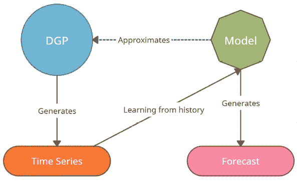
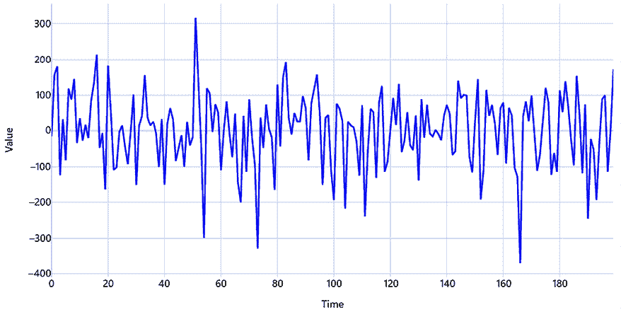
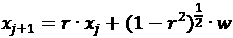
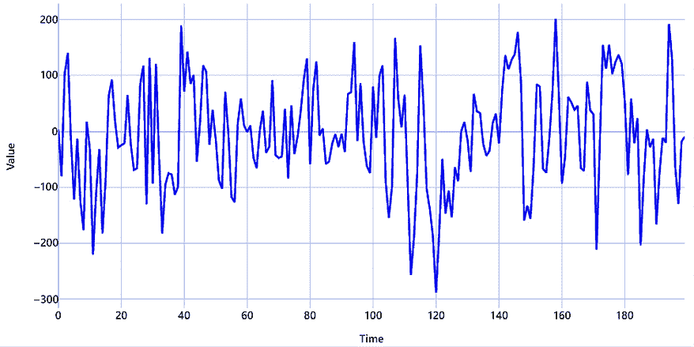
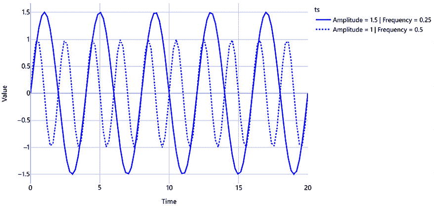
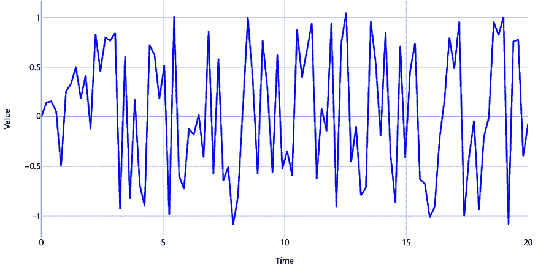
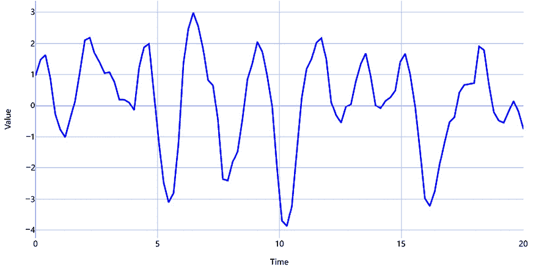
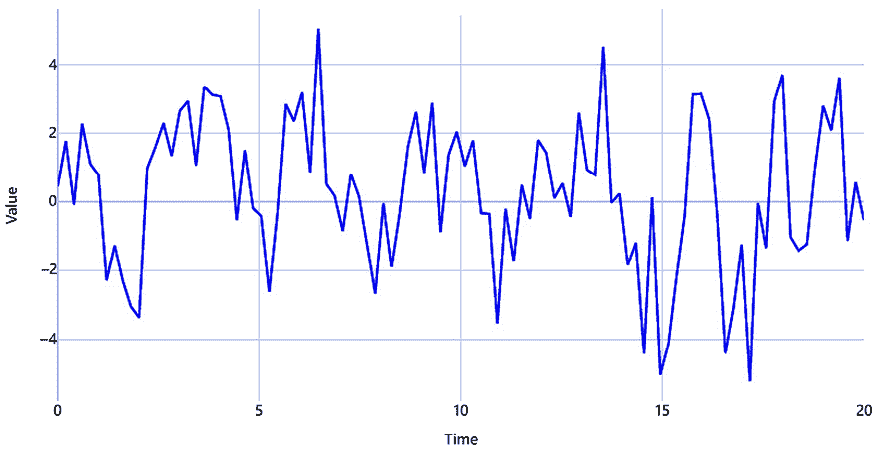
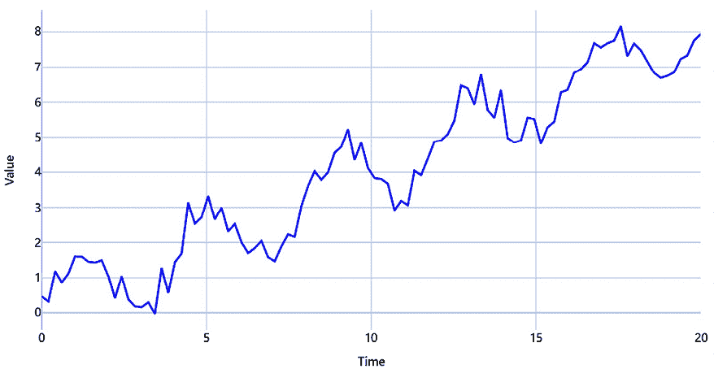
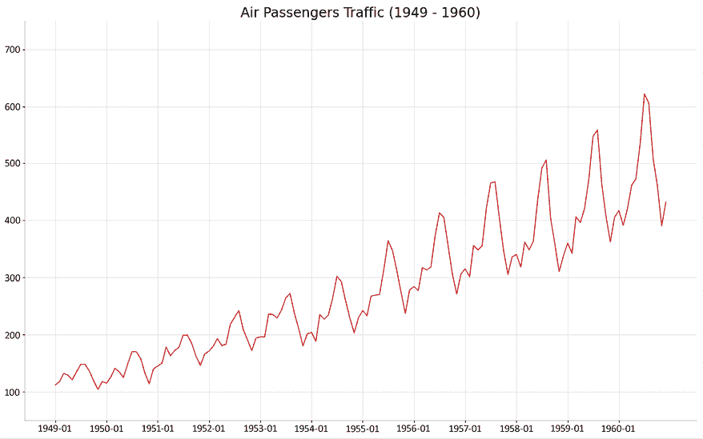

# 第一章：引入时间序列

欢迎来到*《使用 Python 进行现代时间序列预测》*！本书面向那些希望通过学习来自机器学习（**ML**）领域的新技术提升时间序列分析技能的数据科学家或**机器学习**（**ML**）工程师。**时间序列分析**在常规的机器学习书籍、课程等中通常被忽视。它们通常从分类问题开始，稍微涉及回归，然后就继续进行。但时间序列分析在商业中却是非常有价值且无处不在的。我们从三维的视角看待世界，时间是一个我们很少考虑的隐藏维度，但它无所不在。只要时间是我们生活的世界中的四个维度之一，时间序列数据也是无处不在的。

分析时间序列数据能为企业带来大量价值。时间序列分析并不新鲜——它自 1920 年代以来就已存在。但在当前的数据时代，企业收集的时间序列数据正以分钟为单位不断增长和扩展。结合数据量的爆炸式增长以及机器学习（**ML**）的复兴，时间序列分析的领域也发生了显著变化。本书尝试带领你超越经典的统计方法，如**自回归积分滑动平均**（**ARIMA**），并向你介绍来自机器学习领域的最新时间序列分析技术。

我们将从一些基本概念开始，并快速提升到更复杂的话题。在本章中，我们将涵盖以下主要内容：

+   什么是时间序列？

+   数据生成过程（DGP）

+   我们能预测什么？

+   预测术语和符号

# 技术要求

你需要按照书中*前言*部分的说明，设置**Anaconda**环境，以便获得一个包含所有代码所需库和数据集的工作环境。任何额外的库将在运行笔记本时安装。

本章节相关的代码可以在[`github.com/PacktPublishing/Modern-Time-Series-Forecasting-with-Python-2E/tree/main/notebooks/Chapter01`](https://github.com/PacktPublishing/Modern-Time-Series-Forecasting-with-Python-2E/tree/main/notebooks/Chapter01)找到。

# 什么是时间序列？

简单来说，**时间序列**是按时间顺序收集的一组观察数据。重点是“时间”这个词。如果我们在不同的时间点上进行相同的观察，我们就能得到一个时间序列。例如，如果你每月记录自己拥有的巧克力棒数目，你最终就会得到一个关于巧克力消费的时间序列。假设你在每个月的开始时记录自己的体重，你就得到另一个体重的时间序列。这两个时间序列之间是否存在关系？很可能是有的。但到本书的最后，我们将能够科学地分析这一点。

其他一些时间序列的例子包括你关注的某只股票的每周收盘价、你所在城市的每日降水量或降雪量，以及你智能手表记录的每小时脉搏率。

## 时间序列的类型

根据时间间隔，时间序列数据可以分为两种类型，如下所示：

+   **规则时间序列**：这是最常见的时间序列类型，其中观察数据是在规则的时间间隔内获取的，例如每小时或每月。例如，如果我们拿城市的温度作为时间序列进行分析，那么我们会得到按规则间隔（无论选择何种频率）的时间序列数据。

+   **非规则时间序列**：有些时间序列中的观察数据不是在规则时间间隔内获取的。例如，假设我们有一系列病人的实验室检测数据。在这种时间序列中，只有当病人去诊所并进行实验室检测时，我们才能获得观察数据，而这种情况并不是在规则的时间间隔内发生的。

本书仅关注规则时间序列，即时间间隔均匀的时间序列。非规则时间序列稍微复杂一些，需要专门的技术来处理。有关这一主题的几篇综述文章是了解非规则时间序列的好方法，你可以在本章的*进一步阅读*部分找到它们。

## 时间序列分析的主要应用领域

时间序列分析的应用领域大致分为三大类，概述如下：

+   **时间序列预测**：给定过去的时间序列数据，预测未来的值——例如，使用过去五年的温度数据来预测明天的温度。这个用例是最流行和最重要的之一，因为任何需要做的规划都需要对未来有一定的预测。例如，规划下个月生产多少巧克力就需要预测预期的需求。

+   **时间序列分类**：有时，我们不仅需要预测时间序列的未来值，还可能希望基于过去的值预测某个动作。例如，给定**脑电图**（**EEG**；跟踪大脑电活动）或**心电图**（**EKG**；跟踪心脏电活动）的历史测量数据，我们需要预测脑电图或心电图的结果是否正常。

+   **异常值检测**：在某些情况下，我们仅仅想检测某些异常事件，或者是否出现了不正常的情况。在这种情况下，我们通常使用分类或预测方法，但我们也可以进行异常值检测。例如，你身上的可穿戴设备记录了加速度计的读数，并且可以通过异常值检测来识别跌倒或意外事故。

+   **解释与因果关系**：你可以使用时间序列分析来理解时间序列的“是什么”和“为什么”，基于过去的值理解几个相关时间序列之间的关系，或基于时间序列数据推导因果推断。例如，我们有一个品牌的市场份额时间序列和另一个广告支出时间序列。通过使用解释与因果关系技术，我们可以开始理解广告投入如何影响市场份额，并可能采取适当的行动。

本书的重点主要是*时间序列预测*，但你所学到的技术也将帮助你处理*时间序列分类*问题，只需对方法做最小的修改。*解释*部分也有涉及，尽管只是简要介绍，而*因果关系*则是本书没有涉及的领域，因为它需要一种完全不同的方法。

现在我们对时间序列的概况有了一个大致的了解，让我们构建一个关于时间序列数据生成方式的思维模型。

# 数据生成过程（DGP）

我们已经看到，时间序列数据是沿时间维度顺序收集的观察值。任何时间序列反过来都是由某种*机制*生成的。例如，来自制造厂的每日巧克力出货量的时间序列数据受很多因素的影响，比如一年中的时间（例如假期季节）、可可的供应量、工厂机器的正常运转时间等。在统计学中，生成时间序列的这个基础过程被称为**DGP**。时间序列数据是由随机过程和确定性过程生成的。确定性过程涉及随着时间变化而以可预测的方式演变的量。例如，元素的放射性衰变，其中剩余量按照精确的数学公式减少，导致时间上量的稳定减少。但大多数有趣的时间序列（从预测的角度来看）是由随机过程生成的。随机过程是一种描述事物如何随着时间变化的方式，虽然这种变化是随机的，但具有某些模式和概率的可预测性，就像天气每天的变化，涉及一些模式和概率。因此，让我们更深入地讨论由随机过程生成的时间序列。

如果我们对现实有完整且完美的知识，那么我们所需要做的就是将这个 DGP 用数学形式表达出来，你就能得到最准确的预测。但可惜的是，没有人拥有现实的完整和完美的知识。所以，我们要做的就是尽可能在数学上逼近 DGP，这样我们对 DGP 的模仿就能为我们提供最佳的预测（或我们想从分析中得到的任何其他输出）。这种模仿被称为**模型**，它提供了 DGP 的有用近似。

但我们必须记住，模型并不是数据生成过程（DGP），而是对现实中某些关键方面的表征。例如，考虑班加罗尔的鸟瞰图和班加罗尔的地图，如下所示：


图 1.1：班加罗尔的鸟瞰图（左）和班加罗尔的地图（右）

班加罗尔的地图无疑是有用的——我们可以用它从 A 点到 B 点。但班加罗尔的地图并不等同于班加罗尔的照片。它没有展示繁华的夜生活或令人无法忍受的交通。地图只是一个模型，代表了一个地点的一些有用特征，比如道路和地点。以下图示可能有助于我们内化这一概念并记住它：



图 1.2：数据生成过程（DGP）、模型和时间序列

自然地，下一个问题是：*我们有用的模型吗？* 每个模型都有其局限性和挑战。正如我们所看到的，班加罗尔的地图并不能完美地代表班加罗尔。但如果我们的目的是在班加罗尔导航，那么地图就是一个非常有用的模型。如果我们想了解文化呢？地图并不能给你这种感觉。那么，曾经有用的同一个模型，在新的语境下就完全无用。

不同的情况和目标需要不同类型的模型。例如，预测的最佳模型可能与做因果推断的最佳模型不同。

我们可以使用数据生成过程（DGP）的概念，生成多个具有不同复杂度的合成时间序列。

## 生成合成时间序列

合成时间序列或人工时间序列是理解时间序列空间、实验不同技术，甚至测试新模型或建模方法的绝佳工具。这些时间序列设计为可预测的，尽管有些具有挑战性。让我们来看几个实际例子，通过一组基本构建块来生成几个时间序列。你可以发挥创意，任意组合这些组件，甚至将它们相加，生成复杂度任意的时间序列。

### 白噪声和红噪声

一种生成时间序列的随机过程的极端情况是**白噪声**过程。它具有一系列随机数，均值为零，方差为常数。这也是时间序列中最常见的噪声假设之一。

让我们看看如何生成这样的时间序列并将其绘制出来：

```py
# Generate the time axis with sequential numbers upto 200
time = np.arange(200)
# Sample 200 hundred random values
values = np.random.randn(200)*100
plot_time_series(time, values, "White Noise") 
```

以下是输出结果：



图 1.3：白噪声过程

**红噪声**，另一方面，均值为零，方差为常数，但在时间上具有序列相关性。这种序列相关性或红色性由相关系数*r*参数化，如下所示：



其中，*w*是来自白噪声分布的随机样本。

让我们看看如何生成这个，如下所示：

```py
# Setting the correlation coefficient
r = 0.4
# Generate the time axis
time = np.arange(200)
# Generate white noise
white_noise = np.random.randn(200)*100
# Create Red Noise by introducing correlation between subsequent values in the white noise
values = np.zeros(200)
for i, v in enumerate(white_noise):
    if i==0:
        values[i] = v
    else:
        values[i] = r*values[i-1]+ np.sqrt((1-np.power(r,2))) *v
plot_time_series(time, values, "Red Noise Process") 
```

这是输出结果：



图 1.4：红噪声过程

### 周期性或季节性信号

在时间序列中，最常见的信号之一是季节性或周期性信号。因此，你可以通过几种方式将季节性引入到生成的序列中。

让我们借助一个非常有用的库来生成剩余的时间序列——`TimeSynth`。欲了解更多信息，请参考[`github.com/TimeSynth/TimeSynth`](https://github.com/TimeSynth/TimeSynth)。

这是一个生成时间序列的有用库。它包含各种 DGP（数据生成过程），你可以自由组合，创建一个真实的合成时间序列。

**笔记本警告**：

有关具体的代码和使用方法，请参考相关的 Jupyter 笔记本。

让我们看看如何使用正弦函数来创造周期性。在`TimeSynth`库中，有一个有用的函数叫做`generate_timeseries`，它帮助我们组合信号并生成时间序列。请看以下代码片段：

```py
#Sinusoidal Signal with Amplitude=1.5 & Frequency=0.25
signal_1 =ts.signals.Sinusoidal(amplitude=1.5, frequency=0.25)
#Sinusoidal Signal with Amplitude=1 & Frequency=0\. 5
signal_2 = ts.signals.Sinusoidal(amplitude=1, frequency=0.5)
#Generating the time series
samples_1, regular_time_samples, signals_1, errors_1 = generate_timeseries(signal=signal_1)
samples_2, regular_time_samples, signals_2, errors_2 = generate_timeseries(signal=signal_2)
plot_time_series(regular_time_samples,
                 [samples_1, samples_2],
                 "Sinusoidal Waves",
                 legends=["Amplitude = 1.5 | Frequency = 0.25", "Amplitude = 1 | Frequency = 0.5"]) 
```

这是输出结果：



图 1.5：正弦波

注意，这两个正弦波在频率（时间序列穿过零点的速度）和振幅（时间序列偏离零点的距离）上是不同的。

```py
Sinusoidal class:
```

```py
# PseudoPeriodic signal with Amplitude=1 & Frequency=0.25
signal = ts.signals.PseudoPeriodic(amplitude=1, frequency=0.25)
#Generating Timeseries
samples, regular_time_samples, signals, errors = generate_timeseries(signal=signal)
plot_time_series(regular_time_samples,
                 samples,
                 "Pseudo Periodic") 
```

这是输出结果：



图 1.6：伪周期信号

### 自回归信号

另一个在现实世界中非常常见的信号是**自回归（AR）信号**。我们将在*第四章*《设置强有力的基线预测》中详细讲解这一点，但目前为止，AR 信号指的是当前时间步的时间序列值依赖于前一时间步的时间序列值。这种序列相关性是 AR 信号的一个关键特性，它通过几个参数来进行参数化，具体如下：

+   序列相关性的顺序——换句话说，信号依赖于多少个前时间步

+   用来组合前几个时间步的系数

让我们看看如何生成 AR 信号，并查看它的样子，如下所示：

```py
# We have re-implemented the class in src because of a bug in TimeSynth
from src.synthetic_ts.autoregressive import AutoRegressive
# Autoregressive signal with parameters 1.5 and -0.75
# y(t) = 1.5*y(t-1) - 0.75*y(t-2)
signal= AutoRegressive(ar_param=[1.5, -0.75])
#Generate Timeseries
samples, regular_time_samples, signals, errors = generate_timeseries(signal=signal)
plot_time_series(regular_time_samples,
                 samples,
                 "Auto Regressive") 
```

这是输出结果：



图 1.7：AR 信号

### 混合与匹配

还有许多其他组件可以用来创建你的 DGP，从而生成时间序列，但让我们快速看一下如何结合已经看到的组件来生成一个真实的时间序列。

让我们使用一个带有白噪声的伪周期信号，并将其与 AR 信号结合，如下所示：

```py
#Generating Pseudo Periodic Signal
pseudo_samples, regular_time_samples, _, _ = generate_timeseries(signal=ts.signals.PseudoPeriodic(amplitude=1, frequency=0.25), noise=ts.noise.GaussianNoise(std=0.3))
# Generating an Autoregressive Signal
ar_samples, regular_time_samples, _, _ = generate_timeseries(signal= AutoRegressive(ar_param=[1.5, -0.75]))
# Combining the two signals using a mathematical equation
ts = pseudo_samples*2+ar_samples
plot_time_series(regular_time_samples,
                 ts,
                 "Pseudo Periodic with AutoRegression and White Noise") 
```

这是输出结果：



图 1.8：带有 AR 和白噪声的伪周期信号

## 平稳和非平稳时间序列

在时间序列中，**平稳性**非常重要，是许多建模方法的关键假设。具有讽刺意味的是，许多（如果不是大多数的话）实际的时间序列是非平稳的。所以，让我们从一个外行的角度来理解什么是平稳时间序列。

有多种方式来理解平稳性，但最清晰、最直观的方式之一是考虑时间序列的概率分布或数据分布。当一个时间序列的概率分布在每个时间点保持不变时，我们称该时间序列为平稳的。换句话说，如果你选择不同的时间窗口，这些窗口中的数据分布应该是相同的。

标准的高斯分布由两个参数定义——均值和方差。因此，平稳性假设可能被打破的方式有两种，如下所述：

+   均值随时间的变化

+   方差随时间的变化

让我们详细看看这些假设，并更好地理解它们。

### 均值随时间的变化

这是非平稳时间序列最常见的表现方式。如果时间序列有上升/下降趋势，那么两个时间窗口间的均值就不相同。

另一种非平稳性的表现形式是季节性。例如，我们正在查看过去五年每月的平均温度时间序列。根据我们的经验，我们知道温度在夏季达到峰值，在冬季下降。因此，当我们取冬季的平均温度和夏季的平均温度时，它们会是不同的。

让我们生成一个带有趋势和季节性的时间序列，看看它是如何表现出来的：

```py
# Sinusoidal Signal with Amplitude=1 & Frequency=0.25
signal=ts.signals.Sinusoidal(amplitude=1, frequency=0.25)
# White Noise with standard deviation = 0.3
noise=ts.noise.GaussianNoise(std=0.3)
# Generate the time series
sinusoidal_samples, regular_time_samples, _, _ = generate_timeseries(signal=signal, noise=noise)
# Regular_time_samples is a linear increasing time axis and can be used as a trend
trend = regular_time_samples*0.4
# Combining the signal and trend
ts = sinusoidal_samples+trend
plot_time_series(regular_time_samples,
                 ts,
                 "Sinusoidal with Trend and White Noise") 
```

这是输出结果：



图 1.9：带趋势和白噪声的正弦信号

如果你检查*图 1.9*中的时间序列，你会看到明显的趋势和季节性，这两者共同导致数据分布的均值在不同时间窗口间剧烈变化。

### 方差随时间的变化

非平稳性还可以表现为时间序列方差的波动。如果时间序列从低方差开始，随着时间的推移，方差逐渐增大，我们就得到了一个非平稳时间序列。在统计学中，这种现象有一个可怕的名字——**异方差性**。航空乘客数据集（时间序列中的“鸢尾花数据集”——最受欢迎、最常用但没什么实际用处）就是一个典型的异方差时间序列示例。让我们来看一下图：



图 1.10：航空乘客数据集—异方差时间序列示例

在图中，你可以看到随着时间的推移，季节性高峰越来越宽广，这是一个经典的信号，表明该时间序列是异方差的。但并非所有异方差的时间序列都容易被发现。我们有统计测试来检查每种平稳性情况，这些内容将在*第七章*中讨论，*时间序列预测的目标变换*。

本书只是试图让你了解平稳和非平稳时间序列。在这部分的讨论中有大量统计理论和深度内容，我们为了集中精力讨论时间序列的实际应用而略去了这些内容。

在掌握了 DGP 的思维模型之后，我们已经处在了思考另一个重要问题的正确位置：*我们能预测什么？*

# 我们能预测什么？

在我们继续之前，还有一个关于时间序列预测的方面需要理解——*时间序列的可预测性*。在预测时间序列时，最基本的假设是未来依赖于过去。但是并非所有时间序列都是同样可预测的。

让我们看几个例子，尝试按可预测性从易到难进行排名，如下所示：

+   下周一的高潮潮汐

+   下周日的彩票号码

+   下周五特斯拉的股价

直观上，排名这些时间序列的难易程度是非常容易的。下周一的高潮潮汐是最容易预测的，因为它非常可预测，下周五特斯拉的股价会比较难预测，但并非不可能，而彩票号码则非常难预测，因为它们几乎是随机的。

然而，对于那些认为通过书中介绍的先进技术可以预测股价并发财的人来说，这（很可能）不会发生。虽然这个话题值得深入讨论，但我们可以用一小段话总结出关键点。

股票价格不是过去值的函数，而是对未来值的预期，这违反了我们在预测时的第一个假设。如果这还不够糟糕，金融股票价格通常具有非常低的信噪比。过程中最后的障碍是**有效市场假说**（**EMH**）。这个看似无害的假设宣称，股票价格的所有已知信息都已经反映在股票价格中。这个假说的含义是，如果你能准确预测，其他人也会做得到，因此，股票的市场价格已经反映了这种预测所带来的价格变化。

M6 竞赛选择直接应对这个问题，评估有效市场假说（EMH）是否成立，通过进行一年的预测和投资策略竞赛。虽然结果并非定论，但显示出大多数参与者符合有效市场假说（EMH），除了少数顶尖团队。即使在这些顶尖团队中，研究发现预测准确性与股票选择之间没有显著的相关性，也就是说，团队并未选择那些能够预测得更好的股票（完整报告链接可在*进一步阅读*部分找到）。

回到我们讨论的主题——可预测性——以下三个主要因素构成了这一心理模型：

+   **理解数据生成过程（DGP）**：你对数据生成过程（DGP）理解得越透彻，时间序列的可预测性就越高。

+   **数据量**：你拥有的数据越多，预测的准确性就越高。

+   **足够重复的模式**：任何数学模型要有效工作，时间序列中应该有足够重复的模式。模式越可重复，你的可预测性就越高。

即使你已经有了一个关于如何思考可预测性的心理模型，我们将在*第三章*《分析与可视化时间序列数据》中，探讨更具体的评估时间序列可预测性的方法，但关键的结论是，并非所有时间序列都是同样可预测的。

为了能够完全跟上接下来的章节讨论，我们需要建立一个标准符号系统，并学习时间序列分析中特有的术语。

# 预测术语

有一些术语将帮助你理解本书以及其他关于时间序列的文献。以下是这些术语的详细描述：

+   **预测**

预测是利用已知的时间序列过去的数值和/或其他相关变量来预测未来的时间序列值。这与机器学习中的预测非常相似，我们使用一个模型来预测未见过的数据。

+   **多元预测**

多元时间序列由多个时间序列变量组成，这些变量不仅依赖于其过去的数值，还与其他变量存在一定的依赖关系。例如，一个国家的宏观经济指标集合，如**国内生产总值**（**GDP**）和通货膨胀，可以视为一个多元时间序列。多元预测的目标是提出一个模型，捕捉不同变量之间的相互关系，以及它们与过去的关系，并预测所有时间序列在未来的表现。

+   **解释性预测**

除了时间序列的过去数值外，我们可能会使用一些其他信息来预测时间序列的未来数值。例如，在预测零售店销售额时，关于促销活动（历史和未来的）的信息通常是有帮助的。这种利用除自身历史之外的信息进行预测的方法称为解释性预测。

+   **回测**

从训练数据中设置一个验证集来评估模型是机器学习领域常见的做法。回测是验证的时间序列等价物，通过使用历史数据来评估训练好的模型。我们将在后面介绍用于时间序列数据的验证和交叉验证的不同方法。

+   **样本内和样本外**

再次与机器学习进行类比，样本内指的是训练数据，样本外指的是未见或测试数据。当你听到样本内指标时，这指的是在训练数据上计算的指标，而样本外指标则是在测试数据上计算的指标。

+   **外生和内生变量**

外生变量是平行时间序列变量，不直接用于输出建模，但用于帮助我们建模感兴趣的时间序列。通常，外生变量不受系统中其他变量的影响。内生变量是受系统中其他变量影响的变量。一个纯粹的内生变量是完全依赖于系统中其他变量的变量。稍微放宽严格的假设，我们可以将目标变量视为内生变量，将模型中包括的解释性回归变量视为外生变量。

+   **预测组合**

时间序列世界中的预测组合类似于机器学习世界中的集成。预测组合是通过使用一个函数（学习或基于启发式的）来结合多个预测的过程，例如三个预测模型的简单平均值。

还有许多特定于时间序列的术语，其中一些我们将在整本书中逐渐介绍。但这些术语应该是一个良好的起点，让你对这个领域有基本的了解。

# 总结

在本章中，我们首次接触了时间序列，讨论了不同类型的时间序列，看了一个 DGP 如何生成时间序列，并了解了我们如何思考一个重要问题：*我们能有多好地预测一个时间序列？*我们还快速回顾了理解本书其余部分所需的术语。在下一章中，我们将开始动手学习如何获取和处理时间序列数据。如果你还没有设置好环境，请休息一下，花点时间来做这件事。

# 进一步阅读

+   *关于从不规则采样时间序列中学习的原则、模型和方法的调查：从离散化到注意力和不变性* 作者：S.N. Shukla 和 B.M. Marlin（2020）：[`arxiv.org/abs/2012.00168`](https://arxiv.org/abs/2012.00168)

+   *从不规则采样时间序列中学习：缺失数据视角* 作者：S.C. Li 和 B.M. Marlin（2020），ICML：[`arxiv.org/abs/2008.07599`](https://arxiv.org/abs/2008.07599)

+   *M6 预测竞赛：弥合预测和投资决策之间的差距* 作者：Spyros Makridakis 等（2023）：[`arxiv.org/abs/2310.13357`](https://arxiv.org/abs/2310.13357)

# 加入我们在 Discord 上的社区

加入我们社区的 Discord 空间，与作者和其他读者进行讨论：

[`packt.link/mts`](https://packt.link/mts)


