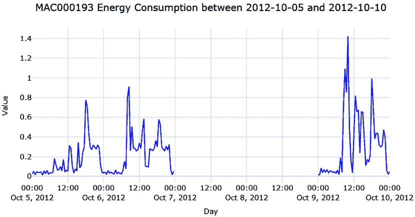

# 第二章：获取和处理时间序列数据

在前一章中，我们学习了什么是时间序列，并建立了一些标准符号和术语。现在，让我们从理论转向实践。在本章中，我们将动手处理数据。虽然我们说时间序列数据无处不在，但我们还没有开始处理一些时间序列数据集。我们将开始处理本书中将要使用的数据集，正确地处理它，并学习一些处理缺失值的技术。

在本章中，我们将涵盖以下主题：

+   理解时间序列数据集

+   pandas 日期时间操作，索引和切片——刷新一下

+   处理缺失数据

+   映射附加信息

+   将文件保存到磁盘和加载文件

+   处理较长时间的缺失数据

# 技术要求

您需要设置**Anaconda**环境，按照书中*前言*的说明进行操作，以获得包含本书代码所需的所有库和数据集的工作环境。运行笔记本时将安装任何额外的库。

本章的代码可以在[`github.com/PacktPublishing/Modern-Time-Series-Forecasting-with-Python-2E/tree/main/notebooks/Chapter02`](https://github.com/PacktPublishing/Modern-Time-Series-Forecasting-with-Python-2E/tree/main/notebooks/Chapter02)找到。

处理时间序列数据就像处理其他表格数据集一样，只是更加注重时间维度。与任何表格数据集一样，`pandas`同样适合处理时间序列数据。

让我们从头开始处理一个数据集。本书将始终使用*伦敦智能电表*数据集。如果您尚未在环境设置中下载数据，请转到*前言*并执行此操作。

# 理解时间序列数据集

这是您遇到任何新数据集的关键第一步，甚至在进行**探索性数据分析**（**EDA**）之前，我们将在*第三章* *分析和可视化时间序列数据*中进行讨论。了解数据的来源，背后的数据生成过程以及源域对于对数据集有一个良好的理解是至关重要的。

伦敦数据存储库，一个免费开放的数据共享门户，由 Jean-Michel D 收集并丰富了此数据集，并上传到 Kaggle。

数据集包含 5,567 个伦敦家庭的能耗读数，这些家庭参与了英国电力网络主导的低碳伦敦项目，时间跨度从 2011 年 11 月到 2014 年 2 月。读数间隔为半小时。数据集的一部分还包括一些有关家庭的元数据。让我们看看数据集的元数据包含哪些信息：

+   CACI UK 将英国人口划分为不同的群体，称为 Acorn。对于数据中的每个家庭，我们都有对应的 Acorn 分类。Acorn 类别（奢华生活方式、城市精英、学生生活等）被归类为上级类别（富裕成就者、上升中的繁荣、经济紧张等）。完整的 Acorn 类别列表可以在*表 2.1*中找到。详细列出每个类别的完整文档可以在 [`acorn.caci.co.uk/downloads/Acorn-User-guide.pdf`](https://acorn.caci.co.uk/downloads/Acorn-User-guide.pdf) 中查看。

+   数据集包含两组客户——一组在 2013 年使用**动态时间段电价**（**dToU**），另一组则采用固定费率电价。dToU 的电价会提前一天通过智能电表的 IHD 或短信告知。

+   Jean-Michel D 还为数据集增加了天气和英国法定假期的数据。

下表显示了 Acorn 分类：

| **Acorn 分组** | **Acorn 分类** |
| --- | --- |
| 富裕成就者 | A-奢华生活方式 |
| B-高管财富 |
| C-成熟财富 |
| 上升中的繁荣 | D 城精英 |
| E-职业攀升者 |
| 舒适社区 | F-乡村社区 |
| G-成功的郊区 |
| H-稳定的社区 |
| I-舒适老年人 |
| J-起步阶段 |
| 经济紧张 | K-学生生活 |
| L-普通收入 |
| M-奋斗中的家庭 |
| N-贫困的退休人员 |
| 城市困境 | O-Young 艰难困苦 |
| P-挣扎中的地产 |
| Q-困境中的人群 |

表 2.1：Acorn 分类

Kaggle 数据集也对时间序列数据进行了每日预处理，并将所有单独的文件合并在一起。在这里，我们将忽略这些文件，从原始文件开始，这些文件可以在 `hhblock_dataset` 文件夹中找到。学习处理原始文件是从事实际行业数据集工作的重要部分。

# 准备数据模型

一旦我们理解了数据的来源，就可以查看它，理解不同文件中所包含的信息，并构建一个思维模型来关联不同的文件。你可以称之为传统方式，但 Microsoft Excel 是一个非常适合获取这种第一层次理解的工具。如果文件太大以至于无法在 Excel 中打开，我们也可以在 Python 中读取它，将一部分数据保存到 Excel 文件中，然后打开它。然而，请记住，Excel 有时会乱改数据格式，尤其是日期格式，所以我们需要小心不要保存文件并写回 Excel 所做的格式更改。如果你对 Excel 有抵触，可以使用 Python 完成，尽管会需要更多的键盘操作。这个练习的目的是查看不同的数据文件包含了什么，探索不同文件之间的关系等。

我们可以通过绘制一个数据模型，使其更正式和明确，类似于以下图示：


图 2.1：伦敦智能电表数据集的数据模型

这个数据模型主要是帮助我们理解数据，而不是任何数据工程的目的。因此，它只包含最基本的信息，如左侧的关键列和右侧的示例数据。我们还有箭头连接不同的文件，并使用键来关联这些文件。

让我们看一下几个关键列名及其含义：

+   `LCLid`：家庭的唯一消费者 ID

+   `stdorTou`：家庭是否使用 dToU 或标准收费

+   `Acorn`：ACORN 类

+   `Acorn_grouped`：ACORN 组

+   `file`：块编号

每个 `LCLid` 都有一个唯一的时间序列与之关联。该时间序列文件采用一种稍微复杂的格式——每天，文件的列中会有 48 个观测值，以半小时为频率。

**笔记本提示**：

为了跟随完整的代码，请使用 `Chapter01` 文件夹中的 `01-Pandas_Refresher_&_Missing_Values_Treatment.ipynb` 笔记本。

在开始处理数据集之前，有几个概念需要我们明确。其中一个在 pandas DataFrame 中至关重要的概念是 pandas 日期时间属性和索引。让我们快速回顾几个对我们有用的 `pandas` 概念。

如果你熟悉 pandas 中的日期时间操作，可以跳到下一节。

# pandas 日期时间操作、索引和切片——回顾

我们不使用稍微复杂的数据集，而是选择一个简单且格式良好的股票交易价格数据集，来自 UCI 机器学习库，来查看 pandas 的功能：

```py
# Skipping first row cause it doesn't have any data
df = pd.read_excel("https://archive.ics.uci.edu/ml/machine-learning-databases/00247/data_akbilgic.xlsx", skiprows=1) 
```

我们读取的 DataFrame 如下所示：


图 2.2：包含股票交易价格的 DataFrame

现在我们已经读取了 `DataFrame`，让我们开始处理它。

## 将日期列转换为 `pd.Timestamp`/`DatetimeIndex`

首先，我们必须将日期列（该列可能并不会被 pandas 自动解析为日期）转换为 `pandas` 的日期时间格式。为此，`pandas` 提供了一个非常方便的函数叫做 `pd.to_datetime`。它会自动推断日期时间格式，并将输入转换为 `pd.Timestamp`（如果输入是一个 `string`）或 `DatetimeIndex`（如果输入是一个字符串的 `list`）。因此，如果我们传入单一的日期字符串，`pd.to_datetime` 会将其转换为 `pd.Timestamp`，而如果我们传入一组日期，它会将其转换为 `DatetimeIndex`。我们还可以使用一个方便的函数，`strftime`，它可以将日期格式化为我们指定的格式。它使用 `strftime` 的约定来指定数据的格式。例如，`%d` 代表零填充的日期，`%B` 代表月份的全名，`%Y` 代表四位数字的年份。`strftime` 约定的完整列表可以在 [`strftime.org/`](https://strftime.org/) 查找：

```py
>>> pd.to_datetime("13-4-1987").strftime("%d, %B %Y")
'13, April 1987' 
```

现在，让我们来看一个自动解析失败的案例。日期是 1987 年 1 月 4 日。让我们看看将该字符串传递给函数时会发生什么：

```py
>>> pd.to_datetime("4-1-1987").strftime("%d, %B %Y")
'01, April 1987' 
```

嗯，那并不是预期的结果，对吧？不过仔细想想，任何人都可能犯这个错误，因为我们没有告诉计算机是月在前还是日，在这种情况下 pandas 假定月份在前。让我们来纠正一下：

```py
>>> pd.to_datetime("4-1-1987", dayfirst=True).strftime("%d, %B %Y")
'04, January 1987' 
```

自动日期解析失败的另一个情况是当日期字符串采用非标准形式时。在这种情况下，我们可以提供一个`strftime`格式化字符串，帮助 pandas 正确解析日期：

```py
>>> pd.to_datetime("4|1|1987", format="%d|%m|%Y").strftime("%d, %B %Y")
'04, January 1987' 
```

`strftime` 格式化规范的完整列表可以在[`strftime.org/`](https://strftime.org/)找到。

**实践者提示**：

由于数据格式的多样性，pandas 可能会错误地推断时间。在读取文件时，pandas 会尝试自动解析日期并创建错误。有许多方法可以控制这种行为：我们可以使用 `parse_dates` 标志来关闭日期解析，使用 `date_parser` 参数传入自定义日期解析器，以及使用 `year_first` 和 `day_first` 来轻松表示两种常见的日期格式。从 2.0 版本开始，pandas 支持 `date_format`，可以用来传入日期的确切格式，作为一个 Python 字典，列名作为键。

在所有这些选项中，如果使用 `pandas` >=2.0，我更倾向于使用 `date_format`。我们可以保持 `parse_dates=True`，然后传入确切的日期格式，使用 `strftime` 格式化规范。这确保了日期按照我们希望的方式被解析。

如果使用的是 `pandas` <2.0，那么我更倾向于在 `pd.read_csv` 和 `pd.read_excel` 中都保持 `parse_dates=False`，以确保 pandas 不会自动解析数据。之后，你可以使用 `format` 参数转换日期，该参数允许你显式设置列的日期格式，采用 `strftime` 格式化规范。`pd.to_datetime` 中还有两个参数可以减少推断日期时的错误——`yearfirst` 和 `dayfirst`。如果没有提供显式的日期格式，至少要提供其中一个。

现在，让我们把我们股票价格数据集中的日期列转换为日期时间格式：

```py
df['date'] = pd.to_datetime(df['date'], yearfirst=True) 
```

现在，`'date'` 列的 `dtype` 应该是 `datetime64[ns]` 或 `<M8[ns]`，这两者都是 pandas/NumPy 本地的日期时间格式。但为什么我们需要这么做呢？

这是因为它解锁了大量额外的功能。传统的 `min()` 和 `max()` 函数开始生效，因为 pandas 知道这是一个日期时间列：

```py
>>> df.date.min(),df.date.max()
(Timestamp('2009-01-05 00:00:00'), Timestamp('2011-02-22 00:00:00')) 
```

让我们看一下日期时间格式带来的一些酷炫特性。

## 使用 `.dt` 访问器和日期时间属性

由于列现在是日期格式，所有包含在日期中的语义信息都可以通过 pandas datetime 属性使用。我们可以使用 `.dt` 访问器访问许多日期时间属性，例如 `month`、`day_of_week`、`day_of_year` 等等：

```py
>>> print(f"""
     Date: {df.date.iloc[0]}
     Day of year: {df.date.dt.day_of_year.iloc[0]}
     Day of week: {df.date.dt.dayofweek.iloc[0]}
     Month: {df.date.dt.month.iloc[0]}
     Month Name: {df.date.dt.month_name().iloc[0]}
     Quarter: {df.date.dt.quarter.iloc[0]}
     Year: {df.date.dt.year.iloc[0]}
     ISO Week: {df.date.dt.isocalendar().week.iloc[0]}
     """)
Date: 2009-01-05 00:00:00
Day of year: 5
Day of week: 0
Month: 1
Month Name: January
Quarter: 1
Year: 2009
ISO Week: 2 
```

从 pandas 1.1.0 开始，`week_of_year` 已被弃用，因为它在年末/年初产生不一致的结果。取而代之的是采用了 ISO 日历标准（该标准广泛应用于政府和企业中），我们可以访问 ISO 日历以获取 ISO 周。

## 索引和切片

当我们将日期列设为 DataFrame 的索引时，真正有趣的部分开始了。通过这样做，你可以在 datetime 轴上使用 pandas 支持的所有花式切片操作。我们来看看其中的几个操作：

```py
# Setting the index as the datetime column
df.set_index("date", inplace=True)
# Select all data after 2010-01-04(inclusive)
df["2010-01-04":]
# Select all data between 2010-01-04 and 2010-02-06(exclusive)
df["2010-01-04": "2010-02-06"]
# Select data 2010 and before
df[: "2010"]
# Select data between 2010-01 and 2010-06(both including)
df["2010-01": "2010-06"] 
```

除了语义信息和智能索引及切片功能外，`pandas` 还提供了创建和操作日期序列的工具。

## 创建日期序列和管理日期偏移

如果你熟悉 Python 中的 `range` 和 NumPy 中的 `np.arange`，那么你就知道它们帮助我们通过提供起始点和结束点来创建 `整数/浮动` 序列。pandas 也有类似的功能来处理日期时间——`pd.date_range`。该函数接受起始日期和结束日期，以及频率（日、月等），并在这两个日期之间创建日期序列。我们来看看几种创建日期序列的方式：

```py
# Specifying start and end dates with frequency
pd.date_range(start="2018-01-20", end="2018-01-23", freq="D").astype(str).tolist()
# Output: ['2018-01-20', '2018-01-21', '2018-01-22', '2018-01-23']
# Specifying start and number of periods to generate in the given frequency
pd.date_range(start="2018-01-20", periods=4, freq="D").astype(str).tolist()
# Output: ['2018-01-20', '2018-01-21', '2018-01-22', '2018-01-23']
# Generating a date sequence with every 2 days
pd.date_range(start="2018-01-20", periods=4, freq="2D").astype(str).tolist()
# Output: ['2018-01-20', '2018-01-22', '2018-01-24', '2018-01-26']
# Generating a date sequence every month. By default it starts with Month end
pd.date_range(start="2018-01-20", periods=4, freq="M").astype(str).tolist()
# Output: ['2018-01-31', '2018-02-28', '2018-03-31', '2018-04-30']
# Generating a date sequence every month, but month start
pd.date_range(start="2018-01-20", periods=4, freq="MS").astype(str).tolist()
# Output: ['2018-02-01', '2018-03-01', '2018-04-01', '2018-05-01'] 
```

我们还可以使用 `pd.TimeDelta` 来给日期加减天数、月份和其他值：

```py
# Add four days to the date range
(pd.date_range(start="2018-01-20", end="2018-01-23", freq="D") + pd.Timedelta(4, unit="D")).astype(str).tolist()
# Output: ['2018-01-24', '2018-01-25', '2018-01-26', '2018-01-27']
# Add four weeks to the date range
(pd.date_range(start="2018-01-20", end="2018-01-23", freq="D") + pd.Timedelta(4, unit="W")).astype(str).tolist()
# Output: ['2018-02-17', '2018-02-18', '2018-02-19', '2018-02-20'] 
```

在 `pandas` 中有很多这样的别名，包括 `W`、`W-MON`、`MS` 等。完整列表可以在 [`pandas.pydata.org/docs/user_guide/timeseries.html#timeseries-offset-aliases`](https://pandas.pydata.org/docs/user_guide/timeseries.html#timeseries-offset-aliases) 查找到。

在本节中，我们了解了在 datetime 索引上可以执行的一些有用特性和操作，并且知道如何操作包含 datetime 列的 DataFrame。现在，让我们回顾一下几种可以处理缺失数据的技术。

# 处理缺失数据

在处理大规模数据集时，难免会遇到缺失数据。如果它不是时间序列的一部分，可能是你收集和映射的附加信息的一部分。在我们仓促地用均值填充或删除这些行之前，先考虑一下几个方面：

+   首先需要考虑的是，我们担心的缺失数据到底是缺失还是其他原因。为此，我们需要考虑**数据生成过程**（**DGP**）（生成时间序列的过程）。举个例子，假设我们在处理某个本地超市的销售数据。你已经得到了过去 2 年的**销售点**（**POS**）交易数据，并正在将数据处理成时间序列。在分析数据时，你发现有一些产品几天内没有交易记录。现在，你需要考虑的是，这些缺失数据是真的缺失，还是缺失本身就能提供一些信息。如果某个产品一天没有交易记录，它在处理时会被视为缺失数据，尽管实际上它并不缺失。实际上，这意味着那天没有销售，因此你应该用零来填补这些缺失数据。

+   现在，如果你发现每个星期天数据都缺失——也就是说，缺失有规律可循，怎么办？这就变得有些棘手，因为如何填补这些空缺取决于你打算使用的模型。如果你用零填补这些空缺，那么一个基于近期数据预测未来的模型可能会受到影响，尤其是在周一的预测中。然而，如果你告诉模型前一天是星期天，那么模型仍然能够学会区分这些情况。

+   最后，如果你看到某个热销产品的销售量为零，而它通常总是有销售，这该怎么办？这可能是因为某些原因，如 POS 机故障、数据录入错误或缺货等情况。可以使用一些技术来填补这类缺失值。

让我们看看澳大利亚堪培拉 ACT 政府发布的一个空气质量数据集（根据 CC by Attribution 4.0 国际许可证发布，链接：[`www.data.act.gov.au/Environment/Air-Quality-Monitoring-Data/94a5-zqnn`](https://www.data.act.gov.au/Environment/Air-Quality-Monitoring-Data/94a5-zqnn)），并看看我们如何使用 pandas 填充这些缺失值（本章稍后将介绍更多复杂的技术）。

**实践者提示**：

使用`read_csv`等方法读取数据时，pandas 提供了几种便捷的方式来处理缺失值。默认情况下，pandas 会将`#N/A`、`null`等值视为`NaN`。我们可以使用`na_values`和`keep_default_na`参数来控制允许的`NaN`值列表。

我们选择了**Monash**地区和**PM2.5**的读数，并人为地引入了一些缺失值，如下图所示：


图 2.3：空气质量数据集中的缺失值

现在，让我们来看一些可以用来填充缺失值的简单技术：

+   **最后观察值前向填充或前向填充**：这个插补技术使用最后一个观察值填充所有缺失值，直到遇到下一个观察值。这也被称为前向填充。我们可以这样操作：

    ```py
    df['pm2_5_1_hr'].ffill() 
    ```

+   **下一个观察值后向填充或后向填充**：这个插补技术使用下一个观察值，回溯并用该值填充所有缺失值。这也被称为后向填充。让我们来看看如何在 pandas 中实现这一点：

    ```py
    df['pm2_5_1_hr'].bfill() 
    ```

+   **均值填充**：这个插补技术也相当简单。我们计算整个序列的均值，并在遇到缺失值时用均值填充：

    ```py
    df['pm2_5_1_hr'].fillna(df['pm2_5_1_hr'].mean()) 
    ```

让我们绘制使用这三种技术得到的插补线：


图 2.4: 使用前向填充、后向填充和均值填充插补缺失值

另一类插补技术涉及插值：

+   **线性插值**：线性插值就像是在两个观察点之间画一条直线，并填充缺失值使其位于这条直线上。我们可以这样操作：

    ```py
    df['pm2_5_1_hr'].interpolate(method="linear") 
    ```

+   **最近邻插值**：这直观上就像是前向填充和后向填充的结合。对于每个缺失值，找到最接近的观察值并用它来填充缺失值：

    ```py
    df['pm2_5_1_hr'].interpolate(method="nearest") 
    ```

让我们绘制这两条插值线：


图 2.5: 使用线性插值和最近邻插值插补缺失值

还有一些非线性插值技术：

+   **样条插值、多项式插值和其他插值方法**：除了线性插值外，pandas 还支持非线性插值技术，这些技术会在后台调用 SciPy 函数。样条插值和多项式插值相似，它们会为数据拟合一个给定阶数的样条/多项式，并用它来填补缺失值。在使用 `spline` 或 `polynomial` 作为 `interpolate` 方法时，我们应该始终提供 `order` 参数。阶数越高，拟合观察点的函数就越灵活。让我们来看一下如何使用样条插值和多项式插值：

    ```py
    df['pm2_5_1_hr'].interpolate(method="spline", order=2)
    df['pm2_5_1_hr'].interpolate(method="polynomial", order=5) 
    ```

让我们绘制这两种非线性插值技术：


图 2.6: 使用样条插值和多项式插值插补缺失值

有关`interpolate`支持的所有插值技术，请访问[`pandas.pydata.org/pandas-docs/stable/reference/api/pandas.Series.interpolate.html`](https://pandas.pydata.org/pandas-docs/stable/reference/api/pandas.Series.interpolate.html)和[`docs.scipy.org/doc/scipy/reference/generated/scipy.interpolate.interp1d.html#scipy.interpolate.interp1d`](https://docs.scipy.org/doc/scipy/reference/generated/scipy.interpolate.interp1d.html#scipy.interpolate.interp1d)。

现在我们已经更熟悉 pandas 如何处理 datetime 类型的数据，接下来让我们回到数据集，并将数据转换成更易于管理的形式。

**笔记本提示**：

若要查看完整的预处理代码，请使用`Chapter02`文件夹中的`02-Preprocessing_London_Smart_Meter_Dataset.ipynb`笔记本。

## 将半小时区块数据（hhblock）转换为时间序列数据

在开始处理之前，让我们了解一下时间序列数据集中可能会出现的几类信息：

+   **时间序列标识符**：这些是特定时间序列的标识符。它可以是一个名称、一个 ID，或任何其他唯一的特征——例如，我们正在处理的零售销售数据集中的 SKU 名称、消费者 ID，或者能源数据集中的消费者 ID，都是时间序列标识符。

+   **元数据或静态特征**：这些信息不随时间变化。例如，我们数据集中的 ACORN 家庭分类就是静态特征。

+   **时间变化特征**：这些信息会随时间变化——例如，天气信息。对于每一个时间点，我们都有不同的天气值，而不像 Acorn 分类那样固定。

接下来，让我们讨论一下数据集的格式化。

## 紧凑格式、扩展格式和宽格式数据

有很多方式可以格式化时间序列数据集，特别是像我们现在处理的这种包含多个相关时间序列的数据集。一种标准的方式是**宽格式**数据。这里日期列相当于索引，每个时间序列占据一个不同的列。如果有一百万个时间序列，就会有一百万零一个列（因此称为“宽格式”）。除了标准的**宽格式**数据，我们还可以考虑两种非标准的时间序列数据格式。尽管这些格式没有统一的命名，我们将在本书中将其称为**紧凑格式**和**扩展格式**。扩展格式在一些文献中也被称为**长格式**。

紧凑格式数据是指在 pandas DataFrame 中，每个时间序列只占据一行——也就是说，时间维度作为一个数组被管理在 DataFrame 的一行中。时间序列标识符和元数据占据列并包含标量值，接着是时间序列的值；其他随时间变化的特征占据列并包含数组。还会额外添加两列来推断时间——`start_datetime` 和 `frequency`。如果我们知道时间序列的开始日期和频率，就可以轻松构造时间并从 DataFrame 中恢复时间序列。这仅适用于定期采样的时间序列。其优点是 DataFrame 占用的内存更少，处理起来也更加容易和快速：


图 2.7：紧凑格式数据

扩展格式是指时间序列沿着 DataFrame 的行进行展开。如果时间序列中有 *n* 步，它将在 DataFrame 中占据 *n* 行。时间序列标识符和元数据会沿着所有行重复。随时间变化的特征也会沿着行展开。此外，代替开始日期和频率，我们将使用时间戳作为一列：


图 2.8：扩展格式数据

如果紧凑格式中有时间序列标识符作为键，那么时间序列标识符和日期时间列将被组合并成为键。

宽格式数据在传统时间序列文献中更为常见。它可以视为一种遗留格式，在许多方面都有局限性。你还记得我们之前看到的股票数据（*图 2.2*）吗？我们将日期作为索引或列之一，将不同的时间序列作为 DataFrame 的不同列。随着时间序列数量的增加，它们变得越来越宽，因此得名。这种数据格式无法包含任何关于时间序列的元数据。例如，在我们的数据中，我们有关于某个家庭是否使用标准定价或动态定价的信息。在宽格式中我们无法包含这种元数据。从操作角度来看，宽格式也不太适合关系型数据库，因为每当我们获取新的时间序列时，我们就必须不断向表中添加列。在本书中，我们将不会使用这种格式。

## 强制时间序列的定期间隔

你应该首先检查和纠正的事情之一是你所拥有的定期采样时间序列数据是否具有相等的时间间隔。实际上，即使是定期采样的时间序列，也可能由于数据收集错误或其他数据采集方式的特殊性，出现缺失的样本。因此，在处理数据时，我们会确保强制执行时间序列中的定期间隔。

**最佳实践**：

在处理包含多个时间序列的数据集时，最好检查所有时间序列的结束日期。如果它们不一致，我们可以将它们对齐到数据集中所有时间序列的最新日期。

在我们的智能电表数据集中，一些 `LCLid` 列比其他列结束得早。也许是家庭选择退出该计划，或者他们搬走了并且房子空置了，原因可以有很多。但我们需要处理这一点，同时保持规则的时间间隔。

我们将在下一节学习如何将数据集转换为时间序列格式。此过程的代码可以在 `02-Preprocessing_London_Smart_Meter_Dataset.ipynb` 笔记本中找到。

## 将伦敦智能电表数据集转换为时间序列格式

对于每个你遇到的数据集，转换成紧凑形式或扩展形式的步骤会有所不同。这取决于原始数据的结构。这里，我们将展示如何转换伦敦智能电表数据集，以便将这些经验转移到其他数据集。

在开始处理数据为紧凑或扩展形式之前，我们需要完成两个步骤：

1.  **找到全局结束日期**：我们必须找到所有区块文件中的最大日期，以便知道时间序列的全局结束日期。

1.  **基本预处理**：如果你记得 `hhblock_dataset` 的结构，你会记得每一行都有一个日期，而列中有半小时的区块。我们需要将其重塑为长格式，其中每行有一个日期和一个半小时的区块。这样处理更方便。

现在，让我们定义分别转换数据为紧凑形式和扩展形式的函数，并将这些函数 `apply` 到每个 `LCLid` 列。我们将为每个 `LCLid` 分别执行此操作，因为每个 `LCLid` 的开始日期不同。

### 扩展形式

将数据转换为扩展形式的函数执行以下操作：

1.  查找开始日期。

1.  使用开始日期和全局结束日期创建标准的 DataFrame。

1.  对 `LCLid` 的 DataFrame 进行左连接与标准 DataFrame，缺失的数据填充为 `np.nan`。

1.  返回合并后的 DataFrame。

一旦我们拥有所有的 `LCLid` DataFrame，我们需要执行几个额外的步骤来完成扩展形式的处理：

1.  将所有 DataFrame 合并为一个单一的 DataFrame。

1.  创建一个名为 offset 的列，它是半小时区块的数值表示；例如，`hh_3` → `3`。

1.  通过为日期加上 30 分钟的偏移来创建时间戳，并删除不必要的列。

对于一个区块，这种表示占用大约 47 MB 的内存。

### 紧凑形式

将数据转换为紧凑形式的函数执行以下操作：

1.  查找开始日期和时间序列标识符。

1.  使用开始日期和全局结束日期创建标准的 DataFrame。

1.  对 `LCLid` 的 DataFrame 进行左连接与标准 DataFrame，缺失的数据填充为 `np.nan`。

1.  按日期对值进行排序。

1.  返回时间序列数组，以及时间序列标识符、开始日期和时间序列的长度。

一旦我们为每个 `LCLid` 获取了这些信息，我们可以将它们编译成一个 DataFrame，并将频率设置为 30 分钟。

对于一个区块，这种表示形式仅占用约 0.002 MB 的内存。

我们将使用紧凑形式，因为它更易于处理，且占用资源较少。

# 映射附加信息

从我们之前准备的数据模型中，我们知道有三个关键文件需要映射：*家庭信息*、*天气* 和 *银行假期*。

`informations_households.csv` 文件包含关于家庭的元数据。这里有一些与时间无关的静态特征。为此，我们只需基于 `LCLid`（时间序列标识符）将 `informations_households.csv` 与紧凑形式进行左连接。

**最佳实践**：

在进行 pandas 的 `merge` 时，一个最常见且意外的结果是操作前后行数不相同（即使你是进行左连接）。这通常发生在合并的键存在重复值时。作为最佳实践，可以在 pandas 合并时使用 `validate` 参数，它接受 `one_to_one` 和 `many_to_one` 等输入，这样可以在合并时进行检查，如果不符合假设，将抛出错误。更多信息，请访问 [`pandas.pydata.org/docs/reference/api/pandas.merge.html`](https://pandas.pydata.org/docs/reference/api/pandas.merge.html)。

银行假期和天气是时变特征，应当根据情况进行处理。需要牢记的最重要的一点是，在映射这些信息时，它们应该与我们已经存储的时间序列数组完美对齐。

`uk_bank_holidays.csv` 是一个包含假期日期和假期类型的文件。假期信息在这里非常重要，因为在假期期间，家庭成员通常待在家里，一起度过时间、看电视等，这会影响能源消耗模式。按照以下步骤处理该文件：

1.  将日期列转换为 datetime 格式，并将其设置为 DataFrame 的索引。

1.  使用我们之前看到的`resample`函数，我们必须确保索引每 30 分钟重采样一次，这是时间序列的频率。

1.  对假期数据进行前向填充，并将其余的 `NaN` 值填充为 `NO_HOLIDAY`。

现在，我们已经将假期文件转换成了一个 DataFrame，且每行代表一个 30 分钟的时间间隔。每行中有一列指定该天是否为假期。

`weather_hourly_darksky.csv`是一个每日频率的文件，我们需要将其下采样至 30 分钟频率，因为我们需要映射到的数据是半小时频率的。如果不进行此操作，天气数据将只映射到按小时计算的时间戳，导致半小时的时间戳没有数据。

我们处理该文件的步骤也类似于处理假期的方式：

1.  将日期列转换为 datetime 格式，并将其设置为 DataFrame 的索引。

1.  使用`resample`函数时，我们必须确保每 30 分钟对索引进行重采样，这也是时间序列的频率。

1.  使用前向填充方法填充由于重采样而产生的缺失值。

现在你已经确保了时间序列和随时间变化的特征之间的对齐，你可以遍历每个时间序列，并提取天气和公共假日数组，然后将其存储在 DataFrame 的相应行中。

# 保存和加载文件到磁盘。

完全合并的 DataFrame 在紧凑形式下仅占~10 MB。然而，保存此文件需要一点工程工作。如果我们尝试以 CSV 格式保存文件，由于在 pandas 列中存储数组的方式（因为数据以紧凑形式存储），这将无法成功。我们可以将其保存为`pickle`或`parquet`格式，或者任何二进制文件格式。根据我们机器上可用的内存大小，这种方式是可行的。虽然完全合并的 DataFrame 只有~10 MB，但以`pickle`格式保存时，文件大小会暴增至~15 GB。

我们可以做的是将其作为文本文件保存，同时进行一些调整，以适应列名、列类型和其他读取文件所需的元数据。最终保存的文件大小仍然是~15 GB，但由于这是 I/O 操作，我们并不将所有数据保存在内存中。我们将这种格式称为时间序列（`.ts`）格式。保存紧凑形式到`.ts`格式、读取`.ts`格式并将紧凑形式转换为展开形式的功能可在本书的 GitHub 仓库中的`src/data_utils.py`文件找到。

如果你不需要将整个 DataFrame 存储在一个文件中，可以将其拆分成多个块，并以二进制格式单独保存，如`parquet`格式。对于我们的数据集，我们可以选择这个方法，将整个 DataFrame 拆分成多个块并保存为`parquet`文件。这是最适合我们的方案，原因有以下几点：

+   它利用了该格式自带的压缩特性。

+   它按块读取整个数据，以便快速迭代和实验。

+   数据类型在读写操作之间得以保留，从而减少了歧义。

对于非常大的数据集，我们可以使用一些 pandas 的替代库，这样可以更容易处理内存溢出的数据集。Polars 是一个非常棒的库，支持懒加载且运行非常快。对于真正庞大的数据集，使用带有分布式集群的 PySpark 可能是合适的选择。

现在我们已经处理完数据集并将其存储到磁盘上，让我们将其重新读取到内存中，并探讨一些处理缺失数据的技术。

# 处理长时间缺失数据

我们之前看到了一些处理缺失数据的技巧——前向填充、后向填充、插值等。如果只有一个或两个数据点缺失，这些技巧通常有效。但是，如果缺失的是一大段数据，那么这些简单的技巧就显得不足了。

**笔记本提示**：

若要跟随缺失数据填充的完整代码，请使用`Chapter02`文件夹中的`03-Handling_Missing_Data_(Long_Gaps).ipynb`笔记本。

让我们从内存中读取`0–7 parquet`区块：

```py
block_df = pd.read_parquet("data/london_smart_meters/preprocessed/london_smart_meters_merged_block_0-7.parquet") 
```

我们保存的数据是紧凑形式的。我们需要将其转换为扩展形式，因为在这种形式下处理时间序列数据更为方便。由于我们只需要时间序列的一个子集（为了更快的演示），我们将从这七个区块中提取一个区块。为了将紧凑形式转换为扩展形式，我们可以使用`src/utils/data_utils.py`中一个名为`compact_to_expanded`的有用函数：

```py
#Converting to expanded form
exp_block_df = compact_to_expanded(block_df[block_df.file=="block_7"], timeseries_col = 'energy_consumption',
static_cols = ["frequency", "series_length", "stdorToU", "Acorn", "Acorn_grouped", "file"],
time_varying_cols = ['holidays', 'visibility', 'windBearing', 'temperature', 'dewPoint',
       'pressure', 'apparentTemperature', 'windSpeed', 'precipType', 'icon',
       'humidity', 'summary'],
ts_identifier = "LCLid") 
```

可视化一组相关时间序列中缺失数据的最佳方法之一是使用一个非常有用的包，叫做`missingno`：

```py
# Pivot the data to set the index as the datetime and the different time series along the columns
plot_df = pd.pivot_table(exp_block_df, index="timestamp", columns="LCLid", values="energy_consumption")
# Generate Plot. Since we have a datetime index, we can mention the frequency to decide what do we want on the X axis
msno.matrix(plot_df, freq="M") 
```

上述代码会产生以下输出：


图 2.9：第 7 区块中缺失数据的可视化

仅在相关的时间序列中尝试`missingno`可视化，并且这些时间序列数量应少于 25 个。如果你有一个包含成千上万条时间序列的数据集（例如我们的完整数据集），应用这种可视化会导致我们得到一个无法辨认的图形，并使计算机卡住。

这张可视化图表一眼就能告诉我们很多信息。*Y*轴显示的是我们所绘制可视化图表的日期，而*X*轴则包含了列，这里是不同的家庭。我们知道，并非所有时间序列都完全对齐——也就是说，并非所有的时间序列都在相同的时间开始或结束。我们可以看到，在许多时间序列的开头都有明显的白色空隙，这表明这些消费者的数据收集开始得比其他消费者晚。我们还可以看到有一些时间序列比其他序列提前结束，这意味着这些消费者要么停止了消费，要么测量阶段停止了。许多时间序列中还有一些较小的白色线条，它们代表着真实的缺失值。我们还可以注意到右侧有一个迷你图，它是每一行缺失列数量的紧凑表示。如果没有缺失值（即所有时间序列都有数据），那么迷你图会显示在最右侧。如果缺失值很多，迷你图的线条会出现在最左侧。

仅仅因为存在缺失值，我们并不会立即填充/估算这些数据，因为是否填充缺失数据的决策会在后续流程中做出。对于某些模型，我们不需要进行填充，而对于其他模型则需要。填充缺失数据有多种方法，选择哪种方法是我们在此之前无法做出的决定。

那么现在，让我们选择一个`LCLid`，深入分析。我们已经知道在`2012-09-30`到`2012-10-31`之间存在一些缺失值。让我们可视化这一时期的数据：

```py
# Taking a single time series from the block
ts_df = exp_block_df[exp_block_df.LCLid=="MAC000193"].set_index("timestamp")
msno.matrix(ts_df["2012-09-30": "2012-10-31"], freq="D") 
```

上面的代码将产生如下输出：


图 2.10：2012-09-30 到 2012-10-31 之间 MAC000193 缺失数据的可视化

在这里，我们可以看到缺失数据出现在`2012-10-18`到`2012-10-19`之间。通常情况下，我们会继续填充这一时期的缺失数据，但由于我们以学术的视角来看待这个问题，我们将采取略微不同的路径。

让我们引入一个人工缺失数据部分，看看我们将要使用的不同技术如何填充缺失数据，并计算一个指标来评估我们与真实时间序列的接近程度（我们将使用一个叫做**平均绝对误差**（**MAE**）的指标来做比较，它不过是所有时间点的绝对误差的平均值。只需要明白它是一个越小越好的指标，我们将在书中的后续章节详细讨论它。）：

```py
# The dates between which we are nulling out the time series
window = slice("2012-10-07", "2012-10-08")
# Creating a new column and artificially creating missing values
ts_df['energy_consumption_missing'] = ts_df.energy_consumption
ts_df.loc[window, "energy_consumption_missing"] = np.nan 
```

现在，让我们在时间序列中绘制缺失区域：



图 2.11：2012-10-05 到 2012-10-10 之间 MAC000193 的能耗

我们缺少了整整两天的能耗数据，这意味着有 96 个缺失的数据点（每半小时一个数据点）。如果我们使用之前看到的一些方法，例如插值法，我们会发现结果大多是直线，因为这些方法不够复杂，无法捕捉长期的模式。

有一些技术可以用来填补如此大的数据缺口。我们现在将介绍这些方法。

## 使用前一天数据进行填补

由于这是一个半小时一次的能耗时间序列，可以合理推测，每天可能会有重复的模式。上午 9:00 到 10:00 之间的能耗可能较高，因为每个人都在准备去办公室，而白天大部分时间住宅可能是空的，能耗较低。

因此，填补缺失数据最简单的方法就是使用前一天的能耗数据，这样 2012-10-18 10:00 A.M. 的能耗可以用 2012-10-17 10:00 A.M. 的能耗来填补：

```py
#Shifting 48 steps to get previous day
ts_df["prev_day"] = ts_df['energy_consumption'].shift(48)
#Using the shifted column to fill missing
ts_df['prev_day_imputed'] =  ts_df['energy_consumption_missing']
ts_df.loc[null_mask,"prev_day_imputed"] = ts_df.loc[null_mask,"prev_day"]
mae = mean_absolute_error(ts_df.loc[window, "prev_day_imputed"], ts_df.loc[window, "energy_consumption"]) 
```

让我们看看填补后的效果如何：


图 2.12：使用前一天数据进行填补

尽管这看起来更好，但这种方法也很脆弱。当我们复制前一天的数据时，我们也假设任何变化或异常行为都会被复制。我们已经可以看到前一天和后一天的模式并不相同。

## 每小时平均曲线

更好的方法是从数据中计算出每小时曲线——每个小时的平均消耗——并用这个平均值来填补缺失数据：

```py
#Create a column with the Hour from timestamp
ts_df["hour"] = ts_df.index.hour
#Calculate hourly average consumption
hourly_profile = ts_df.groupby(['hour'])['energy_consumption'].mean().reset_index()
hourly_profile.rename(columns={"energy_consumption": "hourly_profile"}, inplace=True)
#Saving the index because it gets lost in merge
idx = ts_df.index
#Merge the hourly profile dataframe to ts dataframe
ts_df = ts_df.merge(hourly_profile, on=['hour'], how='left', validate="many_to_one")
ts_df.index = idx
#Using the hourly profile to fill missing
ts_df['hourly_profile_imputed'] = ts_df['energy_consumption_missing']
ts_df.loc[null_mask,"hourly_profile_imputed"] = ts_df.loc[null_mask,"hourly_profile"]
mae = mean_absolute_error(ts_df.loc[window, "hourly_profile_imputed"], ts_df.loc[window, "energy_consumption"]) 
```

让我们看看这是否更好：


图 2.13：使用每小时曲线进行填补

这样我们得到了一个更加通用的曲线，没有我们在单独日期中看到的尖峰波动。每小时的起伏也已经按预期被捕捉到了。MAE（平均绝对误差）也比之前低。

## 每个工作日的每小时平均值

我们可以通过引入每个工作日的特定曲线进一步完善这个规则。可以合理推测，工作日的使用模式与周末并不相同。因此，我们可以分别计算每个工作日的每小时平均能耗，这样我们就可以为星期一、星期二等每一天得到一条独立的曲线：

```py
#Create a column with the weekday from timestamp
ts_df["weekday"] = ts_df.index.weekday
#Calculate weekday-hourly average consumption
day_hourly_profile = ts_df.groupby(['weekday','hour'])['energy_consumption'].mean().reset_index()
day_hourly_profile.rename(columns={"energy_consumption": "day_hourly_profile"}, inplace=True)
#Saving the index because it gets lost in merge
idx = ts_df.index
#Merge the day-hourly profile dataframe to ts dataframe
ts_df = ts_df.merge(day_hourly_profile, on=['weekday', 'hour'], how='left', validate="many_to_one")
ts_df.index = idx
#Using the day-hourly profile to fill missing
ts_df['day_hourly_profile_imputed'] = ts_df['energy_consumption_missing']
ts_df.loc[null_mask,"day_hourly_profile_imputed"] = ts_df.loc[null_mask,"day_hourly_profile"]
mae = mean_absolute_error(ts_df.loc[window, "day_hourly_profile_imputed"], ts_df.loc[window, "energy_consumption"]) 
```

让我们看看这看起来如何：

 图 2.14：填补每个工作日的每小时平均值

这看起来和之前的结果非常相似，但这是因为我们正在填补的这一天是工作日，而工作日的曲线非常相似。MAE 也比单一日期的曲线低。周末的曲线稍有不同，您可以在相关的 Jupyter 笔记本中看到。

## 季节性插值

尽管计算季节性配置文件并用它进行填充效果很好，但在某些情况下，特别是当时间序列中存在趋势时，这种简单的技术就不够用了。简单的季节性配置文件根本没有捕捉到趋势，完全忽略了它。在这种情况下，我们可以采取以下措施：

1.  计算季节性配置文件，类似于我们之前计算平均值的方式。

1.  减去季节性配置文件并应用我们之前看到的任何插值技术。

1.  将季节性配置文件返回到插值后的序列中。

这个过程已经在本书的 GitHub 仓库中的 `src/imputation/interpolation.py` 文件中实现。我们可以按以下方式使用它：

```py
from src.imputation.interpolation import SeasonalInterpolation
# Seasonal interpolation using 48*7 as the seasonal period.
recovered_matrix_seas_interp_weekday_half_hour = SeasonalInterpolation(seasonal_period=48*7,decomposition_strategy="additive", interpolation_strategy="spline", interpolation_args={"order":3}, min_value=0).fit_transform(ts_df.energy_consumption_missing.values.reshape(-1,1))
ts_df['seas_interp_weekday_half_hour_imputed'] = recovered_matrix_seas_interp_weekday_half_hour 
```

这里的关键参数是 `seasonal_period`，它告诉算法寻找每 `seasonal_period` 个数据点重复的模式。如果我们指定 `seasonal_period=48`，它会寻找每 48 个数据点重复的模式。在我们的例子中，这是每天之后的模式（因为一天有 48 个半小时的时间步）。除了这个参数，我们还需要指定需要执行哪种插值方法。

**附加信息**：

在内部，我们使用了一种叫做季节性分解的方法（`statsmodels.tsa.seasonal.seasonal_decompose`），它将在*第三章*《分析和可视化时间序列数据》中讲解，用来分离季节性成分。

在这里，我们使用 48（半小时）和 48*7（工作日到半小时）进行了季节性插值，并绘制了得到的填充结果：


图 2.15：使用季节性插值进行填充

在这里，我们可以看到两者都捕捉到了季节性模式，但每个工作日的半小时配置文件更好地捕捉了第一天的峰值，因此它们的 MAE 较低。在每小时平均值方面没有改进，主要是因为时间序列中没有强烈的上升或下降模式。

至此，本章内容已经结束。我们现在正式进入了时间序列数据的清洗、处理和操控的细节。恭喜你完成本章的学习！

# 总结

在这一章中，在简要回顾 pandas DataFrame，特别是 datetime 操作和处理缺失数据的简单技巧之后，我们学习了存储和处理时间序列数据的两种形式——紧凑型和展开型。通过这些知识，我们将原始数据集处理并构建了一个管道，将其转换为紧凑型。如果你已经运行了附带的笔记本，你应该已经将预处理后的数据集保存到磁盘。我们还深入探讨了处理长时间缺失数据的几种技术。

现在我们已经得到了处理后的数据集，在下一章中，我们将学习如何可视化和分析时间序列数据集。

# 加入我们的 Discord 社区

加入我们社区的 Discord 空间，与作者和其他读者讨论：

[`packt.link/mts`](https://packt.link/mts)


