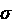

# 第三章：分析和可视化时间序列数据

在上一章中，我们学习了如何获取时间序列数据集，以及如何使用 pandas 操作时间序列数据、处理缺失值等。现在我们已经获得了处理过的时间序列数据，是时候理解数据集了，数据科学家将此过程称为**探索性数据分析**（**EDA**）。这是一个数据科学家通过查看聚合统计信息、特征分布、可视化等，分析数据以发现其中的模式并在建模中加以利用的过程。在本章中，我们将探索几种分析时间序列数据集的方法，介绍一些专门为时间序列设计的技术，并回顾一些时间序列数据的可视化技术。

在本章中，我们将涵盖以下主题：

+   时间序列的组成部分

+   可视化时间序列数据

+   分解时间序列

+   检测和处理异常值

# 技术要求

你需要按照书中*前言*中的说明设置**Anaconda**环境，以便获得一个包含本书所需所有库和数据集的工作环境。任何额外的库将在运行笔记本时自动安装。

你需要运行`Chapter02`文件夹中的`02-Preprocessing_London_Smart_Meter_Dataset.ipynb`笔记本。

本章的代码可以在[`github.com/PacktPublishing/Modern-Time-Series-Forecasting-with-Python-2E/tree/main/notebooks/Chapter03`](https://github.com/PacktPublishing/Modern-Time-Series-Forecasting-with-Python-2E/tree/main/notebooks/Chapter03)找到。

# 时间序列的组成部分

在我们开始分析和可视化时间序列之前，我们需要了解时间序列的结构。任何时间序列都可以包含以下部分中的一些或全部内容：

+   趋势

+   季节性

+   周期性

+   不规则性

这些成分可以以不同的方式混合在一起，但两种最常见的假设方式是*加法模型*（*Y* = *趋势* + *季节性* + *周期性* + *不规则*）和*乘法模型*（*Y* = *趋势* * *季节性* * *周期性* * *不规则*），其中*Y*表示时间序列。

## 趋势成分

**趋势**是时间序列平均值的长期变化。它是时间序列沿特定方向平稳而稳定的运动。当时间序列向上移动时，我们称之为*上升或增长趋势*，而当它向下移动时，我们称之为*下降或减少趋势*。在撰写本文时，如果我们回顾特斯拉过去几年的收入，如下图所示，我们可以看到它在过去几年里一直在持续增长：


图 3.1：特斯拉的收入（以百万美元计）

观察前面的图表，我们可以说特斯拉的收入呈现增长趋势。趋势不需要是线性的，它也可以是非线性的。

## 季节性成分

当时间序列表现出规律的、重复的上下波动时，我们称之为**季节性**。例如，零售销售通常在节假日期间激增，尤其是在西方国家的圣诞节期间。类似地，热带地区的电力消费在夏季高峰，而寒冷地区则在冬季达到高峰。在这些例子中，你可以看到每年重复出现的特定上下波动模式。另一个例子是太阳黑子，如下图所示：


图 3.2：1749 到 2017 年的太阳黑子数量

如你所见，太阳黑子每 11 年达到一次高峰。

## 周期性成分

**周期性**成分常常与季节性混淆，但由于一个微妙的差异，它们是不同的。像季节性一样，周期性成分也表现出围绕趋势线的相似上下波动模式，但这个周期的时间并不是固定的，并且会有一定的变化。例如，经济衰退通常会在一个 10 年的周期内发生。然而，这种现象并非如时钟般准确；有时它可能在 10 年内发生一次，也可能更多或更少。

## 不规则成分

这个成分是从时间序列中去除趋势、季节性和周期性后的残余部分。传统上，这个成分被认为是*不可预测*的，也被称为*残差*、*误差项*，或*噪声项*。在常见的基于经典统计的模型中，任何“模型”的目标是捕捉其他所有成分，直到只剩下无法捕捉的非规律成分。

在现代机器学习中，我们并不认为这个成分完全不可预测。我们尝试通过使用外生变量来捕捉这个成分的一部分。例如，零售销售的非规律成分可能是由他们进行的不同促销活动来解释的。当我们有了这些附加信息后，这个“不可预测”的成分开始变得可以预测。但是，无论你向模型中添加多少额外的变量，总会有一些成分，它是无法简化的误差，依然被遗留下来。这部分时间序列是无法通过任何模型解释的，无论模型有多强大，或者你向模型中添加多少额外的信息。

现在我们知道了时间序列的不同成分，让我们看看如何可视化它们。

# 可视化时间序列数据

在*第二章*，*获取和处理时间序列数据*中，我们学习了如何准备数据模型，作为分析新数据集的第一步。如果准备数据模型像是接近你喜欢的人并进行首次接触，那么 EDA 就像是与这个人约会。此时，你拥有了数据集，正在试图了解它们，试图弄清楚它们的运作方式，喜欢和不喜欢什么，等等。

EDA（探索性数据分析）通常采用可视化技术来发现模式、识别异常、形成并验证假设等。花些时间理解你的数据集，在你试图从模型中榨取每一分性能时会帮助你很多。你可能会明白需要创建什么样的特征、应该应用哪种建模技术等。

本章将介绍几种适用于时间序列数据集的可视化技术。

**笔记本提醒**：

若要跟随完整的时间序列可视化代码，请使用 `Chapter03` 文件夹中的 `01-Visualizing_Time_Series.ipynb` 笔记本。

## 线图

这是最基本和常见的可视化方法，用于理解时间序列。我们只需将时间绘制在 *x* 轴上，将时间序列值绘制在 *y* 轴上。让我们看看如果我们绘制数据集中某个家庭的数据会是什么样子：


图 3.3：家庭 MAC000193 的线图

当你有一个变化较大的长期时间序列时，就像我们所拥有的，线图可能会显得有些混乱。获得时间序列的宏观趋势和变化的一种选择是绘制平滑版本的时间序列。让我们看看时间序列的滚动月平均值是什么样子：


图 3.4：家庭 MAC000193 的滚动月均能耗

现在我们可以更清楚地看到宏观模式。季节性很明显——该序列在冬季达到峰值，夏季则处于最低谷。如果你仔细思考，这也很有道理。我们在谈论的是伦敦，冬季因为低温和随之而来的取暖系统使用，能耗会更高。

例如，对于热带地区的家庭，模式可能会反转，能耗的峰值出现在夏季，当空调开始使用时。

线图的另一个用途是同时可视化两个或多个时间序列，并调查它们之间的相关性。在我们的例子中，试着将温度与能耗一起绘制，看看我们关于温度影响能耗的假设是否成立：


图 3.5：温度和能耗（底部的放大图）

在这里，我们可以看到能耗和温度之间在年度分辨率上的明显负相关。冬季在宏观上表现为更高的能耗。我们还可以看到与温度松散相关的日常模式，但这也许是因为其他因素，例如人们下班后回家等。

还有一些其他的可视化方法，更适合突出时间序列中的季节性。让我们来看看。

## 季节性图

**季节性图**与折线图非常相似，但关键的区别在于，*x*轴表示“季节”，*y*轴表示时间序列值，且不同的季节性周期使用不同的颜色或线型表示。例如，按月分辨率展示的年度季节性可以用月份表示在*x*轴上，并且用不同的颜色表示不同的年份。

让我们看看我们家庭的情况。这里，我们绘制了多年来的平均月度能源消耗：


图 3.6：按月分辨率绘制的季节性图

我们可以立即看到这种可视化的吸引力，因为它让我们能够轻松地看到季节性模式。我们可以看到，夏季的消费量下降，并且我们还可以看到这种情况在多个年份中始终如一。在我们拥有数据的这两年中，我们可以看到，2013 年 10 月的行为与 2012 年略有不同。也许还有其他因素可以帮助我们解释这一差异——比如温度呢？

我们也可以将季节性图与其他感兴趣的变量一起绘制，比如温度：


图 3.7：按月分辨率绘制的季节性图（能源消耗与温度对比）

注意到 10 月了吗？2013 年 10 月，气温持续较高长达一个月，因此能源消费模式与去年略有不同。

我们还可以在其他分辨率下绘制这些图形，比如按小时划分的季节性。我们所需要做的就是计算每个小时和每个月天数的平均消费量，并将它们绘制在*x*轴上显示小时数，使用不同的颜色表示每月的不同天数（*图 3.8*（上图））。但是，当季节性周期过多时，图形会变得杂乱无章。季节性图的一个替代方法是季节性箱型图。

## 季节性箱型图

我们可以将不同的季节性周期表示为箱型图（*图 3.8*（下图）），而不是用不同的颜色或线型绘制不同的季节性周期。这样可以立即清除图中的杂乱信息。通过这种表示方法，你还可以理解季节性周期之间的变动性：


图 3.8：按小时分辨率绘制的季节性图（上图）和季节性箱型图（下图）

在这里，我们可以看到这个分辨率下的季节性图像过于杂乱，难以分辨模式和跨季节周期的变化。然而，季节性箱型图提供了更多的信息。箱型中的水平线表示中位数，盒子表示**四分位数范围**（**IQR**），而标记的点是异常值。通过观察中位数，我们可以看到消费的高峰发生在上午 9 点之后。但从上午 9 点开始，变化性也变得更大。如果你为每周绘制单独的箱型图，比如说，你会发现周日的模式稍有不同（更多可视化内容请参考关联的笔记本）。

然而，还有一种可视化方法可以让你从两个维度检查这些模式。

## 日历热图

与其为每周的每一天绘制单独的箱型图或线图，不如将这些信息浓缩成一张图。这时，**日历热图**就派上用场了。热图可视化使用颜色渐变表示数据值，不同的颜色表示不同的强度或频率。日历热图使用矩形块中的着色单元格来表示信息。在矩形的两侧，我们可以看到两种不同粒度的时间单位，如月份和年份。在每个交点处，单元格的颜色根据该交点处时间序列的值进行着色。

让我们看看不同工作日的每小时平均能源消耗在日历热图中的表现（请参见颜色图像文件：[`packt.link/gbp/9781835883181`](https://packt.link/gbp/9781835883181)）：


图 3.9：能源消耗的日历热图

从右侧的颜色比例尺中，我们知道较浅的颜色表示较高的值。我们可以看到从周一到周六的高峰是相似的——也就是早上和晚上各一次。然而，周日的模式略有不同，全天的消费较高。

到目前为止，我们已经回顾了许多能够突显季节性的可视化。现在，让我们看看用于检查自相关的可视化方法。

## 自相关图

如果相关性表示两个变量之间线性关系的强度和方向，那么自相关则是时间序列中连续周期值之间的相关性。大多数时间序列对前一个周期的值有较强的依赖关系，而这也是我们将要看到的许多预测模型中的一个关键组成部分。

类似于 ARIMA（我们将在*第四章*，*设定强基准预测*中简要介绍）的方法是基于自相关的。因此，直观地展示并理解对前一时间步的依赖强度总是有帮助的。

这就是**自相关图**派上用场的地方。在这些图中，我们将不同的滞后（*t-1*、*t-2*、*t-3*等）放在* x *轴上，将*t*与不同滞后的相关性放在*y*轴上。除了自相关，我们还可以查看**部分自相关**，它与自相关非常相似，但有一个关键的不同点：部分自相关在展示相关性之前，会去除任何可能存在的间接相关性。让我们通过一个例子来理解这一点。如果*t*是当前时间步长，我们假设*t-1*与*t*有很强的相关性。那么根据这个逻辑，*t-2*会与*t-1*高度相关，由于这种相关性，*t*与*t-2*之间的自相关性会很高。然而，部分自相关纠正了这一点，并提取了这种相关性，它可以纯粹归因于*t-2*和*t*。

我们需要记住的一点是，自相关和部分自相关分析在时间序列平稳时效果最佳（我们将在*第六章*《时间序列预测的特征工程》中详细讨论平稳性）。

**最佳实践**：

有很多方法可以使一个序列变得平稳，但一个快速且简便的方法是使用季节性分解，并直接选择残差。它应该没有趋势和季节性，这些是时间序列中非平稳性的主要驱动因素。但正如我们在本书后面将看到的，这并不是将序列真正意义上使其平稳的万无一失的方法。

现在，让我们看看这些图表在我们家庭数据集中的表现（在使其平稳后）：


图 3.10：自相关和部分自相关图

在这里，我们可以看到第一个滞后（*t-1*）具有最大的影响，而且在部分自相关图中，它的影响迅速降到接近零。这意味着一天的能源消耗与前一天的能源消耗高度相关。

如果你之前见过这样的图表，你可能会看到图表上有一个包络线，显示置信区间，作为选择显著自相关的指南。虽然这是一个很好的经验法则，但这里没有包含，因为我不希望你将其作为规则。置信区间的相关性取决于一些假设（如正态性等），这些假设并不总是成立，尤其是在实际使用场景中。

通过这些，我们已经看到了时间序列的不同组成部分，并学习了如何可视化其中的一些。现在，让我们看看如何将一个时间序列分解为它的组成部分。

# 分解时间序列

季节性分解是将时间序列分解为其组成部分的过程——通常是趋势、季节性和残差。分解时间序列的一般方法如下：

1.  **去趋势化**：在这里，我们估算**趋势成分**（即时间序列中的平滑变化）并将其从时间序列中移除，从而得到**去趋势化的时间序列**。

1.  **去季节化**：在这里，我们从去趋势化的时间序列中估算季节性成分。去除季节性成分后，剩下的是残差。

让我们详细讨论一下它们。

## 去趋势化

**去趋势化**可以通过几种不同的方式进行。两种常用的方法是使用**移动平均**和**局部估计散点图平滑**（**LOESS**）**回归**。

### 移动平均

估算趋势的最简单方法之一是使用沿时间序列的移动平均。它可以看作是一个在时间序列上滑动的窗口，每一步记录窗口中所有值的平均值。这个移动平均是一个平滑的时间序列，有助于我们估算时间序列中的缓慢变化，即趋势。缺点是这种技术相当嘈杂。即使使用这种技术平滑时间序列，提取的趋势仍然不会是平滑的，它会带有噪声。理想情况下，噪声应当存在于残差中，而不是趋势中（参见*图 3.13*中的趋势线）。

### LOESS

**LOESS**算法，也称为*局部加权多项式回归*，是由比尔·克利夫兰（Bill Cleveland）在 70 年代至 90 年代间开发的。它是一种非参数方法，用于将平滑曲线拟合到噪声信号上。我们使用一个在时间序列中移动的序列变量作为自变量，将时间序列信号作为因变量。

对于每个序列变量中的值，算法使用最接近的点的一部分，并仅使用这些点进行加权回归，以估算平滑的趋势。这些加权回归中的权重是与当前点最接近的点。距离当前点越远，权重越小，最接近的点给予最高的权重。这为我们提供了一个非常有效的工具，用于建模时间序列中的平滑变化（趋势）（参见*图 3.14*中的趋势线）。

## 去季节化

季节性成分也可以通过几种不同的方式进行估算。最常见的两种方法是使用周期调整后的平均值或傅里叶级数。

### 周期调整后的平均值

这是一种相当简单的技术，我们通过取所有周期中各期的平均值来计算预期周期中的季节性指数。为了更清楚地说明这一点，我们来看一个月度时间序列，假设我们预期该时间序列具有年季节性。那么，起伏模式将在 12 个月内完成一个完整周期，或者季节性周期为 12。换句话说，时间序列中的每 12 个数据点具有相似的季节性成分。因此，我们取所有 1 月数据的平均值作为 1 月的周期调整平均值。同样，我们计算所有 12 个月的周期平均值。在整个过程结束时，我们得到 12 个周期平均值，还可以计算一个*平均*周期平均值。现在，我们可以通过从每个周期平均值中减去所有周期平均值的平均值（加法型）或将每个周期平均值除以所有周期平均值的平均值（乘法型）来将这些周期平均值转化为一个指数。

### 傅里叶级数

在 18 世纪末，数学家和物理学家约瑟夫·傅里叶在研究热流时，意识到了一个深刻的事实——*任何*周期性函数都可以分解为一系列简单的正弦波和余弦波。让我们稍微停下来思考一下。任何周期性函数，无论它的形状如何、是否有曲线，或者它如何围绕轴线剧烈振荡，都可以分解为一系列正弦波和余弦波。

**附加信息**：

对于数学较为敏感的人来说，原始理论提出将任何周期性函数分解为指数函数的积分。利用欧拉公式，，我们可以将其视为正弦波和余弦波的总和。*进一步阅读*部分包含了一些资源，如果你想更深入地探讨并了解相关概念，比如傅里叶变换。

正是这种特性，我们用它来从时间序列中提取季节性，因为季节性是一个周期性函数，而任何周期性函数都可以通过正弦波和余弦波的组合来近似。傅里叶级数的正弦-余弦形式如下：


这里，*S*[N] 是信号 *S* 的 *N* 项近似值。从理论上讲，当 *N* 趋近于无穷大时，所得近似值等于原始信号。*P* 是周期的最大长度。

我们可以使用这个傅里叶级数，或者从傅里叶级数中提取几个项，来建模我们的季节性。在我们的应用中，*P* 是我们试图建模的周期的最大长度。例如，对于月度数据的年度季节性，周期的最大长度 (*P*) 为 12。*x* 是一个从 *1* 到 *P* 的序数变量。在这个例子中，*x* 将是 *1*, *2*, *3*, … *12*。现在，利用这些项，剩下的就是找到 *a*[n] 和 *b*[n]，我们可以通过对信号进行回归来完成这个过程。

我们已经看到，通过适当组合傅里叶项，我们可以复制任何信号。但问题是，我们是否应该这么做？我们希望从数据中学到的是一个通用的季节性特征，这个特征在未见过的数据上也能表现良好。因此，我们使用 *N* 作为超参数，从数据中提取我们所需的复杂信号。

现在是复习三角函数的好时机，回想一下正弦波和余弦波的形态。第一个傅里叶项 (*n=1*) 就是你熟悉的正弦波和余弦波，它们在最大周期长度 (*P*) 内完成一个完整的周期。随着 n 的增加，我们得到的正弦波和余弦波将在最大周期长度 (*P*) 内完成多个周期。下图中可以看到这一点：


图 3.11：余弦傅里叶项 (n = 1, 2, 3)

正弦波和余弦波是互为补充的，如下图所示：


图 3.12：正弦和余弦傅里叶项 (n = 1)

现在，让我们看看如何在实践中使用它。

## 实现方法

**笔记本提示**：

要跟随完整的时间序列分解代码，可以使用 `Chapter03` 文件夹中的 `02-Decomposing_Time_Series.ipynb` 笔记本。

这里我们将介绍四种实现方法，接下来的小节中将详细讲解。

### 来自 statsmodel 的 seasonal_decompose

`statsmodels.tsa.seasonal` 有一个名为 `seasonal_decompose` 的函数。这个实现使用移动平均来处理趋势成分，使用周期调整的平均值来处理季节性成分。它支持加法模式和乘法模式的分解。然而，它不能处理缺失值。让我们来看看如何使用它：

```py
#Does not support missing values, so using imputed ts instead
res = seasonal_decompose(ts, period=7*48, model="additive", extrapolate_trend="freq") 
```

一些需要记住的关键参数如下：

+   `period` 是你预期模式重复的季节周期。

+   `model` 需要一个 `additive` 或 `multiplicative` 的参数来确定分解类型。

+   `filt` 接受一个数组，作为移动平均（卷积，具体来说）的权重。它也可以用来定义计算移动平均所需的窗口。我们可以增加窗口大小，以在一定程度上平滑趋势成分。

+   `extrapolate_trend` 是一个参数，我们可以用它将趋势成分扩展到两侧，以避免在应用移动平均滤波器时生成的缺失值。

+   `two_sided` 是一个参数，允许我们定义如何计算移动平均。如果设置为 `True`（默认值），则移动平均是基于过去和未来的值计算的，因为移动平均的窗口是居中的。如果设置为 `False`，则只使用过去的值来计算移动平均。

让我们看看我们如何能够分解数据集中一个时间序列。我们使用 `period=7*48` 来捕捉工作日的小时数据轮廓，并使用 `filt=np.repeat(1/(30*48), 30*48)` 对 30 天内的数据进行均匀权重的移动平均：


图 3.13：使用 statsmodels 进行季节性分解

我们看不到季节性模式，因为它在整个图表的尺度下太小了。相关的笔记本有放大的图表，帮助你理解季节性模式。即使使用较大的平滑窗口（例如 20 天），趋势仍然有一些噪音。我们可能通过增加窗口来进一步减少这些噪音，但现在有一个更好的选择，我们马上就会看到。

### 使用 LOESS 进行季节性和趋势分解（STL）

正如我们之前看到的，LOESS 更适合用于趋势估计。**STL** 是一种使用 LOESS 进行趋势估计，使用周期平均值进行季节性分解的实现。尽管 `statsmodels` 已经有一个实现，我们重新实现了它，以获得更好的性能和灵活性。

该实现可以在本书的 GitHub 仓库中的 `src.decomposition.seasonal.py` 找到。它期望输入一个带有日期时间索引的 `pandas` DataFrame 或系列。让我们看看如何使用这个：

```py
stl = STL(seasonality_period=7*48, model = "additive")
res_new = stl.fit(ts_df.energy_consumption) 
```

这里的关键参数如下：

+   `seasonality_period` 是你期望模式重复的季节性周期。

+   `model` 以 `additive` 或 `multiplicative` 作为参数来确定分解类型。

+   `lo_frac` 是用于拟合 LOESS 回归的样本数据的比例。

+   `lo_delta` 是在其中使用线性插值而非加权回归的距离比例。使用非零的 `lo_delta` 会显著减少计算时间。

让我们看看这个分解的效果。这里，我们使用了 `seasonality_period=7*48` 来捕捉工作日小时模式：


图 3.14：STL 分解

让我们也看看只针对一个月的分解，看看提取的季节性模式更清晰：


图 3.15：STL 分解（放大查看一个月）

现在趋势已经足够平滑，季节性也已被捕捉到。这里，我们可以清楚地看到每小时的峰谷变化，并且周末的峰值较高。然而，由于我们依赖于周期平均值来推导季节性，它也会受到异常值的很大影响。时间序列中的一些极高或极低的值会扭曲从周期平均值推导出的季节性模式。这种技术的另一个缺点是，当数据分辨率与预期的季节性周期之间的差异较大时，提取的季节性的“好坏”会受到影响。例如，在日数据或子日数据上提取年度季节性时，这将使提取的季节性非常嘈杂。如果你期望的季节性周期少于两个周期，这种技术也不适用——例如，如果我们想提取年度季节性，但我们只有不到 2 年的数据。

### 傅里叶分解

我们可以在`src.decomposition.seasonal.py`中找到使用傅里叶项分解时间序列的 Python 实现。它使用 LOESS 进行趋势检测，并使用傅里叶项提取季节性。我们可以通过两种方式使用它。首先，我们可以指定`seasonality_period`为`pandas`的日期时间属性（例如`hour`和 week_of_day）：

```py
stl = FourierDecomposition(seasonality_period="hour", model = "additive", n_fourier_terms=5)
res_new = stl.fit(pd.Series(ts.squeeze(), index=ts_df.index)) 
```

或者，我们可以创建一个与时间序列长度相同的自定义季节性数组，该数组具有季节性的序数表示。如果是日数据的年度季节性，则该数组的最小值为`1`，最大值为`365`，因为它每天增加 1：

```py
#Making a custom seasonality term
ts_df["dayofweek"] = ts_df.index.dayofweek
ts_df["hour"] = ts_df.index.hour
#Creating a sorted unique combination df
map_df = ts_df[["dayofweek","hour"]].drop_duplicates().sort_values(["dayofweek", "hour"])
# Assigning an ordinal variable to capture the order
map_df["map"] = np.arange(1, len(map_df)+1)
# mapping the ordinal mapping back to the original df and getting the seasonality array
seasonality = ts_df.merge(map_df, on=["dayofweek","hour"], how='left', validate="many_to_one")['map']
stl = FourierDecomposition(model = "additive", n_fourier_terms=50)
res_new = stl.fit(pd.Series(ts, index=ts_df.index), seasonality=seasonality) 
```

参与此过程的关键参数如下：

+   `seasonality_period` 是从*日期时间索引*中提取的季节性。可以使用`pandas`的日期时间属性，如`week_of_day`和`month`，来指定最显著的季节性。如果设置为`None`，则在调用`fit`时需要提供季节性数组。

+   `model` 接受`additive`或`multiplicative`作为参数来确定分解类型。

+   `n_fourier_terms` 确定用于提取季节性的傅里叶项的数量。增加该参数时，从数据中提取的季节性会变得更加复杂。

+   `lo_frac` 是用于拟合 LOESS 回归的数据比例。

+   `lo_delta` 是我们使用线性插值而不是加权回归的距离比例。使用非零的`lo_delta`显著减少计算时间。

让我们看看使用`FourierDecomposition`进行分解的放大图：


图 3.16：使用傅里叶项的分解（放大显示一个月的情况）

趋势将与 STL 方法相同，因为我们这里也使用了 LOESS。季节性轮廓可能略有不同，并且对异常值具有鲁棒性，因为我们使用傅里叶项对信号进行正则化回归。另一个优势是，我们已经解耦了数据分辨率和预期季节性。现在，在子日数据上提取年度季节性不再像使用周期平均值时那样具有挑战性。

到目前为止，我们只看到了每个序列提取一个季节性的技术；通常，我们提取的是主要的季节性。那么，当我们有多个季节性模式时，应该怎么办呢？

### 使用 LOESS 进行多季节性分解（MSTL）

高频数据（如日数据或小时数据）的时间序列往往会表现出多种季节性模式。例如，可能会有小时季节性模式、周季节性模式和年季节性模式。但如果我们只提取主要模式，而将其余的部分留给残差，我们就没有充分做到分解。Kasun Bandara 等人提出了一种扩展的 STL 分解方法，用于多重季节性，称为 **MSTL**，并且在 R 生态系统中有相应的实现。Python 中有一个非常相似的实现，可以在 `src.decomposition.seasonal.py` 中找到。除了 MSTL，实施中还使用傅里叶项提取多重季节性。

**参考检查**：

Kasun Bandara 等人的研究论文在 *参考文献* 部分被引用为参考文献 *1*。

让我们来看一个如何使用它的例子：

```py
stl = MultiSeasonalDecomposition(seasonal_model="fourier",seasonality_periods=["day_of_year", "day_of_week", "hour"], model = "additive", n_fourier_terms=10)
res_new = stl.fit(pd.Series(ts, index=ts_df.index)) 
```

这里的关键参数如下：

+   `seasonality_periods` 是预期季节性的列表。对于 `stl`，它是季节周期的列表，而对于 `FourierDecomposition`，它是表示 `pandas` 日期时间属性的字符串列表。

+   `seasonality_model` 采用 `fourier` 或 `averages` 作为参数来确定季节性分解类型。

+   `model` 采用 `additive` 或 `multiplicative` 作为参数来确定分解类型。

+   `n_fourier_terms` 决定了提取季节性时使用的傅里叶项数。随着该参数的增大，从数据中提取的季节性会变得更加复杂。

+   `lo_frac` 是用于拟合 LOESS 回归的数据比例。

+   `lo_delta` 是我们使用线性插值而不是加权回归的区间距离。使用非零的 `lo_delta` 可以显著减少计算时间。

让我们看看使用傅里叶分解时，分解结果是什么样的：


图 3.17：使用傅里叶项进行的多重季节性分解

在这里，我们可以看到 `day_of_week`（星期几）季节性已经被提取出来。为了查看 `day_of_week` 和 `hour`（小时）季节性成分，我们需要稍微放大一下：


图 3.18：使用傅里叶项进行的多重季节性分解（放大显示一个月的数据）

在这里，我们可以观察到 `hour`（小时）季节性已经被很好地提取，并且它还隔离了 `day_of_week`（星期几）季节性成分，该成分在周末达到峰值。`day_of_week` 季节性成分的 **离散步骤** 特性是由于数据的频率是半小时一次，对于 48 个数据点，`day_of_week` 会是相同的。

我们已经在下表中总结了我们所涵盖的四种技术：

| **实现** | **趋势** | **季节性** | **支持多重季节性？** | **支持缺失值？** |
| --- | --- | --- | --- | --- |
| 季节性分解 | 移动平均 | 周期调整平均值 | 否 | 否 |
| STL | LOESS | 周期调整平均值 | 否 | 是 |
| 傅里叶分解 | LOESS | 傅里叶项 | 否 | 否 |
| 多重季节性分解 | LOESS | 周期调整平均值 / 傅里叶项 | 是 | 否 |

表 3.1：不同的季节性分解技术

MSTL 也已在 statsmodels 中实现，并且随附的笔记本中有相应的代码。statsmodels 与本书中代码实现的关键区别在于，本书中的实现还提供了使用基于傅里叶级数分解的选项。

现在，让我们理解并分析一个时间序列数据集。

# 检测和处理异常值

**异常值**，顾名思义，是指那些与其他观测值距离异常的观测值。如果我们将**数据生成过程**（**DGP**）视为生成时间序列的随机过程，那么异常值就是那些从 DGP 生成的概率最小的点。这可能有许多原因，包括测量设备故障、数据录入错误和黑天鹅事件等等。能够检测到这样的异常值并*处理*它们，可能有助于你的预测模型更好地理解数据。

异常值/异常检测本身就是时间序列中的一个专业领域，但在本书中，我们将限制在一些简单的异常值识别和处理技术上。原因是我们的主要目的是清理数据，以便预测模型能够更好地执行，而不是检测异常值。如果你想了解更多关于异常检测的内容，可以前往*进一步阅读*部分，找到一些入门资源。

现在，让我们看一下几种识别异常值的技术。

**笔记本提醒**：

要跟随完整的异常值检测代码，请使用`Chapter03`文件夹中的`03-Outlier_Detection.ipynb`笔记本。

## 标准差

这是一个经验法则，几乎每个有过一段时间数据处理经验的人都听说过——如果是时间序列的均值，是标准差，那么任何超出的值都可以视为**异常值**。其背后的理论深深植根于统计学。如果我们假设时间序列的值遵循正态分布（这是一种具有非常理想性质的对称分布），通过概率论，我们可以推导出正态分布下 68%的区域位于均值的一个标准差范围内，约 95%的区域位于两个标准差范围内，约 99%的区域位于三个标准差范围内。因此，当我们将界限设为三个标准差（使用经验法则）时，我们的意思是，如果任何观测值属于概率分布的概率低于 1%，那么它们就是异常值。

稍微转向更实际的问题，三倍标准差的截断值并非不可改变。我们需要尝试不同的倍数值，并通过主观评估所得到的结果来确定合适的倍数。倍数越高，异常值越少。

对于高度季节性的数据，直接将规则应用于原始时间序列是行不通的。在这种情况下，我们必须使用之前讨论的任一方法来去季节化数据，然后再应用异常值检测于残差。如果不这样做，可能会错误地将季节性峰值标记为异常值，这正是我们不希望发生的情况。

这里的另一个关键假设是正态分布。然而，实际上，我们遇到的许多时间序列数据可能并不是正态分布的，因此此规则的理论保证会迅速失效。

## IQR

另一种非常相似的技术是使用 IQR（四分位距）代替标准差来定义超出范围的观测值，从而标记为异常值。分位数将所有数据按顺序排列，然后将其分成相等的部分，使每部分包含相同数量的项目。四分位数也做同样的事，但特定地将数据分成四等份。IQR 是第三四分位数（即第 75 百分位或 0.75 分位数）与第一四分位数（即第 25 百分位或 0.25 分位数）之间的差值。上下界限定义如下：

+   *上界 = Q3 + n x IQR*

+   *下界 = Q1 - n x IQR*

这里，*IQR* = *Q3*-*Q2*，*n*是 IQR 的倍数，用于确定可接受区域的宽度。

对于那些异常值出现频繁且波动剧烈的数据集，这种方法比标准差稍微更稳健。这是因为标准差和均值会受到数据集中单个点的强烈影响。如果  是之前方法中的经验法则，那么这里则是 IQR 的 1.5 倍。这也与相同的正态分布假设相关，IQR 的 1.5 倍大约等于 ~  （精确来说是 ）。在应用规则之前去季节化的数据问题同样适用，这对我们接下来会看到的所有技术都适用。

## 隔离森林

**Isolation Forest** 是一种基于决策树的无监督异常检测算法。典型的异常检测算法会建模*正常*点，并将不符合*正常*的点视为异常值。然而，Isolation Forest 采用了不同的方式，直接建模异常值。它通过随机划分特征空间来创建决策树的森林。该技术假设异常值位于外部边缘，且更容易进入树的叶节点。因此，你可以在短枝上找到异常值，而正常点则由于靠得更近需要更长的枝条。任何点的“异常评分”由达到该点之前需要遍历的树的深度来决定。scikit-learn 提供了该算法的实现，位于 `sklearn.ensemble.IsolationForest`。除了决策树的标准参数外，关键参数是污染度。默认设置为`auto`，但可以设置为`0`到`0.5`之间的任何值。该参数指定你预计数据集中多少百分比的数据是异常的。

但是我们必须记住的一点是，`IsolationForest` 完全不考虑时间因素，只会突出显示*异常值*。

## 极端学生化偏差（ESD）和季节性 ESD（S-ESD）

这种基于统计的技术比基础的  技术更复杂，但仍然使用相同的正态性假设。它基于另一种统计测试，叫做 Grubbs 检验，用于在正态分布的数据集中找到*单个异常值*。ESD 通过逐步识别和移除异常值来迭代使用 Grubbs 检验。它还根据剩余点的数量调整临界值。要更详细地了解该测试，请参见*进一步阅读*部分，在那里我们提供了一些关于 ESD 和 S-ESD 的资源。2017 年，Twitter Research 的 Hochenbaum 等人提出使用去季节化的广义 ESD 作为时间序列异常值检测的方法。

我们已经根据自己的使用案例调整了该算法的现有实现，并且它可以在本书的 GitHub 仓库中找到。虽然其他所有方法都需要用户通过调整几个参数来确定异常值的适当级别，但 S-ESD 只需输入预期异常值的上限，然后独立地识别异常值。例如，我们将上限设置为 800，算法在我们使用的数据中识别出了大约 400 个异常值。

**参考检查：**

Hochenbaum 等人的研究论文在*参考文献*部分作为参考文献*2*被引用。

让我们看看我们回顾的所有技术是如何检测异常值的：


图 3.19：使用不同技术检测到的异常值

现在我们已经学会了如何检测异常值，让我们来谈谈如何处理这些异常值并清理数据集。

## 处理异常值

我们必须回答的第一个问题是，是否应该修正我们识别出的异常值。自动识别异常值的统计检验应该通过另一个层级的人工验证。如果我们盲目地“处理”异常值，可能会剪切掉一个有价值的模式，而这个模式可能有助于我们预测时间序列。如果你只预测少量时间序列，那么查看异常值并通过分析异常值的原因来将其与现实相结合仍然是有意义的。

但当你拥有数千个时间序列时，人工无法检查所有的异常值，因此我们将不得不求助于自动化技术。一个常见做法是将异常值替换为启发式方法，如最大值、最小值和第 75 百分位数。更好的方法是将异常值视为缺失数据，并使用我们之前讨论的任何技术来填补这些异常值。

我们必须记住的一点是，异常值修正不是预测中的必要步骤，特别是在使用现代方法，如机器学习或深度学习时。我们是否进行异常值修正是需要实验并加以验证的。

做得好！这一章内容较为繁忙，涉及了许多概念和代码，所以祝贺你完成了这一章。你可以根据需要回头复习一些主题。

# 总结

在本章中，我们学习了时间序列的关键组成部分，并熟悉了趋势和季节性等术语。我们还复习了几种时间序列特有的可视化技术，这些技术将在探索性数据分析（EDA）过程中派上用场。然后，我们学习了可以将时间序列分解为其组成部分的技术，并看到了检测数据中异常值的技术。最后，我们学习了如何处理已识别的异常值。现在，你已经准备好开始预测时间序列了，这将在下一章开始。

# 参考文献

以下是本章的参考资料：

1.  Kasun Bandara、Rob J Hyndman 和 Christoph Bergmeir。（2021）。*MSTL：一种用于具有多重季节性模式时间序列的季节趋势分解算法*。arXiv:2107.13462 [stat.AP]。[`arxiv.org/abs/2107.13462`](https://arxiv.org/abs/2107.13462)。

1.  Hochenbaum, J., Vallis, O., & Kejariwal, A.（2017）。*通过统计学习实现云中的自动异常检测*。ArXiv，abs/1704.07706。[`arxiv.org/abs/1704.07706`](https://arxiv.org/abs/1704.07706)。

# 进一步阅读

要了解更多关于本章涉及的主题，请查看以下资源：

+   傅里叶级数：[`www.setzeus.com/public-blog-post/the-fourier-series`](https://www.setzeus.com/public-blog-post/the-fourier-series)

+   Khan Academy 的傅里叶级数：[`www.youtube.com/watch?v=UKHBWzoOKsY`](https://www.youtube.com/watch?v=UKHBWzoOKsY)

+   傅里叶变换：[`betterexplained.com/articles/an-interactive-guide-to-the-fourier-transform/`](https://betterexplained.com/articles/an-interactive-guide-to-the-fourier-transform/)

+   Ane Blázquez-García, Angel Conde, Usue Mori, 和 Jose A. Lozano. (2021). *时间序列数据中的离群点/异常检测综述*。arXiv:2002.04236\. [`arxiv.org/abs/2002.04236`](https://arxiv.org/abs/2002.04236)

+   Braei, M., & Wagner, S. (2020). *单变量时间序列中的异常检测：最新技术综述*。ArXiv, abs/2004.00433\. [`arxiv.org/abs/2004.00433`](https://arxiv.org/abs/2004.00433)

+   离群点的广义 ESD 检验：[`www.itl.nist.gov/div898/handbook/eda/section3/eda35h3.htm`](https://www.itl.nist.gov/div898/handbook/eda/section3/eda35h3.htm)

# 加入我们在 Discord 上的社区

加入我们社区的 Discord 空间，与作者和其他读者进行讨论：

[`packt.link/mts`](https://packt.link/mts)


# 留下评论！

感谢您购买这本书，我们希望您喜欢！您的反馈对我们至关重要，能帮助我们改进和成长。阅读完后，请花一点时间在亚马逊上留下评论；这只需要一分钟，但对像您这样的读者来说意义重大。

扫描二维码或访问链接以获得您选择的免费电子书。

`packt.link/NzOWQ`


