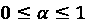
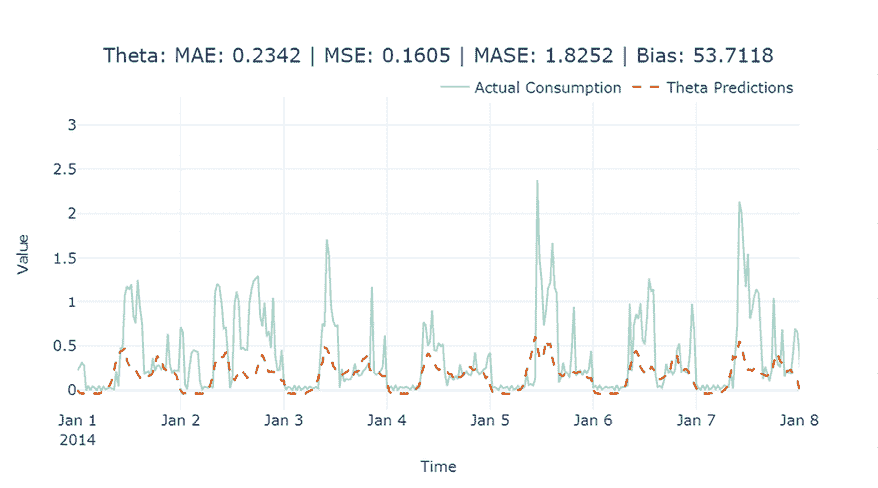
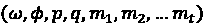
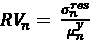
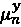
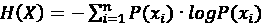

# 第四章：设置强基线预测

在上一章中，我们介绍了一些可以用来理解**时间序列数据**、进行**探索性数据分析**（**EDA**）等技术。但现在，让我们进入重点——**时间序列预测**。理解数据集、观察模式、季节性等，目的是为了让预测这个序列的工作变得更容易。像任何机器学习任务一样，我们在进一步操作之前需要首先建立一个**基线**。

基线是一个简单的模型，它能提供合理的结果，而且不需要花费大量时间来得出这些结果。许多人认为基线是由常识推导出来的，例如平均值或某些经验法则。但作为最佳实践，基线可以是我们想要的任何复杂度，只要它能够快速且容易地实现。我们想要取得的任何进一步进展，都会基于这个基线的性能。

本章中，我们将介绍一些可以作为基线使用的经典技术，并且这些基线非常强大。有人可能认为我们将在本章讨论的预测技术不应作为基线，但我们将它们保留在这里，因为这些技术经受住了时间的考验——这有充分的理由。它们也非常成熟，并且可以轻松应用，得益于实现这些技术的开源库。在许多类型的问题或数据集中，可能很难超越我们将在本章讨论的基线技术，而在这些情况下，依赖这些基线技术并不羞耻。

在本章中，我们将涵盖以下主题：

+   设置测试框架

+   生成强基线预测

+   评估时间序列的可预测性

# 技术要求

你需要按照本书*前言*中的说明，设置 Anaconda 环境，以便获得一个包含本书代码所需的所有库和数据集的工作环境。在运行笔记本时，任何额外的库将被安装。

在使用本章代码之前，你需要先运行以下笔记本：

+   `Chapter02`中的`02-Preprocessing_London_Smart_Meter_Dataset.ipynb`预处理笔记本

本章的代码可以在[`github.com/PacktPublishing/Modern-Time-Series-Forecasting-with-Python-2E/tree/main/notebooks/Chapter04`](https://github.com/PacktPublishing/Modern-Time-Series-Forecasting-with-Python-2E/tree/main/notebooks/Chapter04)找到。

# 设置测试框架

在开始进行预测和设置基准之前，我们需要设置一个**测试工具**。在软件测试中，测试工具是一个由代码和输入组成的集合，旨在在不同情况下测试程序。在机器学习中，测试工具是一组代码和数据，用于评估算法。设置测试工具非常重要，这样我们就可以以标准且快捷的方式评估未来的所有算法。

我们首先需要的是**留出（测试）**和**验证**数据集。

## 创建留出（测试）和验证数据集

作为机器学习中的标准做法，我们将数据集分为两个部分，命名为*验证数据*和*测试数据*，并且完全不用于训练模型。验证数据用于建模过程，用来评估模型的质量。为了选择不同的模型类、调优超参数、执行特征选择等，我们需要一个数据集。测试数据则是你所选择模型的最终测试，它告诉你模型在未见过的数据上表现如何。如果验证数据像期中考试，那么测试数据就像期末考试。

在常规的回归或分类中，我们通常会随机抽取一些记录并将其保留下来。但在处理时间序列时，我们需要尊重数据集的时间特性。因此，一个最佳实践是将数据集的最新部分作为测试数据。另一个经验法则是将验证数据集和测试数据集设置为相同大小，以便我们基于验证数据所做的关键建模决策尽可能接近测试数据。我们在*第二章*《获取和处理时间序列数据》中介绍的数据集——伦敦智能能源数据集，包含了 2011 年 11 月到 2014 年 2 月期间伦敦家庭的能源消耗读数。因此，我们将把 2014 年 1 月作为验证数据，2014 年 2 月作为测试数据。

让我们打开`01-Setting_up_Experiment_Harness.ipynb`文件（位于`Chapter04`文件夹中）并运行它。在笔记本中，我们必须在填补缺失值之前和之后，使用`SeasonalInterpolation`进行训练-测试拆分，并相应地保存它们。运行完成后，你将在预处理文件夹中创建以下文件，并将 2014 年的数据单独保存：

+   `selected_blocks_train.parquet`

+   `selected_blocks_val.parquet`

+   `selected_blocks_test.parquet`

+   `selected_blocks_train_missing_imputed.parquet`

+   `selected_blocks_val_missing_imputed.parquet`

+   `selected_blocks_test_missing_imputed.parquet`

现在我们有了一个固定的数据集，可以用来公平地评估多个算法，我们需要一种方法来评估不同的预测结果。

## 选择评估指标

在机器学习中，我们有一些可以用来衡量连续输出的指标，主要是**平均绝对误差**和**均方误差**。但在时间序列预测领域，有大量的指标，而且没有真正达成共识来决定应该使用哪些指标。造成这种众多指标的原因之一是没有一个指标可以衡量预测的所有特性。因此，我们专门为这个话题编写了整整一章（*第十九章*，*评估预测误差——预测指标调查*）。现在，我们只是回顾几个我们将用于衡量预测的指标。我们将按字面意思进行考虑：

+   **平均绝对误差** (**MAE**)：MAE 是一个非常简单的指标。它是预测值在时间步* t *（*f*[t]）与观察值在时间*t*（*y*[t]）之间无符号（忽略符号）的误差的平均值。公式如下：


这里，*N*是时间序列的数量，*L*是时间序列的长度（在本例中为测试期的长度），*f*和*y*分别是预测值和观察值。

+   **均方误差** (**MSE**)：MSE 是预测值（*f*[t]）和观察值（*y*[t]）之间的平方误差的平均值：


+   **平均绝对缩放误差** (**MASE**)：MASE 比 MSE 和 MAE 稍微复杂一些，但它能提供一个稍微更好的度量，克服前两者依赖规模的性质。如果我们有多个时间序列，其平均值不同，MAE 和 MSE 会对高值时间序列显示较高的误差，而低值时间序列则相对较低。MASE 通过基于**朴素预测方法**（这是最基础的一种预测方法，我们将在本章稍后进行回顾）中的样本内 MAE 来缩放误差，从而克服了这一点。直观地说，MASE 给出了我们的预测比朴素预测更好的程度：


+   **预测偏差** (**FB**)：这是一个与我们看到的其他指标略有不同的度量。虽然其他指标有助于评估预测的*正确性*，不考虑误差的方向，预测偏差让我们了解模型的整体*偏差*。预测偏差有助于我们理解预测是否持续存在过度预测或不足预测的情况。

我们通过预测值总和与观察值总和之间的差异来计算预测偏差，并表示为所有实际值总和的百分比：


现在，我们的测试工具已经准备好了。我们也知道如何评估和比较在单一固定的保留数据集上，通过不同模型生成的预测结果，并使用一组预定的指标进行比较。现在，到了开始进行预测的时候了。

# 生成强基准预测

**时间序列预测**自 1920 年代初期以来就已存在，并且多年来，许多杰出的人物提出了不同的模型，既有统计模型，也有启发式模型。我将它们统称为**经典统计模型**或**计量经济学模型**，尽管它们并不完全是统计/计量经济学模型。

在这一部分，我们将回顾一些模型，这些模型在我们尝试现代预测技术时可以作为强有力的基准。作为练习，我们将使用一个出色的开源时间序列预测库——NIXTLA（[`github.com/Nixtla`](https://github.com/Nixtla)）。`02-Baseline_Forecasts_using_NIXTLA.ipynb` 笔记本包含了本部分的代码，方便你跟随学习。

在我们开始了解预测技术之前，让我们快速了解如何使用 NIXTLA 库来生成预测。我们将从数据集中选择一个消费者，并在验证数据集上逐一尝试所有的基准技术。

我们需要做的第一件事是使用每个客户的唯一 ID（`LCLid` 列，来自扩展数据）选择我们想要的消费者，并将时间戳设置为 DataFrame 的索引：

```py
ts_train = train_df.loc[train_df.LCLid=="MAC000193",['LCLid',"timestamp","energy_consumption"]]
ts_val = val_df.loc[val_df.LCLid=="MAC000193", ['LCLid',"timestamp","energy_consumption"]]
ts_test = test_df.loc[test_df.LCLid=="MAC000193", ['LCLid',"timestamp","energy_consumption"]] 
```

NIXTLA 具有灵活性，可以直接与 pandas 或 Polars DataFrame 一起使用。默认情况下，NIXTLA 查找三个列：

+   `id_col`：默认情况下，它期望一个名为 `unique_id` 的列。这个列唯一标识时间序列。如果你只有一个时间序列，请添加一个具有相同唯一标识符的虚拟列。

+   `time_col`：默认情况下，它期望一个名为 `ds` 的列。这是你的时间戳列。

+   `target_col`：默认情况下，它期望一个名为 `y` 的列。这个列是你希望 NIXTLA 进行预测的目标。

这非常方便，因为无需进一步操作即可从数据到建模。NIXTLA 遵循 scikit-learn 风格，使用 `.fit()` 和 `.predict()`，并且还采用了 `.forecast()` 方法，这是一个内存高效的方法，不会存储部分模型输出，而 scikit-learn 接口会存储拟合的模型：

```py
sf = StatsForecast(
    models=[model],
    freq=freq,
    n_jobs=-1,
    fallback_model=Naive()
)
sf.fit(df = _ts_train,          id_col = 'LCLid',
       time_col = 'timestamp',
       target_col = 'energy_consumption',
)
baseline_test_pred_df = sf.predict(len(ts_test) ) 
```

NIXTLA 还提供了 `.forecast()` 方法，这是一个内存高效的方法，不会存储部分模型输出，而 scikit-learn 接口会存储拟合的模型：

```py
# Efficiently fit and predict without storing memory
y_pred = sf.forecast(
    h=len(ts_test),
    df=ts_train,
    id_col = 'LCLid',    time_col = 'timestamp',    target_col = 'energy_consumption',
) 
```

当我们调用 `.predict` **或** `.forecast` 时，我们必须告诉模型需要预测多久以后的数据。这被称为预测的时间范围（horizon）。在我们的案例中，我们需要预测测试期，我们可以通过获取 `ts_test` 数组的长度轻松实现这一点。

我们还可以使用 NIXTLA 的类轻松计算之前讨论的测试指标。为了更大的灵活性，我们可以循环遍历一个指标列表，为每个预测获取多个测量值：

```py
# Calculate metrics
metrics = [mase, mae, mse, rmse, smape, forecast_bias]
for metric in metrics:
    metric_name = metric.__name__
    if metric_name == 'mase':
        evaluation[metric_name] = 	
metric(results[target_col].values,            results[model_name].values,
ts_train[target_col].values, seasonality=48)
    else:
        evaluation[metric_name] =
metric(results[target_col].values,
results[model_name].values) 
```

注意，对于 MASE，训练集也包括在内。

为了方便实验，我们将所有这些内容封装到笔记本中的一个便捷函数`evaluate_performance`中。该函数返回预测结果和计算的指标，格式为 DataFrame。

现在，让我们开始看看一些非常简单的预测方法。

## 简单预测

简单预测是最简单的预测方法。它的预测结果就是时间序列中最后一个/最新的观测值。如果时间序列中最新的观测值是 10，那么未来所有时间点的预测值都是 10。我们可以使用 NIXTLA 中的`Naive`类来实现这一点：

```py
from statsforecast.models import Naive
models = Naive() 
```

一旦我们初始化了模型，就可以调用笔记本中的`evaluate_performance`函数，运行并记录预测结果和指标。

让我们可视化一下我们刚刚生成的预测结果：


图 4.1：简单预测

在这里，我们可以看到预测是一条直线，完全忽略了序列中的任何模式。这是迄今为止最简单的预测方法，因此它被称为简单预测。现在，让我们看另一种简单的方法。

## 移动平均预测

虽然简单预测记住了最新的过去，但它也记住了每个时间步的噪音。**移动平均预测**是另一种简单的方法，它试图克服简单预测方法的纯粹记忆化。它不是采用最新的观测值，而是采用最近*n*步的均值作为预测结果。移动平均并不是 NIXTLA 中现有的模型之一，但我们在本书的 GitHub 仓库中的`Chapter04`文件夹实现了一个与 NIXTLA 兼容的模型：

```py
from src.forecasting.baselines import NaiveMovingAverage
#Taking a moving average over 48 timesteps, i.e, one day
naive_model = NaiveMovingAverage(window=48) 
```

让我们看看我们生成的预测结果：


图 4.2：移动平均预测

这个预测几乎是一条直线。现在，让我们看另一种简单的方法，但它同时考虑了季节性因素。

## 季节性简单预测

**季节性简单预测**是在简单的简单预测方法基础上的一种变体。在简单预测方法中，我们采用了最后一个观测值（Y[t-1]），而在季节性简单预测中，我们采用了 Y[t-k]的观测值。所以，我们对于每个预测回顾了*k*步。这使得算法能够模拟上一季的季节性周期。例如，如果我们设置`k=48*7`，我们将能够模拟最新的季节性周周期。

该方法已在 NIXTLA 中实现，我们可以像这样使用它：

```py
from statsforecast.models import SeasonalNaive
seasonal_naive = SeasonalNaive(season_length=48*7) 
```

让我们看看这个预测结果是什么样子的：


图 4.3：季节性简单预测

在这里，我们可以看到预测正在尝试模拟季节性模式。然而，由于它盲目地遵循了上一个季节性周期，它并不非常准确。

现在我们已经了解了几种简单方法，让我们看看一些统计模型。

## 指数平滑

**指数平滑**是生成预测最流行的方法之一。自 20 世纪 50 年代末以来，它一直存在，并证明了其可靠性，经受住了时间的考验。ETS 有几种不同的变体——**单一指数平滑**、**双重指数平滑**、**霍尔特-温特季节性平滑**等等。但它们都有一个关键的思想，这些思想以不同的方式被使用。在朴素方法中，我们只是使用了最新的观察数据，这就像是说只有最新的历史数据点才重要，之前的数据点不重要。另一方面，移动平均法认为最后 n 个观察值同样重要，并取它们的平均值。

ETS 结合了这两种思路，并表示所有历史数据都很重要，但最近的历史数据更为重要。因此，预测是通过加权平均值生成的，其中权重随着我们向历史的深入而指数递减：


在这里，是平滑参数，决定了权重衰减的速度，*y*[t]是时间步长*t*时的实际值，*f*[t]是时间步长*t*时的预测值。

**简单指数平滑**（**SES**）是在历史数据上直接应用此平滑程序。这更适用于没有趋势或季节性的时间序列，且预测将是平坦的。预测是使用以下公式生成的：


**双指数平滑**（**DES**）将平滑思想扩展到趋势建模。它有两个平滑方程——一个用于水平，另一个用于趋势。一旦你得到了水平和趋势的估计值，就可以将它们结合起来。这个预测不一定是平坦的，因为估计的趋势被用来将其外推到未来。预测是根据以下公式生成的：


首先，我们使用*水平方程*结合可用的观察数据来估计水平(*l*[t])。然后，我们使用*趋势方程*来估计趋势。最后，为了得到预测，我们将*l*[t]和*b*[t]结合在一起，使用*预测方程*。

研究人员发现，经验证据表明，这种常数外推方法可能会导致长期预测中的过度预测。这是因为，在现实世界中，时间序列数据不会永远以恒定的速度增长。受到这一点的启发，已引入了一种附加方法，通过一个系数来减缓趋势，从而在时没有衰减，它与 DES 完全相同。

**三重指数平滑**或**Holt-Winters**（**HW**）通过包括另一个平滑项来建模季节性，进一步发展了这一方法。该方法有三个平滑参数（ 、 、 ），并使用季节性周期（*m*）作为输入参数。你还可以选择加法季节性或乘法季节性。加法模型的预测方程如下：


这些公式的使用与双指数平滑类似。不同的是，我们不仅估计水平和趋势，还会分别估计水平、趋势和季节性。

ETS 方法家族不仅限于我们刚刚讨论的三种方法。思考这些不同模型的一种方式是通过这些模型的趋势和季节性组件来进行分析。趋势可以是无趋势、加法趋势或加法衰减趋势。季节性可以是无季节性、加法季节性或乘法季节性。这些参数的每种组合在该家族中都是一种不同的技术，如下表所示：

| **趋势组件** | **季节性组件** |
| --- | --- |
|  | **N（无）** | **A（加法）** | **M（乘法）** |
| **N（无）** | 简单指数平滑 | - | - |
| **A（加法）** | 双指数平滑 | 加法 Holt-Winters | 乘法 Holt-Winters |
| **Ad（加法衰减）** | 衰减双指数平滑 | - | 衰减 Holt-Winters |

表 4.1：指数平滑家族

NIXTLA 拥有完整的 ETS 方法家族。

让我们看看如何在 NIXTLA 中初始化 ETS 模型：

```py
from statsforecast.models import (SimpleExponentialSmoothing, Holt, HoltWinters, AutoETS)
exp_smooth = HoltWinters(error_type = 'A', season_length = 48)] 
```

在这里，`error_type = 'A'` 表示加法误差。用户可以选择加法误差或乘法误差，后者可以通过 `error_type = 'M'` 来调用。NIXTLA 模型提供了使用 `AutoETS()` 的选项。该模型会自动选择最合适的指数平滑模型：简单指数平滑、双指数平滑（Holt 方法）或三重指数平滑（Holt-Winters 方法）。它还会为每个单独的时间序列选择最佳的参数和误差类型。有关如何使用 `AutoETS()` 的示例，请参考 GitHub 笔记本。

让我们来看一下使用 ETS 进行预测的结果，在*图 4.4*中：


图 4.4：指数平滑预测

该预测已捕捉到季节性，但未能捕捉到峰值。但我们已经可以看到 MAE 的改善。

现在，让我们来看看目前最受欢迎的预测方法之一。

## 自回归积分滑动平均（ARIMA）

**ARIMA** 模型是另一类方法，像 ETS 一样，它经受住了时间的考验，是最受欢迎的经典预测方法之一。ETS 方法家族以趋势和季节性为基础建模，而 ARIMA 则依赖于 **自相关**（*y*[t] 与 *y*[t][-1]、*y*[t][-2] 等的相关性）。

家族中最简单的模型是*AR*（*p*）模型，它使用**线性回归**与*p*个过去的时间步长，或者换句话说，就是*p*个滞后期。数学上可以写作：


其中，*c*是截距，且  是时间步长 *t* 时的噪声或误差。

家族中的下一个模型是*MA*（*q*）模型，在这种模型中，我们使用过去的* q *个误差（假设为纯白噪声）而不是过去观察到的值来进行预测：


这里， 是白噪声，*c*是截距。

这种模型通常不会单独使用，而是与*AR*（*p*）模型结合使用，因此接下来我们要讨论的就是*ARMA*（*p*，*q*）模型。ARMA（自回归滑动平均）模型定义为 *y*[t] = *AR*（*p*）+ *MA*（*q*）。

在所有的 ARIMA 模型中，有一个基本假设——*时间序列是平稳的*（我们在*第一章*《时间序列简介》中讨论过平稳性，并将在*第六章*《时间序列预测特征工程》中进一步阐述）。有许多方法可以使序列变得平稳，而对连续值进行差分就是其中一种技术。这被称为**差分**。有时，我们只需要进行一次差分，而其他时候，则必须进行多次差分，直到时间序列变为平稳。我们执行差分操作的次数被称为*差分阶数*。ARIMA 中的 I，作为谜题的最后一部分，代表*集成*。它定义了在时间序列变为平稳之前需要做的差分阶数，记作*d*。

所以，完整的*ARIMA*（*p*，*d*，*q*）模型表示我们进行*d*阶差分后，考虑自回归方式的最后*p*项，再包括最后*q*个滑动平均项来做出预测。

我们迄今讨论的 ARIMA 模型仅适用于非季节性时间序列。然而，使用我们讨论过的相同概念，只不过应用于季节性周期，我们就得到了**季节性 ARIMA**。*p*，*d*和*q*会略微调整，以便它们适应季节周期 *m*。为了与普通的*p*，*d*和*q*区分开来，我们将季节性的值称为*P*，*D*和*Q*。例如，如果*p*表示取最后*p*个滞后期，*P*则表示取最后*P*个季节性滞后期。如果*p*[1]是*y*[t][-1]，那么*P*[1]将是*y*[t][-m]。类似地，*D*表示季节性差分的阶数。

选择合适的 *p*、*d* 和 *q* 以及 *P*、*D* 和 *Q* 值并不是很直观，我们需要借助统计测试来确定它们。然而，当你需要预测多个时间序列时，这种方法就显得不太实际了。一种自动化的方式是通过不同参数的迭代来找到最佳的 *p*、*d* 和 *q*，以及 *P*、*D* 和 *Q* 值，这种方法被称为 **AutoARIMA**。在 Python 中，NIXTLA 实现了这个方法，即 `AutoARIMA()`。NIXTLA 还提供了普通的 ARIMA 实现，虽然它速度更快，但需要手动输入 *p*、*d* 和 *q* 值。

**实际考虑事项**：

尽管 ARIMA 和 AutoARIMA 在许多情况下可以提供表现良好的模型，但当你面对较长的季节性周期和长时间序列时，它们的计算速度可能会非常慢。在我们的案例中，历史数据接近 27K 个观测值，ARIMA 变得非常缓慢，并且占用大量内存。即使是对数据进行子集化处理，单次 AutoARIMA 拟合也需要大约 60 分钟。放弃季节性参数可以显著降低运行时间，但对于像能源消耗这样的季节性时间序列来说，这样做是没有意义的。AutoARIMA 包括了许多此类拟合过程来识别最佳参数，因此对于长时间序列数据集，它变得不切实际。Python 生态系统中的几乎所有实现都存在这个缺陷。NIXTLA 声称拥有比原始 R 方法更快、更准确的 AutoARIMA 版本。

让我们看看如何使用 NIXTLA 应用 `ARIMA` 和 `AutoARIMA`：

```py
from statsforecast.models import (ARIMA, AutoARIMA)
#ARIMA model by specifying parameters
arima_model = ARIMA(order = (2,1,1), seasonal_order = (1,1,1), season_length = 48)
#AutoARIMA model by specifying max limits for parameters and letting the algorithm find the best ones
auto_arima_model = AutoARIMA( max_p = 2, max_d=1, max_q = 2, max_P=2, max_D = 1, max_Q = 2, stepwise = True, season_length=48) 
```

要查看 `AutoARIMA` 所有参数的完整列表，请访问 NIXTLA 文档 [`nixtlaverse.nixtla.io/statsforecast/docs/models/autoarima.html`](https://nixtlaverse.nixtla.io/statsforecast/docs/models/autoarima.html)。

让我们看看我们实验的家庭在 ETS 和 ARIMA 预测下的结果：


图 4.5：ETS 和 ARIMA 预测

使用 NIXTLA，ETS 和 ARIMA 都很好地捕捉了季节性和峰值。由此产生的 MAE 分数也非常相似，分别为 0.191 和 0.203。现在，让我们看一下另一种方法——Theta 预测。

## Theta 预测

**Theta 预测** 是 2002 年 M3 预测竞赛中表现最好的提交方法。该方法依赖于一个参数，，根据所选值的不同，它会放大或平滑时间序列的局部曲率。使用 ，我们可以平滑或放大原始时间序列。这些平滑后的线条被称为 **Theta 线**。V. Assimakopoulos 和 K. Nikolopoulos 提出了这种方法，作为一种分解方法来进行预测。尽管理论上可以使用任意数量的 Theta 线，最初提出的方法使用了两条 Theta 线， 和 ，并取这两条 Theta 线的预测平均值作为最终预测值。

M 竞赛是由领先的预测研究人员 Spyros Makridakis 组织的预测竞赛。它们通常会策划一个时间序列数据集，设定用来评估预测结果的指标，并向全球的研究人员开放，目的是获得最好的预测结果。这些竞赛被认为是世界上最大和最受欢迎的时间序列预测竞赛。截至本文写作时，已经完成了六次此类竞赛。要了解最新竞赛的更多信息，请访问这个网站：[`mofc.unic.ac.cy/the-m6-competition/`](https://mofc.unic.ac.cy/the-m6-competition/)。

2002 年，Rob Hyndman 等人简化了 Theta 方法，并展示了我们可以使用带有漂移项的 ETS 来得到与原始 Theta 方法等效的结果，这也是今天大多数 Theta 方法实现所采用的方式。Theta 预测的主要步骤（在 NIXTLA 中实现）如下：

1.  **去季节化**：对时间序列应用经典的乘法分解，以去除季节性成分（如果存在）。这将分析集中在潜在的趋势和周期性成分上。去季节化通过`statsmodels.tsa.seasonal.seasonal_decompose`来完成。此步骤创建了一个新的去季节化时间序列。

1.  **Theta 系数应用**：使用系数  和  将去季节化的时间序列分解为两条“Theta”线。这些系数修改时间序列的第二差分，以减弱 () 或强调 () 局部波动。

1.  **Theta 线的外推**：将每条 Theta 线视为一个独立的序列，并将其预测到未来。这是通过对 Theta 线应用线性回归（其中 ）得到一条直线，对 Theta 线应用简单指数平滑（其中 ）完成的。

1.  **重组**：将两个 Theta 线的预测结果结合起来。原始方法对这两条线采用相等的权重，有效地整合了长期趋势和短期波动。

1.  **重新季节化**：如果数据在开始时已经去季节化，则进行重新季节化。

NIXTLA 有许多不同的 Theta 方法变体。有关 NIXTLA 实现的详细信息，请访问：[`nixtlaverse.nixtla.io/statsforecast/docs/models/autotheta.html`](https://nixtlaverse.nixtla.io/statsforecast/docs/models/autotheta.html)。

让我们看看如何在实际中使用它：

```py
theta_model = Theta(season_length =48, decomposition_type = 'additive' ) 
```

这里的关键参数如下：`season_length`和`decomposition_type`。这些参数用于初步季节分解。如果留空，系统会自动测试季节性并使用乘法分解自动去除季节性。若我们知道这些参数的值，建议使用我们的领域知识进行设置。分解类型可以是乘法（默认）或加法。

让我们使用 Theta 预测法可视化我们刚刚生成的预测：



图 4.6：Theta 预测

**参考检查**：

V. Assimakopoulos 和 K. Nikolopoulos 提出 Theta 方法的研究论文在*参考文献*部分被引用为参考文献*1*，而 Rob Hyndman 的后续简化方法则被引用为参考文献*2*。

季节性模式已被捕捉，但未能准确达到峰值。让我们看看另一种非常强大的方法——TBATS。

## TBATS

有时，时间序列有多个季节性模式或非整数季节周期，通常称为复杂季节性。例如，一个小时预测可能具有每日季节性（与一天中的时间有关）、每周季节性（与一周中的某天有关）以及每年季节性（与年份中的某一天有关）。此外，大多数时间序列模型是为较小的整数季节周期设计的，如每月（12）或每季度（4）数据，但年度季节性可能会带来问题，因为一年有 364.25 天。TBATS 旨在应对这些为许多预测模型带来问题的挑战。然而，任何自动化方法都有可能出现预测不准确的情况。

**TBATS**代表：

+   **T**rigonometric 季节性

+   **B**ox-Cox 变换

+   **A**RMA 误差

+   **T**rend

+   **S**easonal components

该模型首次由 Rob J. Hyndman、Alysha M. De Livera 和 Ralph D. Snyder 在 2011 年提出。还有另一种 TBATS 的变体，称为 BATS，去除了三角季节性成分。TBATS 属于状态空间模型家族。在状态空间预测模型中，观测到的时间序列被假定为底层状态变量与一个将状态变量与观测数据联系起来的测量方程的组合。状态变量捕捉了数据中的底层模式、趋势和关系。

BATS 有参数 ，表示 Box-Cox 参数、衰减参数、ARMA 参数（*p*，*q*）和季节周期（*m*[1]，*m*[2]，…，*m*[t]）。由于其灵活性，BATS 模型可以被视为一个模型家族，涵盖了我们之前看到的许多其他模型。例如：

+   *BATS*(1, 1, 0, 0, *m*[1]) = Holt-Winters 加性季节性

+   *BATS*(1, 1, 0, 0, *m*[2]) = Holt-Winters 加性双重季节性

BATS 具有多季节性的灵活性；然而，它仅限于基于整数的季节周期，并且在有多个季节性时，可能会有大量状态，导致模型复杂度增加。这正是 TBATS 要解决的问题。

参考，TBATS 参数空间为：


TBATS 的主要优点如下：

+   适用于单一、复杂和非整数季节性（三角季节性）

+   处理真实世界时间序列中常见的非线性模式（Box-Cox 变换）

+   处理残差中的自相关（自回归移动平均误差）

为了更好地理解 TBATS 的内部工作原理，让我们分解每个步骤。

使用 TBATS 时，操作执行的顺序（与缩写中的顺序不同）是：

1.  Box-Cox 变换

1.  指数平滑趋势

1.  使用傅里叶级数进行季节性分解（三角季节性）

1.  自回归移动平均 (ARMA)

1.  通过基于似然的方法进行参数估计

### Box-Cox 变换

Box-Cox 是幂变换家族中的一种变换。

在时间序列中，使数据平稳是预测前的重要步骤（如*第一章*中讨论）。平稳性确保我们的数据不会随时间发生统计变化，从而更准确地类似于概率分布。可以应用几种可能的变换。关于各种目标变换的更多细节，包括 Box-Cox，可在*第七章*中找到。

作为预览，这是 Box-Cox 变换的一个输出示例。经过变换后，我们的数据更接近正态分布。Box-Cox 变换只能用于正数数据，但在实践中，这通常是可以的。

*图 4.7* 显示了时间序列在 Box-Cox 变换前后的示例。


图 4.7：Box-Cox 变换

### 指数平滑趋势

使用 **局部估计散点图平滑** (**LOESS**)，从时间序列中提取平滑趋势：


LOESS 通过对数据点应用局部加权的低阶多项式回归，在数据点之间创建一条平滑的流线。这种技术在捕捉局部趋势变化方面非常有效，不假设数据的全局形式，这使得它对于具有变化趋势或季节性变化的数据特别有用。这就是我们在*第三章*中用来分解时间序列趋势的 LOESS。

### 使用傅里叶级数进行季节性分解（三角季节性）

然后使用傅里叶项（在*第三章*中讨论）对剩余的残差进行建模，以分解季节性成分。


使用傅里叶方法建模季节性的主要优点是能够建模多个季节性，以及非整数季节性，例如使用日数据的年季节性，因为一年有 364.25 天。大多数其他分解方法无法处理非整数周期，只能将其四舍五入为 365，这可能无法识别真实的季节性。以下是使用傅里叶方法分解的时间序列示例。此示例中的观察时间序列是按小时数据。因此，我们的季节性周期为：

*每日* = *24*

*每周* = *24* *** *7* = *168*

在这里，你可以清楚地看到定义的季节性模式、趋势和剩余残差。*图 4.8*展示了趋势和季节性的分解，之后残差通过 ARMA 过程进行建模。


图 4.8：分解后的时间序列

### ARMA

ARMA 前面已经讨论过，作为 ARIMA 家族的一个子集：


TBATS 中的 ARMA 模型用于建模剩余的残差，以捕捉滞后变量的自相关性。**自回归**（**AR**）组件捕捉观察值与若干滞后观察值之间的相关性。这涉及到序列的动量或延续性。**移动平均**（**MA**）组件将误差项建模为先前时间段的误差的线性组合，捕捉 AR 部分无法单独解释的信息。

### 参数优化

为了选择最优的参数空间，TBATS 会拟合多个模型并自动选择最佳参数。TBATS 内部拟合的一些模型包括：

+   有与无 Box-Cox 变换

+   有趋势与无趋势

+   有趋势与无趋势衰减

+   季节性与非季节性模型

+   ARMA（*p*，*q*）参数

最终模型是通过选择使**赤池信息准则**（**AIC**）最小化的参数组合来确定的，AutoARIMA 用于确定 ARMA 参数。

与所有预测方法一样，不同的模型有其优点和权衡。虽然 TBATS 在许多其他模型的不足之处提供了一些改进，但其权衡是需要构建多个模型，这会导致更长的计算时间。如果你需要对多个时间序列进行建模，这可能会成为一个问题。此外，TBATS 不允许包含外生变量。

**实践者注意**：

TBATS 无法处理外生回归，因为它与 ETS 模型相关，正如 Hyndman 本人所说，他建议不太可能包括协变量（Hyndman, 2014; 参考文献 *7*）。如果需要使用外部回归变量，应使用其他方法，如 ARIMAX 或 SARIMAX。如果时间序列具有复杂的季节性，可以将傅里叶特征作为协变量添加到 ARIMAX 或 SARIMAX 模型中，以帮助捕捉季节性模式。

这在`NIXLA`中实现，我们可以使用此处展示的实现方法：

```py
TBATS_model = TBATS(seasonal_periods  = 48, use_trend=True, use_damped_trend=True) 
```

在 NIXTLA 中，你还可以使用 AutoTBATS 让系统优化如何处理各种参数。

让我们看看 TBATS 预测的效果：


图 4.9：TBATS 预测

再次，季节性模式已经被复制，并且捕捉到了大部分预测中的峰值。现在让我们看看另一种非常适合高度季节性时间序列的方法（即使它像我们这样有多重季节性）。

## 多重季节性-趋势分解使用 LOESS（MSTL）

记得我们在*第三章*做的时间序列分解吗？如果我们能使用相同的技术来进行预测呢？这正是 MSTL 的作用。让我们再次看看时间序列的组成部分：

+   趋势

+   周期性

+   季节性

+   不规则

趋势和周期成分可以使用 LOESS 回归提取。如果我们在趋势值上拟合一个简单模型，我们可以用它进行未来的外推。而季节性成分则可以轻松外推，因为它应该是一个重复的模式。将这些结合起来，我们得到了一个表现相当不错的预测模型。

NIXTLA 中的 MSTL 方法应用 LOESS 技术将时间序列分解成其各种季节性成分。在此分解之后，它使用专门的非季节性模型来预测趋势，并使用季节性朴素模型来预测每个季节性成分。这种方法允许对具有复杂季节性模式的时间序列进行详细分析和预测：

```py
MSTL_model = MSTL(season_length  = 48) 
```

让我们看看 MSTL 预测的效果：


图 4.10：MSTL 预测

让我们也来看一下我们为每个预测选择的不同指标在家庭实验中的表现（来自笔记本）：


图 4.11：所有基线算法的汇总

在我们尝试的所有基线算法中，AutoETS 在 MAE 和 MSE 上表现最好。ARIMA 是第二好的模型，随后是 TBATS。然而，如果你看**时间消耗**这一列，TBATS 脱颖而出，仅需 7.4 秒，而 ARIMA 则需要 19 秒。由于它们的表现相似，我们将选择 TBATS 而非 ARIMA 作为基线，并将 AutoETS 作为我们的基线，运行它们在我们选择的所有 399 个家庭（包括验证集和测试集）上（此代码可在`02-Baseline_Forecasts_using_NIXTLA.ipynb`笔记本中找到）。

## 评估基线预测

由于我们已经有了从 ETS 和 TBATS 生成的基线预测，我们也应该评估这些预测。以下是这两种方法对所有选定家庭的汇总指标：


图 4.12：所有选定家庭（包括验证集和测试集）的汇总指标

看起来 AutoETS 在所有三个指标上表现都要好得多。我们也在家庭层面计算了这些指标。让我们来看看这些指标在所有选定家庭的验证数据集中的分布：


图 4.13：验证数据集中的 MASE 分布和基准预测的预测偏差

ETS 的 MASE 直方图似乎比 TBATS 的分布要窄。ETS 的中位数 MASE 也低于 TBATS。我们在预测偏差上也看到了类似的模式，ETS 的预测偏差集中在零附近，且分布更小。

回到*第一章*，*介绍时间序列*，我们看到了为什么并非每个时间序列都是同样可预测的，并且探讨了三个有助于思考这个问题的因素——理解**数据生成过程**（**DGP**）、数据量以及模式的充分重复。在大多数情况下，前两者相对容易评估，但第三个因素需要一些分析。尽管基准方法的表现能给我们一些关于时间序列可预测性的想法，但它们仍然是依赖于模型的。因此，与其衡量时间序列的可预测性，不如衡量所选模型能够如何逼近时间序列。这时，依赖于时间序列统计特性的几种更基本的技术就显得尤为重要。

# 评估时间序列的可预测性

尽管有许多统计量可以用来评估时间序列的可预测性，但我们将只看一些更易于理解且在处理大规模时间序列数据集时更为实用的统计量。相关的笔记本（`02-Forecastability.ipynb`）包含了跟随的代码。

## 变异系数

**变异系数**（**CoV**）基于这样一个事实：你在时间序列中发现的变异性越大，预测它就越困难。那么，我们如何衡量一个随机变量的变异性呢？**标准差**。

在许多实际的时间序列中，我们看到的变异性是依赖于时间序列的规模的。假设有两个零售产品，*A*和*B*。*A*的月均销售量是 15，而*B*是 50。如果我们看一些这样的实际例子，我们会发现，如果*A*和*B*的标准差相同，那么具有较高均值的*B*比*A*更容易预测。为了适应这种现象，并确保我们将数据集中的所有时间序列带到一个共同的尺度上，我们可以使用 CoV：


这里，是标准差，是时间序列的均值，*n*。

CoV 是数据点围绕均值的相对离散度，它比单纯看标准差要好得多。

CoV 值越大，时间序列的可预测性越差。虽然没有硬性标准，但 0.49 被认为是一个经验值，用于将相对容易预测的时间序列与那些难以预测的区分开来。根据数据集的整体*难度*，我们可以调整这个临界值。我发现有用的一种方法是绘制数据集中 CoV 值的直方图，并根据此推导出切分点。

尽管 CoV 在行业中广泛使用，但它存在一些关键问题：

+   它没有考虑季节性。正弦或余弦波会比水平线有更高的 CoV，但我们知道两者同样是可预测的。

+   它没有考虑趋势。线性趋势会使得一系列数据具有更高的变异系数（CoV），但我们知道它同样是可预测的，就像一条水平线。

+   它没有处理时间序列中的负值。如果存在负值，会使均值减小，从而使 CoV 膨胀。

为了克服这些缺点，我们提出了另一种衍生的度量方式。

## 残差变异性

**残差变异性**（**RV**）的思想是尽量测量与我们试图通过 CoV 捕捉的相同类型的变异性，但没有其缺点。我曾在思考如何避免使用 CoV 时遇到的问题，通常是季节性问题，并尝试将 CoV 应用于季节性分解后的残差。那时我意识到，残差会有一些负值，且 CoV 表现不好。斯特凡·德·科克（Stefan de Kok），一位需求预测和概率预测领域的思想领袖，建议使用原始实际值的均值，这种方法有效。

计算 RV 时，必须执行以下步骤：

1.  执行季节性分解。

1.  计算残差或不规则成分的标准差。

1.  将标准差除以原始观测值的均值（分解前）。

从数学角度来看，可以表示为：



其中，是分解后残差的标准差，是原始观测值的均值。

这里的关键假设是季节性和趋势是可以预测的成分。因此，我们对时间序列可预测性的评估应该只看残差的变异性。然而，我们不能直接对残差使用 CoV，因为残差可能有正负值，因此残差的均值失去了序列水平的解释，并趋向于零。当残差趋向零时，由于均值为分母，CoV 度量会趋于无穷大。因此，我们使用原始序列的均值作为缩放因子。

让我们看看如何为数据集中的所有时间序列计算 RV（它们是紧凑形式的）：

```py
block_df["rv"] = block_df.progress_apply(lambda x: calc_norm_sd(x['residuals'],x['energy_consumption']), axis=1) 
```

在本节中，我们研究了基于时间序列标准差的两种度量方法。现在，让我们来看一下如何评估时间序列的可预测性。

## 基于熵的度量

**熵**是科学中一个普遍使用的术语。我们看到它出现在物理学、量子力学、社会科学和信息理论中。在所有这些领域，它都用来表示系统中混乱或不可预测性的度量。我们现在最感兴趣的熵是来自信息理论的熵。信息理论涉及数字信息的量化、存储和传播。

克劳德·E·香农在他的开创性论文*《通信的数学理论》*中提出了通信的定性和定量模型，作为一种统计过程。尽管该论文介绍了许多思想，但对我们来说，相关的概念有信息熵和*比特*的概念——比特是信息的基本度量单位。

**参考文献检查**：

克劳德·E·香农的*《通信的数学理论》*在*参考文献*部分被引用为参考文献*3*。

这个理论本身涵盖的内容相当多，但为了总结关键信息，可以参考以下简短的词汇表：

+   信息不过是一串*符号*，这些符号可以通过一个叫做*通道*的媒介从*接收者*传送到*发送者*。例如，当我们给某人发短信时，符号序列就是我们使用的语言中的字母/单词；而通道就是电子媒介。

+   *熵*可以被认为是给定某些符号分布的情况下，一串符号中*不确定性*或*惊讶*的量。

+   如前所述，*比特*是信息的单位，是一个二进制数字。它可以是 0 或 1。

现在，如果我们要传输一个比特的信息，它将把接收者的不确定性减少二倍。为了更好地理解这一点，我们可以考虑一次掷硬币的情境。我们把硬币扔到空中，在它旋转的过程中，我们无法知道它是正面还是反面。但我们知道它最终会是这两者之一。当硬币落地并最终静止时，我们发现它是正面。我们可以用一个比特的信息来表示硬币是正面还是反面（0 表示正面，1 表示反面）。因此，当硬币落下时传递给我们的信息，将可能的结果从两个减少到一个（正面）。这种信息传递只需要一个比特。

在信息理论中，离散随机变量的熵是该变量可能结果中固有的*信息*、*惊讶*或*不确定性*的平均水平。用更专业的术语来说，它是最佳编码方案所需的比特数，表示随机变量中信息的期望值。

**相关阅读**：

如果你想直观理解熵、交叉熵、Kullback-Leibler 散度等内容，可以前往*进一步阅读*部分。那里有一些博客链接（其中一个是我自己的博客），我们尝试阐明这些度量背后的直觉。

熵的正式定义如下：



在这里，*X*是一个离散随机变量，可能的结果是*x*[1]、*x*[2]、……、*x*[n]。每个结果都有一个发生的概率，分别用*P*(*x*[1])、*P*(*x*[2])、……、*P*(*x*[n])表示。

为了建立一些直觉，我们可以认为，概率分布越分散，分布中的混乱就越多，从而熵也越大。让我们通过一些代码来快速验证这一点：

```py
# Creating an array with a well balanced probability distribution
flat = np.array([0.1,0.2, 0.3,0.2, 0.2])
# Calculating Entropy
print((-np.log2(flat)* flat).sum()) 
```

```py
>> 2.2464393446710154 
```

```py
# Creating an array with a peak in probability
sharp = np.array([0.1,0.6, 0.1,0.1, 0.1])
# Calculating Entropy
print((-np.log2(sharp)* sharp).sum()) 
```

```py
>> 1.7709505944546688 
```

在这里，我们可以看到，质量分布较为分散的概率分布具有更高的熵。

在时间序列的背景下，*n*是时间序列观察值的总数，*P*(*x*[i])是时间序列字母表中每个符号的概率。一个尖锐的分布意味着时间序列的值集中在一个小范围内，因此应该更容易预测。另一方面，广泛或平坦的分布意味着时间序列的值可以在更广泛的范围内均等出现，因此更难预测。

如果我们有两个时间序列，一个包含抛硬币的结果，另一个包含掷骰子的结果，掷骰子的结果会有一个介于 1 到 6 之间的输出，而硬币的结果则只能是 0 或 1。硬币投掷的时间序列熵较低，比掷骰子的时间序列更容易预测。

然而，由于时间序列通常是连续的，而熵要求离散的随机变量，我们可以采用一些策略将连续时间序列转换为离散时间序列。许多策略，如量化或分箱，可以应用，从而引入各种复杂性度量。让我们回顾一种既有用又实际的度量。

### 谱熵

为了计算时间序列的熵，我们需要将时间序列离散化。一种方法是使用**快速傅里叶变换**（**FFT**）和**功率谱密度**（**PSD**）。这种连续时间序列的离散化被用于计算谱熵。

我们之前在本章中学习了傅里叶变换，并用它来生成基准预测。但通过使用 FFT，我们还可以估计一个称为功率谱密度的量。这个问题的答案是，*信号在某个特定频率下有多少成分？* 从时间序列中估计功率谱密度有许多方法，但其中最简单的方法之一是使用**Welch 方法**，这是一种基于离散傅里叶变换的非参数方法。这个方法也可以通过`scipy`中的`periodogram(x)`函数方便地实现。

返回的*PSD*长度等于估计的频率数，但这些是密度而非定义良好的概率。因此，我们需要将*PSD*归一化到 0 和 1 之间：


这里，*F*是返回的功率谱密度中所包含的频率数。

现在我们已经得到了概率值，可以将其代入熵公式，从而得到谱熵：


当我们介绍**基于熵的度量**时，我们看到一个分布的概率质量越分散，熵值越高。在这种情况下，谱密度分布的频率越多，谱熵就越高。因此，较高的谱熵意味着时间序列更复杂，因此更难预测。

由于 FFT 假设序列是平稳的，建议在使用谱熵作为度量前先将时间序列转化为平稳序列。我们甚至可以将此度量应用于去趋势和去季节化的时间序列，这时我们可以称之为**残差谱熵**。本书的 GitHub 仓库中包含了`src.forecastability.entropy.spectral_entropy`下的谱熵实现。该实现还包含一个参数`transform_stationary`，如果设置为`True`，则在应用谱熵前会对序列进行去趋势处理。让我们来看一下如何为我们的数据集计算谱熵：

```py
from src.forecastability.entropy import spectral_entropy
block_df["spectral_entropy"] = block_df.energy_consumption.progress_apply(lambda x: spectral_entropy(x, transform_stationary=True))
block_df["residual_spectral_entropy"] = block_df.residuals.progress_apply(spectral_entropy) 
```

还有其他基于熵的度量方法，比如近似熵和样本熵，但我们在本书中不会涉及它们。它们的计算复杂度较高，而且通常不适用于包含少于 200 个值的时间序列。如果你对这些度量方法感兴趣，可以查看*进一步阅读*部分。

另一种稍有不同的度量是 Kaboudan 度量。

## Kaboudan 度量

在 1999 年，Kaboudan 定义了一种时间序列可预测性的度量，称之为-度量。其背后的理念非常简单。如果我们对时间序列进行块随机排列，本质上是破坏了时间序列中的信息。**块随机排列**是将时间序列分割成多个块，然后打乱这些块的顺序。因此，如果我们计算基于时间序列训练的预测的**平方误差和**（**SSE**），并将其与基于打乱后时间序列训练的预测的 SSE 进行对比，我们可以推测时间序列的可预测性。计算公式如下：


这里，*SSE*[Y]是从原始时间序列生成的预测的 SSE，而*SSE*[S]是从块随机排列后的时间序列生成的预测的 SSE。

如果时间序列包含某些可预测的信号，*SSE*[Y]会低于*SSE*[S]，而会接近 1。这是因为某些信息或模式因块洗牌而被破坏。另一方面，如果一个序列只是白噪声（按定义是不可预测的），那么*SSE*[Y]和*SSE*[S]之间几乎没有差异，会接近零。

2002 年，段某在他的论文中研究了这个度量并提出了一些修改建议。他所发现的一个问题，特别是在长期时间序列中， 是值集中在接近 1 的狭窄区间内，并且他对公式进行了轻微修改。我们称之为**修改后的 Kaboudan 度量**。下方的度量也被限制为零。有时，度量值可能会低于零，因为*SSE*[S]低于*SSE*[Y]，这意味着该序列是不可预测的，并且由于纯粹的偶然，块洗牌使得 SSE 值较低：


**参考检查**：

提出的 Kaboudan 度量的研究论文在*参考文献*部分被引用为参考文献*4*。段某建议的后续修改被引用为参考文献*5*。

这个修改版以及原版都已经在本书的 GitHub 仓库中实现。

对于生成预测的预测模型没有限制，这使得它具有更多的灵活性。理想情况下，我们可以选择一种经典的统计方法，这种方法足够快速，能够应用于整个数据集。但这也使得 Kaboudan 度量依赖于模型，模型的局限性也在度量中体现。该度量衡量了一个序列预测的难度以及模型预测该序列的难度。

同样，这两个度量已经在本书的 GitHub 仓库中实现。让我们看看如何使用它们：

```py
from src.forecastability.kaboudan import kaboudan_metric, modified_kaboudan_metric
model = Theta(theta=3, seasonality_period=48*7, season_mode=SeasonalityMode.ADDITIVE)
block_df["kaboudan_metric"] = [kaboudan_metric(r[0], model=model, block_size=5, backtesting_start=0.5, n_folds=1) for r in tqdm(zip(*block_df[["energy_consumption"]].to_dict("list").values()), total=len(block_df))]
block_df["modified_kaboudan_metric"] = [modified_kaboudan_metric(r[0], model=model, block_size=5, backtesting_start=0.5, n_folds=1) for r in tqdm(zip(*block_df[["energy_consumption"]].to_dict("list").values()), total=len(block_df))] 
```

虽然我们可以使用更多度量来实现这个目的，但我们刚刚回顾的用于评估可预测性的度量涵盖了很多流行的应用场景，并且足以用来衡量任何时间序列数据集在预测难度方面的情况。我们可以使用这些度量将一个时间序列与另一个时间序列进行比较，或者将一个数据集中的一组相关时间序列与另一个数据集进行对比，用于基准测试。

**进一步阅读**：

如果你想深入分析这些指标的行为，了解它们之间的相似性，以及它们在衡量可预测性方面的有效性，请前往`03-Forecastability.ipynb`笔记本的最后部分。我们计算了这些指标之间的排名相关性，以理解它们的相似度。我们还可以找到与最佳表现基准方法计算指标之间的排名相关性，以了解这些指标在估计时间序列的可预测性方面的效果。我强烈建议你玩转这个笔记本，理解不同指标之间的差异。挑选一些时间序列，检查不同指标如何给出略有不同的解释。

恭喜你生成了基准预测——这是我们通过本书生成的第一组预测！你可以随意进入笔记本，调整方法的参数，看看预测结果如何变化。这将帮助你培养对基准方法的直觉。如果你有兴趣了解如何改进这些基准方法，可以查看*进一步阅读*部分，我们提供了关于 F. Petropoulos 和 E. Spiliotis 的论文*数据的智慧：如何最大化单变量时间序列预测*的链接。

# 总结

至此，我们已经完成了*第一部分*，*了解时间序列*。我们从仅仅理解时间序列是什么，到生成具有竞争力的基准预测，走过了很长的路。在此过程中，我们学会了如何处理缺失值和异常值，如何使用 pandas 操作时间序列数据。我们把这些技能应用到了一个关于能源消费的实际数据集上。我们还探讨了如何可视化和分解时间序列。在这一章中，我们设置了一个测试框架，学习了如何使用 NIXTLA 库生成基准预测，并介绍了几种可用于理解时间序列可预测性的指标。

对于你们中的一些人来说，这可能是一个复习，希望这一章能为你提供一些细节和实际考虑的价值。对于其余的读者，我们希望你们已经打下了坚实的基础，准备在本书的下一部分开始涉足现代机器学习技术。

在下一章中，我们将讨论机器学习的基础，并深入探讨时间序列预测。

# 参考文献

本章提供了以下参考文献：

1.  Assimakopoulos, Vassilis 和 Nikolopoulos, K. (2000). *The theta model: A decomposition approach to forecasting*. 国际预测学杂志。16. 521-530. [`www.researchgate.net/publication/223049702_The_theta_model_A_decomposition_approach_to_forecasting`](https://www.researchgate.net/publication/223049702_The_theta_model_A_decomposition_approach_to_forecasting)。

1.  Rob J. Hyndman, Baki Billah. (2003). *揭示 Theta 方法的真相*. 国际预测学期刊. 19. 287-290. [`robjhyndman.com/papers/Theta.pdf`](https://robjhyndman.com/papers/Theta.pdf).

1.  Shannon, C.E. (1948), *通信的数学理论*. 贝尔系统技术杂志, 27: 379-423. [`people.math.harvard.edu/~ctm/home/text/others/shannon/entropy/entropy.pdf`](https://people.math.harvard.edu/~ctm/home/text/others/shannon/entropy/entropy.pdf).

1.  Kaboudan, M. (1999). *利用遗传编程应用于股票收益的时间序列可预测性度量*. 预测学杂志, 18, 345-357: [`www.aiecon.org/conference/efmaci2004/pdf/GP_Basics_paper.pdf`](http://www.aiecon.org/conference/efmaci2004/pdf/GP_Basics_paper.pdf).

1.  Duan, M. (2002). *时间序列可预测性*: [`citeseerx.ist.psu.edu/viewdoc/download?doi=10.1.1.68.1898&rep=rep1&type=pdf`](https://citeseerx.ist.psu.edu/viewdoc/download?doi=10.1.1.68.1898&rep=rep1&type=pdf).

1.  De Livera, A. M., & Hyndman, R. J. (2009). 使用指数平滑法预测具有复杂季节模式的时间序列（经济计量学与商业统计学工作论文系列 15/09）

1.  Hyndman, Rob. “*Rob J Hyndman - 带有回归项的 TBATS 模型*.” Rob J Hyndman, 2014 年 10 月 6 日, [`robjhyndman.com/hyndsight/tbats-with-regressors`](http://robjhyndman.com/hyndsight/tbats-with-regressors)

# 进一步阅读

要了解更多本章所涉及的主题，请查看以下资源：

+   *信息理论与熵*, Manu Joseph 著: [`deep-and-shallow.com/2020/01/09/deep-learning-and-information-theory/`](https://deep-and-shallow.com/2020/01/09/deep-learning-and-information-theory/).

+   *视觉信息*, Chris Olah 著: [`colah.github.io/posts/2015-09-Visual-Information`](https://colah.github.io/posts/2015-09-Visual-Information).

+   傅里叶变换: [`betterexplained.com/articles/an-interactive-guide-to-the-fourier-transform/`](https://betterexplained.com/articles/an-interactive-guide-to-the-fourier-transform/).

+   *傅里叶变换* 由 3blue1brown 提供—一份视觉介绍: [`www.youtube.com/watch?v=spUNpyF58BY&vl=en`](https://www.youtube.com/watch?v=spUNpyF58BY&vl=en).

+   *通过实例理解傅里叶变换*, Richie Vink 著: [`www.ritchievink.com/blog/2017/04/23/understanding-the-fourier-transform-by-example/`](https://www.ritchievink.com/blog/2017/04/23/understanding-the-fourier-transform-by-example/).

+   Delgado-Bonal A, Marshak A. *近似熵与样本熵: 一份全面教程*. 熵. 2019; 21(6):541: [`www.mdpi.com/1099-4300/21/6/541`](https://www.mdpi.com/1099-4300/21/6/541).

+   Yentes, J.M., Hunt, N., Schmid, K.K. 等人. *近似熵与样本熵在短数据集中的适当使用*. 生物医学工程学报 41, 349–365 (2013): [`doi.org/10.1007/s10439-012-0668-3`](https://doi.org/10.1007/s10439-012-0668-3)

+   Ponce-Flores M, Frausto-Solís J, Santamaría-Bonfil G, Pérez-Ortega J, González-Barbosa JJ. *时间序列复杂性及其与预测性能的关系*。熵。2020; 22(1):89。 [`www.mdpi.com/1099-4300/22/1/89`](https://www.mdpi.com/1099-4300/22/1/89)

+   Petropoulos F, Spiliotis E. *数据的智慧：如何充分利用单变量时间序列预测*。预测。2021; 3(3):478-497。 [`doi.org/10.3390/forecast3030029`](https://doi.org/10.3390/forecast3030029)

# 加入我们的 Discord 社区

加入我们社区的 Discord 空间，与作者和其他读者进行讨论：

[`packt.link/mts`](https://packt.link/mts)


