# 第六章：时间序列预测中的特征工程

在上一章中，我们开始将**机器学习**（**ML**）作为解决**时间序列预测**问题的工具进行探讨。我们还讨论了一些技术，如**时间延迟嵌入**和**时间嵌入**，它们将时间序列预测问题视为从 ML 范式出发的经典回归问题。在本章中，我们将详细介绍这些技术，并通过实践操作，使用我们在本书中一直使用的数据集进行讲解。

在本章中，我们将讨论以下主题：

+   理解特征工程

+   避免数据泄露

+   设置预测视野

+   时间延迟嵌入

+   时间嵌入

# 技术要求

你需要按照书籍《前言》中的说明，设置**Anaconda**环境，以便创建一个包含所有代码所需的库和数据集的工作环境。在运行笔记本时，任何额外需要的库都会自动安装。

在使用本章的代码之前，你需要先运行以下笔记本：

+   `02-Preprocessing_London_Smart_Meter_Dataset.ipynb 来自第二章`

+   `01-Setting_up_Experiment_Harness.ipynb 来自第四章`

本章的代码可以在[`github.com/PacktPublishing/Modern-Time-Series-Forecasting-with-Python-2E/tree/main/notebooks/Chapter06`](https://github.com/PacktPublishing/Modern-Time-Series-Forecasting-with-Python-2E/tree/main/notebooks/Chapter06)找到。

# 理解特征工程

**特征工程**顾名思义，是从数据中提取特征的过程，主要通过领域知识来使学习过程更加顺畅高效。在典型的机器学习设置中，工程化良好的特征对于获得优秀的模型性能至关重要。特征工程是机器学习中一个高度主观的部分，每个具体问题都有不同的解决路径——这一路径是为该问题量身定制的。假设你有一个房价数据集，并且有一个特征，*建造年份*，它告诉你房屋的建造年份。那么，为了优化这些信息，我们可以根据*建造年份*特征创建另一个特征，*房屋年龄*。这可能会为模型提供更好的信息，这就是特征工程的应用。

当我们将时间序列问题转化为回归问题时，有一些标准的技术可以应用。这是过程中的关键步骤，因为机器学习模型如何理解*时间*，取决于我们如何设计特征来捕捉*时间*。我们在*第四章*《设定强基准预测》中讨论的基线方法是针对时间序列预测的特定用例设计的，因此问题的时间维度已经内建于这些模型中。例如，ARIMA 模型不需要任何特征工程来理解时间，因为它已经内建于模型中。然而，标准回归模型并没有明确的时间理解，因此我们需要创建良好的特征来嵌入问题的时间维度。

在上一章（*第五章*，《将时间序列预测作为回归问题》）中，我们讨论了在回归框架中编码时间的两种主要方法：**时间延迟嵌入**和**时间嵌入**。虽然我们在高层次上触及了这些概念，但现在是时候深入探讨并看到它们的实际应用了。

**笔记本提醒**：

要跟随完整代码，请使用`01-Feature_Engineering.ipynb`笔记本，它位于`Chapter06`文件夹中。

我们已经将正在使用的数据集拆分为训练集、验证集和测试集。然而，由于我们正在生成基于先前观察的特征，从操作角度来说，当我们将训练集、验证集和测试集结合时会更好。稍后会更清楚为什么，但现在，让我们先相信这一点，继续前进。现在，让我们将这两个数据集合并：

```py
# Reading the missing value imputed and train test split data
train_df = pd.read_parquet(preprocessed / "selected_blocks_train_missing_imputed.parquet")
val_df = pd.read_parquet(preprocessed / "selected_blocks_val_missing_imputed.parquet")
test_df = pd.read_parquet(preprocessed / "selected_blocks_test_missing_imputed.parquet")
#Adding train, validation and test tags to distinguish them before combining
train_df['type'] = "train"
val_df['type'] = "val"
test_df['type'] = "test"
full_df = pd.concat([train_df, val_df, test_df]).sort_values(["LCLid", "timestamp"])
del train_df, test_df, val_df 
```

现在，我们有了一个`full_df`，它结合了训练、验证和测试数据集。你们中的一些人可能已经在脑海中敲响了警钟，合并训练集和测试集会带来什么问题呢？那就是**数据泄露**。让我们来检查一下。

# 避免数据泄露

**数据泄露**发生在模型训练时包含了在预测时无法获得的信息。通常，这会导致训练集中的性能很高，但在未见过的数据中表现非常差。数据泄露有两种类型：

+   **目标泄露**是指关于目标（我们试图预测的内容）的信息泄露到模型中的某些特征中，导致模型过度依赖这些特征，最终导致泛化能力差。这包括以任何方式使用目标的特征。

+   **训练-测试污染**是指训练集和测试集之间存在一些信息泄露。这可能是由于数据处理不当或拆分数据时的疏忽造成的。但也可能以更微妙的方式发生，例如在拆分训练集和测试集之前对数据集进行缩放。

当我们处理时间序列预测问题时，最大的且最常见的错误是目标泄漏。我们必须对每个特征进行深思熟虑，确保我们不会使用那些在预测时无法获得的数据。以下的图示可以帮助我们记住并内化这个概念：

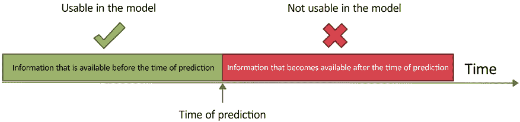

图 6.1：可用信息与不可用信息，以避免数据泄漏

为了使这个概念在时间序列预测的背景下更加清晰和相关，我们来看一个例子。假设我们正在预测洗发水的销量，而我们使用护发素的销量作为一个特征。我们开发了模型，在训练数据上进行了训练，并在验证数据上进行了测试。模型表现得非常好。然而，当我们开始预测未来时，就会看到一个问题。我们也不知道护发素的未来销量是多少。虽然这个例子比较简单，但有时这种问题并不那么显而易见。这就是为什么我们在创建特征时需要格外小心，并且始终从*这个特征在预测时是否可用？*的角度来评估特征。

**最佳实践**：

除了对特征进行深思熟虑外，还有很多方法可以识别目标泄漏：

+   如果你构建的模型好得让人难以置信，那么你很可能存在泄漏问题

+   如果任何单一特征在模型的特征重要性中占比过大，那么这个特征可能存在泄漏问题

+   仔细检查与目标高度相关的特征

尽管我们在本书前面已经生成了预测，但我们从未明确讨论过**预测视野**。这是一个重要的概念，对于我们接下来的讨论至关重要。让我们花点时间来理解预测视野。

# 设置预测视野

预测视野是指我们在任何时间点希望预测的未来时间步数。例如，如果我们想要预测在过去的电力消耗数据集上接下来的 24 小时的情况，那么预测视野就是 48（因为数据是按半小时记录的）。在*第五章*，*时间序列预测作为回归问题*中，我们生成了基准模型，我们一次性预测了所有的测试数据。在这种情况下，预测视野等于测试数据的长度。

在此之前我们从未需要担心这一点，因为在经典的统计预测方法中，这个决策与建模是分开的。如果我们训练了一个模型，就可以用它来预测任何未来的点，而无需重新训练。但是在*时间序列回归预测*中，我们对预测范围有所限制，这与数据泄漏有关。现在这可能对你来说还不清楚，因此我们将在学习特征工程技术后再回顾这一点。目前，我们只关注单步预测。在我们正在使用的数据集上下文中，这意味着我们将回答的问题是：*下一小时的能耗是多少？* 我们将在*第四部分*，*预测的机制* 中讨论多步预测和预测的其他机制。

现在我们已经设定了一些基本规则，让我们开始看看不同的特征工程技术。为了跟随 Jupyter notebook 的操作，前往 `Chapter06` 文件夹并使用 `01-Feature_Engineering.ipynb` 文件。

# 时间延迟嵌入

时间延迟嵌入的基本思想是通过最近的观察值将时间嵌入其中。在*第五章*，*时间序列回归预测*中，我们讨论了将时间序列的前几次观察作为**滞后项**（*第 5.6 图*，位于*时间延迟嵌入*小节下）。

然而，使用这个概念还有一些其他方法可以捕捉近期和季节性的信息。

+   滞后项

+   滚动窗口聚合

+   季节性滚动窗口聚合

+   指数加权移动平均

让我们来看看。

## 滞后项或回溯

假设我们有一个时间序列，时间步为 *Y*[L]。假设当前时间为 *T*，并且我们有一个历史长度为 *L* 的时间序列。所以我们的时间序列中，*y*[T] 是最新的观察值，接着是 *y*[T-1]、*y*[T-2] 等等，随着时间的推移向后。正如*第五章*，*时间序列回归预测*中所解释的，滞后项是包含时间序列中先前观察值的特征，如下图所示：

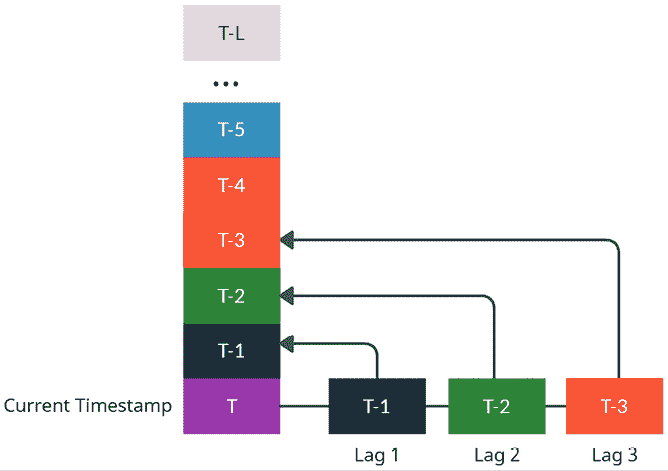

图 6.2：滞后特征

我们可以通过包括比当前时间点*早*的时间步（*y*[T-a]）来创建多个滞后项；我们将其称为*滞后 a*。在前面的图示中，我们展示了*滞后 1*、*滞后 2* 和 *滞后 3*。然而，我们可以根据需要添加任意数量的滞后项。现在让我们来学习如何在代码中实现这一点：

```py
df["lag_1"]=df["column"].shift(1) 
```

还记得我们合并训练集和测试集时，我让你以诚信对待吗？现在是回报这份信任的时候了。如果我们考虑滞后操作（或任何自回归特征），它依赖于时间轴上连续的表示。如果我们考虑测试数据集，对于前几行（或最早的日期），滞后值将会缺失，因为它们属于训练数据集的一部分。因此，通过合并这两个数据集，我们创建了一个沿时间轴的连续表示，其中可以利用 pandas 中的标准函数，如 `shift`，轻松高效地创建这些特征。

就是这么简单，但我们需要针对每个 `LCLid` 单独执行滞后操作。我们在 `src.feature_engineering.autoregressive_features` 中包含了一个名为 `add_lags` 的有用方法，可以快速高效地为每个 `LCLid` 添加所有需要的滞后。让我们看看如何使用它。

我们将导入该方法，并使用其中的一些参数来配置我们希望的滞后操作：

```py
from src.feature_engineering.autoregressive_features import add_lags
# Creating first 5 lags and then same 5 lags but from previous day and previous week to capture seasonality
lags = (
    (np.arange(5) + 1).tolist()
    + (np.arange(5) + 46).tolist()
    + (np.arange(5) + (48 * 7) - 2).tolist()
)
full_df, added_features = add_lags(
    full_df, lags=lags, column="energy_consumption", ts_id="LCLid", use_32_bit=True
) 
```

现在，让我们来看一下我们在前面代码片段中使用的参数：

+   `lags`：该参数接收一个整数列表，表示我们需要创建为特征的所有滞后。

+   `column`：要进行滞后操作的列名。在我们的例子中，这是 `energy_consumption`。

+   `ts_id`：包含时间序列唯一 ID 的列名。如果为 `None`，则假定数据框仅包含单一的时间序列。在我们的例子中，`LCLid` 就是该列的名称。

+   `use_32_bit`：该参数在功能上没有任何作用，但通过牺牲浮动点数的精度，使得数据框在内存中的大小变得更小。

该方法返回添加滞后后的数据框（DataFrame），以及包含新添加特征的列名的列表。

## 滚动窗口聚合

使用滞后时，我们将当前点与过去的单个点连接，而使用滚动窗口特征时，我们将当前点与过去窗口的汇总统计量连接。我们不是查看前几个时间步的观察值，而是查看过去三个时间步的观察值的平均值。请查看下面的图表，以更好地理解这一点：

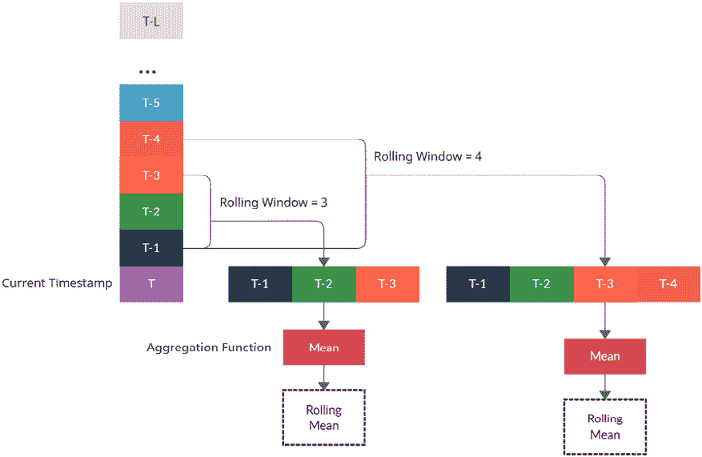

图 6.3：滚动窗口聚合特征

我们可以使用不同的窗口来计算滚动统计量，每个窗口将捕捉历史的略有不同的方面。在前面的图表中，我们可以看到一个窗口为三和一个窗口为四的示例。当我们处于时间步* T *时，窗口大小为三的滚动窗口将具有 *y*[T] [– 3]，*y*[T] [– 2]，*y*[T] [– 1] 作为过去观察值的向量。一旦我们拥有这些数据，就可以应用任何聚合函数，如均值、标准差、最小值、最大值等。通过聚合函数得到标量值后，我们可以将其作为时间步 *t* 的特征。

我们*不包括* *y*[T]在过去观测值的向量中，因为那会导致数据泄漏。

让我们看看如何通过 pandas 来实现这一操作：

```py
# We shift by one to make sure there is no data leakage
df["rolling_3_mean"] = df["column"].shift(1).rolling(3).mean() 
```

与滞后类似，我们需要为每个`LCLid`列分别执行此操作。我们在`src.feature_engineering.autoregressive_features`中提供了一个有用的方法`add_rolling_features`，它可以快速有效地为每个`LCLid`添加所需的所有滚动特征。让我们看看如何使用它。

我们将导入这个方法，并使用它的一些参数来按照我们希望的方式配置滚动操作：

```py
from src.feature_engineering.autoregressive_features import add_rolling_features
full_df, added_features = add_rolling_features(
    full_df,
    rolls=[3, 6, 12, 48],
    column="energy_consumption",
    agg_funcs=["mean", "std"],
    ts_id="LCLid",
    use_32_bit=True,
) 
```

现在，让我们来看一下在前面代码片段中使用的参数：

+   `rolls`: 该参数接受一个整数列表，表示我们需要计算聚合统计量的所有窗口。

+   `column`: 要进行滞后操作的列名。在我们的案例中，这列是`energy_consumption`。

+   `agg_funcs`: 这是一个聚合函数列表，用于对`rolls`中声明的每个窗口进行处理。允许的聚合函数包括`{mean, std, max, min}`。

+   `n_shift`: 这是在进行滚动操作之前需要移动的时间步数。此参数可以避免数据泄漏。虽然我们在这里移动了一个时间步，但也有需要移动多个时间步的情况。通常这用于多步预测，我们将在*第四部分*，*预测的机制*中讨论。

+   `ts_id`: 包含时间序列唯一 ID 的列名。如果为`None`，则假定数据框架只有一个时间序列。在我们的案例中，`LCLid`就是该列的名称。

+   `use_32_bit`: 该参数在功能上没有任何作用，但能使数据框架在内存中占用更小的空间，牺牲浮动点数的精度。

该方法返回添加了滚动特征的数据框架，并且返回一个包含新添加特征列名的列表。

## 季节性滚动窗口聚合

季节性滚动窗口聚合与滚动窗口聚合非常相似，但它们不同的是，季节性窗口不会采用过去的*n*个连续观测值，而是采用一个季节性窗口，在窗口中的每个项之间跳过一个恒定数量的时间步。下面的图表将使这一点更加清晰：

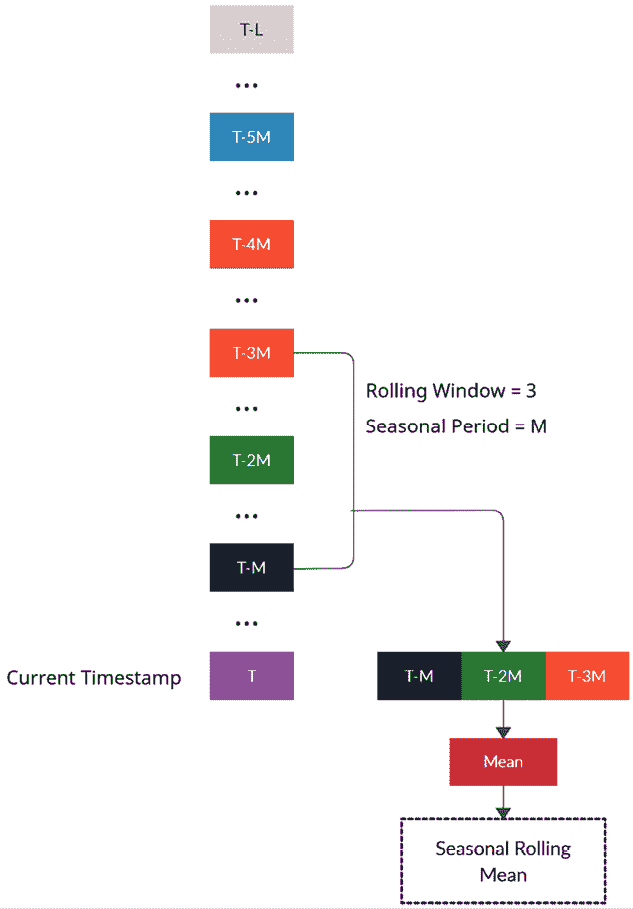

图 6.4：季节性滚动窗口聚合

这里的关键参数是季节性周期，通常称为 *M*。这是我们预计季节性模式会重复的时间步数。在时间步 *T* 时，大小为三的滚动窗口将包含 *y*[T] [– 3]、*y*[T] [– 2]、*y*[T] [– 1]，作为过去观察值的向量。但是，季节性滚动窗口将在窗口中的每个元素之间跳过 *m* 个时间步数。这意味着季节性滚动窗口中的观察值将是 *y*[T] [–] [M]、*y*[T] [– 2][M]、*y*[T] [– 3][M]。此外，像往常一样，一旦我们获得窗口向量，我们只需应用聚合函数以获得标量值，并将其作为特征包含在内。

我们 *不包括* *y*[T] 作为季节性滚动窗口向量中的一个元素，以避免数据泄漏。

这是一个你不能使用 pandas 轻松高效完成的操作。需要一些高级的 NumPy 索引和 Python 循环来实现这个功能。我们将使用来自 `github.com/jmoralez/window_ops/` 的实现，它利用 NumPy 和 Numba 来使操作更快速高效。

就像我们之前看到的特征一样，我们需要为每个 `LCLid` 单独执行此操作。我们在 `src.feature_engineering.autoregressive_features` 中提供了一个有用的方法 `add_seasonal_rolling_features`，它可以快速有效地为每个 `LCLid` 添加你需要的所有季节性滚动特征。让我们看看如何使用它。

我们将导入该方法并使用该方法的几个参数来配置我们想要的季节性滚动操作：

```py
from src.feature_engineering.autoregressive_features import add_seasonal_rolling_features
full_df, added_features = add_seasonal_rolling_features(
    full_df,
    rolls=[3],
    seasonal_periods=[48, 48 * 7],
    column="energy_consumption",
    agg_funcs=["mean", "std"],
    ts_id="LCLid",
    use_32_bit=True,
) 
```

现在，让我们看看在之前的代码片段中使用的参数：

+   `seasonal_periods`：这是一个季节性周期的列表，应在季节性滚动窗口中使用。在多季节性的情况下，我们可以包含所有季节性滚动特征。

+   `rolls`：该参数接受一个整数列表，表示我们需要计算聚合统计量的所有窗口。

+   `column`：要滞后的列名。在我们的例子中，这是 `energy_consumption`。

+   `agg_funcs`：这是我们希望对在 `rolls` 中声明的每个窗口进行的聚合操作的列表。允许的聚合函数为 `{mean, std, max, min}`。

+   `n_shift`：这是在进行滚动操作之前需要移动的季节性时间步数。该参数可以防止数据泄漏。

+   `ts_id`：包含时间序列唯一 ID 的列名。如果为 `None`，则假设 DataFrame 仅包含单个时间序列。在我们的例子中，`LCLid` 就是该列名。

+   `Use_32_bit`：该参数在功能上没有任何作用，但通过牺牲浮动点数的精度，使 DataFrame 在内存中变得更小。

和往常一样，该方法返回包含季节性滚动特征的 DataFrame 以及一个包含新添加特征列名的列表。

## 指数加权移动平均（EWMA）

在滚动窗口均值操作中，我们计算了窗口的平均值，这与**移动平均**是同义的。EWMA 是移动平均的稍微聪明一些的“亲戚”。移动平均考虑了一个滚动窗口，并且对窗口中的每个项在计算的平均值中赋予相同的权重，而 EWMA 则尝试对窗口进行加权平均，并且权重按指数速率衰减。有一个参数，，决定了权重衰减的速度。因为这个原因，我们可以将所有可用的历史数据视为一个窗口，让参数决定 EWMA 中包括多少近期的数据。这个过程可以简单地递归表示如下：

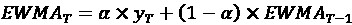

在这里，我们可以看到，的值越大，平均值越偏向于最近的值（查看*图 6.6*以获得关于权重如何分布的直观印象）。如果我们展开递归，每一项的权重将会是：

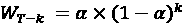

其中，*k*是相对于*T*的时间步长。如果我们绘制权重，就能看到它们呈指数衰减；决定了衰减的速度。另一种理解的方式是从**跨度**的角度来看。跨度是指衰减后的权重接近零的周期数（这不是严格的数学意义，而是直观的理解）。和跨度通过以下方程相关：

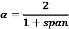

这一点将在下图中更清晰地展示，我们绘制了不同值下权重衰减的情况 ：

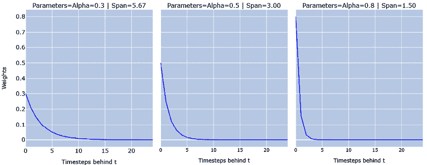

图 6.5：不同值下的指数权重衰减 

在这里，我们可以看到，当我们达到跨度时，权重变得很小。

直观地，我们可以将 EWMA 视为整个时间序列历史的平均值，但通过和**跨度**等参数，我们可以使不同时期的历史对平均值的影响更加显著。如果我们定义了一个 60 期的跨度，我们可以认为最后的 60 个时间期主要驱动了平均值。因此，通过使用不同跨度或值的 EWMA，我们可以得到具有代表性的特征，捕捉不同历史时期的特征。

整个过程在下图中进行了展示：

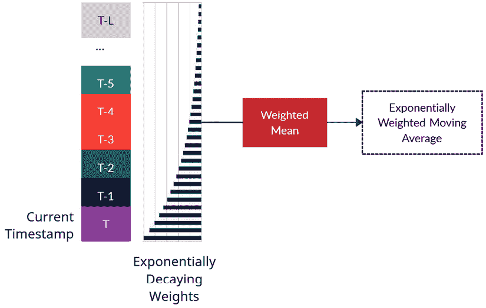

图 6.6：EWMA 特征

现在，让我们看看如何在 pandas 中实现这一点：

```py
df["ewma"]=df['column'].shift(1).ewm(alpha=0.5).mean() 
```

和我们之前讨论的其他特性一样，EWMA 也需要对每个`LCLid`单独进行处理。我们在`src.feature_engineering.autoregressive_features`中包含了一个有用的方法，叫做`add_ewma`，它可以快速高效地为每个`LCLid`添加你所需要的所有 EWMA 特征。让我们看看如何使用它。

我们将导入这个方法，并使用该方法的几个参数来配置我们想要的 EWMA：

```py
from src.feature_engineering.autoregressive_features import add_ewma
full_df, added_features = add_ewma(
    full_df,
    spans=[48 * 60, 48 * 7, 48],
    column="energy_consumption",
    ts_id="LCLid",
    use_32_bit=True,
) 
```

现在，让我们看一下在前面的代码片段中使用的参数：

+   `alphas`：这是我们需要计算 EWMA 特征的所有的列表。

+   `spans`：作为替代，我们可以用它列出我们需要计算 EWMA 特征的所有跨度。如果使用此特性，`alphas`将被忽略。

+   `column`：需要进行滞后处理的列名。在我们的案例中，这一列是`energy_consumption`。

+   `n_shift`：这是我们在进行滚动操作之前需要移动的季节性时间步数。这个参数可以避免数据泄漏。

+   `ts_id`：包含时间序列唯一 ID 的列名。如果为`None`，则假设数据框仅包含单一时间序列。在我们的案例中，`LCLid`是该列的名称。

+   `use_32_bit`：这个参数在功能上没有任何作用，但可以使数据框在内存中占用更少的空间，代价是牺牲浮点数的精度。

一如既往，该方法返回包含 EWMA 特征的数据框，并返回一个包含新添加特征列名的列表。

这些是将时间延迟嵌入到机器学习模型中的几种标准方式，但你并不局限于这些。像往常一样，特征工程是一个没有固定规则的领域，我们可以尽情发挥创意，并将领域知识注入到模型中。除了我们已经看到的特征，我们还可以包括滞后差异作为自定义滞后特征来注入领域知识，等等。在大多数实际情况下，我们最终会使用不止一种方式将时间延迟嵌入到模型中。滞后特征在大多数情况下是最基本和最重要的，但我们确实会通过季节性滞后、滚动特征等编码更多信息。和机器学习中的一切一样，没有万能的解决方案。每个数据集都有其独特性，这使得特征工程对于每种情况都非常重要且不同。

现在，让我们看一下我们可以通过**时间嵌入**添加的另一类特征。

# 时间嵌入

在*第五章*，*时间序列预测作为回归问题*中，我们简要讨论了时间嵌入的过程，即我们尝试将*时间*嵌入到机器学习模型可以利用的特征中。如果我们稍微思考一下*时间*，我们会发现，在时间序列预测的背景下，时间有两个方面对我们来说至关重要——*时间的流逝*和*时间的周期性*。

有一些特征可以帮助我们在机器学习模型中捕捉这些方面：

+   日历特征

+   时间流逝

+   傅里叶项

让我们逐一看一下它们。

## 日历特征

我们可以提取的第一类特征是基于日历的特征。尽管时间序列的严格定义是按时间顺序获取的一组观测值，但我们通常会在这些观测值的时间戳旁边收集时间序列。我们可以利用这些时间戳并提取日历特征，例如月份、季度、年中的第几天、小时、分钟等。这些特征捕捉了时间的周期性，帮助机器学习模型有效地捕捉季节性。只有比时间序列频率更高的日历特征才有意义。例如，在一个每周频率的时间序列中，小时特征是没有意义的，但月份和周数特征则有意义。我们可以利用 pandas 中的内置日期时间功能来创建这些特征，并在模型中将它们视为分类特征。

## 时间流逝

这是另一个在机器学习模型中捕捉时间流逝的特征。随着时间的推移，该特征单调增加，给机器学习模型提供时间流逝的感知。创建这个特征有很多方法，但最简单且高效的方法之一是使用 NumPy 中日期的整数表示：

```py
df['time_elapsed'] = df['timestamp'].values.astype(np.int64)/(10**9) 
```

我们在 `src.feature_engineering.temporal_features` 中包含了一个有用的方法 `add_temporal_features`，该方法会自动添加所有相关的时间特征。让我们看看如何使用它。

我们将导入该方法，并使用该方法的一些参数来配置和创建时间特征：

```py
full_df, added_features = add_temporal_features(
    full_df,
    field_name="timestamp",
    frequency="30min",
    add_elapsed=True,
    drop=False,
    use_32_bit=True,
) 
```

现在，让我们看看在前面的代码片段中使用的参数：

+   `field_name`：这是包含应当用于创建特征的日期时间的列名。

+   `frequency`：我们应当提供时间序列的频率作为输入，以便方法自动提取相关特征。这些是标准的 pandas 频率字符串。

+   `add_elapsed`：此标志用于开启或关闭时间流逝特征的创建。

+   `use_32_bit`：该参数在功能上没有任何作用，但使得 DataFrame 在内存中占用更小的空间，牺牲了浮点数的精度。

就像我们讨论的前几种方法一样，这个方法也会返回一个新的 DataFrame，添加了时间特征，并返回一个包含新增特征列名的列表。

## 傅里叶项

之前，我们提取了一些日历特征，如月份、年份等，并讨论了将它们作为分类变量用于机器学习模型。另一种表示相同信息的方式，是使用 **傅里叶项**，并以连续尺度表示。我们在*第三章*《分析与可视化时间序列数据》中讨论了傅里叶级数。为了重申，傅里叶级数的正弦-余弦形式如下：

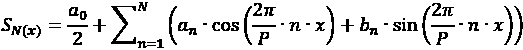

在这里，*S*[N]是信号*S*的*N*项近似。理论上，当*N*为无限时，得到的近似值等于原始信号。*P*是周期的最大长度，*a*[n]和*b*[n]分别是余弦项和正弦项的系数，*a*[0]是截距。

我们可以将这些余弦和正弦函数作为特征来表示季节性循环。如果我们对月份进行编码，我们知道它的范围从 1 到 12，然后会重复。因此，在这种情况下，*P*将是 12，*x*将是 1, 2, …12。因此，对于每个*x*，我们可以计算出余弦和正弦项，并将它们作为特征添加到机器学习模型中。从直观上看，我们可以认为模型会根据数据推断出系数，从而帮助模型更容易地预测时间序列。

下图展示了按序数尺度表示的月份与作为傅里叶级数表示之间的差异：

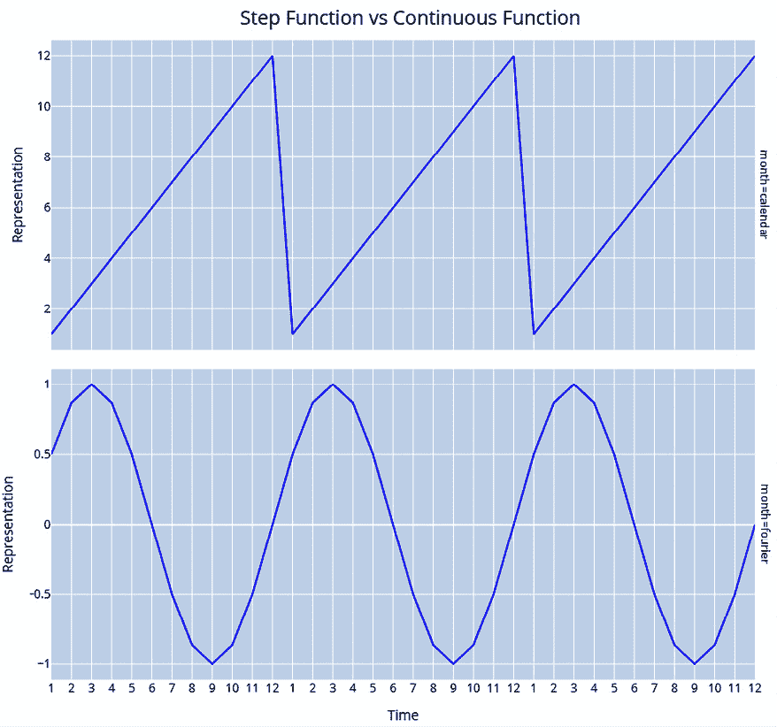

图 6.7：作为序数步进函数的月份（上图）与傅里叶项（下图）

上图展示了单一傅里叶项；我们可以添加多个傅里叶项来帮助捕捉复杂的季节性。

我们不能简单地说季节性的连续表示优于类别表示，因为这取决于你使用的模型类型和数据集。这是我们需要通过经验来发现的。

为了简化添加傅里叶特征的过程，我们提供了一些易于使用的方法，这些方法位于`src.feature_engineering.temporal_features`中，文件名为`bulk_add_fourier_features`，它会自动为我们需要的所有日历特征添加傅里叶特征。让我们来看看如何使用它。

我们将导入该方法，并使用其中的一些参数来配置和创建基于傅里叶级数的特征：

```py
full_df, added_features = bulk_add_fourier_features(
    full_df,
    ["timestamp_Month", "timestamp_Hour", "timestamp_Minute"],
    max_values=[12, 24, 60],
    n_fourier_terms=5,
    use_32_bit=True,
) 
```

现在，让我们来看一下我们在前面的代码片段中使用的参数：

+   `columns_to_encode`：这是我们需要使用傅里叶项进行编码的日历特征列表。

+   `max_values`：这是一个季节性循环的最大值列表，对于日历特征，按`columns_to_encode`中给出的顺序排列。例如，对于`month`要作为列进行编码时，我们给出`12`作为对应的`max_value`。如果没有给出，`max_value`将会被推断。只有在你的数据至少包含一个完整的季节性循环时，才建议使用此方法。

+   `n_fourier_terms`：这是要添加的傅里叶项数量。这与前面提到的傅里叶级数公式中的*n*是同义词。

+   `use_32_bit`：这个参数在功能上没有任何作用，但它会使 DataFrame 在内存中变得更小，从而牺牲浮点数的精度。

就像我们之前讨论过的方法一样，它也会返回一个新的 DataFrame，添加了傅里叶特征，同时返回一个包含新增特征列名的列表。

在执行`Chapter06`中的`01-Feature_Engineering.ipynb`笔记本后，我们将生成以下特征工程文件并保存到磁盘：

+   `selected_blocks_train_missing_imputed_feature_engg.parquet`

+   `selected_blocks_val_missing_imputed_feature_engg.parquet`

+   `selected_blocks_test_missing_imputed_feature_engg.parquet`

在本节中，我们探讨了一些流行且有效的时间序列特征生成方法。但实际上还有很多其他方法，具体选择哪些方法取决于你的问题和领域，很多方法都将适用。

**附加信息**：

特征工程的领域非常广泛，已有一些开源库使得探索这一领域变得更加容易。其中一些库包括[`github.com/Nixtla/tsfeatures`](https://github.com/Nixtla/tsfeatures)、[`tsfresh.readthedocs.io/en/latest/`](https://tsfresh.readthedocs.io/en/latest/)以及[`github.com/DynamicsAndNeuralSystems/catch22`](https://github.com/DynamicsAndNeuralSystems/catch22)。Ben D. Fulcher 撰写的预印本论文《基于特征的时间序列分析》([`arxiv.org/abs/1709.08055`](https://arxiv.org/abs/1709.08055))也提供了对这一领域的良好总结。

一个名为 functime 的新库（[`github.com/functime-org/functime`](https://github.com/functime-org/functime)）也提供了快速的特征工程例程，它是用 Polars 编写的，值得一试。书中讨论的许多特征工程方法，通过使用 functime 和 Polars 可以使处理速度更快。

# 总结

在上一章简要概述了时间序列预测的机器学习范式后，本章我们从实践角度深入探讨，了解如何准备带有所需特征的数据集，以开始使用这些模型。我们回顾了几种时间序列特定的特征工程技术，如滞后、滚动窗口和季节性特征。本章中学习的所有技术都是我们可以快速迭代实验的工具，帮助我们找到最适合我们数据集的方案。然而，我们仅讨论了特征工程，它只影响标准回归方程的一部分（*y* = *mX* + *c*）。另一个部分，即我们预测的目标（*y*），同样重要。下一章我们将探讨一些概念，比如平稳性以及一些影响目标的转换。

# 加入我们在 Discord 上的社区

加入我们社区的 Discord 空间，与作者和其他读者进行讨论：

[`packt.link/mts`](https://packt.link/mts)


