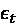
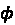
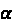

# 第七章：时间序列预测的目标转换

在上一章中，我们探讨了如何通过利用特征工程技术进行时间嵌入和时间延迟嵌入。但那只是回归方程的一方面——特征。通常，我们会发现方程的另一侧——目标，并没有按照我们预期的方式表现出来。换句话说，目标并没有具备一些理想的特性，这些特性能够让预测变得更加容易。这个领域的主要罪魁祸首之一是**平稳性**——或者更具体地说，缺乏平稳性。这会给我们在开发**机器学习**（**ML**）/统计模型时所做的假设带来问题。在本章中，我们将讨论一些处理目标相关问题的技术。

本章将覆盖以下主题：

+   处理时间序列中的非平稳性

+   检测和修正单位根

+   检测和修正趋势

+   检测和修正季节性

+   检测和修正异方差性

+   AutoML 方法用于目标转换

# 技术要求

你需要按照本书*前言*中的说明设置**Anaconda**环境，以便获得一个包含所有所需库和数据集的工作环境，供本书代码使用。任何额外的库将在运行笔记本时自动安装。

在使用本章中的代码之前，你需要运行以下笔记本：

+   `Chapter02`文件夹中的`02-Preprocessing_London_Smart_Meter_Dataset.ipynb`

+   `Chapter04`文件夹中的`01-Setting_up_Experiment_Harness.ipynb`

+   `Chapter06`文件夹中的`01-Feature_Engineering.ipynb`

本章的相关代码可以在[`github.com/PacktPublishing/Modern-Time-Series-Forecasting-with-Python-/tree/main/notebooks/Chapter07`](https://github.com/PacktPublishing/Modern-Time-Series-Forecasting-with-Python-/tree/main/notebooks/Chapter07)找到。

# 检测时间序列中的非平稳性

**平稳性**是大多数计量经济学模型中普遍的假设，是一个严谨且数学化的概念。但在不涉及太多数学的情况下，我们可以直观地理解平稳性为时间序列所采样的分布的统计特性随着时间保持不变的状态。这在时间序列回归中也很相关，因为我们在跨时间估计一个单一的预测函数。如果时间序列的*行为*随时间发生变化，那么我们估计的单一函数可能并不总是适用。例如，如果我们把附近公园每日的游客数量看作一个时间序列，我们知道这些模式在疫情前后会有很大不同。在机器学习领域，这种现象被称为**概念漂移**。

直观上，我们可以理解，平稳的序列比非平稳的序列更容易预测。但这里有个关键点：在现实世界中，几乎所有的时间序列都不满足平稳假设——更具体地说，**严格平稳**假设。严格平稳是指所有统计性质，如均值、方差、偏度等，都不随时间变化。很多时候，这一严格平稳假设被放宽，采用**弱平稳**，即只要求时间序列的均值和方差不随时间变化。

我们可以问自己四个主要问题来检查我们的时间序列是否平稳：

+   均值是否随时间变化？换句话说，时间序列中是否有趋势？

+   方差是否随时间变化？换句话说，时间序列是否异方差？

+   时间序列的均值是否表现出周期性的变化？换句话说，时间序列中是否存在季节性？

+   时间序列是否具有单位根？

其中前三个问题可以通过简单的视觉检查来确定。**单位根**较难理解，我们将稍后深入探讨单位根。现在，让我们看几个时间序列，检查我们是否能通过视觉检查来判断它们是否平稳（你可以记录你的答案）：


图 7.1：测试你对平稳性的理解

现在，检查你的回答，看看你猜对了多少个。如果你答对了六个中的至少四个，你对平稳性的直觉理解就非常好：

+   **时间序列 1**是*平稳*的，因为它是一个白噪声过程，按照定义，它的均值为零，方差恒定。它通过了我们对前三个问题的检查。

+   **时间序列 2**是*非平稳*的，因为它有一个明显的下降趋势。这意味着序列在开始时的均值与结束时不同。因此，它没有通过我们的第一个检查问题。

+   **时间序列 3**乍一看可能是平稳的，因为它基本上围绕 0 波动，但随着时间的推移，波动幅度逐渐增大。这意味着它的方差在增大——换句话说，它是异方差的。因此，尽管它回答了我们的第一个问题，但未能通过第二个检查，即方差是否恒定。所以，它是*非平稳*的。

+   现在，我们要讨论的难题是——**时间序列 4**。乍一看，我们可能认为它是平稳的，因为尽管它一开始有趋势，但它也发生了反转，使得均值几乎保持不变。而且，方差的变化也不那么明显。但这实际上是一个含有单位根的时间序列（我们将在稍后的*单位根*部分详细讨论），通常，含单位根的时间序列很难通过视觉检查来判断。

+   **时间序列 5** 回答了前两个问题——常数均值和常数方差——但它有一个非常明显的季节性模式，因此是*非平稳的*。

+   **时间序列 6** 是另一个白噪声过程，仅用于迷惑你。这也是*平稳的*。

当我们拥有成百上千，甚至是数百万个时间序列时，我们在实际操作中无法通过视觉检查来判断它们是否平稳。因此，现在让我们来看看使用统计测试检测这些关键特性的一些方法，以及如何尝试修正它们。

虽然我们讨论的是修正或使时间序列平稳，但在机器学习范式下，并不总是必须这样做，因为一些问题可以通过使用合适的特征在模型中得到处理。是否将一个序列转换为平稳序列是一个我们需要在实验技术后做出的决定。因为正如你将看到的，虽然将序列平稳化有其优点，但使用这些技术也有其缺点，我们将在详细讨论每种转换时看到这些问题。

**笔记本提醒**：

若要跟随完整的代码，请使用 `Chapter06` 文件夹中的 `02-Dealing_with_Non-Stationarity.ipynb` 笔记本。

# 检测和修正单位根

让我们先谈谈单位根，因为这是最常见的平稳性测试。时间序列分析起源于计量经济学和统计学，而单位根是直接源于这些领域的一个概念。

## 单位根

单位根相当复杂，但为了培养一些直觉，我们可以简化来看。让我们考虑一个一阶自回归模型（AR(1) 模型）：

，其中  是白噪声， 是 AR 系数。

如果我们考虑方程中不同的  值，我们可以提出三种情境（*图 7.2*）：

1.  ：当  大于 1 时，时间序列中的每个后续值都会乘以大于 1 的数字，这意味着它将具有强烈且迅速增加/减少的趋势，因此是非平稳的。

1.  ：当  小于 1 时，时间序列中的每个后续值都会乘以小于 1 的数字，这意味着从长远来看，序列的均值趋向于零，并围绕零振荡。因此，它是平稳的。

1.  ：当  等于 1 时，情况变得更加复杂。当  为 `AR(1)` 模型时，这被称为具有单位根，方程变为 。这在计量经济学中被称为随机漫步，是金融和经济领域中一种非常流行的时间序列类型。从数学上讲，我们可以证明这样的序列将具有常数均值，但方差却是非恒定的：


图 7.2：具有不同  参数的自回归时间序列。顶部：情境 1，phi <1；中间：情境 2，phi = 1；底部：情境 3，phi>1

虽然我们讨论了`AR(1)`过程中的单位根问题，但我们可以将相同的直觉扩展到多个滞后项或`AR(p)`模型。在那里，计算和检验单位根更加复杂，但仍然是可能的。

既然我们已经知道什么是单位根，如何通过统计方法进行检验呢？这时 Dickey-Fuller 检验就派上用场了。

## 扩展的 Dickey-Fuller（ADF）检验

这个检验中的零假设是`AR(1)`模型中的  等于 1，从而使序列非平稳。备择假设是`AR(1)`模型中的  小于 1。ADF 检验将 Dickey-Fuller 检验扩展到`AR(p)`模型，因为大多数时间序列不仅仅由一个滞后项定义。这个检验是检查单位根的标准且最流行的统计方法。该检验的核心是对时间序列的滞后进行回归，并计算残差方差的统计量。

让我们看看如何在 Python 中使用`statsmodels`来实现这一点：

```py
from statsmodels.tsa.stattools import adfuller
result = adfuller(y) 
```

`adfuller`的`result`是一个元组，包含了*检验统计量*、*p 值*和不同置信度下的*临界值*。在这里，我们最关注的是 p 值，这是一个简单实用的方法来检查零假设是否被拒绝。如果`p < 0.05`，则有 95%的概率表明序列没有单位根；从单位根的角度来看，序列是平稳的。

为了让这个过程更加简便，我们在`src.transforms.stationary_utils`中包含了一个名为`check_unit_root`的方法，它会为你进行推断（通过将返回的概率与置信度进行比较并拒绝或接受`零假设`），并返回一个包含布尔属性`stationary`的`namedtuple`，以及来自`statsmodels`的完整结果在`results`中：

```py
from src.transforms.stationary_utils import check_unit_root
# We pass the time series along with the confidence with which we need the results
check_unit_root(y, confidence=0.05) 
```

现在我们已经学会了如何检查一个序列是否有单位根，那么如何使其平稳呢？我们来看看几个可以帮助我们实现这一目标的变换方法。

## 差分变换

差分变换是使时间序列平稳，或至少消除单位根的非常流行的变换方法。这个概念很简单：我们将时间序列从观察领域转化为观察变化领域。差分变换通过将后续观察值相互减去来实现：

*z*[t] = *y*[t] – *y*[t][-1]

差分有助于稳定时间序列的均值，并因此减少或消除趋势和季节性。让我们看看差分是如何使序列变得平稳的。

让我们考虑问题中的时间序列  ，其中  和  是系数， 是白噪声。从这个方程中，我们可以看到时间 *t* 是方程的一部分，这使得 *y*[t] 成为一个具有趋势的时间序列。因此，差分后的时间序列 *z* 将如下所示：


我们需要在这个新方程中寻找的是没有提到 *t*。这意味着，创建趋势的 *t* 依赖性已经被去除，现在时间序列在任何时间点都有恒定的均值和方差。

差分并不能去除所有种类的非平稳性，但适用于大多数时间序列。然而，这种方法也有一些缺点。其中一个缺点是我们在建模过程中会丢失时间序列的尺度。很多时候，时间序列的尺度包含一些对预测有用的信息。例如，在供应链中，高销售量的 SKU 表现出不同于低销售量 SKU 的模式，而当我们进行差分时，这种区分信息会丢失。

另一个缺点更多是从操作角度来看。当我们使用差分进行预测时，我们还需要在从模型获取差分后的输出后对其进行逆变换。这是我们必须管理的一个额外复杂性。解决方法之一是将最新的观察值保存在内存中，并不断将差分添加到其中以逆变换。另一种方法是为每个需要逆变换的 *t* 保留 *y*[t][-1]，并将差分不断添加到 *y*[t][-1] 中。

我们已经使用 datetime 索引作为关键字来对齐并获取`src.transforms.target_transformations.py`中* y *[t][-1]的观察值，该文件位于本书的 GitHub 仓库中。让我们看看如何使用它：

```py
from src.transforms.target_transformations import AdditiveDifferencingTransformer
diff_transformer = AdditiveDifferencingTransformer()
# [1:] because differencing reduces the length of the time series by one
y_diff = diff_transformer.fit_transform(y, freq="1D")[1:] 
```

`y_diff`将包含变换后的序列。要返回原始时间序列，我们可以调用`inverse_transform`并使用`diff_transformer`。关联的笔记本有示例和图表，展示差分如何改变时间序列。

在这里，我们将差分看作是从时间序列中减去后续值的过程。但我们也可以使用其他运算符进行差分，例如除法（*y*[t]/ *y*[t][-1]），这在`src.transforms.target_transformations.py`文件中实现为`MultiplicativeDifferencingTransformer`。我们还可以尝试这些变换，以检查它们是否对你的数据集最有效。

尽管差分解决了大多数平稳性问题，但并不能保证解决所有类型的趋势（非线性或分段趋势）、季节性等问题。有时候，我们可能不想对序列进行差分，但仍然需要处理趋势和季节性。那么，让我们看看如何检测并去除时间序列中的趋势。

# 检测并纠正趋势

在*第五章*，《作为回归的时间序列预测》中，我们讨论了预测是一个困难的问题，因为它本质上是一个外推问题。趋势是导致预测成为外推问题的主要因素之一。如果我们有一个上升趋势的时间序列，任何试图预测它的模型都需要在训练过程中所看到的值范围之外进行外推。ARIMA 通过自回归来处理这个问题，而指数平滑通过显式建模趋势来处理它。但标准回归可能并不天然适合外推。然而，通过合适的特征，如滞后，它也可以开始进行外推。

但是，如果我们能自信地估计并提取时间序列中的趋势，我们可以通过去趋势化时间序列来简化回归问题。

但在继续之前，值得了解两种主要的趋势类型。

## 确定性和随机性趋势

让我们再次使用之前看到的简单*AR(1)*模型来培养对这个问题的直觉。之前我们看到在*AR(1)*模型中有时，时间序列中会出现趋势。但我们也可以通过将时间作为有序变量包含在定义时间序列的方程中来考虑趋势时间序列。例如，让我们考虑两个时间序列：

*时间序列 1*：


*时间序列 2*：


这些可以通过以下图表看到：


图 7.3：顶部：随机趋势；底部：确定性趋势

我们之前看到过这两个方程；*时间序列 1*是*AR(1)*模型，而*时间序列 2*是我们选择用来说明差分的时间序列方程。我们已经知道，对于，*时间序列 1*和*时间序列 2*都有趋势。但这两种趋势之间有差异。

在*时间序列 2*中，趋势是恒定的，可以完美地建模。在这种情况下，简单的线性拟合就能完美地解释趋势。但在*时间序列 1*中，趋势并不是可以通过简单的线性拟合来解释的。它本质上依赖于时间序列的前一个值，因此是随机的。因此，*时间序列 2*具有确定性趋势，而*时间序列 1*具有随机性趋势。

我们可以使用本章中早些时候看到的相同 ADF 检验来检查时间序列是否具有确定性或随机性趋势。在不深入讨论统计检验的数学原理的情况下，我们知道它通过将`AR(p)`模型拟合到时间序列上来检验单位根。我们可以通过`statsmodels`实现中的`regression`参数指定该检验的几种变体。该参数接受以下值：

+   `c`：这意味着我们在`AR(p)`模型中包括了常数截距项。实际上，这意味着即使序列不以零为中心，我们也会认为时间序列是平稳的。这是`statsmodels`中的默认设置。

+   `n`：这意味着我们在`AR(p)`模型中甚至不包括常数截距项。

+   `ct`：如果我们提供此选项，则`AR(p)`模型将包含常数截距项和线性、确定性趋势分量。这意味着即使时间序列中存在确定性趋势，它也会被忽略，并且该序列将被测试为平稳序列。

+   `ctt`：这是当我们包括常数截距项，即线性和二次趋势时。

因此，如果我们使用`regression="c"`运行 ADF 检验，它将显示为非平稳序列。而如果我们使用`regression="ct"`运行 ADF 检验，它将显示为平稳序列。这意味着，当我们从时间序列中移除确定性趋势后，它变得平稳。这项测试可以帮助我们判断时间序列中观察到的趋势是确定性趋势还是随机趋势。在*进一步阅读*部分，我们提供了一个由*Fabian Kostadinov*撰写的博客链接，他通过对一些时间序列进行实验，清楚地说明了不同 ADF 检验变种的区别。

我们已经在`src.transforms.stationary_utils`中实现了这个测试，命名为`check_deterministic_trend`，它会为您进行推断，并返回一个包含布尔属性`deterministic_trend`的`namedtuple`。如果您想进一步调查，`namedtuple`还包含我们在`adf_res`和`adf_ct_res`中进行的两个`adfuller`检验的原始结果。让我们看看如何使用这个测试：

```py
check_deterministic_trend(y, confidence=0.05) 
```

这将告诉我们趋势是平稳的还是确定性的。接下来，让我们看看几种方法，如何识别并对时间序列中的趋势（无论是否为确定性趋势）进行统计检验。

## Kendall 的 Tau

Kendall 的 Tau 是相关性的一种衡量方式，但它是在数据的等级上进行的。Kendall 的 Tau 是一个非参数检验，因此不对数据做任何假设。相关系数 Tau 的值介于-1 和 1 之间，其中 0 表示无关系，1 或-1 表示完全关系。我们不会深入探讨 Kendall 的 Tau 是如何计算的，也不会讨论其显著性检验，因为这超出了本书的范围。*进一步阅读*部分包含了一个很好的链接来解释这一点。

在本节中，我们将看到如何使用 Kendall 的 Tau 来衡量我们时间序列中的趋势。如前所述，Kendall 的 Tau 计算两个变量之间的等级相关性。如果我们选择其中一个变量作为时间序列，并将另一个变量设置为时间的序数表示，则得到的 Kendall 的 Tau 将表示时间序列中的趋势。另一个好处是，Kendall 的 Tau 值越高，我们预计趋势越强。

`scipy` 提供了一个 Kendall’s Tau 的实现，我们可以如下使用：

```py
import scipy.stats as stats
tau, p_value = stats.kendalltau(y, np.arange(len(y))) 
```

我们可以将返回的 p 值与所需的置信度（通常为 `0.05`）进行比较，并得出结论：如果 `p_value` < `confidence`，我们可以认为趋势在统计上是显著的。`tau` 的符号告诉我们这是一个上升趋势还是下降趋势。

我们在 `src.transforms.stationary_utils` 中实现了 Kendall’s Tau，命名为 `check_trend`，它会帮助你检查是否存在趋势。我们只需要提供以下参数：

+   `y`：需要检查的时间序列

+   `confidence`：对结果 p 值进行检查的置信度水平

还有一些参数，但它们是用于 **Mann-Kendall**（**M-K**）检验的，接下来会做详细解释。

让我们看看如何使用这个检验：

```py
check_trend(y, confidence=0.05) 
```

此方法还检查已识别的趋势是确定性还是随机性，并计算趋势的方向。结果会作为 `namedtuple` 返回，包含以下参数：

+   `trend`：这是一个布尔标志，表示是否存在趋势。

+   `direction`：这将是 `increasing` 或 `decreasing`。

+   `slope`：这是估算趋势线的斜率。对于 Kendall’s Tau，它将是 Tau 值。

+   `p`：这是统计检验的 p 值。

+   `deterministic`：这是一个布尔标志，表示确定性趋势。

现在，让我们来看看 Mann-Kendall 检验。

## Mann-Kendall 检验（M-K 检验）

Mann-Kendall 检验用于检查是否存在单调上升或下降的趋势。由于 M-K 检验是非参数检验，就像 Kendall’s Tau 一样，不需要假设数据的正态性或线性。检验通过分析时间序列中连续点之间的符号来进行。检验的核心思想是，在存在趋势的情况下，如果将符号值求和，它会不断增加或减少。

尽管是非参数检验，但原始检验中有几个假设：

+   时间序列中没有自相关

+   时间序列中没有季节性

多年来，已经对原始检验进行了许多修改，以解决这些问题，很多这种修改，包括原始检验，已在 [`github.com/mmhs013/pyMannKendall`](https://github.com/mmhs013/pyMannKendall) 上实现。它们也作为 `pymannkendall` 在 `pypi` 上提供。

**预白化** 是一种常用的技术，用于去除时间序列中的自相关。简而言之，基本思路如下：

1.  使用 AR(1) 模型识别 

1.  

M. Bayazit 和 B. Önöz（2007）建议，如果样本量大于 50 且趋势足够强（`slope>0.01`），在进行 M-K 检验时不需要使用预白化。对于季节性数据，`pymannkendall` 也实现了 M-K 检验的季节性变体。

**参考检查**：

M. Bayazit 和 B. Önöz 的研究论文在 *参考文献* 部分被引用，引用号为 *1*。

我们之前讨论过的相同方法`check_trend`，也实现了 M-K 检验，可以通过设置`mann_kendall=True`来启用。然而，我们需要记住的一点是，M-K 检验比 Kendall’s Tau 要慢得多，特别是对于长时间序列。M-K 检验还有一些特定的参数：

+   `seasonal_period`：默认值为`None`。但如果存在季节性，我们可以在此提供`seasonal_period`，并且会检索到 M-K 检验的季节性变体。

+   `prewhiten`：这是一个布尔标志，用于在应用 M-K 检验之前对时间序列进行预白化处理。默认值为`None`。在这种情况下，我们会根据之前讨论的条件（`N>50`）来决定是否进行预白化处理。如果我们在此明确传递`True`或`False`，将会尊重此设置。

让我们看看如何使用这个检验：

```py
check_trend(y, confidence=0.05, mann_kendall=True) 
```

结果将作为一个`namedtuple`返回，包含以下参数：

+   `trend`：这是一个布尔标志，表示是否存在趋势。

+   `direction`：这将是`increasing`（增加）或`decreasing`（减少）。

+   `slope`：这是估算趋势线的斜率。对于 M-K 检验，它将是使用 Theil-Sen 估算器估算的斜率。

+   `p`：这是统计检验的 p 值。

+   `deterministic`：这是一个布尔标志，表示确定性趋势。

让我们来看一个示例，在其中我们对一个时间序列应用了这两个检验（完整代码请参见`02-Dealing_with_Non-Stationarity.ipynb`）：

```py
# y_unit_root is the a synthetic unit root timeseries
y_unit_root.plot()
plt.show() 
```


图 7.4：M-K 检验

```py
kendall_tau_res = check_trend(y_unit_root, confidence=0.05)
mann_kendall_res = check_trend(y_unit_root, confidence=0.05, mann_kendall=True)
print(f"Kendalls Tau: Trend: {kendall_tau_res.trend} | Direction: {kendall_tau_res.direction} | Deterministic: {kendall_tau_res.deterministic}")
print(f"Mann-Kendalls: Trend: {mann_kendall_res.trend} | Direction: {mann_kendall_res.direction} | Deterministic: {mann_kendall_res.deterministic}")
## Output 
```

```py
>> Kendalls Tau: Trend: True | Direction: decreasing | Deterministic: False
>> Mann-Kendalls: Trend: True | Direction: decreasing | Deterministic: False 
```

如果你能生成一些时间序列，甚至选择一些你遇到的时间序列，使用这些函数来看它是如何工作的，以及结果如何帮助你，那将对你有很大帮助。相关的笔记本中有一些示例可以帮助你入门。你可以观察不同类型趋势下方向和斜率的不同。

现在我们知道如何检测趋势，让我们来看一下去趋势化。

## 去趋势转换

如果趋势是确定性的，去除趋势将为建模过程增添一些价值。在*第三章*，*分析与可视化时间序列数据*中，我们讨论了去趋势化，因为它是我们进行分解时的一个重要部分。但像移动平均或 LOESS 回归这类技术有一个缺点——它们无法进行外推。然而，如果我们考虑的是确定性的线性（甚至是多项式）趋势，那么可以通过线性回归轻松估算。这里的一个额外优点是，识别出的趋势可以轻松进行外推。

这个过程很简单：我们将时间序列对时间的序数表示进行回归，并提取参数。一旦我们获得这些参数，就可以利用日期将趋势外推到未来的任何一点。Python 中的核心逻辑如下：

```py
# y is the time series we are detrending
x = np.arange(len(y))
# degree is the degree of trend we are estimating. Linear, or polynomial
# Fitting a regression on y using a linearly increasing x
linear_params = np.polyfit(x=x, y=y, deg=degree)
# Extract trend using fitted parameters
trend = get_trend(y)
# Now this extracted trend can be removed from y
detrended = y - trend 
```

我们已经将这个去趋势器作为一个变换器实现，并且放在`src.transforms.target_transformations.py`中，名为`DetrendingTransformer`。你可以在 GitHub 仓库中查看我们是如何实现的。现在，让我们看看如何使用它：

```py
from src.transforms.target_transformations import DetrendingTransformer
detrending_transformer = DetrendingTransformer(degree=1)
y_detrended = detrending_transformer.fit_transform(y, freq="1D") 
```

`y_detrended`将包含去趋势后的时间序列。要恢复原始时间序列，我们可以使用`detrending_transformer`调用`inverse_transform`。相关的笔记本中有示例和图表，展示去趋势如何改变时间序列。

**最佳实践**：

我们必须小心趋势假设，特别是当我们进行长期预测时。即使是线性趋势假设，也可能导致不现实的预测，因为现实世界中的趋势不会永远以相同的方式延续。通常建议通过某种因子来减弱趋势，，以便在趋势外推时保持保守。这种减弱可以像一样简单。

使时间序列非平稳的另一个关键因素是季节性。让我们来看一下如何识别季节性并将其去除。

# 检测和修正季节性

绝大多数现实世界的时间序列具有季节性，比如零售销售、能源消耗等。通常，季节性的存在与否是领域知识的一部分。但是，当我们处理时间序列数据集时，领域知识会有所稀释。大多数时间序列可能表现出季节性，但这并不意味着数据集中的每个时间序列都有季节性。例如，在一个零售数据集中，可能有季节性商品，也可能有非季节性商品。因此，当处理时间序列数据集时，能够判断某个特定时间序列是否具有季节性是有价值的。

## 检测季节性

除了肉眼观察，还有两种常见的检测季节性的方法：自相关和快速傅里叶变换。两者都能自动识别季节性周期。为了讨论的方便，我们将介绍自相关方法，并探讨如何使用该方法来确定季节性。

自相关，如*第三章*《时间序列数据的分析与可视化》中所解释的，是时间序列与其滞后值之间的相关性。通常，我们期望在立即的滞后期（`lag 1`，`lag 2`等）中相关性较高，随着时间推移，相关性逐渐减弱。但对于具有季节性的时间序列，我们也会看到在季节性周期中出现相关性峰值。

让我们通过一个例子来理解这一点。考虑一个合成时间序列，它只是白噪声与一个具有 25 周期季节性信号的正弦波组合（与我们之前在*图 7.1*中看到的季节性时间序列相同）：

```py
#WhiteNoise + Seasonal
y_random = pd.Series(np.random.randn(length), index=index)
t = np.arange(len(y_random))
y_seasonal = (y_random+1.9*np.cos((2*np.pi*t)/(length/4))) 
```

如果我们绘制这个时间序列的**自相关函数**（**ACF**），它将如下所示（计算和绘制此图的代码可以在`02-Dealing_with_Non-Stationarity.ipynb`笔记本中找到）：


图 7.5：具有 25 周期季节性信号的合成时间序列自相关图

我们可以看到，除了前几个滞后期外，自相关在接近季节周期时增加，并在季节性达到峰值时达到最高。我们可以利用自相关函数（ACF）这一特性来检测季节性。`darts` 是一个时间序列预测库，它实现了这种检测季节性的技术。但由于它是为 `darts` 的时间序列数据结构设计的，因此我们已将相同的逻辑改编为适用于常规的 `pandas` 序列，代码位于 `src.transforms.stationary_utils.py`，命名为 `check_seasonality`。该实现可以执行两种季节性检查。它可以接受一个 `seasonality_period` 作为输入，并验证数据中是否存在与该 `seasonality_period` 对应的季节性。如果我们没有提前提供 `seasonality_period`，它将返回一个统计学上显著的最短 `seasonality_period`。

这个过程从高层次上来说，执行以下操作：

1.  它计算 ACF。

1.  它会在 ACF 中找到所有的相对最大值。相对最大值是指函数从增加变为减少的转折点。

1.  它检查提供的 `seasonal_period` 是否为相对最大值。如果不是，我们就得出结论，表示该 `seasonal_period` 没有相关的季节性。

1.  现在，我们假设 ACF 服从正态分布，并计算指定置信度下的上限。上限由以下公式给出：


其中 *r*[h] 是滞后 *h* 时的估计自相关，*SE* 是标准误差，而  是基于所需置信度的正态分布分位数，。SE 使用 Bartlett 公式近似（有关数学原理，请参考 *进一步阅读* 部分）。

1.  每一个 `seasonality_period` 的候选值都会与这个上限进行比较，超过该上限的值被认为是统计上显著的。

除了时间序列本身，这个函数只有三个参数：

+   `max_lag`：指定应该包含在 ACF 中的最大滞后期，并在随后的季节性搜索中使用。这个值应该至少比预期的季节性周期多一个。

+   `seasonal_period`：这是我们从领域知识中给出的季节性周期的直觉，函数会验证这一假设。

+   `confidence`：这是标准的统计置信度水平，默认值为 `0.05`。

让我们看看如何在我们之前在*图 7.4*中看到的相同数据上使用这个函数（季节周期为 25）。这将返回一个包含`seasonal`（表示季节性的布尔标志）和`seasonal_periods`（具有显著季节性的季节周期）的`namedtuple`：

```py
# Running the function without specifying seasonal period to identify the seasonality
seasonality_res = check_seasonality(y_seasonal, max_lag=60, confidence=0.05)
print(f"Seasonality identified for: {seasonality_res.seasonal_periods}")
## Output 
```

```py
>> Seasonality identified for: 25 
```

```py
This function can also be used to verify if your assumption about the seasonality is right.
# Running the function specifying seasonal period to verify
seasonality_res = check_seasonality(y_seasonal, max_lag=30, seasonal_period=25, confidence=0.05)print(f"Seasonality Test for 25th lag: {seasonality_res.seasonal}")
## Output 
```

```py
>> Seasonality Test for 25th lag: True 
```

既然我们已经知道如何识别和检测季节性，接下来我们来谈谈去季节化。

## 去季节化转换

在*第三章*，*时间序列数据的分析与可视化*中，我们回顾了季节性分解的技术。我们可以在这里使用相同的技术，但只需稍作调整。之前，我们并不关心将季节性投射到未来。但在进行预测时，去季节化处理是至关重要的，必须能够将季节性投射到未来。幸运的是，季节性周期的前向投射是非常简单的。这是因为我们正在处理一个固定的季节性配置，它将在季节性周期中不断重复。例如，如果我们为一年的 12 个月份（按月频率的数据）识别了季节性配置，那么为这 12 个月提取的季节性将会在每 12 个月的周期中重复出现。

使用这一特性，我们在`src.transforms.target_transformations.py`中实现了一个转换器，命名为`DeseasonalizingTransformer`。我们需要注意一些参数和属性：

+   `seasonality_extraction`：此转换器支持两种提取季节性的方法——`"period_averages"`，即通过季节性平均来估计季节性配置，以及`"fourier_terms"`，即通过对傅里叶项进行回归来提取季节性。

+   `seasonality_period`：根据我们用于提取季节性的方法，这个参数可以是整数或字符串。如果是`"period_averages"`，此参数表示季节性周期重复的周期数。如果是`"fourier_terms"`，则表示从日期时间索引中提取的季节性。可以使用`pandas datetime`的属性，如`week_of_day`、`month`等来指定最显著的季节性。类似于我们之前看到的`FourierDecomposition`，我们也可以省略此参数，并在`fit/transform`方法中提供自定义季节性。

+   `n_fourier_terms`：此参数指定在回归中要包含的傅里叶项的数量。增加此参数会使拟合的季节性变得更加复杂。

+   该实现中没有去趋势处理，因为我们之前已经看到过`DetrendingTransformer`。该实现假设在使用`fit`函数之前，任何趋势都已经被去除。

让我们来看一下如何使用它：

```py
from src.transforms.target_transformations import DeseasonalizingTransformer
deseasonalizing_transformer = DeseasonalizingTransformer(seasonality_extraction="period_averages",seasonal_period=25)
y_deseasonalized = deseasonalizing_transformer.fit_transform(y, freq="1D") 
```

`y_deseasonalized`将包含去季节化的时间序列。为了恢复到原始时间序列，我们可以使用`inverse_transform`函数。通常，这可以在做出预测后用于将季节性加回。

**最佳实践**：

季节性建模可以单独进行，如这里所讨论的，或者使用我们在本章前面讨论的季节性特征。尽管最终的评估需要通过实证方法找到哪个方法更有效，但我们可以遵循一些经验法则/指导方针来决定优先级。

当我们有足够的数据时，让模型将季节性作为主要预测问题的一部分来学习似乎效果更好。但在数据不丰富的情况下，单独提取季节性然后再输入到机器学习模型中也能取得良好的效果。

当数据集具有不同的季节性（即不同时间序列有不同的季节性周期）时，应该根据情况进行处理。可以分别去季节化每个时间序列，或将全局机器学习模型拆分为多个本地模型，每个本地模型都有其独特的季节性模式。

我们之前讨论的最后一个方面是异方差性。让我们也快速看一下这个内容。

# 检测并修正异方差性

尽管这个名字听起来有些吓人，异方差性其实是一个足够简单的概念。它源自古希腊，*hetero* 意为 *不同*，*skedasis* 意为 *离散*。正如它的名字所示，当一个变量的变异性在另一个变量中不同时，我们就定义为异方差性。在时间序列的背景下，当时间序列的变异性或离散度随着时间变化时，我们就说时间序列是异方差的。例如，让我们想象一个家庭在若干年的支出情况。在这些年里，这个家庭经历了从贫困到中产阶级，再到上层中产阶级的变化。当家庭贫困时，支出较少，仅限于必需品，因此支出的变异性也较小。但当他们接近上层中产阶级时，家庭有能力购买奢侈品，这在时间序列中造成了波动，从而导致了更高的变异性。如果我们回顾*图 7.1*，可以看到异方差时间序列的表现。

但是，除了视觉检查外，如果我们能够进行自动化的统计测试来验证异方差性，那就更好了。

## 检测异方差性

检测异方差性有很多方法，但我们将使用其中最流行的技术之一，即 1980 年由 Halbert White 提出的**White 检验**。White 检验通过辅助回归任务来检查方差是否恒定。我们先使用一些协变量进行初步回归，并计算该回归的残差。然后，我们用这些残差作为目标，协变量、协变量的平方以及协变量的交叉乘积作为特征，再进行一次回归。最终的统计量是通过这个辅助回归的*R*²值来估计的。要了解更详细的测试过程，请参考*进一步阅读*部分；对于严格的数学过程，相关研究论文已在*参考文献*部分中引用。

**参考检查**：

要了解 White 检验的严格数学过程，请查看*参考文献*部分中标注为*2*的研究论文。

在时间序列的背景下，我们通过使用一个确定性趋势模型来调整这种公式。初步回归是通过将时间作为序数变量进行的，残差用于进行 White 检验。White 检验在`statsmodels`的`het_white`中有实现，我们将使用它来执行这个检验。`het_white`检验返回两个统计量和 p 值——拉格朗日乘数（Lagrangian Multiplier）和 F 统计量。拉格朗日乘数检验残差的方差与回归模型中的自变量之间是否存在关系。F 统计量比较原始模型与允许误差方差变化的模型的拟合优度。任何一个检验的 p 值小于置信度都表示存在异方差性。为了更保守起见，我们也可以使用两个检验，只有当两个 p 值都小于置信度时，才标记为异方差性。

我们已经将这一切封装到`src.transforms.stationary_utils`中的一个有用函数`check_heteroscedasticity`里，该函数只有一个附加参数——`confidence`。让我们来看一下该方法的核心实现（Python 代码）：

```py
import statsmodels.api as sm
# Fitting a linear trend regression
x = np.arange(len(y))
x = sm.add_constant(x)
model = sm.OLS(y,x)
results = model.fit()
# Using the het_white test on residuals
lm_stat, lm_p_value, f_stat, f_p_value = het_white(results.resid, x)
# Checking if both p values are less than confidence
if lm_p_value<confidence and f_p_value < confidence:
        hetero = True
    else:
        hetero = False 
```

现在，让我们看看如何使用这个函数：

```py
from src.transforms.stationary_utils import check_heteroscedastisticity
check_heteroscedastisticity(y, confidence=0.05) 
```

它返回一个`namedtuple`，包含以下参数：

+   `Heteroscedastic`: 一个布尔值标志，指示是否存在异方差性

+   `lm_statistic`: **拉格朗日乘数**（**LM**）统计量

+   `lm_p_value`: 与 LM 统计量相关的 p 值

**最佳实践**：

我们正在进行的异方差性检验仅考虑回归中的趋势，因此在季节性存在的情况下，可能效果不佳。建议在应用该函数之前先去季节性化数据。

检测异方差性是较为简单的部分。有一些变换方法试图去除异方差性，但每种方法都有其优缺点。我们来看看几种这样的变换。

## 对数变换

如其名称所示，对数变换是指对时间序列应用对数变换。对数变换有两个主要特性——方差稳定性和减少偏态——从而使数据分布更*接近正态分布*。在这两点中，我们更关注第一个特性，因为它有助于对抗异方差性。

对数变换通常被认为能减少数据的方差，从而消除数据中的异方差性。直观地看，我们可以将对数变换视为将直方图右侧的极端值*拉回*，同时拉伸直方图左侧的极低值。

但是已经证明，对数变换并不总是能稳定方差。除此之外，对数变换在机器学习中还带来了另一个挑战。现在，损失的优化发生在对数尺度上。由于对数变换在值范围的较低端压缩得比高端更多，因此学到的模型可能对较低范围的错误不如对较高范围的错误敏感。另一个主要缺点是，对数变换只能应用于严格正的数据。如果你的数据中有零或负值，你将需要通过加上某个常数 *M* 来偏移整个分布，然后应用变换。这也会在数据中引入一些扰动，可能会产生不利影响。

关键是我们在应用对数变换时需要小心。我们在 `src.transforms.target_transformations.py` 中实现了一个名为 `LogTransformer` 的变换器，它只有一个参数 `add_one`，该参数在变换之前加一，在逆变换后减一。Python 中的关键逻辑就像在变换中应用 `np.log1p` 或 `np.log` 函数，分别用 `np.expm1` 或 `np.exp` 进行逆变换：

```py
# Transform
np.log1p(y) if self.add_one else np.log(y)
# Inverse Transform
np.expm1(y) if self.add_one else np.exp(y)y_log = log_transformer.fit_transform(y) 
```

我们所做的就是将它封装成一个漂亮且易于使用的变换器。让我们看看如何使用它：

```py
from src.transforms.target_transformations import LogTransformer
log_transformer = LogTransformer(add_one=True)
y_log = log_transformer.fit_transform(y) 
```

`y_log` 是对数变换后的时间序列。我们可以调用 `inverse_transform` 来恢复原始时间序列。

## Box-Cox 变换

尽管对数变换有效且常见，但它是非常 *强* 的。但对数变换并不是我们能使用的唯一单调变换。还有许多其他的变换，如 *y*²，， 等等，它们统称为幂变换家族。这个家族中非常著名且广泛使用的一类变换就是 Box-Cox 变换：


和，

**参考检查**：

Box 和 Cox 的原始研究论文在 *参考文献* 部分被引用，作为参考文献 *3*。

直观地，我们可以看到 Box-Cox 变换是一个广义的对数变换。对数变换只是 Box-Cox 变换的特例（当  时）。在不同的  值下，它近似其他变换，如当  时为 *y*²，当  时为 ，当  时为 ，依此类推。当  时，没有重大变换。

我们之前提到的对数变换的许多缺点在这里也适用，但这些效果的程度有所不同，我们有一个参数，，可以帮助我们决定这些效果的合适程度。像对数变换一样，Box-Cox 变换也仅适用于严格正值的数据。同样，必须对数据分布加上一个常数来进行偏移。该参数的另一面是，它增加了一个需要调节的超参数。

有一些自动化方法可以找到任何数据分布的最佳。其中之一是通过最小化数据分布的对数似然，假设数据服从正态分布。因此，基本上，我们将做的事情是找到最佳的，使数据分布尽可能*接近正态分布*。这种优化已经在流行的实现中实现，例如`scipy`中的`scipy.special`模块中的`boxcox`函数。

另一种找到最佳的方法是使用 Guerrero 方法，这种方法通常适用于时间序列。在此方法中，我们不是试图将数据分布调整为正态分布，而是尝试最小化时间序列中不同子序列之间的变异性，这些子序列在时间序列中是同质的。子序列的定义有些主观，但通常我们可以安全地认为子序列是季节性长度。因此，我们将要做的是最小化时间序列在不同季节性周期之间的变异性。

**参考文献检查**：

提出 Guerrero 方法的研究论文已在*参考文献*部分的参考文献*4*中引用。

这两种优化方法的工作方式有显著差异，我们在使用它们时需要小心。如果我们的主要关注点是去除时间序列的异方差行为，Guerrero 方法是我们可以使用的方法。

我们在`src.transforms.target_transformations.py`中提供了一个名为`BoxCoxTransformer`的转换器。我们需要注意一些参数和属性：

+   `box_cox_lambda`：这是 Box-Cox 变换中使用的参数。如果设置为`None`，实现将自动找到最佳的。

+   `optimization`：可以是`guerrero`（默认设置）或`loglikelihood`。这决定了参数的估计方式。

+   `seasonal_period`：这是使用 Guerrero 方法寻找最佳参数的输入。严格来说，这是子序列的长度，通常取为季节性周期。

+   `bounds`：这是另一个参数，用于通过 Guerrero 方法控制优化。这是一个包含下界和上界的元组，用于搜索最佳的参数。

+   `add_one`：这是一个标志，在应用对数变换之前将一加到序列中，以避免对数为零。

Transformer 中实现的核心逻辑如下：

```py
## Fit Process
# Add one if needed
y = self._add_one(y)
# Find optimum box cox lamda if optimization is Guerrero
self.boxcox_lambda = self._optimize_lambda(y)
## Transform Process
boxcox(y.values, lmbda=self.boxcox_lambda)
## Inverse Transform
self._subtract_one(inv_boxcox(y.values, self.boxcox_lambda)) 
```

现在，让我们看看如何使用它：

```py
from src.transforms.target_transformations import BoxCoxTransformer
boxcox_transformer = BoxCoxTransformer()
y_boxcox = boxcox _transformer.fit_transform(y) 
```

`y_boxcox` 将包含经过 Box-Cox 变换的时间序列。若要恢复到原始时间序列，可以使用 `inverse_transform` 函数。

Box-Cox 变换和对数变换都可以用于修正异方差性。但是，如前所述，对数变换是一种强烈的变换，而 Box-Cox 变换则为我们提供了另一种手段，允许我们调整和优化变换，以适应我们的数据。我们可以将 Box-Cox 看作是一种灵活的对数变换，可以根据需要调整，以实现适合我们数据的正确变换。请查看笔记本，在其中你可以查看并尝试这些不同的变换，感受它们对数据的影响。

当我们面对大规模的预测问题时，我们将需要分析成百上千甚至数百万个时间序列，才能进行预测。在这种情况下，AutoML 方法显得尤为重要，才能保持实用性。

# AutoML 方法用于目标变换

到目前为止，我们已经讨论了许多使序列 *更* 稳定的方法（这里我们使用稳定的非数学意义），例如去趋势、去季节性、差分和单调变换。我们还查看了统计测试，以检查时间序列中是否存在趋势、季节性等。因此，下一步自然是将这些方法整合起来，以自动化的方式执行这些变换，并在可能的情况下选择合适的默认值。这正是我们所做的，并在 `src.transforms.target_transformations` 中实现了一个 `AutoStationaryTransformer`。

以下流程图以自动化方式解释了这一逻辑：


图 7.6：AutoStationaryTransformer 的流程图

我们在这个实现中排除了差分，原因有两个：

+   在预测的背景下，差分带来了相当大的技术债务。如果进行差分，你本质上会使得进行多步预测变得更加困难。虽然可以做到，但它更加困难且灵活性较差。

+   差分可以看作是我们所做的事情的另一种方式。因为差分去除了线性趋势，而季节性差分也去除了季节性。因此，对于自回归时间序列来说，差分可以做很多事情，值得作为独立的变换来使用。

现在，让我们看看可以使用哪些参数来调整 `AutoStationaryTransformer`：

+   `confidence`：这是统计测试的置信水平，默认值为 `0.05`。

+   `seasonal_period`：这是季节性周期重复的周期数。如果设置为 `None`，则 `seasonal_period` 将从数据中推断出来，默认值为 `None`。

+   `seasonality_max_lags`: 仅在未提供`seasonality_period`时使用。这设置了我们搜索季节性的最大滞后。默认为`None`。

+   `trend_check_params`: 这些是用于趋势统计检验的参数。`check_trend`默认为`{"mann_kendall": False}`。

+   `detrender_params`: 这些是传递给`DetrendingTransformer`的参数。默认为`{"degree":1}`。

+   `deseasonalizer_params`: 传递给`DeseasonalizingTransformer`的参数。`seasonality_extraction`被固定为`period_averages`。

+   `box_cox_params`: 这些是传递给`BoxCoxTransformer`的参数。它们默认为`{"optimization": "guerrero"}`。

让我们将这个`AutoStationaryTransformer`应用于一个合成时间序列，看看它的效果如何（完整代码在相关笔记本中）：

```py
from src.transforms.target_transformations import AutoStationaryTransformer
auto_stationary = AutoStationaryTransformer(seasonal_period=25)
y_stat = auto_stationary.fit_transform(y_final) 
```


图 7.7：AutoStationaryTransformer—之前和之后

我们可以看到`AutoStationaryTransformer`已经对时间序列进行了去季节化和去趋势化处理。在这个特定的例子中，`AutoStationaryTransformer`应用了去趋势化、去季节化和 Box-Cox 转换。

现在，让我们将这种自动转换应用于我们一直在处理的数据集：

```py
train_df = pd.read_parquet(preprocessed/"selected_blocks_train_missing_imputed_feature_engg.parquet")
transformer_pipelines = {}
for _id in tqdm(train_df["LCLid"].unique()):
    #Initialize the AutoStationaryTransformer with a seasonality period of 48*7
    auto_stationary = AutoStationaryTransformer(seasonal_period=48*7)
    #Creating the timeseries with datetime index
    y = train_df.loc[train_df["LCLid"]==_id, ["energy_consumption","timestamp"]].set_index("timestamp")
    #Fitting and transforming the train
    y_stat = auto_stationary.fit_transform(y, freq="30min")
    # Setting the transformed series back to the dataframe
    train_df.loc[train_df["LCLid"]==_id, "energy_consumption"] = y_stat.values
    #Saving the pipeline
    transformer_pipelines[_id] = auto_stationary 
```

执行此操作的代码分为两个笔记本，分别为`02-Dealing_with_Non-Stationarity.ipynb`和`02a-Dealing_with_Non-Stationarity-Train+Val.ipynb`，位于`Chapter06`文件夹中。前者对训练数据进行自动稳态转换，而后者对训练和验证数据合并进行转换。这是为了模拟我们如何对验证数据进行预测（仅使用训练数据进行训练），以及对测试数据进行预测（在训练中使用训练和验证数据）。

这个过程稍微耗时。我建议您运行笔记本，吃午餐或小吃，然后回来。一旦完成，`02-Dealing_with_Non-Stationarity.ipynb`笔记本将保存一些文件：

+   `selected_blocks_train_auto_stat_target.parquet`: 一个 DataFrame，其索引为`LCLid`和`timestamp`，而转换后的目标

+   `auto_transformer_pipelines_train.pkl`: 一个 Python 字典，包含每个`LCLid`的`AutoStationaryTransformer`，以便我们将来可以反转转换

`02a-Dealing_with_Non-Stationarity-Train+Val.ipynb`笔记本还保存了用于训练和验证数据集的相应文件。

我们正在处理的数据集几乎没有趋势，并且在整个过程中非常稳定。这些转换的影响将在具有强趋势和异方差性的时间序列中更为明显。

**最佳实践**：

这种在建模之前进行的显式去趋势和去季节性化也可以视为一种**增强**方法。这应该被视为另一种将所有这些因素一起建模的替代方法。在某些情况下，让模型通过数据驱动的方式从头到尾学习，可能比通过显式去趋势和去季节性化注入这些强烈的归纳偏见效果更好，反之亦然。交叉验证的测试得分应该始终拥有最终的发言权。

恭喜你顺利完成了这一章，里面充满了新概念、一些统计学内容和数学内容。从应用机器学习模型于时间序列的角度来看，本章的概念将对提升你的模型水平非常有帮助。

# 小结

在上一章深入实践后，我们停留在那儿，继续回顾了像平稳性这样的概念，以及如何处理这些非平稳的时间序列。我们学习了可以显式处理非平稳时间序列的技术，例如差分、去趋势、去季节性等。为了将这些内容结合起来，我们看到了自动转换目标的方式，学习了如何使用提供的实现，并将其应用于我们的数据集。现在我们掌握了将时间序列有效转换为机器学习数据集所需的技能，在下一章中，我们将开始使用我们创建的特征对数据集应用一些机器学习模型。

# 参考文献

以下是本章的参考文献：

1.  Bayazit, M. 和 Önöz, B. (2007)，*在趋势分析中是否需要预处理？*，《水文学科学期刊》，52:4，611–624。 [`doi.org/10.1623/hysj.52.4.611`](https://doi.org/10.1623/hysj.52.4.611).

1.  White, H. (1980)，*异方差一致的协方差矩阵估计量及异方差性的直接检验*。《计量经济学》 第 48 卷，第 4 期（1980 年 5 月），817–838 页（22 页）。 [`doi.org/10.2307/1912934`](https://doi.org/10.2307/1912934).

1.  Box, G. E. P. 和 Cox, D. R. (1964)，*变换分析*。《皇家统计学会学报》B 系列，26，211–252。 [`www.ime.usp.br/~abe/lista/pdfQWaCMboK68.pdf`](http://www.ime.usp.br/~abe/lista/pdfQWaCMboK68.pdf).

1.  Guerrero, Victor M. (1993), *通过幂变换支持的时间序列分析*。《预测学期刊》，第 12 卷，第 1 期，37–48。 [`onlinelibrary.wiley.com/doi/10.1002/for.3980120104`](https://onlinelibrary.wiley.com/doi/10.1002/for.3980120104).

# 进一步阅读

要了解本章所涉及的更多主题，请参考以下资源：

+   *时间序列分析中的平稳性*，作者：Shay Palachy：[`towardsdatascience.com/stationarity-in-time-series-analysis-90c94f27322`](https://towardsdatascience.com/stationarity-in-time-series-analysis-90c94f27322)

+   *比较 R 中的 ADF 检验函数*，作者 Fabian Kostadinov（相同的概念也可以在 Python 中实现）：[`fabian-kostadinov.github.io/2015/01/27/comparing-adf-test-functions-in-r/`](https://fabian-kostadinov.github.io/2015/01/27/comparing-adf-test-functions-in-r/)

+   *肯达尔的 tau 值*：[`www.statisticshowto.com/kendalls-tau/`](https://www.statisticshowto.com/kendalls-tau/)

+   Mann-Kendall 趋势检验：[`www.statisticshowto.com/wp-content/uploads/2016/08/Mann-Kendall-Analysis-1.pdf`](https://www.statisticshowto.com/wp-content/uploads/2016/08/Mann-Kendall-Analysis-1.pdf)

+   *Theil-Sen 估计器*：[`en.wikipedia.org/wiki/Theil%E2%80%93Sen_estimator`](https://en.wikipedia.org/wiki/Theil%E2%80%93Sen_estimator)

+   *使用自相关图进行统计推断*—维基百科：[`en.wikipedia.org/wiki/Correlogram#Statistical_inference_with_correlograms`](https://en.wikipedia.org/wiki/Correlogram#Statistical_inference_with_correlograms)

+   *白检验用于异方差性检测*：[`itfeature.com/hetero/white-test-of-heteroscedasticity/`](https://itfeature.com/hetero/white-test-of-heteroscedasticity/)

# 加入我们的 Discord 社区

加入我们社区的 Discord 空间，与作者和其他读者进行讨论：

[`packt.link/mts`](https://packt.link/mts)


