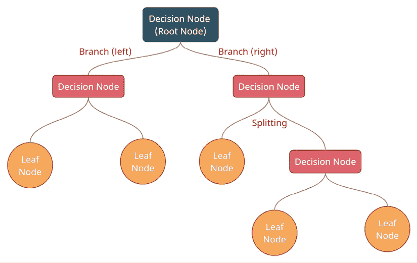
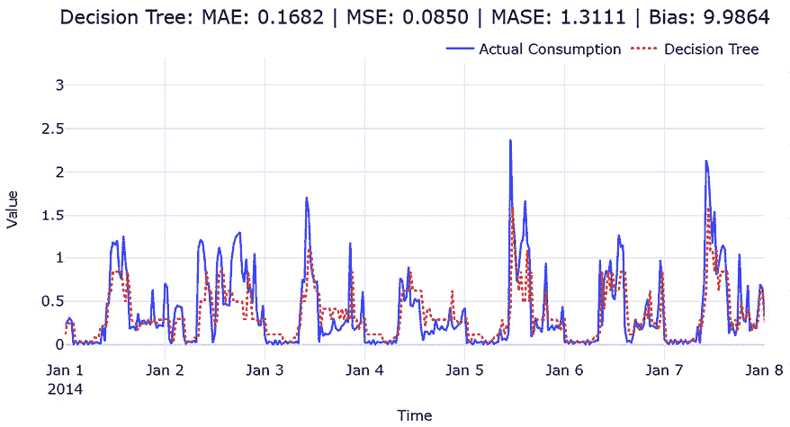
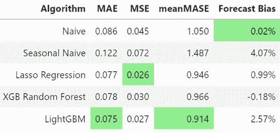

# 第八章：使用机器学习模型进行时间序列预测

在上一章中，我们开始将机器学习作为解决时间序列预测问题的工具。我们讨论了几种技术，如时间延迟嵌入和时间嵌入，这两者将时间序列预测问题作为机器学习范式中的经典回归问题。在本章中，我们将详细探讨这些技术，并通过本书中一直使用的伦敦智能电表数据集，实践这些技术。

本章将涵盖以下主题：

+   使用机器学习模型进行训练和预测

+   生成单步预测基准

+   标准化代码用于训练和评估机器学习模型

+   为多个家庭进行训练和预测

# 技术要求

您需要按照本书*前言*中的说明设置**Anaconda**环境，以便为本书中的代码提供一个包含所有必需库和数据集的工作环境。在运行笔记本时，任何额外的库都会被安装。

在使用本章代码之前，您需要运行以下笔记本：

+   `02-Preprocessing_London_Smart_Meter_Dataset.ipynb`位于`Chapter02`中

+   `01-Setting_up_Experiment_Harness.ipynb`位于`Chapter04`中

+   `01-Feature_Engineering.ipynb`位于`Chapter06`中

+   `02-Dealing_with_Non-Stationarity.ipynb`位于`Chapter07`中

+   `02a-Dealing_with_Non-Stationarity-Train+Val.ipynb`位于`Chapter07`中

本章的代码可以在[`github.com/PacktPublishing/Modern-Time-Series-Forecasting-with-Python-/tree/main/notebooks/Chapter08`](https://github.com/PacktPublishing/Modern-Time-Series-Forecasting-with-Python-/tree/main/notebooks/Chapter08)找到。

# 使用机器学习模型进行训练和预测

在*第五章*，*时间序列预测作为回归*中，我们讨论了监督式机器学习的示意图（*图 5.2*）。在示意图中，我们提到监督学习问题的目的是找到一个函数，，其中  是预测值，*X* 是作为输入的特征集， 是模型参数，*h* 是理想函数的近似。在本节中，我们将更详细地讨论 *h*，并看看如何使用不同的机器学习模型来估计它。

*h* 是任何近似理想函数的函数，但可以视为一个函数族中所有可能函数的元素。更正式地，我们可以这样说：


这里，*H* 是我们也称之为模型的一个函数族。例如，线性回归是一种模型或函数族。对于每个系数值，线性回归模型都会给出一个不同的函数，*H* 就是线性回归模型可以生成的所有可能函数的集合。

有许多种函数或模型可供选择。为了更全面地理解这一领域，我们需要参考其他机器学习资源。*进一步阅读*部分包含了一些可能帮助您开始学习的资源。至于本书的范围，我们将其狭义地定义为应用机器学习模型进行预测，而不是机器学习的全部内容。尽管我们可以使用任何回归模型，但我们将仅回顾几个流行且有用的时间序列预测模型，并观察它们的实际应用。我们鼓励您自己探索其他算法，熟悉它们。然而，在查看不同模型之前，我们需要再次生成几个基准。

# 生成单步预测基准

我们在*第四章*，*设置强基准预测*中回顾并生成了几个基准模型。但有一个小问题——预测范围。在*第六章*，*时间序列预测的特征工程*中，我们讨论了机器学习模型一次只能预测一个目标，而且我们坚持使用单步预测。我们之前生成的基准并非单步预测，而是多步预测。生成单步预测的基准算法，如 ARIMA 或 ETS，需要我们根据历史数据进行拟合，预测一步，然后再次拟合，增加一天数据。以这种迭代方式对测试或验证期进行预测需要我们迭代约 1,440 次（每天 48 个数据点，30 天），并且需要对我们选择的数据集中的所有家庭（在我们的例子中是 150 个）进行此操作。这将需要相当长的时间来计算。

我们选择了简单方法和季节性简单方法（*第四章*，*设置强基准预测*），这两种方法可以作为原生的 pandas 方法实现，用作生成单步预测的基准方法。

简单预测在单步预测中表现异常好，可以被认为是一个强有力的基准。在`Chapter08`文件夹中，有一个名为`00-Single_Step_Backtesting_Baselines.ipynb`的笔记本，它生成这些基准并将其保存到磁盘。让我们现在运行这个笔记本。该笔记本会为验证集和测试集生成基准，并将预测、指标和聚合指标保存到磁盘。测试期的聚合指标如下：


图 8.1：单步基准的聚合指标

为了简化这些模型的训练和评估，我们在整个过程中使用了统一的结构。让我们快速回顾一下这个结构，以便您能够更好地跟随笔记本的内容。

# 标准化代码以训练和评估机器学习模型

训练机器学习模型时有两个主要因素 —— *数据* 和 *模型* 本身。因此，为了标准化流程，我们定义了三个配置类（`FeatureConfig`、`MissingValueConfig` 和 `ModelConfig`），以及一个封装类（`MLForecast`），用于 scikit-learn 风格的估算器（`.fit - .predict`），以使过程更加顺畅。让我们逐一了解它们。

**笔记本提示：**

要跟随代码进行操作，请使用 `Chapter08` 文件夹中的 `01-Forecasting_with_ML.ipynb` 笔记本和 `src` 文件夹中的代码。

## FeatureConfig

`FeatureConfig` 是一个 Python `dataclass`，定义了一些在处理数据时必需的关键属性和函数。例如，连续型、分类型和布尔型列需要分别进行预处理，才能输入机器学习模型。让我们看看 `FeatureConfig` 包含了什么：

+   `date`：一个必填列，设置 DataFrame 中 `date` 列的名称。

+   `target`：一个必填列，设置 DataFrame 中 `target` 列的名称。

+   `original_target`：如果 `target` 包含已转换的目标（如对数转换、差分等），则 `original_target` 指定没有经过转换的目标列的名称。这对于计算依赖于训练历史的指标，如 MASE，非常重要。如果未提供此参数，则默认认为 `target` 和 `original_target` 是相同的。

+   `continuous_features`：一个连续特征列表。

+   `categorical_features`：一个分类特征列表。

+   `boolean_features`：一个布尔特征列表。布尔特征是分类特征，但只有两个独特值。

+   `index_cols`：在预处理过程中设置为 DataFrame 索引的列列表。通常，我们会将日期时间以及在某些情况下时间序列的唯一 ID 作为索引。

+   `exogenous_features`：一个外生特征列表。DataFrame 中的特征可能来自特征工程过程，如滞后或滚动特征，也可能来自外部数据源，例如我们数据集中的温度数据。这是一个可选字段，允许我们将外生特征与其余特征区分开来。此列表中的项应是 `continuous_features`、`categorical_features` 或 `boolean_features` 的子集。

除了对输入进行一些验证外，类中还有一个名为 `get_X_y` 的有用方法，包含以下参数：

+   `df`：一个包含所有必要列的 DataFrame，包括目标列（如果可用）。

+   `categorical`：一个布尔标志，用于指示是否包含分类特征。

+   `exogenous`：一个布尔标志，用于指示是否包含外生特征。

该函数返回一个元组 `(features, target, original_target)`。

我们只需像初始化任何其他类一样，初始化该类，并将特征名称分配给类的参数。包含所有特征的完整代码可在随附的笔记本中找到。

在设置`FeatureConfig`数据类后，我们可以将任何定义了特征的 DataFrame 传递给`get_X_y`函数，获取特征、目标和原始目标：

```py
train_features, train_target, train_original_target = feat_config.get_X_y(
    sample_train_df, categorical=False, exogenous=False
) 
```

如你所见，我们在这里没有使用类别特征或外生特征，因为我想专注于核心算法，并展示它们如何成为我们之前看到的其他经典时间序列模型的直接替代。我们将在*第十五章*，*全球深度学习预测模型策略*中讨论如何处理类别特征。

## MissingValueConfig

另一个关键设置是如何处理缺失值。我们在*第三章*，*分析与可视化时间序列数据*中看到了一些填充时间序列上下文中的缺失值的方法，并且我们已经填充了缺失值并准备好了数据集。但是，在将时间序列转换为回归问题所需的特征工程中，还会产生一些缺失值。例如，在创建滞后特征时，数据集中的最早日期将没有足够的数据来创建滞后，因此会留空。

**最佳实践：**

尽管用零或均值填充是大多数数据科学家社区的默认方法或常用方法，但我们应该始终尽力尽可能智能地填充缺失值。在滞后特征方面，填充零可能会扭曲特征。与其填充零，不如使用向后填充（使用列中的最早值向后填充），这可能会更合适。

一些机器学习模型自然处理空值或`NaN`特征，而对于其他机器学习模型，我们需要在训练之前处理这些缺失值。如果我们能定义一个`config`，为一些预期会有`NaN`信息的列设置如何填充这些缺失值，那将非常有帮助。`MissingValueConfig`是一个 Python `dataclass`，正是用来做这件事的。让我们看看它包含了什么：

+   `bfill_columns`：需要使用向后填充策略来填充缺失值的列名列表。

+   `ffill_columns`：需要使用向前填充策略来填充缺失值的列名列表。如果某列名同时出现在`bfill_columns`和`ffill_columns`中，则该列首先使用向后填充，剩余的缺失值则使用向前填充策略。

+   `zero_fill_columns`：需要用零填充的列名列表。

填充缺失值的顺序是`bfill_columns`，然后是`ffill_columns`，最后是`zero_fill_columns`。作为默认策略，数据类使用列均值填充缺失值，因此即使你没有为某列定义任何策略，缺失值也会使用列均值填充。有一个叫做`impute_missing_values`的方法，它接受 DataFrame 并根据指定的策略填充空单元格。

## ModelConfig

`ModelConfig`是一个 Python 的`dataclass`，它包含了关于建模过程的一些细节，比如是否对数据进行标准化、是否填充缺失值等等。让我们详细看一下它包含的内容：

+   `model`: 这是一个必需的参数，可以是任何 scikit-learn 风格的估算器。

+   `name`: 模型的字符串名称或标识符。如果未使用该参数，它将恢复为作为`model`传递的类名称。

+   `normalize`: 一个布尔标志，用于设置是否对输入应用`StandardScaler`。

+   `fill_missing`: 一个布尔标志，用于设置是否在训练之前填充空值。一些模型能够自然处理`NaN`，而其他模型则不能。

+   `encode_categorical`: 一个布尔标志，用于设置是否在拟合过程中将类别列进行编码。如果为`False`，则期望单独进行类别编码，并将其作为连续特征的一部分包含。

+   `categorical_encoder`: 如果`encode_categorical`为`True`，则`categorical_encoder`是我们可以使用的 scikit-learn 风格的编码器。

让我们看看如何定义`ModelConfig`数据类：

```py
model_config = ModelConfig(
    model=LinearRegression(),
    name="Linear Regression",
    normalize=True,
    fill_missing=True,
) 
```

它只有一个方法，`clone`，该方法会将估算器和配置克隆到一个新的实例中。

## MLForecast

最后但同样重要的是，我们有一个围绕 scikit-learn 风格模型的包装类。它使用我们之前讨论的不同配置来封装训练和预测函数。让我们看看初始化模型时有哪些可用的参数：

+   `model_config`: 我们在*ModelConfig*部分讨论过的`ModelConfig`类的实例。

+   `feature_config`: 我们之前讨论过的`FeatureConfig`类的实例。

+   `missing_config`: 我们之前讨论过的`MissingValueConfig`类的实例。

+   `target_transformer`: 来自`src.transforms`的目标转换器实例。它应支持`fit`、`transform`和`inverse_transform`。它还应返回带有日期时间索引的`pd.Series`，以确保无错误运行。如果我们单独执行了目标转换，那么在预测时也会使用它来执行`inverse_transform`。

`MLForecast`有一些功能，可以帮助我们管理模型生命周期，一旦初始化。让我们看一下。

### 拟合函数

`fit`函数的目的与 scikit-learn 的`fit`函数相似，但它额外处理了标准化、类别编码和目标转换，使用了三个配置中的信息。该函数的参数如下：

+   `X`: 这是一个包含要在模型中使用的特征（作为列）的 pandas DataFrame。

+   `y`: 这是目标，可以是 pandas DataFrame、pandas Series 或 numpy 数组。

+   `is_transformed`: 这是一个布尔参数，告诉我们目标是否已经被转换。如果为`True`，即使我们已经用`target_transformer`初始化了对象，`fit`方法也不会转换目标。

+   `fit_kwargs`：这是一个 Python 字典，包含需要传递给估算器`fit`函数的关键字参数。

### predict 函数

`predict`函数处理推断。它是对 scikit-learn 估算器的`predict`函数的封装，但与`fit`一样，它还做了一些其他事情，比如标准化、分类编码和反转目标转换。这个函数只有一个参数：

+   `X`：一个包含特征的 pandas DataFrame，作为模型的列。DataFrame 的索引将传递到预测中。

### feature_importance 函数

`feature_importance`函数从模型中提取特征重要性（如果有的话）。对于线性模型，它提取系数；而对于基于树的模型，它提取内建的特征重要性并返回一个排序后的 DataFrame。

## 用于评估模型的辅助函数

虽然我们之前看到的其他函数处理了核心训练和预测，我们还希望评估模型、绘制结果等等。我们在笔记本或代码库中也定义了这些函数。下面的函数是用来在笔记本中评估模型的：

```py
def evaluate_model(
    model_config,
    feature_config,
    missing_config,
    train_features,
    train_target,
    test_features,
    test_target,
):
    ml_model = MLForecast(
        model_config=model_config,
        feature_config=feat_config,
        missing_config=missing_value_config,
    )
    ml_model.fit(train_features, train_target)
    y_pred = ml_model.predict(test_features)
    feat_df = ml_model.feature_importance()
    metrics = calculate_metrics(test_target, y_pred, model_config.name, train_target)
    return y_pred, metrics, feat_df 
```

这为我们提供了评估所有不同模型的标准方法，并且能够在大规模上自动化这个过程。我们还有一个用于计算指标的函数`calculate_metrics`，它定义在`src/forecasting/ml_forecasting.py`中。

本书中提供的标准实现并非一刀切的方法，而是最适合本书的流程和数据集的方法。请不要将其视为一个强健的库，而是一个很好的起点和指南，帮助你开发自己的代码。

现在我们有了基准线和应用不同模型的标准方法，让我们回到讨论不同模型的内容。接下来的讨论中，我们暂时不考虑*时间*因素，因为我们已将时间序列预测问题转化为回归问题，并将*时间*作为问题的特征（滞后和滚动特征）进行处理。

## 线性回归

线性回归是一类函数，具有以下形式：


在这里，*k*是模型中的特征数量，且是模型的参数。每个特征都有一个，还有一个，我们称之为截距，它是从数据中估算出来的。实质上，输出是特征向量*X*[i]的线性组合。顾名思义，这是一个线性函数。

模型参数可以通过数据 D(*X*[i,] *y*[i])来估算，使用优化方法和损失函数，最常用的估算方法是**普通最小二乘法**（**OLS**）。在这里，我们找到模型参数，它最小化残差平方和（**均方误差**（**MSE**））：


这里的损失函数非常直观。我们本质上是在最小化训练样本与我们预测点之间的距离。平方项作为一种技术，能够避免正负误差相互抵消。除了损失函数的直观性之外，另一个广泛选择它的原因是最小二乘法有解析解，因此我们不需要使用像梯度下降这样计算密集型的优化技术。

线性回归深深植根于统计学，在正确的假设下，它可以成为一个强大的工具。线性回归通常与五个假设相关，如下所示：

+   自变量和因变量之间的关系是线性的。

+   误差服从正态分布。

+   误差的方差在所有自变量的值范围内是恒定的。

+   误差中没有自相关性。

+   自变量之间几乎没有相关性（多重共线性）。

但是，除非你担心使用线性回归来得出预测区间（预测结果可能出现在某个区间内的概率），否则我们可以在一定程度上忽略除第一个假设外的所有假设。

线性假设（第一个假设）很重要，因为如果变量之间不是线性相关的，会导致欠拟合，从而表现不佳。我们可以通过将输入投影到更高维空间中，在一定程度上解决这个问题。从理论上讲，我们可以将一个非线性问题投影到更高维空间，在那里问题变成线性。例如，考虑一个非线性函数，。如果我们在和的输入空间中运行线性回归，我们知道得到的模型将会严重欠拟合。但如果我们通过使用多项式变换将输入空间从和投影到，和，那么*y*的函数将成为完美的线性拟合。

多重共线性假设（最后一个假设）与线性函数的拟合部分相关，因为当我们有高度相关的自变量时，估计的系数会变得非常不稳定且难以解释。拟合函数仍然能够很好地工作，但由于存在多重共线性，即使是输入中的微小变化也会导致系数的幅度和符号发生变化。如果你正在使用纯线性回归，检查多重共线性是一个最佳实践。这通常是时间序列中的一个问题，因为我们提取的特征，如滞后和滚动特征，可能会相互关联。因此，在使用和解释时间序列数据上的线性回归时，我们需要格外小心。

现在，让我们看看如何使用线性回归并评估来自验证数据集的一个样本家庭的拟合效果：

```py
from sklearn.linear_model import LinearRegression
model_config = ModelConfig(
    model=LinearRegression(),
    name="Linear Regression",
    # LinearRegression is sensitive to normalized data
    normalize=True,
    # LinearRegression cannot handle missing values
    fill_missing=True,
)
y_pred, metrics, feat_df = evaluate_model(
    model_config,
    feat_config,
    missing_value_config,
    train_features,
    train_target,
    test_features,
    test_target,
) 
```

单步预测看起来不错，且已经优于天真预测（MAE = 0.173）：


图 8.2：线性回归预测

模型的系数，（可以通过已训练的 scikit-learn 模型的`coef_`属性访问），展示了每个特征对输出的影响程度。因此，提取并绘制这些系数为我们提供了对模型的第一层可视化。让我们来看看模型的系数：


图 8.3：线性回归的特征重要性（前 15 名）

如果我们查看特征重要性图表中的*Y*轴，可以看到它是以十亿为单位的，因为某些特征的系数以十亿的数量级存在。我们还可以看到这些特征是基于傅里叶级数的特征，并且彼此相关。尽管我们有很多系数在十亿级别，但我们可以发现它们分布在零的两侧，因此它们在函数中实际上会相互抵消。这就是我们之前讨论的多重共线性问题。我们可以通过去除多重共线特征并进行某种特征选择（前向选择或后向消除）来使线性模型变得更好。

但是，既然如此，不如我们来看看可以对线性模型进行的一些修改，这些修改能使其在面对多重共线性和特征选择时更为稳健。

## 正则化线性回归

我们在*第五章*《时间序列预测与回归》中简要讨论了正则化，并提到正则化在一般意义上是我们在学习过程中对学习函数复杂度进行约束的任何手段。线性模型变得更加复杂的一种方式是系数的幅度很大。例如，在线性拟合中，我们的系数为 200 亿。这个特征的任何微小变化都会导致预测结果出现巨大波动。直观地看，如果我们有一个较大的系数，函数就会变得更加灵活和复杂。我们可以通过应用正则化（如权重衰减）来解决这个问题。权重衰减是指在损失函数中加入一个惩罚项，用于惩罚系数的幅度。损失函数，即残差平方和，现在变为如下形式：


这里，*W* 是权重衰减， 是正则化的强度。

*W* 通常是权重矩阵的范数。在线性代数中，矩阵的范数是衡量其元素大小的一种方式。矩阵有许多种范数，但用于正则化的两种最常见的范数是 **L1** 范数和 **L2** 范数。当我们使用 L1 范数来正则化线性回归时，我们称之为 **lasso 回归**，而当我们使用 L2 范数时，我们称之为 **ridge 回归**。当我们应用权重衰减正则化时，我们迫使系数变小，这意味着它也充当了内部特征选择的作用，因为那些没有提供太多价值的特征会得到非常小或零的系数（取决于正则化类型），这意味着它们在最终的函数中贡献甚微甚至没有贡献。

L1 范数定义为矩阵各元素绝对值的和。对于权重衰减正则化，L1 范数可以表示为如下形式：


L2 范数定义为矩阵各个值的平方和。对于权重衰减正则化，L2 范数可以表示为如下形式：


通过将这个项添加到线性回归的损失函数中，我们迫使系数变小，因为优化器在减少 RSS 的同时，还会激励它减少 *W*。

我们思考正则化的另一个方式是从线性代数和几何学的角度来看。

接下来的部分讨论正则化的几何直觉。虽然这将使你对正则化的理解更加深刻，但它并不是理解本书其余部分的必备条件。所以，如果你时间紧迫或者以后有时间再回来复习，你可以跳过接下来的部分，只阅读 *关键点* 提示。

### 正则化——几何视角

如果我们从稍微不同的角度来看 L1 和 L2 范数，我们会发现它们是距离的度量。

让*B*表示线性回归中所有系数的向量，。向量是一个数字数组，但从几何学的角度来看，它也是从原点到*n*维坐标空间中某一点的箭头。现在，L2 范数仅仅是该向量 *B* 所定义的空间中从原点到该点的欧几里得距离。L1 范数是从原点到该点的曼哈顿距离或出租车距离，该点也由向量 *B* 定义。让我们通过图示来看看这一点：


图 8.4：欧几里得距离与曼哈顿距离

欧几里得距离是从原点到该点的直线距离。但如果我们只能平行于两个坐标轴移动，那么我们首先需要沿一个坐标轴走距离 ，然后再沿另一个坐标轴走距离 。这就是曼哈顿距离。

假设我们在一个城市（例如曼哈顿），那里建筑物排布成方形街区，直路相交成直角，我们想从 A 点到 B 点。欧几里得距离是从 A 点到 B 点的直接距离，在现实中，只有在我们能在建筑物顶上进行跑酷的情况下才能实现。而曼哈顿距离则是出租车沿着直角道路从 A 点到 B 点的实际行驶距离。

为了进一步发展对 L1 和 L2 范数的几何直觉，我们进行一个思想实验。如果我们在二维空间中移动点 ，同时保持欧几里得距离或 L2 范数不变，我们将得到一个以原点为中心的圆。在三维空间中，这将变成一个球体，在 *n* 维空间中则是一个超球体。如果我们保持 L1 范数不变而追踪相同的路径，我们将得到一个以原点为中心的菱形。在三维空间中，这将变成一个立方体，在 *n* 维空间中是一个超立方体。

现在，当我们优化权重时，除了减少损失函数的主要目标外，我们还鼓励系数保持在一个定义的距离（范数）内，远离原点。从几何角度来看，这意味着我们要求优化找到一个向量 ，该向量在最小化损失函数的同时，也保持在由范数定义的几何形状（圆形或正方形）内。我们可以在以下图表中看到这一点：


图 8.5：使用 L1 范数（套索回归）与 L2 范数（岭回归）进行正则化

图中的同心圆是损失函数的等高线，最内圈为最低点。随着我们向外移动，损失增加。因此，正则化回归不会选择 ，而是选择一个与范数几何形状相交的 。

这种几何解释也使得理解岭回归和套索回归之间的另一个关键区别变得更容易。由于 L1 范数的作用，套索回归会产生一个稀疏解。之前，我们提到过权重衰减正则化会进行隐式特征选择。但根据你是应用 L1 还是 L2 范数，隐式特征选择的方式是不同的。

**关键点：**

对于 L2 范数，较不相关特征的系数会被推近零，但不会完全为零。该特征仍然会在最终的函数中发挥作用，但其影响会微乎其微。另一方面，L1 范数则将这些特征的系数完全推向零，从而得到一个稀疏解。因此，L1 正则化促进稀疏性和特征选择，而 L2 正则化通过将系数缩小到接近零来减少模型复杂度，但不一定会完全消除任何系数。

使用正则化的几何解释可以更好地理解这一点。在优化中，通常在极值点或*角落*处找到有趣的点。圆形没有角落，因此创建了 L2 范数；极小值可以位于圆的任何边缘。但对于菱形，我们有四个角，极小值会出现在这些角落。因此，使用 L2 范数时，解可以接近零，但不一定是零。然而，使用 L1 范数时，解会出现在角落处，在那里系数可以被压缩到绝对零。

现在，让我们看看如何使用岭回归并评估我们验证数据集中一个家庭的拟合情况：

```py
from sklearn.linear_model import RidgeCV
model_config = ModelConfig(
    model=RidgeCV(),
    name="Ridge Regression",
    # RidgeCV is sensitive to normalized data
    normalize=True,
    # RidgeCV does not handle missing values
    fill_missing=True
)
y_pred, metrics, feat_df = evaluate_model(
    model_config,
    feat_config,
    missing_value_config,
    train_features,
    train_target,
    test_features,
    test_target,
) 
```

让我们来看看`RidgeCV`的单步预测。它看起来与线性回归非常相似。即使是 MAE，对于这个家庭来说也完全相同：


图 8.6：岭回归预测

但用 L2 正则化模型来看系数是很有意思的。让我们来看看模型的系数：


图 8.7：岭回归特征重要性（前 15 名）

现在，*Y*轴看起来合理且较小。多重共线性特征的系数已经缩小到一个更合理的水平。像滞后特征这样的特征，理应具有较大影响力，已经占据了前几位。正如你可能记得的，在线性回归中（*图 8.3*），这些特征被傅里叶特征的巨大系数所压制。我们这里只绘制了前 15 个特征，但如果查看完整的列表，你会看到很多特征的系数接近零。

现在，让我们尝试对这个家庭样本进行套索回归：

```py
from sklearn.linear_model import LassoCV
model_config = ModelConfig(
    model=LassoCV(),
    name="Lasso Regression",
    # LassoCV is sensitive to normalized data
    normalize=True,
    # LassoCV does not handle missing values
    fill_missing=True
)
y_pred, metrics, feat_df = evaluate_model(
    model_config,
    feat_config,
    missing_value_config,
    train_features,
    train_target,
    test_features,
    test_target,
) 
```

让我们来看看`LassoCV`的单步预测。像岭回归一样，与线性回归几乎没有视觉差异：


图 8.8：套索回归预测

让我们来看看模型的系数：


图 8.9：套索回归特征重要性（前 15 名）

系数与岭回归非常相似，但如果查看完整的系数列表（在笔记本中），你会看到很多特征的系数为零。

即使在 MAE、MSE 等指标相同的情况下，岭回归或套索回归仍然比线性回归更受偏好，因为正则化回归带来了额外的稳定性和鲁棒性，尤其是在预测中，多重共线性几乎总是存在。但我们需要记住，所有的线性回归模型仍然只是捕捉线性关系。如果数据集具有非线性关系，那么线性回归的拟合效果不会太好，有时甚至会非常糟糕。

现在，让我们换个方向，看看另一类模型——**决策树**。

## 决策树

决策树是另一类函数，其表达能力远超过线性函数。决策树将特征空间划分为不同的子空间，并对每个子空间拟合一个非常简单的模型（例如平均值）。让我们通过一个例子来理解这种划分是如何工作的。我们考虑一个回归问题，目标是预测*Y*，并且只有一个特征*X*，如下图所示：


图 8.10：由决策树划分的特征空间

我们可以立即看到，拟合一个线性函数会导致欠拟合。但决策树的做法是将特征空间（在这里就是*X*）划分为不同的区域，其中目标*Y*是相似的，然后对每个区域拟合一个简单的函数，如平均值（因为这是一个回归问题）。在这种情况下，决策树将特征空间划分为 A、B 和 C 三个区域。现在，对于任何落入区域 A 的*X*，预测函数将返回区域 A 中所有点的平均值。

这些划分是通过使用数据创建决策树来形成的。直观地说，决策树通过创建一组 if-else 条件来划分特征空间，并尝试找到最佳的划分方式，以最大化目标变量在每个划分中的同质性。理解决策树作用的一种有帮助的方法是将数据点想象成珠子，沿着树流动，根据其特征选择路径，最终停留在一个最终位置。在我们讨论如何从数据中创建决策树之前，让我们先看看它的组成部分，并理解相关的术语：



图 8.11：决策树的结构

决策树中有两种类型的节点——**决策节点** 和 **叶节点**。决策节点是我们之前提到的 *if-else* 语句。这个节点将有一个基于数据点流向左支路或右支路的条件。位于最顶部的决策节点有一个特殊的名称——**根节点**。最后，根据条件划分数据点并将其导向右支路或左支路的过程被称为**划分**。叶节点是没有其他分支的节点。它们是“珠子流经树”的类比中的最终停靠点。这些就是我们在本节中讨论的划分。

正式地，我们可以定义由具有 *M* 个划分的决策树生成的函数 *P*[1]、*P*[2]、…、*P*[M]，如下所示：


在这里，*x* 是输入，*c*[m] 是该区域的常数响应，*P*[m]，而 *I* 是一个函数，当  时为 1；否则，它为 0。

对于回归树，我们通常采用平方损失作为损失函数。在这种情况下，*c*[m] 通常设置为所有 *y* 的平均值，其中对应的 *x* 落入 *P*[m] 划分中。

现在我们知道了决策树是如何工作的，剩下的就是理解如何决定在什么特征上进行划分，以及如何划分特征。

多年来，已经提出了许多算法来根据数据创建决策树，比如 ID3、C4.5、CART 等。在这些算法中，使用 **分类与回归树**（**CART**）是最流行的方法之一，并且它也支持回归。因此，本书中我们将坚持使用 CART。分类树用于目标变量为类别型（例如，预测类标签）时。回归树用于目标变量为连续型（例如，预测数值）时。

全局最优的二分划分集合，能够最小化平方和，通常是无法处理的。因此，我们采用贪心算法来创建决策树。贪心优化是一种启发式方法，它通过逐步构建解决方案，每一步选择局部最优解。因此，我们不会全局寻找最佳的特征划分，而是通过逐个节点创建决策树，在每个阶段选择最优的特征划分。对于回归树，我们选择一个划分特征 *f* 和划分点 *s*，使得它创建两个划分 *P*[1] 和 *P*[2]，其最小化如下：


在这里，*c*[1] 和 *c*[2] 是所有 *y* 的平均值，其中对应的 *x* 落在 *P*[1] 和 *P*[2] 之间。

因此，通过使用这个标准，我们可以不断地将区域进一步划分。每划分一次，我们就增加一次树的**深度**。在某个时刻，我们会开始过拟合数据集。但是如果我们没有做足够的划分，可能也会导致欠拟合数据。一个策略是当我们达到预定的深度时停止进一步的划分。在 `DecisionTreeRegressor` 的 scikit-learn 实现中，这对应于 `max_depth` 参数。这个超参数需要通过验证数据集进行估算。还有其他策略可以停止划分，比如设置划分所需的最小样本数（`min_samples_split`），或者进行划分所需的最小成本下降（`min_impurity_decrease`）。有关 `DecisionTreeRegressor` 中参数的完整列表，请参阅文档 [`scikit-learn.org/stable/modules/generated/sklearn.tree.DecisionTreeRegressor.html`](https://scikit-learn.org/stable/modules/generated/sklearn.tree.DecisionTreeRegressor.html)。

现在，让我们看看如何使用决策树并在验证数据集中的一个家庭样本上评估拟合情况：

```py
from sklearn.tree import DecisionTreeRegressor
model_config = ModelConfig(
    model=DecisionTreeRegressor(max_depth=4, random_state=42),
    name="Decision Tree",
    # Decision Tree is not affected by normalization
    normalize=False,
    # Decision Tree in scikit-learn does not handle missing values
    fill_missing=True,
)
y_pred, metrics, feat_df = evaluate_model(
    model_config,
    feat_config,
    missing_value_config,
    train_features,
    train_target,
    test_features,
    test_target,
) 
```

让我们来看一下 `DecisionTreeRegressor` 的单步预测。它的表现不如我们迄今为止运行的线性回归或正则化线性回归模型：



图 8.12：决策树预测

对于线性模型，一些系数帮助我们理解每个特征在预测函数中的重要性。而在决策树中，我们没有系数，但特征的重要性依然是通过损失函数的平均下降进行估算的，这一变化归因于树构建过程中的每个特征。在 scikit-learn 模型中，我们可以通过训练模型的 `feature_importance_` 属性来访问这个特征重要性。让我们来看看这个特征重要性：


图 8.13：决策树的特征重要性（前 15）

**最佳实践：**

尽管默认的特征重要性是快速且简便的方式来检查不同特征的使用情况，但在将其用于其他目的（如特征选择或业务决策）之前，应谨慎处理。这种评估特征重要性的方法会给一些连续特征和高基数类别特征误导性地赋予过高的值。建议使用置换重要性（`sklearn.inspection.permutation_importance`）来进行更好的特征重要性评估，这是一种简单但更好的评估方法。*进一步阅读*部分包含了一些关于模型可解释性的资源，这些资源可以作为理解模型影响因素的良好起点。

在这里，我们可以看到重要的特征，如滞后特征和季节性滚动特征，排在了最上面。

我们在*第五章*，*时间序列预测作为回归*中讨论了过拟合和欠拟合。这些也在机器学习术语中被称为高偏差（欠拟合）和高方差（过拟合）（*进一步阅读*部分包含了链接，如果你想了解更多关于偏差、方差及它们之间的权衡问题，可以参考这些资源）。

决策树是一种非常容易发生过拟合或高方差的算法，因为与线性函数不同，决策树在具有足够表现力的情况下，能够通过划分特征空间来记住训练数据集的特征。另一个关键缺点是决策树无法外推。假设我们有一个特征*f*，它线性地增加我们的目标变量*y*。我们拥有的训练数据中，*f*[max]是*f*的最大值，*y*[max]是*y*的最大值。由于决策树划分了特征空间，并为每个区域分配了一个常数值，即使我们提供了*f* > *f*[max]，它依然会仅仅给出一个预测值为的结果。

现在，让我们来看一个使用决策树模型，但在集成方法中使用的模型，并且不容易发生过拟合。

## 随机森林

随机森林是一种集成学习方法，在训练过程中构建多个决策树，并将它们的结果结合在一起，以提高准确性和鲁棒性。它在分类和回归任务中都表现出色，通过袋装法和特征随机性减少了过拟合，并提高了预测性能。

**集成学习**是一种使用多个模型或专家，并通过某种方式将它们结合来解决手头问题的过程。它借用了*集体智慧*的方法，这一方法认为一群人的决策通常比其中任何一个人做出的决策更为准确。在机器学习中，这些单独的模型被称为**基本学习器**。单一模型可能因为过拟合数据集而表现不佳，但当我们将多个这样的模型结合起来时，它们可以形成一个强大的学习器。

**袋装法**（Bagging）是一种集成学习方法，在这种方法中，我们使用自助采样（从总体中反复有放回地抽取样本）来绘制数据集的不同子集，在每个子集上训练弱学习器，然后通过平均或投票的方式将它们结合在一起（分别用于回归和分类）。袋装法最适合于高方差、低偏差的弱学习器，而决策树就是一个非常适合与袋装法配合使用的成功候选者。从理论上讲，袋装法保持弱学习器的偏差水平不变，但减少了方差，从而提高了模型的表现。但如果弱学习器之间存在相关性，袋装法的效果将会受到限制。

2001 年，Leo Brieman 提出了**随机森林**，它在标准的袋装法基础上作出了重要修改，通过构建大量去相关的决策树来改进。为了确保在自助采样数据集上生成的所有树不相互关联，他提出略微修改树的构建过程。

**参考文献检查：**

随机森林的原始研究论文在 *参考文献* 部分被引用为参考文献 *1*。

在随机森林算法中，我们决定构建多少棵树。我们称之为 *M* 棵树。现在，对于每棵树，重复以下步骤：

1.  从训练数据集中抽取一个自助采样样本。

1.  从所有特征中随机选择 *f* 个特征。

1.  仅使用 *f* 个特征选择最佳分裂，并将节点分裂成两个子节点。

1.  重复 *步骤 2* 和 *步骤 3*，直到达到任何定义的停止标准。

这组 *M* 棵树就是随机森林。与常规树的关键区别在于每次分裂时特征的随机抽样，这增加了随机性并减少了不同树输出之间的相关性。在预测时，我们使用每棵 *M* 树来获得一个预测结果。对于回归问题，我们取它们的平均值，而对于分类问题，我们取多数投票。我们从随机森林中学习到的回归预测函数如下：


这里，*T*t 是随机森林中 *t*^(th) 棵树的输出。

我们需要控制决策树复杂度的所有超参数在这里同样适用（来自 scikit-learn 的 `RandomForestRegressor`）。除了这些之外，我们还有两个其他重要的参数——集成中要构建的树的数量（`n_estimators`）和每次分裂时随机选择的特征数量（`max_features`）。

现在，让我们看看如何使用随机森林并在验证数据集中的一个样本家庭上评估拟合效果：

```py
from sklearn.ensemble import RandomForestRegressor
model_config = ModelConfig(
    model=RandomForestRegressor(random_state=42, max_depth=4),
    name="Random Forest",
    # RandomForest is not affected by normalization
    normalize=False,
    # RandomForest in scikit-learn does not handle missing values
    fill_missing=True,
)
y_pred, metrics, feat_df = evaluate_model(
    model_config,
    feat_config,
    missing_value_config,
    train_features,
    train_target,
    test_features,
    test_target,
) 
```

让我们看看 `RandomForestRegressor` 的这一步预测。它比决策树更好，但不如线性模型。然而，我们应该记住，我们还没有调优模型，可能通过设置正确的超参数能够获得更好的结果。

现在，让我们看看使用随机森林生成的预测：


图 8.14：随机森林预测

就像决策树中的特征重要性一样，随机森林也有一个非常类似的机制来估计特征重要性。由于我们在随机森林中有很多棵树，我们会累积所有树中的分裂标准的减少，并得出一个单一的特征重要性。我们可以通过使用训练模型的 `feature_importance_` 属性来访问这一点。让我们来看一下特征重要性：


图 8.15：决策树的特征重要性（前 15 名）

在这里，我们可以看到特征重要性与决策树非常相似。关于这种特征重要性的警告同样适用于这里。这只是一种粗略的方式来看模型在内部使用了哪些特征。

通常，随机森林在许多数据集上表现良好，几乎不需要调整，因此随机森林在机器学习中非常流行。由于随机森林不容易过拟合，这也增加了它的吸引力。但由于随机森林使用决策树作为弱学习器，决策树无法外推的问题也会传递给随机森林。

`scikit-learn`中实现的随机森林在树的数量和数据量较大时可能会变得较慢。`XGBoost`库中的`XGBRFRegressor`提供了一个随机森林的替代实现，特别是在较大的数据集上，由于`XGBoost`优化的算法和并行化能力，它可能会更快。此外，`XGBRFRegressor`使用的超参数与`scikit-learn`的随机森林类似，使得在调整模型时切换实现方式相对简单。在大多数情况下，这是一个直接替代，几乎能得到相同的结果。细微的差异来源于一些小的实现细节。我们在笔记本中也使用了这个变体。由于显而易见的运行时考虑，未来我们更倾向于使用这种变体。它还原生支持缺失值处理，避免了额外的预处理步骤。有关实现的更多细节以及如何使用它，可以参见[`xgboost.readthedocs.io/en/latest/tutorials/rf.html`](https://xgboost.readthedocs.io/en/latest/tutorials/rf.html)。

现在，让我们看一下一种最后的函数族，它是最强大的学习方法之一，并且在各种数据集上得到了极好的验证——梯度提升。

## 梯度提升决策树

提升法，像袋装法一样，是另一种集成方法，使用一些弱学习器来生成强大的模型组合。袋装法和提升法的关键区别在于弱学习器的组合方式。与袋装法在自助采样数据集上并行构建不同的模型不同，提升法按顺序使用弱学习器，每次弱学习器都会应用于反复修改过的数据版本。

为了理解加法函数的公式，让我们考虑这个函数：


我们可以将这个函数拆分成*f*1= 25，*f*2= *x*²，*f*3= cos(*x*)，并将*F*(*x*)重新写成如下形式：

*F*(*x*) = *f*1 + *f*2 + *f*3

这是我们在提升法中学习的加法集成函数。尽管从理论上讲，我们可以使用任何弱学习器，但决策树是最常见的选择。因此，我们使用决策树来探讨梯度提升是如何工作的。

早些时候，当我们讨论决策树时，我们看到一个具有*M*个分区的决策树，*P*[1]，*P*[2]，…，*P*[M]，其形式如下：


在这里，*x* 是输入，*C*[m] 是该区域的常数响应，*P*[m]，*I* 是一个函数，如果 ，则为 1；否则为 0。一个增强决策树模型是这些树的总和：


由于为所有树在集成中找到最佳分区 *P* 和常数值 *c* 是一个非常困难的优化问题，我们通常采用一种次优的阶段性解决方案，在构建集成时逐步优化每一步。在梯度提升中，我们使用损失函数的梯度来指导优化过程，因此得名“梯度提升”。

让我们在训练中使用的损失函数为 。由于我们观察的是一种逐步加法的功能形式，我们可以将  替换为 ，其中  是前 *k-1* 棵树的预测总和，*T*k 是第 *k* 阶段树的预测。我们来看一下用于训练数据 *D*（有 *N* 个样本）的梯度提升学习过程：

1.  通过最小化损失函数来初始化模型，使用常数值：


+   *b*[0] 是在第 0 次迭代中最小化损失函数的模型预测。在这个迭代中，我们还没有任何弱学习者，这个优化与任何特征无关。

+   对于平方误差损失，这相当于所有训练样本的平均值，而对于绝对误差损失，它是中位数。

1.  现在我们有了初步解，可以开始树构建过程。对于 *k=1 到 M*，我们必须执行以下操作：

    1.  对所有训练样本计算 ：

        +   *r*[k] 是损失函数关于 *F*(*x*) 相对于上一轮迭代的导数。它也叫做伪残差。

        +   对于平方误差损失，这只是残差（）。

    1.  建立一个常规回归树，针对 *r*[k] 值，使用 *M*[k] 个分区或叶节点，*P*[mk]。

    1.  计算 

        +    是当前阶段叶节点或分区值的缩放因子。

        +    是当前阶段决策树学习到的函数。

    1.  更新 

        +    是收缩参数或学习率。

这种“增强”前一个弱模型误差的过程赋予了算法它的名字——梯度提升，其中梯度指的是前一个弱模型的残差。

提升（Boosting）通常是一种高方差算法。这意味着过拟合训练数据集的风险相当高，因此需要采取足够的措施来确保不会发生过拟合。在梯度提升树中，已经实现了多种正则化和容量约束方法。与往常一样，决策树为了减少容量以适应数据的所有关键参数在这里依然有效，因为弱学习器是决策树。除此之外，还有两个其他的关键参数——树的数量，*M*（在 scikit-learn 中为 `n_estimators`），以及学习率，（在 scikit-learn 中为 `learning_rate`）。

当我们在加法形式中应用学习率时，本质上是在缩小每个弱学习器的影响力，从而减少任何一个弱学习器对整体函数的影响。这最初被称为收缩（shrinkage），但现在，在所有流行的梯度提升树实现中，它被称为学习率。树的数量和学习率是高度互相依赖的。对于相同的问题，如果我们减少学习率，就需要更多的树。经验表明，较低的学习率可以改善泛化误差。因此，一种非常有效且便捷的方法是将学习率设置为非常低的值（<0.1），将树的数量设置为非常高的值（>5,000），并通过早停法训练梯度提升树。早停法是指在训练模型时，我们使用验证数据集来监控模型的外部样本表现。当外部样本误差不再减少时，我们停止向集成中添加更多的树。

许多实现采用的另一个关键技术是子采样（subsampling）。子采样可以在行和列上进行。行子采样类似于自助采样（bootstrapping），即每个候选模型在数据集的子样本上训练。列子采样类似于随机森林中的随机特征选择。两种技术都为集成引入了正则化效果，有助于减少泛化误差。像 `XGBoost` 和 `LightGBM` 等一些梯度提升树的实现直接在目标函数中实现了 L1 和 L2 正则化。

有许多回归梯度提升树的实现。以下是一些流行的实现：

+   scikit-learn 中的 `GradientBoostingRegressor` 和 `HistGradientBoostingRegressor`

+   由 T Chen 开发的 XGBoost

+   来自 Microsoft 的 LightGBM

+   来自 Yandex 的 CatBoost

这些实现中的每一种都在标准的梯度提升算法上做出了从细微到非常根本的改动。我们在*进一步阅读*部分包含了一些资源，您可以通过这些资源了解这些差异，并熟悉它们支持的不同参数。

在本次练习中，我们将使用微软研究院的 LightGBM，因为它是最快且表现最佳的实现之一。LightGBM 和 CatBoost 还原生支持类别特征并处理缺失值。

**参考检查：**

XGBoost、LightGBM 和 CatBoost 的原始研究论文在*参考文献*部分分别被引用为*2*、*3*和*4*。

现在，让我们看看如何使用 LightGBM 并在验证数据集中的一个家庭样本上评估拟合效果：

```py
from lightgbm import LGBMRegressor
model_config = ModelConfig(
    model=LGBMRegressor(random_state=42),
    name="LightGBM",
    # LightGBM is not affected by normalization
    normalize=False,
    # LightGBM handles missing values
    fill_missing=False,
)
y_pred, metrics, feat_df = evaluate_model(
    model_config,
    feat_config,
    missing_value_config,
    train_features,
    train_target,
    test_features,
    test_target,
) 
```

让我们看看从 `LGBMRegressor` 获得的单步预测。它已经明显优于我们迄今为止尝试的所有其他模型：


图 8.16：LightGBM 预测

与决策树中的特征重要性类似，梯度提升法（Gradient Boosting）也有一个非常相似的机制来估计特征重要性。集成模型的特征重要性由所有树中每个特征的划分标准减少量的平均值给出。这可以通过训练模型的`feature_importance_`属性在 scikit-learn API 中访问。让我们来看一下特征重要性：


图 8.17：LightGBM 特征重要性（前 15 名）

有多种方式可以从模型中获取特征重要性，每种实现的计算方式略有不同。这些方式是由参数控制的。最常见的提取方式（使用 LightGBM 术语）是 `split` 和 `gain`。如果我们选择 `split`，特征重要性就是特征用于划分树中节点的次数。另一方面，`gain` 是划分标准的总减少量，可以归因于任何特征。*图 8.17* 显示了 `split`，这是 LightGBM 中的默认值。我们可以看到，特征重要性的顺序与决策树或随机森林非常相似，几乎相同的特征占据了前三名。

**梯度提升决策树**（**GBDTs**）通常在表格数据和时间序列上表现非常好，回归任务也不例外。这个非常强大的模型通常是近年来几乎所有 Kaggle 时间序列预测竞赛获胜作品的一部分。虽然它是最好的机器学习模型家族之一，但它仍然有一些缺点：

+   GBDT 是高方差算法，因此容易过拟合。这就是为什么在大多数成功实现的 GBDT 中以不同的方式应用了各种正则化技术。

+   GBDT 通常需要更长的训练时间（尽管许多现代实现已经加速了这一过程），并且不像随机森林那样容易进行并行化。在随机森林中，我们可以并行训练所有的树，因为它们彼此独立。但在 GBDT 中，算法的顺序性限制了并行化。所有成功的实现都有一些巧妙的方式来在创建决策树时启用并行化。LightGBM 具有多种并行化策略，例如特征并行、数据并行和投票并行。有关这些策略的详细信息可以在[`lightgbm.readthedocs.io/en/latest/Features.html#optimization-in-distributed-learning`](https://lightgbm.readthedocs.io/en/latest/Features.html#optimization-in-distributed-learning)找到，值得理解。该库的文档还包含一个有用的指南，帮助选择这些并行化策略之间的优先级，表格中有详细说明：


图 8.18：LightGBM 中的并行化策略

+   外推是 GBDT 的一个问题，就像所有基于树的模型一样。GBDT 在外推上有一些非常微弱的潜力，但并没有解决这个问题的方法。因此，如果你的时间序列具有一些强趋势，基于树的方法很可能无法捕捉到这个趋势。解决方法是使用去趋势的数据来训练模型，或者转向另一种模型类别。一种简单的去趋势方法是使用 `AutoStationaryTransformer`，我们在*第六章*《时间序列预测的特征工程》中讨论过。

总结一下，让我们看看这些机器学习模型所采用的度量标准和运行时间。如果你在本章中运行了笔记本，那么你会在其中找到以下总结表格：


图 8.18：示例家庭的度量标准和运行时间总结

一开始，我们就能看到所有尝试过的机器学习模型在所有度量标准上都优于基线，除了预测偏差。三种线性回归模型在 MAE、MASE 和 MSE 上表现相当，且正则化模型的运行时间略有增加。决策树的表现不尽如人意，但这通常是可以预期的。决策树需要稍微调整一下，以减少过拟合。随机森林（包括 scikit-learn 和`XGBoost` 实现）提高了决策树的表现，这是我们所期望的。这里需要注意的一个关键点是，`XGBoost` 实现的随机森林比 scikit-learn 实现的快了将近六倍。最后，LightGBM 在所有度量标准上表现最佳，且运行时间更短。

现在，这只是所有选定家庭中的一个。为了查看这些模型的表现，我们需要在所有选定的家庭上进行评估。

# 为多个家庭进行训练和预测

我们选择了一些模型（`LassoCV`、`XGBRFRegressor` 和 `LGBMRegressor`），这些模型在指标和运行时间方面表现更好，来处理我们验证数据集中的所有家庭。这个过程非常简单：循环遍历所有独特的组合，内部循环遍历不同的模型进行运行，然后进行训练、预测和评估。代码可以在`Chapter08`中的`01-Forecasting_with_ML.ipynb`笔记本里找到，位于*对所有消费者进行机器学习预测*标题下。你可以运行代码然后休息一下，因为这个过程大约需要不到一小时。笔记本还会计算指标，并包含一个总结表格，当你回来时它已经准备好。

现在我们来看一下总结：


图 8.19：验证数据集上所有家庭的聚合指标

在这里，我们可以看到，即使在聚合级别，我们使用的不同模型也按预期表现。笔记本还将验证集的预测结果保存到磁盘。

**笔记本提醒：**

我们还需要运行另一个名为`01a-Forecasting_with_ML_for_Test_Dataset.ipynb`的笔记本，位于`Chapter08`中。这个笔记本遵循相同的流程，生成预测，并计算测试数据集上的指标。

测试数据集的聚合指标如下（来自笔记本）：



图 8.20：测试数据集上所有家庭的聚合指标

在*第六章*，*时间序列预测的特征工程*中，我们在所有家庭上使用了`AutoStationaryTransformer`（而不是转换器模型，我们将在*第十四章*中学习）并保存了转化后的数据集。

## 使用 AutoStationaryTransformer

这个过程与我们在本章早些时候做的非常相似，唯一的区别是有一些小的变化。我们读取了转化后的目标数据，并将其与常规数据集连接，原始目标命名为`energy_consumption`，而转化后的目标命名为`energy_consumption_auto_stat`：

```py
#Reading the missing value imputed and train test split data
train_df = pd.read_parquet(preprocessed/"block_0-7_train_missing_imputed_feature_engg.parquet")
auto_stat_target = pd.read_parquet(preprocessed/"block_0-7_train_auto_stat_target.parquet")
transformer_pipelines = joblib.load(preprocessed/"auto_transformer_pipelines_train.pkl")
#Reading in validation as test
test_df = pd.read_parquet(preprocessed/"block_0-7_val_missing_imputed_feature_engg.parquet")
# Joining the transformed target
train_df = train_df.set_index(['LCLid','timestamp']).join(auto_stat_target).reset_index() 
```

在定义`FeatureConfig`时，我们使用`energy_consumption_auto_stat`作为`target`，`energy_consumption`作为`original_target`。

**笔记本提醒：**

`02-Forecasting_with_ML_and_Target_Transformation.ipynb`和`02a-Forecasting_with_ML_and_Target_Transformation_for_Test_Dataset.ipynb`笔记本使用这些转化后的目标生成验证和测试数据集的预测。

让我们看看这些笔记本在转化数据上生成的总结指标：


图 8.21：验证数据集中所有家庭的目标转化后的汇总指标

目标转化后的模型表现不如原始模型。这可能是因为数据集没有强烈的趋势。

恭喜你顺利完成了这一章，它包含了大量的理论和实践内容。我们希望这能增强你对机器学习的理解，并提升你将这些现代技术应用于时间序列数据的能力。

# 总结

这一章非常实用，具有操作性，我们开发了一些标准代码来训练和评估多个机器学习模型。接着，我们回顾了几个关键的机器学习模型，如岭回归、套索回归、决策树、随机森林和梯度提升树，并探讨了它们背后的工作原理。为了巩固和强化所学知识，我们将所学的机器学习模型应用于伦敦智能电表数据集，并观察它们的表现。本章为接下来的章节做好了准备，届时我们将利用标准化代码和这些模型深入探索使用机器学习进行预测。

在下一章，我们将开始将不同的预测结果合并为一个单一的预测，并探讨组合优化和堆叠等概念，以实现最先进的结果。

# 参考文献

本章提供了以下参考文献：

1.  Breiman, L. 随机森林，机器学习 45，5–32（2001）：[`doi.org/10.1023/A:1010933404324`](https://doi.org/10.1023/A:1010933404324)。

1.  Chen, Tianqi 和 Guestrin, Carlos. (2016). *XGBoost: A Scalable Tree Boosting System*. 2016 年 ACM SIGKDD 国际知识发现与数据挖掘会议论文集 (KDD ‘16)。计算机协会，纽约，NY，美国，785–794: [`doi.org/10.1145/2939672.2939785`](https://doi.org/10.1145/2939672.2939785)。

1.  Ke, Guolin 等（2017），*LightGBM: 高效的梯度提升决策树*。神经信息处理系统进展，3149-3157 页：[`dl.acm.org/doi/pdf/10.5555/3294996.3295074`](https://dl.acm.org/doi/pdf/10.5555/3294996.3295074)。

1.  Prokhorenkova, Liudmila 等（2018），*CatBoost: 带有类别特征的无偏增强*。2018 年神经信息处理系统国际会议论文集（NIPS’18）：[`dl.acm.org/doi/abs/10.5555/3327757.3327770`](https://dl.acm.org/doi/abs/10.5555/3327757.3327770)。

# 进一步阅读

若想深入了解本章所涉及的主题，请查看以下资源：

+   *L1 和 L2 正则化的区别*，作者：Terrence Parr：[`explained.ai/regularization/L1vsL2.html`](https://explained.ai/regularization/L1vsL2.html)

+   *L1 范数与 L2 范数*，作者：Aleksey Bilogur：[`www.kaggle.com/residentmario/l1-norms-versus-l2-norms`](https://www.kaggle.com/residentmario/l1-norms-versus-l2-norms)

+   *可解释性 – 打开黑箱*，作者：Manu Joseph：[`deep-and-shallow.com/2019/11/13/interpretability-cracking-open-the-black-box-part-ii/`](https://deep-and-shallow.com/2019/11/13/interpretability-cracking-open-the-black-box-part-ii/)

+   *梯度提升算法 – 第三部分：XGBoost*，作者：Manu Joseph：[`deep-and-shallow.com/2020/02/12/the-gradient-boosters-iii-xgboost/`](https://deep-and-shallow.com/2020/02/12/the-gradient-boosters-iii-xgboost/)

+   *梯度提升算法 – 第四部分：LightGBM*，作者：Manu Joseph：[`deep-and-shallow.com/2020/02/21/the-gradient-boosters-iii-lightgbm/`](https://deep-and-shallow.com/2020/02/21/the-gradient-boosters-iii-lightgbm/)

+   *梯度提升算法 – 第五部分：CatBoost*，作者：Manu Joseph：[`deep-and-shallow.com/2020/02/29/the-gradient-boosters-v-catboost/`](https://deep-and-shallow.com/2020/02/29/the-gradient-boosters-v-catboost/)

+   *梯度提升算法 – 第二部分：正则化贪婪森林*，作者：Manu Joseph：[`deep-and-shallow.com/2020/02/09/the-gradient-boosters-ii-regularized-greedy-forest/`](https://deep-and-shallow.com/2020/02/09/the-gradient-boosters-ii-regularized-greedy-forest/)

+   *LightGBM 分布式学习指南*：[`lightgbm.readthedocs.io/en/latest/Parallel-Learning-Guide.html`](https://lightgbm.readthedocs.io/en/latest/Parallel-Learning-Guide.html)

# 加入我们社区的 Discord

加入我们社区的 Discord 空间，与作者和其他读者进行讨论：

[`packt.link/mts`](https://packt.link/mts)


