# 第九章：集成和堆叠

在上一章中，我们查看了几种机器学习算法，并使用它们对伦敦智能电表数据集进行了预测。现在，我们对数据集中的所有家庭生成了多个预测，如何通过选择或结合这些不同的预测来得出一个单一的预测呢？最终，我们只能拥有一个预测，用于规划你正在预测的任务。这就是我们在本章中要做的——我们将学习如何利用组合和数学优化来得出一个单一的预测。

本章将涵盖以下主题：

+   结合预测的策略

+   堆叠或混合

# 技术要求

你需要按照本书*前言*中的说明设置 Anaconda 环境，以获得一个包含所有代码所需库和数据集的工作环境。任何额外的库将在运行笔记本时安装。

你需要在使用本章代码之前运行以下笔记本：

+   `02-处理伦敦智能电表数据集.ipynb` 在 `Chapter02` 中

+   `01-设置实验框架.ipynb` 在 `Chapter04` 中

+   `02-使用 darts 的基准预测.ipynb` 在 `Chapter04` 中

+   `01-特征工程.ipynb` 在 `Chapter06` 中

+   `02-处理非平稳性.ipynb` 在 `Chapter07` 中

+   `02a-处理非平稳性-训练+验证.ipynb` 在 `Chapter07` 中

+   `00-单步回测基准.ipynb` 在 `Chapter08` 中

+   `01-使用机器学习进行预测.ipynb` 在 `Chapter08` 中

+   `01a-使用机器学习进行测试数据集预测.ipynb` 在 `Chapter08` 中

+   `02-使用目标转换进行预测.ipynb` 在 `Chapter08` 中

+   `02a-使用目标转换进行预测（测试）.ipynb` 在 `Chapter08` 中

本章的代码可以在 [`github.com/PacktPublishing/Modern-Time-Series-Forecasting-with-Python-/tree/main/notebooks/Chapter09`](https://github.com/PacktPublishing/Modern-Time-Series-Forecasting-with-Python-/tree/main/notebooks/Chapter09) 找到。

# 结合预测

我们已经使用许多技术生成了预测——有些是单变量的，有些是机器学习的，等等。但最终，我们需要一个单一的预测，这意味着选择一个预测或结合多种预测。最简单的选择是选择在验证数据集中表现最好的算法，在我们的案例中是 `LightGBM`。我们可以将这种*选择*看作是另一个函数，它接受我们生成的预测作为输入并将它们合并成一个最终的预测。从数学角度来看，可以表示如下：

*Y* = *F*(*Y*[1], *Y*[2], …, *Y*[N])

在这里，*F* 是一个结合 *N* 个预测的函数。我们可以使用 *F* 函数来选择验证数据集中表现最好的模型。然而，这个函数可以非常复杂，选择一个合适的 *F* 函数，同时平衡偏差和方差是必须的。

**笔记本提示：**

要跟随代码进行操作，请在`Chapter09`文件夹中使用`01-Forecast_Combinations.ipynb`笔记本。

我们将从加载所有预测（包括验证和测试预测）以及到目前为止生成的所有预测对应的指标开始，并将它们合并到`pred_val_df`和`pred_test_df`中。接下来，我们必须使用`pd.pivot`重塑 DataFrame，以便获得我们想要的形状。到目前为止，我们一直在跟踪多个指标。但为了实现这个目标，我们需要选择一个指标。在这个练习中，我们选择 MAE 作为指标。验证指标可以合并并重塑成`metrics_combined_df`：

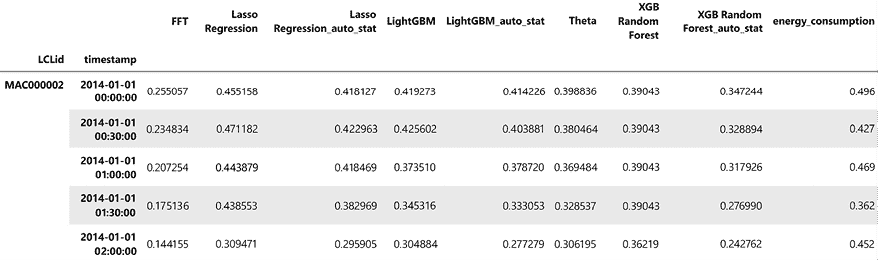

图 9.1：重塑后的预测 DataFrame

现在，让我们看看结合预测的几种不同策略。

## 最佳拟合

这种选择最佳预测的策略迄今为止是最流行的，其方法非常简单：根据验证指标为每个时间序列选择最佳预测。这种策略已被许多自动化预测软件工具所采用，称其为“最佳拟合”预测。该算法非常简单：

1.  使用验证数据集找到每个时间序列的最佳预测。

1.  对于每个时间序列，选择相同模型的测试数据集中的预测。

我们可以轻松做到这一点：

```py
# Finding the lowest metric for each LCLid
best_alg = metrics_combined_df.idxmin(axis=1)
#Initialize two columns in the dataframe
pred_wide_test["best_fit"] = np.nan
pred_wide_test["best_fit_alg"] = ""
#For each LCL id
for lcl_id in tqdm(pred_wide_test.index.get_level_values(0).unique()):
    # pick the best algorithm
    alg = best_alg[lcl_id]
    # and store the forecast in the best_fit column
    pred_wide_test.loc[lcl_id, "best_fit"] = pred_wide_test.loc[lcl_id, alg].values
    # also store which model was chosen for traceability
    pred_wide_test.loc[lcl_id, "best_fit_alg"] = alg 
```

这将创建一个名为`best_fit`的新列，其中包含根据我们讨论的策略选择的预测。现在，我们可以评估这个新的预测，并获得测试数据集的指标。下表显示了最佳单一模型（`LightGBM`）和新策略—`best_fit`：

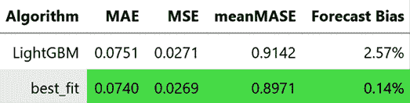

图 9.2：最佳拟合策略的汇总指标

在这里，我们可以看到最佳拟合策略整体表现优于单一的最佳模型。然而，这种策略的一个缺点是它的基本假设——在验证期表现最佳的模型也将在测试期表现最佳。它没有考虑其他预测模型等的对冲策略。考虑到时间序列的动态特性，这并不总是最佳策略。这种方法的另一个缺点是最终预测的不稳定性。

当我们在实际环境中使用这种规则时，每周重新训练并重新运行最佳拟合时，任何时间序列的预测可能会在不同的预测模型之间来回跳动，产生截然不同的预测结果。因此，最终的预测表现出很大的周间不稳定性，这会妨碍我们使用这些预测进行的后续操作。我们可以考虑一些没有这种不稳定性的其他技术。

## 集中趋势度量

另一种显著的策略是使用均值或中位数来合并预测。这是一个函数，*F*，它不依赖于验证指标。这既是这种方法的吸引力，也是一种困扰。由于我们根本没有使用验证指标，所以不可能过度拟合验证数据。但另一方面，由于没有任何验证指标的信息，我们可能会包括一些非常差的模型，这会拉低整体预测效果。然而，经验表明，这种简单的平均或中位数合并方法已被证明是一种非常强大的预测组合方法，且很难被超越。让我们看看如何实现这一方法：

```py
# ensemble_forecasts is a list of column names(forecast) we want to combine
pred_wide_test["average_ensemble"] = pred_wide_test[ensemble_forecasts].mean(axis=1)
pred_wide_test["median_ensemble"] = pred_wide_test[ensemble_forecasts].median(axis=1) 
```

上述代码将创建两个新列，分别称为`average_ensemble`和`median_ensemble`，用于存储合并后的预测。现在，我们可以评估这个新的预测，并获取测试数据集的指标。下表显示了最佳单个模型（`LightGBM`）和新的策略：

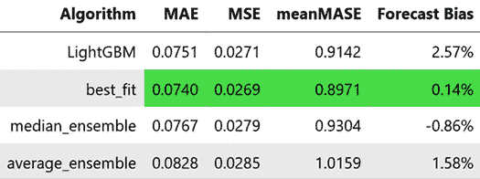

图 9.3：均值和中位数策略的汇总指标

在这里，我们可以看到，无论是均值策略还是中位数策略，都没有比最好的单个模型整体表现得更好。这可能是因为我们包含了像 Theta 和 FFT 这样的模型，它们的表现远不如其他机器学习方法。但由于我们没有使用验证数据集中的任何信息，所以我们并不知道这一点。我们可以做一个例外，假设我们使用验证指标来选择哪些模型包含在平均值或中位数中。但我们必须小心，因为现在我们越来越接近于假设在验证期有效的模型也会在测试期有效。

这里有几种手动技术可以使用，例如**修剪**（丢弃表现最差的模型）和**筛选**（只选择表现最好的几个模型）。虽然这些方法有效，但有些主观性，尤其是在我们需要从成百上千个模型中选择时，它们变得难以使用。

如果我们考虑这个问题，本质上是一个组合优化问题，我们需要选择最佳的模型组合来优化我们的指标。如果我们考虑通过取平均值来合并不同的预测，从数学角度看，可以表示为：

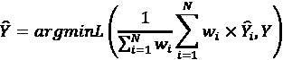

在这里，*L* 是我们尝试最小化的损失或指标。在我们的例子中，我们选择的是 MAE。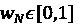 是每个基础预测的二进制权重。最后，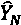 是*N*个基础预测集合，*Y* 是时间序列的实际观测值。

但与纯粹的优化不同，纯粹优化中没有偏差和方差的概念，我们需要一个能够泛化的最优解。因此，选择训练数据中的全局最小值并不可取，因为那样可能会进一步过拟合训练数据集，增加最终模型的方差。在这种最小化中，我们通常使用样本外预测，在这种情况下可以是验证期间的预测。

最直接的解决方案是找到* w *，使其在验证数据上最小化此函数。但这种方法有两个问题：

+   随着基准预测数量*N*的增加，可能的候选（基准预测的不同组合）呈指数增长。这很快就变得计算上难以处理。

+   在验证期间选择全局最小值可能不是最佳策略，因为可能会导致验证期间的过拟合。

现在，让我们来看看一些基于启发式的解决方案来解决这个组合优化问题。

启发式问题解决是一种策略，利用经验法则或捷径快速找到解决方案，即使这些解决方案可能不是最优的。当精确解法在计算上昂贵或耗时时，启发式方法可以非常有用。然而，在某些情况下，它们可能导致次优甚至错误的解决方案。

启发式方法通常与其他问题解决方法（如元启发式方法）结合使用，以提高搜索过程的效率和效果。元启发式方法是高层次的、与问题无关的策略，用于解决优化问题。它们提供了一个框架，用于开发启发式算法，能够高效地探索复杂的搜索空间并找到近似最优解。与传统优化方法不同，元启发式方法通常从自然现象或生物过程中汲取灵感。

元启发式方法的常见例子包括遗传算法（灵感来自自然选择）、模拟退火（灵感来自冶金学）、粒子群优化（灵感来自鸟群聚集）和蚁群优化（灵感来自蚂蚁觅食）。这些方法采用概率或随机方法来平衡探索与开发，使其能够避免陷入局部最优解，发现潜在的更好解决方案。

## 简单的爬山法

在讨论决策树以及梯度提升树时，我们简要介绍了贪婪算法。贪婪优化是一种启发式方法，通过逐步构建解决方案，在每一步选择一个局部最优解。在这两种机器学习模型中，我们采用了贪婪的、逐步的方式来解决计算上不可行的优化问题。为了选择最佳子集，给我们提供最佳的预测组合，我们可以采用一种简单的贪婪算法，称为爬坡算法。如果我们将目标函数的曲面看作一座山，为了找到最大值，我们需要爬上这座山。顾名思义，爬坡算法逐步上升，在每一步中，它选择最优路径，从而增加目标函数的值。下面的示意图可以帮助更清晰地理解。

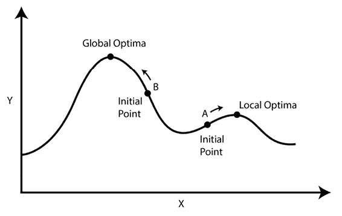图 9.4：一维目标的爬坡算法示意图

我们可以从 *图 9.4* 中看到，目标函数（我们需要优化的函数）有多个峰值（山峰），而在爬坡算法中，我们“爬”上山，逐步到达峰顶。我们还需要记住，根据我们开始爬坡的位置不同，可能会达到目标中的不同点。在 *图 9.4* 中，如果我们从 A 点开始爬坡，我们到达局部最优解，并错过全局最优解。现在，让我们看看该算法是如何以更严格的方式运作的。

在这里，*C* 是一组候选解（基础预测），*O* 是我们希望最小化的目标。简单爬坡算法如下：

1.  初始化起始解，*C*[best]，作为在 *O* 中给出最小值的候选解，即 *O*[best]，并从 *C* 中移除 *C*[best]。

1.  当 *C* 的长度大于 0 时，执行以下操作：

    1.  通过将 *C*[best] 中的基础预测与 *C* 中的每个元素进行平均，评估 *C* 中的所有成员，并选择最佳成员 (*C*[stage best])，将其添加到 *C*[best] 中，以最小化目标函数 *O*（即 *O*[stage best]）。

    1.  如果 *O*[stage best] > *O*[best]，则执行以下操作：

        1.  *C*[best] = *C*[best] U *C*[stage best]。

        1.  *O*[best] = *O*[stage best]。

        1.  从 *C* 中移除 *C*[stage best]。

    1.  否则，退出。

在运行结束时，我们得到 *C*[best]，这是通过贪婪优化得到的最佳预测组合。我们在 `src.forecasting.ensembling.py` 中实现了这个功能，位于 `greedy_optimization` 函数下。该函数的参数如下：

+   `objective`：这是一个可调用函数，接受一个字符串列表作为候选解，并返回一个 `float` 类型的目标值。

+   `candidates`：这是一个候选解列表，将被包括在优化中。

+   `verbose`：一个标志，指定是否打印进度。

该函数返回一个元组，其中包含作为字符串列表的最佳解和通过优化得到的最佳评分。

让我们看看如何在我们的示例中使用这个算法：

1.  导入所有必需的库/函数：

    ```py
    # Used to partially construct a function call
    from functools import partial
    # calculate_performance is a custom method we defined to calculate the MAE provided a list of candidates and prediction dataframe
    from src.forecasting.ensembling import calculate_performance, greedy_optimization 
    ```

1.  定义目标函数并运行贪心优化：

    ```py
    # We partially construct the function call by passing the necessary parameters
    objective = partial(
        calculate_performance, pred_wide=pred_wide_val, target="energy_consumption"
    )
    # ensemble forecasts is the list of candidates
    solution, best_score = greedy_optimization(objective, ensemble_forecasts) 
    ```

1.  一旦我们得到了最佳解，我们可以在测试数据框中创建组合预测：

    ```py
    pred_wide_test["greedy_ensemble"] = pred_wide_test[solution].mean(axis=1) 
    ```

一旦我们运行此代码，我们将在预测数据框（DataFrame）中得到名称为`greedy_ensemble`的组合预测。最优解中的候选模型包括 LightGBM、Lasso 回归和 LightGBM_auto_stat。接下来，让我们评估结果并查看汇总的度量指标：

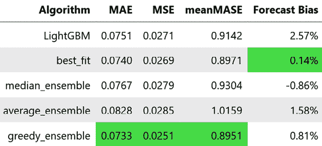

图 9.5：基于简单爬山的集成方法汇总指标

如我们所见，简单的爬山算法的表现优于我们迄今为止看到的任何单一模型或集成技术。在这种情况下，贪心算法似乎运作良好。现在，让我们了解爬山算法的几个局限性，如下所示：

+   **运行时考虑**：由于简单的爬山算法需要在每一步评估所有候选者，这可能会导致运行时瓶颈。如果候选者数量很大，这种方法可能会花费更多时间才能完成。

+   **短视性**：爬山优化是短视的。在优化过程中，它每一步总是选择最佳的选项。有时，通过在某一步选择一个稍差的解决方案，我们可能会得到一个更好的整体解决方案。

+   **只前进**：爬山算法是一个只前进的算法。一旦一个候选者被纳入解决方案，我们就不能回头将其移除。

贪心算法并不总能为我们找到最优解，尤其是在需要组合多个模型时。因此，让我们来看看一种小的变种——爬山算法，它试图克服贪心算法的一些局限性。

## 随机爬山

简单的爬山算法和随机爬山算法的关键区别在于候选者的评估。在简单的爬山中，我们会*评估所有可能的选项*并从中挑选最佳的一个。然而，在随机爬山中，我们会*随机挑选一个候选者*，如果它比当前解更好，就将其添加到解决方案中。换句话说，在爬山算法中，我们总是逐步向上移动，但在随机爬山中，我们会神奇地瞬移到目标函数的不同点，检查自己是否比之前更高。这种加入随机性的做法有助于优化算法避免陷入局部最大值/最小值，但也引入了相当大的不确定性，可能无法达到任何最优解。接下来，我们来看看这个算法。

在这里，*C* 是候选集（基础预测），*O* 是我们希望最小化的目标，*N* 是我们希望运行优化的最大迭代次数。随机爬山算法如下：

1.  初始化起始解，*C*[best]，作为候选者。可以通过随机挑选一个候选者或选择表现最好的模型来完成。

1.  将 *C*[best] 的目标函数值 *O* 设置为 *O*[best]，并从 *C* 中移除 *C*[best]。

1.  对 *N* 次迭代重复以下步骤：

    1.  从 *C* 中随机抽取一个样本，将其加入 *C*[best]，并存储为 *C*[stage]。

    1.  在目标函数 *O* 上评估 *C*[stage]，并将其存储为 *O*[stage]。

    1.  如果 *O*[stage] > *O*[best]，则执行以下操作：

        1.  *C*[best] = *C*[best] U *C*[stage]

        1.  *O*[best] = *O*[stage]。

        1.  从 *C* 中移除 *C*[best]。

在运行结束时，我们得到的是 *C*[best]，它是通过随机爬山算法获得的最佳预测组合。我们已经在 `src.forecasting.ensembling.py` 中的 `stochastic_hillclimbing` 函数下实现了这一方法。该函数的参数如下：

+   `objective`：这是一个可调用的函数，它接收一个包含候选字符串的列表并返回一个 `float` 类型的目标值。

+   `candidates`：这是一个候选列表，将被包含在优化过程中。

+   `n_iterations`：执行爬山算法的迭代次数。如果未给定该值，则使用启发式方法（候选数量的两倍）来设置该值。

+   `init`：决定用于初始解的策略，可以是 `random` 或 `best`。

+   `verbose`：一个标志，用来指定是否打印进度。

+   `random_state`：一个种子，用于获得可重复的结果。

该函数返回一个元组，包含作为字符串列表的最佳解和通过优化获得的最佳得分。

这可以与 `greedy_optimization` 以非常相似的方式使用。我们这里只展示不同的部分，完整代码可在笔记本中查看：

```py
from src.forecasting.ensembling import stochastic_hillclimbing
# ensemble forecasts is the list of candidates
solution, best_score = stochastic_hillclimbing(
    objective, ensemble_forecasts, n_iterations=10, init="best", random_state=9
) 
```

一旦我们运行这段代码，我们将在预测 DataFrame 中得到一个名为 `stochastic_hillclimb__ensemble` 的组合预测。作为最佳解的一部分的候选模型包括 LightGBM、Lasso 回归 _auto_stat、LightGBM_auto_stat 和 Lasso 回归。现在，让我们评估结果并查看聚合指标：

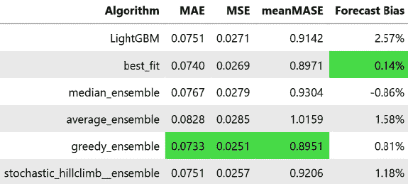

图 9.6：基于随机爬山的集成的聚合指标

随机爬山算法的效果不比贪婪算法更好，但却优于均值、媒体和最佳拟合集成。我们之前讨论了简单爬山法的三个缺点——运行时考虑、短视性和仅向前搜索。随机爬山解决了运行时考虑的问题，因为我们并没有评估所有的组合并选择最佳，而是通过随机评估组合并一旦找到一个表现更好的解就将其加入集成。它在一定程度上解决了短视性问题，因为算法中的随机性可能会导致每个阶段选择一个次优解，但它仍然只选择比当前解更好的解。

现在，让我们来看一下另一个改进版的爬山算法，它也解决了这个问题。

## 模拟退火

**模拟退火**是对爬山算法的一种改进，灵感来源于一种物理现象——退火固体。退火是将固体加热到预定温度（通常高于其再结晶温度，但低于其熔点），保持一段时间，然后冷却（可以慢慢冷却，也可以通过在水中淬火来快速冷却）。

这样做是为了确保原子达到新的全局最小能量状态，这会在某些金属中引入期望的性质，比如铁。

1952 年，Metropolis 提出了模拟退火作为一种优化技术。退火类比也适用于优化背景。当我们说加热系统时，实际上是指我们鼓励随机扰动。因此，当我们以高温开始优化时，算法会探索空间并得出问题的初始结构。随着温度的降低，结构会被细化，从而得到最终解决方案。这种技术有助于避免陷入任何局部最优解。局部最优解是目标函数表面上的极值，它比附近的其他值更好，但可能不是最优解。*进一步阅读*部分包含了简洁解释局部最优解和全局最优解的资源。

现在，让我们来看看这个算法。

这里，*C*是候选集（基本预测），*O*是我们要最小化的目标，*N*是我们希望运行优化的最大迭代次数，*T*[max]是最大温度，是温度衰减。模拟退火算法如下：

1.  初始化一个起始解，*C*[best]，作为候选解。这可以通过随机选择一个候选解或选择表现最好的模型来完成。

1.  为*C*[best]设置目标函数的值，*O*，作为*O*[best]，并从*C*中移除*C*[best]。

1.  将当前温度设置为*t* = *T*[max]。

1.  对*N*次迭代重复执行此操作：

    1.  从*C*中随机抽取一个样本，添加到*C*[best]，并将其存储为*C*[stage]。

    1.  在目标函数上评估*C*[stage]，*O*，并将其存储为*O*[stage]。

    1.  如果 *O*[stage] > *O*[best]，则执行以下操作：

        1.  *C*[best].= *C*[best] U *C*[stage]

        1.  *O*[best] = *O*[stage]

        1.  从*C*中移除*C*[best]。

    1.  否则，执行以下操作：

        1.  计算接受概率，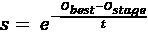。

        1.  从 0 到 1 之间随机抽取一个样本，记为 p。

        1.  如果 *p* < *s*，则执行以下操作：

        1.  *C*[best] = *C*[best] U *C*[stage]

        1.  *O*[best] = *O*[stage]。

        1.  从*C*中移除*C*[best]。

    1.  *t* = *t* - （对于线性衰减）和 *t* = *t*/（对于几何衰减）。

    1.  当*C*为空时退出。

在运行结束时，我们得到了 *C*[best]，这是通过模拟退火获得的最佳预测组合。我们在 `src.forecasting.ensembling.py` 文件中的 `simulated_annealing` 函数下提供了该实现。将温度设置为合适的值对于算法的良好运行至关重要，而且通常是最难设置的超参数。更直观地，我们可以将温度视为开始时接受较差解的概率。在实现中，我们还使得可以输入接受较差解的起始和结束概率。

1989 年，D.S. Johnson 等人提出了一种从给定的概率范围估算温度范围的过程。该过程已经在 `initialize_temperature_range` 中实现。

总结一下，算法从随机解开始，并评估每个解的好坏。然后，它不断尝试新解，有时接受较差的解以避免陷入局部最优解，但随着时间的推移，它接受较差解的可能性会降低，因为它在“冷却”（就像金属冷却并硬化一样）。它重复这一过程，直到选项用尽或温度变得太低，最终保留找到的最佳解。

**参考检查：**

D.S. Johnson 的研究论文，标题为 *模拟退火优化：实验评估*；*第一部分，图划分*，在 *参考文献* 部分被引用为参考文献 *1*。

`simulated_annealing` 函数的参数如下：

+   `objective`：这是一个可调用的函数，接受一个字符串列表作为候选项，并返回一个 `float` 类型的目标值。

+   `candidates`：这是一个候选列表，用于包含在优化中。

+   `n_iterations`：模拟退火运行的迭代次数。这个参数是必需的。

+   `p_range`：起始和结束概率的元组。这是在模拟退火中接受较差解的概率。温度范围（`t_range`）将在优化过程中从 `p_range` 推断得出。

+   `t_range`：如果我们想直接设置温度范围为一个元组（起始，结束），可以使用这个参数。如果设置了该值，`p_range` 会被忽略。

+   `init`：这个参数决定了用于初始解的策略。可以是 `random` 或 `best`。

+   `temperature_decay`：指定温度衰减的方式。可以是 `linear` 或 `geometric`。

+   `verbose`：一个标志，指定是否打印进度。

+   `random_state`：用于获取可重复结果的种子。

该函数返回一个元组，包含作为字符串列表的最佳解决方案和通过优化获得的最佳得分。

这可以像其他组合预测的方式一样使用。我们将在这里展示不同之处。完整代码可在笔记本中查看：

```py
from src.forecasting.ensembling import simulated_annealing
# ensemble forecasts is the list of candidates
solution, best_score = simulated_annealing(
    objective,
    ensemble_forecasts,
    p_range=(0.5, 0.0001),
    n_iterations=50,
    init="best",
    temperature_decay="geometric",
    random_state=42,
) 
```

一旦我们运行这段代码，我们将在预测 DataFrame 中得到一个名为`simulated_annealing_ensemble`的组合预测。作为最优解的一部分的候选模型包括 LightGBM、Lasso 回归 _auto_stat、LightGBM_auto_stat 和 XGB 随机森林。让我们评估一下结果并查看汇总指标：

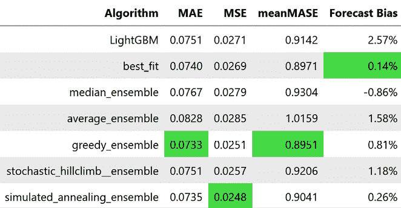

图 9.7：基于模拟退火的集成的汇总指标

模拟退火似乎比随机爬山表现得更好。我们之前讨论过简单爬山算法的三个缺点——运行时考虑、目光短浅以及仅向前搜索。模拟退火解决了运行时问题，因为我们不是评估所有组合并选择最优的，而是随机评估组合，并在发现更好的解时立即将其添加到集成中。它也解决了目光短浅的问题，因为通过使用温度，我们在优化的初期也会接受略差的解。然而，它仍然是一个仅向前搜索的过程。

到目前为止，我们已经看过组合优化问题，因为我们说过。但如果我们可以放宽这个约束，使得 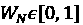。 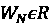（实数），那么组合优化问题可以放宽为一个一般的数学优化问题。让我们看看如何做到这一点。

## 最优加权集成

之前，我们将我们试图解决的优化问题定义为如下：

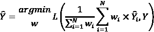

这里，*L*是我们试图最小化的损失或指标。在我们的例子中，我们选择了 MAE。 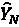 是 *N* 个基本预测集合，而 *Y* 是时间序列的真实观测值。我们不再定义 ，而是让  成为每个基本预测的连续权重。通过这个新放宽的约束，组合变成了不同基本预测之间的加权平均。现在，我们正在看不同预测的软混合，而不是基于硬选择的组合优化（这也是我们一直使用的方法）。

这是一个可以使用 `scipy` 中现成算法解决的优化问题。让我们看看如何使用 `scipy.optimize` 来解决这个问题。

首先，我们需要定义一个损失函数，该函数接受一组作为列表的权重，并返回我们需要优化的指标：

```py
def loss_function(weights):
        # Calculating the weighted average
        fc = np.sum(pred_wide[candidates].values * np.array(weights), axis=1)
        # Using any metric function to calculate the metric
        return metric_fn(pred_wide[target].values, fc) 
```

现在，我们所需要做的就是用必要的参数调用`scipy.optimize`。让我们学习如何做这件事：

```py
from scipy import optimize
opt_weights = optimize.minimize(
        loss_function,
        # set x0 as initial values, which is a uniform distribution over all the candidates
        x0=[1 / len(candidates)] * len(candidates),
        # Set the constraint so that the weights sum to one
        constraints=({"type": "eq", "fun": lambda w: 1 - sum(w)}),
        # Choose the optimization technique. Should be gradient-free and bounded.
        method="SLSQP",
        # Set the lower and upper bound as a tuple for each element in the candidate list.
        # We set the maximum values between 1 and 0
        bounds=[(0.0, 1.0)] * len(candidates),
        # Set the tolerance for termination
        options={"ftol": 1e-10},
    )["x"] 
```

优化通常很快，我们会得到作为浮动点数的权重列表。我们将其包装在`src.forecasting.ensembling.py`中的一个名为`find_optimal_combination`的函数中。该函数的参数如下：

+   `candidates`：这是待纳入优化的候选项列表。它们的返回顺序与返回的权重顺序相同。

+   `pred_wide`：这是我们需要学习权重的预测数据框。

+   `target`：这是目标列的名称。

+   `metric_fn`：这是任何具有`metric(actuals, pred)`签名的可调用对象。

该函数返回最优权重，作为一个浮动点数列表。让我们看看通过验证预测学习到的最优权重是什么：

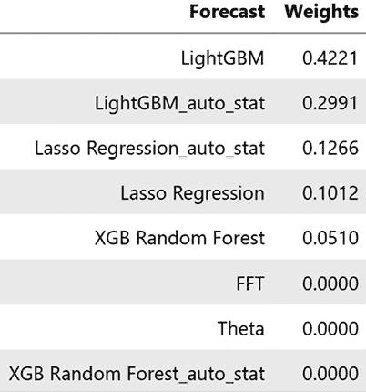

图 9.8：通过优化学习得到的最优权重

在这里，我们可以看到优化自动学会忽略`FFT`、`Theta`、`XGB Random Forest`和`XGB Random Forest_auto_stat`，因为它们对集成模型贡献不大。它还学会了为每个预测分配一些非零的权重。这些权重已经与我们之前讨论的技术选择相似。现在，我们可以使用这些权重来计算加权平均值，并将其称为`optimal_combination_ensemble`。

聚合结果应该如下所示：

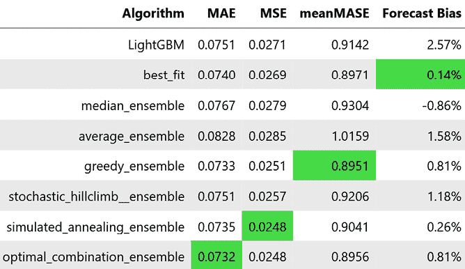

图 9.9：基于最优组合的集成的聚合指标

在这里，我们可以看到，这种软性混合预测的表现远远好于所有基于硬性选择的集成方法，在所有三个指标上都有明显的提升。

在我们讨论的所有技术中，我们使用的是 MAE 作为目标函数。但我们也可以使用任何指标、指标组合，甚至是带正则化的指标作为目标函数。当我们讨论随机森林时，我们提到去相关树对提高性能至关重要。一个非常相似的原则也适用于选择集成方法。拥有去相关的基础预测为集成模型增值。因此，我们可以使用任何多样性度量来对我们的指标进行正则化。例如，我们可以使用相关性作为度量，并创建一个正则化指标用于这些技术。`Chapter09`文件夹中的`01-Forecast_Combinations.ipynb`笔记本包含一个附加部分，展示了如何做到这一点。

我们一开始讨论的是如何通过数学公式来组合预测：

*Y* = *F*(*Y*[1], *Y*[2], …, *Y*[N])

在这里，*F*是将*N*个预测值组合起来的函数。

我们在寻找将该函数作为优化问题的解决方案时，使用了均值或中位数等方法来组合这些指标。但我们也看到了另一种从数据中学习这个函数*F*的方式，不是吗？让我们看看怎么做。

# 堆叠与混合

本章一开始我们讨论了机器学习算法，这些算法从一组输入和输出中学习一个函数。在使用这些机器学习算法的过程中，我们学习了预测时间序列的函数，现将其称为基预测。

为什么不使用相同的机器学习范式来学习我们也想学习的这个新函数 F 呢？

这正是堆叠中所做的（通常称为堆叠泛化），我们在一些基学习器的预测结果上训练另一个学习算法来结合这些预测。这种二级模型通常被称为**堆叠模型**或**元模型**。通常，这种元模型的表现与基学习器相当，甚至更好。这与混合（blending）非常相似，唯一的区别在于我们分割数据的方式。

尽管这一思想最早由沃尔珀特（Wolpert）于 1992 年提出，但莱奥·布雷曼（Leo Breiman）在 1996 年的论文《堆叠回归》（*Stacked Regressions*）中正式化了这一概念，成为如今的应用方式。并且在 2007 年，M. J. Van der Laan 等人建立了这一技术的理论基础，并提供了证明，表明这种元模型的表现至少与基学习器一样好，甚至更好。

**参考检查：**

莱奥·布雷曼（1996 年）和马尔科·J·范德兰（2007 年）等人的研究论文在*参考文献*部分被标记为*2*和*3*。

这是在机器学习竞赛中非常流行的一种技术，比如 Kaggle，被认为是机器学习从业者之间的一种秘密技巧。我们还讨论了其他一些技术，比如袋装法（bagging）和提升法（boosting），它们通过将基学习器组合成更复杂的模型来改进效果。但这些技术要求基学习器是一个弱学习器。而堆叠（stacking）则不同，因为堆叠尝试将一组*多样化*的*强*学习器进行组合。

堆叠的直觉是，不同的模型或函数族学习输出函数的方式略有不同，捕捉了问题的不同特征。例如，一个模型可能很好地捕捉了季节性，而另一个模型则可能更好地捕捉了与外生变量的某种交互。堆叠模型将能够将这些基模型结合成一个模型，其中一个模型关注季节性，另一个模型关注交互。这是通过让元模型学习基模型的预测结果来实现的。但为了防止数据泄漏并避免过拟合，元模型应在样本外的预测数据上进行训练。如今有两种小变体的技术——堆叠和混合。

**堆叠**是指元模型在整个训练数据集上进行训练，但使用的是样本外预测。堆叠过程包括以下步骤：

1.  将训练数据集分割成*k*部分。

1.  在*k-1*部分上迭代训练基本模型，在*k*^(th)部分上进行预测，并保存预测结果。完成此步骤后，我们有了来自所有基本模型的训练数据集的样本外预测。

1.  在这些预测上训练一个元模型。

**混合**与此类似，但在生成样本外预测的方式上略有不同。混合涉及以下步骤：

1.  将训练数据集分为两部分——训练和保留。

1.  在训练数据集上训练基本模型并在保留数据集上进行预测。

1.  在具有基本模型预测结果的验证数据集上训练元模型。

直觉上，我们可以看到堆叠可以工作得更好，因为它使用一个更大的数据集（通常是所有训练数据）作为样本外预测，所以元模型可能更加泛化。但是有一个警告：我们假设整个训练数据是**独立同分布**（**iid**）。这通常是一个很难在时间序列中满足的假设，因为数据生成过程可以随时改变（逐渐或急剧）。如果我们知道数据分布随时间发生了显著变化，那么混合保留期（通常是数据集的最近部分）更好，因为元模型只学习最新的数据，从而尊重数据分布的时间变化。

我们可以包含作为基本模型的模型数量没有限制，但通常会达到一个平台，额外的模型不会对堆叠集成产生太大的影响。我们还可以添加多个堆叠级别。例如，假设有四个基本学习器：*B*[1,] *B*[2,] *B*[3] 和 *B*[4]。我们还训练了两个元模型 *M*[1] 和 *M*[2]，在基本模型上。现在，我们可以在 *M*[1] 和 *M*[2] 的输出上训练第二级元模型 *M*，并将其用作最终预测。我们可以使用`pystacknet` Python 库（[`github.com/h2oai/pystacknet`](https://github.com/h2oai/pystacknet)），这是一个名为`stacknet`的旧库的 Python 实现，以便轻松创建多级（或单级）堆叠集成的过程。

另一个要牢记的关键点是我们通常用作元模型的模型类型。假设大部分学习已经由基本模型完成，这些基本模型是用于预测的多维数据的模式。因此，元模型通常是简单模型，例如线性回归、决策树，甚至比基本模型低得多的随机森林。另一种思考这个问题的方式是从偏差和方差的角度来看。堆叠可能会过拟合训练或留出集，并通过包含具有更大灵活性或表达能力的模型族，我们正在促使这种过拟合发生。*进一步阅读*部分包含了一些链接，从通用机器学习的角度解释了不同的堆叠技术。

现在，让我们快速看看如何在我们的数据集中使用这个：

```py
from sklearn.linear_model import LinearRegression
stacking_model = LinearRegression()
# ensemble_forecasts is the list of candidates
stacking_model.fit(
    pred_wide_val[ensemble_forecasts], pred_wide_val["energy_consumption"]
)
pred_wide_test["linear_reg_blending"] = stacking_model.predict(
    pred_wide_test[ensemble_forecasts]
) 
```

这将为线性回归保存混合预测为`linear_reg_blending`。我们可以使用相同的代码，但交换模型以尝试其他模型。

**最佳实践：**

当存在许多基本模型并且我们想要进行隐式基本模型选择时，我们可以选择其中一个正则化线性模型，例如岭回归或套索回归。在他最初的论文中，Breiman 提出了*堆叠回归*，建议使用具有正系数且没有截距的线性回归作为元模型。他认为这样可以理论上保证堆叠模型至少与任何最佳个体模型一样好。但在实践中，我们可以在实验中放宽这些假设。没有截距的非负回归与我们之前讨论过的最佳加权集成非常接近。最后，如果我们正在评估多个堆叠模型以选择哪个效果好，我们应该要么使用单独的验证数据集（而不是*训练-验证-测试*分割，我们可以使用*训练-验证-验证元-测试*分割），要么使用交叉验证估计。如果我们只是选择在测试数据集上表现最好的堆叠模型，那么我们就是在测试数据集上过拟合了。

现在，让我们看看混合模型在我们的测试数据上的表现：

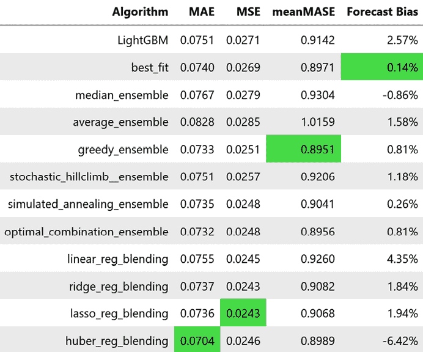

图 9.10：混合模型的聚合指标

在这里，我们可以看到简单的线性回归学习了一个比我们任何平均集成方法都要好得多的元模型。而 Huber 回归（这是一种直接优化 MAE 的方法）在 MAE 基准测试上表现得更好。然而，请记住这并非普遍适用，必须针对遇到的每个问题进行评估。选择要优化的指标和要用于组合的模型会产生很大的差异。通常，简单的平均集成是组合模型的一个非常可观的基准。

Huber 回归是线性回归的另一种版本（如岭回归和套索回归），其损失函数是平方损失（用于常规线性回归）和绝对损失（用于 L1 方法）的组合。对于小残差，它表现得像平方损失，而对于大残差，它表现得像绝对损失。这使得它对异常值不太敏感。Scikit-Learn 提供了 `HuberRegressor` ([`scikit-learn.org/stable/modules/generated/sklearn.linear_model.HuberRegressor.html`](https://scikit-learn.org/stable/modules/generated/sklearn.linear_model.HuberRegressor.html))，用于实现这一方法。

**附加阅读：**

还有其他更具创新性的方式来结合基础预测。这是一个活跃的研究领域。*进一步阅读*部分包含了两个非常相似的想法的链接。**基于特征的预测模型平均法**（**FFORMA**）从时间序列中提取一组统计特征，并用它来训练一个机器学习模型，预测基础预测应如何加权结合。另一种技术（**用于快速且可扩展的时间序列超参数调整的自监督学习**），来自 Facebook（Meta）研究，训练一个分类器，预测给定一组从时间序列中提取的统计特征时，哪个基础学习器表现最好。

# 摘要

延续上一章中的实用课程，我们又完成了一个动手实践的课程。在本章中，我们从上一章的不同机器学习模型中生成了预测结果。我们学会了如何将这些不同的预测结果结合成一个比任何单一模型表现都更好的预测。接着，我们探索了组合优化和堆叠/混合等概念，以实现最先进的结果。

在下一章中，我们将开始讨论全球预测模型，并探索策略、特征工程等，以便实现这种建模。

# 参考文献

本章提供了以下参考文献：

1.  David S. Johnson，Cecilia R. Aragon，Lyle A. McGeoch，和 Catherine Schevon（1989），*模拟退火优化：实验评估；第一部分，图形划分*。运筹学，1989 年，第 37 卷，第 6 期，865-892：[`dx.doi.org/10.1287/opre.37.6.865`](http://dx.doi.org/10.1287/opre.37.6.865)

1.  *L. Breiman*（1996），*堆叠回归*。机器学习 24，49-64：[`doi.org/10.1007/BF00117832`](https://doi.org/10.1007/BF00117832)

1.  Mark J. van der Laan；Eric C. Polley；和 Alan E. Hubbard（2007），*超级学习者*。加利福尼亚大学伯克利分校生物统计学系工作论文系列。工作论文 222：[`biostats.bepress.com/ucbbiostat/paper222`](https://biostats.bepress.com/ucbbiostat/paper222)

# 进一步阅读

若想进一步了解本章所涉及的主题，请查阅以下资源：

+   *Kaggler 实践中的模型堆叠指南*，由 Ha Nguyen 编写：[`datasciblog.github.io/2016/12/27/a-kagglers-guide-to-model-stacking-in-practice/`](https://datasciblog.github.io/2016/12/27/a-kagglers-guide-to-model-stacking-in-practice/)

+   Kai Ming Ting 和 Ian H. Witten (1997)，*堆叠泛化：何时有效？*：[`www.ijcai.org/Proceedings/97-2/Papers/011.pdf`](https://www.ijcai.org/Proceedings/97-2/Papers/011.pdf)

+   Pablo Montero-Manso, George Athanasopoulos, Rob J. Hyndman, Thiyanga S. Talagala (2020)，*FFORMA: 基于特征的预测模型平均*。《国际预测学杂志》，第 36 卷，第 1 期：[`robjhyndman.com/papers/fforma.pdf`](https://robjhyndman.com/papers/fforma.pdf)

+   Peiyi Zhang 等人 (2021)，*自监督学习用于快速且可扩展的时间序列超参数调优*：[`www.ijcai.org/Proceedings/97-2/Papers/011.pdf`](https://www.ijcai.org/Proceedings/97-2/Papers/011.pdf)

+   局部最优与全局最优：[`www.mathworks.com/help/optim/ug/local-vs-global-optima.html`](https://www.mathworks.com/help/optim/ug/local-vs-global-optima.html)

# 加入我们的 Discord 社区

加入我们社区的 Discord 空间，与作者及其他读者进行讨论：

[`packt.link/mts`](https://packt.link/mts)


