# 第十一章：深度学习简介

在上一章中，我们学习了如何使用现代机器学习模型来解决时间序列预测问题。现在，让我们把注意力集中在机器学习的一个子领域——近年来表现出巨大潜力的**深度学习**上。我们将试图揭开深度学习的神秘面纱，探讨为什么它现在如此流行。我们还将把深度学习分解成主要的组成部分，学习支撑深度学习的“核心力量”——梯度下降。

在本章中，我们将讨论以下主要内容：

+   什么是深度学习，为什么是现在？

+   深度学习系统的组成部分

+   表示学习

+   线性层和激活函数

+   梯度下降

# 技术要求

你需要按照本书*前言*中的说明设置**Anaconda**环境，以便获得一个包含所有代码所需库和数据集的工作环境。在运行笔记本时，任何额外的库都会被自动安装。

本章相关代码可以在[`github.com/PacktPublishing/Modern-Time-Series-Forecasting-with-Python-2E/tree/main/notebooks/Chapter11`](https://github.com/PacktPublishing/Modern-Time-Series-Forecasting-with-Python-2E/tree/main/notebooks/Chapter11)找到。

# 什么是深度学习，为什么是现在？

在*第五章*，*时间序列预测作为回归*中，我们讨论了机器学习，并借用了 Arthur Samuel 的定义：“*机器学习是一个让计算机无需明确编程即可学习的研究领域*。”接着我们进一步探讨了如何通过机器学习从数据中学习有用的函数。深度学习是这个研究领域的一个子领域。深度学习的目标同样是从数据中学习有用的函数，但它在实现方法上有一些特定的要求。

在讨论深度学习的特别之处之前，我们先回答另一个问题。为什么我们要把这个机器学习的子领域单独作为一个话题来讨论？答案就在于深度学习方法在众多应用中的不合理有效性。深度学习已经风靡机器学习领域，推翻了各种类型数据（如图像、视频、文本等）上的最先进系统。如果你记得十年前的手机语音识别系统，它们当时更多是用来娱乐的，而不是真的实用。但如今，你可以说*嘿，谷歌，播放 Pink Floyd*，然后*Comfortably Numb*会在你的手机或扬声器上播放。多个深度学习系统使这个过程得以流畅实现。手机上的语音助手、自动驾驶汽车、网络搜索、语言翻译——深度学习在我们日常生活中的应用清单不断扩展。

现在你可能在想，这种新技术“深度学习”到底是怎么回事，对吧？其实，深度学习并不是一项新技术。深度学习的起源可以追溯到 20 世纪 40 年代末和 50 年代初。它之所以显得新颖，是因为近年来该领域的流行度急剧上升。

让我们快速了解一下为什么深度学习突然变得如此流行。

## 为什么是现在？

深度学习在过去二十年里取得了显著进展，主要有两个原因：

+   计算能力的增加

+   数据可用性的增加

在接下来的章节中，我们将详细讨论前述的各个要点。

### 计算能力的增加

早在 1960 年，Frank Rosenblatt 就写了一篇论文（参考文献*5*）讨论了一个三层神经网络，并表示这项工作在证明神经网络作为模式识别设备的能力方面做出了重要贡献。但在同一篇论文中，他指出，当我们增加连接数时，1960 年代的数字计算机承载的负担过于沉重。然而，在接下来的几十年里，计算机硬件几乎提高了 50,000 倍，这为神经网络和深度学习提供了强大的推动力。然而，仍然不足够，因为神经网络当时仍然不被认为适合*大规模应用*。

这时，一种最初为游戏开发的特定硬件——GPU（图形处理单元）开始发挥作用。虽然尚不完全清楚是谁首先将 GPU 用于深度学习，但 Kyoung-Su Oh 和 Keechul Jung 于 2004 年发表了一篇名为*GPU 实现神经网络*的论文，这篇论文似乎是首个展示 GPU 在深度学习中能带来显著加速的研究。有关此话题的早期且较为流行的研究论文来自 Rajat Raina、Anand Madhavan 和 Andrew Ng，他们在 2009 年发布了一篇名为*使用图形处理器进行大规模深度无监督学习*的论文，证明了 GPU 在深度学习中的有效性。

尽管许多由 LeCun、Schmidhuber、Bengio 等人领导的团队一直在尝试使用 GPU，但转折点出现在 Alex Krizhevsky、Ilya Sutskever 和 Geoffrey E. Hinton 使用基于 GPU 的深度学习系统，该系统在一个名为*ImageNet 大规模视觉识别挑战 2012*的图像识别竞赛中超越了所有其他竞争技术。

GPU 的引入为深度学习的广泛应用提供了急需的推动力，并加速了该领域的进展。

**参考检查**：

论文*GPU 实现神经网络*、*使用图形处理器进行大规模深度无监督学习*和*使用深度卷积神经网络进行 ImageNet 分类*分别在*参考文献*部分的*1*、*2*和*3*中被引用。

### 数据可用性的增加

除了计算能力的飞速提升，深度学习的另一个主要推动因素是数据量的急剧增加。随着世界越来越数字化，我们生成的数据量也大幅增加。曾经只有几百或几千行的表格，如今已经膨胀到数百万、数十亿行，而存储成本的不断降低也促进了数据收集的爆炸式增长。

那么，为什么数据量的增加对深度学习有帮助呢？这与深度学习的工作方式有关。深度学习对数据的需求非常大，需要大量的数据来学习出优秀的模型。因此，如果我们不断增加提供给深度学习模型的数据量，模型将能够学习到越来越好的函数。然而，传统机器学习模型并非如此。我们可以通过安德鲁·吴（Andrew Ng）在他著名的机器学习课程——斯坦福大学的*Machine Learning by Stanford University*（Coursera）中推广的一张图表来加深理解（[`www.coursera.org/specializations/machine-learning-introduction`](https://www.coursera.org/specializations/machine-learning-introduction)）（*图 11.1*）。

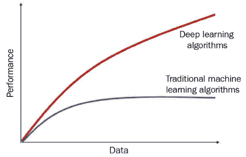

图 11.1：随着数据量增加，深度学习与传统机器学习的对比

在安德鲁·吴推广的*图 11.1*中，我们可以看到，随着数据量的增加，传统机器学习会达到一个平台期，之后不再有所改善。

通过经验已经证明，深度学习模型的过参数化具有显著的优势。**过参数化**是指模型中的参数数量超过了用于训练的数据点数量。在经典统计学中，这是一个大忌，因为在这种情况下，模型不可避免地会过拟合。然而，深度学习似乎能够轻松地挑战这一规则。一个过参数化的例子是当前最先进的图像识别系统——**NoisyStudent**。它拥有 4.8 亿个参数，但是在包含 120 万个数据点的*ImageNet*上进行训练的。

有人认为，深度学习模型的训练方式（随机梯度下降法，稍后会详细解释）是关键，因为它具有正则化效应。在一篇名为《深度学习的计算极限》的研究论文中，Niel C. Thompson 等人尝试通过一个简单的实验来说明这一点。他们设置了一个包含 1000 个特征的数据集，但只有其中 10 个特征具有信号。然后，他们尝试基于不同的数据集大小，使用该数据集学习四个不同的模型：

+   **Oracle 模型**：使用精确的 10 个参数，这些参数包含所有信号。

+   **专家模型**：使用 10 个显著参数中的 9 个。

+   **灵活模型**：使用所有 1000 个参数。

+   **正则化模型**：一个使用所有 1,000 个参数的模型，但现在是一个正则化的（**lasso**）模型。（我们在*第八章*《使用机器学习模型预测时间序列》中讨论过正则化。）

让我们看看研究论文中的*图 11.2*：

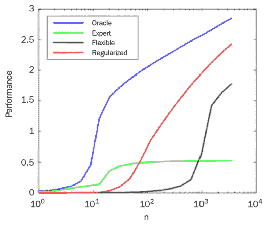

图 11.2：该图展示了不同模型在不同数据量下的表现

该图的横坐标表示数据点，纵坐标表示性能（*-log(均方误差)*）。不同颜色的线条表示不同类型的模型。Oracle 模型设置了学习的上限，因为它能够访问完美的信息。

专家模型在某一水平上停滞，因为它缺乏信息，并且无法访问十个重要特征中的一个。灵活模型（使用所有 1,000 个特征）需要大量的数据点才能开始识别重要特征，但随着数据量的增加，它仍然趋近于 Oracle 模型的表现。正则化模型（作为深度学习模型的代表）随着我们给模型提供越来越多的数据而不断改进。该模型通过正则化来识别哪些特征与问题相关，并开始以较少的数据点有效利用这些特征，性能随着数据点的增加而持续提升。这再次印证了 Andrew Ng 曾经推广的概念——随着数据量的增加，深度学习开始超越传统机器学习。

除了计算能力和数据可用性之外，许多其他因素也推动了深度学习的成功。Sara Hooker 在她的文章《硬件彩票》（参考文献*9*）中谈到了一个观点：一个想法之所以能够成功，不一定是因为它优于其他想法，而是因为它适合当时的软件和硬件环境。而一旦一个研究方向赢得了“彩票”，它就会像滚雪球一样发展，因为更多的资金和大型研究机构会支持这一想法，最终它会成为该领域最突出的思想。

我们已经讨论了深度学习一段时间，但仍未真正理解它是什么。现在我们来了解一下。

## 什么是深度学习？

深度学习没有单一的定义，因为它对不同的人来说意味着略有不同的东西。然而，绝大多数人达成了一个共识：当一个模型能够从原始数据中自动学习特征时，它就被称为深度学习。正如 Yoshua Bengio（图灵奖得主，AI 的*教父*之一）在他 2021 年发表的论文《无监督学习与迁移学习的深度表示学习》中所解释的：

> “深度学习算法试图利用输入分布中未知的结构，以发现良好的表示，通常是在多个层次上，较高层次的学习特征是通过较低层次特征定义的。”

在 2016 年的一次演讲《*深度学习与可理解性对比软件工程与验证*》中，谷歌研究总监 Peter Norvig 给出了一个类似但更简单的定义：

> “一种学习方式，其中你所构建的表示具有多个抽象层次，而不是直接的输入到输出。”

深度学习的另一个关键特性是合成性，很多人都认同这一点。杨·勒昆（Yann LeCun），图灵奖得主，以及 AI 的另一位*奠基人*，给出了一个略微复杂但更准确的深度学习定义（2020 年 1 月 9 日来自`@ylecun`的推文）：

> “深度学习是一种方法论：通过将参数化模块组装成（可能是动态的）图形，并通过基于梯度的方法进行优化来构建模型。”

我们希望在此强调的关键点如下：

+   **组装参数化模块**：这指的是深度学习的合成性。正如我们稍后将看到的，深度学习系统由一些具有多个参数（有些没有）的子模块组装而成，形成类似图形的结构。

+   **利用基于梯度的方法进行优化**：尽管将基于梯度的学习方法作为深度学习的充分标准并未得到广泛认可，但我们从经验上看到，今天大多数成功的深度学习系统都是通过基于梯度的方法进行训练的。（如果你不了解什么是基于梯度的优化方法，不用担心。我们会在本章中很快涉及这一内容。）

如果你之前读过有关深度学习的内容，可能已经见过神经网络和深度学习一起使用或互换使用。但直到现在我们才讨论神经网络。在此之前，让我们先看一下任何神经网络的基本单元。

## 感知机——第一个神经网络

我们所说的深度学习和神经网络，很多都深受人类大脑及其内部运作的影响。尽管最近的研究表明人类大脑与人工神经网络之间几乎没有相似之处，但这一理念背后的种子却受到人类生物学的启发。人类想要创造像自己一样的智能生命的愿望早在希腊神话中就有所体现（如加拉提亚与潘多拉）。正因如此，人类多年来一直在研究并从人类解剖学中寻找灵感。大脑作为人体的一个器官，一直是被深入研究的对象，因为它是智慧、创造力及人类一切功能的核心。

尽管我们对于大脑的了解依然有限，但我们确实知道一些基本信息，并利用这些信息来设计人工系统。人脑的基本单元就是我们所称之为**神经元**，如图所示：

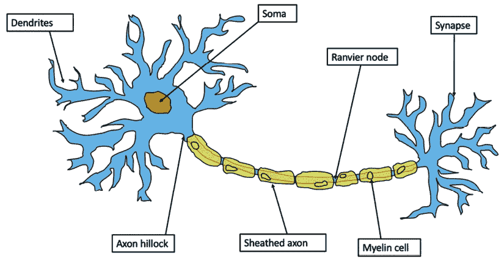

图 11.3：生物神经元

你们中的许多人可能已经在生物学或机器学习的相关领域接触过这个概念。但我们还是要再回顾一下。生物神经元有以下几个部分：

+   **树突**是神经细胞的分支延伸部分，收集来自周围细胞或其他神经元的输入。

+   **索玛**，即细胞体，收集这些输入，结合它们并传递出去。

+   **轴突丘**连接细胞体和轴突，并控制神经元的放电。如果信号的强度超过阈值，轴突丘就会通过轴突放电信号。

+   **轴突**是连接细胞体和神经末梢的纤维。它的职责是将电信号传递到终端。

+   **突触**是神经细胞的终端，并将信号传递给其他神经细胞。

McCulloch 和 Pitts（1943）是第一个设计生物神经元数学模型的人。然而，McCulloch-Pitts 模型有几个局限性：

+   它只接受二进制变量。

+   它认为所有输入变量同等重要。

+   只有一个参数，阈值，这个参数是不可学习的。

1957 年，Frank Rosenblatt 推广了 McCulloch-Pitts 模型，并使其成为一个完整的模型，其参数可以被学习。现代深度学习网络与人脑的相似性到此为止。开始这一研究方向的学习基本单元受人类生物学的启发，同时它也是对人类生物学的一个相当廉价的模仿。

**参考检查**：

Frank Rosenblatt 的原始研究论文《感知机》在**参考文献**中列为参考文献*5*。

让我们详细了解感知机，因为它是所有神经网络的基本构建块：

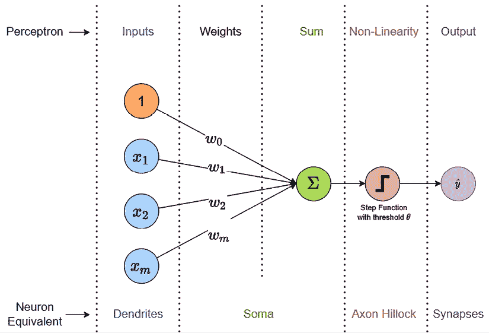

图 11.4：感知机

如*图 11.4*所示，感知机有以下组成部分：

+   **输入**：这些是传递给感知机的实值输入，就像神经元中的树突一样，收集输入信号。

+   **加权和**：每个输入乘以对应的权重并求和。权重决定了每个输入在确定结果时的重要性。

+   **非线性**：加权和通过一个非线性函数。对于原始的感知机，它是一个带有阈值激活的阶跃函数。输出将根据加权和和单元的阈值为正或负。现代的感知机和神经网络使用不同种类的激活函数，但我们稍后会看到这些。

我们可以将感知机写成如下数学形式：

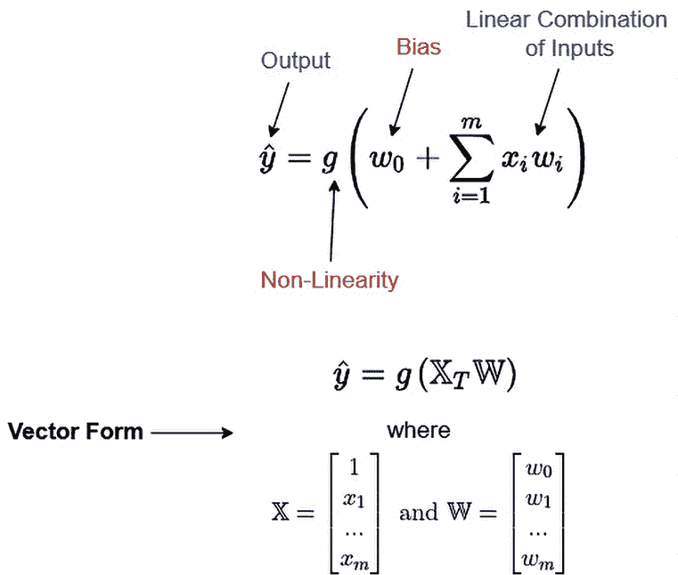

图 11.5：感知机，数学视角

如*图 11.5*所示，感知机的输出由输入的加权和定义，并通过一个非线性函数传递。现在，我们也可以通过线性代数来理解这一点。这是一个重要的视角，原因有二：

+   线性代数的视角将帮助你更快地理解神经网络。

+   这也使整个过程变得可行，因为矩阵乘法是我们现代计算机和 GPU 擅长的事情。没有线性代数，将这些输入与相应权重相乘将要求我们循环遍历输入，这很快变得不可行。

    **线性代数直觉回顾**

    让我们回顾一些概念。如果您已经了解向量、向量空间和矩阵乘法，请随时跳过。

    **向量和向量空间**

    在表面上，**向量**是一个数字数组。然而，在线性代数中，向量是一个具有大小和方向的实体。让我们举个例子来阐明：

    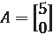

    我们可以看到这是一个数字数组。但是，如果我们在二维坐标空间中绘制这一点，我们会得到一个点。如果我们从原点到这一点画一条线，我们将得到一个具有方向和大小的实体。这就是一个向量。

    二维坐标空间称为**向量空间**。一个二维向量空间，在非正式情况下，是所有具有两个条目的可能向量。将其扩展到*n*维，一个*n*维向量空间是所有具有*n*个条目的可能向量。

    我想留给您的最终直觉是：*向量是 n 维向量空间中的一个点*。

    **矩阵和变换**

    再次，在表面上，**矩阵**是一个看起来像这样的数字的矩形排列：

    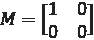

    矩阵有许多用途，但对我们最相关的直觉是，矩阵指定了它所在的向量空间的线性变换。当我们将一个向量与一个矩阵相乘时，我们实质上是在转换向量，矩阵的值和维度定义了发生的变换类型。根据矩阵的内容，它可以进行*旋转、反射、缩放、剪切*等操作。

    我们在`Chapter11`文件夹中包含了一个名为`01-Linear_Algebra_Intuition.ipynb`的笔记本，其中探讨了矩阵乘法作为一种转换。我们还将这些转换矩阵应用于向量空间，以发展关于矩阵乘法如何旋转和扭曲向量空间的直觉。

    我强烈建议您前往*进一步阅读*部分，在那里我们提供了一些资源来开始并巩固必要的直觉。

如果我们将输入视为特征空间（具有*m*维的向量空间）中的向量，则术语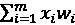不过是输入向量的线性组合。我们可以将方程重写为以下向量形式：

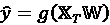

在这里，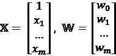

偏置也包括在这里作为一个固定值为 1 的虚拟输入，并将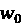添加到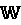向量中。

现在我们已经初步了解了深度学习，让我们回顾一下我们之前讨论的深度学习的一个方面——组合性——并在下一节中对其进行更深入的探讨。

# 深度学习系统的组成部分

让我们回顾一下 Yann LeCun 对深度学习的定义：

> “深度学习是一种方法论：通过将参数化模块组装成（可能是动态的）图，并使用基于梯度的方法优化它，来构建模型。”

这里的核心思想是，深度学习是一个高度模块化的系统。深度学习不仅仅是一个模型，而是一种语言，通过几个具有特定属性的参数化模块来表达任何模型：

1.  它应该能够通过一系列计算从给定的输入中产生输出。

1.  如果给定了期望的输出，它应该能够将信息传递给其输入，告诉它们如何改变，以达到期望的输出。例如，如果输出低于预期，模块应该能够告诉其输入在某个方向上进行变化，从而使输出更接近期望的结果。

数学倾向较强的人可能已经弄明白了与第二个导数点的关联。你是对的。为了优化这类系统，我们主要使用基于梯度的优化方法。因此，将这两个属性合并为一个，我们可以说这些参数化模块应该是*可微分的函数*。

让我们借助一张图来进一步辅助讨论。

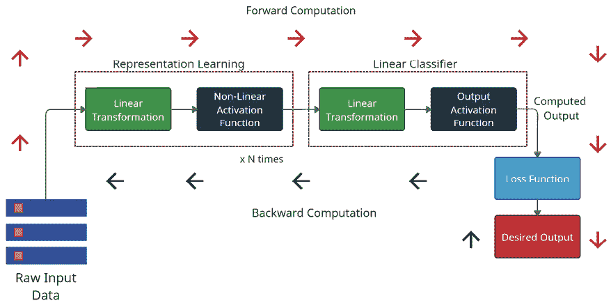

图 11.6：深度学习系统

如*图 11.6*所示，深度学习可以被看作是一个系统，通过一系列线性和非线性变换从原始输入数据中获取信息，并提供输出。它还可以调整其内部参数，通过学习使输出尽可能接近所期望的输出。为了简化图示，我们选择了一个适用于大多数流行深度学习系统的范式。它的一切从原始输入数据开始。原始输入数据经过*N*个块的线性和非线性函数进行表示学习。让我们详细探讨这些模块。

## 表示学习

**表示学习**，通俗地说，就是学习最佳特征，使得我们可以使问题变得线性可分。线性可分意味着我们可以用一条直线将不同的类别（在分类问题中）分开（*图 11.7*）：

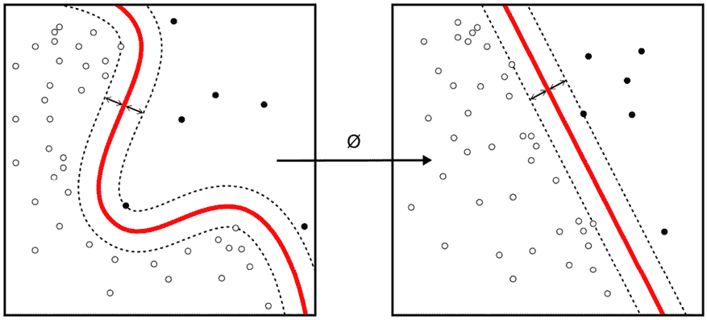

图 11.7：使用一个函数将非线性可分的数据转换为线性可分，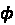

*图 11.6*中的*表示学习*模块可能有多个线性和非线性函数堆叠在一起，整个模块的功能是学习一个函数，，将原始输入转换为使问题线性可分的良好特征。

另一种看待这一问题的方式是通过线性代数的视角。正如我们在本章之前所探讨的，矩阵乘法可以被视为向量的线性变换。如果我们将这种直觉扩展到向量空间上，我们可以看到矩阵乘法在某种程度上会扭曲向量空间。当我们将多个线性和非线性变换叠加时，本质上我们是在扭曲、旋转和压缩输入的向量空间（包含特征），将其映射到另一个空间。当我们要求一个有参数的系统以某种方式扭曲输入空间（如图像的像素），以执行特定任务（例如区分狗与猫的分类），表示学习模块便会学习到正确的变换，从而使任务变得更容易（例如区分猫与狗）。

我制作了一个视频来说明这一点，因为没有什么比一个展示实际情况的视频更能帮助建立直觉的了。我使用了一个非线性可分的数据集，训练了一个神经网络来进行分类，然后将模型如何将输入空间转换为线性可分表示进行了可视化。你可以在这里找到这个视频：[`www.youtube.com/watch?v=5xYEa9PPDTE`](https://www.youtube.com/watch?v=5xYEa9PPDTE)。

现在，让我们看看表示学习模块。我们可以看到其中有一个线性变换和一个非线性激活。

## 线性变换

线性变换只是应用于向量空间的变换。当我们在神经网络的上下文中提到线性变换时，实际上指的是仿射变换。

线性变换在应用变换时会固定原点，但仿射变换则不会。旋转、反射、缩放等都是纯粹的线性变换，因为在进行这些操作时原点不会发生变化。但像平移这样的操作，会移动向量空间，它就是一种仿射变换。因此，*A***X*^T 是线性变换，但*A***X*^T +*b*是仿射变换。

所以，线性变换只是矩阵乘法，它将输入的向量空间进行转换，这也是当今任何神经网络或深度学习系统的核心。

如果我们将多个线性变换叠加在一起，会发生什么呢？例如，我们首先将输入*X*与变换矩阵*A*相乘，然后将结果与另一个变换矩阵*B*相乘：

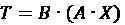

根据结合律（也适用于线性代数），我们可以将这个方程重写为如下形式：

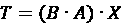

将这一概念推广到多个*N*个变换矩阵的堆叠，我们可以看到这一切最终会变成单一的线性变换。这种做法似乎违背了堆叠*N*层的初衷，不是吗？

这就是非线性变得至关重要的地方，我们通过使用非线性函数引入非线性性，这些非线性函数被称为激活函数。

## 激活函数

**激活函数**是非线性可微分函数。在生物神经元中，轴突小丘基于输入信号决定是否发出信号。激活函数具有类似的功能，并且对于神经网络建模非线性数据的能力至关重要。换句话说，激活函数是神经网络将输入向量空间（线性不可分）转换为线性可分向量空间的关键，非正式地说。为了*扭曲*空间，使得线性不可分的点变得线性可分，我们需要进行非线性变换。

我们重复了上一节中的实验，进行神经网络对输入向量空间的训练变换的可视化，但这次没有使用任何非线性变换。生成的视频可以在此观看：[`www.youtube.com/watch?v=z-nV8oBpH2w`](https://www.youtube.com/watch?v=z-nV8oBpH2w)。模型学习到的最佳变换仍然不够充分，点仍然是线性不可分的。

理论上，激活函数可以是任何非线性可微分的（严格来说是几乎处处可微分）函数。然而，随着时间的推移，有一些非线性函数被广泛用于作为激活函数。我们来看看其中一些。

### Sigmoid

Sigmoid 是最常见的激活函数之一，可能也是最古老的。它也被称为逻辑函数。当我们讨论感知机时，我们提到了一种步进（在文献中也称为 *Heaviside*）函数作为激活函数。步进函数不是连续函数，因此在任何地方都**不可微分**。一个非常接近的替代品就是 Sigmoid 函数。

它的定义如下：

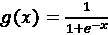

其中 *g* 是 Sigmoid 函数，*x* 是输入值。

Sigmoid 是一个连续函数，因此在任何地方都是可微分的。其导数也较容易计算。由于这些性质，Sigmoid 在深度学习的早期作为标准激活函数被广泛采用。

让我们看看 Sigmoid 函数长什么样子，以及它如何转换向量空间：

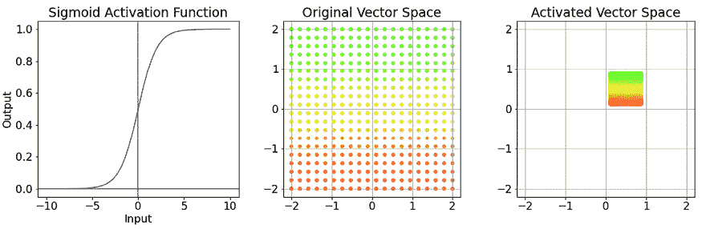

图 11.8：Sigmoid 激活函数（左），原始和激活后的向量空间（中间和右）

sigmoid 函数将输入压缩到 0 和 1 之间，如*图 11.8（左）*所示。我们可以在向量空间中观察到相同的现象。sigmoid 函数的一个缺点是，梯度在 sigmoid 的平坦部分趋近于零。当神经元接近该区域时，它接收到的梯度变得微不足道，传播的梯度也停止，导致单元停止学习。我们称这种现象为激活的*饱和*。由于这个原因，现在*sigmoid*通常不再用于深度学习中，除非在输出层（我们很快会讨论这种用法）。

### 双曲正切（tanh）

双曲正切是另一种流行的激活函数。它可以很容易地定义如下：

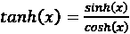

它与 sigmoid 非常相似。实际上，我们可以将*tanh*表示为 sigmoid 的一个函数。让我们看看这个激活函数的样子：

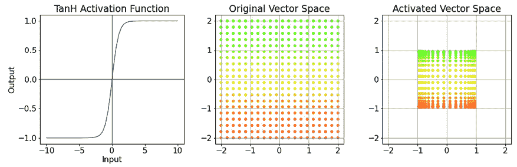

图 11.9：Tanh 激活函数（左）和原始、激活后的向量空间（中和右）

我们可以看到其形状类似于 sigmoid，但要尖锐一些。关键的不同之处在于，*tanh*函数输出的值在-1 和 1 之间。而由于其尖锐性，我们还可以看到向量空间被推向了边缘。该函数输出一个对称于原点（0）的值，这有助于网络的优化，因此*tanh*被优于*sigmoid*。但由于*tanh*函数也是一个饱和函数，当梯度非常小，妨碍梯度流动进而影响学习时，这一问题也困扰着*tanh*激活。

### 整流线性单元及其变种

随着神经科学对人脑的了解不断深入，研究人员发现大脑中只有 1%到 4%的神经元在任何时候被激活。然而，在使用诸如*sigmoid*或*tanh*等激活函数时，网络中几乎一半的神经元都会被激活。2010 年，Vinod Nair 和 Geoffrey Hinton 在开创性的论文《*Rectified Linear Units Improve Restricted Boltzmann Machines*》中提出了**整流线性单元**（**ReLU**）。从那时起，ReLU 成为深度神经网络中事实上的激活函数。

#### ReLU

ReLU 的定义如下：

*g*(*x*) = *max*(*x*, 0)

它只是一个线性函数，但在零点处有一个拐角。大于零的任何值都会保持不变，而所有小于零的值都会被压缩为零。输出的范围从 0 到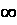。让我们来看一下它的可视化效果：

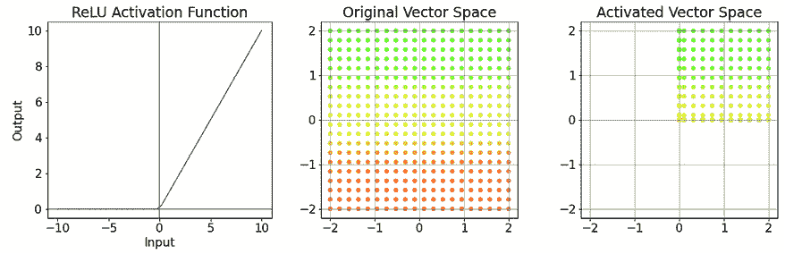

图 11.10：ReLU 激活函数（左）和原始、激活后的向量空间（中和右）

我们可以看到左下象限的点都被压缩到坐标轴的线上。这种压缩赋予了激活函数非线性。由于激活函数以一种突然变为零而不是像 sigmoid 或 tanh 那样趋近于零的方式变为零，ReLU 是非饱和的。

**参考文献检查**：

提出了 ReLU 的研究论文在*参考文献*中被引用，参考文献编号为*7*。

使用 ReLU 有一些优点：

+   激活函数及其梯度的计算成本非常低。

+   训练收敛速度比使用饱和激活函数的情况要快得多。

+   ReLU 有助于在网络中引入稀疏性（通过将激活设为零，网络中绝大多数神经元可以被关闭），并且类似于生物神经元的工作方式。

但是，ReLU 也不是没有问题的：

+   当 *x* < 0 时，梯度变为零。这意味着输出 < 0 的神经元将会有零梯度，因此该单元将不再学习。这些被称为死 ReLU。

+   另一个缺点是，ReLU 单元的平均输出是正值，当我们堆叠多个层时，这可能导致输出产生正偏差。

让我们来看一些变种，尝试解决我们讨论过的 ReLU 问题。

#### Leaky ReLU 和参数化 ReLU

Leaky ReLU 是标准 ReLU 的变种，解决了 *死 ReLU* 问题。它由 Maas 等人于 2013 年提出。Leaky ReLU 可以定义如下：

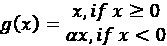

这里，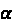 是斜率参数（通常设置为非常小的值，例如 0.001），并被视为超参数。这确保了当 *x* < *0* 时梯度不为零，从而避免了*死* ReLU 的问题。但这里丧失了 ReLU 提供的稀疏性，因为没有零输出来完全关闭神经元。我们来可视化这个激活函数：

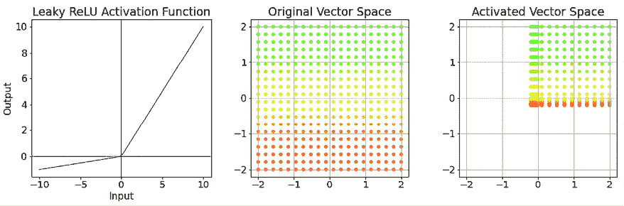

图 11.11：Leaky ReLU 激活函数（左）和原始与激活后的向量空间（中和右）

2015 年，K. He 等人提出了一种对 Leaky ReLU 的小改进，称为 **参数化 ReLU**。在参数化 ReLU 中，他们不再将  视为超参数，而是将其视为一个可学习的参数。

**参考文献检查**：

提出了 Leaky ReLU 的研究论文在*参考文献*中被引用，参考文献编号为*8*，而参数化 ReLU 在参考文献编号为*9*中被引用。

还有许多其他激活函数，虽然不太流行，但在 *PyTorch* 中仍具有足够的使用案例。您可以在这里找到它们的列表：[`pytorch.org/docs/stable/nn.html#non-linear-activations-weighted-sum-nonlinearity`](https://pytorch.org/docs/stable/nn.html#non-linear-activations-weighted-sum-nonlinearity)。我们建议您使用 `Chapter 11` 文件夹中的笔记本 `02-Activation_Functions.ipynb` 尝试不同的激活函数，看看它们如何改变向量空间。

接下来，我们已经了解了第一块图中的组件，即*图 11.6*，表示学习。那里的下一个块是线性分类器，它具有线性变换和输出激活。我们已经知道线性变换是什么，但输出激活是什么？

## 输出激活函数

输出激活函数是强制网络输出具有几个理想属性的函数。

**额外阅读**：

这些函数与**最大似然估计**（**MLE**）和选择的损失函数有着更深的联系，但我们不会深入探讨，因为这超出了本书的范围。我们在*进一步阅读*部分中链接到了 Ian Goodfellow、Yoshua Bengio 和 Aaron Courville 的书籍 *深度学习*。如果你对深度学习有更深入的理解兴趣，我们建议你使用该书。

如果我们希望神经网络在回归的情况下预测一个连续数值，我们只需使用线性激活函数（这就像说没有激活函数）。来自网络的原始输出被视为预测结果并输入到损失函数中。

但在分类的情况下，期望的输出是所有可能类别中的一个类。如果只有两个类别，我们可以使用我们的老朋友 `sigmoid` 函数，其输出介于 0 和 1 之间。我们还可以使用 *tanh*，因为其输出将介于 -1 和 1 之间。`sigmoid` 函数更受青睐，因为它具有直观的概率解释。值越接近一，网络对该预测的信心就越大。

现在，*sigmoid* 适用于二元分类。那么对于可能类别超过两个的多类分类呢？

### Softmax

*Softmax* 是一个将 *K* 个实数值向量转换为另一个 *K* 正实数值向量的函数，其总和为 1。*Softmax* 的定义如下：

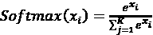

此函数将网络的原始输出转换为类似于 *K* 类概率的形式。这与 *sigmoid* 有着紧密的关系——当 *K* = *2* 时，*sigmoid* 是 *softmax* 的特例。在接下来的图中，让我们看看如何将大小为 3 的随机向量转换为总和为 1 的概率：

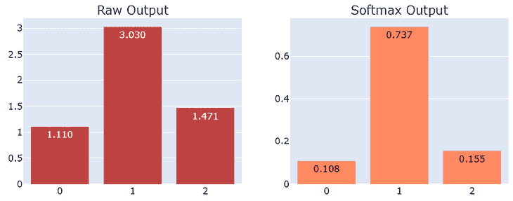

图 11.12: 原始输出与 softmax 输出

如果我们仔细观察，我们会发现，除了将真实值转换成类似概率的东西外，它还增加了最大值与其他值之间的相对差距。这种激活是多类分类问题的标准输出激活。

现在，图表中只剩下一个主要组件——损失函数（*图 11.6*）。

## 损失函数

在*第五章*中我们提到的损失函数，*时间序列预测作为回归问题*，同样适用于深度学习。在深度学习中，损失函数也是一种衡量模型预测质量的方式。如果预测偏离目标很远，损失函数值会很高；而当我们越来越接近真实值时，损失函数值会变小。在深度学习范式中，损失函数还有一个额外的要求——它应该是可微的。

经典机器学习中的常见损失函数，如**均方误差**或**均绝对误差**，在深度学习中同样适用。事实上，在回归任务中，它们是实践者默认选择的损失函数。对于分类任务，我们采用一个来自信息论的概念——**交叉熵损失**。然而，由于深度学习是一个非常灵活的框架，只要损失函数是可微的，我们就可以使用任何损失函数。已经有很多损失函数被人们尝试并且在许多情况下证明有效。其中很多也已经成为了 PyTorch 的 API 的一部分。你可以在这里找到它们：[`pytorch.org/docs/stable/nn.html#loss-functions`](https://pytorch.org/docs/stable/nn.html#loss-functions)。

现在我们已经涵盖了深度学习系统的所有组件，让我们简要看看如何训练整个系统。

## 前向和后向传播

在*图 11.6*中，我们可以看到两组箭头，一组从输入指向期望的输出，标记为*前向计算*，另一组则从期望的输出指向输入，标记为*后向计算*。这两个步骤是深度学习系统学习过程的核心。在*前向计算*中，通常称为**前向传播**，我们使用在各层中定义的一系列计算，将输入从网络的起始点传递到输出端。现在我们得到了输出，我们会使用损失函数来评估我们离期望输出有多近或多远。这些信息现在被用于*后向计算*，通常称为**反向传播**，以计算相对于所有参数的梯度。

那么，梯度是什么，为什么我们需要它？在高中的数学中，我们可能会遇到梯度或导数，它们也被称为**斜率**。斜率是指当我们以单位度量改变一个变量时，量的变化速率。导数告诉我们标量函数的局部斜率。导数总是与单一变量相关，而梯度是导数对多变量函数的推广。直观地说，梯度和导数都告诉我们函数的局部斜率。通过损失函数的梯度，我们可以使用数学优化中的一种技术——**梯度下降**，来优化我们的损失函数。

让我们通过一个例子来看看。

### 梯度下降

任何机器学习或深度学习模型都可以看作是一个将输入 *x* 转换为输出  的函数，使用一些参数 。在这里， 可以是我们在整个网络中对输入进行的所有矩阵变换的集合。但为了简化例子，我们假设只有两个参数 *a* 和 *b*。如果我们稍微思考一下整个学习过程，就会发现，通过保持输入和预期输出不变，改变损失函数的方式就是通过调整模型的参数。因此，我们可以假设损失函数是通过这些参数来参数化的——在这个例子中就是 *a* 和 *b*。

**笔记本提示**：

若要跟随完整代码，请使用 `Chapter11` 文件夹中的名为 `03-Gradient_Descent.ipynb` 的笔记本，以及 `src` 文件夹中的代码。

假设损失函数的形式如下：

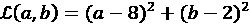

让我们看看这个函数是什么样子的。我们可以使用三维图来可视化一个有两个参数的函数，如 *图 11.13* 所示。两个维度将用来表示这两个参数，在那个二维网格的每一点上，我们可以在第三维度中绘制损失值。

这种损失函数的图表也称为损失曲线（在单变量情况下），或损失面（在多变量情况下）。

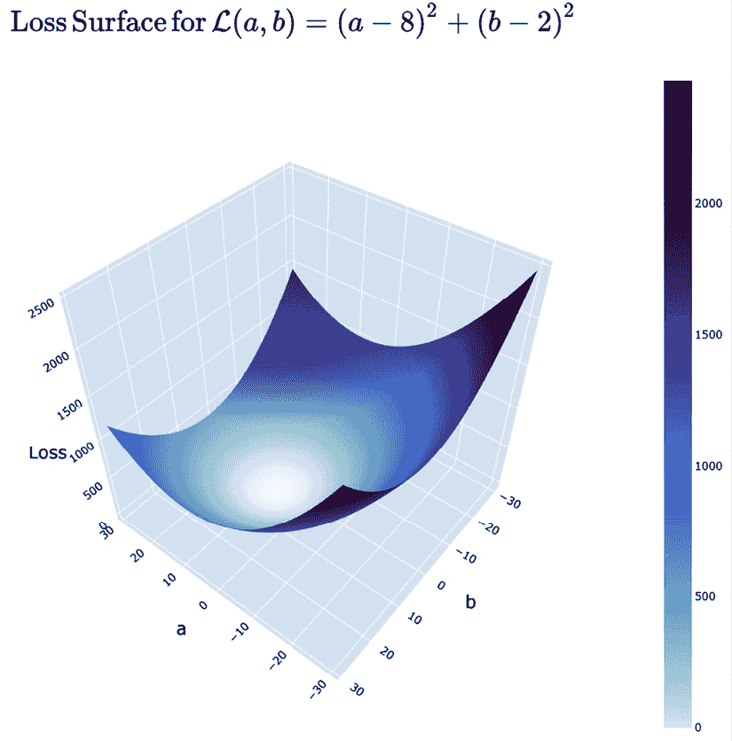

图 11.13：损失面图

3D 形状的较亮部分表示损失函数较小，而离开该部分时，损失值增大。

在机器学习中，我们的目标是最小化损失函数，换句话说，就是找到能够使我们的预测输出尽可能接近真实值的参数。这属于数学优化的范畴，而有一种特别的技术非常适合这种方法——**梯度下降**。

梯度下降是一种数学优化算法，通过在最陡下降的方向上迭代地移动来最小化代价函数。在单变量函数中，导数（或斜率）给出我们最陡上升的方向（和大小）。例如，如果我们知道一个函数的斜率为 1，那么我们知道如果向右移动，我们是在沿着斜率向上爬坡，向左移动则是在向下爬坡。同样，在多变量的情况下，函数在任何一点的梯度将给出最陡上升的方向（和大小）。而由于我们关注的是最小化损失函数，因此我们将使用负梯度，它会指引我们向最陡下降的方向移动。

那么，让我们为我们的损失函数定义梯度。我们使用的是高中级别的微积分，但即使你不太擅长，也无需担心：

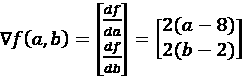

那么，算法是如何工作的呢？非常简单，具体如下：

1.  将参数初始化为随机值。

1.  计算该点的梯度。

1.  沿着梯度的反方向迈出一步。

1.  重复步骤 2 和步骤 3，直到收敛或达到最大迭代次数。

还有一个需要澄清的方面：我们在每次迭代中应该迈出多大一步？

理想情况下，梯度的大小告诉你函数在该方向变化的快慢，我们应该直接按照梯度的大小进行步长调整。但梯度有一个特性使得直接这样做并不好。梯度只定义了当前点附近最陡上升的方向和大小，并且对它之外的变化一无所知。因此，我们使用一个超参数，通常称为**学习率**，来调整我们在每次迭代中所采取的步长。因此，我们不直接采取与梯度相等的步长，而是将步长设置为学习率与梯度的乘积。

从数学上讲，如果  是参数的向量，在每次迭代时，我们使用以下公式更新参数：

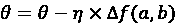

这里， 是学习率，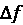 是该点的梯度。

让我们看看一个非常简单的梯度下降实现（有关完整定义和代码，请参阅 GitHub 仓库中的 notebook）。首先，让我们定义一个函数，返回任意点的梯度：

```py
def gradient(a, b):
    return 2*(a-8), 2*(b-2) 
```

现在我们定义一些初始参数，比如最大迭代次数、学习率，以及*a* 和 *b* 的初始值：

```py
# maximum number of iterations that can be done
maximum_iterations = 500
# current iteration
current_iteration = 0
# Learning Rate
learning_rate = 0.01
#Initial value of a, b
current_a_value = 28
current_b_value = 27
Now, all that is left is the actual process of gradient descent:
while current_iteration < maximum_iterations:
    previous_a_value = current_a_value
    previous_b_value = current_b_value
    # Calculating the gradients at current values
    gradient_a, gradient_b = gradient(previous_a_value, previous_b_value)
    # Adjusting the parameters using the gradients
    current_a_value = current_a_value - learning_rate * gradient_a * (previous_a_value)
    current_b_value = current_b_value - learning_rate * gradient_b * (previous_b_value)
    current_iteration = current_iteration + 1 
```

我们知道这个函数的最小值出现在 *a* = *8* 和 *b* = *2*，因为这会使损失函数为零。而梯度下降法能找到一个非常准确的解——*a* = *8.000000000000005* 和 *b* = *2.000000002230101*。我们还可以将它到达最小值的路径可视化，如*图 11.14*所示：

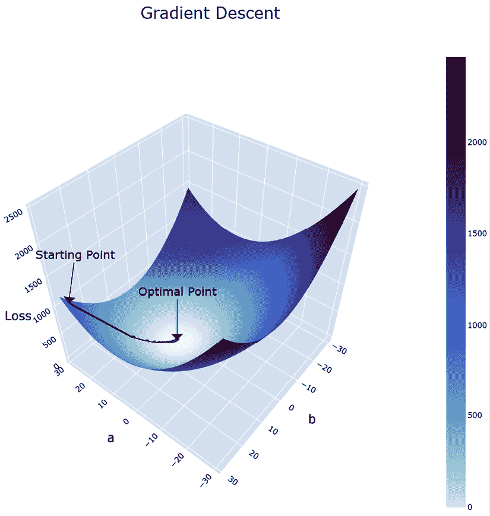

图 11.14: 损失面上的梯度下降优化

即使我们将参数初始化远离实际原点，优化算法也会直接路径到达最优点。在每个点上，算法查看点的梯度，朝相反方向移动，最终收敛于最优点。

当梯度下降在学习任务中被采用时，需要注意一些问题。假设我们有一个包含*N*个样本的数据集。有三种流行的梯度下降变体用于学习，每种都有其优缺点。

#### 批量梯度下降

我们将*所有 N*个样本通过网络，并计算所有*N*个实例的损失平均值。现在，我们使用这个损失来计算梯度，在正确方向上迈出一步，然后重复此过程。

优点如下：

+   优化路径是直接的。

+   优化路径有保证的收敛性。

缺点如下：

+   需要对单个步骤评估整个数据集，这在计算上是昂贵的。对于庞大的数据集，每个优化步骤的计算量变得非常高。

+   每个优化步骤的所需时间较长，因此收敛速度也较慢。

#### 随机梯度下降（SGD）

在随机梯度下降（SGD）中，我们从*N*个样本中随机抽取*一个*实例，计算损失和梯度，然后更新参数。

优点如下：

+   因为我们只使用单个实例来进行优化步骤，每个优化步骤的计算量非常低。

+   每个优化步骤的所需时间也更短。

+   随机抽样也作为正则化，有助于避免过拟合。

缺点如下：

+   梯度估计具有噪声，因为我们仅基于一个实例进行步骤。因此，朝向最优点的路径将是不稳定和嘈杂的。

+   仅因为每个优化步骤的时间较短，并不意味着收敛速度更快。由于嘈杂的梯度估计，我们可能许多次没有采取正确的步骤。

#### 小批量梯度下降

小批量梯度下降是一种介于批量梯度下降和 SGD 之间的技术。在这种变体中，我们还有另一个质量叫做小批量大小（或简称批量大小），*b*。在每个优化步骤中，我们从*N*个样本中随机选择*b*个实例，并计算所有*b*个实例的平均损失梯度。当*b* = *N*时，我们有批量梯度下降；当*b* = *1*时，我们有随机梯度下降。这是今天训练神经网络最流行的方法。通过改变批量大小，我们可以在这两种变体之间移动，并管理每种选择的优缺点。

没有什么能比得上一个视觉化的操作平台，更能帮助我们直观地理解我们讨论的不同组件的效果。*Tensorflow Playground* 是一个极好的资源（见 *进一步阅读* 部分中的链接），它可以帮助你做到这一点。我强烈建议你前往那里，玩一玩这个工具，在浏览器中训练几个神经网络，并实时观察学习过程是如何发生的。

# 摘要

我们以介绍深度学习开始了本书的新部分。我们从一段历史开始，了解为什么深度学习在今天如此流行，并探讨了它在感知器中的朴素起步。我们理解了深度学习的可组合性，并分析了深度学习的不同组件，如表示学习块、线性层、激活函数等。最后，我们通过观察深度学习系统如何使用梯度下降从数据中学习来总结讨论。基于这些理解，我们现在准备进入下一章，在那里我们将把叙事引向时间序列模型。

# 参考文献

以下是本章中使用的参考文献列表：

1.  Kyoung-Su Oh 和 Keechul Jung. (2004), *神经网络的 GPU 实现*。模式识别，第 37 卷，第 6 期，2004 年: [`doi.org/10.1016/j.patcog.2004.01.013`](https://doi.org/10.1016/j.patcog.2004.01.013)。

1.  Rajat Raina, Anand Madhavan 和 Andrew Y. Ng. (2009), *使用图形处理单元进行大规模深度无监督学习*。第 26 届国际机器学习大会(ICML '09)论文集: [`doi.org/10.1145/1553374.1553486`](https://doi.org/10.1145/1553374.1553486)。

1.  Alex Krizhevsky, Ilya Sutskever 和 Geoffrey E. Hinton. (2012), *使用深度卷积神经网络进行 ImageNet 分类*。Commun. ACM 60, 6 (2017 年 6 月)，84–90: [`doi.org/10.1145/3065386`](https://doi.org/10.1145/3065386)。

1.  Neil C. Thompson, Kristjan Greenewald, Keeheon Lee 和 Gabriel F. Manso. (2020). *深度学习的计算极限*。arXiv:2007.05558v1 [cs.LG]: [`arxiv.org/abs/2007.05558v1`](https://arxiv.org/abs/2007.05558v1)。

1.  Frank Rosenblatt. (1957), *感知器——一个感知与识别的自动机*，技术报告 85-460-1，康奈尔航空实验室。

1.  Charu C. Aggarwal, Alexander Hinneburg 和 Daniel A. Keim. (2001). *高维空间中距离度量的惊人表现*。第 8 届国际数据库理论会议(ICDT '01)论文集。Springer-Verlag，柏林，海德堡，420–434: [`dl.acm.org/doi/10.5555/645504.656414`](https://dl.acm.org/doi/10.5555/645504.656414)。

1.  Nair, V. 和 Hinton, G.E. (2010). *修正线性单元改进了限制玻尔兹曼机*。ICML: [`icml.cc/Conferences/2010/papers/432.pdf`](https://icml.cc/Conferences/2010/papers/432.pdf)。

1.  Andrew L. Maas, Awni Y. Hannun, 和 Andrew Y. Ng。（2013）。*激活函数非线性改善神经网络声学模型*。ICML 深度学习音频、语音和语言处理工作坊：[`ai.stanford.edu/~amaas/papers/relu_hybrid_icml2013_final.pdf`](https://ai.stanford.edu/~amaas/papers/relu_hybrid_icml2013_final.pdf)。

1.  Kaiming He, Xiangyu Zhang, Shaoqing Ren, 和 Jian Sun（2015）。*深入研究激活函数：在 ImageNet 分类上超越人类水平表现*。2015 IEEE 国际计算机视觉大会（ICCV），1026-1034：[`ieeexplore.ieee.org/document/7410480`](https://ieeexplore.ieee.org/document/7410480)。

1.  Sara Hooker。（2021）。*硬件彩票*。Commun. ACM，第 64 卷：[`doi.org/10.1145/3467017`](https://doi.org/10.1145/3467017)。

# 进一步阅读

如果你想深入了解本章中涉及的某些主题，可以查阅以下资源：

+   *线性代数* 课程，由 Gilbert Strang 主讲：[`ocw.mit.edu/resources/res-18-010-a-2020-vision-of-linear-algebra-spring-2020/videos/`](https://ocw.mit.edu/resources/res-18-010-a-2020-vision-of-linear-algebra-spring-2020/videos/)

+   *线性代数的本质*，由 3Blue1Brown 提供：[`www.youtube.com/playlist?list=PLZHQObOWTQDPD3MizzM2xVFitgF8hE_ab`](https://www.youtube.com/playlist?list=PLZHQObOWTQDPD3MizzM2xVFitgF8hE_ab)

+   *神经网络——线性代数视角*，作者 Manu Joseph：[`deep-and-shallow.com/2022/01/15/neural-networks-a-linear-algebra-perspective/`](https://deep-and-shallow.com/2022/01/15/neural-networks-a-linear-algebra-perspective/)

+   *深度学习* – Ian Goodfellow, Yoshua Bengio, Aaron Courville：[`deep-and-shallow.com/2022/01/15/neural-networks-a-linear-algebra-perspective/`](https://deep-and-shallow.com/2022/01/15/neural-networks-a-linear-algebra-perspective/)

+   *Tensorflow Playground*：[`playground.tensorflow.org/`](https://playground.tensorflow.org/)

# 加入我们的 Discord 社区

加入我们社区的 Discord 空间，与作者和其他读者进行讨论：

[`packt.link/mts`](https://packt.link/mts)


