# 第十二章：时间序列的深度学习构建模块

虽然我们在上一章奠定了深度学习的基础，但那是非常通用的。深度学习是一个庞大的领域，应用涉及各个领域，但在本书中，我们将重点讨论其在时间序列预测中的应用。

因此，在本章中，让我们通过查看一些深度学习中常用于时间序列预测的构建模块来强化基础。尽管全球机器学习模型在时间序列问题中表现良好，但一些深度学习方法也显示出了良好的前景。由于它们在建模时的灵活性，它们是你工具箱中的一个良好补充。

在这一章中，我们将涵盖以下内容：

+   理解编码器-解码器范式

+   前馈网络

+   循环神经网络

+   长短期记忆网络

+   门控循环单元

+   卷积网络

# 技术要求

你需要设置**Anaconda**环境，按照本书*前言*中的说明进行操作，以获得一个包含所有所需库和数据集的工作环境。任何额外的库将在运行笔记本时自动安装。

本章相关的代码可以在[`github.com/PacktPublishing/Modern-Time-Series-Forecasting-with-Python-2E/tree/main/notebooks/Chapter12`](https://github.com/PacktPublishing/Modern-Time-Series-Forecasting-with-Python-2E/tree/main/notebooks/Chapter12)找到。

# 理解编码器-解码器范式

在*第五章*，*时间序列预测作为回归问题*中，我们看到机器学习的核心就是学习一个将我们的输入映射到期望输出的函数：

*y* = *h*(*x*)

其中，*x* 是输入，*y* 是我们期望的输出。

将其应用于时间序列预测（为了简化起见，使用单变量时间序列预测），我们可以将其重写如下：

*y*[t] = *h*(*y*[t][-1], *y*[t][-2], …, *y*[t-N])

在这里，*t* 是当前时间步，*N* 是在时间*t*时可用的历史总量。

深度学习，像任何其他机器学习方法一样，旨在学习一个将历史映射到未来的函数。在*第十一章*，*深度学习简介*中，我们看到深度学习如何通过表示学习来学习良好的特征，然后使用这些学习到的特征来执行当前任务。通过使用编码器-解码器范式，这一理解可以进一步从时间序列的角度进行细化。

就像研究中的所有内容一样，关于编码器-解码器架构的提出时间和提议者并不完全明确。1997 年，Ramon Neco 和 Mikel Forcada 提出了一个机器翻译架构，其理念与编码器-解码器范式相似。2013 年，Nal Kalchbrenner 和 Phil Blunsom 提出了一个机器翻译的编码器-解码器模型，尽管他们没有使用这个名称。但当 Ilya Sutskever 等人（2014 年）和 Cho 等人（2014 年）分别提出了两种独立的机器翻译新模型时，这一理念才真正兴起。Cho 等人称之为编码器-解码器架构，而 Sutskever 等人称之为 Seq2Seq 架构。它的关键创新是能够以端到端的方式建模可变长度的输入和输出。

**参考检查**：

Ramon Neco 等人、Nal Kalchbrenner 等人、Cho 等人以及 Ilya Sutskever 等人的研究论文分别在*参考文献*部分被标注为*1*、*2*、*3*和*4*。

这个想法非常直接，但在我们深入探讨之前，我们需要对潜在空间和特征/输入空间有一个高层次的理解。

**特征空间**，或 **输入空间**，是数据所在的向量空间。如果数据有 10 个维度，那么输入空间就是 10 维的向量空间。潜在空间是一个抽象的向量空间，它编码了特征空间的有意义的内部表示。为了理解这一点，我们可以想象人类如何识别老虎。我们不会记住老虎的每一个细节，而是对老虎的外观和显著特征（如条纹）有一个大致的了解。这种压缩的理解帮助我们的大脑更快地处理和识别老虎。

在机器学习领域，像**主成分分析**（**PCA**）这样的技术会对潜在空间进行类似的转换，保持输入数据的关键特征。通过这个直觉，重新阅读定义可能会让我们对这个概念有更清晰的理解。

现在我们对潜在空间有了一些了解，让我们来看一下编码器-解码器架构的作用。

编码器-解码器架构有两个主要部分——编码器和解码器：

+   **编码器**：编码器接收输入向量 *x*，并将其编码为潜在空间。这个编码后的表示被称为潜在向量 *z*。

+   **解码器**：解码器接收潜在向量 *z*，并将其解码成我们所需的输出形式（）。

以下图示展示了编码器-解码器的配置：

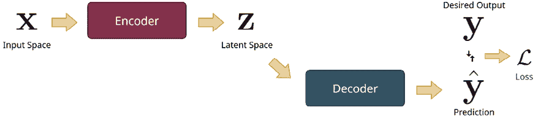

图 12.1：编码器-解码器架构

在时间序列预测的背景下，编码器消耗历史数据，并保留解码器生成预测所需的信息。正如我们之前所学，时间序列预测可以表示为如下：

*y*[t] = *h*(*y*[t][-1], *y*[t][-2], …, *y*[t-N])

现在，使用编码器-解码器范式，我们可以将其重写如下：

*z*[t] = *h*(*y*[t][-1], *y*[t][-2], …, *y*[t-N])

*y*[t] = *g*(*z*[t])

在这里，*h* 是编码器，*g* 是解码器。

每个编码器和解码器都可以是适合时间序列预测的特殊架构。让我们来看一下在编码器-解码器范式中常用的几个组件。

# 前馈网络

**前馈网络**（**FFNs**）或**全连接网络**是神经网络可以采用的最基本架构。我们在*第十一章*《深度学习导论》中讨论了感知器。如果我们将多个感知器（包括线性单元和非线性激活）堆叠起来并创建一个这样的单元网络，我们就得到了我们所说的 FFN。下面的图示将帮助我们理解这一点：

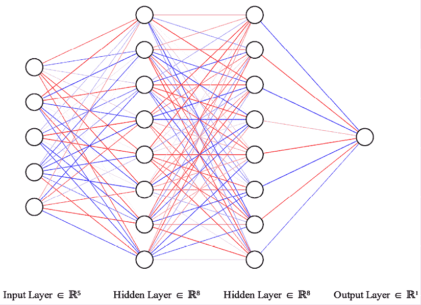

图 12.2：前馈网络（FFN）

一个 FFN 接受一个固定大小的输入向量，并通过一系列计算层传递，直到得到所需的输出。该架构称为前馈，因为信息是通过网络向前传递的。这也被称为**全连接网络**，因为每一层的每个单元都与前一层的每个单元和下一层的每个单元相连接。

第一层称为输入层，其大小等于输入的维度。最后一层称为输出层，其定义根据我们的期望输出。如果我们需要一个输出，就需要一个单元；如果我们需要 10 个输出，就需要 10 个单元。中间的所有层称为**隐藏层**。有两个超参数定义了网络的结构——隐藏层的数量和每层单元的数量。例如，在*图 12.2*中，我们有一个具有两个隐藏层且每层有八个单元的网络。

在时间序列预测的背景下，FFN 可以作为编码器和解码器使用。作为编码器，我们可以像在*第五章*《时间序列预测作为回归》中使用机器学习模型一样使用 FFN。我们嵌入时间并将时间序列问题转化为回归问题，然后输入到 FFN 中。作为解码器，我们在潜在向量（编码器的输出）上使用它来获得输出（这是 FFN 在时间序列预测中最常见的用法）。

**额外阅读**：

本书将始终使用 PyTorch 来处理深度学习。如果你不熟悉 PyTorch，别担心——我会在必要时解释相关概念。为了快速入门，你可以查看*第十二章*中的`01-PyTorch_Basics.ipynb`笔记本，在其中我们探索了张量的基本功能，并使用 PyTorch 从头开始训练了一个非常小的神经网络。我还建议你访问本章末尾的*进一步阅读*部分，在那里你会找到一些学习 PyTorch 的资源。

现在，让我们戴上实践的帽子，看看这些如何实际应用。PyTorch 是一个开源的深度学习框架，主要由**Facebook AI Research**（**FAIR**）**实验室**开发。虽然它是一个可以操作**张量**（即*n*维矩阵）并通过 GPU 加速这些操作的库，但这个库的主要用途之一是构建和训练深度学习系统。因此，PyTorch 提供了许多可以直接使用的组件，帮助我们构建深度学习系统。让我们看看如何使用 PyTorch 构建一个 FFN。

**笔记本提醒**：

要跟随完整的代码，请使用`Chapter12`文件夹中的`02-Building_Blocks.ipynb`笔记本和`src`文件夹中的代码。

正如我们在本节中之前学到的，FFN 是一个由线性和非线性单元组成的网络。线性操作包括将输入向量*X*与权重矩阵*W*相乘，并加上一个偏置项*b*。这个操作，即*WX* + *b*，被封装在**PyTorch**库的`nn`模块中的`Linear`类中。我们可以通过`torch.nn import Linear`从库中导入这个类。但通常，我们需要导入整个**nn**模块，因为我们会使用该模块中的许多组件。对于非线性部分，我们使用**ReLU**（如*第十一章 深度学习简介*中介绍），它也是**nn**模块中的一个类。

在继续之前，让我们创建一个随机游走时间序列，其长度为**20**：

```py
N = 20
df = pd.DataFrame({
    "date": pd.date_range(periods=N, start="2021-04-12", freq="D"),
    "ts": np.random.randn(N)
}) 
```

我们可以直接在 FFN 中使用这个张量，但通常，我们会使用滑动窗口技术来拆分张量并训练网络。我们这样做有多个原因：

+   我们可以将其视为一种数据增强技术，与仅使用整个序列一次不同，它可以创建更多的样本。

+   它通过将计算限制在一个固定的窗口内，帮助我们减少和限制计算。

现在让我们开始：

```py
ts = torch.from_numpy(df.ts.values).float()
window = 15
# Creating windows of 15 over the dataset
ts_dataset = ts.unfold(0, size=window, step=1) 
```

现在，我们有了一个张量`ts_dataset`，其大小为*6x15*（当我们在序列的长度上滑动窗口时，可以创建 6 个样本，每个样本包含 15 个输入特征）。对于标准的 FFN，输入形状指定为*批次大小 x 输入特征*。所以 6 是我们的批次大小，15 是输入特征的大小。

现在，让我们定义 FFN 中的各层。对于这个练习，我们假设网络结构如下：

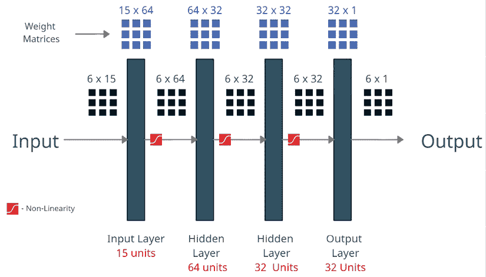

图 12.3：FFN——矩阵乘法视角

输入数据（6x15）将依次通过这些层。在这里，我们可以看到随着数据通过网络时张量维度的变化。每一层线性变换基本上是一个矩阵乘法，它将输入转换成指定维度的输出。在每次线性变换后，我们会堆叠一个非线性激活函数。这些交替的线性和非线性模块赋予神经网络表达能力。线性层是对向量空间的仿射变换（旋转、平移等），而非线性函数则将向量空间“压缩”。它们共同作用，可以将输入空间转化为适合当前任务的形式。现在，让我们看看如何用 PyTorch 编写代码实现这一过程。

我们将使用 PyTorch 中一个非常方便的模块，叫做**Sequential**，它允许我们将不同的子组件堆叠在一起，并轻松使用它们：

```py
# The FFN we define would have this architecture
# window(windowed input) >> 64 (hidden layer 1) >> 32 (hidden layer 2) >> 32 (hidden layer 2) >> 1 (output)
ffn = nn.Sequential(
    nn.Linear(in_features=window,out_features=64), # (batch-size x window) --> (batch-size x 64)
    nn.ReLU(),
    nn.Linear(in_features=64,out_features=32), # (batch-size x 64) --> (batch-size x 32)
    nn.ReLU(),
    nn.Linear(in_features=32,out_features=32), # (batch-size x 32) --> (batch-size x 32)
    nn.ReLU(),
    nn.Linear(in_features=32,out_features=1), # (batch-size x 32) --> (batch-size x 1)
) 
```

现在我们已经定义了 FFN，接下来我们来看一下如何使用它：

```py
ffn(ts_dataset)
# or more explicitly
ffn.forward(ts_dataset) 
```

这将返回一个张量，其形状基于*批处理大小 x 输出单元*。我们可以有任意数量的输出单元，而不仅仅是一个。因此，在使用编码器时，我们可以为潜在向量设置任意维度。然后，当我们将其用作解码器时，可以让输出单元等于我们预测的时间步数。

**预览**：

我们直到现在还没有看到多步预测，因为它将在*第十八章*，*多步预测*中更详细地讨论。但现在，只需要理解有些情况下我们需要预测未来多个时间步。经典的统计模型可以直接做到这一点。但对于机器学习和深度学习，我们需要设计能够做到这一点的系统。幸运的是，有几种不同的技术可以实现这一点，这将在本章后面进行介绍。

FFN（前馈神经网络）是为非时间序列数据设计的。我们可以通过将数据嵌入时间序列中，再将其传递给网络来使用 FFN。此外，FFN 的计算成本与我们在嵌入中使用的内存（我们作为特征包含的前几个时间步数）直接成正比。在这种设置下，我们也无法处理变长序列。

现在，让我们来看一下另一种专门为时间序列数据设计的常见架构。

# 递归神经网络

**递归神经网络**（**RNN**）是一类专门为处理序列数据而设计的神经网络。它们最早由*Rumelhart 等人*（1986 年）在他们的开创性工作《通过反向传播误差学习表示》中提出。该工作借鉴了统计学和机器学习中以前工作的思想，如参数共享和递归，从而得到了一种神经网络架构，帮助克服了 FFN 在处理序列数据时的许多缺点。

## RNN 架构

**参数共享**是指在模型的不同部分使用相同的一组参数。除了具有正则化效果（限制模型在多个任务中使用相同的权重，这通过在优化模型时约束搜索空间来正则化模型）外，参数共享使我们能够扩展并将模型应用于不同形式的示例。正因如此，RNN 可以扩展到更长的序列。在 FFN 中，每个时间步（每个特征）都有固定的权重，即使我们要寻找的模式仅偏移一个时间步，网络也可能无法正确捕捉到它。而在启用了参数共享的 RNN 中，模式能够以更好的方式被捕捉到。

在一句话中（它也是一个序列），我们可能希望模型识别出“*明天我去银行*”和“*我明天去银行*”是相同的。一个 FFN 做不到这一点，但一个 RNN 可以做到，因为它在所有位置使用相同的参数，并能够识别出模式“*我去银行*”无论它出现在何处。直观地说，我们可以将 RNN 看作是在每个时间窗口应用相同的 FFN，但通过某种记忆机制增强，以便存储与当前任务相关的信息。

让我们来直观地理解一下 RNN 如何处理输入：

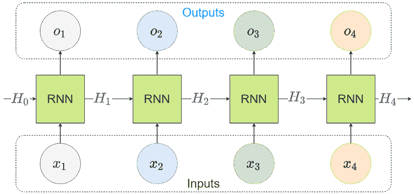

图 12.4：RNN 如何处理输入序列

假设我们讨论的是一个包含四个元素的序列，*x*[1] 到 *x*[4]。任何 RNN 块（暂时把它当作一个黑盒）都会消耗输入和隐藏状态（记忆），并生成一个输出。一开始没有记忆，因此我们从初始记忆 (*H*[0]) 开始，这通常是一个全为零的数组。现在，RNN 块接收第一个输入 (*x*[1]) 和初始隐藏状态 (*H*[0])，生成输出 (*o*[1]) 和新的隐藏状态 (*H*[1])。

为了处理序列中的第二个元素，*同一个 RNN* 块会接收来自上一个时间步的隐藏状态 (*H*[1]) 和当前时间步的输入 (*x*[2])，生成第二个时间步的输出 (*o*[2]) 和新的隐藏状态 (*H*[2])。这个过程会持续直到我们处理完序列的所有元素。处理完整个序列后，我们将获得每个时间步的所有输出 (*o*[1] 到 *o*[4]) 和最终的隐藏状态 (*H*[4])。

这些输出和隐藏状态将会编码序列中包含的信息，并可用于进一步处理，例如使用解码器预测下一步。RNN 块也可以作为解码器，接受编码后的表示并生成输出。由于这种灵活性，RNN 块可以根据各种输入和输出组合进行排列，如下所示：

+   多对一，其中有多个输入和一个输出——例如，单步预测或时间序列分类

+   多对多，其中我们有多个输入和多个输出——例如，多步预测

现在，让我们看看 RNN 内部发生了什么。

设 RNN 在时间*t*的输入为*x*[t]，上一时间步的隐状态为*H*[t][-1]。更新的方程如下：

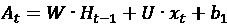

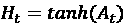

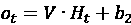

在这里，*U*、*V*和*W*是可学习的权重矩阵，*b*[1]和*b*[2]是两个可学习的偏置向量。根据它们执行的变换类型，*U*、*V*和*W*可以很容易地记住为*输入到隐层*、*隐层到输出*和*隐层到隐层*矩阵。直观地，我们可以将 RNN 执行的操作理解为一种学习和遗忘信息的方式，它根据需要决定保留和遗忘什么信息。*tanh*激活函数，如我们在*第十一章 深度学习导论*中所看到的，生成一个介于-1 和 1 之间的值，类似于遗忘和记忆。因此，RNN 将输入转换为一个潜在的维度，使用*tanh*激活函数决定保留和遗忘当前时间步和之前记忆中的哪些信息，并使用这个新的记忆生成输出。

在标准的反向传播中，我们将梯度从一个单元反向传播到另一个单元。但在递归神经网络（RNN）中，我们有一个特殊情况，必须在单个单元内部进行梯度反向传播，但通过时间或不同的时间步长。为 RNN 开发了一种特殊的反向传播方式，叫做**通过时间的反向传播**（**BPTT**）。

幸运的是，所有主要的深度学习框架都能够顺利地完成这项工作。有关 BPTT 的更详细理解及其数学基础，请参考*进一步阅读*部分。

PyTorch 已经将 RNN 作为即用模块提供——你只需导入库中的一个模块并开始使用它。但在这之前，我们需要理解一些其他的概念。

我们将要看的第一个概念是将*多个层*的 RNN 堆叠在一起的可能性，使得每个时间步的输出成为下一层 RNN 的输入。每一层将具有一个隐状态或记忆。这使得层次化特征学习成为可能，这是当今成功深度学习的基石之一。

另一个概念是*双向*RNN，由 Schuster 和 Paliwal 在 1997 年提出。双向 RNN 与 RNN 非常相似。在普通的 RNN 中，我们按顺序从开始到结束（前向）处理输入。然而，双向 RNN 使用一组输入到隐层和隐层到隐层的权重从开始到结束处理输入，然后使用另一组权重按反向（从结束到开始）处理输入，并将来自两个方向的隐层状态连接起来。我们在这个连接的隐层状态上应用输出方程。

**参考检查**：

Rumelhart 等人的研究论文和 Schuster 和 Paliwal 的论文分别在 *参考文献* 部分被引用为 *5* 和 *6*。

## PyTorch 中的 RNN

现在，让我们了解一下 PyTorch 中 RNN 的实现。与 **线性** 模块一样，**RNN** 模块也可以通过 `torch.nn` 获得。让我们来看一下初始化时实现所提供的不同参数：

+   `input_size`：输入中预期的特征数。如果我们只使用时间序列的历史数据，则为 1。但是，当我们同时使用历史数据和其他一些特征时，则为大于 1 的值。

+   `hidden_size`：隐藏状态的维度。这定义了输入到隐藏层和隐藏层到隐藏层的矩阵大小。

+   `num_layers`：这是将堆叠在一起的 RNN 数量。默认值是 **1**。

+   `nonlinearity`：使用的非线性函数。虽然 tanh 是最初提出的非线性函数，但 PyTorch 也允许我们使用 ReLU（`relu`）。默认值是 `tanh`。

+   `bias`：该参数决定是否将偏置项添加到我们之前讨论的更新方程中。如果参数为 **False**，则没有偏置。默认值是 **True**。

+   `batch_first`：RNN 单元可以使用两种输入数据配置——我们可以将输入设置为（*batch size*，*sequence length*，*number of features*）或（*sequence length*，*batch size*，*number of features*）。`batch_first = True` 选择前者作为预期的输入维度。默认值是 **False**。

+   `dropout`：该参数如果不为零，会在每个 RNN 层的输出上使用 dropout 层，除了最后一层。Dropout 是一种常用的正则化技术，在训练过程中随机忽略选中的神经元（*进一步阅读*部分包含了提出该技术的论文链接）。dropout 的概率将等于 **dropout**。默认值是 **0**。

+   `bidirectional`：该参数启用双向 RNN。如果 **True**，则使用双向 RNN。默认值是 **False**。

为了继续在本章中使用我们之前生成的相同合成数据，我们将初始化 RNN 模型，如下所示：

```py
rnn = nn.RNN(
    input_size=1,
    hidden_size=32,
    num_layers=1,
    batch_first=True,
    dropout=0,
    bidirectional=False,
) 
```

现在，让我们看看 RNN 单元预期的输入和输出。

与我们之前看到的**线性**层不同，RNN 单元接收*两个输入*——输入序列和隐藏状态向量。输入序列可以是（*batch size*，*sequence length*，*number of features*）或（*sequence length*，*batch size*，*number of features*），具体取决于我们是否设置了 `batch_first=True`。隐藏状态是一个张量，大小为（*D*层数，*batch size*，*hidden size*），其中 *D* = 1 对于 `bidirectional=False`，*D* = 2 对于 `bidirectional=True`。隐藏状态是一个可选输入，如果未填写，则默认为零张量。

RNN 单元有两个输出：一个输出和一个隐藏状态。输出可以是（*batch size*，*sequence length*，*D*隐藏层大小）或（*sequence length*，*batch size*，*D*隐藏层大小），具体取决于`batch_first`。隐藏状态的维度是（*D*层数，*batch size*，*hidden size*）。这里，*D* = 1 或 2 取决于**双向**参数。

所以让我们通过 RNN 运行我们的序列，并观察输入和输出（有关更详细的步骤，请参考附带的笔记本）：

```py
#input dim: torch.Size([6, 15, 1])
# batch size = 6, sequence length = 15 and number of features = 1, batch_first = True
output, hidden_states = rnn(rnn_input)
# output.shape -> torch.Size([6, 15, 32])
# hidden_states.shape -> torch.Size([1, 6, 32])) 
```

虽然我们看到 RNN 单元包含输出和隐藏状态，但我们也知道输出只是隐藏状态的仿射变换。因此，为了给用户提供灵活性，PyTorch 只在模块中实现了关于隐藏状态的更新方程。对于某些情况（如多对一场景），我们可能根本不需要每个时间步的输出，如果我们不在每个步骤中执行输出更新，就可以节省计算。因此，PyTorch RNN 的`output`只是每个时间步的隐藏状态，而`hidden_states`则是最新的隐藏状态。

我们可以通过检查隐藏状态张量是否等于最后的输出张量来验证这一点：

```py
torch.equal(hidden_states[0], output[:,-1]) # -> True 
```

为了更清楚地说明这一点，让我们用视觉化的方式来看：

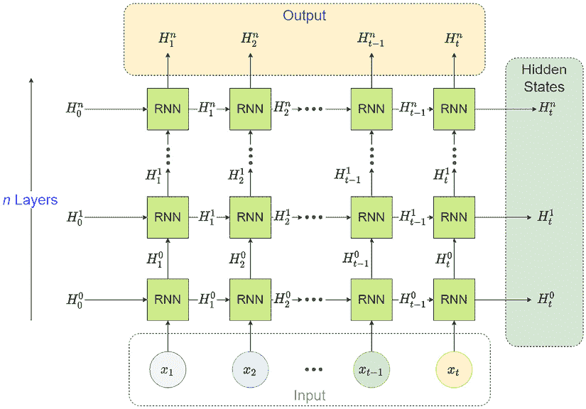

图 12.5：PyTorch 实现的堆叠 RNN

每个时间步的隐藏状态作为输入传递给后续的 RNN 层，最后一层 RNN 的隐藏状态被收集作为输出。但每一层都有一个隐藏状态（它不会与其他层共享），PyTorch 的 RNN 会收集每一层的最后一个隐藏状态，并将其作为输出返回。

现在，由我们来决定如何使用这些输出。例如，在一步预测中，我们可以使用输出的隐藏状态并在其上堆叠几个线性层，以获取下一个时间步的预测。或者，我们可以使用隐藏状态将记忆传递给另一个 RNN 作为解码器，并生成多个时间步的预测。我们可以使用输出的方式有很多，PyTorch 给了我们这种灵活性。

RNN 在建模序列时虽然非常有效，但有一个大缺点。由于 BPTT，反向传播所需经过的单元数量随着训练使用的序列长度增加而急剧增加。当我们必须在这么长的计算图中进行反向传播时，我们会遇到**梯度消失**或**梯度爆炸**的问题。这时，梯度在网络中反向传播时，要么缩小为零，要么爆炸成一个非常大的数值。前者使得网络停止学习，而后者则使得学习变得不稳定。

我们可以将发生的事情类比于将一个标量数字反复与自身相乘的过程。如果这个数字小于一，那么每次相乘后，这个数字会变得越来越小，直到几乎为零。如果这个数字大于一，那么它会以指数级别越来越大。这一发现最早由 Hochreiter 在其 1991 年的学位论文中独立提出，之后 Yoshua Bengio 等人在 1993 年和 1994 年分别发表了两篇相关论文。多年来，许多关于该模型和训练过程的改进方案应运而生，以应对这一缺点。如今，传统的 RNN 几乎不再使用，几乎完全被其更新版本所取代。

**参考检查**：

Hochreiter（1991）和 Bengio 等人（1993，1994）的相关文献在*参考文献*部分被列为*7*、*8*和*9*。

现在，让我们来看一下对 RNN 架构所做的两项关键改进，这些改进在机器学习社区中表现良好，获得了广泛的关注。

# 长短期记忆（LSTM）网络

Hochreiter 和 Schmidhuber 在 1997 年提出了对经典 RNN 的修改——LSTM 网络。它旨在解决传统 RNN 中的梯度消失和梯度爆炸问题。LSTM 的设计灵感来自计算机中的逻辑门。它引入了一个新的组件——**记忆单元**，作为长期记忆，除了经典 RNN 中的隐藏状态记忆外，它还被用于存储信息。在 LSTM 中，多个门负责从这些记忆单元中读取、添加和遗忘信息。这个记忆单元作为一个*梯度高速公路*，使得信息可以相对不受阻碍地通过网络传递。这正是避免 RNN 中梯度消失的关键创新。

## LSTM 架构

假设 LSTM 在时间*t*的输入是*x*[t]，上一时刻的隐藏状态是*H*[t][-1]。现在，有三个门处理信息。每个门实际上由两个可学习的权重矩阵组成（一个用于输入，一个用于上一时刻的隐藏状态），以及一个偏置项，它会与输入和隐藏状态相乘/相加，最后通过一个 sigmoid 激活函数。

这些门的输出将是一个介于 0 和 1 之间的实数。让我们详细了解每个门的作用：

+   **输入门**：此门的功能是决定从当前输入和前一个隐藏状态中读取多少信息。其更新方程为：

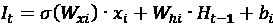

+   **遗忘门**：遗忘门决定了从长期记忆中应忘记多少信息。其更新方程为：

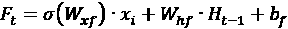

+   **输出门**：输出门决定了当前单元状态中有多少应当用于生成当前的隐藏状态，隐藏状态即为该单元的输出。其更新方程为：

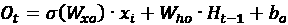

这里，*W*[xi]、*W*[xf]、*W*[xo]、*W*[hi]、*W*[hf] 和 *W*[ho] 是可学习的权重参数，*b*[i]、*b*[f] 和 *b*[o] 是可学习的偏置参数。

现在，我们可以引入一个新的长期记忆（单元状态），*C*[t]。之前提到的三个门控机制用于更新和遗忘该记忆。如果前一时刻的单元状态是 *C*[t-1]，那么 LSTM 单元将使用另一个门计算候选单元状态，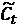，这次使用 `tanh` 激活函数：

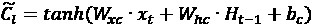

这里，*W*[xc] 和 *W*[xh] 是可学习的权重参数，*b*[c] 是可学习的偏置参数。

现在，让我们看一下关键的更新方程式，它用于更新单元的状态或长期记忆：

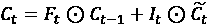

这里，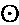 是逐元素相乘。我们使用遗忘门来决定从前一时刻传递多少信息，并使用输入门来决定当前候选单元状态中多少将被写入长期记忆。

最后但同样重要的是，我们使用新创建的当前单元状态和输出门来决定通过当前隐藏状态向预测器传递多少信息：

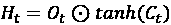

这个过程的可视化表示可以在 *图 12.6* 中看到。

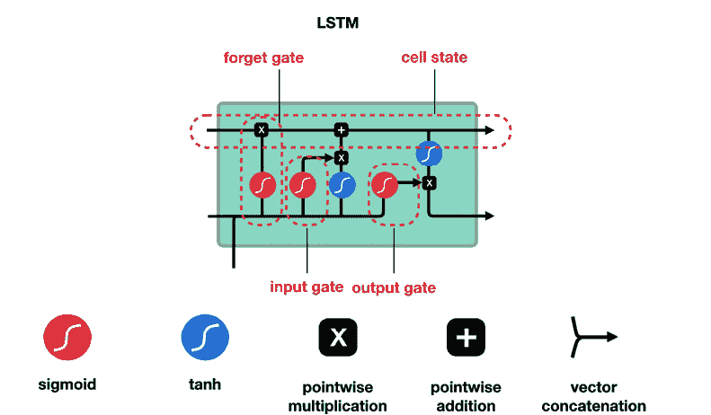

图 12.6：LSTM 的门控示意图

## PyTorch 中的 LSTM

现在，让我们理解一下 PyTorch 中 LSTM 的实现。它与我们之前看到的 RNN 实现非常相似，但有一个关键区别：初始化该类的参数几乎相同。该 API 可以在 [`pytorch.org/docs/stable/generated/torch.nn.LSTM.html#torch.nn.LSTM`](https://pytorch.org/docs/stable/generated/torch.nn.LSTM.html#torch.nn.LSTM) 上找到。这里的关键区别在于隐藏状态的使用方式。虽然 RNN 有一个张量作为隐藏状态，但 LSTM 期望的是一个**元组**，包含两个相同维度的张量：（**隐藏状态**，**单元状态**）。

LSTM 和 RNN 一样，也有堆叠和双向变体，PyTorch 以相同的方式处理它们。

现在，让我们初始化一些 LSTM 模块，并使用我们一直在使用的合成数据来查看它们的实际效果：

```py
lstm = nn.LSTM(
    input_size=1,
    hidden_size=32,
    num_layers=5,
    batch_first=True,
    dropout=0,
    # bidirectional=True,
)
output, (hidden_states, cell_states) = lstm(rnn_input)
output.shape # -> [6, 15, 32]
hidden_states.shape # -> [5, 6, 32]
cell_states.shape # -> [5, 6, 32] 
```

现在，让我们来看看对普通 RNN 所做的另一个改进，它解决了梯度消失和梯度爆炸问题。

# 门控循环单元（GRU）

2014 年，Cho 等人提出了另一种 RNN 变体，它的结构比 LSTM 简单得多，叫做 GRU。其背后的直觉类似于我们使用多个门来调节信息流动，但 GRU 消除了长期记忆部分，仅使用隐藏状态来传播信息。因此，记忆单元不再成为 *梯度高速公路*，而是隐藏状态本身成为“梯度高速公路”。遵循我们在上一节中使用的相同符号约定，让我们来看一下 GRU 的更新方程。

## GRU 结构

虽然 LSTM 中有三个门，但 GRU 中只有两个门：

+   **重置门**：该门决定了前一个隐藏状态的多少部分会被作为当前时间步的候选隐藏状态。其方程为：

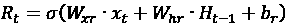

+   **更新门**：更新门决定了前一个隐藏状态的多少部分应被传递下去，以及当前候选隐藏状态的多少部分会被写入隐藏状态。其方程为：

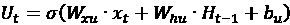

这里的 *W*[xr]、*W*[xu]、*W*[hr] 和 *W*[hu] 是可学习的权重参数，而 *b*[r] 和 *b*[u] 是可学习的偏置参数。

现在，我们可以计算候选隐藏状态（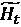），如下所示：

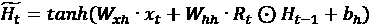

这里，*W*[xh] 和 *W*[hh] 是可学习的权重参数，而 *b*[h] 是可学习的偏置参数。这里，我们使用重置门来限制从前一个隐藏状态到当前候选隐藏状态的信息流。

最后，当前隐藏状态（即传递给预测器的输出）通过以下方程计算：

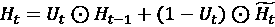

我们使用更新门来决定从前一个隐藏状态和当前候选状态中传递给下一个时间步或预测器的比例。

**参考检查**：

LSTM 和 GRU 的研究论文分别在*参考文献*部分列为*10*和*11*。

该过程的可视化表示可以在*图 12.7*中找到：

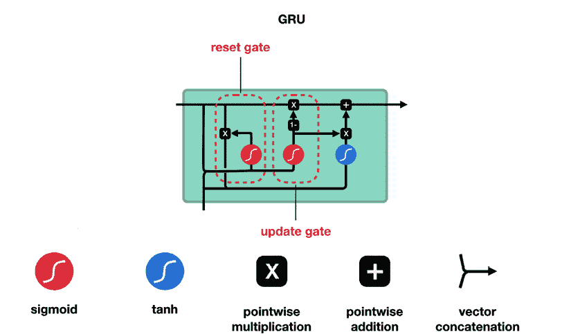

图 12.7：GRU 的门控图

## PyTorch 中的 GRU

现在，让我们了解 PyTorch 中 GRU 的实现。API、输入和输出与 RNN 相同。可以在这里参考该 API：[`pytorch.org/docs/stable/generated/torch.nn.GRU.html#torch.nn.GRU`](https://pytorch.org/docs/stable/generated/torch.nn.GRU.html#torch.nn.GRU)。关键的区别在于模块的内部工作原理，其中使用了 GRU 更新方程，而不是标准的 RNN 方程。

现在，让我们初始化一个 GRU 模块，并使用我们一直在使用的合成数据来看它的实际应用：

```py
Gru = nn.GRU(
    input_size=1,
    hidden_size=32,
    num_layers=5,
    batch_first=True,
    dropout=0,
    # bidirectional=True,
)
output, hidden_states = gru(rnn_input)
output.shape # -> [6, 15, 32]
hidden_states.shape # -> [5, 6, 32] 
```

现在，让我们看看另一种可以用于序列数据的主要组件。

# 卷积网络

**卷积网络**，也称为 **卷积神经网络** (**CNNs**)，类似于处理网格形式数据的神经网络。这个网格可以是二维（如图像）、一维（如时间序列）、三维（如来自激光雷达传感器的数据）等。尽管本书涉及的是时间序列，通常时间序列预测中使用的是一维卷积，但从二维（如图像）理解卷积会更容易，然后再回到一维网格处理时间序列。

CNN 的基本思想灵感来源于人类视觉的工作原理。1979 年，福岛提出了 Neocognitron（参考文献 *12*）。这是一种独特的架构，直接受到人类视觉工作原理的启发。但 CNN 如我们今天所知，直到 1989 年才出现，当时 Yann Le Cun 使用反向传播算法学习了这种网络，并通过在手写数字识别中取得最先进的成果（参考文献 *13*）来证明这一点。2012 年，当 AlexNet（用于图像识别的 CNN 架构）在年度图像识别挑战赛 ImageNet 中获胜时，且与竞争的非深度学习方法相比，差距巨大，CNN 的兴趣和研究达到了巅峰。人们很快意识到，除了图像外，CNN 对于序列数据（如语言和时间序列数据）同样有效。

## 卷积

CNN 的核心是一个叫做 **卷积** 的数学运算。卷积操作的数学解释超出了本书的范围，但如果你想了解更多，可以在 *进一步阅读* 部分找到一些相关链接。为了我们的目的，我们将对卷积操作形成直观的理解。

由于 CNN 在使用图像数据时获得了广泛的关注，我们先从图像领域开始讨论，然后再转向序列领域。

任何图像（为了简化，假设它是灰度图像）可以看作是一个像素值的网格，每个值表示一个点的亮度，1 代表纯白色，0 代表纯黑色。在我们开始讨论卷积之前，先了解什么是 **卷积核**。目前，我们可以将卷积核看作一个包含某些值的二维矩阵。通常，卷积核的大小小于我们使用的图像的大小。由于卷积核小于图像，因此我们可以将卷积核“放入”图像中。我们从将卷积核对齐到左上角边缘开始。卷积核在当前位置时，图像中有一组值被该卷积核覆盖。我们可以对图像的这一子集和卷积核进行逐元素相乘，然后将所有元素加起来得到一个标量。现在，我们可以通过将卷积核“滑动”到图像的所有位置，重复此过程。例如，下面展示了一个 4x4 的示例输入图像，并演示了如何使用一个 2x2 的卷积核对其进行卷积操作：

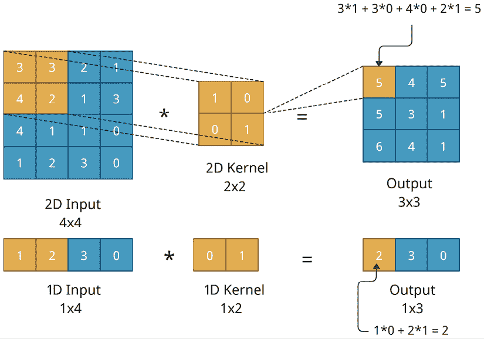

图 12.8：在 2D 和 1D 输入上进行的卷积操作

因此，如果我们将 2x2 的卷积核放置在左上角位置，并执行逐元素乘法和求和操作，我们将得到 3x3 输出中的左上角项。如果我们将卷积核向右滑动一个位置，我们将得到输出顶部行中的下一个元素，以此类推。同样，如果我们将卷积核向下滑动一个位置，我们将得到输出中第一列的第二个元素。

虽然这很有趣，但我们想从时间序列的角度理解卷积。为此，让我们将视角转向 1D 卷积——即在 1D 数据（如序列）上执行的卷积操作。在前面的图示中，我们也可以看到一个 1D 卷积的例子，其中我们将 1D 核滑动到序列上，以得到一个 1x3 的输出。

尽管我们已经设置了方便理解和计算的核权重，但在实际应用中，这些权重是通过网络从数据中学习得到的。如果我们将核大小设置为*n*，并且所有的核权重都设置为 1/*n*，那么这种卷积会给我们带来什么呢？这是我们在*第六章*，*时间序列预测的特征工程*中讨论过的内容。是的，它们的结果就是具有*n*窗口的滚动均值。记住，我们曾经将其作为机器学习模型的特征工程技巧来学习。因此，1D 卷积可以被看作是一个更强大的特征生成器，其中特征是从数据中学习到的。通过在核上使用不同的权重，我们可以提取不同的特征。正是这一点知识，我们在学习时间序列数据的卷积神经网络时需要牢记。

## 填充、步幅和扩张

现在我们已经理解了卷积操作是什么，我们需要了解更多的术语，如**填充**、**步幅**和**扩张**。

在我们开始讨论这些术语之前，先来看一个给定输入维度（*L*）、核大小（*k*）、填充大小（*p*[l]为左填充，*p*[r]为右填充）、步幅（*s*）和扩张（*d*）时，卷积层输出维度（*O*）的公式：

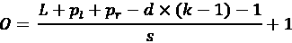

这些术语的默认值（填充、步幅和扩张是卷积过程的特例）是 *p*[r]，*p*[l] = 0，*s* = 1，*d* = 1。即使你暂时不理解公式或其中的术语，也不要担心——只要记住这些默认值，当我们理解每个术语时，其他的可以忽略。

在*图 12.8*中，我们看到卷积操作总是会减少输入的大小。因此，在默认情况下，公式变为 *O* = *L* – (*k* - 1)。这是因为我们可以将核放置在序列中的最早位置，即从*t* = 0 到*t* = *k*。然后，通过在序列上进行卷积，我们可以在输出中得到 *L* – (*k* - 1) 项。填充是指我们在序列的开始或结束处添加一些值。我们用于填充的值取决于问题。通常，我们选择零作为填充值。因此，填充序列本质上是增加了输入的大小。因此，在前面的公式中，我们可以将 *L* + *p*[l] + *p*[r] 视为填充后序列的有效长度。

接下来的两个术语（步幅和扩张）与卷积层的**感受野**密切相关。卷积层的感受野是输入空间中影响由卷积层生成的特征的区域。换句话说，它是我们在进行卷积操作时，所使用的输入窗口的大小。对于单个卷积层（使用默认设置），这几乎就是内核的大小。对于多层 CNN，这个计算变得更加复杂，因为它具有层次结构（*进一步阅读*部分包含了 Arujo 等人提出的一个公式，用于计算 CNN 的感受野）。但通常来说，增加 CNN 的感受野与提高 CNN 的准确度相关。对于计算机视觉，Araujo 等人指出：

> “我们观察到分类准确度与感受野大小之间呈对数关系，这表明大感受野对于高层次的识别任务是必要的，但回报递减。”

在时间序列中，这一点很重要，因为如果 CNN 的感受野小于我们想要捕捉的长期依赖性（如季节性），那么网络就无法做到这一点。通过在卷积层上堆叠更多的卷积层来加深 CNN 是增加网络感受野的一种方式。然而，也有几种方法可以增加单个卷积层的感受野。步幅和扩张就是其中的两种方法：

+   **步幅**：之前，当我们讨论将内核在序列上*滑动*时，我们提到我们每次移动内核一个位置。这被称为卷积层的步幅，并且步幅不一定非得是 1。如果我们将步幅设置为 2，那么卷积操作将跳过一个位置，如*图 12.9*所示。这可以使卷积网络中的每一层查看更大范围的历史，从而增加感受野。

+   **扩张**：我们可以通过扩张输入连接来调整基本的卷积层。在标准卷积层中，假设内核大小为 3，我们将内核应用于输入中的三个连续元素，扩张值为 1。如果我们将扩张设置为 2，那么内核将被空间扩张，并且将被应用。它不再应用于三个连续的元素，而是跳过其中的一个元素。*图 12.8*展示了这个过程。正如我们所看到的，这也可以增加网络的感受野。

这两种技术虽然相似，但有所不同，并且可以互相兼容。下图展示了当我们同时应用步幅和扩张时会发生什么（尽管这种情况不常见）：

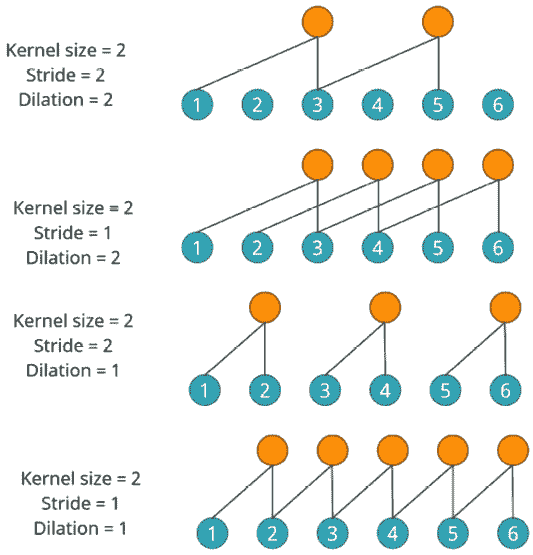图 12.9: 卷积中的步幅和扩张

现在，如果我们想要使输出维度与输入维度相同怎么办？通过使用一些基本的代数和重新排列前面的公式，我们得到了以下结果：

*P*[l] + *p*[r] = *d*(*k*-1) + *L*(*s*-1) – (*s*-1)

在时间序列中，我们通常在左侧进行填充，而不是右侧，因为通常存在强自相关性。用零或其他值填充最近的几个条目会使预测函数的学习非常困难，因为最新的隐藏状态直接受到填充值的影响。*进一步阅读*部分包含了 Kilian Batzner 关于自回归卷积的文章链接。如果你希望真正理解我们在这里讨论的概念，并了解其中的一些限制，这是必读的。*进一步阅读*部分还包含了一个 GitHub 存储库的链接，其中包含了二维输入卷积动画，这将帮助你直观地理解发生了什么。

在卷积中，有一个常见的术语，尤其是在时间序列中经常听到的——**因果卷积**。你只需记住因果卷积并不是特殊类型的卷积。只要我们确保在训练时不使用未来的时间步来预测当前的时间步，我们就在执行因果操作。通常通过偏移目标和填充输入来实现这一点。

## PyTorch 中的卷积

现在，让我们来了解 CNN 在 PyTorch 中的实现（一维 CNN，通常用于时间序列等序列）。让我们看看在初始化时实现提供的不同参数。我们刚刚讨论了以下术语，所以现在它们应该对你来说很熟悉了：

+   `in_channels`: 输入中预期的特征数。如果我们仅使用时间序列的历史记录，那么这个值将为 1。但是，当我们同时使用历史记录和其他特征时，这个值将大于 1。对于后续的层，你在前一层中使用的`out_channels`将成为当前层的`in_channels`。

+   `out_channels`: 应用于输入的核或过滤器的数量。每个核/过滤器都会产生一个具有自己权重的卷积操作。

+   `kernel_size`: 这是我们用于卷积的核的大小。

+   `stride`: 卷积的步幅。默认值为`1`。

+   `padding`：这是添加到*两边*的填充。如果我们将值设置为`2`，那么传递给该层的序列将在左右两边都有填充位置。我们还可以输入`valid`或`same`。这两者是表示所需填充类型的简便方法。`padding='valid'`相当于没有填充。`padding='same'`会对输入进行填充，使得输出形状与输入相同。然而，这种模式不支持除`1`以外的任何步幅值。默认值为`0`。

+   `padding_mode`：定义如何用值填充填充位置。最常见和默认的选项是*零*，即所有填充的标记都填充为零。另一个对时间序列相关的有用模式是**复制**，其行为类似于 pandas 中的前向和后向填充。另两个选项——**反射**和**循环**——则更为特殊，仅用于特定的用例。默认值为**零**。

+   `dilation`：卷积的膨胀。默认值为`1`。

+   `groups`：此参数允许你控制输入通道与输出通道的连接方式。`groups`中指定的数字决定了会形成多少组，以便卷积仅在组内进行，而不会跨组进行。例如，`group=2`表示一半的输入通道将由一组核进行卷积，而另一半将由另一组核进行卷积。这相当于并行运行两个卷积层。有关此参数的更多信息，请查看文档。再次强调，这适用于一些特殊的用例。默认值为`1`。

+   `bias`：此参数为卷积添加一个可学习的偏置。默认值为`True`。

让我们对本章早些时候生成的相同合成数据应用 CNN 模型，卷积核大小为 3：

```py
conv = nn.Conv1d(in_channels=1, out_channels=1, kernel_size=k) 
```

现在，让我们来看一下 CNN 预期的输入和输出。

`Conv1d`要求输入具有三维`—(批次大小，通道数，序列长度)`。对于初始输入层，通道数是输入网络的特征数；对于中间层，它是上一层使用的核的数量。`Conv1d`的输出形式为`(批次大小，通道数（输出），序列长度（输出）)`。

那么，让我们通过`Conv1d`运行我们的序列，并查看输入和输出（有关更详细的步骤，请参阅`02-Building_Blocks.ipynb`笔记本）：

```py
#input dim: torch.Size([6, 1, 15])
# batch size = 6, number of features = 1 and sequence length = 15
output = conv(cnn_input)
# Output should be in_dim - k + 1
assert output.size(-1)==cnn_input.size(-1)-k+1
output.shape #-> torch.Size([6, 1, 13]) 
```

该笔记本提供了对`Conv1d`的稍微详细的分析，表格展示了超参数对输出形状的影响，填充方式如何使输入和输出维度相同，以及如何用相等权重的卷积就像一个滚动平均。我强烈建议你查看并尝试不同的选项，以更好地理解该层为你做了什么。

`Conv1d`中的内置填充源自图像处理，因此填充技术默认是在两侧都添加填充。然而，对于序列数据，最好在左侧使用填充，因此，最好单独处理输入序列的填充方式，而不是使用内置机制。`torch.nn.functional`提供了一个方便的`pad`方法，可以用来实现这一点。

其他构建模块也被用于时间序列预测，因为深度神经网络的架构只受创意的限制。但本章的重点是介绍一些在许多不同架构中出现的常见模块。我们故意没有介绍目前最流行的架构之一：变换器（Transformer）。这是因为我们已将另一章（*第十四章*，*时间序列中的注意力与变换器*）专门用于理解注意力机制，然后再研究变换器。另一个逐渐受到关注的重要模块是图神经网络（GNN），它可以被看作是专门处理基于图形数据的卷积神经网络，而不是网格数据。然而，这些超出了本书的范围，因为它们仍是一个活跃的研究领域。

# 总结

在上一章介绍了深度学习之后，本章我们更深入地了解了用于时间序列预测的常见架构模块。我们解释了编码器-解码器范式，它是构建深度神经网络用于预测的基本方式。然后，我们学习了前馈神经网络（FFN）、循环神经网络（RNN，包括 LSTM 和 GRU）和卷积神经网络（CNN），并探讨了它们是如何用于处理时间序列的。我们还看到如何通过使用相关的笔记本，在 PyTorch 中使用这些主要模块，并且动手写了一些 PyTorch 代码。

在下一章中，我们将学习一些主要的模式，这些模式可以用来安排这些模块以进行时间序列预测。

# 参考文献

本章使用了以下参考文献：

1.  Neco, R. P. 和 Forcada, M. L. (1997)，*使用递归神经网络的异步翻译*。神经网络，1997 年，国际会议（第 4 卷，第 2535–2540 页）。IEEE：[`ieeexplore.ieee.org/document/614693`](https://ieeexplore.ieee.org/document/614693).

1.  Kalchbrenner, N. 和 Blunsom, P. (2013)，*循环连续翻译模型*。EMNLP（第 3 卷，第 39 期，第 413 页）：[`aclanthology.org/D13-1176/`](https://aclanthology.org/D13-1176/).

1.  Kyunghyun Cho, Bart van Merriënboer, Caglar Gulcehre, Dzmitry Bahdanau, Fethi Bougares, Holger Schwenk 和 Yoshua Bengio. (2014)，*使用 RNN 编码器-解码器进行短语表示学习，用于统计机器翻译*。2014 年自然语言处理实证方法会议（EMNLP）论文集，第 1724–1734 页，卡塔尔多哈。计算语言学协会：[`aclanthology.org/D14-1179/`](https://aclanthology.org/D14-1179/).

1.  Ilya Sutskever, Oriol Vinyals 和 Quoc V. Le. (2014), *基于神经网络的序列到序列学习.* 第 27 届国际神经信息处理系统会议论文集 – 第 2 卷: [`dl.acm.org/doi/10.5555/2969033.2969173`](https://dl.acm.org/doi/10.5555/2969033.2969173).

1.  Rumelhart, D., Hinton, G., 和 Williams, R (1986). *通过反向传播误差学习表示*. 自然 323, 533–536: [`doi.org/10.1038/323533a0`](https://doi.org/10.1038/323533a0).

1.  Schuster, M. 和 Paliwal, K. K. (1997). *双向递归神经网络*. IEEE 信号处理学报, 45(11), 2673–2681: [`doi.org/10.1109/78.650093`](https://doi.org/10.1109/78.650093).

1.  Sepp Hochreiter (1991) *关于动态神经网络的研究*. 硕士论文, 慕尼黑工业大学: [`people.idsia.ch/~juergen/SeppHochreiter1991ThesisAdvisorSchmidhuber.pdf`](https://people.idsia.ch/~juergen/SeppHochreiter1991ThesisAdvisorSchmidhuber.pdf).

1.  Y. Bengio, P. Frasconi 和 P. Simard (1993), *递归网络中学习长期依赖关系的问题*. IEEE 国际神经网络会议, 第 3 卷，第 1183-1188 页: 10.1109/ICNN.1993.298725.

1.  Y. Bengio, P. Simard 和 P. Frasconi (1994) *使用梯度下降学习长期依赖关系的困难*，发表于 IEEE 神经网络事务，第 5 卷，第 2 期，第 157–166 页，1994 年 3 月: 10.1109/72.279181.

1.  Hochreiter, S. 和 Schmidhuber, J. (1997). *长短期记忆*. 神经计算, 9(8), 1735–1780: [`doi.org/10.1162/neco.1997.9.8.1735`](https://doi.org/10.1162/neco.1997.9.8.1735).

1.  Cho, K., Merrienboer, B.V., Gülçehre, Ç., Bahdanau, D., Bougares, F., Schwenk, H., 和 Bengio, Y. (2014). *使用 RNN 编码器-解码器学习短语表示用于统计机器翻译.* EMNLP: [`www.aclweb.org/anthology/D14-1179.pdf`](https://www.aclweb.org/anthology/D14-1179.pdf).

1.  Fukushima, K. *Neocognitron：一种自组织神经网络模型，用于位置偏移不影响的模式识别机制*. 生物控制论 36, 193–202 (1980): [`doi.org/10.1007/BF00344251`](https://doi.org/10.1007/BF00344251).

1.  Y. Le Cun, B. Boser, J. S. Denker, R. E. Howard, W. Habbard, L. D. Jackel 和 D. Henderson. 1990 年. *使用反向传播网络进行手写数字识别*. 神经信息处理系统进展 2\. Morgan Kaufmann 出版社，美国旧金山, 396–404: [`proceedings.neurips.cc/paper/1989/file/53c3bce66e43be4f209556518c2fcb54-Paper.pdf`](https://proceedings.neurips.cc/paper/1989/file/53c3bce66e43be4f209556518c2fcb54-Paper.pdf).

# 进一步阅读

请查看以下资源，以进一步了解本章所涉及的主题：

+   官方 PyTorch 教程: [`pytorch.org/tutorials/beginner/basics/intro.html`](https://pytorch.org/tutorials/beginner/basics/intro.html)

+   *线性代数的本质*，作者：3Blue1Brown: [`www.youtube.com/playlist?list=PLZHQObOWTQDPD3MizzM2xVFitgF8hE_ab`](https://www.youtube.com/playlist?list=PLZHQObOWTQDPD3MizzM2xVFitgF8hE_ab)

+   *神经网络 – 线性代数视角*，作者：Manu Joseph: [`deep-and-shallow.com/2022/01/15/neural-networks-a-linear-algebra-perspective/`](https://deep-and-shallow.com/2022/01/15/neural-networks-a-linear-algebra-perspective/)

+   *深度学习*，作者：Ian Goodfellow, Yoshua Bengio, 和 Aaron Courville: [`deep-and-shallow.com/2022/01/15/neural-networks-a-linear-algebra-perspective/`](https://deep-and-shallow.com/2022/01/15/neural-networks-a-linear-algebra-perspective/)

+   *理解 LSTM*，作者：Christopher Olah: [`colah.github.io/posts/2015-08-Understanding-LSTMs/`](http://colah.github.io/posts/2015-08-Understanding-LSTMs/)

+   *卷积直观指南*: [`betterexplained.com/articles/intuitive-convolution/`](https://betterexplained.com/articles/intuitive-convolution/)

+   *计算卷积神经网络的感受野*，作者：Andre Araujo, Wade Norris, 和 Jack Sim: [`distill.pub/2019/computing-receptive-fields/`](https://distill.pub/2019/computing-receptive-fields/)

+   *自回归神经网络中的卷积*，作者：Kilian Batzner: [`theblog.github.io/post/convolution-in-autoregressive-neural-networks/`](https://theblog.github.io/post/convolution-in-autoregressive-neural-networks/)

+   *卷积算术*，作者：Vincent Dumoulin 和 Francesco Visin: [`github.com/vdumoulin/conv_arithmetic`](https://github.com/vdumoulin/conv_arithmetic)

+   *Dropout：一种简单的防止神经网络过拟合的方法*，作者：Nitish Srivastava 等人: [`jmlr.org/papers/v15/srivastava14a.html`](https://jmlr.org/papers/v15/srivastava14a.html)

# 加入我们的 Discord 社区

加入我们社区的 Discord 空间，与作者及其他读者讨论：

[`packt.link/mts`](https://packt.link/mts)


