# 第十三章：时间序列的常见建模模式

在上一章中，我们回顾了几个主要的、适合时间序列的**深度学习**（**DL**）系统的常见构建模块。现在我们知道这些模块是什么，是时候进行更实用的课程了。让我们看看如何将这些常见模块组合在一起，以不同的方式对本书中一直使用的数据集进行时间序列预测建模。

在本章中，我们将涵盖以下主要主题：

+   表格回归

+   单步前向递归神经网络

+   序列到序列模型

# 技术要求

您需要按照本书*前言*中的说明设置`Anaconda`环境，以便获得一个包含本书代码所需所有库和数据集的工作环境。在运行笔记本时，任何额外的库都会被安装。

您需要运行以下笔记本以完成本章内容：

+   `Chapter02`中的`02-Preprocessing_London_Smart_Meter_Dataset.ipynb`

+   `Chapter04`中的`01-Setting_up_Experiment_Harness.ipynb`

+   `Chapter06`中的`01-Feature_Engineering.ipynb`

+   `Chapter08`中的`00-Single_Step_Backtesting_Baselines.ipynb`，`01-Forecasting_with_ML.ipynb`和`02-Forecasting_with_Target_Transformation.ipynb`

+   `Chapter10`中的`01-Global_Forecasting_Models-ML.ipynb`

本章的相关代码可以在[`github.com/PacktPublishing/Modern-Time-Series-Forecasting-with-Python-/tree/main/notebooks/Chapter13`](https://github.com/PacktPublishing/Modern-Time-Series-Forecasting-with-Python-/tree/main/notebooks/Chapter13)找到。

# 表格回归

在*第五章*，*作为回归的时间序列预测*中，我们看到如何将时间序列问题转换为一个标准的回归问题，使用时序嵌入和时间延迟嵌入。在*第六章*，*时间序列预测的特征工程*中，我们已经为我们一直在使用的家庭能源消耗数据集创建了必要的特征，在*第八章*，*使用机器学习模型进行时间序列预测*，*第九章*，*集成和堆叠*，以及*第十章*，*全球预测模型*中，我们使用传统的**机器学习**（**ML**）模型进行预测。

就像我们使用标准的机器学习模型进行预测一样，我们也可以使用为表格数据构建的深度学习模型，使用我们已创建的特征工程数据集。我们已经讨论过数据驱动的方法，以及它们在处理大规模数据时的优势。深度学习模型将这一范式推向了更远的层次，使我们能够学习高度数据驱动的模型。在这种情况下，相比于机器学习模型，使用深度学习模型的一个优点是其灵活性。在 *第八章*，*第九章* 和 *第十章* 中，我们仅展示了如何使用机器学习模型进行单步预测。我们在 *第十八章* 中有一个单独的部分，讨论了多步预测的不同策略，并详细介绍了标准机器学习模型在多步预测中的局限性。但现在，我们要理解的是，标准的机器学习模型设计上只输出一个预测值，因此多步预测并不简单。而使用表格数据深度学习模型，我们可以灵活地训练模型来预测多个目标，从而轻松生成多步预测。

PyTorch Tabular 是一个开源库（[`github.com/manujosephv/pytorch_tabular`](https://github.com/manujosephv/pytorch_tabular)），它使得在表格数据领域中使用深度学习模型变得更加容易，并且提供了许多最先进的深度学习模型的现成实现。我们将使用 PyTorch Tabular，通过在 *第六章*，*时间序列预测的特征工程* 中创建的特征工程数据集来生成预测。

PyTorch Tabular 提供了非常详细的文档和教程，帮助你快速入门：[`pytorch-tabular.readthedocs.io/en/latest/`](https://pytorch-tabular.readthedocs.io/en/latest/)。虽然我们不会深入探讨这个库的所有细节，但我们会展示如何使用一个简化版的模型，利用 `FTTransformer` 模型对我们正在处理的数据集进行预测。`FTTransformer` 是一种用于表格数据的最先进的深度学习（DL）模型。表格数据的深度学习模型是一个与其他类型模型完全不同的领域，我在 *进一步阅读* 部分链接了一篇博客文章，作为该领域研究的入门。就我们而言，我们可以将这些模型视为任何标准的机器学习（ML）模型，类似于 scikit-learn 中的模型。

**笔记本提示：**

要完整运行代码，请使用 `Chapter13` 文件夹中的 `01-Tabular_Regression.ipynb` 笔记本和 `src` 文件夹中的代码。

我们的步骤与之前相似，首先加载所需的库和数据集。这里唯一不同的是，我们选择的块数比在 *第二部分*，*时间序列的机器学习* 中使用的要少，只有一半。

这样做是为了使**神经网络**（**NN**）的训练更顺畅、更快速，并且能够适应 GPU 内存（如果有的话）。在这里我要强调的是，这样做纯粹是出于硬件的原因，前提是我们拥有足够强大的硬件，我们不必使用较小的数据集进行深度学习。相反，深度学习更喜欢使用较大的数据集。但由于我们希望将重点放在建模方面，处理较大数据集的工程约束和技术已被排除在本书讨论范围之外。

```py
uniq_blocks = train_df.file.unique().tolist()
sel_blocks = sorted(uniq_blocks, key=lambda x: int(x.replace("block_","")))[:len(uniq_blocks)//2]
train_df = train_df.loc[train_df.file.isin(sel_blocks)]
test_df = test_df.loc[test_df.file.isin(sel_blocks)]
sel_lclids = train_df.LCLid.unique().tolist() 
```

处理完缺失值后，我们就可以开始使用 PyTorch Tabular 了。我们首先从库中导入必要的类，代码如下：

```py
from pytorch_tabular.config import DataConfig, OptimizerConfig, TrainerConfig
from pytorch_tabular.models import FTTransformerConfig
from pytorch_tabular import TabularModel 
```

PyTorch Tabular 使用一组配置文件来定义运行模型所需的参数，这些配置涵盖了从`DataFrame`如何配置到需要应用什么样的预处理、我们需要进行什么样的训练、需要使用什么模型、模型的超参数等内容。让我们看看如何定义一个基础的配置（因为 PyTorch Tabular 尽可能利用智能默认值，使得使用者更便捷）：

```py
data_config = DataConfig(
    target=[target], #target should always be a list
    continuous_cols=[
        "visibility",
        "windBearing",
        …
        "timestamp_Is_month_start",
    ],
    categorical_cols=[
        "holidays",
        …
        "LCLid"
    ],
    normalize_continuous_features=True
)
trainer_config = TrainerConfig(
    auto_lr_find=True, # Runs the LRFinder to automatically derive a learning rate
    batch_size=1024,
    max_epochs=1000,
    auto_select_gpus=True,
    gpus=-1
)
optimizer_config = OptimizerConfig() 
```

在`TrainerConfig`中，我们使用了一个非常高的`max_epochs`参数，因为默认情况下，PyTorch Tabular 采用一种叫做**早停法**的技术，在这种技术下，我们持续跟踪验证集上的表现，并在验证损失开始增加时停止训练。

从 PyTorch Tabular 中选择使用哪个模型就像选择正确的配置一样简单。每个模型都有一个与之关联的配置文件，定义了模型的超参数。所以，仅通过使用该配置，PyTorch Tabular 就能理解用户想要使用哪个模型。让我们选择`FTTransformerConfig`模型并定义一些超参数：

```py
model_config = FTTransformerConfig(
    task="regression",
    num_attn_blocks=3,
    num_heads=4,
    transformer_head_dim=64,
    attn_dropout=0.2,
    ff_dropout=0.1,
    out_ff_layers="32",
    metrics=["mean_squared_error"]
) 
```

这里的主要且唯一的强制性参数是`task`，它告诉 PyTorch Tabular 这是一个*回归*任务还是*分类*任务。

尽管 PyTorch Tabular 提供了最佳的默认设置，但我们设置这些参数的目的是加快训练速度，并使其能够适应我们正在使用的 GPU 的内存。如果你没有在带有 GPU 的机器上运行笔记本，选择一个更小更快的模型，如`CategoryEmbeddingConfig`会更好。

现在，剩下的工作就是将所有这些配置放入一个名为`TabularModel`的类中，它是该库的核心部分，和任何 scikit-learn 模型一样，调用对象的`fit`方法。但与 scikit-learn 模型不同的是，你不需要拆分`x`和`y`；我们只需要提供`DataFrame`，如下所示：

```py
tabular_model.fit(train=train_df) 
```

训练完成后，你可以通过运行以下代码保存模型：

```py
tabular_model.save_model("notebooks/Chapter13/ft_transformer_global") 
```

如果由于某种原因你在训练后必须关闭笔记本实例，你可以通过以下代码重新加载模型：

```py
tabular_model = TabularModel.load_from_checkpoint("notebooks/Chapter13/ft_transformer_global") 
```

这样，你就无需再次花费大量时间训练模型，而是可以直接用于预测。

现在，剩下的就是使用未见过的数据进行预测并评估性能。下面是我们如何做到这一点：

```py
forecast_df = tabular_model.predict(test_df)
agg_metrics, eval_metrics_df = evaluate_forecast(
    y_pred=forecast_df[f"{target}_prediction"],
    test_target=forecast_df["energy_consumption"],
    train_target=train_df["energy_consumption"],
    model_name=model_config._model_name,
) 
```

我们已经使用了在*第十章*中训练的未调优的全局预测模型与元数据，作为基准，来粗略检查深度学习模型的表现，如下图所示：

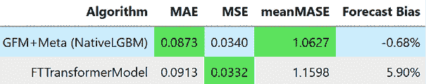

图 13.1：基于深度学习的表格回归评估

我们可以看到，`FTTransformer` 模型与我们在*第十章*中训练的 `LightGBM` 模型具有竞争力。也许，在适当的调优和分区下，`FTTransformer` 模型的表现可以和 `LightGBM` 模型一样，甚至更好。以与 `LightGBM` 相同的方式训练一个有竞争力的深度学习模型，在许多方面都是有用的。首先，它提供了灵活性，并训练模型一次性预测多个时间步。其次，这也可以与 `LightGBM` 模型结合在一起，作为集成模型使用，因为深度学习模型带来了多样性，这可以提升集成模型的表现。

**尝试的事项：**

使用 PyTorch Tabular 的文档，尝试其他模型或调整参数，观察性能如何变化。

选择几个家庭进行绘图，看看预测结果与目标值的匹配情况。

现在，让我们来看一下如何使用**循环神经网络**（**RNNs**）进行单步前瞻预测。

# 单步前瞻的循环神经网络

尽管我们稍微绕了一点，检查了如何将深度学习回归模型用于训练我们在*第十章*中学到的相同全局模型，但现在我们回到专门为时间序列构建的深度学习模型和架构上。和往常一样，我们首先会看简单的一步前瞻和局部模型，然后再转向更复杂的建模范式。事实上，我们还有另一章（*第十五章*，*全局深度学习预测模型的策略*），专门介绍了训练全局深度学习模型时可以使用的技术。

现在，让我们将注意力重新集中到一步步前瞻的局部模型上。我们看到 RNN（普通 RNN，**长短期记忆网络**（**LSTM**）和**门控循环单元**（**GRU**））是我们可以用于诸如时间序列等序列数据的一些模块。现在，让我们看看如何在我们一直使用的数据集上（*伦敦智能电表*数据集）将它们应用于**端到端**（**E2E**）模型。

尽管我们将查看一些库（例如 `darts`），这些库使得训练用于时间序列预测的深度学习模型变得更容易，但在本章中，我们将着重讲解如何从零开始开发这些模型。了解时间序列预测的深度学习模型是如何从基础搭建起来的，将帮助你更好地理解在后续章节中我们将要使用和调整的库所需的概念。

我们将使用 PyTorch，如果你不熟悉，我建议你去*第十二章*，*时间序列深度学习的构建模块*，以及相关的笔记本做一个快速复习。此外，我们还将使用 PyTorch Lightning，这是另一个建立在 PyTorch 之上的库，可以使使用 PyTorch 训练模型变得更加简单，除此之外还有其他一些优点。

我们在*第五章*中讨论了*时间延迟嵌入*，在*时间序列预测作为回归*部分，我们讨论了如何使用一个时间窗口将时间序列嵌入到更适合回归的格式中。在训练神经网络进行时间序列预测时，我们也需要这样的时间窗口。假设我们正在训练一个单一的时间序列。我们可以将这个超长的时间序列直接输入到 RNN 中，但这样它只会成为数据集中的一个样本。而且，数据集中只有一个样本时，几乎不可能训练任何机器学习或深度学习模型。因此，建议从时间序列中采样多个窗口，将时间序列转换成多个数据样本，这一过程与时间延迟嵌入非常相似。这个窗口也设置了深度学习模型的记忆。

我们需要采取的第一步是创建一个 PyTorch 数据集，该数据集接受原始时间序列并准备这些样本的窗口。数据集类似于数据的迭代器，它根据提供的索引给出相应的样本。为 PyTorch 定义自定义数据集非常简单，只需定义一个类，接受几个参数（其中之一是数据），并在类中定义两个必需的方法，如下所示：

+   `__len__(self)`：此方法设置数据集中样本的最大数量。

+   `__get_item__(self, idx)`：此方法从数据集中获取第`idx`个样本。

我们在`src/dl/dataloaders.py`中定义了一个名为`TimeSeriesDataset`的数据集，该数据集接受以下参数：

+   `Data`：该参数可以是 pandas DataFrame 或包含时间序列的 NumPy 数组。这是整个时间序列，包括训练、验证和测试数据，数据划分在类内部进行。

+   `window`：此参数设置每个样本的长度。

+   `horizon`：此参数设置我们希望获取的未来时间步数作为目标。

+   `n_val`：此参数可以是`float`或`int`数据类型。如果是`int`，则表示要保留作为验证数据的时间步数。如果是`float`，则表示要保留的验证数据占总数据的百分比。

+   `n_test`：此参数与`n_val`类似，但用于测试数据。

+   `normalize`：该参数定义了我们希望如何对数据进行标准化。它有三个选项：`none`表示不进行标准化，`global`表示我们计算训练数据的均值和标准差，并用此标准化整个序列，使用的公式如下：

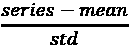

`local`表示我们使用窗口的均值和标准差来标准化该序列。

+   `normalize_params`：这个参数接收一个包含均值和标准差的元组。如果提供了这个参数，它可以用于进行*全局*标准化。这通常用于在验证集和测试集上使用训练集的均值和标准差。

+   `mode`：这个参数设置我们希望创建的数据集类型。它接受以下三种值之一：`train`、`val` 或 `test`。

从这个数据集中的每个样本返回两个张量——窗口（*X*）和相应的目标（*Y*）（见*图 13.2*）：

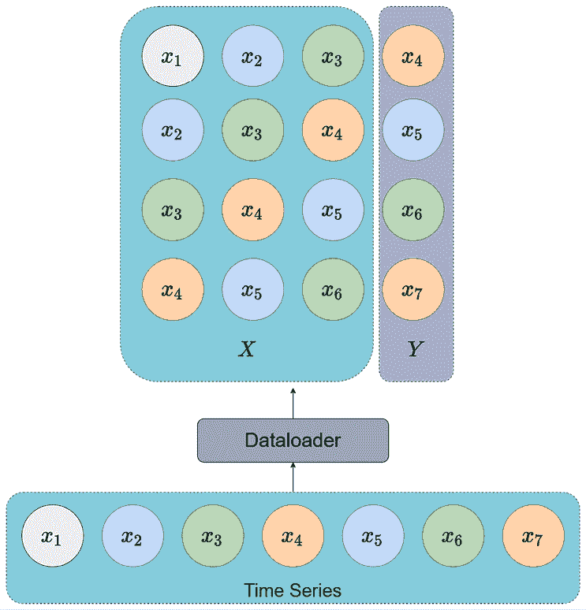

图 13.2：使用数据集和数据加载器抽样时间序列

现在我们已经定义了数据集，我们需要另一个 PyTorch 组件，叫做数据加载器（dataloader）。数据加载器使用数据集将样本按批次提取出来。 在 PyTorch Lightning 生态系统中，我们还有一个叫做数据模块（datamodule）的概念，它是生成数据加载器的标准方式。我们需要训练数据加载器、验证数据加载器和测试数据加载器。数据模块为数据管道部分提供了很好的抽象封装。我们在`src/dl/dataloaders.py`中定义了一个名为`TimeSeriesDataModule`的数据模块，它接收数据以及批次大小，并准备训练所需的数据集和数据加载器。参数与`TimeSeriesDataset`完全相同，唯一不同的是增加了`batch_size`参数。

**笔记本提醒：**

要跟随完整代码，可以使用`Chapter13`文件夹中的`02-One-Step_RNN.ipynb`笔记本以及`src`文件夹中的代码。

我们不会逐步讲解笔记本中的每一步，只会强调关键点。笔记本中的代码有详细注释，强烈建议你边看书边跟着代码一起实践。

我们已经从数据中抽取了一个家庭样本，现在，让我们看看如何定义一个数据模块：

```py
datamodule = TimeSeriesDataModule(data = sample_df[[target]],
        n_val = sample_val_df.shape[0],
        n_test = sample_test_df.shape[0],
        window = 48, # giving enough memory to capture daily seasonality
        horizon = 1, # single step
        normalize = "global", # normalizing the data
        batch_size = 32,
        num_workers = 0)
datamodule.setup() 
```

`datamodule.setup()`是用于计算并设置数据加载器的方法。现在，我们可以通过简单调用`datamodule.train_dataloader()`来访问训练数据加载器，类似地，验证集和测试集则通过`val_dataloader`和`test_dataloader`方法访问。我们可以如下访问样本：

```py
# Getting a batch from the train_dataloader
for batch in datamodule.train_dataloader():
    x, y = batch
    break
print("Shape of x: ",x.shape) #-> torch.Size([32, 48, 1])
print("Shape of y: ",y.shape) #-> torch.Size([32, 1, 1]) 
```

我们可以看到每个样本包含两个张量——`x`和`y`。这些张量有三个维度，它们分别对应于*批次大小*、*序列长度*和*特征*。

现在数据管道已经准备好，我们需要构建模型和训练管道。PyTorch Lightning 有一种标准的方式来定义这些管道，以便它们可以插入到提供的训练引擎中（这使得我们的工作变得更容易）。PyTorch Lightning 的文档（[`pytorch-lightning.readthedocs.io/en/latest/starter/introduction.html`](https://pytorch-lightning.readthedocs.io/en/latest/starter/introduction.html)）提供了很好的资源，帮助我们开始使用并深入了解。此外，在*进一步阅读*部分，我们还链接了一个视频，帮助从纯 PyTorch 过渡到 PyTorch Lightning。我强烈建议你花一些时间熟悉它。

在 PyTorch 中定义模型时，除了`__init__`外，必须定义一个标准方法`forward`。这是因为训练循环需要我们自己编写。在*第十二章*《时间序列深度学习的构建块》的`01-PyTorch_Basics.ipynb`笔记本中，我们看到如何编写一个 PyTorch 模型和训练循环来训练一个简单的分类器。但现在，我们将训练循环委托给 PyTorch Lightning，所以还需要包括一些额外的方法：

+   `training_step`：该方法接收批次数据，并使用模型获取输出，计算损失/指标，并返回损失值。

+   `validation_step`和`test_step`：这些方法接收批次数据，并使用模型获取输出，计算损失/指标。

+   `predict_step`：该方法用于定义推理时要执行的步骤。如果在推理过程中需要做一些特别的处理，我们可以定义这个方法。如果没有定义，它将使用`test_step`作为预测时的步骤。

+   `configure_optimizers`：该方法定义了使用的优化器，例如`Adam`或`RMSProp`。

我们在`src/dl/models.py`中定义了一个`BaseModel`类，实现了所有常见的功能，如损失和指标计算、结果日志记录等，作为实现新模型的框架。使用这个`BaseModel`类，我们定义了一个`SingleStepRNNModel`类，它接收标准配置（`SingleStepRNNConfig`）并初始化一个 RNN、LSTM 或 GRU 模型。

在我们查看模型是如何定义之前，先来看一下不同的配置（`SingleStepRNNConfig`）参数：

+   `rnn_type`：该参数接收三个字符串中的一个作为输入：`RNN`、`GRU`或`LSTM`。它定义了我们将要初始化的模型类型。

+   `input_size`：该参数定义了 RNN 所期望的特征数量。

+   `hidden_size`、`num_layers`和`bidirectional`：这些参数与我们在*第十二章*《时间序列深度学习的构建块》中看到的 RNN 单元相同。

+   `learning_rate`：该参数定义了优化过程中的学习率。

+   `optimizer_params`，`lr_scheduler`，和 `lr_scheduler_params`：这些是可以让我们调整优化过程的参数。现在先不需要担心它们，因为它们都已经被设置为智能的默认值。

通过这种设置，定义一个新模型就像这样简单：

```py
rnn_config = SingleStepRNNConfig(
    rnn_type="RNN",
    input_size=1,
    hidden_size=128,
    num_layers=3,
    bidirectional=True,
    learning_rate=1e-3,
    seed=42,
)
model = SingleStepRNNModel(rnn_config) 
```

现在，让我们看一眼 `forward` 方法，它是模型的核心。我们希望我们的模型能进行一步预测，并且从*第十二章*中，*时间序列深度学习的构建块*，我们知道典型的 RNN 输出是什么，以及 PyTorch RNN 如何仅在每个时间步输出隐藏状态。让我们先从视觉上了解我们想要做什么，然后看看如何将其编码实现：

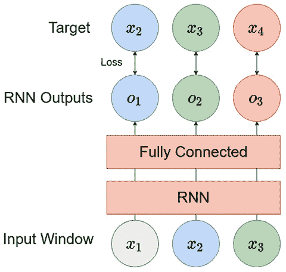

图 13.3：单步 RNN

假设我们使用的是在数据加载器中看到的相同示例——一个包含以下条目的时间序列，*x*[1]，*x*[2]，*x*[3]，……，*x*[7]，并且窗口大小为三。所以，数据加载器给出的一个样本将会包含 *x*[1]，*x*[2] 和 *x*[3] 作为输入 (*x*)，并且 *x*[4] 作为目标。我们可以使用这种方法，将序列通过 RNN 处理，忽略所有输出，只保留最后一个输出，并利用它来预测目标 *x*[4]。但这不是一种高效利用我们样本的方法，对吧？我们也知道，第一时间步的输出（使用 *x*[1]）应该是 *x*[2]，第二时间步的输出应该是 *x*[3]，依此类推。因此，我们可以将 RNN 设计成一种方式，最大化数据的使用，同时在训练过程中使用这些额外的时间点来给模型提供更好的信号。现在，让我们详细分析 `forward` 方法。

`forward` 方法接受一个名为 `batch` 的单一参数，它是输入和输出的元组。因此，我们将 `batch` 解包成两个变量 `x` 和 `y`，像这样：

```py
x, y = batch 
```

`x` 的形状将是 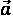 *(批量大小，窗口长度，特征数)*，而 `y` 的形状将是 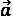 *(批量大小，目标长度，特征数)*。

现在我们需要将输入序列 (`x`) 通过 RNN（RNN、LSTM 或 GRU）处理，像这样：

```py
x, _ = self.rnn(x) 
```

正如我们在*第十二章*中看到的，*时间序列深度学习的构建块*，PyTorch RNN 会处理输入并返回两个输出——每个时间步的隐藏状态和输出（即最后一个时间步的隐藏状态）。在这里，我们需要来自所有时间步的隐藏状态，因此我们将其存储在 `x` 变量中。`x` 现在的维度将是 (*批量大小，窗口长度，RNN 隐藏层大小*)。

我们有了隐藏状态，但要得到输出，我们需要对隐藏状态应用一个全连接层，这个全连接层应该在所有时间步中共享。实现这一点的简单方法是定义一个输入大小等于 RNN 隐藏层大小的全连接层，然后执行以下操作：

```py
x = self.fc(x) 
```

`x` 是一个三维张量，当我们在三维张量上使用全连接层时，PyTorch 会自动将全连接层应用到每个时间步上。现在，最终输出被保存在 `x` 中，其维度为 *(batch size, window length*, *1)*。

现在，我们已经得到了网络的输出，但我们还需要做一些调整来准备目标。当前，`y` 只有窗口之外的一个时间步，但如果我们跳过 `x` 中的第一个时间步并将其与 `y` 连接，我们就可以得到目标，正如我们在 *图 13.3* 中所看到的那样：

```py
y = torch.cat([x[:, 1:, :], y], dim=1) 
```

通过使用数组索引，我们选择 `x` 中除了第一个时间步之外的所有内容，并将其与 `y` 在第一维（即 *窗口长度*）上连接。

这样，我们就有了 `x` 和 `y` 变量，我们可以返回它们，而 `BaseModel` 类将计算损失并处理其余的训练。有关整个类以及 `forward` 方法的内容，您可以参考 `src/dl/models.py`。

让我们通过传递数据加载器中的批次来测试我们初始化的模型：

```py
y_hat, y = model(batch)
print("Shape of y_hat: ",y_hat.shape) #-> ([32, 48, 1])
print("Shape of y: ",y.shape) #-> ([32, 48, 1]) 
```

现在模型按预期工作，没有错误，让我们开始训练模型。为此，我们可以使用 PyTorch Lightning 的 `Trainer`。`Trainer` 类中有许多选项，完整的参数列表可以在这里找到：[`pytorch-lightning.readthedocs.io/en/stable/api/pytorch_lightning.trainer.trainer.Trainer.html#pytorch_lightning.trainer.trainer.Trainer`](https://pytorch-lightning.readthedocs.io/en/stable/api/pytorch_lightning.trainer.trainer.Trainer.html#pytorch_lightning.trainer.trainer.Trainer)。

但在这里，我们只会使用最基本的参数。让我们逐一介绍我们将在这里使用的参数：

+   `auto_select_gpus` 和 `gpus`：这两个参数让我们可以选择用于训练的 GPU（如果存在）。如果我们将 `auto_select_gpus` 设置为 `True`，并将 `gpus` 设置为 `-1`，则 `Trainer` 类会选择机器中所有的 GPU，如果没有 GPU，它会回退到基于 CPU 的训练。

+   `callbacks`：PyTorch Lightning 提供了许多在训练过程中可以使用的有用回调，如 `EarlyStopping`、`ModelCheckpoint` 等。即使我们没有显式设置，大多数有用的回调会自动添加，但 `EarlyStopping` 是一个需要显式设置的有用回调。`EarlyStopping` 是一个回调函数，可以在训练过程中监控验证损失或指标，并在验证损失开始变差时停止训练。这是一种正则化形式，帮助我们防止模型在训练数据上过拟合。`EarlyStopping` 具有以下主要参数（完整的参数列表可以在这里找到：[`pytorch-lightning.readthedocs.io/en/stable/api/pytorch_lightning.callbacks.EarlyStopping.html`](https://pytorch-lightning.readthedocs.io/en/stable/api/pytorch_lightning.callbacks.EarlyStopping.html)）：

    +   `monitor`：这个参数接受一个字符串输入，指定我们希望监控的早停指标的确切名称。

    +   `patience`：这个参数指定了在监控的指标没有改善的情况下，回调停止训练的轮次。例如，如果我们将`patience`设置为`10`，回调将在监控指标恶化的 10 个轮次后停止训练。关于这些细节，还有更详细的说明，您可以在文档中找到。

    +   `mode`：这是一个字符串输入，接受`min`或`max`中的一个。它设置了改善的方向。在`min`模式下，当监控的量停止下降时，训练会停止；在`max`模式下，当监控的量停止上升时，训练会停止。

+   `min_epochs` 和 `max_epochs`：这些参数帮助我们设定训练应运行的`min`和`max`轮次的限制。如果我们使用了`EarlyStopping`，`min_epochs`决定了无论验证损失/度量如何，都会运行的最小轮次，而`max_epochs`则设置了最大轮次限制。所以，即使在达到`max_epochs`时验证损失仍在下降，训练也会停止。

    **Glossary：**

    这里有一些你应该了解的术语，以便全面理解神经网络训练：

    +   **Training step**：表示对参数的单次梯度更新。在批量**随机梯度下降**（**SGD**）中，每次批次后的梯度更新被视为一步。

    +   **Batch**：一个 batch 是我们通过模型运行的数据样本数量，并在训练步骤中对这些样本的梯度进行平均更新。

    +   **Epoch**：一个 epoch 指的是模型已经看过数据集中所有样本，或者数据集中的所有批次已经用于梯度更新。

所以，让我们初始化一个简单的`Trainer`类：

```py
trainer = pl.Trainer(
    auto_select_gpus=True,
    gpus=-1,
    min_epochs=5,
    max_epochs=100,
    callbacks=[pl.callbacks.EarlyStopping(monitor="valid_loss", patience=3)],
) 
```

现在，只剩下通过将`model`和`datamodule`传递给一个名为`fit`的方法来触发训练：

```py
trainer.fit(model, datamodule) 
```

它将运行一段时间，并根据验证损失何时开始增加来停止训练。模型训练完成后，我们仍然可以使用`Trainer`类对新数据进行预测。预测使用的是我们在`BaseModel`类中定义的`predict_step`方法，该方法又调用了我们在`SingleStepRNN`模型中定义的`predict`方法。这个方法非常简单，它调用`forward`方法，获取模型输出，并仅从输出中选择最后一个时间步（即我们正在预测的未来输出）。你可以在这里看到一个说明：

```py
def predict(self, batch):
        y_hat, _ = self.forward(batch)
        return y_hat[:, -1, :] 
```

那么，让我们看看如何使用`Trainer`类对新数据（或者更准确地说，是新数据加载器）进行预测：

```py
pred = trainer.predict(model, datamodule.test_dataloader()) 
```

我们只需要提供训练好的模型和数据加载器（在这里，我们使用已经设置并定义的测试数据加载器）。

现在，输出 `pred` 是一个张量列表，每个批次一个。我们只需要将它们拼接在一起，去除任何多余的维度，将其从计算图中分离出来，并转换为 NumPy 数组。我们可以这样做：

```py
pred = torch.cat(pred).squeeze().detach().numpy() 
```

现在，`pred` 是一个包含所有测试数据框（用于定义 `test_dataloader`）项目预测的 NumPy 数组，但记得我们之前对原始时间序列进行了标准化处理。现在，我们需要将这个转换反向处理。我们最初用于标准化的均值和标准差仍然存储在训练数据集中。我们只需要将它们取出并反转之前的转换，如下所示：

```py
pred = pred * datamodule.train.std + datamodule.train.mean 
```

现在，我们可以对它们进行各种操作，例如与实际数据进行对比、可视化预测结果等等。让我们看看模型的表现如何。为了提供背景信息，我们还包含了*第八章*中使用的单步机器学习模型，*《使用机器学习模型预测时间序列》*：

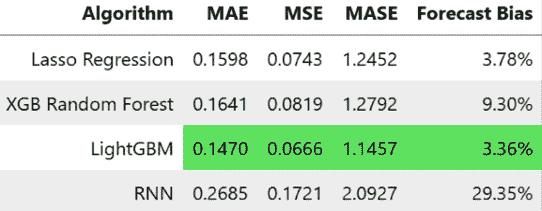

图 13.4：MAC000193 家庭的基础单步前馈 RNN 指标

看起来 RNN 模型的表现相当糟糕。让我们也来直观地看看预测结果：

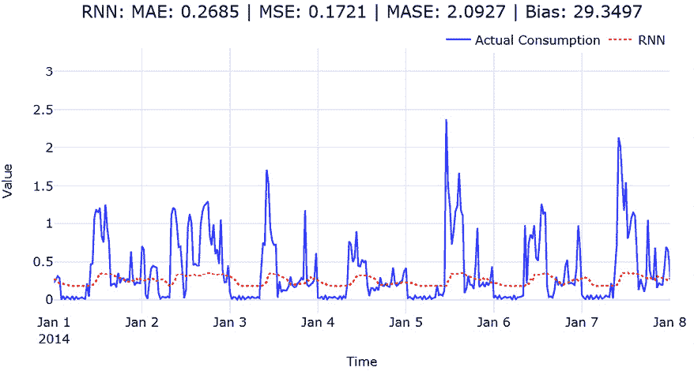

图 13.5：MAC000193 家庭的单步前馈 RNN 预测

我们可以看到模型未能学习到峰值的规模和模式的细微变化。也许这是我们在讨论 RNN 时提到的问题，因为季节性模式在 48 个时间步内展开；记住，这个模式需要 RNN 具有长期记忆能力。让我们快速将模型替换为 LSTM 和 GRU，看看它们的表现如何。我们需要更改的唯一参数是 `rnn_type` 参数，位于 `SingleStepRNNConfig` 中。

笔记本中也包含了训练 LSTM 和 GRU 的代码。但是让我们来看一下 LSTM 和 GRU 的指标：

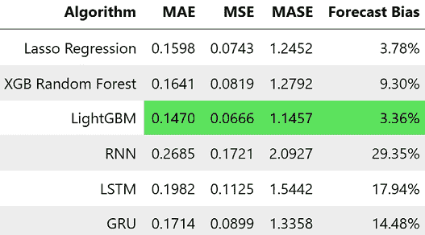

图 13.6：MAC000193 家庭的单步前馈 LSTM 和 GRU 指标

现在，表现看起来具有竞争力。LightGBM 仍然是最好的模型，但现在 LSTM 和 GRU 模型表现得也很有竞争力，不像基础 RNN 模型那样完全缺乏。如果我们看一下预测结果，我们可以看到 LSTM 和 GRU 模型已经能更好地捕捉到模式：

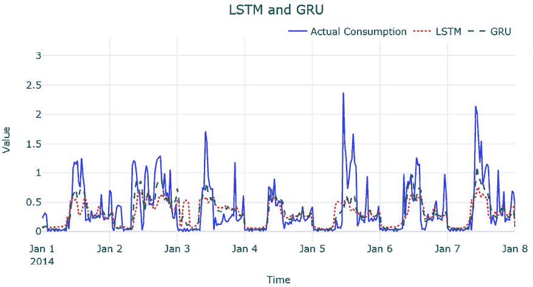

图 13.7：MAC000193 家庭的单步前馈 LSTM 和 GRU 预测

**待尝试的事项：**

尝试更改模型的参数，看看效果如何。双向 LSTM 的表现如何？增加窗口大小能提高性能吗？

现在我们已经看到了如何使用标准 RNN 进行单步预测，让我们来看看一种比我们刚才看到的模式更灵活的建模方式。

# 序列到序列（Seq2Seq）模型

我们在*第十二章*《时间序列深度学习基础》中详细讨论了 Seq2Seq 架构和编码器-解码器范式。为了帮助你回忆，Seq2Seq 模型是一种编码器-解码器模型，其中编码器将序列编码成潜在表示，然后解码器使用该潜在表示执行任务。这种设置本质上更加灵活，因为编码器（负责表示学习）和解码器（使用表示进行预测）是分开的。从时间序列预测的角度来看，这种方法的最大优势之一是取消了单步预测的限制。在这种建模模式中，我们可以将预测扩展到任何我们想要的预测时间范围。

在这一节中，我们将组合几个编码器-解码器模型，并像以前使用单步前馈 RNN 一样测试我们的单步预测。

**笔记本提示：**

要跟随完整的代码，请使用`Chapter13`文件夹中的`03-Seq2Seq_RNN.ipynb`笔记本以及`src`文件夹中的代码。

我们可以使用上一节中开发的相同机制，如`TimeSeriesDataModule`、`BaseModel`类和相应的代码，来实现我们的 Seq2Seq 建模模式。让我们定义一个新的 PyTorch 模型，叫做`Seq2SeqModel`，继承`BaseModel`类。同时，我们还可以定义一个新的配置文件，叫做`Seq2SeqConfig`，用于设置模型的超参数。最终版本的代码可以在`src/dl/models.py`中找到。

在我们解释模型和配置中的不同参数之前，让我们先讨论一下如何设置这个 Seq2Seq 模型的不同方式。

## RNN 到全连接网络

为了方便起见，我们将编码器限制为 RNN 系列模型——可以是普通的 RNN、LSTM 或 GRU。如同我们在*第十二章*《时间序列深度学习基础》一书中所看到的，在 PyTorch 中，所有 RNN 系列模型都有两个输出——*output*和*hidden states*，我们还看到，output 实际上就是在所有时间步的隐藏状态（在堆叠 RNN 中为最终隐藏状态）。我们得到的隐藏状态包含所有层的最新隐藏状态（对于 LSTM 来说，也包括单元状态）。编码器可以像上一节中初始化 RNN 系列模型那样进行初始化，代码如下：

```py
self.encoder = nn.LSTM(
                **encoder_params,
                batch_first=True,
            ) 
```

在`forward`方法中，我们可以做如下操作来编码时间序列：

```py
o, h = self.encoder(x) 
```

现在，我们有几种不同的方法可以解码信息。我们将讨论的第一种方法是使用完全连接层。完全连接层可以接受来自编码器的最新隐藏状态并预测所需的输出，或者我们可以将所有隐藏状态展平为一个长向量并用它来预测输出。后者为解码器提供了更多信息，但也可能会带来更多噪音。这两种方法在*图 13.8*中展示，且使用的是我们在上一节中使用的相同示例：

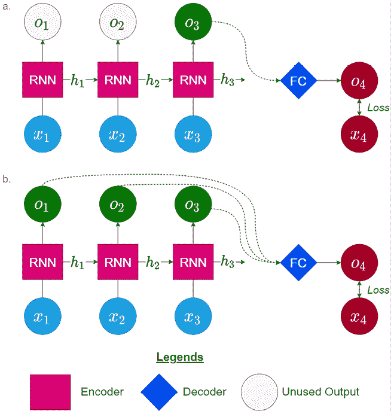

图 13.8：RNN 作为编码器，完全连接层作为解码器

让我们也看看如何将这些内容在代码中实现。在第一种情况下，我们只使用编码器的最后一个隐藏状态，解码器的代码将如下所示：

```py
self.decoder = nn.Linear(
                    hidden_size*bi_directional_multiplier, horizon
                ) 
```

在这里，如果编码器是双向的，那么`bi_directional_multiplier`为`2`，否则为`1`。这是因为如果编码器是双向的，每个时间步的隐藏状态将会连接成两个。`horizon`是我们希望预测的时间步数。

在第二种情况下，我们使用所有时间步的隐藏状态时，需要按照如下方式构建解码器：

```py
self.decoder = nn.Linear(
                    hidden_size * bi_directional_multiplier * window_size, horizon
                ) 
```

在这里，输入向量将是来自所有时间步的所有隐藏状态的展平向量，因此输入维度将是`hidden_size * window_size`。

在`forward`方法中，对于第一种情况，我们可以进行如下操作：

```py
y_hat = self.decoder(o[:,-1,:]).unsqueeze(-1) 
```

在这里，我们只取最新时间步的隐藏状态，并通过`unsqueeze`操作保持三维结构，以符合目标`y`的维度。

对于第二种情况，我们可以做如下操作：

```py
y_hat = self.decoder(o.reshape(o.size(0), -1)).unsqueeze(-1) 
```

在这里，我们首先重新调整整个隐藏状态，将其展平，然后将其传递给解码器以获得预测结果。我们使用`unsqueeze`操作来插入我们刚刚压缩的维度，使得输出和目标`y`具有相同的维度。

尽管理论上我们可以使用全连接解码器来预测尽可能多的未来步数，但在实际操作中是有限制的。当我们需要预测大量的时间步时，模型必须学习一个如此大的矩阵来生成这些输出，而随着矩阵变大，学习变得更加困难。另一个值得注意的点是，这些预测每一个都是独立发生的，且仅依赖于编码器中潜在表示的信息。例如，预测 5 个时间步后的结果只依赖于编码器中的潜在表示，而与*时间步 1*到*4*的预测无关。让我们看看另一种类型的 Seq2Seq，它使得解码更加灵活，并且能更好地考虑问题的时间性。

## RNN 到 RNN

我们可以用另一个 RNN 来作为解码器，而不是使用全连接层作为解码器——所以，RNN 家族中的一个模型负责编码，另一个模型负责解码。初始化解码器的过程与初始化编码器相似。如果我们想使用 LSTM 模型作为解码器，可以按照以下方式进行操作：

```py
self.decoder = nn.LSTM(
                **decoder_params,
                batch_first=True,
            ) 
```

让我们通过一个可视化表示来加深对这个过程的理解：

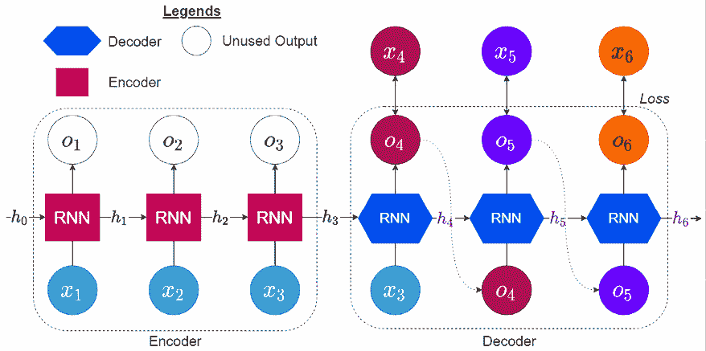

图 13.9：RNN 作为编码器和解码器

编码器部分保持不变：它接收输入窗口，*x*[1] 到 *x*[3]，并产生输出，*o*[1] 到 *o*[3]，以及最后的隐藏状态，*h*[3]。现在，我们有另一个解码器（来自 RNN 家族的模型），它将 *h*[3] 作为初始隐藏状态，并使用窗口中的最新输入来生成下一个输出。现在，这个输出被反馈到 RNN 作为输入，我们继续生成下一个输出，这个循环会一直持续，直到我们得到预测所需的时间步数。

你们可能会想知道，为什么在解码时不使用目标窗口（*x*[4] 到 *x*[6]）。事实上，这是一种有效的训练模型的方法，在文献中称为 **教师强制**。这种方法与最大似然估计有很强的联系，并且在 Goodfellow 等人的《深度学习》一书中有很好的解释（见《进一步阅读》部分）。因此，代替将模型在前一个时间步的输出作为当前时间步 RNN 的输入，我们将真实观察值作为输入，从而消除了前一个时间步可能引入的错误。

虽然这看起来是最直接的做法，但它也有一些缺点。最主要的缺点是解码器在训练过程中看到的输入类型，可能与实际预测过程中看到的输入类型不同。在预测过程中，我们仍然会将前一步模型的输出作为解码器的输入。这是因为在推理模式下，我们无法访问未来的真实观察值。这在某些情况下可能会引发问题。解决这个问题的一种方法是在训练过程中随机选择模型在前一个时间步的输出和真实观察值之间进行选择（Bengio 等人，2015）。

**参考检查：**

Bengio 等人提出的教师强制方法在文献 *1* 中有引用。

现在，让我们看看如何通过一个名为 `teacher_forcing_ratio` 的参数来编写 `forward` 方法，这个参数是一个从 0 到 1 的小数，决定教师强制的实施频率。例如，如果 `teacher_forcing_ratio` = 0，则从不使用教师强制；如果 `teacher_forcing_ratio` = 1，则始终使用教师强制。

以下代码块包含了解码所需的所有代码，并附有行号，以便我们可以逐行解释我们正在做什么：

```py
01  y_hat = torch.zeros_like(y, device=y.device)
02  dec_input = x[:, -1:, :]
03  for i in range(y.size(1)):
04      out, h = self.decoder(dec_input, h)
05      out = self.fc(out)
06      y_hat[:, i, :] = out.squeeze(1)
07      #decide if we are going to use teacher forcing or not
08      teacher_force = random.random() < teacher_forcing_ratio
09      if teacher_force:
10          dec_input = y[:, i, :].unsqueeze(1)
11      else:
12          dec_input = out 
```

我们需要做的第一件事是声明一个占位符，用于在解码过程中存储期望的输出。在*第 1 行*，我们通过使用`zeros_like`来实现，它会生成一个与`y`具有相同维度的全零张量；在*第 2 行*，我们将解码器的初始输入设置为输入窗口中的最后一个时间步。现在，我们已经准备好开始解码过程，为此，在*第 3 行*，我们开始一个循环，运行`y.size(1)`次。如果你记得`y`的维度，第二个维度是序列长度，因此我们需要解码这么多次。

在*第 4 行*，我们将输入窗口中的最后一个输入和编码器的隐藏状态传递给解码器，解码器返回当前输出和隐藏状态。我们将当前的隐藏状态存储在相同的变量中，覆盖掉旧的状态。如果你记得，RNN 的输出就是隐藏状态，我们将需要将它传递通过一个全连接层来进行预测。因此，在*第 5 行*，我们就是这么做的。在*第 6 行*，我们将全连接层的输出存储到`y_hat`的第*i*个时间步中。

现在，我们只需要做一件事——决定是否使用教师强制（teacher forcing），然后继续解码下一个时间步。我们可以通过生成一个介于*0*和*1*之间的随机数，并检查该数字是否小于`teacher_forcing_ratio`参数来实现这一点。`random.random()`从*0*到*1*的均匀分布中抽取一个数字。如果`teacher_forcing_ratio`参数是*0.5*，那么检查`random.random()`<`teacher_forcing_ratio`就能自动确保我们只有 50%的时间使用教师强制。因此，在*第 8 行*，我们进行这个检查，并得到一个布尔值输出`teacher_force`，它告诉我们是否需要在下一个时间步使用教师强制。对于教师强制，我们将当前时间步的`y`存储为`dec_input`（*第 10 行*）。否则，我们将当前输出存储为`dec_input`（*第 12 行*），并且这个`dec_input`参数将作为下一个时间步 RNN 的输入。

现在，所有这些（包括全连接解码器和 RNN 解码器）已经被整合到一个名为`Seq2SeqModel`的类中，该类位于`src/dl/models.py`中，并且还定义了一个配置类（`Seq2SeqConfig`），其中包含了模型的所有选项和超参数。让我们来看看配置中不同的参数：

+   `encoder_type`：一个字符串参数，可以取以下三个值之一：`RNN`、`LSTM`或`GRU`。它决定了我们需要作为编码器使用的序列模型。

+   `decoder_type`：一个字符串参数，可以取以下四个值之一：`RNN`、`LSTM`、`GRU`或`FC`（代表*全连接*）。它决定了我们需要作为解码器使用的序列模型。

+   `encoder_params` 和 `decoder_params`：这些参数接受一个包含键值对的字典作为输入。它们分别是编码器和解码器的超参数。对于 RNN 系列的模型，还有另一个配置类 `RNNConfig`，它设置了标准的超参数，如 `hidden_size` 和 `num_layers`。对于 `FC` 解码器，我们需要提供两个参数：`window_size`，即输入窗口中包含的时间步数，以及 `horizon`，即我们希望预测的未来时间步数。

+   `decoder_use_all_hidden`：我们讨论了两种使用全连接解码器的方法。这个参数是一个标志，用于在两者之间切换。如果设置为`True`，全连接解码器将扁平化所有时间步的隐藏状态，并将它们用于预测；如果设置为`False`，它只会使用最后一个隐藏状态。

+   `teacher_forcing_ratio`：我们之前讨论过教师强制，这个参数决定了训练时教师强制的强度。如果是 *0*，则没有教师强制；如果是 *1*，每个时间步都会进行教师强制。

+   `optimizer_params`，`lr_scheduler` 和 `lr_scheduler_params`：这些是让我们调整优化过程的参数。暂时不必担心这些，因为它们都已设置为智能默认值。

现在，使用这个配置和模型，让我们进行几个实验。这些实验与我们在上一节中进行的一组实验完全相同。实验的具体代码可以在附带的笔记本中找到。所以，我们进行了以下实验：

+   `LSTM_FC_last_hidden`：编码器 = LSTM / 解码器 = 全连接，只使用最后一个隐藏状态

+   `LSTM_FC_all_hidden`：编码器 = LSTM / 解码器 = 全连接，使用所有隐藏状态

+   `LSTM_LSTM`：编码器 = LSTM / 解码器 = LSTM

让我们看看它们在我们一直跟踪的指标上的表现：

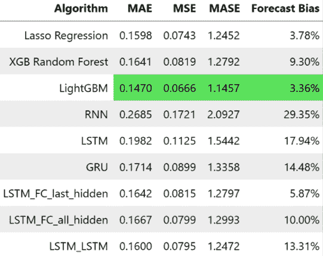

图 13.10：MAC000193 家庭的 Seq2Seq 模型指标

Seq2Seq 模型似乎在指标上表现得更好，而 `LSTM_LSTM` 模型甚至比随机森林模型更好。

在笔记本中有这些预测的可视化。我建议你查看那些可视化，放大，查看地平线的不同地方，等等。你们中精明的观察者一定已经发现预测中有一些奇怪的地方。为了让这个点更清楚，我们来看看我们生成的预测的放大版本（一天的情况）：

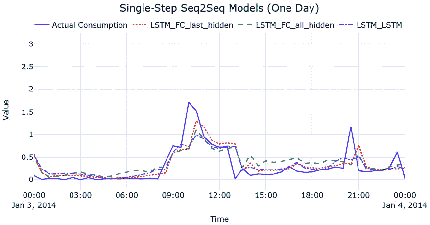

图 13.11：MAC000193 家庭的单步预测 Seq2Seq（一天）

现在你看到什么了？关注时间序列中的峰值。它们是对齐的吗？还是看起来有偏移？你现在看到的现象，是当模型学会模仿上一个时间步（如同朴素预测）而不是学习数据中的真实模式时发生的。我们可能会得到好的指标，并且可能会对预测感到满意，但经过检查后我们会发现，这并不是我们想要的预测。这在单步预测模型中特别明显，因为我们仅仅是在优化预测下一个时间步。因此，模型没有真正的动力去学习长期模式，比如季节性等，最终学到的模型就像朴素预测一样。

训练用来预测更长时间范围的模型能够克服这个问题，因为在这种情形下，模型被迫学习更长期的模式。虽然多步预测是*第十八章：多步预测*中将详细讨论的话题，我们现在先提前看一点。在笔记本中，我们还使用 Seq2Seq 模型训练了多步预测模型。

我们需要做的唯一改变就是：

+   在`datamodule`和模型中定义的预测范围应该进行调整。

+   我们评估模型的方式也应该有一些小的改变。

让我们看看如何为多步预测定义`datamodule`。我们选择预测完整的一天，即 48 个时间步。作为输入窗口，我们给出了`2 X 48`个时间步：

```py
HORIZON = 48
WINDOW = 48*2
datamodule = TimeSeriesDataModule(data = sample_df[[target]],
        n_val = sample_val_df.shape[0],
        n_test = sample_test_df.shape[0],
        window = WINDOW,
        horizon = HORIZON,
        normalize = "global", # normalizing the data
        batch_size = 32,
        num_workers = 0) 
```

现在我们有了`datamodule`，可以像以前一样初始化模型并进行训练。现在我们需要做的唯一改变是在预测时。

在单步预测的设置中，每次时间步我们都在预测下一个时间步。但是现在，我们在每一步预测下一个 48 个时间步。我们可以从多个角度来看待这个问题并衡量相关指标，我们将在*第三部分*中详细讨论。现在，我们可以选择一种启发式方法，假设我们每天只运行一次这个模型，每次预测包含 48 个时间步。但测试数据加载器仍然是按每次增加一个时间步来处理——换句话说，测试数据加载器仍然给我们每个时间步的下一个 48 个时间步。因此，执行以下代码时，我们会得到一个维度为（*时间步*，*预测范围*）的预测数组：

```py
pred = trainer.predict(model, datamodule.test_dataloader())
# pred is a list of outputs, one for each batch
pred = torch.cat(pred).squeeze().detach().numpy() 
```

预测从`2014 年 1 月 1 日 00:00:00`开始。所以，如果我们选择每 48 个时间步作为一个周期，那么每 48 个时间步间隔进行选择，就像只考虑每天开始时做出的预测。借助`numpy`提供的一些高级索引，我们很容易做到这一点：

```py
pred = pred[0::48].ravel() 
```

我们从索引 0 开始，这是 48 个时间步的第一次预测，然后选择每隔 48 个索引（即时间步），并将数组拉平成一维。我们将得到一个具有所需形状的预测数组，然后按照标准程序进行逆变换和指标计算等操作。

这个笔记本包含了进行以下实验的代码：

+   `MultiStep LSTM_FC_last_hidden`：编码器 = LSTM / 解码器 = 全连接层，仅使用最后一个隐藏状态

+   `MultiStep LSTM_FC_all_hidden`：编码器 = LSTM / 解码器 = 全连接层，使用所有隐藏状态

+   `MultiStep LSTM_LSTM_teacher_forcing_0.0`：编码器 = LSTM / 解码器 = LSTM，不使用教师强制

+   `MultiStep LSTM_LSTM_teacher_forcing_0.5`：编码器 = LSTM / 解码器 = LSTM，使用随机教师强制（随机地，50%的时间启用教师强制）

+   `MultiStep LSTM_LSTM_teacher_forcing_1.0`：编码器 = LSTM / 解码器 = LSTM，使用完整的教师强制

让我们看看这些实验的指标：

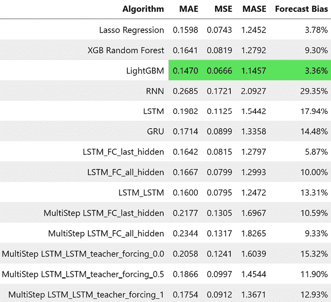

图 13.12：MAC000193 家庭多步 Seq2Seq 模型的指标

尽管我们无法将单步预测准确度与多步预测准确度进行比较，但暂时先不考虑这个问题，将单步预测的指标作为最理想情况。由此可见，我们预测一天（48 个时间步）的模型其实并不是那么差，如果我们将预测结果可视化，也不会出现模仿天真预测的情况，因为现在模型被迫学习长期模型和预测：

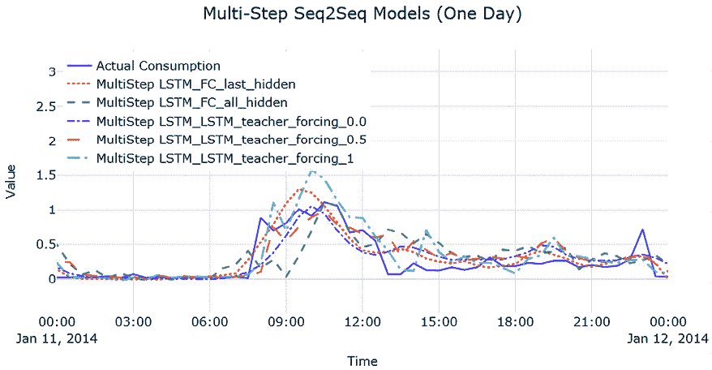

图 13.13：MAC000193 家庭的多步预测 Seq2Seq（一天）

我们可以看到模型已经尝试学习每日模式，因为它被迫预测接下来的 48 个时间步。通过一些调整和其他训练技巧，我们也许能得到一个更好的模型。但从工程和建模的角度来看，为数据集中的每个`LCLid`（消费者 ID）实例训练单独的模型可能不是最佳选择。我们将在*第十五章*，*全球深度学习预测模型策略*中讨论全球建模的策略。

**尝试的方向：**

你能训练出一个更好的模型吗？调整超参数，尝试提高性能。使用 GRU 或将 GRU 与 LSTM 结合——可能性是无限的。

恭喜您又完成了另一个动手实践的实用章节。如果这是您第一次训练神经网络，希望这一课程让您有足够的信心去尝试更多：尝试和实验这些技术是学习的最佳方式。在机器学习中，并没有适用于所有数据集的灵丹妙药，因此我们从业者需要保持开放的选择权，并选择适合我们用例并在其中表现良好的正确算法/模型。在这个数据集中，我们可以看到，对于单步预测，LightGBM 效果非常好。但是 LSTM Seq2Seq 模型的效果几乎一样好。当我们扩展到多步预测的情况时，拥有一个单一模型执行多步预测并具有足够好的性能的优势可能会超过管理多个机器学习模型（关于这一点将在*第十八章*详细介绍）。我们学习的技术在深度学习领域仍被认为是基础的，在接下来的章节中，我们将深入探讨深度学习的更复杂的方法。

# 摘要

尽管我们在上一章节学习了深度学习的基本组成部分，但我们在使用 PyTorch 将所有这些内容付诸实践时，将这些组件应用于常见的建模模式。

我们看到了标准的序列模型如 RNN、LSTM 和 GRU 如何用于时间序列预测，然后我们转向了另一种模型范式，称为 Seq2Seq 模型。在这里，我们讨论了如何混合和匹配编码器和解码器以获得我们想要的模型。编码器和解码器可以是任意复杂的。虽然我们看了简单的编码器和解码器，但肯定可以有像卷积块和 LSTM 块的组合一起工作的东西作为编码器。最后但并非最不重要的，我们谈到了教师强制及其如何帮助模型更快地训练和收敛，以及一些性能提升。

在下一章中，我们将探讨过去几年引起广泛关注的一个主题（双关语）：注意力和 Transformer。

# 参考资料

1.  Samy Bengio，Oriol Vinyals，Navdeep Jaitly 和 Noam Shazeer（2015）。*用于序列预测的定时采样*。*第 28 届国际神经信息处理系统大会论文集—第 1 卷*（*NIPS’15*）：[`proceedings.neurips.cc/paper/2015/file/e995f98d56967d946471af29d7bf99f1-Paper.pdf`](https://proceedings.neurips.cc/paper/2015/file/e995f98d56967d946471af29d7bf99f1-Paper.pdf)。

# 进一步阅读

查看以下来源以进一步阅读：

+   *从 PyTorch 到 PyTorch Lightning* — Alfredo Canziani 和 William Falcon：[`www.youtube.com/watch?v=DbESHcCoWbM`](https://www.youtube.com/watch?v=DbESHcCoWbM)

+   *深度学习* — Ian Goodfellow，Yoshua Bengio 和 Aaron Courville（第 376-377 页）：[`www.deeplearningbook.org/contents/rnn.html`](https://www.deeplearningbook.org/contents/rnn.html)

+   **《表格数据的深度学习简史》**由塞巴斯蒂安·拉什卡（Sebastian Raschka）编写：[`sebastianraschka.com/blog/2022/deep-learning-for-tabular-data.html`](https://sebastianraschka.com/blog/2022/deep-learning-for-tabular-data.html)

# 加入我们的 Discord 社区

加入我们社区的 Discord 空间，与作者和其他读者一起讨论：

[`packt.link/mts`](https://packt.link/mts)


