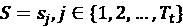
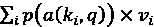

# 第十四章：时间序列中的注意力与变换器

在上一章中，我们卷起袖子，实施了一些用于时间序列预测的**深度学习**（**DL**）系统。我们使用了在*第十二章*中讨论的常见构建块，*深度学习时间序列的构建块*，将它们组合成一个编码器-解码器架构，并训练它们产生我们期望的预测。

现在，让我们谈谈深度学习（DL）中的另一个关键概念，它在过去几年迅速席卷了这个领域——**注意力**。注意力有着悠久的历史，并最终成为了 DL 工具箱中最受欢迎的工具之一。本章将带领你从理论的角度理解注意力和变换器模型，并通过实际示例巩固这一理解。

在本章中，我们将涵盖以下主要内容：

+   什么是注意力？

+   广义注意力模型

+   使用序列到序列模型和注意力进行预测

+   变换器——注意力就是你所需要的一切

+   使用变换器进行预测

# 技术要求

你需要通过遵循本书*前言*中的说明来设置**Anaconda**环境，以便获得一个包含本书中所需所有库和数据集的工作环境。任何额外的库将在运行笔记本时自动安装。

本章你需要运行以下笔记本：

+   `02-Preprocessing_London_Smart_Meter_Dataset.ipynb` 在 `Chapter02` 中

+   `01-Setting_up_Experiment_Harness.ipynb` 在 `Chapter04` 中

+   `01-Feature_Engineering.ipynb` 在 `Chapter06` 中

+   `02-One-Step_RNN.ipynb` 和 `03-Seq2Seq_RNN.ipynb` 在 `Chapter13` 中（用于基准测试）

+   `00-Single_Step_Backtesting_Baselines.ipynb` 和 `01-Forecasting_with_ML.ipynb` 在 `Chapter08` 中

本章相关的代码可以在[`github.com/PacktPublishing/Modern-Time-Series-Forecasting-with-Python-/tree/main/notebooks/Chapter14`](https://github.com/PacktPublishing/Modern-Time-Series-Forecasting-with-Python-/tree/main/notebooks/Chapter14)找到。

# 什么是注意力？

注意力的概念灵感来自于人类的认知功能。我们眼中的视神经、鼻中的嗅神经以及耳中的听神经，时刻向大脑传送大量的感官信息。这些信息量过于庞大，显然超过了大脑的处理能力。但我们的大脑已经发展出一种机制，帮助我们只对那些重要的刺激物*注意*——比如一个不属于的声音或气味。经过多年的进化，我们的大脑已经被*训练*去挑出异常的声音或气味，因为这对于我们在野外生存至关重要，那时捕食者自由漫游。在认知科学中，注意力被定义为一种认知过程，允许个体选择性地专注于特定信息，同时忽略其他无关的刺激。

除了这种本能的注意力外，我们还可以通过所谓的*集中注意力*来控制我们的注意力。你现在正在做的就是通过选择忽视所有其他的刺激，专注于本书的内容。当你阅读时，手机响了，屏幕亮了，尽管书本仍然摆在你面前，你的大脑决定将注意力集中到手机屏幕上。这种人类认知功能的特性正是深度学习中注意力机制的灵感来源。赋予学习机器这种注意力的能力，已经带来了今天 AI 各个领域的巨大突破。

这个理念最早应用于深度学习中的 Seq2Seq 模型，我们在*第十三章*《时间序列的常见建模模式》中学习了这一点。在那一章中，我们看到了编码器和解码器之间的“握手”是如何进行的。对于**递归神经网络**（**RNN**）系列模型，我们使用序列末尾的编码器隐藏状态作为解码器的初始隐藏状态。我们把这种“握手”称为**上下文**。这里的假设是，解码任务所需的所有信息都被编码在上下文中，并且这是按时间步进行的。因此，对于较长的上下文窗口，第一时间步的信息必须通过多次写入和重写才能在最后一个时间步使用。这就形成了一种信息瓶颈（*图 14.1*），模型可能会在这个有限的上下文中难以保持重要信息。先前的隐藏状态中可能包含对解码任务有用的信息。2015 年，Bahdanau 等人（参考文献*1*）提出了深度学习领域中第一个已知的注意力模型。他们提出为每个对应于输入序列的隐藏状态学习注意力权重，，并在解码时将这些权重合并成一个单一的上下文向量。

在每个解码步骤中，这些注意力权重会根据解码过程中隐藏状态与输入序列中所有隐藏状态之间的相似度重新计算（*图 14.2*）：


图 14.1：传统模型（上）与注意力模型（下）在 Seq2Seq 模型中的对比

为了更清楚地说明这一机制，我们采用一种正式的描述方式。设为编码过程中生成的隐藏状态，为解码过程中生成的隐藏状态。上下文向量将是*c*[j]：


图 14.2：使用注意力机制进行解码

现在，我们有了来自编码阶段的隐藏状态（*H*），我们需要一种方法在每个解码步骤中使用这些信息。关键在于，在每个解码步骤中，来自不同隐藏状态的信息可能是相关的。这正是注意力权重的作用。因此，在解码步骤 *j* 中，我们使用 *s*[j][-1] 并计算注意力权重（我们很快会详细看一下如何学习注意力权重），*a*[i]，*j*，使用 *s*[j][-1] 与 *H* 中每个隐藏状态的相似度。现在，我们计算上下文向量，它以正确的方式结合 *H* 中的信息：


我们可以使用这个上下文向量的两种主要方式，我们将在本章稍后详细讨论。这打破了传统 Seq2Seq 模型中的信息瓶颈，使得模型可以访问更大的信息池，并决定在每个解码步骤中哪些信息是相关的。

现在，让我们来看一下这些注意力权重，，是如何计算的。

# 通用的注意力模型

多年来，研究人员提出了不同的计算注意力权重和在深度学习模型中使用注意力的方法。Sneha Chaudhari 等人（参考文献*8*）发布了一篇关于注意力模型的调查论文，提出了一种通用的注意力模型，旨在将所有变体融合到一个框架中。让我们围绕这个通用框架组织我们的讨论。

我们可以将注意力模型看作是使用一组查询 *q* 来为一组键 *K* 学习一个注意力分布（）。在我们上一节讨论的示例中，查询将是 *S*[j][-1]——解码过程中最后一个时间步的隐藏状态——而键将是 *H*——使用输入序列生成的所有隐藏状态。在某些情况下，生成的注意力分布被应用到另一个称为值 *V* 的输入集合。在许多情况下，*K* 和 *V* 是相同的，但为了保持框架的通用形式，我们将它们分开考虑。使用这个术语，我们可以将注意力模型定义为 *q*、*K* 和 *V* 的一个函数：


在这里，*a* 是一个**对齐函数**，它计算查询（*q*）和键（*k*[i]）之间的相似性或相似度的概念，而 *v*[i] 是与索引  对应的值。在我们在前面一节中讨论的示例中，这个对齐函数计算的是编码器隐藏状态与解码器隐藏状态的相关性，*p* 是一个**分布函数**，它将此分数转换为总和为 1 的注意力权重。

**参考文献检查：**

Sneha Choudhari 等人的研究论文在*参考文献*部分被引用为参考文献*8*。

现在我们已经有了通用的注意力模型，让我们看看如何在 PyTorch 中实现它。完整实现可以在`src/dl/attention.py`中的`Attention`类中找到，但我们在这里将重点介绍其中的关键部分。

初始化该模块之前，我们所需的唯一信息是查询和键（编码器和解码器）的隐藏维度。因此，类定义和`__init__`函数如下所示：

```py
class Attention(nn.Module, metaclass=ABCMeta):
    def __init__(self, encoder_dim: int, decoder_dim: int):
        super().__init__()
        self.encoder_dim = encoder_dim
        self.decoder_dim = decoder_dim 
```

现在，我们需要定义一个`forward`函数，该函数接受两个输入：

+   `query`：大小为（*batch size*，*decoder dimension*）的查询向量，我们将用它来计算注意力权重，并用这些权重来组合键值。这是*A*(*q*，*K*，*V*)中的*q*。

+   `key`：大小为（*batch size*，*sequence length*，*encoder dimension*）的键向量，这是我们将计算注意力权重的隐状态序列。这是*A*(*q*，*K*，*V*)中的*K*。

我们假设键和值是相同的，因为在大多数情况下，它们确实是。所以，根据通用的注意力模型，我们知道我们需要执行几个步骤：

1.  计算一个对齐分数—*a*(*k*[i]，*q*)—对于每个查询和键的组合。

1.  通过应用一个函数将分数转换为权重—*p*(*a*(*k*[i]，*q*))。

1.  使用学习到的权重来组合数值—。

那么，让我们看看在`forward`方法中的这些步骤：

```py
def forward(
        self,
        query: torch.Tensor,  # [batch_size, decoder_dim]
        values: torch.Tensor,  # [batch_size, seq_length, encoder_dim]
    ):
        scores = self._get_scores(query, values)  # [batch_size, seq_length]
        weights = torch.nn.functional.softmax(scores, dim=-1)
        return (values*weights.unsqueeze(-1)).sum(dim=1)  # [batch_size, encoder_dim] 
```

`forward`方法中的三行代码对应我们之前讨论的三个步骤。第一步是计算分数，这是关键步骤，促成了许多不同类型的注意力机制，因此我们将其抽象为一个`_get_scores`方法，任何继承`Attention`类的类都必须实现此方法。在第二行，我们使用了`softmax`函数将分数转换为权重，最后一行则是对权重和数值进行逐元素相乘（`*`），并沿序列长度求和，得到加权后的值。

现在，让我们将注意力转向对齐函数。

## 对齐函数

随着时间的推移，已经出现了许多不同版本的对齐函数。让我们回顾一下今天常用的几种。

### 点积

这可能是所有对齐函数中最简单的一种。Luong 等人于 2015 年提出了这种形式的注意力机制。从线性代数中我们知道，两个向量的点积可以告诉我们一个向量在另一个向量方向上的投影量。它衡量了两个向量之间的相似性，这种相似性同时考虑了向量的大小和它们在向量空间中的夹角。因此，当我们计算查询和键向量的点积时，我们得到了一种它们之间相似性的度量。需要注意的一点是，查询和键的隐藏维度应该相同，才能应用点积注意力。正式地，相似度函数可以定义如下：


我们需要为每个键中的元素*K*[i]计算这个分数，*K*中的每个元素可以通过使用一个巧妙的矩阵乘法技巧，一次性计算出所有键的分数，而无需遍历*K*中的每个元素。让我们看看如何为点积注意力定义`_get_scores`函数。

从上一节我们知道，查询和值（在我们的情况下与键相同）分别是（*batch size*，*decoder dimension*）和（*batch size*，*sequence length*，*encoder dimension*）维度，在`_get_scores`函数中它们将分别称为`q`和`v`。在这个特殊情况下，解码器维度和编码器维度是相同的，因此分数可以通过如下方式计算：

```py
scores = (q @ v.transpose(1,2)) 
```

这里，`@`是`torch.matmul`的简写，用于进行矩阵乘法。整个实现的名称为`DotProductAttention`，可以在`src/dl/attention.py`中找到。

### 缩放点积注意力

在 2017 年，Vaswani 等人提出了这种注意力机制，在开创性的论文《*Attention Is All You Need*》中进行了介绍。我们将在本章稍后深入探讨这篇论文，但现在，让我们先理解他们对点积注意力提出的一个关键修改。这个修改是出于这样一个考虑：当输入非常大时，我们用来将分数转换为权重的*softmax 函数*可能会有非常小的梯度，这使得高效学习变得困难。

这是因为*softmax*函数不是尺度不变的。*softmax*函数中的指数函数是导致这种行为的原因。因此，当我们扩大输入的尺度时，最大的输入会更加主导输出，从而限制了网络中的梯度流动。如果我们假设*q*和*v*是具有零均值和方差为 1 的*d*[k]维向量，那么它们的点积将具有零均值和*d*[k]的方差。因此，如果我们通过来缩放点积的输出，那么我们就将点积的方差重新调整为 1。因此，通过控制*softmax*函数输入的尺度，我们能够在网络中维持健康的梯度流动。*进一步阅读*部分包含了一篇博客文章链接，详细讲解了这一内容。因此，缩放点积对齐函数可以定义如下：


因此，我们需要对`PyTorch`实现做的唯一更改就是再增加一行：

```py
scores = scores/math.sqrt(encoder_dim) 
```

这已经在`src/dl/attention.py`中的`DotProductAttention`参数中实现。如果在初始化类时传递`scaled=True`，它将执行缩放点积注意力。我们需要记住，与点积注意力类似，缩放变种也要求查询和数值具有相同的维度。

### 通用注意力

2015 年，Luong 等人（参考文献*2*）通过在计算中引入可学习的*W*矩阵，提出了点积注意力的轻微变种。他们称之为通用注意力。我们可以将其视为一种注意力机制，它允许查询在计算相似度分数时，先通过*W*矩阵投影到一个与值/键相同维度的学习平面上，再使用点积来计算相似度分数。对齐函数可以写成如下：


相应的`PyTorch`实现可以在`src/dl/attention.py`中找到，命名为`GeneralAttention`。计算注意力分数的关键代码如下：

```py
scores = (q @ self.W) @ v.transpose(1,2) 
```

这里，`self.W`是一个大小为（*编码器隐藏维度 x 解码器隐藏维度*）的张量。通用注意力可以用于查询和键/值维度不同的情况。

### 加性/拼接注意力

2015 年，Bahdanau 等人提出了加性注意力，这是首次将注意力引入深度学习系统的尝试之一。与使用定义好的相似度函数（如点积）不同，Bahdanau 等人提出相似度函数可以通过学习来获得，使得网络在判断什么是相似时更加灵活。他们建议我们可以将查询和键拼接成一个张量，并使用可学习矩阵*W*来计算注意力分数。这个对齐函数可以写成如下：


在这里，*v*[t]、*W*[q] 和 *W*[k] 是可学习的矩阵。如果查询和键具有不同的隐藏维度，我们可以使用 *W*[q] 和 *W*[k] 将它们投影到同一个维度，然后对它们进行相似度计算。如果查询和键具有相同的隐藏维度，这也等同于 Luong 等人使用的注意力变体，他们称之为 *concat* 注意力，表示如下：


通过简单的线性代数可以看出，这两者是相同的，并且为了工程简便性，*进一步阅读* 部分有一个指向 Stack Overflow 解答的链接，解释了两者的等价性。

我们在 `src/dl/attention.py` 中的 `ConcatAttention` 和 `AdditiveAttention` 下包含了这两种实现。

对于 `AdditiveAttention`，计算得分的关键行如下：

```py
q = q.repeat(1, v.size(1), 1)  # [batch_size, seq_length, decoder_dim]
scores = self.W_q(q) + self.W_v(v)  # [batch_size, seq_length, decoder_dim]
torch.tanh(scores) @ self.v  # [batch_size, seq_length] 
```

第一行将查询向量重复到序列长度。这只是一个线性代数技巧，用于一次性计算所有编码器隐藏状态的得分，而不是通过它们进行循环。*第 2 行* 使用 `self.W_q` 和 `self.W_v` 将查询和数值投影到相同的维度，*第 3 行* 应用 `tanh` 激活函数并与 `self.v` 进行矩阵乘法以产生最终得分。`self.W_q`、`self.W_v` 和 `self.v` 是可学习的矩阵，定义如下：

```py
self.W_q = torch.nn.Linear(self.decoder_dim, self.decoder_dim)
self.W_v = torch.nn.Linear(self.encoder_dim, self.decoder_dim)
self.v = torch.nn.Parameter(torch.FloatTensor(self.decoder_dim) 
```

`ConcatAttention` 中唯一的不同之处是，我们没有两个独立的权重——`self.W_q` 和 `self.W_v`——而是只有一个权重——`self.W`，定义如下：

```py
self.W = torch.nn.Linear(self.decoder_dim + self.encoder_dim, self.decoder_dim) 
```

并且我们不再添加投影（*第 2 行*），而是使用以下一行：

```py
scores = self.W(
            torch.cat([q, v], dim=-1)
        )  # [batch_size, seq_length, decoder_dim] 
```

因此，我们可以认为 `AdditiveAttention` 和 `ConcatAttention` 执行相同的操作，但 `AdditiveAttention` 被调整以处理不同的编码器和解码器维度。

**参考检查：**

Luong 等人、Badahnau 等人和 Vaswani 等人的研究论文在 *参考文献* 部分分别作为参考文献 *2*、*1* 和 *5* 被引用。

现在我们已经了解了一些流行的对齐函数，让我们将注意力转向注意力模型的分布函数。

## 分布函数

分布函数的主要目标是将对齐函数中学习到的得分转换为一组加起来为 1 的权重。*softmax* 函数是最常用的分布函数，它将得分转换为一组加起来为 1 的权重。这也让我们能够将学习到的权重解释为概率——即相应元素是最相关的概率。

虽然*softmax*是最常用的选择，但它并非没有缺点。*softmax*的权重通常是*密集的*。这意味着概率质量（某些权重）会分配给我们计算注意力时序列中的每个元素。这些权重可能很低，但仍然不为零。有时我们希望在分布函数中引入稀疏性。也许我们希望确保不为某些不太可能的选项分配任何权重。也许我们希望使注意力机制更加可解释。

还有其他分布函数，如`sparsemax`（Martins 等人 2016 年，参考文献*3*）和`entmax`（Peters 等人 2019 年，参考文献*4*），它们能够将概率质量分配给一些相关元素，并将其余元素的概率设置为零。当我们知道输出仅依赖于编码器中的某些时间步时，我们可以使用这样的分布函数将这些知识编码到模型中。像`Sparsemax`这样的空间激活函数具有可解释性的优势，因为它们提供了一个更清晰的区分，表明哪些元素是重要的（非零概率），哪些是无关的（零概率）。

**参考检查：**

Martins 等人和 Peters 等人的研究论文分别在*参考文献*部分被引用为参考文献*3*和*4*。

现在我们已经了解了一些注意力机制，是时候将它们付诸实践了。

# 使用序列到序列模型和注意力机制进行预测

让我们从*第十三章*，*时间序列的常见建模模式*中接着讲，那里我们使用 Seq2Seq 模型预测了一个示例家庭的情况（如果你还没有阅读前一章，我强烈建议你现在阅读）并修改了`Seq2SeqModel`类以包括注意力机制。

**笔记本提醒：**

若要跟进完整的代码，请使用`Chapter14`文件夹中的`01-Seq2Seq_RNN_with_Attention.ipynb`笔记本以及`src`文件夹中的代码。

我们仍然会继承在`src/dl/models.py`中定义的`BaseModel`类，并且整体结构将与`Seq2SeqModel`类非常相似。关键的区别在于，在我们的新模型中，使用注意力机制时，我们不接受全连接层作为解码器。并不是因为它不可行，而是出于实现的便利性和简洁性。事实上，实现一个带有全连接解码器的 Seq2Seq 模型是你可以自己做的事情，这样可以真正内化这个概念。

类似于`Seq2SeqConfig`类，我们定义了一个非常相似的`Seq2SeqwAttnConfig`类，它具有完全相同的一组参数，但增加了一些额外的验证检查。一个验证检查是禁止使用全连接的解码器。另一个验证检查是确保解码器输入的大小允许使用注意力机制。我们稍后会详细看到这些要求。

除了 `Seq2SeqwAttnConfig`，我们还定义了一个 `Seq2SeqwAttnModel` 类来启用支持注意力的解码。这里唯一的额外参数是 `attention_type`，这是一个字符串类型的参数，可以取以下值：

+   `dot`：点积注意力

+   `scaled dot`：缩放点积注意力

+   `general`：通用注意力

+   `additive`：加法注意力

+   `concat`：拼接注意力

整个代码可以在 `src/dl/models.py` 中找到。我们将在书中详细讲解 `forward` 函数，因为这是唯一一个有关键区别的地方。类的其余部分涉及根据输入参数等定义正确的注意力模型。

编码器部分与我们在上一章看到的 `SeqSeqModel` 完全相同。唯一的区别是在解码部分，我们将使用注意力。

现在，让我们讨论一下我们将如何在解码中使用注意力输出。

如我之前提到的，在解码时使用注意力有两种思路。我们使用的注意力术语来看，让我们看看它们之间的区别。

Luong 等人使用解码器在步骤 *j* 的隐藏状态 *s*[j]，计算它与所有编码器隐藏状态 *H* 之间的相似度，从而计算上下文向量 *c*[j]。然后，将该上下文向量 *c*[j] 与解码器隐藏状态 *s*[j] 拼接在一起，这个组合后的张量被用作输入到生成输出的线性层。

Bahdanau 等人以另一种方式使用注意力。他们使用前一时间步解码器的隐藏状态 *s*[j-1]，并计算它与所有编码器隐藏状态 *H* 之间的相似度，从而计算上下文向量 *c*[j]。然后，这个上下文向量 *c*[j] 会与解码步骤 *j* 的输入 *x*[j] 拼接在一起。正是这个拼接后的输入被用在使用 RNN 的解码步骤中。

我们可以在 *图 14.3* 中直观地看到它们之间的区别。*进一步阅读* 部分还提供了关于注意力的另一精彩动画——*Attn: Illustrated Attention*。这也能帮助你更好地理解机制：


图 14.3：基于注意力的解码：Bahdanau 与 Luong

在我们的实现中，我们选择了 Bahdanau 解码方式，在这种方式下，我们将拼接的上下文向量和输入作为解码的输入。因此，解码器必须满足一个条件：解码器的 `input_size` 参数应当等于编码器的 `input_size` 参数与编码器的 `hidden_size` 参数之和。这个验证被内建在 `Seq2SeqwAttnConfig` 中。

以下代码块包含了所有必要的注意力解码代码，并且带有行号，这样我们可以逐行解释我们在做什么：

```py
01        y_hat = torch.zeros_like(y, device=y.device)
02        dec_input = x[:, -1:, :]
03        for i in range(y.size(1)):
04            top_h = self._get_top_layer_hidden_state(h)
05            context = self.attention(
06                top_h.unsqueeze(1), o
07            )
08            dec_input = torch.cat((dec_input, context.unsqueeze(1)), dim=-1)
09            out, h = self.decoder(dec_input, h)
10            out = self.fc(out)
11            y_hat[:, i, :] = out.squeeze(1)
12            teacher_force = random.random() < self.hparams.teacher_forcing_ratio
13            if teacher_force:
14                dec_input = y[:, i, :].unsqueeze(1)
15            else:
16                dec_input = out 
```

*第 1 行*和*第 2 行*与`Seq2SeqModel`类中的设置相同，我们在其中设置变量来存储预测，并提取传递给解码器的起始输入，*第 3 行*开始逐步进行解码循环。

现在，在每一步中，我们需要使用前一时间步的隐藏状态来计算上下文向量。如果你记得 RNN 的输出形状（*第十二章*，*构建时间序列深度学习的基础*），我们知道它是（*层数*，*批量大小*，*隐藏大小*）。但我们需要的查询隐藏状态的维度是（*批量大小*，*隐藏大小*）。Luong 等人建议使用堆叠 RNN 模型顶部层的隐藏状态作为查询，这正是我们在这里所做的：

```py
hidden_state[-1, :, :] 
```

如果 RNN 是双向的，我们需要稍微调整检索过程，因为现在，张量的最后两行将是来自最后一层的输出（一前一后）。有很多方式可以将它们合并为一个单一张量——我们可以将它们连接起来，或者对它们求和，甚至可以通过线性层将它们混合。这里，我们只是将它们连接起来：

```py
torch.cat((hidden_state[-1, :, :], hidden_state[-2, :, :]), dim=-1) 
```

现在我们有了隐藏状态，我们将其作为查询传入注意力层（*第 5 行*）。在*第 8 行*，我们将上下文与输入连接起来。*第 9*到*第 16 行*以类似于`Seq2SeqModel`的方式完成剩余的解码。

该笔记本训练了一个多步骤的 Seq2Seq 模型（最佳表现的变体使用教师强制）以及本章中介绍的所有不同类型的注意力机制，使用我们在上一章中开发的相同设置。结果总结如下表所示：


图 14.4：带注意力机制的 Seq2Seq 模型汇总表

我们可以看到，通过引入注意力机制，**MAE**、**MSE**和**MASE**都有了显著的改善，在所有注意力变体中，简单的点积注意力表现最好，其次是加性注意力。此时，可能有些人心中会有一个问题——*为什么缩放点积没有比点积注意力表现得更好？* 缩放应该能使点积效果更好，不是吗？

这里有一个教训（适用于所有**机器学习**（**ML**））。无论某种技术在理论上有多好，你总能找到一些例子证明它表现更差。在这里，我们只看到了一个家庭，并不奇怪我们看到缩放点积注意力没有比普通点积注意力更好。但如果我们在大规模评估中发现这是跨多个数据集的模式，那么就值得关注了。

所以，我们已经看到，注意力机制确实使得模型变得更好。大量的研究都在探讨如何利用不同形式的注意力来增强**神经网络**（**NN**）模型的性能。大部分这类研究都集中在**自然语言处理**（**NLP**）领域，特别是在语言翻译和语言建模方面。不久后，研究人员偶然发现了一个惊人的结果，这一发现极大地改变了深度学习（DL）发展的轨迹——Transformer 模型。

# Transformer——注意力就是你所需要的一切

虽然引入注意力机制对 RNN 和 Seq2Seq 模型来说是一针强心剂，但它们仍然存在一个问题。RNN 是递归的，这意味着它们需要按顺序处理句子中的每个单词。

对于流行的 Seq2Seq 模型应用，如语言翻译，这意味着处理长序列的单词变得非常耗时。简而言之，很难将它们扩展到大规模的数据语料库。在 2017 年，Vaswani 等人（参考文献*5*）发表了一篇具有里程碑意义的论文，题为*Attention Is All You Need*。正如论文标题所暗示的，他们探讨了一种使用注意力（缩放点积注意力）的架构，并完全抛弃了递归网络。令全球 NLP 研究人员惊讶的是，这些被称为 Transformer 的模型在语言翻译任务中超过了当时最先进的 Seq2Seq 模型。

这激发了围绕这一新型模型类别的研究热潮，没过多久，在 2018 年，Google 的 Devlin 等人（参考文献*6*）开发了一种双向 Transformer，并训练了现在著名的语言模型**BERT**（即**Bidirectional Encoder Representations from Transformers**），并在多个任务中突破了许多最新的技术成果。这被认为是 Transformer 作为模型类别真正*登上舞台*的时刻。快进到 2022 年——Transformer 模型已经无处不在。它们几乎被应用于 NLP 中的所有任务，并且在许多其他基于序列的任务中也有所应用，比如时间序列预测和**强化学习**（**RL**）。它们还成功应用于**计算机视觉**（**CV**）任务中。

对原始 Transformer 模型进行了许多修改和适应，使其更适合时间序列预测。但让我们先讨论 Vaswani 等人 2017 年提出的原始 Transformer 架构。

## 注意力就是你所需要的一切

Vaswani 等人提出的模型（以下简称“原始 Transformer”）也是一个编码器-解码器模型，但编码器和解码器都是非递归的。它们完全由注意力机制和前馈网络组成。由于 Transformer 模型最初是为文本序列开发的，我们就用相同的例子来理解，然后再适应到时间序列的上下文。

为了将整个模型组合起来，需要理解模型中的几个关键组件。我们逐一来看。

### 自注意力

我们之前在本章中看到了缩放点积注意力是如何工作的（在*对齐函数*部分），但在那里，我们计算的是编码器和解码器隐藏状态之间的注意力。当我们有一个输入序列并计算该输入序列本身之间的注意力分数时，这就是自注意力。直观地说，我们可以将这个操作视为增强上下文信息，并使下游组件能够利用这些增强的信息进行进一步处理。

我们之前看过`PyTorch`中编码器-解码器注意力的实现，但那个实现更偏向于逐步解码 RNN。通过标准矩阵乘法一次性计算每个查询-键对的注意力分数是非常简单且对计算效率至关重要的事情。

**笔记本提示：**

要跟随完整的代码，请使用位于`Chapter14`文件夹中的笔记本`02-Self-Attention_and_Multi-Headed_Attention.ipynb`。

在自然语言处理中，将每个单词表示为称为嵌入的可学习向量是标准做法。这是因为文本或字符串在数学模型中没有位置。为了我们的示例，假设我们为每个单词使用大小为 512 的嵌入向量，并假设注意机制具有 64 的内部维度。让我们通过一个包含 10 个单词的句子来阐明注意机制。

在嵌入后，句子将成为一个维度为`(10, 512)`的张量。我们需要三个可学习的权重矩阵*W*[q]、*W*[k]和*W*[v]来将输入嵌入投影到注意力维度`(64)`。参见*图 14.5*：


图 14.5：自注意力层：输入句子和可学习权重

第一步操作将句子张量投影到查询、键和值，其维度等于（*序列长度*，*注意力维度*）。这是通过使用句子张量和可学习矩阵之间的矩阵乘法来实现的。参见*图 14.6*：


图 14.6：自注意力层：查询、键和值投影

现在我们有了查询、键和值，我们可以使用查询与键的转置之间的矩阵乘法来计算每个查询-键对的注意力权重。矩阵乘法实际上就是每个查询与每个值的点积，给出了一个大小为（*序列长度*，*序列长度*）的方阵。参见*图 14.7*：


图 14.7：自注意力层：查询和键之间的注意力分数

将注意力分数转换为注意力权重只是简单地进行缩放并应用*softmax*函数，正如我们在*缩放点积注意力*部分讨论过的那样。

现在我们已经得到了注意力权重，可以利用它们来结合值。通过元素级的乘法然后在权重上求和，可以通过另一种矩阵乘法高效完成。见*图 14.8*：


图 14.8：自注意力层：使用学习到的注意力权重结合 V

现在，我们已经看到注意力如何应用于所有查询-键对的整体矩阵运算，而不是以顺序方式对每个查询进行相同的操作。但*Attention Is All You Need*提出了一个更好的方法。

### 多头注意力

由于 Transformers 旨在摒弃整个递归架构，它们需要增强注意力机制，因为那是模型的主力。因此，论文的作者提出了多个注意力头共同作用于不同子空间。我们知道，注意力帮助模型专注于众多元素中的少数几个。**多头注意力**（**MHA**）做了同样的事情，但它关注的是不同的方面或不同的元素集，从而增加了模型的容量。如果我们想用人类思维来做个类比，我们在做决策前会考虑情况的多个方面。

比如，如果我们决定走出家门，我们会关注天气，关注时间，以确保无论我们想完成什么，都是可能的，我们会关注和你约好见面的朋友过去的守时情况，然后根据这些去决定何时离开家。你可以把这些看作是注意力的每一个头。因此，MHA 使得 Transformers 能够同时*关注*多个方面。

通常情况下，如果有八个头，我们会认为我们必须做上节中看到的计算八次。但幸运的是，事实并非如此。通过使用相同类型的矩阵乘法，但现在使用更大的矩阵，有巧妙的方法完成这个 MHA。让我们来看一下是如何做到的。

我们将继续使用相同的例子，看看在我们有八个注意力头的情况下会发生什么。有一个条件需要满足，以便高效计算 MHA——注意力维度应该能够被我们使用的头数整除。

最初的步骤完全相同。我们将输入句子的张量传入，并将其投影到查询、键和值。现在，我们通过进行一些基本的张量重排，将查询、键和值分割成每个头的独立查询、键和值子空间。见*图 14.9*：


图 14.9：多头注意力：将 Q、K 和 V 重塑为每个头的子空间

现在，我们对每个头计算注意力得分并将其与值结合，以获取每个头的注意力输出。请参见*图 14.10*：


图 14.10：多头注意力：计算注意力权重并结合值

我们得到了每个头的注意力输出，保存在`attn_output`变量中。现在，我们只需要重塑数组，将所有注意力头的输出堆叠在一个维度上。请参见*图 14.11*：


图 14.11：多头注意力：重塑并堆叠所有注意力头输出

通过这种方式，我们可以快速高效地执行多头注意力（MHA）。现在，让我们来看一下另一项关键创新，它使得 Transformers 能够工作。

### 位置信息编码

Transformer 成功地避免了递归，突破了顺序操作的性能瓶颈。这也意味着 Transformer 模型对序列的顺序不敏感。从数学角度来看，如果 RNNs 考虑将序列视为一个序列，Transformers 则将其视为一组值。对于 Transformer 来说，每个位置彼此独立，因此我们期望从处理序列的模型中获得的一个关键特征是缺失的。原始作者确实提出了一种方法，确保我们不会丢失这些信息——**位置信息编码**。

在后续几年的研究中，出现了许多位置信息编码的变种，但最常见的仍然是原始 Transformer 中使用的变种。

Vaswani 等人提出的解决方案是，在处理输入标记通过自注意力层之前，向每个输入标记添加一个特殊的向量，该向量通过正弦和余弦函数对位置进行数学编码。如果输入*X*是一个*n*个标记的*d*[model]维嵌入，位置信息编码*P*是一个相同大小的矩阵（*n* x *d*[model]）。矩阵中*pos*^(行)和 2*i*^(列)或(2*i* + 1)^(列)的元素定义如下：


尽管这看起来有点复杂且违背直觉，但让我们分解一下，便于更好地理解。

从 20,000 英尺的高度来看，我们知道这些位置信息编码捕捉了位置信息，并将其添加到输入嵌入中。但为什么我们要将它们添加到输入嵌入中呢？让我们来澄清一下。假设嵌入维度只有 2（这是为了便于可视化和更好地理解概念），并且我们有一个单词，*A*，用这个标记表示。为了方便实验，假设在我们的序列中多次重复相同的单词，*A*。如果我们将位置信息编码添加到它上面会发生什么呢？

我们知道正弦或余弦函数的值在 0 和 1 之间变化。因此，我们添加到单词嵌入中的每个编码只是扰动了单词嵌入在单位圆内的位置。随着*pos*的增加，我们可以看到位置编码的单词嵌入在原始嵌入周围描绘一个单位圆（见*图 14.12*）：


图 14.12：位置编码：直观理解

在*图 14.12*中，我们假设了一个单词*A*（由交叉标记表示）的随机嵌入，并且假设*A*处于不同的位置，添加了位置嵌入。这些位置编码向量由星号标记表示，并在旁边用数字标注了对应的位置。我们可以看到，每个位置是原始向量的一个稍微扰动的点，并且这种扰动是以顺时针方向周期性进行的。我们可以看到位置 0 位于最上方，接下来是 1、2、3，依此类推，按顺时针方向排列。通过这种表示，模型能够识别单词在不同位置的含义，并且仍然保持语义空间中的整体位置。

现在我们知道为什么要将位置编码添加到输入嵌入中，并且了解了它为何有效，让我们深入了解细节，看看正弦和余弦函数中的各个项是如何计算的。*pos*表示标记在序列中的位置。如果序列的最大长度是 128，*pos*的值从 0 到 127 变化。*i*表示嵌入维度中的位置，由于公式的定义方式，对于每个*i*值，我们有两个值——一个正弦和一个余弦。因此，*i*将是维度数量的一半，*d*[model]，并且从 0 到*d*[model]/2 变化。

有了这些信息，我们知道正弦和余弦函数内部的项在我们接近嵌入维度的末端时趋向于 0。它还从 0 开始随着序列维度的推进而增加。对于嵌入维度中每一对（2*i* 和 2*i*+1）的位置，我们都有一个互补的正弦和余弦波，如*图 14.13*所示：


图 14.13：位置编码：正弦和余弦项

我们可以看到，嵌入维度**40**和**41**是具有相同频率的正弦和余弦波，而嵌入维度**40**和**42**是正弦波，频率略有增加。通过使用频率不同的正弦和余弦波组合，位置编码可以将丰富的位置信息编码为一个向量。如果我们绘制整个位置编码向量的热图（参考颜色图像文件：[`packt.link/gbp/9781835883181`](https://packt.link/gbp/9781835883181)），我们可以看到值的变化及其如何编码位置信息：


图 14.14：位置编码：整个向量的热图

另一个有趣的观察是，随着我们在嵌入维度中前进，位置编码会迅速收敛到 0/1，因为正弦或余弦函数中的项（弧度角度）会由于分母过大而迅速变为零。放大的图表清晰地显示了颜色差异。

现在，让我们来看一下 Transformer 模型中的最后一个组件。

### 位置-wise 前馈层

我们已经在*第十二章*《时间序列深度学习的构建块》中讨论过前馈网络。这里唯一需要注意的是，位置-wise 前馈层是指我们在每个位置上独立地应用相同的前馈层。如果我们有 12 个位置（或单词），那么我们将有一个前馈网络来处理每个位置。

Vaswani 等人将其定义为一个两层的前馈网络，其中转换操作被定义为将输入维度扩展到四倍的输入维度，应用 ReLU 激活函数后，再将其转换回原输入维度。具体操作可以写成如下数学公式：

*FFN*(*x*) = *max*(0, *W*[1]*x* + *b*[1]) *W*[2] + *b*[2]

这里，*W*[1]是一个维度为（*输入大小*，*4*输入大小）的矩阵，*W*[2]是一个维度为（*4*输入大小，输入大小）的矩阵，*b*[1]和*b*[2]是相应的偏置，*max*(0, *x*)是标准的 ReLU 操作符。

有一些研究尝试将 ReLU 替换为其他激活函数，特别是**门控线性单元**（**GLUs**），这在实验中显示出了潜力。来自谷歌的 Noam Shazeer 在此方面有一篇论文，如果你想了解更多关于这些新激活函数的信息，我建议查阅他在*进一步阅读*部分的论文。

现在我们已经了解了 Transformer 模型的所有必要组件，接下来看看它们是如何组合在一起的。

### 编码器

原始的 Transformer 模型是一个编码器-解码器模型。模型包含 N 个编码器块，每个编码器块内含有一个 MHA 层，并且在其间有一个带残差连接的位置-wise 前馈层（*图 14.15*）：


图 14.15：Vaswani 等人《Attention Is All You Need》中的 Transformer 模型

现在，让我们关注一下*图 14.15*的左侧部分，即编码器。编码器接收输入嵌入，并将位置编码向量加到输入中作为输入。进入 MHA 的三叉箭头表示查询（query）、键（key）和值（value）分割。MHA 的输出进入一个名为*Add and Norm*的块。让我们快速了解一下这个操作。

这里有两个关键操作——**残差连接**和**层归一化**。

#### 残差连接

残差连接（或跳跃连接）是一系列引入深度学习的技术，旨在使深度网络的学习变得更加容易。该技术的主要优势在于它改善了网络中的梯度流动，从而促进了网络各部分的学习。它们在网络中引入了一个通过的记忆通道。我们已经看到一个实例，跳跃连接（尽管不是显而易见的）解决了梯度流动问题——**长短时记忆网络**（**LSTM**）。LSTM 中的细胞状态作为这个通道，让梯度能够顺利通过网络，避免了梯度消失问题。

但如今，当我们提到残差连接时，我们通常想到的是 *ResNets*，它通过一种**卷积神经网络**（**CNN**）架构，在深度学习历史上掀起了波澜，赢得了多个重要的图像分类挑战赛，包括 2015 年的 ImageNet 竞赛。他们引入了残差连接，以训练比当时流行的架构更深的网络。这个概念看似简单，我们来直观地理解它：


图 14.16：残差网络

假设我们有一个包含两层函数的深度学习模型，*M*[1]和*M*[2]。在常规的神经网络中，输入 *x* 会通过这两层，从而得到输出 *y*。这两个单独的函数可以看作一个将 *x* 转换为 *y* 的单一函数：*y* = *F*(*x*)。

在残差网络中，我们将这种范式改变为每个独立的函数（或层）仅学习输入与期望输出之间的差异。这就是残差连接名称的由来。因此，如果 *h*[1] 是期望输出，*x* 是输入，那么 *M*1 = *h*[1] - *x*。重写这一公式，我们得到 *h*[1] = *M*1 + *x*。这就是最常用的残差连接。

残差连接的诸多好处之一是它改善了梯度流动，此外它还使损失面更加平滑（Li 等，2018 年，参考文献 *7*），更适合基于梯度的优化。关于残差网络的更多细节和直觉，我建议你查看 *Further reading* 部分中的博客链接。

所以，Transformer 中的 *Add and Norm* 块中的 *Add* 实际上是残差连接。

#### 层归一化

**深度神经网络**（**DNNs**）中的归一化一直是一个活跃的研究领域。在众多好处中，归一化能够加速训练、提高学习速率，甚至起到一定的正则化作用。批归一化是最常见的归一化技术，通常应用于计算机视觉（CV）中，它通过在当前批次中减去输入均值并除以标准差，使得输入数据的均值接近零，方差接近单位。

但在自然语言处理（NLP）中，研究人员更倾向于使用层归一化，其中归一化发生在每个特征上。可以在 *图 14.17* 中看到两者的区别：


图 14.17：批量归一化与层归一化

层归一化的偏好是通过经验得出的，但已经有研究探讨了这种偏好的原因。与计算机视觉（CV）数据相比，自然语言处理（NLP）数据通常具有更高的方差，而这种方差会导致批量归一化出现一些问题。另一方面，层归一化对此免疫，因为它不依赖于批量级别的方差。

无论如何，Vaswani 等人决定在他们的*加法与归一化*（Add and Norm）块中使用层归一化。

现在，我们知道*加法与归一化*块实际上就是一个残差连接，之后通过层归一化。因此，我们可以看到，位置编码的输入首先在多头自注意力（MHA）层中使用，MHA 的输出再次与位置编码的输入相加，并通过层归一化。接下来，这个输出通过位置-wise 前馈网络和另一个*加法与归一化*层，这就形成了编码器的一个块。一个重要的点是，编码器中所有元素的架构设计使得每个位置的输入维度在整个过程中得以保持。换句话说，如果嵌入向量的维度为 100，那么编码器的输出也将具有 100 的维度。这是一种便捷的方式，使得能够使用残差连接并尽可能堆叠多个层。现在，有多个这样的编码器块堆叠在一起，形成 Transformer 的编码器。

### 解码器

解码器块与编码器块非常相似，但有一个关键的区别。解码器块不仅包含单一的自注意力层，还包括一个自注意力层，该层作用于解码器输入，并且还有一个编码器-解码器注意力层。编码器-解码器注意力层在每个阶段从解码器获取查询（query），并从上层编码器块获取键（key）和值（value）。

解码器块中应用的自注意力有一些特别之处。让我们来看看到底是什么。

#### 掩蔽自注意力

我们谈到了 Transformer 如何并行处理序列并且在计算上具有高效性。但解码的范式提出了另一个挑战。假设我们有一个输入序列，*X* = {*x*[1], *x*[2], …, *x*[n]}，任务是预测下一个步骤。所以，在解码器中，如果我们给定序列*X*，由于并行处理架构，每个序列都会通过自注意力一次性处理。而且我们知道自注意力与序列顺序无关。如果不加限制，模型将通过使用未来时间步的信息来预测当前时间步。这就是掩蔽注意力变得重要的地方。

我们在 *自注意力* 部分中已经看过如何计算一个方阵（如果查询和键有相同的长度）的注意力权重，正是使用这些权重我们将信息从值向量中进行组合。这种自注意力没有时间性概念，所有的令牌都会关注所有其他令牌，而不管它们的位置。

让我们看看 *图 14.18* 来巩固我们的理解：


图 14.18：掩码自注意力

我们有序列，*X* = {*x*[1], *x*[2], …, *x*[5]}，我们仍然尝试预测一步之遥。所以，解码器的期望输出是 。当我们使用自注意力时，学习到的注意力权重将是一个 5 X 5 的方阵。但是如果我们看方阵的上三角部分（*图 14.18* 中阴影部分），这些令牌组合会违反时间序列的独立性。

我们可以通过简单地添加一个预生成的掩码来解决这个问题，掩码中所有白色单元格为零，所有阴影单元格为 *-inf*，然后将其添加到生成的注意力能量中（即应用 *softmax* 之前的阶段）。这样可以确保阴影区域的注意力权重为零，从而确保在计算值向量的加权和时不使用未来的信息。

现在，为了总结所有内容，解码器的输出会传递给一个标准的任务特定头部，以生成我们期望的输出。

我们在讨论 Transformer 时是在 NLP 的背景下进行的，但将其适配到时间序列数据上是一个非常小的飞跃。

## 时间序列中的 Transformers

时间序列与 NLP 有很多相似之处，因为两者都涉及到序列中的信息，而且在这两种情况下，元素的顺序都很重要。在时间序列中，元素通常是按时间排序的数据点，而在 NLP 中，元素是构成句子或文档的令牌（如单词或字符）。这一点可以通过这样一个现象得到进一步验证：大多数流行的 NLP 技术很快就被适配到时间序列的上下文中，Transformers 也不例外。

我们不再查看每个位置的标记，而是每个位置都有实数。而且，我们不再谈论输入嵌入，而是可以谈论输入特征。每个时间步的特征向量可以视为 NLP 中嵌入向量的等效物。并且，我们对因果解码有严格要求，而在 NLP 中，因果解码通常是一个可选步骤（这实际上取决于任务）。因此，将 Transformer 适应时间序列是微不足道的，尽管实际上存在许多挑战，因为在时间序列中，我们通常遇到比 NLP 中更长的序列，这会带来问题，因为自注意力的复杂度随着输入序列长度的增加呈二次方增长。已经有许多替代性的自注意力提案使得在长序列中使用自注意力成为可能，我们将在*第十六章*《用于预测的专门化深度学习架构》中介绍其中的一些。

现在，让我们尝试将我们学到的关于 Transformer 的知识付诸实践。

# 使用 Transformer 进行预测

为了保持一致性，我们将使用之前用 RNN 和带注意力的 RNN 进行预测的相同家庭示例。

**笔记本提醒**：

要跟随完整代码，请使用 `Chapter14` 文件夹中的 `03-Transformers.ipynb` 笔记本，并使用 `src` 文件夹中的代码。

虽然我们学习了 vanilla Transformer 作为一个具有编码器-解码器架构的模型，但它最初是为语言翻译任务设计的。在语言翻译中，源序列和目标序列是完全不同的，因此编码器-解码器架构显得有意义。但很快，研究人员发现，仅使用 Transformer 的解码器部分也能取得良好的效果。文献中称之为解码器仅 Transformer。这个命名有点令人困惑，因为如果你思考一下，解码器和编码器有两个不同之处——掩码自注意力和编码器-解码器注意力。那么，在解码器仅 Transformer 中，我们如何弥补编码器-解码器注意力呢？简短的回答是我们不需要。解码器仅 Transformer 的架构更像是编码器块，但我们称其为解码器仅 Transformer，因为我们使用掩码自注意力来确保模型遵守序列的时间顺序。

我们还将实现一个解码器仅 Transformer。我们需要做的第一件事是定义一个配置类 `TransformerConfig`，并包含以下参数：

+   `input_size`：此参数定义了 Transformer 所期望的特征数量。

+   `d_model`：此参数定义了 Transformer 的隐藏维度，或所有注意力计算和后续操作发生的维度。

+   `n_heads`：此参数定义了 MHA 机制中有多少个头。

+   `n_layers`：此参数定义了我们要堆叠在一起的编码器块数量。

+   `ff_multiplier`：此参数定义了位置前馈层内扩展的尺度。

+   `activation`：此参数允许我们定义在位置前馈层中使用的激活函数，可以是`relu`或`gelu`。

+   `multi_step_horizon`：此参数让我们定义预测未来多少个时间步。

+   `dropout`：此参数允许我们定义在 Transformer 模型中应用的 dropout 正则化的大小。

+   `learning_rate`：定义优化过程的学习率。

+   `optimizer_params`、`lr_scheduler`、`lr_scheduler_params`：这些参数允许我们调整优化过程。暂时不需要担心这些，因为它们都已设置为智能默认值。

现在，我们将继承我们在`src/dl/models.py`中定义的`BaseModel`类，并定义一个`TransformerModel`类。

我们需要实现的第一个方法是`_build_network`。整个模型可以在`src/dl/models.py`中找到，但我们也将在这里介绍一些重要的部分。

我们需要定义的第一个模块是一个线性投影层，它接受`input_size`参数并将其投影到`d_model`：

```py
self.input_projection = nn.Linear(
            self.hparams.input_size, self.hparams.d_model, bias=False
        ) 
```

这是我们为使 Transformer 适应时间序列预测范式所添加的额外步骤。在传统的 Transformer 中，这一步并不需要，因为每个词都由一个通常维度为 200 或 500 的嵌入向量表示。但是在进行时间序列预测时，我们可能需要仅使用一个特征（即历史数据）进行预测，这大大限制了我们为模型提供能力的方式，因为没有投影层时，`d_model`只能等于`input_size`。因此，我们引入了一个线性投影层，解耦了可用特征的数量和`d_model`。

现在，我们需要有一个模块来添加位置编码。我们已将之前看到的代码打包成一个`PyTorch`模块，并将其添加到`src/dl/models.py`中。我们只需使用该模块并定义我们的位置信息操作符，如下所示：

```py
self.pos_encoder = PositionalEncoding(self.hparams.d_model) 
```

我们之前说过，我们将使用仅解码器的方法来构建模型，为此，我们使用了`TransformerEncoderLayer`和`TransformerEncoder`模块，这些模块在`PyTorch`中已定义。只需要记住，当使用这些层时，我们将使用掩蔽自注意力，这使得它成为一个仅解码器的 Transformer。代码如下：

```py
self.encoder_layer = nn.TransformerEncoderLayer(
            d_model=self.hparams.d_model,
            nhead=self.hparams.n_heads,
            dropout=self.hparams.dropout,
            dim_feedforward=self.hparams.d_model * self.hparams.ff_multiplier,
            activation=self.hparams.activation,
            batch_first=True,
        )
        self.transformer_encoder = nn.TransformerEncoder(
            self.encoder_layer, num_layers=self.hparams.n_layers
        ) 
```

我们需要定义的最后一个模块是一个线性层，它将 Transformer 的输出转换为我们预测的时间步数：

```py
self.decoder = nn.Sequential(nn.Linear(self.hparams.d_model, 100),
            nn.ReLU(),
            nn.Linear(100, self.hparams.multi_step_horizon)
        ) 
```

这就是模型定义的全部内容。接下来，让我们在`forward`方法中定义前向传播。

第一步是生成我们需要应用掩蔽自注意力的掩码：

```py
mask = self._generate_square_subsequent_mask(x.shape[1]).to(x.device) 
```

我们定义了掩码，使其与输入序列的长度相同。`_generate_square_subsequent_mask`是我们定义的方法，用于生成掩码。假设序列长度为 5，我们可以查看准备掩码的两个步骤：

```py
mask = (torch.triu(torch.ones(5, 5)) == 1).transpose(0, 1) 
```

`torch.ones(sz,sz)`会创建一个全是 1 的方阵，而`torch.triu(torch.ones(sz,sz))`会生成一个上三角矩阵（包括对角线），其余部分填充为 0。通过使用带有一个条件的等式运算符并进行转置，我们可以得到一个掩码，该掩码在所有下三角区域（包括对角线）中为`True`，其他地方为`False`。前面语句的输出将是这样的：

```py
tensor([[ True, False, False, False, False],
        [ True,  True, False, False, False],
        [ True,  True,  True, False, False],
        [ True,  True,  True,  True, False],
        [ True,  True,  True,  True,  True]]) 
```

我们可以看到这个矩阵在所有需要掩蔽注意力的位置上是`False`。现在，我们只需要将所有`True`实例填充为`0`，将所有`False`实例填充为`-inf`：

```py
mask = (
                mask.float()
                .masked_fill(mask == 0, float("-inf"))
                .masked_fill(mask == 1, float(0.0))
            ) 
```

这两行代码被封装到`_generate_square_subsequent_mask`方法中，我们可以在训练模型时使用它。

现在我们已经为掩蔽自注意力创建了掩码，接下来我们开始处理输入`x`：

```py
# Projecting input dimension to d_model
x_ = self.input_projection(x)
# Adding positional encoding
x_ = self.pos_encoder(x_)
# Encoding the input
x_ = self.transformer_encoder(x_, mask)
# Decoding the input
y_hat = self.decoder(x_) 
```

在这四行代码中，我们将输入投影到`d_model`维度，添加位置编码，通过 Transformer 模型处理，最后使用线性层将输出转换为我们想要的预测结果。

现在我们有了`y_hat`，它是模型的预测结果。现在我们需要思考的是如何训练这个输出，使其成为期望的输出。

我们知道 Transformer 模型一次性处理所有的 tokens，如果序列中有*N*个元素，那么也会有*N*个预测值（每个预测值对应下一个时间步）。如果每个预测值对应接下来的 H 个时间步，那么`y_hat`的形状将是(*B*, *N*, *H*)，其中*B*是批量大小。我们可以通过几种方式使用这个输出与目标进行比较。最简单且最朴素的方法是直接使用最后一个位置的预测（它将有*H*个时间步）并将其与`y`（它也有*H*个时间步）进行比较。

但这并不是利用我们所有信息的最有效方式，对吧？我们丢弃了*N-1*个预测值，并且没有给模型提供关于这些*N-1*个预测的任何信号。因此，在训练时，使用这些*N-1*个预测是有意义的，这样模型在学习时可以得到更加丰富的反馈信号。

我们可以通过使用原始输入序列`x`，但是将其偏移一个位置来实现。当*H=1*时，我们可以将其视为一个简单的任务，其中每个位置的预测值与下一个位置（即前进一步）的目标进行比较。我们可以通过将`x[:,1:,:]`（输入序列偏移 1）与`y`（原始目标）连接，并将其视为目标来轻松完成。但当*H* > 1 时，这变得稍微复杂，但我们仍然可以通过使用`PyTorch`中的一个有用函数`unfold`来做到这一点：

```py
y = torch.cat([x[:, 1:, :], y], dim=1).squeeze(-1).unfold(1, y.size(1), 1) 
```

我们首先将输入序列（偏移一个位置）与`y`连接起来，然后使用`unfold`创建*大小* = *H*的滑动窗口。这样我们就得到了一个形状相同的目标（*B*，*N*，*H*）。

但是在推理过程中（当我们使用训练好的模型进行预测时），我们不需要所有其他位置的输出，因此我们会将它们丢弃，如下所示：

```py
y_hat = y_hat[:, -1, :].unsqueeze(1) 
```

我们定义的`BaseModel`类还允许我们通过使用`predict`方法来定义一个稍有不同的预测步骤。你可以再次查看`src/dl/models.py`中的完整模型，以巩固你的理解。

现在我们已经定义了模型，可以使用我们一直在使用的相同框架来训练`TransformerModel`。完整的代码可以在笔记本中找到，但我们将只查看一个总结表格，展示结果：


图 14.19：Transformer 模型在 MAC000193 家庭上的度量

我们可以看到模型的表现不如其 RNN 同行。造成这种情况的原因可能有很多，但最可能的原因是 Transformers 非常依赖数据。Transformers 的归纳偏差要少得多，因此只有在有大量数据可供学习时才能发挥其优势。当仅对一个家庭进行预测时，我们的模型可以访问的数据非常有限，可能效果不好。到目前为止，这对于我们看到的所有深度学习模型都在一定程度上是成立的。在*第十章*，*全球预测模型*中，我们讨论了如何训练一个可以同时处理多个家庭的模型，但那个讨论仅限于经典的机器学习模型。深度学习同样完全能够应对全球预测模型，这正是我们在下一章——*第十五章*，*全球深度学习预测模型的策略*中要讨论的内容。

现在，恭喜你完成了又一章充满概念和信息的章节。注意力机制这一席卷领域的概念，现在应该比开始时更清晰了。我建议你再花点时间重新阅读这一章，通读*进一步阅读*部分，如果有不清楚的地方，可以做一些自己的研究，因为未来的章节假设你理解这一内容。

# 总结

在过去的几章中，我们快速穿越了深度学习的世界。我们从深度学习的基本前提开始，了解了它是什么，为什么它变得如此流行。接着，我们看到了时间序列预测中常用的一些基本构件，并亲自实践了如何使用 PyTorch 将所学知识付诸实践。虽然我们讨论了 RNN、LSTM、GRU 等，但我们有意将注意力机制和 Transformers 留给了独立的章节。

本章开始时，我们学习了广义注意力模型，帮助你将所有不同的注意力方案框架化，然后详细讨论了几种常见的注意力方案，如缩放点积、加性和一般性注意力。在将注意力机制融入我们在 *第十二章*，*时间序列深度学习构建模块* 中使用的 Seq2Seq 模型后，我们开始研究 Transformer。

我们从自然语言处理的角度审视了原始 Transformer 模型中所有的构建模块和架构决策，并在理解了架构之后，将其适配到时间序列设置中。

最后，我们通过训练一个 Transformer 模型来对一个样本家庭进行预测，从而为本章画上了圆满的句号。现在，通过完成这一章，我们已经掌握了所有基本的要素，可以真正开始使用深度学习进行时间序列预测。

在下一章中，我们将提升我们一直在做的工作，并转向全球预测模型范式。

# 参考文献

以下是本章中使用的参考文献列表：

1.  Dzmitry Bahdanau, KyungHyun Cho, 和 Yoshua Bengio (2015). *通过联合学习对齐与翻译的神经机器翻译*。收录于 *第三届国际学习表征会议*。[`arxiv.org/pdf/1409.0473.pdf`](https://arxiv.org/pdf/1409.0473.pdf)

1.  Thang Luong, Hieu Pham, 和 Christopher D. Manning (2015). *基于注意力的神经机器翻译的有效方法*。收录于 *2015 年自然语言处理经验方法会议*。[`aclanthology.org/D15-1166/`](https://aclanthology.org/D15-1166/)

1.  André F. T. Martins, Ramón Fernandez Astudillo (2016). *从 Softmax 到 Sparsemax：一种稀疏的注意力模型及多标签分类*。收录于 *第 33 届国际机器学习会议论文集*。[`proceedings.mlr.press/v48/martins16.html`](http://proceedings.mlr.press/v48/martins16.html)

1.  Ben Peters, Vlad Niculae, André F. T. Martins (2019). *稀疏序列到序列模型*。收录于 *第 57 届计算语言学协会年会论文集*。[`aclanthology.org/P19-1146/`](https://aclanthology.org/P19-1146/)

1.  Ashish Vaswani, Noam Shazeer, Niki Parmar, Jakob Uszkoreit, Llion Jones, Aidan N. Gomez, Lukasz Kaiser, 和 Illia Polosukhin (2017). *注意力即你所需的一切*。收录于 *神经信息处理系统进展*。[`papers.nips.cc/paper/2017/hash/3f5ee243547dee91fbd053c1c4a845aa-Abstract.html`](https://papers.nips.cc/paper/2017/hash/3f5ee243547dee91fbd053c1c4a845aa-Abstract.html)

1.  Jacob Devlin, Ming-Wei Chang, Kenton Lee, 和 Kristina Toutanova（2019）。*BERT：深度双向 Transformer 的预训练用于语言理解*。发表于 *2019 年北美计算语言学协会年会论文集：人类语言技术，第 1 卷（长篇和短篇论文）*。[`aclanthology.org/N19-1423/`](https://aclanthology.org/N19-1423/)

1.  Hao Li, Zheng Xu, Gavin Taylor, Christoph Studer, 和 Tom Goldstein（2018）。*可视化神经网络的损失景观*。发表于 *神经信息处理系统进展*。[`proceedings.neurips.cc/paper/2018/file/a41b3bb3e6b050b6c9067c67f663b915-Paper.pdf`](https://proceedings.neurips.cc/paper/2018/file/a41b3bb3e6b050b6c9067c67f663b915-Paper.pdf)

1.  Sneha Chaudhari, Varun Mithal, Gungor Polatkan 和 Rohan Ramanath（2021）。*注意力模型的细致调查*。*ACM 智能系统技术期刊，12 卷，第 5 期，第 53 号文章（2021 年 10 月）*。[`doi.org/10.1145/3465055`](https://doi.org/10.1145/3465055)

# 进一步阅读

以下是一些进一步阅读的资源：

+   *图解 Transformer* 作者：*Jay Alammar*：[`jalammar.github.io/illustrated-transformer/`](https://jalammar.github.io/illustrated-transformer/)

+   *Transformer 网络：一个数学解释，为什么缩放点积会导致更稳定的梯度*：[`towardsdatascience.com/transformer-networks-a-mathematical-explanation-why-scaling-the-dot-products-leads-to-more-stable-414f87391500`](https://towardsdatascience.com/transformer-networks-a-mathematical-explanation-why-scaling-the-dot-products-leads-to-more-stable-414f87391500)

+   *为什么 Bahdanau 的注意力有时被称为拼接注意力？*：[`stats.stackexchange.com/a/524729`](https://stats.stackexchange.com/a/524729)

+   *Noam Shazeer*（2020）。*GLU 变种改进 Transformer*。arXiv 预印本：*Arxiv-2002.05202*。[`arxiv.org/abs/2002.05202`](https://arxiv.org/abs/2002.05202)

+   *什么是残差连接？* 作者：*Wanshun Wong*：[`towardsdatascience.com/what-is-residual-connection-efb07cab0d55`](https://towardsdatascience.com/what-is-residual-connection-efb07cab0d55)

+   *Attn: 图解注意力* 作者：*Raimi Karim*：[`towardsdatascience.com/attn-illustrated-attention-5ec4ad276ee3`](https://towardsdatascience.com/attn-illustrated-attention-5ec4ad276ee3)

# 加入我们的 Discord 社区

加入我们社区的 Discord 空间，与作者和其他读者讨论：

[`packt.link/mts`](https://packt.link/mts)


