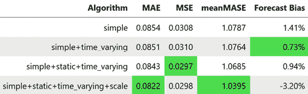

# 第十五章：全球深度学习预测模型策略

在过去的几章中，我们一直在建立时间序列预测的深度学习模型。我们从深度学习的基础开始，了解了不同的构建模块，并实际使用了其中一些构建模块来对一个样本家庭进行预测，最后讨论了注意力和 Transformer。现在，让我们稍微改变方向，看看全球深度学习模型。在*第十章*“全球预测模型”中，我们看到了为什么全球模型是有意义的，还看到了如何在机器学习背景下使用这些模型。我们在实验中甚至得到了良好的结果。在本章中，我们将探讨如何从深度学习的角度应用类似的概念。我们将探讨可以使全球深度学习模型更好运作的不同策略。

在本章中，我们将涵盖以下主要内容：

+   创建全球深度学习预测模型

+   使用时变信息

+   使用静态/元信息

+   使用时间序列的规模

+   平衡采样过程

# 技术要求

你需要按照*前言*中的说明设置**Anaconda**环境，以便获取本书代码所需的所有库和数据集的工作环境。在运行笔记本时，会安装任何额外的库。

你将需要运行这些笔记本：

+   `02-Preprocessing_London_Smart_Meter_Dataset.ipynb`在`Chapter02`

+   `01-Setting_up_Experiment_Harness.ipynb`在`Chapter04`

+   `01-Feature_Engineering.ipynb`在`Chapter06`

本章的相关代码可以在[`github.com/PacktPublishing/Modern-Time-Series-Forecasting-with-Python-/tree/main/notebooks/Chapter15`](https://github.com/PacktPublishing/Modern-Time-Series-Forecasting-with-Python-/tree/main/notebooks/Chapter15)找到。

# 创建全球深度学习预测模型

在*第十章*“全球预测模型”中，我们详细讨论了为什么全球模型是有意义的。我们详细讨论了增加*样本大小*、*跨学习*、*多任务学习*以及与之相关的正则化效应，以及减少的*工程复杂性*的好处。所有这些对深度学习模型同样适用。工程复杂性和样本大小变得更为重要，因为深度学习模型对数据需求量大，并且比其他机器学习模型需要更多的工程工作和训练时间。在深度学习背景下，我认为在大多数需要大规模预测的实际情况中，全球模型是唯一有意义的深度学习范式。

那么，为什么我们要花这么多时间研究单一模型呢？其实，从这个层面上理解概念更容易，而且我们在这个层面获得的技能和知识非常容易转移到全球建模的范式中。在*第十三章*，*时间序列的常见建模模式*中，我们看到如何使用数据加载器从单一时间序列中抽样窗口来训练模型。为了使模型成为一个全球模型，我们需要做的就是改变数据加载器，使其不再从单一时间序列中抽样窗口，而是从多个时间序列中抽样。这个抽样过程可以看作是一个两步走的过程（尽管在实践中我们是一气呵成的，但从直观上讲它是两个步骤）—首先，从需要选择窗口的时间序列中抽样，然后，从该时间序列中抽样窗口。通过这样做，我们正在训练一个单一的深度学习模型来一起预测所有时间序列。

为了让我们的生活更轻松，本文将使用开源库 PyTorch Forecasting 和 Nixtla 的 `neuralforecast`。我们将出于教学目的使用 PyTorch Forecasting，因为它提供了更多的灵活性，但 `neuralforecast` 更为现代且在积极维护，因此更近期的架构将添加到该库中。在*第十六章*中，我们将看到如何使用 `neuralforecast` 进行预测，但现在让我们选择 PyTorch Forecasting 继续前进。

PyTorch Forecasting 旨在使深度学习时间序列预测对于研究和实际应用都变得更加简便。PyTorch Forecasting 还实现了一些最先进的预测架构，我们将在*第十六章*中回顾这些架构，标题为*专用深度学习架构用于预测*。但现在，让我们使用 PyTorch Forecasting 的高级 API。这样可以大大减少我们在准备 `PyTorch` 数据集时的工作量。PyTorch Forecasting 中的 `TimeSeriesDataset` 类处理了许多样板代码，涉及不同的转换、缺失值、填充等问题。在本章中，我们将使用这个框架来探讨实现全球深度学习预测模型的不同策略。

**笔记本提示**：

要完整跟随代码，请使用 `Chapter15` 文件夹中的名为 `01-Global_Deep_Learning_Models.ipynb` 的笔记本。笔记本中有两个变量作为开关—`TRAIN_SUBSAMPLE = True` 会使笔记本仅在 10 个家庭的子集上运行。`train_model = True` 会使笔记本训练不同的模型（警告：在完整数据集上训练模型需要超过 3 小时）。`train_model = False` 会加载训练好的模型权重并进行预测。

## 数据预处理

我们从加载必要的库和数据集开始。我们使用的是在*第六章*中创建的经过预处理和特征工程处理的数据集，*时间序列预测的特征工程*。数据集中有不同种类的特征，为了使我们的特征分配标准化，我们使用`namedtuple`。`namedtuple()`是`collections`中的一个工厂方法，允许你创建带有命名字段的`tuple`子类。这些命名字段可以通过点表示法进行访问。我们这样定义`namedtuple`：

```py
from collections import namedtuple
FeatureConfig = namedtuple(
    "FeatureConfig",
    [
        "target",
        "index_cols",
        "static_categoricals",
        "static_reals",
        "time_varying_known_categoricals",
        "time_varying_known_reals",
        "time_varying_unknown_reals",
        "group_ids"
    ],
) 
```

让我们快速了解一下这些名称的含义：

+   `target`：我们尝试预测的目标的列名。

+   `index_cols`：我们需要将这些列设置为索引，以便快速访问数据。

+   `static_categoricals`：这些列是分类性质的，并且不会随着时间变化。它们是每个时间序列特有的。例如，我们数据集中的*Acorn 组*是`static_categorical`，因为它是分类性质的，并且是一个与家庭相关的值。

+   `static_reals`：这些列是数值型的，并且随着时间的推移不会变化。它们是每个时间序列特有的。例如，我们数据集中的平均能耗是数值型的，且只适用于单个家庭。

+   `time_varying_known_categoricals`：这些列是分类性质的，并且随着时间变化，并且我们知道未来的值。它们可以视为随着时间不断变化的量。一个典型的例子是节假日，它是分类的，且随时间变化，我们知道未来的节假日。

+   `time_varying_known_reals`：这些列是数值型的，会随着时间变化，并且我们知道未来的值。一个典型的例子是温度，它是数值型的，随着时间变化，并且我们知道未来的值（前提是我们获取天气数据的来源也提供了未来天气的预报数据）。

+   `time_varying_unknown_reals`：这些列是数值型的，会随着时间变化，并且我们不知道未来的值。我们尝试预测的目标就是一个很好的例子。

+   `group_ids`：这些列唯一标识数据框中的每个时间序列。

一旦定义好，我们可以为这些名称分配不同的值，如下所示：

```py
feat_config = FeatureConfig(
    target="energy_consumption",
    index_cols=["LCLid", "timestamp"],
    static_categoricals=[
        "LCLid",
        "stdorToU",
        "Acorn",
        "Acorn_grouped",
        "file",
    ],
    static_reals=[],
    time_varying_known_categoricals=[
        "holidays",
        "timestamp_Dayofweek",
    ],
    time_varying_known_reals=["apparentTemperature"],
    time_varying_unknown_reals=["energy_consumption"],
    group_ids=["LCLid"],
) 
```

在`neuralforecast`中，问题设置的方式略有不同，但原理是相同的。我们定义的不同类型的变量在概念上保持一致，只是我们用来定义它们的参数名称不同。PyTorch Forecasting 需要将目标包含在`time_varying_unknown_reals`中，而`neuralforecast`则不需要。这些细微的差异将在我们使用`neuralforecast`生成预测时进行详细说明。

我们可以看到，我们没有像在机器学习模型中那样使用所有特征（*第十章*，*全球预测模型*）。这样做有两个原因：

+   由于我们使用的是顺序深度学习模型，因此我们尝试通过滚动特征等捕捉的许多信息，模型已经能够自动获取。

+   与强大的梯度提升决策树模型不同，深度学习模型对噪声的鲁棒性较差。因此，无关特征会使模型表现变差。

为了使我们的数据集与 PyTorch Forecasting 兼容，有几个预处理步骤是必需的。PyTorch Forecasting 需要一个连续的时间索引作为时间的代理。虽然我们有一个 `timestamp` 列，但它包含的是日期时间。因此，我们需要将其转换为一个新的列 `time_idx`。完整的代码可以在笔记本中找到，但代码的核心思想很简单。我们将训练集和测试集的 DataFrame 合并，并使用 `timestamp` 列中的公式推导出新的 `time_idx` 列。这个公式是这样的：每个连续的时间戳递增 1，并且在 `train` 和 `test` 之间保持一致。例如，`train` 中最后一个时间步的 `time_idx` 是 `256`，而 `test` 中第一个时间步的 `time_idx` 将是 `257`。此外，我们还需要将类别列转换为 `object` 数据类型，以便与 PyTorch Forecasting 中的 `TimeSeriesDataset` 良好配合。

对于我们的实验，我们选择了 2 天（96 个时间步）作为窗口，并预测一个时间步的未来。为了启用提前停止，我们还需要一个验证集。**提前停止**是一种正则化方法（防止过拟合的技术，*第五章*），它通过监控验证损失，当验证损失开始上升时停止训练。我们选择了训练的最后一天（48 个时间步）作为验证数据，并选择了 1 个月作为最终测试数据。但在准备这些 DataFrame 时，我们需要注意一些问题：我们选择了两天作为历史数据，而为了预测验证集或测试集中的第一个时间步，我们需要将过去两天的历史数据一同考虑进去。因此，我们按照下图所示的方式划分 DataFrame（具体代码在笔记本中）：


图 15.1：训练-验证-测试集划分

现在，在使用 `TimeSeriesDataset` 处理我们的数据之前，让我们先了解它的作用以及涉及的不同参数。

## 理解 PyTorch Forecasting 中的 TimeSeriesDataset

`TimeSeriesDataset` 自动化以下任务及更多：

+   对数值特征进行缩放并编码类别特征：

    +   对数值特征进行缩放，使其具有相同的均值和方差，有助于基于梯度下降的优化方法更快且更好地收敛。

    +   类别特征需要编码为数字，以便我们能够在深度学习模型中正确处理它们。

+   归一化目标变量：

    +   在全局模型上下文中，目标变量对于不同的时间序列可能具有不同的尺度。例如，某个家庭通常有较高的能源消耗，而其他一些家庭可能是空置的，几乎没有能源消耗。将目标变量缩放到一个单一的尺度有助于深度学习模型专注于学习模式，而不是捕捉尺度上的方差。

+   高效地将 DataFrame 转换为 PyTorch 张量字典：

    +   数据集还会接受关于不同列的信息，并将 DataFrame 转换为 PyTorch 张量的字典，分别处理静态信息和随时间变化的信息。

这些是`TimeSeriesDataset`的主要参数：

+   `data`：这是包含所有数据的 pandas DataFrame，每一行通过`time_idx`和`group_ids`进行唯一标识。

+   `time_idx`：这指的是我们之前创建的连续时间索引的列名。

+   `target`、`group_ids`、`static_categoricals`、`static_reals`、`time_varying_known_categoricals`、`time_varying_known_reals`、`time_varying_unknown_categoricals` 和 `time_varying_unknown_reals`：我们已经在*数据预处理*部分讨论过所有这些参数，它们的含义相同。

+   `max_encoder_length`：设置给定编码器的最大窗口长度。

+   `min_decoder_length`：设置解码上下文中给定的最小窗口长度。

+   `target_normalizer`：这是一个 Transformer，用于对目标进行标准化。PyTorch Forecasting 内置了几种标准化器——`TorchNormalizer`、`GroupNormalizer`和`EncoderNormalizer`。`TorchNormalizer`对整个目标进行标准化和鲁棒性缩放，而`GroupNormalizer`则对每个组分别进行相同的处理（组是由`group_ids`定义的）。`EncoderNormalizer`在运行时根据每个窗口中的值进行标准化。

+   `categorical_encoders`：该参数接受一个字典，字典中的值是 scikit-learn 的 Transformer，作为类别编码器。默认情况下，类别编码类似于`LabelEncoder`，它将每个独特的类别值替换为一个数字，并为未知值和`NaN`值添加额外的类别。

完整文档请参阅 [`pytorch-forecasting.readthedocs.io/en/stable/data.html#time-series-data-set`](https://pytorch-forecasting.readthedocs.io/en/stable/data.html#time-series-data-set)。

### 初始化 TimeSeriesDataset

现在我们知道了主要参数，接下来用我们的数据初始化一个时间序列数据集：

```py
training = TimeSeriesDataSet(
    train_df,
    time_idx="time_idx",
    target=feat_config.target,
    group_ids=feat_config.group_ids,
    max_encoder_length=max_encoder_length,
    max_prediction_length=max_prediction_length,
    time_varying_unknown_reals=[
        "energy_consumption",
    ],
    target_normalizer=GroupNormalizer(
        groups=feat_config.group_ids, transformation=None
    )
) 
```

请注意，我们使用了`GroupNormalizer`，使得每个家庭根据其自身的均值和标准差分别进行缩放，使用的是以下著名的公式：


`TimeSeriesDataset`还使得声明验证和测试数据集变得更加容易，通过工厂方法`from_dataset`。它接受另一个时间序列数据集作为参数，并使用相同的参数、标准化器等，创建新的数据集：

```py
# Defining the validation dataset with the same parameters as training
validation = TimeSeriesDataSet.from_dataset(training, pd.concat([val_history,val_df]).reset_index(drop=True), stop_randomization=True)
# Defining the test dataset with the same parameters as training
test = TimeSeriesDataSet.from_dataset(training, pd.concat([hist_df, test_df]).reset_index(drop=True), stop_randomization=True) 
```

请注意，我们将历史数据连接到`val_df`和`test_df`中，以确保可以在整个验证和测试期间进行预测。

### 创建数据加载器

剩下的工作就是从`TimeSeriesDataset`创建数据加载器：

```py
train_dataloader = training.to_dataloader(train=True, batch_size=batch_size, num_workers=0)
val_dataloader = validation.to_dataloader(train=False, batch_size=batch_size, num_workers=0) 
```

在我们继续之前，让我们通过一个示例巩固我们对 PyTorch Forecasting 数据加载器的理解。我们刚创建的`train`数据加载器已经将数据框拆分成了一个 PyTorch 张量的字典。我们选择了`512`作为批次大小，并可以使用以下代码检查数据加载器：

```py
# Testing the dataloader
x, y = next(iter(train_dataloader))
print("\nsizes of x =")
for key, value in x.items():
    print(f"\t{key} = {value.size()}")
print("\nsize of y =")
print(f"\ty = {y[0].size()}") 
```

我们将得到如下的输出：


图 15.2：批量数据加载器中张量的形状

我们可以看到，数据加载器和`TimeSeriesDataset`已经将数据框拆分为 PyTorch 张量，并将它们打包进一个字典中，编码器和解码器序列被分开。我们还可以看到，类别特征和连续特征也被分开了。

我们将使用这个字典中的主要*键*是`encoder_cat`、`encoder_cont`、`decoder_cat`和`decoder_cont`。`encoder_cat`和`decoder_cat`这两个键的维度为零，因为我们没有声明任何类别特征。

### 可视化数据加载器的工作原理

让我们尝试更深入地剖析这里发生了什么，并通过视觉化的方式理解`TimeSeriesDataset`所做的事情：


图 15.3：TimeSeriesDataset——它是如何工作的示意图

假设我们有一个时间序列，*x*[1] 到 *x*[6]（这将是目标以及`TimeSeriesDataset`术语中的`time_varying_unknown`）。我们有一个时间变化的实数，*f*[1] 到 *f*[6]，和一个时间变化的类别，*c*[1] 到 *c*[2]。除此之外，我们还拥有一个静态实数，*r*，和一个静态类别，*s*。如果我们将编码器和解码器的长度设置为`3`，那么我们将得到如*图 15.3*所示的张量。请注意，静态类别和实数在所有时间步长上都被重复。这些不同的张量构造是为了让模型的编码器能够使用编码器张量进行训练，而解码器张量则在解码过程中使用。

现在，让我们开始构建我们的第一个全局模型。

## 构建第一个全局深度学习预测模型

PyTorch Forecasting 使用 PyTorch 和 PyTorch Lightning 在后台定义和训练深度学习模型。可以与 PyTorch Forecasting 无缝配合使用的模型本质上是 PyTorch Lightning 模型。然而，推荐的做法是从 PyTorch Forecasting 继承 `BaseModel`。PyTorch Forecasting 的开发者提供了出色的文档和教程，帮助新用户按照自己的需求使用它。这里值得一提的一个教程名为 *如何使用自定义数据并实现自定义模型和指标*（链接在 *进一步阅读* 部分）。

我对教程中的基础模型做了一些修改，使其更加灵活。实现代码可以在 `src/dl/ptf_models.py` 文件中找到，名为 `SingleStepRNNModel`。该类接收两个参数：

+   `network_callable`：这是一个可调用对象，当初始化时，它将成为一个 PyTorch 模型（继承自 `nn.Module`）。

+   `model_params`：这是一个字典，包含初始化 `network_callable` 所需的所有参数。

结构相当简单。`__init__` 函数将 `network_callable` 初始化为一个 PyTorch 模型，并将其存储在 `network` 属性下。`forward` 函数将输入传递给网络，格式化返回的输出，使其符合 PyTorch Forecasting 的要求，并返回结果。这个模型非常简短，因为大部分工作都由 `BaseModel` 完成，它负责处理损失计算、日志记录、梯度下降等任务。我们通过这种方式定义模型的好处是，现在我们可以定义标准的 PyTorch 模型，并将其传递给这个模型，使其能够与 PyTorch Forecasting 配合得很好。

除此之外，我们还定义了一个抽象类 `SingleStepRNN`，它接收一组参数并初始化由这些参数指定的相应网络。如果参数指定了一个两层的 LSTM，那么它将会被初始化，并保存在 `rnn` 属性下。它还在 `fc` 属性下定义了一个全连接层，将 RNN 的输出转化为预测结果。`forward` 方法是一个抽象方法，任何继承该类的子类都需要重写这个方法。

### 定义我们的第一个 RNN 模型

现在我们已经完成了必要的设置，让我们定义第一个继承 `SingleStepRNN` 类的模型：

```py
class SimpleRNNModel(SingleStepRNN):
    def __init__(
        self,
        rnn_type: str,
        input_size: int,
        hidden_size: int,
        num_layers: int,
        bidirectional: bool,
    ):
        super().__init__(rnn_type, input_size, hidden_size, num_layers, bidirectional)
    def forward(self, x: Dict):
        # Using the encoder continuous which has the history window
        x = x["encoder_cont"] # x --> (batch_size, seq_len, input_size)
        # Processing through the RNN
        x, _ = self.rnn(x)  # --> (batch_size, seq_len, hidden_size)
        # Using a FC layer on last hidden state
        x = self.fc(x[:,-1,:])  # --> (batch_size, seq_len, 1)
        return x 
```

这是最直接的实现方式。我们从字典中取出 `encoder_cont`，并将其传递给 RNN，然后在 RNN 的最后一个隐藏状态上使用全连接层来生成预测。如果我们以 *图 15.3* 中的示例为例，我们使用 *x*[1] 到 *x*[3] 作为历史数据，并训练模型预测 *x*[4]（因为我们使用了 `min_decoder_length=1`，所以解码器和目标中只有一个时间步）。

### 初始化 RNN 模型

现在，让我们使用一些参数初始化模型。我为参数定义了两个字典：

+   `model_params`：这包含了初始化 `SingleStepRNN` 模型所需的所有参数。

+   `other_params`：这些是我们传递给`SingleStepRNNModel`的所有参数，如`learning_rate`、`loss`等。

现在，我们可以使用 PyTorch Forecasting 模型支持的工厂方法`from_dataset`进行初始化。这个工厂方法允许我们传入数据集，并从数据集中推断一些参数，而不需要每次都填入所有内容：

```py
model = SingleStepRNNModel.from_dataset(
    training,
    network_callable=SimpleRNNModel,
    model_params=model_params,
    **other_params
) 
```

### 训练 RNN 模型

训练模型就像我们在前几章中所做的那样，因为这是一个 PyTorch Lightning 模型。我们可以按照以下步骤进行：

1.  使用早期停止和模型检查点初始化训练器：

    ```py
    trainer = pl.Trainer(
        auto_select_gpus=True,
        gpus=-1,
        min_epochs=1,
        max_epochs=20,
        callbacks=[
            pl.callbacks.EarlyStopping(monitor="val_loss", patience=4*3),
            pl.callbacks.ModelCheckpoint(
                monitor="val_loss", save_last=True, mode="min", auto_insert_metric_name=True
            ),
        ],
        val_check_interval=2000,
        log_every_n_steps=2000,
    ) 
    ```

1.  拟合模型：

    ```py
    trainer.fit(
        model,
        train_dataloaders=train_dataloader,
        val_dataloaders=val_dataloader,
    ) 
    ```

1.  训练完成后加载最佳模型：

    ```py
    best_model_path = trainer.checkpoint_callback.best_model_path
    best_model = SingleStepRNNModel.load_from_checkpoint(best_model_path) 
    ```

训练可能需要一些时间。为了节省您的时间，我已包含了我们使用的每个模型的训练权重，如果`train_model`标志为`False`，则会跳过训练并加载保存的权重。

### 使用训练好的模型进行预测

现在，训练完成后，我们可以在`test`数据集上进行预测，方法如下：

```py
pred, index = best_model.predict(test, return_index=True, show_progress_bar=True) 
```

我们将预测结果存储在一个 DataFrame 中，并使用我们的标准指标进行评估：`MAE`、`MSE`、`meanMASE`和`Forecast Bias`。让我们看看结果：


图 15.4：使用基线全局模型汇总结果

这是一个不太好的模型，因为我们从*第十章*《*全局预测模型*》中知道，基线全局模型使用 LightGBM 的结果如下：

+   MAE = 0.079581

+   MSE = 0.027326

+   meanMASE = 1.013393

+   预测偏差 = 28.718087

除了预测偏差，我们的全局模型与最佳模型相差甚远。我们将**全局机器学习模型**称为**GFM**(**ML**)，将当前模型称为**GFM**(**DL**)，并在接下来的讨论中使用这两个术语。现在，让我们开始探索一些策略，改善全局模型。

# 使用时变信息

GFM(ML)使用了所有可用的特征。因此，显然，该模型比我们目前构建的 GFM(DL)访问了更多的信息。我们刚刚构建的 GFM(DL)只使用了历史数据，其他的都没有。让我们通过加入时变信息来改变这一点。这次我们只使用时变的真实特征，因为处理类别特征是我希望留到下一节讨论的话题。

我们以与之前相同的方式初始化训练数据集，但在初始化参数中加入了`time_varying_known_reals=feat_config.time_varying_known_reals`。现在我们已经创建了所有数据集，让我们继续设置模型。

为了设置模型，我们需要理解一个概念。我们现在使用目标的历史数据和时变已知特征。在*图 15.3*中，我们看到`TimeSeriesDataset`如何将不同类型的变量安排成 PyTorch 张量。在上一节中，我们只使用了`encoder_cont`，因为没有其他变量需要考虑。但现在，我们有了时变变量，这增加了复杂性。如果我们退一步思考，在单步预测的上下文中，我们可以看到时变变量和目标的历史数据不能具有相同的时间步。

让我们使用一个视觉示例来阐明：


图 15.5：使用时变变量进行训练

延续*图 15.3*示例的精神，但将其简化以适应我们的上下文，我们有一个时间序列，*x*[1] 到 *x*[4]，以及一个时变的真实变量，*f*[1] 到 *f*[4]。所以，对于`max_encoder_length=3`和`min_decoder_length=1`，我们会让`TimeSeriesDataset`生成张量，如*图 15.5*中的*步骤 1*所示。

现在，对于每个时间步，我们有时变变量*f*和历史数据*x*在`encoder_cont`中。时变变量*f*是我们也知道未来值的变量，因此对该变量没有因果约束。这意味着对于预测时间步*t*，我们可以使用*f*[t]，因为它是已知的。然而，目标变量的历史数据则不是。我们无法知道未来的值，因为它正是我们想要预测的量。这意味着*x*上有因果约束，因此我们不能使用*x*[t]来预测时间步*t*。但是目前张量的形成方式是，*f*和*x*在时间步上是对齐的，如果我们将它们输入到模型中，就相当于作弊，因为我们会使用*x*[t]来预测时间步*t*。理想情况下，历史数据*x*和时变特征*f*之间应该有一个偏移量，这样在时间步*t*时，模型看到的是*x*[t][-1]，然后看到*f*[t]，然后预测*x*[t]。

为了实现这一点，我们执行以下操作：

1.  将`encoder_cont`和`decoder_cont`连接起来，因为我们需要使用*f*[4]来预测时间步*t* = 4（*图 15.5*中的*步骤 2*）。

1.  将目标历史数据*x*向前移动一个时间步，使得*f*[t]和*x*[t][-1]对齐（*图 15.5*中的*步骤 3*）。

1.  去掉第一个时间步，因为我们没有与第一个时间步相关的历史数据（在*图 15.5*中的*步骤 4*）。

这正是我们在新模型`DynamicFeatureRNNModel`的`forward`方法中需要实现的内容：

```py
def forward(self, x: Dict):
    # Step 2 in Figure 15.5
    x_cont = torch.cat([x["encoder_cont"],x["decoder_cont"]], dim=1)
    # Step 3 in Figure 15.5
    x_cont[:,:,-1] = torch.roll(x_cont[:,:,-1], 1, dims=1)
    x = x_cont
    # Step 4 in Figure 15.5
    x = x[:,1:,:] # x -> (batch_size, seq_len, input_size)
    # Processing through the RNN
    x, _ = self.rnn(x)  # --> (batch_size, seq_len, hidden_size)
    # Using a FC layer on last hidden state
    x = self.fc(x[:,-1,:])  # --> (batch_size, seq_len, 1)
    return x 
```

现在，让我们训练这个新模型，看看它的表现。具体的代码在笔记本中，和之前完全相同：


图 15.6：使用时变特征汇总结果

看起来温度作为特征确实使模型稍微改善了一些，但还有很长的路要走。别担心，我们还有其他特征可以使用。

# 使用静态/元信息

有些特征，如橡子组、是否启用动态定价等，特定于某个家庭，这将帮助模型学习特定于这些组的模式。自然地，包含这些信息是有直觉意义的。

然而，正如我们在*第十章*《*全球预测模型*》中讨论的，分类特征与机器学习模型的配合不太好，因为它们不是数值型的。在那一章中，我们讨论了几种将分类特征编码为数值表示的方法。这些方法同样适用于深度学习模型。但有一种处理分类特征的方法是深度学习模型特有的——**嵌入向量**。

## 独热编码及其为何不理想

将分类特征转换为数值表示的方法之一是独热编码。它将分类特征编码为一个更高维度，将分类值等距地放置在该空间中。它需要的维度大小等于分类变量的基数。有关独热编码的详细讨论，请参阅*第十章*《*全球预测模型*》。

在对分类特征进行独热编码后，我们得到的表示被称为**稀疏表示**。如果分类特征的基数（唯一值的数量）是*C*，那么每一行代表分类特征的一个值时，将有*C* - 1 个零。因此，该表示大部分是零，因此称为稀疏表示。这导致有效编码一个分类特征所需的总体维度等于向量的基数。因此，对一个拥有 5,000 个唯一值的分类特征进行独热编码会立刻给你要解决的问题添加 5,000 个维度。

除此之外，独热编码也是完全没有信息的。它将每个分类值放置在相等的距离之内，而没有考虑这些值之间可能的相似性。例如，如果我们要对一周的每一天进行编码，独热编码会将每一天放在一个完全不同的维度中，使它们彼此之间距离相等。但如果我们仔细想想，周六和周日应该比其他工作日更接近，因为它们是周末，对吧？这种信息在独热编码中并没有被捕捉到。

## 嵌入向量和密集表示

嵌入向量是一种类似的表示方式，但它不是稀疏表示，而是努力为我们提供类别特征的密集表示。我们可以通过使用嵌入层来实现这一点。嵌入层可以被视为每个类别值与一个数值向量之间的映射，而这个向量的维度可以远小于类别特征的基数。唯一剩下的问题是“*我们怎么知道为每个类别值选择哪个向量？*”

好消息是我们不需要知道，因为嵌入层与网络的其余部分一起训练。因此，在训练模型执行某项任务时，模型会自动找出每个类别值的最佳向量表示。这种方法在自然语言处理领域非常流行，在那里数千个单词被嵌入到维度只有 200 或 300 的空间中。在 PyTorch 中，我们可以通过使用`nn.Embedding`来实现这一点，它是一个简单的查找表，存储固定离散值和大小的嵌入。

初始化时有两个必需的参数：

+   `num_embeddings`：这是嵌入字典的大小。换句话说，这是类别特征的基数。

+   `embedding_dim`：这是每个嵌入向量的大小。

现在，让我们回到全局建模。首先介绍静态类别特征。请注意，我们还包括了时间变化的类别特征，因为现在我们已经知道如何在深度学习模型中处理类别特征。初始化数据集的代码是一样的，只是添加了以下两个参数：

+   `static_categoricals=feat_config.static_categoricals`

+   `time_varying_known_categoricals=feat_config.time_varying_known_categoricals`

## 定义带有类别特征的模型

现在我们有了数据集，让我们看看如何在新模型`StaticDynamicFeatureRNNModel`中定义`__init__`函数。除了调用父模型来设置标准的 RNN 和全连接层外，我们还使用输入`embedding_sizes`设置嵌入层。`embedding_sizes`是一个包含每个类别特征的元组列表（*基数和嵌入大小*）：

```py
def __init__(
    self,
    rnn_type: str,
    input_size: int,
    hidden_size: int,
    num_layers: int,
    bidirectional: bool,
    embedding_sizes = []
):
    super().__init__(rnn_type, input_size, hidden_size, num_layers, bidirectional)
    self.embeddings = torch.nn.ModuleList(
        [torch.nn.Embedding(card, size) for card, size in embedding_sizes]
    ) 
```

我们使用`nn.ModuleList`来存储`nn.Embedding`模块的列表，每个类别特征一个。在初始化该模型时，我们需要提供`embedding_sizes`作为输入。每个类别特征所需的嵌入大小在技术上是一个超参数，我们可以进行调优。但是有一些经验法则可以帮助你入门。这些经验法则的核心思想是，类别特征的基数越大，编码这些信息所需的嵌入大小也越大。此外，嵌入大小可以远小于类别特征的基数。我们采用的经验法则如下：


因此，我们使用以下代码创建`embedding_sizes`元组列表：

```py
# Finding the cardinality using the categorical encoders in the dataset
cardinality = [len(training.categorical_encoders[c].classes_) for c in training.categoricals]
# using the cardinality list to create embedding sizes
embedding_sizes = [
    (x, min(50, (x + 1) // 2))
    for x in cardinality
] 
```

现在，转向`forward`方法，它将类似于之前的模型，但增加了一个部分来处理类别特征。我们本质上使用嵌入层将类别特征转换为嵌入，并将它们与连续特征拼接在一起：

```py
def forward(self, x: Dict):
    # Using the encoder and decoder sequence
    x_cont = torch.cat([x["encoder_cont"],x["decoder_cont"]], dim=1)
    # Roll target by 1
    x_cont[:,:,-1] = torch.roll(x_cont[:,:,-1], 1, dims=1)
    # Combine the encoder and decoder categoricals
    cat = torch.cat([x["encoder_cat"],x["decoder_cat"]], dim=1)
    # if there are categorical features
    if cat.size(-1)>0:
        # concatenating all the embedding vectors
        x_cat = torch.cat([emb(cat[:,:,i]) for i, emb in enumerate(self.embeddings)], dim=-1)
        # concatenating continuous and categorical
        x = torch.cat([x_cont, x_cat], dim=-1)
    else:
        x = x_cont
    # dropping first timestep
    x = x[:,1:,:] # x --> (batch_size, seq_len, input_size)
    # Processing through the RNN
    x, _ = self.rnn(x)  # --> (batch_size, seq_len, hidden_size)
    # Using a FC layer on last hidden state
    x = self.fc(x[:,-1,:])  # --> (batch_size, seq_len, 1)
    return x 
```

现在，让我们用静态特征来训练这个新模型，并看看它的表现如何：


图 15.7：使用静态和时间变化特征的汇总结果

添加静态变量也改善了我们的模型。现在，让我们来看另一种策略，它向模型添加了一个关键的信息。

# 使用时间序列的规模

我们在`TimeSeriesDataset`中使用了`GroupNormlizer`来对每个家庭进行缩放，使用它们各自的均值和标准差。这样做是因为我们希望使目标具有零均值和单位方差，以便模型不必浪费精力调整其参数来捕捉单个家庭消费的规模。虽然这是一种很好的策略，但我们确实在这里丢失了一些信息。可能有一些模式是特定于消费较大家庭的，而另外一些模式则是特定于消费较少的家庭的。但现在，这些模式被混在一起，模型试图学习共同的模式。在这种情况下，这些独特的模式对模型来说就像噪音一样，因为没有变量来解释它们。

关键是我们移除的尺度中包含了信息，将这些信息加回来将会是有益的。那么，我们该如何加回来呢？绝对不是通过包括未缩放的目标，这样会带回我们一开始想要避免的缺点。实现这一点的一种方式是将尺度信息作为静态真实特征添加到模型中。当我们最初进行缩放时，我们会记录每个家庭的均值和标准差（因为我们需要它们进行反向变换，并恢复原始目标）。我们需要做的就是确保将它们作为静态真实变量包含在内，这样模型在学习时间序列数据集中的模式时就能访问到尺度信息。

PyTorch Forecasting 通过在`TimeSeriesDataset`中提供一个方便的参数`add_target_scales`，使这变得更简单。如果将其设置为`True`，那么`encoder_cont`和`decoder_cont`也将包含各个时间序列的均值和标准差。

我们现有的模型没有变化；我们只需要在初始化时将这个参数添加到`TimeSeriesDataset`中，然后使用模型进行训练和预测。让我们看看它是如何为我们工作的：



图 15.8：使用静态、时间变化和尺度特征的聚合结果

尺度信息再次改善了模型。有了这些，我们来看看本书最后将讨论的一种策略。

# 平衡采样过程

我们已经看到了几种通过添加新特征类型来改进全球深度学习模型的策略。现在，让我们看一下全球建模上下文中相关的另一个方面。在前面的章节中，当我们谈到全球深度学习模型时，我们讨论了将一个序列窗口采样输入模型的过程可以被看作是一个两步过程：

1.  从一组时间序列中采样一个时间序列。

1.  从时间序列中采样一个窗口。

让我们用一个类比来使这个概念更清晰。想象我们有一个大碗，里面填满了*N*个球。碗中的每个球代表数据集中的一个时间序列（我们数据集中的一个家庭）。现在，每个球，*i*，都有*M*[i]张纸片，表示我们可以从中抽取的所有不同样本窗口。

在我们默认使用的批量采样中，我们打开所有的球，将所有纸片倒入碗中，然后丢弃这些球。现在，闭上眼睛，我们从碗中随机挑选*B*张纸片，将它们放到一边。这就是我们从数据集中采样的一个批次。我们没有任何信息来区分纸片之间的差异，所以抽到任何纸片的概率是相等的，这可以表示为：


现在，让我们在数据类比中加入一些内容。我们知道，时间序列有不同的种类——不同的长度、不同的消费水平等等。我们选择其中一个方面，即序列的长度，作为我们的例子（尽管它同样适用于其他方面）。所以，如果我们将时间序列的长度离散化，我们就会得到不同的区间；我们为每个区间分配一个颜色。现在，我们有*C*种不同颜色的球在碗里，纸片也会按相应的颜色来标记。

在我们当前的采样策略中（我们将所有纸片都倒入碗中，并随机抽取*B*张纸片），我们最终会在一个批次中复制碗的概率分布。可以理解的是，如果碗中包含更多的长时间序列而不是短时间序列，那么我们抽到的纸片也会偏向于这一点。因此，批次也会偏向长时间序列。那会发生什么呢？

在小批量随机梯度下降（我们在*第十一章*，《深度学习导论》中看到过）中，我们在每个小批次后进行一次梯度更新，并使用该梯度来更新模型参数，从而使得模型更接近损失函数的最小值。因此，如果一个小批次偏向某一类型的样本，那么梯度更新将会偏向一个对这些样本效果更好的解。这和不平衡学习有着很好的类比。较长的时间序列和较短的时间序列可能有不同的模式，而这种采样不平衡导致模型学到的模式可能对长时间序列效果较好，而对短时间序列的效果不太理想。

## 可视化数据分布

我们计算了每个家庭的长度（`LCLid`），并将它们分到 10 个区间中——`bin_0`代表最短的区间，`bin_9`代表最长的区间：

```py
n_bins= 10
# Calculating the length of each LCLid
counts = train_df.groupby("LCLid")['timestamp'].count()
# Binning the counts and renaming
out, bins = pd.cut(counts, bins=n_bins, retbins=True)
out = out.cat.rename_categories({
    c:f"bin_{i}" for i, c in enumerate(out.cat.categories)
}) 
```

让我们可视化原始数据中区间的分布：


图 15.9：时间序列长度分布

我们可以看到，`bin_5`和`bin_6`是最常见的长度，而`bin_0`是最不常见的。现在，让我们从数据加载器中获取前 50 个批次，并将它们绘制为堆叠柱状图，以检查每个批次的分布：


图 15.10：批次分布的堆叠柱状图

我们可以看到，在批次分布中，和*图 15.9*中看到的相同的分布也得到了复现，`bin_5`和`bin_6`占据了领先位置。`bin_0`几乎没有出现，而在`bin_0`中的 LCLid 将不会被学得很好。

## 调整采样过程

那么接下来我们该怎么办？让我们暂时进入一个装有纸条的碗的类比。我们在随机挑选一个球，结果发现分布和原始的颜色分布完全一致。因此，为了让批次中的颜色分布更加平衡，我们需要按不同的概率从不同颜色的纸条中抽取。换句话说，我们应该从原始分布中低频的颜色上抽取更多，而从占主导地位的颜色中抽取更少。

让我们从另一个角度来看选择碗中筹码的过程。我们知道选择碗中每个筹码的概率是相等的。所以，另一种选择筹码的方法是使用均匀随机数生成器。我们从碗中抽取一个筹码，生成一个介于 0 和 1 之间的随机数（*p*），如果随机数小于 0.5（*p* < 0.5），则选择该筹码。所以，我们选择或拒绝筹码的概率是相等的。我们继续进行，直到得到*B*个样本。虽然这个过程比前一个过程稍微低效一些，但它与原始过程非常接近。这里的优势在于，我们现在有了一个阈值，可以调整我们的采样以适应需求。较低的阈值使得在该采样过程中更难接受筹码，而较高的阈值则使其更容易被接受。

现在我们有了一个可以调整采样过程的阈值，我们需要做的就是找到每个筹码的合适阈值，以便最终的批次能够均匀地代表所有颜色。

换句话说，我们需要找到并为每个 LCLid 分配正确的权重，以使最终的批次能够均匀分布所有长度区间。

我们该如何做呢？有一个非常简单的策略。我们希望对于样本多的长度区间，权重较低；对于样本少的长度区间，权重较高。我们可以通过取每个区间样本数量的倒数来得到这种权重。如果一个区间中有*C*个 LCLid，则该区间的权重可以是 1/*C*。*进一步阅读*部分有一个链接，您可以通过它了解更多关于加权随机采样和为此目的使用的不同算法。

`TimeSeriesDataset`有一个内部索引，这是一个包含它可以从数据集抽取的所有样本的 DataFrame。我们可以使用它来构建我们的权重数组：

```py
# TimeSeriesDataset stores a df as the index over which it samples
df = training.index.copy()
# Adding a bin column to it to represent the bins we have created
df['bins'] = [f"bin_{i}" for i in np.digitize(df["count"].values, bins)]
# Calculate Weights as inverse counts of the bins
weights = 1/df['bins'].value_counts(normalize=True)
# Assigning the weights back to the df so that we have an array of
# weights in the same shape as the index over which we are going to sample
weights = weights.reset_index().rename(columns={"index":"bins", "bins":"weight"})
df = df.merge(weights, on='bins', how='left')
probabilities = df.weight.values 
```

这样可以确保`probabilities`数组的长度与`TimeSeriesDataset`进行采样时的内部索引长度一致，这是使用这种技术时的强制要求——每个可能的窗口应该有一个对应的权重。

现在我们有了这个权重，有一个简单的方法可以将其付诸实践。我们可以使用 PyTorch 中的`WeightedRandomSampler`，它是专门为此目的创建的：

```py
from torch.utils.data import WeightedRandomSampler
sampler = WeightedRandomSampler(probabilities, len(probabilities)) 
```

## 使用并可视化带有`WeightedRandomSampler`的 dataloader

现在，我们可以在我们从`TimeSeriesDataset`创建的 dataloader 中使用这个采样器：

```py
train_dataloader = training.to_dataloader(train=True, batch_size=batch_size, num_workers=0, sampler=sampler) 
```

让我们像之前一样可视化前 50 个批次，看看有什么不同：


图 15.11：带有加权随机采样的批次分布堆叠柱状图

现在，我们可以看到每个批次中更均匀的区间分布。让我们也看看使用这个新 dataloader 训练模型后的结果：


图 15.12：使用静态、时间变化和规模特征以及批量采样器聚合结果

看起来，采样器在所有指标上对模型的改进都很大，除了`预测偏差`之外。虽然我们没有比 GFM(ML)（它的 MAE 为 0.079581）取得更好的结果，但我们已经足够接近了。也许通过一些超参数调整、数据划分或更强的模型，我们能够更接近那个数值，或者可能不能。我们使用了自定义采样选项，使得每批数据中的时间序列长度保持平衡。我们可以使用相同的技术在其他方面进行平衡，比如消费水平、地区，或任何其他相关的方面。像机器学习中的所有事情一样，我们需要通过实验来确定一切，而我们需要做的就是根据问题陈述形成假设，并构建实验来验证这个假设。

至此，我们已完成又一章以实践为主（且计算量大）的内容。恭喜你顺利完成本章；如果有任何概念尚未完全理解，随时可以回去查阅。

# 小结

在过去几章中，我们已经打下了深度学习模型的坚实基础，现在开始探讨在深度学习模型背景下的全球模型新范式。我们学习了如何使用 PyTorch Forecasting，这是一个用于深度学习预测的开源库，并利用功能丰富的`TimeSeriesDataset`开始开发自己的模型。

我们从一个非常简单的 LSTM 开始，在全球背景下看到了如何将时间变化信息、静态信息和单个时间序列的规模添加到特征中，以改善模型性能。最后，我们讨论了交替采样程序，它帮助我们在每个批次中提供问题的更平衡视图。本章绝不是列出所有使预测模型更好的技术的详尽清单。相反，本章旨在培养一种正确的思维方式，这是在自己模型上工作并使其比之前更好地运行所必需的。

现在，我们已经建立了深度学习和全球模型的坚实基础，是时候在下一章中探索一些多年来为时间序列预测提出的专用深度学习架构了。

# 进一步阅读

你可以查阅以下资料进行进一步阅读：

+   *如何使用自定义数据并实现自定义模型和指标*（PyTorch Forecasting）：[`pytorch-forecasting.readthedocs.io/en/stable/tutorials/building.html`](https://pytorch-forecasting.readthedocs.io/en/stable/tutorials/building.html)

+   《数据库中的随机抽样》作者：Frank Olken，第 22-23 页：[`dsf.berkeley.edu/papers/UCB-PhD-olken.pdf`](https://dsf.berkeley.edu/papers/UCB-PhD-olken.pdf)

# 加入我们在 Discord 上的社区

加入我们社区的 Discord 空间，与作者和其他读者进行讨论：

[`packt.link/mts`](https://packt.link/mts)


