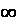
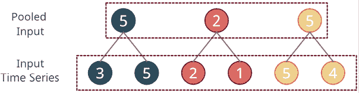
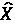

# 第十六章：专用深度学习架构用于预测

我们在**深度学习**（**DL**）世界中的旅程即将结束。在上一章中，我们介绍了全球预测范式，并看到如何使一个简单的模型，如**递归神经网络**（**RNN**），表现接近全球机器学习模型设定的高基准。在本章中，我们将回顾一些专门为时间序列预测设计的流行深度学习架构。借助这些更复杂的模型架构，我们将更好地应对现实世界中需要比普通 RNN 和 LSTM 更强大模型的问题。

在本章中，我们将涵盖以下主要主题：

+   对专用架构的需求

+   NeuralForecast 简介

+   可解释的时间序列预测的神经基础扩展分析

+   带外生变量的可解释的时间序列预测的神经基础扩展分析

+   用于时间序列预测的神经层次插值

+   Autoformer

+   LTSF-Linear 家族

+   补丁时间序列预测

+   iTransformer

+   时序融合变换器

+   TSMixer

+   时间序列密集编码器

# 技术要求

你需要按照*前言*中的说明设置 Anaconda 环境，以获取包含本书代码所需的所有包和数据集的工作环境。

本章相关的代码可以在[`github.com/PacktPublishing/Modern-Time-Series-Forecasting-with-Python/tree/main/notebooks/Chapter16`](https://github.com/PacktPublishing/Modern-Time-Series-Forecasting-with-Python/tree/main/notebooks/Chapter16)找到。

你需要运行以下笔记本文件来进行本章学习：

+   `02-Preprocessing_London_Smart_Meter_Dataset.ipynb` 在 `Chapter02`

+   `01-Setting_up_Experiment_Harness.ipynb` 在 `Chapter04`

+   `01-Feature_Engineering.ipynb` 在 `Chapter06`

# 对专用架构的需求

偏倚归纳（或学习偏倚）指的是学习算法在将其在训练数据上学到的函数推广到未见数据时所做的一系列假设。偏倚归纳本身并不是一件坏事，它不同于学习理论中的“偏倚”和“方差”中的“偏倚”。我们通过模型架构或特征工程来使用和设计偏倚归纳。例如，**卷积神经网络**（**CNN**）在图像上表现优于标准的**前馈神经网络**（**FFN**）在纯像素输入上的表现，因为 CNN 具有 FFN 所没有的局部性和空间偏倚。虽然 FFN 理论上是一个通用逼近器，但我们可以利用 CNN 所具有的偏倚归纳来学习更好的模型。

深度学习被认为是一种完全数据驱动的方法，特征工程和最终任务都是端到端学习的，从而避免了模型设计者在特征设计时所植入的归纳偏差。但这种看法并不完全正确。过去通过特征引入的归纳偏差，如今通过架构设计的方式融入其中。每种深度学习架构都有自己的归纳偏差，这就是为什么某些类型的模型在某些类型的数据上表现更好。例如，卷积神经网络（CNN）在图像上表现良好，但在序列数据上的表现则不如图像，因为 CNN 所带来的空间归纳偏差和平移等价性对图像最为有效。

在理想的世界里，我们会有无限的好数据，并且能够学习完全数据驱动的网络，没有强烈的归纳偏差。但遗憾的是，在现实世界中，我们永远不会有足够的数据来学习如此复杂的函数。这就是设计正确类型的归纳偏差成败的关键。我们曾经在序列建模中大量依赖 RNN，它们内置了强烈的自回归归纳偏差。但后来，Transformer 的出现改变了这一局面，尽管它对序列的归纳偏差较弱，但在大数据的支持下，它们能够更好地学习序列的函数。因此，如何决定将多强的归纳偏差融入模型，是设计深度学习架构时的重要问题。

多年来，许多深度学习架构专门用于时间序列预测，每种架构都有其独特的归纳偏差。我们无法一一回顾所有这些模型，但我们会介绍一些对该领域产生深远影响的主要模型。我们还将探讨如何使用一些开源库在我们的数据上训练这些模型。

我们将专注于能够处理全局建模范式的模型，无论是直接还是间接。这是因为在大规模预测时，为每个时间序列训练独立模型是不现实的。

我们将介绍几种用于时间序列预测的流行架构。影响模型选择的一个主要因素是是否有支持这些模型的稳定开源框架。这里列出的并不是完整的架构清单，因为有许多架构我们没有涵盖。我会在*进一步阅读*部分尝试分享一些链接，帮助你开始探索之旅。

在我们深入本章的核心内容之前，让我们先了解一下我们将要使用的库。

# NeuralForecast 简介

NeuralForecast 是 NIXTLA 团队的又一款库。你可能还记得在*第四章*，*设置强基准预测*中，我们使用了`statsforecast`来处理经典的时间序列模型，如 ARIMA、ETS 等。他们有一整套用于时间序列预测的开源库（如`mlforecast`用于基于机器学习的预测，`hierarchicalforecast`用于层级数据的预测整合，`utilsforecast`包含一些预测工具，`datasetsforecast`提供一些现成的数据集，以及`TimeGPT`，他们的时间序列基础模型）。

由于我们已经学习了如何使用`statsforecast`，因此将其扩展到`neuralforecast`将变得非常容易，因为这两个库在 API、结构和工作方式上非常相似。`neuralforecast`提供了经典和前沿的深度学习模型，并且具有易于使用的 API，非常适合本章的实际应用。

NeuralForecast 的结构旨在提供一个直观且灵活的 API，能够与现代数据科学工作流无缝集成。该包包括多个著名模型的实现，每个模型都针对时间序列预测的不同方面。

## 常见的参数和配置

类似于`statsforecast`，`neuralforecast`也期望输入数据具有特定的格式：

+   `ds`：此列应包含时间索引。它可以是一个日期时间列，也可以是表示时间的整数列。

+   `y`：此列应包含我们要预测的时间序列。

+   `unique_id`：此列使我们能够通过选择的唯一 ID 来区分不同的时间序列。它可以是我们数据中的家庭 ID，或者是我们指定的任何其他唯一标识符。

`neuralforecast`包中的大多数模型共享一组控制各种方面的通用参数，例如：

+   `stat_exog_list`：这是一个列出静态连续列的列表。

+   `hist_exog_list`：这是一个列出历史可用的外生特征的列表。

+   `futr_exog_list`：这是一个列出未来可用的外生特征的列表。

+   `learning_rate`：这是决定模型学习速度的参数。较高的学习率可能更快收敛，但可能会超过最优权重，而较低的学习率则能保证更稳定的收敛，但速度较慢。

+   `batch_size`：此参数影响每次训练步骤中输入模型的数据量，进而影响内存使用和训练动态。

+   `max_steps`：此参数定义了最大训练轮数——即整个数据集通过神经网络正向和反向传递的次数。它是最大值，因为我们还可以添加早停机制，在这种情况下，轮数可能会少于这个值。

+   `loss`：这是用于衡量预测值与实际值之间差异的指标，指导优化过程。有关包含的损失函数的列表，请参阅 NIXTLA 文档：[`nixtlaverse.nixtla.io/neuralforecast/losses.pytorch.html`](https://nixtlaverse.nixtla.io/neuralforecast/losses.pytorch.html)

+   `scaler_type`：这是一个字符串，表示使用的时间归一化类型。时间归一化会在每个批次的窗口级别对每个实例分别进行缩放。常见的类型包括`['minmax,' 'robust,' 'standard']`。此参数仅适用于基于窗口的模型，如 NBEATS 和 TimesNet，而不适用于递归模型如 RNN。如果您想查看所有归一化器，请查阅 NIXTLA 时间归一化器：[`nixtlaverse.nixtla.io/neuralforecast/common.scalers.html`](https://nixtlaverse.nixtla.io/neuralforecast/common.scalers.html)。

+   `early_stop_patience_steps`：如果定义了该参数，它设置了在验证得分没有改进的情况下，我们将在多少步后停止训练。

+   `random_seed`：此参数定义了随机种子，它对于结果的可复现性至关重要。

**实践者小贴士**：

参数`stat_exog_list`、`hist_exog_list`和`futr_exog_list`仅对支持这些参数的模型可用。在使用的模型文档中检查，查看该模型是否支持这些参数。有些模型支持所有三个，有些模型只支持`futr_exog_list`，等等。有关支持的模型和可用项的完整列表，请参阅：[`nixtlaverse.nixtla.io/neuralforecast/docs/capabilities/overview.html`](https://nixtlaverse.nixtla.io/neuralforecast/docs/capabilities/overview.html)。

如果某些特征只有历史数据，那么它们应该放在`hist_exog_list`中。如果某些特征既有历史数据又有未来数据，它们应同时放在`hist_exog_list`和`futr_exog_list`中。

除了这些常见的模型参数外，`neuralforecast`还具有一个核心类`NeuralForecast`，它协调训练过程（就像我们在`statsforecast`中使用`StatsForecast`一样）。与`statsforecast`类似，这里定义了我们需要预测的模型列表等参数。让我们也来看一下这个类中的一些参数：

+   `models`：该参数定义了我们需要拟合或预测的模型列表。

+   `freq`：此参数设置我们想要预测的时间序列的频率。它可以是一个字符串（一个有效的 pandas 或 polars 偏移别名）或一个整数。此参数用于生成用于预测的未来数据框，并应根据您所拥有的数据进行定义。

如果`ds`是一个日期时间列，那么`freq`可以是一个字符串，表示重复的频率（例如‘D’代表天，‘H’代表小时等），或者是一个整数，表示默认单位（通常为天）的倍数，用于确定每个日期之间的间隔。如果`ds`是数值列，那么`freq`也应是一个数值列，表示值之间的固定数值增量。

+   `local_scaler_type`：这是另一种缩放时间序列的方式。在基于 Windows 的模型中，`scaler_type` 在每个窗口中缩放时间序列，而此方法在预处理步骤中缩放每个时间序列。对于每个 `unique_id`，此步骤会单独缩放时间序列并存储缩放器，以便在预测时可以应用逆变换。

使用 `neuralforecast` 的典型工作流程如下所示：

```py
from neuralforecast import NeuralForecast
from neuralforecast.models import LSTM
horizon = 12
models = [LSTM(h=horizon,
               max_steps=500,
               scaler_type='standard',
               encoder_hidden_size=64,
               decoder_hidden_size=64,),
          ]
nf = NeuralForecast(models=models, freq='M')
nf.fit(df=Y_df)
Y_hat_df = nf.predict() 
```

## “自动”模型

`neuralforecast` 包的一个突出特点是包含了“自动”模型。这些模型自动化了超参数调优和模型选择的过程，简化了用户的工作流程。通过利用**自动化机器学习**（**AutoML**）技术，这些模型能够根据数据集自适应其架构和设置，大大减少了模型配置中的手动工作量。它们定义了智能的默认范围，因此即使你没有声明要调优的范围，它们也会采用默认范围并进行调优。更多信息请见：[`nixtlaverse.nixtla.io/neuralforecast/models.html`](https://nixtlaverse.nixtla.io/neuralforecast/models.html)。

## 外部特征

NeuralForecast 还可以轻松地将外部变量纳入预测过程中（具体取决于模型的能力）。外部特征是指能够影响目标变量的外部因素，对于提高预测准确性至关重要，尤其是当这些外部因素对结果产生显著影响时。`neuralforecast` 包中的许多模型可以整合这些特征，通过考虑时间序列数据中可能不存在的附加信息来优化预测。

例如，将假期效应、天气状况或经济指标作为外部变量纳入，可以提供纯历史数据无法提供的重要洞察。这个特性在像 NBEATSx、NHITS 和 TSMixerx 这样的模型中尤为有用，这些模型能够建模历史和未来外部输入之间的复杂交互。通过有效处理外部特征，NeuralForecast 提高了模型在现实场景中预测准确性的能力，因为外部因素在这些场景中起着关键作用。要查看哪些模型可以处理外部信息，请参考网站上的文档：[`nixtlaverse.nixtla.io/neuralforecast/docs/capabilities/overview.html`](https://nixtlaverse.nixtla.io/neuralforecast/docs/capabilities/overview.html)

现在，让我们不再拖延，开始介绍列表中的第一个模型。

# 解释性时间序列预测的神经基础扩展分析（N-BEATS）

第一个使用深度学习（DL）一些组件的模型（我们不能称其为 DL，因为它本质上是 DL 与经典统计学的混合）并在该领域引起轰动的是在 2018 年赢得 M4 竞赛（单变量）的一个模型。这是由 Slawek Smyl（当时在 Uber）设计的模型，它是指数平滑和 RNN 的“怪物”式混合，名为**ES-RNN**（*进一步阅读*部分提供了使用 GPU 加速的该模型更新版的链接）。这促使 Makridakis 等人提出“*混合方法和方法组合是未来的方向*”这一观点。**N-BEATS**模型的创造者希望通过设计一个纯 DL 架构来挑战这一结论，用于时间序列预测。当他们创建出一个在 M4 竞赛中击败所有其他方法的模型时（尽管他们没有及时发布以参与竞赛），他们成功地实现了这一目标。这是一个非常独特的架构，深受信号处理的启发。让我们更深入地了解并理解这一架构。

**参考检查**：

Makridakis 等人的研究论文以及 Slawek Smyl 的博客文章在*参考文献*部分分别被引用为*1*和*2*。

在继续解释之前，我们需要先建立一些背景和术语。它们所解决的核心问题是单变量预测，这意味着它类似于经典方法，如指数平滑和 ARIMA，因为它只使用时间序列的历史数据来生成预测。模型中没有包含其他协变量的机制。模型展示一个历史窗口，并要求预测接下来的几个时间步。历史窗口被称为**回溯期**，而未来的时间步则是**预测期**。

## N-BEATS 的架构

N-BEATS 架构在几个方面不同于当时的现有架构：

+   与常见的编码器-解码器（或序列到序列）形式不同，N-BEATS 将问题表述为多元回归问题。

+   当时大多数其他架构相对较浅（大约 5 层 LSTM）。然而，N-BEATS 使用残差原则堆叠了许多基础块（我们稍后会解释这一点），而且论文表明我们可以堆叠多达 150 层，仍然能够实现高效学习。

+   该模型让我们将其扩展为可人类解释的输出，仍然是以一种有原则的方式进行的。

让我们来看看架构，并深入分析：


图 16.1：N-BEATS 架构

我们可以看到三个*矩形块*的列，每一个都是另一个的爆炸视图。从最左侧开始（那是最细节的视图），然后逐步向上构建，直到完整的架构。在最顶部，有一个代表性的时间序列，它包含一个回溯窗口和一个预测期。

### 块

N-BEATS 中的基本学习单元是`块`。每个块，*l*，接受一个输入，(*x*[l])，其大小为回看期，并生成两个输出：一个预测，()，和一个反向预测，()。反向预测是块对回看期的最佳预测。它在经典意义上与拟合值同义；它们告诉我们堆栈如何使用它所学到的函数预测回看窗口。块的输入首先通过堆叠的四个标准完全连接层进行处理（包含偏置项和非线性激活），将输入转换为隐藏表示，*h*[l]。现在，这个隐藏表示通过两个独立的线性层（没有偏置或非线性激活）转换为论文中称之为扩展系数的内容，分别是反向预测和预测的系数，和。

块的最后部分将这些扩展系数映射到输出，使用一组基础层（和）。稍后我们会详细讲解基础层，但现在，先理解它们将扩展系数转换为所需的输出（和）。

### 堆栈

现在，让我们向上一层抽象，转到*图 16.1*的中间列。它展示了不同块在一个`堆栈`（*s*）中的排列方式。堆栈中的所有块共享相同类型的基础层，因此它们被归为一个堆栈。如我们之前所见，每个块有两个输出，和。这些块按残差方式排列，每个块一步步处理和清洗时间序列。块的输入，*l*，是。在每个步骤中，块生成的反向预测会从输入中减去，然后再传递到下一层。堆栈中所有块的预测输出会被加起来形成*堆栈预测*：


堆栈中最后一个块的残差反向预测是*堆栈残差*（*x*^s）。

### 整体架构

接下来，我们可以转到*图 16.1*的最右侧列，该列展示了架构的顶层视图。我们看到每个堆栈有两个输出——一个是堆栈预测（*y*^s），另一个是堆栈残差（*x*^s）。可以有*N*个堆栈组成 N-BEATS 模型。每个堆栈是串联在一起的，因此对于任何堆栈（*s*），前一个堆栈的堆栈残差（*x*^(s-1)）是输入，堆栈会生成两个输出：堆栈预测（*y*^s）和堆栈残差（*x*^s）。最后，N-BEATS 预测，，是所有堆栈预测的加和：


现在我们已经理解了模型在做什么，我们需要回到一个之前留到后面讲的点——**基函数**。

**免责声明**：

这里的解释主要是为了帮助理解，因此我们可能略过了一些数学概念。如果想深入理解这一主题，建议参考涉及该主题的数学书籍或文章。例如，《函数作为向量空间》在*进一步阅读*部分和*函数空间*（[`cns.gatech.edu/~predrag/courses/PHYS-6124-12/StGoChap2.pdf`](https://cns.gatech.edu/~predrag/courses/PHYS-6124-12/StGoChap2.pdf)）。

### 基函数与可解释性

要理解什么是基函数，我们需要了解线性代数中的一个概念。我们在*第十一章*《深度学习导论》中讨论过向量空间，并给出了向量和向量空间的几何解释。我们谈到了向量是* n *维向量空间中的一个点。我们曾讨论过常规的欧几里得空间（*R*^n），它用于表示物理空间。欧几里得空间是通过一个原点和一个正交归一基来定义的。正交归一基是单位向量（大小=1），且它们彼此正交（直观理解为 90 度）。因此，一个向量，，可以写成！[](img/B22389_16_016.png)，其中和是正交归一基。你可能还记得这部分内容是高中学过的。

现在，有一个数学分支将函数视为向量空间中的一个点（此时我们称其为泛函空间）。这一观点源自于这样一个事实：向量空间需要满足的所有数学条件（如加法性、结合性等）在我们考虑函数而非点时依然有效。为了更好地理解这一点，让我们考虑一个函数，*f*(*x*) = 2*x* + 4*x*²。我们可以将这个函数视为在具有基函数*x*和*x*²的函数空间中的一个向量。现在，系数 2 和 4 可以变化，给我们不同的函数；它们可以是从-到+的任何实数。所有能够以*x*和*x*²为基的函数的集合就是泛函空间，泛函空间中的每个函数都可以表示为基函数的线性组合。我们可以选择任意函数作为基函数，这给我们提供了极大的灵活性。从机器学习的角度来看，在这个泛函空间中寻找最佳函数，实际上意味着我们在限制函数的搜索范围，使其具备基函数所定义的某些性质。

回到 N-BEATS，我们讨论了扩展系数， 和 ，这些系数通过一组基础层（ 和 ）映射到输出。一个基础层也可以被看作是一个基础函数，因为我们知道一个层仅仅是一个函数，它将输入映射到输出。因此，通过学习扩展系数，我们实际上是在寻找一个最佳的函数，这个函数能够表示输出，但受到我们选择的基础函数的限制。

N-BEATS 有两种操作模式：*通用*模式和*可解释*模式。N-BEATS 论文表明，在这两种模式下，N-BEATS 都能够在 M4 比赛中超越最优秀的模型。通用模式是指我们没有任何基础函数来限制函数搜索。我们也可以将此看作是将基础函数设置为恒等函数。因此，在这种模式下，我们让模型通过线性投影的方式，完全学习函数。这种模式缺乏人类可解释性，因为我们无法了解不同的函数是如何学习的，也无法理解每一层的意义。

但是，如果我们有固定的基础函数来限制函数空间，我们就可以引入更多的可解释性。例如，如果我们有一个基础函数来限制输出表示堆栈中所有模块的趋势，那么我们可以说该堆栈的预测输出代表趋势成分。同样，如果我们有另一个基础函数来限制输出表示堆栈中所有模块的季节性，那么我们可以说该堆栈的预测输出代表季节性。

这正是论文中提出的内容。他们定义了特定的基础函数来捕捉趋势和季节性，包含这些模块可以通过给出分解来使最终的预测更具可解释性。趋势基础函数是一个低阶多项式，*p*。因此，只要 *p* 较低，比如 1、2 或 3，就会迫使预测输出模仿趋势成分。对于季节性基础函数，作者选择了傅里叶基础（类似于我们在*第六章*，*时间序列预测的特征工程*中看到的）。这迫使预测输出成为这些正弦基础函数的组合，模仿季节性。换句话说，模型学习将这些正弦波与不同的系数组合，以尽可能好地重构季节性模式。

为了更深入理解这些基础函数及其结构，我在*进一步阅读*部分链接了一篇*Kaggle 笔记本*，其中提供了关于趋势和季节性基础函数的清晰解释。相关笔记本还包含一个额外的部分，展示了季节性基础函数的前几个可视化图像。结合原始论文，这些附加阅读材料将有助于加深你的理解。

N-BEATS 并非专为全球模型设计，但在全球环境中表现良好。M4 竞赛是一个包含无关时间序列的集合，N-BEATS 模型的训练方式使得模型能够接触到所有这些序列，并学习一种共同的函数来预测数据集中的每个时间序列。这种方法，再加上使用不同回溯窗口的多个 N-BEATS 模型的集成，构成了 M4 竞赛的成功公式。

**参考检查**：

Boris Oreshkin 等人的研究论文（N-BEATS）在*参考文献*部分被标注为*3*。

## 使用 N-BEATS 进行预测

N-BEATS 以及我们将在本章中探讨的许多其他专用架构，都已在 NIXTLA 的 NeuralForecast 包中实现。首先，我们来看一下该实现的初始化参数。

NeuralForecast 中的`NBEATS`类有很多参数，以下是最重要的一些：

+   `stack_types`：这定义了我们在 N-BEATS 模型中需要的堆叠数量。它应该是一个包含字符串的列表（*generic*、*trend*或*seasonality*），表示堆叠的数量和类型。示例包括`["trend", "seasonality"]`、`["trend", "seasonality", "generic"]`和`["generic", "generic", "generic"]`。不过，如果整个网络是通用的，我们也可以只使用一个通用堆叠，并添加更多的块。

+   `n_blocks`：这是一个整数列表，表示我们已定义的每个堆叠中块的数量。如果我们已将`stack_types`定义为`["trend", "seasonality"]`，并希望每个堆叠有三个块，那么我们可以将`n_blocks`设置为`[3,3]`。

+   `input_size`：这是一个整数，表示要测试的自回归单位（滞后）。

+   `shared_weights`：这是一个布尔值列表，表示生成扩展系数的权重是否与堆叠中的其他块共享。建议在可解释的堆叠中共享权重，而在身份堆叠中则不共享。

还有一些其他参数，但这些参数不如上述重要。参数及其描述的完整列表可以在[`nixtlaverse.nixtla.io/neuralforecast/models.nbeats.html`](https://nixtlaverse.nixtla.io/neuralforecast/models.nbeats.html)找到。

由于该模型的优势在于预测较长时间的跨度，我们只需设置预测时长参数`h = 48`，即可进行一次性的 48 步预测。

**笔记本提示**：

用于训练 N-BEATS 的完整代码可以在`Chapter16`文件夹中的`01-NBEATS_NeuralForecast.ipynb`笔记本中找到。

## 解释 N-BEATS 预测结果

N-BEATS，如果我们在可解释模型中运行它，也通过将预测分解为趋势和季节性，提供了更多的可解释性。要获得可解释的输出，我们可以调用`decompose`函数。我们必须确保在初始参数中包括趋势和季节性组件的堆叠类型：`stack_types = ['trend','seasonality']`。

```py
model_interpretable = model_untuned.models[0]
dataset, *_ = TimeSeriesDataset.from_df(df = training_df, id_col='LCLid',time_col='timestamp',target_col='energy_consumption')
y_hat = model_interpretable.decompose(dataset=dataset) 
```

这将返回一个`array`，从中可以访问趋势和季节性，比如`y_hat =[0,1]`。趋势或季节性的顺序取决于你在`stack_types`中如何包含它，但默认顺序是`['seasonality','trend']`，意味着季节性是`y_hat =[0,1]`，趋势是`y_hat =[0,1]`。

让我们看看其中一个家庭预测是如何分解的：


图 16.2：N-BEATS 的分解预测（可解释）

尽管 N-BEATS 取得了巨大成功，但它仍然是一个单变量模型。它不能接受任何外部信息，除了它的历史数据。这在 M4 竞赛中是可以的，因为所有相关的时间序列都是单变量的。然而，许多实际世界中的时间序列问题会带有额外的解释变量（或外生变量）。让我们看看对 N-BEATS 做的一个小改动，如何使其能够处理外生变量。

# 带外生变量的可解释时间序列预测的神经基础扩展分析（N-BEATSx）

Olivares 等人提出了 N-BEATS 模型的扩展，通过使其与外生变量兼容。整体结构与 N-BEATS（*图 16.1*）相同（包含块、堆叠和残差连接），因此我们将仅关注**N-BEATSx**模型提出的关键差异和新增内容。

**参考检查**：

Olivares 等人的研究论文（N-BEATSx）在*参考文献*部分被引用为*4*。

## 处理外生变量

在 N-BEATS 中，一个块的输入是回溯窗口，*y*^b。但在这里，块的输入是回溯窗口，*y*^b，以及外生变量数组，*x*。这些外生变量可以分为两种类型：时间变化型和静态型。静态变量使用静态特征编码器进行编码。这个编码器实际上是一个单层全连接网络（FC），将静态信息编码为用户指定的维度。现在，编码后的静态信息、时间变化的外生变量和回溯窗口被连接在一起，形成一个块的输入，从而使得块*l*的隐藏状态表示，*h*[l]，不再是像 N-BEATS 中的*FC*(*y*^b)，而是*FC*([*y*^b;*x*])，其中[;]表示连接。这样，外生信息作为输入的一部分，与残差在每一步都被连接到每个块中。

## 外生块

此外，论文还提出了一种新型的模块——*外生模块*。外生模块接收串联的回顾窗口和外生变量（与任何其他模块相同）作为输入，并生成反向预测和预测：


这里，*N*[x]表示外生特征的数量。

在这里，我们可以看到外生预测是外生变量的线性组合，并且这个线性组合的权重由扩展系数学习。该论文将此配置称为可解释的外生模块，因为通过使用扩展权重，我们可以定义每个外生变量的重要性，甚至找出由特定外生变量引起的预测的确切部分。

N-BEATSx 还具有外生模块的通用版本（不可解释）。在此模块中，外生变量通过一个学习上下文向量*C*[l]的编码器传递，并且使用以下公式生成预测：


他们提出了两种编码器：**时间卷积网络**（TCN）和**WaveNet**（类似于 TCN 的网络，但通过扩张来扩展感受野）。*进一步阅读*部分包含了更多关于 WaveNet 的资源，这是一种起源于声音领域的架构。

N-BEATSx 也在 NIXTLA 的`neuralforecast`中实现，然而在撰写本文时，它尚不能处理分类数据。因此，我们需要将分类特征编码为数值表示（就像我们在*第十章* *全球预测模型*中所做的）后再使用`neuralforecast`。

研究论文还表明，N-BEATSx 在电力价格预测方面明显优于 N-BEATS、ES-RNN 和其他基准模型。

在延续 N-BEATS 的基础上，我们现在将讨论另一种修改架构的方法，使其适用于长期预测。

# 神经层次插值用于时间序列预测（N-HiTS）

尽管深度学习在处理时间序列预测方面取得了相当多的成果，但对长期预测的关注仍然很少。尽管最近取得了进展，但由于两个原因，长期预测仍然是一个挑战：

+   真正捕捉变化所需的表达能力

+   计算复杂度

基于注意力的方法（Transformers）和类似 N-BEATS 的方法在内存和与预测时间范围相关的计算成本上呈二次扩展。

作者声称，与现有基于 Transformer 的架构相比，N-HiTS 大大降低了长期预测的计算成本，同时在大量多变量预测数据集上显示出 25%的准确率改进。

**参考检查**：

Challu 等人在*N-HiTS*上的研究论文被引用为*5*，详见*参考文献*部分。

## N-HiTS 的架构

N-HiTS 可以被视为对 N-BEATS 的修改，因为它们两者在架构上有很大一部分相同。 *图 16.1* 展示了 N-BEATS 的架构，对于 N-HiTS 仍然有效。N-HiTS 也具有以残差方式排列的块堆叠；它们的不同之处仅在于所使用的块的种类。例如，N-HiTS 没有为可解释块提供规定。所有 N-HiTS 中的块都是通用的。虽然 N-BEATS 试图将信号分解为不同的模式（趋势、季节性等），但 N-HiTS 试图将信号分解为多个频率并分别进行预测。

为了实现这一点，提出了一些关键的改进：

+   多速率数据采样

+   分层插值

+   将输入采样率与各个块之间的输出插值尺度同步

### 多速率数据采样

N-HiTS 在完全连接块之前加入了子采样层，以便每个块的输入分辨率不同。这类似于用不同分辨率平滑信号，以便每个块查看发生在不同分辨率的模式，例如，如果一个块每天查看输入，另一个块每周查看输出等。这样，当用不同块查看不同分辨率时，模型将能够预测在这些分辨率下发生的模式。这显著减少了内存占用和所需的计算，因为我们不是查看所有*H*步的回顾窗口，而是查看较小的系列（例如 H/2、H/4 等）。

N-HiTS 使用了一个最大池化或平均池化层，内核大小为*k*[l]，在回顾窗口上进行池化操作。池化操作类似于卷积操作，但使用的函数是非可学习的。在*第十二章*，*时间序列深度学习的基本构建块*中，我们学习了卷积、内核、步长等。而卷积使用从数据中学习的权重进行训练，池化操作使用非可学习和固定的函数来聚合内核接收场中的数据。这些函数的常见示例包括最大值、平均值、求和等。N-HiTS 在不同块中使用`MaxPool1d`或`AvgPool1d`（以`PyTorch`术语表示），每个池化操作的步长也等于内核，导致非重叠窗口上进行聚合操作。为了刷新我们的记忆，让我们看看`kernel=2`和`stride=2`的最大池化是什么样子：



图 16.3：一维最大池化 - 内核 = 2，步长 = 2

因此，较大的内核大小会倾向于削减输入中更多的高频（或小时间尺度）成分。这样，块被迫专注于更大尺度的模式。该论文将此称为**多速率信号采样**。

### 分层插值

在标准的多步预测设置中，模型必须预测*H*个时间步长。随着*H*的增大，计算要求增加，并导致模型所需的表现力爆炸性增长。

训练一个具有如此大表现力的模型而不发生过拟合本身就是一个挑战。为了应对这些问题，N-HiTS 提出了一种名为**时间插值**的技术（`(`不是在两个已知时间点之间的简单插值，而是与架构特定的插值方法)`）。

汇聚的输入（我们在前一节中看到的）与常规机制一起进入区块，生成扩展系数，并最终转换为预测输出。但是在这里，N-HiTS 将扩展系数的维度设置为*r*[l] X *H*，而不是*H*，其中*r*[l]是**表现力比率**。这个参数本质上减少了预测输出的维度，从而控制了我们在前一段中讨论的问题。为了恢复原始采样率并预测预测范围内的所有*H*点，我们可以使用插值函数。插值函数有很多选择——线性插值、最近邻插值、三次插值等。所有这些选项都可以通过`PyTorch`中的`interpolate`函数轻松实现。

### 同步输入采样和输出插值

除了通过池化和输出插值提出输入采样外，N-HiTS 还提出了以特定方式将它们排列在不同区块中的方法。作者认为，层次化插值只有在表现力比率以与多速率采样同步的方式分布在区块之间时，才能正确进行。离输入较近的区块应该具有较小的表现力比率*r*[l]，以及较大的卷积核大小*k*[l]。这意味着离输入较近的区块将生成更高分辨率的模式（因为进行更为积极的插值），同时被迫查看大幅度下采样的输入信号。论文提出了随着从初始区块到最后一个区块的移动，表现力比率呈指数增长，以处理广泛的频率带。官方的 N-HiTS 实现使用以下公式来设置表现力比率和池化卷积核：

```py
pooling_sizes = np.exp2(
    np.round(np.linspace(0.49, np.log2(prediction_length / 2), n_stacks))
)
pooling_sizes = [int(x) for x in pooling_sizes[::-1]]
downsample_frequencies = [
    min(prediction_length, int(np.power(x, 1.5))) for x in pooling_sizes
] 
```

我们还可以提供显式的`pooling_sizes`和`downsampling_fequencies`来反映已知的时间序列周期（例如每周季节性、每月季节性等）。N-BEATS 的核心原理（一个区块从信号中去除其捕捉的影响并传递给下一个区块）在这里也得到了应用，因此在每一层中，区块捕捉到的模式或频率会在传递给下一个区块之前从输入信号中去除。最终，最终的预测是所有这些单独区块预测的总和。

## 使用 N-HiTS 进行预测

*N-HiTS* 已在 NIXTLA 预测中实现。我们可以使用与 N-BEATS 相同的框架，并扩展其以便在我们的数据上训练 *N-HiTS*。更棒的是，该实现支持外生变量，就像 N-BEATSx 处理外生变量一样（尽管没有外生模块）。首先，让我们看看实现的初始化参数。

`neuralforecast` 中的 `NHITS` 类具有以下参数：

+   `n_blocks`：这是一个整数列表，表示每个堆叠中使用的块的数量。例如，`[1,1,1]` 表示将有三个堆叠，每个堆叠中有一个块。

+   `n_pool_kernel_size`：这是一个整数列表，用于定义每个堆叠的池化大小（*k*[l]）。这是一个可选参数，如果提供，我们可以更好地控制不同堆叠中池化的方式。使用从高到低的排序可以提高结果。

+   `pooling_mode`：定义要使用的池化类型。它应该是 `'MaxPool1d'` 或 `'AvgPool1d'`。

+   `n_freq_downsample`：这是一个整数列表，用于定义每个堆叠的表现力比率（*r*[l]）。这是一个可选参数，如果提供，我们可以更好地控制不同堆叠中插值的方式。

**笔记本提示**：

训练 N-HiTS 的完整代码可以在 `Chapter16` 文件夹中的 `02-NHiTS_NeuralForecast.ipynb` 笔记本中找到。

现在，让我们把注意力转向 Transformer 模型的一些修改，使其更适合时间序列预测。

# Autoformer

最近，Transformer 模型在捕捉长期模式方面表现出比标准 RNN 更强的性能。其主要原因之一是自注意力机制，Transformer 正是依靠这一机制来减少相关序列信息在被用于预测之前必须保存的长度。换句话说，在 RNN 中，如果第 12 步之前的时间步包含重要信息，那么这些信息必须通过 12 次更新存储在 RNN 中，才能用于预测。但是，在 Transformer 中，由于结构中没有递归，模型可以自由地在滞后 12 步和当前步骤之间创建一个快捷通道。

但同样的自注意力机制也是我们无法将原生 Transformer 扩展到长序列的原因。在上一节中，我们讨论了长期预测面临的挑战，主要有两个原因：捕捉变化所需的表现力和计算复杂度。自注意力的二次计算复杂度就是第二个原因。

研究界已经意识到这个挑战，并投入了大量努力，通过许多技术，如下采样、低秩近似、稀疏注意力等，来设计高效的变换器。有关这些技术的详细介绍，请参阅*进一步阅读*部分中的*高效变换器：调查*链接。

`Autoformer`是另一种为长期预测设计的模型。Autoformer 发明了一种新的注意力机制，并将其与时间序列分解的各个方面结合。让我们来看一下是什么使得 Autoformer 如此特别。

## Autoformer 模型的架构

Autoformer 模型是变换器的改进版。以下是其主要贡献：

+   **一致性输入表示**：一种系统化的方法，将序列的历史信息与其他信息结合，有助于捕获长期信号，如周、月、节假日等。

+   **生成式解码器**：用于在一次前向传播中生成长期预测，而不是通过动态递归生成。

+   **自相关机制**：一种替代标准点积注意力的方法，考虑的是子序列相似性，而非点对点相似性。

+   **分解架构**：一种专门设计的架构，在建模时间序列时将季节性、趋势和残差分离。

**参考检查**：

吴等人在 Autoformer 上的研究论文在*参考文献*部分被引用为*9*。

### 一致性输入表示

RNN 通过其递归结构捕获时间序列模式，因此只需要序列；它们不需要时间戳信息来提取模式。然而，变换器中的自注意力是通过点对点操作来完成的，这些操作在一组内执行（顺序在一组内不重要）。通常，我们会包含位置编码来捕获序列的顺序。我们可以不使用位置编码，而是使用更丰富的信息，如层次化时间戳信息（例如周、月、年等）。这正是作者通过**一致性输入表示**提出的。

一致性输入表示使用三种类型的嵌入来捕获时间序列的历史、时间序列中的值序列和全局时间戳信息。时间序列中的值序列通过`d_model`维度的标准位置嵌入来捕获。

一致性输入表示使用一个一维卷积层，`kernel=3`，`stride=1`，将历史数据（它是标量或一维的）投影到`d_model`维度的嵌入中。这被称为**值嵌入**。

全球时间戳信息通过一个可学习的嵌入（`d_model`维度，有限词汇表）嵌入机制来实现，这个机制与将类别变量嵌入到固定大小的向量中的方法相同（*第十五章*，*全球深度学习预测模型策略*）。这被称为**时间嵌入**。

现在我们有三个相同维度的嵌入，`d_model`，我们需要做的就是将它们加在一起，得到统一输入表示。

### 生成式解码器

推理 Transformer 模型的标准方式是一次解码一个标记。这个自回归过程非常耗时，并且每一步都会重复很多计算。为了解决这个问题，Autoformer 模型采用了更具生成性的方式，在一次前向传播中生成整个预测区间。

在自然语言处理（NLP）中，使用特殊标记（START）来开始动态解码过程是一种流行的技术。Autoformer 模型没有选择为此目的使用特殊标记，而是从输入序列中选择一个样本，例如输出窗口之前的一个较早的切片。例如，假设输入窗口是*t*[1]到*t*[w]，我们将从输入中采样一个长度为*C*的序列，*t*[w-c]到*t*[w]，并将该序列作为解码器的起始序列。为了使模型在一次前向传播中预测整个预测区间，我们可以扩展解码器输入张量，使其长度为*C* + *H*，其中*H*是预测区间的长度。初始的*C*个标记由输入的样本序列填充，剩余部分填充为零——即，。这只是目标。尽管的预测区间填充了零，但这仅仅是目标。其他信息，例如全球时间戳，包含在中。还采用了充分的注意力矩阵遮蔽，使得每个位置不会关注未来的位置，从而保持预测的自回归特性。

现在，让我们来看一下时间序列分解架构。

### 分解架构

我们在*第三章*，*时间序列数据的分析与可视化*中曾看到过分解的思想，甚至在本章（N-BEATS）中也有所提及。Autoformer 成功地将 Transformer 架构改造成了一种深度分解架构：


图 16.4：Autoformer 架构

首先理解整体架构，然后再深入了解细节会更容易。在*图 16.4*中，有标记为**自相关**和**系列分解**的框。现在，只需知道自相关是一种注意力机制，而系列分解是一个将信号分解为趋势-周期性和季节性分量的特定模块。

#### 编码器

通过前面章节讨论的抽象级别，让我们理解编码器中发生了什么：

1.  时间序列的均匀表示*x*[en]是编码器的输入。输入通过一个**自相关**块（用于自注意力），其输出是*x*[ac]。

1.  均匀表示*x*[en]作为残差连接加回*x*[ac]，*x*[ac] = *x*[ac] + *x*[en]。

1.  现在，*x*[ac]通过一个**系列分解**块，该块将信号分解为趋势-周期性成分（*x*[T]）和季节性成分*x*[seas]。

1.  我们丢弃*x*[T]并将*x*[seas]传递给前馈网络，该网络输出*x*[FF]。

1.  *x*[seas]再次作为残差连接加回*x*[FF]，*x*[seas] = *x*[FF] + *x*[seas]。

1.  最后，这个*x*[seas]通过另一个**系列分解**层，该层再次将信号分解为趋势！[](img/B22389_16_031.png)和季节性成分！[](img/B22389_16_032.png)。

1.  我们丢弃！[](img/B22389_16_031.png)，并将！[](img/B22389_16_032.png)作为一个编码器块的最终输出传递。

1.  可能会有*N*个编码器块堆叠在一起，每个编码器块都将前一个编码器的输出作为输入。

现在，让我们将注意力转向解码器块。

#### 解码器

Autoformer 模型通过包含来自输入序列的采样窗口，使用类似 START 标记的机制。但 Autoformer 不仅仅取序列，而是对其进行了一些特殊处理。Autoformer 将其学习能力的重点放在了季节性上。变换器的输出也是季节性。因此，Autoformer 不包含完整的输入序列窗口，而是将信号分解，并仅在 START 标记中包含季节性成分。让我们一步步地来看这个过程：

1.  如果输入（上下文窗口）是*x*，我们通过**系列分解**块将其分解为！[](img/B22389_16_035.png)和！[](img/B22389_16_036.png)。

1.  现在，我们从的末尾采样*C*个时间步，并添加*H*个零，其中*H*是预测视野，构造*x*[ds]。

1.  这个*x*[ds]接着用于创建一个均匀表示*x*[dec]。

1.  与此同时，我们从的末尾采样*C*个时间步，并附加*H*个时间步与序列的均值（*mean*(*x*))，其中*H*是预测视野，构造*x*[dt]。

然后，这个*x*[dec]作为输入用于解码器。这就是解码器中发生的事情：

1.  输入*x*[dec]首先通过一个`自相关`（用于自注意力）块，其输出是*x*[dac]。

1.  均匀表示*x*[dec]作为残差连接加回*x*[dac]，*x*[dac] = *x*[dac] + *x*[dec]。

1.  现在，*x*[dac]通过一个**系列分解**块，该块将信号分解为趋势-周期性成分（*x*[dT][1]）和季节性成分*x*[dseas]。

1.  在解码器中，我们不会丢弃趋势组件；相反，我们会将其保存。这是因为我们将会将所有包含趋势的趋势组件（*x*[dt]）加在一起，形成整体的趋势部分（*T*）。

1.  **序列分解**块的季节性输出（*x*[dseas]），以及来自编码器的输出（），然后传入另一个**自相关**块，在这里计算解码器序列和编码器序列之间的交叉注意力。让这个块的输出是*x*[cross]。

1.  现在，*x*[dseas]作为残差连接被加回到*x*[cross]上，*x*[cross] = *x*[cross] + *x*[dseas]。

1.  *x*[cross]再次通过**序列分解**块，该块将*x*[cross]分解为两个组件—*x*[dT2]和*x*[dseas2]。

1.  *x*[dseas]随后通过**前馈网络**转换为*x*[dff]，并通过残差连接将*x*[dseas]加到其中，*x*[dff] = *x*[dff] + *x*[dseas]。

1.  最后，*x*[dff]通过另一个**序列分解**块，该块将其分解为两个组件—*x*[dT3]和*x*[dseas3]。*x*[dseas3]是解码器的最终输出，捕捉季节性。

1.  另一个输出是残差趋势，，它是通过解码器的**序列分解**块提取的所有趋势组件的总和的投影。投影层是一个**Conv1d**层，它将提取的趋势投射到所需的输出维度：。

1.  *M*个这样的解码器层被依次堆叠，每个层将其输出作为下一个层的输入。

1.  每个解码器层的残差趋势，，会加到趋势初始化部分*x*[dt]上，以建模整体的趋势组件（*T*）。

1.  最终解码器层的*x*[dseas3]被认为是整体的季节性组件，并通过一个线性层投射到所需的输出维度（*S*）。

1.  最终，预测或预测结果 *X*[out] = *T* + *S*。

整个架构巧妙地设计，以便将时间序列中相对稳定且易于预测的部分（趋势-周期性）移除，从而能够很好地建模难以捕捉的季节性。

现在，**序列分解**块是如何分解序列的呢？这个机制你可能已经熟悉了：`AvgPool1d`配合一定的填充，这样它可以保持与输入相同的大小。这就像是在指定的核宽度上做一个移动平均。

我们在整个解释过程中都在讨论**自相关**块。现在，让我们来理解一下**自相关**块的巧妙之处。

### 自相关机制

Autoformer 使用自相关机制替代标准的缩放点积注意力机制。该机制基于周期性发现子序列的相似性，并利用这种相似性聚合相似的子序列。这个巧妙的机制通过将标准缩放点积注意力的逐点操作扩展到子序列级操作，从而打破了信息瓶颈。整体机制的初始部分类似于标准的注意力过程，其中我们使用权重矩阵将查询、键和值投影到相同的维度。关键区别在于注意力权重的计算方式以及它们如何被用来计算值。这个机制通过使用两个显著的子机制来实现这一点：发现基于周期的依赖关系和时间延迟聚合。

#### 基于周期的依赖关系

Autoformer 使用自相关作为相似性度量。正如我们所知，自相关表示给定时间序列 *X*[t] 与其滞后序列之间的相似性。例如， 是时间序列 *X*[t] 与  之间的自相关。Autoformer 将这个自相关视为特定滞后的未归一化置信度。因此，从所有  中，我们选择 *k* 个最可能的滞后并使用 *softmax* 将这些未归一化的置信度转换为概率。我们使用这些概率作为权重来聚合相关子序列（我们将在下一节讨论这一点）。

自相关计算并不是最高效的操作，Autoformer 提出了一个替代方案，使得计算更快。根据 **Wiener–Khinchin 定理**（该内容在**随机过程**中涉及，超出了本书的范围，但对于感兴趣的读者，我在*进一步阅读*部分提供了链接），自相关也可以通过 **快速傅里叶变换** (**FFT**) 进行计算。过程如下所示：


这里， 表示 FFT， 表示共轭操作（复数的共轭是具有相同实部和虚部符号相反的数值，大小相等。有关这一部分的数学推导超出了本书的范围）。

这可以很容易地用 PyTorch 编写如下：

```py
# calculating the FFT of Query and Key
q_fft = torch.fft.rfft(queries.permute(0, 2, 3, 1).contiguous(), dim=-1)
k_fft = torch.fft.rfft(keys.permute(0, 2, 3, 1).contiguous(), dim=-1)
# Multiplying the FFT of Query with Conjugate FFT of Key
res = q_fft * torch.conj(k_fft) 
```

现在， 处于频谱域。为了将其带回实数域，我们需要做一个逆 FFT：


这里， 表示逆 FFT。在 PyTorch 中，我们可以轻松实现：

```py
corr = torch.fft.irfft(res, dim=-1) 
```

当查询和键相同，计算的是自注意力；当它们不同，计算的是交叉注意力。

现在，我们所需要做的就是从 `corr` 中取出前 *k* 个值，并用它们来聚合子序列。

#### 时间延迟聚合

我们通过 FFT 和逆 FFT 确定了自相关的主要滞后。例如，我们使用的数据集（*伦敦智能电表数据集*）具有半小时的频率，并且具有强烈的日常和每周季节性。因此，自相关识别可能已将 48 和 48*7 选为最重要的两个滞后。在标准的注意力机制中，我们使用计算出的概率作为权重来聚合值。Autoformer 也做了类似的事情，但它不是将权重应用于单个点，而是将它们应用于子序列。

Autoformer 通过将时间序列按滞后进行平移来实现此功能，，然后使用滞后权重对其进行聚合：


这里， 是 *softmax* 归一化后的 *top-k* 自相关概率。

在我们的示例中，我们可以将其理解为将序列平移 48 个时间步长，以使前一天的时间步长与当前日对齐，然后使用 48 个滞后的权重进行缩放。然后，我们可以转到 48*7 的滞后，将前一周的时间步长与当前周对齐，再使用 48*7 滞后的权重进行缩放。因此，最终我们将获得一个加权的季节性模式混合，这些模式可以在日常和每周中观察到。由于这些权重是由模型学习的，我们可以假设不同的模块学习专注于不同的季节性，因此整体上，模块学习了时间序列中的总体模式。

## 使用 Autoformer 进行预测

`Autoformer` 实现在 NIXTLA 预测中。我们可以使用之前用于 NBEATS 的相同框架，并扩展它以在我们的数据上训练 `Autoformer`。首先，让我们看看实现中的初始化参数。

我们必须记住，Autoformer 模型不支持外生变量。它官方支持的唯一附加信息是全局时间戳信息，如周、月等，以及假期信息。我们可以从技术上将其扩展到任何类别特征（静态或动态），但目前不支持任何实值信息。

让我们看看实现中的初始化参数。

`Autoformer` 类具有以下主要参数：

+   `distil`：这是一个布尔标志，用于开启或关闭注意力蒸馏。

+   `encoder_layers`：这是一个整数，表示编码器层的数量。

+   `decoder_layers`：这是一个整数，表示解码器层的数量。

+   `n_head`：这是一个整数，表示注意力头的数量。

+   `conv_hidden_size`：这是一个整数参数，指定卷积编码器的通道数，可以类似于控制卷积层中内核或滤波器的数量。通道的数量有效地决定了应用于输入数据的不同滤波器的数量，每个滤波器捕捉不同的特征。

+   `activation`：这是一个字符串值，可以是 `relu` 或 `gelu` 中的一个。它是用于编码器和解码器层的激活函数。

+   `factor`：这是一个整数值，帮助我们控制在我们讨论的自相关机制中将要选择的 top-k 值。`top_k = int(self.factor * math.log(length))` 是使用的准确公式，但我们可以将 *k* 看作一个因子来控制前 *K* 的选择。

+   `dropout`：这是一个介于 0 和 1 之间的浮动值，决定网络中 dropout 的强度。

**笔记本警告**：

训练 Autoformer 模型的完整代码可以在 `Chapter16` 文件夹中的 `03-Autoformer_NeuralForecast.ipynb` 笔记本中找到。

让我们换个话题，来看一下提出的用于挑战 Transformer 的一类简单线性模型，用于**长期时间序列预测**（**LTSF**）。

# LTSF-线性系列模型

关于 Transformer 是否适合用于预测问题，许多论文讨论了 Transformer 论文普遍没有使用强基线来展示其优越性、顺序不敏感的注意力机制可能不是处理强序列时间序列的最佳方法等等。对于长期时间序列预测的批评更为明显，因为它更多依赖于提取强趋势和季节性。2023 年，曾爱玲等人决定对 Transformer 模型进行测试，并通过使用 5 个多元数据集进行广泛研究，将五种 Transformer 模型（FEDFormer、Autoformer、Informer、Pyraformer 和 LogTrans）与他们提出的一组简单线性模型进行对比。令人惊讶的是，他们提出的简单线性模型轻松超过了所有 Transformer 模型。

**参考检查**：

曾爱玲等人的研究论文和不同的 Transformer 模型，FEDFormer、Autoformer、Informer、Pyraformer 和 LogTrans，分别在 *参考文献* 部分被引用为 *14*、*16*、*9*、*8*、*15* 和 *17*。

在 LTSF 模型系列中，作者提出了三种模型：

1.  线性

1.  D-线性

1.  N-线性

这些模型非常简单，以至于它们能超越 Transformer 模型简直有些让人羞愧。但一旦你更了解它们，你可能会欣赏到这些模型内建的简单但有效的归纳偏置。让我们一一来看。

## 线性

正如名字所示，这是一个简单的线性模型。它取上下文窗口并应用一个线性层来预测预测视野。它还将不同的时间序列视为独立通道，并对每个通道应用不同的线性层。在 `PyTorch` 中，我们只需要为每个通道拥有一个 `nn.Linear` 层：

```py
# Declare nn.Linear for each channel
layers = nn.ModuleList([nn.Linear(context_window, forecast_horizon) for _ in range(n_timeseries)])
## Forward Method ##
# Now use these layers once you get the input (Batch, Context Length, Channel)
forecast = layers[i for i in range(n_timeseries)] 
```

这个令人尴尬的简单模型能够超越一些 Transformer 模型，如 Informer、LogTrans 等等。

## D-线性

D-Linear 将简单的线性模型与一个分解先验结合起来。我们在*第三章*中已经看到如何将时间序列分解为趋势、季节性和残差。D-Linear 正是这样做的，并使用移动平均（窗口或核大小是一个超参数）将输入时间序列*x*分解为趋势*t*（移动平均）和剩余部分*r*（季节性+残差）。接下来，它对*t*和*r*分别应用独立的线性层，最后将它们加在一起得到最终的预测。让我们来看一下简化的`PyTorch`实现：

```py
# Declare nn.Linear for each channel, trend and seasonality separately
trend_layers = nn.ModuleList([nn.Linear(context_window, forecast_horizon) for _ in range(n_timeseries)])
seasonality_layers = nn.ModuleList([nn.Linear(context_window, forecast_horizon) for _ in range(n_timeseries)])
## Forward Method ##
# Now use these layers once you get the input (Batch, Context Length, Channel)
# series_decomp is a function extracting trend using moving aveages
trend, seasonality = series_decomp(input)
trend_forecast = trend_layers[i for i in range(n_timeseries)]
seasonality_forecast = seasonality_layers[i for i in range(n_timeseries)]
forecast = [trend_forecast[i] + seasonality_forecast[i] for i in range(n_timeseries)] 
```

模型中的分解先验使其比简单的线性模型表现得更好，并且它在研究中几乎所有数据集上都超过了所有 Transformer 模型。

## N-Linear

作者还提出了另一种模型，向线性模型添加了另一个非常简单的修改。这个修改是用来处理时间序列数据中固有的分布性变化。在 N-Linear 中，我们只需提取输入上下文中的最后一个值，并将其从整个序列中减去（进行一种规范化处理），然后使用线性层进行预测。现在，一旦线性层的输出可用，我们再将之前减去的最后一个值加回去。在 PyTorch 中，一个简单的实现可能是这样的：

```py
# Declare nn.Linear for each channel
layers = nn.ModuleList([nn.Linear(context_window, forecast_horizon) for _ in range(n_timeseries)])
## Forward Method ##
# Extract the last value once you get the input (Batch, Context Length, Channel)
# Get the last value of time series
last_value = sample_data[:,-1:,:]
# Normalize the time series
norm_ts = sample_data - last_value
# Use the linear layers
output = layers[i for i in range(n_timeseries)]
# Add back the last value
forecast = [o + last_value[:,:,i] for i, o in enumerate(output)] 
```

与研究中的其他 Transformer 模型相比，N-Linear 模型表现得也相当优秀。在研究中大多数数据集里，N-Linear 或 D-Linear 都成为了表现最好的模型，这一点非常值得注意。

本文揭示了我们在使用 Transformer 模型进行时间序列预测时存在的一些重大缺陷，特别是在多变量时间序列问题上。Transformer 的典型输入形式是（*Batch* x *Time steps* x *Embedding*）。预测多变量时间序列的最常见方法是将所有时间序列或其他特征作为 embedding 传入每个时间步。这会导致看似不相关的值被嵌入到一个单一的 token 中，并在注意力机制中混合在一起（而注意力机制本身并不强制按顺序排列）。这就导致了“混乱”的表示，进而使得 Transformer 模型可能在从数据中提取真实模式时遇到困难。

本文产生了如此大的影响，以至于许多新模型，包括 PatchTST 和 iTransformer（我们将在本章后面看到这些模型），都将这些模型作为基准，并且表现优于它们。这强调了需要保留强大而简单的方法作为可靠的基准，以避免被任何算法的“炫酷性”所误导。

现在让我们看看如何使用这些简单的线性模型并获得良好的长期预测。

## 使用 LTSF-Linear 家族进行预测

NLinear 和 DLinear 在 NIXTLA 预测中实现，采用了我们在前述模型中看到的相同框架。

让我们看看实现中的初始化参数。

`DLinear` 类与许多其他模型具有类似的参数。以下是一些主要参数：

+   `moving_avg_window`：这是一个整数值，表示用于趋势季节性分解的窗口大小。此值应该是一个奇数。

+   `exclude_insample_y`：这是一个布尔值，用于跳过自回归特征。

`NLinear` 类没有额外的参数，因为它只是一个输入窗口到输出窗口的映射。

**笔记本提醒**：

训练 D-Linear 模型的完整代码可以在`04-DLinear_NeuralForecast.ipynb`笔记本中找到，N-Linear 模型的代码则位于`05-NLinear_NeuralForecast.ipynb`笔记本中的`Chapter16`文件夹里。

**从业者提示**：

这个辩论尚无定论，因为 Transformer 模型在不断修改以适应时间序列预测。可能总有某些数据集，在这些数据集上使用基于 Transformer 的模型能够比其他类型的模型获得更好的性能。作为从业者，我们应该能够怀疑一切，并尝试不同类别的模型，看看哪种模型适合我们的应用场景。毕竟，我们关心的只是我们正在预测的数据集。

现在，让我们看看如何根据 LTSF-Linear 论文的见解修改 Transformer 来用于时间序列，并展示它如何优于我们刚才看到的简单线性模型。

# Patch 时间序列 Transformer（PatchTST）

2021 年，Alexey Dosovitskiy 等人提出了 Vision Transformer，该架构将 Transformer 架构广泛应用于自然语言处理领域，并取得了巨大成功，随后也被引入到计算机视觉中。尽管不是第一个引入 patch 技术的模型，但他们在视觉任务中的应用方式非常成功。该设计将图像分成多个 patch，并依次将每个 patch 输入到 Transformer 中。

**参考检查**：

Alexey Dosovitskiy 等人关于 Vision Transformers 的研究论文和 Yuqi Nie 等人关于 PatchTST 的研究论文分别在*参考文献*部分中标记为*12*和*13*。

快进到 2023 年，我们看到同样的 patch 设计被应用于时间序列预测。Yuqi Nie 等人提出了**Patch 时间序列 Transformer**（**PatchTST**），通过为时间序列采用 patch 设计。它们的动机是更复杂的 Transformer 设计（如 Autoformer 和 Informer）在时间序列预测中的效果并不明显。

2023 年，Zheng 等人通过将多个 Transformer 模型与一个简单的线性模型进行比较，展示了该线性模型在常见基准测试中优于大多数 Transformer 模型。论文的一个关键洞察是，时间序列点对点地应用到 Transformer 架构无法捕捉时间序列数据中的局部信息和强排序性。因此，作者提出了一种更简单的替代方案，它比线性模型表现更好，并解决了在不增加内存和计算需求的情况下将长时间窗口引入 Transformer 的问题。

## PatchTST 模型的架构

PatchTST 模型是对 Transformers 的修改。以下是其主要贡献：

+   **分片**：一种有条理的方法，用于将序列的历史信息与其他信息结合，这有助于捕捉长期信号，如周、月、节假日等。

+   **通道独立性**：一种将多变量时间序列作为独立时间序列进行处理的概念方式。虽然我不认为这是一项重大贡献，但这确实是我们需要注意的地方。

让我们更详细地看看这些参数。

### 分片

我们在本章早些时候看到了一些针对时间序列预测的 Transformer 改进方法。它们都集中在使注意力机制适应时间序列预测和更长的上下文窗口。但它们都以逐点的方式使用注意力。让我们通过一个图示来澄清这一点，并引入分片的概念。


图 16.5：输入 Transformer 的分片与非分片时间序列

在*图 16.5*中，我们以一个有 8 个时间步长的时间序列为例。在左侧，我们可以看到我们讨论过的所有其他 Transformer 架构如何处理时间序列。它们使用一些机制，如 AutoFormer 中的统一表示，将时间序列的每个点转换为 k 维嵌入，然后将其逐点输入到 Transformer 架构中。每个点的注意力机制是通过查看上下文窗口中所有其他点来计算的。

PatchTST 论文声称，这种点对点的注意力机制并不能有效捕捉时间序列的局部性，提出将时间序列转换为片段，并将这些片段馈送到 Transformer 中。分片不过是将时间序列变成更短的时间序列，这一过程与我们之前在书中看到的滑动窗口操作非常相似（或者几乎相同）。主要的不同之处在于，这种分片是在我们已经从更大的时间序列中采样一个窗口后进行的。

分片通常由几个参数定义：

+   片段长度（*P*）是每个子时间序列或片段的长度。

+   步幅（*S*）是两个连续片段之间不重叠区域的长度。更直观地说，这就是每次分片迭代时我们移动的时间步数。这与卷积中的步幅具有完全相同的意义。

固定这两个参数后，一个长度为*L*的时间序列将会产生  个片段。在这里，我们还将最后一个值的重复数字填充到原始序列的末尾，以确保每个片段的大小相同。

在*图 16.5*中，我们可以看到我们已经说明了一个时间序列补丁处理的过程，长度为！[](img/B22389_16_056.png)，包含！[](img/B22389_16_057.png)，和！[](img/B22389_16_058.png)。使用刚才看到的公式，我们可以计算出！[](img/B22389_16_059.png)。我们还可以看到，最后一个值 8 已经在末尾重复，作为填充，使得最后一个补丁的长度也为 4。

现在，考虑到每个补丁可以看作一种嵌入，并被传入并由 Transformer 架构处理。通过这种输入补丁，对于给定的上下文！[](img/B22389_16_060.png)，Transformer 的输入令牌数量大约可以减少到！[](img/B22389_16_061.png)。这意味着计算复杂度和内存使用也减少了约！[](img/B22389_16_062.png)。这使得模型在相同的硬件限制下能够处理更长的上下文窗口，从而可能提高模型的预测性能。

现在，让我们来看一下通道独立性。

### 通道独立性

多变量时间序列可以看作是一个多通道信号。Transformer 输入可以是单个通道或多个通道。大多数基于 Transformer 的多变量预测模型采用的是将通道混合在一起并处理的方法。换句话说，输入令牌从所有时间序列中获取信息，并将其投影到共享的嵌入空间，混合信息。而其他更简单的方法则分别处理每个通道，PatchTST 的作者将这种独立性引入到了 Transformer 中。

实际上，这非常简单。让我们通过一个例子来理解。考虑一个数据集，其中有！[](img/B22389_16_063.png)个时间序列，形成一个多变量时间序列。因此，PatchTST 的输入将是！[](img/B22389_16_064.png)，其中！[](img/B22389_16_065.png)是批量大小，！[](img/B22389_16_066.png)是上下文窗口的长度。补丁处理后，它变成了！[](img/B22389_16_067.png)，其中！[](img/B22389_16_068.png)是补丁的数量，！[](img/B22389_16_069.png)是补丁的长度。现在，为了以通道独立的方式处理这个多变量信号，我们只需要将张量重塑，使得每个 M 个时间序列变成批次中的一个样本，即！[](img/B22389_16_070.png)，其中！[](img/B22389_16_071.png)。

虽然这种独立性为模型带来了一些理想的特性，但这也意味着不同时间序列之间的任何交互都被忽略，因为它们被视为完全独立。模型仍然是在全局模型范式下训练的，并将从跨领域学习中受益，但不同时间序列之间的任何显式交互（如两个时间序列一起变化）并未被捕捉。

除了这些主要组件外，架构与标准 Transformer 架构非常相似。现在，让我们来看看如何使用 PatchTST 进行实际的预测。

## 使用 PatchTST 进行预测

PatchTST 在 NIXTLA 预测中得到了实现。与之前使用的框架相同，这里也可以使用相同的框架来实现 PatchTST。

让我们来看一下实现的初始化参数。

`PatchTST` 类具有以下主要参数：

+   `encoder_layers`：这是一个整数，表示编码器层的数量。

+   `hidden_size`：该参数设置嵌入和编码器的大小，直接影响模型的能力及其从数据中捕获信息的能力。这是编码器和解码器层使用的激活函数。

+   `patch_len` 和 `stride`：这些参数定义了输入序列如何被划分成补丁，进而影响模型如何感知时间依赖性。`patch_len` 控制每个段的长度，而 `stride` 则影响这些段之间的重叠部分。

+   `stride`：该参数设置嵌入和编码器的大小，直接影响模型的能力及其从数据中捕获信息的能力。这是编码器和解码器层使用的激活函数。

正则化参数：

+   `dropout`：这是一个介于 0 和 1 之间的浮动值，用于确定网络中的丢弃强度。

+   `fc_dropout`：这是一个浮动值，表示线性层的丢弃率。

+   `head_dropout`：这是一个浮动值，表示扁平化层的丢弃率。

+   `attn_dropout`：这是一个浮动值，表示注意力层的丢弃率。

    **笔记本提示**：

    训练 PatchTST 模型的完整代码可以在 `Chapter16` 文件夹中的 `06-PatchTST_NeuralForecast.ipynb` 笔记本中找到。

现在，让我们看一个基于 Transformer 的模型，它从 PatchTST 中获得创新，并反过来加以改进，取得了良好的效果，超越了 LTSF-Linear 模型。

# iTransformer

我们已经详细讨论了 Transformer 架构在处理多变量时间序列时的不足之处，即无法高效捕获局部性，基于顺序无关的注意力机制使得跨时间步的信息混乱等问题。在 2024 年，Yong Liu 等人对这个问题持有稍微不同的看法，并用他们自己的话说，“一种极端的补丁处理方式。”

## iTransformer 的架构

他们提出，问题不在于 Transformer 架构在时间序列预测中无效，而是其使用不当。作者建议，我们可以翻转输入到 Transformer 架构，使得注意力机制不再跨时间步应用，而是跨不同的变量或时间序列的不同特征进行应用。*图 16.6* 清楚地展示了这种差异。


图 16.6：Transformers 与 iTransformers 的差异

在原始 Transformer 中，我们使用输入为（*批次* x *时间步* x *嵌入*（*特征*）），注意力机制在时间步之间应用，最终，按位置的前馈网络将不同的特征混合成一个变元混合表示。但当你将输入反转为（*批次* x *嵌入*（*特征*） x *时间步*）时，注意力机制会在变量之间进行计算，按位置的前馈网络会混合时间并保持变元在变元未混合表示中的独立性。

这种“反转”带来了一些额外的好处。由于注意力机制不再跨时间进行计算，我们可以在计算和内存约束较小的情况下包含非常大的上下文窗口（记住，计算和内存复杂度来自注意力机制的 O(N²)）。事实上，论文建议将整个时间序列历史作为上下文窗口。另一方面，我们需要注意包含在模型中的特征数或并发时间序列的数量。

一个典型的 Transformer 架构包含以下主要组件：

+   注意力机制

+   前馈网络

+   层归一化

在倒转版本中，我们已经看到，注意力机制是跨变元应用的，**前馈网络**（**FFN**）学习了用于最终预测的回溯窗口的可泛化表示。层归一化在倒转版本中也表现得很好。在标准 Transformer 中，层归一化通常用于归一化每个时间步的多变量表示。但在倒转版本中，我们对每个变元在时间维度上分别进行归一化。这类似于我们在 N-Linear 模型中做的归一化，并且已被证明对非平稳时间序列问题有效。

**参考检查**：

Yong Liu 等人关于 iTransformer 的研究论文在*参考文献*部分被引用为*18*。

## 使用 iTransformer 进行预测

iTransformer 在 NIXTLA 预测中实现。可以使用与之前相同的框架，也可以在这里使用 iTransformer。

`iTransformer`类有以下主要参数：

+   `n_series`：这是一个整数，表示时间序列的数量。

+   `e_layers`：这是一个整数，表示编码器层的数量。

+   `d_layers`：这是一个整数，表示解码器层的数量。

+   `d_ff`：这是一个整数，表示在编码器和解码器层中使用的 1 维卷积层的核数。

**笔记本提醒**：

训练 iTransformer 模型的完整代码可以在`Chapter16`文件夹中的`07-iTransformer_NeuralForecast.ipynb`笔记本中找到。

现在，让我们来看一下另一种非常成功的架构，它设计得很好，能够在全局上下文中利用各种信息。

# 时间融合 Transformer（TFT）

TFT 是一种从全局建模角度精心设计的模型，以最有效地利用各种静态和动态变量信息为特点。TFT 在所有设计决策中都注重解释性。其结果是一个高性能、可解释和全局的深度学习模型。

**参考检查**：

Lim 等人关于 TFT 的研究论文在*参考文献*部分被引用为*10*。

乍一看，模型架构看起来复杂且令人望而生畏。但一旦你剥开这层外皮，它其实相当简单和巧妙。我们将一级一级地深入模型，以帮助您更好地理解。在这个过程中，会有很多黑箱我会请您默认接受，但不用担心——我们会逐一打开它们，深入探讨。

## TFT 的架构

在我们开始之前，让我们先建立一些符号和设置。我们有一个包含*I*个唯一时间序列的数据集，每个实体*i*都有一些静态变量(*s*[i])。所有实体的所有静态变量的集合可以用*S*表示。我们还有长度为*k*的上下文窗口。除此之外，我们还有时间变化的变量，这些变量有一个区别——对于某些变量，我们没有未来数据（未知），而对于其他变量，我们知道未来（已知）。让我们用输入的上下文窗口*x*[t-k]…*x*[t]来表示所有时间变化信息（上下文窗口、已知和未知的时间变化变量）。未来的已知时间变化变量用表示，其中是预测的时间跨度。有了这些符号，我们准备好来看第一层抽象化了：


图 16.7：TFT—高层概述

这里有很多内容需要分析。让我们从静态变量*S*开始。首先，静态变量通过**变量选择网络**（**VSN**）传递。VSN 对实例级特征进行选择，并对输入进行一些非线性处理。处理后的输入被馈送到一组**静态协变量编码器**（**SEs**）。SE 块被设计为以一种原则性的方式整合静态元数据。

如果你按照*图 16.6*中 SE 模块的箭头，你会看到静态协变量在架构中三个（四个不同输出）不同的地方被使用。我们将在讨论这些模块时看到它们是如何在这些地方使用的。但这些不同的地方可能在关注静态信息的不同方面。为了让模型具有这种灵活性，处理过并经过变量选择的输出被输入到四个不同的**门控残差网络**（**GRNs**）中，这四个 GRN 会分别生成四个输出——*c*[s]、*c*[e]、*c*[c]和*c*[h]。我们稍后会解释什么是 GRN，但现在只需要理解它是一个可以进行非线性处理的模块，并带有残差连接，这使得它在需要时可以跳过非线性处理。

过去的输入，*x*[t-k]…*x*[t]，以及未来已知的输入，，也会通过各自的 VSN，并且这些处理后的输出会被输入到**局部增强**（**LE**）的 Seq2Seq 层。我们可以把 LE 看作是一种将局部上下文和时间顺序编码到每个时间步的嵌入中的方式。这类似于普通 Transformer 中的位置编码。我们还可以看到在`Conv1d`层中也有类似的尝试，这些层用于在 Autoformer 模型中对历史进行编码。我们稍后会探讨 LE 内部的工作原理，但现在只需要理解它捕捉了基于其他观测变量和静态信息的局部上下文。我们将这个模块的输出称为**局部编码上下文向量**（ 和 ）。

术语、符号和主要模块的分组与原始论文中不同。我对这些进行了修改，以使它们更易于理解。

现在，这些 LE 上下文向量被输入到**时间融合解码器**（**TFD**）中。TFD 以 Transformer 模型中类似的方式应用了多头自注意力的微小变体，并生成**解码表示**（）。最后，这个解码表示通过**门控线性单元**（**GLU**）和一个**Add & Norm**模块，后者将 LE 上下文向量作为残差连接添加进去。

GLU 是一个帮助模型决定需要允许多少信息流过的单元。我们可以将其视为一个学习的信息节流装置，它在**自然语言处理**（**NLP**）架构中广泛应用。公式非常简单：


这里，*W*和*V*是可学习的权重矩阵，*b*和*c*是可学习的偏置，是激活函数，是哈达玛积运算符（元素逐个相乘）。

**Add & Norm**模块与普通 Transformer 中的相同；我们在*第十四章*，*时间序列的注意力和 Transformer*中讨论过这一点。

现在，为了完美收尾，我们有一个`Dense`层（带偏置的线性层），它将`Add & Norm`模块的输出投影到所需的输出维度。

现在是我们在抽象层次上进一步下沉的时候了。

### 局部增强 Seq2Seq 层

让我们剥开洋葱，看看 LE Seq2Seq 层内部发生了什么。让我们从一张图开始：


图 16.8：TFT—LE Seq2Seq 层

LE 使用 Seq2Seq 架构来捕获局部上下文。处理过程从过去的输入开始。LSTM 编码器接收这些过去的输入，*x*[t-k]…*x*[t]。*c*[h] *c*[c]来自静态协变量编码器，作为 LSTM 的初始隐藏状态。编码器逐步处理每个时间步，产生每个时间步的隐藏状态，*H*[t-k]…*H*[t]。最后的隐藏状态（上下文向量）被传递给 LSTM 解码器，解码器处理已知的未来输入，，并在每个未来时间步生成隐藏状态，。最后，所有这些隐藏状态都通过一个**GLU + AddNorm**模块，带有来自 LSTM 处理前的残差连接。输出是 LE 上下文向量（和）。

现在，让我们看看下一个模块：TFD。

### 时间融合解码器

让我们从另一张图开始讨论：


图 16.9：时间融合变换器—时间融合解码器

来自过去输入和已知未来输入的 LE 上下文向量被连接成一个单一的 LE 上下文向量。现在，这可以被视为在 Transformer 范式中的位置编码标记。TFD 首先做的是用来自静态协变量编码器创建的静态信息*c*[e]来丰富这些编码。它与嵌入一起连接。一个逐位置的 GRN 用于丰富嵌入。这些增强的嵌入现在作为**掩码可解释多头注意力**模块的查询、键和值。

论文提出，**掩码可解释多头注意力**模块学习了跨时间步的长期依赖关系。局部依赖关系已经通过 LE Seq2Seq 层在嵌入中捕获，但逐点的长期依赖关系则通过**掩码可解释多头注意力**捕获。该模块还增强了架构的可解释性。生成的注意力权重为我们提供了一些关于过程涉及的主要时间步的信息。然而，从可解释性的角度来看，多头注意力有一个缺点。

在传统的多头注意力中，我们为值使用了独立的投影权重，这意味着每个头的值是不同的，因此注意力权重并不容易解释。

TFT 通过使用一个*共享权重矩阵*将值投影到注意力维度上，克服了这一限制。即使有共享的值投影权重，由于每个查询和键的投影权重不同，每个头部仍然可以学习不同的时间模式。除了这一点，TFT 还使用了掩蔽机制，确保在操作中不会使用来自未来的信息。我们在*第十四章*，*时间序列的注意力和变换器*中讨论了这种因果掩蔽。通过这两项修改，TFT 将这一层命名为**掩蔽可解释的多头注意力**。

到这里，我们可以打开我们所使用的最后一个也是最精细的抽象层级了。

### 门控残差网络

我们已经讨论 GRN 有一段时间了；到目前为止，我们只是从表面上看待它们。现在让我们来理解一下 GRN 内部发生了什么——这是 TFT 中最基础的构建块之一。

让我们来看一个 GRN 的示意图，以更好地理解它：


图 16.10：TFT—GRN（左）和 VSN（右）

GRN 接收两个输入：主输入*a*和外部上下文*c*。上下文*c*是一个可选输入，如果不存在，则视为零。首先，两个输入*a*和*c*通过单独的密集层和随后的激活函数进行变换——**指数线性单元**（**ELU**）（[`pytorch.org/docs/stable/generated/torch.nn.ELU.html`](https://pytorch.org/docs/stable/generated/torch.nn.ELU.html)）。

现在，变换后的*a*和*c*输入被加在一起，然后通过另一个`Dense`层再次进行变换。最后，这通过一个带有来自原始*a*的残差连接的**GLU+加法与归一化**层进行处理。这个结构结合了足够的非线性，能够学习输入之间的复杂交互，但同时通过残差连接让模型能够忽略这些非线性。因此，这样的模块可以让模型根据数据规模调整所需的计算量。

### 变量选择网络

TFT 的最后一个构建块是 VSN。VSN 使得 TFT 能够进行实例级的变量选择。大多数真实世界的时间序列数据集包含许多预测能力较弱的变量，因此能够自动选择那些具有预测能力的变量，将有助于模型挑选出相关的模式。*图 16.9*（右）展示了这个 VSN。

这些附加变量可以是分类的也可以是连续的。TFT 使用实体嵌入将分类特征转换为我们所需的数值向量维度（*d*[model]）。我们在*第十五章*《全球深度学习预测模型策略》中讨论过这个问题。连续特征则被线性转换（独立地）为相同维度的向量，*d*[model]。这为我们提供了变换后的输入，，其中*m*是特征数量，*t*是时间步长。我们可以将所有这些嵌入（扁平化）拼接在一起，得到的扁平化表示可以表示为！[](img/B22389_16_086.png)。

现在，这些嵌入被处理的方式有两个平行流：一个用于对嵌入进行非线性处理，另一个用于特征选择。每个嵌入通过独立的 GRN 进行处理（但所有时间步共享），以得到非线性处理后的嵌入，。在另一个流中，VSN 处理扁平化表示，，以及可选的上下文信息*c*，并通过带有 softmax 激活函数的 GRN 进行处理。这为我们提供了一个权重向量*v*[t]，它的长度为*m*。现在，*v*[t]被用于对所有非线性处理后的特征嵌入进行加权求和，，该加权和计算如下：


## 使用 TFT 进行预测

*TFT*在 NIXTLA 预报中得到了实现。我们可以使用与 NBEATS 相同的框架，并将其扩展以在我们的数据上训练*TFT*。此外，NIXTLA 支持外生变量，就像 N-BEATSx 处理外生变量一样。首先，让我们看一下实现的初始化参数。

NIXTLA 中的`TFT`类有以下主要参数：

+   `hidden_size`：这是一个整数，表示模型中的隐藏维度。在这个维度中，所有的 GRN、VSN、LSTM 隐藏层、self-attention 隐藏层等都会进行计算。可以说，这是模型中最重要的超参数。

+   `n_head`：这是一个整数，表示注意力头的数量。

+   `dropout`：这是一个介于 0 和 1 之间的浮动值，决定变量选择网络中的 dropout 强度。

+   `attn_dropout`：这是一个介于 0 和 1 之间的浮动值，决定解码器注意力层中 dropout 的强度。

**笔记本提醒**：

完整的 TFT 训练代码可以在`Chapter16`文件夹中的`08-TFT_NeuralForecast.ipynb`笔记本中找到。

## 解释 TFT

TFT 从一个稍微不同的角度来探讨可解释性，与 N-BEATS 不同。N-BEATS 为我们提供了解构输出以实现可解释性，而 TFT 则让我们看清模型是如何解释其使用的变量的。由于 VSN，我们可以轻松访问特征权重。类似于树模型中的特征重要性，TFT 也能提供类似的评分。由于自注意力层，注意力权重也可以被解释，帮助我们理解哪些时间步骤在注意力机制中占据较大权重。

PyTorch Forecasting 通过执行几个步骤使这一切成为可能。首先，我们通过 `predict` 函数中的 `mode="raw"` 获取原始预测。然后，我们将这些原始预测用于 `interpret_output` 函数。`interpret_output` 函数中有一个名为 `reduction` 的参数，用于决定如何聚合不同实例的权重。我们知道 TFT 在 VSN 中进行实例级的特征选择，且注意力机制也是按实例进行的。`'mean'` 是查看全局可解释性的一个不错选择：

```py
raw_predictions, x = best_model.predict(val_dataloader, mode="raw", return_x=True)
interpretation = best_model.interpret_output(raw_predictions, reduction="sum") 
```

这个 `interpretation` 变量是一个字典，包含模型中不同方面的权重，例如 `attention`、`static_variables`、`encoder_variables` 和 `decoder_variables`。PyTorch Forecasting 还为我们提供了一个简单的方式来可视化这些重要性：

```py
best_model.plot_interpretation(interpretation) 
```

这会生成四个图表：


图 16.11：解释 TFT

我们还可以查看每个实例，并为每个预测绘制类似的可视化图表。我们只需要使用 `reduction="none"`，然后自行绘制即可。附带的笔记本探讨了如何实现这一点及更多内容。

现在，让我们换个角度，看看一些模型，这些模型证明了简单的 MLP 同样能够匹敌甚至超越基于 Transformer 的模型。

# TSMixer

当基于 Transformer 的模型如火如荼地推进时，一条平行的研究轨迹开始使用**多层感知机**（**MLPs**）代替 Transformer 作为关键学习单元。这一趋势始于 2021 年，当时 MLP-Mixer 展示了仅使用 MLP 就能在视觉问题上达到最先进的性能，取代了卷积神经网络。于是，类似的 MLP 混合架构开始在各个领域出现。2023 年，Google 的 Si-An Chen 等人将 MLP 混合引入了时间序列预测。

**参考检查**：

Si-An 等人关于 TSMixer 的研究论文在*参考文献*部分被引用为*19*。

## TSMixer 模型的架构

TSMixer 确实从 Transformer 模型中汲取了灵感，但它试图通过 MLP 模拟类似的过程。让我们通过*图 16.10*来理解其相似性与差异。


图 16.12：Transformer 与 TSMixer 对比

如果你观察 Transformer 块，我们可以看到有一个多头注意力机制，它会跨时间步长进行观察，并利用注意力机制“混合”它们。然后，这些输出会传递给位置逐步前馈网络，它们将不同的特征混合在一起。从这些灵感中，TSMixer 也在混合器块中包含了一个时间混合组件和一个特征混合组件。时间投影层将混合器块的输出投影到输出空间。

让我们逐层解释。*图 16.11*展示了整个架构。


图 16.13：TSMixer 架构

输入是一个多变量时间序列，它被送入 N 个混合器层，逐个处理，最终混合器层的输出被送入时间投影层，时间投影层将学到的表示转换为实际的预测。尽管图表和论文中提到了“特征”，但它们并不是我们在本书中讨论的特征。这里的“特征”指的是多变量设置中的其他时间序列。

现在，让我们深入研究混合器层，看看时间混合和特征混合是如何在一个块内工作的。

### 混合器层


图 16.14：TSMixer—混合器块

输入的形式为（*批量大小* x *特征* x *时间步长*），首先通过时间混合块。输入首先被转置为（*批量大小* x *时间步长* x *特征*）的形式，这样，时间混合 MLP 中的权重就能混合时间步长。现在，这个“时间混合”的输出被传递到特征混合 MLP，后者使用其权重来混合不同的特征，得到最终的学习表示。批量归一化层和残差连接被加入其中，以使模型更加健壮，并学习更深层次和更平滑的连接。

给定输入矩阵 ，时间混合可以用数学公式表示为：


特征混合实际上是一个两层的 MLP，其中一层将数据投影到隐藏维度*H*[inner]，下一层从*H*[inner]投影到输出维度*H*。如果没有明确指定，这将默认使用原始特征数量（或时间序列数量）*C*。


因此，整个混合器层可以表示为：


现在，这个输出被传递到时间投影层以得到预测。

### 时间投影层


图 16.15：TSMixer—时间投影层

时间投影层只是一个应用于时间域的全连接层。这与我们之前看到的简单线性模型相同，在这个模型中，我们将全连接层应用于输入上下文以得到预测。TSMixer 并不是将该层应用于输入，而是将其应用于来自混合器层的“混合”输出。

前一层的输出形式为（*批量大小* x *时间步长* x *特征*）。它被转置为（*批量大小* x *特征* x *时间步长*），然后通过一个全连接层，该层将输入投影到（*批量大小* x *特征* x *预测视野*），从而得到最终的预测结果。

给定作为第*k*个 Mixer Layer 的输出和预测视野，*T*：


那么，如何加入额外的特征呢？许多时间序列问题有静态特征和动态（面向未来的）特征，这为问题增加了相当多的信息。到目前为止，我们讨论的架构并未让你包含这些信息。为此，作者提出了一个小的调整来包括这些额外信息，即 TSMixerx。

### TSMixerx—带辅助信息的 TSMixer

按照之前的符号约定，考虑我们有输入的时间序列（或时间序列集合），。现在，我们将有一些历史特征，，一些面向未来的特征，，以及一些静态特征，。为了有效地包含所有这些额外信息，作者定义了另一个学习单元，称为条件特征混合层（Conditional Feature Mixing layer），并以一种能够同化所有信息的方式使用它。

**条件特征混合**（**CFM**）层几乎与特征混合层相同，不同之处在于增加了一个处理静态信息和特征的额外层。静态信息首先被重复跨越时间步长，并通过线性层投影到输出维度。然后，它与输入特征连接，连接后的输入再被“混合”在一起，并投影到输出维度。

数学上，它可以表示为：


其中，表示连接操作，而*Expand*表示将静态信息重复到所有时间步长中。

现在，让我们看看 CFM 层如何在整体 TSMixerx 架构中使用。


图 16.16：TSMixerx—使用外生变量的架构

首先，我们有*X*和，它们有*L*个时间步长，即上下文窗口的长度。因此，我们将它们连接，并使用一个简单的时间投影层将组合张量投影到，其中*T*是预测视野的长度，这也是面向未来特征*Z*的长度。接着，我们使用 CFM 层将其与静态信息结合，并将它们投影到一个隐藏维度，*H*。形式上，这一步表示为：


现在，我们希望有条件地混合面向未来的特征，*Z*，以及静态信息，*S*。因此，我们使用 CFM 层来实现这一点，并将这些组合信息投影到一个隐藏维度，*H*。


在这一点上，我们有！[](img/B22389_16_109.png) 和 ，它们都在！[](img/B22389_16_111.png)维度下。因此，我们使用另一个 CFM 层进一步混合这些特征，并根据！[](img/B22389_16_062.png)进行条件处理。这给了我们第一个混合特征的潜在表示，！[](img/B22389_16_113.png)。


现在，这个潜在表示通过！[](img/B22389_16_115.png)后续的 CFM（类似于常规的 TSMixer 架构），其中！[](img/B22389_16_116.png)是总的 Mixer 层数，最终得到！[](img/B22389_16_117.png)，即最终的潜在表示。共有！[](img/B22389_16_115.png)层，因为第一个 Mixer 层已经定义并且在输入维度上与其他层不同。


现在，我们可以使用一个简单的线性层将这个输出投影到所需的输出维度。如果它是单一时间序列的点预测，我们可以将其投影到！[](img/B22389_16_120.png)。如果我们预测的是 M 个时间序列，那么我们可以将其投影到！[](img/B22389_16_121.png)。

## 使用 TSMixer 和 TSMixerx 进行预测

TSMixer 在 NIXTLA 预测中实现，使用的是我们在之前模型中看到的相同框架。

让我们看一下实现的初始化参数。

`TSMixer`类具有以下主要参数：

+   `n_series`：这是一个整数值，表示时间序列的数量。

+   `n_block`：这是一个整数值，表示模型中使用的混合层数量。

+   `ff_dim`：这是一个整数值，表示第二个前馈层中要使用的单元数量。

+   `revin`：这是一个布尔值，如果为 True，则使用可逆实例归一化来处理输入和输出（ICLR 2022 论文：[`openreview.net/forum?id=cGDAkQo1C0p`](https://openreview.net/forum?id=cGDAkQo1C0p)）。

类似于 NBEATX，`TSMixerx`类可以处理外生信息。要使用外生信息进行预测，您需要将适当的信息添加到下面的参数中：

+   `futr_exog_list`：这是一个未来外生列的列表。

+   `hist_exog_list`：这是一个历史外生列的列表。

+   `stag_exog_list`：这是一个外生列的列表。

**笔记本提醒**：

用于训练 TSMixer 模型的完整代码可以在`Chapter16`文件夹中的`09-TSMixer_NeuralForecast.ipynb`笔记本中找到。

现在让我们看一下另一种基于 MLP 的架构，它已经证明比我们之前看到的 PatchTST 和线性系列模型表现得更好。

# 时间序列稠密编码器（TiDE）

我们在本章早些时候看到，线性模型家族的表现超越了许多 Transformer 模型。2023 年，Google 的 Das 等人提出了一种将这一思想扩展到非线性的模型。他们认为，当未来与过去之间存在内在的非线性依赖关系时，线性模型会失效。而协变量的加入加剧了这个问题。

**参考检查**：

Das 等人关于 TiDE 的研究论文在*参考文献*部分被引用为*20*。

因此，他们提出了一种简单高效的基于**多层感知机**（**MLP**）的架构，用于长期时间序列预测。该模型本质上通过密集的 MLP 编码时间序列的过去及其协变量，然后将这个潜在表示解码为一个预测。该模型假设通道独立性（类似于 PatchTST），并将多元问题中不同相关的时间序列视为单独的时间序列。

## TiDE 模型的架构

该架构有两个主要组件——编码器和解码器。但在整个架构中，他们称之为残差块的一个学习组件被重复使用。让我们先看看残差块。

### 残差块

残差块是一个带有 ReLU 和后续线性投影的 MLP，允许残差连接。*图 16.14*显示了一个残差块。


图 16.17：TiDE：残差块

我们通过设置隐藏维度和输出维度来定义该层。第一层 Dense 将输入转换为隐藏维度，然后对输出应用 ReLU 非线性。然后，该输出被线性投影到输出维度，并在其上堆叠一个丢弃层。残差连接随后通过将输入投影到输出维度并使用另一个线性投影来添加到输出中。最后，输出通过层归一化进行处理。

设为该块的输入，*h*为隐藏维度，*o*为输出维度。那么，残差块可以表示为：


让我们建立一些符号，以帮助我们理解接下来的解释。数据集中有*N*个时间序列，*L*是回溯窗口的长度，*H*是预测的长度。因此，第 i^(th)个时间序列的回溯可以表示为，而它的预测是。在时间的 r 维动态协变量表示为。第 i^(th)个时间序列的静态特征是。

现在，让我们看一下*图 16.15*中的更大架构。


图 16.18：TiDE：整体架构

### 编码器

编码器的任务是将回溯窗口及其相应的协变量映射到一个稠密的潜在表示。第一步是对动态协变量进行**线性投影**，，映射到，其中，称为*时间宽度*，远小于*r*。我们使用残差块来完成这个投影。


从程序的角度来看（其中*B*是批量大小），如果动态协变量的输入维度是，我们将其投影到。

这样做是为了当我们将时间序列及其协变量展平后输入编码器时，结果张量的维度不会爆炸。这就引出了下一步，即张量的展平和拼接操作。展平和拼接操作类似于这样：

1.  回溯窗口：

1.  动态协变量：

1.  静态信息：

1.  拼接表示：

现在，这个拼接后的表示会通过一组*n*[e]个残差块进行编码，转换成稠密的潜在表示。


从程序的角度来看，维度从转换到，其中*H*是潜在表示的隐藏层大小。

现在我们已经得到了潜在表示，让我们来看一下如何从中解码预测结果。

### 解码器

和编码器一样，解码器也有两个独立的步骤。在第一步中，我们使用一组*n*[d]个残差块将潜在表示解码成维度为的解码向量，其中是*解码器输出维度*。这个解码向量被重新形状为维的向量。


现在，我们使用**时间解码器**将这个解码向量转换成预测。时间解码器仅是一个残差块，它接受拼接后的解码向量和编码后的未来外生向量。作者认为，这个残差连接允许某些未来的协变量在预测中产生更强的影响。例如，如果在零售预测问题中，未来的协变量之一是节假日，那么你希望这个变量对预测有很强的影响。

这个残差连接帮助模型在需要时启用“高速公路”功能。


最后，我们添加一个全局残差连接，将回溯窗口线性映射到预测结果，经过线性映射到正确的维度。这确保了我们在本章前面看到的线性模型变成了 TiDE 模型的一个子类。

## 使用 TiDE 进行预测

*TiDE* 在 NIXTLA 预测中实现，采用了我们在之前的模型中看到的相同框架。

让我们来看一下实现的初始化参数。

`TIDE` 类有以下主要参数：

+   `decoder_output_dim`：一个整数，控制解码器输出中的单元数量 。它直接影响解码序列的维度，并且可能会影响模型重建目标序列的能力。

+   `temporal_decoder_dim`：一个整数，定义了时间解码器的输出大小。尽管我们讨论过时间解码器的输出是最终预测结果，`NeuralfForecast` 通过网络输出到期望输出维度的统一映射。因此，`temporal_decoder_dim` 表示倒数第二层的维度，最终将被转换为最终输出。该维度的大小决定了你允许传递到最终预测层的信息量。

+   `num_encoder_layers`：堆叠在一起的编码器层的数量。

+   `num_decoder_layers`：堆叠在一起的解码器层的数量

+   `temporal_width`：一个整数，影响较低时间投影维度 ，影响外生数据如何被投影和处理。它在模型如何整合和学习外生信息方面起着重要作用。

+   `layernorm`：该布尔标志决定是否应用层归一化。层归一化可以稳定并加速训练，可能会提高性能，特别是在更深的网络中。

此外，TIDE 可以处理外生信息，这些信息可以包含在以下参数中：

+   `futr_exog_list`：接受一个未来外生列的列表

+   `hist_exog_list`：接受一个历史外生列的列表

+   `stag_exog_list`：这是一个外生列的列表

    **笔记本提醒**：

    用于训练 TIDE 模型的完整代码可以在 `Chapter16` 文件夹中的 `10-TIDE_NeuralForecast.ipynb` 笔记本中找到。

我们已经介绍了几种常见的时间序列预测专用架构，但这绝不是完整的列表。外面有很多模型架构和技术。我在*进一步阅读*部分列出了一些，供你参考。

恭喜你成功完成了本书中可能最具挑战性和最密集的章节之一。给自己拍拍背，坐下来放松一下吧。

# 总结

我们关于时间序列的深度学习之旅终于迎来了结尾，我们回顾了一些时间序列预测的专门架构。我们理解了为何在时间序列和预测中采用专门架构是合理的，并且进一步了解了如何使不同的模型，如 *N-BEATS*、*N-BEATSx*、*N-HiTS*、*Autoformer*、*TFT*、*PatchTST*、*TiDE* 和 *TSMixer* 等工作。除了介绍这些架构背后的理论，我们还探讨了如何使用 `neuralforecast`（由 NIXTLA 开发）在实际数据集上应用这些模型。我们无法预知哪个模型在我们的数据集上效果最好，但作为从业者，我们需要培养出能够指导实验的直觉。了解这些模型的工作原理对于培养这种直觉至关重要，也将帮助我们更高效地进行实验。

本书的这一部分到此结束。到目前为止，你应该已经更熟悉如何使用深度学习来解决时间序列预测问题。

在下一章中，我们将讨论另一个在预测中非常重要的主题——概率预测。

# 参考文献

以下是我们在本章中使用的参考文献列表：

1.  Spyros Makridakis, Evangelos Spiliotis, 和 Vassilios Assimakopoulos. (2020). *M4 竞赛：100,000 个时间序列和 61 种预测方法*. 《国际预测期刊》，第 36 卷，第 1 期。页码 54–74。[`doi.org/10.1016/j.ijforecast.2019.04.014`](https://doi.org/10.1016/j.ijforecast.2019.04.014)。

1.  Slawek Smyl. (2018). *M4 预测竞赛：引入一种新的混合 ES-RNN 模型*。[`www.uber.com/blog/m4-forecasting-competition/`](https://www.uber.com/blog/m4-forecasting-competition/)。

1.  Boris N. Oreshkin, Dmitri Carpov, Nicolas Chapados, 和 Yoshua Bengio. (2020). *N-BEATS: 可解释时间序列预测的神经基础扩展分析*. 第 8 届国际学习表示大会（ICLR）。[`openreview.net/forum?id=r1ecqn4YwB`](https://openreview.net/forum?id=r1ecqn4YwB)。

1.  Kin G. Olivares, Cristian Challu, Grzegorz Marcjasz, R. Weron, 和 A. Dubrawski. (2022). *带外生变量的神经基础扩展分析：使用 NBEATSx 预测电力价格*. 《国际预测期刊》，2022 年。[`www.sciencedirect.com/science/article/pii/S0169207022000413`](https://www.sciencedirect.com/science/article/pii/S0169207022000413)。

1.  Cristian Challu, Kin G. Olivares, Boris N. Oreshkin, Federico Garza, Max Mergenthaler-Canseco, 和 Artur Dubrawski. (2022). *N-HiTS: 用于时间序列预测的神经层次插值*. arXiv 预印本 Arxiv: Arxiv-2201.12886。[`arxiv.org/abs/2201.12886`](https://arxiv.org/abs/2201.12886)。

1.  Vaswani, Ashish, Shazeer, Noam, Parmar, Niki, Uszkoreit, Jakob, Jones, Llion, Gomez, Aidan N, Kaiser, Lukasz, 和 Polosukhin, Illia. (2017). *注意力即你所需要的*。神经信息处理系统进展. [`papers.nips.cc/paper/2017/hash/3f5ee243547dee91fbd053c1c4a845aa-Abstract.html`](https://papers.nips.cc/paper/2017/hash/3f5ee243547dee91fbd053c1c4a845aa-Abstract.html).

1.  Haoyi Zhou, Shanghang Zhang, Jieqi Peng, Shuai Zhang, Jianxin Li, Hui Xiong, 和 Wancai Zhang. (2021). *Informer: 超越高效的 Transformer 用于长序列时间序列预测*。第三十五届{AAAI}人工智能会议，{AAAI} 2021\. [`ojs.aaai.org/index.php/AAAI/article/view/17325`](https://ojs.aaai.org/index.php/AAAI/article/view/17325).

1.  Haixu Wu, Jiehui Xu, Jianmin Wang, 和 Mingsheng Long. (2021). *Autoformer: 带有自动相关性的分解 Transformer 用于长期序列预测*。神经信息处理系统进展 34: 2021 年神经信息处理系统年会，NeurIPS 2021, 2021 年 12 月 6 日至 14 日\. [`proceedings.neurips.cc/paper/2021/hash/bcc0d400288793e8bdcd7c19a8ac0c2b-Abstract.html`](https://proceedings.neurips.cc/paper/2021/hash/bcc0d400288793e8bdcd7c19a8ac0c2b-Abstract.html).

1.  Bryan Lim, Sercan Ö. Arik, Nicolas Loeff, 和 Tomas Pfister. (2019). *时间融合 Transformer 用于可解释的多视角时间序列预测*。国际预测期刊，第 37 卷，第 4 期，2021 年，第 1,748–1,764 页\. [`www.sciencedirect.com/science/article/pii/S0169207021000637`](https://www.sciencedirect.com/science/article/pii/S0169207021000637).

1.  Alexey Dosovitskiy, Lucas Beyer, Alexander Kolesnikov, Dirk Weissenborn, Xiaohua Zhai, Thomas Unterthiner, Mostafa Dehghani, Matthias Minderer, Georg Heigold, Sylvain Gelly, Jakob Uszkoreit, 和 Neil Houlsby. (2021). *一张图片值 16x16 个词：用于大规模图像识别的 Transformer*。第九届国际学习表征大会，ICLR 2021\. [`openreview.net/forum?id=YicbFdNTTy`](https://openreview.net/forum?id=YicbFdNTTy).

1.  Yuqi Nie, Nam H. Nguyen, 和 Phanwadee Sinthong 和 J. Kalagnanam. (2022). *一条时间序列值 64 个词：使用 Transformer 的长期预测*。第十届国际学习表征大会，ICLR 2022\. [`openreview.net/forum?id=Jbdc0vTOcol`](https://openreview.net/forum?id=Jbdc0vTOcol).

1.  Ailing Zeng 和 Mu-Hwa Chen, L. Zhang, 和 Qiang Xu. (2023). *Transformer 是否对时间序列预测有效？* AAAI 人工智能会议. [`ojs.aaai.org/index.php/AAAI/article/view/26317`](https://ojs.aaai.org/index.php/AAAI/article/view/26317).

1.  Liu, Shizhan 和 Yu, Hang 和 Liao, Cong 和 Li, Jianguo 和 Lin, Weiyao 和 Liu, Alex X 和 Dustdar, Schahram. (2022). *Pyraformer: 低复杂度的金字塔注意力机制用于长时间序列建模与预测*. 国际学习表征会议 (ICLR)。[`openreview.net/pdf?id=0EXmFzUn5I`](https://openreview.net/pdf?id=0EXmFzUn5I)

1.  Zhou, Tian 和 Ma, Ziqing 和 Wen, Qingsong 和 Wang, Xue 和 Sun, Liang 和 Jin, Rong. (2022). *{FEDformer}: 增强频率的分解变换器用于长期时间序列预测*。第 39 届国际机器学习会议 (ICML 2022)。[`proceedings.mlr.press/v162/zhou22g.html`](https://proceedings.mlr.press/v162/zhou22g.html)

1.  Shiyang Li, Xiaoyong Jin, Yao Xuan, Xiyou Zhou, Wenhu Chen, Yu-Xiang Wang 和 Xifeng Yan. (2019). *增强局部性并打破变换器在时间序列预测中的记忆瓶颈*. 神经信息处理系统进展（Advances in Neural Information Processing Systems）。[`proceedings.neurips.cc/paper_files/paper/2019/file/6775a0635c302542da2c32aa19d86be0-Paper.pdf`](https://proceedings.neurips.cc/paper_files/paper/2019/file/6775a0635c302542da2c32aa19d86be0-Paper.pdf)

1.  Yong Liu, Tengge Hu, Haoran Zhang, Haixu Wu, Shiyu Wang, Lintao Ma 和 Mingsheng Long. (2024). *iTransformer：倒转变换器在时间序列预测中的有效性*。第 12 届国际学习表征会议 (ICLR 2024)。[`openreview.net/forum?id=JePfAI8fah`](https://openreview.net/forum?id=JePfAI8fah)

1.  Si-An Chen, Chun-Liang Li, Sercan O Arik, Nathanael Christian Yoder 和 Tomas Pfister. (2023). *TSMixer: 一种全 MLP 架构的时间序列预测模型*。机器学习研究期刊（Transactions on Machine Learning Research）。[`openreview.net/forum?id=wbpxTuXgm0`](https://openreview.net/forum?id=wbpxTuXgm0)

1.  Abhimanyu Das, Weihao Kong, Andrew Leach, Shaan Mathur, Rajat Sen 和 Rose Yu. (2023). *使用 TiDE 进行长期预测：时间序列稠密编码器*. 机器学习研究期刊（Transactions on Machine Learning Research）。[`openreview.net/forum?id=pCbC3aQB5W`](https://openreview.net/forum?id=pCbC3aQB5W)

# 进一步阅读

你可以查阅以下资源进行进一步阅读：

+   *Fast ES-RNN: ES-RNN 算法的 GPU 实现*：[`arxiv.org/abs/1907.03329`](https://arxiv.org/abs/1907.03329) 和 [`github.com/damitkwr/ESRNN-GPU`](https://github.com/damitkwr/ESRNN-GPU)

+   *作为向量空间的函数*：[`www.youtube.com/watch?v=NvEZol2Q8rs`](https://www.youtube.com/watch?v=NvEZol2Q8rs)

+   *使用 N-BEATS 进行预测*，由 Gaetan Dubuc 提供：[`www.kaggle.com/code/gatandubuc/forecast-with-n-beats-interpretable-model/notebook`](https://www.kaggle.com/code/gatandubuc/forecast-with-n-beats-interpretable-model/notebook)

+   *WaveNet: 一种用于音频生成的模型*，由 DeepMind 提供：[`www.deepmind.com/blog/wavenet-a-generative-model-for-raw-audio`](https://www.deepmind.com/blog/wavenet-a-generative-model-for-raw-audio)

+   *什么是残差连接？*，由 Wanshun Wong 撰写：[`towardsdatascience.com/what-is-residual-connection-efb07cab0d55`](https://towardsdatascience.com/what-is-residual-connection-efb07cab0d55)

+   *高效的 Transformer：一项综述*，由 Tay 等人撰写：[`arxiv.org/abs/2009.06732`](https://arxiv.org/abs/2009.06732)

+   *自相关与 Wiener-Khinchin 定理*：[`www.itp.tu-berlin.de/fileadmin/a3233/grk/pototskyLectures2012/pototsky_lectures_part1.pdf`](https://www.itp.tu-berlin.de/fileadmin/a3233/grk/pototskyLectures2012/pototsky_lectures_part1.pdf)

+   *使用深度神经网络建模长短期时间模式*，由 Lai 等人撰写：[`dl.acm.org/doi/10.1145/3209978.3210006`](https://dl.acm.org/doi/10.1145/3209978.3210006) 和 [`github.com/cure-lab/SCINet`](https://github.com/cure-lab/SCINet)

+   *全球思考，本地行动：一种基于深度神经网络的高维时间序列预测方法*，由 Sen 等人撰写：[`proceedings.neurips.cc/paper/2019/hash/3a0844cee4fcf57de0c71e9ad3035478-Abstract.html`](https://proceedings.neurips.cc/paper/2019/hash/3a0844cee4fcf57de0c71e9ad3035478-Abstract.html) 和 [`github.com/rajatsen91/deepglo`](https://github.com/rajatsen91/deepglo)

# 加入我们社区的 Discord

加入我们社区的 Discord 空间，与作者和其他读者进行讨论：

[`packt.link/mts`](https://packt.link/mts)


