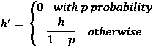
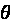
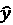
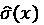
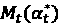
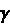

# 第十七章：概率预测及更多

在整本书中，我们学习了生成预测的不同技术，包括一些经典方法，使用机器学习以及一些深度学习架构。但我们一直在关注一种典型的预测问题——为连续时间序列生成点预测，并且没有层级关系且历史数据足够丰富。我们之所以这样做，是因为这是你会遇到的最常见的问题。但在本章中，我们将花一些时间讨论几个利基话题，尽管这些话题的受关注程度较低，但同样重要。

在本章中，我们将重点讨论以下主题：

+   概率预测

    +   概率密度函数

    +   分位数函数

    +   蒙特卡洛 Dropout

    +   一致性预测

+   间歇性/稀疏时间序列预测

+   可解释性

+   冷启动预测

    +   预训练模型，如 TimeGPT

    +   基于相似度的预测

+   层级预测

# 概率预测

到目前为止，我们一直在讨论将预测作为一个单一的数字。我们一直在将我们的深度学习模型投射到一个单一维度，或者训练我们的机器学习模型输出一个单一的数字。随后，我们使用如均方误差之类的损失函数来训练模型。这种范式就是我们所说的*点预测*。但是我们没有考虑到一个重要方面。我们正在使用历史数据来训练模型，以做出最佳预测。但是模型对于其预测有多确定呢？那些熟悉机器学习和分类问题的人会意识到，对于分类问题，除了得到样本属于哪个类别的预测，我们还会得到模型的不确定性。可是我们的预测是回归问题，我们并没有免费的不确定性。

那么，为什么在预测中量化不确定性是重要的呢？任何预测都是为了某个目的创建的，即某个下游任务，需要使用预测信息。换句话说，我们生成的预测是为了做出某些决策。而在做决策时，我们通常希望能够获得尽可能多的信息。

让我们看一个例子，来真正强调这一点。你已经记录了过去 5 年每月的食品消费量，并使用书中的技术，创建了一个超精准的预测和一个应用程序，告诉你每个月需要购买多少食品。你打开应用程序，它告诉你这个月需要购买 2 个面包。你前往超市，拿了两个面包，然后回家。结果在月底前一周，面包就用完了，剩下的时间你饿着肚子。就在饿得快不行的时候，你开始质疑自己的决定和预测。你分析了数据，发现自己哪里出错了，意识到每个月的面包消费量变化很大。有些月份你吃了 4 个面包，而有些月份则只有 1 个。所以，很有可能这个预测会导致你某些月份没有面包，而其他月份则面包过剩。

然后，你阅读了这一章，并将你的预测转化为概率预测，现在它告诉你，50%的情况下你下个月的面包消费量是 2 个。可是，现在应用程序中有一个附加功能，它询问你是更愿意挨饿，还是希望每天结束时有剩余的面包。所以，依据你对挨饿或节省金钱的接受程度，你做出了选择。假设你不想挨饿，但如果面包偶尔缺货，比如 10%的情况，你也能接受。一旦你将这个偏好输入应用程序，它就会修正预测，并告诉你，你应该买 3 个面包，这样你就再也不会挨饿了（当然，也因为你更聪明了，从超市里买了其他东西）。

能够利用预测中的不确定性，并根据我们对风险的接受度进行修正，是概率预测的主要实用功能之一。它还帮助我们的预测变得更加透明，并使用户更加信任。

现在，让我们快速看一下使用学习模型进行预测问题时可能出现的不确定性类型。

## 预测不确定性类型

我们在*第五章*中看到，监督式机器学习无非就是学习一个函数，，其中*h*以及是我们学习的模型，而它们的输入数据则是这些内容。所以，如果我们考虑不确定性的来源，它可以来自这两个组成部分中的任意一个。

我们所学习的模型，*h*，是使用数据集*X*进行近似的，这个数据集可能并没有完全覆盖所有情况，因此可能会从中引入一些不确定性。我们称之为**认识性不确定性**。在机器学习的背景下，当模型没有接触到足够的数据、模型本身不足以学习问题的复杂性，或者它所训练的数据不能代表所有可能的情境时，就会出现认识性不确定性。这也被称为系统性或可减少不确定性，因为这是总预测不确定性中可以通过更好的模型、更好的数据等方式主动减少的部分；换句话说，就是通过获得更多关于系统的知识来减少它。让我们通过几个例子来更清楚地理解这一概念：

+   如果一个天气预测模型来自某个特定区域的数据较少（可能是因为传感器故障），那么对该区域的了解将会减少，从而增加不确定性。

+   如果将线性模型应用于非线性问题，那么由于更简单的模型对系统了解较少，我们就会引入一些不确定性。

+   如果一个经济预测模型没有使用一些关键的影响因素进行训练，例如经济政策的变化、气候变化对决策的影响等等，这也会产生一些不确定性。

这种不确定性的一大优点是，我们可以通过收集更好的数据、训练更好的模型等方式主动减少它。

现在在总预测不确定性中还有另一种不确定性——**Aleatoric 不确定性**。这指的是数据中固有的随机性，是无法通过解释来消除的。这也被称为统计性或不可约不确定性。尽管我们的宇宙对我们来说似乎是决定论的，但在表面之下始终存在一层普遍的不确定性。

例如，天体的运动可以准确计算（感谢广义相对论和爱因斯坦），但仍然有可能随机的小行星撞击任何天体并改变计算出的轨迹。这种不可约且无法避免的不确定性被称为 Aleatoric 不确定性。让我们来看几个例子：

+   无论天气预测的测量和模型多么精确，仍然存在可变性。天气中有一种固有的随机性，我们可能永远无法完全解释清楚。

+   一个运动员的表现，无论他们训练得多么努力并遵循规则，仍然不是完全决定性的。很多因素，如天气、健康以及比赛期间或之前的其他随机事件，都可能影响运动员的表现。

现在我们已经理解了不同类型的不确定性，以及为什么我们需要不确定性量化，让我们看看在预测的背景下它意味着什么。

## 什么是概率预测和预测区间？

概率预测是指预测不仅给出单点预测结果，还能够捕捉预测的不确定性。概率预测是一种通过提供一系列可能值及其相关概率或置信水平来预测未来事件或结果的方法。这种方法捕捉了预测过程中的不确定性。

在计量经济学和经典时间序列领域，预测区间已经内嵌在公式中。这些方法的统计基础和强假设确保了模型输出能够以概率的方式进行解释（只要满足这些模型规定的假设）。但在现代机器学习/深度学习领域，概率预测不是事后考虑的。多种因素的组合，如较少的严格假设以及我们训练模型的方式，导致了这种局面。

我们可以通过不同的方法将概率维度加入到预测中，本章将讨论其中的一些方法。但在此之前，让我们首先理解概率预测的一种最有用的表现形式——**预测区间**。

预测区间是一个范围，未来的观测值预计会以特定概率落在该范围内。例如，如果我们有一个 95%的预测区间为 `[5,8]`，我们可以说，95%的情况下，实际值会落在 5 到 8 之间。我们以一个正态分布为例，假设其均值为 ，方差为 ，这是我们在时间步长 *t* 时的预测（我们将在接下来的内容中讨论其中一种方法，可以给我们这样的结果）。因此，时间 *t* 时的预测区间，假设显著性水平（即预测值可能落在区间外的概率）为 ，可以表示为：


其中 *z* 是正态分布的 z 分数。

**预测区间** (**PI**) 与 **置信区间** (**CI**)

最令人困惑的主题之一是预测区间和置信区间。让我们在这里解开它们的迷雾。它们都是量化不确定性的方法，但在预测的背景下，它们服务于不同的目的，并且解释方式不同。置信区间提供一个范围，但针对样本数据的总体参数（如均值），而预测区间则专注于为未来的观测值提供一个范围。两者的一个关键区别是，置信区间通常比预测区间更窄，因为预测区间还考虑了新点的不确定性。另一方面，置信区间只考虑模型参数的不确定性。因此，当我们需要给出未来某个观测值可能落入的范围（比如下个月的销售额）时，我们使用预测区间。当我们需要为一个估计参数（比如年均需求量）提供一个范围时，我们使用置信区间。

在详细讨论之前，我们需要澄清一些术语和概念。

## 置信水平、误差率和分位数

在处理预测区间时，了解置信水平、误差率和分位数之间的关系至关重要。这些概念有助于确定未来观测值在一定概率范围内的预期区间。

*误差率* () 是预测区间不包含未来观测值的允许概率。它通常以百分比或 0 到 1 之间的小数表示。如果我们说  或 ，这意味着未来的观测值有 10%的机会不在预测区间内。

*置信水平* () 是误差率的补数，它是预测区间包含未来观测值的概率。。如果我们说误差率是 10%，那么置信水平将是 90%。

*分位数* 是将数据分成具有相等概率的区间的点。简单来说，分位数表示一个值，低于该值的数据占某个百分比。例如，第 5 百分位数或 0.05 分位数标志着 5%的数据位于该值以下。因此，当我们没有基于分布假设的解析方法来获得预测区间时，也可以使用分位数来定义预测区间。

在*图 17.1*中，我们展示了标准正态分布的预测区间。


图 17.1：标准正态分布的预测区间

错误率、置信水平和分位数之间有着密切的关系。错误率和置信水平是彼此的直接补充，可以互换使用，以定义我们希望预测区间具有的置信度或我们可以接受的预测区间的误差率。另一种看法是通过曲线下的面积。在*图 17.1*中，绿色阴影区域的面积表示置信水平，而红色区域的面积表示误差率。

对于标准正态分布，我们可以直接通过使用解析公式获得预测区间：


其中！[](img/B22389_03_003.png)是分布的均值，！[](img/B22389_03_004.png)是分布的标准差，！[](img/B22389_17_015.png)是对应所需置信水平的标准正态分布临界值，！[](img/B22389_17_016.png)。取！[](img/B22389_17_017.png)是因为我们允许误差率在两侧分布（*图 17.1*中的曲线两侧的红色阴影区域）。

现在让我们看看错误率和置信水平是如何与分位数相联系的，因为如果我们不知道分布是什么（并且我们不想假设任何分布），我们就无法通过解析公式获得预测区间。在这种情况下，我们可以使用分位数来获得相同的结果。就像我们使用解析公式时一样，错误率！[](img/B22389_04_009.png)应该在两侧均匀分配。因此，预测区间将是：


其中！[](img/B22389_17_020.png)是*t*^(th)分位数。所以，从分位数的定义，我们知道！[](img/B22389_17_021.png)将有！[](img/B22389_17_017.png) %的数据低于它，！[](img/B22389_17_023.png)将有！[](img/B22389_17_017.png) %的数据高于它，从而使区间外的面积为！[](img/B22389_04_009.png)。

利用这一关系，我们可以从错误率转化为分位数，或者从置信水平转化为分位数。如果错误率是！[](img/B22389_04_009.png)，我们已经看到对应的分位数表示预测区间。让我们再看一个简单的公式，将置信水平（以百分比表示）转化为分位数：


在 Python 代码中，这仅仅是：

```py
level = 95  # Confidence levels
qs = [50 - level / 2, 50 + level / 2] # Quantiles 
```

现在，让我们来看一下如何衡量预测区间的优良性。

## 衡量预测区间的优良性

我们知道什么是概率预测，以及什么是预测区间。但在我们查看生成预测区间的技术之前，我们需要一种方法来衡量这种区间的优良性。标准指标如平均绝对误差或均方误差不再适用，因为它们是点预测衡量指标。

我们从预测区间中想要得到什么？如果我们有一个 90%置信度的预测区间，我们希望数据点至少有 90%的时间落在该区间内。这可以通过设置非常宽的预测区间来轻松获得，但那样预测区间就变得没有用。因此，我们希望预测区间尽可能窄，同时仍能满足 90%的置信度要求。为了衡量这两个不同的方面，我们可以使用两个指标——**覆盖率**和**预测区间的平均长度**。

**覆盖率**是指真实值落入预测区间的比例。从数学上讲，如果我们用表示每个观察值*i*的预测区间，用表示真实值，则覆盖率可以定义为：


其中，是一个指示函数，如果内部条件为真，则值为 1，否则为 0，*N*是观察值的总数。接近所需置信水平（例如，95%的预测区间）的覆盖率指标表明模型的不确定性估计得到了很好的校准。

**预测区间的平均长度**是通过对所有观察值的预测区间长度取平均值来计算的。使用与上面相同的符号，它可以用数学方式写成：


这个指标有助于理解区间的覆盖率与其精度之间的权衡。我们还将看一下这两个指标的 Python 函数：

**覆盖率**：

```py
import numpy as np
def coverage(y_true, lower_bounds, upper_bounds):
    """
    Calculate the coverage of prediction intervals.

    Parameters:
    y_true (array-like): True values.
    lower_bounds (array-like): Lower bounds of prediction intervals.
    upper_bounds (array-like): Upper bounds of prediction intervals.

    Returns:
    float: Coverage metric.
    """
    y_true = np.array(y_true)
    lower_bounds = np.array(lower_bounds)
    upper_bounds = np.array(upper_bounds)
    # Check if true values fall within the prediction intervals
    coverage = np.mean((y_true >= lower_bounds) & (y_true <= upper_bounds))
    return coverage 
```

**平均长度**：

```py
def average_length(lower_bounds, upper_bounds):
    """
    Calculate the average length of prediction intervals.

    Parameters:
    lower_bounds (array-like): Lower bounds of prediction intervals.
    upper_bounds (array-like): Upper bounds of prediction intervals.

    Returns:
    float: Average length of prediction intervals.
    """
    lower_bounds = np.array(lower_bounds)
    upper_bounds = np.array(upper_bounds)

    # Calculate the length of each prediction interval
    lengths = upper_bounds - lower_bounds
    # Calculate the average length
    average_length = np.mean(lengths)
    return average_length 
```

这两个 Python 函数可以在`src/utils/ts_utils.py`中找到，我们将在本章中使用它们来衡量生成的预测区间的质量。

现在，让我们看一下可以用来获得概率预测的不同技术，以及如何实际使用它们。

## 概率密度函数（PDF）

这是概率预测中最常用的技术之一，尤其是在深度学习领域，因为它的实现简单。在时间*t*的预测可以看作是概率分布的实现。与其估计，我们可以估计。如果我们假设是一个参数化的分布之一，，其参数为，那么我们可以直接估计参数，而不是估计。

例如，如果我们假设预测来自正态分布，则我们可以建模为


所以，代替让我们的模型输出！[](img/B22389_17_033.png)，我们可以让它输出！[](img/B22389_17_003.png)和！[](img/B22389_17_045.png)。通过！[](img/B22389_17_003.png)和！[](img/B22389_17_045.png)，我们可以轻松计算给定！[](img/B22389_04_009.png)的预测区间：


其中，*Z*是来自标准正态分布的临界值，对应于所需的置信水平。对于 90%的置信水平，！[](img/B22389_17_051.png)。够简单吧？等等，别急！

现在我们正在对一个分布的参数进行建模，那么我们如何训练模型呢？我们仍然有实际的点预测作为目标。在正态分布的情况下，目标仍然是实际的！[](img/B22389_17_052.png)，而不是均值和标准差。我们通过使用像**对数似然度**这样的损失函数，而不是像平方误差这样的损失函数来解决这个问题。

例如，假设我们有一组*i.i.d*观测值（在我们这个例子中是目标值），！[](img/B22389_17_053.png)。通过假定分布的预测参数（！[](img/B22389_17_054.png)），我们将能够计算出每个目标值的概率，！[](img/B22389_17_055.png)。*i.i.d*假设意味着每个样本相互独立。高中数学告诉我们，当两个独立事件发生时，我们可以通过将两个独立的概率相乘来计算它们的联合概率。使用相同的逻辑，我们可以通过将所有独立概率相乘来计算所有*n* *i.i.d*观测值的联合概率或似然度（即所有这些事件发生的概率）。


最大化似然度有助于模型学习每个样本的正确参数，使得在假定分布下的概率最大化。我们可以直观地这样理解：对于一个假定的分布，比如正态分布，最大化似然度可以确保目标值位于由预测参数定义的分布中心。

然而，这个操作并不是数值稳定的。由于概率是！[](img/B22389_17_057.png)，将它们相乘会使结果逐渐变小，并且很快可能导致数值下溢问题。因此，我们使用对数似然度，它只是对似然度进行对数变换。我们这样做是因为：

+   作为严格单调变换，优化一个函数等同于优化该函数的对数变换。因此，优化似然度和对数似然度是一样的。

+   对数变换将乘法转换为加法，这是一种更加数值稳定的操作。


这种方法的主要缺点是它依赖于参数化的概率分布，其对数似然计算是可行的。因此，我们被迫对输出做出假设，并预先选择一个可能适合的分布。

这是一把双刃剑。一方面，我们可以将一些领域知识注入到问题中，并且对模型训练进行正则化，但另一方面，如果我们不清楚选择正态分布是否是正确的选择，就可能导致模型过于受限。

许多流行的分布，如正态分布、泊松分布、负二项分布、指数分布、对数正态分布、Tweedie 分布等，都可以用来通过这种技术生成概率预测。

现在，我们已经具备了训练和学习模型的所有组件，并能够使其预测完整的概率分布，而不仅仅是点预测。既然理论已经讲解完毕，让我们换个角度，看看如何使用这项技术。

### 使用 PDF 进行预测——机器学习模型

我们已经在*第二部分*《时间序列的机器学习》中看到如何使用标准的机器学习模型进行预测。但那时我们讨论的都是点预测。那么，能否通过 PDF 方法轻松地将所有内容转换为概率预测呢？从理论上讲，是的。但实际上，事情并没有那么简单。像`sci-kit learn`、`xgboost`、`lightgbm`等流行的机器学习模型实现采用的是点预测范式。作为这些开源库的用户，我们很难轻易地调整和重写代码，以使其优化对数似然作为回归损失。但不要担心，这并不是不可能的。`NGBoost`是流行的梯度提升模型，如`xgboost`和`lightgbm`的远亲，它的实现方式是预测 PDF，而不是点预测。

还有其他技术，如分位数预测（Quantile Forecast）或保形预测（Conformal Prediction），这些方法在我们书中讨论的机器学习模型中具有更广泛的应用性（并且是推荐的），尤其是在最终目标是获取预测区间时。为了完整性考虑，书中提到的 NGBoost 适用于需要输出完整概率分布的情况。

我们不会在这里深入探讨 NGBoost 是什么以及它与常规梯度提升模型的区别，但只需知道，它是一种预测概率分布而不是点预测的模型。

**参考检查**：

由 Duan 等人提出的研究论文，介绍了`NGBoost`，在*参考文献*中以参考文献*1*列出。

*进一步的* *阅读*提供了关于 NGBoost 的博客链接，里面更深入地讨论了该模型的细节。

**笔记本提醒**：

要跟着完整的代码走，请使用`Chapter17`文件夹中的`01-NGBoost_prediction_intervals.ipynb`笔记本。

让我们使用来自 M4 竞赛的 8 条时间序列样本（该竞赛有 100,000 条时间序列，参考文献*5*）来进行概率预测。数据可以轻松在线获得，下载脚本也包含在笔记本中。我们使用这个比我们之前使用的数据集更简单的时间序列，因为我想避免因外生变量等问题而使叙述变得复杂。以下是 8 条抽样时间序列的最后 100 个时间步的图示。


图 17.2：来自 M4 竞赛的 8 条抽样时间序列的最后 100 个时间步。测试期用虚线紫色线表示。

让我们使用 mlforecast 快速创建一些特征，将问题转换为回归问题。在*第六章*中，我们有一个额外的笔记本，展示了如何使用`mlforecast`作为特征工程的替代方法，这些特征工程也包括在书的代码库中。详细的代码可以参考完整的笔记本，但现在假设我们有一个名为`data`的数据框，里面包含了运行机器学习模型所需的所有特征。我们已经将其拆分为`train`和`val`，然后进一步拆分为`X_train`、`y_train`、`X_val`和`y_val`。接下来，让我们看看如何训练一个模型，假设输出服从正态分布。

```py
from ngboost import NGBRegressor
from ngboost.distns import Normal
# Training the model
ngb = NGBRegressor(Dist=Normal).fit(X_train, Y_train) 
```

NGBoost 没有很多需要调整的参数，因此不像其他**梯度提升决策树**（**GBDT**）那样灵活。而且它的速度也不如其他 GBDT 模型。这个模型只有在需要概率输出的特殊应用场景下才会使用。

以下是 NGBoost 的一些参数：

+   `Dist`：这是输出的假定分布形式。该包目前支持`Normal`、`LogNormal`和`Exponential`，这些都可以从`ngboost.distns`导入。

+   `Score`：这是任何有效的评分函数，用来将预测的分布与实际观测值进行比较。我们之前讨论的对数似然评分在包中称为`LogScore`，并且是默认值。所有评分函数都可以从`ngboost.scores`导入。

+   `n_estimators`：这是在提升树中使用的估计器数量。

+   `learning_rate`：这是用于结合提升树的学习率。

+   `mini_batch_frac`：每次迭代时子采样的行数百分比。默认值为`1.0`。

现在我们已经训练好了 NGBoost 模型，接下来让我们看看如何使用它来生成预测值和预测区间。

为了获得点预测，语法与 scikit-learn API 完全相同。

```py
y_pred = ngb.predict(X_val) 
```

这仅仅是一个包装方法，用来计算假定分布的定位参数。例如，对于正态分布，预测分布的均值即为点预测值。

现在，为了获得底层的概率预测以及随后的预测区间，我们需要使用不同的方法：

```py
y_pred_dists = ngb.pred_dist(X_val) 
```

`y_pred_dists`中的每个点都是一个完整的分布。如果我们只想预测前五个点，可以这样做：

```py
y_pred_dists[0:5].params 
```

现在，为了获取预测区间，我们可以使用`y_pred_dist`并调用一个方法，给出我们期望的置信度水平。这反过来又调用`scipy`分布（如`scipy.stats.norm`），其具有一个`interval`方法，可以在给定置信度水平的情况下获取区间。

```py
y_pred_lower, y_pred_upper = y_pred_dists.dist.interval(0.95) 
```

现在，我们围绕`y_pred`有一个足够宽的窗口，能够包围每个数据点的预期不确定性——即预测区间。让我们看看预测结果和度量指标。


图 17.3：NGBoost 的预测区间

以下是我们为这八个时间序列计算的度量指标（平均绝对误差、覆盖率和平均长度）：


图 17.4：NGBoost 的度量指标

尽管对于某些时间序列，区间看起来很好，但一些其他序列（如时间序列 H103）的预测区间似乎过于狭窄，这在低覆盖率中也很明显。

### 使用 PDF 进行预测——深度学习模型

与机器学习模型不同，转换我们在书中学到的所有深度学习模型为它们的 PDF 版本非常简单。记得我们开始实际应用前的讨论吗？我们需要做的主要改动就是这些：

+   与预测单一的点预测（单个数字）不同，我们预测的是概率分布的参数（一个或多个数字）。

+   与其使用像均方误差这样的点损失，不如使用像对数似然这样的概率评分函数。

在深度学习范式下，这些改动非常简单，不是吗？在我们书中学到的几乎所有深度学习模型中，最后都有一个线性投影，将输出投影到所需的维度上。从概念上讲，通过改变线性投影，让输出变为多个数字（假设分布的参数）是足够简单的。同样，改变损失函数也很简单。值得注意的是，*DeepAR*（参考文献*3*）是一个使用这种技术进行概率预测的知名深度学习模型。

**笔记本提醒**：

要跟随完整的代码，请使用`Chapter17`文件夹中的`02-NeuralForecast_prediction_intervals_PDF.ipynb`笔记本。

让我们看看如何在`neuralforecast`（我们在*第十六章*中使用的库）中实现这个功能。在这里的示例中，我们将使用一个简单的模型，如 LSTM，但我们可以对任何模型执行相同操作，因为我们所做的只是将损失函数切换为`DistributionLoss`。

对于这个例子，我们将使用 M4 竞赛数据集，该数据集可以自由获取（下载数据集的代码已包含在笔记本中）。

从数据已经按照`neuralforecast`期望的格式在`Y_train_df`和`Y_test_df`中整理好的地方开始。我们需要做的第一件事是导入必要的类。

```py
from neuralforecast import NeuralForecast
from neuralforecast.models import LSTM
from neuralforecast.losses.pytorch import DistributionLoss 
```

本书中唯一我们之前没有涉及的类是`DistributionLoss`。这是一个封装了`torch.distribution`类并实现我们之前讨论的负对数似然损失的类。在写本书时，`DistributionLoss`类支持以下这些底层分布：

+   Poisson

+   Normal

+   StudentT

+   NegativeBinomial

+   Tweedie

+   Bernoulli（时间分类器）

+   ISQF（增量样条分位数函数）

在这些不同的分布之间的选择完全取决于模型构建者，并且是模型中的关键假设。如果我们建模的输出预期符合正态分布，那么我们可以选择`Normal`。以下是`DistributionLoss`的主要参数：

+   `distribution`：这是一个字符串，用于标识我们假设的分布类型。它可以是我们之前看到的任何一个分布。

+   `level`：这是一个浮动值列表，定义我们希望建模的不同置信水平。例如，如果我们想建模 80%和 90%的置信度，我们应该给出值为`[80, 90]`。

+   `quantiles`：这是定义水平的另一种方式。你可以不使用 95%的置信度，而是使用分位数 → `[0.1, 0.9]`。

    **实践者提示**：

    做出分布假设需要对领域和数据进行深入研究。但如果你对这些分布不完全熟悉，`Normal`或`StudentT`是一个很好的起点，因为许多数据类似于正态分布。但在你将`Normal`分布到处使用之前，应该在问题领域中进行一些文献研究，并根据实际情况选择合适的分布。例如，间歇性需求或稀疏需求，在零售业中非常常见，使用`Poisson`分布建模会更好。如果预测的是计数数据（正整数），`Negative Binomial`是一个不错的选择。

现在让我们设置一个预测期限、需要的水平以及一些 LSTM 的超参数（我们选择了一些简单且较小的超参数来加速训练。在实际问题中，建议进行超参数搜索，以找到最佳参数）。

```py
horizon = 48
levels = [80, 90]
lstm_config = dict(input_size=3*horizon, encoder_hidden_size=8, decoder_hidden_size=8) 
```

现在我们需要定义将要使用的模型和`NeuralForecast`类。我们定义两个模型——一个使用`Normal`，另一个使用`StudentT`。

```py
models = [
    LSTM(
        h=horizon,
        loss=DistributionLoss(distribution="StudentT", level=levels),
        alias="LSTM_StudentT",
        **lstm_config
    ),
    LSTM(
        h=horizon,
        loss=DistributionLoss(distribution="Normal", level=levels),
        alias="LSTM_Normal",
        **lstm_config
    ),
]
# Setting freq=1 because the ds column is not date, but instead a sequentially increasing number
nf = NeuralForecast(models=models, freq=1) 
```

注意，语法与点预测完全相同，唯一不同的是我们选择的分布损失。现在剩下的就是训练模型了。

```py
nf.fit(df=Y_train_df) 
```

一旦模型训练完成，我们可以使用预测方法进行预测。该输出将在我们定义的别名下提供点预测，并提供我们定义的所有置信水平的高低区间。

```py
Y_hat_df = nf.predict() 
```

现在我们已经得到了概率预测，让我们来看一下它们，并计算相关指标。


图 17.5：使用 LSTM 和 StudentT 分布作为输出的预测带置信区间


图 17.6：LSTM 与正态分布和 StudentT 分布输出的度量标准

如果我们将覆盖率与 NGBoost 的覆盖率进行比较，我们可以看到深度学习方法提高了覆盖率，但在大多数情况下间隔也比必要的更宽（如更大的平均宽度所示）。

这种方法的最大缺点是我们将输出限制在参数化分布之一。在许多实际情况下，数据可能不符合任何参数化分布。

现在，让我们看一个不需要假设任何参数分布的方法，但仍然可以得到预测区间。

## 分位数函数

如果我们的唯一目的是获得预测区间，我们也可以使用分位数来做同样的事情。让我们从稍微不同的角度看 PDF 方法。在 PDF 方法中，我们在每个时间步有一个完整的概率分布作为输出，并使用该分布来获得分位数，这些分位数就是预测区间。尽管对于大多数参数分布，有获取分位数的解析公式，但我们也可以通过数值方法找到分位数。我们只需绘制足够数量的 N 个样本，然后计算绘制样本的分位数。关键在于，即使我们有完整的概率分布，对于预测区间，我们所需的只是分位数。而给定 N 个样本计算分位数并不依赖于分布的种类。

那么，如果我们可以训练我们的模型直接预测指定的分位数，而不假设潜在的概率分布会怎样？这正是我们用分位数函数所做的。

在讨论分位数函数之前，让我们花一分钟了解**累积分布函数**（**CDF**）。再次强调，这是高中的概率知识。简单来说，CDF 返回某个随机变量*X*小于或等于某个值*x*的概率：


这里*F*是 CDF。该函数接受一个输入*x*，并返回一个介于 0 和 1 之间的值。我们称这个值为。

*分位数函数*是 CDF 的反函数。该函数告诉你使返回特定值的*x*的值。


这个函数，，就是*分位数函数*。

从实施的角度来看，对于能够进行多输出预测的模型（如深度学习模型），我们可以使用一个模型，并通过更改输出层来预测我们想要的所有分位数。对于仅限于单输出的模型（如机器学习模型），我们可以为每个分位数学习单独的分位数模型。

现在，就像之前一样，我们不能使用均方误差这样的点损失。我们通过使用对数似然函数在 PDF 中克服了这个问题。在这里，我们可以使用分位损失或针球损失。

**参考检查**：

提出分位损失和回归的论文已在 *参考文献* 中第 *4* 条进行了引用。

分位损失可以定义如下：


其中  是时刻 *t* 的目标值， 是分位预测值，而 *q* 是我们预测的分位数。公式看起来很复杂，但请耐心等一下，其实很简单。让我们尝试理解一下损失的直觉。我们知道中位数是 0.5 分位数，这是一个集中趋势的度量。但是，如果我们想让预测值接近第 75 百分位数或 0.75 分位数，我们就必须促使模型做出高估，对吗？如果我们想让模型高估，我们需要在模型低估时给予更高的惩罚。反之，如果我们想预测 0.25 分位数，我们需要低估。分位损失正是做到了这一点：

+   对于 （低估），损失为 

+   对于 （高估），损失为 

这种不对称性来源于 *q* 或 1 - *q*。另一个项只是实际值和预测值之间的差异。

让我们通过一个例子来理解这一点。假设我们有真实值 ，并且我们想要估计 0.75 分位数（）。

+   **案例 1：高估**：。由于 ，我们的分位损失将是：


+   **案例 2：低估**：。由于 ，我们的分位损失将是：


**笔记本提醒**：

若要跟随完整代码，请使用 `Chapter17` 文件夹中的名为 `03-Understanding_Quantile_Loss.ipynb` 的笔记本。

因此，通过调整 *q* 的值，我们可以使损失变得更具不对称性，且倾向于任一方向。下面的 *图 17.7* 显示了 *q* = 0.5 和 *q* = 0.75 的损失曲线，并标出了这些示例预测。


图 17.7：q=0.5 和 q=0.75 的分位损失曲线

我们可以看到，*q* = 0.5 的分位损失是对称的，因为它代表了中位数，而 *q* = 0.75 的损失曲线是非对称的，对低估的惩罚远高于高估。

尽管公式具有分支结构，但在实现代码时可以轻松避免使用最大操作。Python 中的分位损失代码如下：

```py
def quantile_loss(q, y, y_hat_q):
    """ Calculate the quantile loss for a given quantile.
    Args:
    q (float): The quantile to be evaluated, e.g., 0.5 for median.
    y (float): The target value.
    y_hat_q (float): The quantile forecast.
    """
    error = y - y_hat_q
    return np.maximum(q * error, (q - 1) * error) 
```

现在，让我们进入实际操作，学习如何在本书中涵盖的不同技术（包括机器学习和深度学习）中使用分位损失。

### 使用分位损失进行预测（机器学习）

常规机器学习模型通常只能建模一个输出。因此，我们需要为每个我们感兴趣的分位数训练不同的模型，使用分位数损失。所以，如果我们想预测一个问题的 0.5、0.05 和 0.95 分位数，我们必须训练三个独立的模型，每个分位数一个模型。

**笔记本提示**：

要跟随完整代码，请使用 `Chapter17` 文件夹中的 `04-LightGBM_Prediction_Interval_Quantile_Loss.ipynb` 笔记本。

让我们看看如何实现这一点。就像在 PDF 部分中一样，我们使用 `mlforecast` 快速生成一个合成问题并创建一些特征。有关详细代码，请参考完整的笔记本，但现在假设我们有一个数据框 `data`，其中包含运行机器学习模型所需的所有特征。我们将其分为 `train` 和 `val`，然后分别划分为 `X_train`、`y_train`、`X_val` 和 `y_val`。

第一步是导入 **LGBMRegressor** 并设置我们希望训练的某些参数和分位数。

```py
params = {
    'objective': 'quantile',
    'metric': 'quantile',
    'max_depth': 4,
    'num_leaves': 15,
    'learning_rate': 0.1,
    'n_estimators': 100,
    'boosting_type': 'gbdt'
}
# converting levels to quantiles
# For 90% Confidence - 0.05 for lower, 0.5 for median, and 0.95 for upper
quantiles = [0.5] + sum([level_to_quantiles(l) for l in levels], []) 
```

这里需要注意的关键参数是 `objective` 设置为 `quantile`，并且 `metric` 也设置为 `quantile`。其余的 LightGBM 参数可以根据每个用例进行调优。现在，让我们训练所有的分位数模型。

```py
# Training a model each for the quantiles
quantile_models = {}
for q in quantiles:
    model = LGBMRegressor(alpha=q, **params)
    model = model.fit(X_train, Y_train)
    quantile_models[q] = model 
```

现在模型已经训练完成，我们可以从分位数模型中获取点预测和预测区间。

```py
# Point Forecast using the 0.5 quantile model
y_pred = quantile_models[0.5].predict(X_val)
# Prediction Intervals using the 0.1 and 0.9 quantile models
y_pred_lower = quantile_models[0.1].predict(X_val)
y_pred_upper = quantile_models[0.9].predict(X_val) 
```

现在，让我们看看预测和度量指标的结果。


图 17.8：使用 Quantile 回归和 LightGBM 进行带预测区间的预测


图 17.9：使用 LightGBM 的分位数回归的度量指标

这样做的缺点是我们为每个分位数训练一个模型。这会很快变得难以管理。与训练一个模型不同，训练三个模型会导致总训练时间增加。另一个问题是，由于三个模型的训练方式不同，它们可能具有不同的属性，它们解决问题的方式也可能有很大不同。由于这种不一致性，预测区间也可能存在一些问题。我们可以清楚地看到这一点，在许多时间序列中的*图 17.7*，它们似乎与中位预测断开连接。这是深度学习领域没有的问题。

### 使用分位数损失进行预测（深度学习）

在深度学习模型中，我们使用一个共同的学习结构，并对不同的分位数在共享投影上使用不同的线性投影。这确保了所有分位数的基础表示和学习是相同的，从而可以产生更一致的分位数预测。因此，对于我们在本书中学到的所有深度学习模型，我们可以通过做两件事将它们转换为分位数预测模型：

1.  我们不是预测单一数字的点预测，而是预测概率分布的参数（一个或多个数字）。

1.  与其使用像均方误差这样的点损失，不如使用像对数似然这样的概率评分函数。

就像我们在 PDF 部分做的那样，我们所需要做的只是将`neuralforecast`中的损失函数切换掉。

**笔记本警告**：

要跟随完整代码，请使用`Chapter17`文件夹中的`05-NeuralForecast_prediction_intervals_Quantile_Loss.ipynb`笔记本。

让我们看看如何在`neuralforecast`中实现这一点（我们在*第十六章*中使用的库）。就像之前一样，我们将使用一个简单的模型，如 LSTM 和 M4 竞赛数据集，但我们可以对任何模型或任何数据集执行相同的操作，因为我们所做的只是将损失函数切换为`MQLoss`（多分位数损失）。

让我们从数据已经按照`neuralforecast`所需的格式（即`Y_train_df`和`Y_test_df`）开始。首先，我们需要导入必要的类。

```py
from neuralforecast import NeuralForecast
from neuralforecast.models import LSTM
from neuralforecast.losses.pytorch import MQLoss 
```

我们之前没有查看过的唯一类是`MQLoss`。这个类计算我们刚刚讨论的多分位数的分位数损失（这通常是你训练模型的方式）。这些是`MQLoss`的主要参数：

+   `level`：这是一个浮动数值列表，定义了我们感兴趣的不同置信度水平。例如，如果我们想建模 80%和 90%的置信度，我们应该给出`[80,90]`。

+   `quantiles`：这是一种定义水平的替代方法。你可以将其定义为分位数，而不是 95%的置信度 → `[0.1, 0.9]`。

现在，让我们设置一个预测范围，确定所需的水平，并为 LSTM 设置一些超参数。

```py
horizon = 48
levels = [80, 90]
lstm_config = dict(input_size=3*horizon) 
```

现在，我们需要定义我们将要使用的模型和`NeuralForecast`类。让我们只定义一个模型。

```py
models = [LSTM(h=horizon, loss=MQLoss(level=levels), **lstm_config)]
# Setting freq=1 because the ds column is not date, but instead a sequentially increasing number
nf = NeuralForecast(models=models, freq=1) 
```

请注意，语法与点预测完全相同，唯一不同的是我们选择了多分位数损失。现在，剩下的就是训练模型了。

```py
nf.fit(df=Y_train_df) 
```

一旦模型训练完成，我们就可以使用`predict`方法进行预测。这个输出将包含我们定义的别名下的点预测，以及我们所定义的所有水平的高低区间。

```py
Y_hat_df = nf.predict() 
```

现在，我们有了一种不对输出分布做假设的预测区间方法，这在现实世界中非常有价值，特别是在我们不确定基础输出分布时。让我们看看生成的概率预测及其指标。


图 17.10：使用分位数回归（深度学习）进行预测并生成预测区间


图 17.11：分位数回归（深度学习）的指标

我们可以看到，预测区间彼此之间非常一致，与中位预测结果没有脱节，像 LightGBM 中的不同模型那样断开。这是因为对于所有分位数，都在进行相同的学习，只是最终的投影头不同。总体而言，覆盖率也更好。

还有一种获取预测区间的方法，它非常简单，但由于 PyTorch 的使用方式，实际上并不容易实现。这就是我们接下来要看到的内容。

## 蒙特卡洛丢弃

丢弃是深度学习中一种非常流行的正则化层。简单来说，丢弃正则化是指在训练过程中随机使网络的部分权重为零（在推理时，丢弃会被关闭）。直观地看，这迫使模型不依赖少数几个权重，而是将权重的相关性分布在整个网络中。从另一个角度看，我们正在应用一种类似于岭回归（Ridge regularization）的正则化方法，确保没有任何权重单独过高，以至于会剧烈地影响输出。

从技术上讲，除了将部分权重设为零，我们还通过按保留（未置零）节点/权重的比例进行归一化，来消除每一层的偏差。现在让我们对这一层进行公式化。如果丢弃的概率是 ，并应用于一个中间激活值 *h*，那么丢弃后的激活值  将是：



为什么在应用丢弃时，我们需要缩放/归一化输出？直观的答案是为了确保在训练期间（丢弃启用时）和推理期间（丢弃关闭时），输出的尺度一致。更长的答案如下。

假设在没有丢弃（dropout）的情况下，一个节点的输出是 *h*。现在，使用丢弃时，节点的输出有  的概率变为 0，且有  的概率保持为 *h*。因此，该节点的期望值为：。这意味着输出的平均值会被  缩减，这在训练和推理过程中是不希望发生的，因为它会改变数值的尺度。因此，解决方案是将被丢弃保留的节点的输出按  进行缩放。

现在，我们知道了什么是丢弃。但请记住，我们仅在训练期间使用丢弃作为正则化手段。在 2015 年，Yarin Gal 等人提出了经典的丢弃法也可以作为 *贝叶斯高斯过程近似*。这是一堆我们之前没接触过的术语。让我们简要地绕个路，从高层次上理解这些术语，我会在 *进一步阅读* 中提供更多链接。

**参考检查**：

Yarin Gal 等人的关于蒙特卡洛丢弃的论文在 *参考文献* 中以参考文献 *2* 的形式被引用。

*贝叶斯推断*是一种统计方法，当更多证据或信息变得可用时，它会更新假设的概率。它基于贝叶斯定理，该定理在数学上表达了先验概率、似然性和后验概率之间的关系。形式上，贝叶斯定理表示为：


其中，是给定数据*D*的假设的*后验概率*，是*似然性*（给定假设观察到数据*D*的概率），是观察数据之前假设的*先验概率*，而是边际似然性或*证据*（在所有可能的假设下观察到数据的总概率）。

虽然它有一些特定的术语，但这个方法非常直观，并提供了一种在面对证据或数据时更新我们先前信念的结构化方式。我们从一个先验分布开始，表示我们对参数的初始信念。当我们观察到数据*D*时，我们更新我们的信念，得到后验分布。这个后验分布结合了先验信息和观察到的数据的似然性，提供了一个关于参数的新、更新的信念。对于感兴趣的人，*进一步阅读*提供了更详细的解释。它还包含了*Seeing Theory*中的一页，帮助你以直观的方式可视化这些内容。

现在，让我们继续讲解**高斯过程**（**GP**）。正如我们在*第五章*中看到的，监督学习是学习一个函数，其中是我们感兴趣的预测量，*h*是我们学习的函数，*X*是输入数据，而表示模型参数。因此，高斯过程将这个函数假设为一个概率分布，并使用贝叶斯推断，通过我们可用于训练的数据来更新该函数的后验。这是一种与数据学习截然不同的方式，并且本质上是概率性的。

还有一个术语，就是近似。在许多情况下，贝叶斯模型中的复杂后验分布使其无法直接计算。因此，我们有一种称为*变分推断*的技术，其中我们使用一个已知的参数分布族*q*，并找到最接近真实后验的成员。详细讨论变分推断和高斯过程（GP）超出了本书的范围，但我在*进一步阅读*中为有兴趣的人提供了一些链接。

回到 dropout，Yarin Gal 等人展示了在每个权重层之前定义带有 dropout 层的神经网络，实际上是 GP 的贝叶斯近似。因此，如果带有 dropout 的模型是 GP，并且 GP 是一个函数的后验分布，那么这应该给我们一个概率输出，对吧？但是在这里，我们没有像正态分布这样的明确定义的参数化概率分布，可以让我们分析地计算分布的属性（例如均值、标准差或分位数）。那我们该怎么做呢？

记得我们在量化函数章节开始时讨论过的内容：如果我们从一个分布中抽取*N*个样本，并且*N*足够大，我们可以近似地估计该分布的属性？我们把这个过程叫做*蒙特卡洛采样*。*蒙特卡洛采样*是一种计算技术，用于通过从分布中生成许多随机样本来估计分布的统计属性。将这一理念应用到启用了 dropout 的神经网络中，我们可以通过蒙特卡洛采样评估函数后验概率分布的属性，这意味着我们需要在推理时保持 dropout 开启，并通过执行*N*次前向传播从后验中进行采样。

理论上的依据使我们可以将 dropout 应用于任何神经网络，通过简单的操作获得不确定性估计。难道这份简洁性不美吗？

所以，所有这些归结为以下简单步骤来获取预测区间：

1.  选择任意一种深度学习架构。

1.  在每个重要操作之前插入 Dropout 层，并将其设置为一个值 ，其中 。

1.  在训练完模型并启用 dropout 后，执行*N*次前向传播。

1.  使用*N*个样本，估计中位数（用于点预测），以及对应于定义的置信水平的分位数，以获得预测区间。

这听起来足够简单，但因为一个原因，它其实很复杂。`PyTorch`和`Tensorflow`的设计方式是 dropout 在推理阶段会被关闭。在`PyTorch`中，我们可以通过`model.train()`或`model.eval()`来分别指示模型处于训练阶段或推理阶段。而大多数流行的实现（例如`PyTorch Lightning`）在后台会在预测之前执行`model.eval()`步骤。因此，当使用像`neuralforecast`这样的库（它在后台使用`PyTorch Lightning`）时，在预测时启用 dropout 并不容易。

在我们学习如何为 neuralforecast 模型实现 MC Dropout 之前，让我们稍作绕行，学习如何在 neuralforecast 中定义自定义模型。这在你需要根据自己的使用案例调整任何模型时非常有用。我们之所以在这里做，是有两个原因：

1.  我想向你展示如何在 neuralforecast 中定义一个新模型。

1.  我希望模型能很好地适配 MC Dropout 技术，也就是说，模型需要在每一层/权重之前都有 dropout 操作。

### 在 neuralforecast 中创建自定义模型

现在是时候开始一些有趣的事情了，定义一个自定义的`PyTorch`模型，使其能够与`neuralforecast`一起使用。为了简化起见，我们将使用一个基于我们在*第十六章*中学到的**D-Linear**的小改进模型。除了线性趋势和季节性之外，我们还添加了一个非线性趋势的组件。让我们也给它取个奇怪的名字——**D-NonLinear**。模型架构大致如下：


图 17.12：D-NonLinear 模型架构

现在，让我们理解如何编写一个与`neuralforecast`兼容的模型。所有`neuralforecast`中的模型都继承自三种类之一——`BaseWindows`、`BaseRecurrent`或`BaseMultivariate`。文档清楚地解释了`BaseWindows`的目的，这正是我们在此用例中所需的。我们需要在训练时从时间序列中采样窗口。

还需要记住的一点是，`neuralforecast`在后台使用`PyTorch Lightning`进行训练。这个链接提供了有关如何为`neuralforecast`定义新模型的更多详细信息：[`nixtlaverse.nixtla.io/neuralforecast/docs/tutorials/adding_models.html`](https://nixtlaverse.nixtla.io/neuralforecast/docs/tutorials/adding_models.html)。

如果你不熟悉**面向对象编程**（**OOP**）和**继承**，那么你可能会很难理解我们在这里做的事情。继承允许子类继承父类中定义的所有属性和方法。这使得开发人员可以在基类中定义通用功能，然后继承该类以获得所有功能，再在此基础上添加任何你想要添加的特定功能。强烈建议你理解继承，不仅仅是为了这个例子，更是为了成为一个更好的开发者。网上有成百上千的教程，我这里链接一个：[`ioflood.com/blog/python-inheritance`](https://ioflood.com/blog/python-inheritance)。

模型的完整代码可以在`src/dl/nf_models.py`中找到，但我们将在这里查看模型定义的关键部分。

我们从定义`__init__`函数开始（这里只包含相关部分；完整的类定义请参见 Python 文件）。

```py
class DNonLinear(BaseWindows):
    def __init__(
        self,
        # Inherited hyperparameters with no defaults
        h,
        input_size,
        # Model specific hyperparameters
        # Window over which the moving average operates for trend extraction
        moving_avg_window=3,
        dropout=0.1,
        # Inhereted hyperparameters with defaults
        ...
        **trainer_kwargs,
    ):
        super(DropoutDNonLinear, self).__init__(
            h=h,
            ...
            **trainer_kwargs,
        )
        # Model specific hyperparameters
        self.moving_avg_window = moving_avg_window
        self.dropout = dropout
        # Model initialization to follow 
```

我们现在已经定义了`__init__`函数的一部分。接下来，让我们初始化在方法的其余部分中需要的不同层。我们有一个系列分解层，它使用移动平均将输入分割为趋势和季节性分量，还有一个线性趋势预测器和季节性预测器，负责将线性趋势和季节性分量投影到未来，最后是一个非线性预测器，它接受原始输入并将其投影到未来。

```py
 # Defining a decomposition Layer
        self.decomp = SeriesDecomp(self.moving_avg_window)
        # Defining a non-linear trend predictor with dropout
        self.non_linear_block = nn.Sequential(
            nn.Dropout(self.dropout),
            nn.Linear(self.input_size, 100),
            nn.ReLU(),
            nn.Dropout(self.dropout),
            nn.Linear(100, 100),
            nn.ReLU(),
            nn.Dropout(self.dropout),
            nn.Linear(100, self.h),
        )
        # Defining a linear trend predictor with dropout
        self.linear_trend = nn.Sequential(
            nn.Dropout(self.dropout),
            nn.Linear(self.input_size, self.h),
        )
        # Defining a seasonality predictor with dropout
        self.seasonality = nn.Sequential(
            nn.Dropout(self.dropout),
            nn.Linear(self.input_size, self.h),
        ) 
```

现在，让我们定义 `forward` 方法。`forward` 方法应该只有一个参数，它是一个包含不同输入的字典：

+   `insample_y`：我们需要预测的目标时间序列的上下文窗口

+   `futr_exog`：未来的外生变量

+   `hist_exog`：上下文窗口的外生变量

+   `stat_exog`：静态变量

对于这个用例，我们只需要 `insample_y`，因为我们的模型不使用其他信息。所以，这是 `forward` 方法的实现：

```py
 def forward(self, windows_batch):
        # Parse windows_batch
        insample_y = windows_batch[
            "insample_y"
        ].clone()  # --> (batch_size, input_size)
        seasonal_init, trend_init = self.decomp(
            insample_y
        )  # --> (batch_size, input_size)
        # Non-linear block
        non_linear_part = self.non_linear_block(
            insample_y
        )  # --> (batch_size, horizon)
        # Linear trend block
        trend_part = self.linear_trend(trend_init)  # --> (batch_size, horizon)
        # Seasonality block
        seasonal_part = self.seasonality(
            seasonal_init
        )  # --> (batch_size, horizon)
        # Combine the components
        forecast = (
            trend_part + seasonal_part + non_linear_part
        )  # --> (batch_size, horizon)
        # Map the forecast to the domain of the target
        forecast = self.loss.domain_map(forecast)
        return forecast 
```

代码非常直观。我们唯一需要确保与 `neuralforecast` 模型对齐的地方是，从输入字典中提取我们需要的数据，并在最后调用 `self.loss.domain_map`，这样它就会根据损失函数映射到正确的输出大小。现在，这个模型将像 neuralforecast 库中的任何其他模型一样运行。

现在，让我们回到 MC Dropout 及其实现。

### 使用 MC Dropout 进行预测（neuralforecast）

我们之前提到，像 `neuralforecast` 和 `PyTorch Lightning` 这样的框架中实现 MC Dropout 并不容易，但仅仅因为某件事情不容易并不应该阻止我们去做。我们只需要确保在预测过程中启用 dropout，并进行多次采样。如果你正在编写自己的 `PyTorch` 训练代码，那么只需确保在预测前不调用 `model.eval()`。但最佳做法是将 dropout 层置于训练模式，而不是整个模型。可能会有像批量归一化这样的层，它们在推理时的行为也不同，可能会受到影响。让我们看看一个便捷的方法，将所有 dropout 层都设置为训练模式。

```py
def enable_dropout(model):
    """Function to enable the dropout layers during test-time"""
    for m in model.modules():
        if m.__class__.__name__.startswith("Dropout"):
            m.train() 
```

对于 `neuralforecast`，我们已经准备了一份配方，可以使用 MC Dropout 处理他们的任何模型（前提是模型有足够的 dropout）。现在，我们将使用我们刚定义的自定义 `DNonLinear` 模型。请注意，定义中的每个组件都以 dropout 层开始，这样我们就可以毫无顾虑地应用 MC Dropout。

**笔记本警告**：

要跟随完整的代码，请使用 `Chapter17` 文件夹中的名为 `06-Prediction_Intervals_MCDropout.ipynb` 的笔记本。

如果你记得的话，我们在 *第十三章* 使用了 `PyTorch Lightning`，并解释了它基本上是标准的 `PyTorch` 代码，但以指定的形式组织——`training_step`、`validation_step`、`predict_step`、`configure_optimizers` 等。如果需要复习，请回顾 *第十三章* 和本章中的 *进一步阅读* 部分，了解更多关于如何从 `PyTorch` 迁移到 `PyTorch Lightning` 的信息。由于 neuralforecast 已经在后台使用了 `PyTorch Lightning`，我们继承的 `BaseWindows` 本身就是一个 `PyTorch Lightning` 模型。这个信息非常重要，因为我们实际上需要修改 `predict_step` 方法来实现我们的 MC Dropout。

使用我们之前用来继承`BaseWindows`的相同方法，我们可以继承我们早前定义的`DNonLinear`类，并做一些修改，使其成为一个 MC Dropout 模型。为此，我们只需要重新定义`predict_step`方法。`predict_step`是`PyTorch Lightning`每次需要获取批次预测时调用的方法。所以，我们不直接使用现有的预测，而是需要保持 dropout 启用，从*N*次前向传递中获取*N*个样本，计算预测区间和中位数（点预测），并返回它。

```py
class MCDropoutDNonLinear(DNonLinear):
    def predict_step(self, batch, batch_idx):
        enable_dropout(self)
        pred_samples = []
        # num_samples and levels will be saved to the model in MCNeuralForecast predict method
        for i in range(self.num_samples):
            y_hat = super().predict_step(batch, batch_idx)
            pred_samples.append(y_hat)
        # Stack the samples
        pred_samples = torch.stack(pred_samples, dim=0)
        # Calculate the median and the quantiles
        y_hat = [pred_samples.quantile(0.5, dim=0)]
        if self.levels is not None:
            for l in self.levels:
                lo, hi = level_to_quantiles(l)
                y_hat_lo = pred_samples.quantile(lo, dim=0)
                y_hat_hi = pred_samples.quantile(hi, dim=0)
                y_hat.extend([y_hat_lo, y_hat_hi])
        # Stack the results
        y_hat = torch.stack(y_hat, dim=-1)
        return y_hat 
```

我们完成了吗？还没有。只剩下一个小事情需要做。在*第十六章*中，我们使用了一个名为`NeuralForecast`的类来进行`neuralforecast`模型的所有拟合和预测。这个类就像一个包装类，在调用底层模型之前，负责以正确的方式准备输入和输出。这个类必须知道我们已经修改了`predict_step`，因此我们需要在这里做一个小改动。这个解决方案更多的是一个“黑客”方法，而不是一种有原则的编辑方式，但如果能达到目的，黑客方法也不失为一个好方法。我已经对实现进行了探索，以找出修改`NeuralForecast`类以支持我们的 MCDropout 推断的最佳方法。没有简短的解释方法，但请理解，我错误地使用了`neuralforecast`根据不同损失灵活生成点预测和预测区间的方式。所以，下面是重新定义的`NeuralForecast`类，其中`predict`方法做了一个黑客修改。

```py
class MCNeuralForecast(NeuralForecast):
    def __init__(self, num_samples, levels=None, **kwargs):
        super().__init__(**kwargs)
        self.num_samples = num_samples
        self.levels = levels
    def predict(
        self,
        df=None,
        static_df=None,
        futr_df=None,
        sort_df=True,
        verbose=False,
        engine=None,
        **data_kwargs,
    ):
        # Adding model columns to loss output names
        # Necessary hack to get the quantiles and format it correctly
        for model in self.models:
            model.loss.output_names = ["-median"]
            for l in list(self.levels):
                model.loss.output_names.append(f"-lo-{l}")
                model.loss.output_names.append(f"-hi-{l}")
            # Setting the number of samples and levels in the model
            model.num_samples = self.num_samples
            model.levels = self.levels
        return super().predict(
            df, static_df, futr_df, sort_df, verbose, engine, **data_kwargs
        ) 
```

就这样。我们成功地“黑进”了这个库，让它按我们的意愿工作。除了这篇文章是一个 MC Dropout 教程外，它还是一个关于如何“黑进”一个库让它做你想让它做的事的教程。需要注意的是，这并不会让你成为一个“黑客”，所以在更新你的 LinkedIn 头衔之前请先停手。

现在，开始训练模型。这与在`neuralforecast`中训练其他模型基本相同，只是你需要使用我们定义的新`MCNeuralForecast`类，而不是`NeuralForecast`类。

```py
horizon = len(Y_test_df.ds.unique()) # 48
levels = [80, 90]
model = MCDropoutDNonLinear (
    h= horizon,
    input_size=WINDOW,
    moving_avg_window=horizon*3,
    dropout=0.1,
    max_steps=500,
    early_stop_patience_steps=5,
)
mcnf = MCNeuralForecast(models=[model], freq=1, num_samples=100, levels=levels)
mcnf.fit(Y_train_df, val_size= horizon, verbose=True) 
```

一旦训练完成，我们可以像这样生成预测：

```py
Y_hat_df = mcnf.predict()
Y_hat_df = Y_hat_df.reset_index() 
```

输出与`neuralforecast`的其他模型完全一样，预测区间的格式为`<ModelName>-lo-<level>`和`<ModelName>-hi-<level>`。点预测可以在`<ModelName>-median`下找到。在这种情况下，`<ModelName>`是`MCDropoutDNonLinear`。

让我们看看预测结果和指标的图表。


图 17.13：使用 MC Dropout 的预测和预测区间


图 17.14：MC Dropout 的指标

我们的预测模型在数据上的表现还算不错；虽然不能说是出类拔萃，但也算得上中规中矩。如果我们做一个消融研究，可能会发现我们添加的非线性组件根本没有任何作用。但只要我们在过程中感到愉快，并且从中学到了东西，我就很满足了。现在，看看预测区间吧。它们并不平滑，观察时会有相当多的“噪声”，对吧？这是因为该方法本身存在随机性，也可能是因为学习不足。当我们使用 MC Dropout 时，我们实际上是依赖于*N*个子模型或子网络，并基于这*N*个预测计算分位数。也许其中有些子网络并没有很好地学习，而这些输出可能会扭曲分位数，从而影响预测区间。

MC Dropout 方法有许多批评声音。贝叶斯社区中的许多人不认为 MC Dropout 是贝叶斯方法，认为其提出的变分逼近是如此差劲的近似，以至于我们不能将其度量的东西称为贝叶斯不确定性。Loic Le Folgoc 等人有一篇未发表的 Arxiv 论文，名为“MC Dropout 是贝叶斯方法吗？”（参考文献*6*），声称 MC Dropout 并非贝叶斯方法。但这并不改变 MC Dropout 作为一种量化不确定性的廉价方法的事实。然而，在医学研究等领域，不确定性量化至关重要的情况下，我们可能希望采用更加原理化的方法。

我们还可以注意到，在所有时间序列中，覆盖率表现得相当糟糕。这同样是在不同研究中展现出来的。在 2023 年，Nicolas Dewolf 等人发表了一项研究，比较了回归问题中不同的不确定性量化方法（参考文献*7*）。他们发现，MC Dropout 在覆盖率和平均长度方面表现最差，进一步验证了 MC Dropout 是对不确定性的非常粗糙的近似。

现在，让我们看另一种有理论保证完美覆盖的概率预测技术，近年来已经成为炙手可热的趋势。

## 适应性预测

如果我告诉你有一种技术能够生成预测区间，并且从统计学上保证完美覆盖，能够适用于任何模型，而且无需我们对输出分布做任何假设呢？适应性预测就是这样的一种方法。适应性预测是一种帮助机器学习模型做出可靠预测的技术，通过估算模型的不确定性来实现。适应性预测为任何机器学习模型提供了稳健、统计上有效的不确定性量化方法，确保在关键应用中做出可靠且可信的预测。

尽管早在 2005 年，Vladmir Vovk 就提出了这一方法*（*参考文献*8*），但它在过去几年受到了更多关注。让我们首先理解一下使用分类示例的符合预测的基本原理，然后看看如何将其应用于回归和时间序列示例。

### 分类的符合预测

让我们从一个已训练的模型开始，，它输出*K*个输出类别的估计概率（*softmax*得分）（）。这个模型是什么并不重要；它可以是机器学习模型、深度学习模型，甚至是基于规则的模型。我们有训练数据，，和测试数据，。现在，我们需要一些额外的数据（除了训练和测试数据）叫做*校准数据*，。那么，我们从这些数据中想要什么呢？通过使用和，我们想要创建一个可能的标签预测集合，，确保测试数据点属于该集合的概率几乎正好是用户定义的误差率，（在整个讨论中，我们将讨论误差率。10%的误差率意味着 90%的置信水平）。这正是符合预测所保证的内容。它被称为*边际覆盖*保证，可以更正式地写为：


自然，你可能会在心中产生这个问题。这个  是什么？这个术语表示覆盖保证是从一个有限大小为*n*的样本中得出的。由于*n*在分母中，我们知道当*n*增大时，这个术语会变得越来越小。将其扩展到极限，我们知道如果 ，这个术语将为零，覆盖度将正好是 。

我们知道我们想要什么，但我们该如何实现呢？符合预测的核心思想非常简单，可以分为四个步骤：

1.  使用训练好的模型识别不确定性的启发式概念。在我们的分类示例中，这可以是 softmax 得分。

1.  定义一个得分函数，，也称为*非一致性得分*。这个得分可以是输入预测值，，和实际值，，并给出一个表示它们之间不一致的得分。得分越高，不一致性越大。在分类示例中，这可以是像  这样简单的东西。用简单的英语来说，这意味着计算正确类别的 softmax 得分，并做出 。

1.  计算作为校准得分的分位数。我们使用校准数据和得分函数来计算校准得分，并计算该数据上的分位数。的分位数计算仍然来源于有限样本修正。当趋近于无穷大时，该项趋近于零。

1.  使用这个分位数为新的示例形成预测集：。这意味着从输出集中选择所有得分（根据得分函数）大于阈值的项，。

这个简单的技术将为我们提供预测集，保证满足边际覆盖要求，无论使用什么模型或数据分布如何。让我们看看使用`Python`代码时，这有多简单，并假设我们讨论的模型是一个`scikit-learn`分类器。

我们有一个训练好的模型，`model`，校准数据，`X_calib`，以及测试数据，`X_test`。完整的代码和一些可视化请参阅笔记本。

**笔记本提醒**：

要跟随完整的代码，使用位于`Chapter17`文件夹中的名为`07-Understanding_Conformal_Prediction.ipynb`的笔记本。

```py
# 1: Get conformal scores
n = calib_y.shape[0]
cal_smx = model.predict_proba(calib_x) # shape (n, n_classes)
# scores from the softmax score for the correct class
cal_scores = 1 - cal_smx[np.arange(n), calib_y] # shape (n,)
# 2: Get adjusted quantile
alpha = 0.1  # Confidence level (1 - alpha)
q_level = np.ceil((n + 1) * (1 - alpha)) / n
qhat = np.quantile(cal_scores, q_level, method='higher')
# 3: Form prediction sets
val_smx = model.predict_proba(test_x)
prediction_sets = val_smx >= (1 - qhat) 
```

现在，让我们思考预测集，。我们一直将其定义为在分类场景下具有离散类别的集合值。这个集合的大小会根据初始启发式不确定性估计的置信度而增大或减小。

### 回归的符合性预测

让我们将预测集的概念扩展到回归问题。在回归中，输出空间是连续的，而不是离散的，我们的目标是构建连续的预测集，通常是中的一个连续区间。这个想法是保持相同的覆盖原则：预测区间应该以较高的概率包含真实值。因此，现在我们之前看到的预测集，，也是回归背景下的预测区间。但是随着预测集解释的变化，我们也需要更改得分函数，用于计算不一致性得分。一个常用的得分函数是与条件均值的距离，（参考*10*）。当我们有一个训练好的模型，，我们可以将模型的输出视为条件均值，这将使得每个点的绝对残差值。


注意，这个得分满足条件。偏差越大，“启发式”不确定性度量越大。其余的过程几乎保持不变——计算分位数，，并形成预测区间，。

让我们检查一下 Python 代码如何变化（完整代码见笔记本）。

```py
# 1: Get conformal scores
calib_preds = model.predict(calib_x)
cal_scores = np.abs(calib_y - calib_preds)
# 2: Get adjusted quantile
qhat = … # Exactly the same as classification
# 3: Form prediction intervals
test_preds = model.predict(test_x)
lower_bounds = test_preds - qhat
upper_bounds = test_preds + qhat 
```

就这么简单。我们可以检查覆盖情况，看到它将大于 90%，这是我们用  定义的误差率。

**实践者注意事项**

在许多应用场景中，我们将为多个实体或我们关心的群体训练一个单一模型。例如，对于我们在*第十章*中讨论的全球预测模型，我们使用一个回归模型来处理多个时间序列。在这种情况下，我们也可以对每个时间序列或时间序列组分别进行共形预测，以更好地适应该子集中的误差。这将允许在群体/时间序列层面提供覆盖保证。

但你可能注意到了一些问题。在这种方法中，我们始终使用相同宽度的区间。但我们期望当模型更有信心时，区间应该更紧，而当模型不确定时，区间应该更宽（从现在起我们称之为*自适应预测区间*）。让我们看看另一种具有此特性的技术。

### 共形化分位回归

我们了解了分位回归作为概率预测方法（或一般回归的一种形式）。分位回归之所以强大，是因为它不要求我们对潜在的输出分布做任何先验假设。但它并没有享受共形预测所提供的覆盖保证。在 2019 年，Yaniv Roano 等人（参考文献 *11*）将两者的优点结合到了**共形化分位回归**（**CQR**）中。他们提出了一种方法，可以将分位预测进行共形化，使其具备共形预测所保证的覆盖保证。

在这种情况下，所使用的模型有一个限制。它应该是一个能够输出分位预测的模型。并且，结合我们之前的讨论，我们知道如果误差率为 ，那么我们需要的预测区间的分位数是  和 。

所以，分位模型预测  和 。根据定义，如果  和  是真实分位数的准确估计，单独使用分位回归将具有完美的覆盖率。但模型拟合可能并不完美，这将导致低于标准的覆盖率。我们将使用共形预测来根据校准数据修正分位数，从而实现共形预测所承诺的完美覆盖。

Yaniv Roano 等人提出使用一种新的非共形得分函数来处理分位回归。


让我们稍作停顿，使用*图 17.15*中的示意图来探索得分函数。


图 17.15：用于共形化分位回归的得分函数示意图

最大操作符中有两个项。如果真实值，，位于两个分位数之间，和，那么两个项的值都为负数，并表示到最近预测区间的距离（参见*图 17.15*中的 B 点和 C 点）。

现在，让我们来看一下 A 点（3），它位于较高的分位数之上。分位数为[1, 2]。最大操作符中的两个项将是：


这使得得分函数为 3，因为最大操作符的作用。现在，我们看到了 D 点（1.6），它位于较低的分位数之下（分位数为[3.5, 2]）。这使得得分函数为 max{0.4, -1.9}，结果为 0.4。因此，最大操作符确保得分为正，如果它位于分位数之外。

因此，我们得到的得分函数会将正值分配给实际值落在区间外的点，将负值分配给落在区间内的点。而对于那些落在区间外的点，得分函数的构造方式将选择较差的误差。这满足了我们对得分函数的要求。较大的得分表示较大的不确定性，并且它还编码了一种不确定性的启发式概念。

现在我们已经有了得分，接下来的步骤几乎是相同的：

1.  计算作为标定得分的分位数。

1.  使用这个分位数为新示例形成预测集：，即我们通过扩大现有的分位数，并获得覆盖保证。

分位回归是获得*自适应预测区间*的更好方法之一。现在，让我们来看一下这种技术。

### 符合化不确定性估计

如果我们深入思考一下符合性分位回归（来自上一节），我们可以意识到，基础的分位回归所做的事情是捕捉我们预测中每个点的*不确定性估计*。然后，我们对这些估计进行符合化处理，以获得更好的覆盖。如果我们能够捕捉到这个*不确定性估计*，，我们就有希望将其符合化，从而获得更好的*自适应预测区间*。

假设我们有一个训练好的模型，，以及一个不确定性标量，，当不确定性较高时，该标量值较大，反之亦然。我们可以将我们的非符合性得分定义为：


这个得分的自然解释是，我们正在将一个修正因子乘到标准的上。一旦我们有了这个新得分，剩下的过程与之前完全相同——从得分中取，并形成预测区间，表示为。

那么，有哪些方法可以捕捉这种不确定性呢？（请注意，这种不确定性度量应该在数据点层面捕捉它。）

+   假设一个概率分布，并对其参数进行建模（**概率密度函数**）。以高斯分布为例，我们可以通过标准差来估算不确定性，，我们认为它是。。

+   使用 MC Dropout 技术生成样本，并计算来自样本的的标准差：。

+   在主模型预测的基础上，训练另一个模型来预测残差，并设置。

+   使用模型集成生成每个数据点的多个预测，并对每个数据点的不同预测取标准差：。

虽然上面的列表并不详尽，但它表明我们可以将符合预测应用于几乎所有的不确定性估计（包括我们在本章中已经看到的那些）。这使得符合预测范式成为一个非常灵活的工具包，可以为各种问题提供覆盖保证。即便具有这种灵活性，仍然存在一些情况会影响框架所承诺的覆盖保证。在我们讨论时间序列的背景下，理解这一点非常重要。

### 符合预测中的可交换性与时间序列预测

*可交换性*是符合预测中的一个基本假设。可交换性意味着数据点是同质分布的，并且当数据点的顺序发生变化时，它们的联合概率分布不变。这个概念确保了过去的数据点能够可靠地预测未来的数据点。

假设有一家巧克力工厂生产重量一致的巧克力。如果生产过程高度可控，且使用相同的条件和原料，那么巧克力的重量是可交换的，因为生产顺序不会影响其重量。你可以抽取 100 颗巧克力，测量它们的重量，并根据与预测重量的偏差计算不合规分数。利用这些分数，你可以为未来的巧克力制定预测区间。由于巧克力是可交换的，样本分布代表了未来的分布，从而使预测区间可靠。

然而，如果生产过程随着时间的推移发生变化——由于机器磨损或不同的原料批次——那么权重就不再是可交换的。生产顺序会影响权重，使得样本分布无法代表未来的权重，从而导致预测区间不可靠。

在时间序列数据中，观测值通常依赖于之前的观测值，这违反了可交换性假设。例如，在销售预测中，今天的销售可能会影响明天的销售，这可能是由于趋势因素，或者一年前的销售数据可能会影响明天的销售，这是由于季节性效应。这种依赖性意味着过去数据的分布并不能准确代表未来数据的分布。

那么，这对我们意味着什么？最明显的答案是我们的覆盖率保证将会受到影响。但我们还能将这些技术应用于时间序列数据吗？当然可以。从经验上看，社区已经发现这个框架也适用于时间序列数据，但会有一些覆盖率保证的损失。在大多数实际应用中，使用常规的符合性预测方法来处理时间序列数据不会有问题。2023 年，Barber 等人（参考文献*12*）研究了这个问题，并为不可交换数据（如时间序列）推导了理论覆盖率保证。他们定义了覆盖率差距，作为预期覆盖率()与实际覆盖率之间的差异，并推导了这个差距的上界，以显示得分的可交换性假设被违反的程度。对于这个界限，他们考虑了我们原始模型的校准数据得分！[](img/B22389_17_170.png)与一个替代模型的得分，后者是在同一数据上训练的，但将训练数据中的一个随机选择的数据点与测试数据点交换后得到的！[](img/B22389_17_171.png)。

该界限被证明与成正比，这是这两个分数之间的分布距离。在我们使用的大多数算法中，交换一个数据点可能不会显著改变模型，因此我们仍然可以在时间序列数据上使用符合性预测，并且对覆盖率的损失最小。

但另一方面，如果我们希望预测区间更准确，或者我们使用的模型特别容易受到数据点交换的影响，那么我们需要一些技术来克服由于分布变化所造成的性能下降。目前有很多方法可以解决这个问题，并且这是撰写本书时一个活跃的研究领域。这里有两种非常简单的方法值得提及。

#### 加权符合性预测

假设我们在时间序列中有缓慢变化的数据分布！[](img/B22389_17_173.png)，并且我们使用一个校准集！[](img/B22389_17_174.png)，该集取自最后的*k*时间步。我们感兴趣的是预测测试集！[](img/B22389_17_175.png)，其中*H*是预测的时间范围。

因此，合理的推测是， 中的最近时间步将最接近我们在测试时间段中观察到的值分布。那么，如果我们给校准数据中的不一致性分数分配权重，使得最近的时间步获得更高的权重，并计算加权分位数而不是常规分位数呢？显然，这是一个非常好的想法，并且有坚实的理论支持。

使用最近性来加权校准数据只是我们利用权重解决分布偏移问题的方式之一。更一般地说，任何权重调度， 都可以在这里使用。也许对于一个强季节性的时间序列，使用季节性周期来定义权重是有意义的，或者可能有其他已知的标准，使得不同的校准数据实例与未来预测的相关性高低不同。

在我们深入了解这一点的实际机制之前，我们需要理解什么是加权分位数。如果你已经熟悉这个概念，可以直接跳过。如果你需要一些直观的理解，我强烈建议你查看章节文件夹中名为`08-Quantiles_and_Weighted_Quantiles.ipynb`的笔记本。

现在，让我们回到我们的加权一致性预测方法。

正如我们之前讨论的，对于任何归一化的权重调度，，以及校准分数，*s*[i]，加权分位数可以正式定义为：


其中 *inf* 是下确界， 是一个指示函数，当条件为真时值为 1，否则为 0。在这种情况下，*下确界* 是满足不等式成立的最小 *q* 值。这只是定义我们在前述笔记本中看到的加权分位数的一种更严谨的方式。其余过程与之前完全相同。

实际上，我们可以通过几种不同的方式将其应用于时间序列问题。例如：

1.  我们可以考虑一个长度为 *K* 的滑动窗口，并且有一个长度为 *K* 的固定权重向量。在这个方案下，我们将对时间序列中的每个点应用权重，直到最近的 *K* 个点，并为该点计算预测区间。这些权重可以是相等的权重，甚至是衰减的权重，捕捉时间元素。

1.  当我们一起建模多个时间序列时，我们可以确保权重反映了另一个时间序列与我们为其生成区间的时间序列之间的接近程度，以及时间上下文。

关键是，我们在确定权重时可以尽可能地发挥创造力。基本原则是，权重应当反映校准数据点与正在生成预测区间的数据点之间的差异。记住，我们之前提到过上限，。我们选择的权重将抵消这个项。当我们对“距离”我们关注的数据点较远的数据点赋予较小的权重时，会降低覆盖差距的上限，从而使其更加紧密。

现在，让我们了解另一种非常简单的修改方式，用于应对分布漂移。

#### 自适应保形推断（ACI）

在 2021 年，Gibbs 等人（参考文献*13*）提出了另一种处理分布漂移（特别是在时间序列中的分布漂移）的方法，适用于在线环境。时间序列数据通常是一个数据点一个数据点地到达，这种处理分布漂移的方法依赖于在线特性，提出基于持续流入的数据不断调整预测区间，从而使预测区间适应变化的分布。这个方法被称为**自适应保形推断**（**ACI**），可以与任何预测算法结合使用，在非平稳条件下提供稳健的预测集。

在传统的保形预测中，我们有一个评分函数，，和一个分位数函数，，它们给我们提供预测区间，。请注意，基础的不确定性模型，经过保形处理后为，可以是任何估计不确定性的方法，例如分位回归、PDF、MC Dropouts 等等。当数据是可交换时，我们在校准数据上计算的会在未来的测试数据点上保持有效。但当分布发生漂移时，这个也会逐渐变得不再相关。为了解决这个问题，作者建议定期重新估计这些函数，以与最新的数据观测对齐。具体来说，在每个时间点*t*，基于最新数据拟合一个新的评分函数，，以及一个新的分位数函数，(.)。

为此，他们将 *误覆盖率*，，定义为真实标签  落在预测区间  外的概率，其中概率是通过校准数据和测试数据点计算的。我们希望 *误覆盖率*，，等于 （期望误差率）。但由于数据分布正在变化， 不太可能在时间上保持不变，并且它可能不等于目标水平 。作者假设，对于每个时间点 ，可能存在一个最佳覆盖水平 ，使得误覆盖率  约等于 。

为了估计这个 ，作者提出了一个简单的在线更新方程。该更新考虑了前一个观察值的经验误覆盖率，然后增加或减少我们对  的估计。具体而言，如果我们设置 ，则可以定义误差为：


现在，我们可以递归地定义更新步骤为：


在这里， 作为历史误覆盖率的估计值， 是步长（一个超参数；稍后会详细讨论）。因此，当 （预测在区间内）时， 将为正值，从而使得更新后的  高于 。这反过来会使预测区间变窄（根据我们定义的 ）。按照相同的逻辑，当 （预测在区间外）时，预测区间会变宽。

一个自然的替代更新方法，稍微更多地考虑历史信息，是使用过去时间步的加权平均：


其中  是一个递增的权重序列，满足 。与仅仅查看最后一个时间步来估计误覆盖不同，这种更新方法会查看最近的历史。这使得它在理论上稍微更加稳健。论文报告称，两种策略之间没有显著差异。他们用来决定权重的策略之一是：


他们报告说，从简单更新和加权更新中获得的预测区间轨迹几乎相同，但加权更新的轨迹显得更加平滑，且在  中具有更少的局部变化。

现在，让我们也花点时间了解步长参数的效果，。直觉上与深度学习模型中的学习率非常相似。决定我们更新的幅度。值越大，更新速度越快，反之亦然。该论文还向我们解释了，分布偏移越大，的值就越大。对于所有的实验，他们使用了，并且他们证明这个值使得轨迹相对平滑，同时又足够大以允许适应分布偏移。我们可以把这看作是一个控制“适应”强度并让我们在非自适应间隔和强自适应间隔之间移动的参数。

现在，让我们看看如何将这些应用到实践中。

### 使用符合预测进行预测

我们没有找到所有我们想展示的技术的现成实现，特别是具有以下特性的实现：

+   模型层与符合预测层的完全分离（成为模型无关的符合预测的最令人兴奋的特性之一）

+   与`neuralforecast`预测的即插即用兼容性

+   时间序列焦点

+   教学便利

因此，我们已经包含了一个文件（`src/conformal/conformal_predictions.py`），其中包含与`neuralforecast`预测兼容且具有统一 API 的必要实现。它也足够简单易懂。我们将详细讨论代码的主要部分，但要看到所有内容如何组合在一起，你应该直接查看该文件。

我们讨论的所有方法，如回归的符合预测、符合化分位数回归和符合化不确定性估计，都已在同一 API 中编码出来。让我们看看最基本的回归符合预测以了解 API。它可以在文件中的`ConformalPrediction`类中找到。其他技术继承了这个类并进行了轻微调整。所有这些类的编码方式都是以相同的方式接受来自`neuralforecast`（或`statsforecast`）的预测数据框架，并使用相同的命名约定来进行符合化预测。理论上，任何可以转换为预期格式的预测都可以与这些类一起使用。格式中预期的列包括：

+   `ds`：此列应包含日期或时间的数值等效项。

+   `y`：对于训练和校准数据集，此列是必需的，它代表该时间序列的实际值。

+   `unique_id`：此列是不同时间序列的唯一标识符。

除了这些列外，我们还将有一个（或多个）相应命名的预测列。

在我们开始生成保形预测之前，还需要一些数据和预测。我们使用的是本章中已经使用的数据（M4），并创建了一个额外的拆分（校准）。利用新的训练数据，我们已经使用`level = 90`生成了这三个预测：

1.  LSTM 点预测（`LSTM`）

1.  带分位数回归的 LSTM（`LSTM_QR`）

1.  带 PDF（正态分布）的 LSTM（`LSTM_PDF`）

**笔记本提醒**

若要跟随完整的代码，请使用`Chapter17`文件夹中的笔记本`09-Conformal_Techniques.ipynb`。

笔记本包含了完整的代码，但我们可以从数据已经被分割为`Y_train_df`、`Y_calib_df`和`Y_test_df`，并且预测已生成并存储在字典`prediction_dict`中这一点开始。让我们先查看准备好的数据框的前五行，看看我们正在使用的数据是什么样的。


图 17.16：我们正在使用的 Y_calib_df 的前五行。这是我们编写的保形预测类所期望的格式。

现在，让我们开始实际操作，创建预测区间。

#### 回归的保形预测

`ConformalPrediction`类提供了一种基于选定模型的校准数据集预测，计算预测区间的结构化方式。它包括以下输入参数：

+   `model`（str）：包含你想进行保形化的预测的列名。这是一个必填参数。

+   `level`（float）：预测区间的置信度水平，以百分比表示（例如，95 表示 95%的置信区间）。该值必须在 1 和 100 之间。这是必填参数。

+   `alias`（str，选填）：一个可选的字符串，用于为模型提供别名。当使用多个模型或版本时，如果想要给输出命名为与模型不同的名称时，这非常有用。如果未提供别名，则使用`model`作为默认值。

使用该类的主要功能包括：

+   `fit(Y_calib_df)`：该方法协调整个校准过程。它首先使用`calculate_scores`计算校准分数，然后使用`get_quantile`为每个`unique_id`确定分位数。结果的分位数（`q_hat`）作为类的属性存储，供后续预测区间使用。

+   `predict(Y_test_df)`：该方法将预测区间应用于测试数据。它使用`calc_prediction_interval`方法来计算区间，然后将它们作为新列添加到 DataFrame 中。这些新列的格式为：`f"{self.alias or self.model}-{self._mthd}-lo-{self.level}"`。例如，使用 LSTM 的保形预测的高区间会在 DataFrame 中显示为`LSTM-CP-hi-90`。

这些类是外部 API。内部有一些方法实际定义了如何进行操作。让我们在常规保形预测的上下文中看看主要方法。

`calculate_scores`方法如下所示，在这里我们只是使用校准数据集计算绝对残差作为得分：

```py
def calculate_scores(self, Y_calib_df):
    Y_calib_df = Y_calib_df.copy()
    Y_calib_df["calib_scores"] = np.abs(Y_calib_df["y"] - Y_calib_df[self.model])
    return Y_calib_df 
```

`get_quantile`方法使用定义的为每个`unique_id`计算分位数：

```py
def get_quantile(self, Y_calib_df):
    def get_qhat(Y_calib_df):
        n_cal = len(Y_calib_df)
        q_level = np.ceil((n_cal + 1) * (1 - self.alpha)) / n_cal
        return np.quantile(
                Y_calib_df["calib_scores"].values, q_level, method="higher"
            )
    return Y_calib_df.groupby(
"unique_id").apply(get_qhat).to_dict() 
```

`calc_prediction_interval`方法使用计算出的`q_hat`和平均预测值生成预测区间。对于常规的符合预测，它的流程如下：

```py
def calc_prediction_interval(self, Y_test_df, q_hat):
    return (
            Y_test_df[self.model] - Y_test_df["unique_id"].map(q_hat),
            Y_test_df[self.model] + Y_test_df["unique_id"].map(q_hat),
        ) 
```

现在，让我们用它来进行预测。

```py
from src.conformal.conformal_predictions import ConformalPrediction
Y_calib_df, Y_test_df = prediction_dict['LSTM']
# Y_calib_df & Y_test_df have forecasts in column named "LSTM"
cp = ConformalPrediction(model="LSTM", level=level)
# Calibrating the model
cp.fit(Y_calib_df=Y_calib_df)
# Generating Prediction intervals
Y_test_df_cp = cp.predict(Y_test_df=Y_test_df) 
```

生成的带有预测区间的数据框（*图 17.15*）将有两列——`LSTM-CP-lo-90`和`LSTM-CP-hi-90`，分别对应下限和上限预测区间。`CP`是我们为符合预测类分配的方法标签。

我们可以通过以下方式检查任何对象的方法名称：

```py
>> cp.method_name
'Vanilla Conformal Prediction (CP) 
```

让我们看看预测数据框的样子（CP 是我们为符合预测类分配的方法标签。我们可以通过执行`cp.method_name`来检查任何对象的方法名称）：


图 17.17：带有预测区间的生成数据框

现在，我们还需要计算区间的覆盖率和平均长度，以评估这些预测区间的表现。我们使用之前使用过的相同方法来实现这一点。与其讨论每种方法的性能，不如把讨论留到最后，先看看如何创建预测区间。

所以，让我们继续下一种技术。

#### 符合分位数回归

应用这种符合预测方法的第一个条件是，必须已经从基础的分位数回归中得到一组预测区间。因此，我们使用了这里训练的`LSTM_QR`模型。

传统的符合预测和 CQR 之间的主要区别在于得分和预测区间的计算方式。因此，我们可以继承`ConformalPrediction`并重新定义这两种方法。

让我们看一下`calculate_scores`方法。

```py
def calculate_scores(self, Y_calib_df):
    Y_calib_df = Y_calib_df.copy()
    lower_bounds = Y_calib_df[self.lower_quantile_model]
    upper_bounds = Y_calib_df[self.upper_quantile_model]
    Y_calib_df["calib_scores"] = np.maximum(
            lower_bounds - Y_calib_df["y"], Y_calib_df["y"] - upper_bounds
        )
    return Y_calib_df 
```

我们刚刚实现了之前看到的公式。`self.lower_quantile_model`和`self.upper_quantile_model`是从 CQR 生成的已存在区间的列名。

现在，我们还需要定义`calc_prediction_interval`方法。

```py
def calc_prediction_interval(self, Y_test_df, q_hat):
    return (
            Y_test_df[self.lower_quantile_model] - Y_test_df["unique_id"].map(q_hat),
            Y_test_df[self.upper_quantile_model] + Y_test_df["unique_id"].map(q_hat),
        ) 
```

`q_hat`是一个字典，包含为每个`unique_id`计算的分位数。因此，我们要做的就是拿到 CQR 生成的现有预测区间，并通过映射输入数据框中的`unique_id`来调整它。

现在，让我们用这个进行预测。API 与之前完全相同。

```py
from src.conformal.conformal_predictions import ConformalizedQuantileRegression
Y_calib_df, Y_test_df = prediction_dict['LSTM_QR']
# Forecast in column "LSTM_QR"
cp = ConformalizedQuantileRegression(model="LSTM_QR", level=level)
cp.fit(Y_calib_df=Y_calib_df)
Y_test_df_cqr = cp.predict(Y_test_df=Y_test_df) 
```

现在，让我们看看我们讨论过的第三种技术。

#### 符合化不确定性估计

如果你记得我们之前的讨论，使用这种技术需要对不确定性的估计，并且该估计可以进一步符合化。这就是为什么我们选择了之前使用的其他技术之一，PDF。但我们也可以轻松地使用 MC Dropout 来实现这一点。我们需要的只是标准差或类似的东西，以捕捉每个数据点的不确定性。

我们正在使用我们之前生成的`LSTM_PDF`预测模型来完成这个任务。虽然模型预测的是正态分布的均值和标准差，但它在内部用于生成预测区间。因此，我们之前定义的 PDF 模型的输出将是预测区间，但我们需要的是标准差。别担心，我们知道预测区间是使用正态分布生成的。因此，从预测区间中重新计算标准差并不难。


使用基本的数学，我们可以推导出：


而*Z*的获取非常简单。我们可以使用`scipy.stats.norm`来实现。下面是一个方法，可以从预测区间中获得标准差（请记住，这仅适用于使用正态分布创建的 PDF）。

```py
from scipy.stats import norm
def calculate_standard_deviation(upper_bound, point_prediction, confidence_level):
    # Calculate the Z-value from the confidence level
    z_value = norm.ppf((1 + confidence_level) / 2)
    # Calculate the standard deviation
    sigma = (upper_bound - point_prediction) / z_value

    return sigma
def reverse_engineer_sd(X, model_tag, level):
    X["std"] = calculate_standard_deviation(
        X[f"{model_tag}-hi-{level}"], X[model_tag], level / 100
    )
    return X 
```

现在，我们将其添加到`Y_calib_df`和`Y_test_df`中。

```py
Y_calib_df = reverse_engineer_sd(Y_calib_df, "LSTM_Normal", level)
Y_test_df = reverse_engineer_sd(Y_test_df, "LSTM_Normal", level) 
```

现在，让我们看看如何定义这个类。这里我们需要一些之前不需要的额外信息——不确定性估计的列名。因此，我们定义我们的新类（仍然继承`ConformalPrediction`）如下：

```py
class ConformalizedUncertaintyEstimates(ConformalPrediction):
    def __init__(
        self,
        model: str,
        uncertainty_model: str,
        level: Optional[float] = None,
        alias: str = None,
    ):
        super().__init__(model, level, alias)
        self.method = "Conformalized Uncertainty Intervals"
        self._mthd = "CUE"
        self.uncertainty_model = uncertainty_model 
```

我们定义了一个额外的参数`uncertainty_model`，并将其他参数传递给父类。

现在，很简单。我们需要定义分数是如何计算的：

```py
def calculate_scores(self, Y_calib_df):
    Y_calib_df = Y_calib_df.copy()
        uncertainty = Y_calib_df[self.uncertainty_model]
    Y_calib_df["calib_scores"] = (
            np.abs(Y_calib_df["y"] - Y_calib_df[self.model]) / uncertainty
        )
    return Y_calib_df 
```

以及`calc_prediction_interval`方法：

```py
def calc_prediction_interval(self, Y_test_df, q_hat:
    uncertainty = Y_test_df[self.uncertainty_model]
    return (
            Y_test_df[self.model] - uncertainty * Y_test_df["unique_id"].map(q_hat),
            Y_test_df[self.model] + uncertainty * Y_test_df["unique_id"].map(q_hat),
        ) 
```

就是这样。现在，我们有了一个新的类，用于符合化不确定性估计。让我们用它来获取我们正在使用的数据集的预测。

```py
from src.conformal.conformal_predictions import ConformalizedUncertaintyEstimates
# We have saved uncertainty estimates in "std"
cp = ConformalizedUncertaintyEstimates(model="LSTM_Normal", uncertainty_model="std", level=level)
cp.fit(Y_calib_df=Y_calib_df)
Y_test_df_pdf = cp.predict(Y_test_df=Y_test_df) 
```

现在，让我们看看我们之前看到的两种技术，它们更适合处理时间序列问题，尤其是当存在分布漂移时。

#### 加权符合预测

我们之前看到，加权符合预测只是将正确类型的权重应用于校准数据，使得与测试点相似的点比不相似的点获得更多的权重。关键区别仅在于分位数的计算方式。

这意味着我们可以使用任何符合预测技术，但不是计算简单的分位数，而是需要计算加权分位数。所以，从实现的角度来看，我们可以将这个类视为对我们定义的其他技术的封装类，并将它们转换为加权符合预测。

虽然加权符合预测可以通过多种方式实现，采用不同种类的权重（跨时间、跨`unique_id`等等），但我们将实现一种基于简单回溯窗口的加权符合预测。我们选择最后的*K*时间步，并在这*K*个分数上使用给定的权重计算加权分位数。这些权重可以是对所有*K*步的简单均匀权重，或者是逐渐衰减的权重，给最新的分数赋予最高的权重。它们甚至可以具有完全自定义的权重。

那么，我们可以按如下方式定义类的`__init__`方法：

```py
class WeightedConformalPredictor:
    def __init__(
        self,
        conformal_predictor: ConformalPrediction,
        K: int,
        weight_strategy: str,
        custom_weights: list = None,
        decay_factor: float = 0.5,
    ):
    … 
```

在这里，`K`是窗口，`conformal_predictor`是我们应该使用的底层一致性预测类（它应该是我们定义的三个类之一）。我们可以将权重策略定义为`uniform`（均匀）、`decay`（衰减）或`custom`（自定义）权重，分别对应均匀权重、衰减权重或自定义权重。`decay_factor`决定衰减权重策略的衰减速度，而`custom_weights`让你精确指定这些`K`时间步上的权重。

虽然我们在这里不会查看完整的代码，但我们会浏览一些常见部分，以便你理解发生了什么。但我确实强烈建议你花时间消化文件中的代码。

首先，我们有我们的`fit`方法。在此方法中，我们仅使用基础一致性预测器的得分计算，并存储校准数据框。

```py
def fit(self, Y_calib_df):
    self.calib_df = self.conformal_predictor.calculate_scores(
            Y_calib_df.sort_values(["unique_id", "ds"])
        ) 
```

现在，让我们看一下`predict`方法的主要部分。

```py
def predict(self, Y_test_df):
    # Groupby unique_id
    …   
    # Calculate quantiles for each unique_id
    self.q_hat = {}
    for unique_id, group in grouped_calib:
        # Take the last K timesteps
        group = group.iloc[-self.K :]
        scores = group["calib_scores"].values
        # Calculate weights based on the last K timesteps
        total_timesteps = len(scores)
        weights = self._calculate_weight(total_timesteps)
        normalized_weights = weights / weights.sum()
        # Calculate quantile for the current unique_id
        quantile = self.get_weighted_quantile(
                scores, normalized_weights, self.conformal_predictor.alpha
            )
        self.q_hat[unique_id] = quantile
    # Calculate prediction intervals using the underlying conformal predictor's method
    lo, hi = self.conformal_predictor.get_prediction_interval_names()
    Y_test_df[lo], Y_test_df[hi] = (
 self.conformal_predictor.calc_prediction_interval(Y_test_df, self.q_hat)
        )
    return Y_test_df 
```

现在，让我们拿一个我们之前看到的方法，并在其上应用加权一致性预测器包装器。对于我们的示例，让我们选择简单的`ConformalPrediction`。让我们看看如何使用这个类：

```py
from src.conformal.conformal_predictions import WeightedConformalPredictor
Y_calib_df, Y_test_df = prediction_dict['LSTM']
# Defining an underlying conformal predictor
cp = ConformalPrediction(model="LSTM", level=level)
# using the defined conformal predictor in weighted version
weighted_cp = WeightedConformalPredictor(
    conformal_predictor=cp,
    K=50,
    weight_strategy="uniform",
)
weighted_cp.fit(Y_calib_df=Y_calib_df)
Y_test_df_wcp = weighted_cp.predict(Y_test_df=Y_test_df) 
```

这将创建带有标签`CP_Wtd`的预测区间。我们可以通过执行`weighted_cp.method_name`随时检查标签。

现在，这个实现有一个小小的缺陷。尽管我们在得分中考虑了时间顺序，但我们仍然有一个固定的校准集。因此，直到我们“重新拟合”或使用最新数据点进行校准之前，我们仍将使用相同的校准数据集。所以，如果你仔细想想，这理想情况下应该以在线方式应用，每次我们预测新的时间步时，前一个时间步（带有实际值）应该添加到校准数据中。我们还提供了一个替代实现，能够以在线方式执行此操作。我们不会详细讨论实现细节，因为核心逻辑是相同的，但 API 是不同的，这使得更新校准数据成为可能。完整的实现可以在文件中的`OnlineWeightedConformalPredictor`类中找到。

让我们看看它如何使用。首先，我们定义设置，初始化类并进行校准拟合。

```py
from src.conformal.conformal_predictions import OnlineWeightedConformalPredictor
cp = ConformalPrediction(model="LSTM", level=level)
online_weighted_cp = OnlineWeightedConformalPredictor(
    conformal_predictor=cp,
    K=50,
    weight_strategy="uniform",
)
online_weighted_cp.fit(Y_calib_df=Y_calib_df)
joblib.dump(online_weighted_cp, "path/to/saved/file.pkl") 
```

现在，在推断过程中，我们可以为每个时间步做类似这样的事情：

```py
# Loading the saved model
online_weighted_cp = joblib.load("path/to/saved/file.pkl")
# current timestep data = current
# past timestep actuals = last_timestep_actuals
prediction = online_weighted_cp.predict_one(current_test)
# updating the calibration data using the last timestep actuals
online_weighted_cp.update(last_timestep_actuals) 
```

对于我们的特殊情况，在测试数据上进行评估并且已知实际值时，还有另一个方法可以为数据执行类似的在线预测：`offline_predict`。

```py
Y_test_df_wcpo = online_weighted_cp.offline_predict(Y_test_df=Y_test_df) 
```

现在，让我们看最后一个方法。

#### 自适应一致性推断

最后，我们来看一下自适应符合性推断。这也可以作为其他符合性预测方法的封装器来实现，因为该技术涉及更新，以确保在分布发生变化时仍然维持覆盖率。由于该技术的性质，我们只能以在线方式应用它，即在每个时间步根据可用数据更新 alpha。因此，它将拥有与我们之前看到的`OnlineWeightedConformalPredictor`相同的 API。

完整的类可以在`src/conformal/conformal_predictions.py`中找到，但在这里，我们将先看一些主要部分，以便你理解。让我们先看看`__init__`函数：

```py
class OnlineAdaptiveConformalInference:
    def __init__(
        self,
        conformal_predictor: ConformalPrediction,
        gamma: float = 0.005,
        update_method: str = "simple",
        momentum_bw: float = 0.95,
        per_unique_id: bool = True,
    ):
        … 
```

与`WeightedConformalPredictor`类似，我们传入一个基础的符合性预测器（`conformal_predictor`）。此外，我们还有`gamma`，即步长（），`update_method`，它可以是`simple`（只使用最后一个时间步进行更新）或`momentum`（使用误差轨迹的滚动平均）。最后，我们还可以定义`momentum_bw`，它是用于计算过去误差加权平均的动量反向权重。较高的动量（例如`0.95`）使得轨迹更平滑，表现为过去的错误覆盖率衰减得较慢。若选择另一极端值（`0.05`），加权平均将更加敏感，接近于“简单”方法。最后，我们还有一个参数，用于决定是单独计算每个`unique_id`的误差，还是将所有误差汇总在一起。

和往常一样，我们有一个`fit`方法，它使用一个标定数据集来计算分数，并将其保留以备后续使用。我们也可以将其视为在线实现中的一个预热阶段。更新将使用标定数据作为初始历史记录开始。

```py
def fit(self, Y_calib_df):
    """
    Fit the conformal predictor model with calibration data.
    """
    self.calib_df = self.conformal_predictor.calculate_scores(Y_calib_df)
    self.scores_by_id = (
        self.calib_df.groupby("unique_id")["calib_scores"].apply(list).to_dict()
    )
    # Some more code to initialize necessary data structures     
    …
    return self 
```

现在，让我们看看`predict_one`方法，它用于预测一个时间步。

```py
def predict_one(self, current_test):
    unique_ids = current_test["unique_id"].unique()
    predictions = []
    for unique_id in unique_ids:
        group_scores = self.scores_by_id.get(unique_id, [])
        if group_scores:
            # Determine the appropriate alpha to use
            alpha = (
                self.alphat[unique_id]
                if self.per_unique_id
                else self.alphat_global
            )
            # Calculate quantile for the current unique_id
            self.q_hat = {
                unique_id: np.quantile(group_scores, 1 - alpha, method="higher")
            }
            # Calculating prediction intervals using conformal_predictor
            …
            current_test[lo] = lower.values
            current_test[hi] = upper.values
            # Storing most recent prediction
            …
        # Collecting and returning concatenated predictions
        … 
```

代码已经有详细注释，你应该能够理解它。对于每个`unique_id`，我们获取分数，获取相应的 ，计算分位数，利用这些信息通过基础的符合性预测器计算预测区间，并将预测结果存储起来以供后续使用。

现在，我们来看一下`update`方法，我们可以在时间步的实际值可用时使用它。

```py
def update(self, new_data):
    new_scores = self.conformal_predictor.calculate_scores(new_data)
    for unique_id, score in zip(
        new_scores["unique_id"], new_scores["calib_scores"]
    ):
        # Updating score trajectory with new score
    …
        # Retrieve stored predictions and calculate adapt_err
        if self.per_unique_id:
            lower, upper = self.predictions[unique_id]
            actual_y = new_data.loc[new_data["unique_id"] == unique_id, "y"].values[0]
            adapt_err = int(actual_y < lower or actual_y > upper)
            # Update alpha updates the alpha using simple or momentum method
            self.update_alpha(unique_id, adapt_err)
        else:
            # Do the same update at a global error-pooled way 
```

让我们看看它是如何使用的。首先，我们定义设置，初始化类，并进行标定。

```py
from src.conformal.conformal_predictions import OnlineAdaptiveConformalInference
cp = ConformalPrediction(model="LSTM", level=level)
aci_cp = OnlineAdaptiveConformalInference(
    conformal_predictor=cp,
    gamma=0.005,
    update_method="simple",
)
aci_cp.fit(Y_calib_df=Y_calib_df)
joblib.dump(aci_cp, "path/to/saved/file.pkl") 
```

现在，在推理过程中，我们可以对每个时间步执行如下操作：

```py
# Loading the saved model
aci_cp = joblib.load("path/to/saved/file.pkl")
# current timestep data = current
# past timestep actuals = last_timestep_actuals
prediction = aci_cp.predict_one(current_test)
# updating the calibration data using the last timestep actuals
aci_cp.update(last_timestep_actuals) 
```

对于我们在测试数据上评估且已知真实值的特殊情况，还有一个方法可以执行类似的在线预测：`offline_predict`。

```py
Y_test_df_aci = aci_cp.offline_predict(Y_test_df=Y_test_df) 
```

现在我们已经看到了所有的技术实现，接下来让我们看看它们的表现如何。

#### 评估结果

如果您一直在关注这些笔记本，您会知道我们一直在计算每种技术的覆盖率和平均长度。简而言之，覆盖率衡量实际值落在我们预测的区间内的百分比，而平均长度则衡量我们预测的区间宽度的平均值。对于`level=90`，我们期望覆盖率约为 90%或 0.9，且平均长度尽可能小，而不会影响覆盖率。

让我们看一下以下图表，总结了覆盖率和平均长度：


图 17.18：所有保形技术的覆盖率（针对每个`unique_id`），根据它们与 0.9 的接近程度着色（我们设置了`level=90`）


图 17.19：所有保形技术的平均长度（针对每个`unique_id`），根据其大小着色

这里是一个快速回顾图例，以帮助理解不同的列，这些列只是根据应用的不同，结合了这些标签：

+   `LSTM`：我们训练的基础模型，用于获取点预测

+   `LSTM_QR`：我们训练的基础分位回归模型

+   `LSTM_Normal`：我们基于正态分布假设训练的基础 PDF 模型

+   `CP`：常规保形预测

+   `CQR`：保形化分位回归

+   `CUE`：保形化不确定性估计

+   `CP_Wtd`：对保形预测的加权修正

+   `CP_Wtd_O`：对保形预测的在线加权修正

+   `ACI`：自适应保形推断

一开始，我们可以看到修正了分布偏移的技术表现最佳。两张表格的右侧有更多的“绿色”（接近 0.9 的覆盖率和较低的平均长度）。记住，我们从常规的保形预测开始，然后对其进行了分布偏移修正。我们可以注意到，对于大多数`unique_id`，常规**保形预测**在`level = 90`时的区间比必要的宽。覆盖率大于 0.9，在大多数情况下是 1.0。但**加权修正**（**CP_Wtd**）和**自适应保形推断**（**ACI**）使预测区间变得更窄，并且更接近我们期望的水平。这两者之间没有明显的优胜者，需根据您的数据集进行评估。

这也结束了我们关于概率预测的讨论。我们希望通过这部分内容，您能够自信地进入这一较少被关注的领域，为您所预测的对象提供更多价值。

现在，让我们简要地看一下时间序列预测中一些很少被关注，但在许多领域都非常相关的小众话题。

# 时间序列预测中较少走的路

本节将以罗伯特·弗罗斯特的《未选择的路》为灵感，探讨一些不太为人知但具有深远影响的时间序列预测技术。正如弗罗斯特选择了一条不常走的路，我们也深入探讨那些虽然不主流，但在各个领域中提供独特见解和潜在突破的小众方法。

## 间歇性或稀疏需求预测

间歇性时间序列预测处理的是具有间歇性、不规则事件的数据，这类数据常见于零售行业，其中产品可能会有不规律的销售。它对库存管理至关重要，可以避免缺货或过度库存，尤其是对于慢速移动的商品。传统方法在处理这些模式时存在困难，因为大多数这类商品的需求预期接近零，但需要专业技术来提高预测的准确性，使得这些技术在零售预测中变得不可或缺。

在这里，我们将快速列举一些为间歇性预测设计的替代算法，并指出它们的实现位置。

+   **Croston 及其变种**：1972 年开发的 Croston 模型通过分别估计两个组成部分来预测间歇性需求：需求率（即销售发生时）和销售间隔时间，忽略零销售的时期。这些估计值被结合起来，预测未来的需求，因此对于销售不频繁的行业非常有用。然而，该模型没有考虑外部因素或需求模式的变化，这可能会影响其在更复杂情况中的准确性。尽管这是 1972 年开发的方法，但它以多种形式延续至今，并且经过许多修改和扩展。在*Nixtla*的`statsforecast`中，我们可以找到`CrostonClassic`、`CrostonOptimized`、`CrostonSBA`和`TSB`这四种模型，可以像我们在*第四章：设定强基线预测*中看到的其他模型一样使用。

+   **ADIDA**：**聚合-拆解间歇性需求方法**（**ADIDA**）结合了**简单指数平滑**（**SES**）和时间聚合来预测间歇性需求。该方法首先将需求数据聚合成不重叠的时间段，每个时间段的长度等于**平均需求间隔**（**MI**）。然后，将 SES 应用于这些聚合值以生成预测，接着将预测拆解回原始的时间尺度，从而为每个时间段提供需求预测。此模型在`statsforecast`中以`ADIDA`的形式提供。

+   **IMAPA**：**间歇性多重聚合预测算法**（**IMAPA**）通过在规律的时间间隔内聚合数据，并应用优化的**简单指数平滑**（**SES**）来预测未来值。IMAPA 高效、对缺失数据具有鲁棒性，并且在各种间歇性时间序列中有效，因此它是一种实际且易于实施的选择。此模型在`statsforecast`中以`IMAPA`的形式提供。

## 可解释性

我们在*第十章*《*全局预测模型*》中为你推荐了一些机器学习模型的解释性技术。尽管其中一些方法，如 SHAP 和 LIME，仍可应用于深度学习模型，但它们都没有考虑时间维度，因为这些技术最初是为更通用的任务（如分类和回归）而开发的。尽管如此，深度学习模型和时间序列模型的解释性工作已经有所进展。在这里，我列出了一些专门处理时间维度的前沿论文：

+   **TimeSHAP**：这是一个与模型无关的递归解释器，基于**KernelSHAP**，并将其扩展到时间序列领域。研究论文：[`dl.acm.org/doi/10.1145/3447548.3467166`](https://dl.acm.org/doi/10.1145/3447548.3467166)。GitHub：[`github.com/feedzai/timeshap`](https://github.com/feedzai/timeshap)。

+   **SHAPTime**：该技术利用 Shapley 值在时间维度上提供稳定的解释，从而提高预测性能。ShapTime 的模型无关性使其可以在任何预测模型上低成本部署，在多个数据集上展示了显著的性能提升。研究论文：[`link.springer.com/chapter/10.1007/978-3-031-47721-8_45`](https://link.springer.com/chapter/10.1007/978-3-031-47721-8_45)。GitHub：[`github.com/Zhangyuyi-0825/ShapTime`](https://github.com/Zhangyuyi-0825/ShapTime)。

+   **基于实例的时间特征重要性** (**FIT**)：这是一种解释性技术，它依赖于预测分布与反事实之间的分布偏移，其中除了被检查的特征之外，其他所有特征都未观察到。研究论文：[`proceedings.neurips.cc/paper/2020/file/08fa43588c2571ade19bc0fa5936e028-Paper.pdf`](https://proceedings.neurips.cc/paper/2020/file/08fa43588c2571ade19bc0fa5936e028-Paper.pdf)。GitHub：[`github.com/sanatonek/time_series_explainability`](https://github.com/sanatonek/time_series_explainability)。

+   **Time Interpret**：`time_interpret`是一个扩展`Captum`的库，专注于时间序列数据，提供特征归因方法，以解释任何 PyTorch 模型的预测。它包括合成和真实世界的时间序列数据集、各种 PyTorch 模型和评估方法，一些组件还可以应用于语言模型的预测。研究论文：[`arxiv.org/abs/2306.02968`](https://arxiv.org/abs/2306.02968)。GitHub：[`github.com/josephenguehard/time_interpret`](https://github.com/josephenguehard/time_interpret)。

虽然这不是一个详尽无遗的清单，但这些是我们认为重要且有前景的一些工作。这个领域正在积极研究，随着时间的推移，会有新的技术出现。

## 冷启动预测

冷启动预测解决了缺乏历史数据的产品需求预测难题，这是零售、制造业和消费品等行业的常见问题。它通常出现在新产品发布、品牌接入或扩展到新地区时。传统的统计预测模型，如 ARIMA 或指数平滑方法，无法解决这个问题，因为它们需要大量的历史数据。

但并非所有希望都破灭。我们确实有一些方法来处理这种情况：

+   **手动替代映射**：如果我们知道一个新产品正在替代另一个产品，我们可以进行手动对齐，将旧产品的历史数据转移到新产品上，并使用常规技术进行预测。

+   **全球机器学习模型**：我们在*第十章*中看到过如何使用全球模型对多个时间序列进行建模。那时，我们使用了一些构造特征，如滞后、滚动聚合等。但如果我们在没有依赖历史的特征的情况下训练这样的模型，并且使用一些描述产品特征的特征（这些特征可以帮助我们与其他更长时间的时间序列进行交叉学习），我们可以利用交叉学习从类似产品中学习预测。但这种方法最适用于替代其他产品的新发布产品。

+   **发布档案模型**：如果新产品是全新的，我们可以使用与全球机器学习模型非常相似的设置，但稍作调整。我们可以将时间序列转换为不依赖日期/时间的方式，并将每个时间序列视为从发布日期开始。例如，每个产品发布后的第一个时间步可以是 1，接下来的是 2，依此类推。一旦我们以这种方式转换所有时间序列，我们就得到一个数据集，考虑了新产品发布及其逐步增长的过程。这可以用来训练考虑发布初期增长的模型。

+   **基础时间序列模型**：时间序列的基础模型利用大规模预训练模型捕捉不同时间序列任务中的通用模式。这些模型在冷启动预测等应用中非常有效，因为在这种情况下几乎没有历史数据可用。通过使用基础模型，实践者可以将预训练的知识应用于新场景，提高在零售、医疗和金融等行业中的预测任务准确性。基础模型具有灵活性，可以进行微调或零样本应用，因此在处理复杂、稀疏或间歇性数据时尤为有用。许多时间序列的基础模型已可供使用——其中一些是商业产品，另一些是开源的。以下是编写本书时关于基础模型的一个不错的综述：时间序列分析的基础模型：教程与综述：[`arxiv.org/abs/2403.14735`](https://arxiv.org/abs/2403.14735)。此类模型的性能最好也只是一般，但在没有任何数据的情况下（冷启动），它仍然是一个值得尝试的不错选择。一些流行的实际应用方法包括：

    +   来自 Nixtla 的*TimeGPT*（商业）：[`nixtlaverse.nixtla.io/nixtla/docs/getting-started/introduction.html`](https://nixtlaverse.nixtla.io/nixtla/docs/getting-started/introduction.html)

    +   来自 Amazon 的*Chronos*：[`auto.gluon.ai/stable/tutorials/timeseries/forecasting-chronos.html`](https://auto.gluon.ai/stable/tutorials/timeseries/forecasting-chronos.html)

    +   来自 Salesforce 的*Moirai*：[`huggingface.co/Salesforce/moirai-1.0-R-large`](https://huggingface.co/Salesforce/moirai-1.0-R-large)

    +   来自 Google 的*TimesFM*：[`github.com/google-research/timesfm`](https://github.com/google-research/timesfm)

## 层级预测

层级预测处理的是可以分解为嵌套层级的时间序列，例如产品类别或地理区域。这些结构要求预测保持一致性，即较低层级的预测应该加起来与较高层级一致，反映出聚合效果。组合不同层级（例如产品类型和地理位置）的时间序列增加了复杂性。目标是生成一致且准确的预测，符合数据的自然聚合，这使得层级预测在处理多个维度的大规模时间序列数据的企业中至关重要。

有一些技术用于分解、聚合或调和所有预测，使它们以逻辑的方式加总起来。Rob Hyndman 的《时间序列预测圣经》第*10 章*（《预测：原理与实践》）详细讨论了这一点，是加速掌握这一主题的非常好资源（特别提醒：内容偏数学）。你可以在这里找到该章节：[`otexts.com/fpp2/hierarchical.html`](https://otexts.com/fpp2/hierarchical.html)。对于更实用的做法，你可以查看 Nixtla 的 `hierarchicalforecast` 库，地址为：[`nixtlaverse.nixtla.io/hierarchicalforecast/index.html`](https://nixtlaverse.nixtla.io/hierarchicalforecast/index.html)。

至此，本书最长的章节之一终于结束了。恭喜你成功阅读并消化了所有信息。欢迎随时使用笔记本，并尝试不同的代码选项等，以更好地理解发生了什么。

# 摘要

在本章中，我们探讨了生成概率预测的不同技术，如概率密度函数、分位数函数、蒙特卡罗 Dropout 和一致性预测。我们深入研究了每一种技术，并学习了如何将其应用于实际数据。在一致性预测这一活跃研究领域中，我们学习了不同的方法来使预测区间符合不同的基本机制，比如一致性分位回归、一致性不确定性估计等。最后，我们看到了一些调整，使一致性预测在时间序列问题中表现得更好。

总结一下，我们还讨论了一些不太常见的主题，如间歇性需求预测、可解释性、冷启动预测和层次预测。

在本书的下一部分，我们将探讨一些预测的机制，如多步预测、交叉验证和评估。

# 参考文献

以下是本章的参考文献：

1.  Tony Duan, A. Avati, D. Ding, S. Basu, A. Ng, 和 Alejandro Schuler. (2019). *NGBoost: 用于概率预测的自然梯度提升*。国际机器学习大会。[`proceedings.mlr.press/v119/duan20a/duan20a.pdf`](https://proceedings.mlr.press/v119/duan20a/duan20a.pdf)。

1.  Y. Gal 和 Zoubin Ghahramani. (2015). *Dropout 作为贝叶斯近似：在深度学习中表示模型不确定性*。国际机器学习大会。[`proceedings.mlr.press/v48/gal16.html`](https://proceedings.mlr.press/v48/gal16.html)。

1.  Valentin Flunkert, David Salinas, 和 Jan Gasthaus. (2017). *DeepAR: 使用自回归递归网络进行概率预测*。国际预测期刊。[`www.sciencedirect.com/science/article/pii/S0169207019301888`](https://www.sciencedirect.com/science/article/pii/S0169207019301888)。

1.  Koenker, Roger. (2005). *分位数回归*. 剑桥大学出版社. 第 146-147 页\. ISBN 978-0-521-60827-5\. [`www.econ.uiuc.edu/~roger/research/rq/QRJEP.pdf`](http://www.econ.uiuc.edu/~roger/research/rq/QRJEP.pdf).

1.  Spyros Makridakis, Evangelos Spiliotis, Vassilios Assimakopoulos. (2020). *M4 竞赛：100,000 个时间序列和 61 种预测方法*. 国际预测学杂志. [`www.sciencedirect.com/science/article/pii/S0169207019301128`](https://www.sciencedirect.com/science/article/pii/S0169207019301128).

1.  Loic Le Folgoc 和 Vasileios Baltatzis 和 Sujal Desai 和 Anand Devaraj 和 Sam Ellis 和 Octavio E. Martinez Manzanera 和 Arjun Nair 和 Huaqi Qiu 和 Julia Schnabel 和 Ben Glocker. (2021). *MC Dropout 是贝叶斯的吗？*. arXiv 预印本 arXiv: Arxiv-2110.04286\. [`arxiv.org/abs/2110.04286`](https://arxiv.org/abs/2110.04286).

1.  Nicolas Dewolf 和 Bernard De Baets 和 Willem Waegeman. (2023). *回归问题的有效预测区间*. 人工智能评论. [`doi.org/10.1007/s10462-022-10178-5`](https://doi.org/10.1007/s10462-022-10178-5).

1.  V. Vovk, A. Gammerman, 和 G. Shafer. (2005). *随机世界中的算法学习*. Springer. [`link.springer.com/book/10.1007/b106715`](https://link.springer.com/book/10.1007/b106715).

1.  Anastasios N. Angelopoulos 和 Stephen Bates. (2021). *关于符合预测与无分布不确定性量化的温和介绍*. arXiv 预印本 arXiv: Arxiv-2107.07511\. [`arxiv.org/abs/2107.07511`](https://arxiv.org/abs/2107.07511).

1.  Harris Papadopoulos, Kostas Proedrou, Volodya Vovk, 和 Alex Gammerman. (2002). *回归的归纳置信度机器*. 机器学习: ECML 2002\. ECML 2002\. 计算机科学讲义系列(), 第 2430 卷\. Springer, Berlin, Heidelberg. [`doi.org/10.1007/3-540-36755-1_29`](https://doi.org/10.1007/3-540-36755-1_29).

1.  Romano, Yaniv 和 Patterson, Evan 和 Candes, Emmanuel. (2019). *标准化分位数回归*. 神经信息处理系统进展. [`proceedings.neurips.cc/paper_files/paper/2019/file/5103c3584b063c431bd1268e9b5e76fb-Paper.pdf`](https://proceedings.neurips.cc/paper_files/paper/2019/file/5103c3584b063c431bd1268e9b5e76fb-Paper.pdf).

1.  R. Barber, E. Candès, Aaditya Ramdas, 和 R. Tibshirani. (2022). *超越可交换性的符合预测*. 统计年鉴. [`projecteuclid.org/journals/annals-of-statistics/volume-51/issue-2/Conformal-prediction-beyond-exchangeability/10.1214/23-AOS2276.full`](https://projecteuclid.org/journals/annals-of-statistics/volume-51/issue-2/Conformal-prediction-beyond-exchangeability/10.1214/23-AOS2276.full).

1.  Gibbs, Isaac 和 Candes, Emmanuel. (2021). *分布变化下的自适应符合推断*. 神经信息处理系统进展. [`proceedings.neurips.cc/paper_files/paper/2021/file/0d441de75945e5acbc865406fc9a2559-Paper.pdf`](https://proceedings.neurips.cc/paper_files/paper/2021/file/0d441de75945e5acbc865406fc9a2559-Paper.pdf).

# 进一步阅读

要了解更多本章涉及的主题，请查看以下资源。

+   *《梯度提升 VI(B): NGBoost》*：[`deep-and-shallow.com/2020/06/27/the-gradient-boosters-vib-ngboost/`](https://deep-and-shallow.com/2020/06/27/the-gradient-boosters-vib-ngboost/)

+   *《深入深度学习，第 5.6 章：》* [`d2l.ai/chapter_multilayer-perceptrons/dropout.html`](https://d2l.ai/chapter_multilayer-perceptrons/dropout.html)

+   *《贝叶斯推断》* 作者：Marco Taboga：[`www.statlect.com/fundamentals-of-statistics/Bayesian-inference`](https://www.statlect.com/fundamentals-of-statistics/Bayesian-inference)

+   *《理论可视化：贝叶斯推断》*：[`seeing-theory.brown.edu/bayesian-inference/index.html`](https://seeing-theory.brown.edu/bayesian-inference/index.html)

+   *《稀疏高斯过程与变分推断教程》* 作者：Felix Leibfried 等.：[`arxiv.org/pdf/2012.13962`](https://arxiv.org/pdf/2012.13962)

+   *《符合预测与无分布不确定性量化的温和入门》* 作者：Anastasios N. Angelopoulos 和 Stephen Bates. (2021): [`arxiv.org/abs/2107.07511`](https://arxiv.org/abs/2107.07511)

# 加入我们的 Discord 社区

加入我们社区的 Discord 空间，与作者及其他读者进行讨论：

[`packt.link/mts`](https://packt.link/mts)


# 留下您的评论！

感谢您从 Packt 出版社购买本书——我们希望您喜欢它！您的反馈对我们非常重要，它能帮助我们不断改进和成长。阅读完后，请花一点时间在亚马逊上留下评论；这只需要一分钟，但对像您这样的读者来说意义重大。

扫描二维码或访问链接以获取您选择的免费电子书。

`packt.link/NzOWQ`


