# 第十八章：多步预测

在前面的部分中，我们介绍了一些预测的基础知识和时间序列预测的不同建模技术。然而，一个完整的预测系统不仅仅是模型。时间序列预测的某些机制往往会带来很大的差异。这些内容不能被称为*基础*，因为它们需要对预测范式有更为精细的理解，这也是我们没有在一开始就介绍它们的原因。

既然你已经进行了一些预测模型的训练，并且熟悉了时间序列，现在是时候在我们的方法上更精细一些了。本书中我们进行的大多数预测练习都集中在预测下一个时间步。在本章中，我们将探讨生成多步预测的策略——换句话说，就是如何预测接下来的*H*个时间步。在大多数实际的预测应用中，我们需要预测多个时间步的未来，而能够处理这种情况是一个必备的技能。

在本章中，我们将涵盖以下主要内容：

+   为什么选择多步预测？

+   标准符号

+   递归策略

+   直接策略

+   联合策略

+   混合策略

+   如何选择多步预测策略

# 为什么选择多步预测？

多步预测任务包括预测时间序列的下一个*H*个时间步，即*y*[t][+1]，…，*y*[t][+H]，其中*y*[1]，…，*y*[t]为已知的时间序列，且*H* > 1。大多数实际的时间序列预测应用都要求进行多步预测，无论是家庭的能源消耗还是产品的销售。这是因为预测的目的从来不是为了知道未来会发生什么，而是为了利用我们获得的可见性来采取行动。

为了有效地采取任何行动，我们希望提前了解预测结果。例如，我们在本书中使用的数据集是关于家庭能源消耗的，每半小时记录一次。如果能源供应商希望计划其能源生产以满足客户需求，那么预测下一个半小时的需求根本没有帮助。同样，如果我们考虑零售场景，假设我们想预测某个产品的销售，我们会希望提前预测几天，以便能够及时采购所需商品，运送到商店等。

尽管多步预测是一个更为普遍的应用场景，但它并没有受到应有的关注。原因之一是经典统计模型或计量经济学模型的存在，如*ARIMA*和*指数平滑*方法，这些方法将多步策略作为模型的一部分；因此，这些模型可以轻松地生成多个时间步的预测（尽管正如我们将在本章中看到的，它们依赖于一种特定的多步策略来生成预测）。由于这些模型曾是最流行的模型，实践者无需担心多步预测策略。然而，**机器学习**（**ML**）和**深度学习**（**DL**）方法在时间序列预测中的出现，再次推动了对多步预测策略的更深入研究。

多步预测较低流行度的另一个原因是它比单步预测要难。这是因为我们向未来推演的步数越多，预测中的不确定性就越大，原因在于不同步之间复杂的交互。根据我们选择的策略，我们将不得不管理对先前预测的依赖、错误的传播和放大等问题。

有许多策略可以用来生成多步预测，以下图表清晰地总结了这些策略：

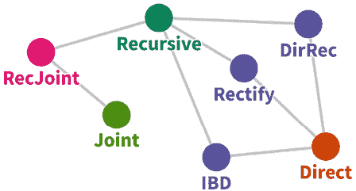

图 18.1：多步预测策略

*图 18.1*中的每个节点都是一个策略，具有共同元素的不同策略通过图中的边连接在一起。在本章的其余部分，我们将介绍这些节点（策略），并详细解释它们。

# 标准符号

让我们建立一些基本符号，帮助我们理解这些策略。我们有一个时间序列，*Y*[T]，共有*T*个时间步，*y*[1]，…，*y*[T]。*Y*[T]表示同一个序列，但结束于时间步*t*。我们还考虑一个函数，*W*，它从时间序列中生成大小为*k* > 0 的窗口。

该函数是我们为本书中所见不同模型准备输入的代理。所以，如果我们看到*W*(*Y*[t])，这意味着该函数将从以时间步*t*结束的*Y*[T]中提取一个窗口。我们还将*H*视为预测范围，其中*H* > 1。我们还将使用；作为运算符，表示连接。

现在，让我们看一下不同的策略（参考*1*是一篇关于不同策略的优秀综述文章）。关于各自优缺点以及在何种场景下使用它们的讨论将在后续章节中总结。

# 递归策略

递归策略是生成多步预测的最古老、最直观、最流行的技术。要理解一种策略，我们需要理解两个主要的领域：

+   **训练方案**：模型的训练是如何进行的？

+   **预测方案**：训练好的模型如何用于生成预测？

让我们借助一个图表来理解递归策略：

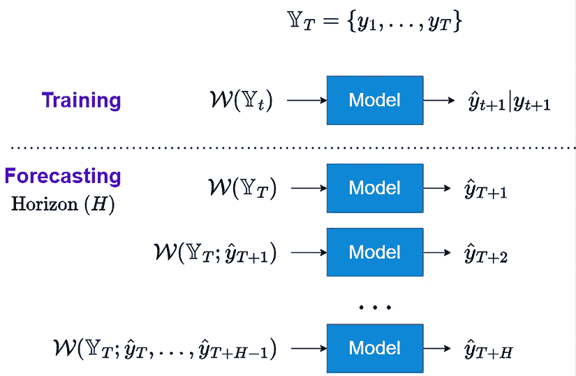

图 18.2：多步预测的递归策略

让我们详细讨论这些方案。

## 训练方案

递归策略涉及训练一个单一模型执行*一步预测*。我们可以在*图 18.2*中看到，我们使用窗口函数*W*(*Y*[t])，从*Y*[t]中绘制一个窗口，并训练模型预测*Y*[t][+1]。

在训练过程中，使用损失函数（衡量模型输出与实际值之间的差异，*Y*[t][+1]）来优化模型的参数。

## 预测方案

我们已经训练了一个模型来进行*一步预测*。现在，我们以递归方式使用这个模型生成*H*时间步的预测。对于第一步，我们使用*W*(*Y*[t])，使用训练数据中最新的时间戳生成窗口，并预测一步，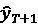。现在，这个生成的预测被添加到历史记录中，并从这个历史记录中绘制一个新窗口，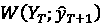。这个窗口被输入到同一个*一步预测*模型中，并生成下一个时间步的预测，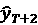。这个过程重复进行，直到我们得到所有*H*时间步的预测。

这是经受时间考验的经典模型（如*ARIMA*和*指数平滑*）在生成多步预测时内部使用的策略。在机器学习的背景下，这意味着我们将训练一个模型来预测一步，然后进行递归操作，其中我们预测一步，使用新的预测重新计算所有特征，如滞后、滚动窗口等，并预测下一步。该方法的伪代码将是：

```py
# Function to create features (e.g., lags, rolling windows, external features like holidays or item category)
def create_features(df, **kwargs):
    ## Feature Pipeline goes here ##
    # Return features DataFrame
    return features
# Function to train the model
def train_model(train_df, **kwargs):
    # Create features from the training data
    features = create_features(train_df, **kwargs)

    ## Training code goes here ##

    # Return the trained model
    return model
def recursive_forecast(model, train_df, forecast_steps, **kwargs):
    """
    Perform recursive forecasting using the trained one-step model.
    - model: trained one-step-ahead model
    - train_df: DataFrame with time series data
    - forecast_steps: number of steps ahead to forecast
    - kwargs: other parameters necessary like lag size, rolling size etc.
    """  
    forecasts = []
    for step in range(forecast_steps):
        input_features = create_features(train_df, **kwargs)
        ## Replace with actual model.predict() code ##
        next_forecast = model.predict(input_features)
        forecasts.append(next_forecast)
        train_df = train_df.append({'target': next_forecast, "other_features": other_features}, ignore_index=True)

    return forecasts 
```

在深度学习模型的背景下，我们可以将其视为将预测添加到上下文窗口，并使用训练好的模型生成下一步。该方法的伪代码将是：

```py
def recursive_dl_forecast(dl_model, train_df, forecast_steps, **kwargs):
    """
    - dl_model: trained DL model (e.g., LSTM, Transformer)
    - train_df: DataFrame with time series data (context window)
    - forecast_steps: number of steps ahead to forecast
    - kwargs: other parameters like window size, etc.
    """
    forecasts = []
    # Extract initial context window from the end of the training data
    context_window = train_df['target'].values[-kwargs['window_size']:]
    for step in range(forecast_steps):
        ## Replace with actual dl_model.predict() code ##
        next_forecast = dl_model.predict(context_window)
        forecasts.append(next_forecast)
        # Update the context window by removing the oldest value and adding the new forecast
        context_window = np.append(context_window[1:], next_forecast)

    return forecasts 
```

请注意，这个伪代码不是可直接运行的代码，而更像是一个您可以根据自己情况调整的框架。现在，让我们看另一种多步预测策略。

# 直接策略

**直接策略**，也称为独立策略，是一种在预测中使用机器学习的流行策略。这涉及独立地预测每个时间段。让我们先看一个图表：

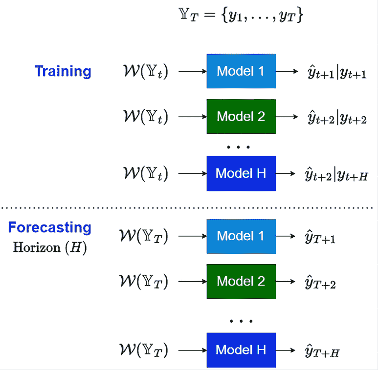

图 18.3：多步预测的直接策略

接下来，让我们详细讨论这些方案。

## 训练方案

在直接策略（*图 18.3*）下，我们训练*H*个不同的模型，这些模型接受相同的窗口函数，但被训练以预测预测时间范围内的不同时间步。因此，我们为每个时间步学习一组独立的参数，使得所有模型的组合从窗口*W*(*Y*[t])到预测时间范围*H*之间学习到一个直接且独立的映射。

随着基于机器学习的时间序列预测的流行，这种策略逐渐获得了关注。从机器学习的角度来看，我们可以通过两种方式来实际实现它：

+   **平移目标**：每个时间步的模型通过将目标平移与训练预测的时间步数一致来训练。

+   **消除特征**：每个时间步的模型通过只使用允许的特征来训练，符合规则。例如，当预测*H* = 2 时，我们不能使用滞后 1（因为要预测*H* = 2 时，我们无法获得*H* = 1 的实际值）。

上述两种方法在我们仅使用滞后作为特征时非常有效。例如，为了消除特征，我们可以简单地删除不合适的滞后并训练模型。但在使用滚动特征和其他更复杂特征的情况下，简单的删除方法并不适用，因为滞后 1 已经用于计算滚动特征，这会导致数据泄露。在这种情况下，我们可以创建一个动态函数来计算这些特征，传入一个参数来指定我们为其创建特征的时间范围。我们在*第六章*《时间序列预测的特征工程》中使用的所有辅助方法（`add_rolling_features`、`add_seasonal_rolling_features`和`add_ewma`）都有一个名为`n_shift`的参数，用于处理这种情况。如果我们为*H* = 2 训练模型，我们需要传入`n_shift=2`，然后该方法会处理剩余部分。在训练模型时，我们使用这个动态方法分别为每个时间范围重新计算这些特征。

## 预测方案

预测方案也相当直接。我们有为每个时间步训练的*H*个模型，并使用*W*(*Y*[t])来独立预测每个模型。

对于机器学习模型，这要求我们为每个时间步训练独立的模型，但`scikit-learn`中的`MultiOutputRegressor`使这一过程更加可管理。让我们看一些伪代码：

```py
# Function to create shifted targets for direct strategy
def create_shifted_targets(df, horizon, **kwargs):
    ## Add one step ahead, 2 step ahead etc targets to the feature dataframe ##
    return dataframe, target_cols
def train_direct_ml_model(train_df, horizon, **kwargs):
    # Create shifted target columns for the horizon
    train_df, target_cols = create_shifted_targets(train_df, horizon, **kwargs)
    # Prepare features (X) and shifted targets (y) for training
    X = train_df.loc[:, [c for c in train_df.columns if c not in target_cols]]
    y = train_df.loc[:, target_cols]
    # Initialize a base model (e.g., Linear Regression) and MultiOutputRegressor
    base_model = LinearRegression()  # Example: can use any other model
    multioutput_model = MultiOutputRegressor(base_model)
    # Train the MultiOutputRegressor on the features and shifted targets
    multioutput_model.fit(X, y)
    return multioutput_model
def direct_ml_forecast(multioutput_model, test_df, horizon, **kwargs):
    # Adjust based on how test_df is structured
    X_test = test_df.loc[:, features]
    # (array with H steps)
    forecasts = multioutput_model.predict(X_test)
    return forecasts 
```

现在，是时候看看另一种策略了。

# 联合策略

前两种策略考虑模型只有单一输出。这是大多数机器学习模型的情况；我们将模型设计为在接收一组输入后预测一个单一的标量值：**多输入单输出**（**MISO**）。但也有一些模型，如深度学习（DL）模型，可以配置为提供多个输出。因此，联合策略，也称为**多输入多输出**（**MIMO**），旨在学习一个单一模型，输出整个预测时间范围：

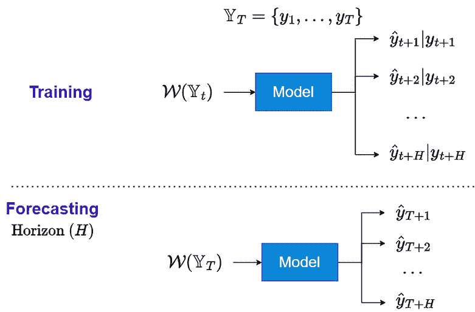

图 18.4：多步预测的联合策略

让我们看看这些方案是如何工作的。

## 训练方案

联合策略涉及训练一个单一的多输出模型，一次性预测所有时间步的结果。如*图 18.4*所示，我们使用窗口函数，*W*(*Y*[t])，从*Y*[t]中提取一个窗口，并训练模型预测*y*[t][+1]，…，*y*[t][+][H]。在训练过程中，使用一个损失函数，衡量模型所有输出与实际值（*y*[t][+1]，…，*y*[t][+][H]）之间的差异，以优化模型的参数。

## 预测方案

预测方案也非常简单。我们有一个经过训练的模型，可以预测整个时间范围的所有时间步，并且我们使用*W*(*Y*[t])一次性预测所有时间步。

该策略通常用于深度学习模型中，我们配置最后一层以输出*H*个标量，而不是 1。

我们已经在书中的多个地方看到过这种策略的应用：

+   表格回归（*第十三章*，*时间序列的常见建模模式*）范式可以轻松扩展为输出整个预测范围。

+   我们已经看到过使用这种策略进行多步预测的*Sequence-to-Sequence*模型，具有*全连接*解码器（*第十三章*，*时间序列的常见建模模式*）。

+   在*第十四章*，*时间序列的注意力与变换器*中，我们使用该策略通过变换器进行预测。

+   在*第十六章*，*用于预测的专用深度学习架构*中，我们看到像*N-BEATS*、*N-HiTS*和*Temporal Fusion Transformer*这样的模型，它们使用该策略生成多步预测。

# 混合策略

我们已经讨论的三种策略是多步预测的三种基本策略，每种策略都有其优缺点。多年来，研究人员尝试将它们结合成混合策略，旨在捕捉每种策略的优点。我们将在这里讨论一些混合策略。这不是一个全面的列表，因为不存在这样的列表。任何有足够创造力的人都可以提出替代策略，但我们将只介绍一些受预测社区关注和深入研究的策略。

## DirRec 策略

正如名字所示，**DirRec**策略是*直接*和*递归*策略的结合，用于多步预测。直接方法的一个缺点是它独立地预测每个时间步，因此在预测远期时会失去一些上下文。为了解决这个问题，我们通过使用*n*-步预测模型生成的预测作为*n+1*步预测模型的特征，将直接方法和递归方法结合起来。

让我们看一下以下图示，并加深对这个概念的理解：

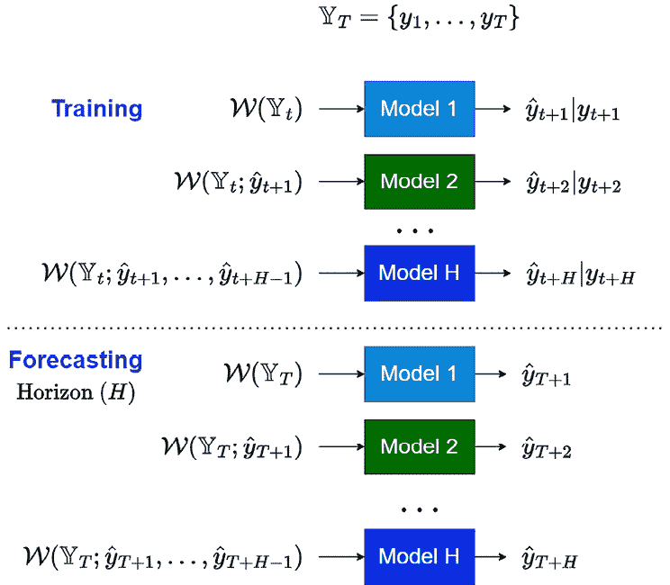

图 18.5：DirRec 策略用于多步预测

现在，让我们看看这些机制如何在 DirRec 策略中运作。

### 训练机制

与直接策略类似，DirRec 策略（*图 18.5*）也有*H*个模型来进行*H*步预测，但有所不同。我们从使用*W*(*Y*[t])开始，并训练一个模型来预测一步之后的结果。在递归策略中，我们用这个预测的时间步长在同一个模型中预测下一个时间步。而在 DirRec 中，我们为*H* = 2 训练一个独立的模型，使用在*H* = 1 时生成的预测结果。为了在时间步*h* < *H*进行泛化，除了*W*(*Y*[t])外，我们还包括了在时间步 1 到*h*之间不同模型生成的所有预测结果。

### 预测机制

预测机制就像训练机制一样，但不是训练模型，而是使用*H*训练好的模型递归地生成预测。

让我们通过一些高级伪代码来巩固我们的理解：

```py
def train_dirrec_models(train_data, horizon, **kwargs):
    models = []  # To store the trained models for each timestep
    # Train the first model to predict the first step ahead (t+1)
    model_t1 = train_model(train_data)  # Train model for t+1
    models.append(model_t1)
    for step in range(2, horizon + 1):
        previous_forecasts = []
        for prev_model in models:
            # Recursive prediction
            previous_forecasts.append(prev_model.predict(train_data))
        # Use the forecasts as features for the next model
        augmented_train_data = add_forecasts_as_features(train_data, previous_forecasts)
        # Train the next model (e.g., for t+2, t+3, ...)
        model = train_model(augmented_train_data)
        models.append(model)
    return models
def dirrec_forecast(models, input_data, horizon, **kwargs):
    forecasts = []  
    # Generate the first forecast (t+1)
    forecast_t1 = models[0].predict(input_data)
    forecasts.append(forecast_t1)
    # Generate subsequent forecasts recursively
    for step in range(1, horizon):
        augmented_input_data = add_forecasts_as_features(input_data, forecasts)
        next_forecast = models[step].predict(augmented_input_data)
        forecasts.append(next_forecast)
    return forecasts 
```

现在，让我们学习另一种创新的多步预测方法。

## 迭代块状直接策略

**迭代块状直接**（**IBD**）策略也被称为**迭代多 SVR 策略**，以致敬提出此策略的研究论文（参考文献 *2*）。直接策略需要训练*H*个不同的模型，这使得它在长时间跨度的预测中难以扩展。

IBD 策略尝试通过使用块状迭代的预测方式来解决这一短板：

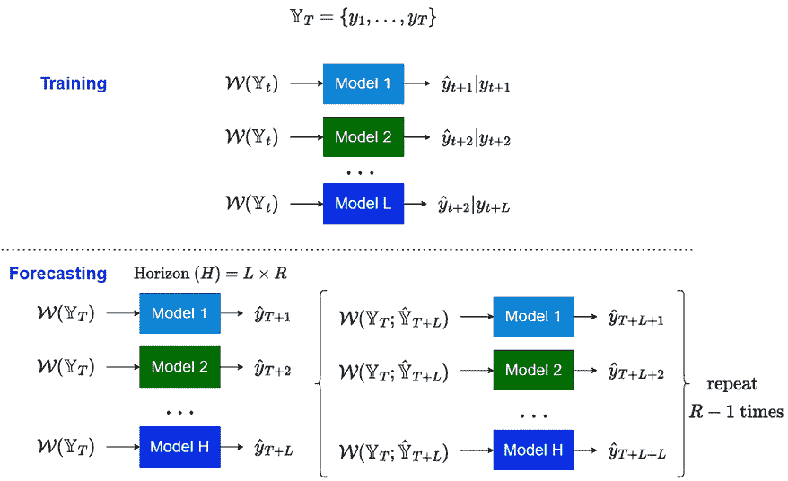

图 18.6：IBD 策略用于多步预测

让我们了解这个策略的训练和预测机制。

### 训练机制

在 IBD 策略中，我们将预测跨度*H*分成*R*个长度为*L*的块，使得*H* = *L* x *R*。我们不再训练*H*个直接模型，而是训练*L*个直接模型。

### 预测机制

在进行预测时（*图 18.6*），我们使用*L*个训练好的模型来生成*H*中前*L*个时间步（*T* + 1 到*T* + *L*）的预测，使用窗口*W*(*Y*[T])。我们将这个*L*步的预测结果表示为*Y*[T][+][L]。然后，我们将*Y*[T][+][L]和*Y*[T]一起，用于窗口函数生成一个新的窗口*W*(*Y*[T];*Y*[T][+][L])。这个新窗口用于生成接下来的*L*个时间步（*T* + *L*到*T* + 2*L*）的预测。这个过程会重复多次，直到完成整个预测跨度。

让我们来看一下这个过程的一些高级伪代码：

```py
def train_ibd_models(train_data, horizon, block_size, **kwargs):
    # Calculate the number of models (L)
    n_models = horizon // block_size
    models = []
    # Train a model for each block
    for n in range(n_models):
        block_model = train_direct_model(train_data, n)
        models.append(block_model)
    return models
def ibd_forecast(models, input_data, horizon, block_size, **kwargs):
    forecasts = []
    window = input_data  # Initial window from the time series data
    num_blocks = horizon // block_size
    # Generate forecasts block by block
    for _ in range(num_blocks):
        # Predict the next block of size L using direct models
        block_forecast = []
        for model in models:
            block_forecast.append(model.predict(window))
        # Append the block forecast to the overall forecast
        forecasts.extend(block_forecast)
        # Update the window by including the new block of predictions
        window = update_window(window, block_forecast)
    return forecasts 
```

现在，让我们转向另一种创造性地混合不同策略的方法。

## 修正策略

**修正策略**是我们可以结合直接和递归策略的另一种方式。它通过形成一个两阶段的训练和推断方法，在两者之间找到一个平衡点。我们可以将其视为一种模型堆叠方法（*第九章*，*集成与堆叠*），但它是应用于不同的多步预测策略。在第一阶段，我们训练一个一步预测模型，并使用该模型生成递归预测。

然后，在第二阶段，我们使用原始窗口和特征以及递归预测来训练针对预测区间的直接模型。

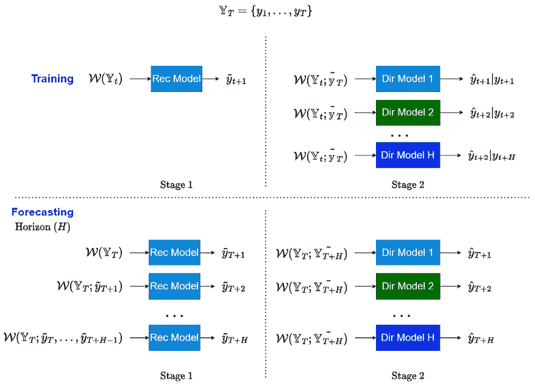

图 18.7：多步预测的修正策略

让我们详细了解一下这个策略是如何运作的。

### 训练机制

训练分为两个步骤。递归策略应用于预测区间，并生成所有*H*时间步长的预测。我们称之为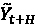。接着，我们使用原始历史数据*Y*[t]和递归预测！[](img/B22389_18_006.png)作为输入，训练针对每个预测区间的直接模型。

### 预测机制

预测机制与训练过程类似，首先生成递归预测，然后将递归预测与原始历史数据一起用于生成最终预测。

我们来看一下这个策略的高级伪代码：

```py
# Stage 1: Train recursive models
recursive_model, recursive_forecasts = train_one_step_ahead_model(train_data, horizon=horizon)
# Stage 2: Train direct models
direct_models = train_direct_models(train_data, recursive_forecasts, horizon=horizon)
def rectify_forecast(recursive_model, direct_models, input_data, horizon, **kwargs):
    # Generate recursive forecasts using the recursive model
    recursive_forecasts = generate_recursive_forecasts(recursive_model, input_data, horizon)
    # Generate final direct forecasts using original data and recursive forecasts
    direct_forecasts = generate_direct_forecasts(direct_models, input_data, recursive_forecasts, horizon)
    return direct_forecasts
forecast = rectify_forecast(recursive_model, direct_models, train_data, horizon) 
```

现在，让我们进入我们将要讨论的最后一种策略。

## RecJoint

名副其实，**RecJoint**是递归策略和联合策略的结合，但它适用于多输出模型。它通过利用递归预测的同时，考虑预测区间内多个时间步之间的依赖关系，从而平衡两者的优点。

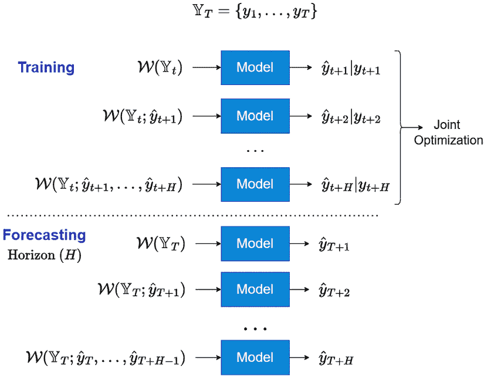

图 18.8：RecJoint 策略用于多步预测

以下部分详细介绍了该策略的工作原理。

### 训练机制

RecJoint 策略中的训练机制（*图 18.8*）与递归策略非常相似，都是训练一个模型，并通过递归使用*t* + 1 时刻的预测作为输入来训练*t* + 2 时刻的预测，依此类推。但递归策略只在下一个时间步上训练模型，而 RecJoint 则生成整个预测区间的预测，并在训练过程中共同优化整个区间的预测。这迫使模型查看接下来的*H*个时间步，并共同优化整个预测区间，而不是短视地只关注一步之遥的目标。我们在使用 RNN 编码器和解码器训练 Seq2Seq 模型时看到了这个策略的应用（*第十三章*，*时间序列的常见建模模式*）。

### 预测机制

RecJoint 的预测机制与递归策略完全相同。

现在我们已经了解了几种策略，接下来让我们讨论它们的优点和缺点。

# 如何选择多步预测策略

让我们在表格中总结一下我们已经学习的所有不同策略：

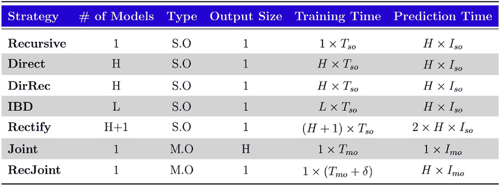

图 18.9：多步预测策略-摘要

在这里，以下内容适用：

+   *S.O*：单输出

+   *M.O*：多输出

+   *T*[SO]和*I*[SO]：单输出模型的训练和推理时间

+   *T*[mO]和*I*[mO]：多输出模型的训练和推理时间（实际上，*T*[mO]大多大于*T*[SO]，因为多输出模型通常是 DL 模型，其训练时间高于标准 ML 模型）

+   *H*：地平线

+   *L* = *H*/*R*，其中*R*是 IBD 策略中的块数

+   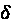是一些正实数

该表格帮助我们从多个角度理解和决定哪种策略更好：

+   **工程复杂性**：*递归*、*联合*、*RecJoint* << *IBD* << *直接*、*DirRec* << *校正*

+   **训练时间**：*递归* << *联合*（通常*T*[mO] > *T*[SO]） << *RecJoint* << *IBD* << *直接*、*DirRec* << *校正*

+   **推理时间**：*联合* << *直接*、*递归*、*DirRec*、*IBD*和*RecJoint* << *校正*

它还帮助我们决定我们可以为每种策略使用哪种模型。例如，联合策略只能使用支持多输出的模型，如 DL 模型。然而，我们还没有讨论这些策略如何影响准确性。

尽管在机器学习中，最终的结论取决于实证证据，但我们可以分析不同的方法以提供一些指导方针。*Taieb 等人*从理论上和使用模拟数据分析了这些多步预测策略的偏差和方差。

通过这种分析，以及多年来的其他实证发现，我们对这些策略的优势和劣势有了一定的了解，并且从这些发现中得出了一些指导方针。

**参考检查**：

Taieb 等人的研究论文被引用在参考文献*3*中。

*Taieb 等人*指出递归策略的几个缺点，与基于误差分析的偏差和方差成分对比，与直接策略形成对比。他们通过实证研究进一步证实了这些观察结果。

阐明性能差异的关键点如下：

+   对于递归策略，步骤*h* = 1 中的误差的偏差和方差成分会影响步骤*h* = 2。由于这种现象，递归模型的错误会随着预测地平线的进一步移动而累积。但对于直接策略，这种依赖关系不明显，因此不会像递归策略中看到的那样受到相同的恶化。这也在实证研究中看到，递归策略非常不稳定，方差最高，随着地平线的进一步移动而显著增加。

+   对于直接策略，*h* = 1 步骤中的误差的偏差和方差成分不会影响 *h* = 2。这是因为每个预测期 *h* 都是孤立预测的。这种方法的一个缺点是，它可能会在不同预测期之间生成完全不相关的预测，导致不现实的预测。直接策略无法捕捉预测期之间可能存在的复杂依赖关系。例如，在具有非线性趋势的时间序列上使用直接策略可能会导致曲线断裂，因为预测期内每个时间步的独立性。

+   实际上，在大多数情况下，直接策略产生的一致性预测效果较好。

+   当预测模型产生的预测具有较大变动时，递归策略的偏差也会被放大。已知复杂模型具有低偏差，但有较大的变动，这些较大的变动似乎会放大递归策略模型的偏差。

+   当我们有非常大的数据集时，直接策略的偏差项会变为零，而递归策略的偏差仍然不为零。实验进一步证明了这一点——对于长时间序列，直接策略几乎总是优于递归策略。从学习理论的角度来看，直接策略使用数据学习 *H* 个函数，而递归策略只学习一个函数。因此，在相同数据量的情况下，学习 *H* 个真实函数比学习一个函数更为困难。这在数据量较少的情况下尤为突出。

+   尽管递归策略在理论和实证上似乎不如直接策略，但它并非没有一些优势：

    +   对于高度非线性和噪声较大的时间序列，学习所有预测期的直接函数可能会很困难。在这种情况下，递归策略可能表现得更好。

    +   如果基础的**数据生成过程**（**DGP**）非常平滑且容易逼近，递归策略可能表现得更好。

    +   当时间序列较短时，递归策略可能表现得更好。

+   我们提到过直接策略可能会生成预测期之间不相关的预测，但正是联合策略解决了这一问题。联合策略可以被看作是直接策略的扩展，但它并不是拥有 *H* 个不同的模型，而是一个模型产生 *H* 个输出。我们从给定数据中学习一个函数，而不是 *H* 个函数。因此，联合策略不会像直接策略那样在短时间序列中表现出同样的弱点。

+   联合策略（和 RecJoint）的一个弱点是对于非常短的预测期（如 *H* = 2, *H* = 3 等）的高偏差。我们学习了一个模型，该模型使用标准损失函数（如均方误差）在整个 *H* 时间步内进行优化。但这些误差的尺度是不同的。随着时间延续，可能发生的误差会比短期的误差大，这隐式地使得模型更加重视较长的预测期；因此，模型学习到的函数倾向于使较长的预测期更加准确。

+   联合策略和 RecJoint 策略从方差的角度来看是可比的。然而，联合策略可以给我们带来更低的偏差，因为 RecJoint 策略学习的是递归函数，可能没有足够的灵活性来捕捉模式。联合策略充分利用预测模型的全部能力来直接预测未来的时间段。

混合策略，如 DirRec、IBD 等，试图平衡基础策略（如直接预测、递归预测和联合预测）的优缺点。通过这些优缺点，我们可以创建一个有根据的实验框架，以便为当前问题找出最佳策略。

# 总结

在这一章中，我们探讨了一个与实际应用密切相关但很少被讨论和研究的预测问题。我们了解了为何需要多步预测，并随后回顾了几种可以使用的流行策略。我们探讨了如直接预测、递归预测和联合预测等流行且基础的策略，接着又分析了几种混合策略，如 DirRec、rectify 等。最后，我们讨论了这些策略的优缺点，并提出了选择适合问题的策略的一些指南。

在下一章中，我们将探讨预测的另一个重要方面——评估。

# 参考文献

以下是我们在本章中使用的参考文献列表：

1.  Taieb, S.B., Bontempi, G., Atiya, A.F., and Sorjamaa, A. (2012). *基于 NN5 预测竞赛的多步时间序列预测策略综述与比较*。专家系统应用，39，7067–7083: [`arxiv.org/pdf/1108.3259.pdf`](https://arxiv.org/pdf/1108.3259.pdf)

1.  Li Zhang, Wei-Da Zhou, Pei-Chann Chang, Ji-Wen Yang, 和 Fan-Zhang Li. (2013). *基于多个支持向量回归模型的迭代时间序列预测*。神经计算，2013 年第 99 卷: [`www.sciencedirect.com/science/article/pii/S0925231212005863`](https://www.sciencedirect.com/science/article/pii/S0925231212005863)

1.  Taieb, S.B. and Atiya, A.F. (2016). *多步时间序列预测的偏差与方差分析*。IEEE 神经网络与学习系统学报，2016 年 1 月，第 27 卷，第 1 期，62–76 页: [`ieeexplore.ieee.org/document/7064712`](https://ieeexplore.ieee.org/document/7064712)

# 加入我们在 Discord 上的社区

加入我们社区的 Discord 空间，与作者和其他读者进行讨论：

[`packt.link/mts`](https://packt.link/mts)


