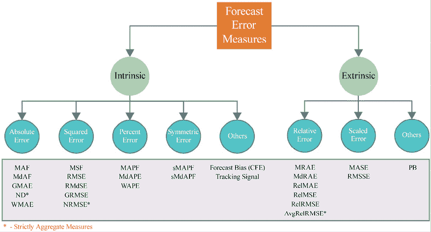
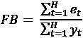
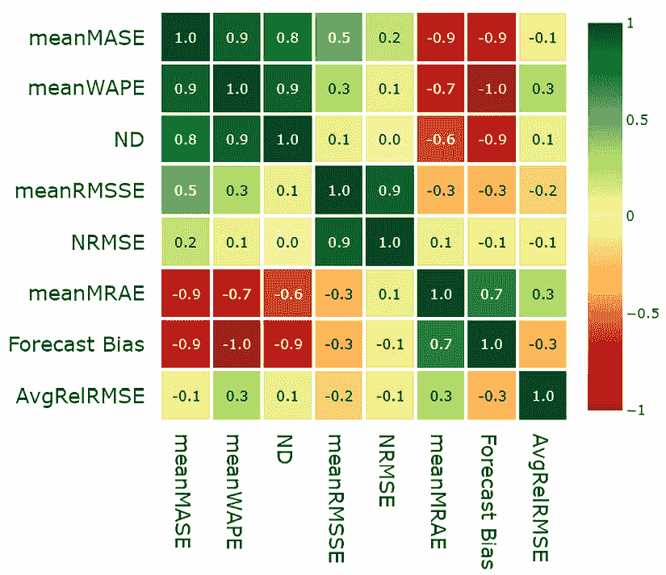

# 第十九章：评估预测误差——预测度量的调查

我们在上一章开始探讨预测的细微差别，学习了如何生成多步预测。虽然那涵盖了一个方面，但预测的另一个方面同样重要且令人困惑——*如何评估预测*。

在现实世界中，我们生成预测是为了让一些下游过程能够更好地规划并采取相关行动。例如，一家自行车租赁公司运营经理应决定第二天下午 4 点在地铁站应该提供多少辆自行车。然而，他可能并不只是盲目使用这些预测，而是希望了解哪些预测他应该相信，哪些预测不应该相信。这只能通过衡量预测的准确性来实现。

我们在整本书中已经使用了一些度量，现在是时候深入了解这些度量，了解何时使用它们，何时不使用它们。我们还将通过实验阐明这些度量的一些方面。

本章将涵盖以下几个主要内容：

+   预测误差度量的分类

+   研究误差度量

+   误差度量的实验研究

+   选择度量的指南

# 技术要求

你需要按照本书*前言*中的说明，设置 Anaconda 环境，以便获得包含本书所需的所有软件包和数据集的工作环境。

本章相关的代码可以在这里找到：[`github.com/PacktPublishing/Modern-Time-Series-Forecasting-with-Python/tree/main/notebooks/Chapter19`](https://github.com/PacktPublishing/Modern-Time-Series-Forecasting-with-Python/tree/main/notebooks/Chapter19)。

对于本章，你需要运行本书 GitHub 仓库中 `Chapters02` 和 `Chapter04` 文件夹里的笔记本。

# 预测误差度量的分类

> 测量是通向控制和最终改进的第一步。
> 
> – H. James Harrington

传统上，在回归问题中，我们有非常少的通用损失函数，例如均方误差或平均绝对误差，但当你进入时间序列预测的领域时，你会遇到各种各样的不同度量。

由于本书的重点是点预测（而非概率预测），我们将专注于回顾点预测度量。

有一些关键因素区分了时间序列预测中的度量：

+   **时间相关性**：我们所做的预测的时间维度是预测范式中的一个重要方面。像预测偏差和跟踪信号这样的度量会考虑到这一方面。

+   **聚合指标**：在大多数商业用例中，我们通常不是预测单一的时间序列，而是一组时间序列，这些序列可能相关也可能无关。在这种情况下，查看单个时间序列的指标变得不可行。因此，应该有能够捕捉这些时间序列组合特征的指标。

+   **过度预测或低估预测**：时间序列预测中的另一个关键概念是过度预测和低估预测。在传统的回归问题中，我们不太关心预测结果是否大于或小于预期，但在预测范式中，我们必须小心那些总是过度或低估预测的结构性偏差。当这些偏差与时间序列的时间维度相结合时，会积累错误，导致下游规划出现问题。

上述因素以及其他一些因素导致了预测指标数量的爆炸性增长。在 Hewamalage 等人（参考文献*1*）最近的一篇调查论文中，涵盖的指标数量达到了*38*。让我们尝试将这些指标统一到某个结构下。*图 19.1*展示了预测误差度量的分类法：



图 19.1：预测误差度量的分类法

我们可以语义上将不同的预测指标分为两类——**内在**和**外在**。*内在*指标仅使用生成的预测和对应的实际值来度量预测的准确性。顾名思义，这是一种非常向内看的指标。而*外在*指标则除了使用生成的预测和实际数据外，还使用外部参考或基准来衡量预测质量。

在我们开始讨论指标之前，先建立一些符号来帮助我们理解。*y*[t] 和  分别表示时间 *t* 的实际观测值和预测值。预测的时间范围用 *H* 表示。在拥有时间序列数据集的情况下，我们假设有 *M* 个时间序列，通过 *m* 索引，最后， 表示时间步 *t* 的误差。现在，让我们从内在指标开始。

## 内在指标

内在指标用于评估没有任何外部信息的预测。这些是模型开发、超参数调优等的理想选择。这并不意味着我们不能使用这种类型的指标向非技术人员报告性能，但它必须通过其他基准来进行限定，以展示我们做得如何。

有四种主要的基础误差——绝对误差、平方误差、百分比误差和对称误差——它们以不同的方式在各种指标中被聚合或总结。因此，这些基础误差的任何属性也适用于聚合的误差，因此我们先来看看这些基础误差。

### 绝对误差

误差，*e*[t]，可以是正数或负数，这取决于是否 ，但是当我们计算并在时间范围内累加这个误差时，正负误差可能会相互抵消，从而描绘出一个过于乐观的画面。因此，我们在 *e*[t] 上加一个函数，以确保误差不会相互抵消。

绝对函数是以下这些函数之一：*绝对误差* (*AE*) = |*e*[t]|。绝对误差是尺度依赖性误差。这意味着误差的大小取决于时间序列的尺度。例如，如果你有一个 *AE* 值为 10，它本身并不意味着什么，直到你把它放到上下文中来看。对于一个值在 500 到 1,000 之间的时间序列，*AE* 值为 10 可能是一个非常好的数字，但如果时间序列的值在 50 到 70 之间，那么它就是差的。

当我们查看单个时间序列时，尺度依赖性并不是一个致命的问题，但当我们聚合或比较多个时间序列时，尺度依赖性误差会倾向于大规模时间序列，扭曲指标。这里需要注意的有趣一点是，这不一定是坏事。有时候，时间序列中的尺度是有意义的，从业务角度看，更关注大规模时间序列而非小规模时间序列是合理的。例如，在零售场景中，人们更愿意准确预测热销产品的销售，而不是低销量产品。在这些情况下，使用尺度依赖性误差自然会偏向于热销产品。

你可以通过自己进行实验来验证这一点。生成一个随机时间序列，*A*。然后，同样地，生成这个时间序列的随机预测，*F*。现在，我们将预测值 *F* 和时间序列 *A* 乘以 100，得到两个新的时间序列及其预测值，分别为 *A*[scaled] 和 *F*[scaled]。如果我们计算这两组时间序列和预测的预测指标，依赖尺度的指标会给出非常不同的值，而不依赖尺度的指标则会给出相同的值。

许多指标都是基于这种误差的：


+   **平均绝对误差** (**MAE**):

    +   **中位绝对误差**：*MdAE* = *median*(|*e*[t]|)

    +   **几何平均绝对误差**：

+   **加权平均绝对误差**：这是一种更为深奥的方法，允许你在时间范围内对特定的时间步加大权重：


在这里，*w*[t] 是特定时间步的权重。这可以用来为特殊的日子（如周末或促销日）分配更多的权重。

+   **标准化偏差** (**ND**)：这是一个严格用于计算时间序列数据集上聚合指标的指标。它也是行业中用于衡量不同时间序列聚合性能的流行指标之一。这个指标不是无量纲的，会倾向于较大规模的时间序列。这个指标与另一个指标——**加权平均百分比误差** (**WAPE**) 有着密切的联系。我们将在后续章节讨论这些联系。

为了计算 ND，我们只需将所有时间序列和时间范围内的绝对误差相加，然后通过实际观测值进行缩放：


### 平方误差

平方是另一种将误差变为正数的函数，从而防止误差相互抵消：


有许多基于此误差的指标：


+   **均方误差**：

    +   **均方根误差** (**RMSE**):

    

    +   **根中位数平方误差**：

    

    +   **几何均方根误差**：

    

+   **标准化均方根误差** (**NRMSE**)：这个指标与 ND 在本质上非常相似。唯一的区别在于，我们取的是分子中平方误差的平方根，而不是绝对误差：


### 百分比误差

虽然绝对误差和平方误差是与尺度相关的，但百分比误差是无量纲的误差度量。在百分比误差中，我们使用实际时间序列的观测值来对误差进行缩放：。一些使用百分比误差的指标如下：

+   **均值绝对百分比误差** (**MAPE**):


+   **中位数绝对百分比误差**：


+   **WAPE**：WAPE 是一个承认尺度依赖性的指标，并显式地根据时间步长的尺度加权误差。如果我们希望对时间范围内的高值给予更多关注，可以对这些时间步进行更高的加权。我们不是简单地取平均值，而是使用加权平均来计算绝对百分比误差。权重可以是任何值，但通常情况下，它会选择为观测值的数量。而在这种特殊情况下，数学运算（在某些假设下）会变成一个简单的公式，这个公式与 ND 类似。不同之处在于，ND 是一个在多个时间序列上聚合的指标，而 WAPE 则是一个在时间步长上加权的指标：


### 对称误差

百分比误差存在一些问题——它是不对称的（我们稍后会在本章中详细讨论），而且当实际观测值为零时，它会崩溃（因为会发生除零错误）。对称误差被提出作为一种替代方法，以避免这种不对称性，但事实证明，对称误差本身也是不对称的——稍后我们会进一步讨论这一点，但现在，让我们先了解什么是对称误差：


在这个基础误差下，只有两种指标是常用的：

+   **对称平均绝对百分比误差** (**sMAPE**):


+   **对称中位绝对百分比误差**：


### 其他内在指标

还有一些其他指标是内在的，但不符合其他指标的标准。最为显著的是三种衡量预测过度或不足预测的指标：

+   **累积预测误差** (**CFE**)：CFE 只是所有误差的总和，包括误差的符号。在这里，我们希望正负误差相互抵消，以便我们理解在给定的预测区间内，预测是持续过度预测还是不足预测。接近零的 CFE 表示预测模型既没有过度预测，也没有不足预测：


+   **预测偏差** (**FB**)：虽然 CFE 衡量的是过度和不足预测的程度，但它仍然依赖于规模。当我们想要跨时间序列进行比较或直观理解过度或不足预测的程度时，可以通过实际观测值来缩放 CFE。这就是所谓的预测偏差：



+   **跟踪信号** (**TS**)：跟踪信号是另一个用于衡量预测中过度和不足预测的指标。虽然 CFE 和预测偏差更多地用于离线处理，但跟踪信号则适用于在线环境，在这种环境下，我们会按周期性时间间隔（如每小时或每周）跟踪过度和不足预测。它帮助我们检测预测模型中的结构性偏差。通常，跟踪信号会与一个阈值一起使用，当超过或低于该阈值时，会触发警告。虽然经验法则是使用 ，但完全由你决定为你的问题选择合适的阈值。值 3.75 源自正态分布的性质，对应于 99% 的置信区间，这意味着该值足够灵敏，当存在结构性偏差时会触发警报，同时避免了假阳性。

但归根结底，这个值应该只是一个起点，用于启动回溯测试，以找出在你的数据中引发正确警报的阈值：


这里，*w* 是计算 *TS* 的过去窗口。

现在，让我们将注意力转向一些外部指标。

## 外部指标

外部度量通过将预测结果与实际结果进行比较，并且与一些外部参考或基准进行对比来评估预测质量。这可以是一个基准模型、行业标准或竞争对手的预测。这些度量更适合向非技术人员报告模型的表现，因为他们可以立即了解模型的效果。如果你有一个现有的预测，并试图改进它，将该预测作为参考会立即让你的度量变得可解释。

外部度量下有两大类度量——相对误差和缩放误差。

### 相对误差

内在度量的一个问题是，除非存在基准得分，否则它们的意义不大。例如，如果我们听到 MAPE 为 5%，它的意义不大，因为我们不知道该时间序列的可预测性。也许 5% 是一个较差的误差率。相对误差通过在计算中加入基准预测来解决这个问题，这样我们衡量的预测误差就可以与基准进行比较，从而展示预测的相对增益。因此，除了我们已经建立的符号外，我们还需要添加一些内容。

让  为基准的预测， 为基准误差。我们可以通过两种方式将基准纳入度量中：

+   使用来自基准预测的误差来缩放预测的误差

+   使用来自基准预测的预测度量来缩放我们正在衡量的预测的度量

让我们来看一些相对误差：

+   **平均相对绝对误差**（**MRAE**）：


+   **中位数相对绝对误差**：


+   **几何平均相对绝对误差**：


+   **相对平均绝对误差**（**RelMAE**）：

，其中  是基准预测的 MAE。

+   **相对均方根误差**（**RelRMSE**）：

，其中  是基准预测的 RMSE。

+   **平均相对绝对误差**：Davydenko 和 Fildes（参考文献 *2*）提出了另一个度量指标，专门用于计算时间序列的汇总得分。他们认为，使用个别时间序列的相对绝对误差（RelMAE）的几何平均值比算术平均值更好，因此他们定义了平均相对绝对误差如下：


### 缩放误差

Hyndman 和 Koehler 在 2006 年引入了缩放误差的概念。这是相对误差的替代方法，旨在克服选择基准预测时的一些缺点和主观性。缩放误差使用基准方法的样本内 MAE（如天真预测）来缩放预测误差。设整个训练历史为 *T* 时间步，由 *i* 索引。

因此，缩放误差定义如下：


有几个度量采用了这一原则：

+   **均值绝对标准化误差**（**MASE**）：


+   **均方根标准化误差**（**RMSSE**）：为平方误差开发了一种类似的标准化误差，并在 2020 年的 M5 预测竞赛中使用：


### 其他外部度量

还有一些不属于我们所做的误差分类的外部度量。一个这样的误差度量如下。

**百分比改进**（**PB**）是一种基于计数的方法，可以应用于单个时间序列以及时间序列数据集。其思路是使用基准方法，并统计给定方法优于基准的次数，结果以百分比的形式报告。正式地，我们可以使用 MAE 作为参考误差来定义它，公式如下：


这里，是一个指示函数，如果条件为真，则返回 1，否则返回 0。

我们在前面的章节中看到了很多度量，现在是时候进一步理解它们的工作原理以及它们适用的场景了。

# 调查误差度量

仅仅知道不同的度量是不够的；我们还需要理解它们是如何工作的，适用于什么场景，哪些不适用。我们可以从基本误差开始，逐步了解，因为理解*绝对误差*、*平方误差*、*百分比误差*和*对称误差*等基本误差的性质，也有助于我们理解其他度量，因为大多数其他度量都是这些基础误差的派生，或者是通过聚合它们或使用相对基准来计算的。

让我们通过一些实验来进行调查，并通过结果来理解它们。

**笔记本警告：**

用于自行运行这些实验的笔记本是`01-Loss_Curves_and_Symmetry.ipynb`，位于`Chapter19`文件夹中。

## 损失曲线和互补性

所有这些基础误差都依赖于两个因素——预测值和实际观测值。我们可以通过固定一个并改变另一个，在对称的潜在误差范围内检查这些度量的行为。预期是度量在两侧的表现应该相同，因为在任何一侧偏离实际观测值都应该在无偏度量中受到同样的惩罚。我们还可以交换预测值和实际观测值；这同样不应影响度量。

在笔记本中，我们进行了这些实验——损失曲线和互补对。

### 绝对误差

当我们绘制这些绝对误差时，得到的图形是*图 19.2*：


图 19.2：绝对误差的损失曲线和互补对

第一张图将带符号的误差与绝对误差进行了绘制，第二张图则将绝对误差与所有实际值和预测值的组合绘制出来，这些组合加起来为 10。两张图显然是对称的，这意味着偏离实际值的误差在两侧受到相同的惩罚，如果我们交换实际观察值和预测值，指标保持不变。

### 平方误差

现在，让我们来看一下平方误差：


图 19.3：平方误差的损失曲线和互补对

这些图表看起来也有对称性，因此平方误差也不存在不对称的误差分布问题——但我们在这里注意到一件事。平方误差随着误差增大而呈指数增长。这揭示了平方误差的一个特性——它对离群值赋予了过高的权重。如果有一些时间步长的预测非常差，而其他所有时间点的预测都非常好，平方误差就会膨胀这些离群误差的影响。

### 百分比误差

现在，让我们来看一下百分比误差：


图 19.4：百分比误差的损失曲线和互补对

我们的对称性就这样消失了。当你从实际值向两侧偏移时，百分比误差是对称的（主要是因为我们保持实际值不变），但互补对给我们讲述了完全不同的故事。当实际值是 1 而预测值是 9 时，百分比误差为 8，但当我们交换它们时，百分比误差降至 1。这样的不对称性可能导致指标偏向低估预测。在*图 19.4*的第二张图的右半部分，都是低估预测的情况，我们可以看到，与左半部分相比，那里的误差非常小。

我们将在另一个实验中详细查看低估和高估预测。

### 对称误差

现在，让我们继续，看看我们遇到的最后一种误差——对称误差：


图 19.5：对称误差的损失曲线和互补对

提出对称误差主要是因为我们在百分比误差中看到的不对称性。使用百分比误差的 MAPE 是最流行的指标之一，而 sMAPE 的提出就是为了直接挑战并取代 MAPE。正如它所声称的那样，它确实解决了百分比误差中存在的不对称性。然而，它也引入了自身的不对称性。在第一张图中，我们可以看到，对于特定的实际值，如果预测值在两侧移动，受到的惩罚是不同的，因此，实际上，这个指标偏向高估预测（这与百分比误差偏向低估预测正好相反）。

### 外部误差

完成所有内在度量之后，我们也可以看看外在度量。对于外在度量，绘制损失曲线并检查对称性并不容易。我们不再仅有两个变量，而是有三个——实际观测值、预测值和参考预测值。度量的值可以随着这些变量中的任何一个变化。我们可以使用等高线图来展示这一点，如*图 19.6*所示：


图 19.6：损失表面的等高线图—相对绝对误差和绝对缩放误差

等高线图使我们能够在 2D 图中绘制三维数据。两个维度（误差和参考预测）位于*X*轴和*Y*轴上。第三个维度（相对绝对误差和绝对缩放误差值）则通过颜色表示（参考颜色图像文件：[`packt.link/gbp/9781835883181`](https://packt.link/gbp/9781835883181)），等高线将同色区域分开。误差围绕误差（水平）轴对称。这意味着，如果我们保持参考预测不变并改变误差，两个度量在误差两侧变化的幅度是一样的。这并不令人惊讶，因为这两个误差都源于绝对误差，而我们知道绝对误差是对称的。

有趣的观察是对参考预测的依赖性。我们可以看到，对于相同的误差，*相对绝对误差*在不同的参考预测下具有不同的值，但*缩放误差*则没有这个问题。这是因为它不直接依赖于参考预测，而是使用了天真的预测的 MAE（平均绝对误差）。这个值对于一个时间序列是固定的，消除了选择参考预测的任务。因此，缩放误差对于绝对误差具有良好的对称性，并且对参考预测的依赖性很小或是固定的。

## 偏向于过度预测或不足预测

我们在查看的一些指标中看到了偏向过度预测或不足预测的迹象。事实上，看起来流行的指标 MAPE 倾向于不足预测。为了最终验证这一点，我们可以用合成生成的时间序列进行另一个实验；在这个实验中，我们包含了更多的指标，这样我们就能知道哪些指标是安全的，哪些需要仔细查看。

**笔记本警告：**

你可以在`Chapter19`文件夹中的`02-Over_and_Under_Forecasting.ipynb`笔记本上运行这些实验。

实验简单且详细，步骤如下：

1.  我们从一个均匀分布中随机抽取一个长度为 100 的整数计数时间序列，范围在`2`到`5`之间：

    ```py
    np.random.randint(2,5,n) 
    ```

1.  我们使用相同的过程生成预测值，该值也是从`2`到`5`之间的均匀分布中抽取的：

    ```py
    np.random.randint(2,5,n) 
    ```

1.  现在，我们生成两个额外的预测，一个是从`0`到`4`的均匀分布，另一个是从`3`到`7`的均匀分布。前者主要低估预测，后者则是过度预测：

    ```py
    np.random.randint(0,4,n)# Underforecast
    np.random.randint(3,7,n) # Overforecast 
    ```

1.  我们使用所有三种预测计算我们要调查的所有度量。

1.  我们重复实验 10,000 次，以平衡随机抽样的影响。

实验完成后，我们可以绘制不同度量的箱型图，展示每个度量在这三种预测中，经过 10,000 次实验运行后的分布情况。让我们看看*图 19.7*中的箱型图：


图 19.7：过度预测与低估预测实验

让我们首先讨论一下我们期望从这个实验中得到的结果。过度预测（绿色）和低估预测（红色）的误差将大于基线（蓝色）。过度预测和低估预测的误差应该是相似的。

总结一下我们的主要发现：

+   MAPE 明显偏向低估预测，其 MAPE 值低于过度预测的 MAPE 值。

+   WAPE，尽管基于百分比误差，但通过明确的加权方式克服了这一问题。这可能抵消了百分比误差所带来的偏差。

+   sMAPE 在尝试修正 MAPE 时，反而在相反方向上表现得更差。sMAPE 强烈偏向于过度预测。

+   基于绝对误差和平方误差的度量（如 MAE 和 RMSE）不会偏向过度预测或低估预测。

+   MASE 和 RMSSE（都使用了尺度误差的版本）也表现良好。

+   MRAE，尽管在参考预测方面存在一些不对称性，但从过度预测和低估预测的角度来看，结果是无偏的。

+   基于绝对误差和平方误差的相对度量（RelMAE 和 RelRMSE）也没有对过度预测或低估预测产生偏向。

+   平均绝对百分比误差的相对度量 RelMAPE，继承了 MAPE 对低估预测的偏向。

我们已经调查了不同错误度量的几个特性，并理解了其中一些度量的基本特性。为了进一步理解并帮助我们选择适合我们问题的度量，让我们做一个使用本书中一直使用的伦敦智能电表数据集的实验。

# 错误度量的实验研究

正如我们之前讨论的那样，过去几年里，许多人提出了许多不同的预测度量。尽管这些度量有许多不同的公式，但它们所衡量的内容可能是相似的。因此，如果我们在建模时要选择一个主要和次要度量，我们应当选择一些多样的度量，涵盖预测的不同方面。

通过这个实验，我们将尝试找出这些指标之间的相似性。我们将使用本书中一直使用的*伦敦智能电表*数据集的一个子集，并为每个家庭生成一些预测。我选择使用 `darts` 库进行这个练习，因为我想进行多步预测。我使用了五种不同的预测方法——季节性朴素法、指数平滑法、Theta、FFT 和 LightGBM（本地）——并生成了预测。除此之外，我还对所有这些预测计算了以下指标：MAPE、WAPE、sMAPE、MAE、MdAE、MSE、RMSE、MRAE、MASE、RMSSE、RelMAE、RelRMSE、RelMAPE、CFE、预测偏差和 PB(MAE)。除了这些，我们还计算了几个汇总指标：meanMASE、meanRMSSE、meanWAPE、meanMRAE、AvgRelRMSE、ND 和 NRMSE。

## 使用 Spearman 等级相关性

实验的基础是，如果不同的指标度量相同的潜在因子，那么它们也会在不同的家庭中对预测进行相似的排名。例如，如果我们说 MAE 和 MASE 测量的是预测的一个潜在属性，那么这两个指标会对不同家庭给出相似的排名。在汇总层面上，有五个不同的模型和汇总指标，它们度量相同的潜在因子，也应该以相似的方式对它们进行排名。

让我们首先看看汇总指标。我们使用每个指标在汇总层面上对不同的预测方法进行了排名，然后计算了排名的 Pearson 相关性。这给我们提供了预测方法和指标之间的 Spearman 等级相关性。相关性矩阵的热图（请参见彩色图片文件：[`packt.link/gbp/9781835883181`](https://packt.link/gbp/9781835883181)）在*图 19.8*中：



图 19.8：预测方法与汇总指标之间的 Spearman 等级相关性

主要的观察结论如下：

+   我们可以看到，*meanMASE*、*meanWAPE* 和 *ND*（都基于绝对误差）高度相关，表明它们可能在测量预测的相似潜在因子。

+   另一个高度相关的指标对是*meanRMSSE*和*NRMSE*，它们都基于平方误差。

+   *meanMASE* 和 *meanRMSSE* 之间有弱相关性，可能是因为它们都使用了缩放误差。

+   *meanMRAE* 和 *预测偏差* 似乎高度相关，尽管没有强有力的依据表明它们有共同的行为。这些相关性可能是偶然的，需要在更多数据集上进一步验证。

+   *meanMRAE* 和 *AvgRelRMSE* 似乎测量的是与其他指标和彼此非常不同的潜在因子。

同样地，我们计算了所有家庭之间预测方法与度量标准的斯皮尔曼秩相关系数（*图 19.9*）。这使我们能够在项目级别进行与之前相同的比较：


图 19.9：预测方法与项目级度量标准之间的斯皮尔曼秩相关系数

主要观察结果如下：

+   我们可以看到，有五个高度相关的度量标准簇（五个较深的绿色框）。

+   第一组是 *MASE* 和 *RMSSE*，它们高度相关。这可能是因为这两个度量标准都采用了比例误差公式。

+   *WAPE*、*MAPE* 和 *sMAPE* 是第二组。坦白说，这有点让人困惑，因为我本以为 *MAPE* 和 *sMAPE* 的相关性较低。它们确实从过度预测和欠预测的角度表现得相反。也许我们用来检查这个相关性的所有预测都没有出现过度或欠预测，因此相似性通过共享的百分比误差基础显现出来。这需要进一步调查。

+   *MAE*、*MdAE*、*MSE* 和 *RMSE* 形成了第三组高度相似的度量标准。*MAE* 和 *MdAE* 都是绝对误差度量，而 *MSE* 和 *RMSE* 都是平方误差度量。它们之间的相似性可能是因为预测中没有异常误差。这两种基本误差的唯一区别在于，平方误差对异常误差赋予了更大的权重。

+   下一个类似度量标准的组合是各种相对度量——*MRAE*、*RelMAE*、*RelRMSE*、*RelMAPE* 和 *PB(MAE)*——但该组之间的相关性不如其他组强。相关性较低的度量标准对是 *MRAE* 和 *RelRMSE* 以及 *RelMAPE* 和 *RelRMSE*。

+   最后一组与其他任何度量标准的相关性较低，但彼此之间的相关性较高的是 *预测偏差* 和 *CFE*。这两个度量标准都是基于无符号误差计算的，衡量的是过度预测或欠预测的程度。

+   如果我们查看组间相似性，唯一突出的是比例误差组与绝对误差和平方误差组之间的相似性。

在聚合度量上的斯皮尔曼秩相关性是使用单一数据集计算的，需要谨慎对待。项目级别的相关性具有更大的意义，因为它是基于多个家庭的数据进行计算的，但其中仍有一些内容值得进一步调查。我建议你在其他数据集上重复这个实验，检查是否看到相同的模式再将其作为规则采用。

现在我们已经探讨了不同的度量标准，是时候总结一下，并给出一些选择度量标准的指南了。

# 选择度量标准的指南

在本章中，我们逐渐认识到，选择一个预测指标并普遍适用是困难的。每个指标都有其优缺点，选择指标时意识到这些优缺点才是唯一理性的做法。

让我们总结一下，并记录在本章中通过不同实验得出的一些要点：

+   绝对误差和平方误差都是对称损失，且在低估或高估的角度上是无偏的。

+   平方误差确实有放大离群误差的倾向，因为其中包含平方项。因此，如果我们使用基于平方误差的指标，我们将比小误差更大幅度地惩罚高误差。

+   RMSE 通常优于 MSE，因为 RMSE 与原始输入在同一尺度上，因此它的解释性更强。

+   百分比误差和对称误差并非在完整意义上是对称的，分别偏向低估和高估。MAPE，作为一种非常流行的指标，存在这一缺点。例如，如果我们在进行需求预测，优化 MAPE 会导致你选择一个保守的预测，从而低估预测值。这将导致库存短缺和缺货情况。尽管存在各种缺点，sMAPE 目前已不再受到实践者的青睐。

+   相对度量是一个很好的替代百分比误差基础的指标，因为它们也本质上是可解释的，但相对度量依赖于基准方法的质量。如果基准方法表现不佳，相对度量将倾向于减弱模型的误差影响。另一方面，如果基准预测接近近乎零误差的 oracle 预测，相对度量将夸大模型的误差。因此，在选择基准预测时必须小心，这是一个额外的考虑因素。

+   尽管几何平均数相较于算术平均数有一些优点（例如对离群值的抵抗力和在数据变化剧烈时的更好近似），它也并非没有自身的问题。基于几何平均数的度量意味着，即使单一系列（在聚合时间序列时）或单一时间步（在聚合时间步时）表现得非常好，由于乘法效应，整体误差将大幅下降。

+   PB，尽管是一个直观的指标，但有一个缺点。我们仅仅是在计算我们表现更好的实例次数。然而，它并没有评估我们做得好或不好的程度。无论我们的误差比参考误差低 50% 还是 1%，对 PB 得分的影响是一样的。

Hewamalage 等人（参考文献*1*）提出了一张非常详细的流程图，帮助决策，但这也更像是一个关于什么不应该使用的指南。选择单一的指标是一个非常有争议的任务。关于这一点有很多相互矛盾的观点，我仅仅是其中的一个声音。以下是我提出的几条建议，帮助你选择合适的预测指标：

+   避免使用*MAPE*。无论在哪种情况下，总有更好的指标来衡量你想要的结果。至少，单一时间序列数据集要坚持使用*WAPE*。

+   对于单一时间序列数据集，最佳的选择指标是*MAE*或*RMSE*（取决于你是否希望更多地惩罚较大的误差）。

+   对于多个时间序列数据集，使用*ND*或*NRMSSE*（取决于你是否希望更多地惩罚较大的误差）。作为第二选择，*meanMASE*或*meanRMSSE*也可以使用。

+   如果时间序列中发生了较大变化（在我们测量的时间范围内，时间序列水平发生了巨大变化），可以使用*PB*或*MRAE*等指标。

+   无论你选择哪种指标，始终确保使用*预测偏差*、*CFE*或跟踪信号来关注结构性过度或不足预测的问题。

+   如果你要预测的时间序列是间歇性的（即，具有很多值为零的时间步），使用*RMSE*并避免使用*MAE*。*MAE*倾向于偏好生成全零的预测结果。避免使用基于百分比误差的所有指标，因为间歇性揭示了这些指标的另一个缺点——当实际观测值为零时，它们是未定义的（*进一步阅读*部分有一个链接，探讨了间歇性序列的其他指标）。

恭喜你完成了这一章，里面有许多新的术语和指标。希望你已经获得了必要的直觉，能够智能地选择下一个预测任务中应该专注的指标！

# 总结

在本章中，我们探讨了一个人口密集且争议颇多的预测指标领域。我们从预测度量的基本分类法开始，帮助你对这一领域的所有指标进行分类和整理。

然后，我们通过一些实验，了解了这些指标的不同特性，逐渐接近对这些指标测量内容的更好理解；通过查看合成时间序列实验，我们了解到*MAPE*和*sMAPE*分别偏向于低估和高估预测。

我们还分析了这些指标在真实数据上的排名相关性，看看不同指标之间的相似性，最后通过列出一些指南来帮助你为你的问题选择一个合适的预测指标。

在下一章（我们的最后一章），我们将讨论时间序列的交叉验证策略。

# 参考文献

以下是我们在本章中使用的参考文献：

1.  Hewamalage, Hansika; Ackermann, Klaus; 和 Bergmeir, Christoph. (2022). *数据科学家的预测评估：常见陷阱与最佳实践*。arXiv 预印本 arXiv: Arxiv-2203.10716：[`arxiv.org/abs/2203.10716v2`](https://arxiv.org/abs/2203.10716v2)。

1.  Davydenko, Andrey 和 Fildes, Robert. (2013). *衡量预测准确性：对 SKU 级需求预测的判断性调整案例研究*。发表于 *国际预测学期刊*。第 29 卷，第 3 期，2013 年，页码 510-522：[`doi.org/10.1016/j.ijforecast.2012.09.002`](https://doi.org/10.1016/j.ijforecast.2012.09.002)。

1.  Hyndman, Rob J. 和 Koehler, Anne B. (2006). *重新审视预测准确性度量*。发表于 *国际预测学期刊*，第 22 卷，第 4 期，2006 年，页码 679-688：[`robjhyndman.com/publications/another-look-at-measures-of-forecast-accuracy/`](https://robjhyndman.com/publications/another-look-at-measures-of-forecast-accuracy/)。

# 进一步阅读

+   如果您想进一步阅读有关预测指标的内容，可以查看 Manu Joseph 的博客文章 *预测误差度量：间歇性需求*：[`deep-and-shallow.com/2020/10/07/forecast-error-measures-intermittent-demand/`](https://deep-and-shallow.com/2020/10/07/forecast-error-measures-intermittent-demand/)

# 加入我们的 Discord 社区

加入我们社区的 Discord 空间，与作者和其他读者进行讨论：

[`packt.link/mts`](https://packt.link/mts)


# 留下评论！

感谢您从 Packt 出版社购买本书——我们希望您喜欢它！您的反馈非常宝贵，帮助我们改进和成长。读完本书后，请花点时间在亚马逊上留下评论；这只需要一分钟，但对像您这样的读者来说意义重大。

扫描二维码或访问链接以获得您选择的免费电子书。

[`packt.link/NzOWQ`](https://packt.link/NzOWQ)


