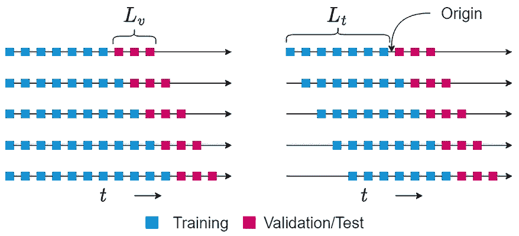
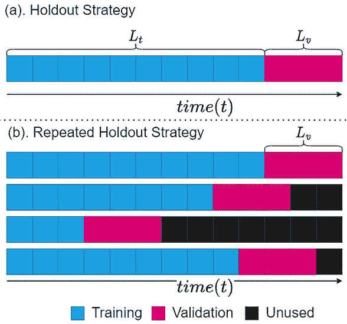
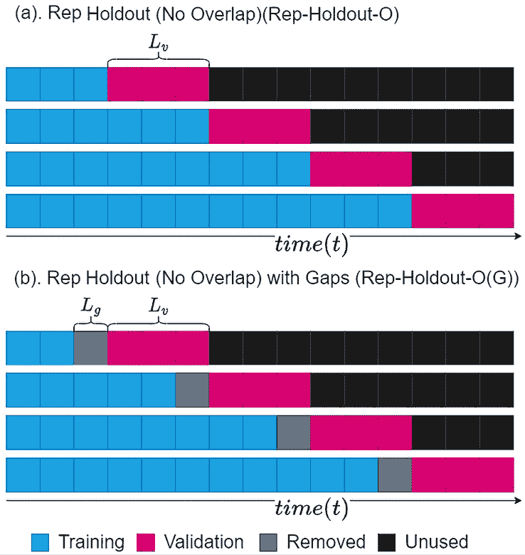
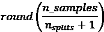
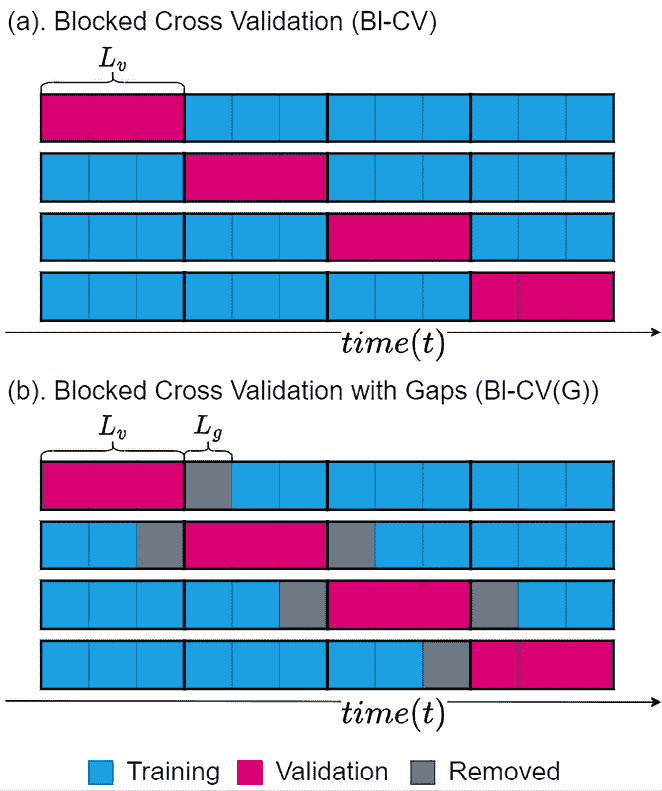

# 第二十章：评估预测—验证策略

在过去几章中，我们一直在关注一些相关但很少讨论的时间序列预测方面。虽然我们在前一章中学习了不同的预测指标，但现在我们要进入拼图的最后一块——验证策略。这是评估预测的另一个重要部分。

在本章中，我们尝试回答问题：*如何选择验证策略来从时间序列预测的角度评估模型？* 我们将查看不同的策略及其优缺点，以便在本章结束时，您能够做出明智的决策，为您的时间序列问题设置验证策略。

本章将涵盖以下主要内容：

+   模型验证

+   留出法策略

+   交叉验证策略

+   选择验证策略

+   多时间序列数据集的验证策略

# 技术要求

您需要通过按照本书*前言*中的说明设置 Anaconda 环境，才能获得一个具备本书中所需所有软件包和数据集的工作环境。

本章相关代码可以在[`github.com/PacktPublishing/Modern-Time-Series-Forecasting-with-Python-/tree/main/notebooks/Chapter20`](https://github.com/PacktPublishing/Modern-Time-Series-Forecasting-with-Python-/tree/main/notebooks/Chapter20)找到。

# 模型验证

在*第十九章*《*评估预测误差*—*预测指标概述*》中，我们学习了不同的预测指标，这些指标可以用来衡量预测的质量。其主要用途之一是衡量我们的预测在测试数据（新的、未见过的数据）上的表现，但这通常是在我们训练模型、调整模型、反复修改直到满意后进行的。那么我们如何知道一个正在训练或调整的模型是否足够好呢？

模型验证是使用数据评估训练模型的一种过程，用来评估模型的好坏。我们使用在*第十九章*《*评估预测误差*—*预测指标概述*》中学到的指标来计算预测的准确度。但有一个问题我们还没有解答：我们应该使用数据的哪一部分来进行评估？在标准的机器学习设置中（分类或回归），我们随机抽取一部分训练数据作为验证数据，所有的建模决策都是基于这些数据做出的。行业中的最佳实践是使用交叉验证。**交叉验证**是一种重采样程序，我们在多个迭代中从训练数据集中抽取不同部分的数据进行训练和测试。除了重复评估，交叉验证还能够最有效地利用数据。

然而，在时间序列预测领域，并不存在这种最佳实践的共识。这主要是由于时间序列的时间性以及我们可以采取的多种方式的差异。不同的时间序列可能有不同的历史长度，我们可能选择不同的建模方式，或者可能有不同的预测时段，等等。由于数据中的时间依赖性，标准的独立同分布（i.i.d.）假设不再成立；因此，像交叉验证这样的技术就会面临其自身的复杂性。当数据集被随机选择时，验证集和训练集可能不独立，这将导致对误差的估计过于乐观并且具有误导性。

验证的主要范式有两种：

+   **样本内验证**：顾名思义，模型是在与训练数据相同或相同数据子集上进行评估的。

+   **样本外验证**：在这一范式下，我们用来评估模型的数据与用于训练模型的数据没有交集。

样本内验证帮助你了解模型在已知数据上的拟合效果。这在统计学时代非常流行，当时的模型设计非常精细，主要用于推理而非预测。在这种情况下，样本内误差显示了指定模型如何拟合数据，以及我们从该模型中推导出的推论的有效性。但在预测范式中，像大多数机器学习一样，样本内误差并不是衡量模型*好坏*的正确标准。复杂的模型可以轻松地拟合训练数据，记住数据，却在新数据和未见过的数据上表现不佳。因此，样本外验证几乎是当今预测模型评估中唯一使用的验证方式。由于本书专注于预测任务，我们将仅使用样本外评估。

如前所述，为预测问题选择验证策略并不像标准机器学习那样简单。这里有两种主要的思想流派：

+   基于保留的策略，尊重问题的时间完整性

+   基于交叉验证的策略，在这种策略中，验证划分没有或者只有非常宽松的时间顺序

让我们讨论每个类别中的主要策略。我们必须记住的是，本书中讨论的所有验证策略并非详尽无遗，它们只是一些流行的策略。在接下来的解释中，验证期的长度是*L*[v]，训练期的长度是*L*[t]。

现在，让我们看看第一个思想流派。

# 保留策略

保留策略有三个方面，它们可以组合搭配，创造出许多不同的策略变体。例如，我们可以有一个固定划分的采样策略，一个滚动窗口的训练数据，以及每次迭代时重新校准模型。三个方面如下：

+   **采样策略**：采样策略是指我们如何从训练数据中抽取验证集。

+   **窗口策略**：窗口策略决定了我们如何从训练数据中抽取训练集的窗口。

+   **校准策略**：校准策略决定了是否需要重新校准模型。

也就是说，为时间序列问题设计一个留出验证策略需要在这三个方面做出决策。

采样策略是从训练数据中选取一个或多个原点的方法。这些**原点**是确定验证集起点和训练集终点的时间点。验证集的确切长度由参数*L*[v]决定，这是为验证选择的时间范围。训练集的长度则取决于窗口策略。

## 窗口策略

我们可以通过两种方式来设置训练集窗口——扩展窗口和滚动窗口。*图 20.1*展示了两种设置之间的区别：

图 20.1：扩展（左）与滚动（右）窗口策略

在扩展窗口策略下，训练集会随着原点向前推进而扩展。换句话说，在扩展窗口策略下，我们选择所有在原点之前可用的数据作为训练集。每当原点向前推进时，训练长度就会有效增加。

在滚动窗口策略中，我们保持训练集的长度不变（*L*[t]）。因此，当我们将原点向前推进三个时间步时，训练集会从时间序列的开始处删除三个时间步的数据。

尽管扩展窗口和滚动窗口的概念可能会让你联想到我们在特征工程或深度学习模型中使用的窗口，但这两者并不相同。本章中讨论的窗口是我们为训练模型所选择的训练数据窗口。例如，机器学习模型的特征可能仅延伸到前 5 天，我们可以使用过去 5 年的数据来划分训练集。

这两种窗口策略各有优缺点。让我们通过几个关键点来总结它们：

+   扩展窗口适用于短时间序列，其中扩展窗口可以为模型提供更多的数据。

+   滚动窗口会从训练集中移除最旧的数据。如果时间序列是非平稳的，并且行为会随着时间的推移发生变化，那么使用滚动窗口有助于保持模型的最新状态。

+   当我们在交叉验证等重复评估中使用扩展窗口策略时，训练中使用的时间序列长度的增加可能会引入一些偏差，尤其是对历史较长的窗口有偏好。滚动窗口策略通过保持时间序列的相同长度来解决这种偏差。

现在，让我们来看看验证策略的另一个方面。

## 校准策略

校准策略仅在我们使用不同原点进行多次评估的情况下有效。我们可以用两种方式进行不同原点的评估——重新校准每个原点，或者更新每个原点（Tashman 术语，参考*1*）。

在*重新校准*策略下，模型会在每个原点使用新的训练拆分进行重新训练。这个重新训练的模型将用于评估验证拆分。而对于*更新*策略，我们不会重新训练模型，而是使用已训练的模型来评估新的验证拆分。

让我们总结几个选择策略时需要考虑的关键点：

+   黄金标准是重新校准每个新的原点，但很多时候这可能不可行。在计量经济学/经典统计模型中，标准是重新校准每个原点。这是可行的，因为这些模型相对计算负担较小，而当时的数据集也较小。因此，可以在非常短的时间内重新拟合模型。如今，数据集的规模和模型的规模都大幅增长。每次移动原点时重新训练深度学习模型可能没有那么容易。

因此，如果你使用的是现代的、复杂的模型，并且训练时间较长，那么更新策略可能会更好。

+   对于运行速度较快的经典模型，我们可以探索重新校准策略。然而，如果你要预测的时间序列变化如此之快，行为频繁变化，那么重新校准策略可能更合适。

现在，让我们进入验证策略的第三部分。

## 采样策略

在保留策略中，我们会在时间序列中采样一个点（*原点*），最好选择接近时间序列末尾的位置，使得原点之后的时间序列部分比原点之前的部分短。从这个原点开始，我们可以使用*扩展窗口*或*滚动窗口*策略来生成训练和验证拆分。模型在训练拆分上进行训练，并在保留的验证拆分上进行测试。这个策略被简单地称为**保留**策略。校准策略固定为*重新校准*，因为我们只对模型进行一次测试和评估。

简单的保留策略有一个缺点——我们在保留数据上计算的预测指标可能不足够稳健，因为它依赖于单一的评估范式。我们依赖于数据的单一拆分来计算模型的预测性能。对于非平稳时间序列，这可能成为一个问题，因为我们可能选择了一个只捕捉到我们所选拆分特性的模型。

我们可以通过多次重复 Holdout 评估来克服这个问题。我们可以根据业务领域知识定制不同的起始点，例如考虑季节性或其他因素，或者我们可以随机抽样起始点。如果我们重复这个过程*n*次，就会有*n*个验证拆分，它们可能会重叠，也可能不会。来自这些重复试验的性能指标可以使用均值、最大值和最小值等函数进行聚合。这就是**重复 Holdout**（**Rep-Holdout**）策略。

**关于实现的说明：**

简单的 Holdout 策略非常容易实现，因为我们决定验证拆分的大小，并将时间序列的末尾部分保留作为验证集。**Rep-Holdout**策略涉及随机抽样多个窗口或使用预定义的窗口作为验证拆分。我们可以使用 scikit-learn 中的`PredefinedSplit`类来实现这一点。

*图 20.2*展示了使用扩展窗口方法的两种 Holdout 策略：

图 20.2：Holdout 策略 (a) 和 Rep-Holdout 策略 (b)

Rep-Holdout 策略有一些变种。基础的*Rep-Holdout*策略评估多个验证数据集，通常是手工构建的，且验证数据集可能会重叠。一种变种策略则要求多个验证拆分之间不应有重叠，这是一个更受欢迎的选择。我们称之为**重复 Holdout（无重叠）（Rep-Holdout-O）**。它继承了交叉验证家族的一些特性，并试图更系统地利用更多数据。*图 20.3 (a)*展示了这一策略：

图 20.3：Rep-Holdout 策略的变种

*Rep-Holdout-O*策略在使用`TimeSeriesSplit`类对单一时间序列数据集进行操作时非常容易实现。

**笔记本提醒：**

相关的笔记本，展示了如何实现不同的验证策略，可以在`Chapter20`文件夹下找到，文件名为`01-Validation_Strategies.ipynb`。

`sklearn.model_selection`中的`TimeSeriesSplit`类实现了 Rep-Holdout 验证策略，甚至支持扩展或滚动窗口变种。主要参数是`n_splits`，它决定了你希望从数据中拆分多少个部分，验证拆分的大小则会根据以下公式自动决定：

在默认配置下，这实现了一个扩展窗口的 Rep-Holdout-O 策略。但是有一个`max_train_size`参数。如果我们设置这个参数，那么它将以滚动窗口的方式使用`max_train_size`大小的窗口。

另一种 Rep-Holdout 策略的变体引入了长度为*L*[g]的间隔，将训练集和验证集之间进行分隔。这是为了增加训练集和验证集之间的独立性，从而通过该过程获得更好的误差估计。我们称这种策略为**带间隔的重复保留法（Rep-Holdout-O(G))**。该策略在*图 20.3 (b)*中进行了展示。

我们也可以使用`TimeSeriesSplit`类来实现这一点。我们需要做的只是使用一个叫做`gap`的参数。默认情况下，gap 设置为 0。但是如果我们更改为非零值，它将在训练的结束和验证的开始之间插入相应的时间步长间隔。

在继续讲解下一组策略之前，让我们总结并讨论一下关于保留法策略的一些关键点：

+   保留法策略尊重问题的时间完整性，并且长期以来一直是评估预测模型的首选方法。然而，它们在有效利用可用数据方面存在不足。对于短时间序列，保留法或 Rep-Holdout 可能没有足够的训练数据来训练模型。

+   简单的保留法依赖于单次评估，且误差估计不够稳健。即便在平稳序列中，这种方法也无法保证获得准确的误差估计。而在非平稳时间序列中，例如季节性时间序列，这个问题更加严重。但 Rep-Holdout 及其变体能够解决这个问题。

现在，我们来看看另一种主要的思路。

# 交叉验证策略

交叉验证是评估标准回归和分类方法时最重要的工具之一。其原因有两个：

+   简单的保留法方法并未利用所有可用数据，在数据稀缺的情况下，交叉验证能够更好地利用现有的数据。

+   从理论上讲，我们观察到的时间序列是一个随机过程的一个实现，因此从数据中获得的误差度量也是一个随机变量。因此，采样多个误差估计值来了解该随机变量的分布是非常必要的。从直观上讲，我们可以将其理解为“缺乏可靠性”，即单一数据切片获得的误差度量的不确定性。

在标准机器学习中最常用的策略叫做**k 折交叉验证**。在这种策略下，我们随机打乱并将训练数据分成*k*个相等的部分。现在，整个模型训练和误差计算的过程会重复*k*次，每次我们选择一个*k*子集作为测试集，且仅使用一次。当我们使用某个子集作为测试数据时，我们会将其他所有子集作为训练数据。获得*k*个不同的误差估计值后，我们会使用平均等函数对其进行聚合。这个均值通常比单一误差度量更稳健。

然而，有一个假设对有效性过程至关重要：*独立同分布（i.i.d.）样本*。这个假设在时间序列问题中是无效的，因为根据定义，时间序列中不同的样本通过自相关性相互依赖。

有人认为，当我们使用时间延迟嵌入将时间序列转换为回归问题时，可以开始在时间序列问题上使用 k-fold 交叉验证。尽管在理论上存在明显的问题，*Bergmeir 等人*（参考文献 *2*）表明，从经验上看，k-fold 交叉验证并不是一个坏的选择，但需要注意的是，时间序列必须是平稳的。我们将在下一节中详细讨论这个问题，在那里我们将讨论这些策略的优缺点。

然而，针对 *k*-折策略，特别是针对顺序数据，已经有了一些修改。

*Snijders 等人*（参考文献 4）提出了一种修改方案，我们称之为 **阻塞交叉验证** (**Bl-CV**) 策略。它与标准的 *k-fold* 策略类似，但我们在将数据集划分为 *k* 个长度为 *L*[v] 的子集之前不会随机打乱数据集。因此，这种划分策略会导致 *k* 个连续的观测块。然后，像标准的 k-fold 策略一样，我们对这些 *k* 个块进行训练和测试，并将多个评估的误差度量进行聚合，从而部分地满足问题的时间完整性要求。

换句话说，时间完整性在每个块内部得到保持，但块与块之间则不然。*图 20.4 (a)* 显示了这一策略：

图 20.4：Bl-CV 策略

要实现 **Bl-CV 策略**，我们可以使用 scikit-learn 中相同的 `Kfold` 类。如前所述，scikit-learn 中交叉验证类的主要参数是 `n_splits`。在这里，`n_splits` 还定义了它选择的相等大小的折叠数。另一个参数是 `shuffle`，默认设置为 `True`。如果我们确保数据按照时间排序，然后使用 `shuffle=False` 的 `Kfold` 类，它将模仿 **Bl-CV** 策略。相关的笔记本中展示了这种用法。我强烈建议你查看笔记本，深入理解它是如何实现的。

在上一节中，我们讨论了在训练集和验证集之间引入间隙，以增加它们之间的独立性。Bl-CV 的另一个变体是使用这些间隙的版本。我们称之为 **带间隙的阻塞交叉验证** (**Bl-CV(G)**)。我们可以在 *图 20.4 (b)* 中看到这种方法的实际应用。

不幸的是，scikit-learn 中的 `Kfold` 实现不支持这种变体，但扩展 `Kfold` 实现以包含间隙是很简单的。相关的笔记本中有这种实现。它有一个额外的参数 `gap`，让我们可以设置训练集和验证集之间的间隙。

我们已经看到许多不同的验证策略；现在让我们尝试列出一些要点，帮助你决定适合你问题的正确策略。

# 选择验证策略

选择合适的验证策略是机器学习工作流程中最重要但常被忽视的任务之一。一个好的验证设置将在建模过程的各个步骤中发挥重要作用，比如特征工程、特征选择、模型选择和超参数调优。虽然在设置验证策略时没有硬性规则，但我们可以遵循一些指导原则。其中一些来自经验（包括我自己的和他人的），而另一些则来自已发布的实证和理论研究论文：

+   设计的一个指导原则是，我们尽量让验证策略尽可能模拟模型的实际使用。例如，如果模型将用于预测接下来的 24 个时间步长，我们将验证集的长度设置为 24 个时间步长。当然，这并不是那么简单，因为设计验证策略时还需要考虑其他实际约束条件，如足够的数据、时间和计算资源。

+   尊重时间序列问题时间顺序的 Rep-Holdout 策略是首选，尤其是在有足够数据的情况下。

+   对于纯自回归形式的平稳时间序列，可以使用常规的`Kfold`，并且 Bergmeir 等人（参考文献 2）通过实证研究表明，它们的表现优于保持策略。但是，Bl-CV 在交叉验证策略中是一个更好的选择。*Cerqueira 等人*（参考文献 3）在他们的平稳时间序列实证研究中证实了这一发现。

+   如果时间序列是非平稳的，*Cerqueira 等人*通过实证研究表明，保持策略（特别是 Rep-Holdout 策略）是最优的选择。

+   如果时间序列较短，在将时间序列平稳化后使用 Bl-CV 是自回归模型（如时间延迟嵌入）的一种好策略。然而，对于那些使用历史记忆来预测的模型，如指数平滑或深度学习模型（如 RNN），交叉验证策略可能并不安全。

+   如果我们除了自回归部分还具有外生变量，那么使用交叉验证策略可能并不安全。最好坚持基于保持的策略。

+   对于强季节性的时间序列，使用模拟预测视野的验证期是有益的。例如，如果我们预测的是十月、十一月和十二月，那么检查去年十月、十一月和十二月的模型表现会很有帮助。

到目前为止，我们一直在讨论单一时间序列的验证策略。但在全球模型的背景下，我们已经到了需要考虑这些情况的验证策略的阶段。

# 针对具有多个时间序列的数据集的验证策略

直到现在为止，我们所见过的所有策略对于具有多个时间序列的数据集都是完全有效的，例如我们在本书中使用的伦敦智能电表数据集。我们在上一节讨论的见解也是有效的。由于我们讨论的 scikit-learn 类适用于单一时间序列，因此这些策略的实现可能稍显复杂。这些实现假设我们只有一个单独的时间序列，并且按时间顺序排序。如果有多个时间序列，划分将会杂乱无章。

对于具有多个时间序列的数据集，我们可以采用几种选择：

+   我们可以遍历不同的时间序列，使用我们讨论过的方法进行训练-验证划分，然后将结果集跨所有时间序列连接起来。但这样做并不高效。

+   我们可以编写一些代码并设计验证策略，以使用日期时间或时间索引（例如我们在*第十五章*中看到的 PyTorch 预测中的时间索引，“*全球深度学习预测模型的策略*”）。我在本章的*进一步阅读*部分提供了一个来自*Konrad Banachewicz*的精彩笔记本链接，他使用了一个自定义的`GroupSplit`类，将时间索引用作分组。这是对具有多个时间序列的数据集使用 Rep-Holdout 策略的一种方式。

对于具有多个时间序列的数据集，我们需要记住几个要点：

+   不要为不同的时间序列使用不同的时间窗口。因为不同的时间窗口会产生不同的误差，这会扭曲我们跟踪的总体误差度量。

+   如果不同的时间序列具有不同的长度，请对所有序列的验证期长度进行对齐。训练长度可以不同，但验证窗口应该相同，以便每个时间序列对总误差度量的贡献相等。

+   很容易被复杂的验证方案所吸引，但始终要记住选择特定技术所带来的技术债务。

到这里，我们已经结束了一个简短但重要的章节。

# 总结

我们已经结束了在时间序列预测领域的探索。在过去的几个章节中，我们讨论了预测的一些机制，比如如何进行多步预测以及如何评估预测。当前章节讨论的主题是评估预测和预测模型的不同验证策略。

我们首先通过阐明模型验证为何是一个重要任务来开始。接着，我们探讨了几种不同的验证策略，例如留出法，并讨论了时间序列中交叉验证的争议性使用。我们花了一些时间总结并提出了几个选择验证策略时的指导方针。最后，我们讨论了这些验证策略如何适用于包含多个时间序列的数据集，并谈到了如何将其应用到这类场景中。

至此，我们来到了本书的结尾。恭喜你顺利读完，希望你从本书中获得了足够的技能，以应对下一个出现的时间序列问题。我强烈建议你开始将本书中学到的技能付诸实践，因为正如理查德·费曼所说的那样，*“你不知道任何东西，直到你付诸实践。”*

# 参考文献

以下是本章引用的参考文献：

1.  Tashman, Len. (2000). *样本外预测精度测试：分析与评述*. 《国际预测学杂志》16 卷, 437–450，10.1016/S0169-2070(00)00065-0：[`www.researchgate.net/publication/223319987_Out-of-sample_tests_of_forecasting_accuracy_An_analysis_and_review`](https://www.researchgate.net/publication/223319987_Out-of-sample_tests_of_forecasting_accuracy_An_analysis_and_review)。

1.  Bergmeir, Christoph 和 Benítez, José M. (2012). *关于时间序列预测评估中交叉验证的使用*. 载于《信息科学》期刊，191 卷，2012 年，第 192–213 页：[`www.sciencedirect.com/science/article/abs/pii/S0020025511006773`](https://www.sciencedirect.com/science/article/abs/pii/S0020025511006773)。

1.  Cerqueira, V., Torgo, L., 和 Mozetič, I. (2020). *评估时间序列预测模型：关于性能估计方法的实证研究.* 机器学习 109, 1997–2028 (2020): [`doi.org/10.1007/s10994-020-05910-7`](https://doi.org/10.1007/s10994-020-05910-7)。

1.  Snijders, T.A.B. (1988). *关于时间序列预测评估中的交叉验证.* 收录于：*Dijkstra, T.K.* (编辑) *关于模型不确定性及其统计学意义*. 经济学与数学系统讲义，卷 307。Springer 出版社，柏林，海德堡。[`doi.org/10.1007/978-3-642-61564-1_4`](https://doi.org/10.1007/978-3-642-61564-1_4)。

# 深入阅读

+   *TS-10: 时间序列的验证方法* by *Konrad Banachewicz*: [`www.kaggle.com/code/konradb/ts-10-validation-methods-for-time-series`](https://www.kaggle.com/code/konradb/ts-10-validation-methods-for-time-series)

# 加入我们的社区，参加 Discord 讨论

加入我们社区的 Discord 空间，与作者和其他读者进行讨论：

[`packt.link/mts`](https://packt.link/mts)

# 留下评论！

感谢你购买 Packt 出版的这本书——希望你喜欢它！你的反馈对我们至关重要，帮助我们改进和成长。请花几分钟时间在 [Amazon 评价](https://packt.link/r/1835883192)上留下你的评论；这只需要一分钟，但对像你这样的读者来说却意义重大。

扫描下方的二维码，免费领取你选择的电子书。

[`packt.link/NzOWQ`](https://packt.link/NzOWQ)

[packt.com](https://www.packt.com)

订阅我们的在线数字图书馆，全面访问超过 7,000 本书籍和视频，以及行业领先的工具，帮助你规划个人发展并推动职业生涯。欲了解更多信息，请访问我们的网站。

# 为什么要订阅？

+   通过来自超过 4,000 位行业专家的实用电子书和视频，减少学习时间，增加编程时间

+   使用为你特别设计的技能计划提升你的学习效果

+   每月免费获取一本电子书或视频

+   完全可搜索，方便快速访问重要信息

+   复制、粘贴、打印和书签内容

在 [www.packt.com](https://www.packt.com)，你还可以阅读免费的技术文章，注册各种免费的电子邮件通讯，获取 Packt 书籍和电子书的独家折扣和优惠。

# 你可能喜欢的其他书籍

如果你喜欢这本书，你可能会对 Packt 出版的以下其他书籍感兴趣：

**Pandas Cookbook**

威廉·艾德、马修·哈里森

ISBN：9781836205876

+   pandas 类型系统以及如何最好地导航它

+   导入/导出 DataFrame 到/从常见的数据格式

+   通过数十个实践问题进行 pandas 数据探索

+   分组、聚合、转换、重塑和过滤数据

+   通过 pandas 类 SQL 操作合并来自不同来源的数据

+   在高级分析中利用强大的 pandas 时间序列功能

+   扩展 pandas 操作，充分利用你的系统性能

+   pandas 可以与之协同工作并补充的大型生态系统

**Mastering PyTorch**

阿希什·兰贾·贾

ISBN：9781801074308

+   使用 PyTorch 实现文本、视觉和音乐生成模型

+   在 PyTorch 中构建深度 Q 网络（DQN）模型

+   在移动设备（安卓和 iOS）上部署 PyTorch 模型

+   使用 fastai 在 PyTorch 中熟练进行快速原型设计

+   使用 AutoML 有效进行神经网络架构搜索

+   使用 Captum 轻松解释机器学习模型

+   设计 ResNet、LSTM 和图神经网络（GNN）

+   使用 Hugging Face 创建语言和视觉转换器模型

# Packt 正在寻找像你这样的作者

如果你有兴趣成为 Packt 的作者，请访问 [authors.packtpub.com](https://authors.packtpub.com) 并立即申请。我们已经与成千上万的开发者和技术专业人士合作，帮助他们将自己的见解与全球技术社区分享。你可以进行一般申请，申请我们正在招募作者的特定热门话题，或者提交你自己的想法。
