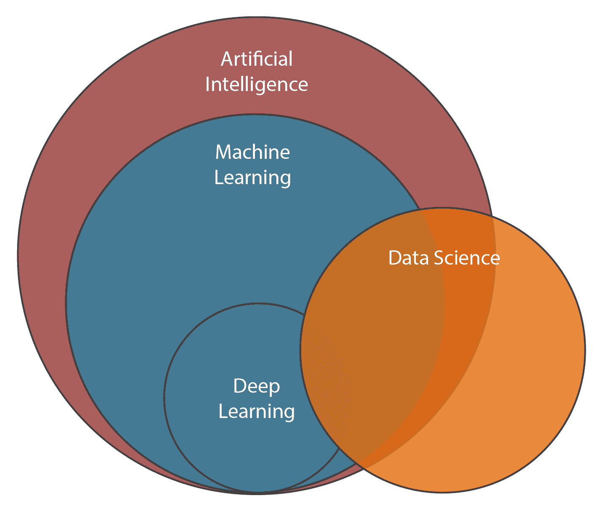
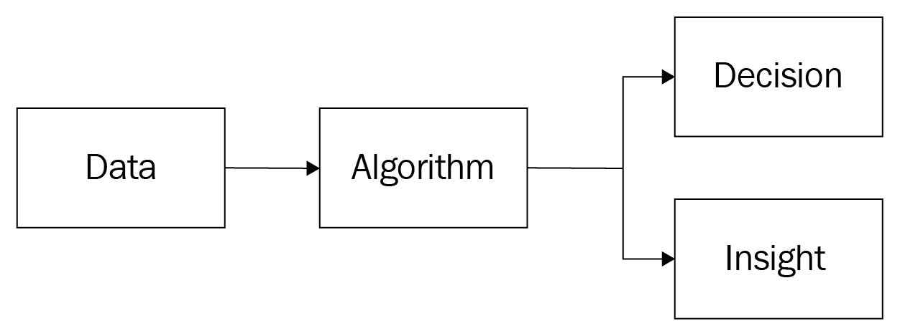
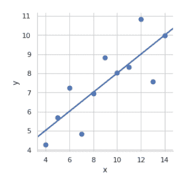
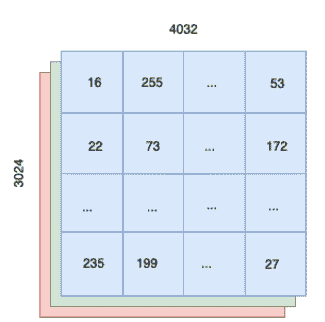
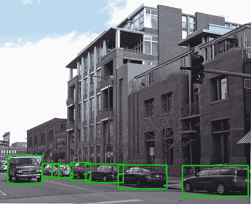
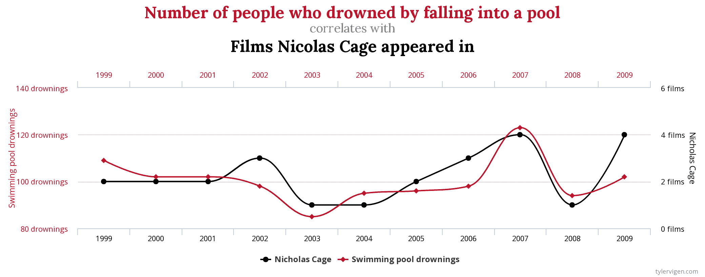
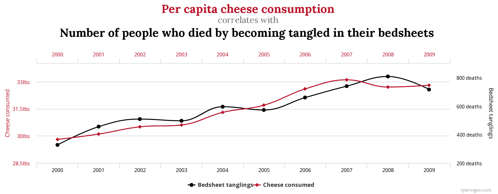

# 第一章：数据科学可以做什么

我曾经告诉一位做软件开发的朋友关于欧洲最大的数据科学会议之一。他表现出浓厚的兴趣，并问我们是否可以一起去。我说，当然可以。让我们一起拓宽知识面吧。和你讨论机器学习一定会很棒。几天后，我们坐在一个大会议厅的中央。第一位演讲者登上了讲台，向我们讲解了他用来赢得多个数据科学竞赛的技术技巧。当下一位演讲者开始讲解张量代数时，我注意到我朋友眼中露出了一种疲惫的神情。

— *怎么了？* 我问道。

— *我只是想知道他们什么时候会给我们展示机器人。*

为了避免产生错误的期望，我们需要提前做好了解。在建造房屋之前，你最好知道锤子是如何使用的。对于任何管理者来说，了解自己管理的领域是至关重要的。软件开发经理需要理解计算机编程。工厂经理需要了解制造流程。数据科学经理也不例外。本书的第一部分将简单解释数据科学背后的主要概念。我们将一点一点地剖析并探索它。

数据科学变得越来越流行，许多商界人士和技术专家对理解数据科学并将其应用于解决问题的兴趣日益增加。人们通常通过他们收集的背景信息形成对数据科学的初步看法：新闻网站、社交网络等等。不幸的是，大多数这些信息源误导了我们，而不是给出数据科学和机器学习的真实面貌。

媒体并没有进行解释，而是描述了那些能够轻松解决我们所有问题的终极神奇工具。技术奇点就在眼前。普遍基本收入经济即将到来。好吧，前提是机器像人类一样学习和思考。事实上，我们离创造通用的、自我学习和自我改进的算法还远得很。

本章将探讨数据科学主要工具的当前可能性和现代应用：**机器** **学习** 和 **深度** **学习**。

在本章中，我们将涵盖以下主题：

+   定义人工智能

+   机器学习简介

+   深度学习简介

+   深度学习应用案例

+   因果推断简介

# 定义人工智能

媒体和新闻将人工智能作为任何与数据分析相关的技术的替代流行词。事实上，人工智能是计算机科学和数学的一个子领域。一切始于 20 世纪 50 年代，当时一些研究人员开始探讨计算机是否能够学习、思考和推理。70 年过去了，我们依然没有答案。然而，我们在一种特定类型的人工智能上取得了显著进展，这种人工智能解决的是明确指定的狭窄任务：**弱人工智能**。

科幻小说讲述了能够像人类一样推理和思考的机器。在科学语言中，它们被描述为**强 AI**。强 AI 能够像人类一样思考，其智力可能更为先进。创造强 AI 仍然是科学界的长期梦想。然而，实际应用都集中在弱 AI 上。强 AI 试图解决通用智能的问题，而弱 AI 则专注于解决单一的认知任务，例如视觉、语音或听觉。弱 AI 任务的例子种类繁多：语音识别、图像分类和客户流失预测。弱 AI 在我们的生活中扮演着重要角色，改变了我们工作、思考和生活的方式。我们可以在生活的各个领域找到弱 AI 的成功应用。医学、机器人学、市场营销、物流、艺术和音乐等领域都从弱 AI 的最新进展中受益。

# 定义数据科学

AI 与机器学习有什么关系？什么是深度学习？我们如何定义数据科学？这些热门问题最好通过图示来解答：

这张图包含了本书将讨论的所有技术主题：

+   AI 是一个广泛的科学领域，涵盖了与弱 AI 和强 AI 相关的所有内容。我们不会过多关注 AI，因为大多数实际应用都来自于它的子领域，我们将在接下来的*第一章：* *什么是数据科学？*中对这些子领域进行定义和讨论。

+   机器学习是 AI 的一个子领域，研究能够根据输入数据自适应其行为的算法，而不需要程序员的明确指令。

+   深度学习是机器学习的一个子领域，研究一种特定的机器学习模型——深度神经网络。

+   数据科学是一个多学科的领域，利用一系列工具从数据中提取知识，并支持决策制定。机器学习和深度学习是数据科学的主要工具之一。

数据科学的终极目标是通过从数据中提取知识来解决问题，并为复杂决策提供支持。解决问题的第一步是对其领域有一个良好的理解。在进行风险分析之前，你需要理解保险行业。在设计自动化质量保证流程之前，你需要了解商品制造过程的细节。首先，你需要了解领域。然后，你找到问题。如果跳过这一步，你很可能会解决错误的问题。

在确定了一个好的问题定义后，你开始寻求解决方案。假设你已经创建了一个能够解决任务的模型。一个单纯的机器学习模型通常不会引起任何人的兴趣。所以，它是没用的。为了让它变得有用，我们需要将我们的模型封装成一些能够被看到并且可以付诸实践的东西。换句话说，我们需要围绕模型创建软件。数据科学总是与创建软件系统密切相关。任何机器学习模型都需要软件。没有软件，模型就只是存在于计算机内存中，无法为任何人提供帮助。

所以，数据科学不仅仅是关于科学的。商业知识和软件开发同样重要。没有它们，任何解决方案都不完整。

# 数据科学的影响

数据科学具有巨大的潜力。它已经在影响我们的日常生活。医疗保健公司正在学习诊断并预测重大健康问题。企业利用它来寻找赢得新客户的新策略并个性化服务。我们在遗传学和粒子物理学中使用大数据分析。多亏了数据科学的进步，自动驾驶汽车如今已成为现实。

多亏了互联网和全球计算机化，我们每天都会创造大量的数据。日益增加的数据量使得我们能够实现人类劳动的自动化。

遗憾的是，对于每一个改善我们生活的应用案例，我们很容易能找到两个让生活变得更糟的例子。举个令人不安的例子，我们来看一下中国。中国政府正在实验一种新的**社会信用体系**。它使用监控摄像头大规模地追踪公民的日常生活。计算机视觉系统可以识别并记录你在上班通勤、在政府办公处排队、或者在聚会后回家的每一个动作。然后，根据你被监控的行为，计算出一个特殊的社会评分。这个评分会影响真实人的生活。特别是，公共交通费用可能会根据你的评分而变化；低分可能会禁止你申请某些政府工作。

另一方面，这项技术也可以用来帮助人们。例如，它可以用于在人群中追踪罪犯。你如何运用这项新技术，可能会让世界更接近乔治·奥威尔的*1984*，也可能让世界变得更安全。公众必须更加意识到这些选择，因为它们可能对我们的生活产生持久影响。

机器学习的另一个令人不安的应用案例是，某些企业使用基于机器学习的招聘算法。几个月后，他们发现这些算法引入了对女性的偏见。显而易见，我们没有给予数据科学伦理足够的关注。虽然像谷歌这样的公司创建了内部伦理委员会，但目前对于现代技术的不道德使用仍然没有政府监管。在这种程序到来之前，我强烈建议你考虑使用数据科学的伦理影响。我们都希望生活在一个更好的世界中。我们的未来以及我们孩子的未来，取决于我们每天做出的每一个小决定。

# 数据科学的局限性

像任何一套工具一样，数据科学也有其局限性。在深入开展一个充满雄心壮志的项目之前，考虑现有的可能性限制非常重要。一个看似容易解决的任务，在实践中可能是无法解决的。

对数据科学技术方面理解不足，可能会导致你项目中的严重问题。你可能会启动一个项目，结果发现根本无法解决任务。更糟糕的是，你可能在部署后才发现，所有的东西都没有按预期工作。根据你的使用场景，这可能会影响到现实中的人。理解数据科学背后的主要原理，将帮助你避免许多技术风险，这些风险可能在项目尚未启动时就已经决定了项目的命运。

# 机器学习简介

机器学习迄今为止是数据科学家最重要的工具。它使我们能够创建能够发现数据中成千上万变量模式的算法。我们现在将探讨不同类型和功能的机器学习算法。

机器学习是一个研究可以在没有特定指令的情况下，通过依赖数据中发现的模式来执行任务的算法的科学领域。例如，我们可以使用算法来预测得病的可能性或评估复杂制造设备故障的风险。每个机器学习算法都遵循一个简单的公式。在下面的图表中，你可以看到一个基于机器学习算法的高级决策过程。每个机器学习模型都会消耗数据，产生可以支持人类决策或完全自动化的决策的信息：

我们将在下一节中更详细地探讨每个模块的含义。

# 机器学习模型提供的决策和洞察

在使用机器学习解决任务时，你通常想要自动化决策过程或获取支持决策的见解。例如，你可能希望算法根据患者的病史和当前状况输出一个可能的疾病列表。如果机器学习完全解决了任务，或称“端到端”解决了任务，这意味着算法的输出可以用来做出最终决定，而不需要进一步思考；在我们的例子中，就是自动判断患者所患的疾病并开具合适的药物。这一决策的执行可以是手动的，也可以是自动的。我们说像这样的机器学习应用是端到端的。它们为任务提供了完整的解决方案。让我们以数字广告为例。一个算法可以预测你是否会点击广告。如果我们的目标是最大化点击量，我们可以做出自动化且个性化的决策，决定向每个用户展示哪个具体的广告，从而“端到端”地解决点击率最大化问题。

另一个选择是创建一个算法，提供给你一些见解。你可以将这些见解作为决策过程的一部分。通过这种方式，许多机器学习算法的输出可以参与到复杂的决策制定中。为了说明这一点，我们来看看一个仓库安全监控系统。它监控所有的监控摄像头，并从视频流中识别员工。如果系统无法识别某人是员工，它会发出警报。这个设置使用了两个机器学习模型：人脸检测和人脸识别。首先，人脸检测模型在每一帧视频中寻找人脸。接下来，人脸识别模型通过在面部数据库中搜索来识别某人是否为员工。每个模型都不能单独解决员工识别任务，但每个模型提供了一个见解，作为决策过程的一部分。

# 机器学习模型的数据

你可能已经注意到，我们示例中的算法处理的是不同类型的数据。在数字广告的例子中，我们使用了结构化的客户数据。而监控系统则使用了来自摄像头的视频流。事实上，机器学习算法可以处理不同类型的数据。

我们可以将全球的数据分为两类：结构化数据和非结构化数据。大多数数据是非结构化的。图像、音频录音、文档、书籍和文章都代表着非结构化数据。非结构化数据是我们现代生活的自然副产品。智能手机和社交网络促使了无尽数据流的产生。如今，你几乎不需要做什么就能拍照或录制视频。分析非结构化数据非常困难，以至于我们直到 2010 年才找到一种实用的解决方案。

结构化数据难以收集和维护，但它是最容易分析的。原因在于我们通常是为此目的收集这些数据。结构化数据通常存储在计算机数据库和文件中。在数字广告中，广告网络投入大量精力收集尽可能多的数据。数据对广告公司来说如黄金般珍贵。他们收集你的浏览历史、点击链接、在页面上停留的时间以及每个用户的许多其他特征。大量的数据使得精确的点击概率模型得以创建，从而个性化你的广告浏览体验。个性化增加了点击概率，从而提高了广告商的利润。

为了增加他们的数据供应，现代企业在构建业务流程时，使得尽可能多的结构化数据得以生成。例如，银行会记录你进行的每一笔金融交易。这些信息对于管理账户是必需的，但它们也作为信用评分模型的主要数据来源。这些模型利用客户的财务档案来估算其违约风险概率。

分析非结构化数据的难度来源于其高维度性。为了说明这一点，我们来看一个包含两列数字的数据表：**x**和**y**。我们可以说，这个数据有两个维度。

该数据集中的每个值将在以下图表中显示：

正如你所看到的，给定**x**的值，我们可以准确地猜测出**y**的值。为此，我们可以查看该点在直线上的对应位置。例如，对于**x** = **10**，**y**将等于**8**，这与作为蓝点显示的实际数据点相匹配。

现在，让我们转到一张用 iPhone 拍摄的照片。这张图片的分辨率是 4,032 x 3,024 像素。每个像素将有三个颜色通道：红色、绿色和蓝色。如果我们将这张图片中的像素表示为数字，那么每张照片将有超过一千万个像素。换句话说，我们的数据维度达到了 1200 万。

在下面的截图中，你可以看到一个图像，它被表示为一组数字：

在高维数据上使用机器学习算法可能会变得棘手。许多机器学习算法会受到所谓“维度灾难”的困扰。要创建一个能够识别照片中物体的好模型，你需要一个比简单直线更复杂的模型。模型的复杂性增加了模型的**数据饥饿**，因此，在非结构化数据上表现良好的模型通常需要大量的训练数据样本。

# 机器学习的起源

在数据科学、机器学习和深度学习出现之前，统计学已经存在。所有与数据分析相关的领域都以统计学为核心。从最初开始，统计学就是许多领域的合金。这是因为统计学旨在解决实际问题。在 17 世纪，统计学家应用数学分析数据，以推断和支持经济和人口统计方面的决策。这听起来不像数据科学吗？有趣的是：第一个机器学习算法——线性回归——是由卡尔·弗里德里希·高斯在 200 多年前发明的。今天我们仍在使用它，并且它的实现存在于所有主要的机器学习和统计软件包中。

高斯发明的最小二乘算法是线性回归的基本形式。线性模型的一般形式要晚得多才引入。

# 机器学习的解剖学

让我们看看机器学习的常见用例。可以说最常见的用例是预测。预测算法告诉我们什么时候会发生某事，但不一定告诉我们为什么会发生。一些预测任务的例子包括：*这位用户下个月会流失吗？* *这个人患阿尔茨海默病的风险高吗？* *下个小时会发生交通堵塞吗？* 通常，我们希望得到解释而不是预测。解推任务意味着通过数据中的支持证据来回答“为什么？”的问题。*为什么这个人赢得了选举？* *为什么这种药有效而另一种无效？* 统计推断帮助我们找到解释或证明我们行动效果的证据。当我们进行推断时，我们寻求对现在或过去的答案。当我们试图展望未来时，预测就成为主角。

有时，我们不关心预测未来或找到证据。我们希望机器能够识别数据中的复杂模式，比如图像中的对象，或者分析文本消息的情感。这组任务被称为识别。

机器学习涵盖了许多类型和模型的风味。但为什么我们需要如此多种不同算法的变体？答案在于一个定理，称为**无免费午餐定理**。它指出，在每个数据集上每个任务上都能始终给出最佳结果的模型是不存在的。每种算法都有其优点和缺点。它可能在一个任务上无懈可击，但在另一个任务上却表现糟糕。数据科学家的一个最重要目标之一是找到解决手头问题的最佳模型。

# 你可以用机器学习解决的主要任务类型

无免费午餐定理表明，没有一个模型能够在所有任务上表现良好。这导致我们有许多专门解决特定任务的算法。

例如，我们来看时尚零售仓库的需求预测。零售商在他们的商店里销售一套固定的衣服。在商品上架之前，它必须从制造商处购买并转移到仓库。假设他们的物流周期是两周。我们如何知道每个商品应该订购的最佳数量呢？很可能，我们已经有了每个商店的商品销售数据。我们可以利用这些数据创建一个预测模型，估算下两周内我们仓库中每个商品的平均客户需求。也就是说，我们预测下两周内每个商品的平均购买数量。最简单的模型是将过去两周每个商品的平均需求作为未来需求的估计值。像这样的简单统计模型在实际零售店中经常使用，因此我们不能过于简化。为了更具通用性，我们将我们想要预测的事物称为`target`变量。在前一个例子中，`target`变量是需求。为了建立预测模型，我们将使用过去两周的历史数据来计算每个商品的算术平均值。然后，我们用这些平均值作为未来值的估计。某种程度上，历史数据被用来教我们的模型如何预测`target`变量。当模型通过输入/输出示例学习执行特定任务时，我们称这个过程为监督学习。将我们的平均计算器称为监督学习算法有些夸张，但从技术上讲，没有什么能阻止我们这么做。

监督学习并不限于简单模型。一般来说，模型越复杂，所需的训练数据就越多。训练数据越多，模型就越好。为了说明这一点，我们将深入了解信息安全领域。我们的假想客户是一家大型电信公司。多年来，他们的网络经历了许多安全漏洞。幸运的是，专家记录并彻底调查了所有网络中的欺诈活动。安全专家在网络日志中标记了每一项欺诈活动。拥有大量带标签的训练数据后，我们可以训练一个监督学习模型，来区分正常活动和欺诈活动。这个模型将能够从大量进入的数据中识别出可疑行为。然而，只有专家正确标记了数据，这种情况才会发生。如果他们没有正确标记，模型是无法纠正的。这一原则被称为**垃圾进，垃圾出**。你的模型只能和你的数据一样好。

零售和安全领域的示例都使用了监督学习，但让我们更仔细地看看`target`变量。预测算法将需求作为`target`变量。需求是一个连续的数值，范围从 0 到无穷大。另一方面，安全模型具有固定数量的结果。

网络活动要么是正常的，要么是欺诈性的。我们称第一种类型的`target`变量为连续型，第二种类型为分类型。`target`变量的类型强烈指示了我们可以解决的任务类型。具有连续`target`变量的预测任务称为回归问题。而当结果的总数有限时，我们说我们解决的是分类问题。分类模型将数据点分配到不同类别，而回归模型则估算数量。

下面是一些示例：

+   房价估算是一个回归任务。

+   预测用户广告点击是一个分类任务。

+   预测云存储服务中的硬盘利用率是一个回归任务。

+   识别信用违约风险是一个分类任务。

如果你找到了一个良好的标注数据集，你可以认为自己很幸运。如果数据集很大，没有缺失标签，并且非常适合解决某个问题的端到端解决方案，那你就更幸运了。我们用于监督学习的标签是一种稀缺资源。完全没有标签的数据集比完全标注的数据集更常见。这意味着我们往往不能使用监督学习。但是没有标签并不意味着我们就注定失败。一个解决方案是手动标注数据。如果数据无法与公司外部共享，你可以将这个任务交给你的员工。如果数据可以共享，另一个更简单、更快捷的解决方案是使用众包服务，如 Amazon Mechanical Turk。在那里，你可以将数据标注外包给大量人群，每个数据点支付一小笔费用。

尽管标注数据很方便，但它并不总是可承受的，有时甚至是不可能的。一个`target`变量缺失或可以从数据本身推导出来的学习过程叫做无监督学习。虽然监督学习意味着数据已被标注，无监督学习则去除了这一限制，使得算法能够在没有指导的情况下从数据中学习。

例如，营销部门可能希望发现具有相似购买习惯的客户新细分群体。这些洞察可以用来量身定制营销活动，并增加每个细分市场的收入。发现数据集中的隐藏结构的一种方法是使用聚类算法。许多聚类算法可以处理未标注的数据。这一特点使它们特别有趣。

有时，标签隐藏在原始数据中。以音乐创作任务为例。假设我们想创建一个生成新音乐的算法。在这种情况下，我们可以使用监督学习而无需明确的标签。在这个任务中，序列中的下一个音符是一个很好的标签。从一个音符开始，模型预测下一个音符。取前两个音符，它会输出第三个音符。通过这种方式，我们可以根据需要添加任意数量的新音符。

现在，让我们看看是否可以将机器学习应用于游戏。如果我们以单个游戏为例，我们可以标注一些数据并使用监督学习。但将这种方法扩展到所有游戏在实践中是不可行的。在典型的游戏控制台上，你使用相同的控制器玩不同的游戏。试着回想一下你人生第一次玩游戏是什么时候。我猜那是马里奥。很可能你那时不知道该做什么。你可能试着按了一些按钮，看到一个角色跳跃。一步一步，你一定弄清楚了游戏规则并开始玩。我不会感到惊讶，如果你玩了一会儿后能很自信地通关第一关。

利用我们到目前为止获得的知识，我们能否设计出一种机器学习算法，能学会如何玩游戏？也许你会想用监督学习，但先想一想。当你第一次拿起控制器时，你没有任何训练数据。但我们能否创建一种算法，让它自己去弄明白游戏规则呢？

如果我们提前知道规则，为特定的计算机游戏写一个好的机器人是很容易的。几乎所有现代计算机游戏都有基于规则的人工智能或非玩家角色，能与玩家互动。有些游戏甚至有如此先进的人工智能，以至于整个游戏玩法都围绕这一特性展开。如果你感兴趣，可以看看*外星人*：*隔离*，这款游戏于 2014 年发布。这些算法的最大限制是它们是特定游戏的。它们无法根据经验进行学习和行动。

直到 2015 年，深度学习研究人员发现了一种训练机器学习模型以类似人类的方式玩雅达利游戏的方法：观察屏幕并使用游戏控制器执行动作。唯一的不同是，算法并没有使用物理的眼睛或双手来玩游戏。它通过 RAM 接收每一帧游戏画面，并通过虚拟控制器进行操作。最重要的是，模型在每一帧中都会接收到当前的游戏得分。一开始，模型执行随机动作。有些动作会导致得分增加，并作为正反馈被接收。随着时间的推移，模型学习了输入/输出或帧/动作对，这些对应该获得更高的分数。结果令人震惊。在训练了 75 小时后，模型以业余水平玩*打砖块*。它没有任何游戏的先验知识，它看到的只是原始像素。过了一段时间后，算法学会了比人类玩得更好。完全相同的模型可以训练来玩不同的游戏。用于训练这些模型的学习框架被称为强化学习。在强化学习中，代理（玩家）学习一个策略（基于输入执行动作的具体方式），以最大化奖励（游戏得分）在一个未知环境（计算机游戏）中。

当然，这也有局限性。记住，在机器学习的餐厅里是没有免费的午餐的。虽然这个算法在大量游戏中表现良好，但在某些游戏中完全失败。特别是名为*Montezuma's Revenge*的游戏，直到 2018 年之前，它曾让每一个模型都陷入困境。这个游戏的问题在于，你需要在很长时间内执行一系列特定的动作，才能获得一个微小的奖励信号。

为了解决复杂环境中的任务，强化学习算法需要极其庞大的数据量。你可能已经看到过有关 OpenAI Five 模型战胜职业玩家的新闻，这是一款名为*Dota 2*的复杂多人电子竞技游戏。为了给你一个概念，OpenAI 团队使用了一个由 256 个 GPU 和 128,000 个 CPU 核心组成的集群来训练他们的智能体。每天，这个模型会和自己进行 180 年的对战。这个过程在一个大型计算集群上并行进行，因此实际所需时间要少得多。

另一个强化学习的重大胜利，当然是围棋。围棋的总行动数比我们宇宙中所有原子的总数还要大，这使得这个游戏非常难以用计算机解决。计算机科学家在 1997 年击败了最强的国际象棋选手。对于围棋，他们花费了另外 18 年。如果你感兴趣，谷歌拍摄了一部关于 AlphaGo 的纪录片，AlphaGo 是一个在围棋比赛中战胜世界冠军的算法。

当你可以完全模拟环境时，强化学习表现得很好，也就是说，你提前知道游戏规则。这个“先有鸡还是先有蛋”的问题使得应用强化学习变得棘手。然而，强化学习仍然可以用来解决现实世界中的问题。一组科学家使用强化学习来找到火箭发动机的最佳参数。这得益于发动机内部工作原理的完整物理模型。他们使用这些模型创建了一个仿真环境，在这个环境中，强化学习算法调整发动机的参数和设计，以找到最佳配置。

# 深度学习简介

在写这一节之前，我思考了许多我们可以在机器学习和深度学习之间划定界限的方式。它们每一个都在某些方面是相互矛盾的。事实上，你无法将深度学习与机器学习分开，因为深度学习是机器学习的一个子领域。深度学习研究一类特定的模型，称为神经网络。神经网络的数学基础第一次被提及可以追溯到 1980 年代，而现代神经网络的理论起源于 1958 年。然而，它们直到 2010 年代才显示出良好的效果。为什么？

答案很简单：硬件。训练大型神经网络需要大量的计算能力。但并不是任何计算能力都足够。事实上，神经网络在后台进行大量的矩阵运算。奇怪的是，渲染计算机图形也涉及许多矩阵运算，甚至如此之多，以至于每台计算机内部都有一个专用电路：GPU。Nvidia 意识到科学对快速矩阵运算的需求，因此开发了一个名为**CUDA**的专用编程框架。CUDA 不仅可以让你利用 GPU 的计算能力处理计算机图形，还可以用于一般计算任务。GPU 可以执行极为庞大的并行矩阵运算。现代显卡有成千上万的核心，因此可以并行执行成千上万的操作。而且每个操作的执行速度也非常快。现代 GPU 能够执行成千上万的并行浮点计算。GPU 专门针对解决某一特定任务比通用 CPU 更快。

这一切意味着科学家可以训练更大的神经网络。训练大型神经网络的艺术与科学被称为深度学习。**深度**这个词源于神经网络的特定结构，使得它们在预测中既高效又准确。我们将在第二章《测试你的模型》中更深入地了解神经网络的内部结构，*测试你的模型*。

深度学习在解决非结构化数据集的任务时非常出色。为了说明这一点，我们来看一个名为**ImageNet**的机器学习竞赛。它包含超过 1400 万张图像，这些图像被分为 22,000 个不同的类别。要解决 ImageNet 问题，一个算法需要学习识别照片中的物体。尽管人类在这一任务上的准确率大约为 95%，但最好的神经网络模型在 2015 年就突破了这一水平。

传统的机器学习算法在处理非结构化数据时表现并不出色。然而，它们同样重要，因为在结构化数据集领域，传统机器学习模型与深度学习模型之间的性能差距并不大。许多数据科学竞赛的获胜者并没有使用深度神经网络，而是使用了更简单的模型，因为这些模型在结构化数据集上表现得更好。这些模型训练速度更快，不需要专用硬件，且消耗的计算能力较少。

更简单的模型并不意味着更容易应用。深度学习在结构化数据上也能取得良好的效果。然而，在实际应用中，可能需要花费更多的时间、金钱和计算能力。简化性指的是内部模型结构和模型中可变参数的数量。

为了区分其他机器学习算法与深度学习，专业人士通常将深度学习称为研究神经网络的领域，而机器学习则用于其他所有模型。将机器学习与深度学习划分开来是不正确的，但由于缺乏更好的术语，业界已达成对模糊定义的共识。

# 深入自然语言处理

我们每天都在写东西，无论是文档、推文、电子消息、书籍还是电子邮件，列举不胜枚举。使用算法来理解自然语言非常困难，因为我们的语言是模糊的、复杂的，并且包含许多例外和边界情况。最初的**自然语言处理**（**NLP**）尝试是建立基于规则的系统。语言学家们精心设计了数百、数千条规则，以执行看似简单的任务，如词性标注。

从本节的标题来看，你可能已经猜到，一切都因深度学习而改变。深度学习模型能够在无需明确规定复杂的语法规则和解析器的情况下，执行更多的文本处理任务。深度学习模型席卷了 NLP 界。它们能够比上一代 NLP 模型以更高的质量执行多种 NLP 任务。深度神经网络可以将文本翻译成另一种语言，且接近人类的准确度。它们在进行词性标注时也相当准确。

神经网络在解决理解问题方面也做得很好：问答和文本摘要。在问答中，模型获得一段文本和关于其内容的问题。例如，给定本节的介绍内容，*深度学习简介*，一个问答模型可以正确回答以下问题：

+   现代桌面 CPU 有多少个核心？（少于 10 个）

+   神经网络起源于什么时候？（1980 年代）

文本摘要旨在提取来源中的要点。如果我们将本节的前几段输入到一个文本摘要模型中，我们将得到以下结果：

现在是时候区分机器学习和深度学习了。实际上，我们无法做到这一点，因为深度学习是机器学习的一个子领域。严格来说，深度学习研究一类特定的模型，叫做神经网络。神经网络背后的理论起源于 1980 年代。你可以在[`textsummarization.net/`](http://textsummarization.net/)上试用一个文本摘要模型。

另一个交叉的 NLP 问题是文本分类。通过将许多文本标记为情感正面或负面，我们可以创建情感分析模型。正如你已经知道的那样，我们可以使用监督学习来训练这种模型。情感分析模型在衡量新闻反应或 Twitter 话题标签的整体情绪时，可以提供强有力的洞察。

文本分类也用于解决自动化的电子邮件和文档标签问题。我们可以使用神经网络处理大量的电子邮件，并为其分配合适的标签。

实用自然语言处理（NLP）的巅峰是创建对话系统或聊天机器人。聊天机器人可以用于自动化 IT 支持部门和呼叫中心的常见场景。然而，创建一个能够可靠且一致地解决任务的机器人并非易事。客户倾向于以相当意外的方式与机器人沟通，因此你将面临许多特殊情况需要处理。NLP 研究尚未达到提供能够解决任务的端到端对话模型的阶段。

通用聊天机器人使用多个模型来理解用户的请求并准备答案：

+   意图分类模型确定用户的请求。

+   实体识别模型从用户的消息中提取所有命名实体。

+   响应生成模型从意图分类和实体识别模型获取输入，并生成响应。响应生成器还可以使用知识数据库查找额外信息，以丰富响应内容。

+   有时，响应生成器会生成多个响应。然后，一个独立的响应排序模型会选择最合适的一个。

NLP 模型还可以根据初始输入生成任意长度的文本。最先进的模型输出的结果可以说与人类写作的文本几乎无法区分。

你可以在 OpenAI 关于 GPT-2 模型的博客文章中查看模型输出样本：[`openai.com/blog/better-language-models/#sample1`](https://openai.com/blog/better-language-models/#sample1)。

尽管结果非常有说服力，但我们还未找到文本生成模型的有用和实际应用。尽管作家和内容创作者可以通过使用这些模型将要点扩展成连贯的文本，然而不幸的是，这些模型缺乏控制输出的手段，使其在实践中难以使用。

# 探索计算机视觉

我们已经探索了深度学习如何理解文本。现在，让我们探索深度学习模型如何“看见”世界。2010 年，首次举办了 ImageNet 大规模视觉识别挑战赛。任务是创建一个分类模型，解决识别图像中物体的宏大任务。总共有大约 22,000 个类别可供选择。数据集包含超过 1400 万张标注的图像。如果有人坐下来为每张图像选择前 5 个物体，他们的错误率大约为 5%。

2015 年，一个深度神经网络在 ImageNet 上超越了人类表现。从那时起，许多计算机视觉算法被淘汰。深度学习不仅让我们能够分类图像，还能进行物体检测和实例分割。

以下两张图片有助于描述物体检测和实例分割之间的区别：

上面的照片展示了物体检测模型识别物体并为其加上边框。

在以下图像中，来自 [`github.com/matterport/Mask_RCNN`](https://github.com/matterport/Mask_RCNN)，我们可以看到实例分割模型找到了物体的精确轮廓：

因此，深度学习在计算机视觉中的主要实际应用本质上是相同的任务，只不过在不同的分辨率级别上进行：

+   **图像分类**：从预定的类别集合中确定图像的类别

+   **物体检测**：为图像中的物体寻找边框，并为每个边框分配一个类别概率

+   **实例分割**：对图像进行逐像素分割，从预定的类别列表中勾画出每个物体的轮廓

计算机视觉算法已经在癌症筛查、手写识别、人脸识别、机器人、自驾车等多个领域找到应用。

计算机视觉的另一个有趣方向是生成模型。虽然我们已经研究过的模型执行的是识别任务，生成模型则可以改变图像，甚至创造全新的图像。风格迁移模型可以改变图像的风格，使其看起来更像另一张图像。此类模型可用于将照片转换为看起来像艺术家作品的画作，具体如下：

训练生成模型的另一种有前景的方法叫做**生成对抗网络**（**GANs**）。你需要使用两个模型来训练 GANs：生成器和判别器。生成器创建图像，判别器则试图区分真实图像和生成图像。随着时间的推移，生成器学会生成更逼真的图像，而判别器则学会识别图像生成过程中更微妙的错误。这种方法的结果不言而喻。最先进的模型能够生成逼真的人脸，如你可以在 Nvidia 的论文第 3 页中看到，[`arxiv.org/pdf/1812.04948.pdf`](https://arxiv.org/pdf/1812.04948.pdf)。看一下以下的图像。这些照片并不真实，它们是由深度神经网络生成的：

我们还可以使用 GANs 执行条件图像生成。*条件*一词意味着我们可以为生成器指定一些参数。特别是，我们可以指定生成的物体类型或纹理。例如，Nvidia 的风景生成软件可以将一个简单的色彩编码图像（特定的颜色代表土壤、天空、水面和其他物体）转换为逼真的照片。

# 深度学习应用案例

为了展示深度学习在实际应用中的工作原理，我们将探讨产品匹配。

最新的定价对于大型互联网零售商至关重要。在竞争对手降低热门产品价格时，反应迟缓会导致巨大的利润损失。如果你知道自己产品目录的正确市场价格分布，你就能始终领先一步，超越竞争对手。要为某个单一产品创建这种价格分布，首先需要在竞争对手的网站上找到该产品的描述。虽然自动收集产品描述很容易，但产品匹配才是难点。

一旦我们拥有大量的非结构化文本，就需要从中提取产品属性。为此，我们首先需要判断两个描述是否指的是同一款产品。假设我们收集了一大批相似产品的描述数据集。如果我们将所有的产品描述进行随机排列，就会得到一个非相似产品描述的数据集。通过大量的相似和不相似产品描述示例，我们可以训练一个自然语言处理模型，用于识别相似的产品描述。我们也可以考虑比较零售商网站上的照片来寻找相似产品。为此，我们可以应用计算机视觉模型来进行匹配。即使有这两种模型，整体匹配精度可能仍然不足以满足我们的需求。提升精度的另一种方法是从文本描述中提取产品属性。我们可以训练词标注模型，或者开发一套匹配规则来完成这一任务。随着我们使用的数据源的多样性和描述性增加，匹配精度也会提高。

# 因果推断简介

到目前为止，我们讨论了预测模型。预测模型的主要目的是识别和预测，模型推理背后的解释优先级较低。相反，因果推断试图解释数据中的关系，而不是预测未来事件。在因果推断中，我们检查某个行为的结果是否并非由所谓的混杂变量*（confounding variables）*引起。这些变量可能通过结果间接影响行为。让我们通过几个问题来比较因果推断和预测模型，它们能够帮助回答的问题包括：

+   预测模型：

    +   我们的销售什么时候会翻倍？

    +   这个客户购买某个特定产品的概率是多少？

+   因果推断模型：

    +   这种癌症治疗有效吗？或者这个效果仅仅是由于数据中变量之间复杂的关系所导致的？

    +   我们的新版本推荐模型是否比旧版更好？如果是，它能比旧模型提高多少销售额？

    +   什么因素导致某些书籍成为畅销书？

    +   什么因素导致阿尔茨海默病？

在统计学界有一句名言：相关性不代表因果性。如果某些变量一起变化或具有相似的值，并不意味着它们以某种逻辑方式连接在一起。现实数据中有许多荒谬的非理性相关性实例，可以参考[`www.tylervigen.com/spurious-correlations`](http://www.tylervigen.com/spurious-correlations)。

请看以下截图中的例子：

一些发现既让人困惑，又充满幽默感：

在数据驱动的决策影响到人们的生命时，寻找解释和衡量效果变得尤为重要。具体来说，当一种新药问世时，我们需要确认它是否真的有效。为了做到这一点，我们需要收集数据，并衡量使用新药与不使用新药的统计效果。

因果推断以一种相当雄心勃勃的方式提出了这个问题：衡量某种治疗效果的最简单方法是将我们的世界分成两部分。在第一部分，我们不应用治疗，假装该药物从未被发现。在第二部分，我们应用新治疗。不幸的是，创建新的宇宙远远超出了统计学家的能力范围。但他们提出了一个推理框架，允许你设计实验并收集数据，就像它们来自两个独立的宇宙。

最简单的方法是进行随机化实验：

1.  首先，我们将从全球范围内随机抽取一个测试组。

1.  然后，每个人会被随机分配到新药物或安慰剂（糖丸）中，概率为 50%。

1.  一段时间后，我们可以衡量两个组之间治疗效果的差异。

像这样的研究执行起来非常复杂。试想每次需要测试一种新药物时，你都要从全世界的人群中随机抽取样本。而且，你不能把所有人都带到同一个地方，因为环境或气候的突然变化可能会影响治疗结果。如果治疗伴随有死亡风险，这项实验可能也会被视为不道德。因果推断可以让你设计更复杂的实验方案，并且在特定条件下，这些方案依然等同于随机实验。通过这种方式，你可以设计出既符合伦理又切实可行的研究，且具备统计学严谨性。

因果推断的另一个重要特性是它有一套可以在观察性数据上工作的技术。进行假设检验的实验并非总是可行的。因果推断可以用来将预测模型应用于测量未专门为此目的收集的观察性数据的效果。例如，我们可以使用客户数据来衡量和量化营销活动的效率。观察性研究执行起来很方便，因为它们不需要实验设置。然而，它们只能为你提供关于真实因果关系的强有力的推测。在做出数据驱动的决策之前，始终建议设计并进行一个适当的实验。

对测试组应用治疗的框架非常一般。它不仅限于医学研究，还可以衡量和解释任何变化的效果。问题——*使用机器学习模型比完全不使用更好吗？* 如果是，*它带来多少好处？* 常常占据数据科学家的心思。得益于因果推断，我们可以找到解决方案。在这个问题中，你可以将机器学习模型替换为治疗。

衡量真实效果的唯一方法是对真实用户测试这两种方法。虽然在物理世界中很难进行，纯随机实验在互联网上却相对简单。如果你在一家拥有大量客户的大型互联网公司使用机器学习模型，设计一个随机实验似乎很容易。你可以随机将软件的两个不同版本分配给每个用户，直到收集到足够大的数据样本。

然而，你应该警惕许多可能扭曲结果的因素：

+   数据中的隐藏偏差被称为混杂因素。客户的生活方式、社会因素或环境暴露可能会影响你看似随机的用户样本。

+   测试组选择中的缺陷称为选择偏差。例如，从单一地区随机选择测试参与者可能会影响研究结果。

+   测量误差：错误或不一致的数据收集可能会导致误导性结果

# 总结

在本章中，我们探讨了人工智能、数据科学、机器学习、深度学习和因果推断的实际应用。我们将机器学习定义为一个研究使用数据支持决策并提供洞察的算法领域，而不依赖于具体指令。机器学习有三种主要方法：监督学习、无监督学习和强化学习。在实际应用中，使用机器学习解决的最常见任务是回归和分类。接下来，我们将深度学习描述为机器学习的一个子集，专注于研究神经网络算法。深度学习的主要应用领域是计算机视觉和自然语言处理（NLP）。我们还涉及了一个重要的话题——因果推断：研究用于发现数据中因果关系的一系列方法的领域。现在你已经对一般的数据科学能力有了深入了解。那么，机器学习模型能否成功解决你的特定问题呢？

在下一章，我们将通过进行模型测试来学习区分好的解决方案和不好的解决方案。
