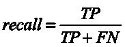

# 第二章：测试你的模型

如果你不使用好的测试方法，提出一个完美的机器学习模型并不简单。这个看似完美的模型会在你部署它的那一刻失败。测试模型的性能并非易事，但它是每个数据科学项目的必不可少的一部分。如果没有适当的测试，你无法确定模型是否能按预期工作，也无法选择最合适的方法来解决当前任务。

本章将探讨各种模型测试方法，并查看不同类型的度量标准，使用数学函数来评估预测的质量。我们还将介绍一套用于测试分类器模型的方法。

本章将涵盖以下主题：

+   离线模型测试

+   在线模型测试

# 离线模型测试

离线模型测试包括所有在模型部署之前进行的模型评估过程。在详细讨论在线测试之前，我们必须首先定义模型误差及其计算方法。

# 理解模型误差

每个模型都可能出错，因为收集的数据和模型本身都对问题的本质产生了影响。一个优秀模型的最佳例子就是你的大脑。你在实时使用建模——大脑通过解读眼睛记录的电磁脉冲来渲染你所看到的一切。虽然这种世界的图像并不完美，但它很有用，因为我们通过视觉通道接收到超过 90%的信息。剩下的 10%来自听觉、触觉和其他感觉。因此，每个模型**M**都试图通过猜测来预测真实值**Y**，![]。

真实值与模型近似值之间的差异构成了模型误差：

对于回归问题，我们可以衡量模型预测的量值误差。例如，如果我们使用机器学习模型预测房价，并且预测结果为$300,000，而实际价格为$350,000，我们可以说误差为$350,000 - $300,000 = $50,000。

对于分类问题，在最简单的设定下，我们可以将猜测的错误值设为 0，错误答案设为 1。例如，对于一个猫/狗识别器，如果模型预测一张狗的照片里有猫，则错误值为 1；如果给出了正确答案，则错误值为 0。

# 分解误差

你不会找到一个能够完美解决问题且没有任何错误的机器学习模型，无论这个错误多么微小。由于每个模型都会出错，理解这些错误的本质至关重要。假设我们的模型进行了预测，并且我们知道真实值。如果这个预测不正确，那么预测值与真实值之间就存在差异：

这种误差的另一部分来源于我们数据的缺陷，还有一些来自模型的缺陷。无论我们的模型多复杂，它只能减少建模误差。不可约误差超出了我们的控制范围，因此得名。

让我们在以下公式中来看它：

并非所有可约错误都是相同的。我们可以进一步分解可约错误。例如，看看下面的图：

每个目标的红色中心表示我们的目标（真实值），而蓝色的点表示模型的预测值。在目标中，模型的瞄准偏差——所有预测值都很接近，但远离目标。这样的误差被称为**偏差**。我们的模型越简单，偏差越大。对于简单的模型，偏差成分可能占主导地位：

在前面的图表中，我们尝试通过一条简单的直线来建模变量之间的复杂关系。这种模型具有较高的偏差。

模型误差的第二个成分是**方差**：

所有的预测值似乎都聚集在真实目标附近，但散布太广。这种误差的来源是模型对数据波动的敏感性。如果模型具有高方差，测量中的随机性会导致非常不同的预测结果。

到目前为止，我们已经将模型误差分解成了以下三个部分：

偏差和方差出现在同一公式中并非偶然，它们之间存在关系。预测模型展示了一种叫做**偏差-方差** **权衡**的特性——模型的偏差越大，误差中的方差成分就越小；反之，方差越大，偏差就越小。这个重要的事实将对构建集成模型产生深远影响，我们将在第三章 *理解 AI*中进行探讨。

通常，施加某种数据结构的模型具有较高的偏差（它们假设数据遵循某些规律）。偏差模型表现良好，只要数据不与模型的基本逻辑相矛盾。举个例子，想象一下一个简单的直线模型。例如，我们将房价预测为其平方英尺大小的线性函数：

注意，如果我们稍微改变一下面积，比如 0.1，那么预测结果不会有太大变化。因此，这个模型的方差很低。当模型对输入的变化敏感时，其方差会超过偏差。随着模型复杂度的增加和参数总数的增多，方差成分会增加。在下图中，你可以看到两个不同的模型如何拟合相同的数据集。第一个简单模型具有低方差，第二个复杂模型具有高方差：

在前面的图中，**X** 的微小变化可能导致 **Y** 的大幅波动。具有高方差的模型是鲁棒的，并且意味着数据结构较少。

# 理解过拟合

偏差-方差权衡与机器学习中的一个非常重要的问题密切相关，叫做**过拟合**。如果你的模型太简单，它会导致较大的误差。如果它过于复杂，它会过于记忆数据。一个过拟合的模型记住数据太好，像一个数据库一样工作。假设我们的住房数据集包含一些幸运的交易，其中之前的房屋因某些数据未捕捉的情况而价格较低。一个过拟合的模型会过于紧密地记住这些例子，并在未见数据上预测错误的价格值。

现在，理解了误差分解后，我们能否将其作为设计模型测试管道的基石？

我们需要确定如何测量模型误差，以使其能够反映模型在未见数据上的实际表现。答案来自问题本身。我们将把所有可用数据分成两组：训练集和测试集，如下图所示：

我们将使用训练集中的数据来训练我们的模型。测试集作为未见数据，你不应该在训练过程中使用测试集。当模型训练完成后，你可以将测试数据输入到模型中。现在你可以计算所有预测的误差。由于模型在训练过程中没有使用测试数据，因此测试集误差代表了模型在未见数据上的误差。这种方法的缺点是，你需要花费大量的数据，通常是多达 30%，来用于测试。这意味着训练数据减少，模型质量也会降低。还有一个警告——如果你过度使用测试集，误差度量可能会开始失真。例如，假设你做了以下操作：

1.  训练一个模型

1.  在测试数据上测量误差

1.  改进模型以提高指标

1.  重复步骤 1-3 十次

1.  部署模型到生产环境

您的模型质量可能远低于预期。这是为什么呢？让我们更仔细地看看*第 3 步*。您查看了一个评分，并多次更改了您的模型或数据处理代码。事实上，您进行了几次手动学习迭代。通过反复提高测试得分，您间接地将测试数据的某些信息泄漏到了您的模型中。当在测试集上测得的指标值与实际数据上的指标值偏离时，我们称测试数据已经泄漏到我们的模型中。数据泄漏在造成损害之前往往很难察觉。为了避免数据泄漏，您应该时刻关注泄漏的可能性，批判性地思考，并遵循最佳实践。

我们可以使用独立的数据来防止测试集泄漏。数据科学家使用验证集来调整模型参数，并在选择最佳模型之前比较不同的模型。然后，测试数据仅作为最终检查，告知您模型在未见过的数据上的质量。在您测量了测试指标得分之后，唯一剩下的决定就是是否将模型投入真实世界的测试场景。

在下面的截图中，您可以看到数据集的训练/验证/测试划分示例：

不幸的是，当我们使用这种方法时，以下两个问题仍然存在：

+   我们的测试集信息在多次迭代后可能仍然会泄漏到我们的解决方案中。即使使用了验证集，测试集泄漏也不会完全消失，它只是变得更慢。为了解决这个问题，您应该定期更换测试数据。理想情况下，每次模型部署周期时都应创建一个新的测试集。

+   由于训练-评估-修改的反馈循环，您可能很快会对验证数据过拟合，以调整您的模型。

为了防止过拟合，您可以为每次实验随机选择训练集和验证集。将所有可用数据随机打乱，然后按照您选择的比例将数据划分为三部分，随机选择训练集和验证集。

对于训练、验证和测试数据的使用量没有通用规则。通常，更多的训练数据意味着更准确的模型，但这也意味着您将拥有更少的数据来评估模型的性能。对于中等大小的数据集（最多 100,000 个数据点），典型的划分是将 60-80%的数据用于训练模型，其余数据用于验证。

对于大型数据集，情况有所不同。如果您的数据集有 10,000,000 行，使用 30%作为测试集将包含 3,000,000 行数据。这个数量可能会过多。增加测试和验证集的大小将带来边际效益递减。对于某些问题，使用 100,000 个测试样本就能获得良好的结果，这相当于 1%的测试比例。数据越多，您用于测试的比例应该越低。

经常会遇到数据过少的情况。在这些情况下，使用 30%-40% 的数据进行测试和验证可能会显著降低模型的准确性。你可以在数据稀缺的情况下使用一种叫做交叉验证的技术。使用交叉验证时，不需要创建单独的验证集或测试集。交叉验证按以下方式进行：

1.  你选择一个固定的迭代次数——例如，选择三次。

1.  将数据集分成三部分。

1.  对于每次迭代，交叉验证使用 2/3 的数据集作为训练数据，1/3 作为验证数据。

1.  为每一对训练-验证集训练模型。

1.  使用每个验证集计算指标值。

1.  将所有指标值取平均，汇总成一个单一的数值。

以下截图以可视化的方式解释了交叉验证：

交叉验证有一个主要缺点：它需要显著更多的计算资源来评估模型质量。在我们的例子中，为了做一次评估，我们需要训练三个模型。而使用常规的训练/测试拆分，我们只需要训练一个模型。此外，交叉验证的准确性会随着迭代次数（也叫折数）的增加而提高。所以，交叉验证使你能够使用更多的数据进行训练，同时需要更多的计算资源。那么，我们如何在交叉验证和训练-验证-测试拆分之间做选择呢？

在交叉验证中， ![] 是由数据科学家设置的一个变量参数。最小值为 1，相当于一个简单的训练/测试拆分。最大值是 ![]，即数据集中数据点的数量。这意味着如果我们有 ![] 个数据点，模型将被训练和测试 ![] 次。这个特殊的交叉验证情况叫做**留一交叉验证**。理论上，更多的折数意味着交叉验证会返回更准确的指标值。虽然留一交叉验证是最理论上准确的方法，但由于巨大的计算需求，它在实践中很少使用。实际上， ![] 的值通常在 3 到 15 折之间，具体取决于数据集的大小。你的项目可能需要使用更多的折数，所以把这个作为建议，而不是规则。

以下表格总结了一种常见的思考方式：

|  | **模型训练需要低到中等的计算资源和时间** | **模型训练需要大量计算资源并且耗时较长** |
| --- | --- | --- |
| **小到中型数据集** | 交叉验证 | 任意 |
| **大数据集** | 任意 | 训练/验证/测试拆分 |

另一个与模型测试相关的重要方面是如何拆分数据。稍有错误的拆分逻辑可能会导致你所有的测试工作都白费。如果数据集中的所有观测值都是独立的，那么拆分就很简单。你可以使用随机数据拆分。但如果我们正在解决股票价格预测问题呢？当我们的数据行与时间相关时，我们不能将它们视为独立的值。今天的股价依赖于过去的股价。如果这不成立，股价就会随机从$0 跳到$1,000。在这种情况下，假设我们有两年的股票数据，从 2017 年 1 月到 2018 年 12 月。如果我们使用随机拆分，可能会出现模型在 2018 年 9 月训练，而在 2017 年 2 月进行测试的情况。这是毫无意义的。我们必须始终考虑观测值之间的因果关系和依赖性，并确保验证过程是正确的。

接下来，我们将学习关于指标的知识，它是我们用来总结验证和测试误差的公式。指标将使我们能够比较不同的模型，并选择最适合生产使用的候选模型。

# 使用技术指标

每个模型，无论多么复杂和精确，都不可避免地会犯错。我们自然会期望一些模型在解决特定问题时比其他模型表现更好。目前，我们可以通过将各个模型的预测与真实值进行比较来衡量误差。将这些误差总结成一个数字来衡量模型的表现会很有用。我们可以使用一个指标来实现这一点。不同的机器学习问题适合使用不同种类的指标。

特别地，对于回归问题，最常见的指标是**均方根误差**，或称**RMSE**：

让我们来看看这个公式的各个元素：

+   *N* 是数据点的总数。

+   *预测值 - 实际值* 衡量了地面真相和模型预测之间的误差。

+   公式开头的 Sigma 符号表示求和。

另一种常用的回归误差衡量方法是**平均绝对误差**（**MAE**）：

请注意，MAE 与 RMSE 非常相似。与 MAE 相比，RMSE 的区别在于它使用平方根而不是绝对值，并且它会对误差进行平方。尽管 MAE 和 RMSE 看起来很相似，但它们之间还是存在一些技术性差异。数据科学家可以根据问题的需求选择最合适的指标，了解各个指标的权衡和局限性。你不需要学习所有的指标，但我希望强调一个差异，以便让你大致理解思考过程。RMSE 对大误差的惩罚比 MAE 更严重。这一特性来自于 RMSE 使用平方误差，而 MAE 使用绝对值。举个例子，MAE 中的误差为 4，而 RMSE 中的误差则会变成 16，因为它要进行平方计算。

对于分类问题，指标计算过程更为复杂。假设我们正在构建一个二分类器，用于估计一个人是否患有肺炎。为了计算模型的准确性，我们可能只需将正确答案的总数除以数据集中的行数：

在这里，![]是正确预测的数量，而![]是总的预测数量。准确率简单易懂且容易计算，但它有一个重大缺陷。假设患有肺炎的平均概率是 0.001%。也就是说，每 10 万人中只有一个人得病。如果你收集了 20 万人数据，那么数据集中可能只有两个阳性病例。假设你要求数据科学家构建一个基于患者数据来估计肺炎概率的机器学习模型，并且你要求准确率不低于 99.9%。假设某人创建了一个虚拟算法，始终输出零。

这个模型没有实际价值，但它在我们的数据上的准确性会很高，因为它只会犯两个错误：

问题在于准确率仅考虑答案的全局比例。当某个类别的数量远超其他类别时，准确率会输出误导性的值。

让我们通过构建混淆矩阵来更详细地查看模型预测：

|  | **模型预测:****有肺炎** | **模型预测:****没有肺炎** |
| --- | --- | --- |
| **实际结果:****有肺炎** | 0 | 2 |
| **实际结果:****没有肺炎** | 0 | 199,998 |

通过查看这个表格，我们可以看到，虚拟模型对任何人都没有帮助。它没有将两个有病的人判定为阳性。我们称这些错误为**假阴性**（**FN**）。该模型也正确地识别了所有没有肺炎的患者，或者说是**真阴性**（**TN**），但它未能正确诊断出生病的患者。

现在，假设你的团队已经构建了一个真实的模型，并得到了以下结果：

|  | **模型预测:****有肺炎** | **模型预测:****没有肺炎** |
| --- | --- | --- |
| **实际结果:****有肺炎** | 2 | 0 |
| **实际结果:****没有肺炎** | 30 | 199,968 |

这个模型正确地识别了两个病例，做出了两个**真阳性**（**TP**）预测。这相较于之前的版本有了明显的改进。然而，模型也将 30 个实际没有肺炎的人误判为有肺炎。我们称这种错误为**假阳性**（**FP**）预测。那么，30 个假阳性是否是一个显著的缺点呢？这取决于医生如何使用这个模型。如果所有被诊断的人都会被自动开具带有副作用的重药，假阳性就可能是一个严重问题。

如果我们仅将正向模型视为患病的可能性，情况可能没有那么严重。如果正向模型的回答仅表示患者必须经过一组特定的诊断程序，那么我们就能看到一个好处：为了达到相同的肺炎识别水平，治疗师只需要诊断 32 个患者，而之前需要检查 200,000 个案例。如果我们没有使用混淆矩阵，可能会错过模型的不良行为，这可能对人们的健康造成负面影响。

接下来，你的团队进行了另一个实验，并创建了一个新模型：

|  | **模型预测：** **有肺炎** | **模型预测：** **没有肺炎** |
| --- | --- | --- |
| **实际结果：** **有肺炎** | 0 | 2 |
| **实际结果：** **没有肺炎** | 100,000 | 99,998 |

这个模型表现得更好吗？该模型可能会漏掉一个需要治疗的患者，同时将 100,000 个健康人分配到治疗组，导致医生做不必要的工作。实际上，只有在将结果展示给最终使用该模型的人之后，你才能做出最终决策。他们可能对什么是最佳选择有不同的看法。最好在项目的初期阶段通过与该领域的专家合作，创建一个模型测试方法文档来定义这一点。

你将在各个地方遇到二分类问题，因此对术语的良好理解非常重要。

你可以在下面的表格中看到所有新概念的总结：

|  | **模型预测：** **1（阳性案例）** | **模型预测：** **0（阴性案例）** |
| --- | --- | --- |
| **实际结果：** **1（阳性案例）** | 真阳性（TP） | 假阴性（FN） |
| **实际结果：** 0（阴性案例） | 假阳性（FP） | 真阴性（TN） |

需要特别注意的是，你可以控制单个模型的假阳性和假阴性反应的数量。分类器输出一个数据点属于某一类别的概率。也就是说，模型的预测是一个介于 0 和 1 之间的数字。你可以通过将其与阈值进行比较来决定一个预测是否属于正类或负类。例如，如果阈值是 0.5，则任何大于 0.5 的模型预测都属于类别 1，否则属于类别 0。

通过改变阈值，你可以改变混淆矩阵中各单元格之间的比例。选择一个较大的阈值，比如 0.9，假阳性反应的数量会减少，但假阴性反应的数量会增加。阈值选择对于二分类问题至关重要。一些环境，比如数字广告，对于假阳性会更宽容，而在其他环境中，比如医疗保健或保险，假阳性可能是无法接受的。

混淆矩阵为分类问题提供了深刻的洞察，但需要你投入时间和精力。这在你希望进行大量实验并比较许多模型时可能成为限制。为了简化这个过程，统计学家和数据科学家设计了许多度量方法，可以在不遇到像准确率度量那样的问题的情况下总结分类器的性能。首先，让我们检查一些总结混淆矩阵行和列的方法。然后，我们将探索如何将其浓缩为一个单一的统计量。

在下表中，你可以看到两种新的度量，用于总结不同类型的错误，精确度和召回率：

|  | **模型预测：**1**（**正类**） | **模型预测：**0**（**负类**） | **综合度量** |
| --- | --- | --- | --- |
| **实际结果：**1**（**正类**） | 真正例 | 假负例 |  |
| **实际结果：**0**（**负类**） | 假正例 | 真负例 |  |
| **综合度量** | ，也称为**真正例率**（**TPR**） |  |  |

精确度衡量你的模型识别出的正类（相关）案例的比例。如果模型预测了 10 个正类案例，并且其中 2 个预测为正类的实际情况为负类，那么它的精确度为 0.8。召回率表示正确预测正类案例的概率。如果在 10 个正类案例中，模型正确预测了全部 10 个（10 个真正例），并将 5 个负类案例错误标记为正类（5 个假正例），那么它的召回率为 0.67。召回率为 0.67 意味着，如果我们的模型预测正类案例，它将在 100 次预测中有 67 次是正确的。

对于二分类，精确度和召回率将我们必须处理的度量缩减为两个。这是更好的，但仍不是理想的。我们可以通过使用一种称为**F1-score**的度量，将所有内容汇总为一个单一的数值。你可以使用以下公式计算 F1：

F1 对于完美分类器为 1，对于最差的分类器为 0。由于它同时考虑了精确度和召回率，它不会像准确率那样存在相同的问题，因此它是分类问题的更好默认度量。

# 更多关于不平衡类别的信息

在前面的示例中，你可能已经注意到，许多预测问题存在一种现象，即某一类出现的频率远高于其他类。识别癌症等疾病、估算信用违约的概率或检测金融交易中的欺诈行为都是不平衡问题的例子——正例远少于负例。在这种情况下，评估分类器性能变得很棘手。像准确率这样的指标开始显得过于乐观，因此你需要依赖更先进的技术指标。在这种情境下，F1 得分提供了更为真实的数值。然而，F1 得分是从类别分配（在二分类情况下为 0 或 1）计算得出的，而不是类别概率（在二分类情况下为 0.2 和 0.95）。

大多数机器学习模型输出的是某个样本属于某个类别的概率，而不是直接的类别分配。特别是，癌症检测模型可能会基于输入数据输出一个 0.32（32%）的疾病概率。然后，我们必须决定是否将患者标记为患有癌症。为此，我们可以使用阈值：所有低于或等于该阈值的值将被标记为 0（没有癌症），而所有大于该阈值的值将被标记为 1（患有癌症）。阈值会极大地影响结果模型的质量，尤其是对于不平衡数据集。例如，较低的阈值可能会导致更多的 0 标签，然而这种关系并不是线性的。

为了说明这一点，我们可以使用一个训练好的模型并为测试数据集生成预测。如果我们通过设置不同的阈值来计算类别分配，然后为每个类别分配计算精度、召回率和 F1 得分，我们可以在单一图表中描绘出每个精度和召回率值：

上面的图表是使用`yellowbrick`库制作的，该库包含许多用于模型选择和解释的有用可视化工具。你可以在这里看到这个库的功能：[`www.scikit-yb.org/en/latest/index.html`](https://www.scikit-yb.org/en/latest/index.html)。

在上面的图表中，你可以看到每个阈值（从 0 到 1 之间）对应的精度（蓝色）、召回率（绿色）和 F1 得分（红色）。根据这个图表，我们可以看到 0.5（这是许多机器学习库中的默认值）可能不是最好的选择，像 0.45 这样的阈值可能会产生更为优化的指标值。

图中展示的另一个有用概念是队列率（以品红色显示），它表示在测试数据集中被标记为正类的实例所占比例。对于 0.45 的阈值（图中以虚线表示），你可以看到队列率为 0.4。也就是说，大约 40%的所有案例将被标记为欺诈。根据模型将被使用的业务流程，正类案例可能需要进一步由人工调查。在某些情况下，人工检查会消耗大量时间或资源，但对于更低的队列率，误判一些正类实例是可以接受的。在这种情况下，即使模型性能较低，你可能也会选择队列率更低的模型。

所有关于精确度、召回率和阈值的信息可以进一步总结为一个叫做**精确度-召回率曲线下的面积**（**PR AUC**）的单一数值。这个指标可以用来快速判断大量不同模型，而无需手动评估模型在不同阈值下的质量。另一个常用于二分类器评估的指标是**受试者工作特征曲线下的面积**（**ROC AUC**）。通常情况下，你会希望在数据集不平衡时使用 PR AUC，在数据集平衡时使用 ROC AUC。

这种差异来自于这些指标的计算方式，但为了简洁起见，我们将在这里省略技术细节。计算 AUC 指标比本章介绍的其他指标要复杂一些。欲了解更多信息，请查看[`www.chioka.in/differences-between-roc-auc-and-pr-auc/`](https://www.chioka.in/differences-between-roc-auc-and-pr-auc/)和[`en.wikipedia.org/wiki/Receiver_operating_characteristic`](https://en.wikipedia.org/wiki/Receiver_operating_characteristic)。

选择精确度、召回率、F1 值和队列率的合适平衡并没有固定的规则。这些值应该根据业务流程进行深入的调查。单纯依赖技术指标来选择模型可能会导致灾难，因为最适合你的客户的模型不一定是最准确的模型。在某些情况下，高精确度可能比召回率更为重要，而在其他情况下，队列率可能是最重要的。在这种情况下，我们需要引入另一种指标，它将充当技术指标和业务需求之间的桥梁：业务指标。

# 应用业务指标

尽管技术指标在模型开发过程中至关重要，但它们并不适用于商业语言。充满混淆表格和 F1 分数的数据，通常难以打动你的客户或利益相关者。他们更关心的是模型能解决什么问题，而不是其内部细节。他们不会对假阳性率感兴趣，但如果你提到模型在下个季度能为他们节省多少资金，他们会愿意听。因此，设计商业指标非常重要。你的项目需要一个对所有关键利益相关者（无论是否具备数据科学经验）都非常清晰的质量衡量标准。如果你身处商业环境，开始的好方法是看看你通过机器学习试图改进的业务流程的**关键绩效指标**（**KPI**）。你很可能会找到一个现成的商业指标。

在这一点上，我们总结了技术指标的介绍。测试分类和回归模型的方法有很多，每种方法都有其优缺点。列举并描述所有这些方法将需要一本书的篇幅，而且没有必要，因为我们已经达到了目标。通过本章的新概念，你现在已经理解了如何在实际条件下测试之前评估机器学习模型的一般流程。现在，你可以使用离线模型测试来检查模型的质量，然后再进行部署。接下来，我们将探索在线测试，以完善你对模型质量评估的理解。

# 在线模型测试

即使是一个优秀的离线模型测试流程，也无法保证模型在生产环境中的表现完全相同。总是有一些风险会影响模型的性能，比如以下几种：

+   **人类**：我们会犯错误，并可能在代码中留下 bug。

+   **数据收集**：选择性偏差和不正确的数据收集程序可能会破坏真实的指标值。

+   **变化**：现实世界中的数据可能会发生变化，偏离你的训练数据集，从而导致模型出现意外的行为。

在不久的将来，确认模型性能的唯一方法是进行实时测试。根据环境的不同，此类测试可能会带来很大的风险。例如，评估飞机发动机质量或病人健康状况的模型，在我们对其性能没有足够信心之前，是不适合进行实际测试的。

当进行现场测试时，你将希望在得出统计有效结论的同时，最小化风险。幸运的是，为此目的存在一种统计框架，称为假设检验。在进行假设检验时，你通过收集数据并执行统计测试来检查某个想法（假设）的有效性。假设你需要检查你的新广告模型是否增加了广告服务的收入。为此，你将所有客户随机分成两组：一组使用旧的广告算法，另一组则看到由新算法推荐的广告。收集了足够的数据后，你会比较这两组并衡量它们之间的差异。你可能会问，为什么我们需要去麻烦统计学呢？

因为我们只能借助统计学回答以下问题：

+   我应该如何将个体排序（抽样）到每个组别中？我的抽样过程会扭曲测试结果吗？

+   每个组别的最小客户数量是多少？数据中的随机波动会影响我的测量结果吗？

+   我应该运行测试多长时间才能得出一个有信心的答案？

+   我应该使用什么公式来比较每个组别中的结果？

假设检验的实验设置故意将目标分为两组。我们也可以尝试只使用单组。举例来说，我们可以先用旧模型做一组测量。第一部分实验结束后，再部署新算法并测量其效果。然后，我们比较两个连续测量之间的差异。可能会出现什么问题？事实上，我们得到的结果并没有什么意义。我们的测量之间可能发生了许多变化，比如以下这些：

+   用户偏好

+   用户的整体情绪

+   我们服务的受欢迎程度

+   平均用户画像

+   用户或企业的其他任何属性

所有这些隐藏的影响因素可能以不可预测的方式影响我们的测量结果，这就是为什么我们需要两个组别：实验组和对照组。我们必须以这样的方式选择这些组别，确保它们之间的唯一区别就是我们的假设。假设应该出现在实验组中，而在对照组中缺失。例如，在医学试验中，对照组是那些接受安慰剂的人。假设我们想测试一种新止痛药的正面效果。以下是一些不良测试设置的例子：

+   对照组仅由女性组成。

+   实验组和对照组位于不同的地理位置。

+   你使用偏见性采访来预先选择实验参与者。

创建组别的最简单方法是随机选择。真正的随机选择在现实世界中可能很难实现，但如果你处理的是互联网服务，这就很容易了。在那里，你可以随机决定每个活跃用户使用哪一版本的算法。务必始终与经验丰富的统计学家或数据科学家共同设计实验设置，因为正确的测试执行起来非常困难，尤其是在离线环境中。

统计检验验证原假设的有效性，即你获得的结果是否是偶然的。相反的结果称为备择假设。例如，这是我们广告模型测试的假设设置：

+   **原假设**：新模型不会影响广告服务收入。

+   **备择假设**：新模型会影响广告服务收入。

通常，统计检验衡量原假设为真的概率。如果这种概率很低，那么备择假设为真。否则，我们接受原假设。如果根据统计检验，新的模型不会影响服务收入的概率为 5%，那么我们会在 95%的置信水平下接受备择假设。这意味着模型以 95%的概率影响广告服务收入。拒绝原假设的显著性水平取决于你愿意承担的风险级别。对于广告模型，95%的显著性可能足够，而对于测试患者健康状况的模型，则需要不低于 99%的显著性。

最典型的假设检验是比较两个均值。如果我们在广告模型示例中使用此检验，我们将测量新排名算法前后的平均收入。实验结束后，我们可以通过检验统计量来接受或拒绝原假设。

进行假设检验所需收集的数据量取决于多个因素：

+   **置信水平**：你需要的统计置信度越高，所需的数据量就越大，以支持证据。

+   **统计功效**：这衡量了在存在显著差异时检测到该差异的概率。你的测试统计功效越高，出现假阴性结果的概率越低。

+   **假设差异和总体方差**：如果你的数据方差很大，你需要收集更多的数据以检测显著差异。如果两个均值之间的差异小于总体方差，你则需要更多的数据。

你可以通过以下表格看到不同测试参数如何决定它们对数据的需求：

| **置信水平** | **统计功效** | **假设差异**  | **总体方差** | **推荐样本量** |
| --- | --- | --- | --- | --- |
| 95% | 90% | $10 | $100 | 22 次广告展示给客户 |
| 99% | 90% | $10 | $100 | 30 次广告展示给客户 |
| 99% | 90% | $1 | $100 | 2,976 次广告展示给客户 |

尽管假设检验功能强大，但它也有局限性：你需要等到实验结束后才能应用其结果。如果你的模型很差，就无法在不妥协测试过程的情况下减少损害。另一个局限是，每次只能用单一的假设检验来测试一个模型。

在可以权衡统计严谨性、速度和风险规避的情况下，有一种替代方法叫做 **多臂老虎机**（**MABs**）。为了理解 MABs 的工作原理，假设你身处赌场中，那里有许多老虎机。你知道其中一些机器的回报比其他机器更好。你的任务是通过最少的试验次数找到最好的老虎机。因此，你尝试不同的老虎机（多臂）的手臂（bandits），以最大化你的奖励。你可以将这个情境扩展到测试多个广告模型：对于每个用户，你必须找到最有可能增加广告收入的模型。

最流行的 MAB 算法叫做 epsilon-贪婪 bandit。尽管名字如此，这种方法的内部机制其实很简单：

1.  选择一个小的数字，称为 **epsilon**。假设我们选择了 0.01。

1.  选择一个介于 0 和 1 之间的随机数。这个数字将决定 MAB 是进行探索还是利用可能的选择集。

1.  如果数字小于或等于 epsilon，则随机做出选择，并在执行与选择相关的行为后记录奖励。我们称这个过程为探索（exploration）——MAB 以较低的概率随机尝试不同的行为，以发现它们的平均奖励。

1.  如果你的数字大于 epsilon，根据你收集的数据做出最佳选择。我们称这个过程为利用（exploitation）——MAB 利用它所收集的知识执行预期奖励最好的行动。MAB 通过对每个选择的所有记录奖励进行平均，选择期望奖励最大的选项。

通常，我们从较大的 epsilon 值开始，然后逐渐将其减小到更小的值。这样，MAB 在开始时会探索大量的随机选择，并在最后利用最有利的行动。探索频率逐渐减少，接近零。

当你首次启动 MAB 时，它从随机行为中收集奖励。随着时间的推移，你会看到所有选择的平均奖励趋向于它们的真实值。MAB 的主要优势在于它可以实时改变行为。当有人等待假设检验结果时，MAB 给你呈现的是一个不断变化的画面，同时不断向最佳选择收敛。Bandits 是最基本的强化学习算法之一。尽管它们很简单，但可以提供良好的结果。

现在我们有两种新的测试方法可供使用。我们该如何选择其中之一呢？不幸的是，这没有简单的答案。假设检验和 MAB（多臂老虎机）对数据、采样过程和实验条件提出了不同的约束。在做决定之前，最好请教经验丰富的统计学家或数据科学家。数学约束并不是唯一影响选择的因素；环境也很重要。MABs 在可以从整个群体的随机个体中测试不同选择的情况下容易应用。当测试大型在线零售商的模型时，这可能非常方便，但在临床试验中是不可能的，那里你最好使用假设检验。让我们看看选择 MABs 和假设检验的经验法则：

+   MABs 更适合在需要用有限资源测试多个备选方案的环境中使用。使用 MAB 时，你在统计严谨性和效率之间做出权衡。MABs 可能需要很长时间才能收敛，随着时间推移逐渐改进。

+   如果你只有一个备选方案，或者你的试验涉及较大风险，或者你需要统计学严谨的答案，你应该使用假设检验。假设检验需要固定的时间和资源来完成，但比 MABs 带来更大的风险。

在在线环境中测试模型对于确保离线测试结果在部署阶段之后保持有效至关重要，但仍然存在我们尚未覆盖的危险区域。数据的突然和意外变化可能会严重影响甚至破坏已部署的模型，因此监控输入数据质量也非常重要。

# 在线数据测试

即使成功地进行了在线测试，你也无法完全防范模型操作中出现的意外问题。机器学习模型对输入数据非常敏感。好的模型具有一定的泛化能力，但数据或生成数据的基本过程发生显著变化时，模型预测可能会失准。如果在线数据与测试数据有显著偏差，在进行在线测试之前，你无法确定模型的性能。如果测试数据与训练数据不同，那么你的模型就无法按预期工作。

为了克服这个问题，你的系统需要实时监控所有输入数据并检查其质量。以下是一些典型的检查：

+   必填数据字段中的缺失值

+   最小值和最大值

+   分类数据字段的可接受值

+   字符串数据格式（日期、地址）

+   目标变量统计（分布检查、平均值）

# 总结

在本章中，我们回答了一个非常重要的问题：什么才是模型正确工作的标准？我们探讨了错误的性质，并研究了可以量化和衡量模型错误的指标。我们区分了离线和在线模型测试，并为两者定义了测试流程。我们可以通过训练/验证/测试数据集划分和交叉验证来进行离线模型测试。对于在线测试，我们可以选择假设检验和多臂老虎机（MABs）。

在下一章中，我们将深入探讨数据科学的内部运作。我们将深入了解机器学习和深度学习背后的主要概念，帮助读者直观地理解机器是如何学习的。
