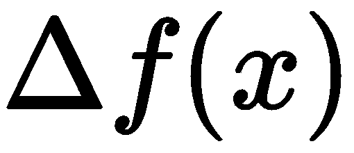

# 第三章：理解人工智能

现在你已经对数据科学能做什么以及我们如何检查其效果有了很好的理解。我们已经介绍了数据科学的主要领域，包括机器学习和深度学习，但算法的内部机制仍然难以通过雾霾般的视角看清。在本章中，我们将讨论算法。你将直观地理解如何通过数学和统计学来定义学习过程。深度神经网络将不再是那么神秘，常见的机器学习术语也不会让你害怕，而是提供理解和启发，帮助你完成不断增长的潜在项目清单。

阅读本章不仅对你有益，你的新知识还将简化与同事的沟通，使会议更加简短且有目的，团队合作更高效。我们将从每个机器学习问题的核心开始：定义学习过程。为了做到这一点，我们将从数据科学的两大根基——数学和统计学开始。

在本章中，我们将涵盖以下主题：

+   理解数学优化

+   用统计学思维

+   机器是如何学习的？

+   探索机器学习

+   探索深度学习

# 理解数学优化

首先，我们将探讨数学优化的概念。优化是机器学习问题的核心组成部分。事实证明，学习过程不过是一个简单的数学优化问题。关键在于如何正确地定义它。为了给出一个好的定义，我们首先需要理解数学优化的工作原理，以及它能解决哪些问题。

如果你在商业领域工作，我敢打赌你每天都会听到“优化”这个词。优化意味着提高效率、削减成本、增加收入并最小化风险。优化涉及采取一系列行动、衡量结果，并决定是否达到了更好的状态。

例如，为了优化你每天上班的路线，你可以最小化从家到办公室的总驾车时间。假设对你而言，唯一重要的是时间。因此，优化就是时间的最小化。你可以尝试不同的方案，比如走另一条路，或者改用公共交通而不是开车。为了选择最佳路线，你将使用相同的量度来评估所有路线，即从家到办公室的总时间。

为了更好地理解优化问题的定义，我们来看看另一个例子。我们的朋友乔纳森厌倦了银行的日常工作，于是他开始了一个兔子农场。结果发现兔子繁殖得很快。一开始，他买了四只兔子，不久后就有了 16 只。一个月后，它们的数量达到了 256 只。所有这些新兔子带来了额外的费用。乔纳森的兔子销售率低于兔子繁殖的速度。乔纳森聪明的农场朋友阿隆对他的兔子繁殖速度印象深刻，于是提议以折扣价购买所有多余的兔子。现在，乔纳森需要找出应该卖给阿隆多少只兔子，以便保持在以下边界内：

+   他不会陷入不能将兔子卖给迫切需要兔子的人这一境地。兔子的繁殖率不应低于兔子销售预期。

+   他在兔子照料方面的总支出保持在预算范围内。

如你所见，我们定义了另一个优化问题，兔子农场开始让人想起了乔纳森之前离开的银行工作。这个优化任务虽然也很复杂，但它与第一个问题不同，看起来更加困难。在第一个问题中，我们尝试最小化通勤时间；而在这个问题中，我们需要寻找一个最小的兔子销售数量，以确保不违反其他条件。我们将这种类型的问题称为**约束优化**。额外的约束让我们能够在复杂的环境中模拟更为现实的场景。举几个例子，约束优化可以解决规划、预算和路由问题。最后，乔纳森对他的兔子农场感到失望，并将其卖给了阿隆。他随后继续寻找一个完美的职业，希望它不会像银行工作那样结束。

有一个地方，盈亏不再让你抓狂；那就是技术大学的数学系。为了得到一个职位，他们要求你通过一项考试。第一个任务是找到一个函数的最小值，。

以下是该函数的图表：

在检查图表时，你会注意到这个函数的值不小于 0，所以答案显然是 0。下一个问题看起来像是之前的问题，但有一些变化——*找到该函数的最小值* ，*其中  是一个任意数值*。为了解决这个问题，你绘制了一些图表，并发现最小值始终是 *a*。

最后的问题将问题推向极限。它说你不会得到关于  的公式，但你可以去找老师，要求获取一些  在某些  下的值，并且可以重复多次。这样无法绘制图像。在其他图像中，最小值总是最低点。那么我们如何在不查看图像的情况下找到这个点呢？为了解决这个问题，我们首先假设我们有该函数的图像。

首先，我们将在函数的两个任意点之间画一条直线，如下图所示：

我们将这两个点之间的距离称为 。如果我们将  越变越小，这两个点会越来越接近，直到它们在视觉上合并成一个点：

上面图中的直线被称为切线。它有一个非常方便的特性，切线的斜率可以帮助我们找到函数的最小值或最大值。如果这条线是平的，那么我们就找到了函数的最小值或最大值。如果附近的点都比较高，那么应该是最大值。如果附近的点都比较低，那么这就是最小值。

以下图展示了一个函数（用蓝色表示）及其最大值，并附有切线（用橙色表示）：

绘制一堆线条和点很快会变得单调无趣。幸运的是，有一种简单的方法可以计算这条线的斜率，方法是计算从  到  之间的斜率。如果你回忆一下勾股定理，你很快就能找到答案：![]。我们可以通过这个公式轻松找到斜率。

恭喜，我们刚刚发明了第一个数学优化算法——梯度下降。像往常一样，名字听起来吓人，但直观理解很简单。为了更好地理解函数优化，假设你正站在一座大山丘上，眼睛闭着，你需要从山丘上走下来。你可能会通过移动脚步来测试周围的区域。当你感受到某个方向在下降时，你就会朝着那个方向迈步，然后继续重复这个过程。用数学术语来说，这座山丘就是一个函数，。每次你评估斜率时，实际上是在计算函数的梯度，。你可以沿着这个梯度找到函数的最小值或最大值。这就是为什么它叫做梯度下降。

你可以通过使用梯度下降法来解决最终任务。你可以选择一个起始点，![]，请求获取![]的值，并使用小数字![]计算斜率。通过观察斜率，你可以决定你的下一个选择![]应该大于还是小于![]。当斜率变为零时，你可以通过查看附近的几个值来测试当前的![]值是否为最小值或最大值。如果每个值都小于![]，那么![]就是最大值。否则，它就是最小值。

和往常一样，有一个警告。让我们来分析一下这个函数：

如果我们从点**A**开始梯度下降，我们将最终找到一个真实的最小值。但如果我们从点**B**开始，我们将停留在局部最小值。使用梯度下降时，你永远无法确切知道自己是否处于局部最小值或全局最小值。检查的一种方法是从相隔较远的不同点重复下降。避免局部最小值的另一种方法是增加步长，![]。但要小心；如果![]太大，你将一次次跳过最小值，永远无法到达真正的目标——全局最小值。

就像在机器学习中一样，有许多数学优化算法，它们各有优缺点。梯度下降是最简单且最容易入门的一种。尽管它很简单，但梯度下降在训练机器学习模型时被广泛使用。

在继续之前，让我们回顾一下几个关键点：

+   数学优化是机器学习的核心组成部分。

+   优化问题有两种类型：有约束和无约束。

+   梯度下降是一种简单且广泛应用的优化算法。为了理解梯度下降背后的直觉，可以回想一下下坡比喻。

现在你已经掌握了数学优化的主要原理，我们可以研究统计学领域——机器学习的祖父学科。

# 用统计学思维

统计学处理关于数据的一切，具体来说，包括数据的收集、分析、解释、推断和展示。它是一个广阔的领域，包含了许多分析数据的方法。全面覆盖这个领域超出了本书的范围，但我们将深入探讨一个在机器学习中占据核心地位的概念——**最大似然估计**（**MLE**）。一如既往，别怕术语，因为背后的概念既简单又直观。为了理解 MLE，我们需要深入了解概率论，这也是统计学的基石。

首先，让我们看看为什么在我们已经拥有如此强大的数学工具时，还需要概率。我们使用微积分来处理无穷小尺度上的函数，并衡量它们的变化。我们发展了代数来解方程，而且我们有其他许多数学领域来帮助我们解决几乎任何我们能想到的难题。我们甚至提出了范畴论，它为所有数学提供了一个通用的语言，但几乎没有人能理解它（包括 Haskell 程序员）。

难点在于我们生活在一个混乱的宇宙中，事物无法精确测量。当我们研究现实世界中的过程时，我们需要了解许多随机事件，这些事件会扭曲我们的实验结果。 不确定性无处不在，我们必须驾驭并利用它满足我们的需求。这时，概率论和统计学就派上了用场。概率让我们能够量化和衡量不确定事件，从而做出明智的决策。丹尼尔·卡尼曼在他广为人知的著作《*思考，快与慢*》中指出，我们在解决统计问题时的直觉往往非常糟糕。概率思维帮助我们避免偏见，理性地行动。

# 频率主义概率

想象一下，有个陌生人建议你玩一个游戏：他给你一枚硬币，你抛掷它。如果是正面，你赢得$100；如果是反面，你输了$75。在玩这个游戏之前，你肯定会想检查一下它是否公平。如果硬币偏向反面，你可能很快就会亏钱。我们该如何处理这个问题呢？让我们做一个实验，其中我们记录 1 表示正面，0 表示反面。好玩的地方在于，我们需要抛掷 1,000 次，才能确保我们的计算是正确的。假设我们得到了以下结果：600 次正面（1），400 次反面（0）。如果我们计算正面和反面出现的频率，我们会得到 60%和 40%。我们可以将这些频率解读为硬币正面或反面出现的概率。这就是频率主义的概率观。事实证明，我们的硬币实际上偏向正面。这个游戏的期望值可以通过将概率与其对应的数值相乘并加总得出（下列公式中的数值为负，因为$40 是潜在的损失，而不是收益）：

玩得越多，得到的越多。即使连续几次掷骰子不幸运，你也可以确定，回报很快会趋于平均。因此，频率派概率衡量某个事件与所有其他可能事件的比例。

# 条件概率

了解某个事件发生的条件概率是非常有用的，特别是当另一个事件已经发生时。我们将事件  给定事件  的条件概率表示为 。以下雨为例：

+   给定我们听到雷声，下雨的概率是多少？

+   给定晴天，下雨的概率是多少？

在下图中，您可以看到不同事件同时发生的概率：

从这个欧拉图中，我们可以看到 ，这意味着每当我们听到雷声时，必定下雨（是的，这并不完全准确，但为了简化问题，我们假设它是正确的）。

那么  呢？从视觉上看，这个概率很小，但我们如何用数学公式来精确计算呢？条件概率的定义如下：

用语言来说，我们将*下雨*和*晴天*的联合概率除以晴天的概率。

# 依赖事件与独立事件

如果一个事件的发生概率不影响另一个事件的发生概率，我们就称这对事件是独立的。例如，掷骰子连续两次得到 2 的概率。这两个事件是独立的。我们可以这样表述：

那么为什么这个公式有效呢？首先，我们将第一次和第二次投掷的事件重命名为 A 和 B，以去除符号混乱，然后明确地将掷骰子的概率重写为我们到目前为止所看到的两个投掷的联合概率：

现在将  与  相乘和相除（没有变化，它们可以被约去），并回顾条件概率的定义：

如果我们从右到左读出前面的表达式，我们发现 。基本上，这意味着 A 与 B 是独立的！同样的推理适用于 。

# 贝叶斯概率观点

在这一点之前，我们总是将概率衡量为频率。频率主义方法并不是定义概率的唯一方式。虽然频率主义者将概率视为比例，但贝叶斯方法考虑了先验信息。贝叶斯理论基于一个简单的定理，让我们可以基于先前的知识计算条件概率：

在这个例子中，先验值是 。如果我们不知道真实的先验值，我们可以用基于经验的估计值来进行近似计算。这就是贝叶斯定理的魅力所在。你可以用简单的组件计算复杂的条件概率。

贝叶斯定理具有巨大的价值和广泛的应用领域。贝叶斯理论甚至有自己的一支统计学分支和推理方法。许多人认为，贝叶斯观点更接近我们人类对不确定性的理解，特别是先验经验如何影响我们的决策。

# 分布

概率与一组结果或事件有关。我们用概率描述的许多问题都有共同的属性。在下图中，你可以看到钟形曲线：

钟形曲线或高斯分布集中在最可能的结果集周围，两端的尾部表示最不可能的结果。由于其数学特性，钟形曲线在我们的世界中无处不在。测量许多随机人的身高，你会看到钟形曲线；观察你草坪上所有草的高度，你会再次看到它。计算你所在城市的居民具有某种收入的概率，你又会看到它。

高斯分布是最常见的分布之一，但还有许多其他分布。概率分布是一种数学法则，它告诉我们不同可能结果的概率，这些结果通过数学函数表达。

当我们测量硬币投掷事件的相对频率时，我们计算了所谓的经验概率分布。硬币投掷也可以被表述为伯努利分布。如果我们想要计算在*n*次试验后得到正面的概率，我们可以使用二项分布。

引入一个与变量类似的概念，在概率环境中可能会使用——随机变量。随机变量是统计学的基本构件。每个随机变量都有一个分布。随机变量通常用大写字母表示，我们使用~符号来指定分配给变量的分布：

这意味着随机变量*X*根据伯努利定律分布，成功（正面）的概率为 0.6。

# 从数据样本计算统计量

假设你正在研究人类身高，并且渴望发表一篇令人惊叹的科学论文。为了完成你的研究，你需要测量你所在地区普通人的平均身高。你可以通过两种方式完成这个任务：

+   收集你所在城市每个人的身高并计算平均值

+   应用统计学

统计学允许我们在不为每个人收集完整数据集的情况下推理出种群的不同属性。从真实种群中选择随机数据子集的过程称为抽样。统计量是使用样本中的值来总结数据的任何函数。几乎每个人每天都使用的无处不在的统计量是样本均值或算术平均数：

我们已经收集了一组随机样本共 16 人的平均身高。在下表中，我们可以看到四天内的身高情况：

| **日期** | **身高** | **平均值** |
| --- | --- | --- |
| 星期一 | 162 cm, 155 cm, 160 cm, 171 cm | 162.00 cm |
| 星期二 | 180 cm, 200 cm, 210 cm, 179 cm | 192.25 cm |
| 星期三 | 160 cm, 170 cm, 158 cm, 176 cm | 166.00 cm |
| 星期四 | 178 cm, 169 cm, 157 cm, 165 cm | 167.25 cm |
| 总计 |  | 171.88 cm |

我们收集了每天四个身高的样本，总共 16 个身高。你的统计学朋友弗雷德告诉你，他已经收集了 2000 人的样本，该地区的平均身高约为 170 厘米。

要调查这个问题，我们可以看看每个新数据点对你的样本平均值造成了怎样的影响：

注意，第 2 天的平均值出乎意料地高。可能我们碰巧遇到了四个高个子。数据中的随机波动称为方差。

我们可以使用以下公式来测量样本方差：

样本方差总结了我们的数据，因此我们可以将其视为另一个统计量。方差越大，计算准确平均值之前需要收集的样本量就越多，这个平均值将接近真实值。这种现象有个名字——大数定律。你做的测量越多，你的估计就越准确。

# 统计建模

统计学不仅仅是计算总结性数字。统计学中最有趣的一个方面是建模。统计建模研究了对数据进行一组统计假设的数学模型。更清楚地说，让我们回到我们的天气例子。我们收集了一个包含描述当前天气的随机变量的数据集：

+   平均风速

+   空气湿度

+   空气温度

+   当地某区域天空中看到的鸟类总数

+   统计学家的心情

使用这些数据，我们希望推断哪些变量与降雨相关。为此，我们将建立一个统计模型。除了之前的数据，我们还记录了一个二元降雨变量，如果下雨则取值 1，反之取值 0。

现在，我们对数据做出一组假设：

+   降雨概率遵循伯努利分布。

+   降雨概率取决于我们收集到的数据。换句话说，数据与降雨概率之间存在某种关系。

你可能觉得以概率的方式思考降雨很奇怪。那么，如何理解说上周三降雨的概率是 45%呢？上周三是过去的日期，所以我们可以检查数据，看看是否下雨。关键在于理解，在我们的数据集中，有许多类似周三的天数。假设我们收集到了以下值：

| **星期几** | **风速** | **湿度** | **温度** | **结果** |
| --- | --- | --- | --- | --- |
| 周一 | 5 m/s | 50% | 30°C | 不下雨 |
| 周二 | 10 m/s | 80% | 25°C | 下雨 |
| 周三 | 5 m/s | 52% | 28°C | 下雨 |
| 周四 | 3 m/s | 30% | 23°C | 不下雨 |
| 周五 | 8 m/s | 35% | 27°C | 不下雨 |

在这个例子中，周一和周三非常相似，但它们的降雨结果不同。在足够大的数据集中，我们可能会找到两行数据完全相同但结果不同。为什么会这样？首先，我们的数据集并没有包括所有可以描述降雨的变量。收集到这样一个数据集是不可能的，因此我们假设我们的数据与降雨相关，但并没有完全描述降雨。测量误差、事件的随机性以及不完全的数据使得降雨具有概率性。你可能会想，降雨本质上是概率性的？还是每一场降雨都是预定的？为了验证降雨事件是否是确定性的，我们必须收集一个完整的宇宙状态的每日快照，这显然是不可能的。统计学和概率论帮助我们理解这个世界，即使我们只有不完全的信息。例如，假设我们在数据集中有 10 天和上周三相似。所谓相似，意味着我们收集到的所有变量只有很小的差异。在这 10 天中，有 8 天下雨，2 天晴天。我们可以说，在类似上周三的日子里，降雨的概率是 80%。这是我们使用这些数据能够给出的最准确的答案。

在做出数据假设后，我们可以进行建模。我们可以假设存在一个数学模型**M**，它使用数据来估计降雨概率。也就是说，模型**M**使用数据**d**来学习数据与降雨概率之间的关系。该模型将通过给出最接近我们数据集中实际结果的降雨概率来推断这种关系。

模型**M**的主要目标不是做出准确的预测，而是找到并解释关系。这就是我们可以区分统计学和机器学习的地方。机器学习旨在找到准确的预测模型，而统计学则使用模型来找到解释和理解。目标不同，但让模型从数据中学习的基本概念是相同的。现在，我们终于可以揭示模型**M**是如何从数据中学习的。我们将解开其中的“魔法”，并留下机器学习背后数学的直观理解。

# 机器是如何学习的？

算法是如何学习的？我们如何定义学习？作为人类，我们一生中学习了很多东西。这是我们的一项自然任务。在生命的最初几年，我们学会了如何控制自己的身体、走路、说话以及识别不同的物体。我们不断获得新的经验，这些经验改变了我们的思维、行为和行动方式。计算机代码能像我们一样学习吗？为了接近机器学习，我们首先需要找到一种将经验直接传递给算法的方法。

在实际情况下，我们希望教算法执行各种特定任务，比我们自己做得更快、更好、更可靠。目前，我们将专注于预测和识别任务。因此，我们希望构建能够识别模式并预测未来结果的算法。下表展示了预测和识别任务的一些例子：

| 识别任务 | 这是不是一个高收入的客户？这座房子在当前市场上的价格是多少？图像中的那些物体是什么？ |
| --- | --- |
| 预测任务 | 这个客户在未来 6 个月内可能会偿还债务吗？我们下个季度将销售多少？这个投资有多大风险？ |

第一个想法可能是像人类一样进行学习，并通过语言、图像和示例集提供解释和示例。不幸的是，在这种方式下学习时，我们需要执行许多复杂的认知任务，例如听、写和说。单靠计算机算法无法像我们一样收集新的经验。那么，如果我们用数字数据的简化模型来表示我们的世界呢？例如，预测 Acme 公司客户流失的任务可以仅使用关于客户购买和产品评级的数据来完成。数据集越完整，客户流失模型的准确性就越高。

让我们看另一个例子。我们将建立一个机器学习项目成本估算器。这个模型将使用项目的属性来计算成本估算。假设我们已经收集了公司中每个项目的以下数据属性：

| **属性名称** | **属性类型** | **属性描述** | **可能的值** |
| --- | --- | --- | --- |
| 属性数量 | 整数 | 项目数据集中数据属性的数量 | 0 到 ∞ |
| 数据科学家数量 | 整数 | 客户为项目实施要求的数据科学家数量 | 0 到 ∞ |
| 集成 | 整数 | 客户要求的与客户软件系统的集成 | 0 表示项目范围内没有集成，1 表示项目范围内有集成 |
| 是否为大型公司 | 整数 | 表示客户是否拥有大量员工 | 0 = 客户公司员工人数大于 1001，1 = 客户公司员工人数少于或等于 100 |
| 总项目成本 | 整数 | 总成本（单位：美元） | 0 到 ∞ |

含有这些属性的示例数据集如下表所示：

| **属性数量** | **数据科学家数量** | **集成** | **是否为大型公司** | **总项目成本** |
| --- | --- | --- | --- | --- |
| 10 | 1 | 1 | 0 | 135,000 |
| 20 | 1 | 0 | 1 | 140,000 |
| 5 | 2 | 1 | 0 | 173,200 |
| 100 | 3 | 1 | 1 | 300,000 |

我们能想象的最简单模型是所谓的线性模型。它将数据属性与变量系数相乘后求和，以计算项目成本估算值：

在这个简化的场景中，我们并不知道成本变量的真实值。然而，我们可以使用统计方法，并从数据中进行估算。让我们从一组随机参数开始：

+   基本成本 = 50,000

+   每个数据属性的成本 = 115

+   每个数据科学家的成本 = 40,000

+   集成成本 = 50,000

+   客户关系复杂度成本 = 5,000

如果我们使用数据集中每个项目的参数，我们将得到以下结果：

***总项目 1 成本 = 50,000 + 115 x 10 + 40,000 x 1 + 50,000 x 1 + 50,000 x 0 = 141,150***

***总项目 2 成本 = 50,000 + 115 x 20 + 40,000 x 1 + 50,000 x 0 + 50,000 x 1 = 142,300***

***总项目 3 成本 = 50,000 + 115 x 5 + 40,000 x 2 + 50,000 x 1 + 50,000 x 0 = 180,575***

***总项目 4 成本 = 50,000 + 115 x 100 + 40,000 x 3 + 50,000 x 1 + 50,000 x 1 = 281,500***

你可能已经注意到，这些值与我们数据集中真实项目的成本有所不同。这意味着，如果我们将此模型应用于任何真实项目，我们的估算将会有误。我们可以通过多种方式来衡量这个误差，但让我们选择其中最受欢迎的一种方法：

有很多方法可以量化预测误差。它们每种方法都引入了不同的权衡和限制。误差度量的选择是构建机器学习模型时最重要的技术之一。

对于整体误差，我们可以取所有项目的单个误差的算术平均值。我们计算出的这个数字叫做**均方根误差**（**RMSE**）。

该度量的确切数学形式并不重要。RMSE 背后有直接的逻辑。虽然我们可以通过对线性模型施加若干技术约束来推导 RMSE 公式，但数学证明不在本书的范围内。

结果表明，我们可以使用优化算法调整我们的成本参数，以使得 RMSE 最小化。换句话说，我们可以找到最适合的成本参数，使得数据集中的所有行的误差最小。我们称这个过程为最大似然估计（MLE）。

最大似然估计（MLE）提供了一种估计统计模型参数的方法，给定数据。它的目标是最大化给定数据下参数的概率。虽然听起来可能有些困难，但如果我们将定义重新表述为一个问题：我们应该设置什么参数，使得我们得到的结果最接近数据？MLE 帮助我们找到这个问题的答案。

让我们专注于另一个例子，来获得一个更普遍的方法。假设我们开始了一个咖啡订阅服务。客户在我们的手机应用程序中选择她最喜欢的咖啡口味，并填写地址和支付信息。之后，我们的快递员每天早晨为她送上一杯热咖啡。应用程序中内置了反馈系统。我们通过推送通知向客户推广季节性优惠和折扣。去年的订阅用户增长了很多：现在有将近 2,000 人在使用该服务，每月还有 100 多人订阅。然而，我们的客户流失率正在快速增长，令人担忧。营销优惠似乎没有产生太大的效果。为了解决这个问题，我们决定建立一个机器学习模型，提前预测客户流失。通过知道客户将流失，我们可以定制个性化的优惠，将他们重新转化为活跃用户。

这一次，我们将在定义上更加严谨和抽象。我们将定义一个模型**M**，该模型接受客户数据**X**和历史流失结果**Y**。我们将**Y**称为目标变量。

以下表格描述了我们数据集的属性：

| **属性名称** | **属性类型** | **属性描述** | **可能的值** |
| --- | --- | --- | --- |
| 订阅月数 | 整数 | 用户已订阅我们服务的月数 | 0 到 ∞ |
| 启动的特殊优惠 | 整数 | 用户上个月激活的特殊优惠数量 | 0 到 ∞ |
| 工作日订购杯数 | 浮动数 | 用户上个月在工作日平均订购的杯数 | 1.0 到 5.0 |
| 周末订购杯数 | 浮动数 | 用户上个月在周末平均订购的杯数 | 1.0 到 2.0 |

这种表格被称为数据字典。我们可以利用它来了解模型中输入输出的数据，而无需查看代码或数据库。每个数据科学项目都必须有一个最新的数据字典。本书稍后将展示更完整的数据字典示例。

我们的目标变量**Y**可以通过以下方式描述：

| **目标变量名称** | **目标变量类型** | **目标变量描述** | **目标变量可能的值** |
| --- | --- | --- | --- |
| 用户流失 | 整数 | 指示用户是否在上个月停止使用我们的服务 | 0 或 1 |

给定客户描述 ，模型输出流失概率 。在  上加帽子表示  不是一个真实的流失概率，而只是一个可能包含误差的估计值。这个值不会严格等于零或一。相反，模型会输出一个介于 0% 和 100% 之间的概率。例如，对于某个客户 ，我们得到了一个 76% 的流失概率 。我们可以这样解读这个值：根据历史数据，该客户的流失预期为 76%。或者，100 个像客户  的客户中，将有 76 个客户流失。

一个机器学习模型必须具有一些可变的参数，这些参数可以调整以更好地匹配流失结果。现在我们已经使用了公式，我们不能继续进行而不引入至少一个希腊字母。我们模型的所有参数将由  表示。

现在，我们一切准备就绪：

+   历史客户数据  和流失结果 ，我们将其称为训练数据集 。

+   机器学习算法 ，接受客户描述 ，输出流失概率 。

+   模型参数 ，可以通过最大似然估计（MLE）来调整。

我们将使用 MLE 在训练数据集  上估计我们模型的参数  。我在  上加了一个帽子，表示理论上可能存在最优的参数集 ，但实际上我们有数据限制。因此，我们能得到的最佳参数集只是一个可能包含误差的真实估计。

现在，我们终于可以使用我们的模型来预测客户流失。

概率 ：

概率的确切解释在很大程度上依赖于我们用来估计该概率的模型 **M**。一些模型可以用来给出概率解释，而其他模型则没有这样的特性。

注意，我们没有明确地定义我们使用的机器学习模型**M**的类型。我们定义了一个从数据中学习的抽象框架，它不依赖于特定的数据或具体的算法。这就是数学的魅力，它打开了无限的实际应用。通过这个抽象框架，我们可以提出许多具有不同权衡和能力的模型**M**。这就是机器如何学习的方式。

**如何选择模型**

机器学习模型有很多种类型，估计方法也各不相同。线性回归和最大似然估计（MLE）是最简单的例子之一，它们展示了许多机器学习模型背后的基本原理。有一个叫做**无免费午餐定理**的定理，指出没有任何一个模型能在每个任务和每个数据集上都给出最佳结果。我们的机器学习框架是抽象的，但这并不意味着它能产生完美的算法。有些模型适合某些任务，但在其他任务中表现糟糕。一个模型可能在图像分类上比人类做得更好，但它在信用评分上却会失败。选择最适合某个任务的最佳模型的过程需要深厚的知识，涉及多个学科，如机器学习、统计学和软件工程。它依赖于许多因素，如统计数据特性、我们试图解决的任务类型、商业约束和风险。这就是为什么只有专业的数据科学家才能处理机器学习模型的选择和训练。这个过程涉及很多复杂细节，解释所有这些内容超出了本书的范围。有兴趣的读者可以参考本书末尾的书单，在那里你可以找到一些免费的书籍，详细解释机器学习的技术细节。

# 探索机器学习

现在你已经理解了如何使用数学和统计学来定义学习过程的一般思路，我们可以深入探索机器学习的内部工作原理。机器学习研究的是能够在没有明确指令的情况下学习并执行特定任务的算法和统计模型。正如每个软件开发经理应该具备一定的计算机编程专业知识一样，数据科学项目经理也应该理解机器学习。掌握任何机器学习算法背后的基本概念将帮助你更好地理解项目的局限性和需求。这将有助于你与团队中的数据科学家之间的沟通与理解。了解基本的机器学习术语将使你能够用数据科学的语言进行交流。

现在我们将深入探讨流行机器学习算法背后的主要直觉，为了突出重点，我们将省略技术细节。

# 定义机器学习的目标

当我们谈论机器学习时，我们谈论的是准确的预测和识别。统计学家通常使用简单但可解释的模型，并以严格的数学基础来解释数据并证明观点。机器学习专家则构建更复杂的模型，这些模型较难解释，通常像黑盒一样工作。因此，许多机器学习算法更注重预测质量而非模型可解释性。趋势变化缓慢，尽管越来越多的研究人员开始研究模型解释和预测说明的主题，机器学习的主要目标仍然是创建更快、更准确的模型。

# 使用生命周期来构建机器学习模型

在创建机器学习模型时，我们通常遵循一组固定的阶段：

+   **探索性数据分析**：在这一阶段，数据科学家使用一系列统计和可视化技术，以更好地理解数据。

+   **数据准备**：在此部分，数据科学家将数据转换为适合应用机器学习算法的格式。

+   **数据预处理**：在此阶段，我们清洗已准备好的数据并进行转换，以便机器学习算法能够正确使用数据的每一部分。

+   **建模**：在这一部分，数据科学家训练机器学习模型。

+   **测试**：在此阶段，我们使用一组衡量模型性能的指标来评估模型。

这一过程会重复多次，直到我们达到足够好的结果。你可以将生命周期应用于训练多种机器学习模型，接下来我们将探索这些模型。

# 线性模型

最基本的机器学习模型类型是线性模型。我们在上一部分已经详细介绍了线性模型的示例。线性模型的预测可以通过查看模型的系数来解释。系数越大，它对最终预测的贡献越大。虽然简单，但这些模型往往不是最准确的。线性模型快速且计算效率高，这使得它们在数据量大且计算资源有限的环境中非常有价值。

线性模型快速、高效、简单且可解释。它们可以解决分类和回归问题。

# 分类和回归树

**分类与回归树** (**CART**) 采用一种非常直观的预测方法。CART 根据训练数据构建决策树。如果我们将 CART 用于信用违约风险任务，我们可能会看到这样的模型：

要进行预测，算法从树的顶部开始，并根据数据中的值做出连续的选择。对于二元分类，树的底部会显示类似客户的正例比例。

尽管简单，CART 模型也有两个缺点：

+   低预测准确度。

+   对于一个数据集，可能有许多不同的树。某一棵树的预测精度可能远远优于其他树。

但 CART 如何选择列和数值进行分裂呢？我们将探索 CART 在二分类中的一般逻辑：

1.  首先，它选取一列数据，并根据该列的每个值将数据分为两部分。

1.  然后，它计算每次分裂中正例的比例。

1.  *步骤 1*和*步骤 2*对数据中的每一列都会重复进行。

1.  我们根据每次分裂对数据的划分效果对其进行排名。如果分裂能够完美划分数据，那么正例将完全出现在某一侧，且低于某个阈值，负例则出现在另一侧。举例来说，如果**年龄 > 25**是一个完美的分裂，那么所有年龄小于 25 的客户将会有信用违约，而所有年龄大于 25 的客户将拥有完美的信用历史。

1.  根据*步骤 4*，为当前树的层级选择最佳的分裂。数据集根据分裂值被分为两部分。

1.  对于每一个新的数据集部分，*步骤 1*到*步骤 5*都会重复执行。

1.  该过程会持续进行，直到算法达到停止标准。例如，我们可以通过查看决策树的深度或用于下一次分裂的数据点最小数量来停止建树。

我们也可以将 CART 应用于回归问题，尽管算法会稍微复杂一些。CART 简单且易于解释，但它生成的模型非常弱，很少在实际中应用。然而，该算法的特性和实现技巧使得我们能够将其最弱的部分转化为其主要优势。我们将在接下来的部分学习如何利用这些特性。

# 集成模型

假设你拥有一家零售店的特许经营。业务正在增长，你准备开设一家新店。问题是，应该在哪个地方开设新店呢？选择店铺位置极为重要，因为它是永久性的，并且决定了将进入你店铺的当地顾客群体。

你有几种选择来做出这个决策：

1.  自己决定。

1.  向最有能力的员工请教建议。

1.  向许多稍微经验不足的员工请教意见。

*选项 1*和*2*分别代表一个或两个人作出决策。*选项 3*则包括几位专家的意见。从统计学角度看，*选项 3*更有可能做出更好的决策。即使是世界级的专家也可能犯错。多个专业人员之间相互共享信息，更有可能成功。这就是为什么生活在大社区中和在大型组织中工作能够取得更好成果的原因。

在机器学习中，这一原则同样适用。许多模型可以共同做出一个决策，从而形成集成模型。与单一模型相比，模型集成往往更为准确，包括最先进的模型。然而需要小心的是，你需要构建多个模型来创建集成模型。大量模型会迅速增加计算资源需求，因此需要在预测准确性和速度之间做出权衡。

# 基于树的集成方法

一个特别有用的集成模型是决策树。实际上有一个完整的机器学习模型类别，专门用于创建不同的树集成方法。这类模型在 Kaggle 结构化数据竞赛中是最常获胜的，因此理解它是如何工作的非常重要。

决策树是构建集成模型的好候选者，因为它们具有较高的方差。由于树构建算法中的随机性，每棵决策树与前一棵树都会有所不同，即使数据集没有发生变化。每次我们构建决策树时，可能会得出与之前不同的结果。因此，每棵树会犯不同的错误。回想以下图示：

事实证明，决策树具有极低的偏差和较高的方差。想象一下，许多不同的树为每个个体做出数百个预测，从而创建了一个集成。假设我们对所有预测结果进行平均，会发生什么呢？我们将会更接近真实答案。当决策树用于集成时，它们能够处理复杂的数据集并具有较高的预测准确性。

在下图中，你可以看到多个树如何创建一个集成：

如果你在处理结构化数据，务必在进入其他机器学习领域（包括深度学习）之前尝试决策树集成模型。十有八九，结果会让你和你的客户都感到满意。媒体通常忽视这种算法的价值。集成模型鲜有赞誉，但它无疑是解决实际应用机器学习问题时最常用的算法家族。务必给树集成模型一个机会。

# 聚类模型

机器学习的另一个有用应用是聚类。与我们在本节中研究的其他机器学习问题不同，聚类是一个无监督学习问题。这意味着聚类算法可以处理没有标签的数据。为了说明这一点，我们来看一个营销部门的核心任务——客户细分。为每个客户制定营销策略可能是不可能的。例如，如果你经营一个大型零售店网络，你可能希望根据客户的兴趣在不同的商店应用不同的折扣，以提升销量。为此，营销部门创建客户细分，并根据每个细分市场量身定制营销活动。

在下图中，你可以看到六个客户被分配到两个不同的细分市场：

我们可以通过将所有客户的购买历史记录并应用聚类算法将相似的客户分组，从而自动化客户细分。该算法会将每个客户分配到一个单独的细分市场，从而进一步分析这些细分市场。在探索每个细分市场中的数据时，您可能会发现一些有趣的模式，这些模式将为针对特定客户群体的新营销方案提供洞察。

我们可以以临时的方式将聚类算法应用于数据，因为它们不需要预先标记。然而，情况可能会变得复杂，因为许多算法受到维度灾难的困扰，无法处理数据中的许多列。

最流行的聚类算法是 K-means。其最简单的形式，算法只有一个参数：要在数据中找到的簇数。K-means 从几何角度进行聚类。想象每一行数据都是空间中的一个点。对于我们来说，这个概念在具有两个或三个点的数据集上非常容易理解，但它在超过三维空间时也能很好地工作。将数据集布置在几何空间中后，我们可以看到一些点会彼此更接近。K-means 寻找中心点，其他点围绕这些中心点聚集。

它通过以下迭代过程完成此任务：

1.  它采用当前的簇中心（对于第一次迭代，它选择随机点）。

1.  它遍历所有数据行，并将它们分配给最接近的簇中心点。

1.  它通过对*步骤 2*中的所有点的位置进行平均来更新簇中心。

算法在以下图示中进行了说明：

到此为止，我们已经完成了机器学习的介绍。虽然还有许多其他机器学习算法需要研究，但描述它们超出了本书的范围。我相信您会发现，回归、决策树、集成模型和聚类的知识涵盖了令人惊讶的大部分实际应用，并且将对您大有帮助。现在，我们准备进入深度学习的部分。

# 探索深度学习

深度神经网络通过对图像分类和围棋游戏的表现优于我们，给人一种极其复杂模型的印象，这些模型的内部结构灵感来源于我们大脑的结构。事实上，神经网络背后的核心思想是容易理解的。虽然最初的神经网络确实受到了我们大脑物理结构的启发，但这种类比如今已经不再成立，神经网络与人类大脑内部的物理过程的关系主要是历史性的。

为了揭开神经网络的神秘面纱，我们将从基本的构建块开始：人工神经元。一个人工神经元不过是由两个数学函数组成。第一个函数接受一堆数字作为输入，并通过它的内部状态——权重，来组合这些数字。第二个函数是激活函数，它接受第一个函数的输出并应用特定的变换。激活函数告诉我们这个神经元对于某一特定输入组合的活跃程度。在下面的图中，你可以看到一个人工神经元是如何将输入转换为输出的：

在下图中，我们可以看到最流行的激活函数的图像：

如果输出小于 0，函数将输出 0。如果输出大于 0，它将回显其输入。简单吧？试着为这个函数起个名字。我知道，命名是困难的。名字应该简单，同时传达出事物核心概念的深刻洞察。当然，数学家们早就知道这一点，正如我们之前看到过的，提出了一个完美而清晰的名字——**修正线性单元**（**ReLU**）。一个有趣的事实是，ReLU 并不符合激活函数的基本要求，但它仍然比其他替代品给出了更好的结果。其他激活函数在特定情况下可能更好，但没有一个能比 ReLU 更合理地作为默认选择。

另一个你需要了解的重要激活函数是 sigmoid。你可以在下面的截图中看到它：

在 ReLU 登上王座之前，sigmoid 曾是一个受欢迎的激活函数选择。尽管它作为激活函数的价值已经减弱，但 sigmoid 仍然因为另一个原因而重要。它经常出现在二分类问题中。如果你仔细观察图表，你会发现它能将任何数字映射到 0 和 1 之间的范围。这一特性使得 sigmoid 在建模二分类问题时非常有用。

请注意，我们在二分类问题中使用 sigmoid，并不是因为它方便地将任何数字映射到 0 和 1 之间的某个值。这个有用特性的背后原因是 sigmoid，也称为逻辑函数，与伯努利概率分布紧密相关。该分布描述了在概率***p***介于 0 和 1 之间的事件。例如，伯努利分布可以描述一个抛硬币事件，其***p = 0.5***，即 50%。正如你所看到的，任何二分类问题都可以自然地通过伯努利分布来描述。要理解这一点，可以看看下面这些问题：*客户点击广告的概率是多少？* *客户在欠债时违约的概率是多少？* 我们可以将这些情况建模为伯努利分布。

现在，我们知道人工神经元的主要组成部分：权重和激活函数。为了让神经元工作，我们需要将它的输入与神经元的权重结合起来。为此，我们可以回想线性回归。线性回归模型通过将每个属性与一个权重相乘并将它们相加来组合数据属性。然后，应用激活函数，你就会得到一个人工神经元。如果我们的数据行有两个列，分别叫做 *a* 和 *b*，那么神经元将有两个权重， 和 。一个具有 ReLU 激活函数的神经元公式如下所示：

请注意， 是一个特殊的权重，称为偏置，它与任何输入无关。

因此，一个人工神经元只是一些乘法和加法：

或者，为了给你一个更具体的实际计算例子，看看下面的内容：

将数字结合的操作，即将每个项与常数相乘并将结果相加，在机器学习和统计学中无处不在。它被称为两个向量的线性组合。你可以把一个向量看作是一个固定的数字集合。在我们的例子中，第一个向量将是数据行，第二个向量将包含每个数据属性的权重。

# 构建神经网络

我们准备构建我们的第一个神经网络。让我们从一个例子开始：我们的公司在客户留存方面遇到了困难。我们知道很多关于客户的信息，并且可以创建一个能让他们想要留下的优惠。问题是，我们无法识别哪些客户会流失。因此，我们的老板，简，要求我们构建一个流失预测模型。这个模型将接受客户数据，并预测下个月流失的概率。有了这个概率估计，简就可以决定是否需要为该客户创建个性化的营销优惠。

我们决定使用神经网络来解决这个客户流失预测问题。我们的网络将由多个神经元层组成。每一层的神经元将与下一层的神经元相连接：

这可真是很多箭头，不是吗？两个神经元之间的连接意味着一个神经元将把它的输出传递给下一个神经元。如果一个神经元接收多个输入，它们会被全部加起来。这种类型的网络被称为**全连接神经网络**（**FCNN**）。

我们已经了解了如何使用神经网络进行预测，但我们如何学习应该做出什么样的预测呢？仔细观察，神经网络不过是一个具有大量权重的大型函数。模型的预测是通过使用权重和通过神经元输入传入的信息来决定的。因此，要拥有一个准确的神经网络，你必须设置正确的权重。我们已经知道，可以通过数学优化和统计学来最小化预测误差，方法是改变函数的参数。神经网络不过是一个带有可变权重的大型复杂数学函数。因此，我们可以使用最大似然估计（MLE）和梯度下降来进行优化。我将以粗体字给出每个阶段的正式名称，随后是每个阶段的直观解释：

1.  **网络初始化**：一开始，我们可以用随机值来初始化权重。

1.  **前向传播**：我们可以从训练数据集中选取一个例子，并使用当前的权重集进行预测。

1.  **损失函数计算**：我们衡量预测值与真实值之间的差异。我们希望这个差异尽可能接近 0。也就是说，我们希望最小化损失函数。

1.  **反向传播**：我们可以使用优化算法调整权重，使得预测更加准确。一个叫做反向传播的特殊算法可以计算每一层神经元的更新，从最后一层到第一层。

1.  *步骤 1* 到 *4* 会重复进行，直到达到所需的准确度水平，或直到网络停止学习：

反向传播是训练神经网络时最广泛使用的学习算法。它通过计算预测误差来确定我们应该如何调整网络中每个权重，以使预测值更接近真实值。反向传播的名称来源于算法更新权重的特定方式：它从最后一层开始，逐层将变化传播到每个神经元，直到到达网络输入层。当输入经过网络计算输出预测时，我们称之为前向传播。当我们通过传播误差来改变权重时，我们称之为反向传播。

如今，有许多不同类型的构建模块可以用来组成神经网络。有些特定的神经元类型在处理图像数据时效果更好，而其他类型则能利用文本的序列性质。许多专门的层被发明出来，以提高训练速度并抵抗过拟合。专门用于解决特定任务的神经网络层组合被称为神经网络架构。所有神经网络架构，无论它们有多复杂或多深，仍然遵循反向传播的基本规律。接下来，我们将探讨深度学习在特定领域的应用。

# 计算机视觉简介

首先，我们来看看计算机视觉。让我们从一个例子开始。我们的客户乔（Joe）喜欢动物。他是六只猫和三只狗的快乐主人。作为一个快乐的主人，他也喜欢拍摄宠物的照片。多年来，乔的电脑上积累了大量的照片档案。乔决定需要整理他那个包含 50,000 张宠物照片的可怕照片文件夹。为了帮助乔，我们决定创建一个神经网络，输入一张图片，然后判断照片中是否有猫或狗。下面的图示展示了神经网络分类器如何处理一张猫的照片：

首先，我们将图像转换为三张数字表格，分别表示每个像素的红色、绿色和蓝色通道。如果我们尝试像以前那样使用普通的全连接神经网络（FCNN），结果会让人失望。深度神经网络在计算机视觉任务中表现出色，因为它有一种特定类型的神经元，叫做卷积滤波器或卷积。**卷积神经网络**（**CNN**）是由法国机器学习研究员 Yann LeCun 发明的。在 CNN 中，单个神经元可以查看图像的一个小区域，比如 16x16 个像素，而不是将整个像素集作为输入。这个神经元可以遍历图像的每个 16x16 的区域，检测它通过反向传播学习到的图像特征。然后，这个神经元可以将信息传递给后续的层。在下面的插图中，您可以看到一个卷积神经元遍历小的图像块并尝试检测类似毛发的图案：

卷积神经网络（CNN）显著的成就之一是，单个神经元可以重用少量的权重，依然能够覆盖整个图像。这一特性使得 CNN 比传统神经网络更加快速和轻量化。这个理念直到 2010 年代才得以实现，那时 CNN 在 ImageNet 比赛中超越了所有其他计算机视觉方法。在这场比赛中，算法必须学习如何将照片分类到 21,000 个可能的类别中。CNN 的发展历程较长，因为我们缺乏足够的计算能力来训练包含大量参数的大型数据集上的深度神经网络。为了获得良好的准确率，CNN 需要大量的数据。例如，ImageNet 比赛包括 1,200,000 张训练图像。

在最初的层次，卷积神经网络（CNN）通常会检测图像中的简单模式，如边缘和轮廓。随着层次的加深，卷积滤波器变得更加复杂，能够检测出眼睛、鼻子等特征。

在接下来的可视化中，您可以看到神经网络不同层次上卷积滤波器的一个示例：

许多神经元学习识别对任何计算机视觉任务有用的简单模式。这一观察引导我们得出一个非常重要的思想：一个训练良好以执行一项任务的神经网络可以重新训练以执行另一项任务。此外，对于第二项任务，您将需要更少的训练数据，因为网络已经从先前的训练数据集中学到了许多有用的特征。特别是，如果您想从头开始训练一个 CNN 分类器以处理两类图像，您将需要标记成千上万张图像以达到良好的性能水平。然而，如果您使用在 ImageNet 上预训练过的网络，您可能只需使用 1,000 到 2,000 张图像就能获得良好的结果。这种方法称为迁移学习。迁移学习不仅限于计算机视觉任务。近年来，研究人员在其他领域如自然语言处理、强化学习和声音处理中也取得了显著进展。

现在您已经了解了深度卷积神经网络的工作原理，我们将继续到语言领域，深度学习已经改变了一切。

# 自然语言处理简介

在深度学习革命之前，自然语言处理（NLP）系统几乎完全基于规则。语言学家们创建了复杂的解析规则，试图定义我们语言的语法，以自动化诸如词性标注或命名实体识别之类的任务。不同语言之间的人类级别翻译和自由形式问题回答在科幻领域。NLP 系统难以维护且开发周期长。

就像计算机视觉一样，深度学习席卷了自然语言处理（NLP）领域。基于深度学习的 NLP 算法成功实现了不同语言之间接近人类水平的翻译，可以测量文本的情感倾向，能够学习从文本中检索信息，并能生成自由形式的问题答案。深度学习的另一个重大好处是统一的方法。一个词性标注模型架构可以适用于法语、英语、俄语、德语等多种语言。虽然需要为所有这些语言准备训练数据，但基础模型是相同的。使用深度学习，我们无需试图硬编码我们复杂的语言规则。尽管许多任务，如长篇写作和人类水平的对话，对深度学习仍然是不可征服的，但 NLP 算法在商业和日常生活中提供了巨大帮助。

对于 NLP 深度学习而言，一切始于一个想法：单词的含义由其邻居定义。也就是说，要学习一门语言和单词的含义，你只需要理解文本中每个单词的上下文。这个想法可能看起来过于简单以至于不真实。为了验证其有效性，我们可以创建一个神经网络，通过接收周围单词作为输入来预测一个单词。为了创建训练数据集，我们可以使用任何语言的任何文本。

如果我们采用两个单词的上下文窗口，那么我们可以为这个句子生成以下训练样本：

如果，我们，取，a → will

我们可以通过训练→生成

Following, training, for, this → samples

以此类推…

接下来，我们需要想出一种方法将所有单词转换为数字，因为神经网络只能理解数字。一种方法是将文本中所有独特的单词分配给一个数字：

Following → 0

Training → 1

Samples → 2

For → 3

This → 4

…

然后，我们通过神经网络中的一组权重来表示每个词。具体来说，我们从每个词的两个介于 0 和 1 之间的随机数字开始。

我们将所有数字放入如下表格中：

| **词标识符** | **词向量** |
| --- | --- |
| 0 | 0.63, 0.26 |
| 1 | 0.52, 0.51 |
| 2 | 0.72, 0.16 |
| 3 | 0.28, 0.93 |
| 4 | 0.27, 0.71 |
| … | … |
| N | 0.37, 0.34 |

现在我们有了一种方法，将文本中的每个词转换为一对数字。我们将把我们生成的所有数字作为神经网络的权重。它将接收四个词作为输入，将它们转换为八个数字，并使用它们来预测中间词的标识符。

例如，对于训练样本**Following**，**Training**，**For**，**This** → **Samples**：

输入：

Following → 0 → 0.63, 0.26

训练→1→0.52, 0.51

For → 3 → 0.28, 0.93

This → 4 → 0.27, 0.71

输出：

2 → Samples

我们将与一个词相关的每一对数字称为词向量。我们的神经网络将输出一个从零到一的概率向量。这个向量的长度将与我们数据集中的独特词汇总数匹配。然后，具有最大概率的数字将代表最有可能根据模型完成输入的词。

在这个设置中，我们可以应用反向传播算法调整词向量，直到模型将正确的词与它们的上下文匹配。在我们的例子中，你可以想象每个词都位于一个坐标网格上。词向量的元素可能代表*X*和*Y*坐标。如果你从几何的角度看待单词，你可能会得出结论，你可以通过加或减词向量得到另一个词向量。在现实世界中，这样的向量包含的不仅仅是两个元素，而是 100 到 300 个元素，但直觉是一样的。经过多次训练迭代后，你会看到显著的结果。

尝试使用词向量计算以下内容：

King - Man + Woman = ?

你将得到一个词向量表示“Queen”一词。通过学习将词放入它们的上下文中，模型学会了不同词之间的关系。

我们构建的模型叫做 Word2Vec。我们可以通过两种方式训练 Word2Vec 模型：

+   使用其周围的上下文预测一个词。这个设置叫做**连续词袋模型**（**CBOW**）。

+   使用词预测周围的上下文。这个设置叫做**Skipgram**。

这两种方法除了模型的输入和输出规范外，没有任何区别。

词向量也被称为词嵌入。词嵌入比简单的数字标识符包含更多关于单词的信息，NLP 模型可以利用这些信息来提高准确性。例如，你可以通过以下步骤训练一个情感分类模型：

1.  创建一个包含用户评论及其情感的训练数据集，情感标记为负面（0）和正面（1）。

1.  将用户评论嵌入到词向量的集合中。

1.  使用该数据集训练深度学习分类器。

目前最先进的模型很少使用通过训练单独模型创建的词嵌入。较新的架构允许在任务执行过程中动态学习任务特定的词嵌入，无需使用 Word2Vec。然而，我们在这一章中讨论了词嵌入，因为它们能帮助我们理解计算机如何理解文本的含义。尽管现代模型更复杂且更强大，但这个思想仍然保持不变。

嵌入的概念起源于 NLP，但现在已被广泛应用于推荐系统、人脸识别、包含大量类别数据的分类问题以及许多其他领域。

要训练一个使用词嵌入的分类器，你可以使用卷积神经网络（CNN）。在 CNN 中，每个神经元都会逐步扫描输入文本的单词窗口。卷积神经元学习权重，将附近单词的词向量结合成更紧凑的表示形式，这些表示会被输出层用来估计句子的情感。

你可以在以下截图中看到单个卷积神经元如何处理一个句子：

CNN 在固定窗口中处理文本，这是一个过于简化的观点。实际上，句子开头的单词可能会影响句子的结尾，反之亦然。另一种架构叫做**递归神经网络**（**RNNs**），它可以处理任意长度的序列，将信息从开始传递到结束。这是可能的，因为所有的递归神经元都与自身连接：

自连接允许神经元在每次迭代中将其输入反馈到自身，拉动其内部状态：

上面的截图展示了一个单一的递归神经元在展开的过程。随着每个新单词的到来，递归神经元会改变它的前一个状态。当最后一个单词被处理时，它会返回其内部状态作为输出。这是最基本的递归架构。实际应用中使用的神经网络具有更复杂的内部结构，但递归连接的思想依然存在。当谈到递归网络时，你可能会听到关于**长短期记忆网络**（**LSTMs**）的讨论。虽然它们在细节上有所不同，但 RNN 和 LSTM 的思路是相同的。

# 总结

在本章中，我们揭示了机器学习和深度学习的内部工作原理。我们学习了数学优化和统计学的主要概念。我们将这些概念与机器学习联系起来，最终学习了机器是如何学习的，以及我们如何使用优化算法来定义学习。最后，我们介绍了流行的机器学习和深度学习算法，包括线性回归、树集成、卷积神经网络（CNN）、词嵌入和递归神经网络。本章结束了我们对数据科学的介绍。

在下一章，我们将学习如何建立和维持一个能够交付复杂跨职能项目的数据科学团队。
