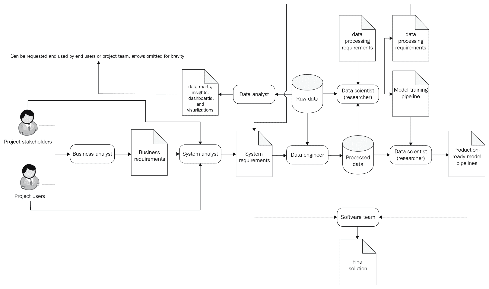
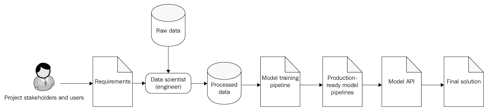

# 第四章：理想的数据科学团队

既然你正在阅读这本书，那么你很可能已经理解团队合作的重要性。通过团队合作，你可以比单独完成任务更高效地完成复杂的项目。当然，一个人也能独自建造房屋，但与他人合作，他们会更快地完成房屋，且结果会更好。

当你与团队合作时，每个人都可以专注于执行几种密切相关的工作类型。为了探索不同的专业领域，我们来看一个建造房屋的例子。建造屋顶需要一套技能，而安装电力则完全不同。作为管理者，你需要对所有专业领域有一个基本的了解，以便理解完成任务所需的所有组件。在*什么是数据科学？*这一部分，你已了解数据科学的核心概念。接下来，我们将利用这些知识来推导数据科学团队中的角色和专业领域。本章我们将定义、探索并理解不同团队角色以及每个角色的关键技能和责任。我们还将通过两个案例研究来进行说明。

本章我们将涵盖以下主题：

+   定义数据科学团队角色

+   探索数据科学团队角色及其职责

# 定义数据科学团队角色

数据科学团队需要交付复杂的项目，其中系统分析、软件工程、数据工程和数据科学的结合用于实现最终解决方案。在这一部分，我们将探索数据科学项目的主要角色。项目角色描绘了一组相关的活动，可以由专家执行。角色与专家并非严格的一对一对应关系，因为许多专家具备处理多个角色的能力。

一个普通的数据科学团队将包括业务分析师、系统分析师、数据科学家、数据工程师和数据科学团队经理。更复杂的项目可能还需要软件架构师以及后端/前端开发团队的参与。

下面是每个团队角色的核心职责：

+   **项目利益相关者**：代表对项目感兴趣的人，换句话说，就是你的客户。他们为项目生成并优先排序高层次的需求和目标。

+   **项目用户**：使用你所构建解决方案的人。应该让他们参与需求规格的制定过程，从而提供系统可用性的实际视角。

让我们来看一下分析团队的核心职责：

+   **业务分析师**：团队中的主要业务专家。他们帮助塑造业务需求，并帮助数据科学家理解问题领域的细节。他们以**业务需求文档**（**BRD**）或用户故事的形式定义业务需求，并可能在敏捷团队中担任产品负责人。

+   **系统分析师**：他们定义、塑造并维护软件和集成需求。他们创建**软件需求文档**（**SRD**）。在简单的项目或**概念验证**（**PoC**）中，这一角色可以由其他团队成员来担任。

+   **数据分析师**：数据科学项目中的分析通常需要构建复杂的数据库查询并进行数据可视化。数据分析师通过创建数据集市和交互式仪表盘来支持其他团队成员，并从数据中提取洞见。

让我们来看一下数据团队的核心职责：

+   **数据科学家**：他们创建模型，进行统计分析，并处理与数据科学相关的其他任务。对于大多数项目，选择并应用现有的算法就足够了。一位专注于将现有算法应用于解决实际问题的专家被称为**机器学习**或**深度学习工程师**。然而，某些项目可能需要进行研究并创建新的最先进模型。对于这些任务，机器学习或深度学习研究员会是更合适的人选。对于计算机科学背景的读者，我们可以将机器学习工程师和研究科学家之间的区别，粗略地描述为软件工程师和计算机科学家之间的区别。

+   **数据工程师**：他们负责所有数据准备和数据处理。在简单的项目中，具有数据工程技能的数据科学家可以担任这一角色。然而，在有较为复杂的数据处理需求的项目中，不要低估数据工程师的重要性。大数据技术栈非常复杂，在大规模部署和使用时需要专业的技术人员，而没有人比数据工程师更适合处理这项任务。

+   **数据科学团队经理**：他们协调数据团队的所有任务，规划活动并控制截止日期。

让我们来看看软件团队的核心职责：

+   **软件团队**应负责构建移动、Web 和桌面应用程序的所有额外需求。根据项目的复杂程度，软件开发可以由一个开发人员、一支团队，甚至多个团队来完成。

+   在包含多个系统的大型项目中，你可能需要**软件架构师**的帮助。

现在我们来看看角色如何协作以构建最终解决方案的一般流程：

让我们来看一下每个步骤的流程和交付成果：

1.  **业务分析师**根据查询项目相关方和用户来记录业务需求。

1.  **系统分析师**根据业务需求并查询项目相关方和用户来记录系统（技术）需求。

1.  **数据分析师**通过创建所请求的数据集市和仪表盘来支持团队。这些可以在开发过程中以及生产环境中供团队的每个人使用。如果数据分析师使用商业智能工具，他们可以直接为最终用户构建仪表盘。

1.  **数据科学家（研究员）**使用文档化的需求和原始数据来构建模型训练管道，并记录应该用于准备训练、验证和测试数据集的数据处理要求。

1.  **数据工程师**基于*步骤 3*中制作的原型构建生产级数据管道。

1.  **数据科学家（工程师）**使用处理过的数据来构建用于训练和预测管道的生产级模型以及所有必要的集成，包括模型 API。

1.  **软件团队**使用完整的模型训练和预测管道来构建最终解决方案。

请注意，依据项目的复杂性，这一过程可以简化或更加细化。例如，大型项目可能需要将分析专家分为两组：数据分析和软件分析。然后，软件团队会有单独的需求文档。较简单的项目可能会将一些步骤或角色合并，或者省略它们。

在接下来的部分，我们将探讨如何根据项目复杂度来组建团队并为专家分配项目角色。

# 探讨数据科学团队的角色及其职责

要完成一个数据科学项目，你将需要一位数据科学家。那么，单一专家能否主导一个项目呢？为了回答这个问题，我们可以将数据科学项目拆解为各个阶段和任务，这些阶段和任务在所有项目中或多或少都会出现。

在开始项目之前，你需要一个想法，使你的客户能够实现他们的目标并简化他们的生活。在商业中，你将着眼于提升公司内的关键业务流程。有时，想法已经确定，你可以直接进入实施阶段，但更多时候，你的团队将是这个过程的推动者。因此，我们理想中的专家必须能够提出一个能为客户带来价值的数据科学项目的想法。

接下来，我们将研究两个项目示例，看看如何通过小团队甚至一个跨职能专家来处理简单项目，而更大规模的项目则需要更具多样性的团队，每个团队成员负责一到两个特定的角色。

# 案例研究 1 – 将机器学习应用于银行防止欺诈

为了探讨数据科学项目可能的样子，我们将看一个案例研究。玛丽在一家银行担任数据科学家，银行的欺诈分析部门开始对**机器学习**（**ML**）产生兴趣。她在创建机器学习模型并通过构建 API 将其集成到现有系统中有着丰富经验。玛丽也有将工作成果展示给客户的经验。

这个部门的主要活动之一是检测和防止信用卡欺诈。他们通过使用基于规则的欺诈检测系统来实现这一目标。该系统监控银行中发生的所有信用卡交易，并检查是否有任何一系列交易应被视为欺诈行为。每一个检查都是硬编码并预先设定的。他们听说机器学习相较于传统的基于规则的欺诈检测系统有着更多的优势。所以，他们要求 Mary 实现一个欺诈检测模型，作为现有系统的插件。Mary 已询问现有欺诈检测系统的数据集和操作员，并且部门确认将提供来自系统本身的所有必要数据。他们所需要的只是一个可工作的模型和简单的软件集成。员工们已经熟悉常见的分类指标，因此他们被建议使用 F1 分数和 k 折交叉验证。

在这个项目设置中，项目相关方已经完成了业务分析阶段。他们有了想法和成功标准。Mary 可以从单一系统中轻松获取数据源，并且相关方可以将任务定义为分类问题。他们还定义了一个清晰的测试结果的方法。软件集成要求也很简单。因此，项目的角色流程简化为几个步骤，所有步骤都由单一的数据科学家角色执行：

结果是，Mary 列出了以下完成任务的步骤：

1.  创建一个机器学习模型。

1.  进行测试。

1.  创建一个模型训练管道。

1.  创建一个简单的集成 API。

1.  记录并将结果传达给客户。

这个项目看起来简单且定义明确。根据这个描述，我们可以相信 Mary 可以独立完成这项工作，几乎不需要监督。

# 案例研究 2——在零售公司中为机器学习找到应用场景

现在，让我们看一下另一个案例。我们朋友 Jonathan 所在的零售公司要求他提出如何利用数据科学和分析来改善他们的业务。Jonathan 在零售行业工作多年，因此他非常了解业务方面的内容。他还读过一些书籍并参加过几次数据科学的活动，因此他理解数据科学的实际能力。凭借对商业和数据科学的双重了解，Jonathan 能够看到数据科学如何改变他的工作环境。在列出一系列想法后，他将从业务角度评估这些想法。复杂度最低且价值最高的项目将成为实施候选项。

这家零售公司在全国拥有超过 10,000 家店铺，确保所有店铺的服务质量已变得越来越困难。每家店铺都有固定的全职员工。然而，每家店铺的访客数量不同，这个数字取决于店铺的地理位置、节假日以及可能的许多未知因素。因此，一些店铺人满为患，而一些店铺的访客量很低。Jonathan 的想法是改变员工的聘用策略，以提高客户满意度并平衡员工的工作负担。

他建议不聘请固定的店铺团队，而是让团队具有弹性。他希望创建一个特殊的移动应用，使得店铺能够迅速调整员工名单。在这个应用中，店长可以为员工创建任务，任务时间可以从一小时到一年不等。一组员工可以看到附近店铺的所有空缺岗位。如果某个具备必要技能的员工看到感兴趣的任务，他们可以接受并前往店铺。一个算法将为店长准备任务建议，店长会将工作项分配给员工池。这个算法会使用多个机器学习模型来推荐任务。一个模型将预测每个店铺的预期客户需求。第二个模型是计算机视觉算法，它将衡量店铺内的排队长度。通过这种方式，每个店铺将使用适量的员工，并根据需求水平进行调整。通过这个新应用，店铺员工将能够规划假期并请求临时替代人员。计算表明，这个模型将为 50,000 名员工提供服务，每位员工每周平均工作 40 小时，同时为 10,000 名兼职员工提供服务，每位兼职员工每周平均工作 15 小时。管理层认为这个模型在经济上更具可行性，并同意在一家店铺进行系统测试。如果测试成功，他们将继续推广新政策。

下一步他们要求 Jonathan 提出一个实施计划。他现在需要将项目分解为一系列任务，以便在一家店铺部署系统。Jonathan 准备了以下分解方案：

1.  收集并记录移动应用、预测模型和计算机视觉模型的初步需求。

1.  收集并记录系统的非功能性需求和服务水平协议（SLA）。

1.  决定开发、测试和生产所需的硬件资源。

1.  寻找具有训练数据的数据源。

1.  创建用于从源系统导出数据的数据适配器。

1.  创建软件系统架构。选择技术栈。

1.  创建开发、测试和生产环境。

1.  开发一个预测模型（完整的机器学习项目生命周期）。

1.  开发一个线长识别模型（完整的机器学习项目生命周期）。

1.  开发一个移动应用。

1.  将移动应用与模型进行集成。

1.  将系统部署到测试环境并执行端到端的系统测试。

1.  将系统部署到生产环境。

1.  在一店铺启动系统测试。

这个计划中的每一个点都可以进一步分解成 10-20 个附加任务。这个项目的完整任务分解可能轻松包含 200 个点，但我们将在这个层面停止，因为这足以用于讨论。

事实上，计划会不断变化，因此 Jonathan 决定使用一个软件开发项目管理框架，比如 SCRUM，来管理截止日期、需求变更和利益相关者的期望。

现在让我们看看 Jonathan 需要在哪些领域具备专业知识才能完成这个项目。他需要在以下几个领域熟练：

+   零售业务

+   软件项目管理

+   需求收集

+   软件与硬件架构

+   数据工程

+   数据科学

+   机器学习

+   深度学习与计算机视觉

+   移动应用开发

+   后端软件开发

+   软件集成

+   软件测试

+   开发运维

Jonathan 是否具备完成工作软件系统所需的所有技能？我们可以确定有一些人能够做到这一点，但更有可能遇到的是在多个密切相关的领域拥有专长的专家。特别是，数据工程师很可能擅长数据库、数据库管理和软件集成。许多数据科学家也擅长后端软件开发。有些人精通创建数据可视化仪表板。在项目的角色流动方面，可以使用完整的图表来指导此项目。

在一个平均的数据科学项目中，预计会填充以下团队角色：

+   数据科学家

    +   机器学习或深度学习工程师

    +   机器学习或深度学习研究员

+   数据工程师

+   数据分析师

+   系统分析师

+   商业分析师

+   后端软件开发工程师

+   前端软件开发工程师

+   技术团队领导

+   项目经理

根据项目的复杂性，你可以将一些角色合并。项目规模越大，团队的多样性和规模也会越大。接下来，我们将了解数据科学团队角色的关键技能和责任。

# 数据科学家的关键技能

数据科学家是一个相对较新的职业，对其职责的模糊定义很常见。这种不确定性会导致许多问题。招聘网站上泛泛的职位描述对优秀候选人没有吸引力。如果你不先在心中明确这个定义，求职者就无法了解该职位所需的要求。如果某人去一个工作岗位时不知道对他们有什么期望，情况会变得更糟。没有清晰的目标，或者至少没有明确的下一个里程碑定义，你的团队就会迷失方向。为团队角色定义清晰的责任是让团队能够高效运作的基础。

一个理想的数据科学家通常被描述为以下三者的结合：

+   **领域专业知识**：这包括数据科学家所在工作环境的知识，如医疗、零售、保险或金融等。

+   **软件工程**：即使是最先进的模型，如果只能呈现纯数学抽象，也无法带来改变。数据科学家需要知道如何将他们的想法转化为可用的形式。

+   **数据科学**：数据科学家需要精通数学、统计学以及至少一项或多项数据科学的关键领域，如机器学习、深度学习或时间序列分析。

理解每个专业领域在这个列表中的存在是非常重要的。我们将从领域专业知识开始。你很难找到一个世界级的商业专家，同时还能训练最先进的深度学习模型。幸运的是，你不需要寻找“独角兽”。数据科学家需要领域专业知识，主要是为了理解数据。在处理需求和利益相关者的期望时，它也很有用。对保险业务有基本到中等程度的理解，可以在构建模型的整个过程中帮助数据科学家。

例如，我们来看一下商业专业知识如何帮助为保险公司构建模型：

+   与保险专家使用相同的语言交流有助于发现他们的痛点和需求，这样数据科学家可以调整他们的目标，以实现更好的结果。

+   保险专业知识将帮助探索和理解公司数据库中的原始数据。

+   保险专业知识有助于数据预处理。它帮助数据科学家为机器学习模型构建数据集。

因此，领域专业知识不是数据科学家的首要技能，但基本到中等水平的理解可以大幅提升结果。

下一个组成部分是软件工程专业知识，这常常被忽视。算法通常与组织的最关键流程相联系，因此这些算法的可用性和稳定性要求很高。数据科学家从不创建抽象模型。即便在研究机构，数据科学家也会写代码。而且，离实际应用越近，好的代码就越重要。良好的编程技能使数据科学家能够编写结构良好、文档齐全且可复用的代码，其他团队成员也能理解。软件工程专业知识使他们能够构建在高负载下不易失败的系统，并能够从简单的概念验证测试扩展到全组织范围的部署。

最后，但同样重要的是数据科学技能。它们是构建有效模型所必需的关键工具。然而，数据科学是一个非常广泛的领域。一定要了解你需要使用哪些算法，并明白你需要什么样的专家。计算机视觉专家并不一定适合电影推荐项目。如果你雇佣了一位数据科学家，这并不意味着他们在机器学习和数学统计的所有领域都非常精通。

# 发现面试过程的目的

首先，你应该弄清楚为什么需要进行面试。让我们做一个快速的练习。问问自己为什么，然后写下答案，直到没有更多可以说的。之后，回忆一下你上一次进行的面试。它与你的目标是否一致？结果应该为你提供一个即时的改进方向。

从雇主的角度来看，面试的唯一目的是找到一位合格的候选人来填补职位。从员工的角度来看，面试的目的是找到一个好的团队、一个有趣的项目、一家可靠的公司来合作，以及令人满意的薪酬。我们常常忘记，面试是一个对话，而不仅仅是对技能的考验。

不幸的是，面试的主要目标没有一个明确且普遍的定义。这是因为每个目标对每个职位来说都是独一无二的。你应该根据对你面试的职位的详细理解来定义这个目标。如果你在寻找一位数据科学家，那么要严格定义你希望他们做什么。新团队成员将解决哪些任务？仔细思考一下这个职位的第一天工作将是什么样的。核心职责是什么？哪些技能是有用的但不是强制性的？基于这些，你可以开始为候选人草拟一套期望的技能要求。要具体。如果你要求候选人了解 SQL，一定要有明确的理由来支持这一要求。

如果你的面试目标是找到一位理想的、全球顶尖 0.1 百分位的世界级专家，那么再想一想。主要目标是找到一个能够胜任工作的人。这个人可能必须是世界上最优秀的专家。如果是这样，这个要求应该加以解释和证明。为了达成这一理解，你需要描述这份工作将是什么样的。在你决定描述完成之后，重新编写它，考虑到候选人。它应该简短、易读，并完整地展示这份工作的内容以及期望是什么。职位描述的模糊性通常源于缺乏这种理解。*我们只是需要一个人*，他们的职位描述是这样写的。你的职位描述应该写成*我们确切知道我们需要什么，你可以依赖我们*。如果你做不到这一点，难道你真的需要发布一个新的职位吗？

对你的目标的具体理解将在多个方面有所帮助：

+   你将了解应该寻找什么样的专家。

+   寻找职位候选人的人会清楚地知道你对他们的期望。这将使判断他们的经验是否相关变得更容易。

+   清晰的目标定义将帮助你设计有针对性和富有洞察力的面试问题。

如果你的需求列表看起来过长，尝试简化它。也许你过于热衷，列出的某些技能并不是必需的。或者，你可以考虑招聘两位具有不同背景的人？如果你发布的职位描述包含广泛的跨职能要求，一定要有背后的理由。

如果你的职位描述很复杂，那么你会发现以下几点：

+   招聘候选人的时间将更长，因为你要求更多的技能和经验。

+   候选人会期待更高的薪资。

+   面试过程可能会很长，并且可能会延续到多个回合。

+   你可以选择的候选人将会更少。

所有这些限制条件应该有充分的支持理由。如果没有，考虑简化。

拥有一个好的目标并不意味着一切，还需要良好的执行。我们现在将从候选人的角度来讨论面试过程中的偏见和同理心问题。

# 数据工程师的关键技能

随着项目变得更加复杂，数据管理变得更加困难。你的系统可能会从多个来源消耗数据，其中一些是实时数据流，而另一些可能是静态数据库。系统需要处理的大量数据也可能非常庞大。这一切导致了创建一个数据处理子系统，用于管理和协调所有数据流。管理大量数据并创建能够快速处理大数据量的系统，需要使用专门的、适合此任务的软件技术栈。

因此，数据工程师这一独立角色应运而生。数据工程师的关键知识领域如下：

+   **软件工程**

+   **大数据工程**：包括分布式数据处理框架、数据流技术和各种编排框架。数据工程师还需要熟悉与数据处理相关的主要软件架构模式。

+   **数据库管理与数据仓储**：关系型数据库、NoSQL 数据库和内存数据库。

软件工程技能对数据工程师非常重要。数据转换代码往往存在设计不当的问题。遵循软件设计的最佳实践将确保所有数据处理任务都是模块化的、可重用的，并且易于阅读。

处理大数据涉及创建高度并行的代码，因此了解分布式处理系统也是必不可少的。主要的软件平台，如 Hadoop 生态系统、Apache Spark 和 Apache Kafka，都需要深入理解其内部机制，以编写高效且稳定的代码。

理解经典的关系型数据库系统和数据仓库方法论对数据工程师来说也是一项重要的技能。关系型数据库在大公司中是非常常见的数据存储选择。SQL 的普及程度让我们可以把它视为数据的*通用语言*。因此，你可以预期**关系型数据库管理系统**（**RDBMS**）将会是你项目中的常见数据来源。关系型数据库非常擅长存储和查询结构化数据，因此如果数据量适中，你的项目很可能也会使用它们。掌握流行的 NoSQL 数据库经验也是一种便利。

# 数据科学经理的关键技能

本节将介绍数据科学经理需要具备的几个关键技能，具体包括：

+   **管理**：数据科学团队经理应该具备对主要软件管理方法论的良好理解，如 SCRUM 和 Kanban。他们还应了解管理数据科学项目的各种方法和具体策略。

+   **领域专长**：他们应该对业务领域有很好的了解。如果缺乏这一点，任务分解和优先级排序就变得不可能，项目也必然会偏离轨道。

+   **数据科学**：对数据科学和机器学习背后基本概念的良好理解至关重要。没有这些理解，你就像是在不知道房子是什么的情况下建造房子。这将有助于简化沟通，并帮助创建良好的任务分解和故事情节。

+   **软件工程**：基础软件工程知识将确保经理能够关注项目中的关键方面，如软件架构和技术债务。优秀的软件项目经理有开发经验。这些经验教会他们编写自动化测试、重构和构建良好的架构。不幸的是，许多数据科学项目因为糟糕的软件设计选择而受到影响。走捷径在短期内看似可行，但从长远来看，这些选择最终会反噬项目。随着项目的规模逐渐扩大，团队增加，整合数量增加，新的需求出现，糟糕的软件设计会让项目停滞不前，最后只剩下一个选择——彻底重写系统。

# 向开发团队寻求帮助

创建数据产品与创建新软件系统密切相关。大规模项目可能会有很多软件需求，包括构建 UI、开发者 API 和在系统中创建基于角色的工作流。如果你感觉数据科学团队无法独立完成所有任务，一定要向软件开发团队寻求帮助，团队中需要有软件工程师、分析师和架构师。如果你除了构建机器学习模型外，只需要构建几个 REST 服务、数据集成任务和一个简单的管理 UI，那么数据科学团队应该能胜任。但如果你需要处理比这更复杂的任务，请确保扩展你的团队。

# 概述

在本章中，我们首先介绍了数据科学家的定义。然后，我们通过两个示例来探讨数据科学家是否可以单独工作，或者是否需要团队合作。接下来，我们研究了数据科学家、数据工程师和数据科学经理需要具备的各种技能和素质。我们还简要地探讨了在什么情况下需要向开发团队寻求帮助。

最后，我们定义了数据科学团队的关键领域，包括分析、数据和软件。在这些领域中，我们定义了项目角色，帮助你组建一个平衡且强大的团队。我们可以通过小型团队解决简单的项目，团队成员共享不同角色的责任。但当项目复杂性增加时，组织结构也需要随之扩展。我们还强调了遵循软件工程最佳实践的重要性，并寻求软件开发团队的帮助。

认识到明确责任和期望对于交付复杂的数据科学项目至关重要，我们将在下一章中使用这些理念，探讨如何为数据科学团队制定有效的招聘流程。
