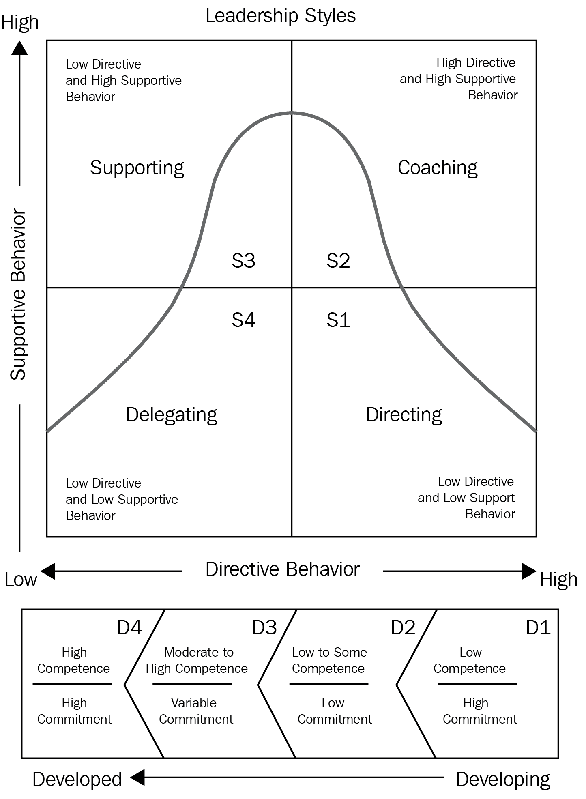

# 第六章：构建你的数据科学团队

本章中，我们将了解构建成功团队的三个关键方面，并解释领导者在数据科学团队中的角色。我们将学习如何构建并维持一个能够提供端到端解决方案的平衡团队。接着，我们将制定一个计划，通过改善并增加一些有用的管理技能来扩展我们的技能库：以身作则的领导力、积极倾听、同理心与情商、信任与授权。我们还将考虑倡导成长型思维模式如何成为团队发展过程中的重要部分。

本章将涵盖以下主题：

+   实现团队禅意

+   领导力与人员管理

+   促进成长型思维模式

# 实现团队禅意

一个平衡的团队能够高效、轻松地解决所有来临的任务。每个团队成员互相补充，利用各自的独特能力帮助他人找到解决方案。然而，平衡的团队并不会在一个技能高超的领导者组建精英小队时神奇地自然而然地形成。找到团队的“禅意”不是一时的成就；你需要付出努力才能找到它。看起来某些团队表现出色，而其他团队则令人失望。但关键是要意识到，团队表现并非恒定不变的。最优秀的团队也可能变得最糟，反之亦然。每个团队都应该努力改进。有些团队可能需要的工作较少，而另一些团队则更难改变，但没有团队是没有希望的。

那么，平衡的团队是什么样的呢？每个团队成员在软硬技能上都有独特之处。有些人是全能型的多面手，而其他人则在某一领域具有高度专业化的专长。此外，我们每个人在情感上也有很大的差异。在平衡的团队中，每个人都能够互补和增强对方的能力。每个团队成员都知道在何时参与能产生最佳的结果。平衡的团队是自组织的，它们能够高效地进行规划和行动，而无需团队领导的直接干预。领导者将团队凝聚在一起，使团队更加有序，但平衡团队的实际工作过程显得高度去中心化。领导者经常参与团队工作，并帮助大家达成共同目标。团队成员之间有着良好的关系，大家都希望不断提升自己，迈向新的高度。平衡团队的另一个特点是，它们没有单点故障。如果有人生病或决定离开，团队核心的运作也不会受到太大影响。

不平衡的团队初看可能难以区分。不平衡的团队可以正常运作，甚至是顶尖表现者，但它们虽然高效，却很脆弱。人们在不平衡的团队中难以长久待下去，因为那样很困难。不平衡的团队有多种形式，因此很难界定。以下是两个不平衡团队的例子：

+   在第一种情况下，团队负责人是团队中最优秀的专家。他们做大部分重要工作，而其他团队成员则负责最简单的委派任务。团队负责人将任务分解成许多简单的子任务并分配给团队成员。除了他们自己，没有人能看到全貌。不愿意分享重要的工作部分，也不愿意让团队参与任务分解过程，这种做法造成了强烈的失衡。这个团队非常脆弱，没有团队负责人，团队将无法正常运作。团队中的员工很快就会感到倦怠，因为他们看不到自己工作的成果。大部分任务枯燥重复，因此他们会寻求其他团队、项目或公司的挑战。这是团队中专业失衡的一个例子。

+   在第二种情况下，团队正在构建一个非常庞大的项目。开发工作已经持续了 3 年。团队负责人和几位从一开始就参与项目的数据科学家建立了深厚的关系和团队文化。然而，并非所有团队成员都在这 3 年里一直留在团队中，因此，团队负责人找了几位新专家，他们急切希望接手这个项目。然而，这些新成员发现自己很难融入团队。**核心团队**与**新团队**的沟通是勉强的。由于文化差异，他们发现沟通非常困难。与熟悉的人互动比与**新团队**互动要容易得多。因此，文化失衡出现了。

一旦团队中出现了失衡现象，要想去解决非常困难。一旦失衡的根基扎下，每个具体情况都需要仔细审视，并制定计划将团队带回更平衡的状态。应对失衡的最佳方法是从一开始就避免它。

就像在招聘人员以建立平衡的团队时一样，你应该着眼于目标。没有目标，就没有行动的理由，没有平衡，也没有失衡。例如，你的目标可能是*在短时间内利用数据科学交付问题解决方案*。从这个目标出发，团队的主要特点将逐渐显现。为了成功地应用数据科学，你需要该领域的专家。为了实现短时间交付，你还需要良好的内部流程，确保每个人都能顺畅可靠地工作。团队需要随着时间的推移不断改进，并且需要成长和持续发展；这就是平衡的需求。

明确陈述你的目标，并确保所有团队成员理解这些目标，以便每个人都能对成功的定义达成一致。如果没有度量标准和损失函数，就无法训练机器学习算法。没有反馈，人类也会停止发展。当没有好坏之分时，我们会停滞不前，而目标帮助我们定义这些对比。

每个团队的另一个重要组成部分是其角色。角色定义了团队成员可以执行的一组活动。你可能认为你不需要角色，因为你的团队是敏捷和跨职能的，因此每个人都可以并且应该能够做所有的事情。这对小型团队在生存并擅长其工作时可能至关重要。但跨职能并不意味着没有明确的角色。事实上，跨职能和团队规模是团队的不同维度，后者通过每个团队成员执行的角色数量影响前者。

例如，我们的数据科学团队应该负责从业务需求定义到最终解决方案交付的所有工作。我们已经大致定义了项目交付过程，并将每个阶段分配给了一个角色：

+   **定义业务需求**：业务分析师

+   **定义功能需求**：系统分析师

+   **定义非功能需求**：系统分析师

+   **发现并记录输入数据源，创建数据集市和报告**：数据分析师

+   **探索性数据分析与建模**：数据科学家

+   **围绕模型构建软件**：软件工程师

+   **创建最终产品的文档**：软件工程师和系统分析师

+   **交付与部署**：DevOps 工程师和软件工程师

+   **管理和团队领导**：团队领导

假设这个团队只有三名成员，包括团队领导。我们可以将多个角色合并为一个，以满足团队规模的限制，同时为每个团队成员制定目标。回想一下，为每个职位设定目标是一个良好招聘流程的基础，创建团队目标、定义角色并将其映射到职位上是这个过程的前提。

对于我们的例子，有很多选择，但最现实的情况是以下几种：

+   **定义业务、功能和非功能需求**：分析师

+   **交付软件和模型**：机器学习工程师

+   **项目管理、团队领导和最终及中期结果的接受**：团队领导

创建与团队目标一致的个人目标可以通过以下一系列转化来完成：

团队目标 → 团队角色 → 职位 → 个人目标

团队的角色越多，团队规模越小，成员之间的边界就越模糊，找到合适的队友来填补这些角色就越难。定义角色可以帮助你更现实地看待所需的工作量和创建一个优秀团队所需的预算，因此千万不要省略这一步。如果你的团队较大，每个员工的职责被明确区分，或者如果你的团队较小，职责较少分离，将角色映射到职位上同样非常有帮助。

通过遵循这一过程，你可以创建一个反馈系统，不仅能够优化全球团队目标，还能优化个人目标，帮助每个人理解自己在大局中的角色。当设计深度神经网络时，你需要创建一个损失函数并确保梯度通过每一层。在建立团队时，你需要确保反馈通过团队的每个部分，从你自己开始。

了解角色、目标和规模的约束也将有助于你发展和壮大团队。随着时间的推移，团队会壮大，但如果你保持核心目标-角色-位置框架，随着团队的发展，添加新的责任和团队成员将变得非常简单，你将把位置分配给更少的角色。目标-位置-角色的维护和修订也是必要的，以保持团队的平衡。组织结构或团队主要目标的变化总是带来创造不平衡的风险，所以在引入变动时要小心，并提前规划。

团队平衡和反馈系统的概念是简单但强大的工具，能帮助你建立一个平衡的团队，并以正确的方式扩大团队规模。

# 领导力与人员管理

在*实现团队禅*部分，我们得出结论：团队领导者不应处于团队的核心位置，因为这种情况会导致严重的组织不平衡。然而，团队领导者应该在任何地方又不在任何地方。团队领导者应促进团队的运作，帮助每个团队成员参与到过程中，并在问题成为真正的障碍之前，减轻任何可能威胁到团队运作的风险。一位优秀的团队领导者可以替代并提供对团队中所有或大部分角色的支持。他们应该对团队核心角色有深刻的了解，以便在尽可能多的团队活动中提供帮助。

团队领导者应确保信息能够在团队中毫不费力地传播，并确保所有的沟通都在必要时进行。如果我们用互联网作为类比，团队领导者应该为所有服务器提供一个快速且可靠的通信网络。

团队领导者的另一个重要任务是不断并平衡地扩展团队。所有团队成员应拥有足够的动力，面临挑战，并清楚了解自己如何根据个人目标成长。

最重要的是，团队领导者应该设定目标，并与团队一起实现这些目标。团队领导者应将每个人的努力统一到一个焦点上，并确保这个焦点是正确的。

那么，如何让每个人都专注于他们的努力呢？如果你问我领导力中最重要的一个方面是什么，我会说是以身作则。现代社会对于成功领导者的定义，在现实中往往难以实现。许多人认为所有的领导者都是高超的沟通者和谈判者，能够通过言语的力量说服任何人做任何事情。当然，沟通技巧很重要，但不是那种操控性技巧。熟练的操控者在某些情况下可能会占些优势，但每个行为都有后果——操控从长远来看总是具有破坏性的。

# 以身作则

最简单和最有效的领导建议很可能是在你童年时就有人给你讲过：如果你想和别人建立良好的关系，先迈出第一步。想让别人信任你吗？通过信任他人逐步建立信任。想让你的团队有动力吗？参与工作流程，给予每个人帮助；展示他们的进步。管理学文献称这一原则为以身作则。言出必行，每个人都会跟随你的榜样。

这种领导方式对于团队建设非常有效：

+   它不需要你学习和应用复杂的理论方法

+   它建立了团队中的关系和信任

+   它确保团队领导者参与到团队中每个角色的工作流程中

+   它帮助每个人，包括你自己，在职业上成长

以身作则的领导方式唯一的缺点是它可能很困难。这要求你在情感和智力上都深度参与到你的团队中——这可能会让人感到疲惫不堪。避免疲劳是非常重要的，因为你的团队会立刻察觉到这一点。如果你精疲力竭，那么你的团队也会如此。幸运的是，有一种简单的方法可以避免领导者的倦怠。在你的工作日中确保有时间让自己从团队领导的活动中得到休息。也许是一个可以帮助团队成员的小研究项目，或者是一个你可以独立处理的原型。

另一个警告是，以身作则的领导方式可能很难放手。许多有志成为团队领导的人往往承担了过多的工作。领导者通常是团队中最有经验的专业人士，分配工作可能在情感上很困难，尤其是当你知道自己可以完成这些工作时。没有任务分配，团队无法正常运作，因此这样的团队很容易瓦解。当团队领导者无法有效分配任务时，团队中的不平衡就会出现，且这种不平衡会不断加剧。

# 运用情境领导

幸运的是，在大多数情况下，关于任务委派的问题大多是情感上的。为了无所畏惧地委派任务，你应该建立信任。而要建立信任，你需要迈出第一步。如果你觉得自己很难委派任务，就强迫自己尝试一下。可能这看起来像是一次信任飞跃，但跳一跳，看看你的团队能做到什么。一开始，你可能会害怕，但我向你保证，他们会给你惊喜。委派的关键部分是任务描述步骤。如果你无法正确、简洁地描述需要完成的工作，委派将会失败。为了有效地委派任务，你可以运用情境领导。其核心概念非常简单：你必须衡量团队成员的能力和承诺水平。然后，你需要根据这些水平选择适合的领导风格。

以下图表展示了一个简单而实用的工具，用于选择任务委派的领导风格：

上述图表通过两个变量来衡量员工的准备情况：承诺和能力水平。承诺代表员工的动机水平。承诺高的人认为工作有趣，并愿意努力直到任务完成。而承诺低则意味着这个人对完成任务不感兴趣，觉得任务乏味或重复，或者快要感到精疲力尽。另一面是能力，表示员工独立完成任务的能力。低能力意味着该人在相关任务方面没有或缺乏经验。而高能力则意味着员工拥有完成任务所需的所有知识和经验。情境领导帮助你保持团队成员的动力水平稳定，同时确保他们获得所有必要的指导，从而使他们的能力在不影响任务质量的情况下得以提高。

以下示例展示了如何通过确定员工的能力和承诺水平，来应用情境领导技巧，从而委派任务：

1.  想象一下，你有一个新团队成员，Jane。她经验不多，正在担任你团队中的初级职位。她的动力很高，渴望学习新事物。在这种情况下，承诺水平很高，能力水平很低，因此我们必须采取指导式领导风格。显然，她无法独立解决复杂的任务。最好是选择一些简单的任务，将任务拆分成尽可能多的子任务，详细描述每一个步骤，并检查每一步的正确性。来自这一类别的员工将占用你大量的时间，因此要注意自己的资源。一支由 10 个高承诺低能力的团队成员组成的团队，很容易消耗掉你所有的时间。

1.  随着时间的推移，简已经掌握了一些技能，但最近她的动机开始下滑。现在是进行辅导的最佳时机。在这个阶段，你需要适当放宽控制，允许团队成员做出承诺。

1.  简的能力水平进一步提升，相比团队中的其他成员，你可以明显看出她的技术能力已经处于中等到高水平之间。注意这个转变非常重要，因为简的动机可能再次受到影响。为了保持这一状态，你需要调整你的领导风格，变得更加支持，并减少对特定任务的关注。你还需要与她共享决策任务。此时简的表现可能会有所波动，因此要提供她所需要的支持，帮助她顺利过渡到最后阶段。

1.  在这个阶段，简已经成为一名资深专家。她技能高超，能够做出良好的决策，并持续提供高质量的工作成果。这是可以委派任务的阶段。在这个阶段，你的主要目标是设定高层次的目标，监控进度，并参与高层决策。

# 以清晰的方式定义任务

情境领导模型很有用，但它并未告诉你如何描述任务，以便让团队成员与你的愿景保持一致。首先，你需要意识到你的任务描述不应对所有团队成员都相同。你的描述会根据成员的能力和动机水平有所不同。在指导阶段，任务描述可以类似于一个低层次、详细的**待办事项** **清单**，而在委派阶段，任务描述可能仅由两句话组成。然而，无论处于哪个阶段，你的任务描述应该是清晰、有限时性且现实的。SMART 标准有助于创建这样的描述。

SMART 标准指出，任何任务都应该符合以下要求：

+   **具体**：明确目标并针对具体领域

+   **可衡量**：有一些进展指标

+   **可分配**：指定一个或多个负责人来完成任务

+   **现实**：设定在给定的约束条件和可用资源下能够实现的结果

+   **与时间相关**：设定时间限制或截止日期

尝试记住这一点。SMART 标准是一个方便的清单，可以帮助你的团队更好地理解你。尽管如此，不管你的任务描述多么详细，都应该与负责人进行沟通。我们的语言往往很模糊，甚至我们自己的想法也常常不清晰。在编写任务描述后，去找同事确认：*你是怎么理解这个的？* *我们能否花 1-2 分钟讨论一下？* 如果你使用敏捷方法，也可以在每次迭代规划会议上讨论每项任务。这些对话是任务分配的关键部分。即使是细微的理解差异，也可能导致意想不到且完全错误的结果。

花几分钟讨论手头的任务将帮助您确保以下事项：

+   您对任务的理解及其目标是否正确和现实

+   您的任务描述足够详细

+   您和受让人在需要完成的事项上是同步的

+   受让人了解结果应该是什么样子的

+   截止日期是现实的

# 培养共鸣

像示范领导、情境领导和 SMART 标准这样的基本概念将帮助您作为团队领导者构建和衡量工作。然而，还有另一个关键组成部分，没有它，即使完美执行正式的领导职能，您的团队也可能会分崩离析。这个组成部分就是共情。拥有共情意味着理解自己的情绪，以及他人的情绪。我们的反应大多是不理性的，我们经常混淆自己的感受和情绪。例如，很容易把愤怒误认为恐惧；实际上我们只是害怕时可能会表现得愤怒。了解自己的情绪并学会识别他人的情绪将帮助您理解人们并看到他们行为背后的微妙和动机。共情帮助我们找到理解非理性行为背后逻辑的方法，以便我们可以适当地做出反应。面对侵略行为时，除非您能理解背后的动机，否则可能很容易用愤怒回应。如果能看到这些动机，最终愤怒行为可能看起来很愚蠢。共情是最终解决冲突的工具；它有助于建立团队的信任和一致性。它在谈判中也起着重要作用，我们稍后将谈论此事。

共情不是一种先天能力。当然，有些人天生比其他人更具共情力，但这并不意味着不能培养共情。这是一种技能，就像任何其他技能一样，如果您努力学习，它是可以掌握的。要增强您的共情力，从自己开始。一天中要注意自己的情绪。如果遇到复杂情况，思考自己的行动和情绪。尝试理解哪些响应是适当的，哪些不是，看看是什么引起了它们以及在那一刻您的感受。有时，您会发现自己的感受与行动之间存在不匹配。从中学习。随着时间的推移，您将越来越好地理解情绪。首先，学会了解自己，然后您将能够比以前更好地读懂他人的情绪。

帮助您建立共情并理解他人的另一个重要工具是积极倾听。我们每天都在倾听他人，但我们是否从他们的言语中提取了所有可用信息？实际上，我们留下了大部分信息。在倾听时，我们经常被自己的想法分散注意力。我们不注意说话者，急于开口。

你可能听过通过让他人说话可以获得更多的收获。想象一下自己处于一个冲突情境中。你心爱的队友连续三天未提前通知，下午三点才到办公室。当你问他们怎么了，他们会粗暴地要求你走开。你可能会立刻想要用同样激烈的方式回应。然而，在这种情况下，理解这种行为背后的原因要比直接反应更为有效。未知的因素可以澄清这些看似不合逻辑的行为，并以不同的角度展现你队友的处境。

单纯地盯着对方看并希望信息自然流入脑海是一种乐观的想法。如果对方不在谈话的状态下，这反而可能让情况变得更糟。为了避免这种情况，你应该主动倾听。主动倾听是一套技巧，能够帮助他人更开放地表达。

要主动倾听，请做以下几步：

+   **全神贯注地倾听讲话者**：当别人长时间说话时，我们经常会沉浸在自己的思维中。讲话者会立刻注意到你在走神，这会对他们与您分享信息的愿望产生负面影响。

+   **展示你在专心倾听**：通过*嗯嗯*的回应，表示*是的*，点头和微笑等方式给出反馈。对方不应感到自己在对着一堵水泥墙讲话。

+   **复述与镜像**：这时你会重复对方最后两到三个词。当你复述时，你用不同的词语重复或总结对方的上一句话；例如，*我听到你说你想要*……这开始时可能有点尴尬，但相信我，镜像法有效。这是主动倾听中最重要的工具，能够促进讲话者和听者之间的信息流动。学会了复述和镜像之后，我注意到优秀的演讲者常常在不自觉的情况下使用这些技巧。你完全没有理由不使用这个工具。

+   **永远不要评判**：公开地评判他人会激发他们的防御机制，打断信息的流动。

+   **表达情感以理解他人的感受**：同理心是一项难以掌握的技能，但你通常可以走捷径：表达对方的感受。*我觉得你很不高兴，是吗？* 如果你猜对了，对方会确认，如果你错了，你也会得到线索。

主动倾听在纸面上很简单，但在现实世界中可能有点棘手。像任何技能一样，你可以通过练习使其达到完美。在日常对话中遵循这个简单的建议，你会注意到效果。

# 促进成长型心态

我们将要讨论的团队建设的最后一个关键要素是成长型心态。如果你不希望你的团队解散，团队的持续成长是必要的。没有成长，就没有动力，没有新目标，也没有进步。我们可以将团队成长提炼成两个方面：团队整体的全球性成长和每个个体团队成员的局部成长。

# 提升团队整体专业能力

全球增长发生在你的团队克服挑战、发展项目并获得新机会时。全球团队的增长伴随着公司扩展而发生。但相反的情况并不成立：如果你的公司业务增长，并不意味着你的团队会自动变得更好并看到新的机会。团队一起学习经验是公式中的关键部分。恰巧的是，当公司不陷入停滞时，你会有更多的学习机会。每当有好事发生时，你和你的团队应该从中学习。当不好的事情发生时，也要从中学习。当发生重大事件时，确保信息通过团队传播并回到你那里。

一个很好的学习工具是进行回顾和内部聚会。回顾是项目团队会议，在会议中团队中的每个人回答三个简单的问题：

+   我们做对了什么？

+   我们做错了什么？

+   我们应该做些什么来改进？

回顾允许你和你的团队成员获得反馈并加以改进。它们也是一种有效的项目管理工具，可以提升团队的产出。在更大的范围内，团队中的每个人都应该有机会与他人分享经验，并不仅仅从他们的经理那里获取反馈，而是从团队中的其他人那里也能获得有用的反馈。

# 个人成长中的持续学习

虽然通过从日常经验中学习来实现全球团队增长是可以通过一个过程来完成的，但个人成长并不容易。我经常问自己一个重要问题：*如何激励人们去学习？* 仅仅依靠日常工作经验，在数据科学领域成长是极其困难的，这对于其他技术领域也是一样的。为了个人成长，以及作为团队的一部分，你的同事们必须学习。对于一些人来说，获取新知识是困难的，尤其是那些在毕业后就停止了主动学习的人。学习是一种习惯，每个人都可以培养获取新知识的渴望。成长心态的关键理念是，我们毕业后不应该停止扩展自己的知识。知识是无限的，如今，你想学习的任何东西都触手可及；你只需要付出一些努力。终身持续学习而不间断的能力是一种真正的财富，能够实现无限的自我发展。如果你仔细想想，几乎任何目标都能通过足够的知识和坚持不懈实现。

个人或本地增长的关键是持续学习。如果你想激励团队成员学习和成长，你必须为他们提供以下内容：

+   持续学习的概念是一个工具，它将帮助你的队友把学习变成一种习惯。

+   并不是每个人都有时间来学习，即使有，也不是每个人都愿意立刻用这些时间来学习。工作中的学习和研究活动可能是养成习惯的好方式。

+   个人学习计划将帮助每个人结构化和跟踪他们的目标。

+   项目、学习和绩效评审过程中的其他目标将帮助你在团队中进行反馈流动。

现在我们将逐一探讨每个要点，从持续学习开始。其背后的主要理念是，无论你是一天内读完一本书，还是浏览一条有价值的信息推文，所有学习都算数。你应该目标是每天学到一些新东西——即使只是少量。最终，你不仅会更接近学习某些东西的目标，还会培养出一系列的习惯，使你在不知不觉中不断获取更多的知识。过一段时间后，持续学习将成为你生活的一部分，培养你对新有用信息的自然渴望，就像一个优化你空闲时间的调度程序，能在后台为你挤出通勤和排长队时的空闲分钟，帮助你朝着真正对你有意义的目标前进。

持续学习的技巧是通过小批量学习来达成学习目标。如果你有心情，你可能会继续做更多的工作。如果没有，你依然学到了一些新东西并继续前进。

一开始，这可能是达成单一目标的一种方式。然后，在实现第一个成就后，你会意识到这种思维方式可以让你学到更多：将其应用到新的专业领域、技能或兴趣话题。几个月后，它将成为你生活的一部分，帮助你每天都在进步。

# 提供更多的学习机会

养成习惯并不是一个简单的过程。要真正坚持下去，一个习惯应该重复很多次。你应该尽可能多地为你的团队提供学习机会。如果你希望你的团队能自我成长并持续发展，请确保你具备以下条件：

+   学习计划模板

+   研究和教育的计划时间

+   付费课程和书籍的报酬选项

确保学习计划模板易于访问；将其放在公司 Wiki 或其他在线资源中。学习计划模板应包含你和你的团队认为对获取新技能有用的所有技能、书籍和在线课程。此页面应经常更新，链接到团队找到的新材料。将所有材料按类别分类。

特别地，针对数据科学的学习计划模板，你可以考虑以下类别：

+   数学：

    +   数学分析与优化

    +   线性代数

    +   数理统计

+   数据科学：

    +   机器学习

    +   深度学习

+   数据工程：

    +   关系数据库

    +   数据仓库

    +   大数据

    +   商业智能

+   软件工程：

    +   软件架构与模式

    +   代码质量

所有这些主题都应该包含书籍、在线课程以及博客文章的链接，并附上评论，说明为什么这些资料好以及它们最有用的部分是什么。如果能将每个主题进一步分为不同的等级就更好，比如初学者、中级和高级。这样，你和你的团队成员就能大致跟踪他们处于哪个能力水平。这个学习计划模板可以用于绩效评估，帮助制定和调整个人学习计划。我们将在本章稍后详细讨论这个话题。

在创建学习计划模板后，你可以与团队中的每个人交流，了解他们的职业目标。询问他们希望在哪些领域成长，并了解他们个人感兴趣的内容。请他们查看你的学习计划模板，并在每个主题中写下他们的大致能力水平，如果他们无法独立完成此任务，你可以帮助他们。有了这些信息，你将了解每个团队成员目前的状况以及他们的目标。接着，你可以为他们制定个人学习计划。我发现简单的任务跟踪系统，如 Trello，是跟踪学习目标的好工具——为你的队员创建共享板块，并在会议中创建卡片。和任何任务一样，学习计划如果能根据 SMART 标准来定义会更好。特别是，要确保它是现实的（每年读 100 本书对某些人来说可能是现实的目标，但对其他人却不一定）并且具有时间限制。每个学习计划应该有一个截止日期。在这个截止日期，你和你的队友应该再次会面，并调整学习计划：决定下一个目标，创建新的卡片，并删除过时的目标。在第二次会议中，你可能会发现许多学习计划未完成。这意味着你需要调整下一阶段的学习材料数量。最重要的是，进步永远不能停止，而不是已经完成了多少学习卡片。

学习计划没有为研究和教育规划时间是没有价值的。规划的时间可以是个人的，但你不应该指望你的团队仅仅在空闲时间自我教育。也要给他们在工作时间学习的机会。项目之间或者等待他人完成你依赖的工作部分时，通常会有空闲时间。在少数情况下，你的队员可能会有几天的空闲时间，等待新的任务。请明智地利用这段时间。你应该和你的团队沟通，如果他们没有分配到任务，在向你汇报后，他们应该按照个人计划进行学习。在某些情况下，公司政策可能反对在工作场所学习。你应该尝试沟通，让团队理解学习是一项长期投资，能够让他们更好地发挥。

形成学习习惯的另一个重要组成部分是为付费课程和书籍提供补偿选项。学习材料和在线课程可能会很昂贵。你的队友可能有其他的收入计划，而不是花钱买那些能让他们在工作中变得更好的书籍。如果有人理解投资教育将带来更大的回报，那很好，但并不是每个人一开始都会明白这一点。人们需要亲身体验这个过程。他们需要看到学习能够帮助他们提升，不仅是在收入上，也是在技能上。为成功完成的课程或书籍提供公司补偿计划并不昂贵，这将为你的团队启动学习习惯。

# 通过绩效评审帮助员工成长

最后但同样重要的一个组成部分是绩效评审。绩效评审的唯一目的是共享双向反馈，并清晰地了解个人进展。你可以尝试跟踪绩效的方式有无数种。许多公司使用某种**关键绩效指标**（**KPI**）系统。KPI 是一个单一的数字，应该能够充分衡量你的成功。销售部门常见的 KPI 是销售总额（以$为单位）。这看起来最初是一个好的 KPI。销售部门的目标就是卖东西，对吧？把部门的成功与这个数字挂钩就像是在告诉大家：*你们只需要想着卖更多东西，其他的都不重要*。但这是一个非常短期的目标。销售部门的现实要比单一数字复杂得多。如果我们转到软件开发或数据科学部门，KPI 变得更加繁琐和复杂。你如何衡量一个程序员或数据科学家的表现？也许我们可以用实验的数量，或者每天编写的代码行数？这些标准与真正的成功完全无关。

说实话，我还没有看到过成功实施个人 KPI 的例子。KPI 最适用于商业流程，而个人 KPI 非常单一且不现实。如果你把一个人的成功与一个数字挂钩，他们要么会与系统对抗，要么会利用系统。一个更好的但更耗时的绩效追踪和目标设定方法是通过绩效评审。绩效评审通常每年进行一次或两次。

这个过程包括几个步骤：

1.  让你的队友写下自上次绩效评审以来所做的所有事情，比如完成的项目、工作中的主要成就、开源贡献、书籍等。假设队友的名字是 Matt。

1.  将这个描述发送给与 Matt 一起工作的同事。你应该尽可能地包括更多的人：项目经理、产品负责人和团队成员。让他们回答以下问题：

    +   你喜欢和 Matt 一起工作的哪些方面？

    +   有什么可以改进的地方？有什么部分你不喜欢？

1.  如果你曾与马特作为经理共同参与一些项目，请自己准备好回答那些问题。

1.  匿名化所有的评审并准备一份单一的绩效评审报告。

报告完成后，你应该与马特分享并安排一次会议。最好在会议之前分享报告，这样马特可以有时间思考反馈并得出结论。在会议中，讨论每个要点，并确保你们对于反馈意见有相同的理解。确定需要改进的最重要部分。如果马特在之前的绩效评审中达到了你设定的新高度，你应该考虑给他升职或奖金。无论是正面反馈还是负面反馈，都需要给予同等关注。努力让绩效评审脱颖而出。它们应该是令人难忘的。我们应该尽力制作漂亮的评审模板，注重排版，并适当加入一些幽默的表情包。我们还应将所有评审打印在高质量的纸张上，这样任何人都可以随时取阅。绩效评审应当创造积极的记忆，尤其是当反馈偏向负面时。你应该为团队提供改进的动力，并且不要忘记为自己收集评审意见。作为经理，你可能会犯很多错误，甚至不知道。获取团队的反馈对你来说与对他们一样重要。

如果你希望促进团队中的成长心态，带头示范是非常重要的。如果你希望任何人能够继承持续学习的原则、学习计划和教育目标，就亲自去做。展示这一切是有效的。通过这样做，你将一举两得：不仅极大地提升自己，还能向团队展示你所说的理念是如何切实有效的。

现在，让我们通过一个案例研究来看看如何应用本章中提供的建议。

# 案例研究——创建一个数据科学部门

一家大型制造公司决定开设一个新的数据科学部门。他们聘请了有经验的团队领导者罗伯特，并要求他建立这个新部门。

罗伯特做的第一件事是研究他的部门应该处理的场景。他发现公司内部对数据科学的理解仍然模糊，虽然有些经理希望部门能够构建机器学习模型并寻找新的数据科学应用场景，其他人则希望他构建数据仪表板和报告。为了创建一个平衡的团队，罗伯特首先记录了两个团队目标，并确认他的观点正确地总结了公司管理层对新团队的期望：

+   **数据管理：** 根据管理层的要求，从公司数据仓库创建数据集市、报告和仪表板

+   **数据科学：** 寻找高级分析应用场景，实施原型，并为项目想法辩护

接下来，Robert 考虑了团队规模的限制，并询问了每个月各个目标的大致请求量。对于数据管理部分，管理层已经积压了大量任务，需要尽快完成。至于数据科学部分，管理层没有任何预先存在的请求，但他们希望团队在接下来的三个月内寻找并建议新的数据科学用例。管理层注意到，他们已经准备好通过创建一个最多四个专家的团队来投资数据科学目标。

根据这些信息，Robert 得出了以下团队角色：

+   **数据团队负责人**：监督两个数据团队并在更高层次上协调项目。预计在团队成立的第一年，该角色的工作量不会很大。

+   **数据管理团队**：

    +   **团队领导/项目经理**：目标定义明确要求有人管理即将到来的请求并规划工作。

    +   **系统分析师**：记录来自利益相关者的可视化和报告需求。

    +   **数据分析师**：根据系统分析师定义的需求实现数据报告和仪表盘。

+   **数据科学团队**：

    +   **团队领导/项目经理**：应能够在商业环境中管理研发流程。

    +   **业务分析师**：面试公司管理层并寻找潜在的数据科学用例。

    +   **系统分析师**：搜索数据并为业务分析师提供的用例提供需求。

    +   **数据科学家**：根据业务分析师和系统分析师提供的任务定义实现原型。

    +   **后端软件工程师**：将原型与外部系统进行集成，并根据需求实现软件。

    +   **用户界面软件工程师**：实现交互式 UI 和原型演示的可视化。

接下来，Robert 考虑了团队规模的限制，并根据前述角色创建了以下职位：

+   **数据团队负责人**：

    +   **需要员工人数**：1。该职位将由 Robert 担任。

+   **数据管理团队**：

    +   **团队领导**：需要员工人数：1。Robert 之前没有领导数据分析团队的经验，因此他决定聘请一位有经验的经理，在他的监督下工作。

    +   **系统分析师**：需要员工人数：1。

    +   **数据分析师**：需要员工人数：2。

+   **数据科学团队**：

    +   **团队领导**：需要员工人数：1。第一年该职位将由 Robert 担任，因为项目量不会大到影响数据团队领导的角色。作为团队中最资深的专家，Robert 仔细思考了如何运用情境领导理论来分配任务，以便激励数据科学家，并为他们提供成长的空间，承担更多复杂的任务。

    +   **业务分析师**：需要员工人数：1。

    +   **系统分析师**：所需员工数：0。罗伯特决定不再将系统分析与业务分析分开，因为系统分析可以由整个团队在研发阶段跨职能地进行。

    +   **数据科学家与后端软件工程师**：所需员工数：2。罗伯特决定将数据科学家和后端软件工程师合并为一个职位，因为原型项目的软件工程要求足够简单，数据科学家就能处理。他决定招聘两位专家，这样他就能同时处理多个想法。

接下来，罗伯特为每个职位定义了工作流程，以便创建准确的职位描述和面试场景，如在第五章《进行数据科学面试》中所描述的那样。为了促进成长型思维，他根据自己的经验为每个团队角色定义了学习计划模板。他专注于角色而不是职位，因为一些合并的职位可能会随着团队的增长而拆分，而基于角色的成长轨迹将使这些拆分自然发生。罗伯特还创建了一份快速团队领导指南，其中阐述了基于情境领导和 SMART 标准的任务分配标准，并为每个团队设立了绩效评审日程。

# 总结

在本章中，我们探讨了构建与维持团队这一复杂话题。首先，我们深入探讨了团队平衡的概念，并分析了为什么它对团队长期生存至关重要。接着，我们了解了几种领导风格，包括情境领导模型和以身作则的领导方式。然后，我们看到了如何利用 SMART 标准创建良好的任务描述。我们还提到同理心和积极倾听是领导者最重要的软技能。我们还探讨了持续学习和成长型思维的概念。最后，我们看到了绩效评审流程如何帮助团队发展学习习惯。

本章结束了本书的*构建与维持团队*部分；恭喜你完成了这一部分！接下来的部分将讨论数据科学项目管理的话题。
