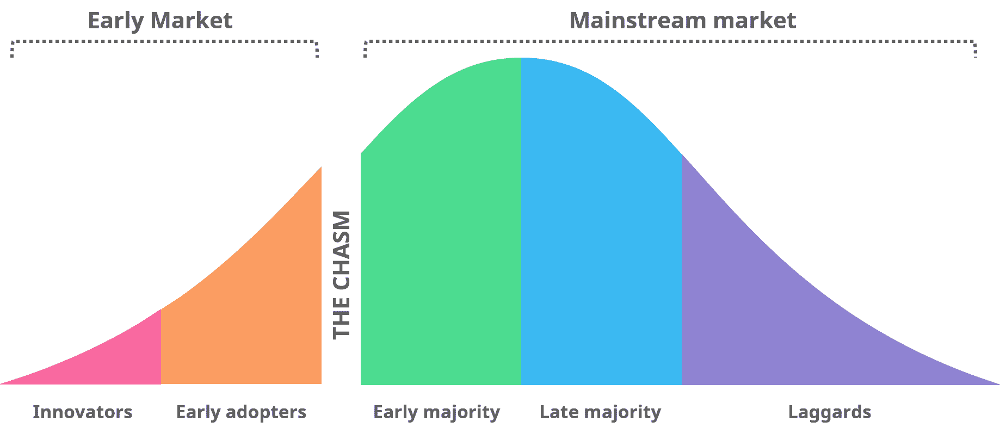

# 第七章：管理创新

在本书的*团队建设与维持*章节中，我们探讨了如何打造一个能够交付数据科学解决方案的平衡团队。现在，我们将讨论如何找到具有真正价值的项目和问题。在本章中，我们将更大范围地讨论数据科学管理。我们从团队领导转向数据科学项目管理的领域。我们将制定具体的策略和方法，以便能够找到、管理和交付对业务有价值的项目。

对于大多数公司来说，数据科学和机器学习属于创新领域。与软件开发不同，这些学科对客户和业务利益相关者来说是**未知领域**（terra incognita）。如果你像处理其他项目一样处理数据科学项目，你将面临许多意想不到的问题。数据科学的领域需要采取不同的处理方式。当我们进入创新领域时，最佳和良好的定义发生了变化。

在本章中，我们将探索创新管理，并回答以下问题：

+   理解创新

+   为什么大企业会如此频繁地失败？

+   探索创新管理

+   平衡销售、营销、团队领导和技术

+   在大公司中管理创新

+   在初创公司中管理创新

+   寻找项目创意

# 理解创新

在我们讨论创新失败之前，我们需要了解什么是创新。字典中对创新的定义是：创新是某种新事物或以不同方式引入的事物；是新事物或新方法的引入。每个创新都是暂时的。爱迪生的灯泡曾是创新的，汽车也是如此。成功的创新如暴风骤雨般侵入我们的日常生活，永远改变它们，随后变得平凡。失败的创新则逐渐消失，被遗忘。

如果我们看历史，技术的创造并不保证成功。汽车首次出现在 1886 年，但汽车真正改变我们生活是在 27 年后的 1913 年，当时福特汽车公司建立了第一个流水线。如果你将创新定义为发明家的成功，那么第一辆汽车的发明可能是一次巨大的突破。但从商业的角度来看，我们可能只有在创新创造了一个新市场，并带来了稳定的收入流时，才认为它是成功的。技术创新推动了领域的发展，而商业创新创造了某些新的、以前无法获得的价值。这些价值帮助了新市场的出现和新企业的崛起。

# 为什么大企业会如此频繁地失败？

大公司往往将创新视为金矿。许多企业家会想，*你听说过这家新的人工智能初创公司吗？试想一下，我们在这个领域能取得什么成就。与其他公司相比，我们的资源是巨大的*。然而，历史却告诉我们并非如此，因为新兴的创新技术通常是在小型初创公司内部诞生的，而不是在大型稳定的企业中。这与直觉相反。大公司有更多的资源、人力、时间和风险免疫力，而初创公司几乎没有。那为什么大公司会在创新上失败呢？克莱顿·克里斯滕森的《创新者的窘境》（[`www.amazon.com/Innovators-Dilemma-Revolutionary-Change-Business/dp/0062060244`](https://www.amazon.com/Innovators-Dilemma-Revolutionary-Change-Business/dp/0062060244)）和杰弗里·摩尔的《跨越鸿沟》（[`www.amazon.com/Crossing-Chasm-3rd-Disruptive-Mainstream/dp/0062292986`](https://www.amazon.com/Crossing-Chasm-3rd-Disruptive-Mainstream/dp/0062292986)）讲述了一个有说服力且有数据支持的故事。创新在发展的初期几乎不会带来任何收入。在大公司中，创新产品往往会与公司现有的最佳产品进行竞争。从这个角度来看，创新似乎是初创公司的合法选择，而与大公司现有的收入渠道并不兼容。小公司为了生存而努力获取收入，而与大型企业在成熟市场中竞争几乎是不可能的。小型初创公司没有足够的资源来提供市场所需的竞争性产品。因此，初创公司生存的自然之道便是创新。

新技术通常是未经加工的原始技术，因此它们对于新市场来说似乎不具吸引力。克莱顿·克里斯滕森教授以**硬盘驱动器**（**HDDs**）为例来说明这一点。在大型硬盘驱动器盛行的时代，所有人都将其作为行业标准。虽然小型硬盘在理论上很有趣，但在实践中却无法使用，因为当时硬件仅支持较大的硬盘驱动器型号。较大的硬盘驱动器还拥有更大的存储容量、速度和可靠性。随着个人计算机市场的兴起，小型硬盘瞬间变得更加吸引人。电力消耗和体积是 PC 用户关心的参数。新的收入渠道促进了小型硬盘的发展。经过一段时间，小型号硬盘在存储容量、速度和可靠性上超越了其大型型号。对老一代硬盘来说，已经为时过晚。看似稳定的大公司在五年前失去了市场，市场被新兴的、更先进的技术所取代。

在大公司启动创新项目很容易，但完成它们却很麻烦。创新根据公司的短期到中期目标来看，往往显得毫无意义，因为它们既不带来收入，又需要大量投资。然而，创新进入大公司并非不可能。我们将在本章稍后探讨如何将创意发展成小型和大型企业的商业模式。

# 市场的游戏

数据科学仍然是一个充满巨大潜力的年轻领域。许多专家认为，即使我们停止新的研究，如果将过去 10 年中出现的新技术整合进来，我们依然领先于当前的竞争对手二到三十年。然而，研究项目与广泛应用的技术之间存在很大差距。就像硬盘驱动器（HDD）一样，一个研究项目需要不断扩展其功能，以超越当前的竞争者。

数据科学利用机器学习、深度学习和统计学的研究成果，提供解决现实问题的软件产品。为了使软件具有广泛的适用性并能被使用，软件需要大量的时间投入。软件工程师、数据科学家以及其他技术专家的时间是有成本的。要从你的软件中赚取收入，你需要解决人们的问题。你的产品需要为人们带来一些有价值的东西。当这种价值足够大，能够维持持续的需求时，你就创造了一个新市场。这个市场由供求法则主宰：人们和公司将用钱交换你的产品和服务。

在初期，大型组织会创建自己的市场或参与现有市场。市场就像我们一样会衰老和消亡，给新市场提供了生存空间。如果处于衰退市场的公司未能转向新兴市场，它们将停止存在。

# 创造新市场

创造新市场是复杂且具有风险的。如果你测试一个想法花费太长时间并消耗太多资源，你将会失败。风险很大，所以测试想法应该是快速且简单的。这种测试让你能将错误转化为知识，并在一次又一次的迭代中改进你的产品。快速失败并通过测试想法不断学习是精益创业方法的关键。公式很简单：尽可能多地探讨想法，迭代地调整你的产品以适应市场，并增加对你服务的需求。这个过程的关键特点是速度。

大公司很少能快速运作。长周期的运营和繁重的组织流程随着公司规模的增大而自然出现。没有这些关键工具，公司可能无法正常运作。然而，创新不容忍长周期。实验的失败成本随着时间的延长而增加，这使得创新对大公司来说变得非常昂贵。

对于组织来说，数据科学仍然是一种创新，大多数市场细分尚未开发或发现。虽然创新很困难，但并非不可能。在本章的后续部分，我们将探讨如何通过在大公司和小公司中运用创新管理来掌控新技术。

# 探索创新管理

创新本质上非常混乱。创新者提倡实验，但他们无法预测最终结果，并且很难定义时间限制。这些创新的特性使其在商业环境中难以实施，因为在商业环境中，明确的目标、严格的截止日期和有限的预算是常态。创新管理提供了一套技术，旨在为混乱的创新领域带来秩序。*管理* 这个词通常与直接控制相关，但对于创新来说并非如此。自由对于每一个创新都至关重要。你无法通过微观管理取得任何积极的结果。创新管理是为创新提供支持，并将其整合到现有的业务中，以便它们能带来有益的结果。

要理解创新管理背后的主要思想，我们应该了解不同类型的创新，即持续创新和颠覆性创新：

+   **颠覆性创新** 是大多数人所理解的创新。这种创新带来了市场的剧变。它引入了某种新的、技术上足够成熟的东西，能够创造一个新市场。iPod、iPhone、IBM PC 和电灯泡都属于颠覆性创新。

+   **持续创新** 感觉更为 **有机** 和 **渐进**。你最喜欢的操作系统的新版本、社交网络的界面变化和 iPhone 的升级都属于持续创新。持续创新的目标是通过引入新功能来跟上竞争对手的步伐，防止你的客户转向竞争公司提供的更具吸引力的产品。

每一次持续创新都会稍微拉大竞争对手之间的差距，而颠覆性创新则改变了我们的生活和工作方式，从而创造了新市场并使旧市场变得过时。从外行观察者的角度来看，颠覆性创新可能会突然出现，但实际上，它们并非一时的灵感。《**创新者的困境**》中包含了许多颠覆性创新的例子，这些创新是在小市场中成长起来的，其中创新产品的特点对特定的使用场景具有更大的吸引力。稳定的收入来源使创新技术能够成长到其潜力，而提供老一代产品的公司并未意识到市场上已有的直接竞争。当新产品颠覆市场时，已为时过晚。

数据科学本身并不是颠覆性的创新，也不能单独支撑创新。它是一套工具，我们可以用它来创造这两种创新。特别是，自动驾驶汽车是颠覆性技术的良好候选者，而更精准的推荐引擎属于创新管理中的持续创新一方。

从风险的角度来看，创造颠覆性创新是一项危险且长期的投资，而创造持续性创新应该是任何成功企业中一个稳定且经过充分研究的过程。

我们可以通过以下生命周期来查看这两种类型：

1.  **搜索**：在这一阶段，公司会寻找一个可以进行实验的创意。

1.  **构建**：在这里，公司构建原型，进行实验，并衡量结果。

1.  **规模化**：在这个阶段，构建阶段为我们提供了一个有前景的方向，因此公司开始扩大规模。原型被转化为市场准备好的产品，并开始创造收入。

1.  **扩展**：每种创新都会饱和其市场。在这个阶段，公司将产品扩展到新市场，以保持增长率不变。

1.  **持续**：在这一阶段，创新变成了一个稳定的业务。一些公司可以在持续阶段存在几十年。然而，这也伴随着风险。你在市场中的当前位置并不是一个固定的不变的收入来源。没有长期投资，它可以迅速饱和。每一分钟的停滞都会为你的竞争对手创造新的机会，使他们能够进行颠覆性创新，从而将你挤出市场。持续阶段是一个信号，表明公司需要恢复**搜索**阶段。

每一个颠覆性创新的另一个重要方面是鸿沟。在*《跨越鸿沟》*中，杰弗里·摩尔展示了著名的市场采纳曲线：

新技术可以迅速在早期市场找到一个看似稳定的收入来源，早期市场由愿意为风险性、未经验证、实验性的但有前景的解决方案支付费用的公司组成。许多组织认为，从早期市场到主流市场的过渡会是顺利的；早期市场会产生足够的收入，以便能够创造出对主流市场有价值的新功能。然而，实际上情况并非如此。早期市场和主流市场之间的差距远大于看上去的。随着早期市场的饱和，公司进入了鸿沟。其产品尚未足够成熟和完善，无法满足主流市场的需求，主流市场的客户习惯了功能丰富且稳定的产品。因此，公司被迫忍受收入来源的下降，而其产品需要大量投资，才能创造出主流市场所要求的功能。

为了找到突破困境的路径，公司必须将精力集中在一个非常具体的应用领域，在这个领域中，产品的最佳特性比其当前的缺陷更为重要。目标是找到一个微小但可靠的细分市场，并专注于完善它。这将创造一个小市场，通过成功案例、功能、客户推荐和新的收入来源，帮助你获得成长的动力。在一个小市场中的持续成功将为你提供必要的资源和时间，从而能够扩展到更成熟的市场。

在接下来的章节中，我们将看看一个虚构公司 MedVision 的案例研究。

# 案例研究 – 跟踪 MedVision 的创新周期

作为一个例子，我们来看一下 MedVision——一个虚构的人工智能初创公司，旨在将计算机视觉技术应用于医疗设备和医院。在他们的探索阶段，进行了一项关于深度学习在医学中应用的研究。

MedVision 的专家们还进行了市场调研，并确定了四个潜在的工作方向，如下所示：

+   使用 X 光图像检测肺癌。

+   通过分析可穿戴设备的数据，检测心脏病发作和其他危险的健康状况。

+   利用患者的病史创建诊断助手，帮助治疗师在考虑患者数据的情况下识别和分类疾病。

+   分析瞳孔运动、脑电图（EEG）扫描和脑部扫描，识别和分类心理疾病。

从商业角度来看，所有这些想法看起来都很有前景，并且有一个明确的市场基础，也就是希望提供/获得更准确且价格更低的医疗诊断的医生和患者。

在构建阶段，MedVision 团队创建了多个原型并展示给潜在买家。他们还加深了对每个想法领域的了解并进行了研究。构建阶段揭示了一些在探索阶段未能发现的意外问题，如下所示：

+   癌症检测面临数据质量差的问题。许多数据集包含带有偏见的图像，需要手动清理。在原型阶段，MedVision 的模型在保留测试集上获得了 0.97 的 F1 分类分数，但在新获取的数据上却未通过测试。MedVision 用于模型训练的数据集存在偏见：用于制作 X 光图像的扫描仪在扫描图像上留下了标记。模型学会了通过最简单的策略来分类癌症：识别这些标记。这导致了模型的偏差。另一个偏差来源隐藏在时间戳中，所有的 X 光图像都有时间戳。结果发现，癌症患者因为医院的排班政策，更有可能在星期二和星期五进行扫描。MedVision 团队现在已经准备好在为实际客户解决癌症分类问题时处理这些问题。团队决定，偏见问题是可以解决的，并且不会成为这个想法的障碍。

+   可穿戴设备的数据已被证明是心脏病发作和跌倒伤害的良好预测指标。然而，数据可获取性存在巨大问题。在 MedVision 的网络中，只有 1/10 的医院报告称他们拥有可穿戴设备的数据，而且仅有两家医院计划在未来 5 年内向患者提供可穿戴设备。由于可穿戴设备在医学中的普及程度较低，MedVision 决定将这一想法从计划中剔除。

+   使用患者的病史来诊断疾病被证明是一个非常具有挑战性的任务，因为数据收集存在困难。对三家医院数据的研究显示，30%的患者病史仍然是纸质格式。表格标准化，但大多数是手工填写的。为了验证他们的想法，MedVision 团队需要开发可靠的手写识别技术，然后对大量文本信息进行结构化和错误校正。这个过程需要大量的时间投入，并且需要两名手写识别和**自然语言处理**（**NLP**）领域的专家。在数据研究过程中，关于一家大型公司在这一方向上失败的消息传出。MedVision 决定不再在这一方向上进行进一步投资。他们一致认为，继续进行原型开发阶段的风险太高。

+   精神疾病分类吸引了多位 MedVision 深度学习专家的关注。这个想法新颖、未被探索且充满潜力。进一步的研究表明，目前精神病学的诊断方法主要依赖患者的描述和外部条件，而非医疗设备的测量数据。尽管研究人员在这一领域已经取得了显著成就，但精神病学诊断手册并未采纳这些研究成果。事实证明，解决这一任务，MedVision 还需要在精神病学和数据科学这两个学科领域取得先进的进展。这个想法更像是一个研究项目，而非产品实施。他们将需要吸引长期投资、精神病学和心理治疗领域的专业人士和专家。这个想法具有变革性：MedVision 需要从一家商业公司转型为研究机构，才能实现这一目标。所有团队成员一致认为，在不改变公司目标和投资者的情况下，他们无法完成这个项目。他们记录下了自己的选择，并决定在公司规模足够提供长期研究项目资源时，再次考虑这个想法。

MedVision 的团队决定继续推进他们的癌症检测原型。他们已确定两家对他们的解决方案感兴趣的医院：奥克兰医院和癌症预防中心。他们还找到了一家可能提供额外资金的医学研究机构，前提是他们与真实患者的首次测试成功。

一年后，MedVision 的系统成功在奥克兰医院投入使用。第二个项目在中途被取消，因为癌症预防中心希望对已开发的产品拥有独占所有权，这大大限制了 MedVision 的扩展和销售能力。

癌症检测系统的首次工作部署使 MedVision 和奥克兰医院得以向主要新闻媒体发布他们的成功故事。这使得 MedVision 团队开始了扩张。他们扩展了销售部门，并开始吸引新的客户进行系统试用。大量新的功能请求开始涌向 MedVision 团队，因此他们聘请了一位产品经理来研究市场，并对新功能进行分类、优先排序和管理交付。几家竞争对手进入了市场，跟随 MedVision 的成功，因此团队转向提供持续性创新，以保持市场领先地位。

随着资金的增长，在成功运营几年后，MedVision 的团队为他们的客户群开发了新产品。他们开始通过寻找新想法来进行变革性的公司调整，希望能找到适合的基础，以便开始第二轮破坏性创新周期。

接下来，我们将探讨将创新整合到现有业务中的可能方式。

# 整合创新

创新需要实验。新的方法经常会失败，但失败并不意味着终点。失败只意味着你必须提炼经验，从错误中学习，并尽快再试。如果你在一家成熟公司中尝试这样做，他们的流程和最佳实践可能会让你看起来像个疯子，而且你的行为可能会显得具有破坏性，并与公司的价值观和目标相悖。这种情况发生的原因是大多数企业倾向于持续性创新。现有的价值观、目标和关键绩效指标（KPI）对破坏性创新的反应就像免疫系统对病毒的反应——采取防御行动。这就是为什么大多数**研发**（**R&D**）部门在企业中生活得如此艰难的原因。它们追求的目标与所工作的公司的价值观不兼容。为了缓解破坏性创新在大公司中的整合，你可以尝试在公司内部引入一个独立的业务实体。

有多种方式可以实现这一点：

+   **收购**：收购已经成功跨越鸿沟的公司。这种方式的主要挑战在于整合被收购的公司。技术和组织整合需要小心进行，以免对新收购的产品和团队产生不利影响。

+   **独立实体**：创建一个分支公司，接受总部的融资。这种方法的主要挑战是高昂的成本、风险管理以及抵制完全控制的冲动。诚实地评估你公司的潜力，以便创建和组织一个以长期发展颠覆性技术为目标的新业务。

+   **独立部门**：这是创建创新团队的最难方式。这里的主要挑战是为现有公司创造一套新的目标和价值观。

从创新的角度思考数据科学项目，在许多方面都是有帮助的。机器学习和深度学习可以创造持续性和颠覆性创新。创新管理将为你提供更广阔的视野，并让你的主要战略在市场中获得成功。那些没有将创新整合进来的组织将被竞争对手超越。归咎于技术不够成熟，或者专家不如竞争对手的明星专家，都是容易的事。在做这些的同时，很多公司忽略了考虑围绕新技术形成市场战略的有效性。数据科学解决方案需要一个稳定的组织基础和收入生成的行动计划。创新管理帮助我们兼顾这两个方面。

正如你所看到的，管理创新涉及处理大量的失败。失败是多维的，为了避免失败，你需要在不同领域的专长之间找到平衡。本章的下一部分将探讨三种主要的思维方式，这些思维方式将帮助你管理数据科学项目中的风险。

# 平衡销售、营销、团队领导和技术

在数据科学管理中要取得成功，你需要在不同的专业领域之间找到平衡。数据科学经理每天都在销售、营销和优化的任务之间切换。但他们不应该最关心数据科学吗？由于我们是集体完成工作的，因此沟通量较大。问问任何在商业环境中工作的技术专家，他们实际工作所花的时间有多少。平均来说，软件工程师会告诉你，他们每天有 2 到 3 小时是在编码。其余的 6 小时，他们参加会议、写或读文档、创建任务单、讨论技术设计。数据科学家花大量时间讨论数据定义、指标选择以及他们所构建模型的商业影响。

数据科学家可以投入的领域数量令人眼花缭乱：

+   开发解决方案中的复杂部分

+   代码评审

+   工作规划、任务管理和任务定义

+   技术栈与工具

+   员工

+   应用研发

+   绩效评估

+   指导

+   支持成长型思维，并为员工制定自我发展计划

+   为了更好的市场契合调整技术

+   制作演示文稿

+   练习演讲

+   编写书面材料

+   扩展你的网络并检查你的联系，寻找可能的 B2B 应用场景

+   探索竞争对手的当前产品

+   寻找技术的潜在转型方向

+   寻找新的应用场景并优化当前的应用场景

我们可以通过将每个活动归类到四个常见领域中来简化这个列表：

+   **技术领导力**：所有与数据科学、编程和开发过程组织相关的事项都属于这个话题：

    +   开发解决方案的复杂部分

    +   代码审查

    +   工作规划、任务管理和任务定义

    +   技术栈和工具的员工管理

    +   应用研发

+   **团队建设**：这个话题包括与你团队相关的活动：

    +   绩效评估

    +   教练辅导

    +   支持成长型思维并为你的员工制定自我发展计划

+   **销售**：任何有助于你销售更多产品或服务的事项都属于这个话题：

    +   制作演示文稿

    +   练习演讲

    +   创建书面材料

    +   扩展你的网络并检查你的联系，寻找可能的 B2B 应用场景

+   **市场营销**：所有与市场和转型相关的事项都属于这个话题：

    +   探索竞争对手的当前产品

    +   寻找技术的潜在转型方向

    +   寻找新的应用场景并优化当前的应用场景

在成熟的团队中，每个管理领域将由专门的专家来处理。在数据科学已经产生影响的组织中，你会发现跨职能的产品团队，其中专家们会被分配一到两个角色。对于刚开始涉足数据科学的组织，或那些正在利用先进的数据分析和预测建模建立业务的组织情况则有所不同。在这些团队中，数据科学经理更可能负责大部分，甚至是所有关键管理领域。

在工作日中管理不同的情境，不仅对新兴的数据科学团队有用。改变环境可以打开新的视角，给你关于如何推进技术、团队和业务发展的思路。我们将简要涵盖四个管理领域，并将它们与数据科学的具体情况联系起来。

技术领导力，与团队建设一起，是任何数据科学经理的关键活动。你需要确保你的项目使用了合适的工具，并且已经设计好以实现客户的目标。另一方面，你还需要关注团队的动机和长期的改进。倡导成长型思维并建立一个平衡的团队，将成为构建更好技术的坚实基础。

你的团队需要不断有任务可以进行。即使公司有专门的销售部门，你也需要先将你的想法推销给他们。如果数据科学在公司中相对较新，销售人员会熟悉公司现有的产品，但他们并不懂得如何向客户销售数据科学解决方案。你要么需要学会自己做这件事，要么需要讲销售的语言来指导销售部门如何推销数据科学解决方案。另一种需要这些技能的情况是内部销售。例如，当数据科学部门正在优化内部业务流程时，这套技能就显得至关重要。这在银行和互联网公司中是常见的情形。在这种情况下，数据科学经理需要寻找创意，使其具有吸引力并且清晰易懂，明确利益相关者，并完成一次内部销售，以便为你的项目争取到预算。没有销售，即使是最优秀的团队和最具颠覆性的技术也会发现自己没有任何工作可做。从销售员的角度看待你的职责，会为你打开一个意想不到的机会大门，因此千万不要错过。

如果你工作的销售部分如预期那样运作，你将开始看到许多机会，每个机会都需要你团队投入大量的时间。有些机会是现实可行的，与你团队的技术和专业匹配，而另一些机会则不那么吸引人。现在是时候戴上你的市场营销“帽子”了，这样你可以在这片机会的海洋中找到方向。从市场、需求和产品的角度思考你的工作，将帮助你选择出最佳的工作方向。随着每一个项目的完成，你团队的技能和技术将越来越接近某一类机会，而远离其他机会。市场营销的核心在于最有前景的方式去寻找，并朝着你的技术与市场需求相匹配的方向发展，从而创造出新的价值。

从不同的角度看待你的工作既能启发思考，也能对你的职业生涯和公司带来益处。我们生活在一个多维的世界，因此，超越我们主要职责的范围进行思考是非常重要的。从现在开始，试着把团队管理、技术领导、销售和市场营销这四顶“帽子”放在你的桌面上。记住，要不时地更换这些“帽子”，这样你和你的团队就会拥有寻找、培养和交付创新所需的所有要素。

# 在大公司中管理创新

大多数公司已经意识到数据科学的变革力量。没有人愿意在竞争中落后，因此公司创建了内部的数据科学和研发部门。在这种环境下工作具有挑战性，因为你既被一些人视为创新的推动者，也被其他人视为打扰的麻烦。创新通常会导致公司现有业务流程的重大变革，许多人不愿意看到这些变革的实施。

将颠覆性创新引入现有业务是一个棘手的过程；为了增加成功的机会，确保你具备以下条件：

+   **组织权力**：你需要直接或间接的组织权力来实施变更。

+   **迁移计划**：你需要对现有的业务流程（集成前）和未来的业务流程（集成后）有一个完整的规划。你还需要一个迁移计划，指导你从现有流程到未来流程的过渡。

+   **成功标准和集成策略**：对整个业务流程进行突然变更并快速整合创新是一种高风险的策略。你应该为你的项目设定可衡量的成功标准，并有一个风险管理策略，以便在最坏的情况下控制损失。

+   **开放的过程和清晰的解释**：每个受迁移影响的人都需要清晰明了地了解正在发生什么，以及这将如何影响他们的工作流程。

+   **参与集成**：你需要在描述现有流程和制定迁移计划时得到帮助。没有人比那些已经执行现有业务流程的人更适合这项工作。找出那些参与日常执行现有流程的人，并确保他们参与到第 3 和第 4 点中提到的流程中。

接下来，我们将探讨一个关于零售业务创新管理流程的案例研究。

# 案例研究 – 将数据科学引入零售业务

在这个案例研究中，我们将关注一位数据科学经理 Carl，他在一家虚构的零售公司工作。他和他的团队已经原型化了一种能够提高货架上商品可用性的解决方案。该解决方案将监控所有门店的商品，并通知店员，当货架上缺货时，店员可以及时补充商品。公司管理层已要求 Carl 将该原型发展成完整的解决方案，并将其整合到现有的货架可用性流程中。

在当前流程中，每家门店有两到五名商品可用性经理，他们使用智能手机上的应用程序手动监控店内每个货架。该应用显示每个货架上的最新商品位置，但经理需要手动检查商品是否在货架上。检查后，经理可以记录下所有缺货的商品，并前往门店仓库取货，将其放置在货架上。

首先，Carl 要求公司管理层将他介绍给负责所有门店当前商品上架可用性的负责人。结果发现，一位负责物流、配送和商品上架可用性的执行董事掌管了这一流程。Carl 准备了一份详细的演示文稿，描述了试点项目的结果。他告诉公司，他需要这位董事的帮助来制定系统的需求，以便将其集成到现有的业务流程中，因为这位董事具备相关的组织能力。当前的业务流程有详细的文档记录，每一步都分配给了具体的业务角色。为了制定迁移计划，他们采访了执行目标流程的专家。Carl 向专家展示了当前的原型，并记录下他们关于如何改进技术的意见，以便顺利地将其集成到工作流中。每个新功能都形成了即将实施项目的待办事项。随着新功能和想法的提出，业务流程方面也自然地出现了一些变化。有些变化存在冲突且定义不清，因此 Carl 将一名业务分析师分配到项目中，负责将迁移计划整理成一份连贯的文档。

之后，Carl 将结果呈报给了董事。新系统的集成显著改变了现有的流程。之前，监控商品上架可用性的门店经理们是通过人工走遍门店来监控商品的可用性，但现在，这项任务可以通过在每个货架附近安装便携式摄像头完全自动化。一名经理将通过移动应用接收任务通知，每个任务将包含关于商品存放位置、数量和货架位置的详细信息。该应用会将任务进行批量处理，并创建最优的路线穿过门店的储物区域。由于所有门店的可用性管理员都已经有智能手机，因此集成将变得简单：用户只需要更新手机上的应用，并熟悉新功能。

Carl 提出的集成策略的核心思想是首先在一个门店内测试该系统。如果该门店能够仅用一半的可用性管理人员应对当前的工作量，则测试视为成功。通过这种方式，项目会有可衡量的成功标准。如果第一次测试成功，系统将继续在更多门店进行测试。这个过程将重复进行，最终迁移到所有门店，使其成为目标版本的流程。

很明显，系统集成过程后，每个门店将需要更少的可用性经理。为了保持开放的流程和清晰的说明，主管设计了一个特别的培训项目，针对那些在系统上线后不再需要从事此项工作的人员。其他部门正在努力寻找新员工，因此重新分配劳动力是一个非常吸引人的选择。Carl 的团队还创建了一个深入的现场培训课程和应用内教程，描述了用户如何与新应用程序进行操作。

创新的生命周期比大型组织中的一般项目生命周期要快得多。由于快速的实验率和增加的失败风险，它在短期内的成本也更高。这使得在大型公司中处理创新变得更加棘手。现有的短期至中期的价值和目标会排斥创新，就像免疫系统排斥病毒一样。在成熟企业中，为研发和创新部门提供组织和财务支持是至关重要的。创新团队在以公司内部公司形式部署时表现最佳。尽管主业务可能在拥有众多层级部门和管理链条的组织结构中高效运作，但创新在组织结构层级很高且员工与高层经理之间只有一两步之遥时效果最佳。

在接下来的章节中，我们将探讨如何在初创公司中管理创新。

# 管理初创公司中的创新

如果你在初创公司工作，创新会比在大型、缓慢发展的公司中显得更加自然和易于实施。然而，初创公司与成熟公司之间存在显著差异。初创公司不能承担犯太多错误的风险。稳定的收入流使大型公司能够同时测试多个想法，而初创公司往往只能在一个方向上同时发展。

"鸿沟"的概念对初创公司非常重要。初创公司的主要目标是找到一个新的市场，在这个市场上它可以独立成长并提供不存在的价值。将你的创意和技术与市场需求对接需要大量可量化的实验。采用可衡量的方法是*《精益创业》*和*《跨越鸿沟》*方法中提倡的重要内容。

*精益创业*方法建议你尽早在市场上测试每个创意和每个功能。进行实验并获取反馈对初创公司至关重要，因为你做出的每一个选择都在限制你未来的发展。你的产品越早收到市场反馈，你就越能在为时已晚之前改变其方向。一家拥有良好研发实践和大预算的公司可以在计算机视觉、自然语言处理（NLP）和强化学习领域进行长期的创意测试。他们甚至可以创建完整的分支机构，以便测试创意。另一方面，一家计算机视觉的初创公司将更难转型到 NLP，因为盈利预期较短。

初创公司需要保持精简、快速和敏捷才能生存。从市场营销的角度看待你的创意是小型创业公司至关重要的技能。即使是最好的创意，如果没有适当的经济发展，也无法长久存活。由于早期采用者和早期多数人之间存在巨大差距，初创公司需要有一个明确的聚焦，力求满足特定客户群的需求。在本章的示例中，MedVision（参见*案例研究* – *跟随 MedVision 的创新周期*部分）实施了一种肺癌分类器。他们衡量了多个替代方案的市场需求，并确定癌症分类是最有前景和现实的应用案例。在短期内，他们计划通过几个成功的部署来吸引收入和新客户。从长远来看，他们计划收集市场反馈，扩展系统功能以支持更多类型的医疗设备，并扩展他们的疾病识别列表。关键的思路是通过进行实验和收集可衡量的反馈，将你的产品导向市场需求的满足。

在接下来的章节中，我们将探讨寻找可以推动数据科学项目的创意的不同方法。

# 寻找项目创意

在实施第一个原型之前，你需要找到有前景的创意进行开发。要创造创意，你可以从两个出发点之一着手：商业或数据。

# 在商业流程中寻找创意

如果你正在与已经建立的企业合作，找到创意的第一种也是最直接的方法是向管理层询问他们的需求。将数据科学专长与深入的领域知识相结合，可以帮助你在他们的需求和你团队的能力之间找到匹配。然而，你的客户很少会知道自己遇到了什么问题。在使用这种策略时，你最有可能得到的回应是，*我们知道这个问题，且已经在着手解决*。

在极少数情况下，一个问题可能会被端上银盘。如果不是这种情况，你将需要深入了解公司的业务。首先从他们的关键创收流程开始。了解这些流程是如何运作的。然后，将所有步骤标记为手动、部分自动化或完全自动化。现有业务流程改进的两个关键领域是手动步骤的自动化和自动化步骤的优化。

对于手动步骤，研究为什么它们仍然以这种方式执行。人工劳动可以产生大量的数字化数据，你可以利用这些数据来训练模型。表单验证、表单填写和客户支持是一些常见的案例，你可以通过数据科学解决方案来替代这些重复的人工劳动。

对于自动化和部分自动化的步骤，研究实施这些步骤的 IT 系统。查看数据源：数据库、数据仓库和文件存储。然后，看看哪里可以部署机器学习模型来优化这些步骤。评分、风险管理和算法营销算法就是其中的例子。

在分析现有业务流程时，最佳的做法是找出如下步骤：

+   **生成数据**：这一过程中的这一或任何前一个步骤都应持续生成可以被模型使用的数字数据。

+   **对业务至关重要**：改进应该为客户提供直接的商业价值。增加价值总是一个强有力的卖点。

+   **具有数据科学应用潜力**：你可以利用数据构建一个算法，提供洞察或自动化决策过程。

在 B2B 环境中，利用现有的业务流程寻找有前景的数据科学项目想法是一个稳妥的方法。这可以让你深化领域专长，找到最有价值的改进。

现在，让我们看看如何从数据中获取创意。

# 从数据中寻找想法

创造项目想法的另一种方式是直接从数据中寻找：

1.  首先，你应该创建与你合作的公司的数据源地图。有时，这些信息会直接提供给你使用。如果没有，你的团队应该做一些研究，恢复组织的数据架构。利用这个数据地图，你可以识别出最大和最完整的数据源。

1.  然后，根据数据量和数据质量对所有数据源进行排序，查看不同数据库之间可能的数据合并。目标是为进一步研究创造几个起点。

1.  最后，深入了解你所选择的数据源。寻找可以用来构建监督学习或无监督学习模型的数据集。在这个阶段，你不应构建任何模型；只需写下所有想法——越多越好。在记录下这些想法后，看看是否有任何想法能够创造新的商业价值。

这种寻找创意的方式具有风险、耗时且非常具有创意。成功的几率比之前的方法低，但如果你能够从数据出发，找到一个行之有效的想法，你更有可能偶然发现一个独特的数据科学应用案例，这会为你带来竞争优势并提供新的商业价值。第一种方法更适合寻找可持续的创新，而第二种方法则可以用来挖掘颠覆性的创意，也就是变革性想法。

偶尔，一些人会提出真正独特的创意。这些创意可能没有任何数据，也没有商业背景——只有一个引人入胜的想法。那些能颠覆行业的创新性想法通常融合了几个表面上看似无关的学科：

+   医学 + 计算机视觉和机器学习 = 患者的自动化疾病风险分析

+   汽车 + 计算机视觉 = 自动驾驶汽车

+   呼叫中心 + 深度神经网络 = 完全自动化的对话系统，具备语音识别和生成

如果有一种可靠的公式可以用来创造这样的想法，那么它们就不再是罕见和令人惊讶的了。增加发现新想法的机会的唯一方法是积累在不同领域的知识和经验。

如果你认为你已经想出了一个有前景的概念，不要急于行动。写下你的想法并开始研究它：

+   查找市场上已经存在的类似产品。很可能，你会找到几个至少有些相似的产品。

+   收集并分类竞争对手的产品功能。

+   写下每个产品背后的核心商业模型。

+   将所有收集到的功能按几类进行排序：

    +   **最佳功能**：没有人能做得比这更好；这是产品的独特特性。这个特征通常是决定购买的关键因素。

    +   **核心功能**：大多数竞争者已经相当好地实现了此功能。

    +   **基础功能**：这是以基础的方式实现的。许多其他竞争者在此功能的实现上更为完善。

    +   **缺失功能**：产品缺少某个功能。

+   通过描述产品功能开始构思你的创意。为你的产品创建一个概况，并思考那个使它与众不同的特征。

+   思考一下你的产品商业模式。它如何与市场上的其他产品相关联？

如果你在市场上找不到任何竞争对手，或者你看到你的产品能够轻易将竞争者排挤出市场，那么你有机会创造出颠覆性的技术。记住，将颠覆性创新推向市场需要仔细的规划、专注和跨越鸿沟的策略。

接下来，我们将看一个案例研究，内容是关于在保险公司寻找创意和管理数据科学项目的。

# 案例研究 —— 在保险公司寻找数据科学项目创意

在这个案例研究中，我们将考察虚构的 Insur Inc.公司，Rick 最近晋升，现在担任数据科学部门负责人。数据科学是公司的一门新领域。尽管他们尝试过多个原型，但没有一个成功进入生产阶段。Rick 的第一个重要任务是找到一个既有益又能为公司带来利润的数据科学应用场景。

Rick 已经知道公司的主要收入来源是销售保险单，而主要损失则来自保险理赔。Insur Inc.提供健康、房地产和汽车保险项目。公司最大的产品是其汽车保险，占整体收入的 75%。Rick 仔细研究了汽车保险部门的流程。

首先，他查看了新保险单的流程，如下图所示：

这个过程由四个 IT 系统支持：

+   **前台系统**：这是一个保险顾问 UI，在所有 Insur Inc.的办公地点使用。该系统不存储大量数据，作为一个轻量级的 UI，它的功能相比**后台系统**有限。

+   **后台系统**：这是一个管理所有与保险合同相关数据的系统。后台工作人员使用该系统来验证和处理新合同。

+   **评分与费率系统**：这是**后台系统**的辅助模块，利用保险合同数据并应用一套规则，为客户找到最匹配的费率。

+   **保险单注册**：这是一个中央数据仓库，存储所有与保险合同相关的数据。

Rick 想要研究利润损失周期，但这个过程只包括了周期中的利润部分。损失由另一个过程管理，即保险理赔管理：

参与这个过程的 IT 系统几乎一样，和保险合同一样，除了**理赔处理**系统。专门的经理使用这个软件来验证理赔并安排现场调查损坏的车辆。该系统还会识别欺诈性理赔。欺诈检测过程大部分是手动进行的，但系统中也实现了一些简单的基于规则的检测器。

Rick 决定改进**评分与费率系统**。根据客户数据预测潜在理赔将有助于提高风险识别和合同定价。风险较高的客户将会收到更高的费用。Rick 组建了一个团队，并开始使用来自**保险单登记处**、**后台系统**和**评分与费率系统**的数据进行新评分算法的原型开发。公司计划实施一个二分类器，用于估算每个新客户有效理赔的概率。汽车保险部门的业务人员已经熟悉假阳性和假阴性错误的概念，因此他们使用混淆矩阵来比较当前和新评分算法的表现。业务部门拒绝使用像 F1 分数这样更复杂的指标，建议直接从混淆矩阵中计算利润增加。

经过三周的原型开发，Rick 的团队创建了一个分类器，优于当前基于规则的**评分与费率系统**算法。他们将预测结果发送给业务部门进行评估。30 分钟后，业务部门要求解释每个得分。结果发现，当前的评分系统生成了详细的季度报告，并将其发送给一个监管机构，后者检查公司使用的评分模型的有效性。该模型应当完全可解释且易于人类理解。Rick 的团队使用了一个具有大量参数的黑箱模型，以实现高准确率，因此他们的模型未能满足这一要求。像逻辑回归这样的可解释模型更适合这里，但它们的性能对于当前的系统来说不尽如人意，因此不适合部署。

Rick 意识到他和他的团队浪费了三周的项目时间。这对他的老板来说是个坏消息，他被要求不要再犯同样的错误。

这一次，Rick 研究并记录了所有相互冲突的需求。他通过向汽车保险部门的同事询问业务流程的每一个细节，深入理解了领域知识，并为明确起见将其记录下来。在研究过程中，他验证了欺诈检测流程更适合迁移到机器学习模型：

+   没有相关的政府规定和特殊报告要求。

+   理赔处理部门在欺诈检测方面遇到了困难，因为这是他们主要的损失来源之一。决策过程耗时且每一项理赔都需要检查，因此欺诈检测的整体质量逐渐下降。

+   在**理赔处理**数据库中收集了大量数据。

主要问题是，客户需要更详细的拒绝理由，而不仅仅是*“我们的模型认为您的保险索赔是欺诈性的，因此我们拒绝了它”*。因此，Rick 建议公司只使用一个用于欺诈检测的算法。这个想法是创建一个基于机器学习的过滤器，用来评估索赔欺诈的可能性。如果这个可能性足够高，就会触发当前的欺诈调查流程。所有索赔中只有 0.5%是欺诈的，因此如果模型准确，它应该能显著减少检查的数量。

Rick 准备了一个解决方案架构，展示了新欺诈检测系统将如何实施以及如何与现有流程集成。他与所有业务利益相关者会面，验证了他的想法。每个人都同意这种方法。他们达成的一致评估策略与评分模型相同。之后，进入了下一个原型设计阶段。该模型被证明是成功的，Rick 被要求实施完整的欺诈检测模块，并将其集成到现有的业务流程中。

# 总结

在这一章中，我们探讨了创新，并学习了如何管理它们。良好的创新管理要求我们仔细规划自己的活动，并利用销售、市场营销和技术领导等不同的视角，将我们的创意与市场需求对接。

首先，我们描述了每个视角如何有助于有效的创新管理。接下来，我们探讨了将创新融入大型组织和初创公司的复杂性。数据科学对于大多数组织来说是一项创新活动，我们定义了几种策略，可以用来找到项目创意并使其成功实施。

我们还考察了三个案例研究，每个案例都与创新管理的不同主题相关。第一个案例是*在 MedVision 跟随创新周期*，展示了创新周期如何在现实场景中应用。第二个案例是关于*将数据科学引入零售业务*，我们探索了大组织中的创新管理。最后一个案例是*在保险公司寻找数据科学项目创意*，展示了使用结构化方法寻找数据科学项目创意的重要性。

在下一章中，我们将探索数据科学项目生命周期，它允许您为您的团队结构化和规划任务。
