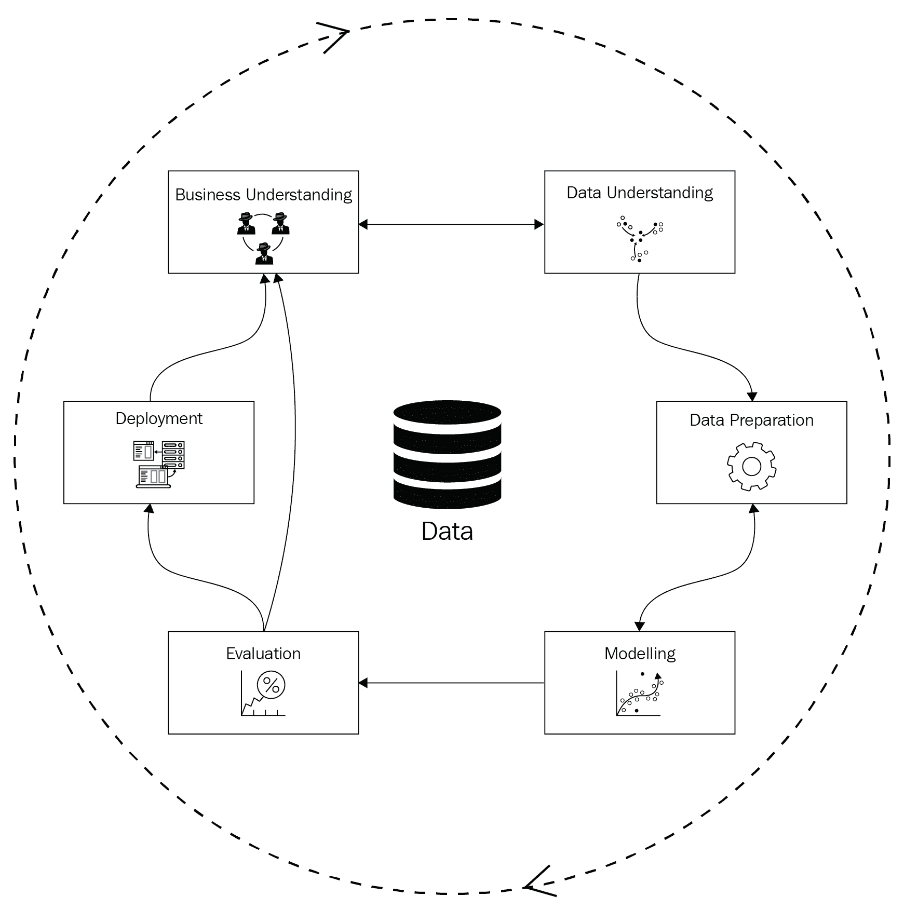
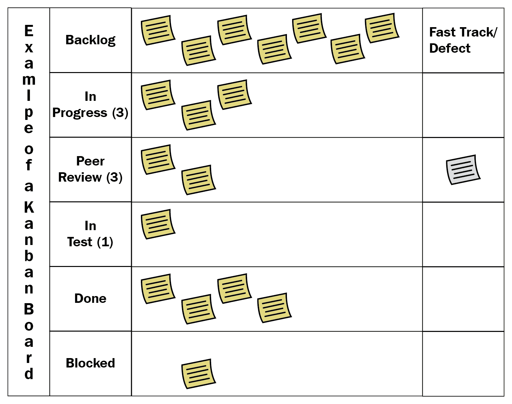
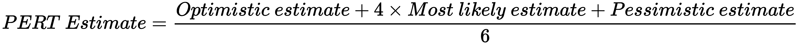
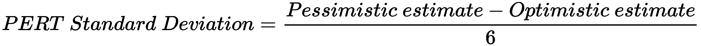

# 第八章：管理数据科学项目

在上一章中，我们探讨了创新管理。我们制定了可以帮助寻找数据科学项目创意的方案，并将这些创意与市场需求相匹配。在本章中，我们将通过分析数据科学项目如何与一般的软件开发项目不同，来探讨数据科学项目管理的非技术方面。我们将讨论导致数据科学项目失败的常见原因，并制定一种方法，降低数据科学项目的风险。最后，我们将深入探讨项目估算的艺术与科学。

在本章中，我们将探讨如何从头到尾管理项目，涵盖以下主题：

+   理解数据科学项目失败

+   探索数据科学项目生命周期

+   选择项目管理方法

+   选择适合你项目的方法

+   估算数据科学项目

+   发现估算过程的目标

# 理解数据科学项目失败

每个数据科学项目最终都会变成一个生成定期报告或在线运行的软件系统。软件工程的世界已经为我们提供了多种软件项目管理方法，那么为什么我们还需要为数据科学项目重新发明一种特殊的方法呢？答案是，数据科学项目需要更多的实验，并且比软件工程项目需要容忍更多的失败。

为了看清传统软件系统与具有预测算法系统的区别，让我们来看一下数据科学项目失败的常见原因：

+   **对数据的依赖**：一个健全的**客户关系管理**（**CRM**）系统能够组织销售流程，在许多组织中都能良好运行，且与其业务无关。一个预测销售流程结果的系统可能在一个组织中运行良好，但在另一个组织中可能需要部分重写，甚至在其他组织中完全不起作用。原因在于，机器学习算法依赖于数据，而每个组织都有其独特的客户数据模型和销售流程。

+   **需求变化**：虽然软件开发项目常常会面临需求变化，但这些变化大多是从客户流向实施团队。在数据科学项目中，来自实施团队的新洞察和研究成果可能会形成反馈循环。项目利益相关者可能会根据数据科学家发现的新信息生成新的需求，并改变项目的方向。

+   **变化的数据**：在软件开发项目中，数据模型大多是固定的，或者可以在受控的方式下进行更改。数据科学项目通常需要集成新的数据源以供研究使用。数据始终在变化和转化，在系统内部创建多个中间表示。人们和软件组件使用这些表示进行报告、数据处理和建模。软件工程项目使用固定或缓慢变化的数据模型，而数据科学项目使用不断演变的数据管道。

+   **实验和研究**：数据科学项目涉及完成大量实验。通常，实验数量从几百到几千不等。软件工程项目通过设计系统架构并以可控的方式演化来限制研究。在数据科学项目中，下一个实验可能会使项目朝着新的方向发展，而且你永远不知道何时会发生这种变化。

# 理解数据科学管理方法

传统的软件工程项目管理方法并没有考虑这些问题。大多数现代软件项目管理方法需要解决的关键问题是需求变化的问题。敏捷方法论专注于规划和执行快速迭代。每次迭代都旨在尽可能快地向客户交付功能。外部反馈是项目变化的主要来源。

在数据科学项目中，变化来自各个方向。它们在项目团队内部传播，也来自企业的客户。度量标准应始终确认进展。实现目标的过程中，可能需要经历几十次甚至上百次失败的实验，这使得快速迭代成为必须。

敏捷项目的典型迭代周期可以从 2 周到 1 个月不等。项目团队为此期间确定迭代范围，并在严格的时间表下交付。在数据科学项目中，迭代中期的实验结果可能会影响迭代目标，并且由于新的发现，其他计划任务的工作重要性可能会降低。

管理层必须为常见问题和问题提供保障。来自软件工程领域的方法论可以为你提供坚实的基础，但它们并未提供可以用来管理研究和治理数据的工具。

如果你开发的是使用机器学习的系统，必须关注以下几点：

+   **验证和对齐的要求**：你需要检测并管理来自外部（客户）和内部（研究团队）来源的需求变化。

+   **数据治理**：你的项目将需要数据治理标准，这些标准应严格应用于与数据相关的每一行代码。理想情况下，通过你的数据管道流动的每一行数据都应该能追溯到其数据源。所有进出数据集，包括中间报告，都应被跟踪和记录。

+   **研究过程**：每个数据科学项目都需要进行广泛的研究。如果没有控制，研究很容易迅速消耗掉预算，而项目的完成似乎遥不可及。管理研究项目的核心组成部分包括以下内容：

    +   **研究规划**：项目团队应当规划并优先处理他们的所有研究。

    +   **实验方法论**：每个实验都应遵循一套标准，如跟踪、文档记录和可重复性。

    +   **快速失败并早期恢复**：实验经常会失败。你的管理方法应该使实验尽可能快速，以便你的团队能够尽快地进行迭代和学习。

+   **软件工程过程**：你的工作大部分将涉及软件的创建。软件项目管理已经提供了很好的工具，但它们需要与管理方法论的其他组件紧密集成。

接下来，我们将探讨数据科学项目中常见的阶段。我们将这些阶段与项目生命周期的过程结合起来，以便全面了解数据科学项目的全貌。

# 探索数据科学项目生命周期

每个数据科学项目有几个不同的状态。我们可以将不同领域和技术的项目结构化为包含数据科学项目生命周期的各个阶段，如下图所示：

让我们更详细地探讨生命周期中的每个阶段。

# 商业理解

在这一阶段，你将运用你的领域专业知识，研究项目的商业方面。你需要定义商业需求，并确认这些需求的实施能够改善客户的生活。你还应该定义并记录所有相关的商业指标，以便用业务方能够理解的方式衡量和报告结果。这个阶段的输出应为一份业务需求规格书，已由项目相关方审阅、修订并达成一致。

# 数据理解

在这一阶段，你需要研究与之合作的组织的数据架构。你需要记录数据来源、它们的拥有者及其使用的技术。除非你打算从数据中挖掘项目创意（参见第七章，*管理创新*），否则不必记录所有可用的数据源。重点是与项目相关的有用数据。

找到这些数据后，进行**探索性数据分析**（**EDA**）并彻底研究数据。查看数据中是否有任何异常或不寻常的现象，研究它们发生的原因并记录如何处理它们的方法。例如，如果数据集包含大量空值，你应该有一个处理这些空值的方案，而且你的处理方式不应以不合适的方式扭曲数据。

你还应当在 EDA 阶段考虑特征工程的想法。对数据进行统计分析，并尝试找到有助于解决当前任务的因果关系。

数据理解阶段应当有以下输出：

+   **数据源字典**：本文档简要描述了与你的项目相关的所有数据源。

+   **一份展示你数据分析结论的 EDA 报告**：该文档应描述你将用于解决当前任务的方法和应对数据中错误的策略。你应该包括一些可能引起客户兴趣的事实。

# 数据准备

这一阶段是我们开始处理数据的地方。数据准备阶段涉及将原始数据转换为有用的格式。你从数据源中读取数据并对其进行准备，以便使用这些数据实现项目目标。如果你在解决一个基于结构化数据的任务并计划使用机器学习，你将需要进行特征工程。前一个阶段应该会为你提供数据中独特之处的洞察，这些问题你可以在数据准备阶段进行修复。本阶段的输出是一个或多个可重复的数据准备任务以及一个可以用来构建和测试模型的数据集。

# 优化数据准备

数据准备和数据理解是非常耗时的。这些阶段可能占用项目时间的 80%，所以不要忘记提前规划。由于这些阶段耗时，优化团队的表现非常重要。开源的自动化 EDA 和特征工程工具可以在项目初期为你节省大量时间，因此不要犹豫使用它们。在本书的*创建开发基础设施*章节中，我们将介绍一些可以帮助你加快数据准备和数据理解阶段的库。

为了减少出错的可能性并便于监控，你应该关注数据的来源和版本管理。每个数据集都应该能够追溯到其源头。无论是中间数据还是原始数据，都应该妥善保存所有数据文件。在你的代码中记录每个数据转换任务的输入和输出。数据处理的 bug 很难发现，除非你对数据流有完全的掌控。

另一个重要的点是可复用性。要合理编写数据处理代码。虽然很诱人将大量杂乱无章的代码写在一个文件中并让它们执行任务，但这样会增加技术债务。代码可能运行一段时间，但最终会在没有任何预警的情况下失败。随着时间推移，你可能还会想为代码添加额外功能。如果代码写得不好，你将花费大量时间来修复和调试。

为确保你的数据处理代码稳健，请在代码审查时使用以下检查清单：

+   所有重复的代码被封装成函数。

+   逻辑相关的函数被封装在类和模块中。

+   你的代码有广泛的日志记录。

+   所有配置参数可以通过配置文件或命令行参数进行更改。

+   你的数据处理任务的输入和输出需要存储在某个地方。

+   代码可复现并附带文档。

# 建模

本主题已在本书的*什么是数据科学？*章节中讨论。在此阶段，我们运用数据科学、机器学习和深度学习的知识来解决当前任务。这些工作分为以下几个阶段：

1.  首先，我们确定任务类型，即监督学习（分类与回归）、无监督学习（聚类与文档主题建模）或强化学习。

1.  然后，准备一个适合解决任务的算法列表。

1.  接下来，设计一个模型验证和测试方法。

1.  最后，优化模型的参数并选择最佳模型。

# 评估

尽管建模和部署步骤并不分开，但这一阶段值得单独强调。在这一阶段，你必须测试技术和业务指标，并检查模型的单个预测结果。查看模型在测试集上出现的最大错误，并思考你可以对数据、特征或模型做出哪些改动来修正这些错误。这也是发现数据处理漏洞的好方法。

你的项目应该有两种评估策略：在线评估和离线评估。在线评估负责跟踪已部署模型的所有指标，而离线评估则用于决定哪个模型可以进入部署阶段。

典型的数据科学项目包含数百个实验，这些实验涉及不同的模型、数据和参数。每个实验会生成新的数据，如指标、代码参数和备注。使用专门的实验跟踪工具来判断某个实验的成功与否。这些工具可以自动收集实验的所有日志、指标和成果，以确保实验的可复现性，并简化实验结果的搜索。如果你不想使用或无法使用专门的工具，电子表格可以作为一个不错的替代方案，尽管你需要花费更多时间来处理它。保留完整的实验日志和你在建模和数据预处理过程中做出的所有决策，将帮助你比较不同实验并得出结论。

如果你需要了解模型测试的技术细节，请参阅 第二章，*测试你的模型*。

建模和评估阶段紧密相连，通常在多个迭代过程中反复进行，直到达到最终阶段。

# 部署

在部署阶段，你将最好的模型发布给最终用户并检查结果。在这个阶段，复杂性常常被忽视。生产代码有一套严格的要求和**服务水平协议**（**SLAs**），你的模型需要满足这些要求。我们可以将这些要求分为两类：功能性要求和非功能性要求。功能性要求定义了你的服务特性，而非功能性要求定义了你的 SLA。

以下是模型服务的一些功能需求示例：

+   请求/响应格式

+   模型版本控制的能力

+   跟踪部署和请求统计信息的用户界面

非功能性需求定义了服务质量和可用性，以下是一些例子：

+   期望的请求吞吐量（每秒 1000 个请求）

+   可用性计划（24/7 和 5/8）

+   安全通信

+   弹性可扩展性，确保在用户负载峰值时系统仍然可用

模型部署的要求对于不同的项目是相似的，因此这一过程可以实现复用。你可以开发自己的模型服务框架，或者使用现有的框架，而不是为每个项目重复相同的工作。

在部署阶段还需要记住的另一个重要点是评估。评估不会在之前的阶段结束，你应当在线评估模型的所有指标。如果在线指标低于某个阈值，系统可能会触发警报或采取补救措施，如重新训练模型。A/B 测试和多臂赌博机也是部署过程的一部分，可以作为模型服务器的功能进行支持。

现在，你应该熟悉每个数据科学项目的常见阶段。让我们看看如何通过合适的管理方法执行每个阶段。

# 选择项目管理方法论

项目管理方法论提供了一套规则和流程，用以区分混乱的项目与有条理的项目。它们为每个人提供了一个可以朝着更大目标前进的框架。法律在我们的社会中也起着相同的作用。然而，法律并不完美，且往往会失败。在软件管理领域也没有灵丹妙药。有些管理实践更适用于某种类型的项目，但在另一种项目中可能会让你失望。在接下来的章节中，我们将探讨管理软件项目的最流行方法，并学习如何将它们适应数据科学环境，从而得出结论并选择最适合我们项目的方法。

# 瀑布

管理项目最直观的方式是将其视作建造房屋。其步骤如下：

1.  准备建筑工地

1.  奠定基础

1.  创建框架

1.  建设屋顶

1.  建立墙体

1.  连接电力和水源

1.  完成外部和内部建设

构建一个软件系统，你需要做以下步骤：

1.  准备开发环境

1.  分析并记录需求

1.  分析并记录架构和软件规范

1.  建设系统

1.  测试一切是否按照需求正常工作

1.  完成项目

这种管理方法论被称为**瀑布模型**。它在纸面上看起来很合理，但实际应用中很少能够取得成功。其背后的原因在于所有步骤是顺序排列的，并且只会重复一次。如果你犯了一个错误，项目计划就会崩溃。一个未记录的需求，例如在*第 2 步*中，可能会在*第 6 步*时导致灾难。客户对最终结果没有完整的视图，也可能犯错误。在客户看到实际实现后，需求可能会发生变化。

软件项目经理知道单一的瀑布模型无法解决他们的问题，因此他们将多个小的瀑布模型组合成顺序迭代。这一发展阶段被称为迭代和增量软件开发。迭代项目由多个阶段组成，每个阶段都以瀑布式的方法进行管理。每次迭代的长度通常以月为单位。在每个阶段结束时，开发团队会向最终用户展示阶段性成果，以收集反馈。这些反馈将推动下一次迭代的启动。随着每次循环，对期望结果的理解逐步发展，直到满足客户需求。

# 敏捷

迭代方法对于大多数软件项目来说仍然过于繁重。它们往往因为不断积累的技术需求而受到困扰。2001 年，软件开发领域的一些最杰出的头脑创建了《敏捷宣言》([`agilemanifesto.org`](https://agilemanifesto.org))，它描述了一种新的管理方法，简明扼要地提出了四个要点：

+   个体和互动优先于过程和工具

+   可工作软件优先于全面的文档记录

+   顾客合作优先于合同谈判

+   响应变化优先于遵循计划

也就是说，尽管后者每个点都有价值，我们更重视前者每个点的价值。

今天，我们将敏捷与看板和 Scrum 联系在一起。这些方法需要介绍 50 到 500 页才能解释清楚。然而，敏捷的核心很简单。任何项目都可能因为敏捷宣言而偏离正轨，事实上确实有很多。如果忽略宣言的最后一句，您可能最终会创建一个没有计划或规范的项目，这将不可避免地导致无法控制的混乱。人们在管理软件项目时需要更直接的指导。这就是看板和 Scrum 被发明的原因。

# 看板

首先，让我们来看看看板。解释看板的最佳比喻是传送带。想象一下，所有任务在完成之前经过固定数量的阶段。这些阶段的具体定义由您决定。

在软件项目中，您可能希望使用以下过程：

1.  积压（所有待处理任务收集的缓冲区）

1.  需求规范

1.  开发

1.  代码审查

1.  测试

1.  部署

Kanban 将每个任务可视化到一个面板上，如下图所示：

每个阶段应具有关于可以并行完成的任务数量的限制。看板有意限制同时进行任务的数量，以增加吞吐量。如果团队因为有太多任务停留在部署阶段而受阻，那么所有能够将最终产品运送到生产环境的团队成员都应停止当前任务，转而解决瓶颈问题。问题解决后，团队可以根据优先级决定是否继续处理其他任务。因此，看板支持跨职能团队，每个人都可以帮助推动每个阶段的任务。看板不会取消角色的概念，但它指出，无论角色如何，每个团队成员都应能够帮助处理瓶颈。

看板专注于尽快完成单个任务。我们可以用以下主要指标来衡量看板项目的有效性：

+   **领导时间**：任务从积压队列到完成的平均所需时间。

+   **周期时间**：任务从开始阶段到平均完成所需的时间。在我们的例子中，周期时间将介于需求规范和部署之间。

+   **吞吐量**：您在时间间隔内完成的平均任务数，即一天、一周或一个月。

一般来说，使用看板时，你不需要创建固定的项目计划和固定的截止日期。同时，你也不必单独估算每一个任务，因为度量指标会处理这个问题。你可以测量团队的工作流几周，以便了解近期能够交付的工作量。

看板的优点也是其局限性，其中一些局限性如下：

+   看板在每个任务的工作量相同的情况下效果最佳。如果某些任务花费的时间明显长于其他任务，你的度量指标将变得没有意义。

+   如果你不想作为一个跨职能团队工作，你的工作流将遭遇瓶颈，这样使用看板就变得毫无意义。

+   看板不会提供管理截止日期、项目范围和预算所需的工具。它唯一需要关注的就是优化工作流。

看板是一种非常适用于具有重复任务的项目的软件管理方法。它也可以部分应用于项目的某些部分，只要在这些部分使用看板是有意义的。以下是一些适合使用看板的项目示例：

+   在软件支持项目中，你需要处理部署和修复频繁出现的问题。

+   如果你的数据科学项目有一个专门的团队进行机器学习模型的实验，使用看板将有助于提高他们的工作流。

+   需要创建大量相似物品的项目，如数百个网页表单、数据映射或相同的机器学习模型。

关于 （看板）的一件令人惊讶的事情是，它最初是为了提高汽车制造过程的效率而开发的。丰田于 1959 年发明了看板，并于 1962 年将其整合进他们的生产环境中。你可以看到，看板的所有优缺点在制造环境中都有意义，在那里汽车零件通过传送带进入不同的生产阶段。

# Scrum

另一个来自敏捷家族的流行管理方法是 Scrum。Scrum 背后的主要思想是 Sprint。Sprint 是一组有固定截止日期和持续时间的任务。典型的 Sprint 持续时间为一周、两周和一个月。讲解整个 Scrum 过程需要一本书，因此我们在这里只介绍基本内容。

Scrum 流程包括以下步骤：

1.  待办事项列表整理

1.  Sprint 规划

1.  Sprint 执行

1.  回顾

类似于其他敏捷方法，所有任务都会进入项目待办事项列表。项目待办事项列表需要定期整理：所有过时的任务应该删除；其余任务需要按优先级排序。

Scrum 的主要组成部分是冲刺（sprint）。冲刺是一个具有固定截止日期和明确目标的迭代周期。典型的冲刺周期为 2 周。冲刺通常以冲刺规划会议开始，团队成员在会议中查看项目待办事项，并将任务纳入冲刺。每个任务都会以抽象的故事点进行估算。使用故事点而不是小时来进行估算的目的是使估算相对而非绝对。例如，我们可以认为一个故事点的任务是微不足道的，而两个故事点的任务则稍微难一些，但仍然容易完成。四到六个故事点表示一个正常的任务。另一种故事点估算系统建议使用 2 的幂（最高到 128）作为任务估算。在第一次冲刺时，估算比较粗略。在第二次冲刺时，你将新任务与之前的任务进行比较，并查看任务的故事点值。经过四次冲刺后，你可以看到团队的平均完成故事点数。你也可以计算出单个故事点的近似小时等价值，尽管这应该仅作为参考，而不是冲刺规划过程中的故事点替代物。

在规划阶段，每个团队成员单独估算任务，然后比较各自的估算结果。这有助于确保每个人对任务定义的理解一致。估算差异意味着任务需要更清晰的解释，并根据 SMART 标准进行评估。

冲刺在规划阶段后开始。当你开始进行冲刺时，冲刺范围将被锁定。你不能在规划阶段定义的范围内做任何更改。团队的主要目标是尽可能在冲刺结束前完成所有任务。这一策略使你在应对变化的同时，仍能实现计划目标。Scrum 的主要优点也是其主要缺点。如果你的客户在周中带着一个*需要立即完成的极其重要任务*来找你，你应该尽最大努力说服他们，告诉他们团队会在下一个冲刺中交付该任务。范围锁定是使冲刺顺利进行的关键机制。如果你经常偏离这一规则，Scrum 将变成一个障碍，而非一种有益且高效的管理方法。

在实际操作中，范围锁定可能会引发问题，尤其是在 B2B 环境中。对于那些你没有选择余地，且被迫改变冲刺范围的情况，你有两个选择：

+   **交易任务**：你可以从冲刺中移除一个任务，并添加一个新任务。

+   **开始一个新的冲刺**：你可以停止当前的冲刺并规划一个新的冲刺。

经常使用这些选项会使 Scrum 变得低效。尝试与客户谈判固定的冲刺范围，并向他们展示这种方式带来的好处，比如按计划交付，同时也为需求变化留出空间。

一个有效的策略可以帮助你避免预期之外的范围变化，那就是要求客户参与待办事项梳理和迭代规划。Scrum 专家建议，为此任务指派一个特别的产品负责人角色。产品负责人应当决定任务的优先级、迭代目标，并与项目利益相关者协商所有冲突的需求。

Scrum 直接来源于软件开发领域，因此它比 Kanban 具有更少的限制。代价在于其复杂性：Scrum 并不是一种简单的方法论，它会带来管理负担。如果你希望它能有效运作，每个团队成员都应当理解 Scrum。在复杂的项目中，你可能需要给某个人分配专门的 Scrum master 角色，负责将方法论应用到一个或多个项目中。

在下一部分，我们将根据项目的需求来探讨如何选择方法论。

# 选择适合你项目的方法论

选择项目管理方法可能成为一项引人入胜且复杂的任务。你可能会花费大量时间思考哪种方法能比其他方法更好地支持你的流程，以及它将带来哪些限制。尽量不要在方法论的考虑上浪费太多时间。选择一个方法并坚持下去，除非它显然对你的项目有害，这要比纠结于方法的细节更为重要。为了简化这一过程，我们将探讨一些关于选择管理方法的简单指南。

# 创造颠覆性创新

如果你创建的解决方案应该颠覆市场，唯一重要的因素就是你方法论的效率。项目初期你可能没有太多客户，因此你应该能够收集反馈并专注于工作，以便对下一个版本进行迭代。在这种情况下，Scrum 是最合适的。你可以在每个迭代周期内实现新功能，并在每次迭代结束时收集反馈，以开始新的迭代。Kanban 也可以使用，但在颠覆性创新方面，它提供的好处较少。

# 提供经过测试的解决方案

如果你实施的系统类似于你过去的项目，那么相较于以往的迭代，它可能需要的研究要少得多。系统集成项目也是如此，你提供的服务可以将产品集成到客户的 IT 环境中。在这些项目中，你可以定义许多以客户为中心的任务，并根据总工作量将其分成三到五个小组。在这种情况下，Kanban 将提供最大益处。使用 Kanban 可以帮助你在更短的时间内向客户交付更多成果。

# 为客户开发定制项目

当你为客户工作时，使用敏捷方法论可能非常棘手。客户希望同时拥有两全其美的方案：固定的截止日期和不断变化的需求。你的任务是决定该项目的最佳方法，并解释它的优缺点。许多团队选择在 Scrum 和瀑布之间找到折中的做法：你制定项目的初步范围，进行估算，并展示给客户。接下来，你将通过冲刺逐步实施项目范围。需求在实施阶段不可避免地会发生变化，因此，管理这些变化并确保客户参与冲刺规划至关重要。

选择项目方法论与估算数据科学项目密切相关。在接下来的章节中，我们将定义估算过程的目标，并学习如何进行估算。

# 估算数据科学项目

如果你需要向某人解释预测的基本原理，可以问他们是否曾经参与过软件项目。如果是的话，他们已经了解了预测的基本知识：每个做过项目的人都曾经进行过任务估算。每个人都需要估算。你的客户需要估算来计划并控制他们何时开始使用你项目的成果。项目经理需要估算来了解任务或整个项目的范围、工作量和大致成本。

估算在多个领域都很有益，以下是几个例子：

+   **理解工作结构**：将一个任务分解成多个子任务，以查看需要完成的主要步骤。

+   **理解复杂性**：虽然单独估算一个复杂任务很困难，但估算工作结构中的每个单独部分会更简单。这可以帮助你了解任务的复杂性以及完成它所需的时间。

+   **理解成本**：在大多数企业中，如果不先解释和辩护项目的成本和所需资源，你无法开始工作。

估算的最大问题在于它们往往失败。我们的计划不准确、不完整，而且通常与实际工作完成的方式无关。即使是经验丰富的软件开发人员，也难以估算完成一个任务所需的总小时数，除非他们已经做过多次。

研究表明，人类在进行绝对估算时表现不佳。我们的脑袋并不适合建立复杂多层次项目的准确心理模型。例如，如果我们问一群陌生人最近的建筑物有多高，大多数人无法给出正确答案。然而，如果你告诉他们几座建筑的高度，他们的估算会更准确。这不仅适用于建筑物的高度估算，任何类型的估算都是如此。

要在数据科学项目中使用相对估算，你需要两个条件：相关样本和良好的估算过程。我们可以把相关估算看作是简单的统计估算器，通过平均所有之前相关任务的长度来得出。为了创建这样的估算器，我们首先需要收集数据集。如果你遵循瀑布流程，那么为了获得估算数据集中的一个新数据点，你需要从头到尾完成一个整个项目。在你熟练估算某一特定类型项目之前，可能需要在许多项目中失败进行估算。

诀窍是深入到单个任务级别。Scrum 建议你使用相对的故事点，而不是绝对的小时数，正因为如此。首先，你的估算会在任务级别变得相对，然后在冲刺级别，最后在项目级别。如果你没有任何有助于进行相对估算的经验，你应该进行的唯一绝对估算是针对项目的第一个冲刺。从这里开始，你应该以之前的任务为基础进行新的估算。

你不必使用 Scrum 来从相对估算中受益。Scrum 提供了一种使其生效的方式，但可能并不适合你的情况。如果是这样，你可以调整任何管理方法来进行相对估算。

**区分商业估算和实施估算：**

我们可以从两个角度来看待估算。第一个角度对于主要关注项目交付的项目经理和团队领导来说非常熟悉：实施角度。在这个例子中，估算的主要目标是提供关于构建解决方案所需时间和资金的正确预期。

另一个角度与项目的商业目标密切相关，通常是实施团队未曾看到的。每个项目通常都有一个支持它的商业模型，设定了关于收入增长、客户满意度、成本减少等方面的预期。

在创建实施估算时，应该始终考虑这个商业模型。在数据科学项目中，可以通过从商业模型中得出预算限制并创建一套评估项目绩效的商业指标，将商业估算纳入项目中。

# 学习如何进行时间和成本估算

使用相对估算是一种有效的策略，但如果有人问你，*你到底什么时候能完成这个？* 那它就变得毫无意义了。Scrum 和 Kanban 并没有为你提供项目估算工具。事实上，这两种方法论认为做出这样的估算是没必要的。如果你的目标是高效完成一个有已知截止日期和预算限制的项目，这种想法是成立的。然而，也有一些情况，你可能需要自己设定预算和时间的限制。

让我们以咨询环境为例。我们需要为客户构建一个定制的分析系统。主要任务是根据用户的资料估算购买某个产品的概率。该客户需要一个全新的解决方案，以满足来自多个部门的不同利益相关者的需求。他们还要求您将该解决方案与各种 IT 系统进行集成。他们邀请了几家公司竞争这个项目。第一件他们问每个候选公司的问题是，*这将花费多少，您能多快完成？* *如果我们知道绝对估算的局限性，我们该如何应对？*

我们从大纲开始。大纲是一个分层的任务列表，您需要完成这些任务。瀑布式项目的最简单大纲可能如下所示：

1.  收集需求

1.  实现需求

1.  测试系统

1.  部署系统

使用瀑布式项目方法具有一定风险，因此我们将把系统分为多个阶段，每个阶段都会经历若干连续的步骤。根据阶段的复杂性，您可能需要对同一阶段进行一次或多次迭代才能完成它。从理论上讲，您可以尝试为每个两周的冲刺创建一个大纲，但由于数据科学项目的不断变化，这种做法是不现实的。

例如，来看一下收集需求的大纲：

1.  收集需求：

    +   软件架构：

        +   非功能性需求规格

        +   非功能性需求实现策略

        +   组件图

        +   集成图

    +   功能性需求规格：

        +   UI：

            +   UI 需求

            +   UI 原型图

        +   后端服务

        +   数据分析与建模：

            +   EDA

            +   创建实验待办事项列表

您应该从定义粗略的步骤开始，然后逐步细化它们。如果您之前创建过类似的项目，您可以参考它们的大纲，这样您就能知道从哪里开始。收集并使用其他项目的数据可以作为相对估算的主要来源，因此不要低估您的先前经验。

您可能会发现一些任务难以分解。对任务的处理方式不确定是一个信号，表明您需要与客户沟通并找出解决方案。如果您不知道需要与多少个系统进行集成，那么分解所有与集成相关的阶段和任务将非常困难。在这种情况下，我们需要与客户沟通，迅速获取必要的信息。然而，在估算过程中，您可能会有数百个类似的问题，追踪新信息将迅速变得低效。最好提前准备一个编号问题列表。问题的答案在估算过程中可能会发生变化，因此每个问题应分配一个日期。理想情况下，这些问题应以便于协作的格式共享。

当你的大纲足够详细时，就该设计软件架构提案了。这是一个关键步骤，因为将大纲与客户需求匹配并不总是经济可行的，甚至从技术角度来看也未必可行。你应该至少对将使用哪些技术、如何将它们与客户系统的其他部分集成、以及如何部署你的解决方案有一个大致的了解。如果有任何关键的非功能性需求，比如 24/7 的可用性，软件架构师还应考虑如何从技术和系统设计的角度实现这些需求。制定一个高层次的架构愿景将有助于解释这个大纲。如果你认为有必要，千万不要犹豫去修改大纲。软件设计是一个复杂的任务，应该由有经验的工程师来做，因此，如果你在软件解决方案设计方面没有深入的专业知识，请寻求团队成员的帮助，或者更好地，将软件设计作为一个协作的过程。

完成大纲并有了软件架构愿景后，你可以开始估算项目。我推荐使用简单的统计估算方法，例如**程序评估与审查技术**（**PERT**）。

在 PERT 中，你为每个任务给出三点估算：

+   **乐观估算**：如果一切顺利，你计划花费在任务上的时间；可能会有一些小的技术问题和需求问题。

+   **最可能的估算**：你能为任务提供的最现实的估算。

+   **悲观估算**：在出现问题时，完成任务所需的时间。这包括处理失败实验、复杂的调试过程以及与客户进行长时间讨论的额外风险。

然后，你可以计算一个简单的加权平均值来得到最终的估算：

计算标准差对于制作置信区间也很有用：

将为你提供 99.7%的置信区间，这意味着任务将以 99.7%的概率落在这些数字之间。如果这个范围对你来说太宽，你可以使用，它会给你一个 95.5%的置信区间。

使用任何已完成项目的数据作为相对估算的基础。你使用的外部资源越多，估算就越准确，风险也会相对较低。

由于我们在估算方面不可避免地存在误差，所有的估算仅仅是对当前项目实施计划的粗略看法。项目大纲和估算应不断变化，并根据当前情况进行调整。你应该定期检查是否需要修改和更新原始计划。如果需要，及时向客户传达，并讨论这些变更的必要性。客户可能会将若干新功能添加到你的待办事项中，认为这些功能属于原始范围。如果事实并非如此，则需要协商范围扩展，并相应延长预算和期限。如果这些功能不够关键，可以建议客户将其从待办事项中移除。随着每个特定类型项目任务的完成，你的经验将不断增长。结果，你将能够预测更多客户的需求，并将其纳入基础计划，从而使估算更为准确。存储所有版本的项目估算，以便轻松追踪所有范围变更。

项目架构愿景在面对变化时也应具备足够的韧性。你的解决方案越是定制化，就越不可能创造出一个能够应对所有范围变化的理想架构愿景。提前规划，并在最可能变化的解决方案部分加入多个变动点。变动点是指从一开始就注定会发生变化的软件组件（或一组软件组件）。插件架构和具有固定契约的微服务就是允许轻松扩展或替代的变动点的例子。

# 发现估算过程中的目标

在进行估算时，重要的是始终牢记最终目标。你可以在没有宏大计划的情况下构建数据科学系统。创建估算并保持其更新需要大量的努力和时间。数据科学项目复杂且不可预测，因此，越是你和你的客户相信你的估算，它们失败的可能性就越大。如果你的团队在为新业务领域构建解决方案方面没有先前经验，或者你正在尝试应用新类型的算法或新技术，估算将变得更加不确定。

对如何实现最终目标有一个细粒度的视角是有帮助的。相反，依赖于精确计算所需的时间，或使用极为详细的大纲，则没有太大意义。明智地使用估算，它们将帮助你使实施计划与客户需求保持一致。

# 总结

在本章中，我们探讨了如何管理数据科学项目。我们研究了分析项目与软件工程项目的区别，并学习了数据科学项目的生命周期。我们分析了如何选择适合我们需求的项目管理方法，并揭示了估算数据科学项目的实用指南，还讨论了长期计划的局限性。无论你的计划和估算有多好，数据科学项目都有许多固有风险，这些风险可能成为项目失败的关键因素。

在下一章中，我们将讨论数据科学项目的常见陷阱。
