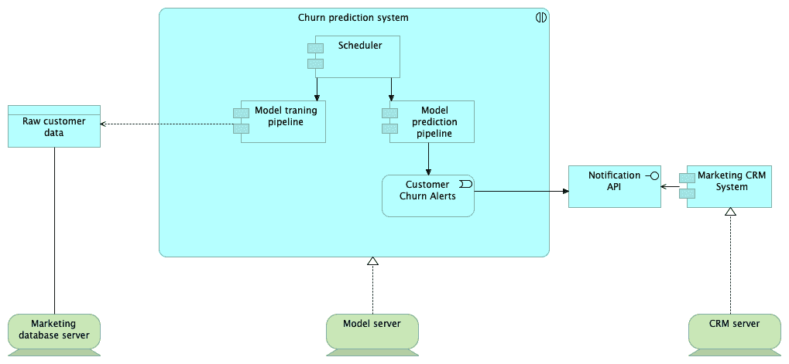

# 第十二章：构建你的技术栈

技术选择具有持久的影响。一个项目的技术栈决定了你系统的功能性和非功能性能力，因此做出慎重的选择至关重要。技术与需求之间的双向链接为通过对比技术特性与项目需求来选择不同技术提供了一种分析方法。在本章中，我们将看到如何利用软件设计实践来形成项目特定的技术栈，并且看到应该构成所有项目共享的核心技术栈的技术。我们还将探索一种方法，比较不同的技术，以便你可以在看似相似的选项之间做出理性的选择。

在本章中，我们将覆盖以下主题：

+   定义技术栈的元素

+   选择核心技术与项目特定技术之间的取舍

+   比较工具和产品

# 定义技术栈的元素

技术栈是你的团队用来交付产品和完成项目的一组工具。在选择技术时，你首先需要定义它们的目标，并全面记录所有的需求。从那里，你和你的团队可以清楚地了解哪些技术能帮助你实现最终目标。

构建技术栈与设计软件架构并行进行，因此你团队的工程师应从草拟一个能满足所有需求的系统设计开始。软件架构是一个广泛且深奥的技术话题，因此我们在本章中不会深入讨论。相反，我们将概述在选择最适合特定目标的技术时需要遵循的必要步骤。让我们开始吧：

1.  收集需求并明确地定义目标。

1.  为你的项目选择一组架构视图。架构视图包含了系统某些方面的视觉和文本描述。以下是架构视图的几个突出示例：

    +   **基础设施视图**：表示系统的物理部分。服务器、存储阵列和网络等都记录在此视图中。

    +   **组件视图**：表示你将要构建的软件系统的逻辑组件。组件视图应定义系统的独立部分以及它们之间的通信接口。

    +   **部署视图**：将组件视图的逻辑表示与基础设施视图的物理现实相匹配。部署视图应描述系统组件如何交付到相应的硬件上。

    +   **其他视图**：不同的软件架构设计方法定义了许多有用的视图。例如，ArchiMate 2.1 规范定义了 18 个架构视图，这些视图对于不同的利益相关者非常有用。为了简洁起见，我们将只讨论那些可能影响技术栈的主要视图，其他视图将省略。

1.  根据团队已产生的需求和软件设计，定义开发和运营系统时所需技术功能的列表。不要忘记包括那些能够优化系统实验、开发、交付和运营的横向技术。横向技术可能不会帮助你发现任何特定的功能需求，但它们对项目整体是有益的。例如，实验追踪框架、数据版本控制系统和**持续集成**/**持续部署**（**CI**/**CD**）服务器都是横向技术的例子。

作为一个示例，我们构建一个客户流失预测系统的技术栈。我们的客户已定义以下流失预测模块的需求列表。我们将省略技术细节，以便专注于整体流程：

1.  处理来自营销数据库的数据，其中包含客户信息。数据集的大小不超过 5 GB 的原始数据。

1.  每周一对客户流失预测模型进行训练。我们应当将一个月内未进行购买的客户视为流失客户。

1.  通过远程 API 调用通知团队潜在的客户流失情况。该服务应在工作日内可用。

分解将每个需求分类为两种类型：**功能需求**（**FR**）和**非功能需求**（**NFR**）。功能需求包括所有与系统功能相关的需求，这些功能影响核心用例和最终用户。非功能需求包括所有适用于系统的一般性需求，并定义系统运行的约束条件。服务级别协议和可用性要求是非功能需求的典型例子。

团队已经将客户需求分解成以下列表：

1.  **FR**：

    +   **FR1**：系统必须与客户的营销数据库进行集成。

    +   **FR2**：系统必须提供一个客户流失预测模型。我们可以将一个月内未进行购买的客户视为流失客户。

    +   **FR3**：系统必须调用远程 API，通知营销部门潜在的客户流失情况。

    +   **FR4**：模型应每周一执行一次。

1.  **NFR**：

    +   **NFR1**：系统应能够每周处理 5 GB 的数据。

    +   **NFR2**：API 应在工作日内可用。

根据这一需求列表，团队提出了以下系统设计，该设计采用 ArchiMate 2.1 符号，通过 Archi 软件绘制（[`www.archimatetool.com/`](https://www.archimatetool.com/)）：

上图由两个层次组成：基础设施层和软件实现层。

软件层描述了不同组件和服务之间的关系：

+   **原始客户数据：**代表流失预测系统所使用的原始数据。

+   **模型训练管道：** 表示一组数据处理和模型训练步骤，作为一个软件组件进行分组。

+   **模型预测管道：** 代表负责使用训练过的模型进行流失预测并生成客户流失警报的组件。

+   **调度器：** 按照预定的计划运行管道，协调其他组件的工作。

+   **客户流失警报：** 关于潜在客户流失的通知事件。

+   **营销 CRM 系统：** 客户的 CRM 系统，已经部署并投入生产使用。

+   **通知 API：** 一个服务，允许我们在 CRM 系统中创建关于客户的通知。

基础设施层，描述软件如何分配到特定硬件资源的物理结构，共有三部分：

+   **营销数据库服务器**

+   **模型服务器**

+   **CRM 服务器**

上述软件架构图为了简化起见，省略了许多技术细节，因为我们的目标是展示如何做出技术选择。接下来文本的核心思想不是加深你对软件架构这一广阔领域的知识，而是让你大致了解需求如何转化为合理的技术选择。理解这一过程可以帮助你引导你的专家团队做出高效的技术栈选择。项目对团队来说并不复杂，这项任务对他们来说相当标准。团队决定采用一套他们每个项目都使用的跨领域技术，作为公司标准：

+   Python 作为编程语言

+   Git 用于源代码版本控制

+   **数据版本控制** (**DVC**) 用于数据版本控制

+   GitLab CI/CD 作为 CI/CD 服务器

+   Jupyter Notebook 用于数据分析和可视化

为了实施 FR，团队决定使用以下技术：

+   **FR1**：用于数据库访问的 SQLAlchemy 库。

+   **FR2**：作为机器学习库的 scikit-learn。

+   **FR3**：API 调用请求。团队还决定使用单独的数据库来存储预测结果和模型执行日志。

+   **FR4**：团队决定使用 cron（一个流行的 Unix 调度程序，可以根据预定的调度表运行命令）作为主要的调度解决方案。

为了实施 NFR，团队决定执行以下操作：

+   **NFR1**：进行负载测试，并确定模型训练所需的最低服务器配置。从团队之前的经验来看，一台具有 8 核 CPU、1 GB 内存和 15 GB 硬盘的虚拟服务器应该足够，因此他们将该配置作为测试的基准。

+   **NFR2**：团队决定请求更详细的 API 使用信息，并询问每天预计的请求次数。结果发现，该 API 每天最多执行 10 次，因此单台 API 服务器就足以满足这一可用性要求。

在本节中，我们探讨了如何开发一个项目特定的技术栈。然而，还有另一个重要的维度是技术选择的关键：团队的专业知识和技能。在下一节中，我们将研究团队与项目技术栈之间的关系。

# 在核心技术与项目特定技术之间做出选择

技术选择应有助于实现项目需求，但同样重要的是要考虑团队的专业知识和能力，以及各种限制。例如，如果你的团队完全由 Python 开发者组成，即使团队认为 Julia 更适合该项目，选择 Julia 作为主要编程语言可能仍然是个糟糕的主意：

+   所有团队成员都会花时间学习一门新语言，从而几乎破坏了使用该技术所带来的所有生产力提升。

+   由于团队成员对新技术缺乏经验，团队的结论可能过于乐观。

如果团队持续培养成长型思维，并不断获得新知识，那么这两种风险会有所减缓，但永远不会完全消失。

团队的核心专业知识限制了项目中可以使用的技术。如果你希望拥有更多选择，单独开发一个团队技术栈就显得至关重要。持续的内部研究过程应确保你的核心技术栈保持最新。项目特定的技术栈可以通过调整核心技术栈以满足项目需求来形成。

我们可以将内部技术研究过程视为一个独立的长期项目，最好通过使用看板（Kanban）来管理：

1.  团队中的某个成员发现了一项潜在有用的技术。

1.  有经验的团队成员会迅速评估这项技术。如果技术看起来有前景，他们会将其放入内部研究积压任务中。

1.  一旦团队经理决定可以投入时间进行内部研究过程，他们便开始整理积压任务。在此过程中，团队根据**具体、可衡量、可实现、相关、时限**（**SMART**）标准来确定任务的优先级，并丰富任务定义。

1.  责任人从积压任务中选择一个单独的任务，并尽量快速完成。如果遇到阻塞问题，应立即报告并解决，最好在其他团队成员的帮助下完成。

1.  一旦研究完成，责任人会以文档或讲座的形式报告研究结果，以便团队决定是否将该技术纳入核心技术栈。

1.  如果决策是积极的，那么制定一个广泛的内部技术采纳教育计划就变得至关重要。此任务的主要成果是准备一个研讨会、指南、说明书或其他教育材料，以便新旧团队成员可以用来熟悉这项技术。

核心技术栈不应包含仅适用于少数项目的过于具体的技术。本文的唯一目的是帮助你的团队构建一个能够解决大多数项目需求的技术基础。你的团队关注的范围越广，核心技术栈应该越通用。如果整个团队正在构建特定的产品，那么项目特定的技术栈与核心技术栈将开始合并为一个整体。

将核心技术栈适配到新项目的过程如下：

1.  确定一组项目需求。

1.  查看核心技术栈满足的需求。

1.  如果核心技术栈违反了某些需求，寻找替代方案。

1.  如果核心技术栈无法满足某些需求，寻找可以集成到核心技术栈中的补充技术。

1.  在项目结束时，评估新添加到项目中的技术，判断它们是否适合核心技术栈。

使用这些流程，你可以将常常混乱且需求驱动的技术选择转化为一系列一致且合乎逻辑的步骤，从而做出有意义的决策。然而，即使是最细致的需求分解，仍然可能让你的团队在选择技术时感到困惑，因为不同框架、库和平台之间有许多交叉点和替代方案。在接下来的部分，我们将探讨如何从多种技术中做出选择。

# 比较工具和产品

*我们应该选择 R 还是 Python？* *TensorFlow 和 PyTorch 哪个更好？* 在互联网上可以找到关于做 Y 时选择 X 最好的无休止争论。那些讨论之所以不断进行，是因为技术世界没有万金油。每个专业团队都有其特定的使用案例，这使得某些技术选择对他们有效。没有任何一种技术能够满足所有人的需求。

X 与 Y 的争论常常发生在项目团队内部，这也是工程师们最浪费时间的活动。如果你试图将 X 与 Y 的辩论转变为寻找适合你具体需求的技术（这些需求已经明确、分类并文档化），你将在更短的时间内获得更有用的结果。选择最现代或最时尚的技术，对数据科学家和软件工程师来说，就像是玩俄罗斯轮盘。让我们探讨如何做出有关技术栈的深思熟虑的决策。

为了做出有意义的技术选择，你需要让这个过程更加系统化。首先，你需要制定一套比较标准，允许你对不同技术进行基准测试，并为研究活动提供模板。这些标准应该考察不同维度或需求群体，确保技术在你的具体案例中是有用的。

让我们通过案例研究来审视比较不同技术的具体细节。

# 案例研究 – 预测物流公司的需求

假设我们需要为我们的项目选择一个时间序列预测框架。我们的团队主要使用 Python，并需要提供一个能够为时间序列数据提供预测的工具。该系统的主要目标是预测公司运输的一组给定产品的需求。团队发现有很多不同的预测框架可供选择。

为了在这些产品之间做出选择，团队制定了以下比较标准：

| **ID** | **需求** **定义** | **理由** | **评分** | **优先级** |
| --- | --- | --- | --- | --- |
| **开发难易度** |
| D1 | 与 Python 兼容 | Python 是团队的主要编程语言。 | 3 | 必须 |
| D2 | 与 scikit-learn 接口兼容 | 团队在`scikit-learn`库方面有丰富的经验。如果时间序列预测库能够与`scikit-learn`兼容，将会是一个有利的功能。 | 2 | 重要 |
| D3 | 拥有良好的文档 |  | 1 | 补充 |
| D4 | 可以在不到 10 行代码内完成预测 |  | 1 | 补充 |
| D5 | 可以将时间序列作为原生数据类型处理 | 该框架应能处理原始时间序列数据，这样团队就不需要在数据集准备和特征工程上花费额外的时间。 | 2 | 重要 |
| **预测算法要求** |
| F1 | 无需手动调优超参数 | 由于该库将用于大量时间序列，手动调优模型不切实际。该工具应支持自动化的超参数调优，或者在选择超参数时具备良好的鲁棒性，从而在默认设置下提供良好的预测结果。 | 3 | 必须 |
| F2 | 提供多种预测方法 | 提供多种预测方法将使我们能够评估多个模型，并选择最适合每个特定时间序列的模型。 | 1 | 补充 |
| F3 | 支持季节性时间序列 | 客户数据中的所有时间序列都有季节性模式。 | 3 | 必须 |
| F4 | 提供置信区间以及预测值 | 置信区间可用于为每个预测提供不确定性范围，这是客户认为一个有用的功能。 | 2 | 重要 |
| **性能和数据要求** |
| P1 | 可以在 15 秒内预测具有 100 个数据点的时间序列 | 大量的时间序列限制了我们在单一时间序列上可以花费的总时间。 | 2 | 重要 |
| P2 | 可以处理具有可变长度和缺失数据的时间序列 | 数据质量不理想，数据中存在一些缺口。一些项目的历史数据比其他项目多。 | 2 | 重要 |

上述比较表包含以下列：

+   **ID**：这可以作为技术比较表中的简短标识符（下文提供）。

+   **需求定义**：这应该描述感兴趣的能力。

+   **替代方案**：这应该提供需求背后的动机。

+   **得分**：显示需求的相对重要性，并将用于总结每个需求类别。

+   **优先级**：表示每个需求的必要性，并将为每项技术提供额外的得分。

接下来，团队已经准备了一个框架比较列表，如下所示：

+   **Pmdarima** ([`www.alkaline-ml.com/pmdarima/`](https://www.alkaline-ml.com/pmdarima/))

+   **statsmodels.tsa** ([`www.statsmodels.org/stable/tsa.html`](https://www.statsmodels.org/stable/tsa.html))

+   **Prophet** ([`github.com/facebook/prophet`](https://github.com/facebook/prophet))

+   **LightGBM** ([`lightgbm.readthedocs.io/en/latest/`](https://lightgbm.readthedocs.io/en/latest/)) 和 **tsfresh** ([`tsfresh.readthedocs.io/en/latest/`](https://tsfresh.readthedocs.io/en/latest/))

团队还制定了以下比较表格：

|  |
| --- |
|  | **框架** | **D1 (M)** | **D2 (I)** | **D3 (S)** | **D4 (S)** | **D5 (I)** | **F1 (M)** | **F2 (S)** | **F3 (M)** | **F4 (I)** | **P1 (I)** | **P2 (I)** | **pmdarima** | 3 | 2 | 0 | 2 | 3 | 3 | 0 | 3 | 2 | 0 | 0 | **statsmodels.tsa** | 3 | 0 | 2 | 0 | 3 | 0 | 1 | 3 | 2 | 2 | 0 | **Prophet** | 3 | 0 | 2 | 2 | 3 | 3 | 0 | 3 | 2 | 0 | 2 | **LightGBM** 和 **tsfresh** | 3 | 2 | 2 | 0 | 0 | 0 | 0 | 3 | 0 | 2 | 0 |  |
|  |

该表格还可以进一步总结，给出以下最终结果：

| **框架** | **开发难度得分** | **预测算法要求得分** | **性能和数据要求得分** | **满足强制性要求** | **满足重要要求** | **满足补充要求** |
| --- | --- | --- | --- | --- | --- | --- |
| **pmdarima** | 10/12 | 8/9 | 0/4 | 3/3 | 3/5 | 1/3 |
| **statsmodels.tsa** | 8/12 | 6/9 | 2/4 | 2/3 | 3/5 | 2/3 |
| **Prophet** | 10/12 | 8/9 | 2/4 | 3/3 | 3/5 | 2/3 |
| **LightGBM** 和 **tsfresh** | 7/12 | 3/9 | 2/4 | 2/3 | 2/5 | 1/3 |

如果愿意，你可以使用加权平均法将每个框架的得分总结为一个数字。然而，请记住，简化复杂决策为一个数字如果做得不对，可能会导致错误。

这些研究结果表明，根据初步需求，Prophet 被认为是更好的选择。然而，这些结果并不意味着 Prophet 是所有应用的最佳选择。技术选择应该有一定的偏向和观点，因为没有任何技术能适用于所有项目。例如，如果团队考虑了期望的平均指标值，排名可能会完全不同。在这种情况下，其他框架可能会因为提供了更准确的模型而获胜。

# 摘要

在本章中，我们已经看到了如何根据技术的需求来选择技术，而不是根据其周围的炒作。我们还探讨了如何构建需求，并从软件架构中推导出技术栈的主要元素。最后，我们讨论了核心技术栈和项目特定技术栈之间的区别，并考察了一种分析方法来比较不同的技术。

下一章将会总结本书的内容；恭喜你完成了本书的阅读！
