# 第一章：什么是 Matplotlib？

Matplotlib 是一个用于数据可视化的 Python 包。它允许轻松创建各种图形，包括线形图、散点图、柱状图、箱线图和径向图，并具有高度的灵活性，支持精细的样式定制和注释。多功能的 `artist` 模块允许开发者定义几乎任何类型的可视化。对于常规使用，Matplotlib 提供了一个简洁的面向对象接口——`pyplot` 模块，用于简单绘图。

除了生成静态图形，Matplotlib 还支持交互式接口，不仅有助于创建各种各样的图表，还非常适合用于创建基于 Web 的应用程序。

Matplotlib 可以方便地与流行的开发环境（如 Jupyter Notebook）集成，并且支持许多更高级的数据可视化包。

# Matplotlib 的优点

使用代码创建数据可视化有许多优势，因为可视化流程能够顺利融入结果生成流程的一部分。让我们来看看 Matplotlib 库的一些关键优点。

# 易于使用

Matplotlib 绘图库有多种易用方式：

+   首先，面向对象的模块结构简化了绘图过程。通常情况下，我们只需要调用 `import matplotlib.pyplot as plt` 来导入绘图 API，从而创建并自定义许多基本图形。

+   Matplotlib 与两个常见的数据分析包——pandas 和 NumPy——高度集成。例如，我们可以简单地将 `.plot()` 附加到 pandas DataFrame 上，例如通过 `df.plot()` 创建一个简单的图表，并使用 Matplotlib 语法自定义其样式。

+   在样式方面，Matplotlib 提供了可以修改每个特征外观的函数，并且也有现成的默认样式表，以避免在不需要精细美学的情况下进行这些额外步骤。

# 多样的图形类型

在数据分析中，我们常常需要复杂的图形来表达数据。Matplotlib 本身提供了许多绘图 API，并且还是一系列第三方包的基础，这些包提供了额外的功能，包括：

+   **Seaborn**：提供简单的绘图 API，包括一些高级图形类型，具有美观的默认样式

+   **HoloViews**：根据捆绑数据创建带有元数据注释的交互式图形

+   **Basemap/GeoPandas/Canopy**：将数据值映射到地理地图上的颜色

我们将在后续章节中学习这些第三方包在高级绘图中的一些应用。

# 核心可操作（仅在需要时）

当我们想要超越默认设置，确保生成的图形满足我们特定的需求时，可以自定义每个图形特征的外观和行为：

+   可以进行逐元素样式定制

+   将数据值绘制为颜色并绘制任何形状的补丁的能力，使得几乎可以创建任何类型的可视化

+   在自定义由 Seaborn 等扩展创建的图形时非常有用

# 开源与社区支持

由于 Matplotlib 是开源的，它使得开发者和数据分析师可以免费使用它。用户还可以自由地改进和贡献 Matplotlib 库。作为开源体验的一部分，用户可以在各种平台和论坛上从全球社区成员那里获得及时的在线支持。

# Matplotlib 2.x 中的新特性？

Matplotlib 从 1.2 版本（发布于 2013 年）开始支持 Python 3。Matplotlib 2.0 版本引入了许多变化和升级，以改善数据可视化项目的效果。让我们来看一下其中的一些关键改进和升级。

# 改进的功能和性能

Matplotlib 2.0 提供了新的功能，改善了用户体验，包括速度、输出质量和资源使用。

# 改进的颜色转换 API 和 RGBA 支持

Matplotlib 2.0 完全支持指定透明度级别的 alpha 通道。

# 改进的图像支持

Matplotlib 2.0 现在使用更少的内存和数据类型转换来重新采样图像。

# 更快的文本渲染

社区开发者声称，`Agg` 后端的文本渲染速度提高了 20%。

# 默认动画编解码器的更改

现在默认使用一个非常高效的编解码器 H.264，替代了 MPEG-4，用于为动画图表生成视频输出。借助 H.264，我们现在可以实现更长的录像时间，更少的数据流量和加载时间，这得益于更高的压缩率和更小的输出文件大小。还注意到，H.264 视频的实时播放优于那些采用 MPEG-4 编码的视频。

# 默认样式的变化

有许多样式上的变化，旨在改善可视化效果，例如默认的颜色更加直观。我们将在图表美学章节中详细讨论这些变化。

有关所有 Matplotlib 更新的详细信息，请访问 [`matplotlib.org/devdocs/users/whats_new.html`](http://matplotlib.org/devdocs/users/whats_new.html)。

# Matplotlib 网站和在线文档

作为开发者，你可能已经认识到阅读文档和手册以熟悉语法和功能的重要性。我们想再次强调阅读库文档的重要性，并鼓励你也这样做。你可以在这里找到文档：[`matplotlib.org`](https://matplotlib.org/)。在官方的 Matplotlib 网站上，你可以找到每个函数的文档，最新版本的新闻和正在进行的开发，以及第三方包的列表，还有教程和示例图表的图库。

然而，通过从头开始阅读文档来构建高级和复杂的图表意味着更陡峭的学习曲线，并且会花费更多的时间，尤其是在文档不断更新以便更好地理解的情况下。本书旨在为读者提供一份引导式的路线图，以加速学习过程，节省时间和精力，并将理论付诸实践。在线手册可以作为你随时查阅的地图，帮助你进一步探索。

Matplotlib 的源代码可在 GitHub 上找到，网址为[`github.com/matplotlib/matplotlib`](https://github.com/matplotlib/matplotlib)。我们鼓励读者将其分叉并加入自己的创意！

# 输出格式和后端

Matplotlib 使用户能够将输出图表获取为静态图像。通过交互式后端，图表也可以被管道化并变得响应式。

# 静态输出格式

静态图像是报告和演示中最常用的输出格式，也是我们快速检查数据的常见方式。静态图像可以分为两类。

# 栅格图像

Raster 是经典的图像格式，支持多种图像文件，包括 PNG、JPG 和 BMP。每个栅格图像可以视为一个密集的颜色值数组。对于栅格图像，分辨率非常重要。

图像细节的保留量通过**每英寸点数**（**DPI**）来衡量。DPI 值越高（即保留的像素点越多），即使图像被拉伸到更大尺寸，图像也会更加清晰。当然，相应的文件大小和渲染所需的计算资源也会增加。

# 向量图像

对于向量图像，信息不是以离散的颜色点矩阵的形式保存，而是作为路径保存，路径是连接点的线条。它们可以无失真地缩放：

+   SVG

+   PDF

+   PS

# 设置 Matplotlib

现在我们已经全面了解了 Matplotlib 的功能和特性，接下来我们可以开始实际操作，完成一些示例。在开始之前，我们需要确保已经设置好 Matplotlib 环境。请按照之前讨论的步骤来设置环境。

# 安装 Python

从 2.0 版本开始，Matplotlib 支持 Python 2.7 和 3.4+。本书使用的是 Python 3，这是最新的稳定版 Python。你可以从[`www.python.org/download/`](http://www.python.org/download/)下载 Python。

# Windows 上的 Python 安装

Python 在 Windows 上提供安装程序或压缩的源代码。我们推荐使用可执行安装程序。选择适合你计算机架构的版本，以获得最佳性能。你可以通过按下 Windows + *R* 键并输入`cmd.exe`来调用 Python，如下图所示：

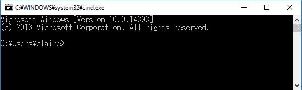

# macOS 上的 Python 安装

macOS 默认自带 Python 2.7。若要安装 Python 3.4+，请下载安装向导并按照指示进行安装。以下是向导第一步的截图：

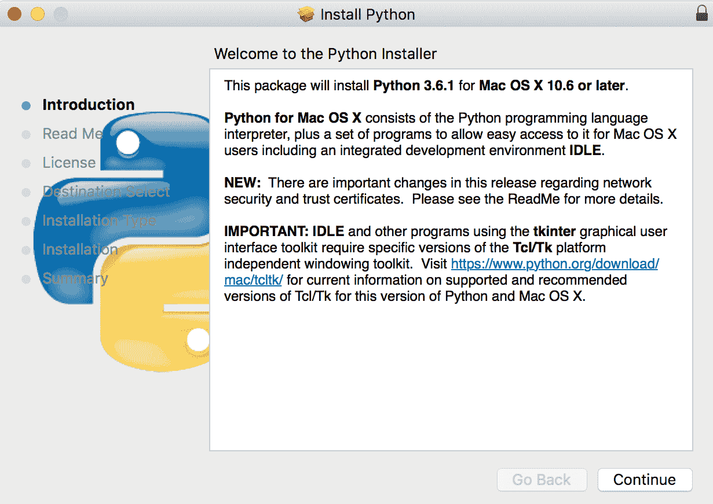

某些 Python 包需要 Xcode 命令行工具才能正确编译。Xcode 可以从 Mac App Store 获得。要安装命令行工具，请在终端中输入以下命令：`xcode-select --install`，然后按照提示进行安装。

# Linux 上的 Python 安装

大多数 Linux 发行版预装了 Python 3.4。您可以通过在终端中输入 `python3` 来确认。如果看到以下内容，则表示已安装 Python 3.4：

```py
Python 3.6.3 (default, Oct 6 2017, 08:44:35) [GCC 5.4.0 20160609] on linux Type "help", "copyright", "credits" or "license" for more information. >>>​
```

如果命令行中没有出现 Python shell，您可以通过 `apt`，即 Linux 软件管理工具，安装 Python 3：

```py
sudo apt update
sudo apt install Python3 build-essential
```

`build-essential` 包包含用于构建非纯 Python 包的编译器。同时，如果您使用的是 Ubuntu 14.04 或更早版本，可能需要将 `apt` 替换为 `apt-get`。

# 安装 Matplotlib

Matplotlib 需要大量的依赖项。我们建议通过 Python 包管理器安装 Matplotlib，这将帮助您在每次安装或升级包时自动解决并安装依赖项。我们将演示如何使用`pip`安装 Matplotlib。

# 关于依赖项

Matplotlib 依赖许多 Python 包进行后台计算、图形渲染、交互等。它们包括 NumPy、libpng 和 FreeType 等。根据使用情况，用户可以安装额外的后台包，例如 PyQt5，以获得更好的用户界面。

# 安装 `pip` Python 包管理器

我们建议使用 Python 包管理器 `pip` 安装 Matplotlib；它会自动解析基础依赖项。`pip` 已与 `Python 2 >= 2.7.9` 或 `Python 3 >= 3.4` 二进制文件一起安装。

如果没有安装 `pip`，您可以通过下载 `get-pip.py` 文件（[`bootstrap.pypa.io/get-pip.py`](http://bootstrap.pypa.io/get-pip.py)），并在控制台中运行它进行安装：

```py
python3 get-pip.py
```

要将 `pip` 升级到最新版本，请执行以下操作：

```py
pip3 install --upgrade pip
```

`pip` 的文档可以在 [`pip.pypa.io`](http://pip.pypa.io/) 找到。

# 使用 `pip` 安装 Matplotlib

在终端/命令提示符中输入 `python3 -m pip install matplotlib` 进行安装。如果是没有 root/admin 权限的用户，安装时请根据需要添加 `--user` 选项。

# 设置 Jupyter Notebook

为了创建我们的图表，我们需要一个用户友好的开发环境。

Jupyter Notebook 提供了一个交互式编码环境，您可以编辑和运行代码，显示结果，并整洁地记录它们。数据和方法可以加载到内存中，在会话内重复使用。由于每个 Notebook 都作为 Web 服务器托管，您可以在浏览器中连接到远程服务器上运行的 Notebook 实例。

如果您迫不及待想在安装前试用，您可以访问 [`try.jupyter.org`](https://try.jupyter.org/) 并打开一个 Python 3 的 Notebook。

要安装 Jupyter，请在控制台中输入以下命令：

```py
python3 -m pip install jupyter
```

# 启动 Jupyter Notebook 会话

只需在控制台中输入 `jupyter notebook`。这将作为 Web 服务器启动 Jupyter Notebook 会话。

默认情况下，Notebook 会在您的默认浏览器中弹出。如果需要手动打开页面，请在浏览器中输入 `localhost:8888` 作为网址。然后，您将进入 Jupyter Notebook 的首页：

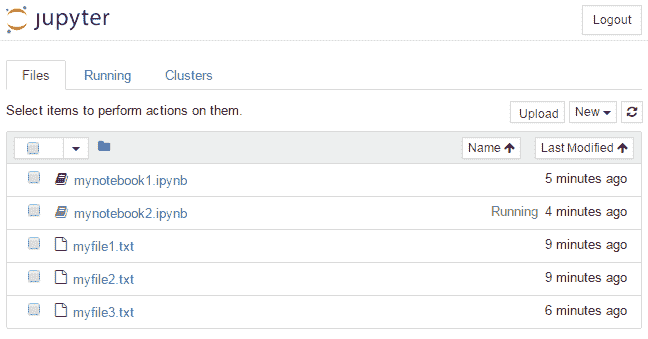

你可以选择将笔记本托管在不同的端口上，例如当你运行多个笔记本时。你可以使用`--port=<自定义端口号>`选项来指定使用的端口。

自 4.3 版本发布以来，Jupyter 已增加了令牌身份验证，因此在进入笔记本主页之前，你可能会被要求提供令牌密码，如下图所示：

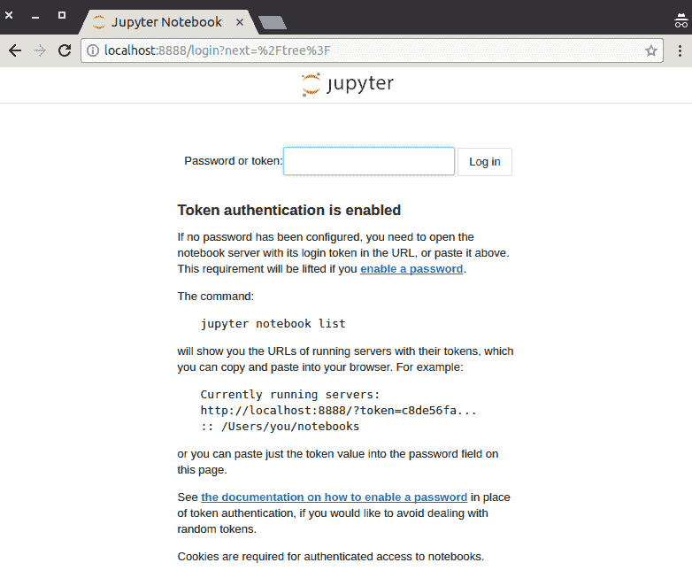

要获取令牌，例如当你从其他浏览器或机器访问正在运行的笔记本时，你可以从控制台调用`jupyter notebook list`：

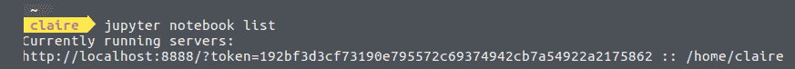

# 在远程服务器上运行 Jupyter Notebook

要打开运行在远程服务器上的笔记本，你可以在 SSH 时设置端口转发，方法如下：

```py
ssh –L 8888:localhost:8888 mary@remoteserver
```

然后你可以再次使用 `localhost:8888` 作为 URL 打开笔记本。

当多个用户在同一服务器的同一端口（比如默认的`8888`端口）上运行 Jupyter Notebooks，并且每个用户都使用相同的端口转发时，可能会出现将你的笔记本内容转发到其他用户的情况，而他们无法查看自己的内容，除非更改端口。尽管这个问题可能会在后续版本中修复，但建议更改默认端口。

要从先前版本升级，请运行以下命令：

```py
pip3 install --upgrade matplotlib
```

`pip`将自动为你收集并安装 Matplotlib 的依赖。

# 编辑并运行代码

一个 Jupyter Notebook 包含称为 **单元格** 的框。默认情况下，它以代码编辑的文本输入区开始，称为灰色框单元格。要插入和编辑代码，请按以下步骤操作：

1.  点击灰色框内。

1.  在其中输入你的 Python 代码。

1.  点击播放按钮或按 *Shift* + *Enter* 运行当前单元格并将光标移动到下一个单元格：


一旦执行一个单元格，相关的数据和方法将被加载到内存中，并且可以在同一笔记本内核的不同单元格间使用。除非有特定更改，否则无需重新加载。这节省了调试和重新加载大型数据集的时间和精力。

# 操作笔记本内核和单元格

你可以使用顶部的工具栏来操作单元格和内核。可用的 功能 如下所示：

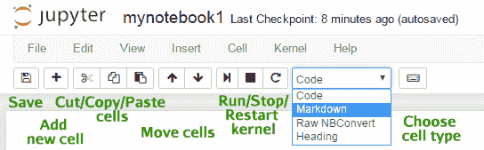

在运行单元格之前验证输出量！巨大的输出流通常不会导致控制台崩溃，但它很容易在几秒钟内使你的浏览器和笔记本崩溃。自 Jupyter 4.2 以来，已通过停止大量输出来解决这个问题。然而，它并不能保证捕捉所有不停的输出。因此，建议读者保持谨慎，避免尝试在单元格中获取大量输出结果。考虑将其分片查看，或将输出保存到其他文件中：

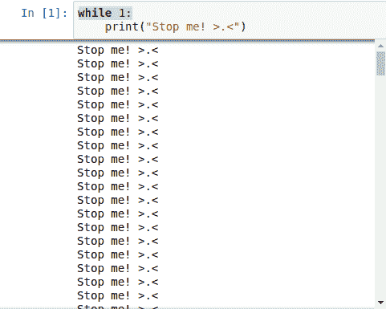

# 嵌入你的 Matplotlib 图表

Matplotlib 与 Jupyter Notebook 高度集成。使用 Jupyter 内置的 *magic* 命令 `％matplotlib inline`（在当前版本中默认设置）将结果图表显示为每个单元的静态图像输出：

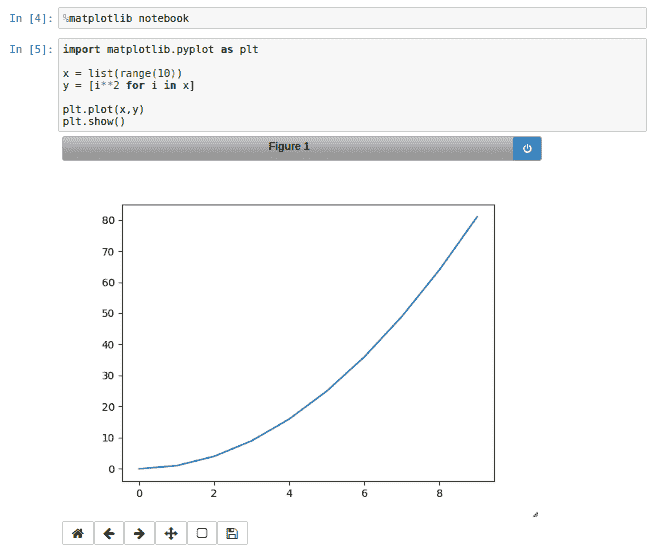

或者，你可以运行一个魔法单元命令—`%matplotlib notebook` 来使用交互式 Matplotlib 图形用户界面，以便在相同的输出区域进行缩放或旋转：


# 使用 Markdown 进行文档编写

Jupyter Notebook 支持 Markdown 语法来组织文档：

1.  从工具栏中的下拉列表中选择 Markdown。

1.  在灰色输入框中写下你的笔记。

1.  点击运行或 *Shift* + *Enter*：

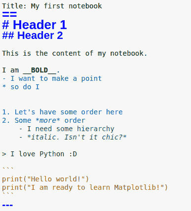

运行单元后，文本将在显示中以样式呈现：

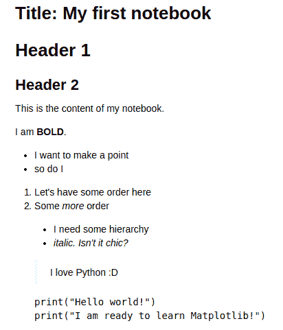

你可以在 [`github.com/adam-p/markdown-here/wiki/Markdown-Cheatsheet`](https://github.com/adam-p/markdown-here/wiki/Markdown-Cheatsheet) 上找到 Adam Pritchard 提供的详细 Markdown 备忘单。

# 保存你的辛勤工作！

Jupyter Notebook 每 2 分钟自动保存一次。作为良好的实践，你应该通过点击工具栏上的软盘图标，或更方便地使用 *Ctrl* + *S* 更频繁地保存它。

你在 Jupyter 上打开的每个项目都会以基于 JSON 的 `.ipynb` 笔记本格式保存：

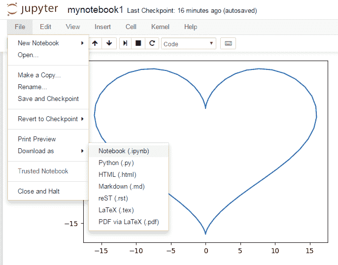

`.ipynb` 笔记本可以跨不同的 Jupyter 服务器移植。笔记本可以导出为基本可运行的 Python 脚本 `.py`、用于文档的 Markdown `.md`，以及网页格式 `.html`，便于项目流程的即时展示，而无需读者提前安装 Jupyter Notebook。它还支持 LaTex 格式和通过安装依赖项 Pandoc 进行 PDF 转换。如果你感兴趣，可以查看安装说明：[`pandoc.org/installing.html`](http://pandoc.org/installing.html)。

# 总结

哇哦！我们已经迈出了在 Matplotlib 旅程中的第一步。你可以放心地知道，你已经全面了解了 Matplotlib 的功能，并且已经设置好了必要的环境。现在，我们已经成功涉足数据可视化并打下了基础，让我们继续构建我们的第一个图表吧！
