# 第四章：高级 Matplotlib

在之前的章节中，我们学习了基础的 Matplotlib API 的多种用法，可以创建并自定义各种类型的图表。为了为我们的数据创建更合适的可视化图形，还有一些更高级的技术来制作更精细的图形。实际上，我们不仅可以利用原生的 Matplotlib 功能，还可以利用一些建立在 Matplotlib 之上的第三方包。这些包提供了创建更加先进且默认具有美学样式的图形的简便方法。我们可以利用 Matplotlib 技术进一步优化我们的数据图形。

在本章中，我们将进一步探索 Matplotlib 的高级用法。我们将学习如何将多个相关图表分组为一个图形中的子图，使用非线性坐标轴比例，绘制图像，并在一些流行的第三方包的帮助下创建高级图表。以下是我们将涵盖的详细主题列表：

+   绘制子图

+   使用非线性坐标轴比例

+   绘制图像

+   使用 Pandas-Matplotlib 绘图集成

    +   双变量数据集的六边形图

+   使用 Seaborn 构建：

    +   用于双变量数据的核密度估计图

    +   有/无层次聚类的热图

    +   使用 `mpl_finance` 绘制金融数据

+   使用 `Axes3D` 进行 3D 绘图

+   使用 Basemap 和 GeoPandas 可视化地理数据

# 绘制子图

在设计视觉辅助工具的布局时，通常需要将多个相关的图形组织到同一个图形中的面板中，比如在展示同一数据集的不同方面时。Matplotlib 提供了几种方法来创建具有多个子图的图形。

# 使用 `plt.figure()` 初始化图形

`plt.figure()` API 是用来初始化图形的 API，它作为绘图的基础画布。它接受参数来确定图形的数量以及绘图图像的大小、背景颜色等参数。调用时，它会显示一个新的区域作为绘制 `axes` 的画布。除非添加其他绘图元素，否则不会得到任何图形输出。如果此时调用 `plt.show()`，将会返回一个 Matplotlib `figure` 对象，如下图所示：

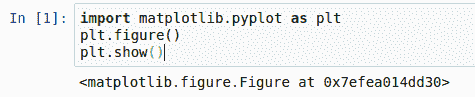

当我们绘制简单图形时，如果只涉及单个图表且不需要多个面板，可以省略调用 `plt.figure()`。如果没有调用 `plt.figure()` 或没有给 `plt.figure()` 传递参数，则默认会初始化一个单一图形，相当于 `plt.figure(1)`。如果图形的比例非常关键，我们应该通过传递一个 `(width, height)` 元组作为 `figsize` 参数来调整它。

# 使用 `plt.subplot()` 初始化子图作为坐标轴

要初始化实际框住每个图形的坐标轴绘图实例，我们可以使用`plt.subplot()`。它需要三个参数：行数、列数和图号。当总图形数量少于 10 时，我们可以省略输入参数中的逗号。这里是一个代码示例：

```py
import matplotlib.pyplot as plt
# Initiates a figure area for plotting
fig = plt.figure()

# Initiates six subplot axes
ax1 = plt.subplot(231)
ax2 = plt.subplot(232)
ax3 = plt.subplot(233)
ax4 = plt.subplot(234)
ax5 = plt.subplot(235)
ax6 = plt.subplot(236)

# Print the type of ax1
print(type(ax1))

# Label each subplot with corresponding identities
ax1.text(0.3,0.5,'231',fontsize=18)
ax2.text(0.3,0.5,'232',fontsize=18)
ax3.text(0.3,0.5,'233',fontsize=18)
ax4.text(0.3,0.5,'234',fontsize=18)
ax5.text(0.3,0.5,'234',fontsize=18)
ax6.text(0.3,0.5,'236',fontsize=18)

plt.show()
```

上面的代码生成了以下图形。请注意子图是从左到右、从上到下排列的。在添加实际的绘图元素时，必须相应地放置它们：

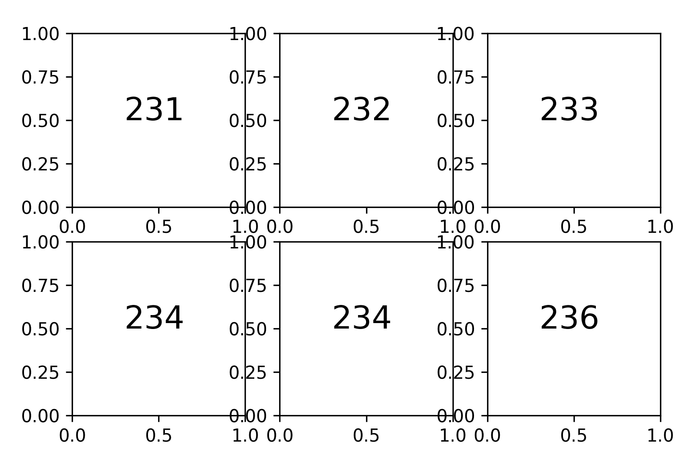

还需要注意的是，打印其中一个坐标轴的类型会返回`<class 'matplotlib.axes._subplots.AxesSubplot'>`作为结果。

# 使用`plt.figure.add_subplot()`添加子图

在`plt.figure()`下，有一个类似于`plt.subplot()`的`add_subplot()`函数，允许我们在同一个图形下创建额外的子图。与`plt.subplot()`类似，它接受行号、列号和图号作为输入参数，并且对于少于 10 个子图时，可以省略输入参数中的逗号。

我们还可以使用这个函数来初始化第一个子图。下面是一个快速的代码示例：

```py
import matplotlib.pyplot as plt

fig = plt.figure()
ax = fig.add_subplot(111) 

plt.show()
```

这将创建一个空白的绘图区域，四个边框包含了*x*轴和*y*轴，如下所示。请注意，我们必须在`figure`下调用`add_subplot()`函数，而不是通过`plt`：

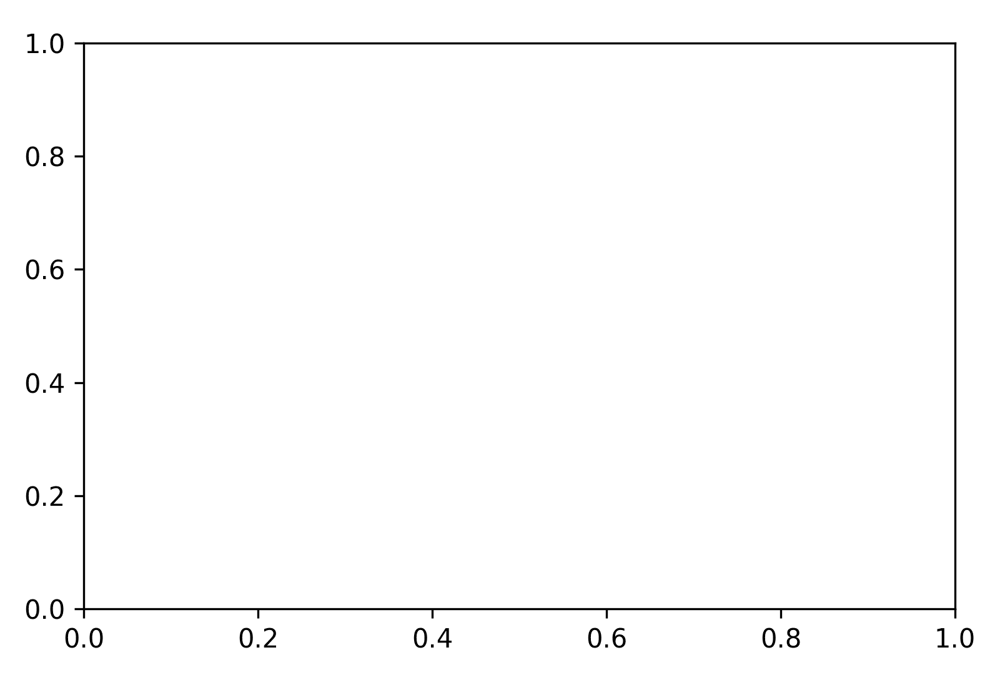

让我们进一步比较`fig.add_subplot()`和`plt.subplot()`之间的区别。在这里，我们将创建三个不同大小和面色的空子图。

我们将首先尝试使用`fig.add_subplot()`：

```py
import matplotlib.pyplot as plt

fig = plt.figure()
ax1 = fig.add_subplot(111,facecolor='red')
ax2 = fig.add_subplot(121,facecolor='green')
ax3 = fig.add_subplot(233,facecolor='blue')

plt.show()
```

我们在同一图形上得到三个重叠的子图，如下所示：

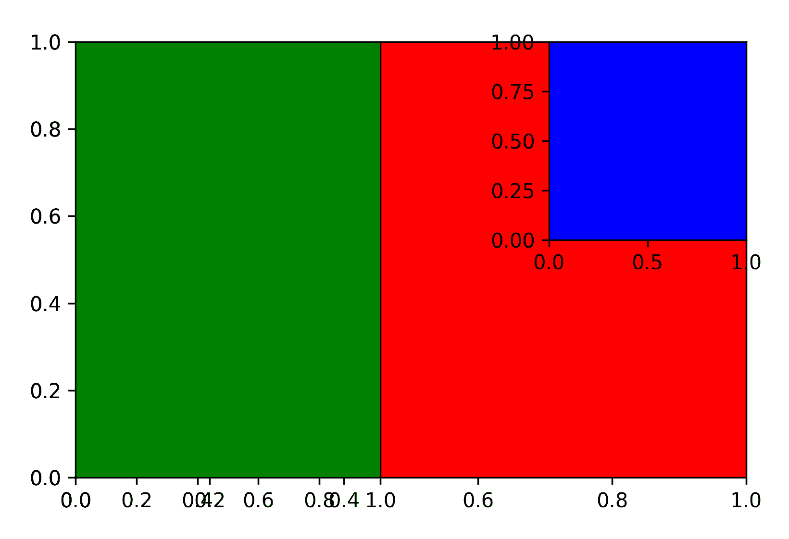

接下来，我们将`fig.add_subplot()`替换为`plt.subplot()`：

```py
import matplotlib.pyplot as plt

fig = plt.figure() # Note this line is optional here
ax1 = plt.subplot(111,facecolor='red')
ax2 = plt.subplot(121,facecolor='green')
ax3 = plt.subplot(233,facecolor='blue')

plt.show()
```

请注意，在以下图片中，红色的`ax1`子图无法显示：

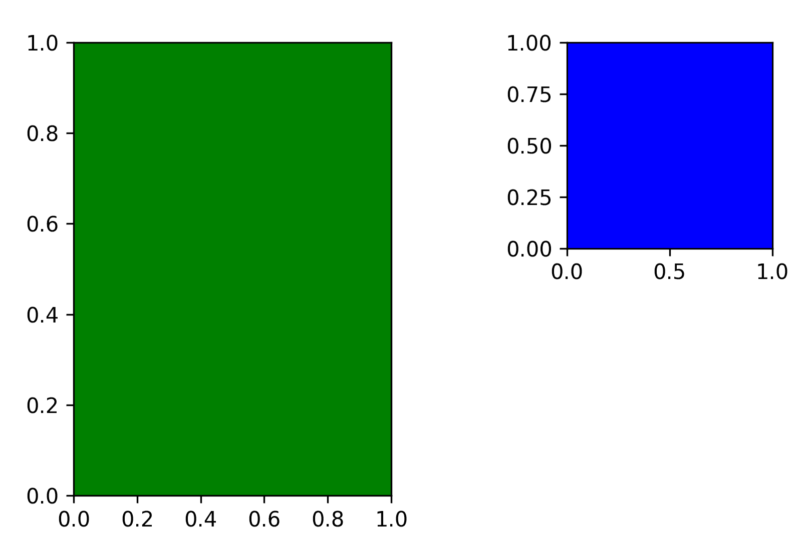

如果我们已经使用`plt.subplot()`绘制了第一个子图，并且想要创建更多的子图，可以调用`plt.gcf()`函数来获取`figure`对象并将其存储为变量。然后，我们可以像之前的示例一样调用`fig.add_subplot()`。

因此，以下代码是一种生成三个重叠子图的替代方法：

```py
import matplotlib.pyplot as plt

ax1 = plt.subplot(111,facecolor='red')
fig = plt.gcf() # get current figure
ax2 = fig.add_subplot(121,facecolor='green')
ax3 = fig.add_subplot(233,facecolor='blue')

plt.show()
```

# 使用`plt.subplots()`初始化一组子图

当我们需要创建大量相同大小的子图时，逐个使用`plt.subplot()`或`fig.add_subplot()`函数生成它们会非常低效。在这种情况下，我们可以调用`plt.subplots()`一次性生成一组子图。

`plt.subplots()`接受行数和列数作为输入参数，并返回一个`Figure`对象以及存储在 NumPy 数组中的子图网格。当没有输入参数时，`plt.subplots()`默认等同于`plt.figure()`加上`plt.subplot()`。

这是一个演示用的代码片段：

```py
import matplotlib.pyplot as plt

fig, axarr = plt.subplots(1,1)
print(type(fig))
print(type(axarr))

plt.show()
```

从结果截图中，我们可以观察到`plt.subplots()`也返回了`Figure`和`AxesSubplot`对象：

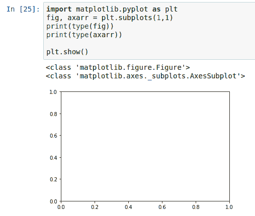

下一个示例演示了`plt.subplots()`的更有用的应用案例。

这次，我们将创建一个 3x4 子图的图形，并在一个嵌套的`for`循环中标记每个子图：

```py
import matplotlib.pyplot as plt

fig, axarr = plt.subplots(3,4)
for i in range(3):
    for j in range(4):
        axarr[i][j].text(0.3,0.5,str(i)+','+str(j),fontsize=18)

plt.show()
```

再次，我们可以从这个图形中观察到，子图是按行排列，然后是列排列的，就像之前的示例所示：

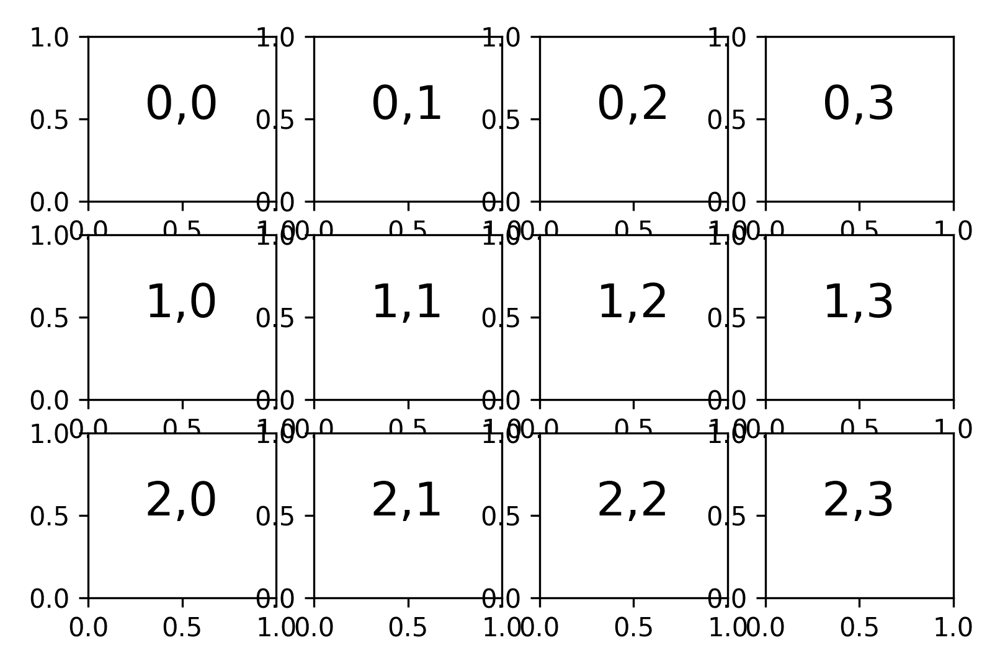

也可以只向`plt.subplots()`提供一个输入参数，这将被解释为指定数量的子图，垂直堆叠在行中。由于`plt.subplots()`函数本质上包含了`plt.figure()`函数，我们还可以通过向`figsize`参数提供输入来指定图形尺寸：

```py
import numpy as np
import matplotlib.pyplot as plt

x = np.arange(0.0, 1.0, 0.01)
y1 = np.sin(8*np.pi*x)
y2 = np.cos(8*np.pi*x)

# Draw 1x2 subplots
fig, axarr = plt.subplots(2,figsize=(8,6))

axarr[0].plot(x,y1)
axarr[1].plot(x,y2,'red')

plt.show()
```

请注意，`axarr`的类型是`<class 'numpy.ndarray'>`。

上述代码会产生一个包含两行子图的图形：

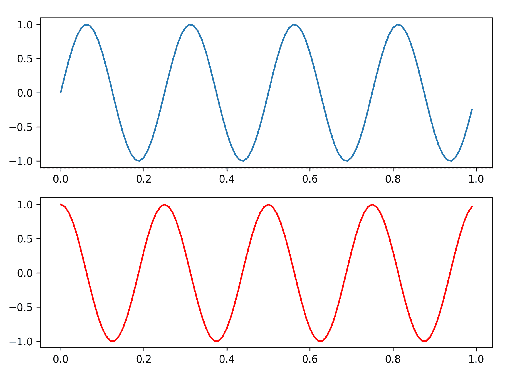

# 共享轴

当使用`plt.subplots()`时，我们可以指定子图应共享* x *轴和/或* y *轴，以避免混乱。

回到之前的 3x4 子图示例，假设我们通过提供`sharex=True`和`sharey=True`作为参数，在`plt.subplots()`中启用共享轴选项，如下所示：

```py
fig, axarr = plt.subplots(3,4,sharex=True,sharey=True)
```

现在我们得到如下图形。与之前的示例相比，子图的轴标签被移除，除了最左边和最下面的标签，看起来更加整洁：

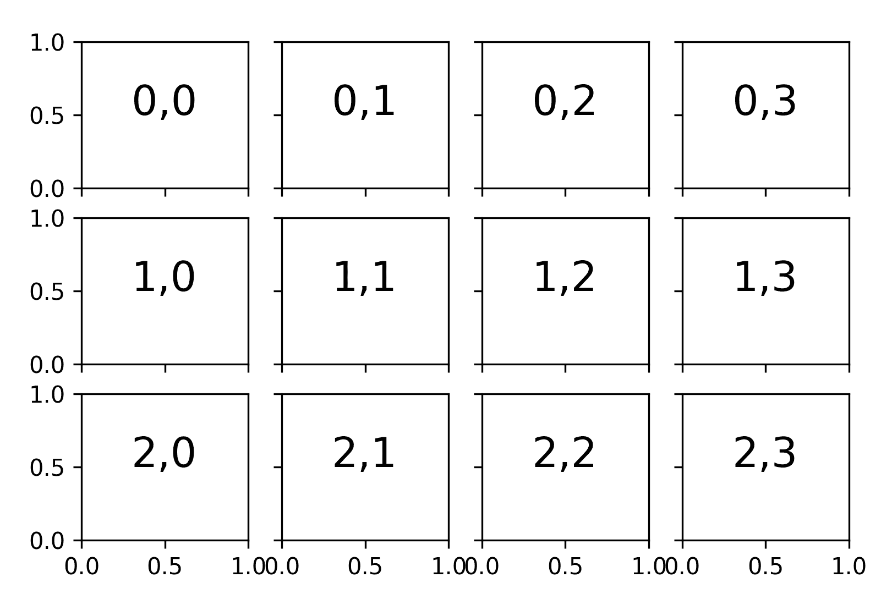

# 使用`plt.tight_layout()`设置边距

接下来，我们可以调整对齐方式。我们可能希望调整每个子图之间的边距，或者干脆不留边距，而是避免出现行和列之间的离散框。此时，我们可以使用`plt.tight_layout()`函数。默认情况下，当没有提供参数时，它会将所有子图适应到图形区域内。它接受关键字参数`pad`、`w_pad`和`h_pad`来控制子图周围的填充。让我们看一下下面的代码示例：

```py
import matplotlib.pyplot as plt

fig, axarr = plt.subplots(3,4,sharex=True,sharey=True)
for i in range(3):
    for j in range(4):
        axarr[i][j].text(0.3,0.5,str(i)+','+str(j),fontsize=18)

plt.tight_layout(pad=0, w_pad=-1.6, h_pad=-1)
```

从下面的图形中，我们可以看到现在子图之间没有间距，但轴刻度有些重叠。

我们将在后续部分学习如何调整刻度属性或移除刻度：

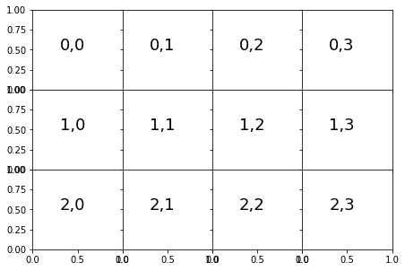

# 使用`plt.subplot2grid()`对不同尺寸的子图进行对齐

虽然`plt.subplots()`提供了一种方便的方法来创建大小相同的子图网格，但有时我们可能需要将不同大小的子图组合在一起。这时`plt.subplot2grid()`就派上用场了。

`plt.subplot2grid()`接受三个到四个参数。第一个元组指定网格的整体尺寸。第二个元组确定子图左上角在网格中的起始位置。最后，我们使用`rowspan`和`colspan`参数描述子图的尺寸。

下面是一个代码示例，展示了如何使用这个函数：

```py
import matplotlib.pyplot as plt

axarr = []
axarr.append(plt.subplot2grid((3,3),(0,0)))
axarr.append(plt.subplot2grid((3,3),(1,0)))
axarr.append(plt.subplot2grid((3,3),(0,2), rowspan=3))
axarr.append(plt.subplot2grid((3,3),(2,0), colspan=2))
axarr.append(plt.subplot2grid((3,3),(0,1), rowspan=2))

axarr[0].text(0.4,0.5,'0,0',fontsize=16)
axarr[1].text(0.4,0.5,'1,0',fontsize=16)
axarr[2].text(0.4,0.5,'0,2\n3 rows',fontsize=16)
axarr[3].text(0.4,0.5,'2,0\n2 cols',fontsize=16)
axarr[4].text(0.4,0.5,'0,1\n2 rows',fontsize=16)

plt.show()
```

以下是生成的图形。请注意不同大小的子图是如何对齐的：

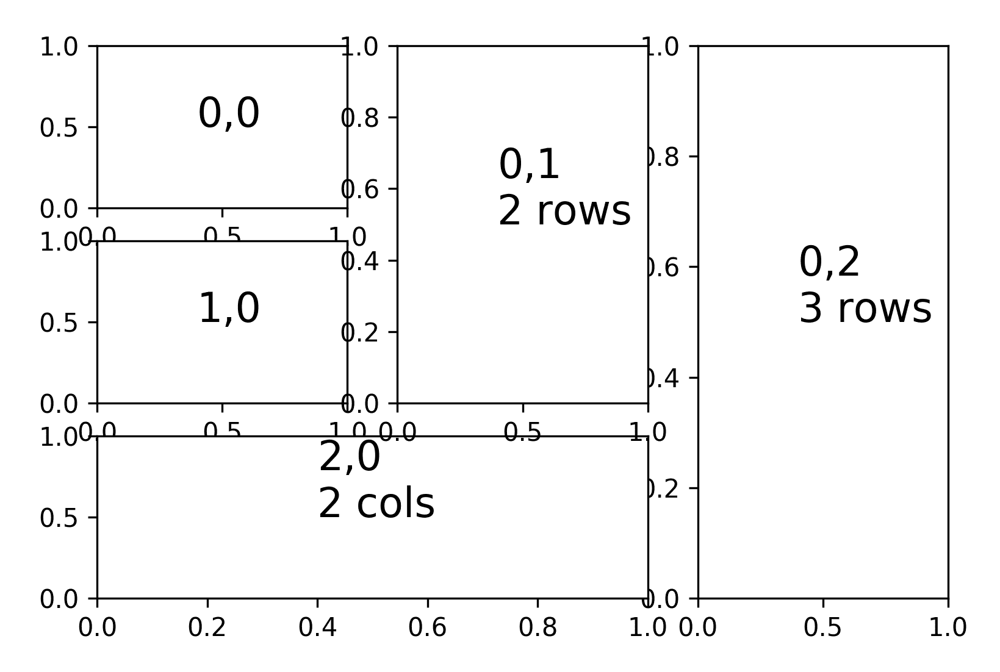

# 使用`fig.add_axes()`绘制插图

子图不一定要并排对齐。在某些情况下，例如放大或缩小时，我们也可以将子图嵌入父图层上方。通过`fig.add_axes()`可以实现这一点。添加子图的基本用法如下：

```py
fig = plt.figure() # or fig = plt.gcf()
fig.add_axes([left, bottom, width, height])
```

`left`、`bottom`、`width`和`height`参数是相对于父图的`float`值来指定的。注意，`fig.add_axes()`返回一个坐标轴对象，因此你可以将其存储为变量，如`ax = fig.add_axes([left, bottom, width, height])`，以便进一步调整。

以下是一个完整示例，我们尝试在一个较小的嵌入子图中绘制概览：

```py
import numpy as np
import matplotlib.pyplot as plt

fig = plt.figure()
np.random.seed(100)
# Prepare data
x = np.random.binomial(1000,0.6,1000)
y = np.random.binomial(1000,0.6,1000)
c = np.random.rand(1000)

# Draw the parent plot
ax = plt.scatter(x,y,s=1,c=c)
plt.xlim(580,650)
plt.ylim(580,650)

# Draw the inset subplot
ax_new = fig.add_axes([0.6, 0.6, 0.2, 0.2])
plt.scatter(x,y,s=1,c=c)
plt.show()
```

让我们查看图中的结果：

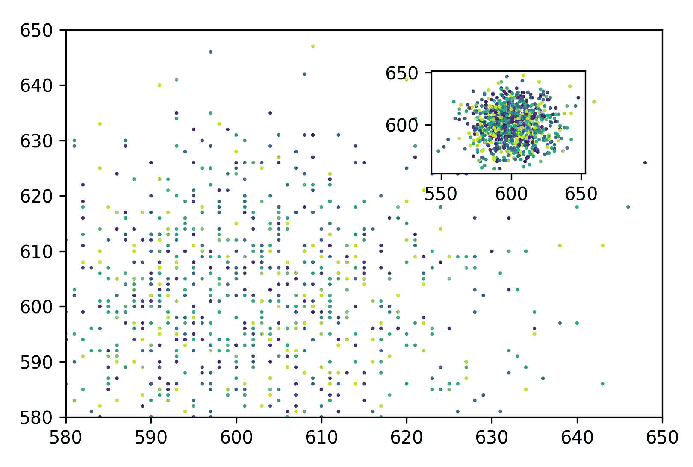

# 使用`plt.subplots_adjust`调整子图尺寸

我们可以使用`plt.subplots_adjust()`来调整子图的尺寸，它接受任意组合的参数——`left`、`right`、`top`和`bottom`——这些参数是相对于父坐标轴的。

# 调整坐标轴和刻度

在数据可视化中，仅仅展示趋势在相对意义上往往是不够的。轴的刻度对于正确解释和便于价值估算至关重要。刻度是轴上的标记，表示此目的的比例。根据数据的性质和图形布局，我们常常需要调整刻度和间距，以提供足够的信息而不显得杂乱。在本节中，我们将介绍一些自定义方法。

# 使用定位器自定义刻度间距

每个轴上有两组刻度标记：主刻度和次刻度。默认情况下，Matplotlib 会自动根据输入的数据优化刻度间距和格式。如果需要手动调整，可以通过设置以下四个定位器来实现：`xmajorLocator`、`xminorLocator`、`ymajorLocator`、`yminorLocator`，通过`set_major_locator`或`set_minor_locator`函数在相应的轴上进行设置。以下是一个使用示例，其中`ax`是一个坐标轴对象：

```py
ax.xaxis.set_major_locator(xmajorLocator)    
ax.xaxis.set_minor_locator(xminorLocator)
ax.yaxis.set_major_locator(ymajorLocator)
ax.yaxis.set_minor_locator(yminorLocator)
```

这里列出了常见的定位器及其用法。

# 使用 NullLocator 移除刻度

当使用`NullLocator`时，刻度会从视图中移除。

# 使用 MultipleLocator 定位刻度倍数

顾名思义，`MultipleLocator`根据用户指定的基数生成倍数刻度。例如，如果我们希望刻度标记为整数而不是浮动数值，可以通过`MultipleLocator(1)`来初始化基数。

# 显示日期和时间的定位器

对于时间序列绘图，Matplotlib 提供了一系列的刻度定位器，用于作为日期时间标记：

+   `MinuteLocator`

+   `HourLocator`

+   `DayLocator`

+   `WeekdayLocator`

+   `MonthLocator`

+   `YearLocator`

+   `RRuleLocator`，允许指定任意的日期刻度

+   `AutoDateLocator`

+   `MultipleDateLocator`

要绘制时间序列图，我们也可以使用 Pandas 来指定 *x* 轴上数据的日期时间格式。

时间序列数据可以通过聚合方法进行重采样，如 `mean()`、`sum()` 或自定义函数。

# 使用格式化器自定义刻度标签格式

刻度格式化器控制刻度标签的格式。它的使用方式类似于刻度定位器，具体如下：

```py
ax.xaxis.set_major_formatter(xmajorFormatter)    
ax.xaxis.set_minor_formatter(xminorFormatter)
ax.yaxis.set_major_formatter(ymajorFormatter)
ax.yaxis.set_minor_formatter(yminorFormatter)
```

# 使用非线性坐标轴刻度

根据数据的分布情况，线性刻度可能并不是将所有有效数据点都适合图中的最佳方式。在这种情况下，我们可能需要将坐标轴的刻度调整为对数刻度或对称对数刻度。在 Matplotlib 中，可以通过在定义坐标轴之前使用 `plt.xscale()` 和 `plt.yscale()`，或者在定义坐标轴之后使用 `ax.set_xscale()` 和 `ax.set_yscale()` 来完成此操作。

我们不需要更改整个坐标轴的刻度。为了以线性刻度显示坐标轴的一部分，我们可以通过 `linthreshx` 或 `linthreshy` 参数来调整线性阈值。为了获得平滑的连续线条，我们还可以通过 `nonposx` 或 `nonposy` 参数来屏蔽非正数。

以下代码片段是不同坐标轴刻度的示例。为了简化说明，我们只更改了 `y` 轴的刻度。类似的操作也可以应用于 `x` 轴：

```py
import numpy as np
import matplotlib.pyplot as plt

# Prepare 100 evenly spaced numbers from -200 to 200
x = np.linspace(-1000, 1000, 100)
y = x * 2
# Setup subplot with 3 rows and 2 columns, with shared x-axis.
# More details about subplots will be discussed in Chapter 3.
f, axarr = plt.subplots(2,3, figsize=(8,6), sharex=True)
for i in range(2):
    for j in range(3):
        axarr[i,j].plot(x, y)
        # Horizontal line (y=10)
        axarr[i,j].scatter([0], [10])

# Linear scale
axarr[0,0].set_title('Linear scale')

# Log scale, mask non-positive numbers
axarr[0,1].set_title('Log scale, nonposy=mask')
axarr[0,1].set_yscale('log', nonposy='mask')

# Log scale, clip non-positive numbers
axarr[0,2].set_title('Log scale, nonposy=clip')
axarr[0,2].set_yscale('log', nonposy='clip')

# Symlog
axarr[1,0].set_title('Symlog scale')
axarr[1,0].set_yscale('symlog')

# Symlog scale, expand the linear range to -100,100 (default=None)
axarr[1,1].set_title('Symlog scale, linthreshy=100')
axarr[1,1].set_yscale('symlog', linthreshy=100)

# Symlog scale, expand the linear scale to 3 (default=1)
# The linear region is expanded, while the log region is compressed.
axarr[1,2].set_title('Symlog scale, linscaley=3')
axarr[1,2].set_yscale('symlog', linscaley=3)
plt.show()
```

让我们比较一下以下图表中每种坐标轴刻度的结果：

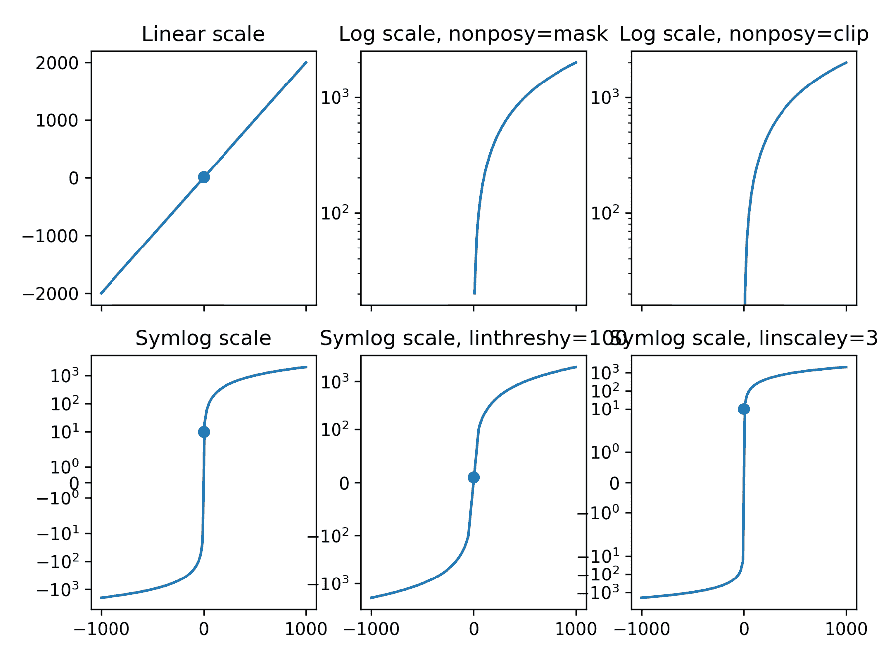

# 更多关于 Pandas 和 Matplotlib 集成的内容

Pandas 提供了常用于处理多变量数据的 DataFrame 数据结构。通常在使用 Pandas 包进行数据输入/输出、存储和预处理时，它还提供了与 Matplotlib 的多个原生集成，便于快速可视化。

要创建这些图表，我们可以调用 `df.plot(kind=plot_type)`、`df.plot.scatter()` 等等。以下是可用的图表类型列表：

+   `line`: 线图（默认）

+   `bar`: 垂直条形图

+   `barh`: 水平条形图

+   `hist`: 直方图

+   `box`: 箱型图

+   `kde`: **核密度估计** (**KDE**) 图

+   `density`: 与 `kde` 相同

+   `area`: 区域图

+   `pie`: 饼图

在前几章中，我们已经创建了一些简单的图表。在这里，我们将以密度图为例进行讨论。

# 使用 KDE 图显示分布

类似于直方图，KDE 图是可视化数据分布形态的一种方法。它通过核平滑创建平滑曲线，通常与直方图结合使用。这在探索性数据分析中非常有用。

在以下示例中，我们将比较不同国家各年龄组的收入数据，这些数据来自按不同年龄分组的调查结果。

这里是数据整理的代码：

```py
import pandas as pd
import matplotlib.pyplot as plt

# Prepare the data
# Weekly earnings of U.S. wage workers in 2016, by age
# Downloaded from Statista.com
# Source URL: https://www.statista.com/statistics/184672/median-weekly-earnings-of-full-time-wage-and-salary-workers/
us_agegroups = [22,29.5,39.5,49.5]
# Convert to a rough estimation of monthly earnings by multiplying 4
us_incomes = [x*4 for x in [513,751,934,955]]

# Monthly salary in the Netherlands in 2016 per age group excluding overtime (Euro)
# Downloaded from Statista.com 
# Source URL: https://www.statista.com/statistics/538025/average-monthly-wage-in-the-netherlands-by-age/
# take the center of each age group
nl_agegroups = [22.5, 27.5, 32.5, 37.5, 42.5, 47.5, 52.5]
nl_incomes = [x*1.113 for x in [1027, 1948, 2472, 2795, 2996, 3069, 3070]]

# Median monthly wage analyzed by sex, age group, educational attainment, occupational group and industry section
# May-June 2016 (HKD)
# Downloaded form the website of Censor and Statistics Department of the HKSAR government
# Source URL: https://www.censtatd.gov.hk/fd.jsp?file=D5250017E2016QQ02E.xls&product_id=D5250017&lang=1
hk_agegroups = [19.5, 29.5, 39.5, 49.5]
hk_incomes = [x/7.770 for x in [11900,16800,19000,16600]]
```

现在我们来绘制 KDE 图进行比较。我们准备了一个可重复使用的函数，用于绘制三组数据，减少代码的重复性：

```py
import seaborn as sns
def kdeplot_income_vs_age(agegroups,incomes):
    plt.figure()
    sns.kdeplot(agegroups,incomes)
    plt.xlim(0,65)
    plt.ylim(0,6000)
    plt.xlabel('Age')
    plt.ylabel('Monthly salary (USD)')
    return

kdeplot_income_vs_age(us_agegroups,us_incomes)
kdeplot_income_vs_age(nl_agegroups,nl_incomes)
kdeplot_income_vs_age(hk_agegroups,hk_incomes)
```

现在我们可以查看结果，按顺序分别为美国、荷兰和香港：

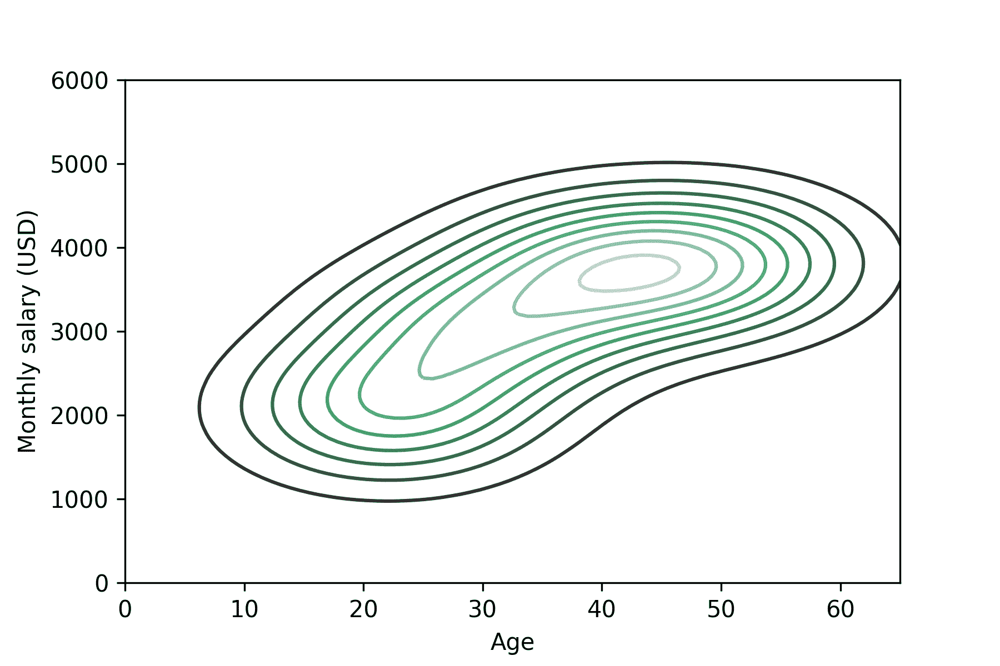  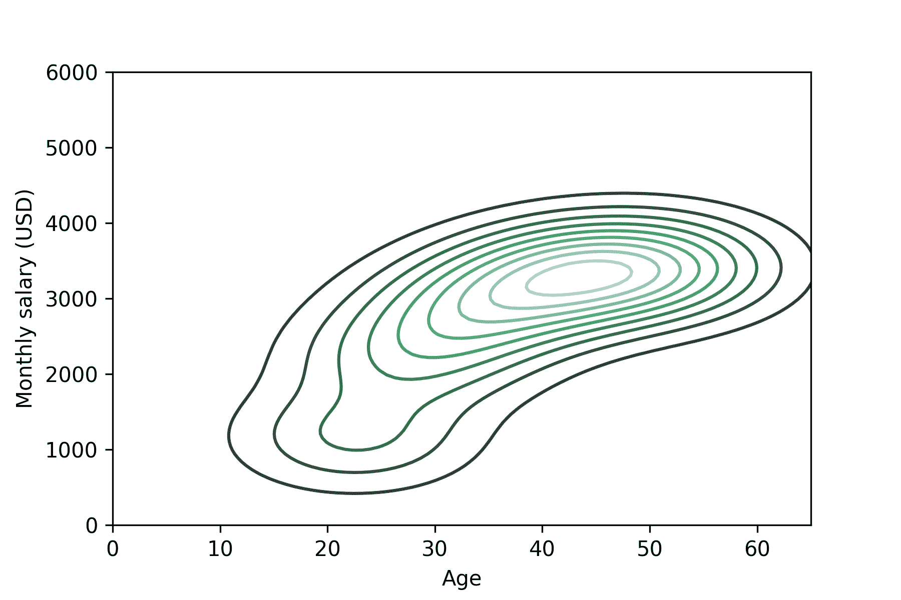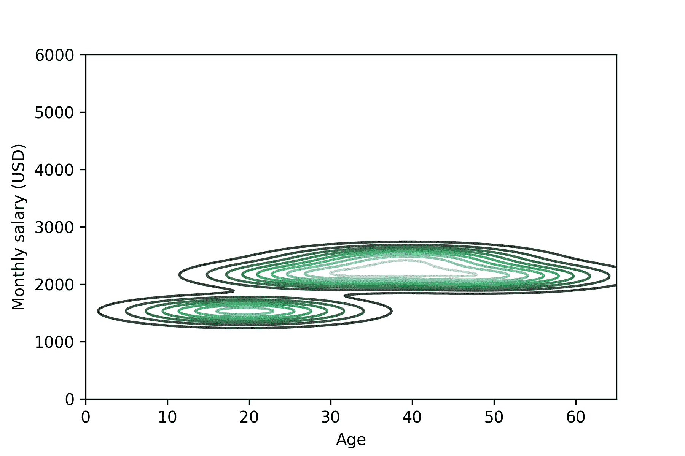

当然，图中的数据并不完全准确地反映原始数据，因为在进行任何调整之前就已经进行了外推（例如，这里并没有儿童劳动数据，但等高线图扩展到了 **10** 岁以下的儿童）。然而，我们仍然可以观察到三种经济体中，**20** 岁和 **50** 岁收入结构的总体差异，以及下载的公共数据与之的可比性。然后，我们可能能够建议进行更多有用分组的调查，并或许获取更多原始数据点来支持我们的分析。

# 使用六边形图展示双变量数据的密度

散点图是一种常见的方法，用于展示数据的分布，以较为原始的形式呈现。但当数据密度超过某一阈值时，可能不再是最好的可视化方法，因为点可能重叠，我们将失去关于实际分布的信息。

六边形图（hexbin map）是一种通过颜色强度展示区域内数据密度的方式，从而改善对数据密度的解读。

这是一个示例，用于比较将数据聚集在中心的相同数据集的可视化：

```py
import pandas as pd
import numpy as np
# Prepare 2500 random data points densely clustered at center
np.random.seed(123)

df = pd.DataFrame(np.random.randn(2500, 2), columns=['x', 'y'])
df['y'] = df['y'] = df['y'] + np.arange(2500)
df['z'] = np.random.uniform(0, 3, 2500)

# Plot the scatter plot
ax1 = df.plot.scatter(x='x', y='y')
# Plot the hexbin plot
ax2 = df.plot.hexbin(x='x', y='y', C='z', reduce_C_function=np.max,gridsize=25)

plt.show()
```

这是 `ax1` 中的散点图。我们可以看到许多数据点是重叠的：

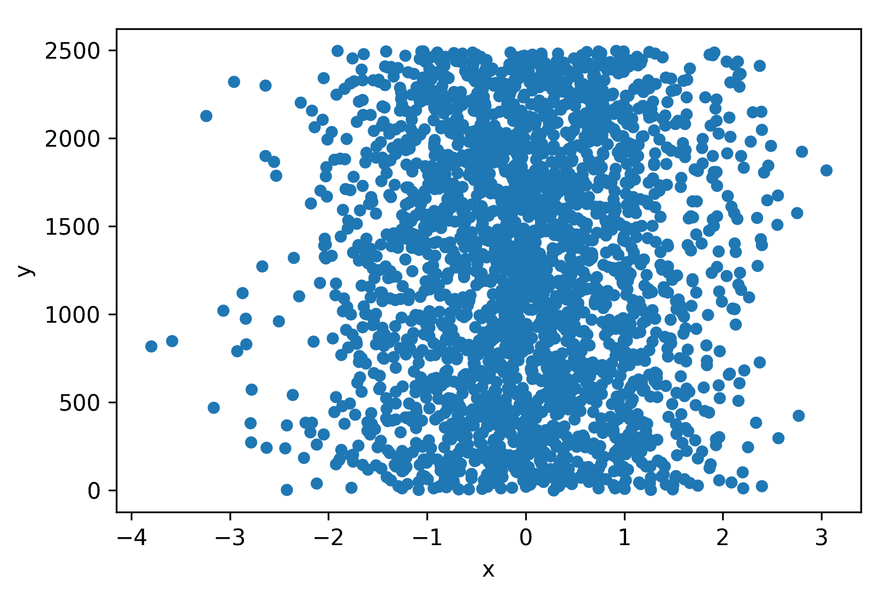

至于 `ax2` 中的六边形图，虽然并未显示所有离散的原始数据点，但我们可以清晰地看到数据分布在中心的变化：

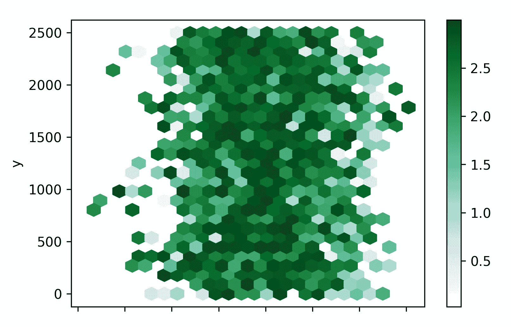

# 使用 Seaborn 扩展图表类型

要安装 Seaborn 包，我们打开终端或命令提示符，并调用 `pip3 install --user seaborn`。每次使用时，我们通过 `import seaborn as sns` 导入该库，其中 `sns` 是常用的简写形式，旨在减少输入量。

# 使用热力图可视化多变量数据

热力图是一种在变量较多时展示多变量数据的有用可视化方法，适用于大数据分析等场景。它是一种在网格中使用颜色渐变来显示数值的图表。它是生物信息学家最常用的图表之一，用于在一张图中展示数百或数千个基因表达值。

使用 Seaborn，绘制热力图只需要一行代码，它通过调用 `sns.heatmap(df)` 来完成，其中 `df` 是要绘制的 Pandas DataFrame。我们可以提供 `cmap` 参数来指定要使用的颜色映射（“colormap”）。你可以回顾上一章，以了解更多关于颜色映射的使用细节。

为了更好地理解热力图，以下示例中，我们演示了使用英特尔 Core CPU 第 *7^(代)* 和 *8^(代)* 处理器系列的应用，涉及几十种型号和四个选择的指标。在查看绘图代码之前，我们先来看看存储数据的 Pandas DataFrame 结构：

```py
# Data obtained from https://ark.intel.com/#@Processors
import pandas as pd

cpuspec = pd.read_csv('intel-cpu-7+8.csv').set_index('Name')
print(cpuspec.info())
cpuspec.head()
```

从以下输出的屏幕截图中，我们可以看到，我们只是简单地将标签作为索引，将不同的属性放在每一列中：

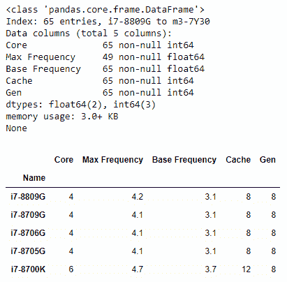

请注意，有 16 个模型在没有**最大频率**属性值的情况下不支持提升。考虑到我们在此的目的，使用**基础频率**作为最大值是合理的。我们将用相应的**基础频率**填充**NA**值：

```py
cpuspec['Max Frequency'] = cpuspec['Max Frequency'].fillna(cpuspec['Base Frequency'])
```

现在，我们使用以下代码来绘制热图：

```py
import matplotlib.pyplot as plt
import seaborn as sns

plt.figure(figsize=(13,13))
sns.heatmap(cpuspec.drop(['Gen'],axis=1),cmap='Blues')
plt.xticks(fontsize=16)
plt.show()
```

很简单，不是吗？其实只需一行代码就能绘制热图。这也是一个示例，说明我们如何使用基本的 Matplotlib 代码来调整图表的其他细节，例如在这个例子中调整图形的维度和`xticks`字体大小。我们来看一下结果：

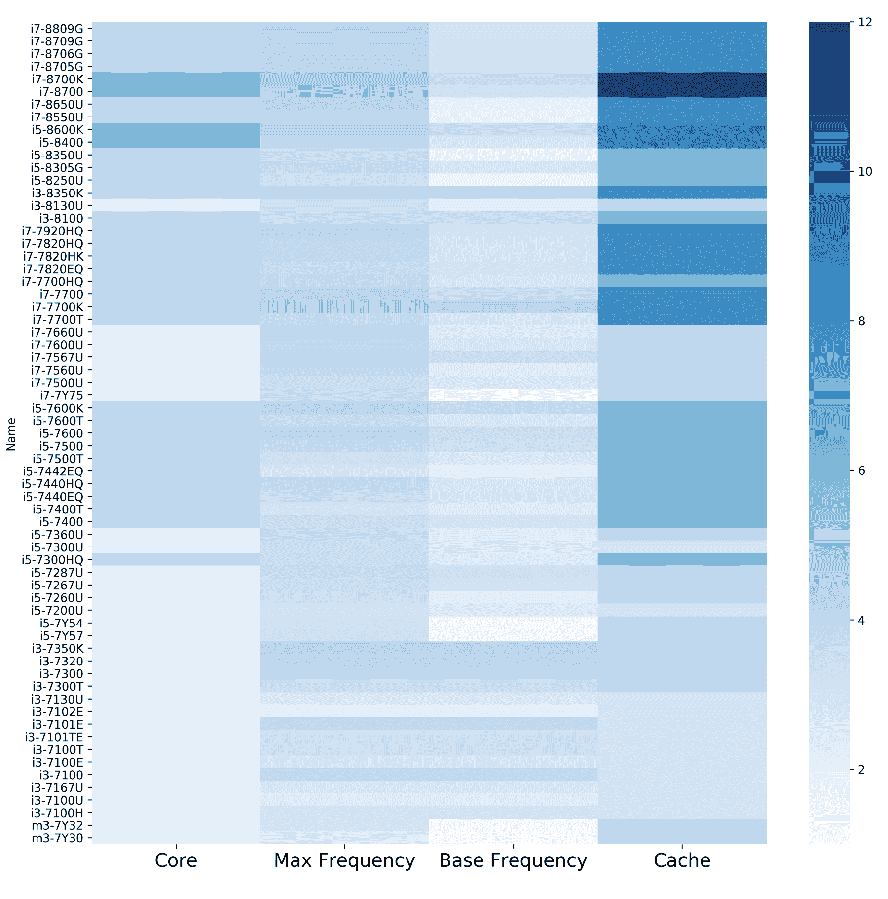

从图形中，即使我们对这些 CPU 型号毫无了解，也能很容易地从顶部 i7 型号的较深颜色推测出一些信息。它们是为更高性能而设计的，具有更多的核心和缓存空间。

# 使用聚类图显示多变量数据的层次结构

有时，当热图中存在过多交替的颜色带时，可能难以解读。这是因为我们的数据可能没有按相似性排序。在这种情况下，我们需要将更相似的数据分组，以便看到结构。

为此，Seaborn 提供了`clustermap` API，它结合了热图和树状图。树状图是一种树形图，将相似的变量聚类在同一分支/叶子下。绘制树状图通常涉及无监督的层次聚类，默认情况下，当我们调用`clustermap()`函数时，它会在后台运行。

除了无监督聚类外，如果我们事先知道某些标签，我们还可以使用`row_colors`关键字参数将其以颜色的形式显示出来。

在这里，我们从前面的 CPU 型号热图示例扩展，绘制了一个聚类热图，并将代际信息标记为行颜色。让我们看看代码：

```py
import seaborn as sns

row_colors = cpuspec['Gen'].map({7:'#a2ecec',8:'#ecaabb'}) # map color values to generation
sns.clustermap(cpuspec.drop(['Gen'],axis=1),standard_scale=True,cmap='Blues',row_colors=row_colors);
```

再次调用 API 就像前面的热图一样简单，我们生成了以下图形：

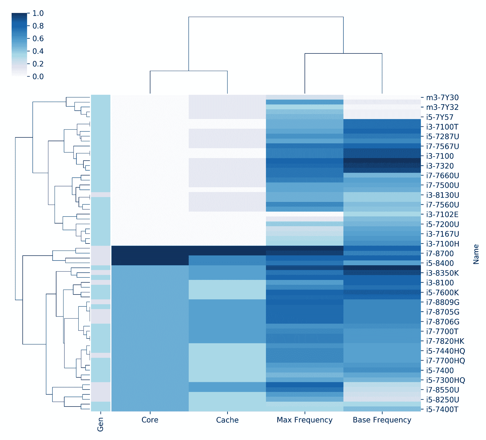

除了帮助显示多个样本的多个属性之外，通过一些调整，clustermap 还可以用于成对聚类，显示考虑所有可用属性后样本之间的相似性。

要绘制成对聚类热图，我们首先需要计算来自不同属性值的样本之间的相关性，将相关矩阵转换为距离矩阵，然后执行层次聚类生成树状图的连接值。我们使用`scipy`包来实现这一目的。要了解更多关于连接值计算方法的内容，请参考 SciPy 文档。

我们将在此提供用户自定义函数：

```py
from scipy.cluster import hierarchy
from scipy.spatial import distance
import seaborn as sns

def pairwise_clustermap(df,method='average',metric='cityblock',figsize=(13,13),cmap='viridis',**kwargs):
    correlations_array = np.asarray(df.corr())

    row_linkage = hierarchy.linkage(
    distance.pdist(correlations_array), method=method)

    col_linkage = hierarchy.linkage(
    distance.pdist(correlations_array.T), method=method)

    g = sns.clustermap(correlations, row_linkage=row_linkage, col_linkage=col_linkage, \
    method=method, metric=metric, figsize=figsize, cmap=cmap,**kwargs)
    return g
```

这是配对聚类图的结果：

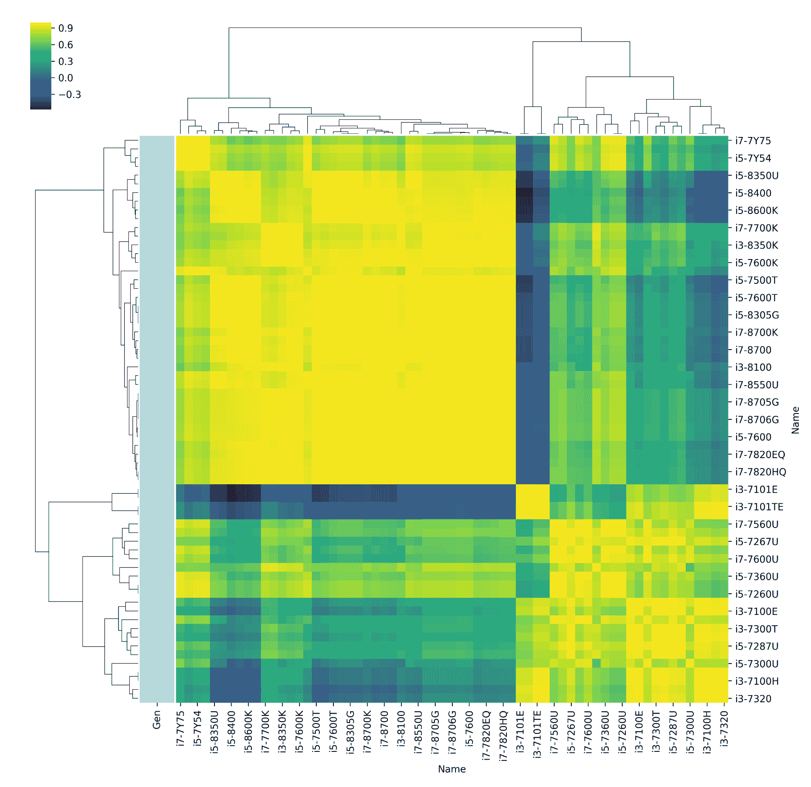

从这两个热力图中，我们可以观察到，根据这四个属性，CPU 似乎根据产品线后缀（如 **U**、**K**、**Y**）而非品牌修饰符（如 **i5** 和 **i7**）进行更好的聚类。在处理数据时，这是一项需要观察大组相似性的分析技能。

# 图像绘制

在分析图像时，第一步是将颜色转换为数值。Matplotlib 提供了用于读取和显示 RGB 值图像矩阵的 API。

以下是一个快速的代码示例，演示如何使用 `plt.imread('image_path')` 将图像读取为 NumPy 数组，并使用 `plt.imshow(image_ndarray)` 展示它。确保已安装 Pillow 包，以便处理 PNG 以外的更多图像类型：

```py
import matplotlib.pyplot as plt
# Source image downloaded under CC0 license: Free for personal and commercial use. No attribution required.
# Source image address: https://pixabay.com/en/rose-pink-blossom-bloom-flowers-693155/
img = plt.imread('ch04.img/mpldev_ch04_rose.jpg')
plt.imshow(img)
```

这里是使用前面代码显示的原始图像：


在展示原始图像后，我们将尝试通过改变图像矩阵中的颜色值来转换图像。我们将通过将 RGB 值设置为 `0` 或 `255`（最大值）并设定阈值为 `160` 来创建高对比度图像。以下是操作方法：

```py
# create a copy because the image object from `plt.imread()` is read-only
imgcopy = img.copy() 
imgcopy[img<160] = 0
imgcopy[img>=160] = 255
plt.imshow(imgcopy)
plt.show()
```

这是转换后图像的结果。通过人为地增加对比度，我们创造了一幅波普艺术风格的图像！

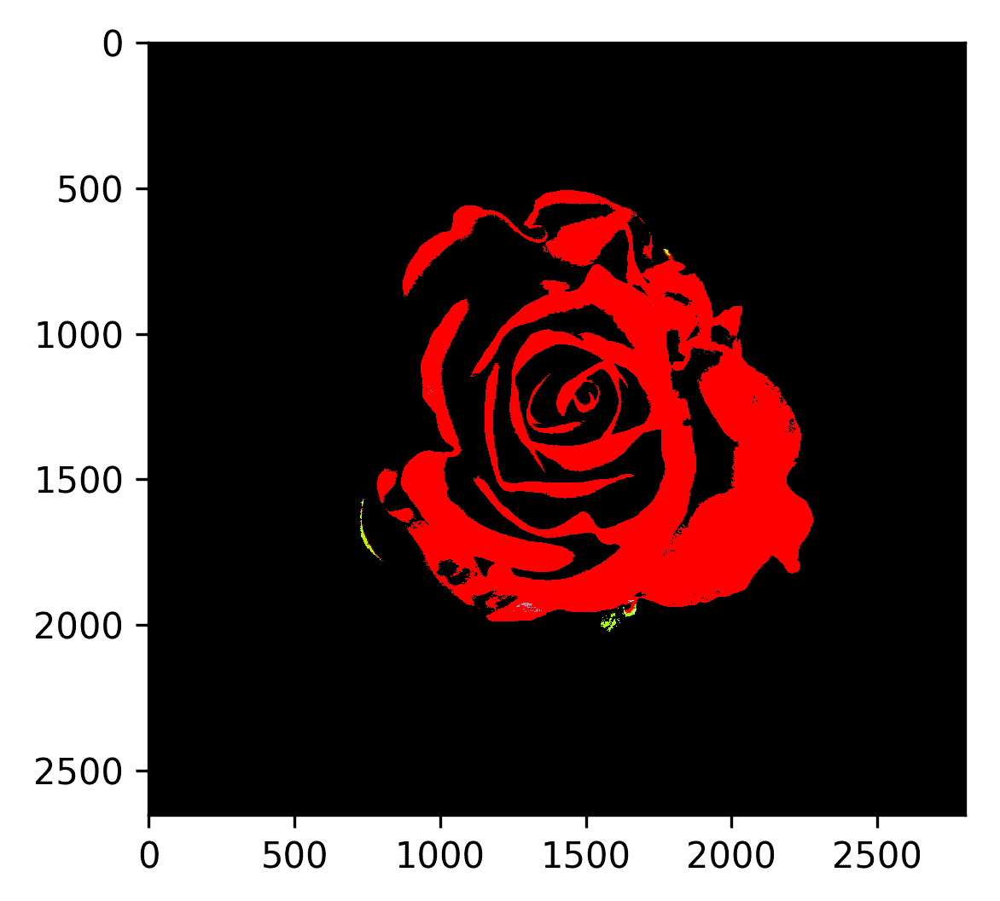

为了展示 Matplotlib 图像处理功能的更实际应用，我们将展示 MNIST 数据集。MNIST 是一个著名的手写数字数据集，常用于机器学习算法的教程。在这里，我们不深入探讨机器学习，而是尝试重现一个情景，在探索性数据分析阶段，我们通过视觉检查数据集。

我们可以从官方网站下载整个 MNIST 数据集：[`yann.lecun.com/exdb/mnist/`](http://yann.lecun.com/exdb/mnist/)。为了简化讨论并引入有用的 Python 机器学习包，我们从 Keras 加载数据。Keras 是一个高级 API，便于神经网络的实现。Keras 包中的 MNIST 数据集包含 70,000 张图像，按坐标和相应标签的元组排列，方便在构建神经网络时进行模型训练和测试。

让我们首先导入这个包：

```py
from keras.datasets import mnist
```

数据只有在调用`load_data()`时才会被加载。因为 Keras 主要用于训练，所以数据会以训练集和测试集的元组形式返回，每个元组包含实际的图像颜色值和标签，在此约定中命名为`X`和`y`：

```py
(X_train,y_train),(X_test,y_test) = mnist.load_data()
```

当首次调用`load_data()`时，可能需要一些时间来从在线数据库下载 MNIST 数据集。

我们可以按如下方式检查数据的维度：

```py
for d in X_train, y_train, X_test, y_test:
    print(d.shape)
```

这是输出结果：

```py
(60000, 28, 28)
(60000,)
(10000, 28, 28)
(10000,)
```

最后，让我们从 `X_train` 集合中取出一张图像，并使用 `plt.imshow()` 将其以黑白方式绘制：

```py
plt.imshow(X_train[123], cmap='gray_r')
```

从下图中，我们可以轻松地用肉眼读出七个数据点。在解决实际的图像识别问题时，我们可能会对一些被误分类的图像进行采样，并考虑优化训练算法的策略：

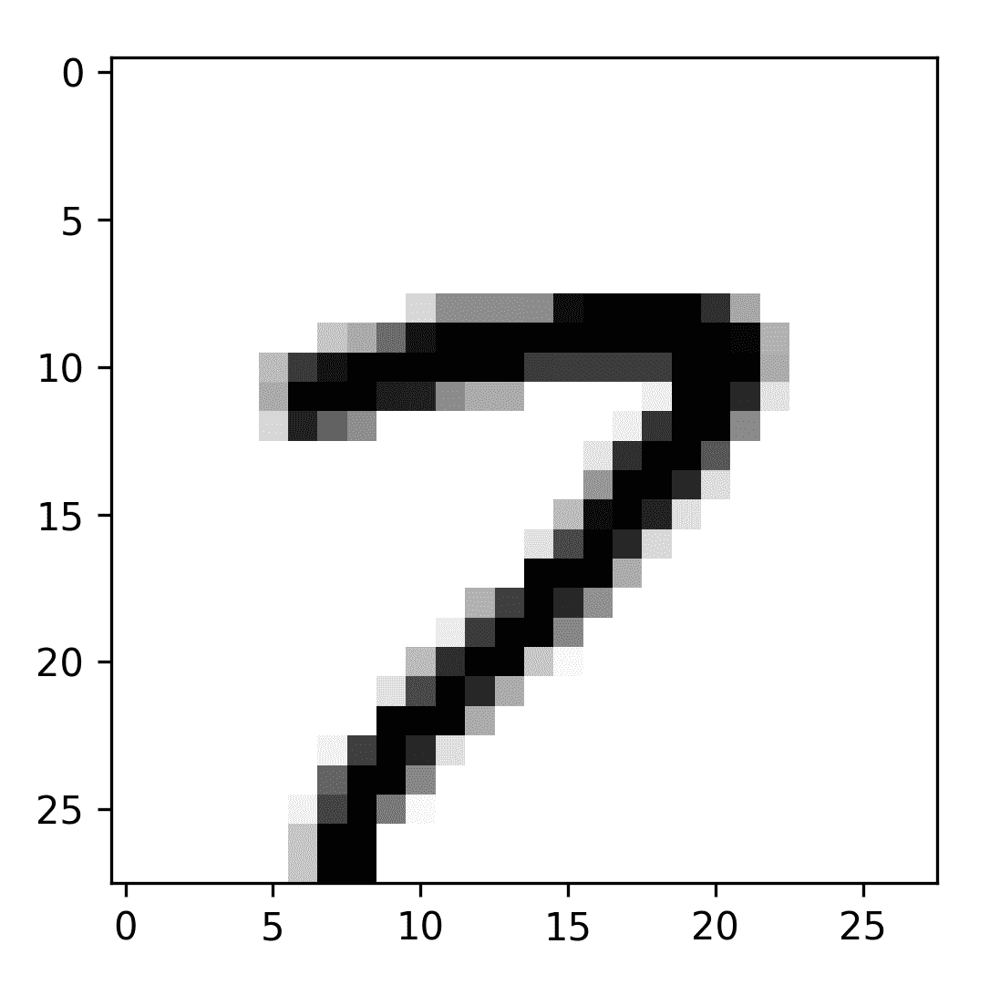

# 财务绘图

在某些情况下，为了理解预测趋势，我们需要每个时间点的更多原始值。蜡烛图是金融技术分析中常用的一种可视化方式，用于展示价格趋势，最常见于股市。要绘制蜡烛图，我们可以使用 `mpl_finance` 包中的 `candlestick_ohlc` API。

`mpl_finance` 可以从 GitHub 上下载。在 Python 的 site-packages 目录中克隆仓库后，在终端中运行 `python3 setup.py install` 来安装它。

`candlestick_ohlc()` 接受一个 Pandas DataFrame 作为输入，DataFrame 包含五列：`date`（浮动数值）、`open`、`high`、`low` 和 `close`。

在我们的教程中，我们以加密货币市场的价值为例。让我们再次查看我们获得的数据表：

```py
import pandas as pd
# downloaded from kaggle "Cryptocurrency Market Data" dataset curated by user jvent
# Source URL: https://www.kaggle.com/jessevent/all-crypto-currencies
crypt = pd.read_csv('crypto-markets.csv')
print(crypt.shape)
crypt.head()
```

这是表格的样子：

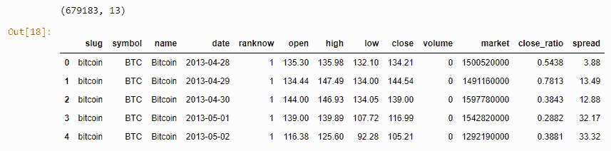

让我们选择第一个加密货币，比特币，作为示例。以下代码选择了 2017 年 12 月的 OHLC 值，并将索引设置为 `date`，格式为日期时间格式：

```py
from matplotlib.dates import date2num
btc = crypt[crypt['symbol']=='BTC'][['date','open','high','low','close']].set_index('date',drop=False)
btc['date'] = pd.to_datetime(btc['date'], format='%Y-%m-%d').apply(date2num)
btc.index = pd.to_datetime(btc.index, format='%Y-%m-%d')
btc = btc['2017-12-01':'2017-12-31']
btc = btc[['date','open','high','low','close']]
```

接下来，我们将绘制蜡烛图。回顾设置坐标轴刻度以微调时间标记的技巧：

```py
import matplotlib.pyplot as plt
from matplotlib.dates import WeekdayLocator, DayLocator, DateFormatter, MONDAY
from mpl_finance import candlestick_ohlc
# from matplotlib.finance import candlestick_ohlc deprecated in 2.0 and removed in 2.2
fig, ax = plt.subplots()

candlestick_ohlc(ax,btc.values,width=0.8)
ax.xaxis_date() # treat the x data as dates
ax.xaxis.set_major_locator(WeekdayLocator(MONDAY)) # major ticks on the Mondays
ax.xaxis.set_minor_locator(DayLocator()) # minor ticks on the days
ax.xaxis.set_major_formatter(DateFormatter('%Y-%m-%d'))

# Align the xtick labels
plt.setp(ax.get_xticklabels(), horizontalalignment='right')

# Set x-axis label
ax.set_xlabel('Date',fontsize=16) 

# Set y-axis label
ax.set_ylabel('Price (US $)',fontsize=16) 
plt.show()
```

`mpl_finance` 可以通过运行以下命令进行安装：

```py
pip3 install --user https://github.com/matplotlib/mpl_finance/archive/master.zip
```

我们可以观察到，比特币在 12 月初的快速上涨，在 2017 年 12 月中旬出现了方向的转变：

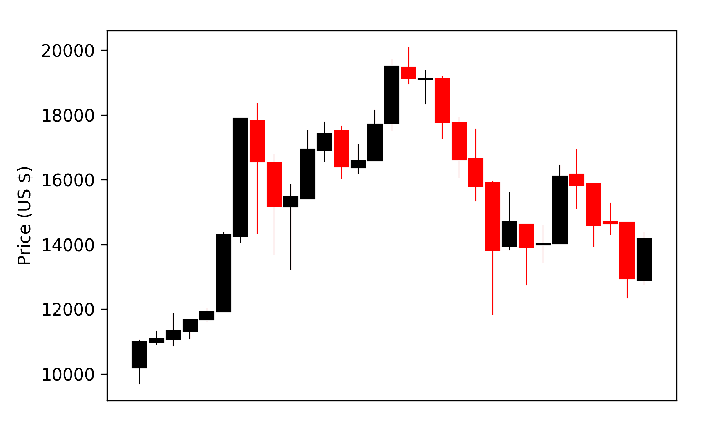

# 使用 Axes3D 绘制 3D 图

到目前为止，我们讨论了二维绘图。事实上，在很多情况下，我们可能需要进行 3D 数据可视化。例子包括展示更复杂的数学函数、地形特征、物理学中的流体动力学，以及展示数据的其他方面。

在 Matplotlib 中，这可以通过 `mpl_toolkits` 中的 `mplot3d` 库中的 `Axes3D` 来实现。

我们只需要在导入库后定义一个坐标轴对象时指定 `projection='3d'`。接下来，我们只需定义带有 `x`、`y` 和 `z` 坐标的坐标轴。支持的图形类型包括散点图、线图、条形图、等高线图、网格框架图和表面图（带或不带三角化）。

以下是绘制 3D 曲面图的示例：

```py
import numpy as np
import matplotlib.pyplot as plt
from mpl_toolkits.mplot3d import Axes3D

fig = plt.figure()
ax = fig.add_subplot(111, projection='3d')

x = np.linspace(-2, 2, 60)
y = np.linspace(-2, 2, 60)
x, y = np.meshgrid(x, y)
r = np.sqrt(x**2 + y**2)
z = np.cos(r)
surf = ax.plot_surface(x, y, z, rstride=2, cstride=2, cmap='viridis', linewidth=0)
```

Matplotlib 的 Axes3D 对于使用常见的 Matplotlib 语法和外观绘制简单的 3D 图非常有用。对于需要高渲染的高级科学 3D 绘图，建议使用 Mayavi 包。这里是该项目的官方网站，供您了解更多信息：[`code.enthought.com/pages/mayavi-project.html`](http://code.enthought.com/pages/mayavi-project.html)。

从以下截图中，我们可以看到，颜色渐变有助于展示 3D 图的形状：

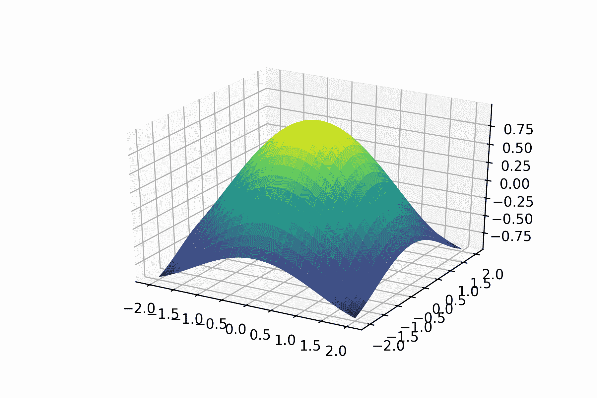

# 地理绘图

为了展示 Matplotlib 与第三方包的强大功能，我们将演示其在空间分析中的应用。自卫星发明以来，产生了大量有用的**地理信息系统**（**GIS**）数据，帮助各种分析，从自然现象到人类活动。

为了利用这些数据，Matplotlib 集成了多个常见的 Python 包来展示空间数据，如 Basemap、GeoPandas、Cartopy 和 Descartes。在本章的最后部分，我们将简要介绍前两个包的用法。

# Basemap

Basemap 是最受欢迎的基于 Matplotlib 的绘图工具包之一，用于在世界地图上绘图。它是展示任何地理位置的便捷方式。

安装 Basemap 的步骤如下：

1.  解压到`$Python3_dir/site-packages/mpl_toolkits`

1.  进入 Basemap 安装目录：`cd $basemap_dir`

1.  进入`Basemap`目录中的`geos`目录：`cd $basemap/geos-3.3.3`

1.  使用`./configure`、`make`和`make install`安装 GEOS 库。

1.  安装 PyProj（参见以下提示）

1.  返回 Basemap 安装目录并运行`python3 setup.py install`。

1.  设置环境变量`` `PROJ_DIR=$pyproj_dir/lib/pyproj/data` ``

Basemap 需要 PyProj 作为依赖项，但常有安装失败的报告。我们建议先安装 Cython 依赖，再从 GitHub 安装。

1.  从[`github.com/jswhit/pyproj`](https://github.com/jswhit/pyproj)克隆 PyProj GitHub 仓库到 Python 站点包目录。

1.  使用`pip install --user cython`安装 Cython 依赖。

1.  进入 PyProj 目录并使用`python3 setup.py install`安装。

对于 Windows 用户，通过 Anaconda 安装可能更为简便，使用命令行`conda install -c conda-forge geopandas`。

作为简短介绍，我们将通过以下代码片段展示如何绘制美丽的地球及阴影地形：

```py
from mpl_toolkits.basemap import Basemap
import matplotlib.pyplot as plt

# Initialize a Basemap object
# Use orthogonal spherical projection
# Adjust the focus by setting the latitude and longitude
map = Basemap(projection='ortho', lat_0=20, lon_0=80)

# To shade terrain by relief. This step may take some time.
map.shadedrelief()

# Draw the country boundaries in white
map.drawcountries(color='white')
plt.show()
```

这是绘图的效果：

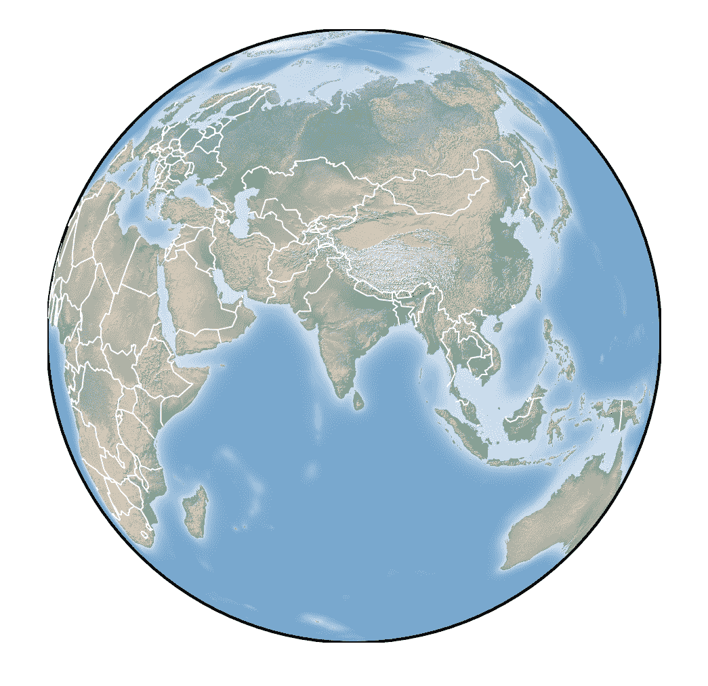

除了展示如前图所示的正交投影的地球作为球体外，我们还可以设置`projection='cyl'`，使用米勒圆柱投影来展示平面矩形图。

Basemap 提供了许多地图绘制功能，如绘制海岸线和在地图上绘制数据（使用 hexbin 或 streamplot）。详细信息可以在官方教程中找到[`basemaptutorial.readthedocs.io`](http://basemaptutorial.readthedocs.io)。由于深入的地理分析超出了本书的范围，我们将把更具体的用法留给感兴趣的读者作为练习。

# GeoPandas

GeoPandas 是与 Matplotlib 集成的地理绘图库，具有读取常见 GIS 文件格式的全面功能。

要使用 GeoPandas，我们将按如下方式导入库：

```py
import geopandas as gpd
import matplotlib.pyplot as plt
```

在接下来的示例中，我们将探讨世界银行集团准备的气候变化数据。

我们选择了基于 B1 场景的 2080-2099 年降水投影：这是一个收敛的世界，全球人口在本世纪中期达到峰值后开始下降。故事情节描述了经济逐渐转向以服务和信息为主，采用清洁和资源高效的技术，但没有额外的气候行动。

作为输入，我们已经下载了 shapefile（`.shp`），这是地理数据分析中使用的标准格式之一：

```py
# Downloaded from the Climate Change Knowledge portal by the World Bank Group
# Source URL: http://climate4development.worldbank.org/open/#precipitation
world_pr = gpd.read_file('futureB.ppt.totals.median.shp')
world_pr.head()
```

我们可以查看 GeoPandas DataFrame 的前几行。请注意，形状数据存储在 `geometry` 列中：

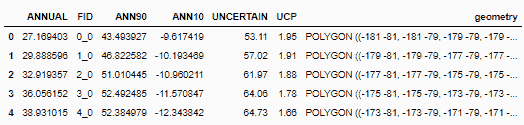

接下来，我们将在世界地图上添加边界，以便更好地识别位置：

```py
# Downloaded from thematicmapping.org
# Source URL http://thematicmapping.org/downloads/world_borders.php
world_borders = gpd.read_file('TM_WORLD_BORDERS_SIMPL-0.3.shp')
world_borders.head()
```

在这里，我们检查 GeoPandas DataFrame。正如预期的那样，形状信息也存储在 `geometry` 中：

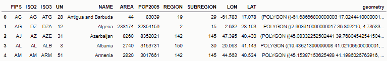

几何数据将作为填充的多边形绘制。为了仅绘制边界，我们将通过 `GeoSeries.boundary` 生成边界几何：

```py
# Initialize an figure and an axes as the canvas
fig,ax = plt.subplots()

# Plot the annual precipitation data in ax
world_pr.plot(ax=ax,column='ANNUAL')

# Draw the simple worldmap borders
world_borders.boundary.plot(ax=ax,color='#cccccc',linewidth=0.6)

plt.show()
```

现在，我们已经获得了以下结果：

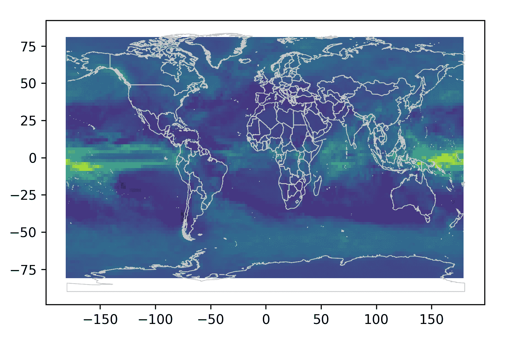

网站还提供了另一个场景 A2 的数据，描述了一个非常异质的世界，本地身份得以保存。那幅图将是什么样的？它会看起来相似还是截然不同？让我们下载文件来看看！

同样，GeoPandas 提供了许多 API 供更高级的使用。读者可以参考 `http://geopandas.org/` 获取完整的文档或更多细节。

# 概要

恭喜你！我们在 Matplotlib 的高级使用方面已经取得了长足的进展。在本章中，我们学习了如何在子图之间共享和绘制坐标轴，使用非线性坐标轴尺度，调整刻度格式化器和定位器，绘制图像，使用 Seaborn 创建高级图表，创建金融数据的蜡烛图，使用 Axes3D 绘制简单的 3D 图，以及使用 Basemap 和 GeoPandas 可视化地理数据。

你已经准备好深入将这些技能与所需的应用程序整合了。在接下来的几个章节中，我们将使用 Matplotlib 支持的不同后端。敬请期待！
