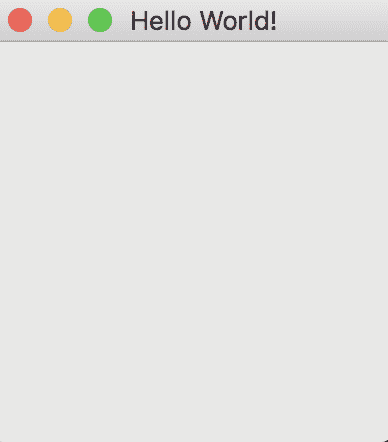
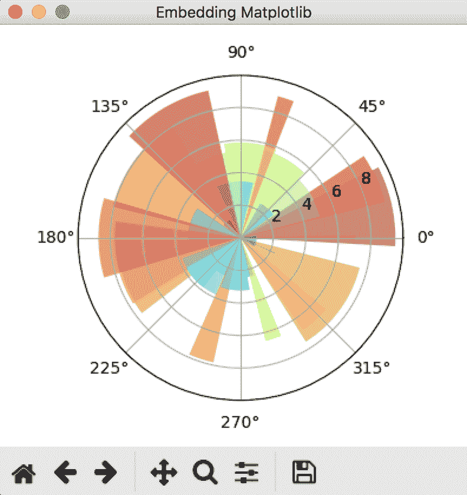
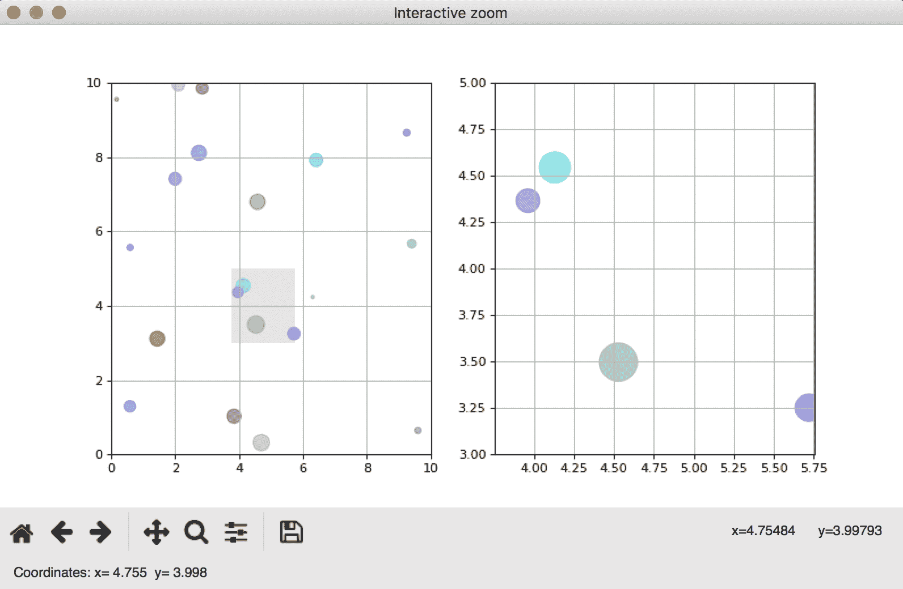
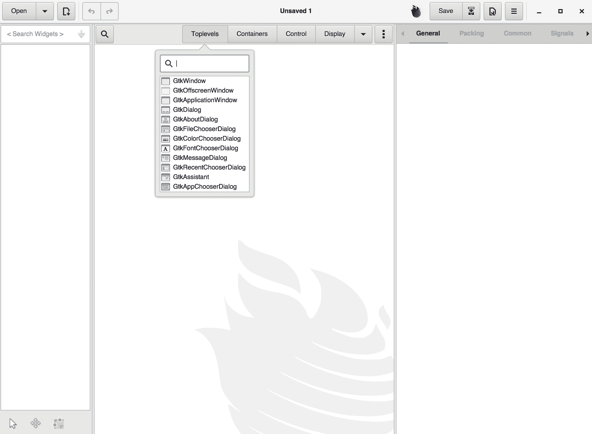
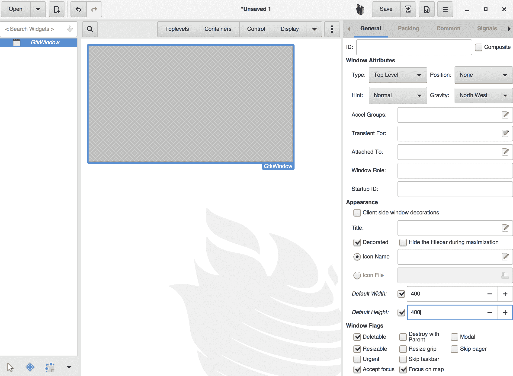
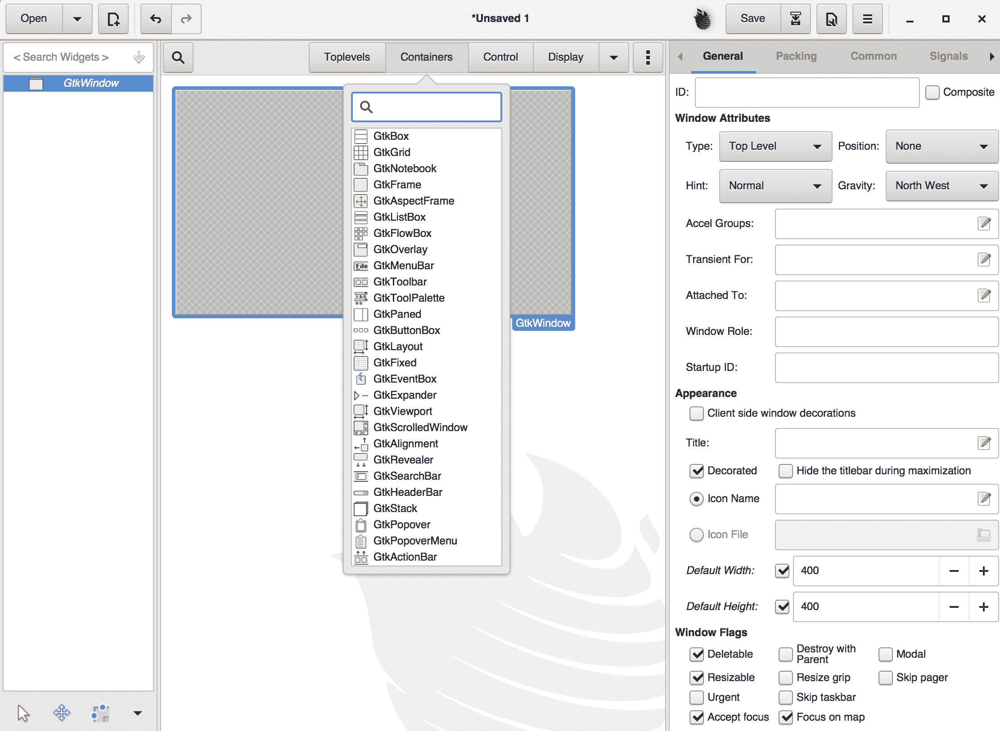
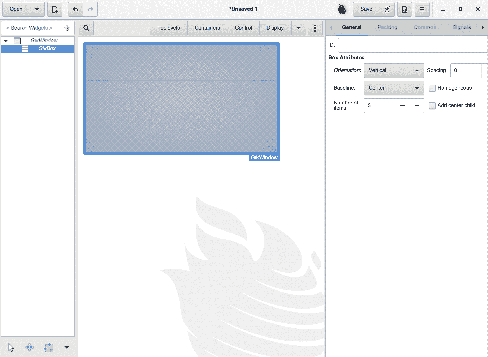
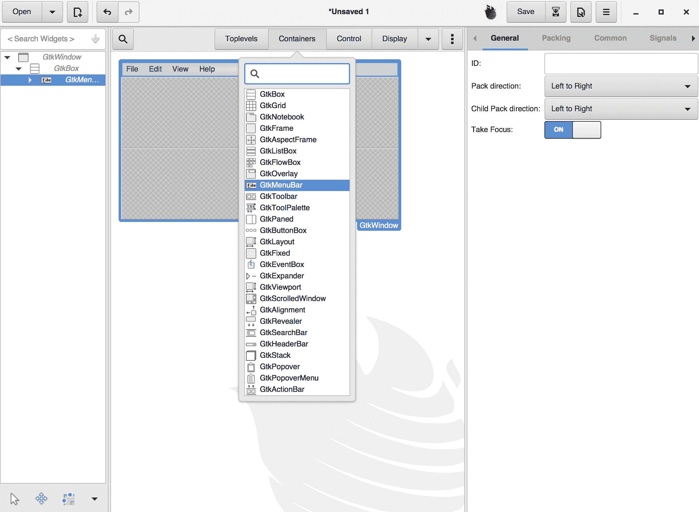
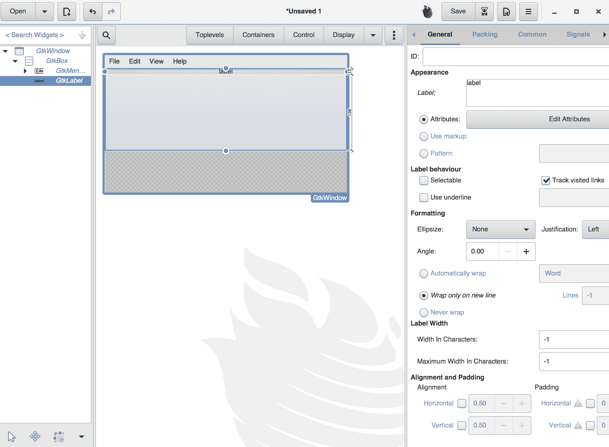
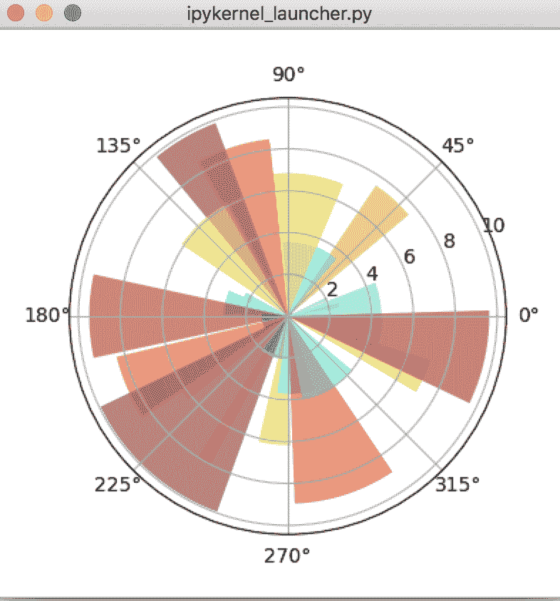

# 第五章：在 GTK+3 中嵌入 Matplotlib

到目前为止，我们已经做了不少示例，并且已经打下了良好的基础，能够使用 Matplotlib 生成数据图表和图形。虽然单独使用 Matplotlib 在生成交互式图形、实验数据集和理解数据的子结构方面非常方便，但也可能出现需要一个应用程序来获取、解析并显示数据的情况。

本章将研究如何通过 GTK+3 将 Matplotlib 嵌入应用程序的示例。

# 安装和设置 GTK+3

设置 GTK+3 相对简单直观。根据操作系统版本和环境的不同，安装 GTK+3 有多种方式。

我们建议读者参考链接：[`python-gtk-3-tutorial.readthedocs.io/en/latest/install.html`](https://python-gtk-3-tutorial.readthedocs.io/en/latest/install.html)以获取最新的安装更新和信息。

在写这本书时，官方网站建议用户通过 JHBuild 安装 GTK+3。然而，用户发现 JHBuild 在 macOS El Capitan 上存在兼容性问题。

我们建议 macOS 用户使用包管理器`brew`来安装 GTK+3。

如果你的 macOS 已经安装了`brew`，则可以简单地安装 GTK+3：

```py
#Installing the gtk3 package
brew install gtk3
#Installing PyGObject
brew install pygobject3
```

对于像 Ubuntu 这样的 Linux 系统，GTK+3 默认已经安装。对于那些喜欢更自定义安装方式的高级用户，我们建议访问官网获取最新的安装信息。

我们观察到 GTK+3 在 IPython Notebook 中的可视化兼容性不如预期。我们建议你在终端中运行代码以获得最佳效果。

# GTK+3 简要介绍

在探索各种示例和应用之前，让我们先对 GTK+3 进行一个简要的高层次了解。

GTK+3 包含一组图形控件元素（小部件），是一个功能丰富、易于使用的工具包，用于开发图形用户界面。它具有跨平台兼容性，且相对容易使用。GTK+3 是一个面向对象的小部件工具包，用 C 语言编写。因此，当在 Python 中运行 GTK+3 时，我们需要一个包装器来调用 GTK+3 库中的函数。在这种情况下，PyGObject 是一个 Python 模块，它作为包装器为我们节省了不必学习两种语言来绘制图形的时间。PyGObject 专门支持 GTK+3 或更高版本。如果你更喜欢在应用程序中使用 GTK+2，我们建议使用 PyGTK。

与 Glade GUI 构建器一起，它们提供了一个非常强大的应用程序开发环境。

# GTK+3 信号系统简介

GTK+3 是一个事件驱动的工具包，这意味着它始终在一个循环函数中处于休眠状态，等待（*监听*）事件的发生；然后它将控制权交给相应的函数。事件的例子有点击按钮、激活菜单项、勾选复选框等。当小部件接收到事件时，它们通常会发出一个或多个信号。这个信号将调用你连接的函数，在这种情况下称为**回调函数**。控制的传递是通过信号的概念来完成的。

尽管术语几乎相同，但 GTK+3 的信号与 Unix 系统信号不同，并且并非使用它们实现。

当像鼠标按钮按下这样的*事件*发生时，点击接收到小部件的控件会发出相应的信号。这是 GTK+3 工作原理中最重要的部分之一。有些信号是所有小部件都继承的，例如*destroy*和*delete-event*，还有一些是特定于小部件的信号，例如切换按钮的切换。为了使信号框架生效，我们需要设置一个信号处理程序来捕获这些信号并调用相应的函数。

从更抽象的角度来看，一个通用的例子如下：

```py
handler_id = widget.connect("Event", callback, data )
```

在这个通用示例中，`widget`是我们之前创建的小部件的一个实例。它可以显示小部件、按钮、切换按钮或文本数据输入。每个小部件都有自己的特定*事件*，只有当该事件发生时，它才会响应。如果小部件是按钮，当发生点击等动作时，信号将被发出。`callback`参数是回调函数的名称。当*事件*发生时，回调函数将被执行。最后，`data`参数包括任何在生成信号时需要传递的数据；这是可选的，如果*回调*函数不需要参数，可以省略。

这是我们第一个 GTK+3 示例：

```py
#In here, we import the GTK module in order to access GTK+3's classes and functions
#We want to make sure we are importing GTK+3 and not any other version of the library
#Therefore we require_version('Gtk','3.0')
import gi
gi.require_version('Gtk', '3.0')
from gi.repository import Gtk

#This line uses the GTK+3 functions and creates an empty window
window = Gtk.Window(title="Hello World!")
#We created a handler that connects window's delete event to ensure the application
#is terminated if we click on the close button
window.connect("destroy",Gtk.main_quit)
#Here we display the window
window.show_all()
#This tells the code to run the main loop until Gtk.main_quit is called
Gtk.main()
```

要运行此代码，读者可以选择复制并粘贴，或将代码保存到名为`first_gtk_example.py`的文件中，并在终端中运行，如下所示：

```py
python3 first_gtk_example.py
```

读者应该能够创建一个空白的 200x200 像素窗口（默认情况下，如果没有指定其他内容），如下所示：



图 1

为了充分理解 GTK3+的实用性，建议将代码编写为 PyGObject。

以下代码演示了一个修改版的稍微复杂的示例，其中一个窗口中有两个点击按钮，每个按钮执行不同的任务！

读者在运行本章示例之前，应通过`pip3`安装`cairocffi`：

`pip3 install cairocffi`

`cairocffi`库是一个基于 CFFI 的替代库，用于替代 Pycairo，在此案例中是必需的。现在让我们深入了解代码：

```py
#Again, here we import the GTK module
import gi
gi.require_version('Gtk', '3.0')
from gi.repository import Gtk

#From here, we define our own class, namely TwoClicks.
#This is a sub-class of Gtk.Window
class TwoClicks(Gtk.Window):

    #Instantiation operation will creates an empty object
    #Therefore, python3 uses __init__() to *construct* an object
    #__init__() will be automatically invoked when the object is being created!
    #You can call this the constructor in Python3
    #Noted that *self* here indicates the reference of the object created from this class
    #Anything starting with self.X refers to the local function or variables of the object itself!
    def __init__(self):

        #In here, we are essentially constructing a Gtk.Window object
        #And parsing the information title="Hello world" to the constructor of Gtk.Window
        #Therefore, the window will have a title of "Hello World"
        Gtk.Window.__init__(self, title="Hello World")

        #Since we have two click buttons, we created a horizontally oriented box container
        #with 20 pixels placed in between children - the two click buttons
        self.box = Gtk.Box(spacing=100)

        #This assigns the box to become the child of the top-level window
        self.add(self.box)

        #Here we create the first button - click1, with the title "Print once!" on top of it
        self.click1 = Gtk.Button(label="Print once!")

        #We assign a handler and connect the *Event* (clicked) with the *callback/function* (on_click1)
        #Noted that, we are now calling the function of the object itself
        #Therefore we are using *self.onclick1 
        self.click1.connect("clicked", self.on_click1)

        #Gtk.Box.pack_start() has a directionality here, it positions widgets from left to right!
        self.box.pack_start(self.click1, True, True, 0)

        #The same applies to click 2, except that we connect it with a different function
        #which prints Hello World 5 times!
        self.click2 = Gtk.Button(label="Print 5 times!")
        self.click2.connect("clicked", self.on_click2)
        self.box.pack_start(self.click2, True, True, 0)

    #Here defines a function on_click1 in the Class TwoClicks
    #This function will be triggered when the button "Print once!" is clicked
    def on_click1(self, widget):
        print("Hello World")

    #Here defines a function on_click2 in the Class TwoClicks
    #This function will be triggered when the button "Print 5 times!" is clicked
    def on_click2(self, widget):
        for i in range(0,5):
            print("Hello World")

#Here we instantiate an object, namely window
window = TwoClicks()
#Here we want the window to be close when the user click on the close button
window.connect("delete-event", Gtk.main_quit)
#Here we display the window!
window.show_all()
#This tells the code to run the main loop until Gtk.main_quit is called
Gtk.main()
```

以下是你从上面的代码片段中得到的结果：


图 2

点击不同的按钮将导致在终端上获得不同的结果。

这个示例作为**面向对象编程**（**OOP**）风格的介绍。对于新手用户来说，OOP 可能有些复杂，但它是组织代码、创建模块以及增强代码可读性和可用性的最佳方式之一。虽然新手用户可能没有注意到，但在前四章中，我们已经使用了许多 OOP 概念。

通过理解`init()`和`self`，我们现在可以深入研究更高级的编程技巧了。那么，让我们尝试一些更高级的例子！如果我们想要将我们制作的一些图表嵌入到 GTK+3 窗口中，我们可以这样做：

```py
#Same old, importing Gtk module, we are also importing some other stuff this time
#such as numpy and the backends of matplotlib
import gi, numpy as np, matplotlib.cm as cm
gi.require_version('Gtk', '3.0')
from gi.repository import Gtk

#From here, we are importing some essential backend tools from matplotlib
#namely the NavigationToolbar2GTK3 and the FigureCanvasGTK3Agg
from matplotlib.backends.backend_gtk3 import NavigationToolbar2GTK3 as NavigationToolbar
from matplotlib.backends.backend_gtk3agg import FigureCanvasGTK3Agg as FigureCanvas
from matplotlib.figure import Figure

#Some numpy functions to create the polar plot
from numpy import arange, pi, random, linspace

#Here we define our own class MatplotlibEmbed
#By simply instantiating this class through the __init__() function,
#A polar plot will be drawn by using Matplotlib, and embedded to GTK3+ window
class MatplotlibEmbed(Gtk.Window):

    #Instantiation
    def __init__(self):
        #Creating the Gtk Window
        Gtk.Window.__init__(self, title="Embedding Matplotlib")
        #Setting the size of the GTK window as 400,400
        self.set_default_size(400,400)

        #Readers should find it familiar, as we are creating a matplotlib figure here with a dpi(resolution) 100
        self.fig = Figure(figsize=(5,5), dpi=100)
        #The axes element, here we indicate we are creating 1x1 grid and putting the subplot in the only cell
        #Also we are creating a polar plot, therefore we set projection as 'polar
        self.ax = self.fig.add_subplot(111, projection='polar')

        #Here, we borrow one example shown in the matplotlib gtk3 cookbook
        #and show a beautiful bar plot on a circular coordinate system
        self.theta = linspace(0.0, 2 * pi, 30, endpoint=False)
        self.radii = 10 * random.rand(30)
        self.width = pi / 4 * random.rand(30)
        self.bars = self.ax.bar(self.theta, self.radii, width=self.width, bottom=0.0)

        #Here defines the color of the bar, as well as setting it to be transparent
        for r, bar in zip(self.radii, self.bars):
            bar.set_facecolor(cm.jet(r / 10.))
            bar.set_alpha(0.5)
        #Here we generate the figure
        self.ax.plot()

        #Here comes the magic, a Vbox is created
        #VBox is a containder subclassed from Gtk.Box, and it organizes its child widgets into a single column
        self.vbox = Gtk.VBox()
        #After creating the Vbox, we have to add it to the window object itself!
        self.add(self.vbox)

        #Creating Canvas which store the matplotlib figure
        self.canvas = FigureCanvas(self.fig)  # a Gtk.DrawingArea
        # Add canvas to vbox
        self.vbox.pack_start(self.canvas, True, True, 0)

        # Creating toolbar, which enables the save function!
        self.toolbar = NavigationToolbar(self.canvas, self)
        self.vbox.pack_start(self.toolbar, False, False, 0)

#The code here should be self-explanatory by now! Or refer to earlier examples for in-depth explanation
window = MatplotlibEmbed()
window.connect("delete-event", Gtk.main_quit)
window.show_all()
Gtk.main()
```

在这个例子中，我们创建了一个垂直框，并将画布（带有图表）和工具栏放入其中：



图 3

看起来很容易将 Matplotlib 图表直接整合到 GTK+3 中，不是吗？如果您有自己的图表想要将其插入 GTK+3 引擎中，只需扩展*极坐标*图表示例，然后您就可以使用此模板开始处理自己的图表了！

我们在这里额外做的一件事是创建了一个工具栏，并将其放置在图表的底部。请记住，我们在组织小部件时使用的是 VBox？这里的 V 代表垂直，即从上到下组织数据。因此，将工具栏放置在画布之后时，我们有这样的顺序。工具栏是一个优雅地修改和保存图表的好地方。

因此，让我们尝试几个例子，看看如何通过结合 GTK+3 和 Matplotlib 创建一些交互式图表。一个非常重要的概念是通过画布与 Matplotlib 建立事件连接；这可以通过调用`mpl_connect()`函数来实现。

在*Matplotlib Cookbook*在线上可以找到许多好的例子。

让我们走过一个提供交互式放大功能的例子。这里是代码输出的预览：



图 4

窗口包括两个子图；左侧的图表是大图，而右侧的图表是放大版本。在左侧选择放大的区域由灰色框指定，灰色框可以随鼠标点击移动。这听起来可能有些复杂，但只需几行代码就可以轻松实现。我们建议读者首先阅读以下包含`DrawPoints`类的代码，并尝试从`window = Gtk.Window()`开始追溯逻辑。

下面是代码的详细解释：

```py
#Same old, importing Gtk module, we are also importing some other stuff this time
#such as numpy and the backends of matplotlib
import gi, numpy as np, matplotlib.cm as cm
gi.require_version('Gtk', '3.0')
from gi.repository import Gtk

#From here, we are importing some essential backend tools from matplotlib
#namely the NavigationToolbar2GTK3 and the FigureCanvasGTK3Agg
from numpy import random
from matplotlib.backends.backend_gtk3 import NavigationToolbar2GTK3 as NavigationToolbar
from matplotlib.backends.backend_gtk3agg import FigureCanvasGTK3Agg as FigureCanvas
from matplotlib.figure import Figure
from matplotlib.patches import Rectangle

#Here we created a class named DrawPoints
class DrawPoints:

    #Upon initiation, we create 4 randomized numpy array, those are for the coordinates, colors and size of dots
    #on the scatter plot. After that we create a figure object, put in two subplots and create a canvas to store
    #the figure.
    def __init__(self):
        #Namely we are creating 20 dots, therefore n = 20
        self.n = 20
        #X and Y coordinates
        self.xrand = random.rand(1,self.n)*10
        self.yrand = random.rand(1,self.n)*10
        #Sizes
        self.randsize = random.rand(1,self.n)*200
        #Colors
        self.randcolor = random.rand(self.n,3)

        #Here creates the figure, with a size 10x10 and resolution of 80dpi
        self.fig = Figure(figsize=(10,10), dpi=80)
        #Stating that we are creating two plots side by side and adding 
        #self.ax as the first plot by add_subplot(121)
        self.ax = self.fig.add_subplot(121)
        #Adding the second subplot by stating add_subplot(122)
        self.axzoom = self.fig.add_subplot(122)
        #Create a canvas to store the figure object
        self.canvas = FigureCanvas(self.fig)

    #Here draw the scatterplot on the left
    def draw(self):
        #Here is the key - cla(), when we invoke the draw() function, we have to clear the
        #figure and redraw it again
        self.ax.cla()
        #Setting the elements of the left subplot, in this case - grid
        self.ax.grid(True)
        #Set the maximum value of X and Y-axis in the left subplot
        self.ax.set_xlim(0,10)
        self.ax.set_ylim(0,10)
        #Draw the scatter plot with the randomized numpy array that we created earlier in __init__(self)
        self.ax.scatter(self.xrand, self.yrand, marker='o', s=self.randsize, c=self.randcolor, alpha=0.5)

    #This zoom function is invoked by updatezoom() function outside of the class Drawpoints
    #This function is responsible for things:
    #1\. Update X and Y coordinates based on the click
    #2\. invoke the draw() function to redraw the plot on the left, this is essential to update the position
    # of the grey rectangle 
    #3\. invoke the following drawzoom() function, which will "Zoom-in" the designated area by the grey rectangle
    # and will redraw the subplot on the right based on the updated X & Y coordinates
    #4\. draw a transparent grey rectangle based on the mouse click on the left subplot
    #5\. Update the canvas
    def zoom(self, x, y):
        #Here updates the X & Y coordinates
        self.x = x
        self.y = y
        #invoke the draw() function to update the subplot on the left
        self.draw()
        #invoke the drawzoom() function to update the subplot on the right
        self.drawzoom()
        #Draw the transparent grey rectangle at the subplot on the left
        self.ax.add_patch(Rectangle((x - 1, y - 1), 2, 2, facecolor="grey", alpha=0.2))
        #Update the canvas
        self.fig.canvas.draw()

    #This drawzoom function is being called in the zoom function
    #The idea is that, when the user picked a region (rectangle) to zoom, we need to redraw the zoomed panel,
    #which is the subplot on the right
    def drawzoom(self):
        #Again, we use the cla() function to clear the figure, and getting ready for a redraw!
        self.axzoom.cla()
        #Setting the grid
        self.axzoom.grid(True)
        #Do not be confused! Remember that we invoke this function from zoom, therefore self.x and self.y
        #are already updated in that function. In here, we are simply changing the X & Y-axis minimum and 
        #maximum value, and redraw the graph without changing any element!
        self.axzoom.set_xlim(self.x-1, self.x+1)
        self.axzoom.set_ylim(self.y-1, self.y+1)
        #By changing the X & Y-axis minimum and maximum value, the dots that are out of range will automatically
        #disappear!
        self.axzoom.scatter(self.xrand, self.yrand, marker='o', s=self.randsize*5, c=self.randcolor, alpha=0.5)

def updatecursorposition(event):
    '''When cursor inside plot, get position and print to statusbar'''
    if event.inaxes:
        x = event.xdata
        y = event.ydata
        statbar.push(1, ("Coordinates:" + " x= " + str(round(x,3)) + "  y= " + str(round(y,3))))

def updatezoom(event):
    '''When mouse is right-clicked on the canvas get the coordiantes and send them to points.zoom'''
    if event.button!=1: return
    if (event.xdata is None): return
    x,y = event.xdata, event.ydata
    points.zoom(x,y)

#Readers should be familiar with this now, here is the standard opening of the Gtk.Window()
window = Gtk.Window()
window.connect("delete-event", Gtk.main_quit)
window.set_default_size(800, 500)
window.set_title('Interactive zoom')

#Creating a vertical box, will have the canvas, toolbar and statbar being packed into it from top to bottom
box = Gtk.Box(orientation=Gtk.Orientation.VERTICAL)
#Adding the vertical box to the window
window.add(box)

#Instantiate the object points from the Class DrawPoints()
#Remember that at this point, __init__() of DrawPoints() are invoked upon construction!
points = DrawPoints()
#Invoke the draw() function in the object points
points.draw()

#Packing the canvas now to the vertical box
box.pack_start(points.canvas, True, True, 0)

#Creating and packing the toolbar to the vertical box
toolbar = NavigationToolbar(points.canvas, window)
box.pack_start(toolbar, False, True, 0)

#Creating and packing the statbar to the vertical box
statbar = Gtk.Statusbar()
box.pack_start(statbar, False, True, 0)

#Here is the magic that makes it happens, we are using mpl_connect to link the event and the canvas!
#'motion_notify_event' is responsible for the mouse motion sensing and position updating
points.fig.canvas.mpl_connect('motion_notify_event', updatecursorposition)
#'button_press_event' is slightly misleading, in fact it is referring to the mouse button being pressed, 
#instead of a GTK+3 button being pressed in this case
points.fig.canvas.mpl_connect('button_press_event', updatezoom)

window.show_all()
Gtk.main()

```

正如您从前面的例子中看到的，事件处理和选取是使交互部分比我们想象中更容易的元素。因此，重要的是快速回顾一下`FigureCanvasBase`中可用的事件连接。

| **事件名称** | **类和描述** |
| --- | --- |
| `button_press_event` | **鼠标事件：** 鼠标按下按钮 |
| `button_release_event` | **MouseEvent**: 鼠标按钮被释放 |
| `scroll_event` | **MouseEvent**: 鼠标滚轮被滚动 |
| `motion_notify_event` | **MouseEvent:** 鼠标移动 |
| `draw_event` | **DrawEvent**: 画布绘制 |
| `key_press_event` | **KeyEvent:** 键被按下 |
| `key_release_event` | **KeyEvent:** 键被释放 |
| `pick_event` | **PickEvent:** 画布中的一个对象被选中 |
| `resize_event` | **ResizeEvent:** 图形画布被调整大小 |
| `figure_enter_event` | **LocationEvent:** 鼠标进入一个新图形 |
| `figure_leave_event` | **LocationEvent:** 鼠标离开一个图形 |
| `axes_enter_event` | **LocationEvent:** 鼠标进入一个新轴 |
| `axes_leave_event` | **LocationEvent:** 鼠标离开一个轴 |

# 安装 Glade

安装 Glade 非常简单；你可以从其网页上获取源文件，或者直接使用 Git 获取最新版本的源代码。通过 Git 获取 Glade 的命令如下：

```py
git clone git://git.gnome.org/glade
```

# 使用 Glade 设计 GUI

使用 Glade 设计 GUI 非常简单。只需启动 Glade 程序，你将看到这个界面（从 macOS 上显示，或者如果使用其他操作系统，则会看到类似的界面）：



图 5

现在让我们来看看 Glade 界面。我们将主要使用四个按钮：**顶级窗口**、**容器**、**控制**和**显示**。前面的截图显示，`GtkWindow` 列在了 `顶级窗口` 中，它作为构建的基本单元。点击 `GtkWindow`，看看会发生什么：



图 6

现在一个 GtkWindow 正在构建，但里面没有任何内容。让我们将这个 GtkWindow 的大小设置为：400x400。可以通过在右侧面板的下方设置默认宽度和高度为 400 来实现。右侧面板当前展示的是该 GtkWindow 的**常规**属性。

还记得我们在之前的示例中使用了很多垂直框吗？现在让我们在 GtkWindow 中添加一个垂直框！可以通过点击**容器**并选择 GtkBox 来实现，正如下图所示：



图 7

选择 GtkBox 后，点击中间面板中的 GtkWindow，GtkBox 将作为 GtkWindow 的子模块或子窗口创建。可以通过检查左侧面板来确认这一点，正如下图所示：



图 8

GtkBox 位于 GtkWindow 下方，并且在左侧面板中有缩进。由于我们选择了垂直框，所以在**常规**设置中，*方向*为*垂直*。你还可以指定 GtkBox 中包含的间距和项数。现在让我们在顶部垂直框中添加一个菜单栏。可以参考*图 9*中的操作方法。在容器中，选择 GtkMenubar 并点击顶部垂直框。它将添加一个菜单栏，其中包含以下选项：文件、编辑、视图和帮助。



图 9

如同大家可以想象的，我们可以轻松地使用 Glade 设计我们喜欢的 GUI。我们可以导入一个具有自定义大小的标签，如*图 10*所示。还有许多其他选项，我们可以选择来自定义我们的 GUI。



图 10

通过 Glade 设计最有效的 GUI 超出了本书的范围，因此我们不会进一步探讨 Glade 中的高级选项。

然而，我们想扩展我们之前处理的一个示例，并展示将基于 Glade 的 GUI 融入到我们的工作流程中只需要几行代码。

首先，我们将使用基于类的极坐标图示例。首先，我们通过 Glade 设计最基本的 `GtkWindow`，大小为 400x400（就这样！），并将其保存为文件。

该文件非常简单且易于理解：

```py
<?xml version="1.0" encoding="UTF-8"?>
<!-- Generated with glade 3.22.1 -->
<interface>
  <requires lib="gtk+" version="3.22"/>
  <object class="GtkWindow" id="window1">
    <property name="can_focus">False</property>
    <property name="default_width">400</property>
    <property name="default_height">400</property>
    <signal name="destroy" handler="on_window1_destroy" swapped="no"/>
    <child>
      <object class="GtkScrolledWindow" id="scrolledwindow1">
        <property name="visible">True</property>
        <property name="can_focus">True</property>
        <property name="shadow_type">in</property>
        <child>
          <placeholder/>
        </child>
      </object>
    </child>
  </object>
</interface>
```

读者可能理解我们只是创建了一个大小为 400x400 的 `GtkWindow`，并且添加了一个作为 `GtkScrolledWindow` 的子元素。这可以在 Glade 中通过几次点击完成。

现在我们要做的是使用 `Gtk.Builder()` 来读取 Glade 文件；一切都会自动构建。实际上，这为我们节省了定义垂直框架所有元素的工作！

```py
#Same old, importing Gtk module, we are also importing some other stuff this time
#such as numpy and the backends of matplotlib
import gi, numpy as np, matplotlib.cm as cm
gi.require_version('Gtk', '3.0')
from gi.repository import Gtk

from matplotlib.figure import Figure
from numpy import arange, pi, random, linspace
import matplotlib.cm as cm
#Possibly this rendering backend is broken currently
from matplotlib.backends.backend_gtk3agg import FigureCanvasGTK3Agg as FigureCanvas

#New class, here is to invoke Gtk.main_quit() when the window is being destroyed
#Necessary to quit the Gtk.main()
class Signals:
    def on_window1_destroy(self, widget):
        Gtk.main_quit()

class MatplotlibEmbed(Gtk.Window):

    #Instantiation, we just need the canvas to store the figure!
    def __init__(self):

        #Readers should find it familiar, as we are creating a matplotlib figure here with a dpi(resolution) 100
        self.fig = Figure(figsize=(5,5), dpi=100)
        #The axes element, here we indicate we are creating 1x1 grid and putting the subplot in the only cell
        #Also we are creating a polar plot, therefore we set projection as 'polar
        self.ax = self.fig.add_subplot(111, projection='polar')

        #Here, we borrow one example shown in the matplotlib gtk3 cookbook
        #and show a beautiful bar plot on a circular coordinate system
        self.theta = linspace(0.0, 2 * pi, 30, endpoint=False)
        self.radii = 10 * random.rand(30)
        self.width = pi / 4 * random.rand(30)
        self.bars = self.ax.bar(self.theta, self.radii, width=self.width, bottom=0.0)

        #Here defines the color of the bar, as well as setting it to be transparent
        for r, bar in zip(self.radii, self.bars):
            bar.set_facecolor(cm.jet(r / 10.))
            bar.set_alpha(0.5)
        #Here we generate the figure
        self.ax.plot()

        #Creating Canvas which store the matplotlib figure
        self.canvas = FigureCanvas(self.fig)  # a Gtk.DrawingArea

#Here is the magic, we create a GTKBuilder that reads textual description of a user interface
#and instantiates the described objects
builder = Gtk.Builder()
#We ask the GTKBuilder to read the file and parse the information there
builder.add_objects_from_file('/Users/aldrinyim/Dropbox/Matplotlib for Developer/Jupyter notebook/ch05/window1_glade.glade', ('window1', '') )
#And we connect the terminating signals with Gtk.main_quit()
builder.connect_signals(Signals())

#We create the first object window1
window1 = builder.get_object('window1')
#We create the second object scrollwindow
scrolledwindow1 = builder.get_object('scrolledwindow1')

#Instantiate the object and start the drawing!
polar_drawing = MatplotlibEmbed()
#Add the canvas to the scrolledwindow1 object
scrolledwindow1.add(polar_drawing.canvas)

#Show all and keep the Gtk.main() active!
window1.show_all()
Gtk.main()
```

前面的代码演示了我们如何使用 Glade 快速生成一个框架并轻松执行它。



图 11

希望通过这个示例，读者能更好地理解 Glade 的强大功能，它使程序员能够通过可视化的方式来设计 GUI，而不是通过代码抽象化。这在 GUI 变得复杂时特别有用。

# 总结

在本章中，我们通过实例讲解了如何将 Matplotlib 图形嵌入到简单的 GTK+3 窗口中，添加 Matplotlib 导航工具栏，在交互式框架中绘制数据，以及使用 Glade 设计 GUI。我们保持了实例的简洁，以突出重点部分，但我们鼓励读者进一步探索更多可能性。GTK+3 不是唯一可以使用的 GUI 库，在接下来的章节中，我们将看到如何使用另外两个重要的库！
