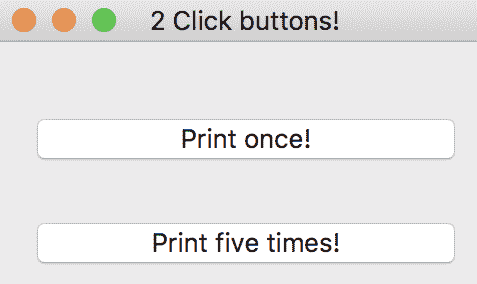
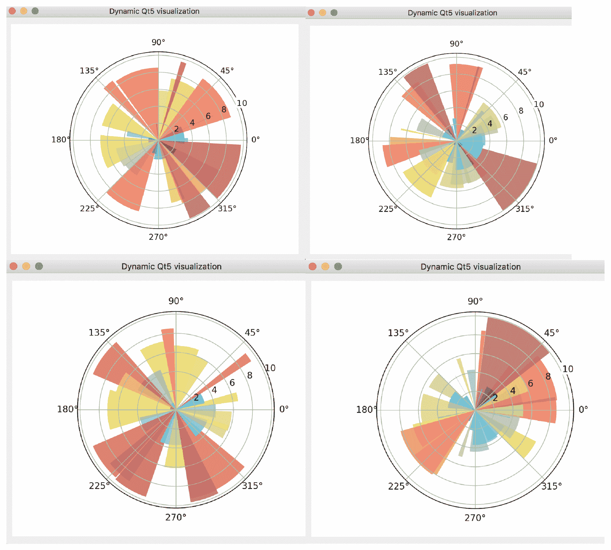
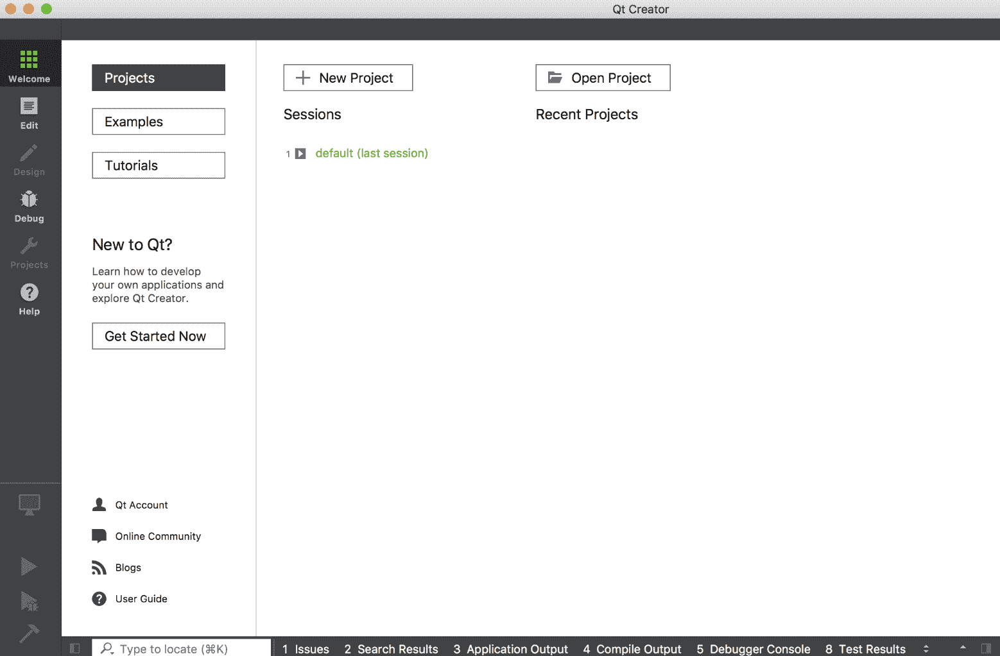
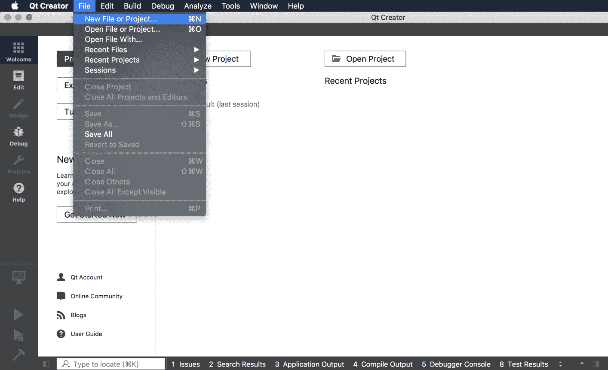
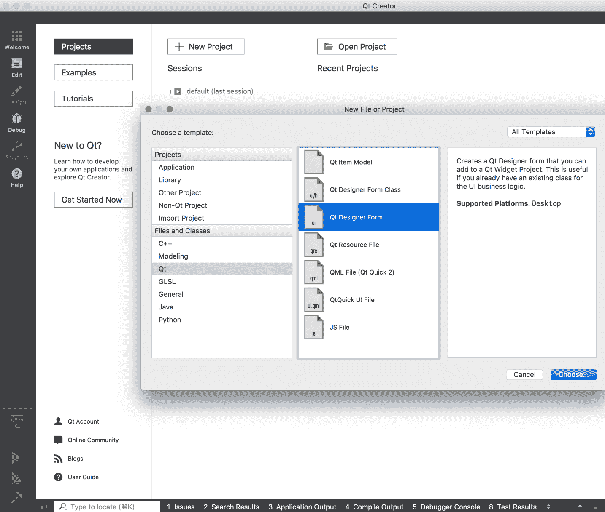
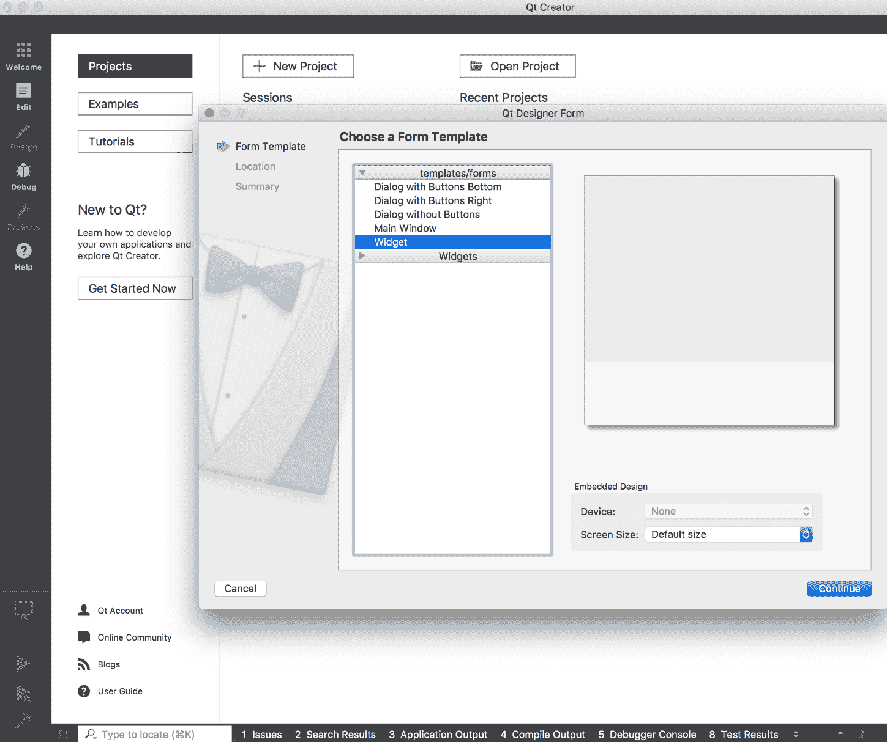
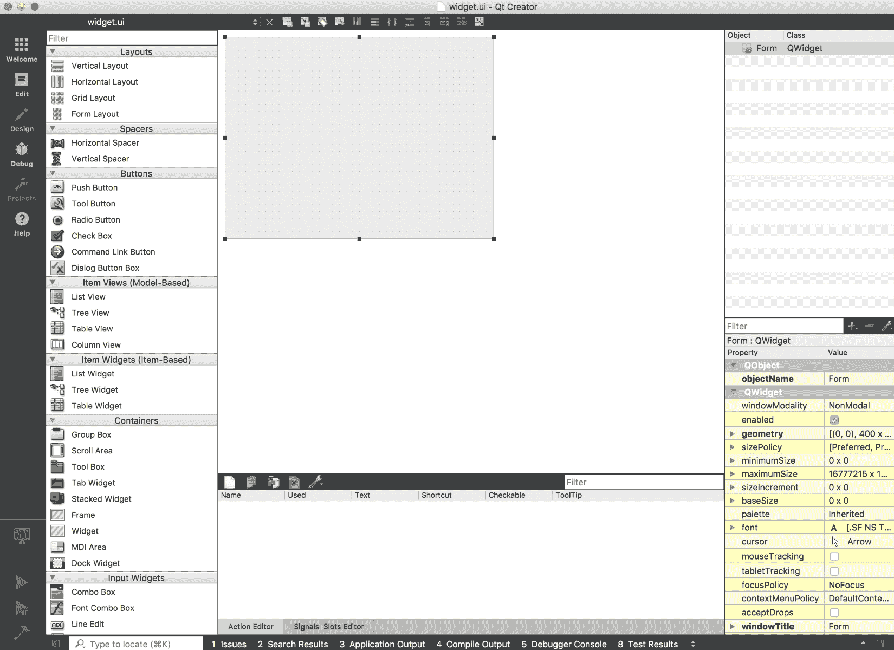
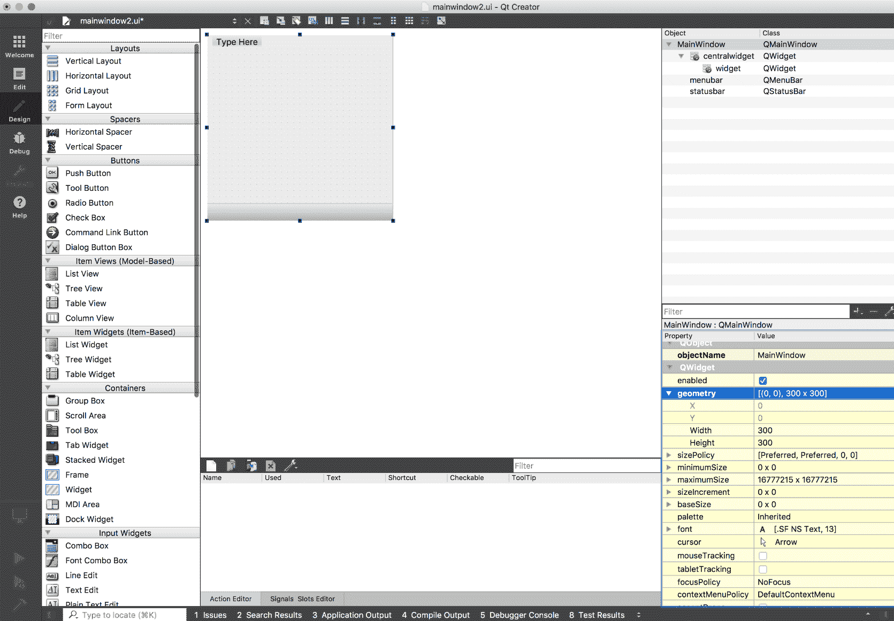
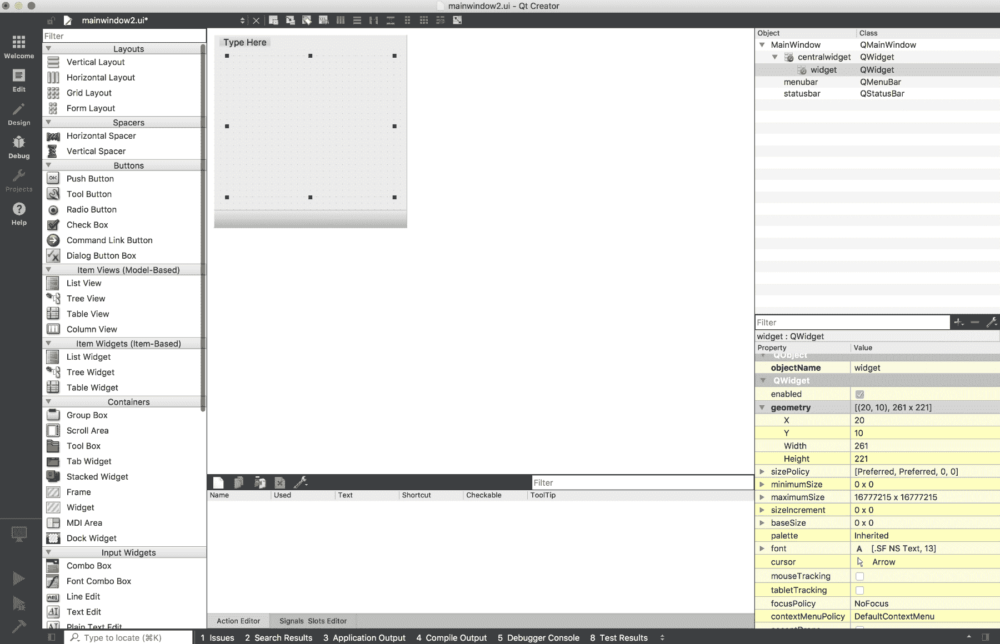
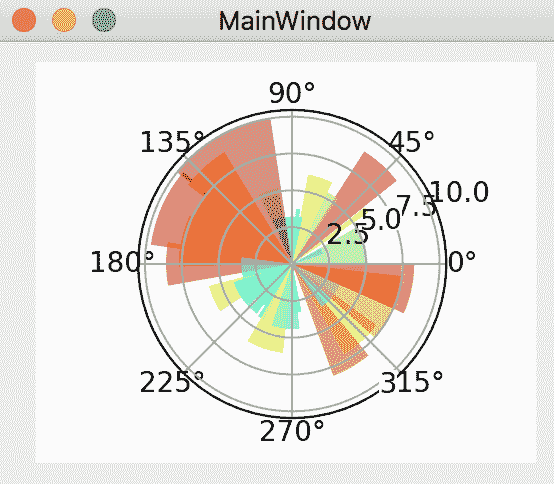

# 第六章：在 Qt 5 中嵌入 Matplotlib

有多种 GUI 库可供选择，其中一个广泛使用的库是 Qt。在本书中，我们将使用 Qt 5，这是该库的最新主要版本。除非明确提及，否则我们在本章节中提到的 Qt 都是指 Qt 5。

我们将遵循与 第五章 *在 GTK+3 中嵌入 Matplotlib* 类似的进度，展示类似的示例，但这次是用 Qt 编写的。

我们认为这种方法将使我们能够直接比较各个库，并且它的优点是不会留下 *我如何使用库 X 编写某个东西？* 这个问题没有答案。

在本章中，我们将学习如何：

+   将 Matplotlib 图形嵌入到 Qt 小部件中

+   将图形和导航工具栏嵌入到 Qt 小部件中

+   使用事件实时更新 Matplotlib 图形

+   使用 QT Designer 绘制 GUI，然后在简单的 Python 应用程序中与 Matplotlib 一起使用

我们将从对该库的介绍开始。

# Qt 5 和 PyQt 5 的简要介绍

Qt 是一个跨平台的应用程序开发框架，广泛用于图形程序（GUI）以及非图形工具。

Qt 由 Trolltech（现为诺基亚所有）开发，可能最著名的是作为 **K 桌面环境** (**KDE**) 的基础，KDE 是 Linux 的桌面环境。

Qt 工具包是一个类集合，旨在简化程序的创建。Qt 不仅仅是一个 GUI 工具包，它还包括用于网络套接字、线程、Unicode、正则表达式、SQL 数据库、SVG、OpenGL 和 XML 的抽象组件。它还具有一个完全功能的 Web 浏览器、帮助系统、多媒体框架以及丰富的 GUI 小部件集合。

Qt 可在多个平台上使用，尤其是 Unix/Linux、Windows、macOS X，以及一些嵌入式设备。由于它使用平台的原生 API 来渲染 Qt 控件，因此使用 Qt 开发的应用程序具有适合运行环境的外观和感觉（而不会看起来像是外来物）。

尽管 Qt 是用 C++ 编写的，但通过可用于 Ruby、Java、Perl 以及通过 PyQt 也支持 Python，Qt 也可以在多个其他编程语言中使用。

PyQt 5 可用于 Python 2.x 和 3.x，但在本书中，我们将在所有代码中一致使用 Python 3。PyQt 5 包含超过 620 个类和 6,000 个函数和方法。在我们进行一些示例之前，了解 Qt 4/PyQt 4 和 Qt 5/PyQt 5 之间的区别是很重要的。

# Qt 4 和 PyQt 4 之间的区别

PyQt 是 Qt 框架的全面 Python 绑定集。然而，PyQt 5 与 PyQt 4 不兼容。值得注意的是，PyQt 5 不支持 Qt v5.0 中标记为弃用或过时的任何 Qt API。尽管如此，可能会偶尔包含一些这些 API。如果包含了它们，它们*会*被视为错误，并在发现时被删除。

如果你熟悉 Qt 4 或者已经读过本书的第一版，需要注意的是，信号与槽的机制在 PyQt 5 中已不再被支持。因此，以下内容在 PyQt 5 中未实现：

+   `QtScript`

+   `QObject.connect()`

+   `QObject.emit()`

+   `SIGNAL()`

+   `SLOT()`

此外，`disconnect()`也做了修改，调用时不再需要参数，且会断开所有与`QObject`实例的连接。

然而，已经引入了新模块，如下所示：

+   `QtBluetooth`

+   `QtPositioning`

+   `Enginio`

让我们从一个非常简单的例子开始——调用一个窗口。同样，为了获得最佳性能，请复制代码，将其粘贴到文件中，并在终端中运行脚本。我们的代码仅优化用于在终端中运行：

```py
#sys.argv is essential for the instantiation of QApplication!
import sys
#Here we import the PyQt 5 Widgets
from PyQt5.QtWidgets import QApplication, QWidget

#Creating a QApplication object
app = QApplication(sys.argv)
#QWidget is the base class of all user interface objects in PyQt5
w = QWidget()
#Setting the width and height of the window
w.resize(250, 150)
#Move the widget to a position on the screen at x=500, y=500 coordinates
w.move(500, 500)
#Setting the title of the window
w.setWindowTitle('Simple')
#Display the window
w.show()

#app.exec_() is the mainloop of the application
#the sys.exit() is a method to ensure a real exit upon receiving the signal of exit from the app
sys.exit(app.exec_())
```


语法与你在第五章中看到的*将 Matplotlib 嵌入 GTK+3*非常相似。一旦你对某个特定的 GUI 库（例如 GTK+3）掌握得比较好，就可以很容易地适应新的 GUI 库。代码与 GTK+3 非常相似，逻辑也跟着走。`QApplication`管理 GUI 应用程序的控制流和主要设置。它是主事件循环执行、处理和分发的地方。它还负责应用程序的初始化和最终化，并处理大多数系统级和应用级的设置。由于`QApplication`处理整个初始化阶段，因此必须在创建与 UI 相关的任何其他对象之前创建它。

`qApp.exec_()`命令进入 Qt 主事件循环。一旦调用了`exit()`或`quit()`，它就会返回相关的返回码。在主循环开始之前，屏幕上不会显示任何内容。调用此函数是必要的，因为主循环处理来自应用程序小部件和窗口系统的所有事件和信号；本质上，在调用之前无法进行任何用户交互。

读者可能会疑惑，为什么`exec_();`中有一个下划线。原因很简单：`exec()`是 Python 中的保留字，因此在`exec()`的 Qt 方法中加了下划线。将其包装在`sys.exit()`内，可以让 Python 脚本以相同的返回码退出，告知环境应用程序的结束状态（无论是成功还是失败）。

对于经验更丰富的读者，你会发现前面的代码中有些不寻常的地方。当我们实例化`QApplication`类时，需要将`sys.argv`（在此情况下是一个空列表）传递给`QApplication`的构造函数。至少当我第一次使用 PyQt 时，这让我感到意外，但这是必须的，因为实例化会调用 C++类`QApplication`的构造函数，并且它使用`sys.argv`来初始化 Qt 应用程序。在`QApplication`实例化时解析`sys.argv`是 Qt 中的一种约定，需要特别注意。另外，每个 PyQt 5 应用程序必须创建一个应用程序对象。

再次尝试以面向对象编程（OOP）风格编写另一个示例：

```py
#Described in earlier examples
import sys
from PyQt5.QtWidgets import QWidget, QPushButton, QHBoxLayout, QVBoxLayout, QApplication

#Here we create a class with the "base" class from QWidget
#We are inheriting the functions of the QWidget from this case
class Qtwindowexample(QWidget):

    #Constructor, will be executed upon instantiation of the object
    def __init__(self):
        #Upon self instantiation, we are calling constructor of the QWidget 
        #to set up the bases of the QWidget's object 
        QWidget.__init__(self)

        #Resizing, moving and setting the window
        self.resize(250, 150)
        self.move(300, 300)
        self.setWindowTitle('2 Click buttons!')

        #Here we create the first button - print1button
        #When clicked, it will invoke the printOnce function, and print "Hello world" in the terminal
        self.print1button = QPushButton('Print once!', self)
        self.print1button.clicked.connect(self.printOnce)

        #Here we create the second button - print5button
        #When clicked, it will invoke the printFive function, and print "**Hello world" 5 times in the terminal
        self.print5button = QPushButton('Print five times!', self)
        self.print5button.clicked.connect(self.printFive)

        #Something very familiar!
        #It is the vertical box in Qt5
        self.vbox=QVBoxLayout()

        #Simply add the two buttons to the vertical box 
        self.vbox.addWidget(self.print1button)
        self.vbox.addWidget(self.print5button)

        #Here put the vertical box into the window
        self.setLayout(self.vbox)
        #And now we are all set, show the window!
        self.show()

    #Function that will print Hello world once when invoked
    def printOnce(self):
        print("Hello World!")

    #Function that will print **Hello world five times when invoked
    def printFive(self):
        for i in range(0,5):
            print("**Hello World!")

#Creating the app object, essential for all Qt usage
app = QApplication(sys.argv)
#Create Qtwindowexample(), construct the window and show!
ex = Qtwindowexample()
#app.exec_() is the mainloop of the application
#the sys.exit() is a method to ensure a real exit upon receiving the signal of exit from the app
sys.exit(app.exec_())

```

上述代码创建了两个按钮，每个按钮都会调用一个独立的函数——在终端中打印一次 `Hello world` 或打印五次 `Hello World`。读者应该能轻松理解代码中的事件处理系统。

这是输出结果：



这是来自[第五章](https://cdp.packtpub.com/matplotlib_for_python_developers__second_edition/wp-admin/post.php?post=375&action=edit#post_362)的另一个两个按钮示例，*将 Matplotlib 嵌入 GTK+3*，这个示例的目的是展示在 PyQt 5 中的信号处理方法，并与 GTK+3 进行对比。读者应该会发现它非常相似，因为我们故意将其写得更接近 GTK+3 示例。

让我们尝试将 Matplotlib 图形嵌入 Qt 窗口。请注意，与上一章的示例不同，这个图形将每秒刷新一次！因此，我们也在这里使用了 `QtCore.QTimer()` 函数，并将 `update_figure()` 函数作为事件-动作对进行调用：

```py
#Importing essential libraries
import sys, os, random, matplotlib, matplotlib.cm as cm
from numpy import arange, sin, pi, random, linspace
#Python Qt5 bindings for GUI objects
from PyQt5 import QtCore, QtWidgets
# import the Qt5Agg FigureCanvas object, that binds Figure to
# Qt5Agg backend.
from matplotlib.backends.backend_qt5agg import FigureCanvasQTAgg as FigureCanvas
from matplotlib.figure import Figure

#The class DynamicCanvas contains all the functions required to draw and update the figure
#It contains a canvas that updates itself every second with newly randomized vecotrs
class DynamicCanvas(FigureCanvas):

    #Invoke upon instantiation, here are the arguments parsing along
    def __init__(self, parent=None, width=5, height=4, dpi=100):
        #Creating a figure with the requested width, height and dpi
        fig = Figure(figsize=(width,height), dpi=dpi)

        #The axes element, here we indicate we are creating 1x1 grid and putting the subplot in the only cell
        #Also we are creating a polar plot, therefore we set projection as 'polar
        self.axes = fig.add_subplot(111, projection='polar')
        #Here we invoke the function "compute_initial_figure" to create the first figure
        self.compute_initial_figure()

        #Creating a FigureCanvas object and putting the figure into it
        FigureCanvas.__init__(self, fig)
        #Setting this figurecanvas parent as None
        self.setParent(parent)

        #Here we are using the Qtimer function
        #As you can imagine, it functions as a timer and will emit a signal every N milliseconds
        #N is defined by the function QTimer.start(N), in this case - 1000 milliseconds = 1 second
        #For every second, this function will emit a signal and invoke the update_figure() function defined below
        timer = QtCore.QTimer(self)
        timer.timeout.connect(self.update_figure)
        timer.start(1000)

    #For drawing the first figure
    def compute_initial_figure(self):
        #Here, we borrow one example shown in the matplotlib gtk3 cookbook
        #and show a beautiful bar plot on a circular coordinate system
        self.theta = linspace(0.0, 2 * pi, 30, endpoint=False)
        self.radii = 10 * random.rand(30)
        self.plot_width = pi / 4 * random.rand(30)
        self.bars = self.axes.bar(self.theta, self.radii, width=self.plot_width, bottom=0.0)

        #Here defines the color of the bar, as well as setting it to be transparent
        for r, bar in zip(self.radii, self.bars):
            bar.set_facecolor(cm.jet(r / 10.))
            bar.set_alpha(0.5)
        #Here we generate the figure
        self.axes.plot()

    #This function will be invoke every second by the timeout signal from QTimer
    def update_figure(self):
        #Clear figure and get ready for the new plot
        self.axes.cla()

        #Identical to the code above
        self.theta = linspace(0.0, 2 * pi, 30, endpoint=False)
        self.radii = 10 * random.rand(30)
        self.plot_width = pi / 4 * random.rand(30)
        self.bars = self.axes.bar(self.theta, self.radii, width=self.plot_width, bottom=0.0)

        #Here defines the color of the bar, as well as setting it to be transparent
        for r, bar in zip(self.radii, self.bars):
            bar.set_facecolor(cm.jet(r / 10.))
            bar.set_alpha(0.5)

        #Here we generate the figure
        self.axes.plot()
        self.draw()

#This class will serve as our main application Window
#QMainWindow class provides a framework for us to put window and canvas
class ApplicationWindow(QtWidgets.QMainWindow):

    #Instantiation, initializing and setting up the framework for the canvas
    def __init__(self):
        #Initializing of Qt MainWindow widget
        QtWidgets.QMainWindow.__init__(self)
        self.setAttribute(QtCore.Qt.WA_DeleteOnClose)
        #Instantiating QWidgets object
        self.main_widget = QtWidgets.QWidget(self)

        #Creating a vertical box!
        vbox = QtWidgets.QVBoxLayout(self.main_widget)
        #Creating the dynamic canvas and this canvas will update itself!
        dc = DynamicCanvas(self.main_widget, width=5, height=4, dpi=100)
        #adding canvas to the vertical box
        vbox.addWidget(dc)

        #This is not necessary, but it is a good practice to setFocus on your main widget
        self.main_widget.setFocus()
        #This line indicates that main_widget is the main part of the application
        self.setCentralWidget(self.main_widget)

#Creating the GUI application
qApp = QtWidgets.QApplication(sys.argv)
#Instantiating the ApplicationWindow widget
aw = ApplicationWindow()
#Set the title
aw.setWindowTitle("Dynamic Qt5 visualization")
#Show the widget
aw.show()
#Start the Qt main loop , and sys.exit() ensure clean exit when closing the window
sys.exit(qApp.exec_())
```

同样，本示例中的图形会通过 `QTimer` 随机化数据，并每秒更新一次，具体如下：



# 引入 QT Creator / QT Designer

上面四个图形是 PyQt 5 窗口的截图，它会每秒刷新一次。

对于简单的示例，直接在 Python 代码中设计 GUI 已经足够，但对于更复杂的应用程序，这种解决方案无法扩展。

有一些工具可以帮助你为 Qt 设计 GUI，其中一个最常用的工具是 QT Designer。在本书的第一版中，本部分讲述的是如何使用 QT Designer 制作 GUI。自从 QT4 后期开发以来，QT Designer 已经与 QT Creator 合并。在接下来的示例中，我们将学习如何在 QT Creator 中打开隐藏的 QT Designer 并创建一个 UI 文件。

类似于 Glade，我们可以通过屏幕上的表单和拖放界面设计应用程序的用户界面。然后，我们可以将小部件与后端代码连接，在那里我们开发应用程序的逻辑。

首先，让我们展示如何在 QT Creator 中打开 QT Designer。当你打开 QT Creator 时，界面如下所示：



难点在于：不要通过点击 Creator 中的“新建文件”或“新建项目”按钮来创建项目。相反，选择“新建项目”：



在文件和类中选择 Qt，并在中间面板中选择 Qt Designer Form：



有一系列模板选择，如 Widget 或 Main Window。在我们的例子中，我们选择 Main Window，并简单地按照其余步骤进行操作：



最终，我们将进入 QT Designer 界面。你在这里做的所有工作将被保存到你指定的文件夹中，作为 UI 文件：



在使用 QT Creator / QT Designer 制作的 GUI 中嵌入 Matplotlib。

为了快速演示如何使用 QT Creator 在 Qt 5 中嵌入 Matplotlib 图形，我们将使用前面的例子，并将其与 QT Creator 生成的脚本结合起来。

首先，在右下角面板调整 MainWindow 的 Geometry；将宽度和高度改为 300x300：



然后，从左侧面板的 Container 中拖动一个 Widget 到中间的 MainWindow 中。调整大小，直到它恰好适合 MainWindow：



基本设计就是这样！现在将其保存为 UI 文件。当你查看 UI 文件时，它应该显示如下内容：

```py
<?xml version="1.0" encoding="UTF-8"?>
<ui version="4.0">
 <class>MainWindow</class>
 <widget class="QMainWindow" name="MainWindow">
  <property name="geometry">
   <rect>
    <x>0</x>
    <y>0</y>
    <width>300</width>
    <height>300</height>
   </rect>
  </property>
  <property name="windowTitle">
   <string>MainWindow</string>
  </property>
  <widget class="QWidget" name="centralwidget">
   <widget class="QWidget" name="widget" native="true">
    <property name="geometry">
     <rect>
      <x>20</x>
      <y>10</y>
      <width>261</width>
      <height>221</height>
     </rect>
    </property>
   </widget>
  </widget>
  <widget class="QMenuBar" name="menubar">
   <property name="geometry">
    <rect>
     <x>0</x>
     <y>0</y>
     <width>300</width>
     <height>22</height>
    </rect>
   </property>
  </widget>
  <widget class="QStatusBar" name="statusbar"/>
 </widget>
 <resources/>
 <connections/>
</ui>
```

这个文件是 XML 格式的，我们需要将它转换为 Python 文件。可以简单地通过使用以下命令来完成：

```py
pyuic5 mainwindow.ui > mainwindow.py
```

现在我们将得到一个像这样的 Python 文件：

```py
from PyQt5 import QtCore, QtGui, QtWidgets

class Ui_MainWindow(object):
    def setupUi(self, MainWindow):
        MainWindow.setObjectName("MainWindow")
        MainWindow.resize(300, 300)
        self.centralwidget = QtWidgets.QWidget(MainWindow)
        self.centralwidget.setObjectName("centralwidget")
        self.widget = QtWidgets.QWidget(self.centralwidget)
        self.widget.setGeometry(QtCore.QRect(20, 10, 261, 221))
        self.widget.setObjectName("widget")
        MainWindow.setCentralWidget(self.centralwidget)
        self.menubar = QtWidgets.QMenuBar(MainWindow)
        self.menubar.setGeometry(QtCore.QRect(0, 0, 300, 22))
        self.menubar.setObjectName("menubar")
        MainWindow.setMenuBar(self.menubar)
        self.statusbar = QtWidgets.QStatusBar(MainWindow)
        self.statusbar.setObjectName("statusbar")
        MainWindow.setStatusBar(self.statusbar)

        self.retranslateUi(MainWindow)
        QtCore.QMetaObject.connectSlotsByName(MainWindow)

    def retranslateUi(self, MainWindow):
        _translate = QtCore.QCoreApplication.translate
        MainWindow.setWindowTitle(_translate("MainWindow", "MainWindow"))
```

请注意，这只是 GUI 的框架；我们仍然需要添加一些内容才能使其正常工作。

我们必须添加`init()`来初始化`UiMainWindow`，并将`DynamicCanvas`与`MainWindow`中间的 widget 连接起来。具体如下：

```py
#Replace object to QtWidgets.QMainWindow
class Ui_MainWindow(QtWidgets.QMainWindow):

    #***Instantiation!
    def __init__(self):
        # Initialize and display the user interface
        QtWidgets.QMainWindow.__init__(self)
        self.setupUi(self)

    def setupUi(self, MainWindow):
        MainWindow.setObjectName("MainWindow")
        MainWindow.resize(300, 300)
        self.centralwidget = QtWidgets.QWidget(MainWindow)
        self.centralwidget.setObjectName("centralwidget")
        self.widget = QtWidgets.QWidget(self.centralwidget)
        self.widget.setGeometry(QtCore.QRect(20, 10, 261, 221))
        self.widget.setObjectName("widget")
        MainWindow.setCentralWidget(self.centralwidget)
        self.menubar = QtWidgets.QMenuBar(MainWindow)
        self.menubar.setGeometry(QtCore.QRect(0, 0, 300, 22))
        self.menubar.setObjectName("menubar")
        MainWindow.setMenuBar(self.menubar)
        self.statusbar = QtWidgets.QStatusBar(MainWindow)
        self.statusbar.setObjectName("statusbar")
        MainWindow.setStatusBar(self.statusbar)

        self.retranslateUi(MainWindow)
        QtCore.QMetaObject.connectSlotsByName(MainWindow)

        #***Putting DynamicCanvas into the widget, and show the window!
        dc = DynamicCanvas(self.widget, width=5, height=4, dpi=100)
        self.show()

    def retranslateUi(self, MainWindow):
        _translate = QtCore.QCoreApplication.translate
        MainWindow.setWindowTitle(_translate("MainWindow", "MainWindow"))
```

我们在这里只添加了五行代码。我们可以简单地用这个替换`ApplicationWindow`类，最终的结果如下：



这是生成上述图形的完整代码：

```py
#Importing essential libraries
import sys, os, random, matplotlib, matplotlib.cm as cm
from numpy import arange, sin, pi, random, linspace
#Python Qt5 bindings for GUI objects
from PyQt5 import QtCore, QtGui, QtWidgets
# import the Qt5Agg FigureCanvas object, that binds Figure to
# Qt5Agg backend.
from matplotlib.backends.backend_qt5agg import FigureCanvasQTAgg as FigureCanvas
from matplotlib.figure import Figure

#The class DynamicCanvas contains all the functions required to draw and update the figure
#It contains a canvas that updates itself every second with newly randomized vecotrs
class DynamicCanvas(FigureCanvas):

    #Invoke upon instantiation, here are the arguments parsing along
    def __init__(self, parent=None, width=5, height=5, dpi=100):
        #Creating a figure with the requested width, height and dpi
        fig = Figure(figsize=(width,height), dpi=dpi)

        #The axes element, here we indicate we are creating 1x1 grid and putting the subplot in the only cell
        #Also we are creating a polar plot, therefore we set projection as 'polar
        self.axes = fig.add_subplot(111, projection='polar')
        #Here we invoke the function "compute_initial_figure" to create the first figure
        self.compute_initial_figure()

        #Creating a FigureCanvas object and putting the figure into it
        FigureCanvas.__init__(self, fig)
        #Setting this figurecanvas parent as None
        self.setParent(parent)

        #Here we are using the Qtimer function
        #As you can imagine, it functions as a timer and will emit a signal every N milliseconds
        #N is defined by the function QTimer.start(N), in this case - 1000 milliseconds = 1 second
        #For every second, this function will emit a signal and invoke the update_figure() function defined below
        timer = QtCore.QTimer(self)
        timer.timeout.connect(self.update_figure)
        timer.start(1000)

    #For drawing the first figure
    def compute_initial_figure(self):
        #Here, we borrow one example shown in the matplotlib gtk3 cookbook
        #and show a beautiful bar plot on a circular coordinate system
        self.theta = linspace(0.0, 2 * pi, 30, endpoint=False)
        self.radii = 10 * random.rand(30)
        self.plot_width = pi / 4 * random.rand(30)
        self.bars = self.axes.bar(self.theta, self.radii, width=self.plot_width, bottom=0.0)

        #Here defines the color of the bar, as well as setting it to be transparent
        for r, bar in zip(self.radii, self.bars):
            bar.set_facecolor(cm.jet(r / 10.))
            bar.set_alpha(0.5)
        #Here we generate the figure
        self.axes.plot()

    #This function will be invoke every second by the timeout signal from QTimer
    def update_figure(self):
        #Clear figure and get ready for the new plot
        self.axes.cla()

        #Identical to the code above
        self.theta = linspace(0.0, 2 * pi, 30, endpoint=False)
        self.radii = 10 * random.rand(30)
        self.plot_width = pi / 4 * random.rand(30)
        self.bars = self.axes.bar(self.theta, self.radii, width=self.plot_width, bottom=0.0)

        #Here defines the color of the bar, as well as setting it to be transparent
        for r, bar in zip(self.radii, self.bars):
            bar.set_facecolor(cm.jet(r / 10.))
            bar.set_alpha(0.5)

        #Here we generate the figure
        self.axes.plot()
        self.draw()

#Created by Qt Creator!
class Ui_MainWindow(QtWidgets.QMainWindow):
    def __init__(self):
        # Initialize and display the user interface
        QtWidgets.QMainWindow.__init__(self)
        self.setupUi(self)

    def setupUi(self, MainWindow):
        MainWindow.setObjectName("MainWindow")
        MainWindow.resize(550, 550)
        self.centralwidget = QtWidgets.QWidget(MainWindow)
        self.centralwidget.setObjectName("centralwidget")
        self.widget = QtWidgets.QWidget(self.centralwidget)
        self.widget.setGeometry(QtCore.QRect(20, 10, 800, 800))
        self.widget.setObjectName("widget")
        MainWindow.setCentralWidget(self.centralwidget)
        self.menubar = QtWidgets.QMenuBar(MainWindow)
        self.menubar.setGeometry(QtCore.QRect(0, 0, 300, 22))
        self.menubar.setObjectName("menubar")
        MainWindow.setMenuBar(self.menubar)
        self.statusbar = QtWidgets.QStatusBar(MainWindow)
        self.statusbar.setObjectName("statusbar")
        MainWindow.setStatusBar(self.statusbar)

        self.retranslateUi(MainWindow)
        QtCore.QMetaObject.connectSlotsByName(MainWindow)

        dc = DynamicCanvas(self.widget, width=5, height=5, dpi=100)
        #self.centralwidget.setFocus()
        #self.setCentralWidget(self.centralwidget)
        self.show()

    def retranslateUi(self, MainWindow):
        _translate = QtCore.QCoreApplication.translate
        MainWindow.setWindowTitle(_translate("MainWindow", "MainWindow"))

#Creating the GUI application
qApp = QtWidgets.QApplication(sys.argv)
#Instantiating the ApplicationWindow widget
aw = Ui_MainWindow()
#Start the Qt main loop , and sys.exit() ensure clean exit when closing the window
sys.exit(qApp.exec_())
```

# 总结

使用 QT Creator / QT Designer 进行 GUI 设计本身就有足够的内容可以写成一本书。因此，在本章中，我们旨在通过 PyQt 5 向你展示 GUI 设计的冰山一角。完成本章后，读者应能理解如何在 QWidget 中嵌入图形，使用布局管理器将图形放入 QWidget 中，创建计时器，响应事件并相应更新 Matplotlib 图形，以及使用 QT Designer 为 Matplotlib 嵌入绘制一个简单的 GUI。

我们现在准备学习另一个 GUI 库，wxWidgets。
