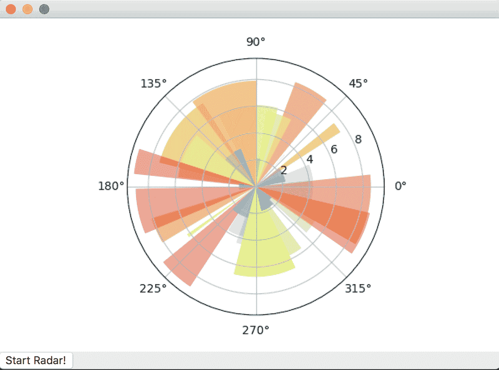
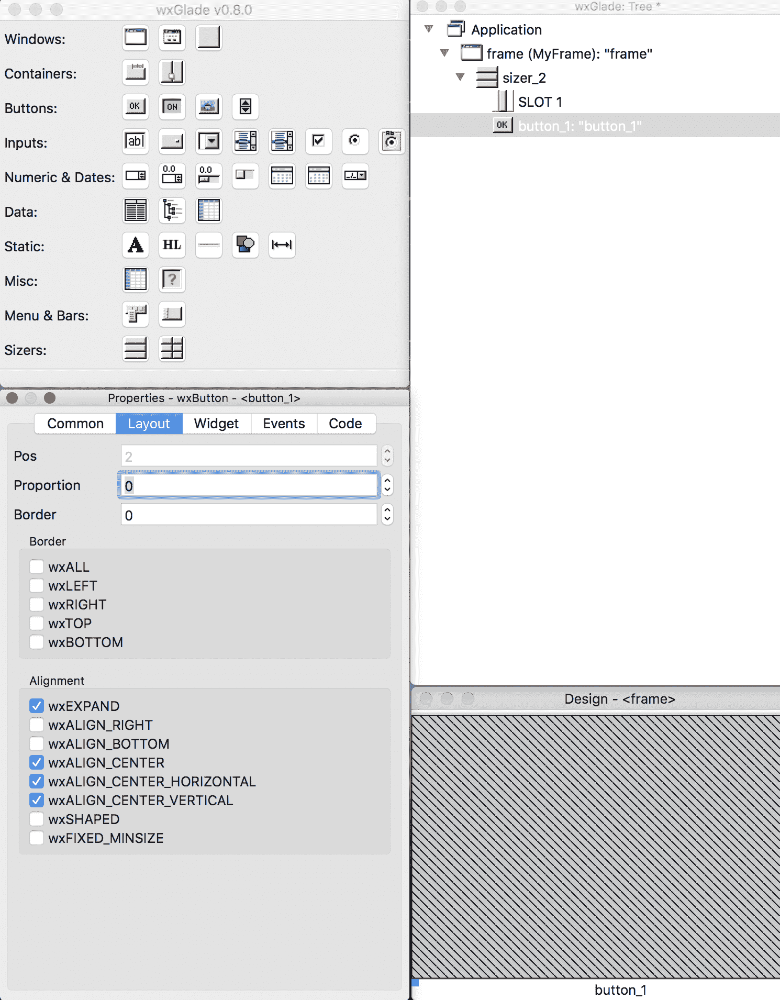

# 第七章：使用 wxPython 将 Matplotlib 嵌入 wxWidgets

本章将解释如何在 wxWidgets 框架中使用 Matplotlib，特别是通过 wxPython 绑定。

本章内容如下：

+   wxWidgets 和 wxPython 的简要介绍

+   嵌入 Matplotlib 到 wxWidgets 的一个简单示例

+   将前一个示例扩展，包含 Matplotlib 导航工具栏

+   如何使用 wxWidgets 框架实时更新 Matplotlib 图表

+   如何使用 wxGlade 设计 GUI 并将 Matplotlib 图形嵌入其中

让我们从 wxWidgets 和 wxPython 的特点概述开始。

# wxWidgets 和 wxPython 的简要介绍

wxWidgets 最重要的特性之一是跨平台的可移植性；它目前支持 Windows、macOS X、Linux（支持 X11、Motif 和 GTK+ 库）、OS/2 和多个其他操作系统与平台（包括正在开发中的嵌入式版本）。

wxWidgets 最好描述为一种本地模式工具包，因为它在各个平台之间提供了一个薄的 API 抽象层，并且在后台使用平台本地的控件，而不是模拟它们。使用本地控件使得 wxWidgets 应用程序具有自然且熟悉的外观和感觉。另一方面，引入额外的层次可能会导致轻微的性能损失，尽管在我们常开发的应用程序中，这种损失不太容易察觉。

wxWidgets 并不仅限于 GUI 开发。它不仅仅是一个图形工具包，还提供了一整套额外的功能，如数据库库、进程间通信层、网络功能等。虽然它是用 C++ 编写的，但有许多绑定可供多种常用编程语言使用。其中包括由 wxPython 提供的 Python 绑定。

wxPython（可在 [`www.wxpython.org/`](http://www.wxpython.org/) 获取）是一个 Python 扩展模块，提供了来自 wxWidgets 库的 Python 语言绑定。这个扩展模块允许 Python 程序员创建 wxWidgets 类的实例，并调用这些类的方法。

现在是引入 wxPython 的好时机，因为 wxPython 4 在一年前发布了。到目前为止（2018 年 4 月），wxPython 的最新版本是 4.0.1，并且它与 Python 2 和 Python 3 都兼容。

从 2010 年开始，凤凰计划是清理 wxPython 实现并使其兼容 Python 3 的努力。正如大家所想，wxPython 完全重写，重点放在了性能、可维护性和可扩展性上。

让我们走一遍使用 wxPython 的最基本示例！

```py
#Here imports the wxPython library
import wx
#Every wxPython app is an instance of wx.App
app = wx.App(False)
#Here we create a wx.Frame() and specifying it as a top-level window
#by stating "None" as a parent object
frame = wx.Frame(None, wx.ID_ANY, "Hello World")
#Show the frame!
frame.Show(True)
#Start the applciation's MainLoop, and ready for events handling
app.MainLoop()
```


在前面的示例基础上，有一件非常重要的事情是初学者需要注意的。

`wx.Frame`和`wx.Window()`是非常不同的。`wx.Window`是 wxWidgets 中所有视觉元素的基类，如按钮和菜单；在 wxWidgets 中，我们通常将程序窗口称为`wx.Frame`。

构造`wx.Frame`的语法为`wx.Frame(Parent, ID, Title)`。当将`Parent`指定为`None`时，如刚才所示，我们实际上是在说这个框架是一个顶级`window`。

wxWidgets 中还有一个**ID 系统**。各种控件和 wxWidgets 的其他部分都需要一个 ID。有时，ID 由用户提供；另外，ID 也有预定义的值。然而，在大多数情况下（如前面的示例），ID 的值并不重要，我们可以使用`wx.ID_ANY`作为对象的 ID，告诉 wxWidgets 自动分配 ID。请记住，所有自动分配的 ID 都是负数，而用户定义的 ID 应始终为正数，以避免与自动分配的 ID 冲突。

现在，让我们来看一个需要事件处理的面向对象风格的示例——`Hello world`按钮示例：

```py
#Here imports the wxPython library
import wx

#Here is the class for the Frame inheriting from wx.Frame
class MyFrame(wx.Frame):

    #Instantiation based on the constructor defined below
    def __init__(self, parent):
        #creating the frame object and assigning it to self
        wx.Frame.__init__(self, parent, wx.ID_ANY)
        #Create panel
        self.panel = wx.Panel(self)
        #wx.BoxSizer is essentially the vertical box,
        #and we will add the buttons to the BoxSizer
        self.sizer = wx.BoxSizer(wx.VERTICAL)

        #Creating button 1 that will print Hello World once
        self.button1 = wx.Button(self.panel,label="Hello World!")
        #Create button 2 that will print Hello World twice
        self.button2 = wx.Button(self.panel,label="Hello World 5 times!")

        #There are two ways to bind the button with the event, here is method 1:
        self.button1.Bind(wx.EVT_BUTTON, self.OnButton1)
        self.button2.Bind(wx.EVT_BUTTON, self.OnButton2)

        #Here is method 2: 
        #self.Bind(wx.EVT_BUTTON, self.OnButton1, self.button1)
        #self.Bind(wx.EVT_BUTTON, self.OnButton2, self.button2)

        #Here we add the button to the BoxSizer
        self.sizer.Add(self.button1,0,0,0)
        self.sizer.Add(self.button2,0,0,0)

        #Put sizer into panel
        self.panel.SetSizer(self.sizer)

    #function that will be invoked upon pressing button 1
    def OnButton1(self,event):
        print("Hello world!")

    #function that will be invoked upon pressing button 2
    def OnButton2(self,event):
        for i in range(0,5):
            print("Hello world!")

#Every wxPython app is an instance of wx.App
app = wx.App()
#Here we create a wx.Frame() and specifying it as a top-level window
#by stating "None" as a parent object
frame = MyFrame(None)
#Show the frame!
frame.Show()
#Start the applciation's MainLoop, and ready for events handling
app.MainLoop()
```

输出结果如下：


正如读者可能注意到的，我们讨论过的所有三个 GUI 库的语法都很相似。因此，熟悉其中一个库后，你可以轻松地在它们之间切换。

wxWidgets 的布局管理器是`sizer`小部件：它们是小部件（包括其他 sizer）的容器，根据我们的配置处理小部件尺寸的视觉排列。`BoxSizer`接受一个参数，表示其方向。在这种情况下，我们传递常量`wx.VERTICAL`来将小部件按列排列；如果需要一排小部件，也可以使用常量`wx.HORIZONTAL`：

```py
self.sizer.Add(self.button1, 1, wx.LEFT | wx.TOP | wx.EXPAND)
```

我们现在能够将`FigureCanvas`对象添加到`sizer`中了。`Add()`函数的参数非常重要：

+   第一个参数是要添加的对象的引用。

+   然后，我们有第二个参数——比例。这个值用于表示应将多少额外的空闲空间分配给此小部件。通常，GUI 中的小部件不会占据所有空间，因此会有一些额外的空闲空间可用。这些空间会根据每个小部件与 GUI 中所有小部件的比例值进行重新分配。举个例子：如果我们有三个小部件，它们的比例分别为`0`、`1`和`2`，那么第一个（比例为`0`）将完全不变化。第三个（比例为`2`）将比第二个（比例为`1`）变化两倍。在书中的示例中，我们将比例设置为`1`，因此我们声明该小部件在调整大小时应占用一份空闲空间。

+   第三个参数是一个标志组合，用于进一步配置在`sizer`中小部件的行为。它控制边框、对齐、各小部件之间的间隔以及扩展。在这里，我们声明`FigureCanvas`应在窗口调整大小时进行扩展。

让我们尝试一个示例，将 Matplotlib 图形（极坐标图）嵌入到由 wxWidgets 支持的 GUI 中：

```py
#Specifying that we are using WXAgg in matplotlib
import matplotlib
matplotlib.use('WXAgg')
#Here imports the wxPython and other supporting libraries
import wx, sys, os, random, matplotlib, matplotlib.cm as cm, matplotlib.pyplot as plt
from numpy import arange, sin, pi, random, linspace
from matplotlib.backends.backend_wxagg import FigureCanvasWxAgg as FigureCanvas
from matplotlib.backends.backend_wx import NavigationToolbar2Wx
from matplotlib.figure import Figure

class MyFrame(wx.Frame):
    def __init__(self):
        # Initializing the Frame
        wx.Frame.__init__(self, None, -1, title="", size=(600,500))
        #Create panel
        panel = wx.Panel(self)

        #Here we prepare the figure, canvas and axes object for the graph
        self.fig = Figure(figsize=(6,4), dpi=100)
        self.canvas = FigureCanvas(self, -1, self.fig)
        self.ax = self.fig.add_subplot(111, projection='polar')

        #Here, we borrow one example shown in the matplotlib gtk3 cookbook
        #and show a beautiful bar plot on a circular coordinate system
        self.theta = linspace(0.0, 2 * pi, 30, endpoint=False)
        self.radii = 10 * random.rand(30)
        self.plot_width = pi / 4 * random.rand(30)
        self.bars = self.ax.bar(self.theta, self.radii, width=self.plot_width, bottom=0.0)

        #Here defines the color of the bar, as well as setting it to be transparent
        for r, bar in zip(self.radii, self.bars):
            bar.set_facecolor(cm.jet(r / 10.))
            bar.set_alpha(0.5)
        #Here we generate the figure
        self.ax.plot()

        #Creating the vertical box of wxPython
        self.vbox = wx.BoxSizer(wx.VERTICAL)
        #Add canvas to the vertical box
        self.vbox.Add(self.canvas, wx.ALIGN_CENTER|wx.ALL, 1)
        #Add vertical box to the panel
        self.SetSizer(self.vbox)
        #Optimizing the size of the elements in vbox
        self.vbox.Fit(self)

#Every wxPython app is an instance of wx.App
app = wx.App()
#Here we create a wx.Frame() and specifying it as a top-level window
#by stating "None" as a parent object
frame = MyFrame()
#Show the frame!
frame.Show()
#Start the applciation's MainLoop, and ready for events handling
app.MainLoop()
```

输出：


我们已经展示了如何将 Matplotlib 图形嵌入到 GUI 中；然而，我们还没有展示 Matplotlib 和 wxWidgets 之间的交互。通过添加一个按钮并将一个函数绑定（`Bind`）到按钮上，可以轻松实现这一点。每次用户点击按钮时，这将更新图形。

让我们走一步通过点击按钮来更新图形的示例！尽管我们使用的是相同的图形，但底层的更新方法不同。这里我们将通过点击事件来更新图形，而不是如第六章中所示的自动计时器，*在 Qt 5 中嵌入 Matplotlib*：

```py
#Specifying that we are using WXAgg in matplotlib
import matplotlib
matplotlib.use('WXAgg')
#Here imports the wxPython and other supporting libraries
import wx, numpy, matplotlib.cm as cm, matplotlib.pyplot as plt
from numpy import arange, sin, pi, random, linspace
from matplotlib.backends.backend_wxagg import FigureCanvasWxAgg as FigureCanvas
from matplotlib.backends.backend_wx import NavigationToolbar2Wx
from matplotlib.figure import Figure

#This figure looks like it is from a radar, so we name the class radar
class Radar(wx.Frame):
    #Instantiation of Radar
    def __init__(self):
        # Initializing the Frame
        wx.Frame.__init__(self, None, -1, title="", size=(600,500))
        # Creating the panel
        panel = wx.Panel(self)
        #Setting up the figure, canvas and axes for drawing
        self.fig = Figure(figsize=(6,4), dpi=100)
        self.canvas = FigureCanvas(self, -1, self.fig)
        self.ax = self.fig.add_subplot(111, projection='polar')

        #Here comes the trick, create the button "Start Radar!"
        self.updateBtn = wx.Button(self, -1, "Start Radar!")
        #Bind the button with the clicking event, and invoke the update_fun function
        self.Bind(wx.EVT_BUTTON, self.update_fun, self.updateBtn)

        #Create the vertical box of Widgets
        self.vbox = wx.BoxSizer(wx.VERTICAL)
        #Add the canvas to the vertical box
        self.vbox.Add(self.canvas, wx.ALIGN_CENTER|wx.ALL, 1)
        #Add the button to the vertical box
        self.vbox.Add(self.updateBtn)
        #Add the vertical box to the Frame
        self.SetSizer(self.vbox)
        #Make sure the elements in the vertical box fits the figure size
        self.vbox.Fit(self)

    def update_fun(self,event):
        #Make sure we clear the figure each time before redrawing
        self.ax.cla()
        #updating the axes figure
        self.ax = self.fig.add_subplot(111, projection='polar')
        #Here, we borrow one example shown in the matplotlib gtk3 cookbook
        #and show a beautiful bar plot on a circular coordinate system
        self.theta = linspace(0.0, 2 * pi, 30, endpoint=False)
        self.radii = 10 * random.rand(30)
        self.plot_width = pi / 4 * random.rand(30)
        self.bars = self.ax.bar(self.theta, self.radii, width=self.plot_width, bottom=0.0)

        #Here defines the color of the bar, as well as setting it to be transparent
        for r, bar in zip(self.radii, self.bars):
            bar.set_facecolor(cm.jet(r / 10.))
            bar.set_alpha(0.5)

        #Here we draw on the canvas!
        self.fig.canvas.draw()
        #And print on terminal to make sure the function was invoked upon trigger
        print('Updating figure!')

#Every wxPython app is an instance of wx.App
app = wx.App(False)
#Here we create a wx.Frame() and specifying it as a top-level window
#by stating "None" as a parent object
frame = Radar()
#Show the frame!
frame.Show()
#Start the applciation's MainLoop, and ready for events handling
app.MainLoop()
```

输出：

  

通过点击“开始雷达！”按钮，我们调用`update_fun`函数，每次都会重新绘制一个新的图形。

# 在 wxGlade 中嵌入 Matplotlib 图形

对于非常简单的应用程序，GUI 界面比较有限的情况下，我们可以在应用程序源代码内部设计界面。一旦 GUI 变得更加复杂，这种方案就不可行，我们需要一个工具来支持我们进行 GUI 设计。wxWidgets 中最著名的工具之一就是 wxGlade。

wxGlade 是一个使用 wxPython 编写的界面设计程序，这使得它可以在所有支持这两个工具的平台上运行。

该理念与著名 GTK+图形用户界面设计工具 Glade 相似，外观和体验也非常相似。wxGlade 是一个帮助我们创建 wxWidgets 或 wxPython 用户界面的程序，但它并不是一个功能完整的代码编辑器；它只是一个设计器，生成的代码只是显示已创建的小部件。

尽管凤凰计划和 wxPython 4 相对较新，但它们都得到了 wxGlade 的支持。wxGlade 可以从 SourceForge 下载，用户可以轻松下载压缩包，解压缩并通过**`python3`**命令运行 wxGlade：

```py
python3 wxglade.py
```

这里就是用户界面！


这里是*图 5*中三个主要窗口的细节。左上角的窗口是主要的调色板窗口。第一行的第一个按钮（Windows）是创建一个框架作为一切基础的按钮。左下角的窗口是属性窗口，它让我们显示和编辑应用程序、窗口和控件的属性。右边的窗口是树形窗口。它让我们可视化结构，允许编辑项目的结构，包括其应用程序、窗口、布局和控件。通过在树形窗口中选择一个项目，我们可以在属性窗口中编辑其对应的属性。

让我们点击按钮以 添加一个框架。接下来会出现一个小窗口：


选择基础类为 wxFrame；然后我们将在以下截图中生成一个 设计 窗口。从这里开始，我们可以点击并添加我们喜欢的按钮和功能：


首先，让我们为之前展示的代码创建一个容器。在点击任何按钮之前，我们先回顾一下前面 GUI 所需的基本元素：

+   框架

+   垂直框（`wx.BoxSizer`）

+   按钮

所以这非常简单；让我们点击 调色板 窗口中的 sizer 按钮，然后点击 设计 窗口：


从 树状窗口 中，我们可以看到 GUI 的结构。我们有一个包含两个插槽的框架。然而，我们希望使用垂直框而不是水平框；这可以在点击 sizer_2 时在 属性 窗口中进行修改：


现在让我们向插槽 2 添加一个按钮！这可以通过点击 调色板 窗口中的 按钮，然后点击 设计 窗口下部的插槽来完成。不过，从这里看，按钮的显示效果并不好。它位于下方面板的左侧。我们可以通过在 树状窗口中选择 _button1，并在 属性 窗口的布局选项卡中修改对齐方式来更改它。

在这里，我们选择了 wxEXPAND 和 wxALIGN_CENTER，这意味着它必须扩展并填充框架的宽度；这也确保它始终对齐到插槽的中心：



到目前为止，框架已经设置完成。让我们通过选择 文件 然后 生成代码来导出代码：


点击生成代码后，文件将保存在所选文件夹中（即用户保存 `wxWidget` 文件的文件夹），以下是一个代码片段：

```py
#!/usr/bin/env python
# -*- coding: UTF-8 -*-
#
# generated by wxGlade 0.8.0 on Sun Apr  8 20:35:42 2018
#

import wx

# begin wxGlade: dependencies
# end wxGlade

# begin wxGlade: extracode
# end wxGlade

class MyFrame(wx.Frame):
    def __init__(self, *args, **kwds):
        # begin wxGlade: MyFrame.__init__
        kwds["style"] = kwds.get("style", 0) | wx.DEFAULT_FRAME_STYLE
        wx.Frame.__init__(self, *args, **kwds)
        self.SetSize((500, 550))
        self.button_1 = wx.Button(self, wx.ID_ANY, "button_1")

        self.__set_properties()
        self.__do_layout()
        # end wxGlade

    def __set_properties(self):
        # begin wxGlade: MyFrame.__set_properties
        self.SetTitle("frame")
        # end wxGlade

    def __do_layout(self):
        # begin wxGlade: MyFrame.__do_layout
        sizer_2 = wx.BoxSizer(wx.VERTICAL)
        sizer_2.Add((0, 0), 0, 0, 0)
        sizer_2.Add(self.button_1, 0, wx.ALIGN_CENTER | wx.EXPAND, 0)
        self.SetSizer(sizer_2)
        self.Layout()
        # end wxGlade

# end of class MyFrame

class MyApp(wx.App):
    def OnInit(self):
        self.frame = MyFrame(None, wx.ID_ANY, "")
        self.SetTopWindow(self.frame)
        self.frame.Show()
        return True

# end of class MyApp

if __name__ == "__main__":
    app = MyApp(0)
    app.MainLoop()
```

上述代码提供了一个独立的图形界面。然而，它缺少一些关键功能来使一切正常工作。让我们快速扩展一下，看看它是如何工作的：

```py
import matplotlib
matplotlib.use('WXAgg')

import wx, numpy, matplotlib.cm as cm, matplotlib.pyplot as plt
from numpy import arange, sin, pi, random, linspace
from matplotlib.backends.backend_wxagg import FigureCanvasWxAgg as FigureCanvas
from matplotlib.backends.backend_wx import NavigationToolbar2Wx
from matplotlib.figure import Figure

class MyFrame(wx.Frame):
    def __init__(self, *args, **kwds):
        # begin wxGlade: MyFrame.__init__
        kwds["style"] = kwds.get("style", 0) | wx.DEFAULT_FRAME_STYLE
        wx.Frame.__init__(self, *args, **kwds)
        self.SetSize((500, 550))
        self.button_1 = wx.Button(self, wx.ID_ANY, "button_1")
##Code being added***
        self.Bind(wx.EVT_BUTTON, self.__updat_fun, self.button_1)
        #Setting up the figure, canvas and axes
        self.fig = Figure(figsize=(5,5), dpi=100)
        self.canvas = FigureCanvas(self, -1, self.fig)
        self.ax = self.fig.add_subplot(111, projection='polar')
        ##End of Code being added***self.__set_properties()
        self.__do_layout()
        # end wxGlade

    def __set_properties(self):
        # begin wxGlade: MyFrame.__set_properties
        self.SetTitle("frame")
        # end wxGlade

    def __do_layout(self):
        # begin wxGlade: MyFrame.__do_layout
        sizer_2 = wx.BoxSizer(wx.VERTICAL)
        sizer_2.Add(self.canvas, 0, wx.ALIGN_CENTER|wx.ALL, 1)
        sizer_2.Add(self.button_1, 0, wx.ALIGN_CENTER | wx.EXPAND, 0)
        self.SetSizer(sizer_2)
        self.Layout()
        # end wxGlade
##The udpate_fun that allows the figure to be updated upon clicking
##The __ in front of the update_fun indicates that it is a private function in Python syntax
    def __updat_fun(self,event):
        self.ax.cla()
        self.ax = self.fig.add_subplot(111, projection='polar')
        #Here, we borrow one example shown in the matplotlib gtk3 cookbook
        #and show a beautiful bar plot on a circular coordinate system
        self.theta = linspace(0.0, 2 * pi, 30, endpoint=False)
        self.radii = 10 * random.rand(30)
        self.plot_width = pi / 4 * random.rand(30)
        self.bars = self.ax.bar(self.theta, self.radii, width=self.plot_width, bottom=0.0)

        #Here defines the color of the bar, as well as setting it to be transparent
        for r, bar in zip(self.radii, self.bars):
            bar.set_facecolor(cm.jet(r / 10.))
            bar.set_alpha(0.5)

        self.fig.canvas.draw()
        print('Updating figure!')

# end of class MyFrame class MyApp(wx.App):
    def OnInit(self):
        self.frame = MyFrame(None, wx.ID_ANY, "")
        self.SetTopWindow(self.frame)
        self.frame.Show()
        return True

# end of class MyApp

if __name__ == "__main__":
    app = MyApp(0)
    app.MainLoop()
```

# 总结

现在，我们可以开发 wxWidgets 应用程序，并将 Matplotlib 嵌入其中。具体来说，读者应该能够在 wxFrame 中嵌入 Matplotlib 图形，使用 sizer 将图形和导航工具栏都嵌入到 wxFrame 中，通过交互更新图表，并使用 wxGlade 设计一个用于 Matplotlib 嵌入的 GUI。

我们现在准备继续前进，看看如何将 Matplotlib 集成到网页中。
