# 第八章：将 Matplotlib 与 Web 应用程序集成

基于 Web 的应用程序（Web 应用）具有多重优势。首先，用户可以跨平台享受统一的体验。其次，由于无需安装过程，用户可以享受更简化的工作流。最后，从开发者的角度来看，开发周期可以简化，因为需要维护的特定平台代码较少。鉴于这些优势，越来越多的应用程序正在在线开发。

由于 Python 的流行和灵活性，Web 开发者使用基于 Python 的 Web 框架（如 Django 和 Flask）开发 Web 应用程序是有道理的。事实上，根据 [`hotframeworks.com/`](http://hotframeworks.com/) 的数据，Django 和 Flask 分别在 175 个框架中排名第 6 和第 13。这些框架是 *功能齐全的*。从用户身份验证、用户管理、内容管理到 API 设计，它们都提供了完整的解决方案。代码库经过开源社区的严格审查，因此使用这些框架开发的网站可以防御常见攻击，如 SQL 注入、跨站请求伪造和跨站脚本攻击。

在本章中，我们将学习如何开发一个简单的网站，展示比特币的价格。将介绍基于 Django 的示例。我们将使用 Docker 18.03.0-ce 和 Django 2.0.4 进行演示。首先，我们将通过初始化基于 Docker 的开发环境的步骤来开始。

# 安装 Docker

Docker 允许开发者在自包含且轻量级的容器中运行应用程序。自 2013 年推出以来，Docker 迅速在开发者中获得了广泛的关注。在其技术的核心，Docker 使用 Linux 内核的资源隔离方法，而不是完整的虚拟化监控程序来运行应用程序。

这使得代码的开发、打包、部署和管理变得更加简便。因此，本章中的所有代码开发工作将基于 Docker 环境进行。

# Docker for Windows 用户

在 Windows 上安装 Docker 有两种方式：名为 Docker for Windows 的包和 Docker Toolbox。我推荐使用稳定版本的 Docker Toolbox，因为 Docker for Windows 需要在 64 位 Windows 10 Pro 中支持 Hyper-V。同时，Docker for Windows 不支持较旧版本的 Windows。详细的安装说明可以在 [`docs.docker.com/toolbox/toolbox_install_windows/`](https://docs.docker.com/toolbox/toolbox_install_windows/) 中找到，但我们也将在这里介绍一些重要步骤。

首先，从以下链接下载 Docker Toolbox：[`github.com/docker/toolbox/releases`](https://github.com/docker/toolbox/releases)。选择名为 `DockerToolbox-xx.xx.x-ce.exe` 的文件，其中 `x` 表示最新版本号：

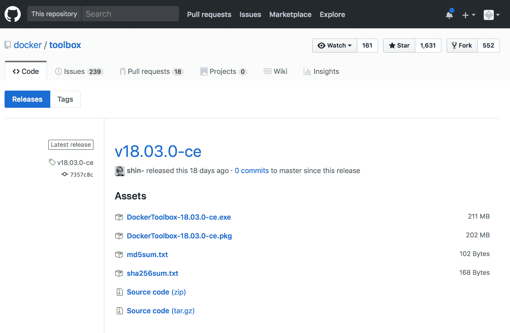

接下来，运行下载的安装程序。按照每个提示的默认说明进行安装：

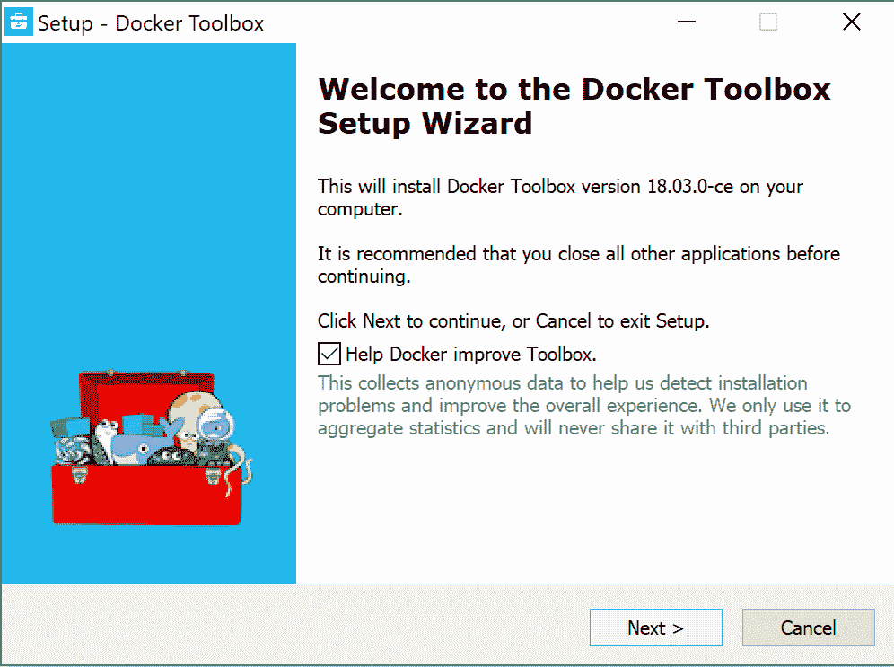

Windows 可能会询问你是否允许进行某些更改，这是正常的，确保你允许这些更改发生。

最后，一旦安装完成，你应该能够在开始菜单中找到 Docker Quickstart Terminal：

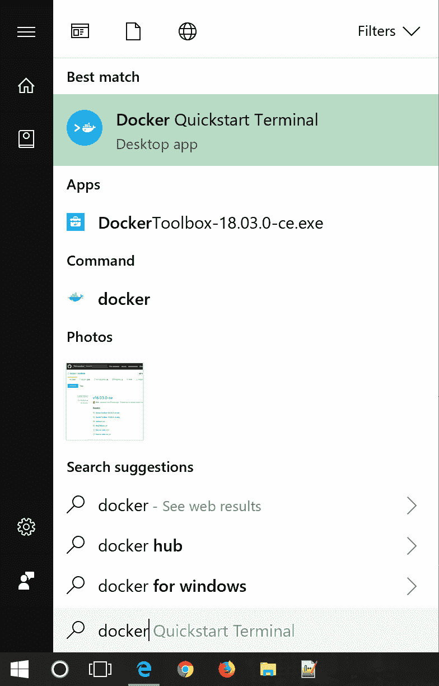

点击图标启动 Docker Toolbox 终端，这将开始初始化过程。当该过程完成时，将显示以下终端：

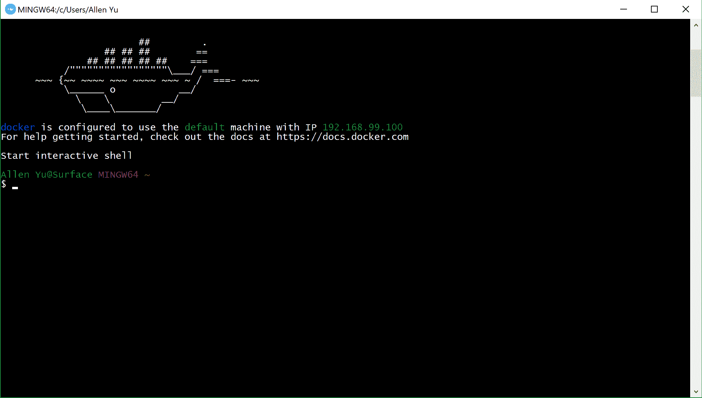

# Mac 用户的 Docker

对于 Mac 用户，我推荐 Docker CE for Mac（稳定版）应用程序，可以在 [`store.docker.com/editions/community/docker-ce-desktop-mac`](https://store.docker.com/editions/community/docker-ce-desktop-mac) 下载。此外，完整的安装指南可以通过以下链接找到：[`docs.docker.com/docker-for-mac/install/`](https://docs.docker.com/docker-for-mac/install/)。

Docker CE for Mac 的安装过程可能比 Windows 版本更简单。以下是主要步骤：

1.  首先，双击下载的 `Docker.dmg` 文件以挂载映像。当你看到以下弹窗时，将左侧的 Docker 图标拖动到右侧的应用程序文件夹中：

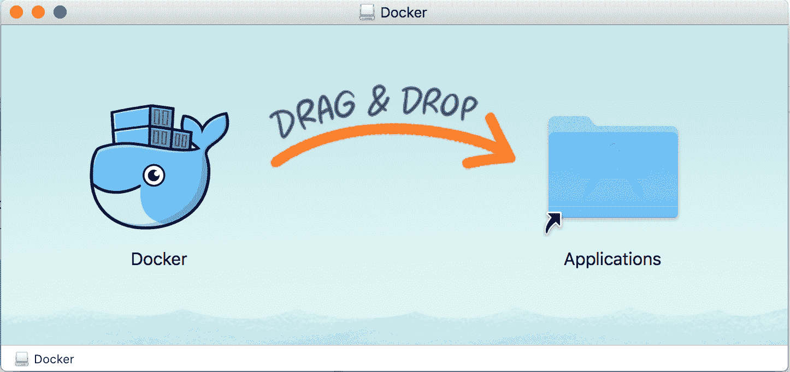

1.  接下来，在你的应用程序文件夹或启动台中，找到并双击 Docker 应用程序。如果 Docker 启动成功，你应该能够在顶部状态栏看到一个鲸鱼图标：


1.  最后，打开应用程序 | 实用工具文件夹中的终端应用程序。键入 `docker info`，然后按 *Enter* 键检查 Docker 是否正确安装：

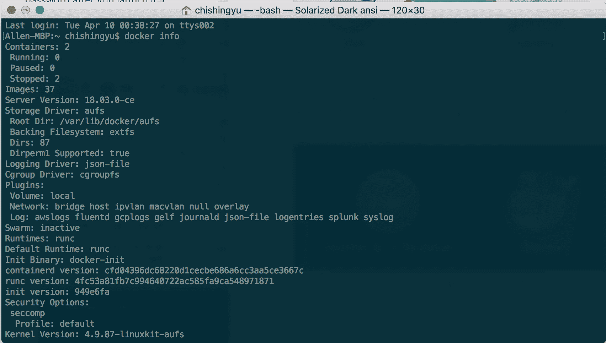

# 更多关于 Django

Django 是一个流行的 web 框架，旨在简化 web 应用程序的开发和部署。它包括大量的模板代码，处理日常任务，如数据库模型管理、前端模板、会话认证和安全性。Django 基于 **模型-模板-视图**（**MTV**）设计模式构建。

模型可能是 MTV 中最关键的组件。它指的是如何通过不同的表格和属性来表示你的数据。它还将不同数据库引擎的细节抽象化，使得相同的模型可以应用于 SQLite、MySQL 和 PostgreSQL。同时，Django 的模型层会暴露特定于引擎的参数，如 PostgreSQL 中的 `ArrayField` 和 `JSONField`，用于微调数据表示。

模板类似于经典 MTV 框架中视图的作用。它处理数据的展示给用户。换句话说，它不涉及数据是如何生成的逻辑。

Django 中的视图负责处理用户请求，并返回相应的逻辑。它位于模型层和模板层之间。视图决定应该从模型中提取何种数据，以及如何处理数据以供模板使用。

Django 的主要卖点如下：

+   **开发速度**：提供了大量的关键组件；这减少了开发周期中的重复任务。例如，使用 Django 构建一个简单的博客只需几分钟。

+   **安全性**：Django 包含了 Web 安全的最佳实践。SQL 注入、跨站脚本、跨站请求伪造和点击劫持等黑客攻击的风险大大降低。其用户认证系统使用 PBKDF2 算法和加盐的 SHA256 哈希，这是 NIST 推荐的。其他先进的哈希算法，如 Argon2，也可用。

+   **可扩展性**：Django 的 MTV 层使用的是无共享架构。如果某一层成为 Web 应用程序的瓶颈，只需增加更多硬件；Django 将利用额外的硬件来支持每一层。

# 在 Docker 容器中进行 Django 开发

为了保持整洁，让我们创建一个名为`Django`的空目录来托管所有文件。在`Django`目录内，我们需要使用我们喜欢的文本编辑器创建一个`Dockerfile`来定义容器的内容。`Dockerfile`定义了容器的基础镜像以及编译镜像所需的命令。

欲了解更多有关 Dockerfile 的信息，请访问[`docs.docker.com/engine/reference/builder/`](https://docs.docker.com/engine/reference/builder/)。

我们将使用 Python 3.6.5 作为基础镜像。请将以下代码复制到您的 Dockerfile 中。一系列附加命令定义了工作目录和初始化过程：

```py
# The official Python 3.6.5 runtime is used as the base image
FROM python:3.6.5-slim
# Disable buffering of output streams
ENV PYTHONUNBUFFERED 1
# Create a working directory within the container
RUN mkdir /app
WORKDIR /app
# Copy files and directories in the current directory to the container
ADD . /app/
# Install Django and other dependencies
RUN pip install -r requirements.txt
```

如您所见，我们还需要一个文本文件`requirements.txt`，以定义项目中的任何包依赖。请将以下内容添加到项目所在文件夹中的`requirements.txt`文件中：

```py
Django==2.0.4
Matplotlib==2.2.2
stockstats==0.2.0
seaborn==0.8.1
```

现在，我们可以在终端中运行`docker build -t django`来构建镜像。构建过程可能需要几分钟才能完成：

在运行命令之前，请确保您当前位于相同的项目文件夹中。

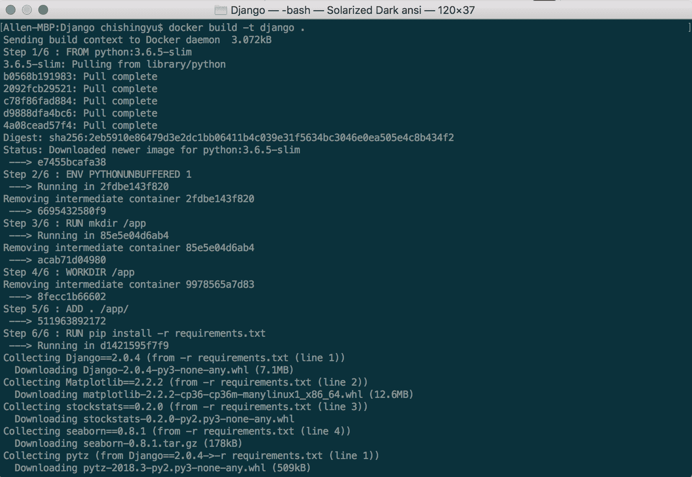

如果构建过程完成，将显示以下消息。`Successfully built ...`消息结尾的哈希码可能会有所不同：

```py
Successfully built 018e75992e59
Successfully tagged django:latest
```

# 启动一个新的 Django 站点

我们现在将使用`docker run`命令创建一个新的 Docker 容器。`-v "$(pwd)":/app`参数创建了当前目录到容器内`/app`的绑定挂载。当前目录中的文件将在主机和客机系统之间共享。

第二个未标记的参数 `django` 定义了用于创建容器的映像。命令字符串的其余部分如下：

```py
django django-admin startproject --template=https://github.com/arocks/edge/archive/master.zip --extension=py,md,html,env crypto_stats
```

这被传递给客户机容器以执行。它使用 Arun Ravindran 的边缘模板 ([`django-edge.readthedocs.io/en/latest/`](https://django-edge.readthedocs.io/en/latest/)) 创建了一个名为 `crypto_stats` 的新 Django 项目：

```py
docker run -v "$(pwd)":/app django django-admin startproject --template=https://github.com/arocks/edge/archive/master.zip --extension=py,md,html,env crypto_stats
```

成功执行后，如果您进入新创建的 `crypto_stats` 文件夹，您应该能看到以下文件和目录：

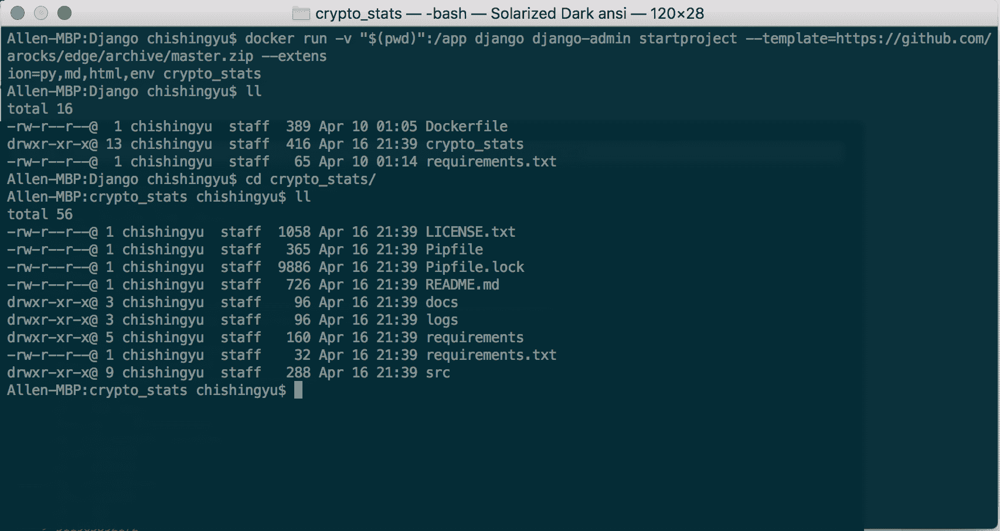

# Django 依赖项的安装

`crypto_stats` 文件夹中的 `requirements.txt` 文件定义了我们的 Django 项目的 Python 包依赖关系。要安装这些依赖项，请执行以下 `docker run` 命令。

参数 `-p 8000:8000` 将端口 `8000` 从客户机暴露给主机机器。参数 `-it` 创建一个支持 `stdin` 的伪终端，以允许交互式终端会话。

我们再次使用 `django` 映像，但这次我们启动了一个 Bash 终端 shell：

```py
docker run -v "$(pwd)":/app -p 8000:8000 -it django bash
cd crypto_stats
pip install -r requirements.txt
```

在执行命令时，请确保您仍然位于项目的根目录（即 `Django`）中。

命令链将产生以下结果：

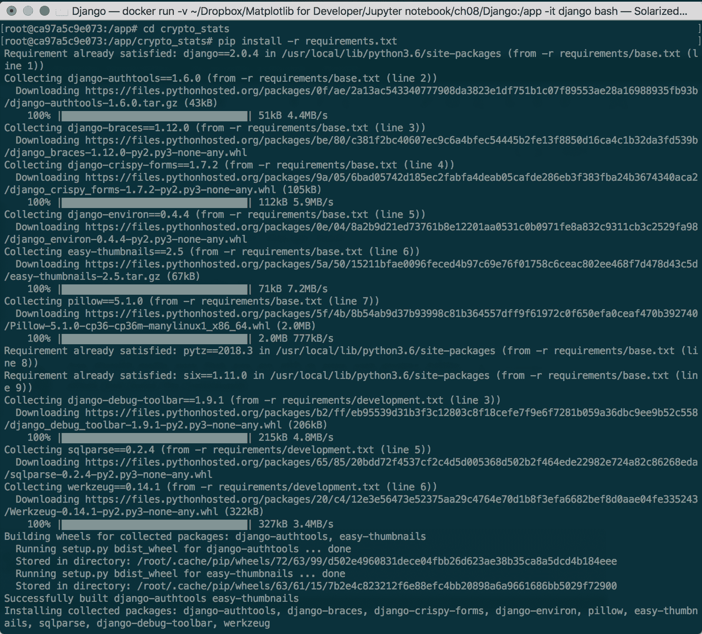

# Django 环境设置

敏感的环境变量，例如 Django 的 `SECRET_KEY` ([`docs.djangoproject.com/en/2.0/ref/settings/#std:setting-SECRET_KEY`](https://docs.djangoproject.com/en/2.0/ref/settings/#std:setting-SECRET_KEY))，应该保存在一个从版本控制软件中排除的私有文件中。为简单起见，我们可以直接使用项目模板中的示例：

```py
cd src
cp crypto_stats/settings/local.sample.env crypto_stats/settings/local.env
```

接下来，我们可以使用 `manage.py` 来创建一个默认的 SQLite 数据库和超级用户：

```py
python manage.py migrate
python manage.py createsuperuser
```

`migrate` 命令初始化数据库模型，包括用户认证、管理员、用户配置文件、用户会话、内容类型和缩略图。

`createsuperuser` 命令将询问您一系列问题以创建超级用户：

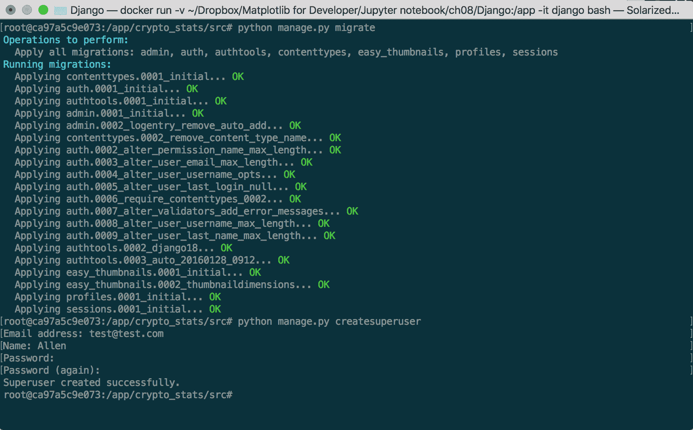

# 运行开发服务器

启动默认的开发服务器非常简单；实际上，只需一行代码：

```py
python manage.py runserver 0.0.0.0:8000
```

参数 `0.0.0.0:8000` 将告诉 Django 在端口 `8000` 上为所有地址提供网站服务。

在您的主机上，您现在可以启动您喜欢的浏览器，并访问 `http://localhost:8000` 查看您的网站：

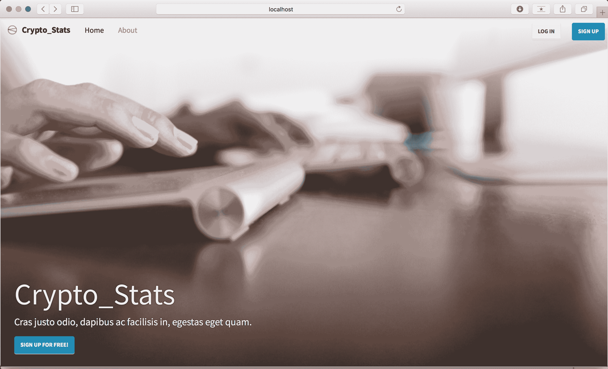

网站的外观还不错，是吗？

# 使用 Django 和 Matplotlib 显示比特币价格

现在，我们仅使用几个命令就建立了一个完整的网站框架。希望您能欣赏使用 Django 进行网页开发的简便性。现在，我将演示如何将 Matplotlib 图表集成到 Django 网站中，这是本章的关键主题。

# 创建一个 Django 应用程序

Django 生态系统中的一个应用指的是在网站中处理特定功能的应用程序。例如，我们的默认项目已经包含了 profile 和 account 应用程序。澄清了术语后，我们准备构建一个显示比特币最新价格的应用。

我们应该让开发服务器在后台运行。当服务器检测到代码库的任何更改时，它将自动重新加载以反映更改。因此，现在我们需要启动一个新的终端并连接到正在运行的服务器容器：

```py
docker exec -it 377bfb2f3db4 bash
```

`bash`前面的那些看起来很奇怪的数字是容器的 ID。我们可以从持有正在运行的服务器的终端中找到该 ID：

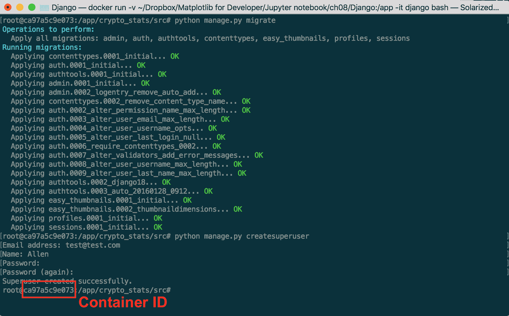

或者，我们可以通过发出以下命令来获取所有正在运行的容器的 ID：

```py
docker ps -a
```

`docker exec`命令帮助你返回到与开发服务器相同的 Bash 环境。我们现在可以启动一个新应用：

```py
cd /app/crypto_stats/src
python manage.py startapp bitcoin
```

在主机计算机的项目目录中，我们应该能够看到`crypto_stats/src/`下的新`bitcoin`文件夹：

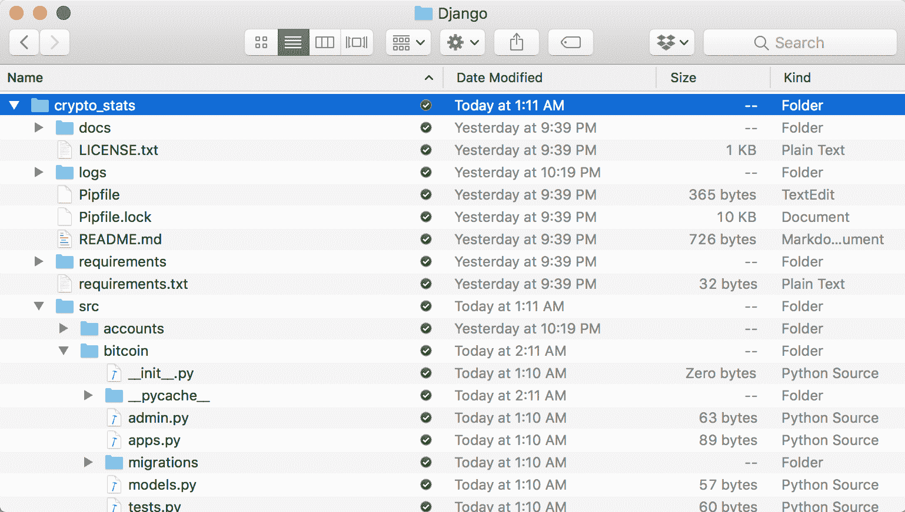

# 创建一个简单的 Django 视图

我将通过一个简单的折线图演示创建 Django 视图的工作流程。

在新创建的比特币应用文件夹中，你应该能够找到`views.py`，它存储了应用中的所有视图。让我们编辑它并创建一个输出 Matplotlib 折线图的视图：

```py
from django.shortcuts import render
from django.http import HttpResponse

# Create your views here.
from io import BytesIO
import matplotlib
matplotlib.use('Agg')
import matplotlib.pyplot as plt

def test_view(request):
    # Create a new Matplotlib figure
    fig, ax = plt.subplots()

    # Prepare a simple line chart
    ax.plot([1, 2, 3, 4], [3, 6, 9, 12])

    ax.set_title('Matplotlib Chart in Django') 

    plt.tight_layout()

    # Create a bytes buffer for saving image
    fig_buffer = BytesIO()
    plt.savefig(fig_buffer, dpi=150)

    # Save the figure as a HttpResponse
    response = HttpResponse(content_type='image/png')
    response.write(fig_buffer.getvalue())
    fig_buffer.close()

    return response
```

由于我们的服务器容器中没有 Tkinter，我们需要通过首先调用`matplotlib.use('Agg')`来将 Matplotlib 图形后端从默认的 TkAgg 切换到 Agg。

`matplotlib.use('Agg')`必须在`import matplotlib`之后，并且在调用任何 Matplotlib 函数之前立即调用。

函数`test_view`（request）期望一个 Django `HttpRequest`对象（[`docs.djangoproject.com/en/2.0/ref/request-response/#django.http.HttpRequest`](https://docs.djangoproject.com/en/2.0/ref/request-response/#django.http.HttpRequest)）作为输入，并输出一个 Django `HttpResponse`对象（[`docs.djangoproject.com/en/2.0/ref/request-response/#django.http.HttpResponse`](https://docs.djangoproject.com/en/2.0/ref/request-response/#django.http.HttpResponse)）。

为了将 Matplotlib 图表导入到`HttpResponse`对象中，我们需要先将图表保存到一个中间的`BytesIO`对象中，该对象可以在`io`包中找到（[`docs.python.org/3/library/io.html#binary-i-o`](https://docs.python.org/3/library/io.html#binary-i-o)）。`BytesIO`对象充当二进制图像文件的缓冲区，以便`plt.savefig`能够直接将 PNG 文件写入其中。

接下来，我们创建一个新的`HttpResponse()`对象，并将`content_type`参数设置为`image/png`。缓冲区中的二进制内容通过`response.write(fig_buffer.getvalue())`导出到`HttpResponse()`对象中。最后，关闭缓冲区以释放临时内存。

为了将用户引导到这个视图，我们需要在`{Project_folder}/crypto_stats/src/bitcoin`文件夹内创建一个名为`urls.py`的新文件。

```py
from django.urls import path

from . import views

app_name = 'bitcoin'
urlpatterns = [
    path('test/', views.test_view),
]
```

这一行`path('test/', views.test_view)`表示所有以`test/`结尾的 URL 将被定向到`test_view`。

我们还需要将应用的`url`模式添加到全局模式中。让我们编辑`{Project_folder}/crypto_stats/src/crypto_stats/urls.py`，并添加以下两行注释：

```py
...
import profiles.urls
import accounts.urls
# Import your app's url patterns here
import bitcoin.urls
from . import views

...

urlpatterns = [
    path('', views.HomePage.as_view(), name='home'),
    path('about/', views.AboutPage.as_view(), name='about'),
    path('users/', include(profiles.urls)),
    path('admin/', admin.site.urls),
    # Add your app's url patterns here
    path('bitcoin/', include(bitcoin.urls)),
    path('', include(accounts.urls)),
]
...
```

这一行`path('bitcoin/', include(bitcoin.urls)),`表示所有以[`<your-domain>/bitcoin`](http://%3Cyour-domain/bitcoin)开头的 URL 将被定向到比特币应用。

等待几秒钟直到开发服务器重新加载。现在，你可以前往[`localhost:8000/bitcoin/test/`](http://localhost:8000/bitcoin/test/)查看你的图表。

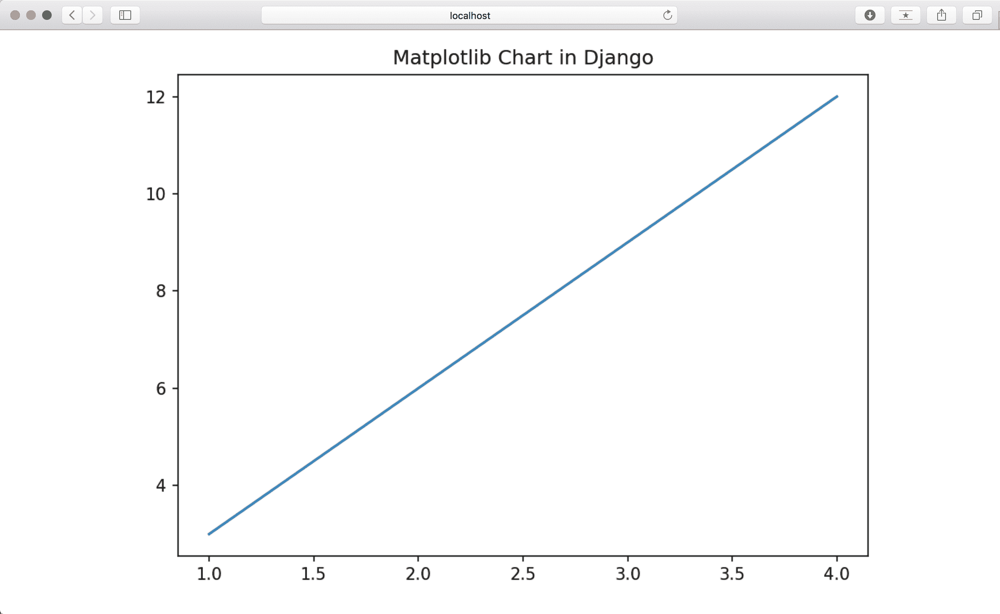

# 创建比特币 K 线图视图

在这一部分，我们将从 Quandl API 获取比特币的历史价格。请注意，我们无法保证所展示的可视化数据的准确性、完整性或有效性；也不对可能发生的任何错误或遗漏负责。数据、可视化和分析仅以*现状*提供，仅供教育用途，且不提供任何形式的保证。建议读者在做出投资决策之前，先进行独立的个别加密货币研究。

如果你不熟悉 Quandl，它是一个金融和经济数据仓库，存储着来自数百个发布者的数百万数据集。在使用 Quandl API 之前，你需要在其网站上注册一个账户（[`www.quandl.com`](https://www.quandl.com)）。可以通过以下链接的说明获取免费的 API 访问密钥：[`docs.quandl.com/docs#section-authentication`](https://docs.quandl.com/docs#section-authentication)。在下一章我会介绍更多关于 Quandl 和 API 的内容。

现在，删除`crypto_stats/src/bitcoin`文件夹中的现有`views.py`文件。从本章的代码库中将`views1.py`复制到`crypto_stats/src/bitcoin`，并将其重命名为`views.py`。我会相应地解释`views1.py`中的每一部分。

在 Bitstamp 交易所的比特币历史价格数据可以在此找到：[`www.quandl.com/data/BCHARTS/BITSTAMPUSD-Bitcoin-Markets-bitstampUSD`](https://www.quandl.com/data/BCHARTS/BITSTAMPUSD-Bitcoin-Markets-bitstampUSD)。我们目标数据集的唯一标识符是`BCHARTS/BITSTAMPUSD`。尽管 Quandl 提供了官方的 Python 客户端库，我们为了演示导入 JSON 数据的一般流程，将不使用该库。`get_bitcoin_dataset`函数仅使用`urllib.request.urlopen`和`json.loads`来从 API 获取 JSON 数据。最后，数据被处理为 pandas DataFrame，以供进一步使用。

```py
... A bunch of import statements

def get_bitcoin_dataset():
    """Obtain and parse a quandl bitcoin dataset in Pandas DataFrame     format
     Quandl returns dataset in JSON format, where data is stored as a 
     list of lists in response['dataset']['data'], and column headers
     stored in response['dataset']['column_names'].

     Returns:
     df: Pandas DataFrame of a Quandl dataset"""

    # Input your own API key here
    api_key = ""

    # Quandl code for Bitcoin historical price in BitStamp exchange
    code = "BCHARTS/BITSTAMPUSD"
    base_url = "https://www.quandl.com/api/v3/datasets/"
    url_suffix = ".json?api_key="

    # We want to get the data within a one-year window only
    time_now = datetime.datetime.now()
    one_year_ago = time_now.replace(year=time_now.year-1)
    start_date = one_year_ago.date().isoformat()
    end_date = time_now.date().isoformat()
    date = "&start_date={}&end_date={}".format(start_date, end_date)

    # Fetch the JSON response 
    u = urlopen(base_url + code + url_suffix + api_key + date)
    response = json.loads(u.read().decode('utf-8'))

    # Format the response as Pandas Dataframe
    df = pd.DataFrame(response['dataset']['data'], columns=response['dataset']['column_names'])

    # Convert Date column from string to Python datetime object,
    # then to float number that is supported by Matplotlib.
    df["Datetime"] = date2num(pd.to_datetime(df["Date"], format="%Y-%m-%d").tolist())

    return df
```

记得在这一行指定你自己的 API 密钥：`api_key = ""`。

`df`中的`Date`列是作为一系列 Python 字符串记录的。尽管 Seaborn 可以在某些函数中使用字符串格式的日期，Matplotlib 却不行。为了使日期能够进行数据处理和可视化，我们需要将其转换为 Matplotlib 支持的浮动点数。因此，我使用了`matplotlib.dates.date2num`来进行转换。

我们的数据框包含每个交易日的开盘价和收盘价，以及最高价和最低价。到目前为止，我们描述的所有图表都无法在一个图表中描述所有这些变量的趋势。

在金融世界中，蜡烛图几乎是描述股票、货币和商品在一段时间内价格变动的默认选择。每根蜡烛由描述开盘价和收盘价的主体，以及展示最高价和最低价的延伸蜡烛线组成，表示某一特定交易日。如果收盘价高于开盘价，蜡烛通常为黑色。相反，如果收盘价低于开盘价，蜡烛则为红色。交易者可以根据颜色和蜡烛主体的边界来推断开盘价和收盘价。

在下面的示例中，我们将准备一个比特币在过去 30 个交易日的数据框中的蜡烛图。`candlestick_ohlc`函数是从已废弃的`matplotlib.finance`包中改编而来。它绘制时间、开盘价、最高价、最低价和收盘价为一个从低到高的垂直线。它进一步使用一系列彩色矩形条来表示开盘和收盘之间的跨度。

```py
def candlestick_ohlc(ax, quotes, width=0.2, colorup='k', colordown='r',
 alpha=1.0):
    """
    Parameters
    ----------
    ax : `Axes`
    an Axes instance to plot to
    quotes : sequence of (time, open, high, low, close, ...) sequences
    As long as the first 5 elements are these values,
    the record can be as long as you want (e.g., it may store volume).
    time must be in float days format - see date2num
    width : float
        fraction of a day for the rectangle width
    colorup : color
        the color of the rectangle where close >= open
    colordown : color
        the color of the rectangle where close < open
    alpha : float
        the rectangle alpha level
    Returns
    -------
    ret : tuple
        returns (lines, patches) where lines is a list of lines
        added and patches is a list of the rectangle patches added
    """
    OFFSET = width / 2.0
    lines = []
    patches = []
    for q in quotes:
        t, open, high, low, close = q[:5]
        if close >= open:
            color = colorup
            lower = open
            height = close - open
        else:
            color = colordown
            lower = close
            height = open - close

        vline = Line2D(
                   xdata=(t, t), ydata=(low, high),
                   color=color,
                   linewidth=0.5,
                   antialiased=True,
        )
        rect = Rectangle(
                     xy=(t - OFFSET, lower),
                     width=width,
                     height=height,
                     facecolor=color,
                     edgecolor=color,
        )
        rect.set_alpha(alpha)
        lines.append(vline)
        patches.append(rect)
        ax.add_line(vline)
        ax.add_patch(rect)
        ax.autoscale_view()

    return lines, patches
```

`bitcoin_chart`函数处理用户请求的实际处理和`HttpResponse`的输出。

```py
def bitcoin_chart(request):
    # Get a dataframe of bitcoin prices
    bitcoin_df = get_bitcoin_dataset()

    # candlestick_ohlc expects Date (in floating point number), Open, High, Low, Close columns only
    # So we need to select the useful columns first using DataFrame.loc[]. Extra columns can exist, 
    # but they are ignored. Next we get the data for the last 30 trading only for simplicity of plots.
    candlestick_data = bitcoin_df.loc[:, ["Datetime",
                                          "Open",
                                          "High",
                                          "Low",
                                          "Close",
                                          "Volume (Currency)"]].iloc[:30]

    # Create a new Matplotlib figure
    fig, ax = plt.subplots()

    # Prepare a candlestick plot
    candlestick_ohlc(ax, candlestick_data.values, width=0.6)

    ax.xaxis.set_major_locator(WeekdayLocator(MONDAY)) # major ticks on the mondays
    ax.xaxis.set_minor_locator(DayLocator()) # minor ticks on the days
    ax.xaxis.set_major_formatter(DateFormatter('%Y-%m-%d'))
    ax.xaxis_date() # treat the x data as dates

    # rotate all ticks to vertical
    plt.setp(ax.get_xticklabels(), rotation=90, horizontalalignment='right') 

    ax.set_ylabel('Price (US $)') # Set y-axis label

    plt.tight_layout()

    # Create a bytes buffer for saving image
    fig_buffer = BytesIO()
    plt.savefig(fig_buffer, dpi=150)

    # Save the figure as a HttpResponse
    response = HttpResponse(content_type='image/png')
    response.write(fig_buffer.getvalue())
    fig_buffer.close()

    return response
```

`ax.xaxis.set_major_formatter(DateFormatter('%Y-%m-%d'))` 对于将浮动点数转换回日期非常有用。

与第一个 Django 视图示例类似，我们需要修改`urls.py`，将 URL 指向我们的`bitcoin_chart`视图。

```py
from django.urls import path

from . import views

app_name = 'bitcoin'
urlpatterns = [
    path('30/', views.bitcoin_chart),
]
```

完成！你可以通过访问`http://localhost:8000/bitcoin/30/`查看比特币蜡烛图。

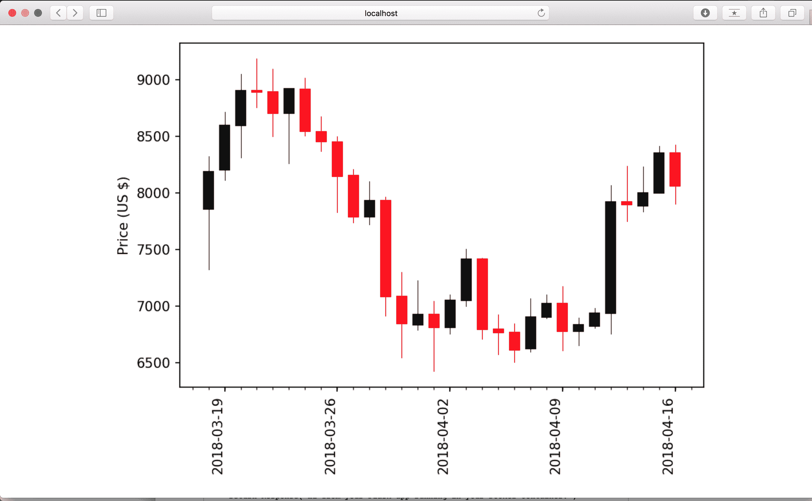

# 集成更多的价格指标

当前形式的蜡烛图有些单调。交易者通常会叠加股票指标，如**平均真实范围**（**ATR**）、布林带、**商品通道指数**（**CCI**）、**指数移动平均线**（**EMA**）、**平滑异同移动平均线**（**MACD**）、**相对强弱指数**（**RSI**）等，用于技术分析。

Stockstats ([`github.com/jealous/stockstats`](https://github.com/jealous/stockstats)) 是一个很棒的包，可以用来计算前面提到的指标/统计数据以及更多内容。它基于 pandas DataFrame，并在访问时动态生成这些统计数据。

在这一部分，我们可以通过`stockstats.StockDataFrame.retype()`将一个 pandas DataFrame 转换为一个 stockstats DataFrame。然后，可以通过遵循`StockDataFrame["variable_timeWindow_indicator"]`的模式访问大量的股票指标。例如，`StockDataFrame['open_2_sma']`会给我们开盘价的 2 日简单移动平均。某些指标可能有快捷方式，因此请参考官方文档获取更多信息。

我们代码库中的`views2.py`文件包含了创建扩展比特币定价视图的代码。你可以将本章代码库中的`views2.py`复制到`crypto_stats/src/bitcoin`目录，并将其重命名为`views.py`。

下面是我们之前代码中需要的重要更改：

```py
# FuncFormatter to convert tick values to Millions
def millions(x, pos):
    return '%dM' % (x/1e6)

def bitcoin_chart(request):
    # Get a dataframe of bitcoin prices
    bitcoin_df = get_bitcoin_dataset()

    # candlestick_ohlc expects Date (in floating point number), Open, High, Low, Close columns only
    # So we need to select the useful columns first using DataFrame.loc[]. Extra columns can exist, 
    # but they are ignored. Next we get the data for the last 30 trading only for simplicity of plots.
    candlestick_data = bitcoin_df.loc[:, ["Datetime",
                                          "Open",
                                          "High",
                                          "Low",
                                          "Close",
                                          "Volume (Currency)"]].iloc[:30]

    # Convert to StockDataFrame
    # Need to pass a copy of candlestick_data to StockDataFrame.retype
    # Otherwise the original candlestick_data will be modified
    stockstats = StockDataFrame.retype(candlestick_data.copy())

    # 5-day exponential moving average on closing price
    ema_5 = stockstats["close_5_ema"]
    # 10-day exponential moving average on closing price
    ema_10 = stockstats["close_10_ema"]
    # 30-day exponential moving average on closing price
    ema_30 = stockstats["close_30_ema"]
    # Upper Bollinger band
    boll_ub = stockstats["boll_ub"]
    # Lower Bollinger band
    boll_lb = stockstats["boll_lb"]
    # 7-day Relative Strength Index
    rsi_7 = stockstats['rsi_7']
    # 14-day Relative Strength Index
    rsi_14 = stockstats['rsi_14']

    # Create 3 subplots spread across three rows, with shared x-axis. 
    # The height ratio is specified via gridspec_kw
    fig, axarr = plt.subplots(nrows=3, ncols=1, sharex=True, figsize=(8,8),
                             gridspec_kw={'height_ratios':[3,1,1]})

    # Prepare a candlestick plot in the first axes
    candlestick_ohlc(axarr[0], candlestick_data.values, width=0.6)

    # Overlay stock indicators in the first axes
    axarr[0].plot(candlestick_data["Datetime"], ema_5, lw=1, label='EMA (5)')
    axarr[0].plot(candlestick_data["Datetime"], ema_10, lw=1, label='EMA (10)')
    axarr[0].plot(candlestick_data["Datetime"], ema_30, lw=1, label='EMA (30)')
    axarr[0].plot(candlestick_data["Datetime"], boll_ub, lw=2, linestyle="--", label='Bollinger upper')
    axarr[0].plot(candlestick_data["Datetime"], boll_lb, lw=2, linestyle="--", label='Bollinger lower')

    # Display RSI in the second axes
    axarr[1].axhline(y=30, lw=2, color = '0.7') # Line for oversold threshold
    axarr[1].axhline(y=50, lw=2, linestyle="--", color = '0.8') # Neutral RSI
    axarr[1].axhline(y=70, lw=2, color = '0.7') # Line for overbought threshold
    axarr[1].plot(candlestick_data["Datetime"], rsi_7, lw=2, label='RSI (7)')
    axarr[1].plot(candlestick_data["Datetime"], rsi_14, lw=2, label='RSI (14)')

    # Display trade volume in the third axes
    axarr[2].bar(candlestick_data["Datetime"], candlestick_data['Volume (Currency)'])

    # Label the axes
    axarr[0].set_ylabel('Price (US $)')
    axarr[1].set_ylabel('RSI')
    axarr[2].set_ylabel('Volume (US $)')

    axarr[2].xaxis.set_major_locator(WeekdayLocator(MONDAY)) # major ticks on the mondays
    axarr[2].xaxis.set_minor_locator(DayLocator()) # minor ticks on the days
    axarr[2].xaxis.set_major_formatter(DateFormatter('%Y-%m-%d'))
    axarr[2].xaxis_date() # treat the x data as dates
    axarr[2].yaxis.set_major_formatter(FuncFormatter(millions)) # Change the y-axis ticks to millions
    plt.setp(axarr[2].get_xticklabels(), rotation=90, horizontalalignment='right') # Rotate x-tick labels by 90 degree

    # Limit the x-axis range to the last 30 days
    time_now = datetime.datetime.now()
    datemin = time_now-datetime.timedelta(days=30)
    datemax = time_now
    axarr[2].set_xlim(datemin, datemax)

    # Show figure legend
    axarr[0].legend()
    axarr[1].legend()

    # Show figure title
    axarr[0].set_title("Bitcoin 30-day price trend", loc='left')

    plt.tight_layout()

    # Create a bytes buffer for saving image
    fig_buffer = BytesIO()
    plt.savefig(fig_buffer, dpi=150)

    # Save the figure as a HttpResponse
    response = HttpResponse(content_type='image/png')
    response.write(fig_buffer.getvalue())
    fig_buffer.close()

    return response
```

再次提醒，请确保在`get_bitcoin_dataset()`函数中的代码行内指定你自己的 API 密钥：`api_key = ""`。

修改后的`bitcoin_chart`视图将创建三个子图，它们跨越三行，并共享一个*x*轴。子图之间的高度比通过`gridspec_kw`进行指定。

第一个子图将显示蜡烛图以及来自`stockstats`包的各种股票指标。

第二个子图显示了比特币在 30 天窗口中的**相对强弱指数**（**RSI**）。

最后，第三个子图显示了比特币的交易量（美元）。自定义的`FuncFormatter millions`被用来将*y*轴的值转换为百万。

你现在可以访问相同的链接[`localhost:8000/bitcoin/30/`](http://localhost:8000/bitcoin/30/)来查看完整的图表。

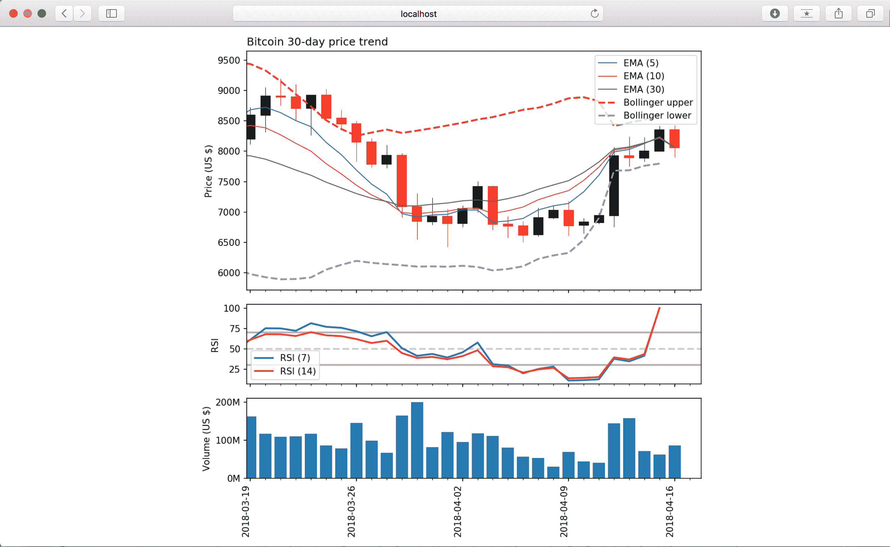

# 将图像集成到 Django 模板中

要在首页显示图表，我们可以修改位于`{Project_folder}/crypto_stats/src/templates/home.html`的首页模板。

我们需要修改`<!-- Benefits of the Django application -->`注释后的代码行，修改为以下内容：

```py

<!-- Benefits of the Django application -->
<a name="about"></a>

<div class="container">
  <div class="row">
    <div class="col-lg-8">
      <h2>Bitcoin pricing trend</h2>
      
      <p><a class="btn btn-primary" href="#" role="button">View details &raquo;</a></p>
    </div>
    <div class="col-lg-4">
      <h2>Heading</h2>
      <p>Donec sed odio dui. Cras justo odio, dapibus ac facilisis in, egestas eget quam. Vestibulum id ligula porta felis euismod semper. Fusce dapibus, tellus ac cursus commodo, tortor mauris condimentum nibh, ut fermentum massa.</p>
      <p><a class="btn btn-primary" href="#" role="button">View details &raquo;</a></p>
    </div>
  </div>
</div>


```

基本上，我们的`bitcoin_chart`视图是通过``这一行作为图像加载的。我还将容器部分的列数从 3 列减少到了 2 列，并通过将类设置为`col-lg-8`来调整了第一列的大小。

如果你访问首页（即`http://localhost:8000`），当你滚动到页面底部时，你会看到以下屏幕：

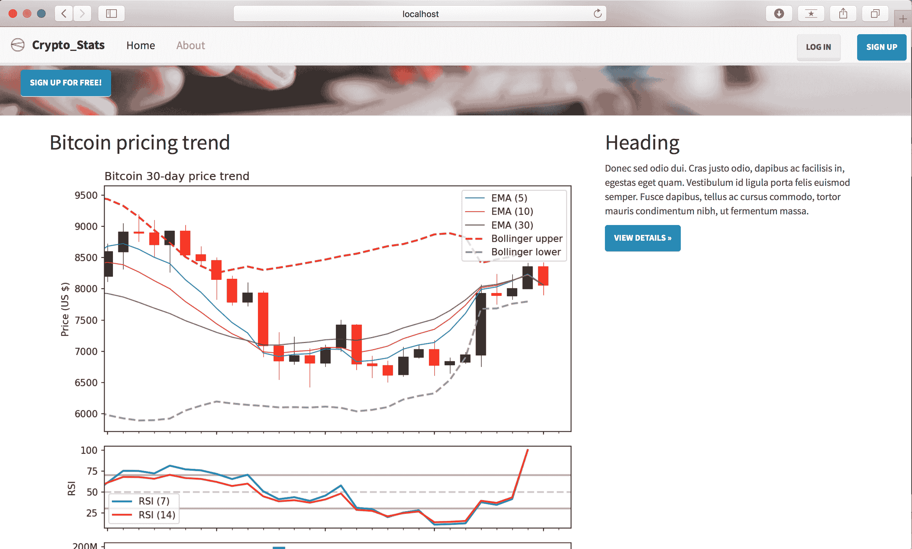

这个实现有一些注意事项。首先，每次访问页面都会触发一次 API 调用到 Quandl，因此你的免费 API 配额会很快被消耗。更好的方法是每天获取一次价格，并将数据记录到合适的数据库模型中。

其次，当前形式的图像输出并没有集成到特定的应用模板中。这超出了本书以 Matplotlib 为主题的范围。然而，感兴趣的读者可以参考在线文档中的说明（[`docs.djangoproject.com/en/2.0/topics/templates/`](https://docs.djangoproject.com/en/2.0/topics/templates/)）。

最后，这些图像是静态的。像`mpld3`和 Plotly 这样的第三方包可以将 Matplotlib 图表转换为基于 Javascript 的交互式图表。使用这些包可以进一步增强用户体验。

# 总结

在本章中，你了解了一个流行的框架，旨在简化 Web 应用程序的开发和部署，即 Django。你还进一步学习了如何将 Matplotlib 图表集成到 Django 网站中。

在下一章中，我们将介绍一些有用的技术，用于定制图形美学，以便有效讲述故事。
