# 第九章：Matplotlib 在现实世界中的应用

到目前为止，我们希望你已经掌握了使用 Matplotlib 创建和定制图表的技巧。让我们在已有的基础上进一步深入，通过现实世界的例子开始我们的 Matplotlib 高级用法之旅。

首先，我们将介绍如何获取在线数据，这通常是通过 **应用程序编程接口** (**API**) 或传统的网页抓取技术获得的。接下来，我们将探索如何将 Matplotlib 2.x 与 Python 中的其他科学计算包集成，用于不同数据类型的可视化。

# 常见的 API 数据格式

许多网站通过其 API 分发数据，API 通过标准化架构将应用程序连接起来。虽然我们在这里不会详细讨论如何使用 API，但我们会介绍最常见的 API 数据交换格式——CSV 和 JSON。

感兴趣的读者可以访问特定网站的文档，了解如何使用 API。

我们在第四章，*高级 Matplotlib* 中简要介绍了 CSV 文件的解析。为了帮助你更好地理解，我们将同时使用 CSV 和 JSON 来表示相同的数据。

# CSV

**逗号分隔值** (**CSV**) 是最早的文件格式之一，远在万维网存在之前就已被引入。然而，随着 JSON 和 XML 等先进格式的流行，CSV 正在逐渐被淘汰。顾名思义，数据值是通过逗号分隔的。预安装的 `csv` 包和 `pandas` 包都包含了读取和写入 CSV 格式数据的类。以下 CSV 示例定义了一个包含两个国家的 population（人口）表：

```py
Country,Time,Sex,Age,Value
United Kingdom,1950,Male,0-4,2238.735
United States of America,1950,Male,0-4,8812.309
```

# JSON

**JavaScript 对象表示法** (**JSON**) 由于其高效性和简洁性，近年来越来越受欢迎。JSON 允许指定数字、字符串、布尔值、数组和对象。Python 提供了默认的 `json` 包来解析 JSON。或者，`pandas.read_json` 类可以用来将 JSON 导入为 pandas DataFrame。前述的人口表可以用 JSON 表示如下：

```py
{
 "population": [
 {
 "Country": "United Kingdom",
 "Time": 1950,
 "Sex", "Male",
 "Age", "0-4",
 "Value",2238.735
 },{
 "Country": "United States of America",
 "Time": 1950,
 "Sex", "Male",
 "Age", "0-4",
 "Value",8812.309
 },
 ]
}
```

# 从 JSON API 导入和可视化数据

现在，让我们学习如何解析来自 Quandl API 的金融数据，以创建有价值的可视化图表。Quandl 是一个金融和经济数据仓库，存储了来自数百个发布者的数百万数据集。Quandl 的最大优点是，这些数据集通过统一的 API 提供，用户无需担心如何正确解析数据。匿名用户每天可以获得最多 50 次 API 调用，注册用户则可以获得最多 500 次免费 API 调用。读者可以在 [`www.quandl.com/?modal=register`](https://www.quandl.com/?modal=register) 上注册免费 API 密钥。

在 Quandl 中，每个数据集都有一个唯一的 ID，由每个搜索结果网页上的 Quandl 代码定义。例如，Quandl 代码`GOOG/NASDAQ_SWTX`定义了 Google Finance 发布的历史 NASDAQ 指数数据。每个数据集都提供三种不同的格式——CSV、JSON 和 XML。

尽管 Quandl 提供了官方的 Python 客户端库，我们不会使用它，而是为了演示从 API 导入 JSON 数据的通用流程。根据 Quandl 的文档，我们可以通过以下 API 调用获取 JSON 格式的数据表：

```py
GET https://www.quandl.com/api/v3/datasets/{Quandl code}/data.json
```

首先，让我们尝试从 Quandl 获取大麦克指数数据。大麦克指数由*经济学人*于 1986 年发明，作为一种轻松的方式来判断货币是否处于**正确**的水平。它基于**购买力平价**（**PPP**）理论，并被视为货币在购买力平价下的非正式汇率衡量标准。它通过将货币与一篮子类似的商品和服务进行比较来衡量其价值，在这种情况下是大麦克。市场汇率下的价格差异意味着某种货币被低估或高估：

```py
from urllib.request import urlopen
import json
import time
import pandas as pd

def get_bigmac_codes():
    """Get a pandas DataFrame of all codes in the Big Mac index dataset

    The first column contains the code, while the second header
    contains the description of the code.

    E.g. 
    ECONOMIST/BIGMAC_ARG,Big Mac Index - Argentina
    ECONOMIST/BIGMAC_AUS,Big Mac Index - Australia
    ECONOMIST/BIGMAC_BRA,Big Mac Index - Brazil

    Returns:
        codes: pandas DataFrame of Quandl dataset codes"""

    codes_url = "https://www.quandl.com/api/v3/databases/ECONOMIST/codes"
    codes = pd.read_csv(codes_url, header=None, names=['Code', 'Description'], 
                        compression='zip', encoding='latin_1')

    return codes

def get_quandl_dataset(api_key, code):
    """Obtain and parse a quandl dataset in pandas DataFrame format

    Quandl returns dataset in JSON format, where data is stored as a 
    list of lists in response['dataset']['data'], and column headers
    stored in response['dataset']['column_names'].

    E.g. {'dataset': {...,
             'column_names': ['Date',
                              'local_price',
                              'dollar_ex',
                              'dollar_price',
                              'dollar_ppp',
                              'dollar_valuation',
                              'dollar_adj_valuation',
                              'euro_adj_valuation',
                              'sterling_adj_valuation',
                              'yen_adj_valuation',
                              'yuan_adj_valuation'],
             'data': [['2017-01-31',
                       55.0,
                       15.8575,
                       3.4683903515687,
                       10.869565217391,
                       -31.454736135007,
                       6.2671477203176,
                       8.2697553162259,
                       29.626894343348,
                       32.714616745128,
                       13.625825886047],
                      ['2016-07-31',
                       50.0,
                       14.935,
                       3.3478406427854,
                       9.9206349206349,
                       -33.574590420925,
                       2.0726096168216,
                       0.40224795003514,
                       17.56448458418,
                       19.76377270142,
                       11.643103380531]
                      ],
             'database_code': 'ECONOMIST',
             'dataset_code': 'BIGMAC_ARG',
             ... }}

    A custom column--country is added to denote the 3-letter country code.

    Args:
        api_key: Quandl API key
        code: Quandl dataset code

    Returns:
        df: pandas DataFrame of a Quandl dataset

    """
    base_url = "https://www.quandl.com/api/v3/datasets/"
    url_suffix = ".json?api_key="

    # Fetch the JSON response 
    u = urlopen(base_url + code + url_suffix + api_key)
    response = json.loads(u.read().decode('utf-8'))

    # Format the response as pandas Dataframe
    df = pd.DataFrame(response['dataset']['data'], columns=response['dataset']['column_names'])

    # Label the country code
    df['country'] = code[-3:]

    return df

quandl_dfs = []
codes = get_bigmac_codes()

# Replace this with your own API key
api_key = "INSERT-YOUR-KEY-HERE" 

for code in codes.Code:
    # Get the DataFrame of a Quandl dataset
    df = get_quandl_dataset(api_key, code)

    # Store in a list
    quandl_dfs.append(df)

    # Prevents exceeding the API speed limit
    time.sleep(2)

# Concatenate the list of data frames into a single one 
bigmac_df = pd.concat(quandl_dfs)
bigmac_df.head()
```

这是预期的结果，显示数据框的前五行：

|   | **0** | **1** | **2** | **3** | **4** |
| --- | --- | --- | --- | --- | --- |
| **Date** | 31-07-17 | 31-01-17 | 31-07-16 | 31-01-16 | 31-07-15 |
| **local_price** | 5.9 | 5.8 | 5.75 | 5.3 | 5.3 |
| **dollar_ex** | 1.303016 | 1.356668 | 1.335738 | 1.415729 | 1.35126 |
| **dollar_price** | 4.527955 | 4.27518 | 4.304737 | 3.743655 | 3.922265 |
| **dollar_ppp** | 1.113208 | 1.146245 | 1.140873 | 1.075051 | 1.106472 |
| **dollar_valuation** | -14.56689 | -15.510277 | -14.588542 | -24.06379 | -18.115553 |
| **dollar_adj_valuation** | -11.7012 | -11.9234 | -11.0236 | -28.1641 | -22.1691 |
| **euro_adj_valuation** | -13.0262 | -10.2636 | -12.4796 | -22.2864 | -18.573 |
| **sterling_adj_valuation** | 2.58422 | 7.43771 | 2.48065 | -22.293 | -23.1926 |
| **yen_adj_valuation** | 19.9417 | 9.99688 | 4.39776 | -4.0042 | 6.93893 |
| **yuan_adj_valuation** | -2.35772 | -5.82434 | -2.681 | -20.6755 | -14.1711 |
| **country** | AUS | AUS | AUS | AUS | AUS |

解析 Quandl API 中的 JSON 数据的代码有点复杂，因此需要额外的解释。第一个函数`get_bigmac_codes()`解析 Quandl 经济学人数据库中所有可用数据集代码的列表，并将其转换为 pandas DataFrame。同时，第二个函数`get_quandl_dataset(api_key, code)`将 Quandl 数据集 API 查询的 JSON 响应转换为 pandas DataFrame。所有获取的数据集通过`pandas.concat()`合并为一个单独的数据框。

我们应该记住，大麦克指数在不同国家之间并不直接可比。通常，我们会预期贫穷国家的商品价格低于富裕国家。为了更公平地展示指数，最好展示大麦克价格与**国内生产总值**（**GDP**）人均之间的关系。

为了达到这一目的，我们将从 Quandl 的**世界银行世界发展指标**（**WWDI**）数据库中获取 GDP 数据集。基于之前从 Quandl 获取 JSON 数据的代码示例，你能尝试将其修改为下载人均 GDP 数据集吗？

对于那些急于查看的用户，以下是完整的代码：

```py
import urllib
import json
import pandas as pd
import time
from urllib.request import urlopen

def get_gdp_dataset(api_key, country_code):
    """Obtain and parse a quandl GDP dataset in pandas DataFrame format
    Quandl returns dataset in JSON format, where data is stored as a 
    list of lists in response['dataset']['data'], and column headers
    stored in response['dataset']['column_names'].

    Args:
        api_key: Quandl API key
        country_code: Three letter code to represent country

    Returns:
        df: pandas DataFrame of a Quandl dataset
    """
    base_url = "https://www.quandl.com/api/v3/datasets/"
    url_suffix = ".json?api_key="

    # Compose the Quandl API dataset code to get GDP per capita (constant 2000 US$) dataset
    gdp_code = "WWDI/" + country_code + "_NY_GDP_PCAP_KD"

   # Parse the JSON response from Quandl API
   # Some countries might be missing, so we need error handling code
   try:
       u = urlopen(base_url + gdp_code + url_suffix + api_key)
   except urllib.error.URLError as e:
       print(gdp_code,e)
       return None

   response = json.loads(u.read().decode('utf-8'))

   # Format the response as pandas Dataframe
   df = pd.DataFrame(response['dataset']['data'], columns=response['dataset']['column_names'])

   # Add a new country code column
   df['country'] = country_code

   return df

api_key = "INSERT-YOUR-KEY-HERE" #Change this to your own API key

quandl_dfs = []

# Loop through all unique country code values in the BigMac index DataFrame
for country_code in bigmac_df.country.unique():
    # Fetch the GDP dataset for the corresponding country 
    df = get_gdp_dataset(api_key, country_code)

    # Skip if the response is empty
    if df is None:
        continue

    # Store in a list DataFrames
    quandl_dfs.append(df)

    # Prevents exceeding the API speed limit
    time.sleep(2)

# Concatenate the list of DataFrames into a single one 
gdp_df = pd.concat(quandl_dfs)
gdp_df.head()
```

几个地区的 GDP 数据缺失，但这应该可以通过`try...except`代码块在`get_gdp_dataset`函数中优雅地处理。运行前面的代码后，你应该看到如下内容：

```py
WWDI/EUR_NY_GDP_PCAP_KD HTTP Error 404: Not Found 
WWDI/ROC_NY_GDP_PCAP_KD HTTP Error 404: Not Found 
WWDI/SIN_NY_GDP_PCAP_KD HTTP Error 404: Not Found 
WWDI/UAE_NY_GDP_PCAP_KD HTTP Error 404: Not Found
```

|  | **日期** | **值** | **国家** |
| --- | --- | --- | --- |
| **0** | 2016-12-31 | 55478.577294 | AUS |
| **1** | 2015-12-31 | 54800.366396 | AUS |
| **2** | 2014-12-31 | 54293.794205 | AUS |
| **3** | 2013-12-31 | 53732.003969 | AUS |
| **4** | 2012-12-31 | 53315.029915 | AUS |

接下来，我们将使用`pandas.merge()`合并包含“大麦指数”或人均 GDP 的两个 pandas 数据框。WWDI 的最新人均 GDP 数据记录是在 2016 年底收集的，因此我们将其与 2017 年 1 月的最新大麦指数数据集配对。

对于熟悉 SQL 语言的人来说，`pandas.merge()`支持四种连接模式，分别是左连接、右连接、内连接和外连接。由于我们只关心在两个 pandas 数据框中都有匹配国家的行，因此我们将选择内连接：

```py
merged_df = pd.merge(bigmac_df[(bigmac_df.Date == "2017-01-31")], gdp_df[(gdp_df.Date == "2016-12-31")], how='inner', on='country')
merged_df.head()
```

这是合并后的数据框：

|   | **0** | **1** | **2** | **3** | **4** |
| --- | --- | --- | --- | --- | --- |
| **日期 _x** | 31-01-17 | 31-01-17 | 31-01-17 | 31-01-17 | 31-01-17 |
| **本地价格** | 5.8 | 16.5 | 3.09 | 2450 | 55 |
| **美元汇率** | 1.356668 | 3.22395 | 0.828775 | 672.805 | 15.8575 |
| **美元价格** | 4.27518 | 5.117945 | 3.728394 | 3.641471 | 3.46839 |
| **美元购买力平价** | 1.146245 | 3.26087 | 0.610672 | 484.189723 | 10.869565 |
| **美元估值** | -15.510277 | 1.145166 | -26.316324 | -28.034167 | -31.454736 |
| **美元调整估值** | -11.9234 | 67.5509 | -18.0208 | 11.9319 | 6.26715 |
| **欧元调整估值** | -10.2636 | 70.7084 | -16.4759 | 14.0413 | 8.26976 |
| **英镑调整估值** | 7.43771 | 104.382 | 0 | 36.5369 | 29.6269 |
| **日元调整估值** | 9.99688 | 109.251 | 2.38201 | 39.7892 | 32.7146 |
| **人民币调整估值** | -5.82434 | 79.1533 | -12.3439 | 19.6828 | 13.6258 |
| **国家** | AUS | BRA | GBR | CHL | ARG |
| **日期 _y** | 31-12-16 | 31-12-16 | 31-12-16 | 31-12-16 | 31-12-16 |
| **值** | 55478.5773 | 10826.2714 | 41981.3921 | 15019.633 | 10153.99791 |

# 使用 Seaborn 简化可视化任务

散点图是科学和商业领域中最常见的图形之一。它特别适合用来展示两个变量之间的关系。虽然我们可以简单地使用 `matplotlib.pyplot.scatter` 来绘制散点图（有关更多详细信息，请参见第二章，*Matplotlib 入门* 和 第四章，*高级 Matplotlib*），我们也可以使用 Seaborn 来构建具有更多高级功能的类似图形。

这两个函数，`seaborn.regplot()` 和 `seaborn.lmplot()`，通过散点图、回归线以及回归线周围的 95%置信区间，展示了变量之间的线性关系。它们之间的主要区别在于，`lmplot()` 将 `regplot()` 与 `FacetGrid` 结合在一起，允许我们创建带有颜色编码或分面显示的散点图，从而展示三个或更多变量对之间的交互关系。

`seaborn.regplot()` 最简单的形式支持 NumPy 数组、pandas Series 或 pandas DataFrame 作为输入。可以通过指定 `fit_reg=False` 来去除回归线和置信区间。

我们将调查这样一个假设：在人均 GDP 较低的国家，巨无霸价格较便宜，反之亦然。为此，我们将尝试找出巨无霸指数与人均 GDP 之间是否存在相关性：

```py
import seaborn as sns
import matplotlib.pyplot as plt

# seaborn.regplot() returns a matplotlib.Axes object
ax = sns.regplot(x="Value", y="dollar_price", data=merged_df, fit_reg=False)
# We can modify the axes labels just like other ordinary
# Matplotlib objects
ax.set_xlabel("GDP per capita (constant 2000 US$)")
ax.set_ylabel("BigMac index (US$)")
plt.show()
```

代码将用一个经典的散点图来迎接你：

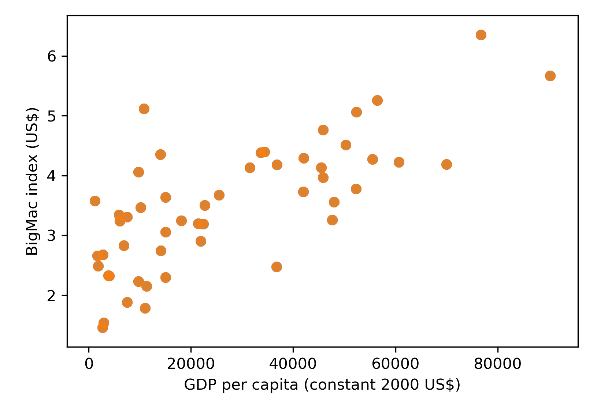

到目前为止，一切顺利！看起来巨无霸指数与人均 GDP 呈正相关。我们将重新开启回归线，并标记出一些显示极端巨无霸指数值的国家（即 ≥ 5 或 ≤ 2）。同时，默认的绘图样式有些单调；我们可以通过运行 `sns.set(style="whitegrid")` 来使图表更具活力。还有四种其他样式可供选择，分别是 `darkgrid`、`dark`、`white` 和 `ticks`：

```py
sns.set(style="whitegrid")
ax = sns.regplot(x="Value", y="dollar_price", data=merged_df)
ax.set_xlabel("GDP per capita (constant 2000 US$)")
ax.set_ylabel("BigMac index (US$)")
# Label the country codes which demonstrate extreme BigMac index
for row in merged_df.itertuples():
    if row.dollar_price >= 5 or row.dollar_price <= 2:
     ax.text(row.Value,row.dollar_price+0.1,row.country)
plt.show()
```

这是带标签的图：

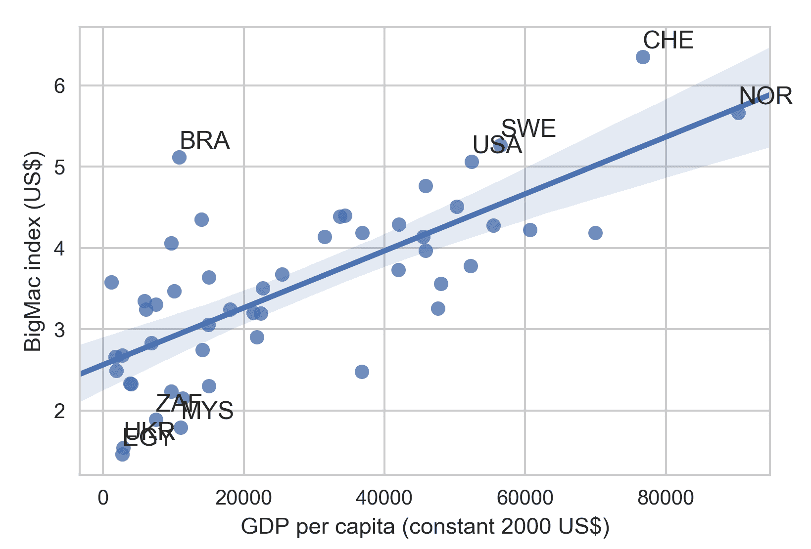

我们可以看到，许多国家的点都落在回归线的置信区间内。根据每个国家的人均 GDP，线性回归模型预测了相应的巨无霸指数。如果实际指数偏离回归模型，则货币价值可能表明其被低估或高估。

通过标记出显示极高或极低值的国家，我们可以清楚地看到，巴西和瑞士的巨无霸价格被高估，而南非、马来西亚、乌克兰和埃及则被低估。

由于 Seaborn 不是一个用于统计分析的包，我们需要使用其他包，例如 `scipy.stats` 或 `statsmodels`，来获得回归模型的参数。在下一个示例中，我们将从回归模型中获取斜率和截距参数，并为回归线上下的点应用不同的颜色：

```py
from scipy.stats import linregress

ax = sns.regplot(x="Value", y="dollar_price", data=merged_df)
ax.set_xlabel("GDP per capita (constant 2000 US$)")
ax.set_ylabel("BigMac index (US$)")

# Calculate linear regression parameters
slope, intercept, r_value, p_value, std_err = linregress(merged_df.Value, merged_df.dollar_price)

colors = []
for row in merged_df.itertuples():
    if row.dollar_price > row.Value * slope + intercept:
        # Color markers as darkred if they are above the regression line
        color = "darkred"
    else:
        # Color markers as darkblue if they are below the regression line
        color = "darkblue"

    # Label the country code for those who demonstrate extreme BigMac index
    if row.dollar_price >= 5 or row.dollar_price <= 2:
        ax.text(row.Value,row.dollar_price+0.1,row.country)

    # Highlight the marker that corresponds to China
    if row.country == "CHN":
        t = ax.text(row.Value,row.dollar_price+0.1,row.country)
        color = "yellow"

    colors.append(color)

# Overlay another scatter plot on top with marker-specific color
ax.scatter(merged_df.Value, merged_df.dollar_price, c=colors)

# Label the r squared value and p value of the linear regression model.
# transform=ax.transAxes indicates that the coordinates are given relative to the axes bounding box, 
# with 0,0 being the lower left of the axes and 1,1 the upper right.
ax.text(0.1, 0.9, "$r²={0:.3f}, p={1:.3e}$".format(r_value ** 2, p_value), transform=ax.transAxes)

plt.show()
```

这张截图展示了带有颜色标签的图：

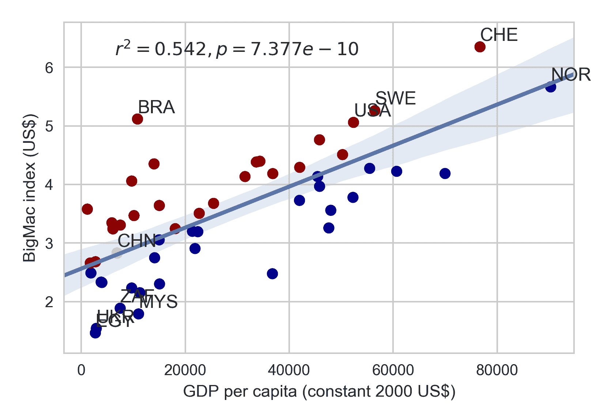

与普遍看法相反，看起来中国的货币在 2016 年并没有显著低估，因为其价值位于回归线的 95%置信区间内。

我们还可以将*x*和*y*值的直方图与散点图结合，使用`seaborn.jointplot`：

通过在`jointplot`中额外指定`kind`参数为`reg`、`resid`、`hex`或`kde`中的任意一个，我们可以迅速将图表类型分别更改为回归图、残差图、六边形箱型图或 KDE 轮廓图。

```py
# seaborn.jointplot() returns a seaborn.JointGrid object
g = sns.jointplot(x="Value", y="dollar_price", data=merged_df)

# Provide custom axes labels through accessing the underlying axes object
# We can get matplotlib.axes.Axes of the scatter plot by calling g.ax_joint
g.ax_joint.set_xlabel("GDP per capita (constant 2000 US$)")
g.ax_joint.set_ylabel("BigMac index (US$)")

# Set the title and adjust the margin
g.fig.suptitle("Relationship between GDP per capita and BigMac Index")
g.fig.subplots_adjust(top=0.9)
plt.show()
```

`jointplot`如图所示：

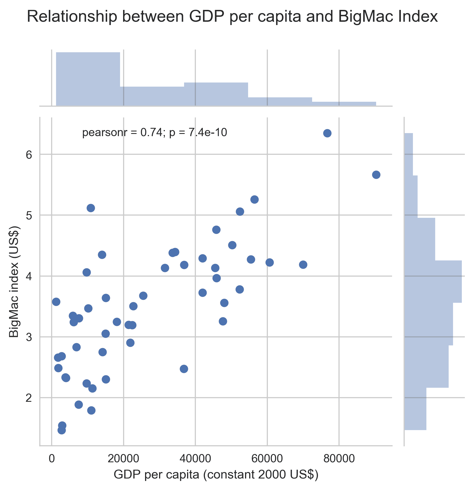

这里有一个重要的免责声明。即便我们手中有所有数据，现在依然为时过早，无法对货币估值做出任何结论！劳动力成本、租金、原材料成本和税收等不同的商业因素都可能影响“大麦”定价模型，但这超出了本书的范围。

# 从网站抓取信息

世界各国的政府或司法管辖区越来越重视开放数据，这旨在增加公民参与和知情决策，并使政策更加开放，接受公众审查。全球一些开放数据倡议的例子包括[`www.data.gov/`](https://www.data.gov/)（美国）、[`data.gov.uk/`](https://data.gov.uk/)（英国）和[`data.gov.hk/en/`](https://data.gov.hk/en/)（香港）。

这些数据门户网站通常提供用于程序化访问数据的 API。然而，并非所有数据集都提供 API，因此我们需要依靠老式的网页抓取技术，从网站中提取信息。

Beautiful Soup ([`www.crummy.com/software/BeautifulSoup/`](https://www.crummy.com/software/BeautifulSoup/)) 是一个非常有用的抓取网站信息的包。基本上，所有带有 HTML 标签的内容都可以使用这个强大的包进行抓取。Scrapy 也是一个不错的网页抓取包，但它更像是一个编写强大网络爬虫的框架。所以，如果你只是需要从页面抓取一个表格，Beautiful Soup 提供了更简单的操作方式。

本章将使用 Beautiful Soup 版本 4.6。要安装 Beautiful Soup 4，我们可以再次通过 PyPI 来安装：

```py
pip install beautifulsoup4
```

美国失业率和按教育程度划分的收入数据（2017 年）可以通过以下网站获得：[`www.bls.gov/emp/ep_table_001.htm`](https://www.bls.gov/emp/ep_table_001.htm)。目前，Beautiful Soup 不处理 HTML 请求。所以我们需要使用`urllib.request`或`requests`包来获取网页。在这两个选项中，`requests`包由于其更高层次的 HTTP 客户端接口，使用起来显得更加简便。如果你的系统中没有`requests`，我们可以通过 PyPI 安装：

```py
pip install requests
```

在编写网页爬取代码之前，让我们先看一下网页。如果我们使用 Google Chrome 访问劳动统计局网站，就可以检查对应我们需要的表格的 HTML 代码：

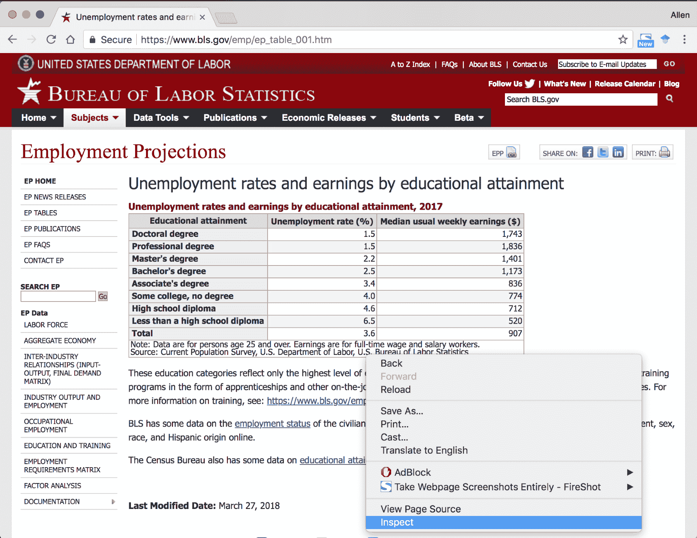

接下来，展开`<div id="bodytext" class="verdana md">`，直到你能看到`<table class="regular" cellspacing="0" cellpadding="0" xborder="1">...</table>`。当你将鼠标悬停在 HTML 代码上时，页面中的对应部分会被高亮显示：

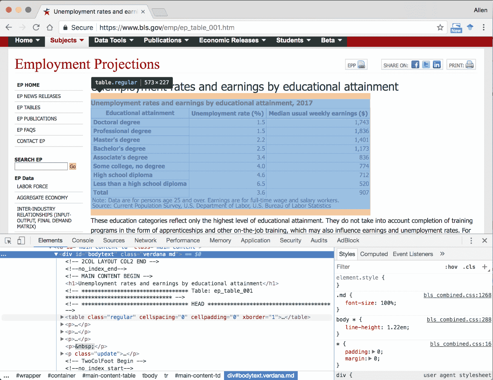

扩展`<table>`的 HTML 代码后，我们可以看到列名定义在`<thead>...</thead>`部分，而表格内容则定义在`<tbody>...</tbody>`部分。

为了指示 Beautiful Soup 爬取我们需要的信息，我们需要给它明确的指示。我们可以右键单击代码检查窗口中的相关部分，复制格式为 CSS 选择器的唯一标识符：

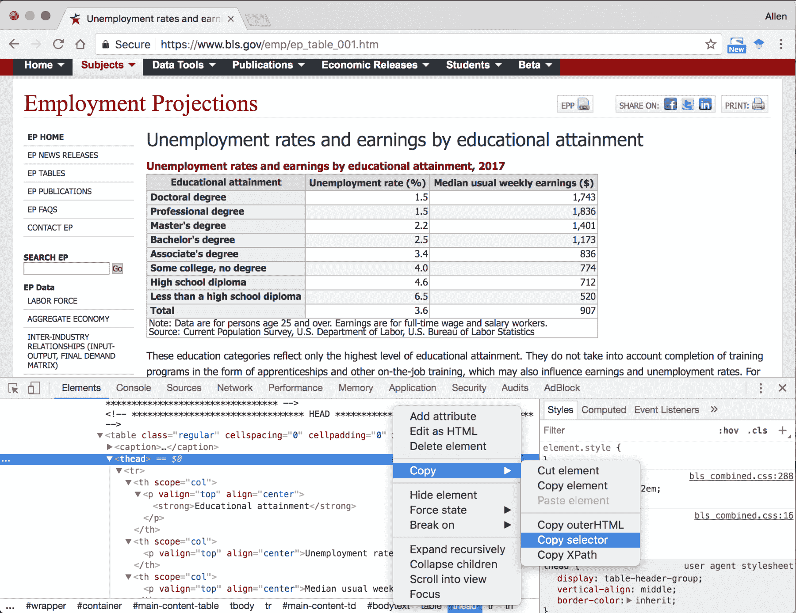

让我们尝试获取`thead`和`tbody`的 CSS 选择器，并使用`BeautifulSoup.select()`方法来爬取相应的 HTML 代码：

```py
import requests
from bs4 import BeautifulSoup

# Specify the url
url = "https://www.bls.gov/emp/ep_table_001.htm"

# Query the website and get the html response
response = requests.get(url)

# Parse the returned html using BeautifulSoup
bs = BeautifulSoup(response.text)

# Select the table header by CSS selector
thead = bs.select("#bodytext > table > thead")[0]

# Select the table body by CSS selector
tbody = bs.select("#bodytext > table > tbody")[0]

# Make sure the code works
print(thead)
```

你将看到表头的 HTML 代码：

```py
<thead> 
<tr> 
<th scope="col"><p align="center" valign="top"><strong>Educational attainment</strong></p></th> 
<th scope="col"><p align="center" valign="top">Unemployment rate (%)</p></th> 
<th scope="col"><p align="center" valign="top">Median usual weekly earnings ($)</p></th> 
</tr> 
</thead>
```

接下来，我们将找到所有包含每一列名称的`<th></th>`标签。我们将构建一个以列头为键的字典列表来保存数据：

```py
# Get the column names
headers = []

# Find all header columns in <thead> as specified by <th> html tags
for col in thead.find_all('th'):
   headers.append(col.text.strip())

# Dictionary of lists for storing parsed data
data = {header:[] for header in headers}
```

最后，我们解析表格的剩余行，并将数据转换为 pandas DataFrame：

```py
import pandas as pd

# Parse the rows in table body
for row in tbody.find_all('tr'):
    # Find all columns in a row as specified by <th> or <td> html tags
    cols = row.find_all(['th','td'])

    # enumerate() allows us to loop over an iterable, 
    # and return each item preceded by a counter
    for i, col in enumerate(cols):
        # Strip white space around the text
        value = col.text.strip()

        # Try to convert the columns to float, except the first column
        if i > 0:
            value = float(value.replace(',','')) # Remove all commas in string

        # Append the float number to the dict of lists
        data[headers[i]].append(value)

# Create a data frame from the parsed dictionary
df = pd.DataFrame(data)

# Show an excerpt of parsed data
df.head()
```

我们现在应该能够重现主表格的前几行：

|  | **学历** | **中位数通常每周收入（$）** | **失业率（%）** |
| --- | --- | --- | --- |
| **0** | 博士学位 | 1743.0 | 1.5 |
| **1** | 专业学位 | 1836.0 | 1.5 |
| **2** | 硕士学位 | 1401.0 | 2.2 |
| **3** | 本科及以上学位 | 1173.0 | 2.5 |
| **4** | 大专及以上学位 | 836.0 | 3.4 |

主 HTML 表格已经被格式化为结构化的 pandas DataFrame。我们现在可以继续可视化数据了。

# Matplotlib 图形后端

绘图的代码被认为是 Matplotlib 中的前端部分。我们第一次提到后端是在第一章，*Matplotlib 简介*，当时我们在谈论输出格式。实际上，Matplotlib 后端有着比仅仅支持图形格式更多的差异。后端在幕后处理了很多事情！这决定了绘图功能的支持。例如，LaTeX 文本布局仅由 Agg、PDF、PGF 和 PS 后端支持。

# 非交互式后端

到目前为止，我们已经使用了几种非交互式后端，包括 Agg、Cairo、GDK、PDF、PGF、PS 和 SVG。大多数后端无需额外依赖即可工作，但 Cairo 和 GDK 分别需要 Cairo 图形库或 GIMP 绘图工具包才能运行。

非交互式后端可以进一步分为两组——矢量或光栅。矢量图形通过点、路径和形状来描述图像，这些都是通过数学公式计算得出的。无论缩放多少，矢量图形总是显得平滑，并且其大小通常比光栅图形要小。PDF、PGF、PS 和 SVG 后端属于矢量组。

光栅图形通过有限数量的微小颜色块（像素）来描述图像。所以，如果我们足够放大，就会看到图像的*不平滑*表现，换句话说，就是像素化。通过提高图像的分辨率或**每英寸点数**（**DPI**），我们不太可能观察到像素化现象。Agg、Cairo 和 GDK 属于这一类后端。下表总结了非交互式后端的主要功能和差异：

| 后端 | 矢量还是光栅？ | 输出格式 |
| --- | --- | --- |
| Agg | 光栅 | `.png` |
| Cairo | 矢量/光栅 | `.pdf`, `.png`, `.ps`, `.svg` |
| PDF | 矢量 | `.pdf` |
| PGF | 矢量 | `.pdf`, `.pgf` |
| PS | 矢量 | `.ps` |
| SVG | 矢量 | `.svg` |
| GDK* | 光栅 | `.png`, `.jpg`, `.tiff` |

*Matplotlib 2.0 中已弃用。

通常，我们不需要手动选择后端，因为默认的选择适用于大多数任务。另一方面，我们可以通过在首次导入 `matplotlib.pyplot` 之前使用 `matplotlib.use()` 方法指定后端：

```py
import matplotlib
matplotlib.use('SVG') # Change to SVG backend
import matplotlib.pyplot as plt
import textwrap # Standard library for text wrapping

# Create a figure
fig, ax = plt.subplots(figsize=(6,7))

# Create a list of x ticks positions
ind = range(df.shape[0])

# Plot a bar chart of median usual weekly earnings by educational attainments
rects = ax.barh(ind, df["Median usual weekly earnings ($)"], height=0.5)

# Set the x-axis label
ax.set_xlabel('Median weekly earnings (USD)')

# Label the x ticks
# The tick labels are a bit too long, let's wrap them in 15-char lines
ylabels=[textwrap.fill(label,15) for label in df["Educational attainment"]]
ax.set_yticks(ind)
ax.set_yticklabels(ylabels)

# Give extra margin at the bottom to display the tick labels
fig.subplots_adjust(left=0.3)

# Save the figure in SVG format
plt.savefig("test.svg")
```

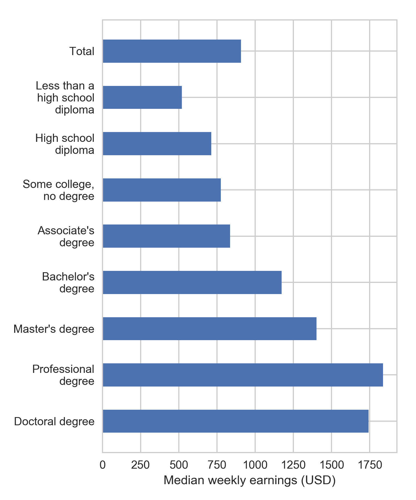

# 交互式后端

Matplotlib 可以构建比静态图形更具互动性的图形，这对于读者来说更具吸引力。有时，图形可能会被过多的图形元素淹没，使得难以分辨单独的数据点。在其他情况下，一些数据点可能看起来非常相似，肉眼很难察觉它们之间的差异。交互式图形可以通过允许我们缩放、平移和按照自己的方式探索图形来解决这两种情况。

通过使用交互式后端，Matplotlib 中的图形可以嵌入到**图形用户界面**（**GUI**）应用程序中。默认情况下，Matplotlib 支持将 Agg 光栅图形渲染器与多种 GUI 工具包配对，包括 wxWidgets（Wx）、GIMP 工具包（GTK+）、Qt 和 TkInter（Tk）。由于 Tkinter 是 Python 的事实标准 GUI，构建于 Tcl/Tk 之上，我们只需在独立的 Python 脚本中调用 `plt.show()` 就可以创建交互式图形。我们可以尝试将以下代码复制到单独的文本文件中，并命名为 `interactive.py`。然后，在终端（Mac/Linux）或命令提示符（Windows）中输入 `python interactive.py`。如果你不确定如何打开终端或命令提示符，请参考第一章，*Matplotlib 介绍*，以获取更多细节：

```py
import matplotlib
import matplotlib.pyplot as plt
import textwrap
import requests
import pandas as pd
from bs4 import BeautifulSoup
# Import Matplotlib radio button widget
from matplotlib.widgets import RadioButtons

url = "https://www.bls.gov/emp/ep_table_001.htm"
response = requests.get(url)
bs = BeautifulSoup(response.text)
thead = bs.select("#bodytext > table > thead")[0]
tbody = bs.select("#bodytext > table > tbody")[0]

headers = []
for col in thead.find_all('th'):
    headers.append(col.text.strip())

data = {header:[] for header in headers}
for row in tbody.find_all('tr'):
    cols = row.find_all(['th','td'])

    for i, col in enumerate(cols):
        value = col.text.strip()
        if i > 0:
            value = float(value.replace(',','')) 
        data[headers[i]].append(value)

df = pd.DataFrame(data)

fig, ax = plt.subplots(figsize=(6,7))
ind = range(df.shape[0])
rects = ax.barh(ind, df["Median usual weekly earnings ($)"], height=0.5)
ax.set_xlabel('Median weekly earnings (USD)')
ylabels=[textwrap.fill(label,15) for label in df["Educational attainment"]]
ax.set_yticks(ind)
ax.set_yticklabels(ylabels)
fig.subplots_adjust(left=0.3)

# Create axes for holding the radio selectors.
# supply [left, bottom, width, height] in normalized (0, 1) units
bax = plt.axes([0.3, 0.9, 0.4, 0.1])
radio = RadioButtons(bax, ('Weekly earnings', 'Unemployment rate'))

# Define the function for updating the displayed values
# when the radio button is clicked
def radiofunc(label):
  # Select columns from dataframe depending on label
  if label == 'Weekly earnings':
    data = df["Median usual weekly earnings ($)"]
    ax.set_xlabel('Median weekly earnings (USD)')
  elif label == 'Unemployment rate':
    data = df["Unemployment rate (%)"]
    ax.set_xlabel('Unemployment rate (%)')

  # Update the bar heights
  for i, rect in enumerate(rects):
    rect.set_width(data[i])

  # Rescale the x-axis range
  ax.set_xlim(xmin=0, xmax=data.max()*1.1)

  # Redraw the figure
  plt.draw()
radio.on_clicked(radiofunc)

plt.show()
```

我们将看到一个类似于以下的弹出窗口。我们可以平移、缩放以选择区域、配置子图边距、保存，并通过点击底部工具栏上的按钮在不同视图之间来回切换。如果我们将鼠标悬停在图表上，还可以在右下角观察到精确的坐标。这个功能对于剖析彼此接近的数据点非常有用：

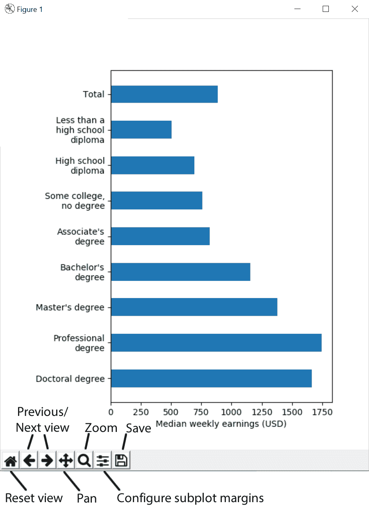

接下来，我们将通过在图形上方添加一个单选按钮控件来扩展应用程序，从而可以在显示每周收入或失业率之间切换。单选按钮位于`matplotlib.widgets`中，我们将把一个数据更新函数附加到按钮的`.on_clicked()`事件上。你可以将以下代码粘贴到之前代码示例（`interactive.py`）中的`plt.show()`行之前。让我们看看它是如何工作的：

```py
# Import Matplotlib radio button widget
from matplotlib.widgets import RadioButtons

# Create axes for holding the radio selectors.
# supply [left, bottom, width, height] in normalized (0, 1) units
bax = plt.axes([0.3, 0.9, 0.4, 0.1])
radio = RadioButtons(bax, ('Weekly earnings', 'Unemployment rate'))

# Define the function for updating the displayed values
# when the radio button is clicked
def radiofunc(label):
    # Select columns from dataframe, and change axis label depending on selection
    if label == 'Weekly earnings':
        data = df["Median usual weekly earnings ($)"]
        ax.set_xlabel('Median weekly earnings (USD)')
    elif label == 'Unemployment rate':
        data = df["Unemployment rate (%)"]
        ax.set_xlabel('Unemployment rate (%)')

    # Update the bar heights
    for i, rect in enumerate(rects):
        rect.set_width(data[i])

    # Rescale the x-axis range
    ax.set_xlim(xmin=0, xmax=data.max()*1.1)

    # Redraw the figure
    plt.draw()

# Attach radiofunc to the on_clicked event of the radio button
radio.on_clicked(radiofunc)
```

你将看到图表顶部出现一个新的单选框。尝试在两种状态之间切换，看看图形是否会相应更新。完整代码也可以在代码包中找到：

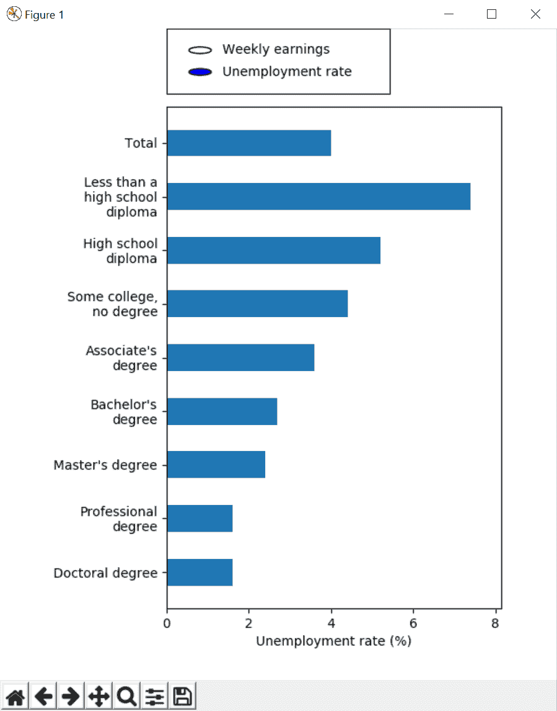

在我们结束本节之前，我们将介绍一种很少在书籍中提及的交互式后端。从 Matplotlib 1.4 开始，提供了一种专为 Jupyter Notebook 设计的交互式后端。要调用它，我们只需要在笔记本的开始处粘贴`%matplotlib notebook`。我们将调整本章早些时候的一个示例来使用这个后端：

```py
# Import the interactive backend for Jupyter Notebook
%matplotlib notebook
import matplotlib
import matplotlib.pyplot as plt
import textwrap

fig, ax = plt.subplots(figsize=(6,7))
ind = range(df.shape[0])
rects = ax.barh(ind, df["Median usual weekly earnings ($)"], height=0.5)
ax.set_xlabel('Median weekly earnings (USD)')
ylabels=[textwrap.fill(label,15) for label in df["Educational attainment"]]
ax.set_yticks(ind)
ax.set_yticklabels(ylabels)
fig.subplots_adjust(left=0.3)

# Show the figure using interactive notebook backend
plt.show()
```

以下交互式图表将嵌入到你的 Jupyter Notebook 中：

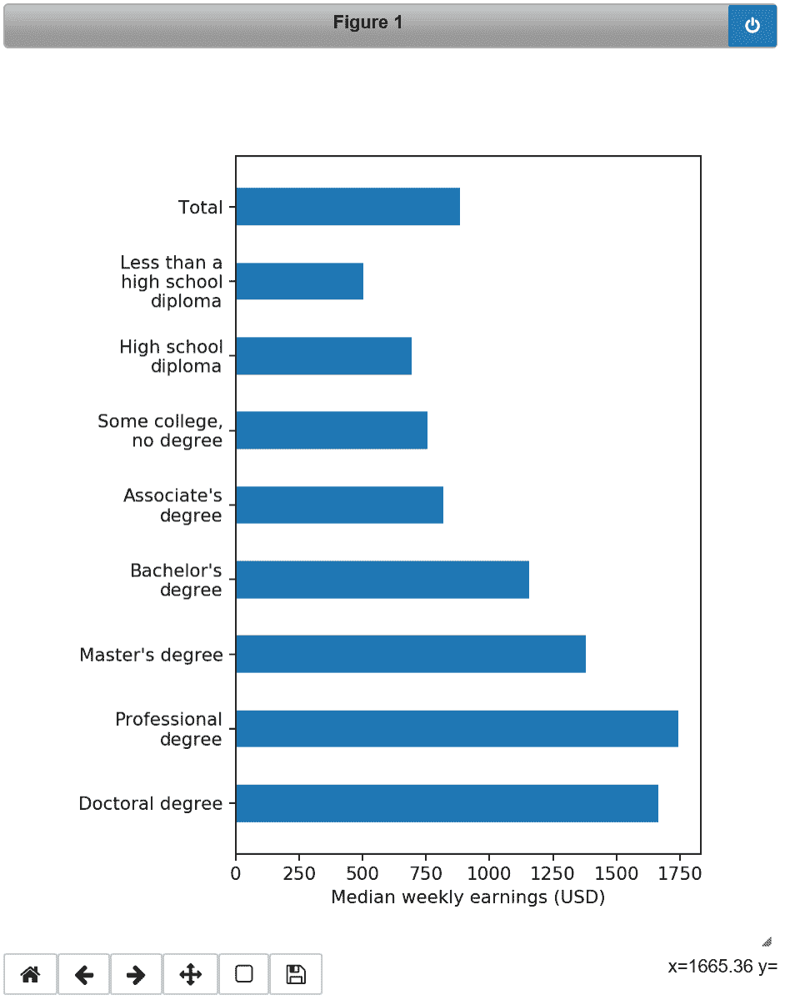

# 创建动画图

Matplotlib 最初并不是为动画包设计的，因此在某些高级用途中它的表现可能显得有些迟缓。对于以动画为中心的应用程序，PyGame 是一个非常好的替代方案（[`www.pygame.org`](https://www.pygame.org)），它支持 OpenGL 和 Direct3D 加速图形，提供极致的动画速度。不过，Matplotlib 在大多数时候的表现是可以接受的，我们将引导你完成创建比静态图更具吸引力的动画的步骤。

在开始制作动画之前，我们需要在系统上安装 FFmpeg、avconv、mencoder 或 ImageMagick 其中之一。这些附加依赖项没有与 Matplotlib 捆绑在一起，因此我们需要单独安装它们。我们将带你逐步完成安装 FFmpeg 的步骤。

对于基于 Debian 的 Linux 用户，只需在终端中输入以下命令即可安装 FFmpeg。

```py
sudo apt-get install ffmpeg
```

对于 Mac 用户，Homebrew（[`brew.sh/`](https://brew.sh/)）是搜索和安装`ffmpeg`软件包的最简单方式。如果你没有安装 Homebrew，可以将以下代码粘贴到终端中进行安装。

```py
/usr/bin/ruby -e "$(curl -fsSL https://raw.githubusercontent.com/Homebrew/install/master/install)"
```

然后，我们可以通过在终端输入以下命令来安装 FFmpeg：

```py
brew install ffmpeg
```

另外，您也可以通过将二进制文件复制到系统路径（例如，`/usr/local/bin`）来安装 FFmpeg（[`evermeet.cx/ffmpeg/`](https://evermeet.cx/ffmpeg/)）。

对于 Windows 用户，安装过程稍微复杂一些，但幸运的是，wikiHow 上有一份详细的安装指南（[`www.wikihow.com/Install-FFmpeg-on-Windows`](https://www.wikihow.com/Install-FFmpeg-on-Windows)）。

Matplotlib 提供了两种主要的动画创建接口：`TimedAnimation` 和 `FuncAnimation`。`TimedAnimation` 适用于创建基于时间的动画，而 `FuncAnimation` 可以根据自定义函数来创建动画。由于 `FuncAnimation` 提供了更高的灵活性，我们将在本节中仅探讨 `FuncAnimation` 的使用。有兴趣的读者可以参考官方文档（[`matplotlib.org/api/animation_api.html`](https://matplotlib.org/api/animation_api.html)）了解更多关于 `TimedAnimation` 的信息。

在以下示例中，我们通过假设每年增加 5% 来模拟中位数周薪的变化。我们将创建一个自定义函数—animate，该函数返回在每一帧中发生变化的 Matplotlib `Artist` 对象。该函数将与一些额外的参数一起传递给 `animation.FuncAnimation()`：

```py
import textwrap 
import matplotlib.pyplot as plt
import random
# Matplotlib animation module
from matplotlib import animation
# Used for generating HTML video embed code
from IPython.display import HTML

# Adapted from previous example, codes that are modified are commented
fig, ax = plt.subplots(figsize=(6,7))
ind = range(df.shape[0])
rects = ax.barh(ind, df["Median usual weekly earnings ($)"], height=0.5)
ax.set_xlabel('Median weekly earnings (USD)')
ylabels=[textwrap.fill(label,15) for label in df["Educational attainment"]]
ax.set_yticks(ind)
ax.set_yticklabels(ylabels)
fig.subplots_adjust(left=0.3)

# Change the x-axis range
ax.set_xlim(0,7600)

# Add a text annotation to show the current year
title = ax.text(0.5,1.05, "Median weekly earnings (USD) in 2017", 
 bbox={'facecolor':'w', 'alpha':0.5, 'pad':5},
 transform=ax.transAxes, ha="center")

# Animation related stuff
n=30 #Number of frames

def animate(frame):
    # Simulate 5% annual pay rise 
    data = df["Median usual weekly earnings ($)"] * (1.05 ** frame)

    # Update the bar heights
    for i, rect in enumerate(rects):
        rect.set_width(data[i])

    # Update the title
    title.set_text("Median weekly earnings (USD) in {}".format(2016+frame))

    return rects, title

# Call the animator. Re-draw only the changed parts when blit=True. 
# Redraw all elements when blit=False
anim=animation.FuncAnimation(fig, animate, blit=False, frames=n)

# Save the animation in MPEG-4 format
anim.save('test.mp4')

# OR--Embed the video in Jupyter Notebook
HTML(anim.to_html5_video())
```

以下是生成的视频：

[`github.com/PacktPublishing/Matplotlib-for-Python-Developers-Second-Edition/blob/master/extra_ch9/ch09_animation.mp4`](https://github.com/PacktPublishing/Matplotlib-for-Python-Developers-Second-Edition/blob/master/extra_ch9/ch09_animation.mp4)

在前面的示例中，我们以 MPEG-4 编码视频的形式输出动画。该视频也可以以 H.264 编码视频的形式嵌入到 Jupyter Notebook 中。只需要调用 `Animation.to_html5_video()` 方法，并将返回的对象传递给 `IPython.display.HTML`，视频编码和 HTML5 代码生成会在后台自动完成。

从版本 2.2.0 开始，Matplotlib 支持通过 Pillow 图像库和 ImageMagick 创建动画 GIF。由于互联网对 GIF 的热爱永无止境，让我们来学习如何创建一个 GIF 吧！

在我们能够创建动画 GIF 之前，我们需要先安装 ImageMagick。所有主要平台的下载链接和安装说明可以在此找到：[`www.imagemagick.org/script/download.php`](https://www.imagemagick.org/script/download.php)。

安装该包后，我们可以通过将 `anim.save('test.mp4')` 改为 `anim.save('test.gif', writer='imagemagick', fps=10)` 来生成动画 GIF。`fps` 参数表示动画的帧率。

以下是生成的动画 GIF：

[`github.com/PacktPublishing/Matplotlib-for-Python-Developers-Second-Edition/blob/master/extra_ch9/ch%2009_GIF.gif`](https://github.com/PacktPublishing/Matplotlib-for-Python-Developers-Second-Edition/blob/master/extra_ch9/ch%2009_GIF.gif)

# 概述

在本章中，你学习了如何使用多功能的 pandas 包解析在线的 CSV 或 JSON 格式数据。你还进一步学习了如何筛选、子集化、合并和处理数据以提取洞察。最后，你学会了如何直接从网站上抓取信息。现在，你已经掌握了可视化时间序列、单变量和双变量数据的知识。本章以一系列有用的技巧结束，这些技巧可以帮助你定制图形美学，以进行有效的故事讲述。

呼！我们刚刚完成了一个长章节，去吃个汉堡，休息一下，放松放松吧。
