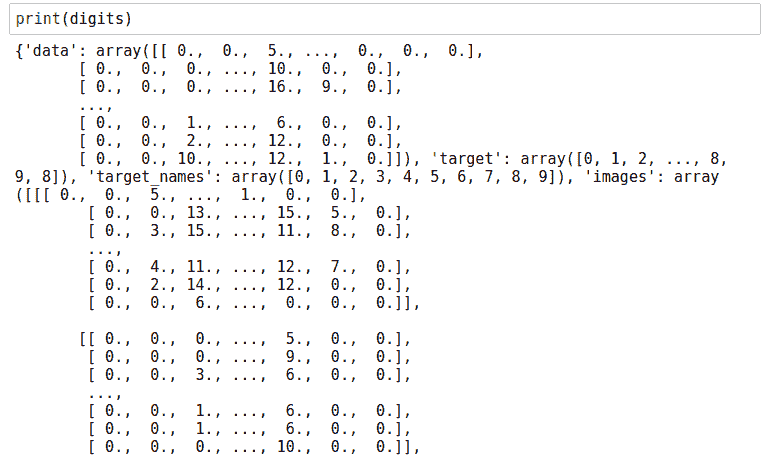
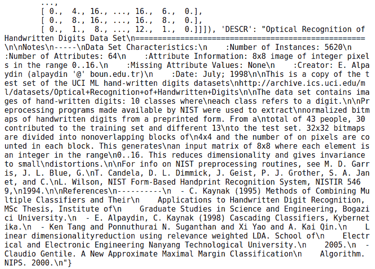
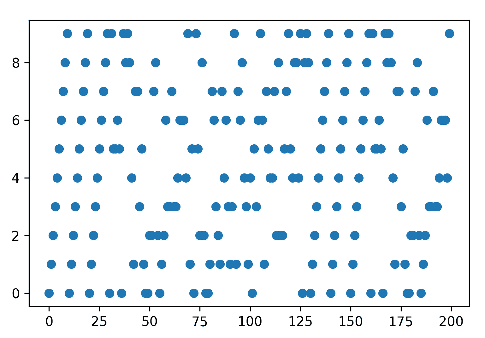
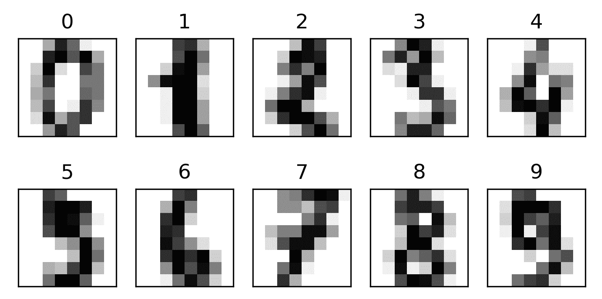
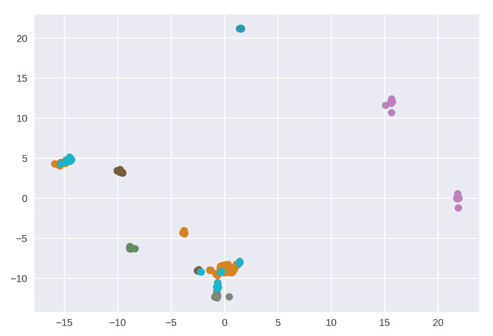
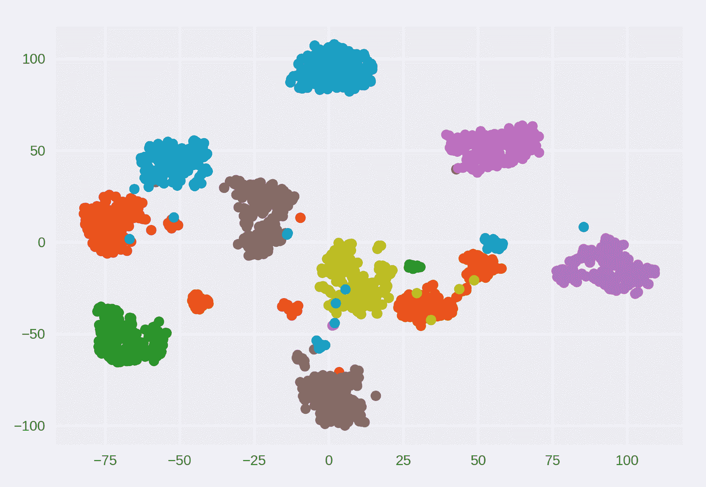
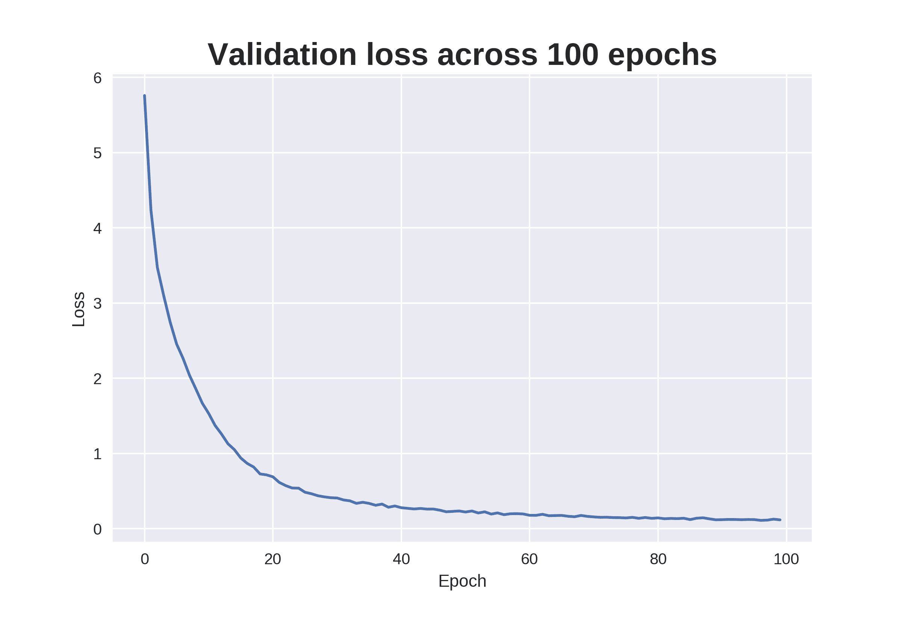
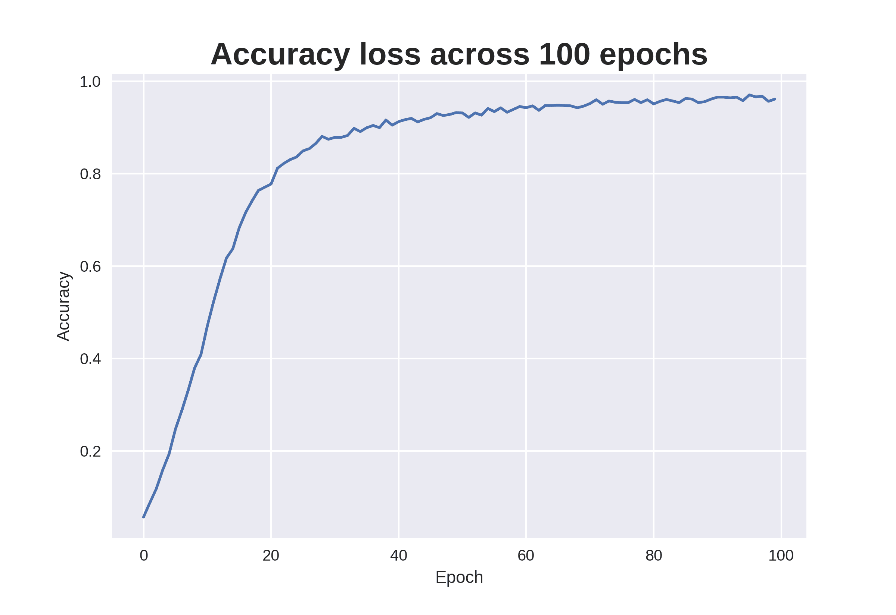
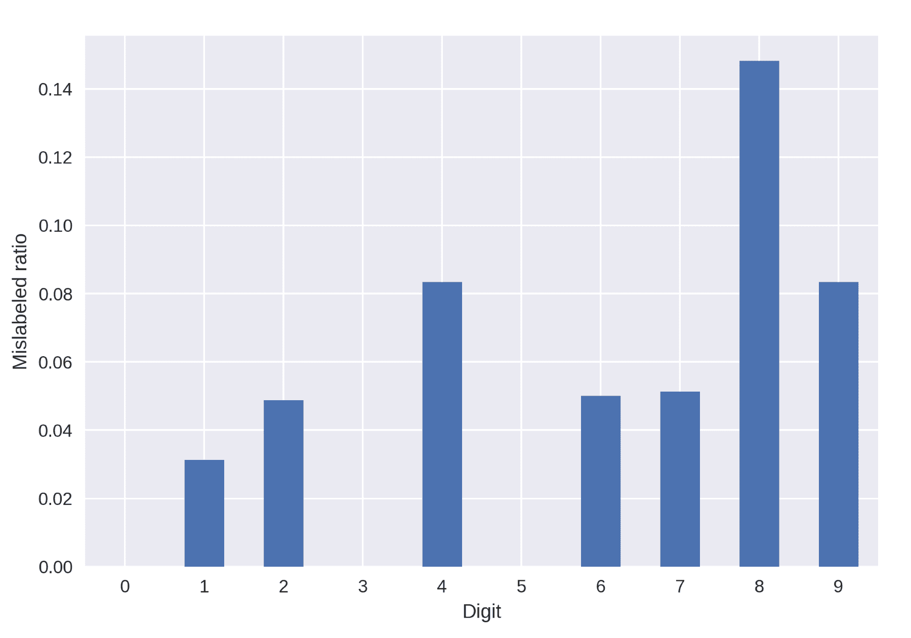
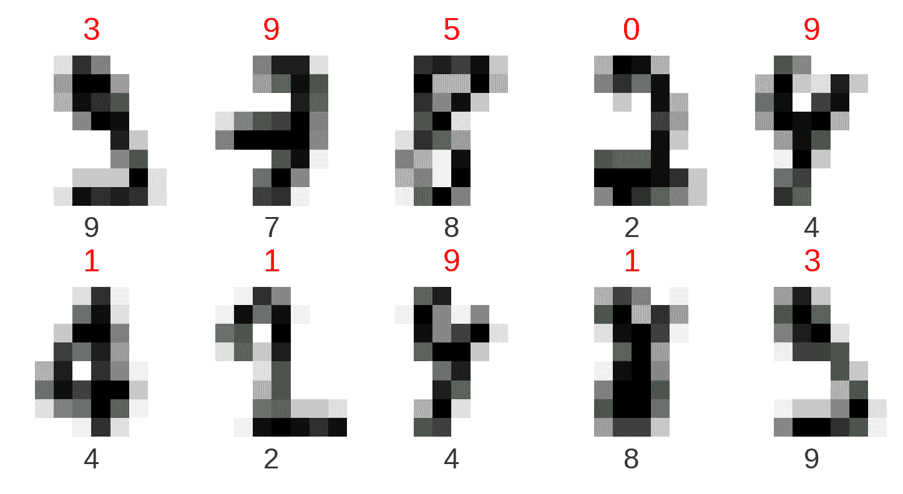

# 第十章：将数据可视化集成到工作流中

我们现在来到了本书的最后一章。在本书的整个过程中，你已经掌握了如何使用来自网络的不同格式的真实世界数据，创建和定制静态与动态图表的技巧。作为总结，我们将在本章开始一个迷你项目，将数据分析技能与您学到的可视化技术结合起来。我们将演示如何将可视化技术整合到当前的工作流中。

在大数据时代，机器学习成为简化分析工作的重要工具，通过用自动预测替代大量的手动整理。尽管如此，在我们进入模型构建之前，**探索性数据分析**（**EDA**）始终是获取数据基本情况的关键。优化过程中的不断回顾也有助于改进我们的训练策略和结果。

高维数据通常需要特殊的处理技术才能直观地进行可视化。统计方法，如**主成分分析**（**PCA**）和**t-分布随机邻居嵌入**（**t-SNE**），是将数据降维以便有效可视化的重要技能。

作为展示，我们将演示在一个涉及使用**卷积神经网络**（**CNN**）识别手写数字的工作流中使用各种可视化技术。

一个重要的注意点是，我们并不打算在本章详细说明所有的数学和机器学习方法。我们的目标是可视化其中的一些过程。希望读者能意识到探索如`损失`函数在训练 CNN 时的作用，或使用不同参数可视化降维结果等过程的重要性。

# 开始

回顾我们在第四章《高级 Matplotlib》中简要提到的 MNIST 数据集。它包含了 70,000 张手写数字的图像，通常用于数据挖掘教程中作为*机器学习基础*。在本章的项目中，我们将继续使用类似的手写数字图像数据集。

我们几乎可以确定，在开始本课程之前，你已经听说过一些热门关键词——深度学习或机器学习。正因为如此，我们将它作为展示案例。由于机器学习中的一些详细概念，如**超参数调优**来优化性能，超出了本书的范围，我们不会深入探讨。但是，我们将以食谱式的方式讲解模型训练部分。我们将重点讲解可视化如何帮助我们的工作流。对于那些对机器学习细节感兴趣的读者，我们建议进一步探索大量在线资源。

# 可视化数据集中的样本图像

数据清洗和探索性数据分析（EDA）是数据科学中不可或缺的组成部分。在我们开始分析数据之前，理解输入数据的一些基本特性是很重要的。我们使用的数据集包含标准化的图像，形状规则且像素值已归一化。特征简单，主要是细线条。我们的目标也很直接，就是从图像中识别数字。然而，在许多实际应用的案例中，问题可能更复杂；我们收集的数据往往是原始的，且异质性较强。在解决问题之前，通常值得花时间抽取少量数据进行检查。试想训练一个模型来识别拉面，只是为了让你垂涎三尺；）。你可能会查看一些图像，以决定哪些特征可以作为一个好的输入样本，来展示碗的存在。除了初步的准备阶段，在模型构建过程中，剔除一些标签错误的样本进行检查，也有助于我们制定优化策略。

如果你想知道拉面这个想法是从哪里来的，一个名为 Kenji Doi 的数据科学家创建了一个模型，用来识别一碗拉面是在哪家餐厅分店制作的。你可以在 Google Cloud 大数据与机器学习博客中阅读更多内容，链接在此：[`cloud.google.com/blog/big-data/2018/03/automl-vision-in-action-from-ramen-to-branded-goods`](https://cloud.google.com/blog/big-data/2018/03/automl-vision-in-action-from-ramen-to-branded-goods)。

# 导入 UCI ML 手写数字数据集

虽然我们将使用 MNIST 数据集，正如在[第四章](https://cdp.packtpub.com/matplotlib_for_python_developers__second_edition/wp-admin/post.php?post=338&action=edit#post_73)中所示的*高级 Matplotlib*（因为我们将展示机器学习中的可视化和模型构建），但是我们将采取捷径以加速训练过程。我们不会使用包含 60,000 张 28x28 像素图像的 MNIST 数据集，而是从 scikit-learn 包中导入另一个类似的 8x8 像素图像数据集。

该数据集来自加利福尼亚大学欧文分校机器学习资源库，地址为[`archive.ics.uci.edu/ml/datasets/Optical+Recognition+of+Handwritten+Digits`](http://archive.ics.uci.edu/ml/datasets/Optical+Recognition+of+Handwritten+Digits)。它是 43 个人手写数字图像的预处理版本，其中 30 人用于训练集，13 人用于测试集。预处理方法在 M. D. Garris、J. L. Blue、G. T. Candela、D. L. Dimmick、J. Geist、P. J. Grother、S. A. Janet 和 C. L. Wilson 的论文《NIST 表单式手写识别系统》，NISTIR 5469，1994 中有详细描述。

导入数据集的代码如下：

```py
from sklearn.datasets import load_digits
```

首先，让我们将数据集存储到一个变量中。我们将其命名为`digits`，并在本章中多次使用它：

```py
digits = load_digits()
```

让我们通过打印出变量`digits`来查看`load_digits()`函数加载了什么内容：

```py
print(type(digits))
print(digits)
```

`digits` 的类型是 `<class 'sklearn.utils.Bunch'>`，这是专门用于加载示例数据集的。

由于 `print(digits)` 的输出比较长，我们将在两张截图中展示它的开头和结尾：



以下截图展示了输出的尾部：



我们可以看到，`digits` 类中有五个成员：

+   `'data'`：像素值压平为一维 NumPy 数组

+   `'target'`：数据集中每个元素的身份标签的 NumPy 数组

+   `'target_names'`：数据集中存在的唯一标签的列表—在这里是整数 0-9

+   `'images'`：像素值重新排列成二维 NumPy 数组，表示图像的维度

+   `'DESCR'`：数据集的描述

除了图像尺寸比 MNIST 更小外，这个数据集的图像数量也少得多。那么，究竟有多少张图像呢？我们可以通过 `nd.shape` 获取 NumPy 数组的维度元组，其中 `nd` 是数组。因此，要查询 `digits.image` 的形状，我们调用：

```py
print(digits.images.shape)
```

我们得到的结果是 `(1797, 8, 8)`。

你可能会想，为什么这个数字如此特别。如果你眼尖的话，可能已经注意到描述中有 5,620 个实例。事实上，这些描述是从归档网页中检索到的。我们加载的数据实际上是完整数据集中的测试部分。你也可以从 [`archive.ics.uci.edu/ml/machine-learning-databases/optdigits/optdigits.tes`](http://archive.ics.uci.edu/ml/machine-learning-databases/optdigits/optdigits.tes) 下载其纯文本版本。

如果你有兴趣获取完整的 MNIST 数据集，scikit-learn 也提供了一个 API 来获取它：

`from sklearn.datasets import fetch_mldata mnist = fetch_mldata('MNIST original', data_home=custom_data_home)`

# 绘制样本图像

现在我们更了解输入数据的背景了，让我们绘制一些样本图像。

# 提取每个数字 0-9 的一个样本

为了了解图像的样子，我们希望提取每个数字的一个图像进行检查。为此，我们需要找出数字的位置。我们可以通过跟踪正确的索引（即数据标签）来完成这一任务，使用 `digits.target`，然后写几行代码来调用 `10` 张图像：

```py
indices = []
for i in range(10):
    for j in digits.target:
        if i==j:
            indices.append(j)
            break
print(indices)
```

有趣的是，`[0, 1, 2, 3, 4, 5, 6, 7, 8, 9]` 被作为输出返回，这意味着前 `10` 个样本恰好按数字顺序排列。这是偶然发生的，还是数据是有序的？我们需要检查，因为样本分布可能会影响我们的训练表现。

# 检查数据集的随机性

由于显示所有 1,797 个数据点会使得图像过于密集，无法进行有意义的解释，我们将绘制前 `200` 个数据点来检查：

```py
import matplotlib.pyplot as plt
plt.scatter(list(range(200)),digits.target[:200])
plt.show()
```

在这里，我们得到了一张样本分布的散点图。看起来并不完全随机，对吧？数字 0 到 9 按顺序排列并重复了三次。我们还可以看到从*第 125 个*样本开始，模式有了重复。数据的结构暗示着在后续机器学习模型训练之前可能进行了随机化处理。现在，我们将按原样继续，继续检查这些图像：



# 在子图中绘制 10 个数字

我们将图像排列在一个两行五列的网格中。首先通过`plt.figure()`设置矩形画布。对于每个数字的样本图像，我们通过`plt.subplot()`函数定义坐标轴，然后调用`imshow()`显示颜色值数组作为图像。回想一下，颜色映射`'gray_r'`会将值从零到最大值以灰度形式从白色到黑色进行绘制。由于不需要显示*x*和*y*的刻度标签，我们将通过传递一个空列表给`plt.xticks()`和`plt.yticks()`来移除这些多余的内容。以下是实现这一操作的代码片段：

```py
import matplotlib.pyplot as plt

nrows, ncols = 2, 5
plt.figure(figsize=(6,3))

for i in range(ncols * nrows):
    ax = plt.subplot(nrows, ncols, i + 1)
    ax.imshow(digits.images[i],cmap='gray_r')
    plt.xticks([])
    plt.yticks([])
    plt.title(digits.target[i])
```

如下图所示，图像对人眼来说有些模糊。但信不信由你，算法足够提取出特征并区分每个数字。我们将在我们的工作流程中一起观察这一点：



# 使用 t-SNE 方法探索数据的性质

在可视化了几个图像并略微了解样本的分布后，我们将深入进行数据探索分析（EDA）。

每个像素都有一个强度值，这样每个 8x8 的图像就有 64 个变量。人类大脑不擅长直观感知超过三维的空间。对于高维数据，我们需要更有效的视觉辅助工具。

降维方法，例如常用的 PCA 和 t-SNE，通过减少考虑的输入变量的数量，同时保留大部分有用的信息，从而使数据的可视化变得更加直观。

在接下来的部分中，我们将重点讨论使用 Python 中的 scikit-learn 库进行 t-SNE 方法的应用。

# 理解 t-分布随机邻域嵌入

t-SNE 方法由 van der Maaten 和 Hinton 于 2008 年在论文《使用 t-SNE 可视化数据》中提出。它是一种非线性降维方法，旨在有效地可视化高维数据。t-SNE 基于概率分布，通过在邻域图上进行随机游走来发掘数据中的结构。t-SNE 的数学细节超出了本书的范围，建议读者阅读原论文以了解更多细节。

简而言之，t-SNE 是一种捕捉高维数据中非线性关系的方法。当我们试图从高维矩阵中提取特征时，例如图像处理、生物数据和网络信息，它特别有用。它使我们能够将高维数据降维到二维或三维；t-SNE 的一个有趣特点是它是随机的，这意味着它每次显示的最终结果都会不同，但它们都是同样正确的。因此，为了在 t-SNE 降维中获得最佳表现，建议先对大数据集执行 PCA 降维，然后将 PCA 维度引入 t-SNE 进行后续降维。这样，你会得到更一致且可复制的结果。

# 从 scikit-learn 导入 t-SNE 方法

我们将通过加载 scikit-learn 中的`TSNE`函数来实现 t-SNE 方法，如下所示：

```py
from sklearn.manifold import TSNE
```

用户在运行 t-SNE 时需要设置一些超参数，包括：

+   `'init'`：嵌入初始化

+   `'method'`：`barnes_hut`或精确方法

+   `'perplexity'`：默认值`30`

+   `'n_iter'`：默认值`1000`

+   `'n_components'`：默认值`2`

进入单个超参数的数学细节会是一个单独的章节，但我们确实有一些关于参数设置的一般建议。对于`init`，推荐使用`'pca'`，原因之前已说明。对于方法，`barnes_hut`会更快，并且如果提供的数据集本身没有高度相似性，结果非常相似。对于困惑度，它反映了对数据局部和全局子结构的关注。`n_iter`表示你将运行算法的迭代次数，而`n_components = 2`表示最终的结果是二维空间。

为了追踪实验轮次的时间，我们可以在 Jupyter Notebook 中使用单元魔法`%%timeit`来跟踪单元运行所需的时间。

# 绘制 t-SNE 图来展示我们的数据

让我们首先按手写数字的顺序重新排列数据点：

```py
import numpy as np
X = np.vstack([digits.data[digits.target==i]for i in range(10)])
y = np.hstack([digits.target[digits.target==i] for i in range(10)])
```

`y`将变成`array([0, 0, 0, ..., 9, 9, 9])`。

请注意，t-SNE 变换在普通笔记本电脑上可能需要几分钟的计算时间，`tSNE`命令可以像下面这样简单地运行。我们首先尝试使用`250`次迭代来运行 t-SNE：

```py
#Here we run tSNE with 250 iterations and time it
%%timeit
tsne_iter_250 = TSNE(init='pca',method='exact',n_components=2,n_iter=250).fit_transform(X)
```

让我们绘制一个散点图，看看数据是如何聚集的：

```py
#We import the pandas and matplotlib libraries
import pandas as pd
import matplotlib
matplotlib.style.use('seaborn')
#Here we plot the tSNE results in a reduced two-dimensional space
df = pd.DataFrame(tsne_iter_250)
plt.scatter(df[0],df[1],c=y,cmap=matplotlib.cm.get_cmap('tab10'))
plt.show()
```

我们可以看到，在`250`次迭代后，聚类并没有很好地分开：



现在我们尝试使用`2000`次迭代来运行：

```py
#Here we run tSNE for 2000 iteractions
tsne_iter_2000 = TSNE(init='pca',method='exact',n_components=2,n_iter=2000).fit_transform(X)
#Here we plot the figure
df2 = pd.DataFrame(tsne_iter_2000)
plt.scatter(df2[0],df2[1],c=y,cmap=matplotlib.cm.get_cmap('tab10'))
plt.show()
```

如下截图所示，样本呈现为`10`个不同的聚类斑点。通过运行`2000`次迭代，我们得到了更加满意的结果：



# 创建一个 CNN 来识别数字

在接下来的部分中，我们将使用 Keras。Keras 是一个用于神经网络的 Python 库，提供了一个高级接口来调用 TensorFlow 库。我们不打算对 Keras 或 CNN 进行完整的教程讲解，但我们希望展示如何使用 Matplotlib 可视化`损失`函数、`准确率`以及结果中的异常值。

对于不熟悉机器学习的读者，他们应该能够理解剩余章节的逻辑，并希望能够理解为什么可视化`损失`函数、`准确率`和结果中的异常值对于微调 CNN 模型非常重要。

这里是 CNN 代码的一段，最重要的部分是在这一部分之后的评估环节！

```py
# Import sklearn models for preprocessing input data
from sklearn.model_selection import train_test_split 
from sklearn.preprocessing import LabelBinarizer

# Import the necessary Keras libraries
from keras.models import Sequential
from keras.layers import Dense, Dropout, Flatten
from keras.layers.convolutional import Convolution2D, MaxPooling2D
from keras import backend as K
from keras.callbacks import History 

# Randomize and split data into training dataset with right format to feed to Keras
lb = LabelBinarizer()
X = np.expand_dims(digits.images.T, axis=0).T
y = lb.fit_transform(digits.target)
X_train, X_test, y_train, y_test = train_test_split(X, y, test_size=0.2, random_state=100)

# Start a Keras sequential model
model = Sequential()

# Set input format shape as (batch, height, width, channels)
K.set_image_data_format('channels_last') # inputs with shape (batch, height, width, channels)

model.add(Convolution2D(filters=4,kernel_size=(3,3),padding='same',input_shape=(8,8,1),activation='relu'))
model.add(MaxPooling2D(pool_size=(2,2)))

# Drop out 5% of training data in each batch
model.add(Flatten())
model.add(Dropout(0.05))
model.add(Dense(10, activation= 'softmax'))

# Set variable 'history' to store callbacks to track the validation loss
history = History()

# Compile the model
model.compile(loss='categorical_crossentropy', optimizer='adam', metrics=['accuracy'])

# Fit the model and save the callbacks of validation loss and accuracy to 'history'
model.fit(X_train,y_train, epochs=100, batch_size= 128, callbacks=[history])
```

# 使用可视化评估预测结果

我们已经指定了回调函数，保存每个训练轮次的损失和准确率信息，作为变量`history`进行保存。我们可以从字典`history.history`中提取这些数据。让我们查看一下字典的`keys`：

```py
print(history.history.keys())
```

这将输出`dict_keys(['loss', 'acc'])`。

接下来，我们将在折线图中绘制`损失`函数和`准确率`随训练轮次变化的情况：

```py
import pandas as pd
import matplotlib
matplotlib.style.use('seaborn')

# Here plots the loss function graph along Epochs
pd.DataFrame(history.history['loss']).plot()
plt.legend([])
plt.xlabel('Epoch')
plt.ylabel('Loss')
plt.title('Validation loss across 100 epochs',fontsize=20,fontweight='bold')
plt.show()

# Here plots the percentage of accuracy along Epochs
pd.DataFrame(history.history['acc']).plot()
plt.legend([])
plt.xlabel('Epoch')
plt.ylabel('Accuracy')
plt.title('Accuracy loss across 100 epochs',fontsize=20,fontweight='bold')
plt.show()
```

在训练过程中，我们可以看到`损失`函数正在减少，准确率也在增加，这是我们很高兴看到的现象。以下是展示`损失`函数的第一张图：



下一张图展示了**准确率**在**训练轮次**中的变化：



从这些截图中，我们可以观察到随着每个训练轮次的进行，损失逐渐减少，准确率逐渐增加，期间有时会上下波动。我们可以观察到最终的准确率是否令人满意，学习率是否合适，并在必要时优化模型。

# 检查每个数字的预测性能

我们首先将标签从 one-hot 格式还原为整数列表：

```py
y_test1 = model.predict(X_test)
y_test1 = lb.fit_transform(np.round(y_test1))
y_test1 = np.argmax(y_test1, axis=1)
y_test = np.argmax(y_test, axis=1)
```

我们将提取错误标记图像的索引，并用它们来获取相应的真实标签和预测标签：

```py
import numpy as np
mislabeled_indices = np.arange(len(y_test))[y_test!=y_test1]
true_labels = np.asarray([y_test[i] for i in mislabeled_indices])
predicted_labels = np.asarray([y_test1[i] for i in mislabeled_indices])
print(mislabeled_indices)
print(true_labels)
print(predicted_labels)
```

输出如下，包含了错误标记图像的索引、真实标签和预测标签的 NumPy 数组：

```py
[  1   8  56  97 117 186 188 192 198 202 230 260 291 294 323 335 337]
[9 7 8 2 4 4 2 4 8 9 6 9 7 6 8 8 1]
[3 9 5 0 9 1 1 9 1 3 0 3 8 8 1 3 2]
```

让我们统计每个数字被错误标记的样本数量。我们将把计数结果存储到一个列表中：

```py
mislabeled_digit_counts = [len(true_labels[true_labels==i]) for i in range(10)]
```

现在，我们将绘制一个条形图，显示每个数字的错误标记样本比例：

```py
# Calculate the ratio of mislabeled samples
total_digit_counts = [len(y_test[y_test==i]) for i in range(10)]
mislabeled_ratio = [mislabeled_digit_counts[i]/total_digit_counts[i] for i in range(10)]

pd.DataFrame(mislabeled_ratio).plot(kind='bar')
plt.xticks(rotation=0)
plt.xlabel('Digit')
plt.ylabel('Mislabeled ratio')
plt.legend([])
plt.show()
```

这段代码生成一个条形图，显示我们模型错误标记每个数字的比例：



从前面的图中，我们看到数字 8 是模型最容易误识别的数字。我们来看看为什么。

# 提取错误预测的图像

与我们在本章开头所做的类似，我们将提取出数字图像。这次，我们挑选出被错误标记的图像，因为这些才是我们关注的对象。我们将再次挑选出 10 张图像，并将它们放入子图网格中。我们将真实标签用绿色写在底部作为`xlabel`，并将预测的错误标签用`红色`写在顶部作为`title`，对于每个子图中的图像：

```py
import matplotlib.pyplot as plt
nrows, ncols = 2, 5
plt.figure(figsize=(6,3))
for i in range(ncols * nrows):
    j = mislabeled_indices[i]
    ax = plt.subplot(nrows, ncols, i + 1)
    ax.imshow(X_test[j].reshape(8,8),cmap='gray_r')
    plt.xticks([])
    plt.yticks([])
    plt.title(y_test1[j],color='red')
    plt.xlabel(y_test[j],color='green')
plt.show()
```

让我们看看这些图像的效果。你认为这些手写数字更像真实标签还是错误预测的标签呢？



我们可以观察到，对于某些图像，即使用肉眼看，8x8 分辨率下也很难识别真实标签，比如底部行中间的数字**4**。然而，同一行最左侧的数字**4**应该足够清晰，便于人类识别。从这里我们可以估算出通过额外训练和优化模型，准确度最大可能的提升。这将指导我们是否值得投入更多精力去改进模型，或者下一步应该获取或生成哪种训练数据，以获得更好的结果。

同时，请注意，训练和测试数据集通常包含来自不同分布的样本。你可以通过下载 UCI ML 的实际训练数据集，使用更大的 MNIST 数据集（通过 Keras 下载，甚至是抓取或自己生成数据）来重复这一过程，作为练习。

# 总结

恭喜你！你已经完成了这一章以及整本书。在这一章中，我们整合了各种数据可视化技术，并结合了一个分析项目工作流程，从数据的初步检查和探索性分析，到模型构建和评估。给自己热烈的掌声，准备好跃进数据科学之旅吧！
