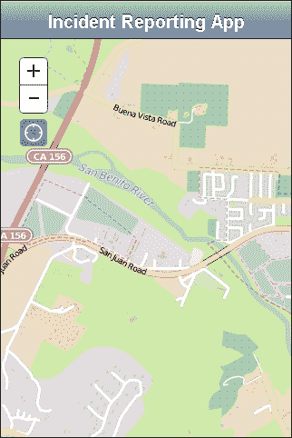
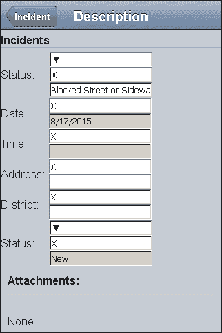
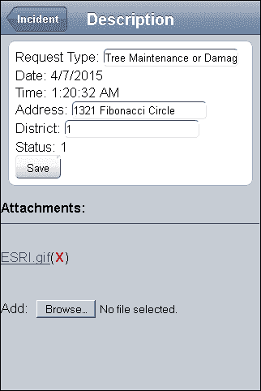
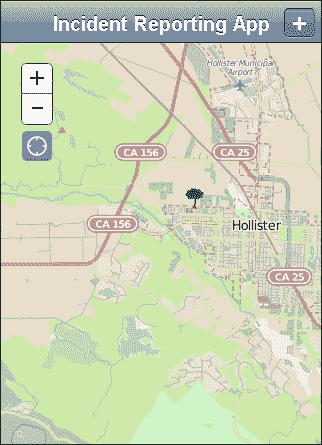

# 第九章：移动开发

移动网页开发在过去的几年中引起了很大的轰动。当苹果公司推出 iPhone 时，它不支持第三方插件，如 Flash 和 Silverlight。这挑战了网页开发者仅使用 HTML、CSS 和 JavaScript 在移动平台上提供有价值的网页体验。如 HTML5、CSS3、ECMAScript 5 和 6 等提议的功能增强，以及更强大的浏览器，都改善了移动浏览体验。

公司和组织在提供移动网页体验方面采取了不同的方法。一些组织将移动浏览器重定向到仅提供移动内容的网站（使用如 `mobile.example.com` 或 `m.example.com` 这样的 URL，而不是 `www.example.com`）。其他人则使用了响应式设计和以移动为先的策略，为手机、平板电脑和桌面屏幕提供格式不同的相同内容。还有一些公司，如 Facebook，已经放弃了移动网页开发，专注于移动应用，使用原生应用或混合网页应用。

在本章中，我们将探讨以下内容：

+   移动设备开发与桌面网站开发的不同之处

+   如何使用 ArcGIS 紧凑型构建

+   如何使用 `dojox/mobile` 模块控制移动用户体验

# 拥抱移动

移动网页开发是一个快速发展的市场。在 2012 年的印度，从移动设备提供互联网内容的百分比超过了桌面电脑。在美国，报告显示，2014 年来自移动设备的网络流量占 10%，并且这个比例正在增加。

人们在使用移动互联网时都在做什么？有些人正在检查他们的电子邮件。其他人正在搜索信息，玩游戏，或者与他人保持联系。人们希望保持连接，享受娱乐，并获取信息，他们希望这些信息在他们需要的时候可用。

# 移动与众不同

使网站在移动设备上工作与在桌面机器上工作大相径庭。在桌面浏览器上曾是特性的许多事物，现在在移动设备上却成为了障碍。让我们看看是什么让移动与众不同，无论是好是坏。

## 好的方面

即使有所有这些负面因素，移动应用开发仍然是一个令人兴奋的领域。移动网页应用有很多好的特性。现代智能手机提供了在桌面电脑上显得奇怪但却是移动应用至关重要的传感器和工具。它们为用户带来了一个信息的世界，并允许用户在需要的时候记录和分享事物，而不是在启动他们的桌面电脑的那天晚上。让我们更详细地看看这些特性。

### 访问手机传感器

移动设备内置了许多传感器。这些传感器可以检测设备的方向、加速度，甚至位置。位置可以通过内置的 GPS 设备、手机信号三角测量或基于 Wi-Fi 信号的位置来收集。手机中的新传感器可以传递电池强度。此外，一些第三方混合工具提供了访问更多手机功能的方法，例如内存、联系人和相机。

### 即时访问应用程序

用户不再需要写下 URL 在家中使用。现在，他们可以将 URL 说给浏览器听，或者拍下二维码来访问网站。这种即时访问让更多的人立即使用您的应用程序，减少了忘记应用程序位置的风险。

通过即时访问应用程序，用户可以在他们所在的位置收集数据，而不是回家输入信息。用户可以拍摄损坏的消防栓的照片，登录社区问题应用程序，并向适当的当局报告问题。现场工作人员可以在现场收集特征数据并检查它们。志愿者地理数据收集可用于公民科学、市政问题跟踪以及其他众多应用。

### 即时访问用户

与可能被图书馆电脑亭的任何人使用的桌面应用程序不同，手机更有可能只有一个用户。应用程序的使用可以与用户资料相结合，为您提供一个更全面的了解，了解您的应用程序如何被不同的群体所使用。可能性是无限的。

## 坏处

你花费数小时搭建了一个看起来完美的网站，在您的显示器上看起来无懈可击。你在三四个不同的浏览器上测试了您的网站，并且对看到的结果感到满意。它看起来很棒；它运行得很好。它注定会成功。

然后，你遇到了一个朋友，想向他们展示你的惊人网站，但你只有智能手机。你认为没问题，因为你正在将网站的 URL 输入到手机的浏览器中。出现的是可用性噩梦。屏幕的一部分被切掉了。控件不像你计划的那样工作。你不能正确地浏览菜单。总的来说，一团糟。

现在，让我们看看移动网页开发的一些痛点。

### 屏幕尺寸如此之多

在互联网的旧日子里，你只需要担心几个显示器尺寸。只要你在 1024x768 的显示器上制作了一个看起来不错的网站，你就没问题了。有些人有钱买更大的显示器，而有些人有更小的显示器，但差别不大。

现在，智能手机、平板电脑和其他设备的屏幕尺寸从四英寸的角到角到平板电视大小不等，由于屏幕技术的巨大进步，较小的屏幕的像素密度是标准桌面显示器的 1.5 倍、2 倍甚至 3 倍。在桌面电脑上容易阅读的网站在智能手机上变得拥挤且更小。

随着屏幕分辨率的增加，您需要在网站上进行的测试数量也在增加。网站在 3 英寸宽的手机上看起来和高清电视上一样好吗？它是否能够很好地缩放？

### 指尖精度

当从桌面应用程序迁移到移动应用程序时，丢失的另一个功能是鼠标的高精度输入。无论您使用鼠标、笔记本电脑触摸板还是电脑的触控笔，您都有一个鼠标指针，可以提供对您内容的精细操作。在移动设备上，您必须考虑到较大的手指可能会点击到您精心设计的多个按钮。此外，您为网站创建的小型关闭按钮可能对于一些大型指纹来说太难关闭。

除了失去鼠标指针的精度外，您还会失去鼠标悬停事件。从简单的工具提示到由 CSS 驱动的可折叠菜单，在移动浏览器中都不会按预期工作，因为没有悬停事件可供监听和处理。您五到十年前的旧代码在移动网络时代将不会按相同的方式工作。

### 电池寿命

处理电池寿命可能又是移动开发的另一个障碍。重复访问位置数据和持续监控广告可能会耗尽移动设备的电量。虽然这些信息很有用，但它是有代价的。请记住，并不是每个人的手机都有满电，而且并不是每个电池都能持续数小时。

### 更多设备

我们之前提到了屏幕尺寸的多样性，但这只是开始。市面上有各种各样的设备，运行着 Android、iOS、Windows Phone 和其他操作系统。每个设备都有多个网络浏览器的选择，甚至这些网络浏览器可能处于不同的版本号。因此，对于最新的和最好的网络功能的支持可能会有所不同，这取决于具体的功能。您将不得不决定您愿意支持什么，以及您愿意购买哪些设备进行测试。

现在我们已经探讨了为什么我们应该构建移动应用程序，让我们看看通过 ArcGIS JavaScript API 我们可以使用哪些工具。

# ArcGIS 紧凑型构建

ArcGIS JavaScript API 可以作为更紧凑的库加载到移动浏览器中。所谓的紧凑型构建，包含了在移动浏览器中查看地图应用程序所需的最小库。其他模块可以通过 Dojo 的`require()`语句下载，但许多模块不会与初始库一起预加载。

## 紧凑型构建中包含的模块

ArcGIS 紧凑型构建包含构建网络地图应用程序所需的所有模块。它加载的方式与常规的 ArcGIS API for JavaScript 相同，使用`require()`和`define()`语句。它还包含最常用的模块，如`esri/Map`和`esri/layers/ArcGISDynamicMapServiceLayer`，以便在尽可能少使用带宽的情况下快速加载您的地图。

## 未包含的内容

虽然 ArcGIS JavaScript 紧凑版构建提供了所有这些功能，但您可能会认为它们必须牺牲一些东西。紧凑版构建首先放弃的是重量。在 3.13 版本中，该库的重量为 179.54 KB，而其更庞大的同侪为 107.26 KB。常规构建附带了一些预加载的库，而紧凑版构建使用 `require()` 或 `define()` 语句单独请求这些模块。这样，您可以更好地控制发送给用户的库部分。

在 ArcGIS JavaScript API 紧凑版构建中牺牲的另一项是依赖于 `dijit` 命名空间。你首先会注意到弹出窗口被替换为更简化的版本。此外，如果你喜欢使用渐变缩放滑块来缩放地图，在紧凑版构建中你可能要放弃了。它只支持 **+** 和 **–** 按钮来缩放地图。如果你有依赖于 `dijit/_Widgetbase` 库的小部件，可以通过 `require()` 和 `define()` 语句单独下载。

## 这对你意味着什么？

ArcGIS JavaScript 紧凑版构建提供了与常规构建相同的大部分功能。在一些控件上存在一些差异，但它们都呈现相同的地图和信息。较小的库大小非常适合将地图嵌入现有应用程序中，或者使用其他库，如 Angular、Knockout 或 jQuery，来处理其他组件交互。如果你不依赖于紧凑版构建中丢失的少数功能，尝试一下是值得的。

### 注意

关于 ArcGIS JavaScript API 紧凑版构建的更多信息，请参阅 [`developers.arcgis.com/javascript/jshelp/inside_compactbuild.html`](https://developers.arcgis.com/javascript/jshelp/inside_compactbuild.html)。

# ESRI Leaflet

`Leaflet.js` 库为 ArcGIS JavaScript API 提供了另一种选择。这是一个轻量级的库，可以在广泛的浏览器上显示地图。Leaflet 与任何瓦片地图服务都兼容，可以通过 **geojson**（一种流行的开源地理数据 JSON 格式）添加点、线和多边形。该库可以通过插件支持不同的工具和数据源。Leaflet 库拥有丰富的插件生态系统，每天都有更多工具和数据源插件被开发。

ESRI 发布了 ESRI Leaflet 插件，以便 Leaflet 地图可以使用 ArcGIS 服务器地图服务。根据 ESRI Leaflet GitHub 页面，它支持以下地图服务层：

+   ESRI 底图服务

+   特征服务

+   瓦片地图服务

+   动态地图服务

+   ImageServer 地图服务

### 注意

关于 `Leaflet.js` 库的更多信息，您可以访问 [`leafletjs.com/`](http://leafletjs.com/)。关于该库的书籍，您可以查阅 Paul Crickard III 的 *Leaflet.js Essentials* 或 Jonathan Derrough 的 *Interactive Map Designs with Leaflet JavaScript Library How-to*。

# Dojox 移动

你不希望创建一个模仿移动设备风格的应用程序，同时看起来像原生应用吗？这正是 Dojo 框架的一些贡献者所想的，这导致了 `dojox/mobile` 中的模块。这些模块提供了与原生移动应用中的许多 UI 元素相匹配的控件，在形式和功能上模仿它们。在这个库的部件中，按钮和滑块看起来像 Safari 上的 iPhone 按钮和滑块，而在基于 Android 的浏览器上则表现为原生 Android 按钮和滑块。

`dojox/mobile` 模块提供了一种模仿原生移动应用的视觉交互框架。与它们的 `dijit` 表单对应物不同，`dojox/mobile` 用户控件不使用那么多 HTML 元素，从而提高了下载速度和内存使用。UI 元素与其他 `dojox/mobile` 控件配合良好，从占据整个屏幕的 `dojox/mobile/View` 到最后的 `dojox/mobile/Button`。让我们看看其中的一些。

## Dojox 移动视图

`dojox/mobile/View` 模块在应用程序的部分之间提供了视觉分隔。视图是完整的页面容器，可以通过滑动或按钮点击进行导航。这些在组织内容方面与 `dijit/layout/ContentPane` 有一定的相似性。

与 `dojox/mobile/View` 相关，`dojox/mobile/ScrollableView` 以移动用户期望的方式提供了额外的滚动功能。在许多移动设备上，当用户滑动屏幕向下滚动页面时，该用户期望页面将继续滚动，直到减速停止。"ScrollableView" 实现了页面上的惯性滚动。

### 注意

由于 `ScrollableView` 滚动事件会干扰触摸屏界面上地图的平移，因此您不应将交互式地图添加到该视图中。"ScrollableView" 更适合于表单和可能超出屏幕高度的内容。

# 与触摸一起工作

如果您习惯于在 JavaScript 中使用鼠标事件，触摸事件可能会有些令人困惑。`touchstart` 和 `touchend` 事件看起来与 `mousedown` 和 `mouseup` 事件相当。

在当前版本的 ArcGIS JavaScript API 中，许多触摸事件已经被 API 模块处理。当与地图一起工作时，您不需要在 `map.on("click")` 事件监听器之上分配 `map.on("touchstart")` 事件监听器。`map.on("click")` 事件监听器为您处理它。对于任何 Dojo 小部件和控制也是如此。这又少了一件您需要做的事情来使您的应用程序移动化。

说到地图，有一些触摸事件可用，使得一些导航工具变得过时。您可以在屏幕上捏合或展开手指来分别放大和缩小。通过在地图上拖动手指可以控制平移。这些操作消除了放大、缩小和平移按钮的需求，从而可以释放宝贵的屏幕空间。

## 手势

JavaScript 处理复杂的移动手势并没有像在原生应用程序中那样顺畅。例如，原生应用程序被开发出来以区分点击和长按点击。默认情况下，许多基于 JavaScript 的应用程序将它们都视为点击。

ArcGIS JavaScript API 中的 Dojo 框架提供了一些用于处理手势的实验性库，即 `dojox/gesture` 模块。这些模块允许你使用 `dojo/on` 来分配事件，如下面的代码片段所示：

```py
require(["dojo/on", "dojox/gesture/tap"], function (dojoOn, tap) {
  dojoOn(node, tap, function (e) {…});
});
```

对于简单的手势定义，`dojox/gesture` 模块允许你使用 `dojox/gesture/tap` 和 `dojox/gesture/swipe` 分别定义点击和滑动事件。对于点击事件，你可以定义单次点击、双击和长按点击事件。对于滑动事件，你可以定义滑动事件开始和结束的事件。在下面的代码片段中，你可以看到实现它的示例：

```py
require(["dojo/on", "dojox/gesture/swipe"], function(on, swipe){
  on(node, swipe, function(e){ … });
  on(node, swipe.end, function(e){ alert("That was easy.");});
});
```

你找不到你想要的操作手势吗？使用 `dojox/gesture/Base` 模块，你可以定义你自己的自定义手势。到目前为止，你必须定义自己的方法来处理旋转、捏合和手指展开等手势。在某个时候，将会有对这些手势的更通用支持，但不是在撰写本文时。

### 注意

如果你想要了解更多关于在 Dojo 应用程序中处理触摸和手势的信息，你可以访问 [`dojotoolkit.org/reference-guide/1.10/dojox/gesture.html`](https://dojotoolkit.org/reference-guide/1.10/dojox/gesture.html)。

# 我们的应用程序

随着我们的故事继续，我们收到了来自加利福尼亚州霍利斯特市的电话，关于他们的事故报告应用程序。他们喜欢这个应用程序，并且它对处理这些问题的电话接待员来说效果很好。现在，他们想要一个更适合移动设备的版本，并且他们来找我们寻求帮助。是我们利用我们对移动应用程序的知识来创建一个他们可以在现场使用的智能手机工具的时候了。

原始的事故报告应用程序是使用典型的 `dijit/layout` 元素构建的，其中每个面板都在屏幕上有一个位置。现在，我们必须考虑在较小的屏幕上可能没有足够的空间来容纳所有内容。相反，我们需要将每个面板组织成它自己的独立视图。我们需要控制如何在这些视图之间导航，并使用适合移动设备的适当控件。

我们将使用 ArcGIS JavaScript API 紧凑构建，以及 `dojox/mobile` 模块，来创建一个适合移动设备的网络应用程序。我们将地图放在一个视图中，事故选择器放在第二个视图中，更详细的报告表单放在第三个视图中。对于所有这些，我们将使用 `dojox/mobile` 用户界面组件，以及 ArcGIS JavaScript API 编辑小部件，不仅创建一个适合移动设备的，而且创建一个用户友好的报告体验。

## 更改布局

我们将通过将 ArcGIS 紧凑构建加载到 `index.html` 文件中来开始创建移动应用程序。在 HTML 文档的头部，我们将更改指向 ArcGIS JavaScript API 的链接以加载紧凑构建。我们将保留 `esri.css` 文件和我们的样式表引用，但我们可以移除 `claro.css` 样式表引用，因为我们的应用程序不需要它。我们的 `index.html` 文件应该看起来像以下这样：

```py
<head>
  …
  <!-- note that the claro.css stylesheet is removed -->
  <link rel="stylesheet" 
    href="https://js.arcgis.com/3.13/esri/css/esri.css" />
  <link rel="stylesheet" href="./css/style.css" />
  <script type="text/javascript">
    dojoConfig = { async: true, isDebug: true };
  </script>
  <script src="img/"></script>
</head>
…
```

我们的应用程序主体有三个可操作的部分。有一个地图，我们在其中放置事件。还有一个面板，我们可以从中选择地图上的事件。最后，还有一个表单，我们可以填写有关事件的更多信息。我们将这些内容布局到不同的视图中：`mapview`、`incidentview` 和 `attributeview`。在每个视图中，我们将添加我们应用程序所需的标题和控制项。它应该看起来像以下这样：

```py
<body>
  <div id="mapview" data-dojo-type="dojox/mobile/View">
    <h1 data-dojo-type="dojox/mobile/Heading">
      Incident Reporting App
    </h1>
    <div id="map" >
      <div id="locatebutton"></div>
    </div>
  </div>
  <div id="incidentview" data-dojo-type="dojox/mobile/View">
    <h2 data-dojo-type="dojox/mobile/Heading" 
    data-dojo-props="back:'Map',moveTo:'mapview'">
      Incident
    </h2>
    <div id="pickerdiv"></div>
  </div>
  <div id="attributeview" data-dojo-type="dojox/mobile/View">
    <h2 data-dojo-type="dojox/mobile/Heading" 
 data-dojo-props="back:'Incident',moveTo:'incidentview'">
      Description
    </h2>
    <div id="attributediv"></div>
  </div>
  …
</body>
```

在前面的代码中，我们添加了熟悉的 `data-dojo-type` 属性来在页面上创建 `dojox/mobile/View` 模块。在每个视图中，我们都有一个 `dojox/mobile/Heading` 模块元素，用于在页面顶部显示标题。标题还充当一种按钮栏，我们可以将其中的返回按钮放入其中。在标题的 `data-dojo-props` 属性中，我们定义了一个带有 `back` 属性（定义按钮文本）和 `moveTo` 属性（定义它切换到的视图）的返回按钮。

### 修改 JavaScript

在我们的 `app.js` 文件中，我们需要修改 `require` 语句以加载移动库的适当模块。而不是加载用于设置布局的 `dijit/layout` 模块，我们需要添加 `dojox/mobile` 的等效模块。在 `app.js` 文件的 `require()` 语句中，修改代码以添加以下内容：

```py
require([
  "dojox/mobile/parser",
  "dojo/dom",
  "dojo/on",
  "esri/config",
  "esri/map",
  "esri/graphic",
  "esri/layers/FeatureLayer",
  "esri/layers/ArcGISDynamicMapServiceLayer",
  "esri/symbols/SimpleMarkerSymbol",
  "esri/geometry/Extent",
  "esri/dijit/editing/Editor",
  "esri/dijit/editing/TemplatePicker",
  "esri/dijit/editing/AttributeInspector",
  "esri/dijit/LocateButton",
  "esri/tasks/query",
  "dijit/registry",
  "dojox/mobile/Button",
  "dojox/mobile",
  "dojox/mobile/deviceTheme",
  "dojox/mobile/compat",
  "dojox/mobile/View", 
  "dojox/mobile/Heading",
  "dojox/mobile/ToolBarButton",
  "dojo/domReady!"
], function (
  parser, dojoDom, dojoOn,
  esriConfig, Map, Graphic,
  FeatureLayer, ArcGISDynamicMapServiceLayer,
  MarkerSymbol, Extent,
  Editor, TemplatePicker, AttributeInspector,
  LocateButton, Query, registry, Button
) {
```

如您所见，我们用 `dojox/mobile/parser` 的等效项替换了正常的 `dojo/parser`。我们添加了 `dojox/mobile` 基础类，`dojox/mobile/deviceTheme` 根据您的浏览器加载适当的主题，以及 `dojox/mobile/compat` 以确保网站也可以在较旧的桌面浏览器（如 Internet Explorer）上查看。对于我们想要从 `dojox/mobile` 库中看到的元素，我们加载了 `View`、用于查看标题数据的 `Heading` 和用于向标题添加按钮的 `ToolBarButton`。

## 在移动设备上处理地图

让我们专注于使地图正常工作。在我们的移动应用程序中，我们在 `mapview` div 中添加了地图。我们在 `style.css` 文件中将地图的宽度和高度设置为 `100%`。地图应该正常加载，对吧？

当我们以这种方式加载地图时，尤其是从较大的浏览器中加载，我们发现地图并没有延伸到最底部。使用我们最喜欢的检查 DOM 元素的工具，我们发现地图 div 的高度已被设置为内联的 `400px`。我们以前在哪里见过这种情况？

在检查地图周围特征 DOM 元素后，我们发现视图的高度尚未设置。默认情况下，`mapview` div 的高度取决于其内容的高度。由于其高度未定义，地图将其高度设置为`400px`。为了修复这个问题，我们需要在`style.css`文件中手动定义`mapview` div 的高度。我们还将通过将`overflow-y`设置为`hidden`来停止`mapview` div 的滚动。这将移除我们地图上的任何不美观的滚动条，这可能会干扰地图导航：

```py
#mapview {
  height: 100%;
  overflow-y: hidden;
}

#map {
  width: 100%;
  height: 100%;
}
```

### 修复 LocateButton

使用浏览器的 GPS 功能将地图中心定位到我们位置的`LocateButton`已经移动了位置。看起来是添加了`dojox/mobile/Heading`和用于缩放和平移的移动按钮，导致我们的`LocateButton`偏移。我们可以使用我们喜欢的浏览器 DOM 浏览器来重新定位 Locate 按钮到合适的位置，然后将其包含在`style.css`文件中以使其更加持久。`LocateButton`的样式应该看起来像以下这样：

```py
.LocateButton {
  position: absolute;
  left: 21px;
  top: 130px;
  z-index: 500;
}
```

当你完成时，你应该有一个看起来像以下的地图：



## 使用编辑小部件

现在我们使用 ArcGIS 紧凑型构建，我们无法访问与附件编辑器一起使用的弹出 dijit。我们也没有许多其他基于 dijit 的模块。这个应用程序可能需要更多的工作才能使其适合移动设备。

### 模板选择器

为了从事件列表中选择，我们选择了`esri/dijit/editing/TemplatePicker`模块来创建选择事件的按钮。现在，我们将继续使用它，但我们将以不同的视角来看待它。原始的一个在页面的一侧呈现了垂直的按钮列表来展示事件。现在，我们将移除这些设置，并正常定义模板选择器。初始化模板选择器的代码应该看起来像以下这样：

```py
function startEditing () {
  …
  picker = new TemplatePicker({
    featureLayers: [ layer ],
    style: "width:100%;height:auto;",
    grouping: false
  }, "pickerdiv");
  picker.startup();
…
```

要访问事件选择器或编辑当前选定的特征，我们需要调用`showInspector()`函数。如果我们查看现有的函数，它尝试根据我们点击的点周围的位置在特征服务中选择特征。它使用地图的`infoWindow`来显示属性编辑器。现在，由于我们使用另一个位置来编辑特征属性，我们需要修改`showInspector()`代码以处理我们的新功能。

我们使`showInspector()`函数在移动设备上工作的第一步是调整与在地图上点击相比所选的表面积。目前，它在我们点击点周围创建了一个两像素宽的范围。我们可以将其扩展到 10 像素，因为我们的手指比鼠标指针宽。此外，我们还需要在查询成功后修改`callback`函数。如果在地图上点击的位置没有特征，我们将显示模板选择器。如果没有选择，我们将告诉它转到属性检查器：

```py
function showInspector(evt) {
  var selectQuery = new Query(),
  point = evt.mapPoint,
  mapScale = map.getScale();
  selectQuery.geometry = new Extent({
    xmin: point.x - mapScale * 5 / 96,
    xmax: point.x + mapScale * 5 / 96,
    ymin: point.y - mapScale * 5 / 96,
    ymax: point.y + mapScale * 5 / 96,
    spatialReference: map.spatialReference
  });

  incidentLayer.selectFeatures(selectQuery, FeatureLayer.SELECTION_NEW, function (features) {
    if (!features.length) {
 goToPicker(point);
 } else {
 goToAttributeInspector('mapview', features[0]);
 }
  });
   }
```

在我们的`goToPicker()`函数中，我们将从`mapview`切换到`incidentview`。我们将通过使用`dojox/mobile/View`提供的`performTransition()`方法来实现这一点。它接受最多五个参数：一个用于查看另一个视图的`id`、基于数字的方向（`1`或`-1`）、过渡样式以及定义`this`的用于完成第五个参数的`callback`函数的对象。我们将告诉`mapview`过渡到`incidentview`，从右侧使用`slide`动画，并在过程完成后添加一个`callback`函数：

```py
  function goToPicker(point) {
    registry.byId('mapview').performTransition('incidentview', 1, 'slide', null, function() {
…
  });
}
```

当我们尝试以当前形式运行`goToPicker`函数时，它会跳转到`incidentview`，但我们看不到任何事件。这是由于一些 dojo 小部件的一个有趣特性。当不可见时，小部件将它们的宽度和高度设置为`0`，从而变得不可见。我们需要刷新`TemplatePicker`内部网格并清除模板选择。

当用户从列表中选择一个特征时，我们需要某种方式将我们的选择传达给属性检查器。我们还将使用`dojo/on`模块中的`once()`方法添加一个单一的事件，并将其附加到`TemplatePicker`小部件的`selection-change`事件。从那里，我们将收集所选属性、当前日期以及一些其他属性，并将它们传递给一个将事件添加到地图的函数。该函数应如下所示：

```py
  registry.byId('mapview').performTransition('incidentview', 1, 'slide', null, function() {

    //refresh the grid used by the templatePicker.
    picker.grid.render();
    picker.clearSelection();
    // on picker selection change…
    dojoOn.once(picker, 'selection-change', function () {

    var selected = picker.getSelected();
     if (selected) {
      // log the date and time
      var currentDate = new Date();
       var incidentAttributes = {
         req_type: selected.template.name,
        req_date:(currentDate.getMonth() + 1) + "/" + currentDate.getDate() + "/" + currentDate.getFullYear(),
        req_time: currentDate.toLocaleTimeString(),
        address: "",
        district: "",
         status: 1
       };
      addIncident(point, selected.symbol, incidentAttributes);
       }
      });
    });
  }
```

对于`addIncident()`函数，我们将我们的点位置、符号和属性添加到一个图形中。然后，我们将图形特征添加到可编辑的`incidentLayer`。一旦完成，我们将尝试使用`incidentLayer`层的`selectFeatures()`方法再次选择它，然后将结果发送到`goToAttributeInspector()`函数。我们将传递当前视图的名称（`incidentview`），以及所选的第一个特征。它应如下所示：

```py
function addIncident(point, symbol, attributes) {
  var incident = new Graphic(point, symbol, attributes);
// add incident to the map so it can be selected and passed to the
// attribute inspector. 
incidentLayer.applyEdits([incident],null,null).then(function () {
  var selectQuery = new Query(),
        mapScale = map.getScale();
  selectQuery.geometry = new Extent({
    xmin: point.x - mapScale / 96,
    xmax: point.x + mapScale / 96,
    ymin: point.y - mapScale / 96,
    ymax: point.y + mapScale / 96,
    spatialReference: map.spatialReference
  });

  // must select features before going to attributeInspector
  incidentLayer.selectFeatures(selectQuery, FeatureLayer.SELECTION_NEW, function (features) {
    if (features.length) {
      // fill in the items
      goToAttributeInspector(features[0], "incidentview");
    }
  });
  });
}
```

如果一切正常，你应该能够使用`incidentview`访问你的事件选择器，并且它应该如下所示：


### 属性检查器

现在地图和模板选择器已经为移动应用程序正确更新，是时候查看我们事件报告应用程序的第三阶段了。使用我们之前的代码，我们将通过`FeatureLayer`选择来选择事件。然后我们将加载属性检查器并编辑数据。最后，我们将特征数据（包括任何图像）保存到特征服务中。

在之前的桌面应用程序中，我们在地图弹出窗口中加载了属性检查器。然而，在 ArcGIS 紧凑型构建中，我们没有之前拥有的相同的弹出窗口小部件。在地图屏幕上，它将不会那么可编辑。然而，在属性视图中，我们有大量的屏幕空间，所以我们将在这里加载检查器。此外，请注意，我们将删除任何地图弹出窗口加载或更改属性检查器的相关事件。

首先，我们需要在属性视图中为属性检查器在页面上创建一个位置。在`index.html`页面中，在`attributeview` div 元素内，我们将添加一个具有`id`为`attinspector`的 div 元素。当我们的应用程序加载时，它将在该位置创建一个属性检查器。它应该看起来像以下这样：

```py
<div id="attributeview" data-dojo-type="dojox/mobile/View">
  <div id="attinspector"></div>
</div>
```

在我们的`app.js`文件中，我们仍然会使用当地图加载时由`startEditing()`函数调用的`generateAttributeInspector()`函数。然而，`generateAttributeInspector()`函数需要一些更改才能与它的更永久的环境一起工作。我们需要做以下几件事：

+   在`attinspector` div 元素所在的位置初始化和启动属性检查器

+   移除对地图的`infoWindow`属性的任何引用

+   当更改应用到`generateAttributeInspector()`函数时，它应该看起来像以下这样：

    ```py
    function generateAttributeInspector(layer) {

        layerInfos = [{
          featureLayer: layer,
          showAttachments: true,
          isEditable: true,
          showDeleteButton: false,
          fieldInfos: [
            {'fieldName': 'req_type', 'isEditable':true, 'tooltip': 'What\'s wrong?', 'label':'Status:'},
            {'fieldName': 'req_date', 'isEditable':false, 'tooltip': 'Date incident was reported.', 'label':'Date:'},
            {'fieldName': 'req_time', 'isEditable':false,'label':'Time:'},
            {'fieldName': 'address', 'isEditable':true, 'label':'Address:'},
            {'fieldName': 'district', 'isEditable':true, 'label':'District:'},
            {'fieldName': 'status', 'isEditable':false, 'label':'Status:'}
          ]
        }]; //"","req_date","req_time","address","district","status"

        attInspector = new AttributeInspector({
          layerInfos: layerInfos
        }, "attinspector");

        attInspector.startup();

        //add a save button next to the delete button
        var saveButton = new Button({ label: "Save", "class": "saveButton"});
        domConstruct.place(saveButton.domNode, attInspector.deleteBtn.domNode, "after");

        saveButton.on("click", function(){
          updateFeature.getLayer()
           .applyEdits(null, [updateFeature], null); 
        });

        attInspector.on("attribute-change", function(evt) {
          //store the updates to apply when the save button is clicked
          updateFeature.attributes[evt.fieldName] = evt.fieldValue;
        });

        attInspector.on("next", function(evt) {
          updateFeature = evt.feature;
          console.log("Next " + updateFeature.attributes.objectid);
        });

        attInspector.on("delete", function(evt){
          evt.feature.getLayer()
            .applyEdits(null,null,[updateFeature]);
          map.infoWindow.hide();
        });
     // content after this was deleted.
      }
    ```

一旦我们做出了更改，我们就可以在浏览器中运行应用程序并检查属性检查器。在点击我们地图上的一个麻烦位置，并使用`TemplatePicker`识别事件后，我们应该能够使用属性检查器查看和编辑事件属性。

## 应用程序中的问题

哎呀，我们在应用程序中遇到了一点问题。我们通过在地图上轻触一个位置来测试应用程序，以报告一个事件。我们从模板选择器中选择了事件类型，并进行了选择。几秒钟后，它切换到了属性检查器，我们得到了以下内容：



属性检查器表单非常难看，并且不像桌面网页应用程序那样表现。用于编辑特征属性的控件工作得不是很好。这怎么可能发生呢？

属性检查器的问题实际上回到了我们在应用程序开始时所做的某件事。我们在网页头部移除了`claro.css`文件，以及与之相关的任何其他`dijit`引用。这个行为为我们应用程序节省了大量的带宽，但我们也失去了属性检查器中用户控件的风格和功能。现在，它将无法按照我们的预期工作。

## 重建属性检查器

然而，还有另一种方法。我们可以创建自己的表单来更新特征属性。我们可以使用`dojox/mobile`模块中的表单元素来创建自己的表单，而不是使用属性检查器。此外，经过仔细检查，属性检查器的附件编辑部分工作得很好。我们可以在自定义表单之后加载附件编辑器，并使用它来保存图像到特征中。

### 创建表单

为了创建自定义表单，我们需要加载几个`dojox/mobile`模块进行解析。在我们的`app.js`文件的`require()`列表中，我们将添加`dojox/mobile/RoundRect`模块以创建表单的圆角主体。我们还将使用`dojox/mobile/TextBox`进行文本输入，以及`dijit/form/DataList`和`dojox/mobile/ComboBox`的组合来创建移动下拉菜单。我们还将使用`dojox/mobile/Button`来保存我们的更改。我们的`require`语句应如下所示：

```py
require([…, "dojox/mobile/RoundRect", "dojox/mobile/TextBox",
 "dijit/form/DataList", "dojox/mobile/ComboBox", 
  "dojox/mobile/Button", "dojo/domReady!"], function ( … ) { 
…
});
```

接下来，我们将修改属性视图以制作编辑事件属性的表单。我们将在`index.html`中使用`DataList`和`ComboBox`作为事件类型的选取工具。这样，如果选择了错误类型，用户将能够进行更正。接下来，我们将使用`Textbox`记录`Address`和`District`属性。此时日期、时间和状态是只读的，因为我们不希望报告者更改事件日期和时间以及事件是否已打开或关闭。最后，我们将在表单中添加一个`Save`按钮以保存结果。一旦我们将这些添加到`index.html`中，文件应如下所示：

```py
<div id="attributeview" data-dojo-type="dojox/mobile/View">
  <h2 data-dojo-type="dojox/mobile/Heading" 
    data-dojo-props="back:'Incident',moveTo:'incidentview'">
      Description
  </h2>
  <div data-dojo-type="dojox/mobile/RoundRect">
    <label>Request Type:</label>
    <select data-dojo-type="dijit/form/DataList"
      data-dojo-props='id:"incidentDataList"'>
        <option>Graffiti Complaint</option>
        <option>Blocked Street or Sidewalk</option>
        <option>Damaged Property</option>
        <option>Sewer Issues</option>
        <option>Tree Maintenance or Damage</option>
        <option>Sidewalk and Curb Issues</option>
    </select>
    <input type="text" data-dojo-type="dojox/mobile/ComboBox"
      data-dojo-props='list:"incidentDataList",
        id:"incidentSelector"' />
    <br />
    <label>Date:</label>
    <span id="incidentDate"></span>
    <br />
    <label>Time:</label>
    <span id="incidentTime"></span>
    <br />
    <label>Address:</label>
    <input type="text" data-dojo-type="dojox/mobile/TextBox"
      data-dojo-props='id:"incidentAddress"' />
    <br />
    <label>District:</label>
    <input type="text" data-dojo-type="dojox/mobile/TextBox"
      data-dojo-props='id:"incidentDistrict"' />
    <br />
    <label>Status: </label>
    <span id="incidentStatus"></span>
    <br />
    <button data-dojo-type="dojox/mobile/Button"
      data-dojo-props="id:'saveButton'">Save</button>
…
  </div>
```

最后，我们需要修改我们的 JavaScript 以处理表单的输入和输出。我们将创建两个函数，`setupIncident()`和`saveEdits()`，以从事件详情表单中加载数据和保存数据。`setupIncident()`函数将接受要修改的要素作为参数。由于`setupIncident()`可以在地图上点击现有事件时调用，或者在`TemplatePicker`中选择事件类型后调用，我们将传递视图名称以及要素数据，以便它可以移动到事件详情视图：

```py
  function setupIncident(feature, view) {
    var attr = feature.attributes;
    updateFeature = feature;
    registry.byId("incidentSelector").set("value", attr.req_type);
    dojoDom.byId("incidentDate").innerHTML = attr.req_date;
    dojoDom.byId("incidentTime").innerHTML = attr.req_time;
    registry.byId("incidentAddress").set("value", attr.address);
    registry.byId("incidentDistrict").set("value", attr.district);
    dojoDom.byId("incidentStatus").innerHTML = attr.status;

    attInspector.showAttachments(feature, incidentLayer);
    registry.byId(view).performTransition('attributeview', 1, 'slide');
  }
```

`saveEdits()`函数将收集表单中的值，将这些值作为要素属性添加，并将要素保存回地理数据库：

```py
  function setupIncident() { 
    …
  }
  function saveEdits(){
    // add updated values
    updateFeature.attributes.req_type = registry.byId("incidentSelector").get("value");
    updateFeature.attributes.address = registry.byId("incidentAddress").get("value");
    updateFeature.attributes.district = registry.byId("incidentDistrict").get("value");

    // update the feature layer
    updateFeature.getLayer().applyEdits(null, [updateFeature], null);
    // move back to the map view
    registry.byId("attributeview").performTransition("mapview",  -1, 'slide');
  }
```

### 附件编辑器

我们将要实现的功能是向事件报告中添加照片。之前的版本使用了属性检查器中的附件编辑器。现在，随着我们实现自己的输入表单，我们需要单独包含附件编辑器。

在我们的应用程序中添加附件编辑器的第一步是在`app.js`文件的`require`语句中添加模块引用。根据 API 文档，要使用的模块位于`esri/dijit/editing/AttachmentEditor`。我们将在以下代码中添加引用：

```py
require([…
  "esri/dijit/editing/TemplatePicker",
  "esri/dijit/editing/AttachmentEditor",
  …
], function (… 
  TemplatePicker, AttachmentEditor,
  …
) {  });
```

我们将在`startEditing()`函数中的`TemplatePicker`之后初始化附件编辑器，并将其分配给变量`attachmentEditor`。我们需要`attachmentEditor`的作用域适用于整个应用程序，因为我们将在其他函数中将它与要素数据连接。您可以在以下代码中看到突出显示的添加内容：

```py
require([…
  "esri/dijit/editing/TemplatePicker",
 "esri/dijit/editing/AttachmentEditor",
  …
], function ( 
  TemplatePicker, AttachmentEditor,
  …
) {

 var attachmentEditor;
  …
  function startEditing () {
    // add the Locate button
    var locator = new LocateButton({map: map}, "locatebutton");
    var incidentLayer = map.getLayer("incidentLayer");

    picker = new TemplatePicker({
      featureLayers: [ layer ],
      style: "width:100%;height:auto;",
      grouping: false
    }, "pickerdiv");
    picker.startup();

 attachmentEditor = new AttachmentEditor({}, "attributediv");
 attachmentEditor.startup();
    …
  }
  …
});
```

当我们将我们的编辑表单与`setupIncident()`函数中的数据连接时，我们还需要将`attachmentEditor`与其数据连接。在用功能值更新编辑表单后，我们将调用`attachmentEditor`的`showAttachments()`方法。此方法接受功能以及要编辑的图层。附件编辑器将处理如何显示现有附件以及如何添加新附件。代码更改应如下所示：

```py
  function setupIncident(feature, view) {
    var attr = feature.attributes;
    updateFeature = feature;
    registry.byId("incidentSelector").set("value", attr.req_type);
    dojoDom.byId("incidentDate").innerHTML = attr.req_date;
    dojoDom.byId("incidentTime").innerHTML = attr.req_time;
    registry.byId("incidentAddress").set("value", attr.address);
    registry.byId("incidentDistrict").set("value", attr.district);
    dojoDom.byId("incidentStatus").innerHTML = attr.status;

 attachmentEditor.showAttachments(feature, incidentLayer);
    registry.byId(view).performTransition('attributeview', 1, 'slide');
  }
```

最后，我们需要向`index.html`提供一个元素，我们将在此处附加附件编辑器小部件。在`attributeview`元素的底部，在编辑表单下方，我们将添加一个具有`id`为`attributediv`的`div`元素。我们的`index.html`页面的一部分应如下所示：

```py
<div id="attributeview" data-dojo-type="dojox/mobile/View">
  <h2 data-dojo-type="dojox/mobile/Heading" 
    data-dojo-props="back:'Incident',moveTo:'incidentview'"> 
  Description
  </h2>
  <div data-dojo-type="dojox/mobile/RoundRect">
    …
    <button data-dojo-type="dojox/mobile/Button"
    data-dojo-props="id:'saveButton'">Save</button>
  </div>
 <div id="attributediv"></div>
</div>
```

当你运行应用程序并开始报告事件时，你应该最终看到一个如下所示的形式：



## 最终结果

在修改我们的应用程序布局和行为后，我们现在有一个有用的移动报告工具。市民可以在他们的浏览器中加载此页面并报告他们发现的问题。城市工作人员也可以使用此工具报告事件。你的应用程序应该看起来像这样：



可以做更多的工作来改进应用。目前，它需要持续的网络连接来编辑。如果你的移动设备处于网络覆盖较差的区域，任何编辑都将丢失。

# 摘要

在本章中，我们探讨了使网站移动化的因素。我们研究了移动应用程序的需求，包括屏幕空间、功能带宽。我们研究了用于移动应用程序的 ArcGIS 紧凑型构建。我们还修改了一个以前为桌面使用格式化的现有应用程序，并使其适用于移动设备。

在下一章中，我们将探讨如何使用测试驱动开发编写可测试的代码。
