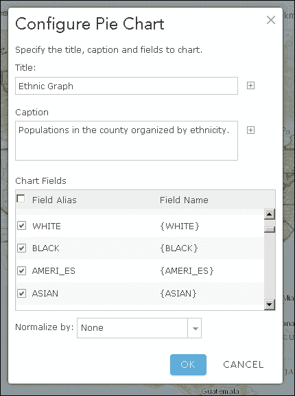

# 第十一章。ArcGIS 开发的未来

对于那些想要为 ArcGIS Server 开发地图应用程序的人来说，未来会怎样？毕竟，互联网的方向随着每一次新技术而改变，今天流行的明天可能就不流行了。Flex 和 Silverlight API 曾经非常流行，但现在只在进行维护。JavaScript 在 ArcGIS Server 开发中的未来会怎样？

如果 ESRI 的最新发布有任何迹象，JavaScript 仍然是网络开发的优选语言。然而，ArcGIS 平台已经发布了新的功能，可以帮助快速启动应用程序开发。其中两个，ArcGIS Online 和 Web AppBuilder，都是基于 ArcGIS JavaScript API 的。我们将探讨这些技术，并使用 ArcGIS Online 创建的地图开发一个应用程序。

在本章中，我们将涵盖以下主题：

+   如何使用 ArcGIS Online 创建网络地图

+   Web AppBuilder 是什么以及它与 ArcGIS Online 的关系

+   如何在 ArcGIS JavaScript API 应用程序中使用 ArcGIS Online 网络地图

# ArcGIS Online

ArcGIS Online 是 ESRI 在云中创建网络地图的在线工具。ArcGIS Online 为用户提供了一种创建网络地图、混合匹配地图服务和其他数据源、修改弹出窗口以及与公众或其组织共享生成的网络地图的方法。这是 ArcGIS Online 页面的截图，您可以在自定义地图中添加来自不同来源的数据：


除了通过网络地图引用数据外，ArcGIS Online 订阅允许您上传和存储数据。可以通过 ArcGIS Server 生成的瓦片地图包创建瓦片地图服务。可以创建要素服务来存储、更新和检索要素数据。您还可以使用其他 ArcGIS Server 扩展，如通过 ArcGIS Online 进行地理编码和路线规划。这意味着您不需要使用自己的硬件来托管数据。您可以在 ArcGIS Online 云中维护您的要素数据和瓦片地图。

现在，我相信你一定在想知道 ESRI 是如何负担得起提供这些功能的。更高级的服务需要消耗积分，这些积分可以通过 ESRI 购买。每次简单交易可能只需消耗一小部分积分，但重复使用会累积。瓦片地图服务和要素服务也消耗积分，按每月存储的千兆字节计费。根据你组织的规模，你每年可以获得一定数量的积分，并且可以选择购买更多。然而，如果你有一个开发者账户，ArcGIS Online 目前为测试你的应用程序提供每月 50 积分。

## ArcGIS Portal

如果您为一家不希望其数据通过如 ArcGIS Online 这样的公共平台托管的企业的组织工作，也存在一个私有版本。ArcGIS Portal 是 ArcGIS Online 的以组织为中心的版本，可以在私有或受保护的网络中工作。登录可以通过多种常见的安全协议进行验证，如 SAML 和 oAuth2。

ArcGIS Portal 与 ArcGIS Online 具有许多相同的功能。您可以创建和共享网络地图。您可以在组织中上传、编目和搜索数据源，并且使用管理员访问权限，您可以设置用户角色和权限。主要区别在于您创建和共享的数据保留在公司网络内。在 ArcGIS Portal 发生的事情将留在 ArcGIS Portal 内。

# Web AppBuilder

开发者反复为不同的网站制作相同的地图工具。几乎所有通用的网络地图应用都有一个绘图工具、一个测量工具、一个打印工具、一个图例等等。ESRI 中国的开发者实施了一个想法，创建一个应用程序，构建使用 ArcGIS Online 网络地图的 JavaScript 网络地图应用。他们称这个工具为 **Web AppBuilder**，如下面的截图所示：


Web AppBuilder 使用 ArcGIS JavaScript API 创建全页面的网络地图应用。这些应用使用响应式设计元素，适用于任何屏幕。发布者可以选择颜色方案、标题文本、标志以及一系列小部件。Web AppBuilder 应用通过 ArcGIS Online 发布和托管，因此您不需要自己的托管环境来创建网络地图应用。

您可以直接从 ArcGIS Online 创建通用的 Web Appbuilder 应用。使用现有的 AGOL 网络地图，您可以创建一个应用程序，添加几个默认小部件，如打印、测量和查询。您可以定义标题、颜色方案（从列表中选择）以及您使用的每个小部件的参数。

## 开发者版

默认 Web AppBuilder 的问题之一是没有空间进行自定义开发。如果您不喜欢 **查询** 小部件搜索结果的方式，您没有更好的选择。ESRI 认识到这一点，并发布了开发者版以进行自定义开发。

Web AppBuilder 开发者版是一个 Node.js 应用程序，允许您使用默认小部件和您创建的任何自定义小部件生成网络地图应用。小部件基于 Dojo 的 `dijit` 系统，并且可以轻松添加到系统中。Web AppBuilder 及其创建的应用程序与 ArcGIS Online 账户相关联。

Web AppBuilder 开发者版生成运行独立网站所需的 HTML、样式表和 JavaScript。配置数据存储在 JSON 文件中。除了创建自定义小部件外，还可以创建自定义主题，修改元素的样式和位置以满足您的需求。

为 Web AppBuilder 开发者版制作的小部件具有高度的扩展性。可以使用 **i18n**（国际化）和本地化原则为国际市场编写小部件组件。配置可以将在小部件中存储的标签名称以多种语言保存，这些标签名称将与应用程序一起正确加载。小部件配置也可以在应用程序部署之前进行修改。可以使用与应用程序本身类似的方式来编写小部件的设置，使用 dijit 表单元素来修改配置。

截至撰写本文时，ArcGIS Online 不会托管使用开发者版创建的应用程序。使用开发者版生成应用程序托管在开发者的自有平台上。由于通过开发者版生成的文件是静态的 HTML、JavaScript、CSS 和图像文件，因此它们可以以很少或没有服务器端处理的方式进行托管。

### 注意

有关 Web AppBuilder 的更多信息，请参考 ESRI 网站 [`doc.arcgis.com/en/web-appbuilder/`](http://doc.arcgis.com/en/web-appbuilder/)。有关 Web AppBuilder 开发者版的更多信息，包括下载说明和教程，请访问 [`developers.arcgis.com/web-appbuilder/`](https://developers.arcgis.com/web-appbuilder/)。

# 更多 Node.js

谈到 Node.js，ArcGIS JavaScript API 有许多依赖于 Node.js 的工具。ArcGIS API for JavaScript Web Optimizer 是一个由 ESRI 托管的 Node.js 项目，它将你的自定义模块与最小数量的 ESRI 和 Dojo 模块打包，以简化构建过程。你可以通过 ESRI 的 **内容分发网络**（**CDN**）进行托管，或者下载并自行托管。

如果你决定更多地关注 Web AppBuilder 开发者版，也有相应的 Node.js 项目。`generator-esri-appbuilder-js` 项目生成一个包含所有必要文件的模板 Web AppBuilder 小部件。它会询问你一些基本信息，例如小部件名称和作者信息，以及小部件将需要哪些类型的文件。该项目基于 Yeoman，这是一个 Node.js 模板生成工具。

### 注意

有关 ArcGIS API for JavaScript Web Optimizer 的更多信息，请访问 [`developers.arcgis.com/javascript/jshelp/inside_web_optimizer.html`](https://developers.arcgis.com/javascript/jshelp/inside_web_optimizer.html)。有关 `generator-esri-appbuilder-js` 项目，你可以在 NPM 上找到它 [`www.npmjs.com/package/generator-esri-appbuilder-js`](https://www.npmjs.com/package/generator-esri-appbuilder-js)，或者查看源代码 [`github.com/Esri/generator-esri-appbuilder-js`](https://github.com/Esri/generator-esri-appbuilder-js)。

# 我们的应用程序

现在我们已经了解了 ESRI 的最新和最优秀的功能，让我们回到我们的故事。Y2K 社会联系我们了，他们非常喜欢我们使用应用程序完成的工作。他们迫不及待地想与公众分享所有这些信息。

有趣的是，Y2K 协会购买了一些 ArcGIS Online 许可证。现在他们希望您以该格式存储 web 地图数据，这样他们就可以在发现时管理和添加关于 2000 年的新数据。

我们的目的是为 Y2K 协会创建一个 ArcGIS Online webmap 并将其添加到我们现有的应用中。我们将把地图图层、弹出模板和图表添加到 webmap 中。然后我们将 webmap 加载到我们现有的应用中，删除不必要的功能，并使其他自定义功能与 webmap 协同工作。

# 创建 webmap

我们需要创建一个用于我们应用的 webmap。如果您还没有为 ArcGIS Online 设置开发者账户，请访问[`developers.arcgis.com/en/sign-up/`](https://developers.arcgis.com/en/sign-up/)注册开发者账户。登录后，点击顶部菜单中的**地图**。它将加载一个空地图，类似于本章开头的图像。

我们可以先保存地图的副本。这将允许我们命名地图，编写描述、搜索词等。在顶部工具栏中，点击**保存**下拉菜单并选择**保存**。这将创建一个对话框，允许我们输入地图的名称，编写摘要，并添加便于搜索地图的标签。我们可以将地图放入我们的基础文件夹，或者为应用创建一个新的文件夹。将标题添加为`Y2K 人口普查地图`，并给出简要描述。它应该看起来类似于以下截图：


点击**保存地图**后，地图应该有一个新的名称。如果您查看 URL，您也会注意到一些奇怪的字符。您的 webmap 现在已被分配了一个新的 webmap ID (`?webmap=XXXXXXXXXXXXXXXXX`)，这是一个 ArcGIS Online 用来引用您的地图的唯一字符串。请保留这个 webmap ID，因为我们稍后会用到它。

## 更改底图

使用 ArcGIS Online 托管您的 webmap 的最好功能之一是所有可用的底图背景。从卫星和航空照片到简单的灰度地图，都有适合您数据的好背景。

在我们应用的先前版本中，我们使用国家地理底图来框定我们的数据。我们也可以为这个 webmap 做同样的事情。点击工具栏左上角的**底图**，您将能够查看许多 web 地图缩略图。选择**国家地理**底图，地图应该会更新。底图选择器应该看起来像以下截图：


## 添加人口普查地图服务

ArcGIS Online 提供了多种方法向地图添加图层。无论我们是否有 ArcGIS 服务器地图服务或简单的 CSV 文件，ArcGIS Online 都可以容纳各种数据。要向地图添加图层，请点击左上角的 **添加** 按钮，并从下拉选项中选择。以下几节将讨论向网络地图添加图层的一些不同方法。

### 搜索图层

ArcGIS Online 为公众和组织使用提供了广泛的地图图层。ArcGIS Online 提供了一个搜索框和匹配地图及图层列表，以便添加到你的网络地图中。如果你组织内部已经共享了图层和服务，你可以搜索关键词和标签以将该图层添加到你的地图中。你还可以添加其他人标记为公开数据的地图服务和图层。

### 备注

如果你的网络地图包含仅限于你的组织或组织内特定组的数据层，那么查看网络地图的人将被提示登录以证明他们可以查看这些层。如果登录失败，网络地图可能会加载，但受限数据将不会加载到地图上。

### 浏览 ESRI 图层

ESRI 拥有大量自己的地图数据，可供公众使用。这些数据涵盖了广泛的主题和兴趣。你可以按类别筛选，并点击将地图图层添加到现有地图中。目前，主要类别包括以下：

+   影像

+   底图

+   历史地图

+   人口统计和生活习惯

+   地貌

+   地球观测

+   城市系统

+   交通

+   边界和地点

虽然你可能想从这个位置抓取人口普查数据，但请记住，这显示的是更当前的数据。由于我们在这个案例中使用的是 2000 年的数据，我们将忽略此选项。然而，我们会记住这一点，因为它可能在其他项目中很有用。

### 从网络添加图层

此选项允许我们从多个网络地图服务中添加。虽然我们预期可以添加 ArcGIS 服务器地图服务，但其他一些选择可能会让你感到惊讶。除了 ArcGIS 服务器地图和要素服务外，我们还可以添加以下其他图层类型：

+   WMS 服务

+   WMTS 服务

+   铺砖服务

+   KML 文件

+   GeoRSS 文件

+   CSV 文件

注意，CSV 文件指的是一个在线可用的文件，很可能是通过另一个服务。如果你有要上传的 CSV 文件，你会选择下一个选项。

### 从文件添加图层

在这里，我们可以上传一个文件，并让 ArcGIS Online 为我们渲染它。对话框要求上传一个文件，并根据文件格式，它还会要求提供信息以确定地理位置。可用于添加地理数据的可接受文件包括以下内容：

+   一个包含最多 1,000 个特征并存储在 `.zip` 文件夹中的形状文件

+   一个制表符或逗号分隔的文本或 CSV 文件

+   一个 **GPS 交换格式**（**GPX**），可以从许多 GPS 设备中获得

### 添加地图注释

此选项允许您在地图上绘制自定义的点、线和多边形作为其他用户或应用的备注。您可以从多种预定义的特征类型和独特的渲染器中进行选择。根据您选择的备注模板，您可以添加带有自定义符号的点、线和多边形。

### 我们的应用程序数据源

对于我们的应用程序数据源，我们将从网络中添加一个图层。选择从网络添加图层后，从下拉列表中选择 ArcGIS 网络服务，并输入或粘贴 2000 年人口普查地图服务 URL 到空白处。不要勾选**用作底图**复选框。最后，点击**添加图层**将其添加到地图中。您可以在以下图像中看到提示的截图：


### 样式

ArcGIS Online 允许您重新样式许多动态和特征层，即使它们在原始地图上没有被这样样式化。您可以为每个层添加自定义渲染器来改变颜色、透明度和图片符号。您可以将没有样式的简单地图转换为具有独特价值符号的自定义地图，讲述您想要讲述的故事。

对于我们的网络地图，我们在地图上看到州和县的简单黑色轮廓。我们将更改样式，使它们看起来更有吸引力，并与国家地理底图背景融合。

首先，在**内容**下点击人口普查地图服务层以展开地图层。您将看到构成该层的不同子层，例如**州**、**县**、**街区组**和**街区点**。通过点击每个子层，您可以看到每个层的符号。

我们将开始更改**州**的符号。点击**州**右侧的小向下三角形，选择**更改样式**。第一个菜单将出现在左侧，允许您选择标签和符号。在底图和我们的弹出窗口之间，我们将对所在州有一个很好的了解，所以我们将保留标签不变。在**选择绘图样式**下的**单符号绘图**中点击**选项**按钮。

下一个提示允许您更改地图上层的符号和可见范围。如果层已经设置了最小和最大可见性，这不会使它们更宽松，但可以使它们更严格。点击**符号**链接以获取颜色提示。从这里，您可以设置多边形的轮廓颜色和内部填充颜色。它应该看起来像以下截图：


将轮廓颜色改为较深的橙色，然后点击**确定**。我们将在州中保留透明的填充。对**县**和**街区组**重复相同的流程，每次选择较浅的橙色色调。

### 创建弹出窗口

现在我们已经调整了图层，让我们看看弹出窗口。ArcGIS Online 允许您为您的网络地图上的地图图层和要素服务创建和配置弹出窗口。它们提供了一系列弹出窗口配置，包括要素属性列表和**所见即所得**（**WYSIWYG**）富文本编辑器。两者都允许一些值格式化，例如数字的千位分隔符或日期的格式化。WYSIWYG 编辑器还允许您使用文本颜色并根据值属性添加链接。

对于我们的应用程序，我们将坚持显示属性列表。点击**州**（向下指向的小三角形）的**选项**按钮，并选择**配置弹出窗口**。在左侧的下一个菜单中，我们可以修改标题和内容。记住，在任何空白处，字段名称都由方括号包围，并将被替换为值。

在**显示**下拉菜单旁边，选择**字段属性列表**。这将创建一个包含所有字段属性的冗长列表。我们不想看到所有这些属性，甚至大多数属性，因此我们将配置我们看到的字段。点击字段列表下的**配置属性**链接。

您将看到一个包含可用于查看的字段列表的对话框。每个字段都有一个用于可见性的复选框，一个显示在方括号中的字段名称，以及一个字段别名。可以通过点击它们并输入不同的值来更改字段别名。取消选中这里的复选框意味着它不会出现在弹出窗口中。对于数值和日期字段，当选择此类字段时，右侧将出现额外的格式化提示。请看以下截图：


由于我们在标题中看到了状态名称，我们可以取消选中除**2000 年人口**、**平方英里**和**每平方英里人口**之外的所有选项。我们将重命名别名以使其更具吸引力。最后，我们将点击**确定**。属性列表应该反映我们目前可见的三个字段。

### 添加图表

ArcGIS Online 上的弹出窗口配置控件还允许您根据要素属性添加图像、图表和图形。这些图像和图表出现在我们已显示的内容下的弹出窗口中。这些图形使用`dojox/charting`库绘制。

返回到**州**图层，我们将添加各州中的民族、性别和年龄的图表。在左下角，在**弹出媒体**下，点击**添加**按钮。将出现一个下拉菜单，让您选择想要看到的图像或图表。对于我们的民族图表，我们将选择饼图。

在下一个提示中，我们得到了配置饼图所需的参数。它需要一个标题、一个说明以及要添加到图表中的选定字段。我们还得到了一个选项，可以将数据与数据中的另一个字段进行归一化。如果我们正在比较不同地区的相对人口水平，那么与总人口进行归一化将是有益的，但因为我们正在制作饼图，并且每个民族群体的人口总和应该达到 100%，所以我们跳过归一化。您可以在以下截图中看到提示的示例：



对于**州**弹出窗口，我们将给图表命名为`民族图`。然后，我们将添加一个说明来解释图表的内容。最后，我们将确保**WHITE**、**BLACK**、**AMERI_ES**、**ASIAN**、**HISPANIC**、**MULT_RACE**、**HAWN_PI**和**OTHER**字段被选中。请注意，如果您在上一节配置弹出窗口字段名称属性时没有重新格式化字段名称，属性将保持您离开时的样子。您也可以在这里编辑字段别名。您不必一定在弹出窗口中使它们可见来使它们可图表化（并格式化它们的别名）。最后，点击**确定**，你应该能在**弹出媒体**列表中看到您的**民族图表**。

我们将重复添加性别和年龄图表的步骤。对于性别饼图，我们将重复前面的步骤添加另一个饼图。我们将将其标记为`性别图表`，并确保`MALES`和`FEMALES`字段被选中。对于年龄柱状图，我们将从第一个菜单中选择**柱状图**。在第二个提示中，我们将图表标题设置为`年龄图表`，并添加`AGE_UNDER5`、`AGE_5_17`、`AGE_18_21`、`AGE_22_29`、`AGE_30_39`、`AGE_40_49`、`AGE_50_64`和`AGE_65_UP`字段。

一旦配置好图表，请务必点击弹出菜单底部的**保存弹出窗口**。这将使用新的弹出窗口配置重新加载地图。点击一个州来测试弹出窗口是否出现。你应该能看到我们添加的字段，以及**民族图表**在**州**弹出窗口中。图表的左右两侧也添加了箭头，以便用户可以查看性别和年龄图表。将鼠标悬停在图表上会显示图表背后的标签和数字。它们应该看起来像以下图片中显示的弹出窗口。

这张截图显示了**民族图**：


这张截图显示了**性别图表**：


这张截图显示了**年龄图表**：


## ArcGIS Online 网上图表的用途

ArcGIS Online 不仅提供地图，还提供了可以进行分析、收集数据和与他人共享地图的工具。上一工具栏中可用的其他功能如下。

### 分享

**共享**让你可以控制谁可以访问你的 webmap。你可以与世界共享地图，与组织内的人共享，或者只保留给自己。你可以通过共享地图的 URL 来让其他人访问地图。你还可以将 webmap 嵌入任何网站作为 iframe，或者使用其中一个 web 应用模板创建网络应用程序。

### 打印

工具栏中的**打印**控制项会在浏览器的新标签页中打开一个可打印的 webmap 副本。可打印的副本显示了标题、当前范围的地图以及归属数据。页面格式化为打印在 ANSI（A 型纸大小）的纸张上。

### 路线

点击**路线**，你将在屏幕左侧部分获得一个路线小部件。路线小部件让你可以从起点到终点获取路线，中间可以有任意多个停靠点。可以为汽车、卡车或步行计算路线和时间。你还可以收集往返路线数据以及路线上的交通数据。请记住，路线和交通路由需要消耗信用点来使用。

### 测量

此处的测量小部件模仿了`esri/dijit/Measurement`中的测量`dijit`。你可以绘制点、线和多边形来收集坐标、长度和面积。你还可以将测量单位更改为公制或英制单位。当使用点收集纬度和经度时，它将以十进制度数显示，以及度分秒。

### 书签

**书签**工具允许你在 webmap 上保存位置。书签小部件捕获当前地图范围并为其命名。当在地图上创建多个区域的书签时，你可以通过点击书签名称快速导航到它们。你也可以编辑名称和删除不需要的书签。书签数据会与其他 webmap 功能一起保存。

# 面向 ArcGIS Online webmap 的开发

如果你的组织对 ArcGIS Online 提供的 webmap 和工具感到满意，你可能会从网站运行你的面向公众的 GIS，而无需再开发其他工具。有时你需要定制功能。有时当你点击地图时，你需要一个应用程序从其他数据源进行定制请求。也许你需要一个复杂的查询页面或查询构建器来收集结果。无论你的特殊需求是什么，你都可以将 ArcGIS Online webmap 带入你的定制应用程序。

使用 AGOL 网络地图对您的应用程序有什么好处？它省去了许多地图配置步骤。我们通常会在应用程序中硬编码的所有瓦片、动态和要素层现在可以合并到一个网络地图中，并在我们的应用程序中加载。我们之前必须通过代码分配的所有弹出窗口和 `infoTemplate` 现在可以从网络地图中继承。每当需要更改地图服务层和弹出窗口时，都可以通过 ArcGIS Online 进行更改，而不是更改代码并希望用户没有仍在运行缓存的配置脚本副本。配置可以由其他人处理，这样您就有更多时间编码。

## 创建网络地图

为了引入我们之前创建的网络地图，我们需要更新我们的 `app.js` 文件。在 `app.js` 文件 `require()` 方法中的模块列表中，我们需要添加对 `esri/arcgis/utils` 模块的引用。这将为我们提供将网络地图添加到应用程序所需的工具：

```py
require([, "esri/arcgis/utils", ],function (, arcgisUtils, ) {

});
```

通常，我们会使用 `arcgisUtils.createMap()` 方法来构建我们的新网络地图。它需要与 `esri/map` 构造函数类似的参数，包括地图应放置的 HTML 元素 `id` 的引用，以及一个 `options` 对象。然而，`arcgisUtils.createMap()` 方法还需要一个 ArcGIS Online 网络地图 `id`。您可以通过在 ArcGIS Online 中打开您的网络地图以进行编辑来获取此 `id`。如果您查看 URL，您会看到搜索参数 `webmap=XXXXXXXXXXXXXXX`，其中那些 *X* 被替换为字母数字字符。您可以将 `id` 数字复制并粘贴到您的应用程序中，以创建网络地图，如下所示：

```py
require([, "esri/arcgis/utils", ],function (, arcgisUtils, ) {
     arcgisUtils.createMap("450d4fb709294359ac8d03a3069e34d3", 
       "mapdiv", {});
});
```

`arcgisUtils.createMap()` 方法的选项包括但不限于以下内容：

+   `bingMapKey`：您在 Bing Maps 订阅中提供的唯一密钥字符串。

+   `editable`：一个 `Boolean` 值，您可以使用它来禁用任何要素层编辑。

+   `geometryServiceURL`：指向 ArcGIS Server 几何服务的 URL 链接。

+   `ignorePopups`：一个 `Boolean`，如果为真，将禁用所有弹出窗口。

+   `mapOptions`：您在创建普通地图时通常会传递的正常选项。

+   `usePopupManager`：一个 `Boolean` 值，当为真时，告诉 `InfoWindow` 获取所有具有弹出模板的点击特征。当为真时，它还处理地图服务子层的弹出窗口可见性，无论父层是否可见。如果为假，当父层未开启时，子层的弹出窗口可能加载或不加载，您将不得不手动控制弹出窗口的可见性，对于复杂的地图尤其如此。

`arcgisUtils.createMap()` 方法将返回一个 `dojo/Deferred` 承诺，一旦下载了网络地图数据并创建了地图，就会使用 `then()` 触发成功回调。回调将返回一个包含以下内容的响应对象：

+   `map`：创建的 `esri/map` 对象

+   `itemInfo`：一个包含对象的对象：

    +   `item`：一个包含地图标题、描述片段和嵌套数组形式的范围的对象

    +   `itemInfo`：一个包含有关地图服务、渲染器、弹出窗口、书签以及其他用于创建网络地图的地图数据的 JSON 对象

    +   `errors`：在加载数据和创建地图服务时遇到的错误数组

+   `clickEventHandler`和`clickEventListener`：当填充时，这些控制显示弹出窗口的地图点击事件。如果您需要关闭弹出窗口，可以运行以下代码：

    ```py
    // response object was returned by arcgisUtils.createMap()
    response.clickEventHandler.remove();
    ```

+   要恢复弹出窗口，请运行以下代码行（假设您已加载了`dojo/on`模块）：

    ```py
    response.clickEventHandler = dojoOn(map, "click",  response.clickEventListener);
    ```

### 注意

在创建网络地图时，如果您将`usePopupManager`参数设置为`true`（默认为`false`），则`clickEventHandler`和`clickEventListener`参数将为 null。在这种情况下，弹出窗口的可见性将通过`map.setInfoWindowOnClick(boolean)`方法来控制。

由于我们在第八章中引入了 ESRI Bootstrap，因此我们需要在`esri/arcgis/utils`模块中使用`createMap()`构造函数的 ESRI Bootstrap 版本。由于地图可能需要一些时间才能加载，我们将把普查小部件的加载移到延迟回调中。代码应如下所示：

```py
  /* not used because we're using the boostrapMap version
  var deferred = arcgisUtils.createMap("450d4fb709294359ac8d03a3069e34d3", "map", {});  */

  var deferred = BootstrapMap.createWebMap("450d4fb709294359ac8d03a3069e34d3", "map", {});

  deferred.then(function (response) {
    // map and census widget definition moved inside deferred callback
    var map = response.map;

    var census = new Census({
      map: map,
      mapService: "http://sampleserver6.arcgisonline.com/arcgis/rest/services/Census/MapServer/"
    }, "census-widget");

    dojoOn(dom.byId("census-btn"), "click", lang.hitch(census, census.show));
  });
```

## 在我们的普查小部件中

现在我们已经在网络地图中定义了我们地图的许多部分，我们可以删除处理相同信息的许多小部件代码。在我们的普查`define`语句的模块引用中，我们可以删除对以下模块的引用：

+   **州**、**县**、**街区组**和**街区点**模板

+   `IdentifyTask`和`IdentifyParameter`

+   `InfoTemplates`

+   `D3/d3`

记得删除模块引用以及它们对应的变量。

在我们小部件的主体中，我们可以删除对`identifytask`或地图点击或`infowindow`选择事件的任何引用，因为它们控制了弹出窗口。我们还可以删除创建弹出窗口上图表的所有方法。我们剩下的只是一个填充州、县和街区组下拉菜单的小部件，以便我们可以查看这些数据。

对于删除这么多代码，请不要感到难过。开发者生活中的一大乐趣就是删除代码行，因为它们可能是错误的可能来源。

## 在我们的应用程序中访问网络地图

如果我们需要从 ArcGIS Online 网络地图配置中获取某些信息，我们会怎么做？如果我们需要这些信息，ArcGIS JavaScript API 为我们提供了检索它的工具。通过使用`esri/arcgis/utils`和`esri/request`模块，我们可以检索并处理我们的网络地图数据。

要访问我们的 web 地图配置数据，我们需要两件信息：托管数据的网站 URL 和 web 地图 ID。托管 webmap 数据的服务 URL 可以在 `esri/arcgis/utils` 模块的 `arcgisUrl` 属性中找到。默认情况下，它指向 [`www.arcgis.com/sharing/rest/content/items`](http://www.arcgis.com/sharing/rest/content/items)，但如果你的 webmap 在 ArcGIS 门户的私有企业网络中托管，则应将此 URL 字符串替换为你的门户服务的适当 URL。

在我们的 JavaScript 代码中，我们可以将托管 webmap 数据的 URL 和 webmap ID 结合起来，形成一个 URL，以便访问我们 webmap 的 JSON 数据。我们可以使用 `esri/request` 模块从 URL 请求数据，并在我们的应用程序中需要的地方使用它。以下是一个示例代码片段：

```py
require([…, "esri/arcgis/utils", "esri/request", …], 
  function (…, arcgisUtils, esriRequest, …) {
    …
    // replace fake webmapid value with real webmap id
    var webmapid = "d2klfnml2kjfklj2nfkjeh2ekrj";
    var url = arcgisUtils.arcgisUrl + "/" + webmapid + "/data";
    esriRequest({
      url: url,
      handleAs: "json", 
      content: {f: "json"}
    }).then(function (response) {
      console.log(response);
      // do something with the JSON data.
    });
    …
});
```

如果你查看我们 webmap 的 JSON 结果，无论是使用地图控制台还是浏览器的 JSON 查看插件，你都可以看到我们应用程序的 webmap 数据包括地图服务图层、背景底图，甚至关于我们弹出窗口配置的详细信息。如果需要，这个响应中包含了很多可能有用的信息。

## 通过代码与地图交互

在我们之前的版本中，我们为每个图层加载 `InfoTemplates` 以定义弹出窗口中显示的内容的格式。现在，由于我们通过 ArcGIS Online 定义了所有这些信息，我们不需要进行额外的 HTTP 请求来加载 HTML 模板。你可以在地图上点击，弹出窗口就会准备好使用。

然而，当我们尝试使用自定义的下拉选择器来弹出弹出窗口时，我们遇到了问题。在旧版本中，我们会查询数据，添加适当的模板，并将其插入到 `InfoWindow` 中。现在，用户点击会为我们获取适当的数据。但我们如何在不点击地图的情况下点击地图呢？

使用一个未记录的技巧，我们可以用我们的数据触发地图点击事件。我们可以将地图缩放到要素范围，并在完成后触发地图点击事件。这个技巧已经在多个使用 ArcGIS Online webmap 的网站上成功部署。

在 `Census.js` 小部件中查找 `_updateInfoWindowFromQuery()` 方法。它目前包含设置地图范围和填充地图 `InfoWindow` 内容的步骤。我们将保留范围设置，但删除对 `map.infoWindow` 的任何引用。相反，在地图范围改变后调用的异步回调函数内部，我们将添加代码来调用 `map.onClick()` 方法以触发点击事件：

```py
_updateInfoWindowFromQuery: function (results) {
  var resultExtent = graphicsUtils.graphicsExtent(results.features);
  this.map.setExtent(resultExtent).then(lang.hitch(this, function () {
 // do something
 this.map.onClick();
 }));
},
```

`map.onClick()`函数需要一个包含三个属性的对象：一个图形、一个`mapPoint`和一个包含屏幕上该点坐标的`screenPoint`。我们可以使用我们的查询结果中的第一个来获取被点击的图形。对于快速且简单的点击位置，我们可以使用当前范围的中心，这是我们通过`resultExtent.getCenter()`获得的。至于我们地图点的相应`screenPoint`，地图有将地理点转换为屏幕点以及相反的方法。我们将使用`map.toScreen()`方法与中心点来获取其在屏幕上的坐标。然后我们将结果输入到`map.onClick()`方法中，并测试应用程序。该函数看起来应该如下所示：

```py
_updateInfoWindowFromQuery: function (results) {
  var resultExtent = graphicsUtils.graphicsExtent(results.features);
  this.map.setExtent(resultExtent).then(lang.hitch(this, function () {
  var center = resultExtent.getCenter();
 var centerScreen = this.map.toScreen(center);
  this.map.onClick({
 graphic: results.features[0],
 mapPoint: center,
 screenPoint: centerScreen
 });
  }));
},
```

我们可以通过加载我们的应用程序并点击**Census**按钮来测试代码。它应该显示我们的州、县和街区数据下拉模态。当我们选择像加利福尼亚这样的州时，它应该查询、缩放，并且之前配置的弹出窗口应该瞬间出现。现在，我们有一个完全功能性的普查应用程序，同时让 ArcGIS Online 处理大部分工作：


# 摘要

在本章中，我们探讨了 ESRI 为 ArcGIS 平台提供的最新工具：ArcGIS Online 和 Web AppBuilder。我们使用 ArcGIS Online 创建了一个 webmap，添加了图层，格式化它们，并创建了弹出窗口。我们将 webmap 添加到了我们自己的应用程序中。

在这本书的整个过程中，我们深入研究了 ArcGIS JavaScript API。我们从一个简单的带有点击事件和地理数据的 webmap 应用程序开始。你学习了如何使用 API 和 Dojo 框架提供的工具来构建可以跨项目重复使用的自定义控件和模块。然后你尝试添加其他 JavaScript 库，以便不熟悉 dojo 的开发者也能做出贡献。你学习了如何通过 Web 应用程序编辑地理数据。你还学习了如何为桌面和移动设备样式化你的地图应用程序。你甚至学习了如何对代码进行单元测试。最后，你学习了 ESRI 如何通过 ArcGIS Online 和 Web AppBuilder 简化 webmap 开发，从而更快地将应用程序带给公众。你无疑已经取得了很大的进步。

### 注意

你接下来要去哪里？有很多优秀的书籍、博客和其他资源。你可以在 ESRI 的论坛上了解 ArcGIS 开发的最新趋势，论坛地址为[`geonet.esri.com`](http://geonet.esri.com)，或者找到最新 ArcGIS API 的支持，地址为[`developers.arcgis.com`](http://developers.arcgis.com)。对于博客，你可以查看 Dave Bouwman 的博客，地址为[`blog.davebouwman.com`](http://blog.davebouwman.com)，或者 Rene Rubalcava 的博客，地址为[`odoe.net`](http://odoe.net)。对于书籍，你可能想了解如何通过 Hussein Nasser 的《Managing ArcGIS for Server》来管理 ArcGIS Server 以提供你的网络地图。你可能还想阅读 Rene Rubalcava 的《ArcGIS Web Development》，Eric Pimpler 的《Developing Web and Mobile ArcGIS Server Applications with JavaScript》，或者 Matthew Sheehan 的《Developing Mobile Web Applications》。
