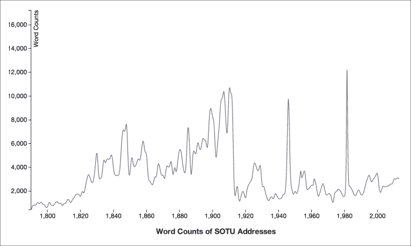
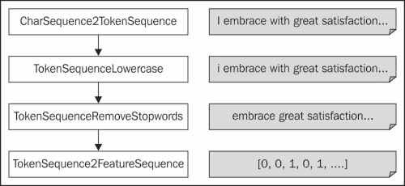
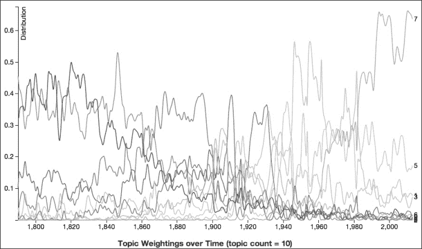
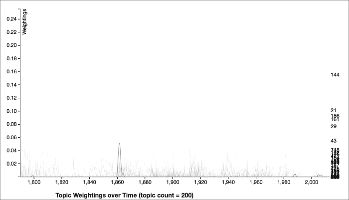
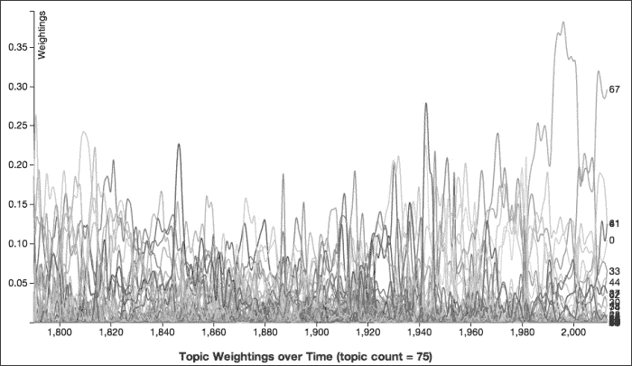
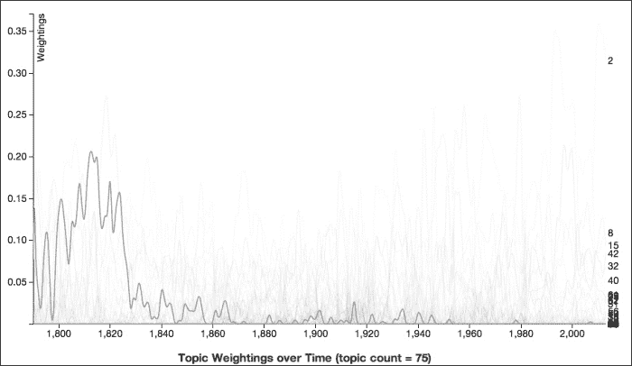
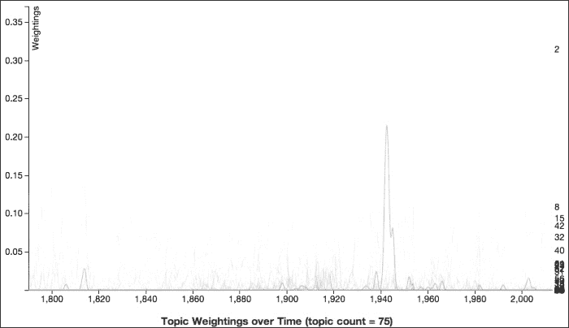
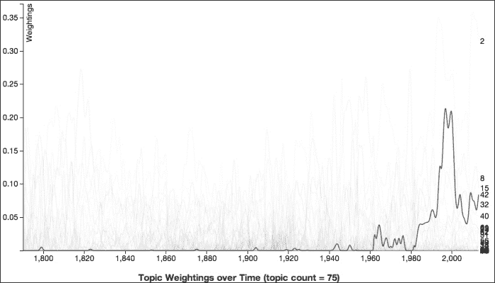

# 第三章. 主题建模 – 总统国情咨文中的关注点变化

目前，数据的一个巨大来源是互联网上无处不在的大量非结构化、自然语言数据。想想所有新闻文章、博客帖子、推文和 YouTube 评论，以及人们在线创建和分享文本内容的成千上万种方式。他们所说的话可能对你很重要，能够追踪他们讨论的主题对于了解趋势和对话非常有用。

一种探索一组文本文档讨论的信息的工具被称为**主题建模**。这是一种识别文档集中讨论的“主题”的技术，尽管正如我们将看到的，“主题”在这里的定义与日常对话中的定义略有不同。这些模型的优势在于它们不假设每篇文档只讨论一件事。相反，它们将文档建模为主题的集合。这在允许对文档有更复杂的概念以及文档之间更复杂的模式方面非常强大。

在本章中，我们将涵盖以下主题：

+   理解总统国情咨文中的数据

+   理解主题建模

+   准备可视化

+   设置项目

+   获取数据

+   使用 D3 和 ClojureScript 可视化数据

+   探索主题

# 理解总统国情咨文中的数据

在本章中，我们将应用主题建模于美国总统所发表的（**SOTU**）**国情咨文**。每年的一月或二月，总统亲自或以书面形式向美国参议院和众议院发表讲话，讨论国家的情况，并概述下一年度的议程。演讲可能相当简短，但书面报告可能要长得多。乔治·华盛顿 1790 年的第一次国情咨文不到 500 个单词。巴拉克·奥巴马在 2013 年（撰写本文时）的最新国情咨文有超过 3000 个单词。吉米·卡特有最长的国情咨文，他在 1981 年以书面形式发表，长达近 14000 个单词。

国情咨文长度的逐渐增加，在 1910 年达到顶峰，这是因为从托马斯·杰斐逊 1801 年的国情咨文到威廉·H·塔夫脱 1912 年的国情咨文，国情咨文是一份在国会之前提交的书面报告。以下图表表示国情咨文单词数的增加：



当然，随着国内外形势的变化，总统在国情咨文演讲中讨论的主题也发生了变化。你不会期望约翰·亚当斯 1800 年的演讲与比尔·克林顿 2000 年的演讲谈论相同的事情。这立即引发了一个问题：总统们在国情咨文演讲中都讨论了哪些主题，这些主题是如何随时间变化的？

这不是一个新问题，即使是对于主题模型来说也是如此。Xuerui Wang 和 Andrew McCallum 在 2006 年的论文《随时间变化的主题：非马尔可夫连续时间主题趋势模型》（2006）中将其作为几个例子之一进行了探讨，[论文链接](http://citeseer.ist.psu.edu/viewdoc/summary?doi=10.1.1.152.2460)。在这篇论文中，他们提出了一种分析一系列带有时戳的文档的方法，以便更好地理解主题随时间如何相互作用。实际上，这是一个值得进一步研究的领域，并且还有许多其他考虑时间的主题模型扩展。

在本章中，我们只将介绍目前最广泛使用的主题模型算法：**LDA（潜在狄利克雷分配**）。通过理解这个程序及其背后的思想，你可以不太困难地理解 Wang 和 McCallum 的“随时间变化的主题”算法。

# 理解主题模型

主题模型是文档中主题的统计模型。假设如果一个文档中有 10%的内容是关于军事的，40%的内容是关于经济的（还有 50%的内容是关于其他事物），那么关于经济的词汇数量应该是关于军事词汇数量的四倍左右。

主题模型的早期形式由 Christos Papadimitriou 和其他人在 1998 年的论文《潜在语义索引：概率分析》中描述，[论文链接](http://www.cs.berkeley.edu/~christos/ir.ps)。这项工作在 1999 年由 Thomas Hofmann 通过《概率潜在语义索引》进一步精炼，[论文链接](http://www.cs.brown.edu/~th/papers/Hofmann-SIGIR99.pdf)。

在 2003 年，David Blei、Andrew Ng 和 Michael I. Jordan 发表了他们的论文《潜在狄利克雷分配》，[论文链接](http://jmlr.csail.mit.edu/papers/v3/blei03a.html)。目前，这是最常见的主题模型类型。它简单、易于上手，且广泛可用。从那时起，该领域的大部分工作都是对原始 LDA 主题模型方法的扩展。这是我们将在本章中学习和使用的程序。

在 LDA 中，每个文档被建模为一个词袋，每个词来自多个主题。因此，文档中的每个词都是这些主题之一的结果。该模型采取以下步骤来创建每个文档：

1.  在文档中选择一个主题的分布。

1.  从主题中选择一个单词的分布。

1.  从每个单词的分布中选择一个主题，然后从该主题中选择一个单词。

主题和单词的分布使用 Dirichlet 分布作为它们的先验概率，这是在考虑任何证据或文档之前对主题和单词分布的假设不确定性。然而，由于它们是在一组输入文档上训练的，这些分布更准确地反映了它们迄今为止看到的数据，因此它们能够更准确地分类未来的文档。

一个简短的例子可能会有所帮助。最初，分布是随机选择的。之后，我们将基于一个文档进行训练。比如说我们有一个包含以下单词的文档：预算、支出、军队、海军、飞机、士兵和美元。模型知道从之前的训练中，单词“预算”、“支出”和“美元”都与金融主题相关，而军队、海军、飞机和士兵与军事主题相关，飞机与旅行主题相关。这可能表明该文档有 35%关于金融，50%关于军事，10%关于旅行。军事将是主导主题，但其他主题也会有所体现。

如果 LDA 处于训练阶段，那么这些词的存在会略微加强所有列出单词之间的关联，以及这些单词与文档中其他单词、以及代表它们之间关系的主题之间的关联。

这其中有一个转折是，主题没有命名。在先前的例子中，我说过有关于金融、军事和旅行的主题。然而，LDA 会将这些视为主题 1、2 和 3。标签是基于那些主题中的术语以及在这些主题中得分较高的文档的解释。在使用 LDA 时，一项任务是调查和解释主题。我们将在本章末尾探索分析结果时看到几个这样的例子。

# 准备可视化

数据分析的基本工具之一是可视化。良好的、灵活的可视化使得探索和理解数据更加容易，这在数据分析过程的各个阶段都非常有用。在开始阶段，可视化有助于发现错误和不一致性，并帮助你了解数据以及对其形成直觉。在整个过程中，可视化持续推动洞察力的产生。最后，在报告和演示文稿中，可视化可以作为出色的辅助证据和解释。

可视化将是本章的一个重要部分，也是理解主题建模结果的关键。为了创建和交互这些图表，我们将使用一些最近成为许多数据科学家工具包重要部分的软件：网页浏览器。

正如我们在第一章中做的那样，*网络分析 – 凯文·贝肯的六度分隔*，我们将使用 D3([`d3js.org/`](http://d3js.org/))和 ClojureScript([`github.com/clojure/clojurescript/`](https://github.com/clojure/clojurescript/))。

本章前面以及后面将要展示的单词计数图是这个系统的例子。它们是静态网站的一部分。也就是说，浏览器中加载的资源是从文件系统中读取的，而不是由服务器端 Web 应用程序动态生成的。数据是从我们由主题模型数据创建的**CSV**（**逗号分隔值**）文件中读取的。最后，ClojureScript 被编译成一个由浏览器加载的 JavaScript 文件。

我们将在稍后看到如何使用 ClojureScript 设置此网站以及如何创建图表。像往常一样，对于完整代码，请参考 Packt Publishing 网站上的源代码下载。

# 设置项目

然而，在我们进一步深入之前，我们需要为此章节设置我们的项目。所以考虑到所有这些，让我们来解决问题。我们首先需要的是以下 Leiningen 2 `project.clj`文件：

```py
(defproject tm-sotu "0.1.0-SNAPSHOT"
  :license {:name "Eclipse Public License"
            :url "http://www.eclipse.org/legal/epl-v10.html"}
  :plugins [[lein-cljsbuild "0.3.2"]]
  :dependencies [[org.clojure/clojure "1.5.1"]
                 [enlive "1.1.1"]
                 [org.clojure/data.csv "0.1.2"]
                 [cc.mallet/mallet "2.0.7"]]
  :cljsbuild {:builds [{:source-paths ["src-cljs"],
                        :compiler {:pretty-printer true,
                                   :output-to "www/js/main.js",
                                   :optimizations :whitespace}}]})
```

我们为此使用了几个依赖项：Enlive 用于下载 SOTU 演讲的文本，以及 MALLET 用于主题建模。我们将在接下来的章节中详细介绍这两个。

# 获取数据

要获取 SOTU 演讲的副本，我们将访问加州大学圣巴巴拉分校的美国总统项目网站([`www.presidency.ucsb.edu/`](http://www.presidency.ucsb.edu/))。该网站提供了 SOTU 演讲的文本以及许多总统的许多信息、信件、公开文件和其他文件的存档。这是一个查看政治演说的极好资源。

在这个例子中，我们将编写一些代码来访问 SOTU 演讲的索引页面。从那里，我们将访问包含演讲的每个页面；移除菜单、页眉和页脚；并剥离 HTML。我们将把这个文件保存在`data`目录下。

我们不会看到所有代码。要查看其余部分，请查看下载代码中`src/tm_sotu/`目录下的`download.clj`文件。

为了处理下载和解析文件，我们将使用 Enlive 库([`github.com/cgrand/enlive/wiki`](https://github.com/cgrand/enlive/wiki))。这个库提供了一个用于导航和从 HTML 页面中提取数据的领域特定语言（DSL）。语法和概念与 CSS 选择器类似，所以如果你熟悉这些，使用 Enlive 将会感觉非常自然。

我们将逐步解决这个问题。首先，我们需要使用以下代码为此模块设置命名空间和导入：

```py
(ns tm-sotu.download
  (:require [net.cgrand.enlive-html :as enlive]
            [clojure.java.io :as io])
  (:import [java.net URL]
           [java.io File]))
```

现在，我们可以定义一个函数来下载 SOTU 地址的索引页面，如下面的代码所示（[`www.presidency.ucsb.edu/sou.php`](http://www.presidency.ucsb.edu/sou.php)）。它将接受这个 URL 作为参数，下载资源，提取链接列表，并移除任何非年份的文本：

```py
(defn get-index-links [index-url]
  (->
    index-url	
    enlive/html-resource
    (enlive/select [:.doclist :a])
    filter-year-content?))
```

让我们一步一步地走过这些行：

1.  首先，`index-url` 只是需要下载的索引页面的 URL。这一行只是启动处理管道。

1.  `enlive/html-resource` 函数下载并解析网页。大多数使用 Enlive 的处理都会从这个函数开始。

1.  现在，`(enlive/select [:.doclist :a])` 只提取特定的锚标签。指定要返回的标签的向量类似于 CSS 选择器。在这种情况下，它等同于 `.doclist :a` 选择器。我通过检查 HTML 文件的源代码并对其进行几分钟的实验，找到了要查找的类和标签。

1.  最后，我在标签序列上调用 `filter-year-content?`。这会查看锚标签内的文本，并丢弃任何不是四位数的年份的文本。

`get-index-links` 函数返回需要下载的锚标签序列。在标签的 `href` 属性和内容之间，我们有地址的 URL 和交付年份，我们将使用这两个信息。

过程的下一步是 `process-speech-page` 函数。它接受一个输出目录和一个标签，并下载标签指向的页面，获取地址的文本，从中移除 HTML 标签，并将纯文本保存到文件中，如下面的代码所示：

```py
(defn process-speech-page [outputdir a-tag]
  (->> a-tag
    :attrs
    :href
    URL.
    enlive/html-resource
    get-text-tags
    extract-text
    (save-text-seq
      (unique-filename
        (str outputdir \/ (first (:content a-tag)))))))
```

这将多个函数串联起来。我们将快速浏览这些函数，然后更详细地研究它调用的一个函数。

首先，关键字序列 `:attrs` 和 `:href` 从锚标签中获取 URL。我们将其传递给 `enlive/html-resource` 以下载和解析网页。最后，我们识别文本（`get-text-tags`），移除 HTML（`extract-text`），并保存它（`save-text-seq`）。大多数这些操作相当直接，但让我们深入探讨 `extract-text`。

这个过程实际上是从一个协议类型中提取文本的唯一方法，我们在其中会移除 HTML 标签。以下代码给出了这个协议的定义。它也定义了 Enlive 使用的数据结构，以返回数据：文本块使用字符串，标签使用哈希表，内容列表使用懒序列，以及 `nil` 来处理所有可能的输入值，如下面的代码所示：

```py
(defprotocol Textful
  (extract-text [x]
    "This pulls the text from an element.
    Returns a seq of String."))

(extend-protocol Textful
  java.lang.String
  (extract-text [x] (list x))

 clojure.lang.PersistentStructMap
 (extract-text [x]
 (concat
 (extract-text (:content x))
 (when (contains? #{:span :p} (:tag x))
 ["\n\n"])))

  clojure.lang.LazySeq
  (extract-text [x] (mapcat extract-text x))

  nil
  (extract-text [x] nil))
```

上述代码允许我们找到每个地址的父元素，将这些元素传递给此协议，并获取移除 HTML 标签后的结果。在这些方法中，最有趣的实现是哈希表，这在上述代码中被突出显示。

首先，它递归调用`extract-text`方法来处理标签的内容。然后，如果标签是`p`或`span`，该方法会添加几行新内容来格式化标签作为段落。使用`span`标签触发新段落有点奇怪，但地址的介绍就在一个`span`标签中。像任何屏幕抓取任务一样，这非常特定于 SOTU。从其他网站获取数据将需要不同的规则和函数来获取数据。

我已经将这个过程整合到一个函数中，该函数首先下载索引页面，然后逐个处理地址链接，如下面的代码所示：

```py
(defn download-corpus [datadir index-url]
  (doseq [link (get-index-links (URL. index-url))]
    (println (first (:content link)))
    (process-speech-page datadir link)))
```

此函数执行后，将有一个`data/`目录，其中包含每个 SOTU 地址的一个文本文件。现在我们只需要看看如何运行 LDA 主题模型。

## 将数据加载到 MALLET 中

为了实际执行主题建模，我们将使用 MALLET Java 库([`mallet.cs.umass.edu/`](http://mallet.cs.umass.edu/))。**MALLET**（**MAchine Learning for LanguagE Toolkit**）包含了一系列用于自然语言处理的统计和机器学习算法，包括文档分类、序列标记和数值优化。然而，它通常也用于主题建模，并且其对主题建模的支持非常稳健和灵活。我们将通过 Clojure 的 Java `interop`函数与之交互。

每个文档都存储在`cc.mallet.types.Instance`类中。因此，首先我们需要创建一个处理管道，从磁盘读取文件，处理它们，并将它们加载到 MALLET 中。

下一个代码块将放入`src/tm_sotu/topic_model.clj`文件中。下面的代码是该模块的命名空间声明及其依赖项列表。请耐心等待；下面的列表并不短：

```py
(ns tm-sotu.topic-model
  (:require [clojure.java.io :as io]
            [clojure.data.csv :as csv]
            [clojure.string :as str])
  (:import [cc.mallet.util.*]
           [cc.mallet.types InstanceList]
           [cc.mallet.pipe
            Input2CharSequence TokenSequenceLowercase
            CharSequence2TokenSequence SerialPipes
            TokenSequenceRemoveStopwords
            TokenSequence2FeatureSequence]
           [cc.mallet.pipe.iterator FileListIterator]
           [cc.mallet.topics ParallelTopicModel]
           [java.io FileFilter]
           [java.util Formatter Locale]))
```

现在，我们可以编写一个函数来创建处理管道及其基于它的实例列表，如下面的代码所示：

```py
(defn make-pipe-list []
  (InstanceList.
    (SerialPipes.
      [(Input2CharSequence. "UTF-8")
       (CharSequence2TokenSequence.
         #"\p{L}[\p{L}\p{P}]+\p{L}")
       (TokenSequenceLowercase.)
       (TokenSequenceRemoveStopwords. false false)
       (TokenSequence2FeatureSequence.)])))
```

此函数创建了一个处理输入的类管道。处理过程中的每个阶段对其输入进行小的、选择性的修改，然后将数据传递到管道中。

第一步是获取输入文件的名称，并将其作为字符序列读取。它使用给定的正则表达式对字符序列进行标记化，该正则表达式匹配带有嵌入标点的字母序列。

接下来，它将标记的案例进行归一化，并移除停用词。停用词是非常常见的单词。这些单词在句子中大多数情况下都有语法功能，但并不真正增加句子的语义（即内容）。英语中停用词的例子有*the*、*of*、*and*和*are*。

最后，它将标记序列转换为特征序列。特征是文档中你想要包含在训练中的单词、标记或一些元数据。例如，单词*president*的存在或不存在可能是这个语料库中的一个特征。特征通常组装成向量；每个文档一个向量。每个特征在向量中的位置必须一致。例如，特征*president*必须始终在所有文档特征向量的第七个位置。

特征序列是由数字组成的序列，同时包含从单词到索引的映射，因此算法的其余部分将处理数字而不是单词。

例如，乔治·华盛顿（1790 年）的第一次 SOTU 演讲开始于，“我怀着极大的满足感接受现在呈现在面前的机会。”以下是一些处理管道将采取的步骤：

1.  `CharSequence2TokenSequence`：在分词之后，它将是一个包含单个字符串的序列，例如*I*、*embrace*、*with*、*great*和*satisfaction*。

1.  `TokenSequenceLowercase`：规范化大小写将第一个单词转换为*i*。

1.  `TokenSequenceRemoveStopwords`：移除停用词将仅留下内容词：*embrace*、*great*、*satisfaction*、*opportunity*、*now*、*presents*和*itself*。

1.  `TokenSequence2FeatureSequence`：这个函数将输入转换为数字序列。内部，它还维护着索引和单词之间的映射，因此 0 将与*embrace*相关联。下次它遇到之前遇到过的单词时，将重用特征索引，因此从现在开始，*now*将始终被替换为 4。

我们也可以将这个过程以以下图表的形式直观表示：



我们还没有指定要处理的文件或将它们连接到处理管道。我们使用实例列表的`addThruPipe`方法来完成此操作。为了使这一步更容易，我们将定义一个函数，该函数接受一个文件列表并将它们插入到管道中，如下面的代码所示：

```py
(defn add-directory-files
  "Adds the files from a directory to the instance list."
  [instance-list data-dir]
  (.addThruPipe
    instance-list
    (FileListIterator.
      (.listFiles (io/file data-dir))
      (reify FileFilter
        (accept [this pathname] true))
      #"/([^/]*).txt$"
      true)))
```

`FileListIterator`函数包装文件数组。它还可以过滤数组，这比我们需要的要多。正则表达式`#"/([^/]*).txt$"`用于将文件名与目录分开。这将用于识别后续处理中的实例。

就这些了。现在我们准备好编写一个训练模型的函数了。这个过程有许多选项，包括使用多少线程、执行多少次迭代、找到多少主题，以及算法本身的几个超参数：*α*总和和*β*。*α*参数是主题的总和，*β*是 Dirichlet 先验分布的一个维度的参数，这些分布是主题建模背后的。在下面的代码中，我将它们硬编码为`1.0`和`0.01`，并为主题数量（`100`）、线程（`4`）和迭代次数（`50`）提供了默认值：

```py
(defn train-model
  ([instances] (train-model 100 4 50 instances))
  ([num-topics num-threads num-iterations instances]
   (doto (ParallelTopicModel. num-topics 1.0 0.01)
     (.addInstances instances)
     (.setNumThreads num-threads)
     (.setNumIterations num-iterations)
     (.estimate))))
```

找到合适的主题数量有点像一门艺术。这个值是您收藏的大小、包含的文档类型以及您希望主题有多精细之间的相互作用。数量可以从几十到几百不等。

了解这一点的一种方法是通过查看有多少实例具有给定主题的最高权重。换句话说，如果有很多主题只与一到两份文档强烈相关，那么这些主题可能过于具体，我们可以用更少的文档再次运行训练。如果没有，或者只有少数几个，那么可能我们需要使用更少的主题。

然而，最终，主题的数量取决于您希望主题类别有多精细和精确，这将取决于您试图回答的确切问题。如果您需要找到只对一两年重要的主题，那么您将需要更多的主题；然而，如果您正在寻找更广泛、更一般的趋势和运动，那么更少的主题将更有帮助。

例如，以下图表显示了使用十个主题时，每个 SOTU 演讲中每个主题的权重：



我们可以看到这些线条描述了大的弧线。有些线条开始时很强，然后逐渐减弱。其他线条中间有一个凸起，然后向两边下降。还有一些在图表开始时没有太多提及，但在图表的末尾表现强劲。

大约在 1890 年达到顶峰的一条线是这些趋势的一个很好的例子。其前十个关键词是*年份*、*政府*、*各州*、*国会*、*联合*、*部长*、*报告*、*部门*、*人民*和*财政*。最初，很难说这个主题会是什么。事实上，它与其说是关于演讲的主题内容本身，不如说是关于总统如何深入探讨主题的方式，报告税收、采矿和农业的金额。他们倾向于使用很多短语，例如“财政年度”。以下是从格罗弗·克利夫兰 1894 年演讲中关于糖生产的段落是典型的：

> *在美国，根据财政年度生产的糖，总共支付的奖金为 12,100,208.89 美元，比前一年支付的金额增加了 2,725,078.01 美元。从 1894 年 7 月 1 日到 1894 年 8 月 28 日，即法律规定的进一步支付停止的时间，支付的奖金总额为 966,185.84 美元。在财政年度支付糖奖金的总费用为 130,140.85 美元。*

真是令人兴奋的事情。

这也说明了主题并不总是关于文档的主题内容，还涉及到修辞、说话方式和由于各种原因而倾向于一起使用的词汇群。

以下图表中代表的主题清楚地描述了 SOTU（美国国会年度国情咨文）所关注的大趋势。然而，如果我们增加到 200 个主题，图表将非常不同，而不仅仅是因为它上面有更多的线条：


一旦你开始更详细地研究这些主题，通常情况下，这些主题只与较短的时间段相关，比如二十或四十年的时间段，而且大多数情况下，给定主题的文档权重并不高。当然，也有一些例外；然而，大多数主题都更加狭窄且定义明确。例如，第三个主题主要关注与内战相关的事件，特别是那些发生在 1862 年左右的事件。该主题的前十个关键词是*解放*、*叛军*、*肯塔基*、*劳工*、*收养*、*北方*、*雇佣*、*马里兰*、*不忠诚*和*购买*。以下图表表示内战的主题：



前三个图表说明了主题数量在我们主题建模中的作用。然而，在本章的其余部分，我们将查看 75 个模型的运行。这个图表提供了比前两个例子更平衡的主题集。一般来说，主题既不太宽泛，也不太狭窄。

## 使用 D3 和 ClojureScript 进行可视化

在我们查看 D3 或 ClojureScript 之前，我们应该花些时间来检查可视化是如何组合的，因为它们是我们工作的一个重要组成部分。图表将位于静态网页上，这意味着不需要任何服务器端组件来帮助创建它们。图表上的所有更改都将通过 JavaScript 创建。

这个组件的第一个部分将是一个标准的网页，它包含几个部分（整个网站都在`www/`目录下的代码下载中）。它需要一个`div`标签来让 JavaScript 将可视化挂载到静态网页上，如下面的代码所示：

```py
<div class="container"></div>
```

然后，它需要几个 JavaScript 库。我们将从谷歌的内容分发网络（**CDN**）加载 jQuery（[`jquery.org/`](https://jquery.org/)）。我们将从其网站加载 D3（[`d3js.org/`](http://d3js.org/)），正如他们建议的那样，然后加载我们的脚本。然后，我们将调用其中的入口函数，如下面的代码所示：

```py
<script src="img/jquery.min.js"></script>
<script src="img/d3.v3.min.js"
        charset="utf-8"></script>
<script src="img/main.js"></script>
<script type="application/javascript">
    tm_sotu.topic_plot.plot_topics();
</script>
```

`js/main.js`文件将是编译后的 ClojureScript 的输出。我们已经在`project.clj`文件中设置了此配置，但让我们再次查看以下代码：

```py
  :cljsbuild {:builds [{:source-paths ["src-cljs"],
                        :compiler {:pretty-printer true,
                                   :output-to "www/js/main.js",
                                   :optimizations :whitespace}}]})
```

上述代码指定 ClojureScript 将`src-cljs/`目录中的所有内容编译成`www/js/main.js`文件。我们需要创建源目录和命名空间结构的目录。

在 ClojureScript 中，文件看起来几乎与常规 Clojure 脚本完全一样。在导入和使用其他库的宏方面有一些小问题，但今天我们不需要这样做。还有一个始终可用的`js`命名空间。这是用来直接从 JavaScript 引用名称，而无需声明它。

说到这里，以下是我们将为图形使用的命名空间声明。你可以在章节的源代码中找到`tm-sotu.utils`文件以及我没有在这里列出的代码：

```py
(ns tm-sotu.topic-plot
  (:require [tm-sotu.utils :as utils]
            [clojure.browser.dom :as dom]
            [clojure.string :as str]))
```

与常规 JavaScript 相比，有些函数必须使用函数名称上的元数据导出。这使得它们可以从常规 JavaScript 中调用。入口函数`plot-topics`就是这样一个例子，以下代码对其进行了描述：

```py
(defn ^:export plot-topics []
  (let [{:keys [x y]} (utils/get-scales)
        {:keys [x-axis y-axis]} (utils/axes x y)
        color (.. js/d3 -scale category20)
        line (utils/get-line #(x (get-year %))
                             #(y (get-distribution %)))
        svg (utils/get-svg)]
    (.csv js/d3 "topic-dists.csv"
          (partial load-topic-weights
                   svg line color x x-axis y y-axis))))
```

这个函数的大部分内容是调用`tm-sotu.utils`命名空间中的某些函数，为图形设置样板。如果你熟悉 D3，这些都是标准的。更有趣的部分——实际上处理数据——我们将在更详细地查看。

在我们继续之前，我想稍微多关注一下之前代码中高亮的那一行。这是一个直接调用 JavaScript 的例子，它说明了需要注意的几个问题，如下所示：

+   正如我们在第一章中看到的，“网络分析 – 凯文·贝克的六度分隔”，我们可以使用`js/`前缀访问 JavaScript 的全局作用域，即`js/d3`。

+   此外，我们通过在名称前加连字符来区分 JavaScript 参数：（`.-scale js/d3`）。

+   最后，我们还看到了一个调用不带参数的 JavaScript 函数的例子。我们还使用了 Clojure 的标准`..`宏来简化一系列调用并使其更易于阅读：（`.. js/d3 -scale category20`）。

上述代码的最后一行是调用另一个 D3 函数——`d3.csv`或`(.csv js/d3 …)`——在 ClojureScript 中的表示。这个函数向服务器发起一个 AJAX 调用以获取数据文件`"topic-dists.csv"`。结果，以及该函数的其他一些数据，被传递给`load-topic-weights`。你可能已经注意到我说了“回服务器”。这个系统不需要在服务器上运行任何代码，但它确实需要一个运行的 Web 服务器来处理加载数据的 AJAX 调用。如果你在系统上安装了 Python，它附带了一个零配置的 Web 服务器，使用起来很简单。从命令行，只需切换到包含网站的目录，并执行以下命令：

```py
$ cd www
$ python -m SimpleHTTPServer
Serving HTTP on 0.0.0.0 port 8000 …

```

到目前为止，我们已经为图表设置了舞台并加载了数据。现在我们需要弄清楚如何处理它。`load-topic-dists`函数接受我们创建的图表片段和数据，并填充图表，如下所示：

```py
(defn load-topic-weights [svg line color x x-axis y y-axis data]
  (let [data (into-array (map parse-datum data))]
    (.domain color (into-array (set (map get-topic data))))
    (let [topics (into-array
                   (map #(make-topic data %) (.domain color)))
          wghts (map get-weighting data)]
      (.domain x (.extent js/d3 data get-instance))
      (.domain y (array (apply min wghts) (apply max wghts)))
      (utils/setup-x-axis svg x-axis)
      (utils/setup-y-axis svg y-axis "Weightings")
      (let [topic-svg (make-topic-svg svg topics)]
        (add-topic-lines line color topic-svg)
        (add-topic-labels topic-svg x y)
        (utils/caption
          (str "Topic Weightings over Time (topic count = "
               (count topics) \))
          650)))))
```

前面的函数中的行可以分为三大类：

+   转换和过滤数据

+   设置*x*轴、*y*轴和色彩方案的范围

+   将转换后的数据添加到图表中

数据的转换和过滤在多个地方进行处理。让我们看看它们都是什么。我在之前的代码中突出显示了它们；让我们更详细地分解如下：

+   `(into-array (map parse-datum data))`形式将数据转换为 JavaScript 原生类型。`d3.csv`的调用返回一个 JavaScript 对象数组，所有值都是字符串。这解析实例字符串（例如，“1790-0”或“1984-1”）为十进制（1790.0 或 1984.5）。这使得具有多个 SOTU 地址的年份可以按自然顺序排序和显示。

+   `(map #(make-topic data %) (.domain color))`形式创建了一个包含主题编号和该颜色实例的记录。

+   最后，`(map get-weighting data)`形式从数据中提取所有权重。这用于设置*y*轴的范围。

这些数据用于设置两个轴和色彩范围的范围。所有这些任务都在`domain`方法的三个调用中发生。

最后，在以下代码中，我们将数据插入图表并从中创建 SVG 元素。这发生在三个其他函数中。第一个函数`make-topic-svg`选择具有`topic`类的元素并将数据插入其中。然后为每个数据项创建一个`g`元素：

```py
(defn make-topic-svg [svg topics]
  (.. svg
    (selectAll ".topic")
    (data topics)
    (enter)
    (append "g")
    (attr "class" "topic")))
```

下一个函数为每条线追加路径元素，并为其上的点和颜色填充属性，如下所示：

```py
(defn add-topic-lines [line color topic-svg]
  (.. topic-svg
    (append "path")
    (attr "class" "line")
    (attr "id" #(str "line" (.-topic %)))
    (attr "d" #(line (.-values %)))
    (style "stroke" #(color (.-topic %)))))
```

最后，以下代码中的最后一个函数为图表右侧的线条添加了标签。标签仅显示该线条的主题编号。大多数这些主题相互叠加，难以辨认，但少数在较高级别标记的线条是可区分的，能够看到它们是有用的：

```py
(defn add-topic-labels [topic-svg x y]
  (.. topic-svg
    (append "text")
    (datum make-text)
    (attr "transform" #(str "translate(" (x (.-year (.-value %)))
                            \, (y (.-weighting (.-value %))) \)))
    (attr "x" 3)
    (attr "dy" ".35em")
    (text get-name)))
```

总的来说，这些函数创建了迄今为止我们所看到的图表。通过添加一些额外的功能（参考源代码），它们还将创建本章其余部分中我们将看到的图表。

现在，让我们使用这些图表来探索 LDA 识别的主题。

## 探索主题

以下是在本章中我们将深入探讨的完整主题权重集合。这来自 75 个主题的一次运行。这应该提供一组相对集中的主题，但不会过于狭窄，以至于不适用于超过一年：



MALLET 库使得获取每个主题的大量信息变得容易。这包括与每个主题相关联的单词，按每个单词对该主题的重要性进行排序。以下表格列出了这次运行中的一些主题及其前五个单词：

| 主题编号 | 顶级单词 |
| --- | --- |
| 0 | states government subject united citizens good |
| 1 | 世界自由民族联合民主生活 |
| 2 | 人们今晚美国人年工作 |
| 3 | 年国家支持教育权利水 |
| 4 | 国会政府制定国家报告联合 |
| 5 | 当前的国家税收大量国家 |
| 6 | 政府国会制定美国外交条件 |
| 7 | 美国伟大国家自由自由希望 |
| 8 | 国会总统年今天未来以前 |
| 9 | 国会就业行政人员措施救济 |

单词列表帮助我们了解主题及其包含的内容。例如，第七个主题显然是关于美国自由修辞的。然而，仍然有很多问题没有解答。第八和第九个主题都将*国会*作为最重要的单词，而且许多主题列出的单词之间没有明显的关联。我们需要进一步挖掘。

一个更好的图表会有帮助。它可以更清楚地显示每个主题随时间的变化和动态，并且会明显地显示每个主题与历史、战争、扩张和经济的关联痕迹。

不幸的是，正如这里所展示的，图表相当混乱且难以阅读。为了更容易地提取单个主题的权重，我添加了一个功能，以便我可以选择一个主题，让其他主题淡入背景。我们将使用这个图表来查看几个主题。然而，我们仍然需要进一步查看这些主题在其中的重要部分的一些演讲。

### 探索主题 43

我们将深入探讨的第一个主题是第 43 号。以下是这个主题的前十个关键词及其相应的权重：

| 单词 | 权重 |
| --- | --- |
| 大 | 243 |
| 战争 | 165 |
| 商业 | 143 |
| 权力 | 123 |
| 国家 | 115 |
| 制造 | 113 |
| 英国 | 103 |
| 民兵 | 80 |
| 部分 | 74 |
| 影响 | 73 |

以下 43 号主题的图表显示，这个主题主要在 1800 年至 1825 年之间是一个关注点：



这个主题的主导主题是外交政策和建立军事，特别强调 1812 年战争和英国。为了了解这个主题的弧线，我们将查看几个国情咨文演讲：一场在战争之前，一场在战争期间，一场在战争之后。

我们将深入探讨的第一个演讲是詹姆斯·麦迪逊 1810 年的演讲。主题模型给出了文档中这个主题的概率为 11%。其中之一的问题是与其他国家的贸易关系以及其他国家的战舰如何干扰它们。以下是一段麦迪逊较为冗长地谈论与英国和法国就阻碍新共和国贸易的封锁进行的持续谈判的引述（我已突出显示与主题最相关的单词）：

> *从**英国**政府那里，我们没有收到关于该法案的任何通信。对于我们从伦敦的大使那里收到的关于法国政府撤销其柏林和米兰法令的通信，我们回答说，一旦法国法令的撤销实际上生效，中立国家的**商业**恢复到颁布那些法令之前的状态，**英国**体系就会放弃。*
> 
> *这个誓言，尽管它并不一定具有必要性，但也不排除与其他参议人员一起放弃那些新颖的封锁措施，这些措施具有类似中断我们中立**商业**的**效果**。这种对美国的进一步公正应当是值得期待的，因为所讨论的封锁措施并不比国家既定法律更相悖，也不违反**英国**自己正式认可的封锁规则，除了作为枢密院命令基础的报复诉求之外，没有其他所谓的依据。*

*稍后，作为关于赋予州民兵权力的大讨论的一部分，麦迪逊在演讲的以下部分讨论了建立军事科学学校的要求，即使在和平时期：*

> *即使在那些拥有庞大常备军和频繁**战争**的国家，这些机构也被发现对于军事科学各个分支的适当掌握是不可或缺的，这些分支需要系统的学习和实验。在一个幸运地没有其他机会的政府中，那些能够教授战争艺术基本原理的学院，在没有实际**战争**和不需要庞大常备军费用的前提下，具有将对外危险的基本准备与对内部安全的严格关注结合起来的宝贵优势。可能没有其他方式能够在如此小的费用或与公共自由更一致的方式下，为公共防御提供同等有效的措施。*

*接下来，我们将探讨麦迪逊 1813 年的演讲。这次演讲的主题 43 的概率几乎是 21%。到那时，1812 年的战争已经持续了一年，他的担忧反映了这一点。在接下来的演讲中，麦迪逊关注的是战争中的战俘和美洲原住民的角色（他们站在英国一边）；然而，只有一次提到*商业*，由于战争的干扰，商业几乎已经停止。*

*以下是一个麦迪逊抱怨英国在法庭上审判一些政治犯的样本段落：*

> *然而，在那个省的**英国**指挥官，在似乎得到其政府的许可的情况下，认为从美国战俘中挑选一些个体，并将他们作为罪犯送往**大不列颠**受审是合适的。这些人早在两国战争状态之前就从**英国**领土移民过来，他们以法律和实践所认可的方式融入了我们的政治社会，并且在他们所选择的国家的旗帜下成为战俘，为它的权利和安全而战。*

最后，对于第 43 个主题，我们将看看詹姆斯·门罗 1820 年的国情咨文。在这个国情咨文中，第 43 个主题的概率是 20%。在这种情况下，门罗正在考虑美国与欧洲列强的贸易关系。他逐一讨论了每个主要贸易伙伴的最新情况，并讨论了国家在多个方面的军事准备情况。

以下是他谈论与**大不列颠**贸易关系的段落；他似乎并不完全满意：

> *美国与西印度群岛和这个大陆上的**英国**殖民地之间的商业关系没有发生变化，**英国**政府仍然倾向于将这种**贸易**置于之前对每一边所施加的限制之下。令人满意的是回忆起，美国所采取的限制措施仅是防御性的，旨在防止在**英国**法规下对**大不列颠**的垄断，正如了解这一实验是在双方之间友好的精神中推进的也同样令人满意。*

在这个主题中，围绕一系列事件的对话趋势非常明显。在这种情况下，主题建模指出了美国早期政府的一个有趣动态。

### 探索第 26 个主题

我们将探讨一种非常不同类型的主题。这个主题关注一个事件：日本对珍珠港的轰炸，这使美国积极且公开地介入了第二次世界大战。

以下是与这一主题相关的最常出现的前十个单词及其权重；由于主题更加集中，这一主题的主题也就更加明确：

| 单词 | 加权 |
| --- | --- |
| 生产 | 66 |
| 胜利 | 48 |
| 日本 | 44 |
| 敌人 | 41 |
| 联合 | 39 |
| 战斗 | 37 |
| 攻击 | 37 |
| 日本 | 31 |
| 太平洋 | 28 |
| 天 | 27 |

以下图表中 1942 年和 1943 年的峰值——珍珠港轰炸后的两年——为这一主题是关于这一特定事件的证据提供了支持：



对于我们将要考察的第一个国情咨文演讲，我们将关注珍珠港轰炸后的那次，由富兰克林·D·罗斯福于 1942 年 1 月 6 日发表的演讲。这个主题的应用概率是 22.7%。这次攻击发生不到一个月后，所以在美国公民的脑海中，记忆仍然相当新鲜，这种情感在演讲中表现得非常明显。

演讲文本本身是可以预见的，尤其是考虑到之前列出的词语。概括来说：*在攻击之后*；*他们是我们的敌人*；*致力于世界征服*；*与纳粹一起*；*我们必须取得胜利以维护自由和民主的事业*。除此之外，他还指出，我们需要进入欧洲战场与英国和其他盟国并肩作战，而且为了有效地做到这一点，美国必须全面增加军事武器、车辆、船只、飞机和供应的生产。

下面的段落中，罗斯福概述了已经开始与盟国合作的步骤：

> *在这里和其他首都已经制定了所有**联合国**协调和合作行动的计划——军事行动和经济行动。正如你所知，我们已经建立了在西南**太平洋**战区的陆、海、空三军统一指挥。军事参谋人员之间的会议和协商将继续进行，以便每个计划的行动都能融入旨在摧毁**敌人**的总体战略。我们不会打孤立的战争——每个国家都走自己的路。这 26 个国家是**团结**的——不仅是在精神和决心上，而且在战争的所有阶段中广泛的行动上。*

虽然这次国情咨文演讲显然主导了这个主题，但还有其他一些演讲有一定的应用概率。看看这个主题下还分类了哪些内容可能会很有趣，即使是那些低概率百分比的词语。其中一个这样的演讲是詹姆斯·麦迪逊 1814 年的演讲，这个主题的概率为 3.7%。

在演讲的后续部分，麦迪逊花了很多时间谈论“敌人”，在这个案例中，指的是大不列颠。这个简短的段落是典型的：

> *在普拉茨堡的另一次由强大力量对我们军队的攻击中，其中正规军只占一部分，敌人经过数小时的坚持，最终被迫匆忙撤退以寻求安全，而我们英勇的队伍紧追不舍。*

这个演讲还有许多关于此类战斗的简短描述。

最后，一个更近期的 SOTU 演讲也为此主题有相对较高的概率（2%）：乔治·W·布什 2003 年的演讲。在这篇演讲中，大多数适用于此主题的词汇提及都分散开来，并且几乎没有可引用的集群。他花了一些时间提到联合国，这有助于这篇文档在此主题上的评分更高。他还相当详细地讨论了战争，因为他正在为入侵伊拉克构建案例，而这发生在不到两个月后。

这篇文档在这方面的内容明显不如其他两篇，然而，它确实包含了一些共享的词汇和一些话语，所以它与这个主题的关系，尽管较弱，是清晰的。而且，有趣的是，在这两种情况下，总统都在试图为战争辩护。

### 探索主题 42

最后，我们将探讨一个更具国内导向的主题。以下表格中的词汇表明，这个主题将涉及儿童保育、学校和医疗保健：

| 单词 | 权重 |
| --- | --- |
| 儿童 | 270 |
| 健康 | 203 |
| 关心 | 182 |
| 支持 | 164 |
| 学校 | 159 |
| 学校 | 139 |
| 社区 | 131 |
| 世纪 | 130 |
| 父母 | 124 |
| 制作 | 121 |

观察以下关于这个主题的图表，很明显这是一个 20 世纪末的主题，并且它直到 1980 年之后才真正兴起。有些预料之中，这个主题在克林顿政府时期达到了顶峰。我们将在本节稍后看看克林顿关于这个主题的一次演讲：



让我们先看看证明这个主题的第一个、较小的演讲集群中的一个 SOTU 演讲。为此，我们将选择林登·B·约翰逊 1964 年的 SOTU 演讲，该演讲为此主题的概率为 4.4%。

在这次演讲中，约翰逊提出了一项包括将成为 1964 年民权法案的内容的建议，该法案禁止了主要形式的种族、民族、宗教和性别歧视，以及将在 1965 年创建的医疗保险和医疗补助计划。他显然是在为他在那年 5 月在俄亥俄州雅典的俄亥俄大学宣布的“伟大社会”计划打下基础。

在这次演讲中，他的主要主题是反对贫困——毕竟，这是给我们带来“反贫困战争”这个短语的那个演讲——但他认为教育和医疗保健是其中的重要部分：

> *我们更精确攻击的主要武器将是更好的**学校**，更好的**健康**，更好的家庭，更好的培训，更好的就业机会，以帮助更多的美国人，特别是年轻美国人，摆脱贫困和苦难，以及失业名单，在那里其他公民帮助他们承担这些负担。*

他还认为教育和医疗保健是该项目和美国梦本身的目标的重要组成部分：

> *这个预算和今年的立法计划旨在帮助每一位美国公民实现他们的基本愿望——他们希望有一个公平的机会**实现**成功；他们希望法律给予公平的待遇；他们希望得到全职工作并获得全职工资；他们希望为他们的家庭在体面的**社区**中找到一个体面的家；他们希望他们的**孩子**能在有良好教师的**学校**里接受良好的教育；以及他们希望在面临疾病、失业或老年时得到保障。*

因此，尽管这次演讲在这个主题上的可能性很低，但它显然提出了将在以后更直接地解决的问题。

在所有关于这个主题的 SOTU 演讲中，克林顿 2000 年的演讲可能性最高，达到了 22.1%。这是他离任前的最后一次 SOTU 演讲，尽管他还有一年的任期，但现实情况下，其中不会有太多事情发生。

此外，因为这是他最后一次机会，克林顿花了很多时间回顾他所取得的成就。儿童、教育和医疗保健是他政府的主要关注点，无论实际上国会通过了什么，这在他的回顾中也有所体现：

> *我们结束了我们所知的社会福利制度，要求人们工作同时保护**医疗保健**和**儿童**的营养，并增加对**儿童护理**、交通和住房的投资，以帮助他们的**父母**去工作。我们通过家庭休假帮助父母在家和工作中取得成功，现在已有 2000 万美国人利用这一政策来**照顾**新生儿或生病的亲人。我们通过美国公民服务团（AmeriCorps）让 15 万名年轻美国人参与公民服务，同时帮助他们为大学赚取学费。*

克林顿还花时间阐述了他认为国家面前的主要任务，教育和医疗保健在其中也占据了很大一部分：

> *向 21 世纪的美国承诺这些事情：每个孩子都将准备好学习并毕业时能够成功。每个家庭都将能够在家庭和工作中取得成功，并且没有孩子会在贫困中长大。我们将应对美国人口老龄化的挑战。我们将确保所有美国人都能获得高质量、负担得起的**医疗保健**。我们将使美国成为地球上最安全的大国。我们将首次偿还自 1835 年以来的国家债务。我们将为每个美国**社区**带来繁荣。我们将扭转气候变化的方向，留下一个更安全、更清洁的星球。美国将引领世界走向共享的和平与繁荣，以及科学和技术的遥远前沿。我们最终将实现我们的创始人很久以前向我们承诺的那样：一个国家，上帝之下，不可分割，所有人享有自由与正义。*

事实上，即使在这些广泛的概述之外，克林顿还花了很多时间具体谈论教育，改善学校需要做什么，以及什么措施能创造更好的学校。所有这些都增加了这次演讲成为主题 42 的高概率。

他还花了更多的时间谈论医疗保健，他在这一领域所做的工作，以及仍需完成的事情：

> *我们还需要一场 21 世纪的革命，通过为每位父母提供成功工作和抚养孩子的工具，来奖励工作和加强家庭。这意味着确保每个家庭都有**医疗保健**和**支持**来照顾年迈的父母，以及抚养孩子的工具，确保没有孩子生活在贫困中*。

因此，当我们审视这些演讲时，我们可能希望有一个单独的主题用于教育和医疗保健。然而，值得注意的是这两个主题之间是如何相互关联的。它们不仅经常在总统一年议程的两个部分中同时讨论，而且还有相关的言辞。孩子与教育直接相关，但在谈论医疗保健时也经常被提及，许多关于医疗保险和医疗保健的法律试图确保即使父母没有保险，孩子也能得到保险。

# 摘要

这是一次对自然语言处理和主题建模的有趣探索，同时希望我们也在学习一点美国历史。我知道我确实学到了。

然而，似乎更大的启示是我们都知道但可能忘记的东西：自由形式的、非结构化的文本数据是混乱的，混乱的，混乱的。事实上，我们在这里处理的是异常干净的，就这些事情而言。主题通常不会明显突出，与 LDA 识别的主题相比，主题之间的关系通常是复杂且难以理清的。

然而，我们也看到了一些有趣的技术和算法来帮助我们处理混乱。主题建模并不——可能也不应该——完全掩盖文本的模糊性和混乱，但它确实帮助我们掌握大量文档中的内容。

在下一章中，我们将转向不同的方向，并将贝叶斯分类应用于不明飞行物目击报告。
