# 第八章。A/B 测试 – 网络的统计实验

目前在互联网上，统计学最常见的一种应用就是**A/B 测试**。它作为一种辅助工具，以数据驱动的方式设计和增加与用户的互动。它在整个网络上都得到了应用，并且一些关于这些技术被在线博客和文章报道的高知名度实例。例如，有几篇描述了巴拉克·奥巴马 2012 年美国总统竞选如何使用 A/B 测试来增加捐款以及有多少人注册了电子邮件更新。

在本章的整个过程中，我们将探讨以下主题：

+   定义 A/B 测试

+   进行 A/B 测试

+   分析结果

最后，我们将模拟一个小型的 A/B 测试来衡量按钮两个不同版本文本的点击率。

# 定义 A/B 测试

在最基本层面上，A/B 测试只是创建两个不同的网页版本。有时，这些变化是网站或用户体验的重大重新设计，但通常，这些变化只是简单地更改按钮上的文本。然后，在短时间内，新访客随机看到页面的两个版本之一。网站跟踪他们的行为，实验确定哪个版本或另一个版本增加了用户与网站的互动。这可能意味着更多的点击率，更多的购买，或任何其他可衡量的行为。

这与其他领域使用不同名称的其他方法类似。基本框架随机测试两个或多个组同时进行，有时被称为随机对照实验或在线对照实验。它有时也被称为拆分测试，因为参与者被分成两组。

这些都是**被试间实验设计**的例子。使用这些设计的所有实验都将参与者分成两组。一组是对照组，得到原始环境。另一组是测试组，得到实验者感兴趣测试的修改后的环境。

这种类型的实验可以是**单盲**或**双盲**。在单盲实验中，受试者不知道自己属于哪个组。在双盲实验中，进行实验的人也不知道他们互动的受试者属于哪个组。这可以保护实验免受参与者意识到自己属于哪个组可能引入的偏差。例如，如果参与者认为他们属于测试组，因为这在某种程度上是“新的”，他们可能会更加投入。或者，实验者可能会因为受试者所属的组而微妙地以不同的方式对待他们。

由于计算机是直接进行实验的，而且访问你网站的人并不知道自己属于哪个组，因此网站 A/B 测试通常是一个双盲实验的例子。

当然，这是一个只对新访客进行测试的论点。否则，用户可能会意识到设计已经改变，从而放弃实验。例如，当用户意识到按钮实际上是新的时，他们更有可能点击这个新按钮。然而，如果他们对整个网站都是新手，那么按钮本身可能不足以引起额外的注意。

在某些情况下，这些受试者可以测试更多变种的网站。这会将测试受试者分成更多组。为了补偿这一点，需要更多的受试者。否则，实验的统计有效性可能会受到威胁。如果每个组都没有足够的受试者，因此观察结果不足，那么测试的误差率会更高，结果需要更加极端才能具有显著性。

然而，总的来说，你希望尽可能多地拥有受试者。当然，这始终是一个权衡。考虑到许多网站的典型流量，获取 500 或 1000 个受试者可能需要一段时间，但你仍然需要在合理的时间内采取行动，并将实验结果付诸实施。因此，我们稍后将会讨论如何确定你需要多少受试者才能达到一定水平的显著性。

另一个你希望尽快知道的问题是，一个选项是否明显优于另一个，这样你就可以尽早从中获利。在多臂老虎机问题中，这是一个*探索*与*利用*的问题。这指的是实验设计（以及其他领域）中探索问题空间与利用你在实验中找到的资源之间的紧张关系。我们不会进一步探讨这个问题，但这是你在未来进行 A/B 测试时需要保持警觉的一个因素。

由于 A/B 测试的力量和简单性，它被广泛应用于各个领域。例如，营销和广告广泛使用它。此外，它已经成为测试和改进网站与在线访问者之间可测量交互的一种强大方式。

主要要求是交互应该有一定的限制并且非常可测量。有趣并不构成一个好的指标；然而，*点击率*或*访问页面数*则可以。正因为如此，A/B 测试验证了按钮位置或文本中引起用户行动的变化。例如，一个测试可能比较“点击了解更多！”与“现在了解更多！”的表现。另一个测试可能检查放置在页面右上角的按钮是否比放置在页面中心的按钮能增加销售额。

这些变化都是渐进的，你可能不想将大型网站重设计拆分成多个部分并单独测试它们。在更大规模的重新设计中，几个变化可能可以相互配合并相互加强。渐进式测试并仅应用那些提高某些指标的变化可能会导致设计不美观、难以维护，并最终导致用户流失。在这些情况下，不建议使用 A/B 测试。

在 A/B 测试中经常测试的一些其他内容包括网页的以下部分：

+   呼吁行动按钮的文字、大小和位置

+   标题和产品描述

+   表单的长度、布局和字段

+   作为更大规模测试的网站的整体布局和风格，没有拆分

+   产品的定价和促销优惠

+   着陆页上的图片

+   页面上的文本量

现在我们已经了解了 A/B 测试是什么以及它能为我们做什么，让我们看看设置和执行 A/B 测试需要哪些步骤。

# 进行 A/B 测试

在创建 A/B 测试时，我们需要决定几件事情，然后我们需要将我们的计划付诸行动。我们将在这里讨论这些决定，并创建一组简单的网页，以测试我们感兴趣改变的设计方面，基于用户的行为。

然而，在我们开始构建东西之前，我们需要仔细思考我们的实验以及我们需要构建的内容。

## 规划实验

对于这一章，我们将假装我们有一个网站来销售小工具（或者更确切地说，是查看**小工具！**网站）。

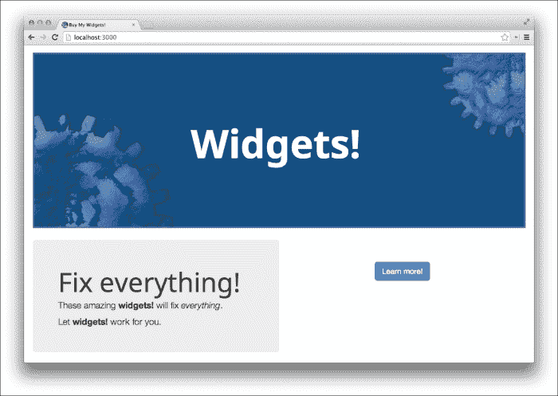

这张截图中的网页是**控制页面**。目前，我们从**了解更多**按钮上获得了 24%的点击率。

我们对按钮的文本感兴趣。如果它显示的是**立即订购**而不是**了解更多**，可能会产生更多的点击量。（当然，实际上解释产品是什么以及它解决了什么问题可能更有效，但不可能拥有一切。）这将是我们将要测试的**测试页面**，我们希望可以将点击率提高到 29%（绝对增加了 5%）。

现在我们有了两个版本的页面可以进行实验，我们可以从统计上构建实验，并确定我们需要为每个版本的页面招募多少受试者，以便在按钮上实现统计上有意义的点击率增加。

## 构建统计框架

首先，我们需要用**零假设检验**来构建我们的实验。在这种情况下，零假设可能看起来像这样：

> *将按钮文本从**了解更多**改为**立即订购**不会提高点击率。*

记住，这是我们希望在实验过程中试图推翻（或未能推翻）的陈述。

现在我们需要考虑样本量。这需要在事先确定。为了找到样本量，我们将使用标准误差公式，这将解决以获得大约 95%置信区间的观察数量，以便我们大致了解样本应该有多大：

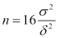

在这里，*δ* 是要检测的最小效应，*σ²* 是样本方差。如果我们正在测试类似点击率百分比增加的东西，方差是 *σ² = p(1 – p)*，其中 *p* 是控制页的初始点击率。

因此，对于这个实验，方差将是 *0.24(1-0.24)* 或 *0.1824*。这将使每个变量的样本量 *16(0.1824 / 0.05²)* 或几乎 *1170*。

在 Clojure 中计算这段代码相当简单：

```py
(defn get-target-sample [rate min-effect]
  (let [v (* rate (- 1.0 rate))]
    (* 16.0 (/ v (* min-effect min-effect)))))
```

从提示符中运行代码会给我们预期的响应：

```py
user=> (get-target-sample 0.24 0.05)
1167.36

```

计算所需参与者数量的部分原因是为了监控实验进度并提前终止实验可能会使测试结果无效，因为它增加了实验声称已经反驳了零假设但实际上并没有的风险。

这似乎有些不合逻辑，不是吗？一旦我们得到显著结果，我们应该能够停止测试。让我们来分析一下。

假设实际上控制页和测试页之间没有差异。也就是说，按钮的两组副本获得的大约相同的点击率。如果我们试图得到 *p ≤ 0.05*，那么这意味着测试将五次返回假阳性。它五次错误地说两个按钮的点击率之间存在显著差异。

假设我们在进行测试并计划招募 3,000 名受试者。我们最终会检查每 1,000 名受试者的结果。让我们分析一下可能会发生的情况：

| Run | A | B | C | D | E | F | G | H |
| --- | --- | --- | --- | --- | --- | --- | --- | --- |
| **1000** | No | No | No | No | Yes | Yes | Yes | Yes |
| **2000** | No | No | Yes | Yes | No | Yes | No | Yes |
| **3000** | No | Yes | No | Yes | No | No | Yes | Yes |
| **Final** | No | Yes | No | Yes | No | No | Yes | Yes |
| **Stopped** | No | Yes | Yes | Yes | Yes | Yes | Yes | Yes |

让我们阅读这个表格。每个字母列代表测试运行过程中结果显著性可能变化的场景。行代表已进行的观察数量。标有 *Final* 的行代表实验的真实完成结果，而标有 *Stopped* 的行代表实验一看到显著结果就停止的结果。

最终结果显示，在八个不同的场景中，最终结果在四种情况下（B、D、G 和 H）是显著的。然而，如果实验提前停止，那么在七种情况下（除了 A 之外的所有情况）将是显著的。测试可能会极大地产生假阳性。

实际上，大多数统计测试都假设在测试运行之前样本大小是固定的。

获得良好的结果令人兴奋，因此我们将设计我们的系统，使其无法轻易提前停止。我们将只是消除这种诱惑。

考虑到这一点，让我们考虑如何实施这个测试。

## 构建实验

实际上实施 A/B 测试有几个选项。我们将考虑其中几个，权衡它们的优缺点。最终，最适合您的选项实际上取决于您的具体情况。然而，我们将为这一章选择一个选项并使用它来实施测试。

### 考虑构建网站的选择

实施 A/B 测试的第一种方式是使用服务器端实现。在这种情况下，所有处理和跟踪都在服务器上完成，并且访客的行为将通过实验试图推动流量向其资源 URL 的 GET 或 POST 参数进行跟踪。

此过程的步骤可能如下所示：

1.  新用户访问网站并请求包含待测试按钮或复制的页面。

1.  服务器识别这是一个新用户，并为用户分配一个跟踪号。

1.  系统将用户分配到测试组中的一个。

1.  它在包含跟踪号和用户所属的测试组的数据库中添加一行。

1.  它将包含复写、图像或反映控制组或测试组的副本、图像或设计的页面返回给用户。

1.  用户查看返回的页面并决定是否点击按钮或链接。

1.  如果服务器收到对按钮或链接目标的请求，它将更新跟踪表中的用户行，以显示交互是成功的，即用户进行了点击或进行了购买。

这种处理方式将所有内容保持在服务器上，因此它允许您对如何进行实验有更多的控制和配置。

实现此功能的第二种方式是使用 JavaScript（或 ClojureScript，[`github.com/clojure/clojurescript`](https://github.com/clojure/clojurescript)）。在这种情况下，页面上的代码将随机决定用户属于控制组还是测试组，并将通知服务器实验中开始了一个新的观察。然后，它将使用适当的复写或图像更新页面。其余的大部分交互与上一个场景相同。然而，完整的步骤如下：

1.  新用户访问网站并请求包含待测试按钮或复制的页面。

1.  服务器将一些 JavaScript 插入页面以处理 A/B 测试。

1.  当页面正在渲染时，JavaScript 库为用户生成一个新的跟踪号。

1.  它将用户分配到测试组中的一个。

1.  它为用户所属的组渲染该页面，该组要么是对照组，要么是测试组。

1.  它通知服务器用户的跟踪号和组。

1.  服务器接收此通知并在数据库中为观察添加一行。

1.  浏览器中的 JavaScript 通过直接使用 AJAX 调用通知服务器或间接使用下一页 URL 中的 GET 参数来跟踪用户的下一步操作。

1.  服务器接收通知，无论其发送方式如何，都会更新数据库中的行。

这种方法的缺点是，让 JavaScript 处理实验的渲染可能会稍微慢一些，并可能影响实验。它也稍微复杂一些，因为需要更多部分进行通信。然而，好处是你可以创建一个 JavaScript 库，轻松地将一个小脚本标签放入页面，并立即运行一个新的 A/B 测试实验。

然而，实际上，你可能只是使用一个为你处理这些事情以及更多服务的服务。然而，了解他们为你提供的内容仍然是有意义的，这正是本章试图通过帮助你了解如何执行 A/B 测试来实现的，这样你就可以更好地利用这些 A/B 测试供应商和服务。

## 在服务器上实施 A/B 测试

为了本章的目的，我们将在服务器上实施 A/B 测试。

首先，我们将使用**Leiningen 2** ([`leiningen.org/`](http://leiningen.org/))和**Luminus Web 框架** ([`www.luminusweb.net/`](http://www.luminusweb.net/))创建一个新的项目。我们将包括一些选项来包含**H2 嵌入式数据库** ([`www.h2database.com/`](http://www.h2database.com/))和**ClojureScript 支持** ([`github.com/clojure/clojurescript`](https://github.com/clojure/clojurescript))。我们使用以下命令行来完成此操作：

```py
lein new luminus web-ab +h2 +cljs

```

此命令为网站创建脚手架。我们首先熟悉脚手架提供的内容，然后我们将使用核心网站填充网站的各个部分。接下来，我们将添加 A/B 测试，最后，我们将添加几个页面来查看结果。

### 理解构建的网站

Luminus 是一个通过组合其他库并将它们结合在一起构建的 Web 框架。对于数据库访问和模型，它使用 **Korma** ([`sqlkorma.com/`](http://sqlkorma.com/))。对于 HTML 模板，它使用 **Selmer** ([`github.com/yogthos/Selmer`](https://github.com/yogthos/Selmer))，这是一个 Django 风格模板的移植。对于路由、控制器、会话以及其他一切，它使用 **lib-noir** ([`yogthos.github.io/lib-noir/`](http://yogthos.github.io/lib-noir/)) 和 **Compojure** ([`github.com/weavejester/compojure/`](https://github.com/weavejester/compojure/))。

包含 Luminus 项目的目录中的所有内容都将是一组一致的子目录，这些子目录以项目命名。例如，在我们为这个项目创建的（`web-ab`）中，主要目录如下：

+   `resources` 是静态资源的目录。它包含网站的 CSS、JavaScript 和图像文件。

+   `src` 是 Clojure 文件的目录。这个目录树中的几个子目录也非常重要，所以我会单独列出它们。

+   `src/web_ab/models/` 是包含定义模型并与数据库交互的 Clojure 文件的目录。

+   `src/web_ab/routes/` 是列出 Web 应用程序路由的目录。这个目录下的每个模块都定义了网站特定子部分的路由和处理程序。

+   `src/web_ab/views/templates/` 是包含 Selmer 模板的目录。

+   `test/web_ab/test/` 是包含网站处理程序 `clojure.test` 测试的目录。

我们将主要处理 `src/web-ab/` 目录下的目录。我们将定义模型、定义路由和处理程序，并填写模板。

在我们工作的过程中，我们可以通过使用开发服务器来查看我们正在开发的网站。你可以使用以下 Leiningen 命令来启动它：

```py
lein ring server

```

一旦这个服务器执行，我们可以通过将浏览器指向 `http://localhost:3000/` 来查看网站。

## 构建测试网站

首先，我们需要为主页添加内容。我们将要更改的文件将位于 `src/web_ab/views/templates/home.html`。我们将向该页面添加以下 HTML 内容。（创建我们之前在截图中所看到的网站还涉及大量的 CSS 和图像。所有这些都在本章的代码下载中列出。）请看以下代码：

```py


<header id="banner" class="row">
  <div class="col-md-12">
    <h1 style="width: 4.5em;" class="center-block">Widgets!</h1>
  </div>
</header>
<div id="content" class="row">
  <div id="left-panel" class="col-md-6 jumbotron">
    <h1>Fix everything!</h1>
    <p>These amazing <strong>widgets!</strong> will fix
      <em>everything</em>.</p>
    <p>Let <strong>widgets!</strong> work for you.</p>
  </div>
  <div id="right-panel" class="col-md-6 jumbotron">
    <a href="/purchase/" id="btn-more"
       class="btn btn-primary btn-lg center-block">
      Learn more!
    </a>
  </div>
</div>

```

当需要添加 A/B 测试功能时，我们会稍作修改，但大部分内容都是好的。

如果用户想要购买小部件，我们还需要一个页面来引导他们。我们首先在 `src/web_ab/routes/home.clj` 文件中定义这个页面的路由。以下是这个路由和控制器：

```py
(defn purchase-page []
  (layout/render "purchase.html" {}))
(defroutes home-routes
  (GET "/" [] (home-page))
  (GET "/purchase/" [] (purchase-page)))
```

视图定义在`src/web_ab/views/templates/purchase.html`文件中。此文件与前面的模板文件非常相似，只是它简单得多。它只包含一个左面板的感谢信息，右侧没有按钮或链接。有关此页面的更多详细信息，请参阅代码下载。


事实上，这已经足够定义本项目的基础，控制站点。现在让我们看看我们需要做什么来定义 A/B 测试功能。

## 实施 A/B 测试

将 A/B 测试添加到我们迄今为止拥有的站点将非常直接的网络开发。我们需要定义一个模型和实现测试框架基本功能的函数。然后我们可以将它们集成到站点的现有控制器和视图中：

1.  定义数据和数据库设置的代码将放入`src/web_ab/models/schema.clj`文件中。它将以下列命名空间声明开始：

    ```py
    (ns web-ab.models.schema
      (:require [clojure.java.jdbc :as sql]
                [noir.io :as io]))
    ```

1.  我们将在本节定义的第一个方面是模型。我们将在数据库模式中添加一个表来跟踪 A/B 参与者：

    ```py
    (defn create-abtracking-table []
      (sql/with-connection db-spec
        (sql/create-table :abtracking
          [:id "INTEGER IDENTITY"]
          [:testgroup "INT NOT NULL"]
          [:startat "TIMESTAMP NOT NULL DEFAULT NOW()"]
          [:succeed "TIMESTAMP DEFAULT NULL"])))
    ```

1.  现在，在`src/web_ab/models/db.clj`文件中，我们将定义一些低级函数来处理该表中的行。对于此文件，我们将使用以下命名空间声明：

    ```py
    (ns web-ab.models.db
      (:use korma.core
            [korma.db :only (defdb)])
      (:require [web-ab.models.schema :as schema]
                [taoensso.timbre :as timbre]))
    ```

1.  该命名空间中的第一个函数将接受一个组关键字（`:control` 或 `:test`）并将一行插入数据库，该行包含代表该组的代码以及起始时间（当前时间）和交互成功时间的默认值（`NULL`）：

    ```py
    (defn create-abtracking [group]
      (get (insert abtracking
                   (values [{:testgroup (group-code group)}]))
           (keyword "scope_identity()")))
    ```

1.  接下来，我们将创建一个函数，将`abtracking`对象的`succeed`字段设置为当前时间。这将标记交互为成功：

    ```py
    (defn mark-succeed [id]
      (update abtracking
              (set-fields {:succeed (sqlfn :now)})
              (where {:id id})))
    ```

这些，以及你可以在本章代码下载中找到的几个其他函数，将形成一个与该数据表的低级接口。然而，大多数时候，我们将使用稍微高级一点的接口来处理 A/B 测试。

此接口将位于`src/web_ab/ab_testing.clj`文件中。它将包含以下命名空间声明：

```py
(ns web-ab.ab-testing
  (:require [noir.cookies :as c]
            [taoensso.timbre :as timbre]
            [web-ab.models.db :as db]
            [incanter.stats :as s]
            [clojure.set :as set]
            [web-ab.util :as util])
  (:import [java.lang Math]))
```

要理解此模块中的代码，我们首先需要谈谈 A/B 测试系统将如何工作。我们需要确保以下要求得到实现：

+   如果用户在 A/B 测试之前访问过该网站，他们应该看到网站的控件版本。我们假设已经使用了一个跟踪 cookie。在这种情况下，cookie 将被命名为*visits*，它将简单地跟踪用户访问网站主页的次数。

+   如果这是用户第一次访问该网站，他们将被随机分配到控制组或测试组，并显示该组的适当页面。此外，他们还将收到一个跟踪 cookie，以观察他们，我们将为他们插入数据库中的跟踪信息。

+   如果用户之前访问过网站并且是 A/B 测试的参与者，他们应该看到之前看到的相同版本的网站。

+   最后，当实验参与者访问购买页面时，实验中的观察结果将被标记为成功。

我们将为这些情况中的大多数编写函数，以及一个函数，用于在访问主页时将用户路由到正确的分支。我们还将编写另一个函数来处理第四项。

对于第一个函数，我们将实现启动实验中新的观察所需的内容。我们将函数输入数据库并插入跟踪 cookie 到会话中：

```py
(defn new-test [test-cases]
  (let [[group text] (rand-nth (seq test-cases))
        ab-tracking (db/get-abtracking
                      (db/create-abtracking group))]
    (c/put! :abcode (:id ab-tracking))
    text))
```

`db` 命名空间中的函数（从 `web-ab.models.db` 别名）来自我们刚刚定义的低级模型接口。实际上，`create-abtracking` 的实现列在前面页面。

`c/put!` 函数来自 `noir.cookies` 命名空间。它将 cookie 值插入会话中。在这种情况下，它将跟踪实例的数据库 ID 插入到 `abcode` 键下。

最后，`new-test` 返回应在页面上使用的文本。

在这个抽象级别的下一个函数是 `get-previous-copy`。这个函数在用户已经是实验参与者并再次访问页面时使用。它接受一个数据库 ID 和当前测试中使用的网站的不同版本，并从数据库中检索行，根据观察是在控制组还是测试组，查找要在页面上使用的正确副本文本：

```py
(defn get-previous-copy [ab-code test-cases]
  (-> ab-code
    db/get-abtracking
    :testgroup
    db/code->group
    test-cases))
```

这个函数只是将输入通过一系列转换。首先，这个函数根据数据库 ID 将其转换为完整的数据行元组。接下来，它选择 `testgroup` 字段，并将其转换为组关键字。最后，根据组关键字将文本转换为页面上适当的文本。

我们接下来要查看的下一个函数将前两个函数与前面列表中的第一项（返回访客在没有进入实验的情况下显示控制页面）结合起来：

```py
(defn start-test [counter default test-cases]
  (let [c (Long/parseLong (c/get counter "0"))
        ab-code (get-abcode-cookie)]
    (c/put! counter (inc c))
    (cond
      (and (>= ab-code 0) (> c 0))
      (get-previous-copy ab-code test-cases)

      (and (< ab-code 0) (> c 0)) default

      :else (new-test test-cases))))
```

首先，这个函数期望三个参数：计数器的 cookie 名称、控制页面的默认文本以及从组关键字到页面文本的映射。这个函数查看计数器 cookie 和 *abtest* cookie 的值，如果它们未设置，这两个值都将为 `-1` 或 `0`，并决定向用户显示什么以及需要插入数据库的内容。

在前面的代码片段中，我们可以看到我们刚刚查看的两个函数的调用在代码列表中被突出显示。

此外，我们在这里定义了一个函数，用于查找 *abtest* 钩子，如果找到，则将其标记为成功，如下所示：

```py
(defn mark-succeed []
  (let [ab-code (get-abcode-cookie)]
    (when (> ab-code -1)
      (db/mark-succeed ab-code))))
```

最后，一旦实验结束，我们需要执行分析，以确定控制页面是否表现更好还是测试页面：

```py
(defn perform-test
  ([ab-testing] (perform-test ab-testing 0.05))
  ([ab-testing p]
   (let [groups (group-by-group ab-testing)
         t (-> (s/t-test (to-flags (:test groups))
                         :y (to-flags (:control groups))
                         :alternative :less)
             (select-keys [:p-value :t-stat
                           :x-mean :y-mean :n1 :n2])
             (set/rename-keys {:x-mean :test-p,
                               :y-mean :control-p,
                               :n1 :test-n,
                               :n2 :control-n}))]
     (assoc t
            :p-target p
            :significant (<= (:p-value t) p)))))
```

为了执行实际分析，我们使用来自**Incanter**库（[`incanter.org/`](http://incanter.org/)）的`incanter.stats`中的 t-test 函数。我们将在本章后面更详细地介绍这种分析。现在，让我们只关注数据如何通过此函数流动。`t-test`函数返回一个包含许多数字的映射。对于输出，我们需要选择一些这些信息，并为我们将使用的一些数据重命名键。我们使用核心的`select-keys`函数来选择我们需要的所有信息，并使用`clojure.set`/`rename-keys`以更好地适应我们当前领域的方式为其余的名称提供更好的命名。

对于分析结果，我们还将添加一些其他数据。其中之一将是 alpha 值，即我们试图改进的 p 的目标值。另一个取决于结果是否具有显著性。这是通过将 p 的值与我们要达到的显著性水平进行比较来确定的。

在 A/B 测试过程的低级和高级接口就绪后，我们可以将注意力转向实际使用它。首先，我们需要更新主页视图模板，从前面代码片段中列出的内容。

记住，文件位于`src/web_ab/views/templates/home.html`。我们只想简单地更改链接的名称，以便跳转到购买页面。它需要是一个我们可以用来向模板插入值的参数。例如，以下代码片段包含右侧面板的更新版本，包括我们可以用来将文本插入页面的突出显示行：

```py
  <div id="right-panel" class="col-md-6 jumbotron">
    <a href="/purchase/" id="btn-more"
       class="btn btn-primary btn-lg center-block">
      {{button}}
    </a>
  </div>
```

控制器也需要进行更改。它们需要触发测试参与者的生命周期中的适当阶段，并且需要将按钮文本传递到模板中。

首页的控制器将此操作作为表单的一部分来完成。它调用`start-test`，并直接使用其输出构建模板参数。以下是对控制器此新增功能的突出显示：

```py
(defn home-page []
  (layout/render
    "home.html"
    {:button (ab/start-test :visits default-button test-cases)}))
```

购买页面的控制器只是在其正常流程中调用`mark-succeed`：

```py
(defn purchase-page []
  (ab/mark-succeed)
  (layout/render "purchase.html" {}))
```

到目前为止，一切准备就绪，可以实际进行测试；然而，我们无法知道何时结束或查看结果。我们可以在下一阶段添加此网站的部分。

## 查看结果

我们将在网站的单独部分添加 A/B 测试结果的视图作为单独的页面。它将使用与 A/B 测试的其余部分相同的`abtracking`模型，但我们将定义更多的控制器和视图。

该网站这部分的主要特点之一是我们不希望在测试完成之前显示某些信息。为了决定这一点，我们首先定义一个映射，指定我们需要每个组多少个观测值：

```py
(def target-counts {:control 1200, :test 1200})
```

我们可以使用这些值来定义一个谓词，以测试是否已注册足够的参与者以调用实验完成。它从数据库中读取参与者并将他们按实验组分类。它将这些组的计数与目标计数进行比较：

```py
(defn is-over?
  ([] (is-over? (ab/get-ab-tracking)))
  ([ab-tracking]
   (let [{:keys [control test]} (ab/group-by-group ab-tracking)]
     (and (>= (count control) (:control target-counts))
          (>= (count test) (:test target-counts))))))
```

我们可以利用这一点更进一步。我们将定义一个函数，该函数接受来自`abtracking`表的行列表和一个渲染页面的函数。它测试实验是否已执行。如果已完成，它将处理传递给该函数。如果没有完成，它将显示一个标准页面，通知用户实验尚未完成：

```py
(defn when-is-over [ab-tracking f]
  (if (is-over? ab-tracking)
    (f ab-tracking)
    (let [{:keys [control test]} (ab/group-by-group ab-tracking)]
      (layout/render
        "ab-testing-not-done.html"
        {:counts {:control (count control)
                  :test (count test)}
         :targets target-counts
         :complete {:control (ab/pct (count control)
                                     (:control target-counts))
                    :test (ab/pct (count test)
                                  (:test target-counts))}}))))
```

现在，有了这些实用工具，我们可以定义几个页面。第一个将列出`abtracking`表中的参与者。您可以在代码下载中找到控制器函数和视图模板。两者都相对简单。

另一个则稍微有趣一些，原因有几个。首先，它使用了我们刚刚看到的`when-is-over`函数，其次，它执行统计测试以确定控制页面是否表现更好或测试页面：

```py
(defn grid []
  (when-is-over
    (ab/get-ab-tracking)
    (fn [ab-tracking]
      (let [by-group-outcome (ab/assoc-grid-totals
                               (ab/get-results-grid ab-tracking))
            stats (ab/perform-test ab-tracking 0.05)]
        (layout/render "ab-testing-grid.html"
                       {:grid by-group-outcome,
                        :stats (sort (seq stats))
                        :significant (:significant stats)})))))
```

如前所述，此函数使用我们刚刚定义的`when-is-over`函数来绕过此页面并显示一个标准页面，该页面仅说明实验尚未完成。

突出的统计测试调用我们之前提到的`perform-test`函数。

此模板主要在网格中显示结果。它还在页面顶部有一个彩色警报，指示控制组是否表现更好或测试组。

### 以用户视角看待 A/B 测试

现在所有部分都已就绪，让我们回顾一下用户与网站的互动。大多数访问您网站的人不会知道有网站的两个不同版本，因此他们应该像平时一样与您的网站互动。

当用户首次访问您的网站时，他们应该看到以下屏幕。右下角按钮上的文本可能不同，但其余部分对每个人来说都应该是相同的。


一旦用户点击**了解更多**（在这种情况下），他们完成购买，所有用户都应该看到以下页面：


然而，更有趣的部分不是用户发生的事情，而是在我们能够查看和分析结果之后的后续情况。我们将在下一节中看到一些关于此的细节。

## 分析结果

显然，我们不可能让几千人访问我们的网站并购买小部件。作为实际参与者的替代，我在数据库中填充了随机数据。这应该允许我们看到网站的分析部分是如何工作的以及它的含义。

在整个实验过程中，我们可以通过访问本地开发服务器上的`http://localhost:3000/ab-testing/`来获取参与者列表。这允许我们跟踪实验的进度，而无需真正深入了解结果，也无需直接访问计数。

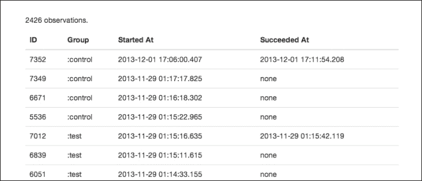

当实验进行时，我们并不真的希望得到比这个页面显示的更多信息。这就是我们之前看到的`when-is-over`函数发挥作用的地方。当我们之前访问页面时，实验中有足够的参与者，然后我们得到了一个页面，解释说实验尚未完成，并给出了一些关于实验还需要进行多长时间的指示。

例如，以下截图包含了我们在实验的这个阶段想要提供的几乎所有信息：

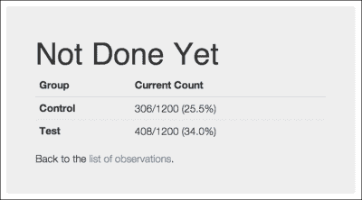

当然，一旦实验完成，我们希望能够看到最终结果，包括结果是否允许我们拒绝零假设，也就是说，测试组是否以统计显著的方式比对照组表现更好。

因此，当实验完成后，我们得到以下页面：

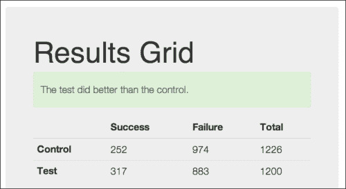

这个页面还包括更多信息。以下是一个包含其余数据和它们简要说明的表格。我们将在下一节中更详细地讨论它们，其中我们将讨论 t 检验。

| 名称 | 值 | 说明 |
| --- | --- | --- |
| :control-mean | 252 | 对照组的平均值。 |
| :control-n | 1226 | 对照组中的观察值数量。 |
| :control-p | 0.20555 | 对照组的转化率。 |
| :control-variance | 200.20228 | 对照组的方差。 |
| :df | 2401.10865 | 自由度。 |
| :p-target | 0.05 | 测试的 alpha 值：测试的最大 p 值。 |
| :p-value | 0.00000 | t 检验的实际 p 值。 |
| :se | 0.59806 | 标准误差。 |
| :significant | TRUE | 检查结果是否具有统计学意义 |
| :t-value | 108.68414 | t 检验的结果。 |
| :test-mean | 317.00000 | 测试组的平均值。 |
| :test-n | 1200 | 测试组中的观察值数量。 |
| :test-p | 0.26417 | 测试组的转化率。 |
| :test-variance | 233.25917 | 测试组的方差。 |

这些值在页面下方另一个表格中给出。为了更好地理解统计值，让我们更深入地了解我们到底使用了哪种测试。

### 理解 t 检验

首先，我们需要了解我们正在进行的测试的统计性质。

基本上，实验相当简单；每个观察值有两种结果之一。在许多方面，这是一系列抛硬币的过程。每次抛掷可以是正面或反面。每个站点交互可以成功或失败。

这种类型的值被称为二项随机变量。它可以取两个值之一，这些值根据一组概率而变化。二项随机变量必须满足一些假设：

+   观察的数量是固定的（*n*）。

+   每个观察结果将有两种可能的结果之一。

+   n 个观察结果是独立的，也就是说，一个观察结果的结果不会以任何方式影响其他观察结果的概率。

+   结果的概率在时间上保持恒定，也就是说，结果 X 的概率（*P(X)*）将始终是，比如说，0.5。你很容易在实验设计中违反这一点，通过连续运行控制页面和测试页面而不是同时运行它们。如果它们没有一起运行，一个页面可能在较忙的时候被使用以获得更好的结果。

二项随机变量的一个常见例子是测试抛硬币。让我们以此作为第一个例子，然后我们将把所学应用到我们的 A/B 测试中。

#### 测试抛硬币

具体来说，我们将有一个我们知道是公平的硬币，我们将测试另一个我们怀疑对其有偏见的硬币。零假设是两个硬币之间没有差异，并且它们都是真实的。

以下步骤展示了这个实验如何满足二项测试的假设：

1.  我们将分别抛掷每个硬币 100 次。

1.  每次抛硬币（每个观察结果）可以是正面或反面。

1.  每次抛硬币都是独立的。它的概率不会受到其他任何抛硬币概率的影响。

1.  正面或反面的概率不会随时间改变。在整个测试过程中，正面（P(正面)）和反面（P(反面)）的概率将是 0.5，或者对于真正的硬币来说至少是如此。

首先，让我们思考当我们抛掷真实的硬币时会发生什么。我们知道 P(正面) = 0.5。理论上，每次我们抛掷硬币 100 次，我们预计会得到 50 次正面和 50 次反面。当然，现实生活中并不总是这样。有时，我们可能会得到 57 次正面和 43 次反面。有时，我们可能会得到 44 次正面和 56 次反面。在极其罕见的情况下，我们可能会得到 100 次正面而没有反面。抛硬币的分布将形成一个二项分布，这是一系列是/否实验中的成功次数；然而，当抛硬币的次数接近无穷大时，所有这些情况的可能性可以近似为围绕理论预期概率 50 次正面和 50 次反面的正态分布。

对于这个实验，让我们假设我们抛掷了一个真实的硬币 100 次，并且得到 53 次正面。

现在，让我们思考当我们抛掷另一枚硬币时会发生什么。它可能是真实的，也可能是有偏见的。如果它是有偏见的，我们不知道它偏了多少。所以，当我们抛掷它 100 次，并且得到 58 次正面时，我们不知道这是否是因为 P(正面) = 0.58，还是因为 P(正面) = 0.5，P(正面) = 0.6，或者其他什么，并且我们在正态分布上稍微偏离了这个结果。

因此，我们在这里关注两件事。首先，我们关注两个概率之间的差异。或者，用实验的术语来说，我们关注均值之间的差异。我们想知道 0.53 和 0.58（0.05）之间的差异是否显著。以下图表以连续形式说明了我们正在观察的关系。当然，这里的数据是离散的，但连续图使关系更加清晰。

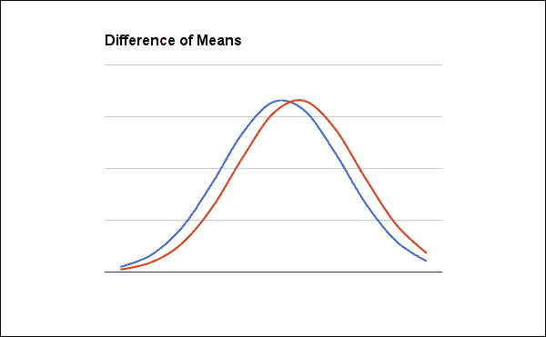

二项随机变量的期望成功次数由以下公式给出：

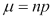

对于二项变量样本均值的 Clojure 代码同样简单明了：

```py
(defn binomial-mean [coll] (reduce + 0.0 coll))
```

因此，对于对照组（已知为真硬币的硬币），平均值为 53，而对于测试组（可能存在偏差的硬币），平均值为 58。

为了回答差异是否显著，我们还必须关注另一件事：我们可能是错误的可能。我们可以假设实际均值与实际处理的数据略有不同，但它们偏离了多少？

为了回答这个问题，我们需要能够计算我们数据的标准误差。给定一个正态分布，出现如此大的偏差以至于给出错误结果的概率是多少？为了回答这个问题，我们需要了解分布的方差有多大，也就是说，分布图曲线有多宽。

就像均值一样，二项随机变量的方差相当简单。

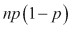

这个 Clojure 函数稍微复杂一些，但仍然清晰：

```py
(defn binomial-variance [coll]
  (let [n (count coll),
        p (/ (count (remove zero? coll)) n)]
    (* n p (- 1.0 p))))
```

这给出了 24.91 和 24.36 的方差。

通过方差，我们可以计算差异的标准误差。这是所有样本均值的标准差的估计，它让我们对均值可能偏离的程度有一个大概的了解，考虑到数据的变异性和我们观察的数据量。以下是这个公式的计算：

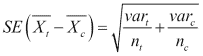

Clojure 中的标准误差函数如下：

```py
(defn binomial-se [coll-t coll-c]
  (Math/sqrt (+ (/ (binomial-variance coll-t) (count coll-t))
                (/ (binomial-variance coll-c) (count coll-c)))))
```

对于抛硬币实验，我们的标准误差是 0.702。

我们最终得到了**t 值**。这衡量了均值之间的差异，并按组的变化性进行了缩放。

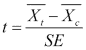

就像公式一样，Clojure 函数也是基于我们刚刚定义的所有函数构建的：

```py
(defn binomial-t-test [coll-t coll-c]
  (/ (- (binomial-mean coll-t) (binomial-mean coll-c))
     (binomial-se coll-t coll-c)))
```

因此，我们抛硬币实验的 t 值是 7.123。

这个公式的输出值遵循 t 分布。这非常类似于正态分布，但峰值更小，尾部更重。然而，随着自由度的增加，它越来越接近正态分布。你可以使用 t 分布的累积密度函数或查找表格来查找这个数字的 p 值。

我们将使用 Incanter 的累积分布函数来查找特定 t 值的概率。为了计算这个值，我们需要计算测试的自由度。当两组的方差相等时，公式很简单。然而，对于这种情况，这种情况很少发生。对于不等方差，我们将使用 Welch-Satterthwaite 方程。它有点复杂，但这是我们必须要处理的。

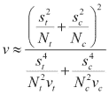

在这个公式中，*s²* 是方差，*N* 是样本大小，*v* 是 *N-1*。

这个 Clojure 代码仅略复杂一些：

```py
(defn degrees-of-freedom [coll-t coll-c]
  (let [var-t (binomial-variance coll-t), n-t (count coll-t),
        var-c (binomial-variance coll-c), n-c (count coll-c)]
    (/ (Math/pow (+ (/ var-t n-t) (/ var-c n-c)) 2)
       (+ (/ (* var-t var-t) (* n-t n-t (dec n-t)))
          (/ (* var-c var-c) (* n-c n-c (dec n-c)))))))
```

现在，从 REPL 中，我们可以测试抛硬币测试是否可以拒绝零假设，即第二个硬币是否有偏差：

```py
user=> (require '[web-ab.ab-testing :as ab])
nil
user=> (require '[incanter.stats :as s])
nil
user=> (def group-c (take 100 (concat (repeat 53 1) (repeat 0))))
#'user/group-c
user=> (def group-t (take 100 (concat (repeat 58 1) (repeat 0))))
#'user/group-t
user=> (s/cdf-t (ab/binomial-t-test group-t group-c)
 :df (ab/degrees-of-freedom t c))
9.553337936305223E-12

```

因此，我们可以看到，在抛硬币的情况下，硬币实际上是有偏差的，并且偏差显著。

## 测试结果

让我们将同样的过程再次应用到我们刚刚进行的 A/B 测试中。这将帮助我们了解前表中统计数据的来源：

1.  首先，我们将通过从每个组中获取观察次数和成功次数来创建数据集：

    ```py
    user=> (def c (take 1226 (concat (repeat 252 1.0)
     (repeat 0.0))))
    #'user/c
    user=> (def t (take 1200 (concat (repeat 317 1.0)
     (repeat 0.0))))
    #'user/t

    ```

1.  现在，我们可以计算每个组的平均值和方差：

    ```py
    user=> (ab/binomial-mean t)
    317.0
    user=> (ab/binomial-variance t)
    233.25916666666666
    user=> (ab/binomial-mean c)
    252.0
    user=> (ab/binomial-variance c)
    200.20228384991844

    ```

1.  这允许我们找到标准误差：

    ```py
    user=> (ab/binomial-se t c)
    0.5980633502426848

    ```

1.  最后，我们可以得到 t 值、自由度和 p 值。

    ```py
    user=> (ab/binomial-t-test t c)
    108.68413851747313
    user=> (ab/degrees-of-freedom t c)
    2401.108650831878
    user=> (s/cdf-t *2 :df *1)
    1.0

    ```

这给出了测试结果并非随机发生的概率。我们希望这个概率超过 0.95，而且它们确实如此。

如果这些数据是自然发生的，非常高的 p 值让我们怀疑我们可能有一个**第一类错误**或假阳性。然而，在这种情况下，数据并不是完全随机生成的。在代码下载中，我已经将这些合并成一个函数，该函数被调用来执行统计测试。这是用于生成结果页面表格数据的工具。

# 摘要

在本章中，我们看到了如何构思、创建和分析 A/B 测试的结果。

这些统计数据本身实际上是我们在第七章中看到的零假设检验的延续，*零假设检验 – 分析犯罪数据*。A/B 测试提供了一个很好的、完整的、有用的例子，说明了使用零假设检验的工作流程，以及它在决策制定中提供的力量和帮助。

这允许我们使用一种标准且广泛使用的方法来测试网站上哪些变化能驱动更多互动，并使我们能够更好地识别和为网站用户提供服务。它允许我们以结构化和可测试的方式决定网站的改变。

当然，实际上我们可能更倾向于使用现有的服务。市面上有各种各样的服务，从基础免费服务如 Google Analytics Content Experiments，到功能齐全的付费服务，这些服务涵盖了 A/B 测试的所有方面，例如**Optimizely**、**Visual Website Optimizer**或**Maxymiser**。然而，了解 A/B 测试的涉及内容以及最佳实践意味着我们可以更好地评估和使用这些服务，从而更有效地从中获益。

在下一章中，我们将探讨将数据分析应用于 Web 的另一个部分；我们将通过分析**Stackoverflow**([`stackoverflow.com/`](http://stackoverflow.com/))数据中的参与模式来了解人们如何在社交网站上参与。
